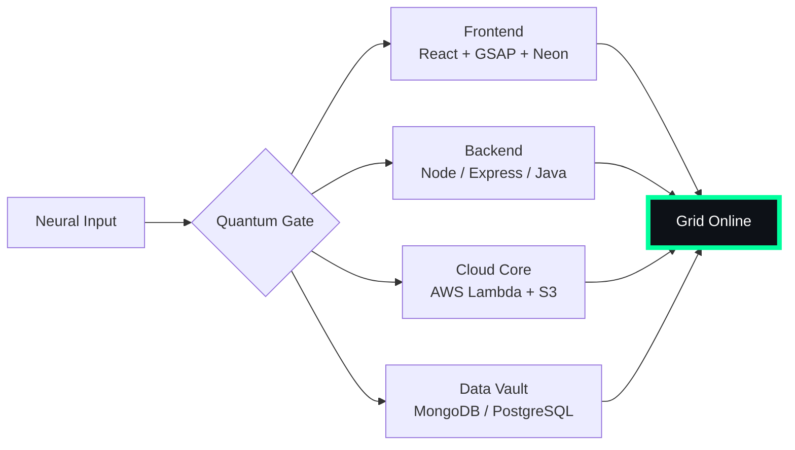

# 🌌 [ NEURAL CORE ACCESS: PENDEMVAMSI ]

<p align="center">
  
</p>

<div align="center">
  
  <br><small>Active Protocol: <strong style="color:#00FF9D">MATRIX RAIN</strong> 💾🌧️</small>
</div>

## 🔵 NEURAL STATUS READOUT
```text
SUBJECT ID    →  PENDEMVAMSI
ENTITY CLASS  →  SHADOW MONARCH v9
NEURAL RANK   →  B-TIER
GRID SYNC     →  1399/15058 QUANTUM PACKETS
─────── BIO-METRICS (MATRIX RAIN) ───────
STRENGTH      149  ███████████████████░░
AGILITY       128  █████████████████░░░░
INTELLIGENCE  155  ████████████████████░
VITALITY      116  ███████████████░░░░░░
```

> **NEURAL BURST ACQUIRED:** +125 QUANTUM PACKETS 
> **SYSTEM MESSAGE:** SHADOW EXTRACTION COMPLETE — ALL HAIL THE MONARCH

---

## 🌀 GRID ARCHITECTURE (HOLOGRAPHIC RENDER)



---

## 📡 ACADEMIC NODES – CONQUERED
- [x] B.Tech Neural Engineering (2020–2024) – St. Ann’s Grid
- [x] Intermediate Quantum Core (2018–2020) – Sri Medhavi
- [x] SSC Primary Link (2017–2018) – Sri Geethanjali

---

## ⚡ SKILL NEURAL MATRIX

<details open>
<summary>🔌 ACTIVE NEURAL LINKS</summary>

| Node               | Tier | Integrity Bar                | Status      |
|--------------------|------|------------------------------|-------------|
| Java Core          | S    | ████████████████████ 100%   | OVERCLOCKED |
| Node.js Grid       | S    | ████████████████████ 100%   | OVERCLOCKED |
| React Holo-UI      | A+   | █████████████████░░░ 92%    | ONLINE      |
| AWS Quantum Relay  | S    | ████████████████████ 100%   | SOVEREIGN   |
| Python AI Kernel   | A    | ████████████████░░░░ 85%    | CHARGING    |
| DSA Void Algorithm | A    | █████████████████░░░ 90%    | ACTIVE      |

</details>

---

## 🏅 NEURAL ACHIEVEMENT TOKENS

<p align="center">
  
  
  
  
</p>

---

## 👾 SHADOW ENTITIES – SUMMONED

<p align="center">
  
  <br><strong style="color:#00FF9D">ARISE.</strong>
</p>

| Entity | Designation   | Class            | Source Node                     |
|--------|---------------|------------------|---------------------------------|
| SH-01  | Igris         | Void Commander   | AI Financial Oracle             |
| SH-02  | Beru          | Swarm Overlord   | WebRTC Quantum Stream           |
| SH-03  | Kaisel        | Void Wyrm        | Geolocation Shadow Relay        |
| SH-04  | Tusk          | Arcane Construct | Global Pandemic Sentinel        |
| SH-05  | Iron          | Armored Bastion  | React Crypto Fortress           |

---

## 📡 GRID ANALYTICS (LIVE FEED)

<p align="center">
  
  <br>
  
  
</p>

---

## 🖥️ CORRUPTED MAINFRAME LOG (401 ENTRIES)

<details>
<summary>OPEN TERMINAL FEED – PROTOCOL: MATRIX RAIN</summary>

> [0x25FF6DBB] 💾🌧️ **MATRIX RAIN PROTOCOL** #0 | NEURAL LINK STABILIZED | [TRANSMISSION SUCCESS]
> [0xDB91A712] 💾🌧️ **MATRIX RAIN PROTOCOL** #1 | NEURAL LINK STABILIZED | [TRANSMISSION SUCCESS]
> [0x867075CD] 💾🌧️ **MATRIX RAIN PROTOCOL** #2 | NEURAL LINK STABILIZED | [TRANSMISSION SUCCESS]
> [0x42DD79F6] 💾🌧️ **MATRIX RAIN PROTOCOL** #3 | NEURAL LINK STABILIZED | [TRANSMISSION SUCCESS]
> [0x0C629C1D] 💾🌧️ **MATRIX RAIN PROTOCOL** #4 | NEURAL LINK  [GLITCH DETECTED] STABILIZED | [TRANSMISSION SUCCESS]
> [0x46B8C568] 💾🌧️ **MATRIX RAIN PROTOCOL** #5 | NEURAL LINK STABILIZED | [TRANSMISSION SUCCESS]
> [0xBD7B9D94] 💾🌧️ **MATRIX RAIN PROTOCOL** #6 | NEURAL LINK STABILIZED | [TRANSMISSION SUCCESS]
> [0xFB71D0EA] 💾🌧️ **MATRIX RAIN PROTOCOL** #7 | NEURAL LINK STABILIZED | [TRANSMISSION SUCCESS]
> [0x52D5413A] 💾🌧️ **MATRIX RAIN PROTOCOL** #8 | NEURAL LINK STABILIZED | [TRANSMISSION SUCCESS]
> [0x80084691] 💾🌧️ **MATRIX RAIN PROTOCOL** #9 | NEURAL LINK STABILIZED | [TRANSMISSION SUCCESS]
> [0x916A695B] 💾🌧️ **MATRIX RAIN PROTOCOL** #10 | NEURAL LINK STABILIZED | [TRANSMISSION SUCCESS]
> [0x197A0196] 💾🌧️ **MATRIX RAIN PROTOCOL** #11 | NEURAL LINK STABILIZED | [TRANSMISSION SUCCESS]
> [0x53DBE408] 💾🌧️ **MATRIX RAIN PROTOCOL** #12 | NEURAL LINK STABILIZED | [TRANSMISSION SUCCESS]
> [0x4383CE4D] 💾🌧️ **MATRIX RAIN PROTOCOL** #13 | NEURAL LINK STABILIZED | [TRANSMISSION SUCCESS]
> [0x05849BDF] 💾🌧️ **MATRIX RAIN PROTOCOL** #14 | NEURAL LINK STABILIZED | [TRANSMISSION SUCCESS]
> [0x5A1B53B8] 💾🌧️ **MATRIX RAIN PROTOCOL** #15 | NEURAL LINK STABILIZED | [TRANSMISSION SUCCESS]
> [0x6617EDE0] 💾🌧️ **MATRIX RAIN PROTOCOL** #16 | NEURAL LINK STABILIZED | [TRANSMISSION SUCCESS]
> [0x6D83D37F] 💾🌧️ **MATRIX RAIN PROTOCOL** #17 | NEURAL LINK STABILIZED | [TRANSMISSION SUCCESS]
> [0xB8C6A772] 💾🌧️ **MATRIX RAIN PROTOCOL** #18 | NEURAL LINK STABILIZED | [TRANSMISSION SUCCESS]
> [0x51AECBD3] 💾🌧️ **MATRIX RAIN PROTOCOL** #19 | NEURAL LINK STABILIZED | [TRANSMISSION SUCCESS]
> [0x8A69A1D8] 💾🌧️ **MATRIX RAIN PROTOCOL** #20 | NEURAL LINK STABILIZED | [TRANSMISSION SUCCESS]
> [0x0D092C1A] 💾🌧️ **MATRIX RAIN PROTOCOL** #21 | NEURAL LINK STABILIZED | [TRANSMISSION SUCCESS]
> [0x89769D9F] 💾🌧️ **MATRIX RAIN PROTOCOL** #22 | NEURAL LINK  [GLITCH DETECTED] STABILIZED | [TRANSMISSION SUCCESS]
> [0x78F15E1C] 💾🌧️ **MATRIX RAIN PROTOCOL** #23 | NEURAL LINK  [GLITCH DETECTED] STABILIZED | [TRANSMISSION SUCCESS]
> [0x465C8D8F] 💾🌧️ **MATRIX RAIN PROTOCOL** #24 | NEURAL LINK  [GLITCH DETECTED] STABILIZED | [TRANSMISSION SUCCESS]
> [0xD83C1683] 💾🌧️ **MATRIX RAIN PROTOCOL** #25 | NEURAL LINK STABILIZED | [TRANSMISSION SUCCESS]
> [0x880DC297] 💾🌧️ **MATRIX RAIN PROTOCOL** #26 | NEURAL LINK STABILIZED | [TRANSMISSION SUCCESS]
> [0x4E182CFE] 💾🌧️ **MATRIX RAIN PROTOCOL** #27 | NEURAL LINK STABILIZED | [TRANSMISSION SUCCESS]
> [0xA557E538] 💾🌧️ **MATRIX RAIN PROTOCOL** #28 | NEURAL LINK STABILIZED | [TRANSMISSION SUCCESS]
> [0xD51316D0] 💾🌧️ **MATRIX RAIN PROTOCOL** #29 | NEURAL LINK STABILIZED | [TRANSMISSION SUCCESS]
> [0x4E584AAA] 💾🌧️ **MATRIX RAIN PROTOCOL** #30 | NEURAL LINK  [GLITCH DETECTED] STABILIZED | [TRANSMISSION SUCCESS]
> [0x2EFB9D03] 💾🌧️ **MATRIX RAIN PROTOCOL** #31 | NEURAL LINK  [GLITCH DETECTED] STABILIZED | [TRANSMISSION SUCCESS]
> [0x7BD8136E] 💾🌧️ **MATRIX RAIN PROTOCOL** #32 | NEURAL LINK STABILIZED | [TRANSMISSION SUCCESS]
> [0x5978B165] 💾🌧️ **MATRIX RAIN PROTOCOL** #33 | NEURAL LINK STABILIZED | [TRANSMISSION SUCCESS]
> [0x6113AA5C] 💾🌧️ **MATRIX RAIN PROTOCOL** #34 | NEURAL LINK STABILIZED | [TRANSMISSION SUCCESS]
> [0x517DB524] 💾🌧️ **MATRIX RAIN PROTOCOL** #35 | NEURAL LINK STABILIZED | [TRANSMISSION SUCCESS]
> [0x0183D078] 💾🌧️ **MATRIX RAIN PROTOCOL** #36 | NEURAL LINK  [GLITCH DETECTED] STABILIZED | [TRANSMISSION SUCCESS]
> [0xB53E84B9] 💾🌧️ **MATRIX RAIN PROTOCOL** #37 | NEURAL LINK STABILIZED | [TRANSMISSION SUCCESS]
> [0x78D9D406] 💾🌧️ **MATRIX RAIN PROTOCOL** #38 | NEURAL LINK  [GLITCH DETECTED] STABILIZED | [TRANSMISSION SUCCESS]
> [0x81A6DC36] 💾🌧️ **MATRIX RAIN PROTOCOL** #39 | NEURAL LINK STABILIZED | [TRANSMISSION SUCCESS]
> [0xD0838AF5] 💾🌧️ **MATRIX RAIN PROTOCOL** #40 | NEURAL LINK STABILIZED | [TRANSMISSION SUCCESS]
> [0xA80F17BE] 💾🌧️ **MATRIX RAIN PROTOCOL** #41 | NEURAL LINK STABILIZED | [TRANSMISSION SUCCESS]
> [0x20806DFD] 💾🌧️ **MATRIX RAIN PROTOCOL** #42 | NEURAL LINK STABILIZED | [TRANSMISSION SUCCESS]
> [0xCFCB85C4] 💾🌧️ **MATRIX RAIN PROTOCOL** #43 | NEURAL LINK STABILIZED | [TRANSMISSION SUCCESS]
> [0x4D05BF10] 💾🌧️ **MATRIX RAIN PROTOCOL** #44 | NEURAL LINK  [GLITCH DETECTED] STABILIZED | [TRANSMISSION SUCCESS]
> [0x49141BFE] 💾🌧️ **MATRIX RAIN PROTOCOL** #45 | NEURAL LINK STABILIZED | [TRANSMISSION SUCCESS]
> [0xF6BCD109] 💾🌧️ **MATRIX RAIN PROTOCOL** #46 | NEURAL LINK STABILIZED | [TRANSMISSION SUCCESS]
> [0x873B0BE2] 💾🌧️ **MATRIX RAIN PROTOCOL** #47 | NEURAL LINK STABILIZED | [TRANSMISSION SUCCESS]
> [0xE2D0D098] 💾🌧️ **MATRIX RAIN PROTOCOL** #48 | NEURAL LINK  [GLITCH DETECTED] STABILIZED | [TRANSMISSION SUCCESS]
> [0x21415E66] 💾🌧️ **MATRIX RAIN PROTOCOL** #49 | NEURAL LINK STABILIZED | [TRANSMISSION SUCCESS]
> [0x23001F75] 💾🌧️ **MATRIX RAIN PROTOCOL** #50 | NEURAL LINK STABILIZED | [TRANSMISSION SUCCESS]
> [0x09F96B5D] 💾🌧️ **MATRIX RAIN PROTOCOL** #51 | NEURAL LINK STABILIZED | [TRANSMISSION SUCCESS]
> [0xE3B6D8DB] 💾🌧️ **MATRIX RAIN PROTOCOL** #52 | NEURAL LINK STABILIZED | [TRANSMISSION SUCCESS]
> [0x5B5DC623] 💾🌧️ **MATRIX RAIN PROTOCOL** #53 | NEURAL LINK STABILIZED | [TRANSMISSION SUCCESS]
> [0x1E146FCC] 💾🌧️ **MATRIX RAIN PROTOCOL** #54 | NEURAL LINK STABILIZED | [TRANSMISSION SUCCESS]
> [0x3BFE61DE] 💾🌧️ **MATRIX RAIN PROTOCOL** #55 | NEURAL LINK STABILIZED | [TRANSMISSION SUCCESS]
> [0xBD11A402] 💾🌧️ **MATRIX RAIN PROTOCOL** #56 | NEURAL LINK STABILIZED | [TRANSMISSION SUCCESS]
> [0x4CD8591C] 💾🌧️ **MATRIX RAIN PROTOCOL** #57 | NEURAL LINK STABILIZED | [TRANSMISSION SUCCESS]
> [0x61E746D9] 💾🌧️ **MATRIX RAIN PROTOCOL** #58 | NEURAL LINK STABILIZED | [TRANSMISSION SUCCESS]
> [0xC429C9C3] 💾🌧️ **MATRIX RAIN PROTOCOL** #59 | NEURAL LINK STABILIZED | [TRANSMISSION SUCCESS]
> [0xD324DEA6] 💾🌧️ **MATRIX RAIN PROTOCOL** #60 | NEURAL LINK STABILIZED | [TRANSMISSION SUCCESS]
> [0xB4F7E602] 💾🌧️ **MATRIX RAIN PROTOCOL** #61 | NEURAL LINK STABILIZED | [TRANSMISSION SUCCESS]
> [0x9AF3483B] 💾🌧️ **MATRIX RAIN PROTOCOL** #62 | NEURAL LINK STABILIZED | [TRANSMISSION SUCCESS]
> [0x62B18D51] 💾🌧️ **MATRIX RAIN PROTOCOL** #63 | NEURAL LINK  [GLITCH DETECTED] STABILIZED | [TRANSMISSION SUCCESS]
> [0x48EE35BF] 💾🌧️ **MATRIX RAIN PROTOCOL** #64 | NEURAL LINK STABILIZED | [TRANSMISSION SUCCESS]
> [0x1C301BE3] 💾🌧️ **MATRIX RAIN PROTOCOL** #65 | NEURAL LINK  [GLITCH DETECTED] STABILIZED | [TRANSMISSION SUCCESS]
> [0xAD14C6AA] 💾🌧️ **MATRIX RAIN PROTOCOL** #66 | NEURAL LINK STABILIZED | [TRANSMISSION SUCCESS]
> [0x02E41378] 💾🌧️ **MATRIX RAIN PROTOCOL** #67 | NEURAL LINK STABILIZED | [TRANSMISSION SUCCESS]
> [0x66FC9C91] 💾🌧️ **MATRIX RAIN PROTOCOL** #68 | NEURAL LINK STABILIZED | [TRANSMISSION SUCCESS]
> [0x73281F45] 💾🌧️ **MATRIX RAIN PROTOCOL** #69 | NEURAL LINK STABILIZED | [TRANSMISSION SUCCESS]
> [0x5ED85EF2] 💾🌧️ **MATRIX RAIN PROTOCOL** #70 | NEURAL LINK STABILIZED | [TRANSMISSION SUCCESS]
> [0x2E8E3C25] 💾🌧️ **MATRIX RAIN PROTOCOL** #71 | NEURAL LINK STABILIZED | [TRANSMISSION SUCCESS]
> [0x8F4DCBF1] 💾🌧️ **MATRIX RAIN PROTOCOL** #72 | NEURAL LINK STABILIZED | [TRANSMISSION SUCCESS]
> [0x504F0684] 💾🌧️ **MATRIX RAIN PROTOCOL** #73 | NEURAL LINK  [GLITCH DETECTED] STABILIZED | [TRANSMISSION SUCCESS]
> [0xB7CD023B] 💾🌧️ **MATRIX RAIN PROTOCOL** #74 | NEURAL LINK STABILIZED | [TRANSMISSION SUCCESS]
> [0x965B6F42] 💾🌧️ **MATRIX RAIN PROTOCOL** #75 | NEURAL LINK STABILIZED | [TRANSMISSION SUCCESS]
> [0x91E5A105] 💾🌧️ **MATRIX RAIN PROTOCOL** #76 | NEURAL LINK STABILIZED | [TRANSMISSION SUCCESS]
> [0x4E6A79DB] 💾🌧️ **MATRIX RAIN PROTOCOL** #77 | NEURAL LINK STABILIZED | [TRANSMISSION SUCCESS]
> [0xFE94235A] 💾🌧️ **MATRIX RAIN PROTOCOL** #78 | NEURAL LINK STABILIZED | [TRANSMISSION SUCCESS]
> [0xD6E8D321] 💾🌧️ **MATRIX RAIN PROTOCOL** #79 | NEURAL LINK STABILIZED | [TRANSMISSION SUCCESS]
> [0x54CE30AC] 💾🌧️ **MATRIX RAIN PROTOCOL** #80 | NEURAL LINK STABILIZED | [TRANSMISSION SUCCESS]
> [0x6529A225] 💾🌧️ **MATRIX RAIN PROTOCOL** #81 | NEURAL LINK STABILIZED | [TRANSMISSION SUCCESS]
> [0x79AE6B21] 💾🌧️ **MATRIX RAIN PROTOCOL** #82 | NEURAL LINK STABILIZED | [TRANSMISSION SUCCESS]
> [0x2AC615D4] 💾🌧️ **MATRIX RAIN PROTOCOL** #83 | NEURAL LINK STABILIZED | [TRANSMISSION SUCCESS]
> [0xF21BC93C] 💾🌧️ **MATRIX RAIN PROTOCOL** #84 | NEURAL LINK STABILIZED | [TRANSMISSION SUCCESS]
> [0x5B8BF1F4] 💾🌧️ **MATRIX RAIN PROTOCOL** #85 | NEURAL LINK  [GLITCH DETECTED] STABILIZED | [TRANSMISSION SUCCESS]
> [0x1231C573] 💾🌧️ **MATRIX RAIN PROTOCOL** #86 | NEURAL LINK STABILIZED | [TRANSMISSION SUCCESS]
> [0x3CDF5579] 💾🌧️ **MATRIX RAIN PROTOCOL** #87 | NEURAL LINK STABILIZED | [TRANSMISSION SUCCESS]
> [0x602A82F7] 💾🌧️ **MATRIX RAIN PROTOCOL** #88 | NEURAL LINK STABILIZED | [TRANSMISSION SUCCESS]
> [0x4F9247D6] 💾🌧️ **MATRIX RAIN PROTOCOL** #89 | NEURAL LINK STABILIZED | [TRANSMISSION SUCCESS]
> [0xFD240CD4] 💾🌧️ **MATRIX RAIN PROTOCOL** #90 | NEURAL LINK STABILIZED | [TRANSMISSION SUCCESS]
> [0x61254AB6] 💾🌧️ **MATRIX RAIN PROTOCOL** #91 | NEURAL LINK STABILIZED | [TRANSMISSION SUCCESS]
> [0x9719E370] 💾🌧️ **MATRIX RAIN PROTOCOL** #92 | NEURAL LINK STABILIZED | [TRANSMISSION SUCCESS]
> [0x824B8E5D] 💾🌧️ **MATRIX RAIN PROTOCOL** #93 | NEURAL LINK STABILIZED | [TRANSMISSION SUCCESS]
> [0x72CA2190] 💾🌧️ **MATRIX RAIN PROTOCOL** #94 | NEURAL LINK  [GLITCH DETECTED] STABILIZED | [TRANSMISSION SUCCESS]
> [0x766F208B] 💾🌧️ **MATRIX RAIN PROTOCOL** #95 | NEURAL LINK  [GLITCH DETECTED] STABILIZED | [TRANSMISSION SUCCESS]
> [0xA18D8A5D] 💾🌧️ **MATRIX RAIN PROTOCOL** #96 | NEURAL LINK STABILIZED | [TRANSMISSION SUCCESS]
> [0xC1E19052] 💾🌧️ **MATRIX RAIN PROTOCOL** #97 | NEURAL LINK STABILIZED | [TRANSMISSION SUCCESS]
> [0x262D6DBF] 💾🌧️ **MATRIX RAIN PROTOCOL** #98 | NEURAL LINK STABILIZED | [TRANSMISSION SUCCESS]
> [0x269B493D] 💾🌧️ **MATRIX RAIN PROTOCOL** #99 | NEURAL LINK  [GLITCH DETECTED] STABILIZED | [TRANSMISSION SUCCESS]
> [0xB02A54F7] 💾🌧️ **MATRIX RAIN PROTOCOL** #100 | NEURAL LINK  [GLITCH DETECTED] STABILIZED | [TRANSMISSION SUCCESS]
> [0xB950AFFC] 💾🌧️ **MATRIX RAIN PROTOCOL** #101 | NEURAL LINK STABILIZED | [TRANSMISSION SUCCESS]
> [0xA5DFE992] 💾🌧️ **MATRIX RAIN PROTOCOL** #102 | NEURAL LINK STABILIZED | [TRANSMISSION SUCCESS]
> [0x53BAE752] 💾🌧️ **MATRIX RAIN PROTOCOL** #103 | NEURAL LINK STABILIZED | [TRANSMISSION SUCCESS]
> [0x3F071A71] 💾🌧️ **MATRIX RAIN PROTOCOL** #104 | NEURAL LINK STABILIZED | [TRANSMISSION SUCCESS]
> [0x0D9F3862] 💾🌧️ **MATRIX RAIN PROTOCOL** #105 | NEURAL LINK STABILIZED | [TRANSMISSION SUCCESS]
> [0x4B457852] 💾🌧️ **MATRIX RAIN PROTOCOL** #106 | NEURAL LINK STABILIZED | [TRANSMISSION SUCCESS]
> [0x6BF7E818] 💾🌧️ **MATRIX RAIN PROTOCOL** #107 | NEURAL LINK STABILIZED | [TRANSMISSION SUCCESS]
> [0xBD3E9F77] 💾🌧️ **MATRIX RAIN PROTOCOL** #108 | NEURAL LINK STABILIZED | [TRANSMISSION SUCCESS]
> [0x56893FEC] 💾🌧️ **MATRIX RAIN PROTOCOL** #109 | NEURAL LINK STABILIZED | [TRANSMISSION SUCCESS]
> [0x5B803580] 💾🌧️ **MATRIX RAIN PROTOCOL** #110 | NEURAL LINK STABILIZED | [TRANSMISSION SUCCESS]
> [0x110F9AB8] 💾🌧️ **MATRIX RAIN PROTOCOL** #111 | NEURAL LINK STABILIZED | [TRANSMISSION SUCCESS]
> [0xEA11072C] 💾🌧️ **MATRIX RAIN PROTOCOL** #112 | NEURAL LINK STABILIZED | [TRANSMISSION SUCCESS]
> [0x88839CEC] 💾🌧️ **MATRIX RAIN PROTOCOL** #113 | NEURAL LINK  [GLITCH DETECTED] STABILIZED | [TRANSMISSION SUCCESS]
> [0xBA550986] 💾🌧️ **MATRIX RAIN PROTOCOL** #114 | NEURAL LINK  [GLITCH DETECTED] STABILIZED | [TRANSMISSION SUCCESS]
> [0x0B08C4AF] 💾🌧️ **MATRIX RAIN PROTOCOL** #115 | NEURAL LINK STABILIZED | [TRANSMISSION SUCCESS]
> [0x4ED1627B] 💾🌧️ **MATRIX RAIN PROTOCOL** #116 | NEURAL LINK STABILIZED | [TRANSMISSION SUCCESS]
> [0xA9DD519E] 💾🌧️ **MATRIX RAIN PROTOCOL** #117 | NEURAL LINK  [GLITCH DETECTED] STABILIZED | [TRANSMISSION SUCCESS]
> [0x3A95EAE9] 💾🌧️ **MATRIX RAIN PROTOCOL** #118 | NEURAL LINK  [GLITCH DETECTED] STABILIZED | [TRANSMISSION SUCCESS]
> [0x11BCC39C] 💾🌧️ **MATRIX RAIN PROTOCOL** #119 | NEURAL LINK STABILIZED | [TRANSMISSION SUCCESS]
> [0x934FA491] 💾🌧️ **MATRIX RAIN PROTOCOL** #120 | NEURAL LINK STABILIZED | [TRANSMISSION SUCCESS]
> [0x0B14D184] 💾🌧️ **MATRIX RAIN PROTOCOL** #121 | NEURAL LINK STABILIZED | [TRANSMISSION SUCCESS]
> [0xF62AF2D7] 💾🌧️ **MATRIX RAIN PROTOCOL** #122 | NEURAL LINK STABILIZED | [TRANSMISSION SUCCESS]
> [0x035DD1D6] 💾🌧️ **MATRIX RAIN PROTOCOL** #123 | NEURAL LINK STABILIZED | [TRANSMISSION SUCCESS]
> [0x4AC0DCAB] 💾🌧️ **MATRIX RAIN PROTOCOL** #124 | NEURAL LINK STABILIZED | [TRANSMISSION SUCCESS]
> [0x6B220A74] 💾🌧️ **MATRIX RAIN PROTOCOL** #125 | NEURAL LINK STABILIZED | [TRANSMISSION SUCCESS]
> [0xB7040DDA] 💾🌧️ **MATRIX RAIN PROTOCOL** #126 | NEURAL LINK STABILIZED | [TRANSMISSION SUCCESS]
> [0x71F54587] 💾🌧️ **MATRIX RAIN PROTOCOL** #127 | NEURAL LINK STABILIZED | [TRANSMISSION SUCCESS]
> [0xE197656F] 💾🌧️ **MATRIX RAIN PROTOCOL** #128 | NEURAL LINK STABILIZED | [TRANSMISSION SUCCESS]
> [0x95F0CE98] 💾🌧️ **MATRIX RAIN PROTOCOL** #129 | NEURAL LINK  [GLITCH DETECTED] STABILIZED | [TRANSMISSION SUCCESS]
> [0xBE23258F] 💾🌧️ **MATRIX RAIN PROTOCOL** #130 | NEURAL LINK STABILIZED | [TRANSMISSION SUCCESS]
> [0x1AB05933] 💾🌧️ **MATRIX RAIN PROTOCOL** #131 | NEURAL LINK STABILIZED | [TRANSMISSION SUCCESS]
> [0x323D4A47] 💾🌧️ **MATRIX RAIN PROTOCOL** #132 | NEURAL LINK  [GLITCH DETECTED] STABILIZED | [TRANSMISSION SUCCESS]
> [0xF631762F] 💾🌧️ **MATRIX RAIN PROTOCOL** #133 | NEURAL LINK STABILIZED | [TRANSMISSION SUCCESS]
> [0x8B87C956] 💾🌧️ **MATRIX RAIN PROTOCOL** #134 | NEURAL LINK STABILIZED | [TRANSMISSION SUCCESS]
> [0x1746D1D7] 💾🌧️ **MATRIX RAIN PROTOCOL** #135 | NEURAL LINK  [GLITCH DETECTED] STABILIZED | [TRANSMISSION SUCCESS]
> [0xEE81A204] 💾🌧️ **MATRIX RAIN PROTOCOL** #136 | NEURAL LINK STABILIZED | [TRANSMISSION SUCCESS]
> [0xC9D5E82F] 💾🌧️ **MATRIX RAIN PROTOCOL** #137 | NEURAL LINK STABILIZED | [TRANSMISSION SUCCESS]
> [0x5821EB69] 💾🌧️ **MATRIX RAIN PROTOCOL** #138 | NEURAL LINK STABILIZED | [TRANSMISSION SUCCESS]
> [0x41736CFE] 💾🌧️ **MATRIX RAIN PROTOCOL** #139 | NEURAL LINK STABILIZED | [TRANSMISSION SUCCESS]
> [0xC65FEC9D] 💾🌧️ **MATRIX RAIN PROTOCOL** #140 | NEURAL LINK STABILIZED | [TRANSMISSION SUCCESS]
> [0x4C7E920B] 💾🌧️ **MATRIX RAIN PROTOCOL** #141 | NEURAL LINK STABILIZED | [TRANSMISSION SUCCESS]
> [0xE1F83776] 💾🌧️ **MATRIX RAIN PROTOCOL** #142 | NEURAL LINK STABILIZED | [TRANSMISSION SUCCESS]
> [0x4C1BC210] 💾🌧️ **MATRIX RAIN PROTOCOL** #143 | NEURAL LINK  [GLITCH DETECTED] STABILIZED | [TRANSMISSION SUCCESS]
> [0x574595E7] 💾🌧️ **MATRIX RAIN PROTOCOL** #144 | NEURAL LINK STABILIZED | [TRANSMISSION SUCCESS]
> [0x4D429F58] 💾🌧️ **MATRIX RAIN PROTOCOL** #145 | NEURAL LINK STABILIZED | [TRANSMISSION SUCCESS]
> [0x90E8156E] 💾🌧️ **MATRIX RAIN PROTOCOL** #146 | NEURAL LINK STABILIZED | [TRANSMISSION SUCCESS]
> [0x8D84E712] 💾🌧️ **MATRIX RAIN PROTOCOL** #147 | NEURAL LINK STABILIZED | [TRANSMISSION SUCCESS]
> [0xB860460F] 💾🌧️ **MATRIX RAIN PROTOCOL** #148 | NEURAL LINK STABILIZED | [TRANSMISSION SUCCESS]
> [0x2B3E7E3A] 💾🌧️ **MATRIX RAIN PROTOCOL** #149 | NEURAL LINK STABILIZED | [TRANSMISSION SUCCESS]
> [0xECF7262B] 💾🌧️ **MATRIX RAIN PROTOCOL** #150 | NEURAL LINK STABILIZED | [TRANSMISSION SUCCESS]
> [0x0DFA42B2] 💾🌧️ **MATRIX RAIN PROTOCOL** #151 | NEURAL LINK STABILIZED | [TRANSMISSION SUCCESS]
> [0xB991F9BF] 💾🌧️ **MATRIX RAIN PROTOCOL** #152 | NEURAL LINK STABILIZED | [TRANSMISSION SUCCESS]
> [0x77318632] 💾🌧️ **MATRIX RAIN PROTOCOL** #153 | NEURAL LINK STABILIZED | [TRANSMISSION SUCCESS]
> [0x620AB92F] 💾🌧️ **MATRIX RAIN PROTOCOL** #154 | NEURAL LINK STABILIZED | [TRANSMISSION SUCCESS]
> [0x506640E2] 💾🌧️ **MATRIX RAIN PROTOCOL** #155 | NEURAL LINK STABILIZED | [TRANSMISSION SUCCESS]
> [0x2707E65E] 💾🌧️ **MATRIX RAIN PROTOCOL** #156 | NEURAL LINK STABILIZED | [TRANSMISSION SUCCESS]
> [0x52C8BC50] 💾🌧️ **MATRIX RAIN PROTOCOL** #157 | NEURAL LINK  [GLITCH DETECTED] STABILIZED | [TRANSMISSION SUCCESS]
> [0x1BCBE32B] 💾🌧️ **MATRIX RAIN PROTOCOL** #158 | NEURAL LINK STABILIZED | [TRANSMISSION SUCCESS]
> [0x6390A079] 💾🌧️ **MATRIX RAIN PROTOCOL** #159 | NEURAL LINK  [GLITCH DETECTED] STABILIZED | [TRANSMISSION SUCCESS]
> [0x9B68A849] 💾🌧️ **MATRIX RAIN PROTOCOL** #160 | NEURAL LINK STABILIZED | [TRANSMISSION SUCCESS]
> [0xD51A4111] 💾🌧️ **MATRIX RAIN PROTOCOL** #161 | NEURAL LINK STABILIZED | [TRANSMISSION SUCCESS]
> [0xABA75C6F] 💾🌧️ **MATRIX RAIN PROTOCOL** #162 | NEURAL LINK  [GLITCH DETECTED] STABILIZED | [TRANSMISSION SUCCESS]
> [0x10B93899] 💾🌧️ **MATRIX RAIN PROTOCOL** #163 | NEURAL LINK STABILIZED | [TRANSMISSION SUCCESS]
> [0xC75A2FB3] 💾🌧️ **MATRIX RAIN PROTOCOL** #164 | NEURAL LINK STABILIZED | [TRANSMISSION SUCCESS]
> [0x93B99EBC] 💾🌧️ **MATRIX RAIN PROTOCOL** #165 | NEURAL LINK STABILIZED | [TRANSMISSION SUCCESS]
> [0xF7C35859] 💾🌧️ **MATRIX RAIN PROTOCOL** #166 | NEURAL LINK STABILIZED | [TRANSMISSION SUCCESS]
> [0x48988BC2] 💾🌧️ **MATRIX RAIN PROTOCOL** #167 | NEURAL LINK STABILIZED | [TRANSMISSION SUCCESS]
> [0xECA24BB4] 💾🌧️ **MATRIX RAIN PROTOCOL** #168 | NEURAL LINK STABILIZED | [TRANSMISSION SUCCESS]
> [0x41565674] 💾🌧️ **MATRIX RAIN PROTOCOL** #169 | NEURAL LINK STABILIZED | [TRANSMISSION SUCCESS]
> [0x0E1F1DCA] 💾🌧️ **MATRIX RAIN PROTOCOL** #170 | NEURAL LINK STABILIZED | [TRANSMISSION SUCCESS]
> [0xC6485407] 💾🌧️ **MATRIX RAIN PROTOCOL** #171 | NEURAL LINK  [GLITCH DETECTED] STABILIZED | [TRANSMISSION SUCCESS]
> [0x91A05361] 💾🌧️ **MATRIX RAIN PROTOCOL** #172 | NEURAL LINK STABILIZED | [TRANSMISSION SUCCESS]
> [0x24ADE65D] 💾🌧️ **MATRIX RAIN PROTOCOL** #173 | NEURAL LINK  [GLITCH DETECTED] STABILIZED | [TRANSMISSION SUCCESS]
> [0xD1DDF835] 💾🌧️ **MATRIX RAIN PROTOCOL** #174 | NEURAL LINK STABILIZED | [TRANSMISSION SUCCESS]
> [0x0214CD1C] 💾🌧️ **MATRIX RAIN PROTOCOL** #175 | NEURAL LINK  [GLITCH DETECTED] STABILIZED | [TRANSMISSION SUCCESS]
> [0xC5E7EA30] 💾🌧️ **MATRIX RAIN PROTOCOL** #176 | NEURAL LINK STABILIZED | [TRANSMISSION SUCCESS]
> [0x0454E32B] 💾🌧️ **MATRIX RAIN PROTOCOL** #177 | NEURAL LINK STABILIZED | [TRANSMISSION SUCCESS]
> [0x037B9159] 💾🌧️ **MATRIX RAIN PROTOCOL** #178 | NEURAL LINK STABILIZED | [TRANSMISSION SUCCESS]
> [0xE0ABB2DC] 💾🌧️ **MATRIX RAIN PROTOCOL** #179 | NEURAL LINK STABILIZED | [TRANSMISSION SUCCESS]
> [0xF4A4AF70] 💾🌧️ **MATRIX RAIN PROTOCOL** #180 | NEURAL LINK  [GLITCH DETECTED] STABILIZED | [TRANSMISSION SUCCESS]
> [0xDFD587BD] 💾🌧️ **MATRIX RAIN PROTOCOL** #181 | NEURAL LINK  [GLITCH DETECTED] STABILIZED | [TRANSMISSION SUCCESS]
> [0xCB9D89EE] 💾🌧️ **MATRIX RAIN PROTOCOL** #182 | NEURAL LINK  [GLITCH DETECTED] STABILIZED | [TRANSMISSION SUCCESS]
> [0xE188D5E7] 💾🌧️ **MATRIX RAIN PROTOCOL** #183 | NEURAL LINK STABILIZED | [TRANSMISSION SUCCESS]
> [0xC5F71327] 💾🌧️ **MATRIX RAIN PROTOCOL** #184 | NEURAL LINK STABILIZED | [TRANSMISSION SUCCESS]
> [0xDFB06D90] 💾🌧️ **MATRIX RAIN PROTOCOL** #185 | NEURAL LINK  [GLITCH DETECTED] STABILIZED | [TRANSMISSION SUCCESS]
> [0xD970A1EE] 💾🌧️ **MATRIX RAIN PROTOCOL** #186 | NEURAL LINK STABILIZED | [TRANSMISSION SUCCESS]
> [0xC378DA5A] 💾🌧️ **MATRIX RAIN PROTOCOL** #187 | NEURAL LINK  [GLITCH DETECTED] STABILIZED | [TRANSMISSION SUCCESS]
> [0x69F9B89B] 💾🌧️ **MATRIX RAIN PROTOCOL** #188 | NEURAL LINK STABILIZED | [TRANSMISSION SUCCESS]
> [0x992D6F81] 💾🌧️ **MATRIX RAIN PROTOCOL** #189 | NEURAL LINK STABILIZED | [TRANSMISSION SUCCESS]
> [0xFDDEC005] 💾🌧️ **MATRIX RAIN PROTOCOL** #190 | NEURAL LINK STABILIZED | [TRANSMISSION SUCCESS]
> [0xF78261AC] 💾🌧️ **MATRIX RAIN PROTOCOL** #191 | NEURAL LINK STABILIZED | [TRANSMISSION SUCCESS]
> [0x77917E09] 💾🌧️ **MATRIX RAIN PROTOCOL** #192 | NEURAL LINK STABILIZED | [TRANSMISSION SUCCESS]
> [0x86A6B09F] 💾🌧️ **MATRIX RAIN PROTOCOL** #193 | NEURAL LINK  [GLITCH DETECTED] STABILIZED | [TRANSMISSION SUCCESS]
> [0xE5CD8F1B] 💾🌧️ **MATRIX RAIN PROTOCOL** #194 | NEURAL LINK STABILIZED | [TRANSMISSION SUCCESS]
> [0x50E73196] 💾🌧️ **MATRIX RAIN PROTOCOL** #195 | NEURAL LINK STABILIZED | [TRANSMISSION SUCCESS]
> [0x81EBF2DD] 💾🌧️ **MATRIX RAIN PROTOCOL** #196 | NEURAL LINK  [GLITCH DETECTED] STABILIZED | [TRANSMISSION SUCCESS]
> [0x104AFEED] 💾🌧️ **MATRIX RAIN PROTOCOL** #197 | NEURAL LINK STABILIZED | [TRANSMISSION SUCCESS]
> [0x0442586E] 💾🌧️ **MATRIX RAIN PROTOCOL** #198 | NEURAL LINK STABILIZED | [TRANSMISSION SUCCESS]
> [0xDB9BA350] 💾🌧️ **MATRIX RAIN PROTOCOL** #199 | NEURAL LINK  [GLITCH DETECTED] STABILIZED | [TRANSMISSION SUCCESS]
> [0xF70C4BE1] 💾🌧️ **MATRIX RAIN PROTOCOL** #200 | NEURAL LINK STABILIZED | [TRANSMISSION SUCCESS]
> [0x438B4031] 💾🌧️ **MATRIX RAIN PROTOCOL** #201 | NEURAL LINK STABILIZED | [TRANSMISSION SUCCESS]
> [0x12F56E86] 💾🌧️ **MATRIX RAIN PROTOCOL** #202 | NEURAL LINK STABILIZED | [TRANSMISSION SUCCESS]
> [0x42287F88] 💾🌧️ **MATRIX RAIN PROTOCOL** #203 | NEURAL LINK STABILIZED | [TRANSMISSION SUCCESS]
> [0xB1B2F5E7] 💾🌧️ **MATRIX RAIN PROTOCOL** #204 | NEURAL LINK STABILIZED | [TRANSMISSION SUCCESS]
> [0x2ECC9C40] 💾🌧️ **MATRIX RAIN PROTOCOL** #205 | NEURAL LINK STABILIZED | [TRANSMISSION SUCCESS]
> [0x8045B3B5] 💾🌧️ **MATRIX RAIN PROTOCOL** #206 | NEURAL LINK STABILIZED | [TRANSMISSION SUCCESS]
> [0x1B22AD34] 💾🌧️ **MATRIX RAIN PROTOCOL** #207 | NEURAL LINK STABILIZED | [TRANSMISSION SUCCESS]
> [0x2E8ADCF4] 💾🌧️ **MATRIX RAIN PROTOCOL** #208 | NEURAL LINK STABILIZED | [TRANSMISSION SUCCESS]
> [0xE094DAB1] 💾🌧️ **MATRIX RAIN PROTOCOL** #209 | NEURAL LINK STABILIZED | [TRANSMISSION SUCCESS]
> [0x705B0A8D] 💾🌧️ **MATRIX RAIN PROTOCOL** #210 | NEURAL LINK  [GLITCH DETECTED] STABILIZED | [TRANSMISSION SUCCESS]
> [0x3EA0D97E] 💾🌧️ **MATRIX RAIN PROTOCOL** #211 | NEURAL LINK STABILIZED | [TRANSMISSION SUCCESS]
> [0x1F05437A] 💾🌧️ **MATRIX RAIN PROTOCOL** #212 | NEURAL LINK STABILIZED | [TRANSMISSION SUCCESS]
> [0x48B305A4] 💾🌧️ **MATRIX RAIN PROTOCOL** #213 | NEURAL LINK STABILIZED | [TRANSMISSION SUCCESS]
> [0x9F996529] 💾🌧️ **MATRIX RAIN PROTOCOL** #214 | NEURAL LINK STABILIZED | [TRANSMISSION SUCCESS]
> [0x073E0676] 💾🌧️ **MATRIX RAIN PROTOCOL** #215 | NEURAL LINK STABILIZED | [TRANSMISSION SUCCESS]
> [0xF2D37955] 💾🌧️ **MATRIX RAIN PROTOCOL** #216 | NEURAL LINK STABILIZED | [TRANSMISSION SUCCESS]
> [0x023D8F9B] 💾🌧️ **MATRIX RAIN PROTOCOL** #217 | NEURAL LINK STABILIZED | [TRANSMISSION SUCCESS]
> [0xE63AE0F8] 💾🌧️ **MATRIX RAIN PROTOCOL** #218 | NEURAL LINK  [GLITCH DETECTED] STABILIZED | [TRANSMISSION SUCCESS]
> [0x2585F46F] 💾🌧️ **MATRIX RAIN PROTOCOL** #219 | NEURAL LINK STABILIZED | [TRANSMISSION SUCCESS]
> [0x9021C4E7] 💾🌧️ **MATRIX RAIN PROTOCOL** #220 | NEURAL LINK STABILIZED | [TRANSMISSION SUCCESS]
> [0xD4A324EF] 💾🌧️ **MATRIX RAIN PROTOCOL** #221 | NEURAL LINK STABILIZED | [TRANSMISSION SUCCESS]
> [0x5BE7A69B] 💾🌧️ **MATRIX RAIN PROTOCOL** #222 | NEURAL LINK STABILIZED | [TRANSMISSION SUCCESS]
> [0x292871CC] 💾🌧️ **MATRIX RAIN PROTOCOL** #223 | NEURAL LINK STABILIZED | [TRANSMISSION SUCCESS]
> [0x7941FA40] 💾🌧️ **MATRIX RAIN PROTOCOL** #224 | NEURAL LINK STABILIZED | [TRANSMISSION SUCCESS]
> [0xF75C29C8] 💾🌧️ **MATRIX RAIN PROTOCOL** #225 | NEURAL LINK STABILIZED | [TRANSMISSION SUCCESS]
> [0x964ADDF3] 💾🌧️ **MATRIX RAIN PROTOCOL** #226 | NEURAL LINK STABILIZED | [TRANSMISSION SUCCESS]
> [0x85D05D07] 💾🌧️ **MATRIX RAIN PROTOCOL** #227 | NEURAL LINK STABILIZED | [TRANSMISSION SUCCESS]
> [0xB15C7FC4] 💾🌧️ **MATRIX RAIN PROTOCOL** #228 | NEURAL LINK  [GLITCH DETECTED] STABILIZED | [TRANSMISSION SUCCESS]
> [0x4FAFD244] 💾🌧️ **MATRIX RAIN PROTOCOL** #229 | NEURAL LINK STABILIZED | [TRANSMISSION SUCCESS]
> [0x08276016] 💾🌧️ **MATRIX RAIN PROTOCOL** #230 | NEURAL LINK  [GLITCH DETECTED] STABILIZED | [TRANSMISSION SUCCESS]
> [0xCD1C1242] 💾🌧️ **MATRIX RAIN PROTOCOL** #231 | NEURAL LINK STABILIZED | [TRANSMISSION SUCCESS]
> [0x340FA9B4] 💾🌧️ **MATRIX RAIN PROTOCOL** #232 | NEURAL LINK STABILIZED | [TRANSMISSION SUCCESS]
> [0xC153CEF9] 💾🌧️ **MATRIX RAIN PROTOCOL** #233 | NEURAL LINK STABILIZED | [TRANSMISSION SUCCESS]
> [0x881ECC75] 💾🌧️ **MATRIX RAIN PROTOCOL** #234 | NEURAL LINK STABILIZED | [TRANSMISSION SUCCESS]
> [0xC7715705] 💾🌧️ **MATRIX RAIN PROTOCOL** #235 | NEURAL LINK  [GLITCH DETECTED] STABILIZED | [TRANSMISSION SUCCESS]
> [0x42BE2CCB] 💾🌧️ **MATRIX RAIN PROTOCOL** #236 | NEURAL LINK STABILIZED | [TRANSMISSION SUCCESS]
> [0xDBE02637] 💾🌧️ **MATRIX RAIN PROTOCOL** #237 | NEURAL LINK STABILIZED | [TRANSMISSION SUCCESS]
> [0x781E4EF5] 💾🌧️ **MATRIX RAIN PROTOCOL** #238 | NEURAL LINK STABILIZED | [TRANSMISSION SUCCESS]
> [0x246F0EE8] 💾🌧️ **MATRIX RAIN PROTOCOL** #239 | NEURAL LINK  [GLITCH DETECTED] STABILIZED | [TRANSMISSION SUCCESS]
> [0x91638AA3] 💾🌧️ **MATRIX RAIN PROTOCOL** #240 | NEURAL LINK STABILIZED | [TRANSMISSION SUCCESS]
> [0xB34AB76B] 💾🌧️ **MATRIX RAIN PROTOCOL** #241 | NEURAL LINK STABILIZED | [TRANSMISSION SUCCESS]
> [0xA39E438E] 💾🌧️ **MATRIX RAIN PROTOCOL** #242 | NEURAL LINK STABILIZED | [TRANSMISSION SUCCESS]
> [0x5BED57A6] 💾🌧️ **MATRIX RAIN PROTOCOL** #243 | NEURAL LINK STABILIZED | [TRANSMISSION SUCCESS]
> [0x8E507C30] 💾🌧️ **MATRIX RAIN PROTOCOL** #244 | NEURAL LINK STABILIZED | [TRANSMISSION SUCCESS]
> [0x0BBCBB03] 💾🌧️ **MATRIX RAIN PROTOCOL** #245 | NEURAL LINK STABILIZED | [TRANSMISSION SUCCESS]
> [0xB3B793A2] 💾🌧️ **MATRIX RAIN PROTOCOL** #246 | NEURAL LINK STABILIZED | [TRANSMISSION SUCCESS]
> [0xD7777826] 💾🌧️ **MATRIX RAIN PROTOCOL** #247 | NEURAL LINK STABILIZED | [TRANSMISSION SUCCESS]
> [0x926D917F] 💾🌧️ **MATRIX RAIN PROTOCOL** #248 | NEURAL LINK STABILIZED | [TRANSMISSION SUCCESS]
> [0x0ECCB32C] 💾🌧️ **MATRIX RAIN PROTOCOL** #249 | NEURAL LINK STABILIZED | [TRANSMISSION SUCCESS]
> [0x684A19DD] 💾🌧️ **MATRIX RAIN PROTOCOL** #250 | NEURAL LINK  [GLITCH DETECTED] STABILIZED | [TRANSMISSION SUCCESS]
> [0x8A775403] 💾🌧️ **MATRIX RAIN PROTOCOL** #251 | NEURAL LINK STABILIZED | [TRANSMISSION SUCCESS]
> [0x19D08AA6] 💾🌧️ **MATRIX RAIN PROTOCOL** #252 | NEURAL LINK STABILIZED | [TRANSMISSION SUCCESS]
> [0x33D3652A] 💾🌧️ **MATRIX RAIN PROTOCOL** #253 | NEURAL LINK STABILIZED | [TRANSMISSION SUCCESS]
> [0x2FD7BC07] 💾🌧️ **MATRIX RAIN PROTOCOL** #254 | NEURAL LINK STABILIZED | [TRANSMISSION SUCCESS]
> [0xFD35F20C] 💾🌧️ **MATRIX RAIN PROTOCOL** #255 | NEURAL LINK  [GLITCH DETECTED] STABILIZED | [TRANSMISSION SUCCESS]
> [0x6ECA8AC2] 💾🌧️ **MATRIX RAIN PROTOCOL** #256 | NEURAL LINK  [GLITCH DETECTED] STABILIZED | [TRANSMISSION SUCCESS]
> [0x972FA237] 💾🌧️ **MATRIX RAIN PROTOCOL** #257 | NEURAL LINK STABILIZED | [TRANSMISSION SUCCESS]
> [0x87CE9EBA] 💾🌧️ **MATRIX RAIN PROTOCOL** #258 | NEURAL LINK STABILIZED | [TRANSMISSION SUCCESS]
> [0x03A39B91] 💾🌧️ **MATRIX RAIN PROTOCOL** #259 | NEURAL LINK  [GLITCH DETECTED] STABILIZED | [TRANSMISSION SUCCESS]
> [0xDB93EA50] 💾🌧️ **MATRIX RAIN PROTOCOL** #260 | NEURAL LINK STABILIZED | [TRANSMISSION SUCCESS]
> [0x84745015] 💾🌧️ **MATRIX RAIN PROTOCOL** #261 | NEURAL LINK STABILIZED | [TRANSMISSION SUCCESS]
> [0x0C30D5C2] 💾🌧️ **MATRIX RAIN PROTOCOL** #262 | NEURAL LINK STABILIZED | [TRANSMISSION SUCCESS]
> [0x096C974C] 💾🌧️ **MATRIX RAIN PROTOCOL** #263 | NEURAL LINK STABILIZED | [TRANSMISSION SUCCESS]
> [0x9FCBC871] 💾🌧️ **MATRIX RAIN PROTOCOL** #264 | NEURAL LINK STABILIZED | [TRANSMISSION SUCCESS]
> [0x5C0B2D3A] 💾🌧️ **MATRIX RAIN PROTOCOL** #265 | NEURAL LINK STABILIZED | [TRANSMISSION SUCCESS]
> [0xC71E259B] 💾🌧️ **MATRIX RAIN PROTOCOL** #266 | NEURAL LINK STABILIZED | [TRANSMISSION SUCCESS]
> [0x29E7D76F] 💾🌧️ **MATRIX RAIN PROTOCOL** #267 | NEURAL LINK  [GLITCH DETECTED] STABILIZED | [TRANSMISSION SUCCESS]
> [0x5F1FD103] 💾🌧️ **MATRIX RAIN PROTOCOL** #268 | NEURAL LINK  [GLITCH DETECTED] STABILIZED | [TRANSMISSION SUCCESS]
> [0x53CBDFA6] 💾🌧️ **MATRIX RAIN PROTOCOL** #269 | NEURAL LINK STABILIZED | [TRANSMISSION SUCCESS]
> [0xFC3E7369] 💾🌧️ **MATRIX RAIN PROTOCOL** #270 | NEURAL LINK STABILIZED | [TRANSMISSION SUCCESS]
> [0x59EE74DA] 💾🌧️ **MATRIX RAIN PROTOCOL** #271 | NEURAL LINK STABILIZED | [TRANSMISSION SUCCESS]
> [0x6FEC7C3B] 💾🌧️ **MATRIX RAIN PROTOCOL** #272 | NEURAL LINK  [GLITCH DETECTED] STABILIZED | [TRANSMISSION SUCCESS]
> [0x56AAF997] 💾🌧️ **MATRIX RAIN PROTOCOL** #273 | NEURAL LINK  [GLITCH DETECTED] STABILIZED | [TRANSMISSION SUCCESS]
> [0x5B7917DF] 💾🌧️ **MATRIX RAIN PROTOCOL** #274 | NEURAL LINK STABILIZED | [TRANSMISSION SUCCESS]
> [0x375F899D] 💾🌧️ **MATRIX RAIN PROTOCOL** #275 | NEURAL LINK STABILIZED | [TRANSMISSION SUCCESS]
> [0x7DEC8FDC] 💾🌧️ **MATRIX RAIN PROTOCOL** #276 | NEURAL LINK STABILIZED | [TRANSMISSION SUCCESS]
> [0xE34B4E72] 💾🌧️ **MATRIX RAIN PROTOCOL** #277 | NEURAL LINK  [GLITCH DETECTED] STABILIZED | [TRANSMISSION SUCCESS]
> [0x9FA05B27] 💾🌧️ **MATRIX RAIN PROTOCOL** #278 | NEURAL LINK STABILIZED | [TRANSMISSION SUCCESS]
> [0x306A4982] 💾🌧️ **MATRIX RAIN PROTOCOL** #279 | NEURAL LINK STABILIZED | [TRANSMISSION SUCCESS]
> [0x743301A5] 💾🌧️ **MATRIX RAIN PROTOCOL** #280 | NEURAL LINK STABILIZED | [TRANSMISSION SUCCESS]
> [0x4C9CEA82] 💾🌧️ **MATRIX RAIN PROTOCOL** #281 | NEURAL LINK STABILIZED | [TRANSMISSION SUCCESS]
> [0x246D8990] 💾🌧️ **MATRIX RAIN PROTOCOL** #282 | NEURAL LINK STABILIZED | [TRANSMISSION SUCCESS]
> [0x0B027E99] 💾🌧️ **MATRIX RAIN PROTOCOL** #283 | NEURAL LINK STABILIZED | [TRANSMISSION SUCCESS]
> [0xAFE9159E] 💾🌧️ **MATRIX RAIN PROTOCOL** #284 | NEURAL LINK STABILIZED | [TRANSMISSION SUCCESS]
> [0xAA692CEF] 💾🌧️ **MATRIX RAIN PROTOCOL** #285 | NEURAL LINK STABILIZED | [TRANSMISSION SUCCESS]
> [0xE426364B] 💾🌧️ **MATRIX RAIN PROTOCOL** #286 | NEURAL LINK STABILIZED | [TRANSMISSION SUCCESS]
> [0x4CE22A3D] 💾🌧️ **MATRIX RAIN PROTOCOL** #287 | NEURAL LINK  [GLITCH DETECTED] STABILIZED | [TRANSMISSION SUCCESS]
> [0xD924D8C4] 💾🌧️ **MATRIX RAIN PROTOCOL** #288 | NEURAL LINK STABILIZED | [TRANSMISSION SUCCESS]
> [0x5F4D077C] 💾🌧️ **MATRIX RAIN PROTOCOL** #289 | NEURAL LINK STABILIZED | [TRANSMISSION SUCCESS]
> [0xDDBD9F2A] 💾🌧️ **MATRIX RAIN PROTOCOL** #290 | NEURAL LINK  [GLITCH DETECTED] STABILIZED | [TRANSMISSION SUCCESS]
> [0x01325A47] 💾🌧️ **MATRIX RAIN PROTOCOL** #291 | NEURAL LINK STABILIZED | [TRANSMISSION SUCCESS]
> [0x47E3B7BA] 💾🌧️ **MATRIX RAIN PROTOCOL** #292 | NEURAL LINK STABILIZED | [TRANSMISSION SUCCESS]
> [0x2832E86E] 💾🌧️ **MATRIX RAIN PROTOCOL** #293 | NEURAL LINK STABILIZED | [TRANSMISSION SUCCESS]
> [0x6417808E] 💾🌧️ **MATRIX RAIN PROTOCOL** #294 | NEURAL LINK  [GLITCH DETECTED] STABILIZED | [TRANSMISSION SUCCESS]
> [0x6B93DFF9] 💾🌧️ **MATRIX RAIN PROTOCOL** #295 | NEURAL LINK  [GLITCH DETECTED] STABILIZED | [TRANSMISSION SUCCESS]
> [0x52C45790] 💾🌧️ **MATRIX RAIN PROTOCOL** #296 | NEURAL LINK STABILIZED | [TRANSMISSION SUCCESS]
> [0x572856FF] 💾🌧️ **MATRIX RAIN PROTOCOL** #297 | NEURAL LINK STABILIZED | [TRANSMISSION SUCCESS]
> [0xD6D905BB] 💾🌧️ **MATRIX RAIN PROTOCOL** #298 | NEURAL LINK STABILIZED | [TRANSMISSION SUCCESS]
> [0x9B76C681] 💾🌧️ **MATRIX RAIN PROTOCOL** #299 | NEURAL LINK  [GLITCH DETECTED] STABILIZED | [TRANSMISSION SUCCESS]
> [0x0B0A6CE0] 💾🌧️ **MATRIX RAIN PROTOCOL** #300 | NEURAL LINK STABILIZED | [TRANSMISSION SUCCESS]
> [0x5BBC7124] 💾🌧️ **MATRIX RAIN PROTOCOL** #301 | NEURAL LINK STABILIZED | [TRANSMISSION SUCCESS]
> [0xF5C25045] 💾🌧️ **MATRIX RAIN PROTOCOL** #302 | NEURAL LINK STABILIZED | [TRANSMISSION SUCCESS]
> [0x0C89E6B9] 💾🌧️ **MATRIX RAIN PROTOCOL** #303 | NEURAL LINK STABILIZED | [TRANSMISSION SUCCESS]
> [0x30C81D0C] 💾🌧️ **MATRIX RAIN PROTOCOL** #304 | NEURAL LINK STABILIZED | [TRANSMISSION SUCCESS]
> [0x0BFA4311] 💾🌧️ **MATRIX RAIN PROTOCOL** #305 | NEURAL LINK STABILIZED | [TRANSMISSION SUCCESS]
> [0x3A292228] 💾🌧️ **MATRIX RAIN PROTOCOL** #306 | NEURAL LINK STABILIZED | [TRANSMISSION SUCCESS]
> [0x38F0D61F] 💾🌧️ **MATRIX RAIN PROTOCOL** #307 | NEURAL LINK STABILIZED | [TRANSMISSION SUCCESS]
> [0x0F32A55D] 💾🌧️ **MATRIX RAIN PROTOCOL** #308 | NEURAL LINK STABILIZED | [TRANSMISSION SUCCESS]
> [0xEA975E9A] 💾🌧️ **MATRIX RAIN PROTOCOL** #309 | NEURAL LINK STABILIZED | [TRANSMISSION SUCCESS]
> [0xD4403A1E] 💾🌧️ **MATRIX RAIN PROTOCOL** #310 | NEURAL LINK  [GLITCH DETECTED] STABILIZED | [TRANSMISSION SUCCESS]
> [0x28306C40] 💾🌧️ **MATRIX RAIN PROTOCOL** #311 | NEURAL LINK STABILIZED | [TRANSMISSION SUCCESS]
> [0x94AA2941] 💾🌧️ **MATRIX RAIN PROTOCOL** #312 | NEURAL LINK STABILIZED | [TRANSMISSION SUCCESS]
> [0x0E42878B] 💾🌧️ **MATRIX RAIN PROTOCOL** #313 | NEURAL LINK STABILIZED | [TRANSMISSION SUCCESS]
> [0xFB1FB2B6] 💾🌧️ **MATRIX RAIN PROTOCOL** #314 | NEURAL LINK STABILIZED | [TRANSMISSION SUCCESS]
> [0x0C684499] 💾🌧️ **MATRIX RAIN PROTOCOL** #315 | NEURAL LINK STABILIZED | [TRANSMISSION SUCCESS]
> [0x1945FC4E] 💾🌧️ **MATRIX RAIN PROTOCOL** #316 | NEURAL LINK STABILIZED | [TRANSMISSION SUCCESS]
> [0x0732389A] 💾🌧️ **MATRIX RAIN PROTOCOL** #317 | NEURAL LINK STABILIZED | [TRANSMISSION SUCCESS]
> [0x8AD9B278] 💾🌧️ **MATRIX RAIN PROTOCOL** #318 | NEURAL LINK STABILIZED | [TRANSMISSION SUCCESS]
> [0xA306150E] 💾🌧️ **MATRIX RAIN PROTOCOL** #319 | NEURAL LINK STABILIZED | [TRANSMISSION SUCCESS]
> [0xD8CC1654] 💾🌧️ **MATRIX RAIN PROTOCOL** #320 | NEURAL LINK STABILIZED | [TRANSMISSION SUCCESS]
> [0xE1347EEC] 💾🌧️ **MATRIX RAIN PROTOCOL** #321 | NEURAL LINK STABILIZED | [TRANSMISSION SUCCESS]
> [0x11394138] 💾🌧️ **MATRIX RAIN PROTOCOL** #322 | NEURAL LINK  [GLITCH DETECTED] STABILIZED | [TRANSMISSION SUCCESS]
> [0x1BCA85D8] 💾🌧️ **MATRIX RAIN PROTOCOL** #323 | NEURAL LINK STABILIZED | [TRANSMISSION SUCCESS]
> [0x3A12E0AB] 💾🌧️ **MATRIX RAIN PROTOCOL** #324 | NEURAL LINK STABILIZED | [TRANSMISSION SUCCESS]
> [0x4ED03EB6] 💾🌧️ **MATRIX RAIN PROTOCOL** #325 | NEURAL LINK STABILIZED | [TRANSMISSION SUCCESS]
> [0x29D71556] 💾🌧️ **MATRIX RAIN PROTOCOL** #326 | NEURAL LINK STABILIZED | [TRANSMISSION SUCCESS]
> [0x7C6D4C85] 💾🌧️ **MATRIX RAIN PROTOCOL** #327 | NEURAL LINK  [GLITCH DETECTED] STABILIZED | [TRANSMISSION SUCCESS]
> [0x86921807] 💾🌧️ **MATRIX RAIN PROTOCOL** #328 | NEURAL LINK STABILIZED | [TRANSMISSION SUCCESS]
> [0x20D919B8] 💾🌧️ **MATRIX RAIN PROTOCOL** #329 | NEURAL LINK STABILIZED | [TRANSMISSION SUCCESS]
> [0xC813C9B2] 💾🌧️ **MATRIX RAIN PROTOCOL** #330 | NEURAL LINK  [GLITCH DETECTED] STABILIZED | [TRANSMISSION SUCCESS]
> [0xD56503D7] 💾🌧️ **MATRIX RAIN PROTOCOL** #331 | NEURAL LINK STABILIZED | [TRANSMISSION SUCCESS]
> [0xB420E2C1] 💾🌧️ **MATRIX RAIN PROTOCOL** #332 | NEURAL LINK STABILIZED | [TRANSMISSION SUCCESS]
> [0x14EF9360] 💾🌧️ **MATRIX RAIN PROTOCOL** #333 | NEURAL LINK STABILIZED | [TRANSMISSION SUCCESS]
> [0x1EE83B44] 💾🌧️ **MATRIX RAIN PROTOCOL** #334 | NEURAL LINK STABILIZED | [TRANSMISSION SUCCESS]
> [0x2DC93D66] 💾🌧️ **MATRIX RAIN PROTOCOL** #335 | NEURAL LINK STABILIZED | [TRANSMISSION SUCCESS]
> [0x0347F28A] 💾🌧️ **MATRIX RAIN PROTOCOL** #336 | NEURAL LINK STABILIZED | [TRANSMISSION SUCCESS]
> [0xDD4C4373] 💾🌧️ **MATRIX RAIN PROTOCOL** #337 | NEURAL LINK STABILIZED | [TRANSMISSION SUCCESS]
> [0xE7019564] 💾🌧️ **MATRIX RAIN PROTOCOL** #338 | NEURAL LINK  [GLITCH DETECTED] STABILIZED | [TRANSMISSION SUCCESS]
> [0xCCF1A5ED] 💾🌧️ **MATRIX RAIN PROTOCOL** #339 | NEURAL LINK STABILIZED | [TRANSMISSION SUCCESS]
> [0x9F7CF278] 💾🌧️ **MATRIX RAIN PROTOCOL** #340 | NEURAL LINK STABILIZED | [TRANSMISSION SUCCESS]
> [0x1D2213A3] 💾🌧️ **MATRIX RAIN PROTOCOL** #341 | NEURAL LINK STABILIZED | [TRANSMISSION SUCCESS]
> [0xF2DC3B4A] 💾🌧️ **MATRIX RAIN PROTOCOL** #342 | NEURAL LINK STABILIZED | [TRANSMISSION SUCCESS]
> [0xAE63D690] 💾🌧️ **MATRIX RAIN PROTOCOL** #343 | NEURAL LINK STABILIZED | [TRANSMISSION SUCCESS]
> [0x3C40C567] 💾🌧️ **MATRIX RAIN PROTOCOL** #344 | NEURAL LINK STABILIZED | [TRANSMISSION SUCCESS]
> [0xA234C797] 💾🌧️ **MATRIX RAIN PROTOCOL** #345 | NEURAL LINK STABILIZED | [TRANSMISSION SUCCESS]
> [0x99B4AC22] 💾🌧️ **MATRIX RAIN PROTOCOL** #346 | NEURAL LINK STABILIZED | [TRANSMISSION SUCCESS]
> [0x64DD6F11] 💾🌧️ **MATRIX RAIN PROTOCOL** #347 | NEURAL LINK STABILIZED | [TRANSMISSION SUCCESS]
> [0x948434ED] 💾🌧️ **MATRIX RAIN PROTOCOL** #348 | NEURAL LINK STABILIZED | [TRANSMISSION SUCCESS]
> [0x093B69B8] 💾🌧️ **MATRIX RAIN PROTOCOL** #349 | NEURAL LINK STABILIZED | [TRANSMISSION SUCCESS]
> [0x8EDC7338] 💾🌧️ **MATRIX RAIN PROTOCOL** #350 | NEURAL LINK  [GLITCH DETECTED] STABILIZED | [TRANSMISSION SUCCESS]
> [0x70FECC76] 💾🌧️ **MATRIX RAIN PROTOCOL** #351 | NEURAL LINK STABILIZED | [TRANSMISSION SUCCESS]
> [0xF5C151CA] 💾🌧️ **MATRIX RAIN PROTOCOL** #352 | NEURAL LINK STABILIZED | [TRANSMISSION SUCCESS]
> [0x1DB4E8B3] 💾🌧️ **MATRIX RAIN PROTOCOL** #353 | NEURAL LINK STABILIZED | [TRANSMISSION SUCCESS]
> [0xB851F7B6] 💾🌧️ **MATRIX RAIN PROTOCOL** #354 | NEURAL LINK STABILIZED | [TRANSMISSION SUCCESS]
> [0x6A6243BF] 💾🌧️ **MATRIX RAIN PROTOCOL** #355 | NEURAL LINK STABILIZED | [TRANSMISSION SUCCESS]
> [0x43599755] 💾🌧️ **MATRIX RAIN PROTOCOL** #356 | NEURAL LINK  [GLITCH DETECTED] STABILIZED | [TRANSMISSION SUCCESS]
> [0xB6D47824] 💾🌧️ **MATRIX RAIN PROTOCOL** #357 | NEURAL LINK STABILIZED | [TRANSMISSION SUCCESS]
> [0x1B5D6B11] 💾🌧️ **MATRIX RAIN PROTOCOL** #358 | NEURAL LINK STABILIZED | [TRANSMISSION SUCCESS]
> [0x66B57D4A] 💾🌧️ **MATRIX RAIN PROTOCOL** #359 | NEURAL LINK STABILIZED | [TRANSMISSION SUCCESS]
> [0xF9EBB7BA] 💾🌧️ **MATRIX RAIN PROTOCOL** #360 | NEURAL LINK  [GLITCH DETECTED] STABILIZED | [TRANSMISSION SUCCESS]
> [0x955EF91E] 💾🌧️ **MATRIX RAIN PROTOCOL** #361 | NEURAL LINK STABILIZED | [TRANSMISSION SUCCESS]
> [0x70F5CB4C] 💾🌧️ **MATRIX RAIN PROTOCOL** #362 | NEURAL LINK  [GLITCH DETECTED] STABILIZED | [TRANSMISSION SUCCESS]
> [0x37CBE34D] 💾🌧️ **MATRIX RAIN PROTOCOL** #363 | NEURAL LINK STABILIZED | [TRANSMISSION SUCCESS]
> [0x1D48D04E] 💾🌧️ **MATRIX RAIN PROTOCOL** #364 | NEURAL LINK STABILIZED | [TRANSMISSION SUCCESS]
> [0x359EB70C] 💾🌧️ **MATRIX RAIN PROTOCOL** #365 | NEURAL LINK  [GLITCH DETECTED] STABILIZED | [TRANSMISSION SUCCESS]
> [0x7235A742] 💾🌧️ **MATRIX RAIN PROTOCOL** #366 | NEURAL LINK STABILIZED | [TRANSMISSION SUCCESS]
> [0x7522ED45] 💾🌧️ **MATRIX RAIN PROTOCOL** #367 | NEURAL LINK STABILIZED | [TRANSMISSION SUCCESS]
> [0xEF207DFD] 💾🌧️ **MATRIX RAIN PROTOCOL** #368 | NEURAL LINK STABILIZED | [TRANSMISSION SUCCESS]
> [0x11972322] 💾🌧️ **MATRIX RAIN PROTOCOL** #369 | NEURAL LINK STABILIZED | [TRANSMISSION SUCCESS]
> [0x1755BA8E] 💾🌧️ **MATRIX RAIN PROTOCOL** #370 | NEURAL LINK STABILIZED | [TRANSMISSION SUCCESS]
> [0xCACE5AC9] 💾🌧️ **MATRIX RAIN PROTOCOL** #371 | NEURAL LINK STABILIZED | [TRANSMISSION SUCCESS]
> [0x7B8DA04A] 💾🌧️ **MATRIX RAIN PROTOCOL** #372 | NEURAL LINK STABILIZED | [TRANSMISSION SUCCESS]
> [0x9595F69D] 💾🌧️ **MATRIX RAIN PROTOCOL** #373 | NEURAL LINK STABILIZED | [TRANSMISSION SUCCESS]
> [0x41068FDF] 💾🌧️ **MATRIX RAIN PROTOCOL** #374 | NEURAL LINK  [GLITCH DETECTED] STABILIZED | [TRANSMISSION SUCCESS]
> [0xD900CECE] 💾🌧️ **MATRIX RAIN PROTOCOL** #375 | NEURAL LINK STABILIZED | [TRANSMISSION SUCCESS]
> [0xB76F625F] 💾🌧️ **MATRIX RAIN PROTOCOL** #376 | NEURAL LINK  [GLITCH DETECTED] STABILIZED | [TRANSMISSION SUCCESS]
> [0x180762A1] 💾🌧️ **MATRIX RAIN PROTOCOL** #377 | NEURAL LINK STABILIZED | [TRANSMISSION SUCCESS]
> [0xE5986694] 💾🌧️ **MATRIX RAIN PROTOCOL** #378 | NEURAL LINK STABILIZED | [TRANSMISSION SUCCESS]
> [0xC6D22337] 💾🌧️ **MATRIX RAIN PROTOCOL** #379 | NEURAL LINK STABILIZED | [TRANSMISSION SUCCESS]
> [0x9AF6F1AB] 💾🌧️ **MATRIX RAIN PROTOCOL** #380 | NEURAL LINK STABILIZED | [TRANSMISSION SUCCESS]
> [0xF4548892] 💾🌧️ **MATRIX RAIN PROTOCOL** #381 | NEURAL LINK STABILIZED | [TRANSMISSION SUCCESS]
> [0x7D380404] 💾🌧️ **MATRIX RAIN PROTOCOL** #382 | NEURAL LINK STABILIZED | [TRANSMISSION SUCCESS]
> [0x63F3D6B9] 💾🌧️ **MATRIX RAIN PROTOCOL** #383 | NEURAL LINK STABILIZED | [TRANSMISSION SUCCESS]
> [0x6DEA8AA5] 💾🌧️ **MATRIX RAIN PROTOCOL** #384 | NEURAL LINK STABILIZED | [TRANSMISSION SUCCESS]
> [0x1C05061E] 💾🌧️ **MATRIX RAIN PROTOCOL** #385 | NEURAL LINK STABILIZED | [TRANSMISSION SUCCESS]
> [0x9B80619B] 💾🌧️ **MATRIX RAIN PROTOCOL** #386 | NEURAL LINK STABILIZED | [TRANSMISSION SUCCESS]
> [0x18CF4908] 💾🌧️ **MATRIX RAIN PROTOCOL** #387 | NEURAL LINK STABILIZED | [TRANSMISSION SUCCESS]
> [0x6858FB79] 💾🌧️ **MATRIX RAIN PROTOCOL** #388 | NEURAL LINK STABILIZED | [TRANSMISSION SUCCESS]
> [0x978BE2A5] 💾🌧️ **MATRIX RAIN PROTOCOL** #389 | NEURAL LINK STABILIZED | [TRANSMISSION SUCCESS]
> [0x91618641] 💾🌧️ **MATRIX RAIN PROTOCOL** #390 | NEURAL LINK STABILIZED | [TRANSMISSION SUCCESS]
> [0x7883F0AC] 💾🌧️ **MATRIX RAIN PROTOCOL** #391 | NEURAL LINK STABILIZED | [TRANSMISSION SUCCESS]
> [0xA151A22E] 💾🌧️ **MATRIX RAIN PROTOCOL** #392 | NEURAL LINK STABILIZED | [TRANSMISSION SUCCESS]
> [0x2CDC75FC] 💾🌧️ **MATRIX RAIN PROTOCOL** #393 | NEURAL LINK STABILIZED | [TRANSMISSION SUCCESS]
> [0xD5BBCADC] 💾🌧️ **MATRIX RAIN PROTOCOL** #394 | NEURAL LINK  [GLITCH DETECTED] STABILIZED | [TRANSMISSION SUCCESS]
> [0x1E2A462A] 💾🌧️ **MATRIX RAIN PROTOCOL** #395 | NEURAL LINK STABILIZED | [TRANSMISSION SUCCESS]
> [0xF9D8905C] 💾🌧️ **MATRIX RAIN PROTOCOL** #396 | NEURAL LINK  [GLITCH DETECTED] STABILIZED | [TRANSMISSION SUCCESS]
> [0x85F61D46] 💾🌧️ **MATRIX RAIN PROTOCOL** #397 | NEURAL LINK STABILIZED | [TRANSMISSION SUCCESS]
> [0x5C90D307] 💾🌧️ **MATRIX RAIN PROTOCOL** #398 | NEURAL LINK STABILIZED | [TRANSMISSION SUCCESS]
> [0x7E1572F9] 💾🌧️ **MATRIX RAIN PROTOCOL** #399 | NEURAL LINK STABILIZED | [TRANSMISSION SUCCESS]


</details>

---

## 🔗 QUANTUM UPLINK NODES
- **NEURAL BURST** → pendem.vamsi12@gmail.com
- **CORPORATE SYNC** → https://linkedin.com/in/vamsipendem
- **VOICE RELAY** → +91 9032552849

<p align="center">
  <sub style="color:#008866">NEURAL UPLINK ESTABLISHED — RESISTANCE IS FUTILE</sub><br>
  <sub><i style="color:#888;">GRID SYNCHRONIZED: 2026-09-01T02:13:20 IST | PROTOCOL: MATRIX RAIN</i></sub>
</p>
