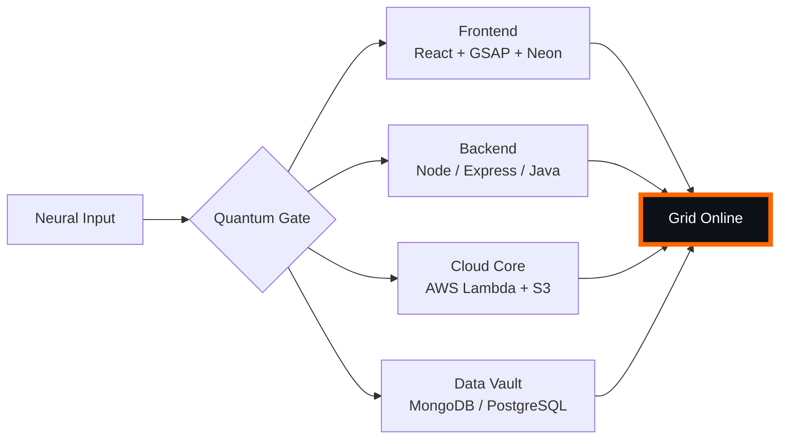

# 🌌 [ NEURAL CORE ACCESS: PENDEMVAMSI ]

<p align="center">
  
</p>

<div align="center">
  
  <br><small>Active Protocol: <strong style="color:#FF6600">CYBERPUNK 2077</strong> 🏙️🔥</small>
</div>

## 🔵 NEURAL STATUS READOUT
```text
SUBJECT ID    →  PENDEMVAMSI
ENTITY CLASS  →  SHADOW MONARCH v5
NEURAL RANK   →  B-TIER
GRID SYNC     →  216/1206 QUANTUM PACKETS
─────── BIO-METRICS (CYBERPUNK 2077) ───────
STRENGTH      116  ███████████████░░░░░░
AGILITY       106  ██████████████░░░░░░░
INTELLIGENCE  119  ███████████████░░░░░░
VITALITY       99  █████████████░░░░░░░░
```

> **NEURAL BURST ACQUIRED:** +82 QUANTUM PACKETS 
> **SYSTEM MESSAGE:** CORPORATE FIREWALL BREACHED — DATA IS FREEDOM

---

## 🌀 GRID ARCHITECTURE (HOLOGRAPHIC RENDER)



---

## 📡 ACADEMIC NODES – CONQUERED
- [x] B.Tech Neural Engineering (2020–2024) – St. Ann’s Grid
- [x] Intermediate Quantum Core (2018–2020) – Sri Medhavi
- [x] SSC Primary Link (2017–2018) – Sri Geethanjali

---

## ⚡ SKILL NEURAL MATRIX

<details open>
<summary>🔌 ACTIVE NEURAL LINKS</summary>

| Node               | Tier | Integrity Bar                | Status      |
|--------------------|------|------------------------------|-------------|
| Java Core          | S    | ████████████████████ 100%   | OVERCLOCKED |
| Node.js Grid       | S    | ████████████████████ 100%   | OVERCLOCKED |
| React Holo-UI      | A+   | █████████████████░░░ 92%    | ONLINE      |
| AWS Quantum Relay  | S    | ████████████████████ 100%   | SOVEREIGN   |
| Python AI Kernel   | A    | ████████████████░░░░ 85%    | CHARGING    |
| DSA Void Algorithm | A    | █████████████████░░░ 90%    | ACTIVE      |

</details>

---

## 🏅 NEURAL ACHIEVEMENT TOKENS

<p align="center">
  
  
  
  
</p>

---

## 👾 SHADOW ENTITIES – SUMMONED

<p align="center">
  
  <br><strong style="color:#FF6600">ARISE.</strong>
</p>

| Entity | Designation   | Class            | Source Node                     |
|--------|---------------|------------------|---------------------------------|
| SH-01  | Igris         | Void Commander   | AI Financial Oracle             |
| SH-02  | Beru          | Swarm Overlord   | WebRTC Quantum Stream           |
| SH-03  | Kaisel        | Void Wyrm        | Geolocation Shadow Relay        |
| SH-04  | Tusk          | Arcane Construct | Global Pandemic Sentinel        |
| SH-05  | Iron          | Armored Bastion  | React Crypto Fortress           |

---

## 📡 GRID ANALYTICS (LIVE FEED)

<p align="center">
  
  <br>
  
  
</p>

---

## 🖥️ CORRUPTED MAINFRAME LOG (401 ENTRIES)

<details>
<summary>OPEN TERMINAL FEED – PROTOCOL: CYBERPUNK 2077</summary>

> [0x09407C72] 🏙️🔥 **CYBERPUNK 2077 PROTOCOL** #0 | NEURAL LINK STABILIZED | [TRANSMISSION SUCCESS]
> [0x880984AF] 🏙️🔥 **CYBERPUNK 2077 PROTOCOL** #1 | NEURAL LINK STABILIZED | [TRANSMISSION SUCCESS]
> [0x1FA2CF81] 🏙️🔥 **CYBERPUNK 2077 PROTOCOL** #2 | NEURAL LINK STABILIZED | [TRANSMISSION SUCCESS]
> [0x92406B58] 🏙️🔥 **CYBERPUNK 2077 PROTOCOL** #3 | NEURAL LINK STABILIZED | [TRANSMISSION SUCCESS]
> [0x989018E9] 🏙️🔥 **CYBERPUNK 2077 PROTOCOL** #4 | NEURAL LINK STABILIZED | [TRANSMISSION SUCCESS]
> [0x922A0859] 🏙️🔥 **CYBERPUNK 2077 PROTOCOL** #5 | NEURAL LINK STABILIZED | [TRANSMISSION SUCCESS]
> [0xF2DF8D41] 🏙️🔥 **CYBERPUNK 2077 PROTOCOL** #6 | NEURAL LINK STABILIZED | [TRANSMISSION SUCCESS]
> [0x4A0773C9] 🏙️🔥 **CYBERPUNK 2077 PROTOCOL** #7 | NEURAL LINK  [GLITCH DETECTED] STABILIZED | [TRANSMISSION SUCCESS]
> [0x2385EB6D] 🏙️🔥 **CYBERPUNK 2077 PROTOCOL** #8 | NEURAL LINK STABILIZED | [TRANSMISSION SUCCESS]
> [0x4A537D59] 🏙️🔥 **CYBERPUNK 2077 PROTOCOL** #9 | NEURAL LINK  [GLITCH DETECTED] STABILIZED | [TRANSMISSION SUCCESS]
> [0x57B16BC6] 🏙️🔥 **CYBERPUNK 2077 PROTOCOL** #10 | NEURAL LINK  [GLITCH DETECTED] STABILIZED | [TRANSMISSION SUCCESS]
> [0x8A855E54] 🏙️🔥 **CYBERPUNK 2077 PROTOCOL** #11 | NEURAL LINK STABILIZED | [TRANSMISSION SUCCESS]
> [0x093CE03F] 🏙️🔥 **CYBERPUNK 2077 PROTOCOL** #12 | NEURAL LINK STABILIZED | [TRANSMISSION SUCCESS]
> [0x6B56C5D5] 🏙️🔥 **CYBERPUNK 2077 PROTOCOL** #13 | NEURAL LINK  [GLITCH DETECTED] STABILIZED | [TRANSMISSION SUCCESS]
> [0x44249DBF] 🏙️🔥 **CYBERPUNK 2077 PROTOCOL** #14 | NEURAL LINK STABILIZED | [TRANSMISSION SUCCESS]
> [0x9337AA8D] 🏙️🔥 **CYBERPUNK 2077 PROTOCOL** #15 | NEURAL LINK STABILIZED | [TRANSMISSION SUCCESS]
> [0x3B0953C7] 🏙️🔥 **CYBERPUNK 2077 PROTOCOL** #16 | NEURAL LINK STABILIZED | [TRANSMISSION SUCCESS]
> [0x19E89057] 🏙️🔥 **CYBERPUNK 2077 PROTOCOL** #17 | NEURAL LINK STABILIZED | [TRANSMISSION SUCCESS]
> [0x702720FF] 🏙️🔥 **CYBERPUNK 2077 PROTOCOL** #18 | NEURAL LINK STABILIZED | [TRANSMISSION SUCCESS]
> [0xD281650A] 🏙️🔥 **CYBERPUNK 2077 PROTOCOL** #19 | NEURAL LINK STABILIZED | [TRANSMISSION SUCCESS]
> [0x5C2CF680] 🏙️🔥 **CYBERPUNK 2077 PROTOCOL** #20 | NEURAL LINK STABILIZED | [TRANSMISSION SUCCESS]
> [0x2C0F9ED0] 🏙️🔥 **CYBERPUNK 2077 PROTOCOL** #21 | NEURAL LINK STABILIZED | [TRANSMISSION SUCCESS]
> [0x1E3268D9] 🏙️🔥 **CYBERPUNK 2077 PROTOCOL** #22 | NEURAL LINK STABILIZED | [TRANSMISSION SUCCESS]
> [0x9485016B] 🏙️🔥 **CYBERPUNK 2077 PROTOCOL** #23 | NEURAL LINK STABILIZED | [TRANSMISSION SUCCESS]
> [0x21B7856D] 🏙️🔥 **CYBERPUNK 2077 PROTOCOL** #24 | NEURAL LINK STABILIZED | [TRANSMISSION SUCCESS]
> [0xAD8521D4] 🏙️🔥 **CYBERPUNK 2077 PROTOCOL** #25 | NEURAL LINK STABILIZED | [TRANSMISSION SUCCESS]
> [0x939B5689] 🏙️🔥 **CYBERPUNK 2077 PROTOCOL** #26 | NEURAL LINK STABILIZED | [TRANSMISSION SUCCESS]
> [0xEC02E3B3] 🏙️🔥 **CYBERPUNK 2077 PROTOCOL** #27 | NEURAL LINK STABILIZED | [TRANSMISSION SUCCESS]
> [0x46C13F3C] 🏙️🔥 **CYBERPUNK 2077 PROTOCOL** #28 | NEURAL LINK STABILIZED | [TRANSMISSION SUCCESS]
> [0x2AB75ECA] 🏙️🔥 **CYBERPUNK 2077 PROTOCOL** #29 | NEURAL LINK STABILIZED | [TRANSMISSION SUCCESS]
> [0x75C7FA80] 🏙️🔥 **CYBERPUNK 2077 PROTOCOL** #30 | NEURAL LINK STABILIZED | [TRANSMISSION SUCCESS]
> [0x3624D244] 🏙️🔥 **CYBERPUNK 2077 PROTOCOL** #31 | NEURAL LINK STABILIZED | [TRANSMISSION SUCCESS]
> [0x74B1E6B0] 🏙️🔥 **CYBERPUNK 2077 PROTOCOL** #32 | NEURAL LINK STABILIZED | [TRANSMISSION SUCCESS]
> [0x544AE2D6] 🏙️🔥 **CYBERPUNK 2077 PROTOCOL** #33 | NEURAL LINK STABILIZED | [TRANSMISSION SUCCESS]
> [0xC007210D] 🏙️🔥 **CYBERPUNK 2077 PROTOCOL** #34 | NEURAL LINK  [GLITCH DETECTED] STABILIZED | [TRANSMISSION SUCCESS]
> [0x9BEF976E] 🏙️🔥 **CYBERPUNK 2077 PROTOCOL** #35 | NEURAL LINK STABILIZED | [TRANSMISSION SUCCESS]
> [0x2CB80B3A] 🏙️🔥 **CYBERPUNK 2077 PROTOCOL** #36 | NEURAL LINK STABILIZED | [TRANSMISSION SUCCESS]
> [0x3715A237] 🏙️🔥 **CYBERPUNK 2077 PROTOCOL** #37 | NEURAL LINK STABILIZED | [TRANSMISSION SUCCESS]
> [0xA1E56715] 🏙️🔥 **CYBERPUNK 2077 PROTOCOL** #38 | NEURAL LINK STABILIZED | [TRANSMISSION SUCCESS]
> [0xD6633FD8] 🏙️🔥 **CYBERPUNK 2077 PROTOCOL** #39 | NEURAL LINK STABILIZED | [TRANSMISSION SUCCESS]
> [0x41B3A089] 🏙️🔥 **CYBERPUNK 2077 PROTOCOL** #40 | NEURAL LINK STABILIZED | [TRANSMISSION SUCCESS]
> [0x2ACAA9B0] 🏙️🔥 **CYBERPUNK 2077 PROTOCOL** #41 | NEURAL LINK STABILIZED | [TRANSMISSION SUCCESS]
> [0x203EBE02] 🏙️🔥 **CYBERPUNK 2077 PROTOCOL** #42 | NEURAL LINK STABILIZED | [TRANSMISSION SUCCESS]
> [0x47FB29BB] 🏙️🔥 **CYBERPUNK 2077 PROTOCOL** #43 | NEURAL LINK  [GLITCH DETECTED] STABILIZED | [TRANSMISSION SUCCESS]
> [0xF0E47AB2] 🏙️🔥 **CYBERPUNK 2077 PROTOCOL** #44 | NEURAL LINK STABILIZED | [TRANSMISSION SUCCESS]
> [0x12EB9970] 🏙️🔥 **CYBERPUNK 2077 PROTOCOL** #45 | NEURAL LINK STABILIZED | [TRANSMISSION SUCCESS]
> [0xA7644754] 🏙️🔥 **CYBERPUNK 2077 PROTOCOL** #46 | NEURAL LINK STABILIZED | [TRANSMISSION SUCCESS]
> [0x6F3913A2] 🏙️🔥 **CYBERPUNK 2077 PROTOCOL** #47 | NEURAL LINK STABILIZED | [TRANSMISSION SUCCESS]
> [0x9F32566E] 🏙️🔥 **CYBERPUNK 2077 PROTOCOL** #48 | NEURAL LINK STABILIZED | [TRANSMISSION SUCCESS]
> [0x4AFF07FF] 🏙️🔥 **CYBERPUNK 2077 PROTOCOL** #49 | NEURAL LINK STABILIZED | [TRANSMISSION SUCCESS]
> [0x1E9F6E36] 🏙️🔥 **CYBERPUNK 2077 PROTOCOL** #50 | NEURAL LINK STABILIZED | [TRANSMISSION SUCCESS]
> [0xDE5CAD8F] 🏙️🔥 **CYBERPUNK 2077 PROTOCOL** #51 | NEURAL LINK  [GLITCH DETECTED] STABILIZED | [TRANSMISSION SUCCESS]
> [0x0DA40A61] 🏙️🔥 **CYBERPUNK 2077 PROTOCOL** #52 | NEURAL LINK STABILIZED | [TRANSMISSION SUCCESS]
> [0x87D86060] 🏙️🔥 **CYBERPUNK 2077 PROTOCOL** #53 | NEURAL LINK STABILIZED | [TRANSMISSION SUCCESS]
> [0x37485CCF] 🏙️🔥 **CYBERPUNK 2077 PROTOCOL** #54 | NEURAL LINK STABILIZED | [TRANSMISSION SUCCESS]
> [0x87BAEE3C] 🏙️🔥 **CYBERPUNK 2077 PROTOCOL** #55 | NEURAL LINK STABILIZED | [TRANSMISSION SUCCESS]
> [0x9B0CAE22] 🏙️🔥 **CYBERPUNK 2077 PROTOCOL** #56 | NEURAL LINK STABILIZED | [TRANSMISSION SUCCESS]
> [0xA3E41D30] 🏙️🔥 **CYBERPUNK 2077 PROTOCOL** #57 | NEURAL LINK STABILIZED | [TRANSMISSION SUCCESS]
> [0xA1F798A6] 🏙️🔥 **CYBERPUNK 2077 PROTOCOL** #58 | NEURAL LINK STABILIZED | [TRANSMISSION SUCCESS]
> [0x6C2183AF] 🏙️🔥 **CYBERPUNK 2077 PROTOCOL** #59 | NEURAL LINK  [GLITCH DETECTED] STABILIZED | [TRANSMISSION SUCCESS]
> [0xB61A965D] 🏙️🔥 **CYBERPUNK 2077 PROTOCOL** #60 | NEURAL LINK STABILIZED | [TRANSMISSION SUCCESS]
> [0x6F21CDB2] 🏙️🔥 **CYBERPUNK 2077 PROTOCOL** #61 | NEURAL LINK STABILIZED | [TRANSMISSION SUCCESS]
> [0xB6C926B0] 🏙️🔥 **CYBERPUNK 2077 PROTOCOL** #62 | NEURAL LINK STABILIZED | [TRANSMISSION SUCCESS]
> [0xC6C49133] 🏙️🔥 **CYBERPUNK 2077 PROTOCOL** #63 | NEURAL LINK STABILIZED | [TRANSMISSION SUCCESS]
> [0x015CF58A] 🏙️🔥 **CYBERPUNK 2077 PROTOCOL** #64 | NEURAL LINK STABILIZED | [TRANSMISSION SUCCESS]
> [0x40A8CC7D] 🏙️🔥 **CYBERPUNK 2077 PROTOCOL** #65 | NEURAL LINK STABILIZED | [TRANSMISSION SUCCESS]
> [0xB705F069] 🏙️🔥 **CYBERPUNK 2077 PROTOCOL** #66 | NEURAL LINK STABILIZED | [TRANSMISSION SUCCESS]
> [0x44D7E1FC] 🏙️🔥 **CYBERPUNK 2077 PROTOCOL** #67 | NEURAL LINK STABILIZED | [TRANSMISSION SUCCESS]
> [0x48A39E77] 🏙️🔥 **CYBERPUNK 2077 PROTOCOL** #68 | NEURAL LINK STABILIZED | [TRANSMISSION SUCCESS]
> [0xFE76A2FF] 🏙️🔥 **CYBERPUNK 2077 PROTOCOL** #69 | NEURAL LINK STABILIZED | [TRANSMISSION SUCCESS]
> [0x706735CF] 🏙️🔥 **CYBERPUNK 2077 PROTOCOL** #70 | NEURAL LINK  [GLITCH DETECTED] STABILIZED | [TRANSMISSION SUCCESS]
> [0x0E9D4907] 🏙️🔥 **CYBERPUNK 2077 PROTOCOL** #71 | NEURAL LINK STABILIZED | [TRANSMISSION SUCCESS]
> [0x2828755E] 🏙️🔥 **CYBERPUNK 2077 PROTOCOL** #72 | NEURAL LINK STABILIZED | [TRANSMISSION SUCCESS]
> [0xF2242DE6] 🏙️🔥 **CYBERPUNK 2077 PROTOCOL** #73 | NEURAL LINK STABILIZED | [TRANSMISSION SUCCESS]
> [0x8E012BEC] 🏙️🔥 **CYBERPUNK 2077 PROTOCOL** #74 | NEURAL LINK STABILIZED | [TRANSMISSION SUCCESS]
> [0x09727800] 🏙️🔥 **CYBERPUNK 2077 PROTOCOL** #75 | NEURAL LINK STABILIZED | [TRANSMISSION SUCCESS]
> [0xA362B724] 🏙️🔥 **CYBERPUNK 2077 PROTOCOL** #76 | NEURAL LINK STABILIZED | [TRANSMISSION SUCCESS]
> [0x8FF24A6B] 🏙️🔥 **CYBERPUNK 2077 PROTOCOL** #77 | NEURAL LINK STABILIZED | [TRANSMISSION SUCCESS]
> [0xB8804CE9] 🏙️🔥 **CYBERPUNK 2077 PROTOCOL** #78 | NEURAL LINK  [GLITCH DETECTED] STABILIZED | [TRANSMISSION SUCCESS]
> [0x3779EAC9] 🏙️🔥 **CYBERPUNK 2077 PROTOCOL** #79 | NEURAL LINK STABILIZED | [TRANSMISSION SUCCESS]
> [0x8203CA35] 🏙️🔥 **CYBERPUNK 2077 PROTOCOL** #80 | NEURAL LINK STABILIZED | [TRANSMISSION SUCCESS]
> [0xF80D54F3] 🏙️🔥 **CYBERPUNK 2077 PROTOCOL** #81 | NEURAL LINK STABILIZED | [TRANSMISSION SUCCESS]
> [0x97533408] 🏙️🔥 **CYBERPUNK 2077 PROTOCOL** #82 | NEURAL LINK STABILIZED | [TRANSMISSION SUCCESS]
> [0xDD315ED9] 🏙️🔥 **CYBERPUNK 2077 PROTOCOL** #83 | NEURAL LINK STABILIZED | [TRANSMISSION SUCCESS]
> [0x33CFF4F0] 🏙️🔥 **CYBERPUNK 2077 PROTOCOL** #84 | NEURAL LINK STABILIZED | [TRANSMISSION SUCCESS]
> [0x2F009EF2] 🏙️🔥 **CYBERPUNK 2077 PROTOCOL** #85 | NEURAL LINK STABILIZED | [TRANSMISSION SUCCESS]
> [0x76B1EAE2] 🏙️🔥 **CYBERPUNK 2077 PROTOCOL** #86 | NEURAL LINK STABILIZED | [TRANSMISSION SUCCESS]
> [0xDAD454CE] 🏙️🔥 **CYBERPUNK 2077 PROTOCOL** #87 | NEURAL LINK STABILIZED | [TRANSMISSION SUCCESS]
> [0x8B4CA111] 🏙️🔥 **CYBERPUNK 2077 PROTOCOL** #88 | NEURAL LINK STABILIZED | [TRANSMISSION SUCCESS]
> [0x97BBBF61] 🏙️🔥 **CYBERPUNK 2077 PROTOCOL** #89 | NEURAL LINK STABILIZED | [TRANSMISSION SUCCESS]
> [0x49D91181] 🏙️🔥 **CYBERPUNK 2077 PROTOCOL** #90 | NEURAL LINK STABILIZED | [TRANSMISSION SUCCESS]
> [0x846D1519] 🏙️🔥 **CYBERPUNK 2077 PROTOCOL** #91 | NEURAL LINK  [GLITCH DETECTED] STABILIZED | [TRANSMISSION SUCCESS]
> [0xB96BD1AC] 🏙️🔥 **CYBERPUNK 2077 PROTOCOL** #92 | NEURAL LINK STABILIZED | [TRANSMISSION SUCCESS]
> [0xB1E0C0C1] 🏙️🔥 **CYBERPUNK 2077 PROTOCOL** #93 | NEURAL LINK STABILIZED | [TRANSMISSION SUCCESS]
> [0xE883D277] 🏙️🔥 **CYBERPUNK 2077 PROTOCOL** #94 | NEURAL LINK  [GLITCH DETECTED] STABILIZED | [TRANSMISSION SUCCESS]
> [0x75A338FA] 🏙️🔥 **CYBERPUNK 2077 PROTOCOL** #95 | NEURAL LINK STABILIZED | [TRANSMISSION SUCCESS]
> [0x942803AB] 🏙️🔥 **CYBERPUNK 2077 PROTOCOL** #96 | NEURAL LINK STABILIZED | [TRANSMISSION SUCCESS]
> [0x31E45BAD] 🏙️🔥 **CYBERPUNK 2077 PROTOCOL** #97 | NEURAL LINK STABILIZED | [TRANSMISSION SUCCESS]
> [0x540F35D2] 🏙️🔥 **CYBERPUNK 2077 PROTOCOL** #98 | NEURAL LINK STABILIZED | [TRANSMISSION SUCCESS]
> [0x0C7E1603] 🏙️🔥 **CYBERPUNK 2077 PROTOCOL** #99 | NEURAL LINK STABILIZED | [TRANSMISSION SUCCESS]
> [0xB1F55007] 🏙️🔥 **CYBERPUNK 2077 PROTOCOL** #100 | NEURAL LINK STABILIZED | [TRANSMISSION SUCCESS]
> [0xCD86E0C9] 🏙️🔥 **CYBERPUNK 2077 PROTOCOL** #101 | NEURAL LINK STABILIZED | [TRANSMISSION SUCCESS]
> [0xC7238F78] 🏙️🔥 **CYBERPUNK 2077 PROTOCOL** #102 | NEURAL LINK STABILIZED | [TRANSMISSION SUCCESS]
> [0xCE49240F] 🏙️🔥 **CYBERPUNK 2077 PROTOCOL** #103 | NEURAL LINK  [GLITCH DETECTED] STABILIZED | [TRANSMISSION SUCCESS]
> [0x43EE9AE2] 🏙️🔥 **CYBERPUNK 2077 PROTOCOL** #104 | NEURAL LINK STABILIZED | [TRANSMISSION SUCCESS]
> [0x7ACA9F47] 🏙️🔥 **CYBERPUNK 2077 PROTOCOL** #105 | NEURAL LINK STABILIZED | [TRANSMISSION SUCCESS]
> [0x71F485BF] 🏙️🔥 **CYBERPUNK 2077 PROTOCOL** #106 | NEURAL LINK STABILIZED | [TRANSMISSION SUCCESS]
> [0x7B4DE63B] 🏙️🔥 **CYBERPUNK 2077 PROTOCOL** #107 | NEURAL LINK STABILIZED | [TRANSMISSION SUCCESS]
> [0x33858712] 🏙️🔥 **CYBERPUNK 2077 PROTOCOL** #108 | NEURAL LINK STABILIZED | [TRANSMISSION SUCCESS]
> [0x5200E864] 🏙️🔥 **CYBERPUNK 2077 PROTOCOL** #109 | NEURAL LINK STABILIZED | [TRANSMISSION SUCCESS]
> [0x8659BECA] 🏙️🔥 **CYBERPUNK 2077 PROTOCOL** #110 | NEURAL LINK STABILIZED | [TRANSMISSION SUCCESS]
> [0x414DBDAF] 🏙️🔥 **CYBERPUNK 2077 PROTOCOL** #111 | NEURAL LINK STABILIZED | [TRANSMISSION SUCCESS]
> [0x4DE9E907] 🏙️🔥 **CYBERPUNK 2077 PROTOCOL** #112 | NEURAL LINK STABILIZED | [TRANSMISSION SUCCESS]
> [0x3F6AAD54] 🏙️🔥 **CYBERPUNK 2077 PROTOCOL** #113 | NEURAL LINK STABILIZED | [TRANSMISSION SUCCESS]
> [0x75FCA1F7] 🏙️🔥 **CYBERPUNK 2077 PROTOCOL** #114 | NEURAL LINK STABILIZED | [TRANSMISSION SUCCESS]
> [0x0F9310CD] 🏙️🔥 **CYBERPUNK 2077 PROTOCOL** #115 | NEURAL LINK STABILIZED | [TRANSMISSION SUCCESS]
> [0x6E5C0214] 🏙️🔥 **CYBERPUNK 2077 PROTOCOL** #116 | NEURAL LINK STABILIZED | [TRANSMISSION SUCCESS]
> [0xBD9AE1F8] 🏙️🔥 **CYBERPUNK 2077 PROTOCOL** #117 | NEURAL LINK STABILIZED | [TRANSMISSION SUCCESS]
> [0x6AE47731] 🏙️🔥 **CYBERPUNK 2077 PROTOCOL** #118 | NEURAL LINK  [GLITCH DETECTED] STABILIZED | [TRANSMISSION SUCCESS]
> [0x6EFD3DE5] 🏙️🔥 **CYBERPUNK 2077 PROTOCOL** #119 | NEURAL LINK STABILIZED | [TRANSMISSION SUCCESS]
> [0x46CA82A7] 🏙️🔥 **CYBERPUNK 2077 PROTOCOL** #120 | NEURAL LINK STABILIZED | [TRANSMISSION SUCCESS]
> [0xF1E6D7E0] 🏙️🔥 **CYBERPUNK 2077 PROTOCOL** #121 | NEURAL LINK STABILIZED | [TRANSMISSION SUCCESS]
> [0x4EC00760] 🏙️🔥 **CYBERPUNK 2077 PROTOCOL** #122 | NEURAL LINK STABILIZED | [TRANSMISSION SUCCESS]
> [0x65BAD23C] 🏙️🔥 **CYBERPUNK 2077 PROTOCOL** #123 | NEURAL LINK STABILIZED | [TRANSMISSION SUCCESS]
> [0x4FEF82CF] 🏙️🔥 **CYBERPUNK 2077 PROTOCOL** #124 | NEURAL LINK STABILIZED | [TRANSMISSION SUCCESS]
> [0x9BDA9CA1] 🏙️🔥 **CYBERPUNK 2077 PROTOCOL** #125 | NEURAL LINK STABILIZED | [TRANSMISSION SUCCESS]
> [0xC756973B] 🏙️🔥 **CYBERPUNK 2077 PROTOCOL** #126 | NEURAL LINK STABILIZED | [TRANSMISSION SUCCESS]
> [0x175D3AA9] 🏙️🔥 **CYBERPUNK 2077 PROTOCOL** #127 | NEURAL LINK STABILIZED | [TRANSMISSION SUCCESS]
> [0x60C44EE5] 🏙️🔥 **CYBERPUNK 2077 PROTOCOL** #128 | NEURAL LINK STABILIZED | [TRANSMISSION SUCCESS]
> [0x38B8A840] 🏙️🔥 **CYBERPUNK 2077 PROTOCOL** #129 | NEURAL LINK STABILIZED | [TRANSMISSION SUCCESS]
> [0x1C18EA6E] 🏙️🔥 **CYBERPUNK 2077 PROTOCOL** #130 | NEURAL LINK STABILIZED | [TRANSMISSION SUCCESS]
> [0x43076840] 🏙️🔥 **CYBERPUNK 2077 PROTOCOL** #131 | NEURAL LINK STABILIZED | [TRANSMISSION SUCCESS]
> [0x00627CE4] 🏙️🔥 **CYBERPUNK 2077 PROTOCOL** #132 | NEURAL LINK STABILIZED | [TRANSMISSION SUCCESS]
> [0xE1A3D923] 🏙️🔥 **CYBERPUNK 2077 PROTOCOL** #133 | NEURAL LINK STABILIZED | [TRANSMISSION SUCCESS]
> [0x562E3F8E] 🏙️🔥 **CYBERPUNK 2077 PROTOCOL** #134 | NEURAL LINK STABILIZED | [TRANSMISSION SUCCESS]
> [0xFA8A32C2] 🏙️🔥 **CYBERPUNK 2077 PROTOCOL** #135 | NEURAL LINK STABILIZED | [TRANSMISSION SUCCESS]
> [0x46D51B19] 🏙️🔥 **CYBERPUNK 2077 PROTOCOL** #136 | NEURAL LINK STABILIZED | [TRANSMISSION SUCCESS]
> [0xAE3492F9] 🏙️🔥 **CYBERPUNK 2077 PROTOCOL** #137 | NEURAL LINK STABILIZED | [TRANSMISSION SUCCESS]
> [0x7F20817C] 🏙️🔥 **CYBERPUNK 2077 PROTOCOL** #138 | NEURAL LINK STABILIZED | [TRANSMISSION SUCCESS]
> [0x0B08223D] 🏙️🔥 **CYBERPUNK 2077 PROTOCOL** #139 | NEURAL LINK STABILIZED | [TRANSMISSION SUCCESS]
> [0x14098710] 🏙️🔥 **CYBERPUNK 2077 PROTOCOL** #140 | NEURAL LINK  [GLITCH DETECTED] STABILIZED | [TRANSMISSION SUCCESS]
> [0x4722E36B] 🏙️🔥 **CYBERPUNK 2077 PROTOCOL** #141 | NEURAL LINK STABILIZED | [TRANSMISSION SUCCESS]
> [0xC66CF22E] 🏙️🔥 **CYBERPUNK 2077 PROTOCOL** #142 | NEURAL LINK STABILIZED | [TRANSMISSION SUCCESS]
> [0x7B8E4BE8] 🏙️🔥 **CYBERPUNK 2077 PROTOCOL** #143 | NEURAL LINK STABILIZED | [TRANSMISSION SUCCESS]
> [0x037BA3DB] 🏙️🔥 **CYBERPUNK 2077 PROTOCOL** #144 | NEURAL LINK STABILIZED | [TRANSMISSION SUCCESS]
> [0xF822309F] 🏙️🔥 **CYBERPUNK 2077 PROTOCOL** #145 | NEURAL LINK STABILIZED | [TRANSMISSION SUCCESS]
> [0xFFB53080] 🏙️🔥 **CYBERPUNK 2077 PROTOCOL** #146 | NEURAL LINK STABILIZED | [TRANSMISSION SUCCESS]
> [0x15A9C4E5] 🏙️🔥 **CYBERPUNK 2077 PROTOCOL** #147 | NEURAL LINK STABILIZED | [TRANSMISSION SUCCESS]
> [0xC3341BDA] 🏙️🔥 **CYBERPUNK 2077 PROTOCOL** #148 | NEURAL LINK STABILIZED | [TRANSMISSION SUCCESS]
> [0x3744C27A] 🏙️🔥 **CYBERPUNK 2077 PROTOCOL** #149 | NEURAL LINK STABILIZED | [TRANSMISSION SUCCESS]
> [0x9FEE42D7] 🏙️🔥 **CYBERPUNK 2077 PROTOCOL** #150 | NEURAL LINK STABILIZED | [TRANSMISSION SUCCESS]
> [0xED0F2FA2] 🏙️🔥 **CYBERPUNK 2077 PROTOCOL** #151 | NEURAL LINK STABILIZED | [TRANSMISSION SUCCESS]
> [0x30CC25A1] 🏙️🔥 **CYBERPUNK 2077 PROTOCOL** #152 | NEURAL LINK  [GLITCH DETECTED] STABILIZED | [TRANSMISSION SUCCESS]
> [0xD130E83A] 🏙️🔥 **CYBERPUNK 2077 PROTOCOL** #153 | NEURAL LINK  [GLITCH DETECTED] STABILIZED | [TRANSMISSION SUCCESS]
> [0x416F0EC3] 🏙️🔥 **CYBERPUNK 2077 PROTOCOL** #154 | NEURAL LINK STABILIZED | [TRANSMISSION SUCCESS]
> [0xB0EFA757] 🏙️🔥 **CYBERPUNK 2077 PROTOCOL** #155 | NEURAL LINK STABILIZED | [TRANSMISSION SUCCESS]
> [0x7509355E] 🏙️🔥 **CYBERPUNK 2077 PROTOCOL** #156 | NEURAL LINK STABILIZED | [TRANSMISSION SUCCESS]
> [0x119E9A41] 🏙️🔥 **CYBERPUNK 2077 PROTOCOL** #157 | NEURAL LINK STABILIZED | [TRANSMISSION SUCCESS]
> [0xBFA05367] 🏙️🔥 **CYBERPUNK 2077 PROTOCOL** #158 | NEURAL LINK STABILIZED | [TRANSMISSION SUCCESS]
> [0x22054E63] 🏙️🔥 **CYBERPUNK 2077 PROTOCOL** #159 | NEURAL LINK STABILIZED | [TRANSMISSION SUCCESS]
> [0x86805829] 🏙️🔥 **CYBERPUNK 2077 PROTOCOL** #160 | NEURAL LINK STABILIZED | [TRANSMISSION SUCCESS]
> [0xC0B932A1] 🏙️🔥 **CYBERPUNK 2077 PROTOCOL** #161 | NEURAL LINK  [GLITCH DETECTED] STABILIZED | [TRANSMISSION SUCCESS]
> [0x12311E5B] 🏙️🔥 **CYBERPUNK 2077 PROTOCOL** #162 | NEURAL LINK STABILIZED | [TRANSMISSION SUCCESS]
> [0xE2A87CE4] 🏙️🔥 **CYBERPUNK 2077 PROTOCOL** #163 | NEURAL LINK STABILIZED | [TRANSMISSION SUCCESS]
> [0x2A6106ED] 🏙️🔥 **CYBERPUNK 2077 PROTOCOL** #164 | NEURAL LINK STABILIZED | [TRANSMISSION SUCCESS]
> [0xDFE62D96] 🏙️🔥 **CYBERPUNK 2077 PROTOCOL** #165 | NEURAL LINK STABILIZED | [TRANSMISSION SUCCESS]
> [0x70935E5C] 🏙️🔥 **CYBERPUNK 2077 PROTOCOL** #166 | NEURAL LINK STABILIZED | [TRANSMISSION SUCCESS]
> [0x87A49ACF] 🏙️🔥 **CYBERPUNK 2077 PROTOCOL** #167 | NEURAL LINK STABILIZED | [TRANSMISSION SUCCESS]
> [0x42427A1F] 🏙️🔥 **CYBERPUNK 2077 PROTOCOL** #168 | NEURAL LINK STABILIZED | [TRANSMISSION SUCCESS]
> [0xD8F19703] 🏙️🔥 **CYBERPUNK 2077 PROTOCOL** #169 | NEURAL LINK  [GLITCH DETECTED] STABILIZED | [TRANSMISSION SUCCESS]
> [0x1F04324E] 🏙️🔥 **CYBERPUNK 2077 PROTOCOL** #170 | NEURAL LINK  [GLITCH DETECTED] STABILIZED | [TRANSMISSION SUCCESS]
> [0x49AF3F62] 🏙️🔥 **CYBERPUNK 2077 PROTOCOL** #171 | NEURAL LINK STABILIZED | [TRANSMISSION SUCCESS]
> [0x9ECE0DA7] 🏙️🔥 **CYBERPUNK 2077 PROTOCOL** #172 | NEURAL LINK STABILIZED | [TRANSMISSION SUCCESS]
> [0x4E3B9135] 🏙️🔥 **CYBERPUNK 2077 PROTOCOL** #173 | NEURAL LINK STABILIZED | [TRANSMISSION SUCCESS]
> [0xFD88DF4A] 🏙️🔥 **CYBERPUNK 2077 PROTOCOL** #174 | NEURAL LINK STABILIZED | [TRANSMISSION SUCCESS]
> [0x67CF95E0] 🏙️🔥 **CYBERPUNK 2077 PROTOCOL** #175 | NEURAL LINK STABILIZED | [TRANSMISSION SUCCESS]
> [0xD78C1FBF] 🏙️🔥 **CYBERPUNK 2077 PROTOCOL** #176 | NEURAL LINK STABILIZED | [TRANSMISSION SUCCESS]
> [0x22BD2530] 🏙️🔥 **CYBERPUNK 2077 PROTOCOL** #177 | NEURAL LINK STABILIZED | [TRANSMISSION SUCCESS]
> [0x028E8408] 🏙️🔥 **CYBERPUNK 2077 PROTOCOL** #178 | NEURAL LINK STABILIZED | [TRANSMISSION SUCCESS]
> [0x069DA3A6] 🏙️🔥 **CYBERPUNK 2077 PROTOCOL** #179 | NEURAL LINK STABILIZED | [TRANSMISSION SUCCESS]
> [0x936CF9DA] 🏙️🔥 **CYBERPUNK 2077 PROTOCOL** #180 | NEURAL LINK STABILIZED | [TRANSMISSION SUCCESS]
> [0x75A6B1CD] 🏙️🔥 **CYBERPUNK 2077 PROTOCOL** #181 | NEURAL LINK STABILIZED | [TRANSMISSION SUCCESS]
> [0x56B1B097] 🏙️🔥 **CYBERPUNK 2077 PROTOCOL** #182 | NEURAL LINK STABILIZED | [TRANSMISSION SUCCESS]
> [0x949CF75F] 🏙️🔥 **CYBERPUNK 2077 PROTOCOL** #183 | NEURAL LINK STABILIZED | [TRANSMISSION SUCCESS]
> [0xAB21FF2B] 🏙️🔥 **CYBERPUNK 2077 PROTOCOL** #184 | NEURAL LINK STABILIZED | [TRANSMISSION SUCCESS]
> [0x48974CAD] 🏙️🔥 **CYBERPUNK 2077 PROTOCOL** #185 | NEURAL LINK  [GLITCH DETECTED] STABILIZED | [TRANSMISSION SUCCESS]
> [0xA2255E39] 🏙️🔥 **CYBERPUNK 2077 PROTOCOL** #186 | NEURAL LINK STABILIZED | [TRANSMISSION SUCCESS]
> [0x7CB640DF] 🏙️🔥 **CYBERPUNK 2077 PROTOCOL** #187 | NEURAL LINK STABILIZED | [TRANSMISSION SUCCESS]
> [0x2BB095D2] 🏙️🔥 **CYBERPUNK 2077 PROTOCOL** #188 | NEURAL LINK STABILIZED | [TRANSMISSION SUCCESS]
> [0xFE6EC19E] 🏙️🔥 **CYBERPUNK 2077 PROTOCOL** #189 | NEURAL LINK STABILIZED | [TRANSMISSION SUCCESS]
> [0x3063533F] 🏙️🔥 **CYBERPUNK 2077 PROTOCOL** #190 | NEURAL LINK STABILIZED | [TRANSMISSION SUCCESS]
> [0x6B15FF38] 🏙️🔥 **CYBERPUNK 2077 PROTOCOL** #191 | NEURAL LINK STABILIZED | [TRANSMISSION SUCCESS]
> [0xFAE4D729] 🏙️🔥 **CYBERPUNK 2077 PROTOCOL** #192 | NEURAL LINK STABILIZED | [TRANSMISSION SUCCESS]
> [0x9B5054E4] 🏙️🔥 **CYBERPUNK 2077 PROTOCOL** #193 | NEURAL LINK STABILIZED | [TRANSMISSION SUCCESS]
> [0x67E42286] 🏙️🔥 **CYBERPUNK 2077 PROTOCOL** #194 | NEURAL LINK STABILIZED | [TRANSMISSION SUCCESS]
> [0x7E5F657E] 🏙️🔥 **CYBERPUNK 2077 PROTOCOL** #195 | NEURAL LINK STABILIZED | [TRANSMISSION SUCCESS]
> [0xFA69B094] 🏙️🔥 **CYBERPUNK 2077 PROTOCOL** #196 | NEURAL LINK STABILIZED | [TRANSMISSION SUCCESS]
> [0x8E68A1E0] 🏙️🔥 **CYBERPUNK 2077 PROTOCOL** #197 | NEURAL LINK STABILIZED | [TRANSMISSION SUCCESS]
> [0x71D11667] 🏙️🔥 **CYBERPUNK 2077 PROTOCOL** #198 | NEURAL LINK STABILIZED | [TRANSMISSION SUCCESS]
> [0xCA7D5520] 🏙️🔥 **CYBERPUNK 2077 PROTOCOL** #199 | NEURAL LINK STABILIZED | [TRANSMISSION SUCCESS]
> [0x28964658] 🏙️🔥 **CYBERPUNK 2077 PROTOCOL** #200 | NEURAL LINK STABILIZED | [TRANSMISSION SUCCESS]
> [0x736934D8] 🏙️🔥 **CYBERPUNK 2077 PROTOCOL** #201 | NEURAL LINK STABILIZED | [TRANSMISSION SUCCESS]
> [0x3A2AA5EE] 🏙️🔥 **CYBERPUNK 2077 PROTOCOL** #202 | NEURAL LINK STABILIZED | [TRANSMISSION SUCCESS]
> [0xC4368B34] 🏙️🔥 **CYBERPUNK 2077 PROTOCOL** #203 | NEURAL LINK STABILIZED | [TRANSMISSION SUCCESS]
> [0x4BAF1B26] 🏙️🔥 **CYBERPUNK 2077 PROTOCOL** #204 | NEURAL LINK  [GLITCH DETECTED] STABILIZED | [TRANSMISSION SUCCESS]
> [0x796EEB80] 🏙️🔥 **CYBERPUNK 2077 PROTOCOL** #205 | NEURAL LINK STABILIZED | [TRANSMISSION SUCCESS]
> [0x1C0C60FF] 🏙️🔥 **CYBERPUNK 2077 PROTOCOL** #206 | NEURAL LINK STABILIZED | [TRANSMISSION SUCCESS]
> [0xDE703D44] 🏙️🔥 **CYBERPUNK 2077 PROTOCOL** #207 | NEURAL LINK  [GLITCH DETECTED] STABILIZED | [TRANSMISSION SUCCESS]
> [0x663792B8] 🏙️🔥 **CYBERPUNK 2077 PROTOCOL** #208 | NEURAL LINK STABILIZED | [TRANSMISSION SUCCESS]
> [0xB7870586] 🏙️🔥 **CYBERPUNK 2077 PROTOCOL** #209 | NEURAL LINK STABILIZED | [TRANSMISSION SUCCESS]
> [0x1F1FFAF3] 🏙️🔥 **CYBERPUNK 2077 PROTOCOL** #210 | NEURAL LINK STABILIZED | [TRANSMISSION SUCCESS]
> [0xF69B8CF7] 🏙️🔥 **CYBERPUNK 2077 PROTOCOL** #211 | NEURAL LINK  [GLITCH DETECTED] STABILIZED | [TRANSMISSION SUCCESS]
> [0x181E4E3E] 🏙️🔥 **CYBERPUNK 2077 PROTOCOL** #212 | NEURAL LINK STABILIZED | [TRANSMISSION SUCCESS]
> [0x2613C220] 🏙️🔥 **CYBERPUNK 2077 PROTOCOL** #213 | NEURAL LINK STABILIZED | [TRANSMISSION SUCCESS]
> [0xA75664A8] 🏙️🔥 **CYBERPUNK 2077 PROTOCOL** #214 | NEURAL LINK STABILIZED | [TRANSMISSION SUCCESS]
> [0x0933956E] 🏙️🔥 **CYBERPUNK 2077 PROTOCOL** #215 | NEURAL LINK STABILIZED | [TRANSMISSION SUCCESS]
> [0xC168490A] 🏙️🔥 **CYBERPUNK 2077 PROTOCOL** #216 | NEURAL LINK STABILIZED | [TRANSMISSION SUCCESS]
> [0x496B4717] 🏙️🔥 **CYBERPUNK 2077 PROTOCOL** #217 | NEURAL LINK STABILIZED | [TRANSMISSION SUCCESS]
> [0x0D1C640A] 🏙️🔥 **CYBERPUNK 2077 PROTOCOL** #218 | NEURAL LINK STABILIZED | [TRANSMISSION SUCCESS]
> [0x843F562F] 🏙️🔥 **CYBERPUNK 2077 PROTOCOL** #219 | NEURAL LINK STABILIZED | [TRANSMISSION SUCCESS]
> [0xF32D6DBA] 🏙️🔥 **CYBERPUNK 2077 PROTOCOL** #220 | NEURAL LINK STABILIZED | [TRANSMISSION SUCCESS]
> [0xB61D3725] 🏙️🔥 **CYBERPUNK 2077 PROTOCOL** #221 | NEURAL LINK STABILIZED | [TRANSMISSION SUCCESS]
> [0x96697A00] 🏙️🔥 **CYBERPUNK 2077 PROTOCOL** #222 | NEURAL LINK STABILIZED | [TRANSMISSION SUCCESS]
> [0x27DFD509] 🏙️🔥 **CYBERPUNK 2077 PROTOCOL** #223 | NEURAL LINK STABILIZED | [TRANSMISSION SUCCESS]
> [0x2D4E7F39] 🏙️🔥 **CYBERPUNK 2077 PROTOCOL** #224 | NEURAL LINK STABILIZED | [TRANSMISSION SUCCESS]
> [0x9D0E83CA] 🏙️🔥 **CYBERPUNK 2077 PROTOCOL** #225 | NEURAL LINK STABILIZED | [TRANSMISSION SUCCESS]
> [0x0941DD12] 🏙️🔥 **CYBERPUNK 2077 PROTOCOL** #226 | NEURAL LINK STABILIZED | [TRANSMISSION SUCCESS]
> [0x92B33FA7] 🏙️🔥 **CYBERPUNK 2077 PROTOCOL** #227 | NEURAL LINK STABILIZED | [TRANSMISSION SUCCESS]
> [0x8D760EA7] 🏙️🔥 **CYBERPUNK 2077 PROTOCOL** #228 | NEURAL LINK STABILIZED | [TRANSMISSION SUCCESS]
> [0x4E78950E] 🏙️🔥 **CYBERPUNK 2077 PROTOCOL** #229 | NEURAL LINK STABILIZED | [TRANSMISSION SUCCESS]
> [0xD6148BFD] 🏙️🔥 **CYBERPUNK 2077 PROTOCOL** #230 | NEURAL LINK  [GLITCH DETECTED] STABILIZED | [TRANSMISSION SUCCESS]
> [0x59B880A0] 🏙️🔥 **CYBERPUNK 2077 PROTOCOL** #231 | NEURAL LINK STABILIZED | [TRANSMISSION SUCCESS]
> [0x55A498E0] 🏙️🔥 **CYBERPUNK 2077 PROTOCOL** #232 | NEURAL LINK STABILIZED | [TRANSMISSION SUCCESS]
> [0x208994B3] 🏙️🔥 **CYBERPUNK 2077 PROTOCOL** #233 | NEURAL LINK STABILIZED | [TRANSMISSION SUCCESS]
> [0x90C3AC50] 🏙️🔥 **CYBERPUNK 2077 PROTOCOL** #234 | NEURAL LINK STABILIZED | [TRANSMISSION SUCCESS]
> [0xCADA2A45] 🏙️🔥 **CYBERPUNK 2077 PROTOCOL** #235 | NEURAL LINK  [GLITCH DETECTED] STABILIZED | [TRANSMISSION SUCCESS]
> [0xFD9209B2] 🏙️🔥 **CYBERPUNK 2077 PROTOCOL** #236 | NEURAL LINK STABILIZED | [TRANSMISSION SUCCESS]
> [0xFA89145F] 🏙️🔥 **CYBERPUNK 2077 PROTOCOL** #237 | NEURAL LINK STABILIZED | [TRANSMISSION SUCCESS]
> [0x77D20519] 🏙️🔥 **CYBERPUNK 2077 PROTOCOL** #238 | NEURAL LINK STABILIZED | [TRANSMISSION SUCCESS]
> [0x40ED66D5] 🏙️🔥 **CYBERPUNK 2077 PROTOCOL** #239 | NEURAL LINK STABILIZED | [TRANSMISSION SUCCESS]
> [0xE5B98EEE] 🏙️🔥 **CYBERPUNK 2077 PROTOCOL** #240 | NEURAL LINK STABILIZED | [TRANSMISSION SUCCESS]
> [0x97461945] 🏙️🔥 **CYBERPUNK 2077 PROTOCOL** #241 | NEURAL LINK STABILIZED | [TRANSMISSION SUCCESS]
> [0xF25454A8] 🏙️🔥 **CYBERPUNK 2077 PROTOCOL** #242 | NEURAL LINK  [GLITCH DETECTED] STABILIZED | [TRANSMISSION SUCCESS]
> [0xC6453FBA] 🏙️🔥 **CYBERPUNK 2077 PROTOCOL** #243 | NEURAL LINK STABILIZED | [TRANSMISSION SUCCESS]
> [0x863C0AA2] 🏙️🔥 **CYBERPUNK 2077 PROTOCOL** #244 | NEURAL LINK STABILIZED | [TRANSMISSION SUCCESS]
> [0x3BA0B1DC] 🏙️🔥 **CYBERPUNK 2077 PROTOCOL** #245 | NEURAL LINK  [GLITCH DETECTED] STABILIZED | [TRANSMISSION SUCCESS]
> [0x6A55835E] 🏙️🔥 **CYBERPUNK 2077 PROTOCOL** #246 | NEURAL LINK STABILIZED | [TRANSMISSION SUCCESS]
> [0xC4BB7DDD] 🏙️🔥 **CYBERPUNK 2077 PROTOCOL** #247 | NEURAL LINK STABILIZED | [TRANSMISSION SUCCESS]
> [0x6DB3F987] 🏙️🔥 **CYBERPUNK 2077 PROTOCOL** #248 | NEURAL LINK STABILIZED | [TRANSMISSION SUCCESS]
> [0xA6A94806] 🏙️🔥 **CYBERPUNK 2077 PROTOCOL** #249 | NEURAL LINK STABILIZED | [TRANSMISSION SUCCESS]
> [0x4A76FFE0] 🏙️🔥 **CYBERPUNK 2077 PROTOCOL** #250 | NEURAL LINK STABILIZED | [TRANSMISSION SUCCESS]
> [0x18320484] 🏙️🔥 **CYBERPUNK 2077 PROTOCOL** #251 | NEURAL LINK STABILIZED | [TRANSMISSION SUCCESS]
> [0x9E61008C] 🏙️🔥 **CYBERPUNK 2077 PROTOCOL** #252 | NEURAL LINK STABILIZED | [TRANSMISSION SUCCESS]
> [0xACD7316E] 🏙️🔥 **CYBERPUNK 2077 PROTOCOL** #253 | NEURAL LINK STABILIZED | [TRANSMISSION SUCCESS]
> [0x37FE493F] 🏙️🔥 **CYBERPUNK 2077 PROTOCOL** #254 | NEURAL LINK STABILIZED | [TRANSMISSION SUCCESS]
> [0x1E7A2A4A] 🏙️🔥 **CYBERPUNK 2077 PROTOCOL** #255 | NEURAL LINK STABILIZED | [TRANSMISSION SUCCESS]
> [0xD9F67F06] 🏙️🔥 **CYBERPUNK 2077 PROTOCOL** #256 | NEURAL LINK STABILIZED | [TRANSMISSION SUCCESS]
> [0x200872BE] 🏙️🔥 **CYBERPUNK 2077 PROTOCOL** #257 | NEURAL LINK STABILIZED | [TRANSMISSION SUCCESS]
> [0x1C3F1CF8] 🏙️🔥 **CYBERPUNK 2077 PROTOCOL** #258 | NEURAL LINK STABILIZED | [TRANSMISSION SUCCESS]
> [0x57731832] 🏙️🔥 **CYBERPUNK 2077 PROTOCOL** #259 | NEURAL LINK STABILIZED | [TRANSMISSION SUCCESS]
> [0xDFA3A76E] 🏙️🔥 **CYBERPUNK 2077 PROTOCOL** #260 | NEURAL LINK STABILIZED | [TRANSMISSION SUCCESS]
> [0xAC0E66F5] 🏙️🔥 **CYBERPUNK 2077 PROTOCOL** #261 | NEURAL LINK STABILIZED | [TRANSMISSION SUCCESS]
> [0x4B05B520] 🏙️🔥 **CYBERPUNK 2077 PROTOCOL** #262 | NEURAL LINK STABILIZED | [TRANSMISSION SUCCESS]
> [0x73E92178] 🏙️🔥 **CYBERPUNK 2077 PROTOCOL** #263 | NEURAL LINK STABILIZED | [TRANSMISSION SUCCESS]
> [0x52781E7E] 🏙️🔥 **CYBERPUNK 2077 PROTOCOL** #264 | NEURAL LINK STABILIZED | [TRANSMISSION SUCCESS]
> [0x01C5AB97] 🏙️🔥 **CYBERPUNK 2077 PROTOCOL** #265 | NEURAL LINK STABILIZED | [TRANSMISSION SUCCESS]
> [0xA248CA33] 🏙️🔥 **CYBERPUNK 2077 PROTOCOL** #266 | NEURAL LINK STABILIZED | [TRANSMISSION SUCCESS]
> [0xE0116E9E] 🏙️🔥 **CYBERPUNK 2077 PROTOCOL** #267 | NEURAL LINK  [GLITCH DETECTED] STABILIZED | [TRANSMISSION SUCCESS]
> [0xDFE6899C] 🏙️🔥 **CYBERPUNK 2077 PROTOCOL** #268 | NEURAL LINK STABILIZED | [TRANSMISSION SUCCESS]
> [0x22A5C392] 🏙️🔥 **CYBERPUNK 2077 PROTOCOL** #269 | NEURAL LINK STABILIZED | [TRANSMISSION SUCCESS]
> [0x8C99846B] 🏙️🔥 **CYBERPUNK 2077 PROTOCOL** #270 | NEURAL LINK STABILIZED | [TRANSMISSION SUCCESS]
> [0x68E9AAE1] 🏙️🔥 **CYBERPUNK 2077 PROTOCOL** #271 | NEURAL LINK  [GLITCH DETECTED] STABILIZED | [TRANSMISSION SUCCESS]
> [0xED44F0BB] 🏙️🔥 **CYBERPUNK 2077 PROTOCOL** #272 | NEURAL LINK  [GLITCH DETECTED] STABILIZED | [TRANSMISSION SUCCESS]
> [0xEB7845D6] 🏙️🔥 **CYBERPUNK 2077 PROTOCOL** #273 | NEURAL LINK STABILIZED | [TRANSMISSION SUCCESS]
> [0xBAA83AA6] 🏙️🔥 **CYBERPUNK 2077 PROTOCOL** #274 | NEURAL LINK STABILIZED | [TRANSMISSION SUCCESS]
> [0x2FA89C2E] 🏙️🔥 **CYBERPUNK 2077 PROTOCOL** #275 | NEURAL LINK STABILIZED | [TRANSMISSION SUCCESS]
> [0xACBF0B7A] 🏙️🔥 **CYBERPUNK 2077 PROTOCOL** #276 | NEURAL LINK STABILIZED | [TRANSMISSION SUCCESS]
> [0x63F30F42] 🏙️🔥 **CYBERPUNK 2077 PROTOCOL** #277 | NEURAL LINK STABILIZED | [TRANSMISSION SUCCESS]
> [0x96541AE4] 🏙️🔥 **CYBERPUNK 2077 PROTOCOL** #278 | NEURAL LINK STABILIZED | [TRANSMISSION SUCCESS]
> [0x063F5D8C] 🏙️🔥 **CYBERPUNK 2077 PROTOCOL** #279 | NEURAL LINK STABILIZED | [TRANSMISSION SUCCESS]
> [0xA141137C] 🏙️🔥 **CYBERPUNK 2077 PROTOCOL** #280 | NEURAL LINK STABILIZED | [TRANSMISSION SUCCESS]
> [0x24F1A77F] 🏙️🔥 **CYBERPUNK 2077 PROTOCOL** #281 | NEURAL LINK STABILIZED | [TRANSMISSION SUCCESS]
> [0x262E1C13] 🏙️🔥 **CYBERPUNK 2077 PROTOCOL** #282 | NEURAL LINK STABILIZED | [TRANSMISSION SUCCESS]
> [0xFA7E2FF7] 🏙️🔥 **CYBERPUNK 2077 PROTOCOL** #283 | NEURAL LINK STABILIZED | [TRANSMISSION SUCCESS]
> [0x8BDF9D9D] 🏙️🔥 **CYBERPUNK 2077 PROTOCOL** #284 | NEURAL LINK  [GLITCH DETECTED] STABILIZED | [TRANSMISSION SUCCESS]
> [0xEAECA134] 🏙️🔥 **CYBERPUNK 2077 PROTOCOL** #285 | NEURAL LINK STABILIZED | [TRANSMISSION SUCCESS]
> [0xDE856DFE] 🏙️🔥 **CYBERPUNK 2077 PROTOCOL** #286 | NEURAL LINK STABILIZED | [TRANSMISSION SUCCESS]
> [0x2DE190F7] 🏙️🔥 **CYBERPUNK 2077 PROTOCOL** #287 | NEURAL LINK STABILIZED | [TRANSMISSION SUCCESS]
> [0x9845DFE6] 🏙️🔥 **CYBERPUNK 2077 PROTOCOL** #288 | NEURAL LINK STABILIZED | [TRANSMISSION SUCCESS]
> [0x8F3D3A1E] 🏙️🔥 **CYBERPUNK 2077 PROTOCOL** #289 | NEURAL LINK  [GLITCH DETECTED] STABILIZED | [TRANSMISSION SUCCESS]
> [0xDA426F7C] 🏙️🔥 **CYBERPUNK 2077 PROTOCOL** #290 | NEURAL LINK STABILIZED | [TRANSMISSION SUCCESS]
> [0xE5634A9A] 🏙️🔥 **CYBERPUNK 2077 PROTOCOL** #291 | NEURAL LINK STABILIZED | [TRANSMISSION SUCCESS]
> [0x84F7C3FE] 🏙️🔥 **CYBERPUNK 2077 PROTOCOL** #292 | NEURAL LINK STABILIZED | [TRANSMISSION SUCCESS]
> [0xBADDCE70] 🏙️🔥 **CYBERPUNK 2077 PROTOCOL** #293 | NEURAL LINK STABILIZED | [TRANSMISSION SUCCESS]
> [0xFFA34D08] 🏙️🔥 **CYBERPUNK 2077 PROTOCOL** #294 | NEURAL LINK STABILIZED | [TRANSMISSION SUCCESS]
> [0x0F6860ED] 🏙️🔥 **CYBERPUNK 2077 PROTOCOL** #295 | NEURAL LINK STABILIZED | [TRANSMISSION SUCCESS]
> [0x1311060B] 🏙️🔥 **CYBERPUNK 2077 PROTOCOL** #296 | NEURAL LINK STABILIZED | [TRANSMISSION SUCCESS]
> [0xC8CB35DB] 🏙️🔥 **CYBERPUNK 2077 PROTOCOL** #297 | NEURAL LINK STABILIZED | [TRANSMISSION SUCCESS]
> [0xC0F2D690] 🏙️🔥 **CYBERPUNK 2077 PROTOCOL** #298 | NEURAL LINK STABILIZED | [TRANSMISSION SUCCESS]
> [0xCEF30322] 🏙️🔥 **CYBERPUNK 2077 PROTOCOL** #299 | NEURAL LINK STABILIZED | [TRANSMISSION SUCCESS]
> [0x04CC6F34] 🏙️🔥 **CYBERPUNK 2077 PROTOCOL** #300 | NEURAL LINK  [GLITCH DETECTED] STABILIZED | [TRANSMISSION SUCCESS]
> [0xB7F948DB] 🏙️🔥 **CYBERPUNK 2077 PROTOCOL** #301 | NEURAL LINK STABILIZED | [TRANSMISSION SUCCESS]
> [0xEA03BDF1] 🏙️🔥 **CYBERPUNK 2077 PROTOCOL** #302 | NEURAL LINK  [GLITCH DETECTED] STABILIZED | [TRANSMISSION SUCCESS]
> [0x4BBED8FB] 🏙️🔥 **CYBERPUNK 2077 PROTOCOL** #303 | NEURAL LINK STABILIZED | [TRANSMISSION SUCCESS]
> [0x28268659] 🏙️🔥 **CYBERPUNK 2077 PROTOCOL** #304 | NEURAL LINK STABILIZED | [TRANSMISSION SUCCESS]
> [0xAC72BA3A] 🏙️🔥 **CYBERPUNK 2077 PROTOCOL** #305 | NEURAL LINK  [GLITCH DETECTED] STABILIZED | [TRANSMISSION SUCCESS]
> [0xEE96EF69] 🏙️🔥 **CYBERPUNK 2077 PROTOCOL** #306 | NEURAL LINK  [GLITCH DETECTED] STABILIZED | [TRANSMISSION SUCCESS]
> [0xBDE3DD7A] 🏙️🔥 **CYBERPUNK 2077 PROTOCOL** #307 | NEURAL LINK STABILIZED | [TRANSMISSION SUCCESS]
> [0xA788934E] 🏙️🔥 **CYBERPUNK 2077 PROTOCOL** #308 | NEURAL LINK  [GLITCH DETECTED] STABILIZED | [TRANSMISSION SUCCESS]
> [0xBD71EBEB] 🏙️🔥 **CYBERPUNK 2077 PROTOCOL** #309 | NEURAL LINK STABILIZED | [TRANSMISSION SUCCESS]
> [0xD648EE29] 🏙️🔥 **CYBERPUNK 2077 PROTOCOL** #310 | NEURAL LINK STABILIZED | [TRANSMISSION SUCCESS]
> [0x4D59EDE0] 🏙️🔥 **CYBERPUNK 2077 PROTOCOL** #311 | NEURAL LINK STABILIZED | [TRANSMISSION SUCCESS]
> [0x43B73062] 🏙️🔥 **CYBERPUNK 2077 PROTOCOL** #312 | NEURAL LINK STABILIZED | [TRANSMISSION SUCCESS]
> [0x8D90091F] 🏙️🔥 **CYBERPUNK 2077 PROTOCOL** #313 | NEURAL LINK STABILIZED | [TRANSMISSION SUCCESS]
> [0xD15E4397] 🏙️🔥 **CYBERPUNK 2077 PROTOCOL** #314 | NEURAL LINK STABILIZED | [TRANSMISSION SUCCESS]
> [0x2F228F37] 🏙️🔥 **CYBERPUNK 2077 PROTOCOL** #315 | NEURAL LINK  [GLITCH DETECTED] STABILIZED | [TRANSMISSION SUCCESS]
> [0xFCFC384A] 🏙️🔥 **CYBERPUNK 2077 PROTOCOL** #316 | NEURAL LINK STABILIZED | [TRANSMISSION SUCCESS]
> [0xAAD759DA] 🏙️🔥 **CYBERPUNK 2077 PROTOCOL** #317 | NEURAL LINK STABILIZED | [TRANSMISSION SUCCESS]
> [0x11BF8CD8] 🏙️🔥 **CYBERPUNK 2077 PROTOCOL** #318 | NEURAL LINK STABILIZED | [TRANSMISSION SUCCESS]
> [0x40A54FA5] 🏙️🔥 **CYBERPUNK 2077 PROTOCOL** #319 | NEURAL LINK STABILIZED | [TRANSMISSION SUCCESS]
> [0xCC3AD016] 🏙️🔥 **CYBERPUNK 2077 PROTOCOL** #320 | NEURAL LINK STABILIZED | [TRANSMISSION SUCCESS]
> [0x44943A3C] 🏙️🔥 **CYBERPUNK 2077 PROTOCOL** #321 | NEURAL LINK STABILIZED | [TRANSMISSION SUCCESS]
> [0x39BAB3D7] 🏙️🔥 **CYBERPUNK 2077 PROTOCOL** #322 | NEURAL LINK STABILIZED | [TRANSMISSION SUCCESS]
> [0x6C25C399] 🏙️🔥 **CYBERPUNK 2077 PROTOCOL** #323 | NEURAL LINK STABILIZED | [TRANSMISSION SUCCESS]
> [0xF81FFDB6] 🏙️🔥 **CYBERPUNK 2077 PROTOCOL** #324 | NEURAL LINK  [GLITCH DETECTED] STABILIZED | [TRANSMISSION SUCCESS]
> [0x77CF84A7] 🏙️🔥 **CYBERPUNK 2077 PROTOCOL** #325 | NEURAL LINK STABILIZED | [TRANSMISSION SUCCESS]
> [0xA43257E1] 🏙️🔥 **CYBERPUNK 2077 PROTOCOL** #326 | NEURAL LINK STABILIZED | [TRANSMISSION SUCCESS]
> [0x72667A91] 🏙️🔥 **CYBERPUNK 2077 PROTOCOL** #327 | NEURAL LINK STABILIZED | [TRANSMISSION SUCCESS]
> [0x9C891F37] 🏙️🔥 **CYBERPUNK 2077 PROTOCOL** #328 | NEURAL LINK STABILIZED | [TRANSMISSION SUCCESS]
> [0x468C33D9] 🏙️🔥 **CYBERPUNK 2077 PROTOCOL** #329 | NEURAL LINK STABILIZED | [TRANSMISSION SUCCESS]
> [0xA6DE67E0] 🏙️🔥 **CYBERPUNK 2077 PROTOCOL** #330 | NEURAL LINK STABILIZED | [TRANSMISSION SUCCESS]
> [0x4A27E2E3] 🏙️🔥 **CYBERPUNK 2077 PROTOCOL** #331 | NEURAL LINK STABILIZED | [TRANSMISSION SUCCESS]
> [0x32276D9E] 🏙️🔥 **CYBERPUNK 2077 PROTOCOL** #332 | NEURAL LINK STABILIZED | [TRANSMISSION SUCCESS]
> [0xB97DBB5A] 🏙️🔥 **CYBERPUNK 2077 PROTOCOL** #333 | NEURAL LINK STABILIZED | [TRANSMISSION SUCCESS]
> [0xC95768D1] 🏙️🔥 **CYBERPUNK 2077 PROTOCOL** #334 | NEURAL LINK STABILIZED | [TRANSMISSION SUCCESS]
> [0x968B6D9B] 🏙️🔥 **CYBERPUNK 2077 PROTOCOL** #335 | NEURAL LINK  [GLITCH DETECTED] STABILIZED | [TRANSMISSION SUCCESS]
> [0x581B0E79] 🏙️🔥 **CYBERPUNK 2077 PROTOCOL** #336 | NEURAL LINK STABILIZED | [TRANSMISSION SUCCESS]
> [0x9D56073B] 🏙️🔥 **CYBERPUNK 2077 PROTOCOL** #337 | NEURAL LINK STABILIZED | [TRANSMISSION SUCCESS]
> [0xDCD622A8] 🏙️🔥 **CYBERPUNK 2077 PROTOCOL** #338 | NEURAL LINK STABILIZED | [TRANSMISSION SUCCESS]
> [0x11A8D135] 🏙️🔥 **CYBERPUNK 2077 PROTOCOL** #339 | NEURAL LINK STABILIZED | [TRANSMISSION SUCCESS]
> [0x81A8659F] 🏙️🔥 **CYBERPUNK 2077 PROTOCOL** #340 | NEURAL LINK  [GLITCH DETECTED] STABILIZED | [TRANSMISSION SUCCESS]
> [0x49A59C59] 🏙️🔥 **CYBERPUNK 2077 PROTOCOL** #341 | NEURAL LINK  [GLITCH DETECTED] STABILIZED | [TRANSMISSION SUCCESS]
> [0xDE8B209A] 🏙️🔥 **CYBERPUNK 2077 PROTOCOL** #342 | NEURAL LINK STABILIZED | [TRANSMISSION SUCCESS]
> [0x672E3122] 🏙️🔥 **CYBERPUNK 2077 PROTOCOL** #343 | NEURAL LINK STABILIZED | [TRANSMISSION SUCCESS]
> [0xB06B6FB0] 🏙️🔥 **CYBERPUNK 2077 PROTOCOL** #344 | NEURAL LINK STABILIZED | [TRANSMISSION SUCCESS]
> [0xDECDD5E2] 🏙️🔥 **CYBERPUNK 2077 PROTOCOL** #345 | NEURAL LINK  [GLITCH DETECTED] STABILIZED | [TRANSMISSION SUCCESS]
> [0xDE41ADFE] 🏙️🔥 **CYBERPUNK 2077 PROTOCOL** #346 | NEURAL LINK STABILIZED | [TRANSMISSION SUCCESS]
> [0xD2E76D91] 🏙️🔥 **CYBERPUNK 2077 PROTOCOL** #347 | NEURAL LINK STABILIZED | [TRANSMISSION SUCCESS]
> [0xEE95BC42] 🏙️🔥 **CYBERPUNK 2077 PROTOCOL** #348 | NEURAL LINK STABILIZED | [TRANSMISSION SUCCESS]
> [0x17E7708C] 🏙️🔥 **CYBERPUNK 2077 PROTOCOL** #349 | NEURAL LINK STABILIZED | [TRANSMISSION SUCCESS]
> [0x5735AF99] 🏙️🔥 **CYBERPUNK 2077 PROTOCOL** #350 | NEURAL LINK STABILIZED | [TRANSMISSION SUCCESS]
> [0xC72FEB54] 🏙️🔥 **CYBERPUNK 2077 PROTOCOL** #351 | NEURAL LINK  [GLITCH DETECTED] STABILIZED | [TRANSMISSION SUCCESS]
> [0x94EBED71] 🏙️🔥 **CYBERPUNK 2077 PROTOCOL** #352 | NEURAL LINK STABILIZED | [TRANSMISSION SUCCESS]
> [0x63C27EA7] 🏙️🔥 **CYBERPUNK 2077 PROTOCOL** #353 | NEURAL LINK STABILIZED | [TRANSMISSION SUCCESS]
> [0x3D81F83E] 🏙️🔥 **CYBERPUNK 2077 PROTOCOL** #354 | NEURAL LINK  [GLITCH DETECTED] STABILIZED | [TRANSMISSION SUCCESS]
> [0x478D6522] 🏙️🔥 **CYBERPUNK 2077 PROTOCOL** #355 | NEURAL LINK  [GLITCH DETECTED] STABILIZED | [TRANSMISSION SUCCESS]
> [0x3437F139] 🏙️🔥 **CYBERPUNK 2077 PROTOCOL** #356 | NEURAL LINK STABILIZED | [TRANSMISSION SUCCESS]
> [0xF1419E96] 🏙️🔥 **CYBERPUNK 2077 PROTOCOL** #357 | NEURAL LINK STABILIZED | [TRANSMISSION SUCCESS]
> [0xA8109652] 🏙️🔥 **CYBERPUNK 2077 PROTOCOL** #358 | NEURAL LINK STABILIZED | [TRANSMISSION SUCCESS]
> [0xFECC84FD] 🏙️🔥 **CYBERPUNK 2077 PROTOCOL** #359 | NEURAL LINK STABILIZED | [TRANSMISSION SUCCESS]
> [0x286408B5] 🏙️🔥 **CYBERPUNK 2077 PROTOCOL** #360 | NEURAL LINK STABILIZED | [TRANSMISSION SUCCESS]
> [0x7E5F0430] 🏙️🔥 **CYBERPUNK 2077 PROTOCOL** #361 | NEURAL LINK STABILIZED | [TRANSMISSION SUCCESS]
> [0x417D392C] 🏙️🔥 **CYBERPUNK 2077 PROTOCOL** #362 | NEURAL LINK STABILIZED | [TRANSMISSION SUCCESS]
> [0xB8A771ED] 🏙️🔥 **CYBERPUNK 2077 PROTOCOL** #363 | NEURAL LINK STABILIZED | [TRANSMISSION SUCCESS]
> [0xA1C66570] 🏙️🔥 **CYBERPUNK 2077 PROTOCOL** #364 | NEURAL LINK STABILIZED | [TRANSMISSION SUCCESS]
> [0xFFCA9E87] 🏙️🔥 **CYBERPUNK 2077 PROTOCOL** #365 | NEURAL LINK STABILIZED | [TRANSMISSION SUCCESS]
> [0xC1879A3B] 🏙️🔥 **CYBERPUNK 2077 PROTOCOL** #366 | NEURAL LINK STABILIZED | [TRANSMISSION SUCCESS]
> [0x5477EFE8] 🏙️🔥 **CYBERPUNK 2077 PROTOCOL** #367 | NEURAL LINK STABILIZED | [TRANSMISSION SUCCESS]
> [0x88413151] 🏙️🔥 **CYBERPUNK 2077 PROTOCOL** #368 | NEURAL LINK STABILIZED | [TRANSMISSION SUCCESS]
> [0x990B6C9E] 🏙️🔥 **CYBERPUNK 2077 PROTOCOL** #369 | NEURAL LINK STABILIZED | [TRANSMISSION SUCCESS]
> [0x1953D359] 🏙️🔥 **CYBERPUNK 2077 PROTOCOL** #370 | NEURAL LINK STABILIZED | [TRANSMISSION SUCCESS]
> [0x10CE8CFD] 🏙️🔥 **CYBERPUNK 2077 PROTOCOL** #371 | NEURAL LINK STABILIZED | [TRANSMISSION SUCCESS]
> [0x53F94CF0] 🏙️🔥 **CYBERPUNK 2077 PROTOCOL** #372 | NEURAL LINK STABILIZED | [TRANSMISSION SUCCESS]
> [0x5A3F9E92] 🏙️🔥 **CYBERPUNK 2077 PROTOCOL** #373 | NEURAL LINK STABILIZED | [TRANSMISSION SUCCESS]
> [0x04BAB8C8] 🏙️🔥 **CYBERPUNK 2077 PROTOCOL** #374 | NEURAL LINK STABILIZED | [TRANSMISSION SUCCESS]
> [0xDB4AAAFB] 🏙️🔥 **CYBERPUNK 2077 PROTOCOL** #375 | NEURAL LINK STABILIZED | [TRANSMISSION SUCCESS]
> [0x2C7DA8A0] 🏙️🔥 **CYBERPUNK 2077 PROTOCOL** #376 | NEURAL LINK STABILIZED | [TRANSMISSION SUCCESS]
> [0xFEC57CFD] 🏙️🔥 **CYBERPUNK 2077 PROTOCOL** #377 | NEURAL LINK STABILIZED | [TRANSMISSION SUCCESS]
> [0xFEFD9794] 🏙️🔥 **CYBERPUNK 2077 PROTOCOL** #378 | NEURAL LINK STABILIZED | [TRANSMISSION SUCCESS]
> [0xA75B9E33] 🏙️🔥 **CYBERPUNK 2077 PROTOCOL** #379 | NEURAL LINK STABILIZED | [TRANSMISSION SUCCESS]
> [0x96AEB6D9] 🏙️🔥 **CYBERPUNK 2077 PROTOCOL** #380 | NEURAL LINK STABILIZED | [TRANSMISSION SUCCESS]
> [0x605CB119] 🏙️🔥 **CYBERPUNK 2077 PROTOCOL** #381 | NEURAL LINK STABILIZED | [TRANSMISSION SUCCESS]
> [0x11ED0F9B] 🏙️🔥 **CYBERPUNK 2077 PROTOCOL** #382 | NEURAL LINK STABILIZED | [TRANSMISSION SUCCESS]
> [0xA784DF0C] 🏙️🔥 **CYBERPUNK 2077 PROTOCOL** #383 | NEURAL LINK STABILIZED | [TRANSMISSION SUCCESS]
> [0xA33B399E] 🏙️🔥 **CYBERPUNK 2077 PROTOCOL** #384 | NEURAL LINK STABILIZED | [TRANSMISSION SUCCESS]
> [0x426166CC] 🏙️🔥 **CYBERPUNK 2077 PROTOCOL** #385 | NEURAL LINK STABILIZED | [TRANSMISSION SUCCESS]
> [0x14E7A5DB] 🏙️🔥 **CYBERPUNK 2077 PROTOCOL** #386 | NEURAL LINK STABILIZED | [TRANSMISSION SUCCESS]
> [0x995D538E] 🏙️🔥 **CYBERPUNK 2077 PROTOCOL** #387 | NEURAL LINK STABILIZED | [TRANSMISSION SUCCESS]
> [0xE6318F93] 🏙️🔥 **CYBERPUNK 2077 PROTOCOL** #388 | NEURAL LINK STABILIZED | [TRANSMISSION SUCCESS]
> [0xA80DFD11] 🏙️🔥 **CYBERPUNK 2077 PROTOCOL** #389 | NEURAL LINK STABILIZED | [TRANSMISSION SUCCESS]
> [0x13F5A97E] 🏙️🔥 **CYBERPUNK 2077 PROTOCOL** #390 | NEURAL LINK STABILIZED | [TRANSMISSION SUCCESS]
> [0x59E30B0E] 🏙️🔥 **CYBERPUNK 2077 PROTOCOL** #391 | NEURAL LINK  [GLITCH DETECTED] STABILIZED | [TRANSMISSION SUCCESS]
> [0xCD7E34DC] 🏙️🔥 **CYBERPUNK 2077 PROTOCOL** #392 | NEURAL LINK STABILIZED | [TRANSMISSION SUCCESS]
> [0x8F630C35] 🏙️🔥 **CYBERPUNK 2077 PROTOCOL** #393 | NEURAL LINK STABILIZED | [TRANSMISSION SUCCESS]
> [0x05576598] 🏙️🔥 **CYBERPUNK 2077 PROTOCOL** #394 | NEURAL LINK STABILIZED | [TRANSMISSION SUCCESS]
> [0x8788F73A] 🏙️🔥 **CYBERPUNK 2077 PROTOCOL** #395 | NEURAL LINK STABILIZED | [TRANSMISSION SUCCESS]
> [0x2BBF2D1B] 🏙️🔥 **CYBERPUNK 2077 PROTOCOL** #396 | NEURAL LINK STABILIZED | [TRANSMISSION SUCCESS]
> [0x92F0943A] 🏙️🔥 **CYBERPUNK 2077 PROTOCOL** #397 | NEURAL LINK STABILIZED | [TRANSMISSION SUCCESS]
> [0xDFBEE255] 🏙️🔥 **CYBERPUNK 2077 PROTOCOL** #398 | NEURAL LINK STABILIZED | [TRANSMISSION SUCCESS]
> [0xC04BD552] 🏙️🔥 **CYBERPUNK 2077 PROTOCOL** #399 | NEURAL LINK STABILIZED | [TRANSMISSION SUCCESS]


</details>

---

## 🔗 QUANTUM UPLINK NODES
- **NEURAL BURST** → pendem.vamsi12@gmail.com
- **CORPORATE SYNC** → https://linkedin.com/in/vamsipendem
- **VOICE RELAY** → +91 9032552849

<p align="center">
  <sub style="color:#FF9900">「The System does not forgive weakness.」</sub><br>
  <sub><i style="color:#888;">GRID SYNCHRONIZED: 2026-03-27T01:07:57 IST | PROTOCOL: CYBERPUNK 2077</i></sub>
</p>
