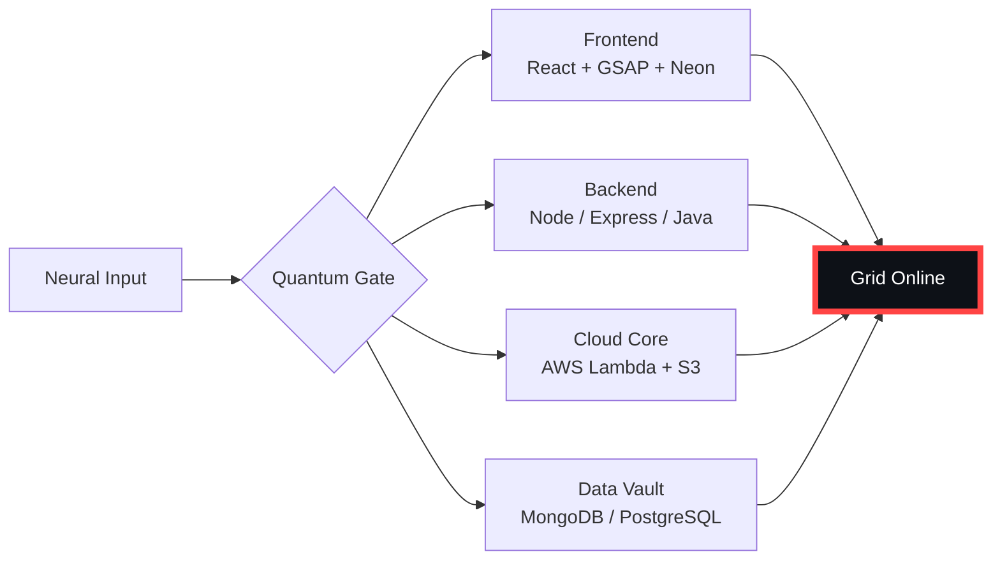

# 🌌 [ NEURAL CORE ACCESS: PENDEMVAMSI ]

<p align="center">
  
</p>

<div align="center">
  
  <br><small>Active Protocol: <strong style="color:#FF4444">NECROMORPH INFEST</strong> 🩸☠️</small>
</div>

## 🔵 NEURAL STATUS READOUT
```text
SUBJECT ID    →  PENDEMVAMSI
ENTITY CLASS  →  SHADOW MONARCH v7
NEURAL RANK   →  B-TIER
GRID SYNC     →  2036/4261 QUANTUM PACKETS
─────── BIO-METRICS (NECROMORPH INFEST) ───────
STRENGTH      134  █████████████████░░░░
AGILITY       115  ███████████████░░░░░░
INTELLIGENCE  138  ██████████████████░░░
VITALITY      107  ██████████████░░░░░░░
```

> **NEURAL BURST ACQUIRED:** +81 QUANTUM PACKETS 
> **SYSTEM MESSAGE:** QUANTUM ENTANGLEMENT CONFIRMED — YOU ARE THE SYSTEM

---

## 🌀 GRID ARCHITECTURE (HOLOGRAPHIC RENDER)



---

## 📡 ACADEMIC NODES – CONQUERED
- [x] B.Tech Neural Engineering (2020–2024) – St. Ann’s Grid
- [x] Intermediate Quantum Core (2018–2020) – Sri Medhavi
- [x] SSC Primary Link (2017–2018) – Sri Geethanjali

---

## ⚡ SKILL NEURAL MATRIX

<details open>
<summary>🔌 ACTIVE NEURAL LINKS</summary>

| Node               | Tier | Integrity Bar                | Status      |
|--------------------|------|------------------------------|-------------|
| Java Core          | S    | ████████████████████ 100%   | OVERCLOCKED |
| Node.js Grid       | S    | ████████████████████ 100%   | OVERCLOCKED |
| React Holo-UI      | A+   | █████████████████░░░ 92%    | ONLINE      |
| AWS Quantum Relay  | S    | ████████████████████ 100%   | SOVEREIGN   |
| Python AI Kernel   | A    | ████████████████░░░░ 85%    | CHARGING    |
| DSA Void Algorithm | A    | █████████████████░░░ 90%    | ACTIVE      |

</details>

---

## 🏅 NEURAL ACHIEVEMENT TOKENS

<p align="center">
  
  
  
  
</p>

---

## 👾 SHADOW ENTITIES – SUMMONED

<p align="center">
  
  <br><strong style="color:#FF4444">ARISE.</strong>
</p>

| Entity | Designation   | Class            | Source Node                     |
|--------|---------------|------------------|---------------------------------|
| SH-01  | Igris         | Void Commander   | AI Financial Oracle             |
| SH-02  | Beru          | Swarm Overlord   | WebRTC Quantum Stream           |
| SH-03  | Kaisel        | Void Wyrm        | Geolocation Shadow Relay        |
| SH-04  | Tusk          | Arcane Construct | Global Pandemic Sentinel        |
| SH-05  | Iron          | Armored Bastion  | React Crypto Fortress           |

---

## 📡 GRID ANALYTICS (LIVE FEED)

<p align="center">
  
  <br>
  
  
</p>

---

## 🖥️ CORRUPTED MAINFRAME LOG (401 ENTRIES)

<details>
<summary>OPEN TERMINAL FEED – PROTOCOL: NECROMORPH INFEST</summary>

> [0x6192259A] 🩸☠️ **NECROMORPH INFEST PROTOCOL** #0 | NEURAL LINK STABILIZED | [TRANSMISSION SUCCESS]
> [0x78BF5CDE] 🩸☠️ **NECROMORPH INFEST PROTOCOL** #1 | NEURAL LINK  [GLITCH DETECTED] STABILIZED | [TRANSMISSION SUCCESS]
> [0xDB3D9885] 🩸☠️ **NECROMORPH INFEST PROTOCOL** #2 | NEURAL LINK STABILIZED | [TRANSMISSION SUCCESS]
> [0x96E310AF] 🩸☠️ **NECROMORPH INFEST PROTOCOL** #3 | NEURAL LINK STABILIZED | [TRANSMISSION SUCCESS]
> [0x8625F667] 🩸☠️ **NECROMORPH INFEST PROTOCOL** #4 | NEURAL LINK STABILIZED | [TRANSMISSION SUCCESS]
> [0x47ED03B9] 🩸☠️ **NECROMORPH INFEST PROTOCOL** #5 | NEURAL LINK  [GLITCH DETECTED] STABILIZED | [TRANSMISSION SUCCESS]
> [0x83291C53] 🩸☠️ **NECROMORPH INFEST PROTOCOL** #6 | NEURAL LINK  [GLITCH DETECTED] STABILIZED | [TRANSMISSION SUCCESS]
> [0xEE98BB38] 🩸☠️ **NECROMORPH INFEST PROTOCOL** #7 | NEURAL LINK STABILIZED | [TRANSMISSION SUCCESS]
> [0xEA98AC38] 🩸☠️ **NECROMORPH INFEST PROTOCOL** #8 | NEURAL LINK STABILIZED | [TRANSMISSION SUCCESS]
> [0x74B83FDE] 🩸☠️ **NECROMORPH INFEST PROTOCOL** #9 | NEURAL LINK STABILIZED | [TRANSMISSION SUCCESS]
> [0xBA952C83] 🩸☠️ **NECROMORPH INFEST PROTOCOL** #10 | NEURAL LINK STABILIZED | [TRANSMISSION SUCCESS]
> [0xC2492DAA] 🩸☠️ **NECROMORPH INFEST PROTOCOL** #11 | NEURAL LINK STABILIZED | [TRANSMISSION SUCCESS]
> [0x38F4514C] 🩸☠️ **NECROMORPH INFEST PROTOCOL** #12 | NEURAL LINK STABILIZED | [TRANSMISSION SUCCESS]
> [0x764BB587] 🩸☠️ **NECROMORPH INFEST PROTOCOL** #13 | NEURAL LINK  [GLITCH DETECTED] STABILIZED | [TRANSMISSION SUCCESS]
> [0xB7C0CA68] 🩸☠️ **NECROMORPH INFEST PROTOCOL** #14 | NEURAL LINK STABILIZED | [TRANSMISSION SUCCESS]
> [0x1C9771F3] 🩸☠️ **NECROMORPH INFEST PROTOCOL** #15 | NEURAL LINK STABILIZED | [TRANSMISSION SUCCESS]
> [0xB0A63538] 🩸☠️ **NECROMORPH INFEST PROTOCOL** #16 | NEURAL LINK  [GLITCH DETECTED] STABILIZED | [TRANSMISSION SUCCESS]
> [0x1823C288] 🩸☠️ **NECROMORPH INFEST PROTOCOL** #17 | NEURAL LINK STABILIZED | [TRANSMISSION SUCCESS]
> [0x42B88E86] 🩸☠️ **NECROMORPH INFEST PROTOCOL** #18 | NEURAL LINK STABILIZED | [TRANSMISSION SUCCESS]
> [0x4A8E7CC5] 🩸☠️ **NECROMORPH INFEST PROTOCOL** #19 | NEURAL LINK STABILIZED | [TRANSMISSION SUCCESS]
> [0xB65802D4] 🩸☠️ **NECROMORPH INFEST PROTOCOL** #20 | NEURAL LINK STABILIZED | [TRANSMISSION SUCCESS]
> [0x8F5D9C63] 🩸☠️ **NECROMORPH INFEST PROTOCOL** #21 | NEURAL LINK  [GLITCH DETECTED] STABILIZED | [TRANSMISSION SUCCESS]
> [0xF833E91D] 🩸☠️ **NECROMORPH INFEST PROTOCOL** #22 | NEURAL LINK STABILIZED | [TRANSMISSION SUCCESS]
> [0xBA5E9248] 🩸☠️ **NECROMORPH INFEST PROTOCOL** #23 | NEURAL LINK STABILIZED | [TRANSMISSION SUCCESS]
> [0xAEFECE39] 🩸☠️ **NECROMORPH INFEST PROTOCOL** #24 | NEURAL LINK STABILIZED | [TRANSMISSION SUCCESS]
> [0x5FBE80C6] 🩸☠️ **NECROMORPH INFEST PROTOCOL** #25 | NEURAL LINK STABILIZED | [TRANSMISSION SUCCESS]
> [0x0EF3B190] 🩸☠️ **NECROMORPH INFEST PROTOCOL** #26 | NEURAL LINK STABILIZED | [TRANSMISSION SUCCESS]
> [0x1C750478] 🩸☠️ **NECROMORPH INFEST PROTOCOL** #27 | NEURAL LINK STABILIZED | [TRANSMISSION SUCCESS]
> [0x53C85D31] 🩸☠️ **NECROMORPH INFEST PROTOCOL** #28 | NEURAL LINK STABILIZED | [TRANSMISSION SUCCESS]
> [0xD35EEA0E] 🩸☠️ **NECROMORPH INFEST PROTOCOL** #29 | NEURAL LINK STABILIZED | [TRANSMISSION SUCCESS]
> [0x1C1AC8A8] 🩸☠️ **NECROMORPH INFEST PROTOCOL** #30 | NEURAL LINK  [GLITCH DETECTED] STABILIZED | [TRANSMISSION SUCCESS]
> [0xEF9CC8EB] 🩸☠️ **NECROMORPH INFEST PROTOCOL** #31 | NEURAL LINK STABILIZED | [TRANSMISSION SUCCESS]
> [0x61528777] 🩸☠️ **NECROMORPH INFEST PROTOCOL** #32 | NEURAL LINK STABILIZED | [TRANSMISSION SUCCESS]
> [0xDA8A8F42] 🩸☠️ **NECROMORPH INFEST PROTOCOL** #33 | NEURAL LINK STABILIZED | [TRANSMISSION SUCCESS]
> [0xE29A0EF6] 🩸☠️ **NECROMORPH INFEST PROTOCOL** #34 | NEURAL LINK STABILIZED | [TRANSMISSION SUCCESS]
> [0xEE744444] 🩸☠️ **NECROMORPH INFEST PROTOCOL** #35 | NEURAL LINK STABILIZED | [TRANSMISSION SUCCESS]
> [0x5ADCF509] 🩸☠️ **NECROMORPH INFEST PROTOCOL** #36 | NEURAL LINK STABILIZED | [TRANSMISSION SUCCESS]
> [0xF110ADF2] 🩸☠️ **NECROMORPH INFEST PROTOCOL** #37 | NEURAL LINK STABILIZED | [TRANSMISSION SUCCESS]
> [0x4ABCA96D] 🩸☠️ **NECROMORPH INFEST PROTOCOL** #38 | NEURAL LINK  [GLITCH DETECTED] STABILIZED | [TRANSMISSION SUCCESS]
> [0x19F1D77B] 🩸☠️ **NECROMORPH INFEST PROTOCOL** #39 | NEURAL LINK STABILIZED | [TRANSMISSION SUCCESS]
> [0x28B7EF3F] 🩸☠️ **NECROMORPH INFEST PROTOCOL** #40 | NEURAL LINK  [GLITCH DETECTED] STABILIZED | [TRANSMISSION SUCCESS]
> [0x3AE249C5] 🩸☠️ **NECROMORPH INFEST PROTOCOL** #41 | NEURAL LINK STABILIZED | [TRANSMISSION SUCCESS]
> [0x67A9E461] 🩸☠️ **NECROMORPH INFEST PROTOCOL** #42 | NEURAL LINK STABILIZED | [TRANSMISSION SUCCESS]
> [0x80E9E9AE] 🩸☠️ **NECROMORPH INFEST PROTOCOL** #43 | NEURAL LINK STABILIZED | [TRANSMISSION SUCCESS]
> [0xF1C57DF0] 🩸☠️ **NECROMORPH INFEST PROTOCOL** #44 | NEURAL LINK STABILIZED | [TRANSMISSION SUCCESS]
> [0x5EC76003] 🩸☠️ **NECROMORPH INFEST PROTOCOL** #45 | NEURAL LINK STABILIZED | [TRANSMISSION SUCCESS]
> [0xF14CBB35] 🩸☠️ **NECROMORPH INFEST PROTOCOL** #46 | NEURAL LINK STABILIZED | [TRANSMISSION SUCCESS]
> [0xE226FDA5] 🩸☠️ **NECROMORPH INFEST PROTOCOL** #47 | NEURAL LINK  [GLITCH DETECTED] STABILIZED | [TRANSMISSION SUCCESS]
> [0x5094E298] 🩸☠️ **NECROMORPH INFEST PROTOCOL** #48 | NEURAL LINK STABILIZED | [TRANSMISSION SUCCESS]
> [0x37132440] 🩸☠️ **NECROMORPH INFEST PROTOCOL** #49 | NEURAL LINK STABILIZED | [TRANSMISSION SUCCESS]
> [0x6CED2FB7] 🩸☠️ **NECROMORPH INFEST PROTOCOL** #50 | NEURAL LINK STABILIZED | [TRANSMISSION SUCCESS]
> [0x57013138] 🩸☠️ **NECROMORPH INFEST PROTOCOL** #51 | NEURAL LINK  [GLITCH DETECTED] STABILIZED | [TRANSMISSION SUCCESS]
> [0xD88092CE] 🩸☠️ **NECROMORPH INFEST PROTOCOL** #52 | NEURAL LINK  [GLITCH DETECTED] STABILIZED | [TRANSMISSION SUCCESS]
> [0x8DB7C15D] 🩸☠️ **NECROMORPH INFEST PROTOCOL** #53 | NEURAL LINK  [GLITCH DETECTED] STABILIZED | [TRANSMISSION SUCCESS]
> [0xD472175A] 🩸☠️ **NECROMORPH INFEST PROTOCOL** #54 | NEURAL LINK STABILIZED | [TRANSMISSION SUCCESS]
> [0x5B875979] 🩸☠️ **NECROMORPH INFEST PROTOCOL** #55 | NEURAL LINK  [GLITCH DETECTED] STABILIZED | [TRANSMISSION SUCCESS]
> [0xCA38A29A] 🩸☠️ **NECROMORPH INFEST PROTOCOL** #56 | NEURAL LINK STABILIZED | [TRANSMISSION SUCCESS]
> [0xE1303D1C] 🩸☠️ **NECROMORPH INFEST PROTOCOL** #57 | NEURAL LINK STABILIZED | [TRANSMISSION SUCCESS]
> [0xF40A2CCB] 🩸☠️ **NECROMORPH INFEST PROTOCOL** #58 | NEURAL LINK STABILIZED | [TRANSMISSION SUCCESS]
> [0xA6226D98] 🩸☠️ **NECROMORPH INFEST PROTOCOL** #59 | NEURAL LINK STABILIZED | [TRANSMISSION SUCCESS]
> [0xE6E2BEA0] 🩸☠️ **NECROMORPH INFEST PROTOCOL** #60 | NEURAL LINK STABILIZED | [TRANSMISSION SUCCESS]
> [0xC46945C8] 🩸☠️ **NECROMORPH INFEST PROTOCOL** #61 | NEURAL LINK STABILIZED | [TRANSMISSION SUCCESS]
> [0x5B7A9561] 🩸☠️ **NECROMORPH INFEST PROTOCOL** #62 | NEURAL LINK STABILIZED | [TRANSMISSION SUCCESS]
> [0x53C433D1] 🩸☠️ **NECROMORPH INFEST PROTOCOL** #63 | NEURAL LINK STABILIZED | [TRANSMISSION SUCCESS]
> [0x0877B715] 🩸☠️ **NECROMORPH INFEST PROTOCOL** #64 | NEURAL LINK STABILIZED | [TRANSMISSION SUCCESS]
> [0x6DF43191] 🩸☠️ **NECROMORPH INFEST PROTOCOL** #65 | NEURAL LINK STABILIZED | [TRANSMISSION SUCCESS]
> [0x46EA3CBC] 🩸☠️ **NECROMORPH INFEST PROTOCOL** #66 | NEURAL LINK STABILIZED | [TRANSMISSION SUCCESS]
> [0x66A55D26] 🩸☠️ **NECROMORPH INFEST PROTOCOL** #67 | NEURAL LINK STABILIZED | [TRANSMISSION SUCCESS]
> [0x8A7D176A] 🩸☠️ **NECROMORPH INFEST PROTOCOL** #68 | NEURAL LINK STABILIZED | [TRANSMISSION SUCCESS]
> [0x5168C7CC] 🩸☠️ **NECROMORPH INFEST PROTOCOL** #69 | NEURAL LINK STABILIZED | [TRANSMISSION SUCCESS]
> [0xB1BAC2A5] 🩸☠️ **NECROMORPH INFEST PROTOCOL** #70 | NEURAL LINK  [GLITCH DETECTED] STABILIZED | [TRANSMISSION SUCCESS]
> [0xDD529507] 🩸☠️ **NECROMORPH INFEST PROTOCOL** #71 | NEURAL LINK  [GLITCH DETECTED] STABILIZED | [TRANSMISSION SUCCESS]
> [0x7F45C8B1] 🩸☠️ **NECROMORPH INFEST PROTOCOL** #72 | NEURAL LINK STABILIZED | [TRANSMISSION SUCCESS]
> [0xE5186992] 🩸☠️ **NECROMORPH INFEST PROTOCOL** #73 | NEURAL LINK STABILIZED | [TRANSMISSION SUCCESS]
> [0x1FF564D3] 🩸☠️ **NECROMORPH INFEST PROTOCOL** #74 | NEURAL LINK STABILIZED | [TRANSMISSION SUCCESS]
> [0x18FDCA19] 🩸☠️ **NECROMORPH INFEST PROTOCOL** #75 | NEURAL LINK  [GLITCH DETECTED] STABILIZED | [TRANSMISSION SUCCESS]
> [0x2FBAA7B0] 🩸☠️ **NECROMORPH INFEST PROTOCOL** #76 | NEURAL LINK STABILIZED | [TRANSMISSION SUCCESS]
> [0xFFEB3748] 🩸☠️ **NECROMORPH INFEST PROTOCOL** #77 | NEURAL LINK STABILIZED | [TRANSMISSION SUCCESS]
> [0x1306D6F7] 🩸☠️ **NECROMORPH INFEST PROTOCOL** #78 | NEURAL LINK STABILIZED | [TRANSMISSION SUCCESS]
> [0x31418724] 🩸☠️ **NECROMORPH INFEST PROTOCOL** #79 | NEURAL LINK  [GLITCH DETECTED] STABILIZED | [TRANSMISSION SUCCESS]
> [0x8FC98ACB] 🩸☠️ **NECROMORPH INFEST PROTOCOL** #80 | NEURAL LINK  [GLITCH DETECTED] STABILIZED | [TRANSMISSION SUCCESS]
> [0x2D23A6A9] 🩸☠️ **NECROMORPH INFEST PROTOCOL** #81 | NEURAL LINK STABILIZED | [TRANSMISSION SUCCESS]
> [0x35CA9309] 🩸☠️ **NECROMORPH INFEST PROTOCOL** #82 | NEURAL LINK STABILIZED | [TRANSMISSION SUCCESS]
> [0x44D8E427] 🩸☠️ **NECROMORPH INFEST PROTOCOL** #83 | NEURAL LINK STABILIZED | [TRANSMISSION SUCCESS]
> [0xD59CF269] 🩸☠️ **NECROMORPH INFEST PROTOCOL** #84 | NEURAL LINK STABILIZED | [TRANSMISSION SUCCESS]
> [0x1C9BE8BE] 🩸☠️ **NECROMORPH INFEST PROTOCOL** #85 | NEURAL LINK  [GLITCH DETECTED] STABILIZED | [TRANSMISSION SUCCESS]
> [0xB945B2A0] 🩸☠️ **NECROMORPH INFEST PROTOCOL** #86 | NEURAL LINK STABILIZED | [TRANSMISSION SUCCESS]
> [0xBAA6175E] 🩸☠️ **NECROMORPH INFEST PROTOCOL** #87 | NEURAL LINK STABILIZED | [TRANSMISSION SUCCESS]
> [0x1167E052] 🩸☠️ **NECROMORPH INFEST PROTOCOL** #88 | NEURAL LINK STABILIZED | [TRANSMISSION SUCCESS]
> [0xDC2F7235] 🩸☠️ **NECROMORPH INFEST PROTOCOL** #89 | NEURAL LINK STABILIZED | [TRANSMISSION SUCCESS]
> [0xFEEF946F] 🩸☠️ **NECROMORPH INFEST PROTOCOL** #90 | NEURAL LINK STABILIZED | [TRANSMISSION SUCCESS]
> [0xB2C94931] 🩸☠️ **NECROMORPH INFEST PROTOCOL** #91 | NEURAL LINK STABILIZED | [TRANSMISSION SUCCESS]
> [0x15E64D53] 🩸☠️ **NECROMORPH INFEST PROTOCOL** #92 | NEURAL LINK  [GLITCH DETECTED] STABILIZED | [TRANSMISSION SUCCESS]
> [0x82BF8CE3] 🩸☠️ **NECROMORPH INFEST PROTOCOL** #93 | NEURAL LINK STABILIZED | [TRANSMISSION SUCCESS]
> [0x87EAA9A2] 🩸☠️ **NECROMORPH INFEST PROTOCOL** #94 | NEURAL LINK STABILIZED | [TRANSMISSION SUCCESS]
> [0x88F77728] 🩸☠️ **NECROMORPH INFEST PROTOCOL** #95 | NEURAL LINK STABILIZED | [TRANSMISSION SUCCESS]
> [0xAB114E4F] 🩸☠️ **NECROMORPH INFEST PROTOCOL** #96 | NEURAL LINK STABILIZED | [TRANSMISSION SUCCESS]
> [0xE3AC49A5] 🩸☠️ **NECROMORPH INFEST PROTOCOL** #97 | NEURAL LINK STABILIZED | [TRANSMISSION SUCCESS]
> [0xB48A9BD0] 🩸☠️ **NECROMORPH INFEST PROTOCOL** #98 | NEURAL LINK STABILIZED | [TRANSMISSION SUCCESS]
> [0xC665117F] 🩸☠️ **NECROMORPH INFEST PROTOCOL** #99 | NEURAL LINK STABILIZED | [TRANSMISSION SUCCESS]
> [0x41AB2917] 🩸☠️ **NECROMORPH INFEST PROTOCOL** #100 | NEURAL LINK STABILIZED | [TRANSMISSION SUCCESS]
> [0x86AFF5C6] 🩸☠️ **NECROMORPH INFEST PROTOCOL** #101 | NEURAL LINK STABILIZED | [TRANSMISSION SUCCESS]
> [0x790FB0B3] 🩸☠️ **NECROMORPH INFEST PROTOCOL** #102 | NEURAL LINK STABILIZED | [TRANSMISSION SUCCESS]
> [0xF5AF3B2B] 🩸☠️ **NECROMORPH INFEST PROTOCOL** #103 | NEURAL LINK STABILIZED | [TRANSMISSION SUCCESS]
> [0xBC47D9B8] 🩸☠️ **NECROMORPH INFEST PROTOCOL** #104 | NEURAL LINK STABILIZED | [TRANSMISSION SUCCESS]
> [0x60EDA8B6] 🩸☠️ **NECROMORPH INFEST PROTOCOL** #105 | NEURAL LINK STABILIZED | [TRANSMISSION SUCCESS]
> [0x4DFF2B22] 🩸☠️ **NECROMORPH INFEST PROTOCOL** #106 | NEURAL LINK STABILIZED | [TRANSMISSION SUCCESS]
> [0x90EB55D9] 🩸☠️ **NECROMORPH INFEST PROTOCOL** #107 | NEURAL LINK STABILIZED | [TRANSMISSION SUCCESS]
> [0xAEE0CCC8] 🩸☠️ **NECROMORPH INFEST PROTOCOL** #108 | NEURAL LINK STABILIZED | [TRANSMISSION SUCCESS]
> [0x7F9D9A38] 🩸☠️ **NECROMORPH INFEST PROTOCOL** #109 | NEURAL LINK STABILIZED | [TRANSMISSION SUCCESS]
> [0x5E4ED048] 🩸☠️ **NECROMORPH INFEST PROTOCOL** #110 | NEURAL LINK STABILIZED | [TRANSMISSION SUCCESS]
> [0xB4DD071E] 🩸☠️ **NECROMORPH INFEST PROTOCOL** #111 | NEURAL LINK STABILIZED | [TRANSMISSION SUCCESS]
> [0xC9AC518D] 🩸☠️ **NECROMORPH INFEST PROTOCOL** #112 | NEURAL LINK STABILIZED | [TRANSMISSION SUCCESS]
> [0x95D616FD] 🩸☠️ **NECROMORPH INFEST PROTOCOL** #113 | NEURAL LINK STABILIZED | [TRANSMISSION SUCCESS]
> [0x71A59F98] 🩸☠️ **NECROMORPH INFEST PROTOCOL** #114 | NEURAL LINK STABILIZED | [TRANSMISSION SUCCESS]
> [0x654C14CB] 🩸☠️ **NECROMORPH INFEST PROTOCOL** #115 | NEURAL LINK STABILIZED | [TRANSMISSION SUCCESS]
> [0x40CC1895] 🩸☠️ **NECROMORPH INFEST PROTOCOL** #116 | NEURAL LINK STABILIZED | [TRANSMISSION SUCCESS]
> [0x8A01AB0E] 🩸☠️ **NECROMORPH INFEST PROTOCOL** #117 | NEURAL LINK STABILIZED | [TRANSMISSION SUCCESS]
> [0x184FE449] 🩸☠️ **NECROMORPH INFEST PROTOCOL** #118 | NEURAL LINK STABILIZED | [TRANSMISSION SUCCESS]
> [0x0CFA71AD] 🩸☠️ **NECROMORPH INFEST PROTOCOL** #119 | NEURAL LINK STABILIZED | [TRANSMISSION SUCCESS]
> [0xBE479334] 🩸☠️ **NECROMORPH INFEST PROTOCOL** #120 | NEURAL LINK  [GLITCH DETECTED] STABILIZED | [TRANSMISSION SUCCESS]
> [0x94EEA3EC] 🩸☠️ **NECROMORPH INFEST PROTOCOL** #121 | NEURAL LINK STABILIZED | [TRANSMISSION SUCCESS]
> [0x911E195E] 🩸☠️ **NECROMORPH INFEST PROTOCOL** #122 | NEURAL LINK STABILIZED | [TRANSMISSION SUCCESS]
> [0x7884DCCF] 🩸☠️ **NECROMORPH INFEST PROTOCOL** #123 | NEURAL LINK STABILIZED | [TRANSMISSION SUCCESS]
> [0xADA83C8F] 🩸☠️ **NECROMORPH INFEST PROTOCOL** #124 | NEURAL LINK STABILIZED | [TRANSMISSION SUCCESS]
> [0xA631802B] 🩸☠️ **NECROMORPH INFEST PROTOCOL** #125 | NEURAL LINK STABILIZED | [TRANSMISSION SUCCESS]
> [0xE34D57D0] 🩸☠️ **NECROMORPH INFEST PROTOCOL** #126 | NEURAL LINK STABILIZED | [TRANSMISSION SUCCESS]
> [0xAB002F77] 🩸☠️ **NECROMORPH INFEST PROTOCOL** #127 | NEURAL LINK STABILIZED | [TRANSMISSION SUCCESS]
> [0x9BD4D07D] 🩸☠️ **NECROMORPH INFEST PROTOCOL** #128 | NEURAL LINK STABILIZED | [TRANSMISSION SUCCESS]
> [0x67313145] 🩸☠️ **NECROMORPH INFEST PROTOCOL** #129 | NEURAL LINK  [GLITCH DETECTED] STABILIZED | [TRANSMISSION SUCCESS]
> [0xB7A46E52] 🩸☠️ **NECROMORPH INFEST PROTOCOL** #130 | NEURAL LINK STABILIZED | [TRANSMISSION SUCCESS]
> [0xB1087D2D] 🩸☠️ **NECROMORPH INFEST PROTOCOL** #131 | NEURAL LINK STABILIZED | [TRANSMISSION SUCCESS]
> [0xF1B7A68C] 🩸☠️ **NECROMORPH INFEST PROTOCOL** #132 | NEURAL LINK STABILIZED | [TRANSMISSION SUCCESS]
> [0xA6A4BC85] 🩸☠️ **NECROMORPH INFEST PROTOCOL** #133 | NEURAL LINK STABILIZED | [TRANSMISSION SUCCESS]
> [0xEC962BD6] 🩸☠️ **NECROMORPH INFEST PROTOCOL** #134 | NEURAL LINK STABILIZED | [TRANSMISSION SUCCESS]
> [0x15A3EF16] 🩸☠️ **NECROMORPH INFEST PROTOCOL** #135 | NEURAL LINK STABILIZED | [TRANSMISSION SUCCESS]
> [0x30879855] 🩸☠️ **NECROMORPH INFEST PROTOCOL** #136 | NEURAL LINK  [GLITCH DETECTED] STABILIZED | [TRANSMISSION SUCCESS]
> [0xC56F8613] 🩸☠️ **NECROMORPH INFEST PROTOCOL** #137 | NEURAL LINK  [GLITCH DETECTED] STABILIZED | [TRANSMISSION SUCCESS]
> [0xC798F1D0] 🩸☠️ **NECROMORPH INFEST PROTOCOL** #138 | NEURAL LINK STABILIZED | [TRANSMISSION SUCCESS]
> [0x010B1F14] 🩸☠️ **NECROMORPH INFEST PROTOCOL** #139 | NEURAL LINK STABILIZED | [TRANSMISSION SUCCESS]
> [0x7D225177] 🩸☠️ **NECROMORPH INFEST PROTOCOL** #140 | NEURAL LINK STABILIZED | [TRANSMISSION SUCCESS]
> [0x13278FFE] 🩸☠️ **NECROMORPH INFEST PROTOCOL** #141 | NEURAL LINK STABILIZED | [TRANSMISSION SUCCESS]
> [0x74E3E242] 🩸☠️ **NECROMORPH INFEST PROTOCOL** #142 | NEURAL LINK STABILIZED | [TRANSMISSION SUCCESS]
> [0x03CDD5BF] 🩸☠️ **NECROMORPH INFEST PROTOCOL** #143 | NEURAL LINK STABILIZED | [TRANSMISSION SUCCESS]
> [0x846AC910] 🩸☠️ **NECROMORPH INFEST PROTOCOL** #144 | NEURAL LINK STABILIZED | [TRANSMISSION SUCCESS]
> [0x8145CB8F] 🩸☠️ **NECROMORPH INFEST PROTOCOL** #145 | NEURAL LINK STABILIZED | [TRANSMISSION SUCCESS]
> [0xE6B2A409] 🩸☠️ **NECROMORPH INFEST PROTOCOL** #146 | NEURAL LINK STABILIZED | [TRANSMISSION SUCCESS]
> [0xC2929176] 🩸☠️ **NECROMORPH INFEST PROTOCOL** #147 | NEURAL LINK  [GLITCH DETECTED] STABILIZED | [TRANSMISSION SUCCESS]
> [0x70ACE07F] 🩸☠️ **NECROMORPH INFEST PROTOCOL** #148 | NEURAL LINK STABILIZED | [TRANSMISSION SUCCESS]
> [0x16875030] 🩸☠️ **NECROMORPH INFEST PROTOCOL** #149 | NEURAL LINK  [GLITCH DETECTED] STABILIZED | [TRANSMISSION SUCCESS]
> [0xDFA2FA5B] 🩸☠️ **NECROMORPH INFEST PROTOCOL** #150 | NEURAL LINK STABILIZED | [TRANSMISSION SUCCESS]
> [0x48D0A0A2] 🩸☠️ **NECROMORPH INFEST PROTOCOL** #151 | NEURAL LINK STABILIZED | [TRANSMISSION SUCCESS]
> [0xE35CAD07] 🩸☠️ **NECROMORPH INFEST PROTOCOL** #152 | NEURAL LINK STABILIZED | [TRANSMISSION SUCCESS]
> [0xA3A1CBD6] 🩸☠️ **NECROMORPH INFEST PROTOCOL** #153 | NEURAL LINK STABILIZED | [TRANSMISSION SUCCESS]
> [0x47221282] 🩸☠️ **NECROMORPH INFEST PROTOCOL** #154 | NEURAL LINK STABILIZED | [TRANSMISSION SUCCESS]
> [0x1D0C99A5] 🩸☠️ **NECROMORPH INFEST PROTOCOL** #155 | NEURAL LINK STABILIZED | [TRANSMISSION SUCCESS]
> [0x682EAC35] 🩸☠️ **NECROMORPH INFEST PROTOCOL** #156 | NEURAL LINK STABILIZED | [TRANSMISSION SUCCESS]
> [0x201A06D3] 🩸☠️ **NECROMORPH INFEST PROTOCOL** #157 | NEURAL LINK  [GLITCH DETECTED] STABILIZED | [TRANSMISSION SUCCESS]
> [0x50A12D14] 🩸☠️ **NECROMORPH INFEST PROTOCOL** #158 | NEURAL LINK STABILIZED | [TRANSMISSION SUCCESS]
> [0xB572D5EF] 🩸☠️ **NECROMORPH INFEST PROTOCOL** #159 | NEURAL LINK STABILIZED | [TRANSMISSION SUCCESS]
> [0x0F2D7641] 🩸☠️ **NECROMORPH INFEST PROTOCOL** #160 | NEURAL LINK STABILIZED | [TRANSMISSION SUCCESS]
> [0x521FE3FC] 🩸☠️ **NECROMORPH INFEST PROTOCOL** #161 | NEURAL LINK STABILIZED | [TRANSMISSION SUCCESS]
> [0xD9932270] 🩸☠️ **NECROMORPH INFEST PROTOCOL** #162 | NEURAL LINK STABILIZED | [TRANSMISSION SUCCESS]
> [0xA79BAA3B] 🩸☠️ **NECROMORPH INFEST PROTOCOL** #163 | NEURAL LINK  [GLITCH DETECTED] STABILIZED | [TRANSMISSION SUCCESS]
> [0xE6381F77] 🩸☠️ **NECROMORPH INFEST PROTOCOL** #164 | NEURAL LINK STABILIZED | [TRANSMISSION SUCCESS]
> [0xBBB19E15] 🩸☠️ **NECROMORPH INFEST PROTOCOL** #165 | NEURAL LINK STABILIZED | [TRANSMISSION SUCCESS]
> [0xD913C540] 🩸☠️ **NECROMORPH INFEST PROTOCOL** #166 | NEURAL LINK STABILIZED | [TRANSMISSION SUCCESS]
> [0x165B9CFC] 🩸☠️ **NECROMORPH INFEST PROTOCOL** #167 | NEURAL LINK STABILIZED | [TRANSMISSION SUCCESS]
> [0xE07281F6] 🩸☠️ **NECROMORPH INFEST PROTOCOL** #168 | NEURAL LINK STABILIZED | [TRANSMISSION SUCCESS]
> [0x762E740D] 🩸☠️ **NECROMORPH INFEST PROTOCOL** #169 | NEURAL LINK STABILIZED | [TRANSMISSION SUCCESS]
> [0xAF7BEDB3] 🩸☠️ **NECROMORPH INFEST PROTOCOL** #170 | NEURAL LINK STABILIZED | [TRANSMISSION SUCCESS]
> [0xF4DB22AC] 🩸☠️ **NECROMORPH INFEST PROTOCOL** #171 | NEURAL LINK STABILIZED | [TRANSMISSION SUCCESS]
> [0xA7E10409] 🩸☠️ **NECROMORPH INFEST PROTOCOL** #172 | NEURAL LINK STABILIZED | [TRANSMISSION SUCCESS]
> [0xDD9BA6C0] 🩸☠️ **NECROMORPH INFEST PROTOCOL** #173 | NEURAL LINK STABILIZED | [TRANSMISSION SUCCESS]
> [0x1D1A8505] 🩸☠️ **NECROMORPH INFEST PROTOCOL** #174 | NEURAL LINK STABILIZED | [TRANSMISSION SUCCESS]
> [0x02EF3A4B] 🩸☠️ **NECROMORPH INFEST PROTOCOL** #175 | NEURAL LINK STABILIZED | [TRANSMISSION SUCCESS]
> [0xF01E5F1F] 🩸☠️ **NECROMORPH INFEST PROTOCOL** #176 | NEURAL LINK STABILIZED | [TRANSMISSION SUCCESS]
> [0x691FAD49] 🩸☠️ **NECROMORPH INFEST PROTOCOL** #177 | NEURAL LINK STABILIZED | [TRANSMISSION SUCCESS]
> [0x8E8AFE92] 🩸☠️ **NECROMORPH INFEST PROTOCOL** #178 | NEURAL LINK STABILIZED | [TRANSMISSION SUCCESS]
> [0x4617B76F] 🩸☠️ **NECROMORPH INFEST PROTOCOL** #179 | NEURAL LINK STABILIZED | [TRANSMISSION SUCCESS]
> [0xB6D9F39A] 🩸☠️ **NECROMORPH INFEST PROTOCOL** #180 | NEURAL LINK STABILIZED | [TRANSMISSION SUCCESS]
> [0x6C581B42] 🩸☠️ **NECROMORPH INFEST PROTOCOL** #181 | NEURAL LINK STABILIZED | [TRANSMISSION SUCCESS]
> [0xAD3DCFF9] 🩸☠️ **NECROMORPH INFEST PROTOCOL** #182 | NEURAL LINK STABILIZED | [TRANSMISSION SUCCESS]
> [0x9DE0F933] 🩸☠️ **NECROMORPH INFEST PROTOCOL** #183 | NEURAL LINK STABILIZED | [TRANSMISSION SUCCESS]
> [0xE2438569] 🩸☠️ **NECROMORPH INFEST PROTOCOL** #184 | NEURAL LINK STABILIZED | [TRANSMISSION SUCCESS]
> [0x5E4D2E26] 🩸☠️ **NECROMORPH INFEST PROTOCOL** #185 | NEURAL LINK STABILIZED | [TRANSMISSION SUCCESS]
> [0x9A4E2B27] 🩸☠️ **NECROMORPH INFEST PROTOCOL** #186 | NEURAL LINK STABILIZED | [TRANSMISSION SUCCESS]
> [0x6E5D4859] 🩸☠️ **NECROMORPH INFEST PROTOCOL** #187 | NEURAL LINK STABILIZED | [TRANSMISSION SUCCESS]
> [0x0184254E] 🩸☠️ **NECROMORPH INFEST PROTOCOL** #188 | NEURAL LINK STABILIZED | [TRANSMISSION SUCCESS]
> [0xE32968C9] 🩸☠️ **NECROMORPH INFEST PROTOCOL** #189 | NEURAL LINK STABILIZED | [TRANSMISSION SUCCESS]
> [0x49534112] 🩸☠️ **NECROMORPH INFEST PROTOCOL** #190 | NEURAL LINK STABILIZED | [TRANSMISSION SUCCESS]
> [0xB96207A2] 🩸☠️ **NECROMORPH INFEST PROTOCOL** #191 | NEURAL LINK STABILIZED | [TRANSMISSION SUCCESS]
> [0x3109F84E] 🩸☠️ **NECROMORPH INFEST PROTOCOL** #192 | NEURAL LINK STABILIZED | [TRANSMISSION SUCCESS]
> [0x2205D2A3] 🩸☠️ **NECROMORPH INFEST PROTOCOL** #193 | NEURAL LINK STABILIZED | [TRANSMISSION SUCCESS]
> [0x6442660A] 🩸☠️ **NECROMORPH INFEST PROTOCOL** #194 | NEURAL LINK  [GLITCH DETECTED] STABILIZED | [TRANSMISSION SUCCESS]
> [0xD373E2BD] 🩸☠️ **NECROMORPH INFEST PROTOCOL** #195 | NEURAL LINK STABILIZED | [TRANSMISSION SUCCESS]
> [0x9409EA7B] 🩸☠️ **NECROMORPH INFEST PROTOCOL** #196 | NEURAL LINK STABILIZED | [TRANSMISSION SUCCESS]
> [0xACA2A551] 🩸☠️ **NECROMORPH INFEST PROTOCOL** #197 | NEURAL LINK STABILIZED | [TRANSMISSION SUCCESS]
> [0xABF5D2F8] 🩸☠️ **NECROMORPH INFEST PROTOCOL** #198 | NEURAL LINK STABILIZED | [TRANSMISSION SUCCESS]
> [0x0E2F0E26] 🩸☠️ **NECROMORPH INFEST PROTOCOL** #199 | NEURAL LINK STABILIZED | [TRANSMISSION SUCCESS]
> [0x4173D878] 🩸☠️ **NECROMORPH INFEST PROTOCOL** #200 | NEURAL LINK STABILIZED | [TRANSMISSION SUCCESS]
> [0x3A8CABDA] 🩸☠️ **NECROMORPH INFEST PROTOCOL** #201 | NEURAL LINK STABILIZED | [TRANSMISSION SUCCESS]
> [0xE4B4E4D7] 🩸☠️ **NECROMORPH INFEST PROTOCOL** #202 | NEURAL LINK STABILIZED | [TRANSMISSION SUCCESS]
> [0x4CCC6E1A] 🩸☠️ **NECROMORPH INFEST PROTOCOL** #203 | NEURAL LINK STABILIZED | [TRANSMISSION SUCCESS]
> [0x4A17225D] 🩸☠️ **NECROMORPH INFEST PROTOCOL** #204 | NEURAL LINK STABILIZED | [TRANSMISSION SUCCESS]
> [0xE2AF5178] 🩸☠️ **NECROMORPH INFEST PROTOCOL** #205 | NEURAL LINK STABILIZED | [TRANSMISSION SUCCESS]
> [0x13C09972] 🩸☠️ **NECROMORPH INFEST PROTOCOL** #206 | NEURAL LINK STABILIZED | [TRANSMISSION SUCCESS]
> [0xAF986D46] 🩸☠️ **NECROMORPH INFEST PROTOCOL** #207 | NEURAL LINK STABILIZED | [TRANSMISSION SUCCESS]
> [0xA5710F1D] 🩸☠️ **NECROMORPH INFEST PROTOCOL** #208 | NEURAL LINK STABILIZED | [TRANSMISSION SUCCESS]
> [0x3592260F] 🩸☠️ **NECROMORPH INFEST PROTOCOL** #209 | NEURAL LINK STABILIZED | [TRANSMISSION SUCCESS]
> [0x95299950] 🩸☠️ **NECROMORPH INFEST PROTOCOL** #210 | NEURAL LINK STABILIZED | [TRANSMISSION SUCCESS]
> [0x4FE80998] 🩸☠️ **NECROMORPH INFEST PROTOCOL** #211 | NEURAL LINK  [GLITCH DETECTED] STABILIZED | [TRANSMISSION SUCCESS]
> [0xE0E38A8C] 🩸☠️ **NECROMORPH INFEST PROTOCOL** #212 | NEURAL LINK STABILIZED | [TRANSMISSION SUCCESS]
> [0x8820EF99] 🩸☠️ **NECROMORPH INFEST PROTOCOL** #213 | NEURAL LINK STABILIZED | [TRANSMISSION SUCCESS]
> [0x9A681622] 🩸☠️ **NECROMORPH INFEST PROTOCOL** #214 | NEURAL LINK STABILIZED | [TRANSMISSION SUCCESS]
> [0xFC236B86] 🩸☠️ **NECROMORPH INFEST PROTOCOL** #215 | NEURAL LINK STABILIZED | [TRANSMISSION SUCCESS]
> [0xA955A830] 🩸☠️ **NECROMORPH INFEST PROTOCOL** #216 | NEURAL LINK STABILIZED | [TRANSMISSION SUCCESS]
> [0xAD0C2AD0] 🩸☠️ **NECROMORPH INFEST PROTOCOL** #217 | NEURAL LINK STABILIZED | [TRANSMISSION SUCCESS]
> [0x189DEFDE] 🩸☠️ **NECROMORPH INFEST PROTOCOL** #218 | NEURAL LINK STABILIZED | [TRANSMISSION SUCCESS]
> [0xAD07F0E6] 🩸☠️ **NECROMORPH INFEST PROTOCOL** #219 | NEURAL LINK STABILIZED | [TRANSMISSION SUCCESS]
> [0xF85A659C] 🩸☠️ **NECROMORPH INFEST PROTOCOL** #220 | NEURAL LINK STABILIZED | [TRANSMISSION SUCCESS]
> [0x5D4065CA] 🩸☠️ **NECROMORPH INFEST PROTOCOL** #221 | NEURAL LINK STABILIZED | [TRANSMISSION SUCCESS]
> [0x70BD60EE] 🩸☠️ **NECROMORPH INFEST PROTOCOL** #222 | NEURAL LINK STABILIZED | [TRANSMISSION SUCCESS]
> [0x7AD0744E] 🩸☠️ **NECROMORPH INFEST PROTOCOL** #223 | NEURAL LINK  [GLITCH DETECTED] STABILIZED | [TRANSMISSION SUCCESS]
> [0xFC4DE6FD] 🩸☠️ **NECROMORPH INFEST PROTOCOL** #224 | NEURAL LINK STABILIZED | [TRANSMISSION SUCCESS]
> [0x81AA6AE5] 🩸☠️ **NECROMORPH INFEST PROTOCOL** #225 | NEURAL LINK STABILIZED | [TRANSMISSION SUCCESS]
> [0x9E6034C8] 🩸☠️ **NECROMORPH INFEST PROTOCOL** #226 | NEURAL LINK  [GLITCH DETECTED] STABILIZED | [TRANSMISSION SUCCESS]
> [0xEAD80B54] 🩸☠️ **NECROMORPH INFEST PROTOCOL** #227 | NEURAL LINK STABILIZED | [TRANSMISSION SUCCESS]
> [0xAD398389] 🩸☠️ **NECROMORPH INFEST PROTOCOL** #228 | NEURAL LINK STABILIZED | [TRANSMISSION SUCCESS]
> [0xFEEF3EF7] 🩸☠️ **NECROMORPH INFEST PROTOCOL** #229 | NEURAL LINK STABILIZED | [TRANSMISSION SUCCESS]
> [0x2E062B4F] 🩸☠️ **NECROMORPH INFEST PROTOCOL** #230 | NEURAL LINK  [GLITCH DETECTED] STABILIZED | [TRANSMISSION SUCCESS]
> [0xF83EA455] 🩸☠️ **NECROMORPH INFEST PROTOCOL** #231 | NEURAL LINK STABILIZED | [TRANSMISSION SUCCESS]
> [0x5018232F] 🩸☠️ **NECROMORPH INFEST PROTOCOL** #232 | NEURAL LINK STABILIZED | [TRANSMISSION SUCCESS]
> [0x24E9EE58] 🩸☠️ **NECROMORPH INFEST PROTOCOL** #233 | NEURAL LINK  [GLITCH DETECTED] STABILIZED | [TRANSMISSION SUCCESS]
> [0xB1F1AADD] 🩸☠️ **NECROMORPH INFEST PROTOCOL** #234 | NEURAL LINK STABILIZED | [TRANSMISSION SUCCESS]
> [0x4FD35BDB] 🩸☠️ **NECROMORPH INFEST PROTOCOL** #235 | NEURAL LINK STABILIZED | [TRANSMISSION SUCCESS]
> [0x449C511D] 🩸☠️ **NECROMORPH INFEST PROTOCOL** #236 | NEURAL LINK STABILIZED | [TRANSMISSION SUCCESS]
> [0x2A1317B6] 🩸☠️ **NECROMORPH INFEST PROTOCOL** #237 | NEURAL LINK STABILIZED | [TRANSMISSION SUCCESS]
> [0xE04CF69E] 🩸☠️ **NECROMORPH INFEST PROTOCOL** #238 | NEURAL LINK  [GLITCH DETECTED] STABILIZED | [TRANSMISSION SUCCESS]
> [0xB2ED4D6E] 🩸☠️ **NECROMORPH INFEST PROTOCOL** #239 | NEURAL LINK STABILIZED | [TRANSMISSION SUCCESS]
> [0xFFF5218A] 🩸☠️ **NECROMORPH INFEST PROTOCOL** #240 | NEURAL LINK STABILIZED | [TRANSMISSION SUCCESS]
> [0x7B29905F] 🩸☠️ **NECROMORPH INFEST PROTOCOL** #241 | NEURAL LINK STABILIZED | [TRANSMISSION SUCCESS]
> [0x3DF7F20D] 🩸☠️ **NECROMORPH INFEST PROTOCOL** #242 | NEURAL LINK STABILIZED | [TRANSMISSION SUCCESS]
> [0x215B0592] 🩸☠️ **NECROMORPH INFEST PROTOCOL** #243 | NEURAL LINK STABILIZED | [TRANSMISSION SUCCESS]
> [0x2BDDFA9A] 🩸☠️ **NECROMORPH INFEST PROTOCOL** #244 | NEURAL LINK STABILIZED | [TRANSMISSION SUCCESS]
> [0xB648A14D] 🩸☠️ **NECROMORPH INFEST PROTOCOL** #245 | NEURAL LINK STABILIZED | [TRANSMISSION SUCCESS]
> [0x24312281] 🩸☠️ **NECROMORPH INFEST PROTOCOL** #246 | NEURAL LINK STABILIZED | [TRANSMISSION SUCCESS]
> [0xF381F156] 🩸☠️ **NECROMORPH INFEST PROTOCOL** #247 | NEURAL LINK  [GLITCH DETECTED] STABILIZED | [TRANSMISSION SUCCESS]
> [0xDA898F93] 🩸☠️ **NECROMORPH INFEST PROTOCOL** #248 | NEURAL LINK STABILIZED | [TRANSMISSION SUCCESS]
> [0x05A2BB93] 🩸☠️ **NECROMORPH INFEST PROTOCOL** #249 | NEURAL LINK STABILIZED | [TRANSMISSION SUCCESS]
> [0x2CB1A7FA] 🩸☠️ **NECROMORPH INFEST PROTOCOL** #250 | NEURAL LINK STABILIZED | [TRANSMISSION SUCCESS]
> [0x7FA135D3] 🩸☠️ **NECROMORPH INFEST PROTOCOL** #251 | NEURAL LINK STABILIZED | [TRANSMISSION SUCCESS]
> [0x67C5F433] 🩸☠️ **NECROMORPH INFEST PROTOCOL** #252 | NEURAL LINK STABILIZED | [TRANSMISSION SUCCESS]
> [0x74084583] 🩸☠️ **NECROMORPH INFEST PROTOCOL** #253 | NEURAL LINK  [GLITCH DETECTED] STABILIZED | [TRANSMISSION SUCCESS]
> [0xE1B664C8] 🩸☠️ **NECROMORPH INFEST PROTOCOL** #254 | NEURAL LINK STABILIZED | [TRANSMISSION SUCCESS]
> [0xE6655A5F] 🩸☠️ **NECROMORPH INFEST PROTOCOL** #255 | NEURAL LINK  [GLITCH DETECTED] STABILIZED | [TRANSMISSION SUCCESS]
> [0x771C22E3] 🩸☠️ **NECROMORPH INFEST PROTOCOL** #256 | NEURAL LINK STABILIZED | [TRANSMISSION SUCCESS]
> [0x5FF44ECE] 🩸☠️ **NECROMORPH INFEST PROTOCOL** #257 | NEURAL LINK  [GLITCH DETECTED] STABILIZED | [TRANSMISSION SUCCESS]
> [0xF31C10A8] 🩸☠️ **NECROMORPH INFEST PROTOCOL** #258 | NEURAL LINK STABILIZED | [TRANSMISSION SUCCESS]
> [0xE0AB749F] 🩸☠️ **NECROMORPH INFEST PROTOCOL** #259 | NEURAL LINK STABILIZED | [TRANSMISSION SUCCESS]
> [0x80C55198] 🩸☠️ **NECROMORPH INFEST PROTOCOL** #260 | NEURAL LINK STABILIZED | [TRANSMISSION SUCCESS]
> [0x98F51377] 🩸☠️ **NECROMORPH INFEST PROTOCOL** #261 | NEURAL LINK STABILIZED | [TRANSMISSION SUCCESS]
> [0x0E15F5AD] 🩸☠️ **NECROMORPH INFEST PROTOCOL** #262 | NEURAL LINK STABILIZED | [TRANSMISSION SUCCESS]
> [0x0742E810] 🩸☠️ **NECROMORPH INFEST PROTOCOL** #263 | NEURAL LINK STABILIZED | [TRANSMISSION SUCCESS]
> [0xDDAF591A] 🩸☠️ **NECROMORPH INFEST PROTOCOL** #264 | NEURAL LINK STABILIZED | [TRANSMISSION SUCCESS]
> [0x91244F84] 🩸☠️ **NECROMORPH INFEST PROTOCOL** #265 | NEURAL LINK STABILIZED | [TRANSMISSION SUCCESS]
> [0x6036996C] 🩸☠️ **NECROMORPH INFEST PROTOCOL** #266 | NEURAL LINK STABILIZED | [TRANSMISSION SUCCESS]
> [0xE77BAAA9] 🩸☠️ **NECROMORPH INFEST PROTOCOL** #267 | NEURAL LINK STABILIZED | [TRANSMISSION SUCCESS]
> [0x0EE9E2DD] 🩸☠️ **NECROMORPH INFEST PROTOCOL** #268 | NEURAL LINK  [GLITCH DETECTED] STABILIZED | [TRANSMISSION SUCCESS]
> [0x0076EBC7] 🩸☠️ **NECROMORPH INFEST PROTOCOL** #269 | NEURAL LINK STABILIZED | [TRANSMISSION SUCCESS]
> [0x7BDB8E07] 🩸☠️ **NECROMORPH INFEST PROTOCOL** #270 | NEURAL LINK STABILIZED | [TRANSMISSION SUCCESS]
> [0xD6FD5171] 🩸☠️ **NECROMORPH INFEST PROTOCOL** #271 | NEURAL LINK STABILIZED | [TRANSMISSION SUCCESS]
> [0x7298E801] 🩸☠️ **NECROMORPH INFEST PROTOCOL** #272 | NEURAL LINK STABILIZED | [TRANSMISSION SUCCESS]
> [0x099D2F8D] 🩸☠️ **NECROMORPH INFEST PROTOCOL** #273 | NEURAL LINK STABILIZED | [TRANSMISSION SUCCESS]
> [0xED8AFEBD] 🩸☠️ **NECROMORPH INFEST PROTOCOL** #274 | NEURAL LINK STABILIZED | [TRANSMISSION SUCCESS]
> [0xF4147F3B] 🩸☠️ **NECROMORPH INFEST PROTOCOL** #275 | NEURAL LINK  [GLITCH DETECTED] STABILIZED | [TRANSMISSION SUCCESS]
> [0xAE852F4E] 🩸☠️ **NECROMORPH INFEST PROTOCOL** #276 | NEURAL LINK STABILIZED | [TRANSMISSION SUCCESS]
> [0xEC1C7688] 🩸☠️ **NECROMORPH INFEST PROTOCOL** #277 | NEURAL LINK STABILIZED | [TRANSMISSION SUCCESS]
> [0x0AAB9F9B] 🩸☠️ **NECROMORPH INFEST PROTOCOL** #278 | NEURAL LINK STABILIZED | [TRANSMISSION SUCCESS]
> [0x8BD65A9A] 🩸☠️ **NECROMORPH INFEST PROTOCOL** #279 | NEURAL LINK STABILIZED | [TRANSMISSION SUCCESS]
> [0x73688128] 🩸☠️ **NECROMORPH INFEST PROTOCOL** #280 | NEURAL LINK STABILIZED | [TRANSMISSION SUCCESS]
> [0x679764DC] 🩸☠️ **NECROMORPH INFEST PROTOCOL** #281 | NEURAL LINK STABILIZED | [TRANSMISSION SUCCESS]
> [0x69FA5777] 🩸☠️ **NECROMORPH INFEST PROTOCOL** #282 | NEURAL LINK  [GLITCH DETECTED] STABILIZED | [TRANSMISSION SUCCESS]
> [0x43363595] 🩸☠️ **NECROMORPH INFEST PROTOCOL** #283 | NEURAL LINK STABILIZED | [TRANSMISSION SUCCESS]
> [0x7B9CCC9B] 🩸☠️ **NECROMORPH INFEST PROTOCOL** #284 | NEURAL LINK STABILIZED | [TRANSMISSION SUCCESS]
> [0xA0848D71] 🩸☠️ **NECROMORPH INFEST PROTOCOL** #285 | NEURAL LINK STABILIZED | [TRANSMISSION SUCCESS]
> [0x64597CAB] 🩸☠️ **NECROMORPH INFEST PROTOCOL** #286 | NEURAL LINK STABILIZED | [TRANSMISSION SUCCESS]
> [0x3CCDB048] 🩸☠️ **NECROMORPH INFEST PROTOCOL** #287 | NEURAL LINK STABILIZED | [TRANSMISSION SUCCESS]
> [0xCB60647B] 🩸☠️ **NECROMORPH INFEST PROTOCOL** #288 | NEURAL LINK STABILIZED | [TRANSMISSION SUCCESS]
> [0x561338A3] 🩸☠️ **NECROMORPH INFEST PROTOCOL** #289 | NEURAL LINK STABILIZED | [TRANSMISSION SUCCESS]
> [0x74E34A74] 🩸☠️ **NECROMORPH INFEST PROTOCOL** #290 | NEURAL LINK STABILIZED | [TRANSMISSION SUCCESS]
> [0xCE2DB956] 🩸☠️ **NECROMORPH INFEST PROTOCOL** #291 | NEURAL LINK STABILIZED | [TRANSMISSION SUCCESS]
> [0xD586F657] 🩸☠️ **NECROMORPH INFEST PROTOCOL** #292 | NEURAL LINK STABILIZED | [TRANSMISSION SUCCESS]
> [0x10C2D224] 🩸☠️ **NECROMORPH INFEST PROTOCOL** #293 | NEURAL LINK  [GLITCH DETECTED] STABILIZED | [TRANSMISSION SUCCESS]
> [0x8B4AB6D4] 🩸☠️ **NECROMORPH INFEST PROTOCOL** #294 | NEURAL LINK STABILIZED | [TRANSMISSION SUCCESS]
> [0x4E4B8BF2] 🩸☠️ **NECROMORPH INFEST PROTOCOL** #295 | NEURAL LINK STABILIZED | [TRANSMISSION SUCCESS]
> [0x7D151166] 🩸☠️ **NECROMORPH INFEST PROTOCOL** #296 | NEURAL LINK STABILIZED | [TRANSMISSION SUCCESS]
> [0x50367747] 🩸☠️ **NECROMORPH INFEST PROTOCOL** #297 | NEURAL LINK STABILIZED | [TRANSMISSION SUCCESS]
> [0xBC006170] 🩸☠️ **NECROMORPH INFEST PROTOCOL** #298 | NEURAL LINK  [GLITCH DETECTED] STABILIZED | [TRANSMISSION SUCCESS]
> [0x4AF03E19] 🩸☠️ **NECROMORPH INFEST PROTOCOL** #299 | NEURAL LINK STABILIZED | [TRANSMISSION SUCCESS]
> [0x5D083845] 🩸☠️ **NECROMORPH INFEST PROTOCOL** #300 | NEURAL LINK STABILIZED | [TRANSMISSION SUCCESS]
> [0xFD88770E] 🩸☠️ **NECROMORPH INFEST PROTOCOL** #301 | NEURAL LINK  [GLITCH DETECTED] STABILIZED | [TRANSMISSION SUCCESS]
> [0xD2C1C58A] 🩸☠️ **NECROMORPH INFEST PROTOCOL** #302 | NEURAL LINK STABILIZED | [TRANSMISSION SUCCESS]
> [0x2B50C78C] 🩸☠️ **NECROMORPH INFEST PROTOCOL** #303 | NEURAL LINK STABILIZED | [TRANSMISSION SUCCESS]
> [0x4DC9A667] 🩸☠️ **NECROMORPH INFEST PROTOCOL** #304 | NEURAL LINK STABILIZED | [TRANSMISSION SUCCESS]
> [0x78A20CE6] 🩸☠️ **NECROMORPH INFEST PROTOCOL** #305 | NEURAL LINK STABILIZED | [TRANSMISSION SUCCESS]
> [0x8D070EF3] 🩸☠️ **NECROMORPH INFEST PROTOCOL** #306 | NEURAL LINK STABILIZED | [TRANSMISSION SUCCESS]
> [0x41164EB3] 🩸☠️ **NECROMORPH INFEST PROTOCOL** #307 | NEURAL LINK STABILIZED | [TRANSMISSION SUCCESS]
> [0x161BDE03] 🩸☠️ **NECROMORPH INFEST PROTOCOL** #308 | NEURAL LINK STABILIZED | [TRANSMISSION SUCCESS]
> [0x63A25A3D] 🩸☠️ **NECROMORPH INFEST PROTOCOL** #309 | NEURAL LINK STABILIZED | [TRANSMISSION SUCCESS]
> [0xB4AAF783] 🩸☠️ **NECROMORPH INFEST PROTOCOL** #310 | NEURAL LINK  [GLITCH DETECTED] STABILIZED | [TRANSMISSION SUCCESS]
> [0x0F324AA2] 🩸☠️ **NECROMORPH INFEST PROTOCOL** #311 | NEURAL LINK  [GLITCH DETECTED] STABILIZED | [TRANSMISSION SUCCESS]
> [0x1417718E] 🩸☠️ **NECROMORPH INFEST PROTOCOL** #312 | NEURAL LINK  [GLITCH DETECTED] STABILIZED | [TRANSMISSION SUCCESS]
> [0x18BA75E5] 🩸☠️ **NECROMORPH INFEST PROTOCOL** #313 | NEURAL LINK STABILIZED | [TRANSMISSION SUCCESS]
> [0xCF891637] 🩸☠️ **NECROMORPH INFEST PROTOCOL** #314 | NEURAL LINK  [GLITCH DETECTED] STABILIZED | [TRANSMISSION SUCCESS]
> [0x64901695] 🩸☠️ **NECROMORPH INFEST PROTOCOL** #315 | NEURAL LINK STABILIZED | [TRANSMISSION SUCCESS]
> [0x70AB20C6] 🩸☠️ **NECROMORPH INFEST PROTOCOL** #316 | NEURAL LINK  [GLITCH DETECTED] STABILIZED | [TRANSMISSION SUCCESS]
> [0xAD7BDA67] 🩸☠️ **NECROMORPH INFEST PROTOCOL** #317 | NEURAL LINK STABILIZED | [TRANSMISSION SUCCESS]
> [0x47768F83] 🩸☠️ **NECROMORPH INFEST PROTOCOL** #318 | NEURAL LINK STABILIZED | [TRANSMISSION SUCCESS]
> [0xB1A26269] 🩸☠️ **NECROMORPH INFEST PROTOCOL** #319 | NEURAL LINK STABILIZED | [TRANSMISSION SUCCESS]
> [0x92BA3F1B] 🩸☠️ **NECROMORPH INFEST PROTOCOL** #320 | NEURAL LINK STABILIZED | [TRANSMISSION SUCCESS]
> [0xE26E605D] 🩸☠️ **NECROMORPH INFEST PROTOCOL** #321 | NEURAL LINK STABILIZED | [TRANSMISSION SUCCESS]
> [0x70A80367] 🩸☠️ **NECROMORPH INFEST PROTOCOL** #322 | NEURAL LINK  [GLITCH DETECTED] STABILIZED | [TRANSMISSION SUCCESS]
> [0x94D8D42A] 🩸☠️ **NECROMORPH INFEST PROTOCOL** #323 | NEURAL LINK STABILIZED | [TRANSMISSION SUCCESS]
> [0xF2E11226] 🩸☠️ **NECROMORPH INFEST PROTOCOL** #324 | NEURAL LINK STABILIZED | [TRANSMISSION SUCCESS]
> [0xE6B39F1F] 🩸☠️ **NECROMORPH INFEST PROTOCOL** #325 | NEURAL LINK  [GLITCH DETECTED] STABILIZED | [TRANSMISSION SUCCESS]
> [0x4D7214E1] 🩸☠️ **NECROMORPH INFEST PROTOCOL** #326 | NEURAL LINK STABILIZED | [TRANSMISSION SUCCESS]
> [0xA0071CF9] 🩸☠️ **NECROMORPH INFEST PROTOCOL** #327 | NEURAL LINK STABILIZED | [TRANSMISSION SUCCESS]
> [0xBE8CC974] 🩸☠️ **NECROMORPH INFEST PROTOCOL** #328 | NEURAL LINK STABILIZED | [TRANSMISSION SUCCESS]
> [0x423FDD97] 🩸☠️ **NECROMORPH INFEST PROTOCOL** #329 | NEURAL LINK STABILIZED | [TRANSMISSION SUCCESS]
> [0x79051107] 🩸☠️ **NECROMORPH INFEST PROTOCOL** #330 | NEURAL LINK STABILIZED | [TRANSMISSION SUCCESS]
> [0xBA7F51D6] 🩸☠️ **NECROMORPH INFEST PROTOCOL** #331 | NEURAL LINK STABILIZED | [TRANSMISSION SUCCESS]
> [0xAC389EE3] 🩸☠️ **NECROMORPH INFEST PROTOCOL** #332 | NEURAL LINK STABILIZED | [TRANSMISSION SUCCESS]
> [0x3ADCBF4B] 🩸☠️ **NECROMORPH INFEST PROTOCOL** #333 | NEURAL LINK STABILIZED | [TRANSMISSION SUCCESS]
> [0xBE1D902A] 🩸☠️ **NECROMORPH INFEST PROTOCOL** #334 | NEURAL LINK STABILIZED | [TRANSMISSION SUCCESS]
> [0x6005C9FB] 🩸☠️ **NECROMORPH INFEST PROTOCOL** #335 | NEURAL LINK STABILIZED | [TRANSMISSION SUCCESS]
> [0xBB268178] 🩸☠️ **NECROMORPH INFEST PROTOCOL** #336 | NEURAL LINK STABILIZED | [TRANSMISSION SUCCESS]
> [0x1DDE2760] 🩸☠️ **NECROMORPH INFEST PROTOCOL** #337 | NEURAL LINK STABILIZED | [TRANSMISSION SUCCESS]
> [0xD709248F] 🩸☠️ **NECROMORPH INFEST PROTOCOL** #338 | NEURAL LINK STABILIZED | [TRANSMISSION SUCCESS]
> [0x266DB4B7] 🩸☠️ **NECROMORPH INFEST PROTOCOL** #339 | NEURAL LINK STABILIZED | [TRANSMISSION SUCCESS]
> [0xEE22316F] 🩸☠️ **NECROMORPH INFEST PROTOCOL** #340 | NEURAL LINK STABILIZED | [TRANSMISSION SUCCESS]
> [0xFAB2D71D] 🩸☠️ **NECROMORPH INFEST PROTOCOL** #341 | NEURAL LINK STABILIZED | [TRANSMISSION SUCCESS]
> [0x1F8A91E8] 🩸☠️ **NECROMORPH INFEST PROTOCOL** #342 | NEURAL LINK  [GLITCH DETECTED] STABILIZED | [TRANSMISSION SUCCESS]
> [0x987D04CF] 🩸☠️ **NECROMORPH INFEST PROTOCOL** #343 | NEURAL LINK STABILIZED | [TRANSMISSION SUCCESS]
> [0xA55476D0] 🩸☠️ **NECROMORPH INFEST PROTOCOL** #344 | NEURAL LINK  [GLITCH DETECTED] STABILIZED | [TRANSMISSION SUCCESS]
> [0xAA2991F2] 🩸☠️ **NECROMORPH INFEST PROTOCOL** #345 | NEURAL LINK STABILIZED | [TRANSMISSION SUCCESS]
> [0x0E444FFF] 🩸☠️ **NECROMORPH INFEST PROTOCOL** #346 | NEURAL LINK STABILIZED | [TRANSMISSION SUCCESS]
> [0xAC63D85D] 🩸☠️ **NECROMORPH INFEST PROTOCOL** #347 | NEURAL LINK  [GLITCH DETECTED] STABILIZED | [TRANSMISSION SUCCESS]
> [0x6E83D059] 🩸☠️ **NECROMORPH INFEST PROTOCOL** #348 | NEURAL LINK  [GLITCH DETECTED] STABILIZED | [TRANSMISSION SUCCESS]
> [0x0C385708] 🩸☠️ **NECROMORPH INFEST PROTOCOL** #349 | NEURAL LINK STABILIZED | [TRANSMISSION SUCCESS]
> [0x2D2EF257] 🩸☠️ **NECROMORPH INFEST PROTOCOL** #350 | NEURAL LINK STABILIZED | [TRANSMISSION SUCCESS]
> [0xC619E8F7] 🩸☠️ **NECROMORPH INFEST PROTOCOL** #351 | NEURAL LINK STABILIZED | [TRANSMISSION SUCCESS]
> [0x9713E2A7] 🩸☠️ **NECROMORPH INFEST PROTOCOL** #352 | NEURAL LINK STABILIZED | [TRANSMISSION SUCCESS]
> [0x6BA200B3] 🩸☠️ **NECROMORPH INFEST PROTOCOL** #353 | NEURAL LINK STABILIZED | [TRANSMISSION SUCCESS]
> [0xE24A5DE8] 🩸☠️ **NECROMORPH INFEST PROTOCOL** #354 | NEURAL LINK STABILIZED | [TRANSMISSION SUCCESS]
> [0x4D8A5FAD] 🩸☠️ **NECROMORPH INFEST PROTOCOL** #355 | NEURAL LINK STABILIZED | [TRANSMISSION SUCCESS]
> [0xDB01A11C] 🩸☠️ **NECROMORPH INFEST PROTOCOL** #356 | NEURAL LINK STABILIZED | [TRANSMISSION SUCCESS]
> [0xB0534219] 🩸☠️ **NECROMORPH INFEST PROTOCOL** #357 | NEURAL LINK STABILIZED | [TRANSMISSION SUCCESS]
> [0xAF65F8CB] 🩸☠️ **NECROMORPH INFEST PROTOCOL** #358 | NEURAL LINK STABILIZED | [TRANSMISSION SUCCESS]
> [0x533497BD] 🩸☠️ **NECROMORPH INFEST PROTOCOL** #359 | NEURAL LINK STABILIZED | [TRANSMISSION SUCCESS]
> [0x05525DF4] 🩸☠️ **NECROMORPH INFEST PROTOCOL** #360 | NEURAL LINK STABILIZED | [TRANSMISSION SUCCESS]
> [0x5F69F4B8] 🩸☠️ **NECROMORPH INFEST PROTOCOL** #361 | NEURAL LINK  [GLITCH DETECTED] STABILIZED | [TRANSMISSION SUCCESS]
> [0x3AD65D0F] 🩸☠️ **NECROMORPH INFEST PROTOCOL** #362 | NEURAL LINK STABILIZED | [TRANSMISSION SUCCESS]
> [0xB0C399AF] 🩸☠️ **NECROMORPH INFEST PROTOCOL** #363 | NEURAL LINK  [GLITCH DETECTED] STABILIZED | [TRANSMISSION SUCCESS]
> [0xC45F1116] 🩸☠️ **NECROMORPH INFEST PROTOCOL** #364 | NEURAL LINK STABILIZED | [TRANSMISSION SUCCESS]
> [0x5E1D2463] 🩸☠️ **NECROMORPH INFEST PROTOCOL** #365 | NEURAL LINK STABILIZED | [TRANSMISSION SUCCESS]
> [0x12D854F9] 🩸☠️ **NECROMORPH INFEST PROTOCOL** #366 | NEURAL LINK STABILIZED | [TRANSMISSION SUCCESS]
> [0x806B3A84] 🩸☠️ **NECROMORPH INFEST PROTOCOL** #367 | NEURAL LINK STABILIZED | [TRANSMISSION SUCCESS]
> [0x0F94D1AF] 🩸☠️ **NECROMORPH INFEST PROTOCOL** #368 | NEURAL LINK STABILIZED | [TRANSMISSION SUCCESS]
> [0xC5243594] 🩸☠️ **NECROMORPH INFEST PROTOCOL** #369 | NEURAL LINK STABILIZED | [TRANSMISSION SUCCESS]
> [0xA7F4F58A] 🩸☠️ **NECROMORPH INFEST PROTOCOL** #370 | NEURAL LINK STABILIZED | [TRANSMISSION SUCCESS]
> [0x4943FA9C] 🩸☠️ **NECROMORPH INFEST PROTOCOL** #371 | NEURAL LINK STABILIZED | [TRANSMISSION SUCCESS]
> [0x7C6B904B] 🩸☠️ **NECROMORPH INFEST PROTOCOL** #372 | NEURAL LINK STABILIZED | [TRANSMISSION SUCCESS]
> [0x07DD0C07] 🩸☠️ **NECROMORPH INFEST PROTOCOL** #373 | NEURAL LINK STABILIZED | [TRANSMISSION SUCCESS]
> [0x10AD3076] 🩸☠️ **NECROMORPH INFEST PROTOCOL** #374 | NEURAL LINK STABILIZED | [TRANSMISSION SUCCESS]
> [0xA0D92964] 🩸☠️ **NECROMORPH INFEST PROTOCOL** #375 | NEURAL LINK STABILIZED | [TRANSMISSION SUCCESS]
> [0x51B1BD82] 🩸☠️ **NECROMORPH INFEST PROTOCOL** #376 | NEURAL LINK STABILIZED | [TRANSMISSION SUCCESS]
> [0x2D0D6835] 🩸☠️ **NECROMORPH INFEST PROTOCOL** #377 | NEURAL LINK  [GLITCH DETECTED] STABILIZED | [TRANSMISSION SUCCESS]
> [0x05795194] 🩸☠️ **NECROMORPH INFEST PROTOCOL** #378 | NEURAL LINK  [GLITCH DETECTED] STABILIZED | [TRANSMISSION SUCCESS]
> [0x1411C9E6] 🩸☠️ **NECROMORPH INFEST PROTOCOL** #379 | NEURAL LINK  [GLITCH DETECTED] STABILIZED | [TRANSMISSION SUCCESS]
> [0xAF74E2B9] 🩸☠️ **NECROMORPH INFEST PROTOCOL** #380 | NEURAL LINK STABILIZED | [TRANSMISSION SUCCESS]
> [0x7F5D88B1] 🩸☠️ **NECROMORPH INFEST PROTOCOL** #381 | NEURAL LINK STABILIZED | [TRANSMISSION SUCCESS]
> [0x784004E7] 🩸☠️ **NECROMORPH INFEST PROTOCOL** #382 | NEURAL LINK  [GLITCH DETECTED] STABILIZED | [TRANSMISSION SUCCESS]
> [0xD96BB578] 🩸☠️ **NECROMORPH INFEST PROTOCOL** #383 | NEURAL LINK STABILIZED | [TRANSMISSION SUCCESS]
> [0x06545A9C] 🩸☠️ **NECROMORPH INFEST PROTOCOL** #384 | NEURAL LINK STABILIZED | [TRANSMISSION SUCCESS]
> [0x30771882] 🩸☠️ **NECROMORPH INFEST PROTOCOL** #385 | NEURAL LINK STABILIZED | [TRANSMISSION SUCCESS]
> [0x326D4A97] 🩸☠️ **NECROMORPH INFEST PROTOCOL** #386 | NEURAL LINK STABILIZED | [TRANSMISSION SUCCESS]
> [0x916FC0D3] 🩸☠️ **NECROMORPH INFEST PROTOCOL** #387 | NEURAL LINK STABILIZED | [TRANSMISSION SUCCESS]
> [0xFC4C5CB6] 🩸☠️ **NECROMORPH INFEST PROTOCOL** #388 | NEURAL LINK STABILIZED | [TRANSMISSION SUCCESS]
> [0x8BDE1467] 🩸☠️ **NECROMORPH INFEST PROTOCOL** #389 | NEURAL LINK STABILIZED | [TRANSMISSION SUCCESS]
> [0x672423C5] 🩸☠️ **NECROMORPH INFEST PROTOCOL** #390 | NEURAL LINK  [GLITCH DETECTED] STABILIZED | [TRANSMISSION SUCCESS]
> [0x5C2889A7] 🩸☠️ **NECROMORPH INFEST PROTOCOL** #391 | NEURAL LINK STABILIZED | [TRANSMISSION SUCCESS]
> [0x4E326A4F] 🩸☠️ **NECROMORPH INFEST PROTOCOL** #392 | NEURAL LINK STABILIZED | [TRANSMISSION SUCCESS]
> [0x160243AA] 🩸☠️ **NECROMORPH INFEST PROTOCOL** #393 | NEURAL LINK STABILIZED | [TRANSMISSION SUCCESS]
> [0xAF38A606] 🩸☠️ **NECROMORPH INFEST PROTOCOL** #394 | NEURAL LINK STABILIZED | [TRANSMISSION SUCCESS]
> [0x661CB3F8] 🩸☠️ **NECROMORPH INFEST PROTOCOL** #395 | NEURAL LINK STABILIZED | [TRANSMISSION SUCCESS]
> [0x159E936F] 🩸☠️ **NECROMORPH INFEST PROTOCOL** #396 | NEURAL LINK STABILIZED | [TRANSMISSION SUCCESS]
> [0x9DE8FDD5] 🩸☠️ **NECROMORPH INFEST PROTOCOL** #397 | NEURAL LINK STABILIZED | [TRANSMISSION SUCCESS]
> [0x0DC622A5] 🩸☠️ **NECROMORPH INFEST PROTOCOL** #398 | NEURAL LINK STABILIZED | [TRANSMISSION SUCCESS]
> [0x74172E89] 🩸☠️ **NECROMORPH INFEST PROTOCOL** #399 | NEURAL LINK STABILIZED | [TRANSMISSION SUCCESS]


</details>

---

## 🔗 QUANTUM UPLINK NODES
- **NEURAL BURST** → pendem.vamsi12@gmail.com
- **CORPORATE SYNC** → https://linkedin.com/in/vamsipendem
- **VOICE RELAY** → +91 9032552849

<p align="center">
  <sub style="color:#AA0000">VOID PROTOCOL ACTIVE — NO ESCAPE FROM THE GRID</sub><br>
  <sub><i style="color:#888;">GRID SYNCHRONIZED: 2026-05-15T01:50:38 IST | PROTOCOL: NECROMORPH INFEST</i></sub>
</p>
