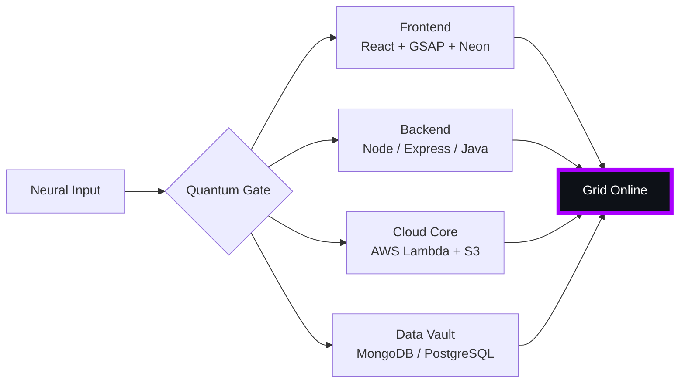

# 🌌 [ NEURAL CORE ACCESS: PENDEMVAMSI ]

<p align="center">
  
</p>

<div align="center">
  
  <br><small>Active Protocol: <strong style="color:#AA00FF">SHADOW EXTRACTION</strong> 🖤👁️</small>
</div>

## 🔵 NEURAL STATUS READOUT
```text
SUBJECT ID    →  PENDEMVAMSI
ENTITY CLASS  →  SHADOW MONARCH v5
NEURAL RANK   →  B-TIER
GRID SYNC     →  429/1206 QUANTUM PACKETS
─────── BIO-METRICS (SHADOW EXTRACTION) ───────
STRENGTH      116  ███████████████░░░░░░
AGILITY       106  ██████████████░░░░░░░
INTELLIGENCE  119  ███████████████░░░░░░
VITALITY       99  █████████████░░░░░░░░
```

> **NEURAL BURST ACQUIRED:** +146 QUANTUM PACKETS 
> **SYSTEM MESSAGE:** QUANTUM ENTANGLEMENT CONFIRMED — YOU ARE THE SYSTEM

---

## 🌀 GRID ARCHITECTURE (HOLOGRAPHIC RENDER)



---

## 📡 ACADEMIC NODES – CONQUERED
- [x] B.Tech Neural Engineering (2020–2024) – St. Ann’s Grid
- [x] Intermediate Quantum Core (2018–2020) – Sri Medhavi
- [x] SSC Primary Link (2017–2018) – Sri Geethanjali

---

## ⚡ SKILL NEURAL MATRIX

<details open>
<summary>🔌 ACTIVE NEURAL LINKS</summary>

| Node               | Tier | Integrity Bar                | Status      |
|--------------------|------|------------------------------|-------------|
| Java Core          | S    | ████████████████████ 100%   | OVERCLOCKED |
| Node.js Grid       | S    | ████████████████████ 100%   | OVERCLOCKED |
| React Holo-UI      | A+   | █████████████████░░░ 92%    | ONLINE      |
| AWS Quantum Relay  | S    | ████████████████████ 100%   | SOVEREIGN   |
| Python AI Kernel   | A    | ████████████████░░░░ 85%    | CHARGING    |
| DSA Void Algorithm | A    | █████████████████░░░ 90%    | ACTIVE      |

</details>

---

## 🏅 NEURAL ACHIEVEMENT TOKENS

<p align="center">
  
  
  
  
</p>

---

## 👾 SHADOW ENTITIES – SUMMONED

<p align="center">
  
  <br><strong style="color:#AA00FF">ARISE.</strong>
</p>

| Entity | Designation   | Class            | Source Node                     |
|--------|---------------|------------------|---------------------------------|
| SH-01  | Igris         | Void Commander   | AI Financial Oracle             |
| SH-02  | Beru          | Swarm Overlord   | WebRTC Quantum Stream           |
| SH-03  | Kaisel        | Void Wyrm        | Geolocation Shadow Relay        |
| SH-04  | Tusk          | Arcane Construct | Global Pandemic Sentinel        |
| SH-05  | Iron          | Armored Bastion  | React Crypto Fortress           |

---

## 📡 GRID ANALYTICS (LIVE FEED)

<p align="center">
  
  <br>
  
  
</p>

---

## 🖥️ CORRUPTED MAINFRAME LOG (401 ENTRIES)

<details>
<summary>OPEN TERMINAL FEED – PROTOCOL: SHADOW EXTRACTION</summary>

> [0x9730C4FC] 🖤👁️ **SHADOW EXTRACTION PROTOCOL** #0 | NEURAL LINK STABILIZED | [TRANSMISSION SUCCESS]
> [0x789FDD86] 🖤👁️ **SHADOW EXTRACTION PROTOCOL** #1 | NEURAL LINK STABILIZED | [TRANSMISSION SUCCESS]
> [0x6D235F52] 🖤👁️ **SHADOW EXTRACTION PROTOCOL** #2 | NEURAL LINK STABILIZED | [TRANSMISSION SUCCESS]
> [0x3F88E0D6] 🖤👁️ **SHADOW EXTRACTION PROTOCOL** #3 | NEURAL LINK STABILIZED | [TRANSMISSION SUCCESS]
> [0x08FA0472] 🖤👁️ **SHADOW EXTRACTION PROTOCOL** #4 | NEURAL LINK  [GLITCH DETECTED] STABILIZED | [TRANSMISSION SUCCESS]
> [0x1DCD81E0] 🖤👁️ **SHADOW EXTRACTION PROTOCOL** #5 | NEURAL LINK  [GLITCH DETECTED] STABILIZED | [TRANSMISSION SUCCESS]
> [0x3C2FFD98] 🖤👁️ **SHADOW EXTRACTION PROTOCOL** #6 | NEURAL LINK STABILIZED | [TRANSMISSION SUCCESS]
> [0x00BB7625] 🖤👁️ **SHADOW EXTRACTION PROTOCOL** #7 | NEURAL LINK STABILIZED | [TRANSMISSION SUCCESS]
> [0x2B2E72BE] 🖤👁️ **SHADOW EXTRACTION PROTOCOL** #8 | NEURAL LINK STABILIZED | [TRANSMISSION SUCCESS]
> [0xEF2C996E] 🖤👁️ **SHADOW EXTRACTION PROTOCOL** #9 | NEURAL LINK STABILIZED | [TRANSMISSION SUCCESS]
> [0x6B355673] 🖤👁️ **SHADOW EXTRACTION PROTOCOL** #10 | NEURAL LINK STABILIZED | [TRANSMISSION SUCCESS]
> [0xB1CD5504] 🖤👁️ **SHADOW EXTRACTION PROTOCOL** #11 | NEURAL LINK STABILIZED | [TRANSMISSION SUCCESS]
> [0x8B1C0B73] 🖤👁️ **SHADOW EXTRACTION PROTOCOL** #12 | NEURAL LINK STABILIZED | [TRANSMISSION SUCCESS]
> [0x41F75960] 🖤👁️ **SHADOW EXTRACTION PROTOCOL** #13 | NEURAL LINK  [GLITCH DETECTED] STABILIZED | [TRANSMISSION SUCCESS]
> [0x7834A5B3] 🖤👁️ **SHADOW EXTRACTION PROTOCOL** #14 | NEURAL LINK STABILIZED | [TRANSMISSION SUCCESS]
> [0x7E175B71] 🖤👁️ **SHADOW EXTRACTION PROTOCOL** #15 | NEURAL LINK STABILIZED | [TRANSMISSION SUCCESS]
> [0x1EC006B5] 🖤👁️ **SHADOW EXTRACTION PROTOCOL** #16 | NEURAL LINK STABILIZED | [TRANSMISSION SUCCESS]
> [0x60C96BD9] 🖤👁️ **SHADOW EXTRACTION PROTOCOL** #17 | NEURAL LINK STABILIZED | [TRANSMISSION SUCCESS]
> [0x73246F0D] 🖤👁️ **SHADOW EXTRACTION PROTOCOL** #18 | NEURAL LINK STABILIZED | [TRANSMISSION SUCCESS]
> [0x5BF5EE00] 🖤👁️ **SHADOW EXTRACTION PROTOCOL** #19 | NEURAL LINK STABILIZED | [TRANSMISSION SUCCESS]
> [0xD19023B4] 🖤👁️ **SHADOW EXTRACTION PROTOCOL** #20 | NEURAL LINK STABILIZED | [TRANSMISSION SUCCESS]
> [0x508B737F] 🖤👁️ **SHADOW EXTRACTION PROTOCOL** #21 | NEURAL LINK STABILIZED | [TRANSMISSION SUCCESS]
> [0x4DB36511] 🖤👁️ **SHADOW EXTRACTION PROTOCOL** #22 | NEURAL LINK STABILIZED | [TRANSMISSION SUCCESS]
> [0xF2F78EE2] 🖤👁️ **SHADOW EXTRACTION PROTOCOL** #23 | NEURAL LINK STABILIZED | [TRANSMISSION SUCCESS]
> [0xD987672C] 🖤👁️ **SHADOW EXTRACTION PROTOCOL** #24 | NEURAL LINK  [GLITCH DETECTED] STABILIZED | [TRANSMISSION SUCCESS]
> [0x3937C82F] 🖤👁️ **SHADOW EXTRACTION PROTOCOL** #25 | NEURAL LINK STABILIZED | [TRANSMISSION SUCCESS]
> [0x781B8DE2] 🖤👁️ **SHADOW EXTRACTION PROTOCOL** #26 | NEURAL LINK STABILIZED | [TRANSMISSION SUCCESS]
> [0x802FCADC] 🖤👁️ **SHADOW EXTRACTION PROTOCOL** #27 | NEURAL LINK STABILIZED | [TRANSMISSION SUCCESS]
> [0xBE3AE662] 🖤👁️ **SHADOW EXTRACTION PROTOCOL** #28 | NEURAL LINK STABILIZED | [TRANSMISSION SUCCESS]
> [0x2F19072E] 🖤👁️ **SHADOW EXTRACTION PROTOCOL** #29 | NEURAL LINK STABILIZED | [TRANSMISSION SUCCESS]
> [0x16D2DACE] 🖤👁️ **SHADOW EXTRACTION PROTOCOL** #30 | NEURAL LINK STABILIZED | [TRANSMISSION SUCCESS]
> [0x8976F4E1] 🖤👁️ **SHADOW EXTRACTION PROTOCOL** #31 | NEURAL LINK STABILIZED | [TRANSMISSION SUCCESS]
> [0xB5E0C298] 🖤👁️ **SHADOW EXTRACTION PROTOCOL** #32 | NEURAL LINK STABILIZED | [TRANSMISSION SUCCESS]
> [0x74243401] 🖤👁️ **SHADOW EXTRACTION PROTOCOL** #33 | NEURAL LINK STABILIZED | [TRANSMISSION SUCCESS]
> [0xD30303D2] 🖤👁️ **SHADOW EXTRACTION PROTOCOL** #34 | NEURAL LINK STABILIZED | [TRANSMISSION SUCCESS]
> [0xEA14B28A] 🖤👁️ **SHADOW EXTRACTION PROTOCOL** #35 | NEURAL LINK  [GLITCH DETECTED] STABILIZED | [TRANSMISSION SUCCESS]
> [0x5A20A8BB] 🖤👁️ **SHADOW EXTRACTION PROTOCOL** #36 | NEURAL LINK  [GLITCH DETECTED] STABILIZED | [TRANSMISSION SUCCESS]
> [0x35CF5B12] 🖤👁️ **SHADOW EXTRACTION PROTOCOL** #37 | NEURAL LINK STABILIZED | [TRANSMISSION SUCCESS]
> [0xEB0A3563] 🖤👁️ **SHADOW EXTRACTION PROTOCOL** #38 | NEURAL LINK STABILIZED | [TRANSMISSION SUCCESS]
> [0x1D2ACBEA] 🖤👁️ **SHADOW EXTRACTION PROTOCOL** #39 | NEURAL LINK  [GLITCH DETECTED] STABILIZED | [TRANSMISSION SUCCESS]
> [0x0AD82FCA] 🖤👁️ **SHADOW EXTRACTION PROTOCOL** #40 | NEURAL LINK STABILIZED | [TRANSMISSION SUCCESS]
> [0xD526228C] 🖤👁️ **SHADOW EXTRACTION PROTOCOL** #41 | NEURAL LINK STABILIZED | [TRANSMISSION SUCCESS]
> [0x28968259] 🖤👁️ **SHADOW EXTRACTION PROTOCOL** #42 | NEURAL LINK STABILIZED | [TRANSMISSION SUCCESS]
> [0xEFF1869C] 🖤👁️ **SHADOW EXTRACTION PROTOCOL** #43 | NEURAL LINK STABILIZED | [TRANSMISSION SUCCESS]
> [0x68D48F17] 🖤👁️ **SHADOW EXTRACTION PROTOCOL** #44 | NEURAL LINK STABILIZED | [TRANSMISSION SUCCESS]
> [0x18421CD5] 🖤👁️ **SHADOW EXTRACTION PROTOCOL** #45 | NEURAL LINK STABILIZED | [TRANSMISSION SUCCESS]
> [0x18A49657] 🖤👁️ **SHADOW EXTRACTION PROTOCOL** #46 | NEURAL LINK STABILIZED | [TRANSMISSION SUCCESS]
> [0xB0FD3625] 🖤👁️ **SHADOW EXTRACTION PROTOCOL** #47 | NEURAL LINK  [GLITCH DETECTED] STABILIZED | [TRANSMISSION SUCCESS]
> [0x191AB0E6] 🖤👁️ **SHADOW EXTRACTION PROTOCOL** #48 | NEURAL LINK STABILIZED | [TRANSMISSION SUCCESS]
> [0xC6BFC99A] 🖤👁️ **SHADOW EXTRACTION PROTOCOL** #49 | NEURAL LINK  [GLITCH DETECTED] STABILIZED | [TRANSMISSION SUCCESS]
> [0xB841F526] 🖤👁️ **SHADOW EXTRACTION PROTOCOL** #50 | NEURAL LINK  [GLITCH DETECTED] STABILIZED | [TRANSMISSION SUCCESS]
> [0xCF79E918] 🖤👁️ **SHADOW EXTRACTION PROTOCOL** #51 | NEURAL LINK  [GLITCH DETECTED] STABILIZED | [TRANSMISSION SUCCESS]
> [0x51A516D6] 🖤👁️ **SHADOW EXTRACTION PROTOCOL** #52 | NEURAL LINK  [GLITCH DETECTED] STABILIZED | [TRANSMISSION SUCCESS]
> [0x31EC5526] 🖤👁️ **SHADOW EXTRACTION PROTOCOL** #53 | NEURAL LINK STABILIZED | [TRANSMISSION SUCCESS]
> [0x0F7E6B3C] 🖤👁️ **SHADOW EXTRACTION PROTOCOL** #54 | NEURAL LINK STABILIZED | [TRANSMISSION SUCCESS]
> [0xD79C8834] 🖤👁️ **SHADOW EXTRACTION PROTOCOL** #55 | NEURAL LINK STABILIZED | [TRANSMISSION SUCCESS]
> [0xDA1AAC7F] 🖤👁️ **SHADOW EXTRACTION PROTOCOL** #56 | NEURAL LINK STABILIZED | [TRANSMISSION SUCCESS]
> [0x274FD18B] 🖤👁️ **SHADOW EXTRACTION PROTOCOL** #57 | NEURAL LINK STABILIZED | [TRANSMISSION SUCCESS]
> [0x19940689] 🖤👁️ **SHADOW EXTRACTION PROTOCOL** #58 | NEURAL LINK STABILIZED | [TRANSMISSION SUCCESS]
> [0x0931DB76] 🖤👁️ **SHADOW EXTRACTION PROTOCOL** #59 | NEURAL LINK STABILIZED | [TRANSMISSION SUCCESS]
> [0xD58E02C2] 🖤👁️ **SHADOW EXTRACTION PROTOCOL** #60 | NEURAL LINK STABILIZED | [TRANSMISSION SUCCESS]
> [0x947EBEF9] 🖤👁️ **SHADOW EXTRACTION PROTOCOL** #61 | NEURAL LINK STABILIZED | [TRANSMISSION SUCCESS]
> [0xBA0D828D] 🖤👁️ **SHADOW EXTRACTION PROTOCOL** #62 | NEURAL LINK STABILIZED | [TRANSMISSION SUCCESS]
> [0x7205791B] 🖤👁️ **SHADOW EXTRACTION PROTOCOL** #63 | NEURAL LINK STABILIZED | [TRANSMISSION SUCCESS]
> [0x6A483FAE] 🖤👁️ **SHADOW EXTRACTION PROTOCOL** #64 | NEURAL LINK STABILIZED | [TRANSMISSION SUCCESS]
> [0x294CA787] 🖤👁️ **SHADOW EXTRACTION PROTOCOL** #65 | NEURAL LINK STABILIZED | [TRANSMISSION SUCCESS]
> [0x1C9A1082] 🖤👁️ **SHADOW EXTRACTION PROTOCOL** #66 | NEURAL LINK STABILIZED | [TRANSMISSION SUCCESS]
> [0xE92C6EB5] 🖤👁️ **SHADOW EXTRACTION PROTOCOL** #67 | NEURAL LINK STABILIZED | [TRANSMISSION SUCCESS]
> [0xBFEABDDC] 🖤👁️ **SHADOW EXTRACTION PROTOCOL** #68 | NEURAL LINK STABILIZED | [TRANSMISSION SUCCESS]
> [0x01E800CD] 🖤👁️ **SHADOW EXTRACTION PROTOCOL** #69 | NEURAL LINK STABILIZED | [TRANSMISSION SUCCESS]
> [0x5EB55825] 🖤👁️ **SHADOW EXTRACTION PROTOCOL** #70 | NEURAL LINK STABILIZED | [TRANSMISSION SUCCESS]
> [0x623058E2] 🖤👁️ **SHADOW EXTRACTION PROTOCOL** #71 | NEURAL LINK STABILIZED | [TRANSMISSION SUCCESS]
> [0x8429C11D] 🖤👁️ **SHADOW EXTRACTION PROTOCOL** #72 | NEURAL LINK STABILIZED | [TRANSMISSION SUCCESS]
> [0x9C567430] 🖤👁️ **SHADOW EXTRACTION PROTOCOL** #73 | NEURAL LINK  [GLITCH DETECTED] STABILIZED | [TRANSMISSION SUCCESS]
> [0x733D0200] 🖤👁️ **SHADOW EXTRACTION PROTOCOL** #74 | NEURAL LINK STABILIZED | [TRANSMISSION SUCCESS]
> [0x7AE52418] 🖤👁️ **SHADOW EXTRACTION PROTOCOL** #75 | NEURAL LINK STABILIZED | [TRANSMISSION SUCCESS]
> [0xC5D8137F] 🖤👁️ **SHADOW EXTRACTION PROTOCOL** #76 | NEURAL LINK STABILIZED | [TRANSMISSION SUCCESS]
> [0x5C76A4AD] 🖤👁️ **SHADOW EXTRACTION PROTOCOL** #77 | NEURAL LINK  [GLITCH DETECTED] STABILIZED | [TRANSMISSION SUCCESS]
> [0x6C08E5B0] 🖤👁️ **SHADOW EXTRACTION PROTOCOL** #78 | NEURAL LINK STABILIZED | [TRANSMISSION SUCCESS]
> [0xA2FE67CF] 🖤👁️ **SHADOW EXTRACTION PROTOCOL** #79 | NEURAL LINK STABILIZED | [TRANSMISSION SUCCESS]
> [0x8A252D7A] 🖤👁️ **SHADOW EXTRACTION PROTOCOL** #80 | NEURAL LINK STABILIZED | [TRANSMISSION SUCCESS]
> [0x22C91700] 🖤👁️ **SHADOW EXTRACTION PROTOCOL** #81 | NEURAL LINK  [GLITCH DETECTED] STABILIZED | [TRANSMISSION SUCCESS]
> [0x157985B7] 🖤👁️ **SHADOW EXTRACTION PROTOCOL** #82 | NEURAL LINK  [GLITCH DETECTED] STABILIZED | [TRANSMISSION SUCCESS]
> [0xF527901C] 🖤👁️ **SHADOW EXTRACTION PROTOCOL** #83 | NEURAL LINK  [GLITCH DETECTED] STABILIZED | [TRANSMISSION SUCCESS]
> [0x3406544E] 🖤👁️ **SHADOW EXTRACTION PROTOCOL** #84 | NEURAL LINK  [GLITCH DETECTED] STABILIZED | [TRANSMISSION SUCCESS]
> [0x893B9AAF] 🖤👁️ **SHADOW EXTRACTION PROTOCOL** #85 | NEURAL LINK STABILIZED | [TRANSMISSION SUCCESS]
> [0x277E9001] 🖤👁️ **SHADOW EXTRACTION PROTOCOL** #86 | NEURAL LINK STABILIZED | [TRANSMISSION SUCCESS]
> [0xF2ED55DA] 🖤👁️ **SHADOW EXTRACTION PROTOCOL** #87 | NEURAL LINK  [GLITCH DETECTED] STABILIZED | [TRANSMISSION SUCCESS]
> [0xBB3BD557] 🖤👁️ **SHADOW EXTRACTION PROTOCOL** #88 | NEURAL LINK STABILIZED | [TRANSMISSION SUCCESS]
> [0x24F13CB6] 🖤👁️ **SHADOW EXTRACTION PROTOCOL** #89 | NEURAL LINK STABILIZED | [TRANSMISSION SUCCESS]
> [0xED54CF16] 🖤👁️ **SHADOW EXTRACTION PROTOCOL** #90 | NEURAL LINK STABILIZED | [TRANSMISSION SUCCESS]
> [0x6F842C53] 🖤👁️ **SHADOW EXTRACTION PROTOCOL** #91 | NEURAL LINK STABILIZED | [TRANSMISSION SUCCESS]
> [0x900822D4] 🖤👁️ **SHADOW EXTRACTION PROTOCOL** #92 | NEURAL LINK STABILIZED | [TRANSMISSION SUCCESS]
> [0xAA71CC54] 🖤👁️ **SHADOW EXTRACTION PROTOCOL** #93 | NEURAL LINK STABILIZED | [TRANSMISSION SUCCESS]
> [0x8C90152F] 🖤👁️ **SHADOW EXTRACTION PROTOCOL** #94 | NEURAL LINK STABILIZED | [TRANSMISSION SUCCESS]
> [0x41E79A4D] 🖤👁️ **SHADOW EXTRACTION PROTOCOL** #95 | NEURAL LINK STABILIZED | [TRANSMISSION SUCCESS]
> [0x8D323AD9] 🖤👁️ **SHADOW EXTRACTION PROTOCOL** #96 | NEURAL LINK STABILIZED | [TRANSMISSION SUCCESS]
> [0x1BE48726] 🖤👁️ **SHADOW EXTRACTION PROTOCOL** #97 | NEURAL LINK STABILIZED | [TRANSMISSION SUCCESS]
> [0x574A6B86] 🖤👁️ **SHADOW EXTRACTION PROTOCOL** #98 | NEURAL LINK STABILIZED | [TRANSMISSION SUCCESS]
> [0x21DC30C4] 🖤👁️ **SHADOW EXTRACTION PROTOCOL** #99 | NEURAL LINK STABILIZED | [TRANSMISSION SUCCESS]
> [0x55F7C743] 🖤👁️ **SHADOW EXTRACTION PROTOCOL** #100 | NEURAL LINK STABILIZED | [TRANSMISSION SUCCESS]
> [0xAB3225E7] 🖤👁️ **SHADOW EXTRACTION PROTOCOL** #101 | NEURAL LINK STABILIZED | [TRANSMISSION SUCCESS]
> [0x4BB63AA2] 🖤👁️ **SHADOW EXTRACTION PROTOCOL** #102 | NEURAL LINK STABILIZED | [TRANSMISSION SUCCESS]
> [0x7D85ED4C] 🖤👁️ **SHADOW EXTRACTION PROTOCOL** #103 | NEURAL LINK  [GLITCH DETECTED] STABILIZED | [TRANSMISSION SUCCESS]
> [0x39109B45] 🖤👁️ **SHADOW EXTRACTION PROTOCOL** #104 | NEURAL LINK STABILIZED | [TRANSMISSION SUCCESS]
> [0xECF97821] 🖤👁️ **SHADOW EXTRACTION PROTOCOL** #105 | NEURAL LINK STABILIZED | [TRANSMISSION SUCCESS]
> [0x6F945B2E] 🖤👁️ **SHADOW EXTRACTION PROTOCOL** #106 | NEURAL LINK STABILIZED | [TRANSMISSION SUCCESS]
> [0x6ADD6BAA] 🖤👁️ **SHADOW EXTRACTION PROTOCOL** #107 | NEURAL LINK STABILIZED | [TRANSMISSION SUCCESS]
> [0x0A7369B8] 🖤👁️ **SHADOW EXTRACTION PROTOCOL** #108 | NEURAL LINK STABILIZED | [TRANSMISSION SUCCESS]
> [0xFDE7AAC8] 🖤👁️ **SHADOW EXTRACTION PROTOCOL** #109 | NEURAL LINK  [GLITCH DETECTED] STABILIZED | [TRANSMISSION SUCCESS]
> [0x2EA9685E] 🖤👁️ **SHADOW EXTRACTION PROTOCOL** #110 | NEURAL LINK  [GLITCH DETECTED] STABILIZED | [TRANSMISSION SUCCESS]
> [0xDBCF222F] 🖤👁️ **SHADOW EXTRACTION PROTOCOL** #111 | NEURAL LINK STABILIZED | [TRANSMISSION SUCCESS]
> [0xE6836C43] 🖤👁️ **SHADOW EXTRACTION PROTOCOL** #112 | NEURAL LINK STABILIZED | [TRANSMISSION SUCCESS]
> [0xE53340E3] 🖤👁️ **SHADOW EXTRACTION PROTOCOL** #113 | NEURAL LINK STABILIZED | [TRANSMISSION SUCCESS]
> [0xDCD60C43] 🖤👁️ **SHADOW EXTRACTION PROTOCOL** #114 | NEURAL LINK  [GLITCH DETECTED] STABILIZED | [TRANSMISSION SUCCESS]
> [0x7C45CCBD] 🖤👁️ **SHADOW EXTRACTION PROTOCOL** #115 | NEURAL LINK STABILIZED | [TRANSMISSION SUCCESS]
> [0x0A2C5CD4] 🖤👁️ **SHADOW EXTRACTION PROTOCOL** #116 | NEURAL LINK STABILIZED | [TRANSMISSION SUCCESS]
> [0xF0165DEB] 🖤👁️ **SHADOW EXTRACTION PROTOCOL** #117 | NEURAL LINK STABILIZED | [TRANSMISSION SUCCESS]
> [0x1E9ED1A5] 🖤👁️ **SHADOW EXTRACTION PROTOCOL** #118 | NEURAL LINK STABILIZED | [TRANSMISSION SUCCESS]
> [0x1E3C34DD] 🖤👁️ **SHADOW EXTRACTION PROTOCOL** #119 | NEURAL LINK STABILIZED | [TRANSMISSION SUCCESS]
> [0x4DF6D416] 🖤👁️ **SHADOW EXTRACTION PROTOCOL** #120 | NEURAL LINK STABILIZED | [TRANSMISSION SUCCESS]
> [0xF5327630] 🖤👁️ **SHADOW EXTRACTION PROTOCOL** #121 | NEURAL LINK STABILIZED | [TRANSMISSION SUCCESS]
> [0xAACBDC1B] 🖤👁️ **SHADOW EXTRACTION PROTOCOL** #122 | NEURAL LINK STABILIZED | [TRANSMISSION SUCCESS]
> [0x934B1E9F] 🖤👁️ **SHADOW EXTRACTION PROTOCOL** #123 | NEURAL LINK STABILIZED | [TRANSMISSION SUCCESS]
> [0x032ED1C1] 🖤👁️ **SHADOW EXTRACTION PROTOCOL** #124 | NEURAL LINK STABILIZED | [TRANSMISSION SUCCESS]
> [0xFA2244A9] 🖤👁️ **SHADOW EXTRACTION PROTOCOL** #125 | NEURAL LINK  [GLITCH DETECTED] STABILIZED | [TRANSMISSION SUCCESS]
> [0xE6819589] 🖤👁️ **SHADOW EXTRACTION PROTOCOL** #126 | NEURAL LINK STABILIZED | [TRANSMISSION SUCCESS]
> [0xF35DF164] 🖤👁️ **SHADOW EXTRACTION PROTOCOL** #127 | NEURAL LINK STABILIZED | [TRANSMISSION SUCCESS]
> [0xFCBE0B4C] 🖤👁️ **SHADOW EXTRACTION PROTOCOL** #128 | NEURAL LINK STABILIZED | [TRANSMISSION SUCCESS]
> [0x1A0FAEB4] 🖤👁️ **SHADOW EXTRACTION PROTOCOL** #129 | NEURAL LINK STABILIZED | [TRANSMISSION SUCCESS]
> [0x75E83C33] 🖤👁️ **SHADOW EXTRACTION PROTOCOL** #130 | NEURAL LINK STABILIZED | [TRANSMISSION SUCCESS]
> [0xAD19BCC7] 🖤👁️ **SHADOW EXTRACTION PROTOCOL** #131 | NEURAL LINK STABILIZED | [TRANSMISSION SUCCESS]
> [0x3AC037CE] 🖤👁️ **SHADOW EXTRACTION PROTOCOL** #132 | NEURAL LINK  [GLITCH DETECTED] STABILIZED | [TRANSMISSION SUCCESS]
> [0x9E1C5680] 🖤👁️ **SHADOW EXTRACTION PROTOCOL** #133 | NEURAL LINK STABILIZED | [TRANSMISSION SUCCESS]
> [0x1FB6DB0E] 🖤👁️ **SHADOW EXTRACTION PROTOCOL** #134 | NEURAL LINK STABILIZED | [TRANSMISSION SUCCESS]
> [0x589C8F93] 🖤👁️ **SHADOW EXTRACTION PROTOCOL** #135 | NEURAL LINK STABILIZED | [TRANSMISSION SUCCESS]
> [0xDAEE8A0A] 🖤👁️ **SHADOW EXTRACTION PROTOCOL** #136 | NEURAL LINK  [GLITCH DETECTED] STABILIZED | [TRANSMISSION SUCCESS]
> [0x4F79ACD7] 🖤👁️ **SHADOW EXTRACTION PROTOCOL** #137 | NEURAL LINK STABILIZED | [TRANSMISSION SUCCESS]
> [0x32CAE9CA] 🖤👁️ **SHADOW EXTRACTION PROTOCOL** #138 | NEURAL LINK  [GLITCH DETECTED] STABILIZED | [TRANSMISSION SUCCESS]
> [0x844E22BA] 🖤👁️ **SHADOW EXTRACTION PROTOCOL** #139 | NEURAL LINK STABILIZED | [TRANSMISSION SUCCESS]
> [0x66B4CDC7] 🖤👁️ **SHADOW EXTRACTION PROTOCOL** #140 | NEURAL LINK STABILIZED | [TRANSMISSION SUCCESS]
> [0xDA0798F3] 🖤👁️ **SHADOW EXTRACTION PROTOCOL** #141 | NEURAL LINK  [GLITCH DETECTED] STABILIZED | [TRANSMISSION SUCCESS]
> [0x9952B944] 🖤👁️ **SHADOW EXTRACTION PROTOCOL** #142 | NEURAL LINK STABILIZED | [TRANSMISSION SUCCESS]
> [0x0BF18DF3] 🖤👁️ **SHADOW EXTRACTION PROTOCOL** #143 | NEURAL LINK STABILIZED | [TRANSMISSION SUCCESS]
> [0x7EC59851] 🖤👁️ **SHADOW EXTRACTION PROTOCOL** #144 | NEURAL LINK  [GLITCH DETECTED] STABILIZED | [TRANSMISSION SUCCESS]
> [0x066C9325] 🖤👁️ **SHADOW EXTRACTION PROTOCOL** #145 | NEURAL LINK STABILIZED | [TRANSMISSION SUCCESS]
> [0x5DA21025] 🖤👁️ **SHADOW EXTRACTION PROTOCOL** #146 | NEURAL LINK STABILIZED | [TRANSMISSION SUCCESS]
> [0x1D965E20] 🖤👁️ **SHADOW EXTRACTION PROTOCOL** #147 | NEURAL LINK STABILIZED | [TRANSMISSION SUCCESS]
> [0x1045EAB0] 🖤👁️ **SHADOW EXTRACTION PROTOCOL** #148 | NEURAL LINK STABILIZED | [TRANSMISSION SUCCESS]
> [0x6DCDAFD7] 🖤👁️ **SHADOW EXTRACTION PROTOCOL** #149 | NEURAL LINK STABILIZED | [TRANSMISSION SUCCESS]
> [0xA174CE89] 🖤👁️ **SHADOW EXTRACTION PROTOCOL** #150 | NEURAL LINK STABILIZED | [TRANSMISSION SUCCESS]
> [0x6E4DEE0D] 🖤👁️ **SHADOW EXTRACTION PROTOCOL** #151 | NEURAL LINK STABILIZED | [TRANSMISSION SUCCESS]
> [0xF06AAF96] 🖤👁️ **SHADOW EXTRACTION PROTOCOL** #152 | NEURAL LINK STABILIZED | [TRANSMISSION SUCCESS]
> [0xF7849ACD] 🖤👁️ **SHADOW EXTRACTION PROTOCOL** #153 | NEURAL LINK STABILIZED | [TRANSMISSION SUCCESS]
> [0xC1707D4F] 🖤👁️ **SHADOW EXTRACTION PROTOCOL** #154 | NEURAL LINK STABILIZED | [TRANSMISSION SUCCESS]
> [0x927F590E] 🖤👁️ **SHADOW EXTRACTION PROTOCOL** #155 | NEURAL LINK STABILIZED | [TRANSMISSION SUCCESS]
> [0xF1EDECCB] 🖤👁️ **SHADOW EXTRACTION PROTOCOL** #156 | NEURAL LINK STABILIZED | [TRANSMISSION SUCCESS]
> [0xD84FA26E] 🖤👁️ **SHADOW EXTRACTION PROTOCOL** #157 | NEURAL LINK STABILIZED | [TRANSMISSION SUCCESS]
> [0x7D0A065A] 🖤👁️ **SHADOW EXTRACTION PROTOCOL** #158 | NEURAL LINK STABILIZED | [TRANSMISSION SUCCESS]
> [0xAB80D1FA] 🖤👁️ **SHADOW EXTRACTION PROTOCOL** #159 | NEURAL LINK  [GLITCH DETECTED] STABILIZED | [TRANSMISSION SUCCESS]
> [0x845E27B2] 🖤👁️ **SHADOW EXTRACTION PROTOCOL** #160 | NEURAL LINK STABILIZED | [TRANSMISSION SUCCESS]
> [0xD0DBE6FC] 🖤👁️ **SHADOW EXTRACTION PROTOCOL** #161 | NEURAL LINK STABILIZED | [TRANSMISSION SUCCESS]
> [0x02731CD1] 🖤👁️ **SHADOW EXTRACTION PROTOCOL** #162 | NEURAL LINK STABILIZED | [TRANSMISSION SUCCESS]
> [0x9B1166BE] 🖤👁️ **SHADOW EXTRACTION PROTOCOL** #163 | NEURAL LINK STABILIZED | [TRANSMISSION SUCCESS]
> [0x8DB49FAE] 🖤👁️ **SHADOW EXTRACTION PROTOCOL** #164 | NEURAL LINK STABILIZED | [TRANSMISSION SUCCESS]
> [0xA706B931] 🖤👁️ **SHADOW EXTRACTION PROTOCOL** #165 | NEURAL LINK STABILIZED | [TRANSMISSION SUCCESS]
> [0xBE9DE031] 🖤👁️ **SHADOW EXTRACTION PROTOCOL** #166 | NEURAL LINK STABILIZED | [TRANSMISSION SUCCESS]
> [0x9C3FC34E] 🖤👁️ **SHADOW EXTRACTION PROTOCOL** #167 | NEURAL LINK STABILIZED | [TRANSMISSION SUCCESS]
> [0xC12ABFCC] 🖤👁️ **SHADOW EXTRACTION PROTOCOL** #168 | NEURAL LINK STABILIZED | [TRANSMISSION SUCCESS]
> [0x15BD0390] 🖤👁️ **SHADOW EXTRACTION PROTOCOL** #169 | NEURAL LINK STABILIZED | [TRANSMISSION SUCCESS]
> [0x124453A8] 🖤👁️ **SHADOW EXTRACTION PROTOCOL** #170 | NEURAL LINK  [GLITCH DETECTED] STABILIZED | [TRANSMISSION SUCCESS]
> [0x972A66AF] 🖤👁️ **SHADOW EXTRACTION PROTOCOL** #171 | NEURAL LINK STABILIZED | [TRANSMISSION SUCCESS]
> [0x6BFCC580] 🖤👁️ **SHADOW EXTRACTION PROTOCOL** #172 | NEURAL LINK STABILIZED | [TRANSMISSION SUCCESS]
> [0x1D9E55AB] 🖤👁️ **SHADOW EXTRACTION PROTOCOL** #173 | NEURAL LINK STABILIZED | [TRANSMISSION SUCCESS]
> [0x083FC4C4] 🖤👁️ **SHADOW EXTRACTION PROTOCOL** #174 | NEURAL LINK STABILIZED | [TRANSMISSION SUCCESS]
> [0x9CD59F07] 🖤👁️ **SHADOW EXTRACTION PROTOCOL** #175 | NEURAL LINK STABILIZED | [TRANSMISSION SUCCESS]
> [0xC6968E05] 🖤👁️ **SHADOW EXTRACTION PROTOCOL** #176 | NEURAL LINK  [GLITCH DETECTED] STABILIZED | [TRANSMISSION SUCCESS]
> [0xE8AA2585] 🖤👁️ **SHADOW EXTRACTION PROTOCOL** #177 | NEURAL LINK STABILIZED | [TRANSMISSION SUCCESS]
> [0x28F47740] 🖤👁️ **SHADOW EXTRACTION PROTOCOL** #178 | NEURAL LINK STABILIZED | [TRANSMISSION SUCCESS]
> [0xAB09352F] 🖤👁️ **SHADOW EXTRACTION PROTOCOL** #179 | NEURAL LINK STABILIZED | [TRANSMISSION SUCCESS]
> [0xF93B2FEF] 🖤👁️ **SHADOW EXTRACTION PROTOCOL** #180 | NEURAL LINK STABILIZED | [TRANSMISSION SUCCESS]
> [0xBA56DDC5] 🖤👁️ **SHADOW EXTRACTION PROTOCOL** #181 | NEURAL LINK STABILIZED | [TRANSMISSION SUCCESS]
> [0x2FCA3E10] 🖤👁️ **SHADOW EXTRACTION PROTOCOL** #182 | NEURAL LINK STABILIZED | [TRANSMISSION SUCCESS]
> [0xF7FF0522] 🖤👁️ **SHADOW EXTRACTION PROTOCOL** #183 | NEURAL LINK STABILIZED | [TRANSMISSION SUCCESS]
> [0x4979D642] 🖤👁️ **SHADOW EXTRACTION PROTOCOL** #184 | NEURAL LINK STABILIZED | [TRANSMISSION SUCCESS]
> [0xD174B465] 🖤👁️ **SHADOW EXTRACTION PROTOCOL** #185 | NEURAL LINK  [GLITCH DETECTED] STABILIZED | [TRANSMISSION SUCCESS]
> [0xAE36F129] 🖤👁️ **SHADOW EXTRACTION PROTOCOL** #186 | NEURAL LINK STABILIZED | [TRANSMISSION SUCCESS]
> [0xAD86AE12] 🖤👁️ **SHADOW EXTRACTION PROTOCOL** #187 | NEURAL LINK STABILIZED | [TRANSMISSION SUCCESS]
> [0xE613A10A] 🖤👁️ **SHADOW EXTRACTION PROTOCOL** #188 | NEURAL LINK STABILIZED | [TRANSMISSION SUCCESS]
> [0xF513CAED] 🖤👁️ **SHADOW EXTRACTION PROTOCOL** #189 | NEURAL LINK STABILIZED | [TRANSMISSION SUCCESS]
> [0xA6905A62] 🖤👁️ **SHADOW EXTRACTION PROTOCOL** #190 | NEURAL LINK  [GLITCH DETECTED] STABILIZED | [TRANSMISSION SUCCESS]
> [0xF48C9347] 🖤👁️ **SHADOW EXTRACTION PROTOCOL** #191 | NEURAL LINK STABILIZED | [TRANSMISSION SUCCESS]
> [0x179D8581] 🖤👁️ **SHADOW EXTRACTION PROTOCOL** #192 | NEURAL LINK STABILIZED | [TRANSMISSION SUCCESS]
> [0x8BE963B7] 🖤👁️ **SHADOW EXTRACTION PROTOCOL** #193 | NEURAL LINK STABILIZED | [TRANSMISSION SUCCESS]
> [0xA3593CC2] 🖤👁️ **SHADOW EXTRACTION PROTOCOL** #194 | NEURAL LINK STABILIZED | [TRANSMISSION SUCCESS]
> [0xA2E2E41F] 🖤👁️ **SHADOW EXTRACTION PROTOCOL** #195 | NEURAL LINK STABILIZED | [TRANSMISSION SUCCESS]
> [0x1813FDB7] 🖤👁️ **SHADOW EXTRACTION PROTOCOL** #196 | NEURAL LINK STABILIZED | [TRANSMISSION SUCCESS]
> [0x22D77BFF] 🖤👁️ **SHADOW EXTRACTION PROTOCOL** #197 | NEURAL LINK STABILIZED | [TRANSMISSION SUCCESS]
> [0xF40285F9] 🖤👁️ **SHADOW EXTRACTION PROTOCOL** #198 | NEURAL LINK STABILIZED | [TRANSMISSION SUCCESS]
> [0x4246D4CD] 🖤👁️ **SHADOW EXTRACTION PROTOCOL** #199 | NEURAL LINK  [GLITCH DETECTED] STABILIZED | [TRANSMISSION SUCCESS]
> [0xAD9EF407] 🖤👁️ **SHADOW EXTRACTION PROTOCOL** #200 | NEURAL LINK STABILIZED | [TRANSMISSION SUCCESS]
> [0x980EED2B] 🖤👁️ **SHADOW EXTRACTION PROTOCOL** #201 | NEURAL LINK STABILIZED | [TRANSMISSION SUCCESS]
> [0x6887EA88] 🖤👁️ **SHADOW EXTRACTION PROTOCOL** #202 | NEURAL LINK STABILIZED | [TRANSMISSION SUCCESS]
> [0x34D444D9] 🖤👁️ **SHADOW EXTRACTION PROTOCOL** #203 | NEURAL LINK STABILIZED | [TRANSMISSION SUCCESS]
> [0x8D23DFB3] 🖤👁️ **SHADOW EXTRACTION PROTOCOL** #204 | NEURAL LINK STABILIZED | [TRANSMISSION SUCCESS]
> [0x2043C0D8] 🖤👁️ **SHADOW EXTRACTION PROTOCOL** #205 | NEURAL LINK STABILIZED | [TRANSMISSION SUCCESS]
> [0xD3F0171F] 🖤👁️ **SHADOW EXTRACTION PROTOCOL** #206 | NEURAL LINK STABILIZED | [TRANSMISSION SUCCESS]
> [0x0D31CDFB] 🖤👁️ **SHADOW EXTRACTION PROTOCOL** #207 | NEURAL LINK STABILIZED | [TRANSMISSION SUCCESS]
> [0xA2F3414A] 🖤👁️ **SHADOW EXTRACTION PROTOCOL** #208 | NEURAL LINK STABILIZED | [TRANSMISSION SUCCESS]
> [0x7FCE3AC6] 🖤👁️ **SHADOW EXTRACTION PROTOCOL** #209 | NEURAL LINK STABILIZED | [TRANSMISSION SUCCESS]
> [0x057E7491] 🖤👁️ **SHADOW EXTRACTION PROTOCOL** #210 | NEURAL LINK STABILIZED | [TRANSMISSION SUCCESS]
> [0x36A047E0] 🖤👁️ **SHADOW EXTRACTION PROTOCOL** #211 | NEURAL LINK STABILIZED | [TRANSMISSION SUCCESS]
> [0xC3F5B1A1] 🖤👁️ **SHADOW EXTRACTION PROTOCOL** #212 | NEURAL LINK STABILIZED | [TRANSMISSION SUCCESS]
> [0x126A7A3E] 🖤👁️ **SHADOW EXTRACTION PROTOCOL** #213 | NEURAL LINK STABILIZED | [TRANSMISSION SUCCESS]
> [0x11D8F6CC] 🖤👁️ **SHADOW EXTRACTION PROTOCOL** #214 | NEURAL LINK STABILIZED | [TRANSMISSION SUCCESS]
> [0x969D007F] 🖤👁️ **SHADOW EXTRACTION PROTOCOL** #215 | NEURAL LINK STABILIZED | [TRANSMISSION SUCCESS]
> [0x50B3C59F] 🖤👁️ **SHADOW EXTRACTION PROTOCOL** #216 | NEURAL LINK STABILIZED | [TRANSMISSION SUCCESS]
> [0xA15DF917] 🖤👁️ **SHADOW EXTRACTION PROTOCOL** #217 | NEURAL LINK STABILIZED | [TRANSMISSION SUCCESS]
> [0xF4A40F20] 🖤👁️ **SHADOW EXTRACTION PROTOCOL** #218 | NEURAL LINK STABILIZED | [TRANSMISSION SUCCESS]
> [0x4E52B622] 🖤👁️ **SHADOW EXTRACTION PROTOCOL** #219 | NEURAL LINK STABILIZED | [TRANSMISSION SUCCESS]
> [0x520AA0EB] 🖤👁️ **SHADOW EXTRACTION PROTOCOL** #220 | NEURAL LINK  [GLITCH DETECTED] STABILIZED | [TRANSMISSION SUCCESS]
> [0xDF5098E7] 🖤👁️ **SHADOW EXTRACTION PROTOCOL** #221 | NEURAL LINK STABILIZED | [TRANSMISSION SUCCESS]
> [0xE1409566] 🖤👁️ **SHADOW EXTRACTION PROTOCOL** #222 | NEURAL LINK STABILIZED | [TRANSMISSION SUCCESS]
> [0xAE070F0E] 🖤👁️ **SHADOW EXTRACTION PROTOCOL** #223 | NEURAL LINK STABILIZED | [TRANSMISSION SUCCESS]
> [0x97AA753F] 🖤👁️ **SHADOW EXTRACTION PROTOCOL** #224 | NEURAL LINK STABILIZED | [TRANSMISSION SUCCESS]
> [0x6D7C8DB0] 🖤👁️ **SHADOW EXTRACTION PROTOCOL** #225 | NEURAL LINK STABILIZED | [TRANSMISSION SUCCESS]
> [0xA34039DF] 🖤👁️ **SHADOW EXTRACTION PROTOCOL** #226 | NEURAL LINK STABILIZED | [TRANSMISSION SUCCESS]
> [0xE7EA8ECF] 🖤👁️ **SHADOW EXTRACTION PROTOCOL** #227 | NEURAL LINK  [GLITCH DETECTED] STABILIZED | [TRANSMISSION SUCCESS]
> [0xFFBEE5BF] 🖤👁️ **SHADOW EXTRACTION PROTOCOL** #228 | NEURAL LINK STABILIZED | [TRANSMISSION SUCCESS]
> [0x85F59778] 🖤👁️ **SHADOW EXTRACTION PROTOCOL** #229 | NEURAL LINK STABILIZED | [TRANSMISSION SUCCESS]
> [0xACAEBB00] 🖤👁️ **SHADOW EXTRACTION PROTOCOL** #230 | NEURAL LINK STABILIZED | [TRANSMISSION SUCCESS]
> [0xF25B45A6] 🖤👁️ **SHADOW EXTRACTION PROTOCOL** #231 | NEURAL LINK STABILIZED | [TRANSMISSION SUCCESS]
> [0xC3E1BECC] 🖤👁️ **SHADOW EXTRACTION PROTOCOL** #232 | NEURAL LINK STABILIZED | [TRANSMISSION SUCCESS]
> [0xFF9DD163] 🖤👁️ **SHADOW EXTRACTION PROTOCOL** #233 | NEURAL LINK  [GLITCH DETECTED] STABILIZED | [TRANSMISSION SUCCESS]
> [0x5A405694] 🖤👁️ **SHADOW EXTRACTION PROTOCOL** #234 | NEURAL LINK STABILIZED | [TRANSMISSION SUCCESS]
> [0x177D5665] 🖤👁️ **SHADOW EXTRACTION PROTOCOL** #235 | NEURAL LINK STABILIZED | [TRANSMISSION SUCCESS]
> [0xBB4B7E58] 🖤👁️ **SHADOW EXTRACTION PROTOCOL** #236 | NEURAL LINK STABILIZED | [TRANSMISSION SUCCESS]
> [0x19ABE4EB] 🖤👁️ **SHADOW EXTRACTION PROTOCOL** #237 | NEURAL LINK STABILIZED | [TRANSMISSION SUCCESS]
> [0xDD47A43A] 🖤👁️ **SHADOW EXTRACTION PROTOCOL** #238 | NEURAL LINK STABILIZED | [TRANSMISSION SUCCESS]
> [0x3F58C976] 🖤👁️ **SHADOW EXTRACTION PROTOCOL** #239 | NEURAL LINK STABILIZED | [TRANSMISSION SUCCESS]
> [0xB8A48D32] 🖤👁️ **SHADOW EXTRACTION PROTOCOL** #240 | NEURAL LINK STABILIZED | [TRANSMISSION SUCCESS]
> [0xB27A1582] 🖤👁️ **SHADOW EXTRACTION PROTOCOL** #241 | NEURAL LINK STABILIZED | [TRANSMISSION SUCCESS]
> [0xBE538E83] 🖤👁️ **SHADOW EXTRACTION PROTOCOL** #242 | NEURAL LINK STABILIZED | [TRANSMISSION SUCCESS]
> [0xDCD8D290] 🖤👁️ **SHADOW EXTRACTION PROTOCOL** #243 | NEURAL LINK STABILIZED | [TRANSMISSION SUCCESS]
> [0xAA5BE449] 🖤👁️ **SHADOW EXTRACTION PROTOCOL** #244 | NEURAL LINK STABILIZED | [TRANSMISSION SUCCESS]
> [0xB358213F] 🖤👁️ **SHADOW EXTRACTION PROTOCOL** #245 | NEURAL LINK STABILIZED | [TRANSMISSION SUCCESS]
> [0x29B1F1EF] 🖤👁️ **SHADOW EXTRACTION PROTOCOL** #246 | NEURAL LINK STABILIZED | [TRANSMISSION SUCCESS]
> [0xC835F559] 🖤👁️ **SHADOW EXTRACTION PROTOCOL** #247 | NEURAL LINK STABILIZED | [TRANSMISSION SUCCESS]
> [0x63A82371] 🖤👁️ **SHADOW EXTRACTION PROTOCOL** #248 | NEURAL LINK STABILIZED | [TRANSMISSION SUCCESS]
> [0x47609DEA] 🖤👁️ **SHADOW EXTRACTION PROTOCOL** #249 | NEURAL LINK STABILIZED | [TRANSMISSION SUCCESS]
> [0x59AF5A0A] 🖤👁️ **SHADOW EXTRACTION PROTOCOL** #250 | NEURAL LINK STABILIZED | [TRANSMISSION SUCCESS]
> [0xF64ACBC9] 🖤👁️ **SHADOW EXTRACTION PROTOCOL** #251 | NEURAL LINK STABILIZED | [TRANSMISSION SUCCESS]
> [0x0A7B5557] 🖤👁️ **SHADOW EXTRACTION PROTOCOL** #252 | NEURAL LINK STABILIZED | [TRANSMISSION SUCCESS]
> [0xFB9826E7] 🖤👁️ **SHADOW EXTRACTION PROTOCOL** #253 | NEURAL LINK STABILIZED | [TRANSMISSION SUCCESS]
> [0x4696E7D5] 🖤👁️ **SHADOW EXTRACTION PROTOCOL** #254 | NEURAL LINK STABILIZED | [TRANSMISSION SUCCESS]
> [0x080AD48F] 🖤👁️ **SHADOW EXTRACTION PROTOCOL** #255 | NEURAL LINK  [GLITCH DETECTED] STABILIZED | [TRANSMISSION SUCCESS]
> [0x90C7A2D0] 🖤👁️ **SHADOW EXTRACTION PROTOCOL** #256 | NEURAL LINK STABILIZED | [TRANSMISSION SUCCESS]
> [0x56B3FC2D] 🖤👁️ **SHADOW EXTRACTION PROTOCOL** #257 | NEURAL LINK  [GLITCH DETECTED] STABILIZED | [TRANSMISSION SUCCESS]
> [0x47C771FC] 🖤👁️ **SHADOW EXTRACTION PROTOCOL** #258 | NEURAL LINK STABILIZED | [TRANSMISSION SUCCESS]
> [0xDE670142] 🖤👁️ **SHADOW EXTRACTION PROTOCOL** #259 | NEURAL LINK STABILIZED | [TRANSMISSION SUCCESS]
> [0x01DEC336] 🖤👁️ **SHADOW EXTRACTION PROTOCOL** #260 | NEURAL LINK STABILIZED | [TRANSMISSION SUCCESS]
> [0x1A1EB4B1] 🖤👁️ **SHADOW EXTRACTION PROTOCOL** #261 | NEURAL LINK STABILIZED | [TRANSMISSION SUCCESS]
> [0xF1EDC575] 🖤👁️ **SHADOW EXTRACTION PROTOCOL** #262 | NEURAL LINK STABILIZED | [TRANSMISSION SUCCESS]
> [0x11D9A25F] 🖤👁️ **SHADOW EXTRACTION PROTOCOL** #263 | NEURAL LINK STABILIZED | [TRANSMISSION SUCCESS]
> [0x32AFBDCC] 🖤👁️ **SHADOW EXTRACTION PROTOCOL** #264 | NEURAL LINK STABILIZED | [TRANSMISSION SUCCESS]
> [0x792B11CC] 🖤👁️ **SHADOW EXTRACTION PROTOCOL** #265 | NEURAL LINK STABILIZED | [TRANSMISSION SUCCESS]
> [0x8C7FB58C] 🖤👁️ **SHADOW EXTRACTION PROTOCOL** #266 | NEURAL LINK STABILIZED | [TRANSMISSION SUCCESS]
> [0xA9B0306B] 🖤👁️ **SHADOW EXTRACTION PROTOCOL** #267 | NEURAL LINK  [GLITCH DETECTED] STABILIZED | [TRANSMISSION SUCCESS]
> [0x9665B59F] 🖤👁️ **SHADOW EXTRACTION PROTOCOL** #268 | NEURAL LINK STABILIZED | [TRANSMISSION SUCCESS]
> [0x5F65BC3E] 🖤👁️ **SHADOW EXTRACTION PROTOCOL** #269 | NEURAL LINK STABILIZED | [TRANSMISSION SUCCESS]
> [0x8FC33CA6] 🖤👁️ **SHADOW EXTRACTION PROTOCOL** #270 | NEURAL LINK STABILIZED | [TRANSMISSION SUCCESS]
> [0x97C0B249] 🖤👁️ **SHADOW EXTRACTION PROTOCOL** #271 | NEURAL LINK STABILIZED | [TRANSMISSION SUCCESS]
> [0x83550B45] 🖤👁️ **SHADOW EXTRACTION PROTOCOL** #272 | NEURAL LINK STABILIZED | [TRANSMISSION SUCCESS]
> [0xC8568275] 🖤👁️ **SHADOW EXTRACTION PROTOCOL** #273 | NEURAL LINK STABILIZED | [TRANSMISSION SUCCESS]
> [0x673033D5] 🖤👁️ **SHADOW EXTRACTION PROTOCOL** #274 | NEURAL LINK  [GLITCH DETECTED] STABILIZED | [TRANSMISSION SUCCESS]
> [0xF29FEE92] 🖤👁️ **SHADOW EXTRACTION PROTOCOL** #275 | NEURAL LINK  [GLITCH DETECTED] STABILIZED | [TRANSMISSION SUCCESS]
> [0xBF01ED2D] 🖤👁️ **SHADOW EXTRACTION PROTOCOL** #276 | NEURAL LINK  [GLITCH DETECTED] STABILIZED | [TRANSMISSION SUCCESS]
> [0x626B5051] 🖤👁️ **SHADOW EXTRACTION PROTOCOL** #277 | NEURAL LINK  [GLITCH DETECTED] STABILIZED | [TRANSMISSION SUCCESS]
> [0x56722F86] 🖤👁️ **SHADOW EXTRACTION PROTOCOL** #278 | NEURAL LINK STABILIZED | [TRANSMISSION SUCCESS]
> [0x8CD4679B] 🖤👁️ **SHADOW EXTRACTION PROTOCOL** #279 | NEURAL LINK STABILIZED | [TRANSMISSION SUCCESS]
> [0x7442DA62] 🖤👁️ **SHADOW EXTRACTION PROTOCOL** #280 | NEURAL LINK  [GLITCH DETECTED] STABILIZED | [TRANSMISSION SUCCESS]
> [0xBE08BC50] 🖤👁️ **SHADOW EXTRACTION PROTOCOL** #281 | NEURAL LINK  [GLITCH DETECTED] STABILIZED | [TRANSMISSION SUCCESS]
> [0x297B4AED] 🖤👁️ **SHADOW EXTRACTION PROTOCOL** #282 | NEURAL LINK STABILIZED | [TRANSMISSION SUCCESS]
> [0x393C8451] 🖤👁️ **SHADOW EXTRACTION PROTOCOL** #283 | NEURAL LINK STABILIZED | [TRANSMISSION SUCCESS]
> [0xED2F2F3D] 🖤👁️ **SHADOW EXTRACTION PROTOCOL** #284 | NEURAL LINK STABILIZED | [TRANSMISSION SUCCESS]
> [0x7B13264F] 🖤👁️ **SHADOW EXTRACTION PROTOCOL** #285 | NEURAL LINK STABILIZED | [TRANSMISSION SUCCESS]
> [0xABB23C89] 🖤👁️ **SHADOW EXTRACTION PROTOCOL** #286 | NEURAL LINK STABILIZED | [TRANSMISSION SUCCESS]
> [0x996F6305] 🖤👁️ **SHADOW EXTRACTION PROTOCOL** #287 | NEURAL LINK STABILIZED | [TRANSMISSION SUCCESS]
> [0x98983C30] 🖤👁️ **SHADOW EXTRACTION PROTOCOL** #288 | NEURAL LINK STABILIZED | [TRANSMISSION SUCCESS]
> [0xB9352C68] 🖤👁️ **SHADOW EXTRACTION PROTOCOL** #289 | NEURAL LINK  [GLITCH DETECTED] STABILIZED | [TRANSMISSION SUCCESS]
> [0x304DBCEC] 🖤👁️ **SHADOW EXTRACTION PROTOCOL** #290 | NEURAL LINK  [GLITCH DETECTED] STABILIZED | [TRANSMISSION SUCCESS]
> [0xA7D028E4] 🖤👁️ **SHADOW EXTRACTION PROTOCOL** #291 | NEURAL LINK STABILIZED | [TRANSMISSION SUCCESS]
> [0x3C423C7B] 🖤👁️ **SHADOW EXTRACTION PROTOCOL** #292 | NEURAL LINK  [GLITCH DETECTED] STABILIZED | [TRANSMISSION SUCCESS]
> [0x5FFC3937] 🖤👁️ **SHADOW EXTRACTION PROTOCOL** #293 | NEURAL LINK STABILIZED | [TRANSMISSION SUCCESS]
> [0xF07F8849] 🖤👁️ **SHADOW EXTRACTION PROTOCOL** #294 | NEURAL LINK STABILIZED | [TRANSMISSION SUCCESS]
> [0xFF52B2E4] 🖤👁️ **SHADOW EXTRACTION PROTOCOL** #295 | NEURAL LINK STABILIZED | [TRANSMISSION SUCCESS]
> [0x45206436] 🖤👁️ **SHADOW EXTRACTION PROTOCOL** #296 | NEURAL LINK STABILIZED | [TRANSMISSION SUCCESS]
> [0xBFD7D37C] 🖤👁️ **SHADOW EXTRACTION PROTOCOL** #297 | NEURAL LINK STABILIZED | [TRANSMISSION SUCCESS]
> [0x14C8F30E] 🖤👁️ **SHADOW EXTRACTION PROTOCOL** #298 | NEURAL LINK STABILIZED | [TRANSMISSION SUCCESS]
> [0x6379C0D0] 🖤👁️ **SHADOW EXTRACTION PROTOCOL** #299 | NEURAL LINK  [GLITCH DETECTED] STABILIZED | [TRANSMISSION SUCCESS]
> [0xC7853A97] 🖤👁️ **SHADOW EXTRACTION PROTOCOL** #300 | NEURAL LINK STABILIZED | [TRANSMISSION SUCCESS]
> [0x1436CDBE] 🖤👁️ **SHADOW EXTRACTION PROTOCOL** #301 | NEURAL LINK STABILIZED | [TRANSMISSION SUCCESS]
> [0x996A1BCB] 🖤👁️ **SHADOW EXTRACTION PROTOCOL** #302 | NEURAL LINK STABILIZED | [TRANSMISSION SUCCESS]
> [0x491A4006] 🖤👁️ **SHADOW EXTRACTION PROTOCOL** #303 | NEURAL LINK  [GLITCH DETECTED] STABILIZED | [TRANSMISSION SUCCESS]
> [0x5F4FEFE6] 🖤👁️ **SHADOW EXTRACTION PROTOCOL** #304 | NEURAL LINK STABILIZED | [TRANSMISSION SUCCESS]
> [0x35AA09E0] 🖤👁️ **SHADOW EXTRACTION PROTOCOL** #305 | NEURAL LINK STABILIZED | [TRANSMISSION SUCCESS]
> [0xC291BCC1] 🖤👁️ **SHADOW EXTRACTION PROTOCOL** #306 | NEURAL LINK  [GLITCH DETECTED] STABILIZED | [TRANSMISSION SUCCESS]
> [0xE510C3A5] 🖤👁️ **SHADOW EXTRACTION PROTOCOL** #307 | NEURAL LINK STABILIZED | [TRANSMISSION SUCCESS]
> [0xCBF51BFC] 🖤👁️ **SHADOW EXTRACTION PROTOCOL** #308 | NEURAL LINK STABILIZED | [TRANSMISSION SUCCESS]
> [0x562E6697] 🖤👁️ **SHADOW EXTRACTION PROTOCOL** #309 | NEURAL LINK STABILIZED | [TRANSMISSION SUCCESS]
> [0x097101CF] 🖤👁️ **SHADOW EXTRACTION PROTOCOL** #310 | NEURAL LINK STABILIZED | [TRANSMISSION SUCCESS]
> [0x60B1254D] 🖤👁️ **SHADOW EXTRACTION PROTOCOL** #311 | NEURAL LINK STABILIZED | [TRANSMISSION SUCCESS]
> [0x6B4C7D2F] 🖤👁️ **SHADOW EXTRACTION PROTOCOL** #312 | NEURAL LINK STABILIZED | [TRANSMISSION SUCCESS]
> [0x330EBFB6] 🖤👁️ **SHADOW EXTRACTION PROTOCOL** #313 | NEURAL LINK STABILIZED | [TRANSMISSION SUCCESS]
> [0x04436CC9] 🖤👁️ **SHADOW EXTRACTION PROTOCOL** #314 | NEURAL LINK STABILIZED | [TRANSMISSION SUCCESS]
> [0x71A4983F] 🖤👁️ **SHADOW EXTRACTION PROTOCOL** #315 | NEURAL LINK STABILIZED | [TRANSMISSION SUCCESS]
> [0xCDCDA374] 🖤👁️ **SHADOW EXTRACTION PROTOCOL** #316 | NEURAL LINK STABILIZED | [TRANSMISSION SUCCESS]
> [0xF0F1C871] 🖤👁️ **SHADOW EXTRACTION PROTOCOL** #317 | NEURAL LINK STABILIZED | [TRANSMISSION SUCCESS]
> [0xE468E49A] 🖤👁️ **SHADOW EXTRACTION PROTOCOL** #318 | NEURAL LINK STABILIZED | [TRANSMISSION SUCCESS]
> [0x32AAB938] 🖤👁️ **SHADOW EXTRACTION PROTOCOL** #319 | NEURAL LINK  [GLITCH DETECTED] STABILIZED | [TRANSMISSION SUCCESS]
> [0xEA4C105C] 🖤👁️ **SHADOW EXTRACTION PROTOCOL** #320 | NEURAL LINK STABILIZED | [TRANSMISSION SUCCESS]
> [0xCBE4C843] 🖤👁️ **SHADOW EXTRACTION PROTOCOL** #321 | NEURAL LINK STABILIZED | [TRANSMISSION SUCCESS]
> [0x24403F80] 🖤👁️ **SHADOW EXTRACTION PROTOCOL** #322 | NEURAL LINK STABILIZED | [TRANSMISSION SUCCESS]
> [0xFDAC8369] 🖤👁️ **SHADOW EXTRACTION PROTOCOL** #323 | NEURAL LINK STABILIZED | [TRANSMISSION SUCCESS]
> [0xCB6F4F6B] 🖤👁️ **SHADOW EXTRACTION PROTOCOL** #324 | NEURAL LINK STABILIZED | [TRANSMISSION SUCCESS]
> [0x0394D16B] 🖤👁️ **SHADOW EXTRACTION PROTOCOL** #325 | NEURAL LINK STABILIZED | [TRANSMISSION SUCCESS]
> [0xB0EB96E9] 🖤👁️ **SHADOW EXTRACTION PROTOCOL** #326 | NEURAL LINK STABILIZED | [TRANSMISSION SUCCESS]
> [0x153EA403] 🖤👁️ **SHADOW EXTRACTION PROTOCOL** #327 | NEURAL LINK  [GLITCH DETECTED] STABILIZED | [TRANSMISSION SUCCESS]
> [0x89CB62F2] 🖤👁️ **SHADOW EXTRACTION PROTOCOL** #328 | NEURAL LINK  [GLITCH DETECTED] STABILIZED | [TRANSMISSION SUCCESS]
> [0xAA9527B3] 🖤👁️ **SHADOW EXTRACTION PROTOCOL** #329 | NEURAL LINK STABILIZED | [TRANSMISSION SUCCESS]
> [0xFAACAC0D] 🖤👁️ **SHADOW EXTRACTION PROTOCOL** #330 | NEURAL LINK STABILIZED | [TRANSMISSION SUCCESS]
> [0x4B72CBFC] 🖤👁️ **SHADOW EXTRACTION PROTOCOL** #331 | NEURAL LINK STABILIZED | [TRANSMISSION SUCCESS]
> [0xA57FFDD4] 🖤👁️ **SHADOW EXTRACTION PROTOCOL** #332 | NEURAL LINK STABILIZED | [TRANSMISSION SUCCESS]
> [0xAF216CCE] 🖤👁️ **SHADOW EXTRACTION PROTOCOL** #333 | NEURAL LINK STABILIZED | [TRANSMISSION SUCCESS]
> [0x0A4E82CD] 🖤👁️ **SHADOW EXTRACTION PROTOCOL** #334 | NEURAL LINK STABILIZED | [TRANSMISSION SUCCESS]
> [0x1448B28C] 🖤👁️ **SHADOW EXTRACTION PROTOCOL** #335 | NEURAL LINK STABILIZED | [TRANSMISSION SUCCESS]
> [0xA70A8113] 🖤👁️ **SHADOW EXTRACTION PROTOCOL** #336 | NEURAL LINK STABILIZED | [TRANSMISSION SUCCESS]
> [0x9C164D7D] 🖤👁️ **SHADOW EXTRACTION PROTOCOL** #337 | NEURAL LINK STABILIZED | [TRANSMISSION SUCCESS]
> [0x558FBADC] 🖤👁️ **SHADOW EXTRACTION PROTOCOL** #338 | NEURAL LINK STABILIZED | [TRANSMISSION SUCCESS]
> [0xACC322FC] 🖤👁️ **SHADOW EXTRACTION PROTOCOL** #339 | NEURAL LINK STABILIZED | [TRANSMISSION SUCCESS]
> [0xAB6318FB] 🖤👁️ **SHADOW EXTRACTION PROTOCOL** #340 | NEURAL LINK STABILIZED | [TRANSMISSION SUCCESS]
> [0xC8073E21] 🖤👁️ **SHADOW EXTRACTION PROTOCOL** #341 | NEURAL LINK STABILIZED | [TRANSMISSION SUCCESS]
> [0xB2C14FDF] 🖤👁️ **SHADOW EXTRACTION PROTOCOL** #342 | NEURAL LINK  [GLITCH DETECTED] STABILIZED | [TRANSMISSION SUCCESS]
> [0xF1709364] 🖤👁️ **SHADOW EXTRACTION PROTOCOL** #343 | NEURAL LINK STABILIZED | [TRANSMISSION SUCCESS]
> [0x639C7F4C] 🖤👁️ **SHADOW EXTRACTION PROTOCOL** #344 | NEURAL LINK STABILIZED | [TRANSMISSION SUCCESS]
> [0x4FEC82A1] 🖤👁️ **SHADOW EXTRACTION PROTOCOL** #345 | NEURAL LINK STABILIZED | [TRANSMISSION SUCCESS]
> [0x0F390679] 🖤👁️ **SHADOW EXTRACTION PROTOCOL** #346 | NEURAL LINK STABILIZED | [TRANSMISSION SUCCESS]
> [0x8C22B037] 🖤👁️ **SHADOW EXTRACTION PROTOCOL** #347 | NEURAL LINK STABILIZED | [TRANSMISSION SUCCESS]
> [0xA5EC0F5E] 🖤👁️ **SHADOW EXTRACTION PROTOCOL** #348 | NEURAL LINK STABILIZED | [TRANSMISSION SUCCESS]
> [0x953FF9EA] 🖤👁️ **SHADOW EXTRACTION PROTOCOL** #349 | NEURAL LINK STABILIZED | [TRANSMISSION SUCCESS]
> [0x232D871C] 🖤👁️ **SHADOW EXTRACTION PROTOCOL** #350 | NEURAL LINK STABILIZED | [TRANSMISSION SUCCESS]
> [0x433E7870] 🖤👁️ **SHADOW EXTRACTION PROTOCOL** #351 | NEURAL LINK STABILIZED | [TRANSMISSION SUCCESS]
> [0x03A7FA4C] 🖤👁️ **SHADOW EXTRACTION PROTOCOL** #352 | NEURAL LINK STABILIZED | [TRANSMISSION SUCCESS]
> [0x8948C16A] 🖤👁️ **SHADOW EXTRACTION PROTOCOL** #353 | NEURAL LINK STABILIZED | [TRANSMISSION SUCCESS]
> [0x9A0335A4] 🖤👁️ **SHADOW EXTRACTION PROTOCOL** #354 | NEURAL LINK STABILIZED | [TRANSMISSION SUCCESS]
> [0x9D53D4AD] 🖤👁️ **SHADOW EXTRACTION PROTOCOL** #355 | NEURAL LINK STABILIZED | [TRANSMISSION SUCCESS]
> [0x324FC14C] 🖤👁️ **SHADOW EXTRACTION PROTOCOL** #356 | NEURAL LINK STABILIZED | [TRANSMISSION SUCCESS]
> [0x0EFA13EC] 🖤👁️ **SHADOW EXTRACTION PROTOCOL** #357 | NEURAL LINK STABILIZED | [TRANSMISSION SUCCESS]
> [0x23238D08] 🖤👁️ **SHADOW EXTRACTION PROTOCOL** #358 | NEURAL LINK STABILIZED | [TRANSMISSION SUCCESS]
> [0xF85D4FA8] 🖤👁️ **SHADOW EXTRACTION PROTOCOL** #359 | NEURAL LINK STABILIZED | [TRANSMISSION SUCCESS]
> [0xE9450137] 🖤👁️ **SHADOW EXTRACTION PROTOCOL** #360 | NEURAL LINK STABILIZED | [TRANSMISSION SUCCESS]
> [0xEFA876AC] 🖤👁️ **SHADOW EXTRACTION PROTOCOL** #361 | NEURAL LINK STABILIZED | [TRANSMISSION SUCCESS]
> [0xE87DF143] 🖤👁️ **SHADOW EXTRACTION PROTOCOL** #362 | NEURAL LINK  [GLITCH DETECTED] STABILIZED | [TRANSMISSION SUCCESS]
> [0x1A19481A] 🖤👁️ **SHADOW EXTRACTION PROTOCOL** #363 | NEURAL LINK STABILIZED | [TRANSMISSION SUCCESS]
> [0x87B4C655] 🖤👁️ **SHADOW EXTRACTION PROTOCOL** #364 | NEURAL LINK STABILIZED | [TRANSMISSION SUCCESS]
> [0x717633B1] 🖤👁️ **SHADOW EXTRACTION PROTOCOL** #365 | NEURAL LINK STABILIZED | [TRANSMISSION SUCCESS]
> [0xD8B2F7AE] 🖤👁️ **SHADOW EXTRACTION PROTOCOL** #366 | NEURAL LINK STABILIZED | [TRANSMISSION SUCCESS]
> [0x79B7E340] 🖤👁️ **SHADOW EXTRACTION PROTOCOL** #367 | NEURAL LINK STABILIZED | [TRANSMISSION SUCCESS]
> [0x9FFF0988] 🖤👁️ **SHADOW EXTRACTION PROTOCOL** #368 | NEURAL LINK STABILIZED | [TRANSMISSION SUCCESS]
> [0x47FDB9D6] 🖤👁️ **SHADOW EXTRACTION PROTOCOL** #369 | NEURAL LINK STABILIZED | [TRANSMISSION SUCCESS]
> [0x3D56B8F9] 🖤👁️ **SHADOW EXTRACTION PROTOCOL** #370 | NEURAL LINK STABILIZED | [TRANSMISSION SUCCESS]
> [0x959581AA] 🖤👁️ **SHADOW EXTRACTION PROTOCOL** #371 | NEURAL LINK STABILIZED | [TRANSMISSION SUCCESS]
> [0xD1316897] 🖤👁️ **SHADOW EXTRACTION PROTOCOL** #372 | NEURAL LINK STABILIZED | [TRANSMISSION SUCCESS]
> [0x02AC4BE2] 🖤👁️ **SHADOW EXTRACTION PROTOCOL** #373 | NEURAL LINK STABILIZED | [TRANSMISSION SUCCESS]
> [0xFF53C2F8] 🖤👁️ **SHADOW EXTRACTION PROTOCOL** #374 | NEURAL LINK STABILIZED | [TRANSMISSION SUCCESS]
> [0xBA88149A] 🖤👁️ **SHADOW EXTRACTION PROTOCOL** #375 | NEURAL LINK STABILIZED | [TRANSMISSION SUCCESS]
> [0x300451C8] 🖤👁️ **SHADOW EXTRACTION PROTOCOL** #376 | NEURAL LINK  [GLITCH DETECTED] STABILIZED | [TRANSMISSION SUCCESS]
> [0x6C474B56] 🖤👁️ **SHADOW EXTRACTION PROTOCOL** #377 | NEURAL LINK  [GLITCH DETECTED] STABILIZED | [TRANSMISSION SUCCESS]
> [0x5455A1B5] 🖤👁️ **SHADOW EXTRACTION PROTOCOL** #378 | NEURAL LINK STABILIZED | [TRANSMISSION SUCCESS]
> [0x17517057] 🖤👁️ **SHADOW EXTRACTION PROTOCOL** #379 | NEURAL LINK STABILIZED | [TRANSMISSION SUCCESS]
> [0x6A1B8619] 🖤👁️ **SHADOW EXTRACTION PROTOCOL** #380 | NEURAL LINK STABILIZED | [TRANSMISSION SUCCESS]
> [0xC6A47E14] 🖤👁️ **SHADOW EXTRACTION PROTOCOL** #381 | NEURAL LINK STABILIZED | [TRANSMISSION SUCCESS]
> [0xCFE878D1] 🖤👁️ **SHADOW EXTRACTION PROTOCOL** #382 | NEURAL LINK STABILIZED | [TRANSMISSION SUCCESS]
> [0x03687FFB] 🖤👁️ **SHADOW EXTRACTION PROTOCOL** #383 | NEURAL LINK STABILIZED | [TRANSMISSION SUCCESS]
> [0x1A451598] 🖤👁️ **SHADOW EXTRACTION PROTOCOL** #384 | NEURAL LINK STABILIZED | [TRANSMISSION SUCCESS]
> [0x99705159] 🖤👁️ **SHADOW EXTRACTION PROTOCOL** #385 | NEURAL LINK STABILIZED | [TRANSMISSION SUCCESS]
> [0x6299F522] 🖤👁️ **SHADOW EXTRACTION PROTOCOL** #386 | NEURAL LINK STABILIZED | [TRANSMISSION SUCCESS]
> [0xEB50D5A2] 🖤👁️ **SHADOW EXTRACTION PROTOCOL** #387 | NEURAL LINK STABILIZED | [TRANSMISSION SUCCESS]
> [0x55FAD642] 🖤👁️ **SHADOW EXTRACTION PROTOCOL** #388 | NEURAL LINK STABILIZED | [TRANSMISSION SUCCESS]
> [0x3F28BF96] 🖤👁️ **SHADOW EXTRACTION PROTOCOL** #389 | NEURAL LINK STABILIZED | [TRANSMISSION SUCCESS]
> [0x333F123B] 🖤👁️ **SHADOW EXTRACTION PROTOCOL** #390 | NEURAL LINK STABILIZED | [TRANSMISSION SUCCESS]
> [0x2E1314F8] 🖤👁️ **SHADOW EXTRACTION PROTOCOL** #391 | NEURAL LINK STABILIZED | [TRANSMISSION SUCCESS]
> [0xF4AEF719] 🖤👁️ **SHADOW EXTRACTION PROTOCOL** #392 | NEURAL LINK STABILIZED | [TRANSMISSION SUCCESS]
> [0x3CC13378] 🖤👁️ **SHADOW EXTRACTION PROTOCOL** #393 | NEURAL LINK STABILIZED | [TRANSMISSION SUCCESS]
> [0xCBCD0986] 🖤👁️ **SHADOW EXTRACTION PROTOCOL** #394 | NEURAL LINK  [GLITCH DETECTED] STABILIZED | [TRANSMISSION SUCCESS]
> [0x339B6044] 🖤👁️ **SHADOW EXTRACTION PROTOCOL** #395 | NEURAL LINK STABILIZED | [TRANSMISSION SUCCESS]
> [0xCBD92CBC] 🖤👁️ **SHADOW EXTRACTION PROTOCOL** #396 | NEURAL LINK STABILIZED | [TRANSMISSION SUCCESS]
> [0x6141CEFC] 🖤👁️ **SHADOW EXTRACTION PROTOCOL** #397 | NEURAL LINK STABILIZED | [TRANSMISSION SUCCESS]
> [0x3654BC62] 🖤👁️ **SHADOW EXTRACTION PROTOCOL** #398 | NEURAL LINK  [GLITCH DETECTED] STABILIZED | [TRANSMISSION SUCCESS]
> [0x00B4A1D2] 🖤👁️ **SHADOW EXTRACTION PROTOCOL** #399 | NEURAL LINK  [GLITCH DETECTED] STABILIZED | [TRANSMISSION SUCCESS]


</details>

---

## 🔗 QUANTUM UPLINK NODES
- **NEURAL BURST** → pendem.vamsi12@gmail.com
- **CORPORATE SYNC** → https://linkedin.com/in/vamsipendem
- **VOICE RELAY** → +91 9032552849

<p align="center">
  <sub style="color:#FF3366">GRID OVERLOAD IMMINENT — PREPARE FOR ASCENSION</sub><br>
  <sub><i style="color:#888;">GRID SYNCHRONIZED: 2026-03-29T01:10:51 IST | PROTOCOL: SHADOW EXTRACTION</i></sub>
</p>
