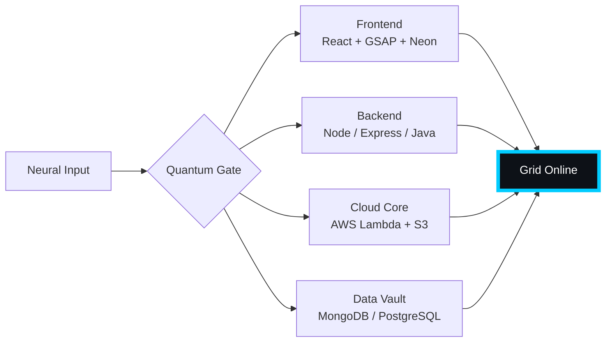

# 🌌 [ NEURAL CORE ACCESS: PENDEMVAMSI ]

<p align="center">
  
</p>

<div align="center">
  
  <br><small>Active Protocol: <strong style="color:#00CCFF">BLADE RUNNER RAIN</strong> 🌧️🔵</small>
</div>

## 🔵 NEURAL STATUS READOUT
```text
SUBJECT ID    →  PENDEMVAMSI
ENTITY CLASS  →  SHADOW MONARCH v9
NEURAL RANK   →  B-TIER
GRID SYNC     →  3513/15058 QUANTUM PACKETS
─────── BIO-METRICS (BLADE RUNNER RAIN) ───────
STRENGTH      149  ███████████████████░░
AGILITY       128  █████████████████░░░░
INTELLIGENCE  155  ████████████████████░
VITALITY      116  ███████████████░░░░░░
```

> **NEURAL BURST ACQUIRED:** +66 QUANTUM PACKETS 
> **SYSTEM MESSAGE:** HOLOGRAPHIC MASK ENGAGED — IDENTITY ERASED

---

## 🌀 GRID ARCHITECTURE (HOLOGRAPHIC RENDER)



---

## 📡 ACADEMIC NODES – CONQUERED
- [x] B.Tech Neural Engineering (2020–2024) – St. Ann’s Grid
- [x] Intermediate Quantum Core (2018–2020) – Sri Medhavi
- [x] SSC Primary Link (2017–2018) – Sri Geethanjali

---

## ⚡ SKILL NEURAL MATRIX

<details open>
<summary>🔌 ACTIVE NEURAL LINKS</summary>

| Node               | Tier | Integrity Bar                | Status      |
|--------------------|------|------------------------------|-------------|
| Java Core          | S    | ████████████████████ 100%   | OVERCLOCKED |
| Node.js Grid       | S    | ████████████████████ 100%   | OVERCLOCKED |
| React Holo-UI      | A+   | █████████████████░░░ 92%    | ONLINE      |
| AWS Quantum Relay  | S    | ████████████████████ 100%   | SOVEREIGN   |
| Python AI Kernel   | A    | ████████████████░░░░ 85%    | CHARGING    |
| DSA Void Algorithm | A    | █████████████████░░░ 90%    | ACTIVE      |

</details>

---

## 🏅 NEURAL ACHIEVEMENT TOKENS

<p align="center">
  
  
  
  
</p>

---

## 👾 SHADOW ENTITIES – SUMMONED

<p align="center">
  
  <br><strong style="color:#00CCFF">ARISE.</strong>
</p>

| Entity | Designation   | Class            | Source Node                     |
|--------|---------------|------------------|---------------------------------|
| SH-01  | Igris         | Void Commander   | AI Financial Oracle             |
| SH-02  | Beru          | Swarm Overlord   | WebRTC Quantum Stream           |
| SH-03  | Kaisel        | Void Wyrm        | Geolocation Shadow Relay        |
| SH-04  | Tusk          | Arcane Construct | Global Pandemic Sentinel        |
| SH-05  | Iron          | Armored Bastion  | React Crypto Fortress           |

---

## 📡 GRID ANALYTICS (LIVE FEED)

<p align="center">
  
  <br>
  
  
</p>

---

## 🖥️ CORRUPTED MAINFRAME LOG (401 ENTRIES)

<details>
<summary>OPEN TERMINAL FEED – PROTOCOL: BLADE RUNNER RAIN</summary>

> [0xE136C297] 🌧️🔵 **BLADE RUNNER RAIN PROTOCOL** #0 | NEURAL LINK STABILIZED | [TRANSMISSION SUCCESS]
> [0xA69D3E6E] 🌧️🔵 **BLADE RUNNER RAIN PROTOCOL** #1 | NEURAL LINK STABILIZED | [TRANSMISSION SUCCESS]
> [0x969057C3] 🌧️🔵 **BLADE RUNNER RAIN PROTOCOL** #2 | NEURAL LINK STABILIZED | [TRANSMISSION SUCCESS]
> [0x11D6FFC5] 🌧️🔵 **BLADE RUNNER RAIN PROTOCOL** #3 | NEURAL LINK STABILIZED | [TRANSMISSION SUCCESS]
> [0x44B2FEBA] 🌧️🔵 **BLADE RUNNER RAIN PROTOCOL** #4 | NEURAL LINK STABILIZED | [TRANSMISSION SUCCESS]
> [0xF33229FB] 🌧️🔵 **BLADE RUNNER RAIN PROTOCOL** #5 | NEURAL LINK STABILIZED | [TRANSMISSION SUCCESS]
> [0x05DFCD96] 🌧️🔵 **BLADE RUNNER RAIN PROTOCOL** #6 | NEURAL LINK STABILIZED | [TRANSMISSION SUCCESS]
> [0xB12C3FFD] 🌧️🔵 **BLADE RUNNER RAIN PROTOCOL** #7 | NEURAL LINK  [GLITCH DETECTED] STABILIZED | [TRANSMISSION SUCCESS]
> [0x33B408D1] 🌧️🔵 **BLADE RUNNER RAIN PROTOCOL** #8 | NEURAL LINK STABILIZED | [TRANSMISSION SUCCESS]
> [0x2CA24F61] 🌧️🔵 **BLADE RUNNER RAIN PROTOCOL** #9 | NEURAL LINK STABILIZED | [TRANSMISSION SUCCESS]
> [0x207684E1] 🌧️🔵 **BLADE RUNNER RAIN PROTOCOL** #10 | NEURAL LINK STABILIZED | [TRANSMISSION SUCCESS]
> [0x4CECB6F7] 🌧️🔵 **BLADE RUNNER RAIN PROTOCOL** #11 | NEURAL LINK STABILIZED | [TRANSMISSION SUCCESS]
> [0x073645B6] 🌧️🔵 **BLADE RUNNER RAIN PROTOCOL** #12 | NEURAL LINK STABILIZED | [TRANSMISSION SUCCESS]
> [0x992DAF17] 🌧️🔵 **BLADE RUNNER RAIN PROTOCOL** #13 | NEURAL LINK STABILIZED | [TRANSMISSION SUCCESS]
> [0x7A618651] 🌧️🔵 **BLADE RUNNER RAIN PROTOCOL** #14 | NEURAL LINK STABILIZED | [TRANSMISSION SUCCESS]
> [0x62505AF1] 🌧️🔵 **BLADE RUNNER RAIN PROTOCOL** #15 | NEURAL LINK STABILIZED | [TRANSMISSION SUCCESS]
> [0x6B29DA00] 🌧️🔵 **BLADE RUNNER RAIN PROTOCOL** #16 | NEURAL LINK STABILIZED | [TRANSMISSION SUCCESS]
> [0xAD32A3C2] 🌧️🔵 **BLADE RUNNER RAIN PROTOCOL** #17 | NEURAL LINK  [GLITCH DETECTED] STABILIZED | [TRANSMISSION SUCCESS]
> [0x9CBCF3D0] 🌧️🔵 **BLADE RUNNER RAIN PROTOCOL** #18 | NEURAL LINK STABILIZED | [TRANSMISSION SUCCESS]
> [0x6DFFD48B] 🌧️🔵 **BLADE RUNNER RAIN PROTOCOL** #19 | NEURAL LINK STABILIZED | [TRANSMISSION SUCCESS]
> [0x5F2ECE35] 🌧️🔵 **BLADE RUNNER RAIN PROTOCOL** #20 | NEURAL LINK STABILIZED | [TRANSMISSION SUCCESS]
> [0x92F35B4A] 🌧️🔵 **BLADE RUNNER RAIN PROTOCOL** #21 | NEURAL LINK  [GLITCH DETECTED] STABILIZED | [TRANSMISSION SUCCESS]
> [0x2EA1B0B0] 🌧️🔵 **BLADE RUNNER RAIN PROTOCOL** #22 | NEURAL LINK STABILIZED | [TRANSMISSION SUCCESS]
> [0xE21E0130] 🌧️🔵 **BLADE RUNNER RAIN PROTOCOL** #23 | NEURAL LINK STABILIZED | [TRANSMISSION SUCCESS]
> [0x87FBA4F6] 🌧️🔵 **BLADE RUNNER RAIN PROTOCOL** #24 | NEURAL LINK STABILIZED | [TRANSMISSION SUCCESS]
> [0x99C85C3B] 🌧️🔵 **BLADE RUNNER RAIN PROTOCOL** #25 | NEURAL LINK STABILIZED | [TRANSMISSION SUCCESS]
> [0x8F02AA65] 🌧️🔵 **BLADE RUNNER RAIN PROTOCOL** #26 | NEURAL LINK STABILIZED | [TRANSMISSION SUCCESS]
> [0x655DE489] 🌧️🔵 **BLADE RUNNER RAIN PROTOCOL** #27 | NEURAL LINK STABILIZED | [TRANSMISSION SUCCESS]
> [0x952C37CF] 🌧️🔵 **BLADE RUNNER RAIN PROTOCOL** #28 | NEURAL LINK STABILIZED | [TRANSMISSION SUCCESS]
> [0xEC0520B9] 🌧️🔵 **BLADE RUNNER RAIN PROTOCOL** #29 | NEURAL LINK STABILIZED | [TRANSMISSION SUCCESS]
> [0x24154772] 🌧️🔵 **BLADE RUNNER RAIN PROTOCOL** #30 | NEURAL LINK  [GLITCH DETECTED] STABILIZED | [TRANSMISSION SUCCESS]
> [0xD5F60797] 🌧️🔵 **BLADE RUNNER RAIN PROTOCOL** #31 | NEURAL LINK  [GLITCH DETECTED] STABILIZED | [TRANSMISSION SUCCESS]
> [0x476FBAC7] 🌧️🔵 **BLADE RUNNER RAIN PROTOCOL** #32 | NEURAL LINK STABILIZED | [TRANSMISSION SUCCESS]
> [0x3FE88B68] 🌧️🔵 **BLADE RUNNER RAIN PROTOCOL** #33 | NEURAL LINK STABILIZED | [TRANSMISSION SUCCESS]
> [0x6416D127] 🌧️🔵 **BLADE RUNNER RAIN PROTOCOL** #34 | NEURAL LINK STABILIZED | [TRANSMISSION SUCCESS]
> [0xD28A2132] 🌧️🔵 **BLADE RUNNER RAIN PROTOCOL** #35 | NEURAL LINK STABILIZED | [TRANSMISSION SUCCESS]
> [0xA0109E97] 🌧️🔵 **BLADE RUNNER RAIN PROTOCOL** #36 | NEURAL LINK STABILIZED | [TRANSMISSION SUCCESS]
> [0x54C2F2A0] 🌧️🔵 **BLADE RUNNER RAIN PROTOCOL** #37 | NEURAL LINK  [GLITCH DETECTED] STABILIZED | [TRANSMISSION SUCCESS]
> [0x7450A19D] 🌧️🔵 **BLADE RUNNER RAIN PROTOCOL** #38 | NEURAL LINK STABILIZED | [TRANSMISSION SUCCESS]
> [0x6F7B8944] 🌧️🔵 **BLADE RUNNER RAIN PROTOCOL** #39 | NEURAL LINK STABILIZED | [TRANSMISSION SUCCESS]
> [0x8D90B26F] 🌧️🔵 **BLADE RUNNER RAIN PROTOCOL** #40 | NEURAL LINK STABILIZED | [TRANSMISSION SUCCESS]
> [0x37A18250] 🌧️🔵 **BLADE RUNNER RAIN PROTOCOL** #41 | NEURAL LINK STABILIZED | [TRANSMISSION SUCCESS]
> [0xF1E3079C] 🌧️🔵 **BLADE RUNNER RAIN PROTOCOL** #42 | NEURAL LINK STABILIZED | [TRANSMISSION SUCCESS]
> [0x02B9C1B5] 🌧️🔵 **BLADE RUNNER RAIN PROTOCOL** #43 | NEURAL LINK STABILIZED | [TRANSMISSION SUCCESS]
> [0xE7E15978] 🌧️🔵 **BLADE RUNNER RAIN PROTOCOL** #44 | NEURAL LINK STABILIZED | [TRANSMISSION SUCCESS]
> [0x8297ED5F] 🌧️🔵 **BLADE RUNNER RAIN PROTOCOL** #45 | NEURAL LINK STABILIZED | [TRANSMISSION SUCCESS]
> [0xCEEA1A03] 🌧️🔵 **BLADE RUNNER RAIN PROTOCOL** #46 | NEURAL LINK STABILIZED | [TRANSMISSION SUCCESS]
> [0x890364BB] 🌧️🔵 **BLADE RUNNER RAIN PROTOCOL** #47 | NEURAL LINK  [GLITCH DETECTED] STABILIZED | [TRANSMISSION SUCCESS]
> [0xFE42E109] 🌧️🔵 **BLADE RUNNER RAIN PROTOCOL** #48 | NEURAL LINK STABILIZED | [TRANSMISSION SUCCESS]
> [0x1D45E26A] 🌧️🔵 **BLADE RUNNER RAIN PROTOCOL** #49 | NEURAL LINK STABILIZED | [TRANSMISSION SUCCESS]
> [0xE7314B56] 🌧️🔵 **BLADE RUNNER RAIN PROTOCOL** #50 | NEURAL LINK  [GLITCH DETECTED] STABILIZED | [TRANSMISSION SUCCESS]
> [0xCAF34BB0] 🌧️🔵 **BLADE RUNNER RAIN PROTOCOL** #51 | NEURAL LINK STABILIZED | [TRANSMISSION SUCCESS]
> [0x95525248] 🌧️🔵 **BLADE RUNNER RAIN PROTOCOL** #52 | NEURAL LINK  [GLITCH DETECTED] STABILIZED | [TRANSMISSION SUCCESS]
> [0x22B3F29C] 🌧️🔵 **BLADE RUNNER RAIN PROTOCOL** #53 | NEURAL LINK STABILIZED | [TRANSMISSION SUCCESS]
> [0x6BFFDC2D] 🌧️🔵 **BLADE RUNNER RAIN PROTOCOL** #54 | NEURAL LINK  [GLITCH DETECTED] STABILIZED | [TRANSMISSION SUCCESS]
> [0x1B98D50F] 🌧️🔵 **BLADE RUNNER RAIN PROTOCOL** #55 | NEURAL LINK STABILIZED | [TRANSMISSION SUCCESS]
> [0x033AB739] 🌧️🔵 **BLADE RUNNER RAIN PROTOCOL** #56 | NEURAL LINK STABILIZED | [TRANSMISSION SUCCESS]
> [0xEC961F25] 🌧️🔵 **BLADE RUNNER RAIN PROTOCOL** #57 | NEURAL LINK STABILIZED | [TRANSMISSION SUCCESS]
> [0x90908CF5] 🌧️🔵 **BLADE RUNNER RAIN PROTOCOL** #58 | NEURAL LINK STABILIZED | [TRANSMISSION SUCCESS]
> [0x94A40039] 🌧️🔵 **BLADE RUNNER RAIN PROTOCOL** #59 | NEURAL LINK STABILIZED | [TRANSMISSION SUCCESS]
> [0xBAAEC094] 🌧️🔵 **BLADE RUNNER RAIN PROTOCOL** #60 | NEURAL LINK STABILIZED | [TRANSMISSION SUCCESS]
> [0xCD9437F2] 🌧️🔵 **BLADE RUNNER RAIN PROTOCOL** #61 | NEURAL LINK STABILIZED | [TRANSMISSION SUCCESS]
> [0x25D68B1D] 🌧️🔵 **BLADE RUNNER RAIN PROTOCOL** #62 | NEURAL LINK STABILIZED | [TRANSMISSION SUCCESS]
> [0x2C4FA241] 🌧️🔵 **BLADE RUNNER RAIN PROTOCOL** #63 | NEURAL LINK STABILIZED | [TRANSMISSION SUCCESS]
> [0xD367EE53] 🌧️🔵 **BLADE RUNNER RAIN PROTOCOL** #64 | NEURAL LINK STABILIZED | [TRANSMISSION SUCCESS]
> [0x47A52FA9] 🌧️🔵 **BLADE RUNNER RAIN PROTOCOL** #65 | NEURAL LINK STABILIZED | [TRANSMISSION SUCCESS]
> [0xFE4755CF] 🌧️🔵 **BLADE RUNNER RAIN PROTOCOL** #66 | NEURAL LINK  [GLITCH DETECTED] STABILIZED | [TRANSMISSION SUCCESS]
> [0xCBCC7181] 🌧️🔵 **BLADE RUNNER RAIN PROTOCOL** #67 | NEURAL LINK STABILIZED | [TRANSMISSION SUCCESS]
> [0x63D39A1E] 🌧️🔵 **BLADE RUNNER RAIN PROTOCOL** #68 | NEURAL LINK  [GLITCH DETECTED] STABILIZED | [TRANSMISSION SUCCESS]
> [0x92836411] 🌧️🔵 **BLADE RUNNER RAIN PROTOCOL** #69 | NEURAL LINK STABILIZED | [TRANSMISSION SUCCESS]
> [0xC9470258] 🌧️🔵 **BLADE RUNNER RAIN PROTOCOL** #70 | NEURAL LINK STABILIZED | [TRANSMISSION SUCCESS]
> [0xBA3A30E3] 🌧️🔵 **BLADE RUNNER RAIN PROTOCOL** #71 | NEURAL LINK STABILIZED | [TRANSMISSION SUCCESS]
> [0xF4B7A516] 🌧️🔵 **BLADE RUNNER RAIN PROTOCOL** #72 | NEURAL LINK STABILIZED | [TRANSMISSION SUCCESS]
> [0x57F40221] 🌧️🔵 **BLADE RUNNER RAIN PROTOCOL** #73 | NEURAL LINK STABILIZED | [TRANSMISSION SUCCESS]
> [0xB21FF74D] 🌧️🔵 **BLADE RUNNER RAIN PROTOCOL** #74 | NEURAL LINK STABILIZED | [TRANSMISSION SUCCESS]
> [0xEB8FED02] 🌧️🔵 **BLADE RUNNER RAIN PROTOCOL** #75 | NEURAL LINK STABILIZED | [TRANSMISSION SUCCESS]
> [0xDD62BA86] 🌧️🔵 **BLADE RUNNER RAIN PROTOCOL** #76 | NEURAL LINK STABILIZED | [TRANSMISSION SUCCESS]
> [0xA686E655] 🌧️🔵 **BLADE RUNNER RAIN PROTOCOL** #77 | NEURAL LINK STABILIZED | [TRANSMISSION SUCCESS]
> [0x3E03BD1A] 🌧️🔵 **BLADE RUNNER RAIN PROTOCOL** #78 | NEURAL LINK STABILIZED | [TRANSMISSION SUCCESS]
> [0x7B8D3AB8] 🌧️🔵 **BLADE RUNNER RAIN PROTOCOL** #79 | NEURAL LINK STABILIZED | [TRANSMISSION SUCCESS]
> [0x4C67784F] 🌧️🔵 **BLADE RUNNER RAIN PROTOCOL** #80 | NEURAL LINK STABILIZED | [TRANSMISSION SUCCESS]
> [0x7438E9E9] 🌧️🔵 **BLADE RUNNER RAIN PROTOCOL** #81 | NEURAL LINK STABILIZED | [TRANSMISSION SUCCESS]
> [0x629083BB] 🌧️🔵 **BLADE RUNNER RAIN PROTOCOL** #82 | NEURAL LINK  [GLITCH DETECTED] STABILIZED | [TRANSMISSION SUCCESS]
> [0x7EBB31E4] 🌧️🔵 **BLADE RUNNER RAIN PROTOCOL** #83 | NEURAL LINK STABILIZED | [TRANSMISSION SUCCESS]
> [0xD68C28D3] 🌧️🔵 **BLADE RUNNER RAIN PROTOCOL** #84 | NEURAL LINK STABILIZED | [TRANSMISSION SUCCESS]
> [0xBF1E2477] 🌧️🔵 **BLADE RUNNER RAIN PROTOCOL** #85 | NEURAL LINK STABILIZED | [TRANSMISSION SUCCESS]
> [0x2FF1B5F6] 🌧️🔵 **BLADE RUNNER RAIN PROTOCOL** #86 | NEURAL LINK STABILIZED | [TRANSMISSION SUCCESS]
> [0x084E9AE3] 🌧️🔵 **BLADE RUNNER RAIN PROTOCOL** #87 | NEURAL LINK STABILIZED | [TRANSMISSION SUCCESS]
> [0x5DDEFF1A] 🌧️🔵 **BLADE RUNNER RAIN PROTOCOL** #88 | NEURAL LINK STABILIZED | [TRANSMISSION SUCCESS]
> [0x73D0EC65] 🌧️🔵 **BLADE RUNNER RAIN PROTOCOL** #89 | NEURAL LINK STABILIZED | [TRANSMISSION SUCCESS]
> [0x64A568BF] 🌧️🔵 **BLADE RUNNER RAIN PROTOCOL** #90 | NEURAL LINK  [GLITCH DETECTED] STABILIZED | [TRANSMISSION SUCCESS]
> [0xC836468D] 🌧️🔵 **BLADE RUNNER RAIN PROTOCOL** #91 | NEURAL LINK STABILIZED | [TRANSMISSION SUCCESS]
> [0xB7B7DD63] 🌧️🔵 **BLADE RUNNER RAIN PROTOCOL** #92 | NEURAL LINK STABILIZED | [TRANSMISSION SUCCESS]
> [0x9C6768B4] 🌧️🔵 **BLADE RUNNER RAIN PROTOCOL** #93 | NEURAL LINK STABILIZED | [TRANSMISSION SUCCESS]
> [0x6DD88327] 🌧️🔵 **BLADE RUNNER RAIN PROTOCOL** #94 | NEURAL LINK STABILIZED | [TRANSMISSION SUCCESS]
> [0x09AE93CA] 🌧️🔵 **BLADE RUNNER RAIN PROTOCOL** #95 | NEURAL LINK STABILIZED | [TRANSMISSION SUCCESS]
> [0x85BF3986] 🌧️🔵 **BLADE RUNNER RAIN PROTOCOL** #96 | NEURAL LINK STABILIZED | [TRANSMISSION SUCCESS]
> [0x4933F6A1] 🌧️🔵 **BLADE RUNNER RAIN PROTOCOL** #97 | NEURAL LINK STABILIZED | [TRANSMISSION SUCCESS]
> [0x72FC8BE0] 🌧️🔵 **BLADE RUNNER RAIN PROTOCOL** #98 | NEURAL LINK STABILIZED | [TRANSMISSION SUCCESS]
> [0xFE81FB87] 🌧️🔵 **BLADE RUNNER RAIN PROTOCOL** #99 | NEURAL LINK STABILIZED | [TRANSMISSION SUCCESS]
> [0xECB8E712] 🌧️🔵 **BLADE RUNNER RAIN PROTOCOL** #100 | NEURAL LINK STABILIZED | [TRANSMISSION SUCCESS]
> [0xBB70168F] 🌧️🔵 **BLADE RUNNER RAIN PROTOCOL** #101 | NEURAL LINK STABILIZED | [TRANSMISSION SUCCESS]
> [0xFD129ED4] 🌧️🔵 **BLADE RUNNER RAIN PROTOCOL** #102 | NEURAL LINK STABILIZED | [TRANSMISSION SUCCESS]
> [0x31AFE562] 🌧️🔵 **BLADE RUNNER RAIN PROTOCOL** #103 | NEURAL LINK STABILIZED | [TRANSMISSION SUCCESS]
> [0xBFA5A8FF] 🌧️🔵 **BLADE RUNNER RAIN PROTOCOL** #104 | NEURAL LINK STABILIZED | [TRANSMISSION SUCCESS]
> [0x265E40A3] 🌧️🔵 **BLADE RUNNER RAIN PROTOCOL** #105 | NEURAL LINK STABILIZED | [TRANSMISSION SUCCESS]
> [0x9C7F5376] 🌧️🔵 **BLADE RUNNER RAIN PROTOCOL** #106 | NEURAL LINK STABILIZED | [TRANSMISSION SUCCESS]
> [0x4B11031C] 🌧️🔵 **BLADE RUNNER RAIN PROTOCOL** #107 | NEURAL LINK STABILIZED | [TRANSMISSION SUCCESS]
> [0x931E2D2C] 🌧️🔵 **BLADE RUNNER RAIN PROTOCOL** #108 | NEURAL LINK  [GLITCH DETECTED] STABILIZED | [TRANSMISSION SUCCESS]
> [0xC7DE2315] 🌧️🔵 **BLADE RUNNER RAIN PROTOCOL** #109 | NEURAL LINK STABILIZED | [TRANSMISSION SUCCESS]
> [0xF5434E4A] 🌧️🔵 **BLADE RUNNER RAIN PROTOCOL** #110 | NEURAL LINK STABILIZED | [TRANSMISSION SUCCESS]
> [0x7D37AA3B] 🌧️🔵 **BLADE RUNNER RAIN PROTOCOL** #111 | NEURAL LINK  [GLITCH DETECTED] STABILIZED | [TRANSMISSION SUCCESS]
> [0x38A1AD51] 🌧️🔵 **BLADE RUNNER RAIN PROTOCOL** #112 | NEURAL LINK STABILIZED | [TRANSMISSION SUCCESS]
> [0x322E4061] 🌧️🔵 **BLADE RUNNER RAIN PROTOCOL** #113 | NEURAL LINK STABILIZED | [TRANSMISSION SUCCESS]
> [0x77AD1CBE] 🌧️🔵 **BLADE RUNNER RAIN PROTOCOL** #114 | NEURAL LINK STABILIZED | [TRANSMISSION SUCCESS]
> [0xA3CEC93B] 🌧️🔵 **BLADE RUNNER RAIN PROTOCOL** #115 | NEURAL LINK STABILIZED | [TRANSMISSION SUCCESS]
> [0xB65A54D8] 🌧️🔵 **BLADE RUNNER RAIN PROTOCOL** #116 | NEURAL LINK STABILIZED | [TRANSMISSION SUCCESS]
> [0x5770CF0F] 🌧️🔵 **BLADE RUNNER RAIN PROTOCOL** #117 | NEURAL LINK STABILIZED | [TRANSMISSION SUCCESS]
> [0xC1982FD1] 🌧️🔵 **BLADE RUNNER RAIN PROTOCOL** #118 | NEURAL LINK STABILIZED | [TRANSMISSION SUCCESS]
> [0x11519BE4] 🌧️🔵 **BLADE RUNNER RAIN PROTOCOL** #119 | NEURAL LINK STABILIZED | [TRANSMISSION SUCCESS]
> [0x7544D1F4] 🌧️🔵 **BLADE RUNNER RAIN PROTOCOL** #120 | NEURAL LINK STABILIZED | [TRANSMISSION SUCCESS]
> [0xE3DF330A] 🌧️🔵 **BLADE RUNNER RAIN PROTOCOL** #121 | NEURAL LINK STABILIZED | [TRANSMISSION SUCCESS]
> [0x9802285C] 🌧️🔵 **BLADE RUNNER RAIN PROTOCOL** #122 | NEURAL LINK STABILIZED | [TRANSMISSION SUCCESS]
> [0xF07B7360] 🌧️🔵 **BLADE RUNNER RAIN PROTOCOL** #123 | NEURAL LINK STABILIZED | [TRANSMISSION SUCCESS]
> [0xAE1E6CDD] 🌧️🔵 **BLADE RUNNER RAIN PROTOCOL** #124 | NEURAL LINK STABILIZED | [TRANSMISSION SUCCESS]
> [0x27E99986] 🌧️🔵 **BLADE RUNNER RAIN PROTOCOL** #125 | NEURAL LINK STABILIZED | [TRANSMISSION SUCCESS]
> [0x0E57D509] 🌧️🔵 **BLADE RUNNER RAIN PROTOCOL** #126 | NEURAL LINK STABILIZED | [TRANSMISSION SUCCESS]
> [0x465BD73E] 🌧️🔵 **BLADE RUNNER RAIN PROTOCOL** #127 | NEURAL LINK STABILIZED | [TRANSMISSION SUCCESS]
> [0xDDAE1B08] 🌧️🔵 **BLADE RUNNER RAIN PROTOCOL** #128 | NEURAL LINK STABILIZED | [TRANSMISSION SUCCESS]
> [0xF6B404B2] 🌧️🔵 **BLADE RUNNER RAIN PROTOCOL** #129 | NEURAL LINK  [GLITCH DETECTED] STABILIZED | [TRANSMISSION SUCCESS]
> [0x0AA4524C] 🌧️🔵 **BLADE RUNNER RAIN PROTOCOL** #130 | NEURAL LINK STABILIZED | [TRANSMISSION SUCCESS]
> [0x212553D2] 🌧️🔵 **BLADE RUNNER RAIN PROTOCOL** #131 | NEURAL LINK STABILIZED | [TRANSMISSION SUCCESS]
> [0xBA658B18] 🌧️🔵 **BLADE RUNNER RAIN PROTOCOL** #132 | NEURAL LINK STABILIZED | [TRANSMISSION SUCCESS]
> [0xAE07F232] 🌧️🔵 **BLADE RUNNER RAIN PROTOCOL** #133 | NEURAL LINK STABILIZED | [TRANSMISSION SUCCESS]
> [0xF096C917] 🌧️🔵 **BLADE RUNNER RAIN PROTOCOL** #134 | NEURAL LINK STABILIZED | [TRANSMISSION SUCCESS]
> [0x6C54876B] 🌧️🔵 **BLADE RUNNER RAIN PROTOCOL** #135 | NEURAL LINK STABILIZED | [TRANSMISSION SUCCESS]
> [0xD5235C5D] 🌧️🔵 **BLADE RUNNER RAIN PROTOCOL** #136 | NEURAL LINK STABILIZED | [TRANSMISSION SUCCESS]
> [0x0A8240E7] 🌧️🔵 **BLADE RUNNER RAIN PROTOCOL** #137 | NEURAL LINK STABILIZED | [TRANSMISSION SUCCESS]
> [0xE2D94FB6] 🌧️🔵 **BLADE RUNNER RAIN PROTOCOL** #138 | NEURAL LINK STABILIZED | [TRANSMISSION SUCCESS]
> [0x57E877CC] 🌧️🔵 **BLADE RUNNER RAIN PROTOCOL** #139 | NEURAL LINK STABILIZED | [TRANSMISSION SUCCESS]
> [0xF3D4BC55] 🌧️🔵 **BLADE RUNNER RAIN PROTOCOL** #140 | NEURAL LINK STABILIZED | [TRANSMISSION SUCCESS]
> [0xD4D2C211] 🌧️🔵 **BLADE RUNNER RAIN PROTOCOL** #141 | NEURAL LINK STABILIZED | [TRANSMISSION SUCCESS]
> [0x233D2841] 🌧️🔵 **BLADE RUNNER RAIN PROTOCOL** #142 | NEURAL LINK STABILIZED | [TRANSMISSION SUCCESS]
> [0x9ED5BC5C] 🌧️🔵 **BLADE RUNNER RAIN PROTOCOL** #143 | NEURAL LINK STABILIZED | [TRANSMISSION SUCCESS]
> [0x9FA80900] 🌧️🔵 **BLADE RUNNER RAIN PROTOCOL** #144 | NEURAL LINK STABILIZED | [TRANSMISSION SUCCESS]
> [0x314123FA] 🌧️🔵 **BLADE RUNNER RAIN PROTOCOL** #145 | NEURAL LINK STABILIZED | [TRANSMISSION SUCCESS]
> [0xAEE8CDDF] 🌧️🔵 **BLADE RUNNER RAIN PROTOCOL** #146 | NEURAL LINK STABILIZED | [TRANSMISSION SUCCESS]
> [0x3561500D] 🌧️🔵 **BLADE RUNNER RAIN PROTOCOL** #147 | NEURAL LINK STABILIZED | [TRANSMISSION SUCCESS]
> [0x228D3693] 🌧️🔵 **BLADE RUNNER RAIN PROTOCOL** #148 | NEURAL LINK STABILIZED | [TRANSMISSION SUCCESS]
> [0x68919084] 🌧️🔵 **BLADE RUNNER RAIN PROTOCOL** #149 | NEURAL LINK STABILIZED | [TRANSMISSION SUCCESS]
> [0xBC9132E7] 🌧️🔵 **BLADE RUNNER RAIN PROTOCOL** #150 | NEURAL LINK STABILIZED | [TRANSMISSION SUCCESS]
> [0xCA6B8162] 🌧️🔵 **BLADE RUNNER RAIN PROTOCOL** #151 | NEURAL LINK STABILIZED | [TRANSMISSION SUCCESS]
> [0x367059D6] 🌧️🔵 **BLADE RUNNER RAIN PROTOCOL** #152 | NEURAL LINK  [GLITCH DETECTED] STABILIZED | [TRANSMISSION SUCCESS]
> [0x014B2DD8] 🌧️🔵 **BLADE RUNNER RAIN PROTOCOL** #153 | NEURAL LINK STABILIZED | [TRANSMISSION SUCCESS]
> [0x6E5C108A] 🌧️🔵 **BLADE RUNNER RAIN PROTOCOL** #154 | NEURAL LINK STABILIZED | [TRANSMISSION SUCCESS]
> [0x5B6CFA52] 🌧️🔵 **BLADE RUNNER RAIN PROTOCOL** #155 | NEURAL LINK STABILIZED | [TRANSMISSION SUCCESS]
> [0x5A7D27B3] 🌧️🔵 **BLADE RUNNER RAIN PROTOCOL** #156 | NEURAL LINK STABILIZED | [TRANSMISSION SUCCESS]
> [0x78361EB5] 🌧️🔵 **BLADE RUNNER RAIN PROTOCOL** #157 | NEURAL LINK STABILIZED | [TRANSMISSION SUCCESS]
> [0xBAFC6127] 🌧️🔵 **BLADE RUNNER RAIN PROTOCOL** #158 | NEURAL LINK STABILIZED | [TRANSMISSION SUCCESS]
> [0x30B02019] 🌧️🔵 **BLADE RUNNER RAIN PROTOCOL** #159 | NEURAL LINK STABILIZED | [TRANSMISSION SUCCESS]
> [0x0E33B044] 🌧️🔵 **BLADE RUNNER RAIN PROTOCOL** #160 | NEURAL LINK STABILIZED | [TRANSMISSION SUCCESS]
> [0x9B35CDF1] 🌧️🔵 **BLADE RUNNER RAIN PROTOCOL** #161 | NEURAL LINK  [GLITCH DETECTED] STABILIZED | [TRANSMISSION SUCCESS]
> [0xC80C5D40] 🌧️🔵 **BLADE RUNNER RAIN PROTOCOL** #162 | NEURAL LINK STABILIZED | [TRANSMISSION SUCCESS]
> [0x5C781394] 🌧️🔵 **BLADE RUNNER RAIN PROTOCOL** #163 | NEURAL LINK STABILIZED | [TRANSMISSION SUCCESS]
> [0xEABEB669] 🌧️🔵 **BLADE RUNNER RAIN PROTOCOL** #164 | NEURAL LINK STABILIZED | [TRANSMISSION SUCCESS]
> [0xC3BB81F8] 🌧️🔵 **BLADE RUNNER RAIN PROTOCOL** #165 | NEURAL LINK STABILIZED | [TRANSMISSION SUCCESS]
> [0x86B082DF] 🌧️🔵 **BLADE RUNNER RAIN PROTOCOL** #166 | NEURAL LINK STABILIZED | [TRANSMISSION SUCCESS]
> [0x191F5F09] 🌧️🔵 **BLADE RUNNER RAIN PROTOCOL** #167 | NEURAL LINK STABILIZED | [TRANSMISSION SUCCESS]
> [0x146B3C6C] 🌧️🔵 **BLADE RUNNER RAIN PROTOCOL** #168 | NEURAL LINK STABILIZED | [TRANSMISSION SUCCESS]
> [0x99B8E019] 🌧️🔵 **BLADE RUNNER RAIN PROTOCOL** #169 | NEURAL LINK STABILIZED | [TRANSMISSION SUCCESS]
> [0x6753D878] 🌧️🔵 **BLADE RUNNER RAIN PROTOCOL** #170 | NEURAL LINK STABILIZED | [TRANSMISSION SUCCESS]
> [0x6E9E1AC5] 🌧️🔵 **BLADE RUNNER RAIN PROTOCOL** #171 | NEURAL LINK STABILIZED | [TRANSMISSION SUCCESS]
> [0x66419E75] 🌧️🔵 **BLADE RUNNER RAIN PROTOCOL** #172 | NEURAL LINK STABILIZED | [TRANSMISSION SUCCESS]
> [0xF590EE5C] 🌧️🔵 **BLADE RUNNER RAIN PROTOCOL** #173 | NEURAL LINK STABILIZED | [TRANSMISSION SUCCESS]
> [0xF3C93326] 🌧️🔵 **BLADE RUNNER RAIN PROTOCOL** #174 | NEURAL LINK STABILIZED | [TRANSMISSION SUCCESS]
> [0x450B321A] 🌧️🔵 **BLADE RUNNER RAIN PROTOCOL** #175 | NEURAL LINK  [GLITCH DETECTED] STABILIZED | [TRANSMISSION SUCCESS]
> [0xEC343AE1] 🌧️🔵 **BLADE RUNNER RAIN PROTOCOL** #176 | NEURAL LINK  [GLITCH DETECTED] STABILIZED | [TRANSMISSION SUCCESS]
> [0x6875C2BF] 🌧️🔵 **BLADE RUNNER RAIN PROTOCOL** #177 | NEURAL LINK  [GLITCH DETECTED] STABILIZED | [TRANSMISSION SUCCESS]
> [0xF457C0C5] 🌧️🔵 **BLADE RUNNER RAIN PROTOCOL** #178 | NEURAL LINK STABILIZED | [TRANSMISSION SUCCESS]
> [0xFBBAE8E7] 🌧️🔵 **BLADE RUNNER RAIN PROTOCOL** #179 | NEURAL LINK STABILIZED | [TRANSMISSION SUCCESS]
> [0x8FDA71E2] 🌧️🔵 **BLADE RUNNER RAIN PROTOCOL** #180 | NEURAL LINK  [GLITCH DETECTED] STABILIZED | [TRANSMISSION SUCCESS]
> [0x53E5F473] 🌧️🔵 **BLADE RUNNER RAIN PROTOCOL** #181 | NEURAL LINK STABILIZED | [TRANSMISSION SUCCESS]
> [0x801793FC] 🌧️🔵 **BLADE RUNNER RAIN PROTOCOL** #182 | NEURAL LINK STABILIZED | [TRANSMISSION SUCCESS]
> [0x4006678A] 🌧️🔵 **BLADE RUNNER RAIN PROTOCOL** #183 | NEURAL LINK STABILIZED | [TRANSMISSION SUCCESS]
> [0xE61AD581] 🌧️🔵 **BLADE RUNNER RAIN PROTOCOL** #184 | NEURAL LINK STABILIZED | [TRANSMISSION SUCCESS]
> [0x392A8AD4] 🌧️🔵 **BLADE RUNNER RAIN PROTOCOL** #185 | NEURAL LINK STABILIZED | [TRANSMISSION SUCCESS]
> [0xBC2C23A6] 🌧️🔵 **BLADE RUNNER RAIN PROTOCOL** #186 | NEURAL LINK STABILIZED | [TRANSMISSION SUCCESS]
> [0x7B4F9C81] 🌧️🔵 **BLADE RUNNER RAIN PROTOCOL** #187 | NEURAL LINK STABILIZED | [TRANSMISSION SUCCESS]
> [0x2DD23BFC] 🌧️🔵 **BLADE RUNNER RAIN PROTOCOL** #188 | NEURAL LINK STABILIZED | [TRANSMISSION SUCCESS]
> [0xFD11922E] 🌧️🔵 **BLADE RUNNER RAIN PROTOCOL** #189 | NEURAL LINK STABILIZED | [TRANSMISSION SUCCESS]
> [0x8FC0216F] 🌧️🔵 **BLADE RUNNER RAIN PROTOCOL** #190 | NEURAL LINK STABILIZED | [TRANSMISSION SUCCESS]
> [0x0779CA7F] 🌧️🔵 **BLADE RUNNER RAIN PROTOCOL** #191 | NEURAL LINK STABILIZED | [TRANSMISSION SUCCESS]
> [0x8E801116] 🌧️🔵 **BLADE RUNNER RAIN PROTOCOL** #192 | NEURAL LINK STABILIZED | [TRANSMISSION SUCCESS]
> [0x938A0F4E] 🌧️🔵 **BLADE RUNNER RAIN PROTOCOL** #193 | NEURAL LINK  [GLITCH DETECTED] STABILIZED | [TRANSMISSION SUCCESS]
> [0xB7FB31A3] 🌧️🔵 **BLADE RUNNER RAIN PROTOCOL** #194 | NEURAL LINK STABILIZED | [TRANSMISSION SUCCESS]
> [0x28B6622E] 🌧️🔵 **BLADE RUNNER RAIN PROTOCOL** #195 | NEURAL LINK STABILIZED | [TRANSMISSION SUCCESS]
> [0xAD04440B] 🌧️🔵 **BLADE RUNNER RAIN PROTOCOL** #196 | NEURAL LINK STABILIZED | [TRANSMISSION SUCCESS]
> [0x23CE2377] 🌧️🔵 **BLADE RUNNER RAIN PROTOCOL** #197 | NEURAL LINK STABILIZED | [TRANSMISSION SUCCESS]
> [0x44F700EE] 🌧️🔵 **BLADE RUNNER RAIN PROTOCOL** #198 | NEURAL LINK  [GLITCH DETECTED] STABILIZED | [TRANSMISSION SUCCESS]
> [0xBB889210] 🌧️🔵 **BLADE RUNNER RAIN PROTOCOL** #199 | NEURAL LINK STABILIZED | [TRANSMISSION SUCCESS]
> [0x390B69A5] 🌧️🔵 **BLADE RUNNER RAIN PROTOCOL** #200 | NEURAL LINK STABILIZED | [TRANSMISSION SUCCESS]
> [0xA8E6EDB4] 🌧️🔵 **BLADE RUNNER RAIN PROTOCOL** #201 | NEURAL LINK  [GLITCH DETECTED] STABILIZED | [TRANSMISSION SUCCESS]
> [0x4700C064] 🌧️🔵 **BLADE RUNNER RAIN PROTOCOL** #202 | NEURAL LINK STABILIZED | [TRANSMISSION SUCCESS]
> [0x22D769DD] 🌧️🔵 **BLADE RUNNER RAIN PROTOCOL** #203 | NEURAL LINK STABILIZED | [TRANSMISSION SUCCESS]
> [0xF9AFFCC6] 🌧️🔵 **BLADE RUNNER RAIN PROTOCOL** #204 | NEURAL LINK STABILIZED | [TRANSMISSION SUCCESS]
> [0xC2F442C5] 🌧️🔵 **BLADE RUNNER RAIN PROTOCOL** #205 | NEURAL LINK STABILIZED | [TRANSMISSION SUCCESS]
> [0x719F7B7F] 🌧️🔵 **BLADE RUNNER RAIN PROTOCOL** #206 | NEURAL LINK STABILIZED | [TRANSMISSION SUCCESS]
> [0xF3FA3860] 🌧️🔵 **BLADE RUNNER RAIN PROTOCOL** #207 | NEURAL LINK STABILIZED | [TRANSMISSION SUCCESS]
> [0x7E42D239] 🌧️🔵 **BLADE RUNNER RAIN PROTOCOL** #208 | NEURAL LINK  [GLITCH DETECTED] STABILIZED | [TRANSMISSION SUCCESS]
> [0x3B873769] 🌧️🔵 **BLADE RUNNER RAIN PROTOCOL** #209 | NEURAL LINK STABILIZED | [TRANSMISSION SUCCESS]
> [0xAAC3EE0C] 🌧️🔵 **BLADE RUNNER RAIN PROTOCOL** #210 | NEURAL LINK STABILIZED | [TRANSMISSION SUCCESS]
> [0x15CD595F] 🌧️🔵 **BLADE RUNNER RAIN PROTOCOL** #211 | NEURAL LINK  [GLITCH DETECTED] STABILIZED | [TRANSMISSION SUCCESS]
> [0xF09FD216] 🌧️🔵 **BLADE RUNNER RAIN PROTOCOL** #212 | NEURAL LINK STABILIZED | [TRANSMISSION SUCCESS]
> [0x9E390A0F] 🌧️🔵 **BLADE RUNNER RAIN PROTOCOL** #213 | NEURAL LINK STABILIZED | [TRANSMISSION SUCCESS]
> [0xCE7CE03A] 🌧️🔵 **BLADE RUNNER RAIN PROTOCOL** #214 | NEURAL LINK STABILIZED | [TRANSMISSION SUCCESS]
> [0x789844CB] 🌧️🔵 **BLADE RUNNER RAIN PROTOCOL** #215 | NEURAL LINK  [GLITCH DETECTED] STABILIZED | [TRANSMISSION SUCCESS]
> [0x711CF5C9] 🌧️🔵 **BLADE RUNNER RAIN PROTOCOL** #216 | NEURAL LINK STABILIZED | [TRANSMISSION SUCCESS]
> [0xC8595D8B] 🌧️🔵 **BLADE RUNNER RAIN PROTOCOL** #217 | NEURAL LINK STABILIZED | [TRANSMISSION SUCCESS]
> [0xDCD84D73] 🌧️🔵 **BLADE RUNNER RAIN PROTOCOL** #218 | NEURAL LINK STABILIZED | [TRANSMISSION SUCCESS]
> [0x3DADF2E1] 🌧️🔵 **BLADE RUNNER RAIN PROTOCOL** #219 | NEURAL LINK  [GLITCH DETECTED] STABILIZED | [TRANSMISSION SUCCESS]
> [0x03A257B4] 🌧️🔵 **BLADE RUNNER RAIN PROTOCOL** #220 | NEURAL LINK  [GLITCH DETECTED] STABILIZED | [TRANSMISSION SUCCESS]
> [0x3002FFD3] 🌧️🔵 **BLADE RUNNER RAIN PROTOCOL** #221 | NEURAL LINK STABILIZED | [TRANSMISSION SUCCESS]
> [0xC75E25E0] 🌧️🔵 **BLADE RUNNER RAIN PROTOCOL** #222 | NEURAL LINK  [GLITCH DETECTED] STABILIZED | [TRANSMISSION SUCCESS]
> [0xBC9C34A0] 🌧️🔵 **BLADE RUNNER RAIN PROTOCOL** #223 | NEURAL LINK STABILIZED | [TRANSMISSION SUCCESS]
> [0xD0832420] 🌧️🔵 **BLADE RUNNER RAIN PROTOCOL** #224 | NEURAL LINK  [GLITCH DETECTED] STABILIZED | [TRANSMISSION SUCCESS]
> [0x15AD487C] 🌧️🔵 **BLADE RUNNER RAIN PROTOCOL** #225 | NEURAL LINK STABILIZED | [TRANSMISSION SUCCESS]
> [0xC34B1975] 🌧️🔵 **BLADE RUNNER RAIN PROTOCOL** #226 | NEURAL LINK STABILIZED | [TRANSMISSION SUCCESS]
> [0xC632AE23] 🌧️🔵 **BLADE RUNNER RAIN PROTOCOL** #227 | NEURAL LINK STABILIZED | [TRANSMISSION SUCCESS]
> [0xB3C9A3B6] 🌧️🔵 **BLADE RUNNER RAIN PROTOCOL** #228 | NEURAL LINK STABILIZED | [TRANSMISSION SUCCESS]
> [0x48DF71DB] 🌧️🔵 **BLADE RUNNER RAIN PROTOCOL** #229 | NEURAL LINK STABILIZED | [TRANSMISSION SUCCESS]
> [0x8C73DCA2] 🌧️🔵 **BLADE RUNNER RAIN PROTOCOL** #230 | NEURAL LINK STABILIZED | [TRANSMISSION SUCCESS]
> [0xB5540680] 🌧️🔵 **BLADE RUNNER RAIN PROTOCOL** #231 | NEURAL LINK STABILIZED | [TRANSMISSION SUCCESS]
> [0x4B5AAFBC] 🌧️🔵 **BLADE RUNNER RAIN PROTOCOL** #232 | NEURAL LINK  [GLITCH DETECTED] STABILIZED | [TRANSMISSION SUCCESS]
> [0xC687D6E1] 🌧️🔵 **BLADE RUNNER RAIN PROTOCOL** #233 | NEURAL LINK  [GLITCH DETECTED] STABILIZED | [TRANSMISSION SUCCESS]
> [0x436EFAD0] 🌧️🔵 **BLADE RUNNER RAIN PROTOCOL** #234 | NEURAL LINK STABILIZED | [TRANSMISSION SUCCESS]
> [0xF82F5466] 🌧️🔵 **BLADE RUNNER RAIN PROTOCOL** #235 | NEURAL LINK  [GLITCH DETECTED] STABILIZED | [TRANSMISSION SUCCESS]
> [0x8BC7C704] 🌧️🔵 **BLADE RUNNER RAIN PROTOCOL** #236 | NEURAL LINK STABILIZED | [TRANSMISSION SUCCESS]
> [0x56B5B34C] 🌧️🔵 **BLADE RUNNER RAIN PROTOCOL** #237 | NEURAL LINK STABILIZED | [TRANSMISSION SUCCESS]
> [0x60DD08CD] 🌧️🔵 **BLADE RUNNER RAIN PROTOCOL** #238 | NEURAL LINK STABILIZED | [TRANSMISSION SUCCESS]
> [0x016F5B8D] 🌧️🔵 **BLADE RUNNER RAIN PROTOCOL** #239 | NEURAL LINK  [GLITCH DETECTED] STABILIZED | [TRANSMISSION SUCCESS]
> [0x2F23E1A2] 🌧️🔵 **BLADE RUNNER RAIN PROTOCOL** #240 | NEURAL LINK STABILIZED | [TRANSMISSION SUCCESS]
> [0x030ABC93] 🌧️🔵 **BLADE RUNNER RAIN PROTOCOL** #241 | NEURAL LINK STABILIZED | [TRANSMISSION SUCCESS]
> [0x662120E4] 🌧️🔵 **BLADE RUNNER RAIN PROTOCOL** #242 | NEURAL LINK STABILIZED | [TRANSMISSION SUCCESS]
> [0x5E3C946D] 🌧️🔵 **BLADE RUNNER RAIN PROTOCOL** #243 | NEURAL LINK STABILIZED | [TRANSMISSION SUCCESS]
> [0x863A352D] 🌧️🔵 **BLADE RUNNER RAIN PROTOCOL** #244 | NEURAL LINK  [GLITCH DETECTED] STABILIZED | [TRANSMISSION SUCCESS]
> [0x32756C87] 🌧️🔵 **BLADE RUNNER RAIN PROTOCOL** #245 | NEURAL LINK STABILIZED | [TRANSMISSION SUCCESS]
> [0x7085EF07] 🌧️🔵 **BLADE RUNNER RAIN PROTOCOL** #246 | NEURAL LINK STABILIZED | [TRANSMISSION SUCCESS]
> [0xE696A754] 🌧️🔵 **BLADE RUNNER RAIN PROTOCOL** #247 | NEURAL LINK STABILIZED | [TRANSMISSION SUCCESS]
> [0xBE525E85] 🌧️🔵 **BLADE RUNNER RAIN PROTOCOL** #248 | NEURAL LINK STABILIZED | [TRANSMISSION SUCCESS]
> [0x61DCDFFE] 🌧️🔵 **BLADE RUNNER RAIN PROTOCOL** #249 | NEURAL LINK STABILIZED | [TRANSMISSION SUCCESS]
> [0xC47D356C] 🌧️🔵 **BLADE RUNNER RAIN PROTOCOL** #250 | NEURAL LINK STABILIZED | [TRANSMISSION SUCCESS]
> [0xE8E51900] 🌧️🔵 **BLADE RUNNER RAIN PROTOCOL** #251 | NEURAL LINK STABILIZED | [TRANSMISSION SUCCESS]
> [0xFAE82E65] 🌧️🔵 **BLADE RUNNER RAIN PROTOCOL** #252 | NEURAL LINK STABILIZED | [TRANSMISSION SUCCESS]
> [0x5EEFCC16] 🌧️🔵 **BLADE RUNNER RAIN PROTOCOL** #253 | NEURAL LINK STABILIZED | [TRANSMISSION SUCCESS]
> [0x499DEFB2] 🌧️🔵 **BLADE RUNNER RAIN PROTOCOL** #254 | NEURAL LINK STABILIZED | [TRANSMISSION SUCCESS]
> [0x2CA05213] 🌧️🔵 **BLADE RUNNER RAIN PROTOCOL** #255 | NEURAL LINK STABILIZED | [TRANSMISSION SUCCESS]
> [0xED8AA3F5] 🌧️🔵 **BLADE RUNNER RAIN PROTOCOL** #256 | NEURAL LINK STABILIZED | [TRANSMISSION SUCCESS]
> [0x867DBBCE] 🌧️🔵 **BLADE RUNNER RAIN PROTOCOL** #257 | NEURAL LINK STABILIZED | [TRANSMISSION SUCCESS]
> [0xC880C4F0] 🌧️🔵 **BLADE RUNNER RAIN PROTOCOL** #258 | NEURAL LINK STABILIZED | [TRANSMISSION SUCCESS]
> [0x902BF64B] 🌧️🔵 **BLADE RUNNER RAIN PROTOCOL** #259 | NEURAL LINK STABILIZED | [TRANSMISSION SUCCESS]
> [0x8E86BB9B] 🌧️🔵 **BLADE RUNNER RAIN PROTOCOL** #260 | NEURAL LINK STABILIZED | [TRANSMISSION SUCCESS]
> [0xFE3A2275] 🌧️🔵 **BLADE RUNNER RAIN PROTOCOL** #261 | NEURAL LINK STABILIZED | [TRANSMISSION SUCCESS]
> [0x7A52A91F] 🌧️🔵 **BLADE RUNNER RAIN PROTOCOL** #262 | NEURAL LINK  [GLITCH DETECTED] STABILIZED | [TRANSMISSION SUCCESS]
> [0xDE9E328D] 🌧️🔵 **BLADE RUNNER RAIN PROTOCOL** #263 | NEURAL LINK  [GLITCH DETECTED] STABILIZED | [TRANSMISSION SUCCESS]
> [0x0024E675] 🌧️🔵 **BLADE RUNNER RAIN PROTOCOL** #264 | NEURAL LINK STABILIZED | [TRANSMISSION SUCCESS]
> [0x12B9B88A] 🌧️🔵 **BLADE RUNNER RAIN PROTOCOL** #265 | NEURAL LINK STABILIZED | [TRANSMISSION SUCCESS]
> [0x46B49EBB] 🌧️🔵 **BLADE RUNNER RAIN PROTOCOL** #266 | NEURAL LINK STABILIZED | [TRANSMISSION SUCCESS]
> [0xF44FB2D6] 🌧️🔵 **BLADE RUNNER RAIN PROTOCOL** #267 | NEURAL LINK STABILIZED | [TRANSMISSION SUCCESS]
> [0xC1895558] 🌧️🔵 **BLADE RUNNER RAIN PROTOCOL** #268 | NEURAL LINK STABILIZED | [TRANSMISSION SUCCESS]
> [0x7A4B36E4] 🌧️🔵 **BLADE RUNNER RAIN PROTOCOL** #269 | NEURAL LINK STABILIZED | [TRANSMISSION SUCCESS]
> [0x2570F6C1] 🌧️🔵 **BLADE RUNNER RAIN PROTOCOL** #270 | NEURAL LINK STABILIZED | [TRANSMISSION SUCCESS]
> [0x880F3FFC] 🌧️🔵 **BLADE RUNNER RAIN PROTOCOL** #271 | NEURAL LINK STABILIZED | [TRANSMISSION SUCCESS]
> [0x390B3AC6] 🌧️🔵 **BLADE RUNNER RAIN PROTOCOL** #272 | NEURAL LINK STABILIZED | [TRANSMISSION SUCCESS]
> [0x123B4482] 🌧️🔵 **BLADE RUNNER RAIN PROTOCOL** #273 | NEURAL LINK STABILIZED | [TRANSMISSION SUCCESS]
> [0xA30D0CFD] 🌧️🔵 **BLADE RUNNER RAIN PROTOCOL** #274 | NEURAL LINK STABILIZED | [TRANSMISSION SUCCESS]
> [0xC5366392] 🌧️🔵 **BLADE RUNNER RAIN PROTOCOL** #275 | NEURAL LINK STABILIZED | [TRANSMISSION SUCCESS]
> [0xEC2A7DC2] 🌧️🔵 **BLADE RUNNER RAIN PROTOCOL** #276 | NEURAL LINK STABILIZED | [TRANSMISSION SUCCESS]
> [0x19142AC6] 🌧️🔵 **BLADE RUNNER RAIN PROTOCOL** #277 | NEURAL LINK STABILIZED | [TRANSMISSION SUCCESS]
> [0xC6525420] 🌧️🔵 **BLADE RUNNER RAIN PROTOCOL** #278 | NEURAL LINK STABILIZED | [TRANSMISSION SUCCESS]
> [0xD0EA5766] 🌧️🔵 **BLADE RUNNER RAIN PROTOCOL** #279 | NEURAL LINK STABILIZED | [TRANSMISSION SUCCESS]
> [0x272D0C8E] 🌧️🔵 **BLADE RUNNER RAIN PROTOCOL** #280 | NEURAL LINK STABILIZED | [TRANSMISSION SUCCESS]
> [0x27251268] 🌧️🔵 **BLADE RUNNER RAIN PROTOCOL** #281 | NEURAL LINK STABILIZED | [TRANSMISSION SUCCESS]
> [0x4B3C2CC6] 🌧️🔵 **BLADE RUNNER RAIN PROTOCOL** #282 | NEURAL LINK  [GLITCH DETECTED] STABILIZED | [TRANSMISSION SUCCESS]
> [0xE05292E0] 🌧️🔵 **BLADE RUNNER RAIN PROTOCOL** #283 | NEURAL LINK STABILIZED | [TRANSMISSION SUCCESS]
> [0x0312BB1D] 🌧️🔵 **BLADE RUNNER RAIN PROTOCOL** #284 | NEURAL LINK STABILIZED | [TRANSMISSION SUCCESS]
> [0x054BE75A] 🌧️🔵 **BLADE RUNNER RAIN PROTOCOL** #285 | NEURAL LINK STABILIZED | [TRANSMISSION SUCCESS]
> [0xB01BAB7B] 🌧️🔵 **BLADE RUNNER RAIN PROTOCOL** #286 | NEURAL LINK STABILIZED | [TRANSMISSION SUCCESS]
> [0x41794F12] 🌧️🔵 **BLADE RUNNER RAIN PROTOCOL** #287 | NEURAL LINK  [GLITCH DETECTED] STABILIZED | [TRANSMISSION SUCCESS]
> [0x9A01340A] 🌧️🔵 **BLADE RUNNER RAIN PROTOCOL** #288 | NEURAL LINK STABILIZED | [TRANSMISSION SUCCESS]
> [0xAB6D68FB] 🌧️🔵 **BLADE RUNNER RAIN PROTOCOL** #289 | NEURAL LINK STABILIZED | [TRANSMISSION SUCCESS]
> [0xB739FD3C] 🌧️🔵 **BLADE RUNNER RAIN PROTOCOL** #290 | NEURAL LINK STABILIZED | [TRANSMISSION SUCCESS]
> [0xC5D8E4DE] 🌧️🔵 **BLADE RUNNER RAIN PROTOCOL** #291 | NEURAL LINK STABILIZED | [TRANSMISSION SUCCESS]
> [0x275D04DA] 🌧️🔵 **BLADE RUNNER RAIN PROTOCOL** #292 | NEURAL LINK STABILIZED | [TRANSMISSION SUCCESS]
> [0x3EC01758] 🌧️🔵 **BLADE RUNNER RAIN PROTOCOL** #293 | NEURAL LINK  [GLITCH DETECTED] STABILIZED | [TRANSMISSION SUCCESS]
> [0xE7462A7C] 🌧️🔵 **BLADE RUNNER RAIN PROTOCOL** #294 | NEURAL LINK STABILIZED | [TRANSMISSION SUCCESS]
> [0x194B4A6A] 🌧️🔵 **BLADE RUNNER RAIN PROTOCOL** #295 | NEURAL LINK STABILIZED | [TRANSMISSION SUCCESS]
> [0xCC531F0D] 🌧️🔵 **BLADE RUNNER RAIN PROTOCOL** #296 | NEURAL LINK  [GLITCH DETECTED] STABILIZED | [TRANSMISSION SUCCESS]
> [0xBCAD0B31] 🌧️🔵 **BLADE RUNNER RAIN PROTOCOL** #297 | NEURAL LINK STABILIZED | [TRANSMISSION SUCCESS]
> [0x53F50D99] 🌧️🔵 **BLADE RUNNER RAIN PROTOCOL** #298 | NEURAL LINK STABILIZED | [TRANSMISSION SUCCESS]
> [0x00059DAF] 🌧️🔵 **BLADE RUNNER RAIN PROTOCOL** #299 | NEURAL LINK STABILIZED | [TRANSMISSION SUCCESS]
> [0xADF26205] 🌧️🔵 **BLADE RUNNER RAIN PROTOCOL** #300 | NEURAL LINK  [GLITCH DETECTED] STABILIZED | [TRANSMISSION SUCCESS]
> [0x5FBC522A] 🌧️🔵 **BLADE RUNNER RAIN PROTOCOL** #301 | NEURAL LINK STABILIZED | [TRANSMISSION SUCCESS]
> [0x49CF2AC3] 🌧️🔵 **BLADE RUNNER RAIN PROTOCOL** #302 | NEURAL LINK STABILIZED | [TRANSMISSION SUCCESS]
> [0x05BAFA54] 🌧️🔵 **BLADE RUNNER RAIN PROTOCOL** #303 | NEURAL LINK STABILIZED | [TRANSMISSION SUCCESS]
> [0x52C636BD] 🌧️🔵 **BLADE RUNNER RAIN PROTOCOL** #304 | NEURAL LINK  [GLITCH DETECTED] STABILIZED | [TRANSMISSION SUCCESS]
> [0x7B6ED387] 🌧️🔵 **BLADE RUNNER RAIN PROTOCOL** #305 | NEURAL LINK STABILIZED | [TRANSMISSION SUCCESS]
> [0xEE0D199D] 🌧️🔵 **BLADE RUNNER RAIN PROTOCOL** #306 | NEURAL LINK STABILIZED | [TRANSMISSION SUCCESS]
> [0x8B4CB085] 🌧️🔵 **BLADE RUNNER RAIN PROTOCOL** #307 | NEURAL LINK STABILIZED | [TRANSMISSION SUCCESS]
> [0xD85A152B] 🌧️🔵 **BLADE RUNNER RAIN PROTOCOL** #308 | NEURAL LINK  [GLITCH DETECTED] STABILIZED | [TRANSMISSION SUCCESS]
> [0xB57BF962] 🌧️🔵 **BLADE RUNNER RAIN PROTOCOL** #309 | NEURAL LINK STABILIZED | [TRANSMISSION SUCCESS]
> [0x2A2C0994] 🌧️🔵 **BLADE RUNNER RAIN PROTOCOL** #310 | NEURAL LINK STABILIZED | [TRANSMISSION SUCCESS]
> [0x4D745B59] 🌧️🔵 **BLADE RUNNER RAIN PROTOCOL** #311 | NEURAL LINK STABILIZED | [TRANSMISSION SUCCESS]
> [0xEB78EC1A] 🌧️🔵 **BLADE RUNNER RAIN PROTOCOL** #312 | NEURAL LINK STABILIZED | [TRANSMISSION SUCCESS]
> [0xA40223E8] 🌧️🔵 **BLADE RUNNER RAIN PROTOCOL** #313 | NEURAL LINK STABILIZED | [TRANSMISSION SUCCESS]
> [0xF5692238] 🌧️🔵 **BLADE RUNNER RAIN PROTOCOL** #314 | NEURAL LINK STABILIZED | [TRANSMISSION SUCCESS]
> [0x9C47A890] 🌧️🔵 **BLADE RUNNER RAIN PROTOCOL** #315 | NEURAL LINK STABILIZED | [TRANSMISSION SUCCESS]
> [0x471F3392] 🌧️🔵 **BLADE RUNNER RAIN PROTOCOL** #316 | NEURAL LINK STABILIZED | [TRANSMISSION SUCCESS]
> [0xE8D1A920] 🌧️🔵 **BLADE RUNNER RAIN PROTOCOL** #317 | NEURAL LINK  [GLITCH DETECTED] STABILIZED | [TRANSMISSION SUCCESS]
> [0x83435133] 🌧️🔵 **BLADE RUNNER RAIN PROTOCOL** #318 | NEURAL LINK STABILIZED | [TRANSMISSION SUCCESS]
> [0xFD600C78] 🌧️🔵 **BLADE RUNNER RAIN PROTOCOL** #319 | NEURAL LINK STABILIZED | [TRANSMISSION SUCCESS]
> [0x801E10B2] 🌧️🔵 **BLADE RUNNER RAIN PROTOCOL** #320 | NEURAL LINK STABILIZED | [TRANSMISSION SUCCESS]
> [0x097B6C3D] 🌧️🔵 **BLADE RUNNER RAIN PROTOCOL** #321 | NEURAL LINK STABILIZED | [TRANSMISSION SUCCESS]
> [0x7099E1E5] 🌧️🔵 **BLADE RUNNER RAIN PROTOCOL** #322 | NEURAL LINK STABILIZED | [TRANSMISSION SUCCESS]
> [0xA583B6C9] 🌧️🔵 **BLADE RUNNER RAIN PROTOCOL** #323 | NEURAL LINK STABILIZED | [TRANSMISSION SUCCESS]
> [0x58F9D0E2] 🌧️🔵 **BLADE RUNNER RAIN PROTOCOL** #324 | NEURAL LINK STABILIZED | [TRANSMISSION SUCCESS]
> [0xE39D1B78] 🌧️🔵 **BLADE RUNNER RAIN PROTOCOL** #325 | NEURAL LINK STABILIZED | [TRANSMISSION SUCCESS]
> [0x500A93BB] 🌧️🔵 **BLADE RUNNER RAIN PROTOCOL** #326 | NEURAL LINK STABILIZED | [TRANSMISSION SUCCESS]
> [0x3AC92CE3] 🌧️🔵 **BLADE RUNNER RAIN PROTOCOL** #327 | NEURAL LINK STABILIZED | [TRANSMISSION SUCCESS]
> [0xF7F255C9] 🌧️🔵 **BLADE RUNNER RAIN PROTOCOL** #328 | NEURAL LINK  [GLITCH DETECTED] STABILIZED | [TRANSMISSION SUCCESS]
> [0x0A1D4211] 🌧️🔵 **BLADE RUNNER RAIN PROTOCOL** #329 | NEURAL LINK STABILIZED | [TRANSMISSION SUCCESS]
> [0xDD73B2B4] 🌧️🔵 **BLADE RUNNER RAIN PROTOCOL** #330 | NEURAL LINK STABILIZED | [TRANSMISSION SUCCESS]
> [0xDBD10228] 🌧️🔵 **BLADE RUNNER RAIN PROTOCOL** #331 | NEURAL LINK STABILIZED | [TRANSMISSION SUCCESS]
> [0xA96F8655] 🌧️🔵 **BLADE RUNNER RAIN PROTOCOL** #332 | NEURAL LINK STABILIZED | [TRANSMISSION SUCCESS]
> [0xA4A17D4C] 🌧️🔵 **BLADE RUNNER RAIN PROTOCOL** #333 | NEURAL LINK STABILIZED | [TRANSMISSION SUCCESS]
> [0x0FA5BB4D] 🌧️🔵 **BLADE RUNNER RAIN PROTOCOL** #334 | NEURAL LINK  [GLITCH DETECTED] STABILIZED | [TRANSMISSION SUCCESS]
> [0x4E33B156] 🌧️🔵 **BLADE RUNNER RAIN PROTOCOL** #335 | NEURAL LINK STABILIZED | [TRANSMISSION SUCCESS]
> [0xB055716F] 🌧️🔵 **BLADE RUNNER RAIN PROTOCOL** #336 | NEURAL LINK STABILIZED | [TRANSMISSION SUCCESS]
> [0x7217CF67] 🌧️🔵 **BLADE RUNNER RAIN PROTOCOL** #337 | NEURAL LINK STABILIZED | [TRANSMISSION SUCCESS]
> [0x46CFCB40] 🌧️🔵 **BLADE RUNNER RAIN PROTOCOL** #338 | NEURAL LINK STABILIZED | [TRANSMISSION SUCCESS]
> [0xA96E20E7] 🌧️🔵 **BLADE RUNNER RAIN PROTOCOL** #339 | NEURAL LINK STABILIZED | [TRANSMISSION SUCCESS]
> [0x4789FE54] 🌧️🔵 **BLADE RUNNER RAIN PROTOCOL** #340 | NEURAL LINK STABILIZED | [TRANSMISSION SUCCESS]
> [0x4CECF759] 🌧️🔵 **BLADE RUNNER RAIN PROTOCOL** #341 | NEURAL LINK  [GLITCH DETECTED] STABILIZED | [TRANSMISSION SUCCESS]
> [0x94930A75] 🌧️🔵 **BLADE RUNNER RAIN PROTOCOL** #342 | NEURAL LINK STABILIZED | [TRANSMISSION SUCCESS]
> [0x44D78D7E] 🌧️🔵 **BLADE RUNNER RAIN PROTOCOL** #343 | NEURAL LINK STABILIZED | [TRANSMISSION SUCCESS]
> [0x98BA77FA] 🌧️🔵 **BLADE RUNNER RAIN PROTOCOL** #344 | NEURAL LINK STABILIZED | [TRANSMISSION SUCCESS]
> [0x878E1A78] 🌧️🔵 **BLADE RUNNER RAIN PROTOCOL** #345 | NEURAL LINK STABILIZED | [TRANSMISSION SUCCESS]
> [0x8A5B6940] 🌧️🔵 **BLADE RUNNER RAIN PROTOCOL** #346 | NEURAL LINK STABILIZED | [TRANSMISSION SUCCESS]
> [0x74009B48] 🌧️🔵 **BLADE RUNNER RAIN PROTOCOL** #347 | NEURAL LINK STABILIZED | [TRANSMISSION SUCCESS]
> [0xFE7A7B4C] 🌧️🔵 **BLADE RUNNER RAIN PROTOCOL** #348 | NEURAL LINK STABILIZED | [TRANSMISSION SUCCESS]
> [0x989A64A8] 🌧️🔵 **BLADE RUNNER RAIN PROTOCOL** #349 | NEURAL LINK STABILIZED | [TRANSMISSION SUCCESS]
> [0x0C927DFB] 🌧️🔵 **BLADE RUNNER RAIN PROTOCOL** #350 | NEURAL LINK STABILIZED | [TRANSMISSION SUCCESS]
> [0xA4DE0357] 🌧️🔵 **BLADE RUNNER RAIN PROTOCOL** #351 | NEURAL LINK STABILIZED | [TRANSMISSION SUCCESS]
> [0x8692A6FD] 🌧️🔵 **BLADE RUNNER RAIN PROTOCOL** #352 | NEURAL LINK STABILIZED | [TRANSMISSION SUCCESS]
> [0x29B54657] 🌧️🔵 **BLADE RUNNER RAIN PROTOCOL** #353 | NEURAL LINK STABILIZED | [TRANSMISSION SUCCESS]
> [0x14F7591B] 🌧️🔵 **BLADE RUNNER RAIN PROTOCOL** #354 | NEURAL LINK STABILIZED | [TRANSMISSION SUCCESS]
> [0x63CF8992] 🌧️🔵 **BLADE RUNNER RAIN PROTOCOL** #355 | NEURAL LINK STABILIZED | [TRANSMISSION SUCCESS]
> [0xFB5FD40F] 🌧️🔵 **BLADE RUNNER RAIN PROTOCOL** #356 | NEURAL LINK STABILIZED | [TRANSMISSION SUCCESS]
> [0x076CE3A0] 🌧️🔵 **BLADE RUNNER RAIN PROTOCOL** #357 | NEURAL LINK  [GLITCH DETECTED] STABILIZED | [TRANSMISSION SUCCESS]
> [0xA6CF48FB] 🌧️🔵 **BLADE RUNNER RAIN PROTOCOL** #358 | NEURAL LINK  [GLITCH DETECTED] STABILIZED | [TRANSMISSION SUCCESS]
> [0xBD8DBF82] 🌧️🔵 **BLADE RUNNER RAIN PROTOCOL** #359 | NEURAL LINK STABILIZED | [TRANSMISSION SUCCESS]
> [0x4103A2AD] 🌧️🔵 **BLADE RUNNER RAIN PROTOCOL** #360 | NEURAL LINK STABILIZED | [TRANSMISSION SUCCESS]
> [0xCFAC9522] 🌧️🔵 **BLADE RUNNER RAIN PROTOCOL** #361 | NEURAL LINK STABILIZED | [TRANSMISSION SUCCESS]
> [0xC79CD26A] 🌧️🔵 **BLADE RUNNER RAIN PROTOCOL** #362 | NEURAL LINK STABILIZED | [TRANSMISSION SUCCESS]
> [0x61CC1145] 🌧️🔵 **BLADE RUNNER RAIN PROTOCOL** #363 | NEURAL LINK STABILIZED | [TRANSMISSION SUCCESS]
> [0xED44A51F] 🌧️🔵 **BLADE RUNNER RAIN PROTOCOL** #364 | NEURAL LINK STABILIZED | [TRANSMISSION SUCCESS]
> [0x18E1E64C] 🌧️🔵 **BLADE RUNNER RAIN PROTOCOL** #365 | NEURAL LINK STABILIZED | [TRANSMISSION SUCCESS]
> [0x1EE91D94] 🌧️🔵 **BLADE RUNNER RAIN PROTOCOL** #366 | NEURAL LINK STABILIZED | [TRANSMISSION SUCCESS]
> [0xF33588BE] 🌧️🔵 **BLADE RUNNER RAIN PROTOCOL** #367 | NEURAL LINK STABILIZED | [TRANSMISSION SUCCESS]
> [0x5E4CFC38] 🌧️🔵 **BLADE RUNNER RAIN PROTOCOL** #368 | NEURAL LINK STABILIZED | [TRANSMISSION SUCCESS]
> [0x1A4DB4BB] 🌧️🔵 **BLADE RUNNER RAIN PROTOCOL** #369 | NEURAL LINK STABILIZED | [TRANSMISSION SUCCESS]
> [0xC59F8B9B] 🌧️🔵 **BLADE RUNNER RAIN PROTOCOL** #370 | NEURAL LINK STABILIZED | [TRANSMISSION SUCCESS]
> [0x8F9311DC] 🌧️🔵 **BLADE RUNNER RAIN PROTOCOL** #371 | NEURAL LINK STABILIZED | [TRANSMISSION SUCCESS]
> [0xCEE32A08] 🌧️🔵 **BLADE RUNNER RAIN PROTOCOL** #372 | NEURAL LINK STABILIZED | [TRANSMISSION SUCCESS]
> [0xF03384AE] 🌧️🔵 **BLADE RUNNER RAIN PROTOCOL** #373 | NEURAL LINK STABILIZED | [TRANSMISSION SUCCESS]
> [0x01B833F6] 🌧️🔵 **BLADE RUNNER RAIN PROTOCOL** #374 | NEURAL LINK STABILIZED | [TRANSMISSION SUCCESS]
> [0xC66152A3] 🌧️🔵 **BLADE RUNNER RAIN PROTOCOL** #375 | NEURAL LINK STABILIZED | [TRANSMISSION SUCCESS]
> [0xB467B9BA] 🌧️🔵 **BLADE RUNNER RAIN PROTOCOL** #376 | NEURAL LINK STABILIZED | [TRANSMISSION SUCCESS]
> [0xF595F4F2] 🌧️🔵 **BLADE RUNNER RAIN PROTOCOL** #377 | NEURAL LINK STABILIZED | [TRANSMISSION SUCCESS]
> [0x78752B06] 🌧️🔵 **BLADE RUNNER RAIN PROTOCOL** #378 | NEURAL LINK STABILIZED | [TRANSMISSION SUCCESS]
> [0x5F5C84DE] 🌧️🔵 **BLADE RUNNER RAIN PROTOCOL** #379 | NEURAL LINK STABILIZED | [TRANSMISSION SUCCESS]
> [0x9E5431B4] 🌧️🔵 **BLADE RUNNER RAIN PROTOCOL** #380 | NEURAL LINK STABILIZED | [TRANSMISSION SUCCESS]
> [0x2B9477EC] 🌧️🔵 **BLADE RUNNER RAIN PROTOCOL** #381 | NEURAL LINK STABILIZED | [TRANSMISSION SUCCESS]
> [0x0199F153] 🌧️🔵 **BLADE RUNNER RAIN PROTOCOL** #382 | NEURAL LINK STABILIZED | [TRANSMISSION SUCCESS]
> [0xA996B849] 🌧️🔵 **BLADE RUNNER RAIN PROTOCOL** #383 | NEURAL LINK STABILIZED | [TRANSMISSION SUCCESS]
> [0xECA6FDE3] 🌧️🔵 **BLADE RUNNER RAIN PROTOCOL** #384 | NEURAL LINK STABILIZED | [TRANSMISSION SUCCESS]
> [0xDFF1E564] 🌧️🔵 **BLADE RUNNER RAIN PROTOCOL** #385 | NEURAL LINK STABILIZED | [TRANSMISSION SUCCESS]
> [0x20D76BC4] 🌧️🔵 **BLADE RUNNER RAIN PROTOCOL** #386 | NEURAL LINK  [GLITCH DETECTED] STABILIZED | [TRANSMISSION SUCCESS]
> [0x8E087696] 🌧️🔵 **BLADE RUNNER RAIN PROTOCOL** #387 | NEURAL LINK  [GLITCH DETECTED] STABILIZED | [TRANSMISSION SUCCESS]
> [0x966B31F8] 🌧️🔵 **BLADE RUNNER RAIN PROTOCOL** #388 | NEURAL LINK STABILIZED | [TRANSMISSION SUCCESS]
> [0x455FCB49] 🌧️🔵 **BLADE RUNNER RAIN PROTOCOL** #389 | NEURAL LINK STABILIZED | [TRANSMISSION SUCCESS]
> [0xA18968DF] 🌧️🔵 **BLADE RUNNER RAIN PROTOCOL** #390 | NEURAL LINK STABILIZED | [TRANSMISSION SUCCESS]
> [0x05241BBB] 🌧️🔵 **BLADE RUNNER RAIN PROTOCOL** #391 | NEURAL LINK STABILIZED | [TRANSMISSION SUCCESS]
> [0x60193E95] 🌧️🔵 **BLADE RUNNER RAIN PROTOCOL** #392 | NEURAL LINK STABILIZED | [TRANSMISSION SUCCESS]
> [0xE493E464] 🌧️🔵 **BLADE RUNNER RAIN PROTOCOL** #393 | NEURAL LINK STABILIZED | [TRANSMISSION SUCCESS]
> [0x09B82B9F] 🌧️🔵 **BLADE RUNNER RAIN PROTOCOL** #394 | NEURAL LINK STABILIZED | [TRANSMISSION SUCCESS]
> [0xD077A41E] 🌧️🔵 **BLADE RUNNER RAIN PROTOCOL** #395 | NEURAL LINK STABILIZED | [TRANSMISSION SUCCESS]
> [0xBFB4F2BD] 🌧️🔵 **BLADE RUNNER RAIN PROTOCOL** #396 | NEURAL LINK  [GLITCH DETECTED] STABILIZED | [TRANSMISSION SUCCESS]
> [0x0181508C] 🌧️🔵 **BLADE RUNNER RAIN PROTOCOL** #397 | NEURAL LINK  [GLITCH DETECTED] STABILIZED | [TRANSMISSION SUCCESS]
> [0x01AFB3BF] 🌧️🔵 **BLADE RUNNER RAIN PROTOCOL** #398 | NEURAL LINK STABILIZED | [TRANSMISSION SUCCESS]
> [0xDC5216D1] 🌧️🔵 **BLADE RUNNER RAIN PROTOCOL** #399 | NEURAL LINK STABILIZED | [TRANSMISSION SUCCESS]


</details>

---

## 🔗 QUANTUM UPLINK NODES
- **NEURAL BURST** → pendem.vamsi12@gmail.com
- **CORPORATE SYNC** → https://linkedin.com/in/vamsipendem
- **VOICE RELAY** → +91 9032552849

<p align="center">
  <sub style="color:#CC00FF">「The System does not forgive weakness.」</sub><br>
  <sub><i style="color:#888;">GRID SYNCHRONIZED: 2026-09-19T01:50:14 IST | PROTOCOL: BLADE RUNNER RAIN</i></sub>
</p>
