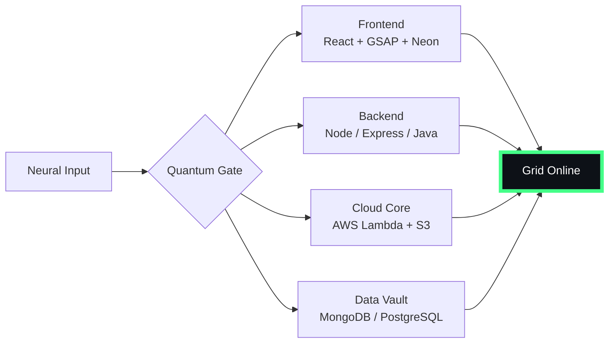

# 🌌 [ NEURAL CORE ACCESS: PENDEMVAMSI ]

<p align="center">
  
</p>

<div align="center">
  
  <br><small>Active Protocol: <strong style="color:#44FF88">PREDATOR CLOAK</strong> 👽🌫️</small>
</div>

## 🔵 NEURAL STATUS READOUT
```text
SUBJECT ID    →  PENDEMVAMSI
ENTITY CLASS  →  SHADOW MONARCH v9
NEURAL RANK   →  B-TIER
GRID SYNC     →  4338/15058 QUANTUM PACKETS
─────── BIO-METRICS (PREDATOR CLOAK) ───────
STRENGTH      149  ███████████████████░░
AGILITY       128  █████████████████░░░░
INTELLIGENCE  155  ████████████████████░
VITALITY      116  ███████████████░░░░░░
```

> **NEURAL BURST ACQUIRED:** +163 QUANTUM PACKETS 
> **SYSTEM MESSAGE:** HOLOGRAPHIC MASK ENGAGED — IDENTITY ERASED

---

## 🌀 GRID ARCHITECTURE (HOLOGRAPHIC RENDER)



---

## 📡 ACADEMIC NODES – CONQUERED
- [x] B.Tech Neural Engineering (2020–2024) – St. Ann’s Grid
- [x] Intermediate Quantum Core (2018–2020) – Sri Medhavi
- [x] SSC Primary Link (2017–2018) – Sri Geethanjali

---

## ⚡ SKILL NEURAL MATRIX

<details open>
<summary>🔌 ACTIVE NEURAL LINKS</summary>

| Node               | Tier | Integrity Bar                | Status      |
|--------------------|------|------------------------------|-------------|
| Java Core          | S    | ████████████████████ 100%   | OVERCLOCKED |
| Node.js Grid       | S    | ████████████████████ 100%   | OVERCLOCKED |
| React Holo-UI      | A+   | █████████████████░░░ 92%    | ONLINE      |
| AWS Quantum Relay  | S    | ████████████████████ 100%   | SOVEREIGN   |
| Python AI Kernel   | A    | ████████████████░░░░ 85%    | CHARGING    |
| DSA Void Algorithm | A    | █████████████████░░░ 90%    | ACTIVE      |

</details>

---

## 🏅 NEURAL ACHIEVEMENT TOKENS

<p align="center">
  
  
  
  
</p>

---

## 👾 SHADOW ENTITIES – SUMMONED

<p align="center">
  
  <br><strong style="color:#44FF88">ARISE.</strong>
</p>

| Entity | Designation   | Class            | Source Node                     |
|--------|---------------|------------------|---------------------------------|
| SH-01  | Igris         | Void Commander   | AI Financial Oracle             |
| SH-02  | Beru          | Swarm Overlord   | WebRTC Quantum Stream           |
| SH-03  | Kaisel        | Void Wyrm        | Geolocation Shadow Relay        |
| SH-04  | Tusk          | Arcane Construct | Global Pandemic Sentinel        |
| SH-05  | Iron          | Armored Bastion  | React Crypto Fortress           |

---

## 📡 GRID ANALYTICS (LIVE FEED)

<p align="center">
  
  <br>
  
  
</p>

---

## 🖥️ CORRUPTED MAINFRAME LOG (401 ENTRIES)

<details>
<summary>OPEN TERMINAL FEED – PROTOCOL: PREDATOR CLOAK</summary>

> [0x4550B0F0] 👽🌫️ **PREDATOR CLOAK PROTOCOL** #0 | NEURAL LINK STABILIZED | [TRANSMISSION SUCCESS]
> [0x4C72973F] 👽🌫️ **PREDATOR CLOAK PROTOCOL** #1 | NEURAL LINK  [GLITCH DETECTED] STABILIZED | [TRANSMISSION SUCCESS]
> [0xAF060A0D] 👽🌫️ **PREDATOR CLOAK PROTOCOL** #2 | NEURAL LINK STABILIZED | [TRANSMISSION SUCCESS]
> [0x360DDE4E] 👽🌫️ **PREDATOR CLOAK PROTOCOL** #3 | NEURAL LINK STABILIZED | [TRANSMISSION SUCCESS]
> [0xDB6C5B15] 👽🌫️ **PREDATOR CLOAK PROTOCOL** #4 | NEURAL LINK STABILIZED | [TRANSMISSION SUCCESS]
> [0x33586BA2] 👽🌫️ **PREDATOR CLOAK PROTOCOL** #5 | NEURAL LINK  [GLITCH DETECTED] STABILIZED | [TRANSMISSION SUCCESS]
> [0x040F69BC] 👽🌫️ **PREDATOR CLOAK PROTOCOL** #6 | NEURAL LINK STABILIZED | [TRANSMISSION SUCCESS]
> [0x26CC70E9] 👽🌫️ **PREDATOR CLOAK PROTOCOL** #7 | NEURAL LINK STABILIZED | [TRANSMISSION SUCCESS]
> [0x6E83E71C] 👽🌫️ **PREDATOR CLOAK PROTOCOL** #8 | NEURAL LINK STABILIZED | [TRANSMISSION SUCCESS]
> [0xA1F949A2] 👽🌫️ **PREDATOR CLOAK PROTOCOL** #9 | NEURAL LINK STABILIZED | [TRANSMISSION SUCCESS]
> [0x0AFBDC19] 👽🌫️ **PREDATOR CLOAK PROTOCOL** #10 | NEURAL LINK STABILIZED | [TRANSMISSION SUCCESS]
> [0x04AF3533] 👽🌫️ **PREDATOR CLOAK PROTOCOL** #11 | NEURAL LINK STABILIZED | [TRANSMISSION SUCCESS]
> [0xB17EDC6B] 👽🌫️ **PREDATOR CLOAK PROTOCOL** #12 | NEURAL LINK STABILIZED | [TRANSMISSION SUCCESS]
> [0x76BBBDA5] 👽🌫️ **PREDATOR CLOAK PROTOCOL** #13 | NEURAL LINK STABILIZED | [TRANSMISSION SUCCESS]
> [0x5162A319] 👽🌫️ **PREDATOR CLOAK PROTOCOL** #14 | NEURAL LINK STABILIZED | [TRANSMISSION SUCCESS]
> [0xCC849799] 👽🌫️ **PREDATOR CLOAK PROTOCOL** #15 | NEURAL LINK STABILIZED | [TRANSMISSION SUCCESS]
> [0x3B8EC4FD] 👽🌫️ **PREDATOR CLOAK PROTOCOL** #16 | NEURAL LINK STABILIZED | [TRANSMISSION SUCCESS]
> [0xB370EF4A] 👽🌫️ **PREDATOR CLOAK PROTOCOL** #17 | NEURAL LINK STABILIZED | [TRANSMISSION SUCCESS]
> [0xB9E8FE7D] 👽🌫️ **PREDATOR CLOAK PROTOCOL** #18 | NEURAL LINK STABILIZED | [TRANSMISSION SUCCESS]
> [0xB5792F20] 👽🌫️ **PREDATOR CLOAK PROTOCOL** #19 | NEURAL LINK STABILIZED | [TRANSMISSION SUCCESS]
> [0x288FDD26] 👽🌫️ **PREDATOR CLOAK PROTOCOL** #20 | NEURAL LINK STABILIZED | [TRANSMISSION SUCCESS]
> [0x66B6B274] 👽🌫️ **PREDATOR CLOAK PROTOCOL** #21 | NEURAL LINK STABILIZED | [TRANSMISSION SUCCESS]
> [0x67CC0335] 👽🌫️ **PREDATOR CLOAK PROTOCOL** #22 | NEURAL LINK STABILIZED | [TRANSMISSION SUCCESS]
> [0x4FE3F469] 👽🌫️ **PREDATOR CLOAK PROTOCOL** #23 | NEURAL LINK STABILIZED | [TRANSMISSION SUCCESS]
> [0xA533FEC3] 👽🌫️ **PREDATOR CLOAK PROTOCOL** #24 | NEURAL LINK STABILIZED | [TRANSMISSION SUCCESS]
> [0xA782FF20] 👽🌫️ **PREDATOR CLOAK PROTOCOL** #25 | NEURAL LINK STABILIZED | [TRANSMISSION SUCCESS]
> [0xB86AB12D] 👽🌫️ **PREDATOR CLOAK PROTOCOL** #26 | NEURAL LINK STABILIZED | [TRANSMISSION SUCCESS]
> [0x05B6A7CF] 👽🌫️ **PREDATOR CLOAK PROTOCOL** #27 | NEURAL LINK STABILIZED | [TRANSMISSION SUCCESS]
> [0xCBD8DF1B] 👽🌫️ **PREDATOR CLOAK PROTOCOL** #28 | NEURAL LINK STABILIZED | [TRANSMISSION SUCCESS]
> [0x2CF7AE68] 👽🌫️ **PREDATOR CLOAK PROTOCOL** #29 | NEURAL LINK STABILIZED | [TRANSMISSION SUCCESS]
> [0x5DB811B1] 👽🌫️ **PREDATOR CLOAK PROTOCOL** #30 | NEURAL LINK STABILIZED | [TRANSMISSION SUCCESS]
> [0x0E778D93] 👽🌫️ **PREDATOR CLOAK PROTOCOL** #31 | NEURAL LINK  [GLITCH DETECTED] STABILIZED | [TRANSMISSION SUCCESS]
> [0xBA9BA29F] 👽🌫️ **PREDATOR CLOAK PROTOCOL** #32 | NEURAL LINK  [GLITCH DETECTED] STABILIZED | [TRANSMISSION SUCCESS]
> [0xE1F8976F] 👽🌫️ **PREDATOR CLOAK PROTOCOL** #33 | NEURAL LINK STABILIZED | [TRANSMISSION SUCCESS]
> [0x71E8634A] 👽🌫️ **PREDATOR CLOAK PROTOCOL** #34 | NEURAL LINK STABILIZED | [TRANSMISSION SUCCESS]
> [0xF9229804] 👽🌫️ **PREDATOR CLOAK PROTOCOL** #35 | NEURAL LINK STABILIZED | [TRANSMISSION SUCCESS]
> [0x80E9D2BF] 👽🌫️ **PREDATOR CLOAK PROTOCOL** #36 | NEURAL LINK STABILIZED | [TRANSMISSION SUCCESS]
> [0x52A306AE] 👽🌫️ **PREDATOR CLOAK PROTOCOL** #37 | NEURAL LINK  [GLITCH DETECTED] STABILIZED | [TRANSMISSION SUCCESS]
> [0xAA0AA447] 👽🌫️ **PREDATOR CLOAK PROTOCOL** #38 | NEURAL LINK STABILIZED | [TRANSMISSION SUCCESS]
> [0xDCDF9D9A] 👽🌫️ **PREDATOR CLOAK PROTOCOL** #39 | NEURAL LINK  [GLITCH DETECTED] STABILIZED | [TRANSMISSION SUCCESS]
> [0xA07C431E] 👽🌫️ **PREDATOR CLOAK PROTOCOL** #40 | NEURAL LINK STABILIZED | [TRANSMISSION SUCCESS]
> [0xC018BB51] 👽🌫️ **PREDATOR CLOAK PROTOCOL** #41 | NEURAL LINK STABILIZED | [TRANSMISSION SUCCESS]
> [0xF6777BF7] 👽🌫️ **PREDATOR CLOAK PROTOCOL** #42 | NEURAL LINK STABILIZED | [TRANSMISSION SUCCESS]
> [0x8089F7EA] 👽🌫️ **PREDATOR CLOAK PROTOCOL** #43 | NEURAL LINK STABILIZED | [TRANSMISSION SUCCESS]
> [0x3395CD71] 👽🌫️ **PREDATOR CLOAK PROTOCOL** #44 | NEURAL LINK STABILIZED | [TRANSMISSION SUCCESS]
> [0xAEEED24E] 👽🌫️ **PREDATOR CLOAK PROTOCOL** #45 | NEURAL LINK STABILIZED | [TRANSMISSION SUCCESS]
> [0x8DE1E1C6] 👽🌫️ **PREDATOR CLOAK PROTOCOL** #46 | NEURAL LINK  [GLITCH DETECTED] STABILIZED | [TRANSMISSION SUCCESS]
> [0x5D58D452] 👽🌫️ **PREDATOR CLOAK PROTOCOL** #47 | NEURAL LINK STABILIZED | [TRANSMISSION SUCCESS]
> [0xBD31B2FD] 👽🌫️ **PREDATOR CLOAK PROTOCOL** #48 | NEURAL LINK  [GLITCH DETECTED] STABILIZED | [TRANSMISSION SUCCESS]
> [0x9272ADE8] 👽🌫️ **PREDATOR CLOAK PROTOCOL** #49 | NEURAL LINK  [GLITCH DETECTED] STABILIZED | [TRANSMISSION SUCCESS]
> [0x800887C1] 👽🌫️ **PREDATOR CLOAK PROTOCOL** #50 | NEURAL LINK STABILIZED | [TRANSMISSION SUCCESS]
> [0xCAA7FC10] 👽🌫️ **PREDATOR CLOAK PROTOCOL** #51 | NEURAL LINK STABILIZED | [TRANSMISSION SUCCESS]
> [0x90F96663] 👽🌫️ **PREDATOR CLOAK PROTOCOL** #52 | NEURAL LINK STABILIZED | [TRANSMISSION SUCCESS]
> [0x27FAD757] 👽🌫️ **PREDATOR CLOAK PROTOCOL** #53 | NEURAL LINK STABILIZED | [TRANSMISSION SUCCESS]
> [0xE7059ED1] 👽🌫️ **PREDATOR CLOAK PROTOCOL** #54 | NEURAL LINK STABILIZED | [TRANSMISSION SUCCESS]
> [0x19D25721] 👽🌫️ **PREDATOR CLOAK PROTOCOL** #55 | NEURAL LINK STABILIZED | [TRANSMISSION SUCCESS]
> [0x02B8CF50] 👽🌫️ **PREDATOR CLOAK PROTOCOL** #56 | NEURAL LINK STABILIZED | [TRANSMISSION SUCCESS]
> [0x47265109] 👽🌫️ **PREDATOR CLOAK PROTOCOL** #57 | NEURAL LINK STABILIZED | [TRANSMISSION SUCCESS]
> [0x3F3BDA5C] 👽🌫️ **PREDATOR CLOAK PROTOCOL** #58 | NEURAL LINK  [GLITCH DETECTED] STABILIZED | [TRANSMISSION SUCCESS]
> [0xF877867A] 👽🌫️ **PREDATOR CLOAK PROTOCOL** #59 | NEURAL LINK STABILIZED | [TRANSMISSION SUCCESS]
> [0xD0FAD8D5] 👽🌫️ **PREDATOR CLOAK PROTOCOL** #60 | NEURAL LINK STABILIZED | [TRANSMISSION SUCCESS]
> [0x53C7986E] 👽🌫️ **PREDATOR CLOAK PROTOCOL** #61 | NEURAL LINK  [GLITCH DETECTED] STABILIZED | [TRANSMISSION SUCCESS]
> [0x3D967304] 👽🌫️ **PREDATOR CLOAK PROTOCOL** #62 | NEURAL LINK STABILIZED | [TRANSMISSION SUCCESS]
> [0xACAF368E] 👽🌫️ **PREDATOR CLOAK PROTOCOL** #63 | NEURAL LINK STABILIZED | [TRANSMISSION SUCCESS]
> [0x5EBA5698] 👽🌫️ **PREDATOR CLOAK PROTOCOL** #64 | NEURAL LINK  [GLITCH DETECTED] STABILIZED | [TRANSMISSION SUCCESS]
> [0xE773E699] 👽🌫️ **PREDATOR CLOAK PROTOCOL** #65 | NEURAL LINK STABILIZED | [TRANSMISSION SUCCESS]
> [0x4FAEF0C7] 👽🌫️ **PREDATOR CLOAK PROTOCOL** #66 | NEURAL LINK STABILIZED | [TRANSMISSION SUCCESS]
> [0x5FBF78A5] 👽🌫️ **PREDATOR CLOAK PROTOCOL** #67 | NEURAL LINK STABILIZED | [TRANSMISSION SUCCESS]
> [0xE9EC19B9] 👽🌫️ **PREDATOR CLOAK PROTOCOL** #68 | NEURAL LINK STABILIZED | [TRANSMISSION SUCCESS]
> [0xD5C97DC9] 👽🌫️ **PREDATOR CLOAK PROTOCOL** #69 | NEURAL LINK STABILIZED | [TRANSMISSION SUCCESS]
> [0x19A4C8EB] 👽🌫️ **PREDATOR CLOAK PROTOCOL** #70 | NEURAL LINK STABILIZED | [TRANSMISSION SUCCESS]
> [0x9B4B7E77] 👽🌫️ **PREDATOR CLOAK PROTOCOL** #71 | NEURAL LINK STABILIZED | [TRANSMISSION SUCCESS]
> [0xCCDE5809] 👽🌫️ **PREDATOR CLOAK PROTOCOL** #72 | NEURAL LINK STABILIZED | [TRANSMISSION SUCCESS]
> [0xC2B1552E] 👽🌫️ **PREDATOR CLOAK PROTOCOL** #73 | NEURAL LINK STABILIZED | [TRANSMISSION SUCCESS]
> [0x0502475F] 👽🌫️ **PREDATOR CLOAK PROTOCOL** #74 | NEURAL LINK  [GLITCH DETECTED] STABILIZED | [TRANSMISSION SUCCESS]
> [0x61DB693E] 👽🌫️ **PREDATOR CLOAK PROTOCOL** #75 | NEURAL LINK  [GLITCH DETECTED] STABILIZED | [TRANSMISSION SUCCESS]
> [0x347DF351] 👽🌫️ **PREDATOR CLOAK PROTOCOL** #76 | NEURAL LINK STABILIZED | [TRANSMISSION SUCCESS]
> [0x8CC88D33] 👽🌫️ **PREDATOR CLOAK PROTOCOL** #77 | NEURAL LINK  [GLITCH DETECTED] STABILIZED | [TRANSMISSION SUCCESS]
> [0x1B87C4F1] 👽🌫️ **PREDATOR CLOAK PROTOCOL** #78 | NEURAL LINK STABILIZED | [TRANSMISSION SUCCESS]
> [0xA78929EF] 👽🌫️ **PREDATOR CLOAK PROTOCOL** #79 | NEURAL LINK STABILIZED | [TRANSMISSION SUCCESS]
> [0xCF90C14B] 👽🌫️ **PREDATOR CLOAK PROTOCOL** #80 | NEURAL LINK STABILIZED | [TRANSMISSION SUCCESS]
> [0x99B4DDE5] 👽🌫️ **PREDATOR CLOAK PROTOCOL** #81 | NEURAL LINK STABILIZED | [TRANSMISSION SUCCESS]
> [0x38CD57A1] 👽🌫️ **PREDATOR CLOAK PROTOCOL** #82 | NEURAL LINK STABILIZED | [TRANSMISSION SUCCESS]
> [0x289CDF83] 👽🌫️ **PREDATOR CLOAK PROTOCOL** #83 | NEURAL LINK STABILIZED | [TRANSMISSION SUCCESS]
> [0x81BBFB67] 👽🌫️ **PREDATOR CLOAK PROTOCOL** #84 | NEURAL LINK STABILIZED | [TRANSMISSION SUCCESS]
> [0xF39CDD89] 👽🌫️ **PREDATOR CLOAK PROTOCOL** #85 | NEURAL LINK STABILIZED | [TRANSMISSION SUCCESS]
> [0x5E8A9E00] 👽🌫️ **PREDATOR CLOAK PROTOCOL** #86 | NEURAL LINK STABILIZED | [TRANSMISSION SUCCESS]
> [0x668C464F] 👽🌫️ **PREDATOR CLOAK PROTOCOL** #87 | NEURAL LINK  [GLITCH DETECTED] STABILIZED | [TRANSMISSION SUCCESS]
> [0xFC5E16C3] 👽🌫️ **PREDATOR CLOAK PROTOCOL** #88 | NEURAL LINK  [GLITCH DETECTED] STABILIZED | [TRANSMISSION SUCCESS]
> [0x2C94B877] 👽🌫️ **PREDATOR CLOAK PROTOCOL** #89 | NEURAL LINK STABILIZED | [TRANSMISSION SUCCESS]
> [0xEAC01C82] 👽🌫️ **PREDATOR CLOAK PROTOCOL** #90 | NEURAL LINK STABILIZED | [TRANSMISSION SUCCESS]
> [0xFDD26D12] 👽🌫️ **PREDATOR CLOAK PROTOCOL** #91 | NEURAL LINK  [GLITCH DETECTED] STABILIZED | [TRANSMISSION SUCCESS]
> [0x4D7EF49C] 👽🌫️ **PREDATOR CLOAK PROTOCOL** #92 | NEURAL LINK STABILIZED | [TRANSMISSION SUCCESS]
> [0x9AF69577] 👽🌫️ **PREDATOR CLOAK PROTOCOL** #93 | NEURAL LINK STABILIZED | [TRANSMISSION SUCCESS]
> [0xE194CCBB] 👽🌫️ **PREDATOR CLOAK PROTOCOL** #94 | NEURAL LINK STABILIZED | [TRANSMISSION SUCCESS]
> [0x89984210] 👽🌫️ **PREDATOR CLOAK PROTOCOL** #95 | NEURAL LINK STABILIZED | [TRANSMISSION SUCCESS]
> [0xDA576CC9] 👽🌫️ **PREDATOR CLOAK PROTOCOL** #96 | NEURAL LINK STABILIZED | [TRANSMISSION SUCCESS]
> [0x96A7CE3A] 👽🌫️ **PREDATOR CLOAK PROTOCOL** #97 | NEURAL LINK STABILIZED | [TRANSMISSION SUCCESS]
> [0xF2427E3B] 👽🌫️ **PREDATOR CLOAK PROTOCOL** #98 | NEURAL LINK STABILIZED | [TRANSMISSION SUCCESS]
> [0xC3479D05] 👽🌫️ **PREDATOR CLOAK PROTOCOL** #99 | NEURAL LINK STABILIZED | [TRANSMISSION SUCCESS]
> [0x288DB313] 👽🌫️ **PREDATOR CLOAK PROTOCOL** #100 | NEURAL LINK STABILIZED | [TRANSMISSION SUCCESS]
> [0x6BA5828F] 👽🌫️ **PREDATOR CLOAK PROTOCOL** #101 | NEURAL LINK  [GLITCH DETECTED] STABILIZED | [TRANSMISSION SUCCESS]
> [0x41F8B99C] 👽🌫️ **PREDATOR CLOAK PROTOCOL** #102 | NEURAL LINK STABILIZED | [TRANSMISSION SUCCESS]
> [0x7D0BF043] 👽🌫️ **PREDATOR CLOAK PROTOCOL** #103 | NEURAL LINK STABILIZED | [TRANSMISSION SUCCESS]
> [0x7CFD9126] 👽🌫️ **PREDATOR CLOAK PROTOCOL** #104 | NEURAL LINK  [GLITCH DETECTED] STABILIZED | [TRANSMISSION SUCCESS]
> [0x7143E9C4] 👽🌫️ **PREDATOR CLOAK PROTOCOL** #105 | NEURAL LINK STABILIZED | [TRANSMISSION SUCCESS]
> [0xFBF27F47] 👽🌫️ **PREDATOR CLOAK PROTOCOL** #106 | NEURAL LINK  [GLITCH DETECTED] STABILIZED | [TRANSMISSION SUCCESS]
> [0xF7CB97D3] 👽🌫️ **PREDATOR CLOAK PROTOCOL** #107 | NEURAL LINK STABILIZED | [TRANSMISSION SUCCESS]
> [0x74D37DD7] 👽🌫️ **PREDATOR CLOAK PROTOCOL** #108 | NEURAL LINK STABILIZED | [TRANSMISSION SUCCESS]
> [0x3B98281D] 👽🌫️ **PREDATOR CLOAK PROTOCOL** #109 | NEURAL LINK  [GLITCH DETECTED] STABILIZED | [TRANSMISSION SUCCESS]
> [0x1B8069A4] 👽🌫️ **PREDATOR CLOAK PROTOCOL** #110 | NEURAL LINK STABILIZED | [TRANSMISSION SUCCESS]
> [0xB266764F] 👽🌫️ **PREDATOR CLOAK PROTOCOL** #111 | NEURAL LINK STABILIZED | [TRANSMISSION SUCCESS]
> [0x4F8265C3] 👽🌫️ **PREDATOR CLOAK PROTOCOL** #112 | NEURAL LINK STABILIZED | [TRANSMISSION SUCCESS]
> [0x0E1F8FD0] 👽🌫️ **PREDATOR CLOAK PROTOCOL** #113 | NEURAL LINK STABILIZED | [TRANSMISSION SUCCESS]
> [0x69E427E7] 👽🌫️ **PREDATOR CLOAK PROTOCOL** #114 | NEURAL LINK  [GLITCH DETECTED] STABILIZED | [TRANSMISSION SUCCESS]
> [0x53749DB5] 👽🌫️ **PREDATOR CLOAK PROTOCOL** #115 | NEURAL LINK STABILIZED | [TRANSMISSION SUCCESS]
> [0xEE84AEEC] 👽🌫️ **PREDATOR CLOAK PROTOCOL** #116 | NEURAL LINK  [GLITCH DETECTED] STABILIZED | [TRANSMISSION SUCCESS]
> [0xA2DF0376] 👽🌫️ **PREDATOR CLOAK PROTOCOL** #117 | NEURAL LINK STABILIZED | [TRANSMISSION SUCCESS]
> [0x6A32A5AE] 👽🌫️ **PREDATOR CLOAK PROTOCOL** #118 | NEURAL LINK STABILIZED | [TRANSMISSION SUCCESS]
> [0x94C25D71] 👽🌫️ **PREDATOR CLOAK PROTOCOL** #119 | NEURAL LINK STABILIZED | [TRANSMISSION SUCCESS]
> [0xC6AB6237] 👽🌫️ **PREDATOR CLOAK PROTOCOL** #120 | NEURAL LINK STABILIZED | [TRANSMISSION SUCCESS]
> [0xC3BE08C9] 👽🌫️ **PREDATOR CLOAK PROTOCOL** #121 | NEURAL LINK STABILIZED | [TRANSMISSION SUCCESS]
> [0x40103FBC] 👽🌫️ **PREDATOR CLOAK PROTOCOL** #122 | NEURAL LINK STABILIZED | [TRANSMISSION SUCCESS]
> [0xC9D8D21A] 👽🌫️ **PREDATOR CLOAK PROTOCOL** #123 | NEURAL LINK  [GLITCH DETECTED] STABILIZED | [TRANSMISSION SUCCESS]
> [0x51547EC7] 👽🌫️ **PREDATOR CLOAK PROTOCOL** #124 | NEURAL LINK STABILIZED | [TRANSMISSION SUCCESS]
> [0x1AD70481] 👽🌫️ **PREDATOR CLOAK PROTOCOL** #125 | NEURAL LINK STABILIZED | [TRANSMISSION SUCCESS]
> [0x96751A3C] 👽🌫️ **PREDATOR CLOAK PROTOCOL** #126 | NEURAL LINK STABILIZED | [TRANSMISSION SUCCESS]
> [0x02E7CE4C] 👽🌫️ **PREDATOR CLOAK PROTOCOL** #127 | NEURAL LINK STABILIZED | [TRANSMISSION SUCCESS]
> [0x003FE4FF] 👽🌫️ **PREDATOR CLOAK PROTOCOL** #128 | NEURAL LINK STABILIZED | [TRANSMISSION SUCCESS]
> [0x43AB7689] 👽🌫️ **PREDATOR CLOAK PROTOCOL** #129 | NEURAL LINK STABILIZED | [TRANSMISSION SUCCESS]
> [0x0EF506AB] 👽🌫️ **PREDATOR CLOAK PROTOCOL** #130 | NEURAL LINK  [GLITCH DETECTED] STABILIZED | [TRANSMISSION SUCCESS]
> [0x3BC6E1BF] 👽🌫️ **PREDATOR CLOAK PROTOCOL** #131 | NEURAL LINK STABILIZED | [TRANSMISSION SUCCESS]
> [0xE0FFDC24] 👽🌫️ **PREDATOR CLOAK PROTOCOL** #132 | NEURAL LINK STABILIZED | [TRANSMISSION SUCCESS]
> [0xA37B27D1] 👽🌫️ **PREDATOR CLOAK PROTOCOL** #133 | NEURAL LINK STABILIZED | [TRANSMISSION SUCCESS]
> [0xD54CD484] 👽🌫️ **PREDATOR CLOAK PROTOCOL** #134 | NEURAL LINK STABILIZED | [TRANSMISSION SUCCESS]
> [0xEF8BB9DE] 👽🌫️ **PREDATOR CLOAK PROTOCOL** #135 | NEURAL LINK STABILIZED | [TRANSMISSION SUCCESS]
> [0xF4954859] 👽🌫️ **PREDATOR CLOAK PROTOCOL** #136 | NEURAL LINK STABILIZED | [TRANSMISSION SUCCESS]
> [0x634B67E8] 👽🌫️ **PREDATOR CLOAK PROTOCOL** #137 | NEURAL LINK  [GLITCH DETECTED] STABILIZED | [TRANSMISSION SUCCESS]
> [0xABC34824] 👽🌫️ **PREDATOR CLOAK PROTOCOL** #138 | NEURAL LINK STABILIZED | [TRANSMISSION SUCCESS]
> [0xA024AD0E] 👽🌫️ **PREDATOR CLOAK PROTOCOL** #139 | NEURAL LINK STABILIZED | [TRANSMISSION SUCCESS]
> [0xF9C6A70F] 👽🌫️ **PREDATOR CLOAK PROTOCOL** #140 | NEURAL LINK STABILIZED | [TRANSMISSION SUCCESS]
> [0x202DD99E] 👽🌫️ **PREDATOR CLOAK PROTOCOL** #141 | NEURAL LINK STABILIZED | [TRANSMISSION SUCCESS]
> [0x33F23202] 👽🌫️ **PREDATOR CLOAK PROTOCOL** #142 | NEURAL LINK STABILIZED | [TRANSMISSION SUCCESS]
> [0x8E338767] 👽🌫️ **PREDATOR CLOAK PROTOCOL** #143 | NEURAL LINK STABILIZED | [TRANSMISSION SUCCESS]
> [0xFD015603] 👽🌫️ **PREDATOR CLOAK PROTOCOL** #144 | NEURAL LINK STABILIZED | [TRANSMISSION SUCCESS]
> [0xA2EC85A8] 👽🌫️ **PREDATOR CLOAK PROTOCOL** #145 | NEURAL LINK STABILIZED | [TRANSMISSION SUCCESS]
> [0x8C3F3D4A] 👽🌫️ **PREDATOR CLOAK PROTOCOL** #146 | NEURAL LINK STABILIZED | [TRANSMISSION SUCCESS]
> [0x98686F45] 👽🌫️ **PREDATOR CLOAK PROTOCOL** #147 | NEURAL LINK STABILIZED | [TRANSMISSION SUCCESS]
> [0x726AB0D1] 👽🌫️ **PREDATOR CLOAK PROTOCOL** #148 | NEURAL LINK STABILIZED | [TRANSMISSION SUCCESS]
> [0x57B340D3] 👽🌫️ **PREDATOR CLOAK PROTOCOL** #149 | NEURAL LINK STABILIZED | [TRANSMISSION SUCCESS]
> [0xBB08C50C] 👽🌫️ **PREDATOR CLOAK PROTOCOL** #150 | NEURAL LINK  [GLITCH DETECTED] STABILIZED | [TRANSMISSION SUCCESS]
> [0xFE8EE351] 👽🌫️ **PREDATOR CLOAK PROTOCOL** #151 | NEURAL LINK STABILIZED | [TRANSMISSION SUCCESS]
> [0x6F33C3F3] 👽🌫️ **PREDATOR CLOAK PROTOCOL** #152 | NEURAL LINK  [GLITCH DETECTED] STABILIZED | [TRANSMISSION SUCCESS]
> [0x8FC71274] 👽🌫️ **PREDATOR CLOAK PROTOCOL** #153 | NEURAL LINK STABILIZED | [TRANSMISSION SUCCESS]
> [0x9D93A656] 👽🌫️ **PREDATOR CLOAK PROTOCOL** #154 | NEURAL LINK STABILIZED | [TRANSMISSION SUCCESS]
> [0xD1EFFA7D] 👽🌫️ **PREDATOR CLOAK PROTOCOL** #155 | NEURAL LINK STABILIZED | [TRANSMISSION SUCCESS]
> [0xEB25E83E] 👽🌫️ **PREDATOR CLOAK PROTOCOL** #156 | NEURAL LINK STABILIZED | [TRANSMISSION SUCCESS]
> [0x59D897E7] 👽🌫️ **PREDATOR CLOAK PROTOCOL** #157 | NEURAL LINK STABILIZED | [TRANSMISSION SUCCESS]
> [0x3FE09C61] 👽🌫️ **PREDATOR CLOAK PROTOCOL** #158 | NEURAL LINK STABILIZED | [TRANSMISSION SUCCESS]
> [0xD71EFDD4] 👽🌫️ **PREDATOR CLOAK PROTOCOL** #159 | NEURAL LINK STABILIZED | [TRANSMISSION SUCCESS]
> [0x4A99E022] 👽🌫️ **PREDATOR CLOAK PROTOCOL** #160 | NEURAL LINK STABILIZED | [TRANSMISSION SUCCESS]
> [0x7BEF8945] 👽🌫️ **PREDATOR CLOAK PROTOCOL** #161 | NEURAL LINK STABILIZED | [TRANSMISSION SUCCESS]
> [0xA3F2AA38] 👽🌫️ **PREDATOR CLOAK PROTOCOL** #162 | NEURAL LINK STABILIZED | [TRANSMISSION SUCCESS]
> [0xC1675CBB] 👽🌫️ **PREDATOR CLOAK PROTOCOL** #163 | NEURAL LINK STABILIZED | [TRANSMISSION SUCCESS]
> [0x585E6383] 👽🌫️ **PREDATOR CLOAK PROTOCOL** #164 | NEURAL LINK STABILIZED | [TRANSMISSION SUCCESS]
> [0x67ABBB26] 👽🌫️ **PREDATOR CLOAK PROTOCOL** #165 | NEURAL LINK STABILIZED | [TRANSMISSION SUCCESS]
> [0x3F1CA464] 👽🌫️ **PREDATOR CLOAK PROTOCOL** #166 | NEURAL LINK STABILIZED | [TRANSMISSION SUCCESS]
> [0x51236951] 👽🌫️ **PREDATOR CLOAK PROTOCOL** #167 | NEURAL LINK STABILIZED | [TRANSMISSION SUCCESS]
> [0x2EB2D879] 👽🌫️ **PREDATOR CLOAK PROTOCOL** #168 | NEURAL LINK  [GLITCH DETECTED] STABILIZED | [TRANSMISSION SUCCESS]
> [0x39B2ED9D] 👽🌫️ **PREDATOR CLOAK PROTOCOL** #169 | NEURAL LINK STABILIZED | [TRANSMISSION SUCCESS]
> [0x1701FE29] 👽🌫️ **PREDATOR CLOAK PROTOCOL** #170 | NEURAL LINK STABILIZED | [TRANSMISSION SUCCESS]
> [0xF08E9CF0] 👽🌫️ **PREDATOR CLOAK PROTOCOL** #171 | NEURAL LINK STABILIZED | [TRANSMISSION SUCCESS]
> [0x559DCB59] 👽🌫️ **PREDATOR CLOAK PROTOCOL** #172 | NEURAL LINK  [GLITCH DETECTED] STABILIZED | [TRANSMISSION SUCCESS]
> [0x74EC63B6] 👽🌫️ **PREDATOR CLOAK PROTOCOL** #173 | NEURAL LINK STABILIZED | [TRANSMISSION SUCCESS]
> [0x9FC1814E] 👽🌫️ **PREDATOR CLOAK PROTOCOL** #174 | NEURAL LINK STABILIZED | [TRANSMISSION SUCCESS]
> [0x68FB46A4] 👽🌫️ **PREDATOR CLOAK PROTOCOL** #175 | NEURAL LINK STABILIZED | [TRANSMISSION SUCCESS]
> [0xBF8ECD4E] 👽🌫️ **PREDATOR CLOAK PROTOCOL** #176 | NEURAL LINK STABILIZED | [TRANSMISSION SUCCESS]
> [0xBDF0D2A5] 👽🌫️ **PREDATOR CLOAK PROTOCOL** #177 | NEURAL LINK STABILIZED | [TRANSMISSION SUCCESS]
> [0x1F6BA4D9] 👽🌫️ **PREDATOR CLOAK PROTOCOL** #178 | NEURAL LINK STABILIZED | [TRANSMISSION SUCCESS]
> [0x044985AC] 👽🌫️ **PREDATOR CLOAK PROTOCOL** #179 | NEURAL LINK STABILIZED | [TRANSMISSION SUCCESS]
> [0x2F3BA37C] 👽🌫️ **PREDATOR CLOAK PROTOCOL** #180 | NEURAL LINK STABILIZED | [TRANSMISSION SUCCESS]
> [0x709799E5] 👽🌫️ **PREDATOR CLOAK PROTOCOL** #181 | NEURAL LINK STABILIZED | [TRANSMISSION SUCCESS]
> [0x062AFFB5] 👽🌫️ **PREDATOR CLOAK PROTOCOL** #182 | NEURAL LINK  [GLITCH DETECTED] STABILIZED | [TRANSMISSION SUCCESS]
> [0xE559387C] 👽🌫️ **PREDATOR CLOAK PROTOCOL** #183 | NEURAL LINK STABILIZED | [TRANSMISSION SUCCESS]
> [0xAE4647BB] 👽🌫️ **PREDATOR CLOAK PROTOCOL** #184 | NEURAL LINK STABILIZED | [TRANSMISSION SUCCESS]
> [0x2E78F86B] 👽🌫️ **PREDATOR CLOAK PROTOCOL** #185 | NEURAL LINK  [GLITCH DETECTED] STABILIZED | [TRANSMISSION SUCCESS]
> [0xC7768C6C] 👽🌫️ **PREDATOR CLOAK PROTOCOL** #186 | NEURAL LINK STABILIZED | [TRANSMISSION SUCCESS]
> [0xD0DDA8B0] 👽🌫️ **PREDATOR CLOAK PROTOCOL** #187 | NEURAL LINK STABILIZED | [TRANSMISSION SUCCESS]
> [0xE8538EBF] 👽🌫️ **PREDATOR CLOAK PROTOCOL** #188 | NEURAL LINK STABILIZED | [TRANSMISSION SUCCESS]
> [0x94C735EB] 👽🌫️ **PREDATOR CLOAK PROTOCOL** #189 | NEURAL LINK STABILIZED | [TRANSMISSION SUCCESS]
> [0x6C322125] 👽🌫️ **PREDATOR CLOAK PROTOCOL** #190 | NEURAL LINK STABILIZED | [TRANSMISSION SUCCESS]
> [0xEDDC047B] 👽🌫️ **PREDATOR CLOAK PROTOCOL** #191 | NEURAL LINK  [GLITCH DETECTED] STABILIZED | [TRANSMISSION SUCCESS]
> [0xD90A21B2] 👽🌫️ **PREDATOR CLOAK PROTOCOL** #192 | NEURAL LINK STABILIZED | [TRANSMISSION SUCCESS]
> [0xCEDE675F] 👽🌫️ **PREDATOR CLOAK PROTOCOL** #193 | NEURAL LINK  [GLITCH DETECTED] STABILIZED | [TRANSMISSION SUCCESS]
> [0xCC1D37D8] 👽🌫️ **PREDATOR CLOAK PROTOCOL** #194 | NEURAL LINK STABILIZED | [TRANSMISSION SUCCESS]
> [0x871F527A] 👽🌫️ **PREDATOR CLOAK PROTOCOL** #195 | NEURAL LINK STABILIZED | [TRANSMISSION SUCCESS]
> [0x8910DE44] 👽🌫️ **PREDATOR CLOAK PROTOCOL** #196 | NEURAL LINK STABILIZED | [TRANSMISSION SUCCESS]
> [0x34301BAF] 👽🌫️ **PREDATOR CLOAK PROTOCOL** #197 | NEURAL LINK  [GLITCH DETECTED] STABILIZED | [TRANSMISSION SUCCESS]
> [0x6E945300] 👽🌫️ **PREDATOR CLOAK PROTOCOL** #198 | NEURAL LINK STABILIZED | [TRANSMISSION SUCCESS]
> [0x6B69A212] 👽🌫️ **PREDATOR CLOAK PROTOCOL** #199 | NEURAL LINK STABILIZED | [TRANSMISSION SUCCESS]
> [0x4C7740CB] 👽🌫️ **PREDATOR CLOAK PROTOCOL** #200 | NEURAL LINK STABILIZED | [TRANSMISSION SUCCESS]
> [0xAB356F83] 👽🌫️ **PREDATOR CLOAK PROTOCOL** #201 | NEURAL LINK STABILIZED | [TRANSMISSION SUCCESS]
> [0xF452940A] 👽🌫️ **PREDATOR CLOAK PROTOCOL** #202 | NEURAL LINK STABILIZED | [TRANSMISSION SUCCESS]
> [0xD14D2777] 👽🌫️ **PREDATOR CLOAK PROTOCOL** #203 | NEURAL LINK STABILIZED | [TRANSMISSION SUCCESS]
> [0xFEFE75C9] 👽🌫️ **PREDATOR CLOAK PROTOCOL** #204 | NEURAL LINK STABILIZED | [TRANSMISSION SUCCESS]
> [0xE2A5C4ED] 👽🌫️ **PREDATOR CLOAK PROTOCOL** #205 | NEURAL LINK STABILIZED | [TRANSMISSION SUCCESS]
> [0xC89683CD] 👽🌫️ **PREDATOR CLOAK PROTOCOL** #206 | NEURAL LINK STABILIZED | [TRANSMISSION SUCCESS]
> [0x62F07DB6] 👽🌫️ **PREDATOR CLOAK PROTOCOL** #207 | NEURAL LINK STABILIZED | [TRANSMISSION SUCCESS]
> [0x23344237] 👽🌫️ **PREDATOR CLOAK PROTOCOL** #208 | NEURAL LINK STABILIZED | [TRANSMISSION SUCCESS]
> [0x2E2CEC8F] 👽🌫️ **PREDATOR CLOAK PROTOCOL** #209 | NEURAL LINK STABILIZED | [TRANSMISSION SUCCESS]
> [0x306A3597] 👽🌫️ **PREDATOR CLOAK PROTOCOL** #210 | NEURAL LINK STABILIZED | [TRANSMISSION SUCCESS]
> [0x02F24242] 👽🌫️ **PREDATOR CLOAK PROTOCOL** #211 | NEURAL LINK STABILIZED | [TRANSMISSION SUCCESS]
> [0xC51EFC22] 👽🌫️ **PREDATOR CLOAK PROTOCOL** #212 | NEURAL LINK STABILIZED | [TRANSMISSION SUCCESS]
> [0xEFD777CA] 👽🌫️ **PREDATOR CLOAK PROTOCOL** #213 | NEURAL LINK STABILIZED | [TRANSMISSION SUCCESS]
> [0x0E0F6F61] 👽🌫️ **PREDATOR CLOAK PROTOCOL** #214 | NEURAL LINK STABILIZED | [TRANSMISSION SUCCESS]
> [0x963757E2] 👽🌫️ **PREDATOR CLOAK PROTOCOL** #215 | NEURAL LINK STABILIZED | [TRANSMISSION SUCCESS]
> [0x6D830AFB] 👽🌫️ **PREDATOR CLOAK PROTOCOL** #216 | NEURAL LINK STABILIZED | [TRANSMISSION SUCCESS]
> [0x7763BB3B] 👽🌫️ **PREDATOR CLOAK PROTOCOL** #217 | NEURAL LINK STABILIZED | [TRANSMISSION SUCCESS]
> [0x74454644] 👽🌫️ **PREDATOR CLOAK PROTOCOL** #218 | NEURAL LINK STABILIZED | [TRANSMISSION SUCCESS]
> [0x45805173] 👽🌫️ **PREDATOR CLOAK PROTOCOL** #219 | NEURAL LINK STABILIZED | [TRANSMISSION SUCCESS]
> [0x3872580C] 👽🌫️ **PREDATOR CLOAK PROTOCOL** #220 | NEURAL LINK STABILIZED | [TRANSMISSION SUCCESS]
> [0x936A8984] 👽🌫️ **PREDATOR CLOAK PROTOCOL** #221 | NEURAL LINK STABILIZED | [TRANSMISSION SUCCESS]
> [0xC3D7EC64] 👽🌫️ **PREDATOR CLOAK PROTOCOL** #222 | NEURAL LINK  [GLITCH DETECTED] STABILIZED | [TRANSMISSION SUCCESS]
> [0xA601D8F0] 👽🌫️ **PREDATOR CLOAK PROTOCOL** #223 | NEURAL LINK STABILIZED | [TRANSMISSION SUCCESS]
> [0x8F3E23C2] 👽🌫️ **PREDATOR CLOAK PROTOCOL** #224 | NEURAL LINK STABILIZED | [TRANSMISSION SUCCESS]
> [0x42CCD6E2] 👽🌫️ **PREDATOR CLOAK PROTOCOL** #225 | NEURAL LINK STABILIZED | [TRANSMISSION SUCCESS]
> [0x5E16C0F1] 👽🌫️ **PREDATOR CLOAK PROTOCOL** #226 | NEURAL LINK STABILIZED | [TRANSMISSION SUCCESS]
> [0x5A0D4750] 👽🌫️ **PREDATOR CLOAK PROTOCOL** #227 | NEURAL LINK STABILIZED | [TRANSMISSION SUCCESS]
> [0x1C803AEC] 👽🌫️ **PREDATOR CLOAK PROTOCOL** #228 | NEURAL LINK STABILIZED | [TRANSMISSION SUCCESS]
> [0xBCB736DC] 👽🌫️ **PREDATOR CLOAK PROTOCOL** #229 | NEURAL LINK STABILIZED | [TRANSMISSION SUCCESS]
> [0x2CC3B3A6] 👽🌫️ **PREDATOR CLOAK PROTOCOL** #230 | NEURAL LINK STABILIZED | [TRANSMISSION SUCCESS]
> [0xBAD51627] 👽🌫️ **PREDATOR CLOAK PROTOCOL** #231 | NEURAL LINK STABILIZED | [TRANSMISSION SUCCESS]
> [0x3396CC28] 👽🌫️ **PREDATOR CLOAK PROTOCOL** #232 | NEURAL LINK STABILIZED | [TRANSMISSION SUCCESS]
> [0xC036E8D7] 👽🌫️ **PREDATOR CLOAK PROTOCOL** #233 | NEURAL LINK STABILIZED | [TRANSMISSION SUCCESS]
> [0x93CDE859] 👽🌫️ **PREDATOR CLOAK PROTOCOL** #234 | NEURAL LINK STABILIZED | [TRANSMISSION SUCCESS]
> [0xFC376C38] 👽🌫️ **PREDATOR CLOAK PROTOCOL** #235 | NEURAL LINK STABILIZED | [TRANSMISSION SUCCESS]
> [0x82C68E04] 👽🌫️ **PREDATOR CLOAK PROTOCOL** #236 | NEURAL LINK STABILIZED | [TRANSMISSION SUCCESS]
> [0x53347EF1] 👽🌫️ **PREDATOR CLOAK PROTOCOL** #237 | NEURAL LINK STABILIZED | [TRANSMISSION SUCCESS]
> [0x1F85DB04] 👽🌫️ **PREDATOR CLOAK PROTOCOL** #238 | NEURAL LINK STABILIZED | [TRANSMISSION SUCCESS]
> [0x9B9B003B] 👽🌫️ **PREDATOR CLOAK PROTOCOL** #239 | NEURAL LINK STABILIZED | [TRANSMISSION SUCCESS]
> [0x7E5FA54D] 👽🌫️ **PREDATOR CLOAK PROTOCOL** #240 | NEURAL LINK STABILIZED | [TRANSMISSION SUCCESS]
> [0x95E5B141] 👽🌫️ **PREDATOR CLOAK PROTOCOL** #241 | NEURAL LINK  [GLITCH DETECTED] STABILIZED | [TRANSMISSION SUCCESS]
> [0xC6CDF366] 👽🌫️ **PREDATOR CLOAK PROTOCOL** #242 | NEURAL LINK STABILIZED | [TRANSMISSION SUCCESS]
> [0xD48ECCB6] 👽🌫️ **PREDATOR CLOAK PROTOCOL** #243 | NEURAL LINK  [GLITCH DETECTED] STABILIZED | [TRANSMISSION SUCCESS]
> [0xF7B0EDF2] 👽🌫️ **PREDATOR CLOAK PROTOCOL** #244 | NEURAL LINK STABILIZED | [TRANSMISSION SUCCESS]
> [0x643F0F5E] 👽🌫️ **PREDATOR CLOAK PROTOCOL** #245 | NEURAL LINK STABILIZED | [TRANSMISSION SUCCESS]
> [0xDD37310B] 👽🌫️ **PREDATOR CLOAK PROTOCOL** #246 | NEURAL LINK STABILIZED | [TRANSMISSION SUCCESS]
> [0xB45219B4] 👽🌫️ **PREDATOR CLOAK PROTOCOL** #247 | NEURAL LINK STABILIZED | [TRANSMISSION SUCCESS]
> [0xCADB6664] 👽🌫️ **PREDATOR CLOAK PROTOCOL** #248 | NEURAL LINK STABILIZED | [TRANSMISSION SUCCESS]
> [0x0A7DA36F] 👽🌫️ **PREDATOR CLOAK PROTOCOL** #249 | NEURAL LINK STABILIZED | [TRANSMISSION SUCCESS]
> [0xA806E5F0] 👽🌫️ **PREDATOR CLOAK PROTOCOL** #250 | NEURAL LINK STABILIZED | [TRANSMISSION SUCCESS]
> [0x1F7B87DF] 👽🌫️ **PREDATOR CLOAK PROTOCOL** #251 | NEURAL LINK STABILIZED | [TRANSMISSION SUCCESS]
> [0x7E4603CA] 👽🌫️ **PREDATOR CLOAK PROTOCOL** #252 | NEURAL LINK STABILIZED | [TRANSMISSION SUCCESS]
> [0xF28900FF] 👽🌫️ **PREDATOR CLOAK PROTOCOL** #253 | NEURAL LINK STABILIZED | [TRANSMISSION SUCCESS]
> [0x1C8E6494] 👽🌫️ **PREDATOR CLOAK PROTOCOL** #254 | NEURAL LINK STABILIZED | [TRANSMISSION SUCCESS]
> [0x4BE14E2E] 👽🌫️ **PREDATOR CLOAK PROTOCOL** #255 | NEURAL LINK STABILIZED | [TRANSMISSION SUCCESS]
> [0x96E3079F] 👽🌫️ **PREDATOR CLOAK PROTOCOL** #256 | NEURAL LINK STABILIZED | [TRANSMISSION SUCCESS]
> [0x233DE6E8] 👽🌫️ **PREDATOR CLOAK PROTOCOL** #257 | NEURAL LINK  [GLITCH DETECTED] STABILIZED | [TRANSMISSION SUCCESS]
> [0x43BBF724] 👽🌫️ **PREDATOR CLOAK PROTOCOL** #258 | NEURAL LINK STABILIZED | [TRANSMISSION SUCCESS]
> [0x8E88EB9D] 👽🌫️ **PREDATOR CLOAK PROTOCOL** #259 | NEURAL LINK STABILIZED | [TRANSMISSION SUCCESS]
> [0x873CDA7A] 👽🌫️ **PREDATOR CLOAK PROTOCOL** #260 | NEURAL LINK STABILIZED | [TRANSMISSION SUCCESS]
> [0xD84730B9] 👽🌫️ **PREDATOR CLOAK PROTOCOL** #261 | NEURAL LINK STABILIZED | [TRANSMISSION SUCCESS]
> [0xB58B86F9] 👽🌫️ **PREDATOR CLOAK PROTOCOL** #262 | NEURAL LINK STABILIZED | [TRANSMISSION SUCCESS]
> [0x88635664] 👽🌫️ **PREDATOR CLOAK PROTOCOL** #263 | NEURAL LINK STABILIZED | [TRANSMISSION SUCCESS]
> [0xF6E9F5F0] 👽🌫️ **PREDATOR CLOAK PROTOCOL** #264 | NEURAL LINK STABILIZED | [TRANSMISSION SUCCESS]
> [0x9DE5CC11] 👽🌫️ **PREDATOR CLOAK PROTOCOL** #265 | NEURAL LINK STABILIZED | [TRANSMISSION SUCCESS]
> [0x8450D30B] 👽🌫️ **PREDATOR CLOAK PROTOCOL** #266 | NEURAL LINK  [GLITCH DETECTED] STABILIZED | [TRANSMISSION SUCCESS]
> [0x99734FDA] 👽🌫️ **PREDATOR CLOAK PROTOCOL** #267 | NEURAL LINK STABILIZED | [TRANSMISSION SUCCESS]
> [0xFAF8BBA5] 👽🌫️ **PREDATOR CLOAK PROTOCOL** #268 | NEURAL LINK STABILIZED | [TRANSMISSION SUCCESS]
> [0x87CB6CA5] 👽🌫️ **PREDATOR CLOAK PROTOCOL** #269 | NEURAL LINK STABILIZED | [TRANSMISSION SUCCESS]
> [0x620EB286] 👽🌫️ **PREDATOR CLOAK PROTOCOL** #270 | NEURAL LINK STABILIZED | [TRANSMISSION SUCCESS]
> [0x4948F772] 👽🌫️ **PREDATOR CLOAK PROTOCOL** #271 | NEURAL LINK STABILIZED | [TRANSMISSION SUCCESS]
> [0xA7056171] 👽🌫️ **PREDATOR CLOAK PROTOCOL** #272 | NEURAL LINK  [GLITCH DETECTED] STABILIZED | [TRANSMISSION SUCCESS]
> [0x79040A52] 👽🌫️ **PREDATOR CLOAK PROTOCOL** #273 | NEURAL LINK  [GLITCH DETECTED] STABILIZED | [TRANSMISSION SUCCESS]
> [0x577C778C] 👽🌫️ **PREDATOR CLOAK PROTOCOL** #274 | NEURAL LINK STABILIZED | [TRANSMISSION SUCCESS]
> [0x30AEE0A8] 👽🌫️ **PREDATOR CLOAK PROTOCOL** #275 | NEURAL LINK STABILIZED | [TRANSMISSION SUCCESS]
> [0x8EE5CF3B] 👽🌫️ **PREDATOR CLOAK PROTOCOL** #276 | NEURAL LINK STABILIZED | [TRANSMISSION SUCCESS]
> [0x24CA3108] 👽🌫️ **PREDATOR CLOAK PROTOCOL** #277 | NEURAL LINK STABILIZED | [TRANSMISSION SUCCESS]
> [0x0BDF604C] 👽🌫️ **PREDATOR CLOAK PROTOCOL** #278 | NEURAL LINK  [GLITCH DETECTED] STABILIZED | [TRANSMISSION SUCCESS]
> [0xEC537A76] 👽🌫️ **PREDATOR CLOAK PROTOCOL** #279 | NEURAL LINK STABILIZED | [TRANSMISSION SUCCESS]
> [0x8A9F8A68] 👽🌫️ **PREDATOR CLOAK PROTOCOL** #280 | NEURAL LINK STABILIZED | [TRANSMISSION SUCCESS]
> [0x6AE36BCC] 👽🌫️ **PREDATOR CLOAK PROTOCOL** #281 | NEURAL LINK STABILIZED | [TRANSMISSION SUCCESS]
> [0x6C0C54A1] 👽🌫️ **PREDATOR CLOAK PROTOCOL** #282 | NEURAL LINK  [GLITCH DETECTED] STABILIZED | [TRANSMISSION SUCCESS]
> [0x9FBE9E06] 👽🌫️ **PREDATOR CLOAK PROTOCOL** #283 | NEURAL LINK STABILIZED | [TRANSMISSION SUCCESS]
> [0x857F98CB] 👽🌫️ **PREDATOR CLOAK PROTOCOL** #284 | NEURAL LINK STABILIZED | [TRANSMISSION SUCCESS]
> [0x2EB1D8C7] 👽🌫️ **PREDATOR CLOAK PROTOCOL** #285 | NEURAL LINK STABILIZED | [TRANSMISSION SUCCESS]
> [0xE13B97AF] 👽🌫️ **PREDATOR CLOAK PROTOCOL** #286 | NEURAL LINK STABILIZED | [TRANSMISSION SUCCESS]
> [0xAB51C1D2] 👽🌫️ **PREDATOR CLOAK PROTOCOL** #287 | NEURAL LINK STABILIZED | [TRANSMISSION SUCCESS]
> [0x39E21BAC] 👽🌫️ **PREDATOR CLOAK PROTOCOL** #288 | NEURAL LINK STABILIZED | [TRANSMISSION SUCCESS]
> [0xA69D7545] 👽🌫️ **PREDATOR CLOAK PROTOCOL** #289 | NEURAL LINK STABILIZED | [TRANSMISSION SUCCESS]
> [0xD7E3F0BE] 👽🌫️ **PREDATOR CLOAK PROTOCOL** #290 | NEURAL LINK STABILIZED | [TRANSMISSION SUCCESS]
> [0xDF5750DB] 👽🌫️ **PREDATOR CLOAK PROTOCOL** #291 | NEURAL LINK STABILIZED | [TRANSMISSION SUCCESS]
> [0x429954B0] 👽🌫️ **PREDATOR CLOAK PROTOCOL** #292 | NEURAL LINK STABILIZED | [TRANSMISSION SUCCESS]
> [0x17AFF289] 👽🌫️ **PREDATOR CLOAK PROTOCOL** #293 | NEURAL LINK STABILIZED | [TRANSMISSION SUCCESS]
> [0xD348A804] 👽🌫️ **PREDATOR CLOAK PROTOCOL** #294 | NEURAL LINK STABILIZED | [TRANSMISSION SUCCESS]
> [0x44BA9FAE] 👽🌫️ **PREDATOR CLOAK PROTOCOL** #295 | NEURAL LINK STABILIZED | [TRANSMISSION SUCCESS]
> [0xEDE61C5A] 👽🌫️ **PREDATOR CLOAK PROTOCOL** #296 | NEURAL LINK STABILIZED | [TRANSMISSION SUCCESS]
> [0xF2388139] 👽🌫️ **PREDATOR CLOAK PROTOCOL** #297 | NEURAL LINK STABILIZED | [TRANSMISSION SUCCESS]
> [0x38956637] 👽🌫️ **PREDATOR CLOAK PROTOCOL** #298 | NEURAL LINK STABILIZED | [TRANSMISSION SUCCESS]
> [0x1BC18AFD] 👽🌫️ **PREDATOR CLOAK PROTOCOL** #299 | NEURAL LINK STABILIZED | [TRANSMISSION SUCCESS]
> [0xAC524003] 👽🌫️ **PREDATOR CLOAK PROTOCOL** #300 | NEURAL LINK STABILIZED | [TRANSMISSION SUCCESS]
> [0x714CB426] 👽🌫️ **PREDATOR CLOAK PROTOCOL** #301 | NEURAL LINK STABILIZED | [TRANSMISSION SUCCESS]
> [0x10E5FF4A] 👽🌫️ **PREDATOR CLOAK PROTOCOL** #302 | NEURAL LINK STABILIZED | [TRANSMISSION SUCCESS]
> [0xF32B73F6] 👽🌫️ **PREDATOR CLOAK PROTOCOL** #303 | NEURAL LINK  [GLITCH DETECTED] STABILIZED | [TRANSMISSION SUCCESS]
> [0x30ACF248] 👽🌫️ **PREDATOR CLOAK PROTOCOL** #304 | NEURAL LINK STABILIZED | [TRANSMISSION SUCCESS]
> [0x23A81370] 👽🌫️ **PREDATOR CLOAK PROTOCOL** #305 | NEURAL LINK STABILIZED | [TRANSMISSION SUCCESS]
> [0xBF671751] 👽🌫️ **PREDATOR CLOAK PROTOCOL** #306 | NEURAL LINK STABILIZED | [TRANSMISSION SUCCESS]
> [0x4AE38D91] 👽🌫️ **PREDATOR CLOAK PROTOCOL** #307 | NEURAL LINK STABILIZED | [TRANSMISSION SUCCESS]
> [0x3B49A94C] 👽🌫️ **PREDATOR CLOAK PROTOCOL** #308 | NEURAL LINK STABILIZED | [TRANSMISSION SUCCESS]
> [0xFB23F8BC] 👽🌫️ **PREDATOR CLOAK PROTOCOL** #309 | NEURAL LINK STABILIZED | [TRANSMISSION SUCCESS]
> [0x0D28FEB6] 👽🌫️ **PREDATOR CLOAK PROTOCOL** #310 | NEURAL LINK STABILIZED | [TRANSMISSION SUCCESS]
> [0xA5EF05CA] 👽🌫️ **PREDATOR CLOAK PROTOCOL** #311 | NEURAL LINK  [GLITCH DETECTED] STABILIZED | [TRANSMISSION SUCCESS]
> [0x1EC3D490] 👽🌫️ **PREDATOR CLOAK PROTOCOL** #312 | NEURAL LINK STABILIZED | [TRANSMISSION SUCCESS]
> [0x4C2D6BAF] 👽🌫️ **PREDATOR CLOAK PROTOCOL** #313 | NEURAL LINK STABILIZED | [TRANSMISSION SUCCESS]
> [0x303A3959] 👽🌫️ **PREDATOR CLOAK PROTOCOL** #314 | NEURAL LINK STABILIZED | [TRANSMISSION SUCCESS]
> [0x4BDC8B8D] 👽🌫️ **PREDATOR CLOAK PROTOCOL** #315 | NEURAL LINK STABILIZED | [TRANSMISSION SUCCESS]
> [0xAB07E3E6] 👽🌫️ **PREDATOR CLOAK PROTOCOL** #316 | NEURAL LINK STABILIZED | [TRANSMISSION SUCCESS]
> [0x6758A782] 👽🌫️ **PREDATOR CLOAK PROTOCOL** #317 | NEURAL LINK STABILIZED | [TRANSMISSION SUCCESS]
> [0x1B4E45A5] 👽🌫️ **PREDATOR CLOAK PROTOCOL** #318 | NEURAL LINK STABILIZED | [TRANSMISSION SUCCESS]
> [0xA9C561A2] 👽🌫️ **PREDATOR CLOAK PROTOCOL** #319 | NEURAL LINK STABILIZED | [TRANSMISSION SUCCESS]
> [0xE6D392DC] 👽🌫️ **PREDATOR CLOAK PROTOCOL** #320 | NEURAL LINK STABILIZED | [TRANSMISSION SUCCESS]
> [0x4C02567D] 👽🌫️ **PREDATOR CLOAK PROTOCOL** #321 | NEURAL LINK STABILIZED | [TRANSMISSION SUCCESS]
> [0xA3098094] 👽🌫️ **PREDATOR CLOAK PROTOCOL** #322 | NEURAL LINK STABILIZED | [TRANSMISSION SUCCESS]
> [0x42196137] 👽🌫️ **PREDATOR CLOAK PROTOCOL** #323 | NEURAL LINK STABILIZED | [TRANSMISSION SUCCESS]
> [0x48CC9364] 👽🌫️ **PREDATOR CLOAK PROTOCOL** #324 | NEURAL LINK STABILIZED | [TRANSMISSION SUCCESS]
> [0x5F16F908] 👽🌫️ **PREDATOR CLOAK PROTOCOL** #325 | NEURAL LINK STABILIZED | [TRANSMISSION SUCCESS]
> [0xF96AD6BF] 👽🌫️ **PREDATOR CLOAK PROTOCOL** #326 | NEURAL LINK STABILIZED | [TRANSMISSION SUCCESS]
> [0x39B2217E] 👽🌫️ **PREDATOR CLOAK PROTOCOL** #327 | NEURAL LINK STABILIZED | [TRANSMISSION SUCCESS]
> [0xDCE86091] 👽🌫️ **PREDATOR CLOAK PROTOCOL** #328 | NEURAL LINK  [GLITCH DETECTED] STABILIZED | [TRANSMISSION SUCCESS]
> [0x1D667655] 👽🌫️ **PREDATOR CLOAK PROTOCOL** #329 | NEURAL LINK STABILIZED | [TRANSMISSION SUCCESS]
> [0x8887C473] 👽🌫️ **PREDATOR CLOAK PROTOCOL** #330 | NEURAL LINK STABILIZED | [TRANSMISSION SUCCESS]
> [0xCDF983B9] 👽🌫️ **PREDATOR CLOAK PROTOCOL** #331 | NEURAL LINK STABILIZED | [TRANSMISSION SUCCESS]
> [0xB4E91059] 👽🌫️ **PREDATOR CLOAK PROTOCOL** #332 | NEURAL LINK STABILIZED | [TRANSMISSION SUCCESS]
> [0xBBBE0EEC] 👽🌫️ **PREDATOR CLOAK PROTOCOL** #333 | NEURAL LINK STABILIZED | [TRANSMISSION SUCCESS]
> [0x9AD74D3D] 👽🌫️ **PREDATOR CLOAK PROTOCOL** #334 | NEURAL LINK STABILIZED | [TRANSMISSION SUCCESS]
> [0xA85B6809] 👽🌫️ **PREDATOR CLOAK PROTOCOL** #335 | NEURAL LINK  [GLITCH DETECTED] STABILIZED | [TRANSMISSION SUCCESS]
> [0xD2273B36] 👽🌫️ **PREDATOR CLOAK PROTOCOL** #336 | NEURAL LINK STABILIZED | [TRANSMISSION SUCCESS]
> [0x8C8AF27D] 👽🌫️ **PREDATOR CLOAK PROTOCOL** #337 | NEURAL LINK STABILIZED | [TRANSMISSION SUCCESS]
> [0x8E6DC137] 👽🌫️ **PREDATOR CLOAK PROTOCOL** #338 | NEURAL LINK STABILIZED | [TRANSMISSION SUCCESS]
> [0x7ED070AF] 👽🌫️ **PREDATOR CLOAK PROTOCOL** #339 | NEURAL LINK STABILIZED | [TRANSMISSION SUCCESS]
> [0x71679E20] 👽🌫️ **PREDATOR CLOAK PROTOCOL** #340 | NEURAL LINK STABILIZED | [TRANSMISSION SUCCESS]
> [0x95F53D56] 👽🌫️ **PREDATOR CLOAK PROTOCOL** #341 | NEURAL LINK STABILIZED | [TRANSMISSION SUCCESS]
> [0x382B1B8D] 👽🌫️ **PREDATOR CLOAK PROTOCOL** #342 | NEURAL LINK STABILIZED | [TRANSMISSION SUCCESS]
> [0xEF26E0EE] 👽🌫️ **PREDATOR CLOAK PROTOCOL** #343 | NEURAL LINK STABILIZED | [TRANSMISSION SUCCESS]
> [0xC884A96B] 👽🌫️ **PREDATOR CLOAK PROTOCOL** #344 | NEURAL LINK STABILIZED | [TRANSMISSION SUCCESS]
> [0x80F598EC] 👽🌫️ **PREDATOR CLOAK PROTOCOL** #345 | NEURAL LINK STABILIZED | [TRANSMISSION SUCCESS]
> [0xDCC7DE58] 👽🌫️ **PREDATOR CLOAK PROTOCOL** #346 | NEURAL LINK STABILIZED | [TRANSMISSION SUCCESS]
> [0xBB213E91] 👽🌫️ **PREDATOR CLOAK PROTOCOL** #347 | NEURAL LINK STABILIZED | [TRANSMISSION SUCCESS]
> [0x1429154C] 👽🌫️ **PREDATOR CLOAK PROTOCOL** #348 | NEURAL LINK STABILIZED | [TRANSMISSION SUCCESS]
> [0x622892F5] 👽🌫️ **PREDATOR CLOAK PROTOCOL** #349 | NEURAL LINK STABILIZED | [TRANSMISSION SUCCESS]
> [0x2F82D5B3] 👽🌫️ **PREDATOR CLOAK PROTOCOL** #350 | NEURAL LINK STABILIZED | [TRANSMISSION SUCCESS]
> [0xB776759E] 👽🌫️ **PREDATOR CLOAK PROTOCOL** #351 | NEURAL LINK STABILIZED | [TRANSMISSION SUCCESS]
> [0x75A00533] 👽🌫️ **PREDATOR CLOAK PROTOCOL** #352 | NEURAL LINK STABILIZED | [TRANSMISSION SUCCESS]
> [0xC37D158E] 👽🌫️ **PREDATOR CLOAK PROTOCOL** #353 | NEURAL LINK STABILIZED | [TRANSMISSION SUCCESS]
> [0xF044BCA2] 👽🌫️ **PREDATOR CLOAK PROTOCOL** #354 | NEURAL LINK  [GLITCH DETECTED] STABILIZED | [TRANSMISSION SUCCESS]
> [0x05467210] 👽🌫️ **PREDATOR CLOAK PROTOCOL** #355 | NEURAL LINK STABILIZED | [TRANSMISSION SUCCESS]
> [0x15F2E383] 👽🌫️ **PREDATOR CLOAK PROTOCOL** #356 | NEURAL LINK STABILIZED | [TRANSMISSION SUCCESS]
> [0xB0F91E64] 👽🌫️ **PREDATOR CLOAK PROTOCOL** #357 | NEURAL LINK STABILIZED | [TRANSMISSION SUCCESS]
> [0xB3CE7046] 👽🌫️ **PREDATOR CLOAK PROTOCOL** #358 | NEURAL LINK STABILIZED | [TRANSMISSION SUCCESS]
> [0x5F88192E] 👽🌫️ **PREDATOR CLOAK PROTOCOL** #359 | NEURAL LINK STABILIZED | [TRANSMISSION SUCCESS]
> [0x2B217EF4] 👽🌫️ **PREDATOR CLOAK PROTOCOL** #360 | NEURAL LINK STABILIZED | [TRANSMISSION SUCCESS]
> [0x66509FFA] 👽🌫️ **PREDATOR CLOAK PROTOCOL** #361 | NEURAL LINK STABILIZED | [TRANSMISSION SUCCESS]
> [0x45DF5B67] 👽🌫️ **PREDATOR CLOAK PROTOCOL** #362 | NEURAL LINK STABILIZED | [TRANSMISSION SUCCESS]
> [0x639A0F0B] 👽🌫️ **PREDATOR CLOAK PROTOCOL** #363 | NEURAL LINK STABILIZED | [TRANSMISSION SUCCESS]
> [0x2A6F878C] 👽🌫️ **PREDATOR CLOAK PROTOCOL** #364 | NEURAL LINK STABILIZED | [TRANSMISSION SUCCESS]
> [0x4EE0D67F] 👽🌫️ **PREDATOR CLOAK PROTOCOL** #365 | NEURAL LINK STABILIZED | [TRANSMISSION SUCCESS]
> [0xC4A29610] 👽🌫️ **PREDATOR CLOAK PROTOCOL** #366 | NEURAL LINK STABILIZED | [TRANSMISSION SUCCESS]
> [0xFD372426] 👽🌫️ **PREDATOR CLOAK PROTOCOL** #367 | NEURAL LINK STABILIZED | [TRANSMISSION SUCCESS]
> [0x76C0E442] 👽🌫️ **PREDATOR CLOAK PROTOCOL** #368 | NEURAL LINK STABILIZED | [TRANSMISSION SUCCESS]
> [0xA62355F5] 👽🌫️ **PREDATOR CLOAK PROTOCOL** #369 | NEURAL LINK STABILIZED | [TRANSMISSION SUCCESS]
> [0xD68AF659] 👽🌫️ **PREDATOR CLOAK PROTOCOL** #370 | NEURAL LINK STABILIZED | [TRANSMISSION SUCCESS]
> [0xB5D191AB] 👽🌫️ **PREDATOR CLOAK PROTOCOL** #371 | NEURAL LINK STABILIZED | [TRANSMISSION SUCCESS]
> [0x612ACB90] 👽🌫️ **PREDATOR CLOAK PROTOCOL** #372 | NEURAL LINK STABILIZED | [TRANSMISSION SUCCESS]
> [0x3F9E7D96] 👽🌫️ **PREDATOR CLOAK PROTOCOL** #373 | NEURAL LINK STABILIZED | [TRANSMISSION SUCCESS]
> [0xFC8EB167] 👽🌫️ **PREDATOR CLOAK PROTOCOL** #374 | NEURAL LINK  [GLITCH DETECTED] STABILIZED | [TRANSMISSION SUCCESS]
> [0x3AA7B831] 👽🌫️ **PREDATOR CLOAK PROTOCOL** #375 | NEURAL LINK STABILIZED | [TRANSMISSION SUCCESS]
> [0x4C2F3A53] 👽🌫️ **PREDATOR CLOAK PROTOCOL** #376 | NEURAL LINK  [GLITCH DETECTED] STABILIZED | [TRANSMISSION SUCCESS]
> [0xC09D72CB] 👽🌫️ **PREDATOR CLOAK PROTOCOL** #377 | NEURAL LINK STABILIZED | [TRANSMISSION SUCCESS]
> [0x7CE0021D] 👽🌫️ **PREDATOR CLOAK PROTOCOL** #378 | NEURAL LINK STABILIZED | [TRANSMISSION SUCCESS]
> [0xBEFF57DD] 👽🌫️ **PREDATOR CLOAK PROTOCOL** #379 | NEURAL LINK STABILIZED | [TRANSMISSION SUCCESS]
> [0x49B6BDEB] 👽🌫️ **PREDATOR CLOAK PROTOCOL** #380 | NEURAL LINK STABILIZED | [TRANSMISSION SUCCESS]
> [0x53EE0F2D] 👽🌫️ **PREDATOR CLOAK PROTOCOL** #381 | NEURAL LINK STABILIZED | [TRANSMISSION SUCCESS]
> [0x86EBBAFF] 👽🌫️ **PREDATOR CLOAK PROTOCOL** #382 | NEURAL LINK  [GLITCH DETECTED] STABILIZED | [TRANSMISSION SUCCESS]
> [0x4100CECF] 👽🌫️ **PREDATOR CLOAK PROTOCOL** #383 | NEURAL LINK  [GLITCH DETECTED] STABILIZED | [TRANSMISSION SUCCESS]
> [0x5AD133C4] 👽🌫️ **PREDATOR CLOAK PROTOCOL** #384 | NEURAL LINK STABILIZED | [TRANSMISSION SUCCESS]
> [0xDBB7169A] 👽🌫️ **PREDATOR CLOAK PROTOCOL** #385 | NEURAL LINK STABILIZED | [TRANSMISSION SUCCESS]
> [0xD27B3101] 👽🌫️ **PREDATOR CLOAK PROTOCOL** #386 | NEURAL LINK STABILIZED | [TRANSMISSION SUCCESS]
> [0xFB0C4175] 👽🌫️ **PREDATOR CLOAK PROTOCOL** #387 | NEURAL LINK STABILIZED | [TRANSMISSION SUCCESS]
> [0x0657D251] 👽🌫️ **PREDATOR CLOAK PROTOCOL** #388 | NEURAL LINK  [GLITCH DETECTED] STABILIZED | [TRANSMISSION SUCCESS]
> [0x0D3785FB] 👽🌫️ **PREDATOR CLOAK PROTOCOL** #389 | NEURAL LINK STABILIZED | [TRANSMISSION SUCCESS]
> [0xF4DB30DA] 👽🌫️ **PREDATOR CLOAK PROTOCOL** #390 | NEURAL LINK STABILIZED | [TRANSMISSION SUCCESS]
> [0xEDCE3E82] 👽🌫️ **PREDATOR CLOAK PROTOCOL** #391 | NEURAL LINK STABILIZED | [TRANSMISSION SUCCESS]
> [0xFC1E7A2F] 👽🌫️ **PREDATOR CLOAK PROTOCOL** #392 | NEURAL LINK STABILIZED | [TRANSMISSION SUCCESS]
> [0xAD941E3A] 👽🌫️ **PREDATOR CLOAK PROTOCOL** #393 | NEURAL LINK STABILIZED | [TRANSMISSION SUCCESS]
> [0xE246157F] 👽🌫️ **PREDATOR CLOAK PROTOCOL** #394 | NEURAL LINK STABILIZED | [TRANSMISSION SUCCESS]
> [0x59EAADD7] 👽🌫️ **PREDATOR CLOAK PROTOCOL** #395 | NEURAL LINK STABILIZED | [TRANSMISSION SUCCESS]
> [0xC0182CAB] 👽🌫️ **PREDATOR CLOAK PROTOCOL** #396 | NEURAL LINK STABILIZED | [TRANSMISSION SUCCESS]
> [0xC56C377F] 👽🌫️ **PREDATOR CLOAK PROTOCOL** #397 | NEURAL LINK  [GLITCH DETECTED] STABILIZED | [TRANSMISSION SUCCESS]
> [0x924D234D] 👽🌫️ **PREDATOR CLOAK PROTOCOL** #398 | NEURAL LINK STABILIZED | [TRANSMISSION SUCCESS]
> [0x0302968C] 👽🌫️ **PREDATOR CLOAK PROTOCOL** #399 | NEURAL LINK STABILIZED | [TRANSMISSION SUCCESS]


</details>

---

## 🔗 QUANTUM UPLINK NODES
- **NEURAL BURST** → pendem.vamsi12@gmail.com
- **CORPORATE SYNC** → https://linkedin.com/in/vamsipendem
- **VOICE RELAY** → +91 9032552849

<p align="center">
  <sub style="color:#88FFCC">「Level up or perish.」</sub><br>
  <sub><i style="color:#888;">GRID SYNCHRONIZED: 2026-09-25T02:05:14 IST | PROTOCOL: PREDATOR CLOAK</i></sub>
</p>
