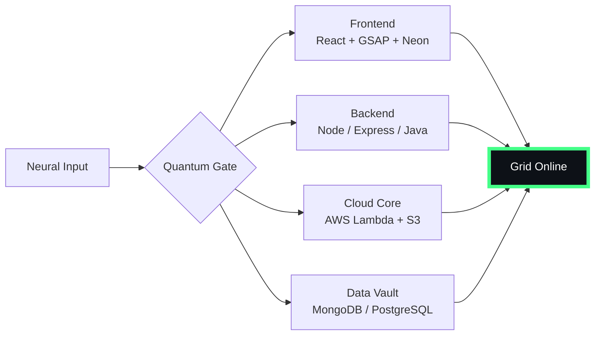

# 🌌 [ NEURAL CORE ACCESS: PENDEMVAMSI ]

<p align="center">
  
</p>

<div align="center">
  
  <br><small>Active Protocol: <strong style="color:#44FF88">PREDATOR CLOAK</strong> 👽🌫️</small>
</div>

## 🔵 NEURAL STATUS READOUT
```text
SUBJECT ID    →  PENDEMVAMSI
ENTITY CLASS  →  SHADOW MONARCH v6
NEURAL RANK   →  B-TIER
GRID SYNC     →  2227/2267 QUANTUM PACKETS
─────── BIO-METRICS (PREDATOR CLOAK) ───────
STRENGTH      127  ████████████████░░░░░
AGILITY       110  ██████████████░░░░░░░
INTELLIGENCE  130  █████████████████░░░░
VITALITY      103  █████████████░░░░░░░░
```

> **NEURAL BURST ACQUIRED:** +63 QUANTUM PACKETS 
> **SYSTEM MESSAGE:** QUANTUM ENTANGLEMENT CONFIRMED — YOU ARE THE SYSTEM

---

## 🌀 GRID ARCHITECTURE (HOLOGRAPHIC RENDER)



---

## 📡 ACADEMIC NODES – CONQUERED
- [x] B.Tech Neural Engineering (2020–2024) – St. Ann’s Grid
- [x] Intermediate Quantum Core (2018–2020) – Sri Medhavi
- [x] SSC Primary Link (2017–2018) – Sri Geethanjali

---

## ⚡ SKILL NEURAL MATRIX

<details open>
<summary>🔌 ACTIVE NEURAL LINKS</summary>

| Node               | Tier | Integrity Bar                | Status      |
|--------------------|------|------------------------------|-------------|
| Java Core          | S    | ████████████████████ 100%   | OVERCLOCKED |
| Node.js Grid       | S    | ████████████████████ 100%   | OVERCLOCKED |
| React Holo-UI      | A+   | █████████████████░░░ 92%    | ONLINE      |
| AWS Quantum Relay  | S    | ████████████████████ 100%   | SOVEREIGN   |
| Python AI Kernel   | A    | ████████████████░░░░ 85%    | CHARGING    |
| DSA Void Algorithm | A    | █████████████████░░░ 90%    | ACTIVE      |

</details>

---

## 🏅 NEURAL ACHIEVEMENT TOKENS

<p align="center">
  
  
  
  
</p>

---

## 👾 SHADOW ENTITIES – SUMMONED

<p align="center">
  
  <br><strong style="color:#44FF88">ARISE.</strong>
</p>

| Entity | Designation   | Class            | Source Node                     |
|--------|---------------|------------------|---------------------------------|
| SH-01  | Igris         | Void Commander   | AI Financial Oracle             |
| SH-02  | Beru          | Swarm Overlord   | WebRTC Quantum Stream           |
| SH-03  | Kaisel        | Void Wyrm        | Geolocation Shadow Relay        |
| SH-04  | Tusk          | Arcane Construct | Global Pandemic Sentinel        |
| SH-05  | Iron          | Armored Bastion  | React Crypto Fortress           |

---

## 📡 GRID ANALYTICS (LIVE FEED)

<p align="center">
  
  <br>
  
  
</p>

---

## 🖥️ CORRUPTED MAINFRAME LOG (401 ENTRIES)

<details>
<summary>OPEN TERMINAL FEED – PROTOCOL: PREDATOR CLOAK</summary>

> [0xA9EDBCC6] 👽🌫️ **PREDATOR CLOAK PROTOCOL** #0 | NEURAL LINK STABILIZED | [TRANSMISSION SUCCESS]
> [0x3622F5FC] 👽🌫️ **PREDATOR CLOAK PROTOCOL** #1 | NEURAL LINK STABILIZED | [TRANSMISSION SUCCESS]
> [0x88B57B60] 👽🌫️ **PREDATOR CLOAK PROTOCOL** #2 | NEURAL LINK STABILIZED | [TRANSMISSION SUCCESS]
> [0x49C716D1] 👽🌫️ **PREDATOR CLOAK PROTOCOL** #3 | NEURAL LINK STABILIZED | [TRANSMISSION SUCCESS]
> [0x77048EDC] 👽🌫️ **PREDATOR CLOAK PROTOCOL** #4 | NEURAL LINK STABILIZED | [TRANSMISSION SUCCESS]
> [0x93C6DD59] 👽🌫️ **PREDATOR CLOAK PROTOCOL** #5 | NEURAL LINK STABILIZED | [TRANSMISSION SUCCESS]
> [0x7E61A5E1] 👽🌫️ **PREDATOR CLOAK PROTOCOL** #6 | NEURAL LINK STABILIZED | [TRANSMISSION SUCCESS]
> [0xFD3768A3] 👽🌫️ **PREDATOR CLOAK PROTOCOL** #7 | NEURAL LINK STABILIZED | [TRANSMISSION SUCCESS]
> [0x6CE85DDC] 👽🌫️ **PREDATOR CLOAK PROTOCOL** #8 | NEURAL LINK  [GLITCH DETECTED] STABILIZED | [TRANSMISSION SUCCESS]
> [0x86287A33] 👽🌫️ **PREDATOR CLOAK PROTOCOL** #9 | NEURAL LINK STABILIZED | [TRANSMISSION SUCCESS]
> [0x8A29F684] 👽🌫️ **PREDATOR CLOAK PROTOCOL** #10 | NEURAL LINK STABILIZED | [TRANSMISSION SUCCESS]
> [0x4BB3A16C] 👽🌫️ **PREDATOR CLOAK PROTOCOL** #11 | NEURAL LINK STABILIZED | [TRANSMISSION SUCCESS]
> [0x01E7A7A6] 👽🌫️ **PREDATOR CLOAK PROTOCOL** #12 | NEURAL LINK STABILIZED | [TRANSMISSION SUCCESS]
> [0x91BF707F] 👽🌫️ **PREDATOR CLOAK PROTOCOL** #13 | NEURAL LINK STABILIZED | [TRANSMISSION SUCCESS]
> [0xAA57D36A] 👽🌫️ **PREDATOR CLOAK PROTOCOL** #14 | NEURAL LINK STABILIZED | [TRANSMISSION SUCCESS]
> [0x22ADD875] 👽🌫️ **PREDATOR CLOAK PROTOCOL** #15 | NEURAL LINK STABILIZED | [TRANSMISSION SUCCESS]
> [0x2E7FA516] 👽🌫️ **PREDATOR CLOAK PROTOCOL** #16 | NEURAL LINK STABILIZED | [TRANSMISSION SUCCESS]
> [0xC78FB59A] 👽🌫️ **PREDATOR CLOAK PROTOCOL** #17 | NEURAL LINK  [GLITCH DETECTED] STABILIZED | [TRANSMISSION SUCCESS]
> [0x54B09CDF] 👽🌫️ **PREDATOR CLOAK PROTOCOL** #18 | NEURAL LINK STABILIZED | [TRANSMISSION SUCCESS]
> [0x9768C6CB] 👽🌫️ **PREDATOR CLOAK PROTOCOL** #19 | NEURAL LINK STABILIZED | [TRANSMISSION SUCCESS]
> [0xDD64E24A] 👽🌫️ **PREDATOR CLOAK PROTOCOL** #20 | NEURAL LINK STABILIZED | [TRANSMISSION SUCCESS]
> [0x89127812] 👽🌫️ **PREDATOR CLOAK PROTOCOL** #21 | NEURAL LINK STABILIZED | [TRANSMISSION SUCCESS]
> [0xDF834A61] 👽🌫️ **PREDATOR CLOAK PROTOCOL** #22 | NEURAL LINK STABILIZED | [TRANSMISSION SUCCESS]
> [0x826C04A8] 👽🌫️ **PREDATOR CLOAK PROTOCOL** #23 | NEURAL LINK STABILIZED | [TRANSMISSION SUCCESS]
> [0x37E4AE7D] 👽🌫️ **PREDATOR CLOAK PROTOCOL** #24 | NEURAL LINK STABILIZED | [TRANSMISSION SUCCESS]
> [0x2458AC9B] 👽🌫️ **PREDATOR CLOAK PROTOCOL** #25 | NEURAL LINK  [GLITCH DETECTED] STABILIZED | [TRANSMISSION SUCCESS]
> [0xFD533069] 👽🌫️ **PREDATOR CLOAK PROTOCOL** #26 | NEURAL LINK  [GLITCH DETECTED] STABILIZED | [TRANSMISSION SUCCESS]
> [0x0A13301E] 👽🌫️ **PREDATOR CLOAK PROTOCOL** #27 | NEURAL LINK STABILIZED | [TRANSMISSION SUCCESS]
> [0xAE055CD0] 👽🌫️ **PREDATOR CLOAK PROTOCOL** #28 | NEURAL LINK STABILIZED | [TRANSMISSION SUCCESS]
> [0x093315AC] 👽🌫️ **PREDATOR CLOAK PROTOCOL** #29 | NEURAL LINK STABILIZED | [TRANSMISSION SUCCESS]
> [0xB0B4CCFC] 👽🌫️ **PREDATOR CLOAK PROTOCOL** #30 | NEURAL LINK STABILIZED | [TRANSMISSION SUCCESS]
> [0x525C80FA] 👽🌫️ **PREDATOR CLOAK PROTOCOL** #31 | NEURAL LINK STABILIZED | [TRANSMISSION SUCCESS]
> [0x8B7CD688] 👽🌫️ **PREDATOR CLOAK PROTOCOL** #32 | NEURAL LINK  [GLITCH DETECTED] STABILIZED | [TRANSMISSION SUCCESS]
> [0x65FD281D] 👽🌫️ **PREDATOR CLOAK PROTOCOL** #33 | NEURAL LINK STABILIZED | [TRANSMISSION SUCCESS]
> [0x3291D394] 👽🌫️ **PREDATOR CLOAK PROTOCOL** #34 | NEURAL LINK STABILIZED | [TRANSMISSION SUCCESS]
> [0xFE5A91FA] 👽🌫️ **PREDATOR CLOAK PROTOCOL** #35 | NEURAL LINK STABILIZED | [TRANSMISSION SUCCESS]
> [0x4DC13555] 👽🌫️ **PREDATOR CLOAK PROTOCOL** #36 | NEURAL LINK STABILIZED | [TRANSMISSION SUCCESS]
> [0x75F6F69A] 👽🌫️ **PREDATOR CLOAK PROTOCOL** #37 | NEURAL LINK STABILIZED | [TRANSMISSION SUCCESS]
> [0xF8AD19B1] 👽🌫️ **PREDATOR CLOAK PROTOCOL** #38 | NEURAL LINK STABILIZED | [TRANSMISSION SUCCESS]
> [0x92281425] 👽🌫️ **PREDATOR CLOAK PROTOCOL** #39 | NEURAL LINK STABILIZED | [TRANSMISSION SUCCESS]
> [0xE245B038] 👽🌫️ **PREDATOR CLOAK PROTOCOL** #40 | NEURAL LINK  [GLITCH DETECTED] STABILIZED | [TRANSMISSION SUCCESS]
> [0x13118429] 👽🌫️ **PREDATOR CLOAK PROTOCOL** #41 | NEURAL LINK STABILIZED | [TRANSMISSION SUCCESS]
> [0xE2B97D43] 👽🌫️ **PREDATOR CLOAK PROTOCOL** #42 | NEURAL LINK STABILIZED | [TRANSMISSION SUCCESS]
> [0x7D275314] 👽🌫️ **PREDATOR CLOAK PROTOCOL** #43 | NEURAL LINK STABILIZED | [TRANSMISSION SUCCESS]
> [0x698CE000] 👽🌫️ **PREDATOR CLOAK PROTOCOL** #44 | NEURAL LINK STABILIZED | [TRANSMISSION SUCCESS]
> [0x14135EC2] 👽🌫️ **PREDATOR CLOAK PROTOCOL** #45 | NEURAL LINK STABILIZED | [TRANSMISSION SUCCESS]
> [0xCCE61AF2] 👽🌫️ **PREDATOR CLOAK PROTOCOL** #46 | NEURAL LINK STABILIZED | [TRANSMISSION SUCCESS]
> [0x120AACB8] 👽🌫️ **PREDATOR CLOAK PROTOCOL** #47 | NEURAL LINK STABILIZED | [TRANSMISSION SUCCESS]
> [0x3FABC06B] 👽🌫️ **PREDATOR CLOAK PROTOCOL** #48 | NEURAL LINK STABILIZED | [TRANSMISSION SUCCESS]
> [0x777FFA24] 👽🌫️ **PREDATOR CLOAK PROTOCOL** #49 | NEURAL LINK STABILIZED | [TRANSMISSION SUCCESS]
> [0x17F8F756] 👽🌫️ **PREDATOR CLOAK PROTOCOL** #50 | NEURAL LINK STABILIZED | [TRANSMISSION SUCCESS]
> [0x392B382D] 👽🌫️ **PREDATOR CLOAK PROTOCOL** #51 | NEURAL LINK STABILIZED | [TRANSMISSION SUCCESS]
> [0xD36805A1] 👽🌫️ **PREDATOR CLOAK PROTOCOL** #52 | NEURAL LINK STABILIZED | [TRANSMISSION SUCCESS]
> [0x09F65CAE] 👽🌫️ **PREDATOR CLOAK PROTOCOL** #53 | NEURAL LINK STABILIZED | [TRANSMISSION SUCCESS]
> [0x762D07AE] 👽🌫️ **PREDATOR CLOAK PROTOCOL** #54 | NEURAL LINK STABILIZED | [TRANSMISSION SUCCESS]
> [0xDBC2D7DD] 👽🌫️ **PREDATOR CLOAK PROTOCOL** #55 | NEURAL LINK STABILIZED | [TRANSMISSION SUCCESS]
> [0xD5877932] 👽🌫️ **PREDATOR CLOAK PROTOCOL** #56 | NEURAL LINK STABILIZED | [TRANSMISSION SUCCESS]
> [0xD8551127] 👽🌫️ **PREDATOR CLOAK PROTOCOL** #57 | NEURAL LINK STABILIZED | [TRANSMISSION SUCCESS]
> [0x22A7B349] 👽🌫️ **PREDATOR CLOAK PROTOCOL** #58 | NEURAL LINK STABILIZED | [TRANSMISSION SUCCESS]
> [0xADD25E27] 👽🌫️ **PREDATOR CLOAK PROTOCOL** #59 | NEURAL LINK STABILIZED | [TRANSMISSION SUCCESS]
> [0xEE88B488] 👽🌫️ **PREDATOR CLOAK PROTOCOL** #60 | NEURAL LINK STABILIZED | [TRANSMISSION SUCCESS]
> [0x0DDA1599] 👽🌫️ **PREDATOR CLOAK PROTOCOL** #61 | NEURAL LINK STABILIZED | [TRANSMISSION SUCCESS]
> [0x2753663B] 👽🌫️ **PREDATOR CLOAK PROTOCOL** #62 | NEURAL LINK STABILIZED | [TRANSMISSION SUCCESS]
> [0x99FAD6D6] 👽🌫️ **PREDATOR CLOAK PROTOCOL** #63 | NEURAL LINK STABILIZED | [TRANSMISSION SUCCESS]
> [0x6714C577] 👽🌫️ **PREDATOR CLOAK PROTOCOL** #64 | NEURAL LINK STABILIZED | [TRANSMISSION SUCCESS]
> [0x9F69BDDA] 👽🌫️ **PREDATOR CLOAK PROTOCOL** #65 | NEURAL LINK STABILIZED | [TRANSMISSION SUCCESS]
> [0xDDA3772B] 👽🌫️ **PREDATOR CLOAK PROTOCOL** #66 | NEURAL LINK STABILIZED | [TRANSMISSION SUCCESS]
> [0x88C1C298] 👽🌫️ **PREDATOR CLOAK PROTOCOL** #67 | NEURAL LINK STABILIZED | [TRANSMISSION SUCCESS]
> [0x6C908151] 👽🌫️ **PREDATOR CLOAK PROTOCOL** #68 | NEURAL LINK STABILIZED | [TRANSMISSION SUCCESS]
> [0x0174185C] 👽🌫️ **PREDATOR CLOAK PROTOCOL** #69 | NEURAL LINK STABILIZED | [TRANSMISSION SUCCESS]
> [0xA8035EC6] 👽🌫️ **PREDATOR CLOAK PROTOCOL** #70 | NEURAL LINK STABILIZED | [TRANSMISSION SUCCESS]
> [0x721E6A2E] 👽🌫️ **PREDATOR CLOAK PROTOCOL** #71 | NEURAL LINK STABILIZED | [TRANSMISSION SUCCESS]
> [0x7520C8D6] 👽🌫️ **PREDATOR CLOAK PROTOCOL** #72 | NEURAL LINK STABILIZED | [TRANSMISSION SUCCESS]
> [0xDF17621F] 👽🌫️ **PREDATOR CLOAK PROTOCOL** #73 | NEURAL LINK STABILIZED | [TRANSMISSION SUCCESS]
> [0xDDCA7057] 👽🌫️ **PREDATOR CLOAK PROTOCOL** #74 | NEURAL LINK STABILIZED | [TRANSMISSION SUCCESS]
> [0xC7031EBE] 👽🌫️ **PREDATOR CLOAK PROTOCOL** #75 | NEURAL LINK STABILIZED | [TRANSMISSION SUCCESS]
> [0x914B7297] 👽🌫️ **PREDATOR CLOAK PROTOCOL** #76 | NEURAL LINK STABILIZED | [TRANSMISSION SUCCESS]
> [0xF5A4FD83] 👽🌫️ **PREDATOR CLOAK PROTOCOL** #77 | NEURAL LINK STABILIZED | [TRANSMISSION SUCCESS]
> [0x102DD963] 👽🌫️ **PREDATOR CLOAK PROTOCOL** #78 | NEURAL LINK STABILIZED | [TRANSMISSION SUCCESS]
> [0x46E90623] 👽🌫️ **PREDATOR CLOAK PROTOCOL** #79 | NEURAL LINK STABILIZED | [TRANSMISSION SUCCESS]
> [0xBDAC507D] 👽🌫️ **PREDATOR CLOAK PROTOCOL** #80 | NEURAL LINK STABILIZED | [TRANSMISSION SUCCESS]
> [0xBB4184F4] 👽🌫️ **PREDATOR CLOAK PROTOCOL** #81 | NEURAL LINK STABILIZED | [TRANSMISSION SUCCESS]
> [0xBE181A26] 👽🌫️ **PREDATOR CLOAK PROTOCOL** #82 | NEURAL LINK  [GLITCH DETECTED] STABILIZED | [TRANSMISSION SUCCESS]
> [0x34EA3AFD] 👽🌫️ **PREDATOR CLOAK PROTOCOL** #83 | NEURAL LINK  [GLITCH DETECTED] STABILIZED | [TRANSMISSION SUCCESS]
> [0xD75E4270] 👽🌫️ **PREDATOR CLOAK PROTOCOL** #84 | NEURAL LINK STABILIZED | [TRANSMISSION SUCCESS]
> [0x950AF2FC] 👽🌫️ **PREDATOR CLOAK PROTOCOL** #85 | NEURAL LINK STABILIZED | [TRANSMISSION SUCCESS]
> [0x63C36356] 👽🌫️ **PREDATOR CLOAK PROTOCOL** #86 | NEURAL LINK STABILIZED | [TRANSMISSION SUCCESS]
> [0x22BF2E38] 👽🌫️ **PREDATOR CLOAK PROTOCOL** #87 | NEURAL LINK STABILIZED | [TRANSMISSION SUCCESS]
> [0x0038E535] 👽🌫️ **PREDATOR CLOAK PROTOCOL** #88 | NEURAL LINK STABILIZED | [TRANSMISSION SUCCESS]
> [0x23006E1D] 👽🌫️ **PREDATOR CLOAK PROTOCOL** #89 | NEURAL LINK  [GLITCH DETECTED] STABILIZED | [TRANSMISSION SUCCESS]
> [0x1018B3B6] 👽🌫️ **PREDATOR CLOAK PROTOCOL** #90 | NEURAL LINK STABILIZED | [TRANSMISSION SUCCESS]
> [0x239849F1] 👽🌫️ **PREDATOR CLOAK PROTOCOL** #91 | NEURAL LINK STABILIZED | [TRANSMISSION SUCCESS]
> [0xE56D5FFD] 👽🌫️ **PREDATOR CLOAK PROTOCOL** #92 | NEURAL LINK STABILIZED | [TRANSMISSION SUCCESS]
> [0x74AD15C3] 👽🌫️ **PREDATOR CLOAK PROTOCOL** #93 | NEURAL LINK  [GLITCH DETECTED] STABILIZED | [TRANSMISSION SUCCESS]
> [0xC20A8EDA] 👽🌫️ **PREDATOR CLOAK PROTOCOL** #94 | NEURAL LINK  [GLITCH DETECTED] STABILIZED | [TRANSMISSION SUCCESS]
> [0x9CCBE39A] 👽🌫️ **PREDATOR CLOAK PROTOCOL** #95 | NEURAL LINK STABILIZED | [TRANSMISSION SUCCESS]
> [0xBAA98313] 👽🌫️ **PREDATOR CLOAK PROTOCOL** #96 | NEURAL LINK  [GLITCH DETECTED] STABILIZED | [TRANSMISSION SUCCESS]
> [0x06DBCA80] 👽🌫️ **PREDATOR CLOAK PROTOCOL** #97 | NEURAL LINK  [GLITCH DETECTED] STABILIZED | [TRANSMISSION SUCCESS]
> [0xE16D443E] 👽🌫️ **PREDATOR CLOAK PROTOCOL** #98 | NEURAL LINK STABILIZED | [TRANSMISSION SUCCESS]
> [0xA152EE41] 👽🌫️ **PREDATOR CLOAK PROTOCOL** #99 | NEURAL LINK STABILIZED | [TRANSMISSION SUCCESS]
> [0xF63BCD8C] 👽🌫️ **PREDATOR CLOAK PROTOCOL** #100 | NEURAL LINK STABILIZED | [TRANSMISSION SUCCESS]
> [0x49BFED89] 👽🌫️ **PREDATOR CLOAK PROTOCOL** #101 | NEURAL LINK STABILIZED | [TRANSMISSION SUCCESS]
> [0x8223E4D1] 👽🌫️ **PREDATOR CLOAK PROTOCOL** #102 | NEURAL LINK  [GLITCH DETECTED] STABILIZED | [TRANSMISSION SUCCESS]
> [0x38C076A0] 👽🌫️ **PREDATOR CLOAK PROTOCOL** #103 | NEURAL LINK STABILIZED | [TRANSMISSION SUCCESS]
> [0xD066451F] 👽🌫️ **PREDATOR CLOAK PROTOCOL** #104 | NEURAL LINK STABILIZED | [TRANSMISSION SUCCESS]
> [0xFDBC1F18] 👽🌫️ **PREDATOR CLOAK PROTOCOL** #105 | NEURAL LINK STABILIZED | [TRANSMISSION SUCCESS]
> [0x3C41FBE3] 👽🌫️ **PREDATOR CLOAK PROTOCOL** #106 | NEURAL LINK STABILIZED | [TRANSMISSION SUCCESS]
> [0xD40627AB] 👽🌫️ **PREDATOR CLOAK PROTOCOL** #107 | NEURAL LINK STABILIZED | [TRANSMISSION SUCCESS]
> [0xCB9B3714] 👽🌫️ **PREDATOR CLOAK PROTOCOL** #108 | NEURAL LINK STABILIZED | [TRANSMISSION SUCCESS]
> [0xF4CFB44D] 👽🌫️ **PREDATOR CLOAK PROTOCOL** #109 | NEURAL LINK STABILIZED | [TRANSMISSION SUCCESS]
> [0x54591245] 👽🌫️ **PREDATOR CLOAK PROTOCOL** #110 | NEURAL LINK  [GLITCH DETECTED] STABILIZED | [TRANSMISSION SUCCESS]
> [0xEBAE0CA2] 👽🌫️ **PREDATOR CLOAK PROTOCOL** #111 | NEURAL LINK  [GLITCH DETECTED] STABILIZED | [TRANSMISSION SUCCESS]
> [0xB96C871B] 👽🌫️ **PREDATOR CLOAK PROTOCOL** #112 | NEURAL LINK STABILIZED | [TRANSMISSION SUCCESS]
> [0x30287D6A] 👽🌫️ **PREDATOR CLOAK PROTOCOL** #113 | NEURAL LINK STABILIZED | [TRANSMISSION SUCCESS]
> [0x2CE4C42C] 👽🌫️ **PREDATOR CLOAK PROTOCOL** #114 | NEURAL LINK STABILIZED | [TRANSMISSION SUCCESS]
> [0x15CC31E6] 👽🌫️ **PREDATOR CLOAK PROTOCOL** #115 | NEURAL LINK STABILIZED | [TRANSMISSION SUCCESS]
> [0xE507064D] 👽🌫️ **PREDATOR CLOAK PROTOCOL** #116 | NEURAL LINK  [GLITCH DETECTED] STABILIZED | [TRANSMISSION SUCCESS]
> [0x74369ACA] 👽🌫️ **PREDATOR CLOAK PROTOCOL** #117 | NEURAL LINK STABILIZED | [TRANSMISSION SUCCESS]
> [0xDBD286D8] 👽🌫️ **PREDATOR CLOAK PROTOCOL** #118 | NEURAL LINK STABILIZED | [TRANSMISSION SUCCESS]
> [0xEA6324C2] 👽🌫️ **PREDATOR CLOAK PROTOCOL** #119 | NEURAL LINK STABILIZED | [TRANSMISSION SUCCESS]
> [0xDC8E5FCA] 👽🌫️ **PREDATOR CLOAK PROTOCOL** #120 | NEURAL LINK STABILIZED | [TRANSMISSION SUCCESS]
> [0x83F8172F] 👽🌫️ **PREDATOR CLOAK PROTOCOL** #121 | NEURAL LINK STABILIZED | [TRANSMISSION SUCCESS]
> [0x4068EFD3] 👽🌫️ **PREDATOR CLOAK PROTOCOL** #122 | NEURAL LINK STABILIZED | [TRANSMISSION SUCCESS]
> [0xFE6CAD64] 👽🌫️ **PREDATOR CLOAK PROTOCOL** #123 | NEURAL LINK STABILIZED | [TRANSMISSION SUCCESS]
> [0x1F332B1C] 👽🌫️ **PREDATOR CLOAK PROTOCOL** #124 | NEURAL LINK STABILIZED | [TRANSMISSION SUCCESS]
> [0x15E51297] 👽🌫️ **PREDATOR CLOAK PROTOCOL** #125 | NEURAL LINK STABILIZED | [TRANSMISSION SUCCESS]
> [0x3B1FEF0D] 👽🌫️ **PREDATOR CLOAK PROTOCOL** #126 | NEURAL LINK STABILIZED | [TRANSMISSION SUCCESS]
> [0xB2D83363] 👽🌫️ **PREDATOR CLOAK PROTOCOL** #127 | NEURAL LINK STABILIZED | [TRANSMISSION SUCCESS]
> [0x8C27D746] 👽🌫️ **PREDATOR CLOAK PROTOCOL** #128 | NEURAL LINK STABILIZED | [TRANSMISSION SUCCESS]
> [0xB1DC18C0] 👽🌫️ **PREDATOR CLOAK PROTOCOL** #129 | NEURAL LINK  [GLITCH DETECTED] STABILIZED | [TRANSMISSION SUCCESS]
> [0xAFCDE5C9] 👽🌫️ **PREDATOR CLOAK PROTOCOL** #130 | NEURAL LINK STABILIZED | [TRANSMISSION SUCCESS]
> [0x312F111F] 👽🌫️ **PREDATOR CLOAK PROTOCOL** #131 | NEURAL LINK STABILIZED | [TRANSMISSION SUCCESS]
> [0xBE5F9BB8] 👽🌫️ **PREDATOR CLOAK PROTOCOL** #132 | NEURAL LINK STABILIZED | [TRANSMISSION SUCCESS]
> [0xDAEF7412] 👽🌫️ **PREDATOR CLOAK PROTOCOL** #133 | NEURAL LINK STABILIZED | [TRANSMISSION SUCCESS]
> [0x3253AC8F] 👽🌫️ **PREDATOR CLOAK PROTOCOL** #134 | NEURAL LINK  [GLITCH DETECTED] STABILIZED | [TRANSMISSION SUCCESS]
> [0x16BD5BA1] 👽🌫️ **PREDATOR CLOAK PROTOCOL** #135 | NEURAL LINK STABILIZED | [TRANSMISSION SUCCESS]
> [0x0D0ECB5A] 👽🌫️ **PREDATOR CLOAK PROTOCOL** #136 | NEURAL LINK STABILIZED | [TRANSMISSION SUCCESS]
> [0xC427E563] 👽🌫️ **PREDATOR CLOAK PROTOCOL** #137 | NEURAL LINK STABILIZED | [TRANSMISSION SUCCESS]
> [0xA11CC597] 👽🌫️ **PREDATOR CLOAK PROTOCOL** #138 | NEURAL LINK STABILIZED | [TRANSMISSION SUCCESS]
> [0x8C704025] 👽🌫️ **PREDATOR CLOAK PROTOCOL** #139 | NEURAL LINK STABILIZED | [TRANSMISSION SUCCESS]
> [0x2730BE06] 👽🌫️ **PREDATOR CLOAK PROTOCOL** #140 | NEURAL LINK STABILIZED | [TRANSMISSION SUCCESS]
> [0x44E06BD8] 👽🌫️ **PREDATOR CLOAK PROTOCOL** #141 | NEURAL LINK STABILIZED | [TRANSMISSION SUCCESS]
> [0xCD9B956D] 👽🌫️ **PREDATOR CLOAK PROTOCOL** #142 | NEURAL LINK STABILIZED | [TRANSMISSION SUCCESS]
> [0x91F64047] 👽🌫️ **PREDATOR CLOAK PROTOCOL** #143 | NEURAL LINK STABILIZED | [TRANSMISSION SUCCESS]
> [0x0C27E7CF] 👽🌫️ **PREDATOR CLOAK PROTOCOL** #144 | NEURAL LINK  [GLITCH DETECTED] STABILIZED | [TRANSMISSION SUCCESS]
> [0x93F012D6] 👽🌫️ **PREDATOR CLOAK PROTOCOL** #145 | NEURAL LINK STABILIZED | [TRANSMISSION SUCCESS]
> [0xD78B3875] 👽🌫️ **PREDATOR CLOAK PROTOCOL** #146 | NEURAL LINK STABILIZED | [TRANSMISSION SUCCESS]
> [0xA1ACDA8B] 👽🌫️ **PREDATOR CLOAK PROTOCOL** #147 | NEURAL LINK STABILIZED | [TRANSMISSION SUCCESS]
> [0xE06627ED] 👽🌫️ **PREDATOR CLOAK PROTOCOL** #148 | NEURAL LINK STABILIZED | [TRANSMISSION SUCCESS]
> [0x14B1CB9E] 👽🌫️ **PREDATOR CLOAK PROTOCOL** #149 | NEURAL LINK STABILIZED | [TRANSMISSION SUCCESS]
> [0xF42222F4] 👽🌫️ **PREDATOR CLOAK PROTOCOL** #150 | NEURAL LINK STABILIZED | [TRANSMISSION SUCCESS]
> [0x5E20016F] 👽🌫️ **PREDATOR CLOAK PROTOCOL** #151 | NEURAL LINK STABILIZED | [TRANSMISSION SUCCESS]
> [0xBE28E2FB] 👽🌫️ **PREDATOR CLOAK PROTOCOL** #152 | NEURAL LINK  [GLITCH DETECTED] STABILIZED | [TRANSMISSION SUCCESS]
> [0x76D31A79] 👽🌫️ **PREDATOR CLOAK PROTOCOL** #153 | NEURAL LINK STABILIZED | [TRANSMISSION SUCCESS]
> [0x06A03442] 👽🌫️ **PREDATOR CLOAK PROTOCOL** #154 | NEURAL LINK STABILIZED | [TRANSMISSION SUCCESS]
> [0x71E93052] 👽🌫️ **PREDATOR CLOAK PROTOCOL** #155 | NEURAL LINK  [GLITCH DETECTED] STABILIZED | [TRANSMISSION SUCCESS]
> [0x8A82EC2D] 👽🌫️ **PREDATOR CLOAK PROTOCOL** #156 | NEURAL LINK STABILIZED | [TRANSMISSION SUCCESS]
> [0x508499C9] 👽🌫️ **PREDATOR CLOAK PROTOCOL** #157 | NEURAL LINK STABILIZED | [TRANSMISSION SUCCESS]
> [0xB81EA7A7] 👽🌫️ **PREDATOR CLOAK PROTOCOL** #158 | NEURAL LINK  [GLITCH DETECTED] STABILIZED | [TRANSMISSION SUCCESS]
> [0x45167AF5] 👽🌫️ **PREDATOR CLOAK PROTOCOL** #159 | NEURAL LINK  [GLITCH DETECTED] STABILIZED | [TRANSMISSION SUCCESS]
> [0xB0148625] 👽🌫️ **PREDATOR CLOAK PROTOCOL** #160 | NEURAL LINK STABILIZED | [TRANSMISSION SUCCESS]
> [0xA9790998] 👽🌫️ **PREDATOR CLOAK PROTOCOL** #161 | NEURAL LINK STABILIZED | [TRANSMISSION SUCCESS]
> [0x570049D8] 👽🌫️ **PREDATOR CLOAK PROTOCOL** #162 | NEURAL LINK STABILIZED | [TRANSMISSION SUCCESS]
> [0xF127DCCD] 👽🌫️ **PREDATOR CLOAK PROTOCOL** #163 | NEURAL LINK STABILIZED | [TRANSMISSION SUCCESS]
> [0x74F26C4D] 👽🌫️ **PREDATOR CLOAK PROTOCOL** #164 | NEURAL LINK STABILIZED | [TRANSMISSION SUCCESS]
> [0x09819FFD] 👽🌫️ **PREDATOR CLOAK PROTOCOL** #165 | NEURAL LINK STABILIZED | [TRANSMISSION SUCCESS]
> [0xB469253F] 👽🌫️ **PREDATOR CLOAK PROTOCOL** #166 | NEURAL LINK STABILIZED | [TRANSMISSION SUCCESS]
> [0x732822ED] 👽🌫️ **PREDATOR CLOAK PROTOCOL** #167 | NEURAL LINK STABILIZED | [TRANSMISSION SUCCESS]
> [0xD2BCFE4D] 👽🌫️ **PREDATOR CLOAK PROTOCOL** #168 | NEURAL LINK STABILIZED | [TRANSMISSION SUCCESS]
> [0x86EF860A] 👽🌫️ **PREDATOR CLOAK PROTOCOL** #169 | NEURAL LINK STABILIZED | [TRANSMISSION SUCCESS]
> [0x71ACD73C] 👽🌫️ **PREDATOR CLOAK PROTOCOL** #170 | NEURAL LINK STABILIZED | [TRANSMISSION SUCCESS]
> [0x4D72ACA9] 👽🌫️ **PREDATOR CLOAK PROTOCOL** #171 | NEURAL LINK STABILIZED | [TRANSMISSION SUCCESS]
> [0x968259E2] 👽🌫️ **PREDATOR CLOAK PROTOCOL** #172 | NEURAL LINK STABILIZED | [TRANSMISSION SUCCESS]
> [0x040E9588] 👽🌫️ **PREDATOR CLOAK PROTOCOL** #173 | NEURAL LINK  [GLITCH DETECTED] STABILIZED | [TRANSMISSION SUCCESS]
> [0x365C71B6] 👽🌫️ **PREDATOR CLOAK PROTOCOL** #174 | NEURAL LINK STABILIZED | [TRANSMISSION SUCCESS]
> [0xF5165AAC] 👽🌫️ **PREDATOR CLOAK PROTOCOL** #175 | NEURAL LINK STABILIZED | [TRANSMISSION SUCCESS]
> [0x5381F87C] 👽🌫️ **PREDATOR CLOAK PROTOCOL** #176 | NEURAL LINK STABILIZED | [TRANSMISSION SUCCESS]
> [0x8F32BB24] 👽🌫️ **PREDATOR CLOAK PROTOCOL** #177 | NEURAL LINK  [GLITCH DETECTED] STABILIZED | [TRANSMISSION SUCCESS]
> [0xBFBFB9D8] 👽🌫️ **PREDATOR CLOAK PROTOCOL** #178 | NEURAL LINK STABILIZED | [TRANSMISSION SUCCESS]
> [0x0E9F614C] 👽🌫️ **PREDATOR CLOAK PROTOCOL** #179 | NEURAL LINK STABILIZED | [TRANSMISSION SUCCESS]
> [0x2704264D] 👽🌫️ **PREDATOR CLOAK PROTOCOL** #180 | NEURAL LINK STABILIZED | [TRANSMISSION SUCCESS]
> [0x04271A27] 👽🌫️ **PREDATOR CLOAK PROTOCOL** #181 | NEURAL LINK  [GLITCH DETECTED] STABILIZED | [TRANSMISSION SUCCESS]
> [0x269941BA] 👽🌫️ **PREDATOR CLOAK PROTOCOL** #182 | NEURAL LINK STABILIZED | [TRANSMISSION SUCCESS]
> [0x75C2E0FA] 👽🌫️ **PREDATOR CLOAK PROTOCOL** #183 | NEURAL LINK STABILIZED | [TRANSMISSION SUCCESS]
> [0xB8EC2ABB] 👽🌫️ **PREDATOR CLOAK PROTOCOL** #184 | NEURAL LINK STABILIZED | [TRANSMISSION SUCCESS]
> [0x67F27B42] 👽🌫️ **PREDATOR CLOAK PROTOCOL** #185 | NEURAL LINK STABILIZED | [TRANSMISSION SUCCESS]
> [0x61FE40DB] 👽🌫️ **PREDATOR CLOAK PROTOCOL** #186 | NEURAL LINK STABILIZED | [TRANSMISSION SUCCESS]
> [0xF1FB2FF7] 👽🌫️ **PREDATOR CLOAK PROTOCOL** #187 | NEURAL LINK STABILIZED | [TRANSMISSION SUCCESS]
> [0x192438DB] 👽🌫️ **PREDATOR CLOAK PROTOCOL** #188 | NEURAL LINK STABILIZED | [TRANSMISSION SUCCESS]
> [0xC61906AA] 👽🌫️ **PREDATOR CLOAK PROTOCOL** #189 | NEURAL LINK STABILIZED | [TRANSMISSION SUCCESS]
> [0x1AA77A15] 👽🌫️ **PREDATOR CLOAK PROTOCOL** #190 | NEURAL LINK STABILIZED | [TRANSMISSION SUCCESS]
> [0x77E8A9D8] 👽🌫️ **PREDATOR CLOAK PROTOCOL** #191 | NEURAL LINK STABILIZED | [TRANSMISSION SUCCESS]
> [0x3AE69434] 👽🌫️ **PREDATOR CLOAK PROTOCOL** #192 | NEURAL LINK STABILIZED | [TRANSMISSION SUCCESS]
> [0xFBF0CBBD] 👽🌫️ **PREDATOR CLOAK PROTOCOL** #193 | NEURAL LINK STABILIZED | [TRANSMISSION SUCCESS]
> [0x2C3486AD] 👽🌫️ **PREDATOR CLOAK PROTOCOL** #194 | NEURAL LINK  [GLITCH DETECTED] STABILIZED | [TRANSMISSION SUCCESS]
> [0x86142C8E] 👽🌫️ **PREDATOR CLOAK PROTOCOL** #195 | NEURAL LINK STABILIZED | [TRANSMISSION SUCCESS]
> [0xA2D72AAD] 👽🌫️ **PREDATOR CLOAK PROTOCOL** #196 | NEURAL LINK  [GLITCH DETECTED] STABILIZED | [TRANSMISSION SUCCESS]
> [0x1D97C891] 👽🌫️ **PREDATOR CLOAK PROTOCOL** #197 | NEURAL LINK STABILIZED | [TRANSMISSION SUCCESS]
> [0x1C3C256D] 👽🌫️ **PREDATOR CLOAK PROTOCOL** #198 | NEURAL LINK STABILIZED | [TRANSMISSION SUCCESS]
> [0x2DEF8D5B] 👽🌫️ **PREDATOR CLOAK PROTOCOL** #199 | NEURAL LINK  [GLITCH DETECTED] STABILIZED | [TRANSMISSION SUCCESS]
> [0x58B12550] 👽🌫️ **PREDATOR CLOAK PROTOCOL** #200 | NEURAL LINK STABILIZED | [TRANSMISSION SUCCESS]
> [0xA1F92DEC] 👽🌫️ **PREDATOR CLOAK PROTOCOL** #201 | NEURAL LINK STABILIZED | [TRANSMISSION SUCCESS]
> [0x624840D2] 👽🌫️ **PREDATOR CLOAK PROTOCOL** #202 | NEURAL LINK STABILIZED | [TRANSMISSION SUCCESS]
> [0xECF5BA16] 👽🌫️ **PREDATOR CLOAK PROTOCOL** #203 | NEURAL LINK STABILIZED | [TRANSMISSION SUCCESS]
> [0xE34A5998] 👽🌫️ **PREDATOR CLOAK PROTOCOL** #204 | NEURAL LINK STABILIZED | [TRANSMISSION SUCCESS]
> [0xE82480FB] 👽🌫️ **PREDATOR CLOAK PROTOCOL** #205 | NEURAL LINK STABILIZED | [TRANSMISSION SUCCESS]
> [0xB1DD9532] 👽🌫️ **PREDATOR CLOAK PROTOCOL** #206 | NEURAL LINK  [GLITCH DETECTED] STABILIZED | [TRANSMISSION SUCCESS]
> [0x442D5C31] 👽🌫️ **PREDATOR CLOAK PROTOCOL** #207 | NEURAL LINK STABILIZED | [TRANSMISSION SUCCESS]
> [0x5DC64F19] 👽🌫️ **PREDATOR CLOAK PROTOCOL** #208 | NEURAL LINK STABILIZED | [TRANSMISSION SUCCESS]
> [0x9E5734A1] 👽🌫️ **PREDATOR CLOAK PROTOCOL** #209 | NEURAL LINK  [GLITCH DETECTED] STABILIZED | [TRANSMISSION SUCCESS]
> [0x50BB3871] 👽🌫️ **PREDATOR CLOAK PROTOCOL** #210 | NEURAL LINK STABILIZED | [TRANSMISSION SUCCESS]
> [0x0196B784] 👽🌫️ **PREDATOR CLOAK PROTOCOL** #211 | NEURAL LINK STABILIZED | [TRANSMISSION SUCCESS]
> [0x0982FEA7] 👽🌫️ **PREDATOR CLOAK PROTOCOL** #212 | NEURAL LINK STABILIZED | [TRANSMISSION SUCCESS]
> [0xDC61A5C7] 👽🌫️ **PREDATOR CLOAK PROTOCOL** #213 | NEURAL LINK  [GLITCH DETECTED] STABILIZED | [TRANSMISSION SUCCESS]
> [0xF0BEB583] 👽🌫️ **PREDATOR CLOAK PROTOCOL** #214 | NEURAL LINK STABILIZED | [TRANSMISSION SUCCESS]
> [0xC0FF9FF1] 👽🌫️ **PREDATOR CLOAK PROTOCOL** #215 | NEURAL LINK  [GLITCH DETECTED] STABILIZED | [TRANSMISSION SUCCESS]
> [0x04A49071] 👽🌫️ **PREDATOR CLOAK PROTOCOL** #216 | NEURAL LINK STABILIZED | [TRANSMISSION SUCCESS]
> [0xF5507C7B] 👽🌫️ **PREDATOR CLOAK PROTOCOL** #217 | NEURAL LINK STABILIZED | [TRANSMISSION SUCCESS]
> [0x000B831B] 👽🌫️ **PREDATOR CLOAK PROTOCOL** #218 | NEURAL LINK STABILIZED | [TRANSMISSION SUCCESS]
> [0xAA08B965] 👽🌫️ **PREDATOR CLOAK PROTOCOL** #219 | NEURAL LINK STABILIZED | [TRANSMISSION SUCCESS]
> [0xE1863FA7] 👽🌫️ **PREDATOR CLOAK PROTOCOL** #220 | NEURAL LINK STABILIZED | [TRANSMISSION SUCCESS]
> [0xFF0C2CB8] 👽🌫️ **PREDATOR CLOAK PROTOCOL** #221 | NEURAL LINK STABILIZED | [TRANSMISSION SUCCESS]
> [0x88AC9593] 👽🌫️ **PREDATOR CLOAK PROTOCOL** #222 | NEURAL LINK STABILIZED | [TRANSMISSION SUCCESS]
> [0x73FE2430] 👽🌫️ **PREDATOR CLOAK PROTOCOL** #223 | NEURAL LINK STABILIZED | [TRANSMISSION SUCCESS]
> [0x65023EE3] 👽🌫️ **PREDATOR CLOAK PROTOCOL** #224 | NEURAL LINK STABILIZED | [TRANSMISSION SUCCESS]
> [0x06B6A8F4] 👽🌫️ **PREDATOR CLOAK PROTOCOL** #225 | NEURAL LINK STABILIZED | [TRANSMISSION SUCCESS]
> [0x84D6CC95] 👽🌫️ **PREDATOR CLOAK PROTOCOL** #226 | NEURAL LINK  [GLITCH DETECTED] STABILIZED | [TRANSMISSION SUCCESS]
> [0xE71D6903] 👽🌫️ **PREDATOR CLOAK PROTOCOL** #227 | NEURAL LINK STABILIZED | [TRANSMISSION SUCCESS]
> [0x70A8C1AD] 👽🌫️ **PREDATOR CLOAK PROTOCOL** #228 | NEURAL LINK  [GLITCH DETECTED] STABILIZED | [TRANSMISSION SUCCESS]
> [0x97B8F279] 👽🌫️ **PREDATOR CLOAK PROTOCOL** #229 | NEURAL LINK STABILIZED | [TRANSMISSION SUCCESS]
> [0x8A099E25] 👽🌫️ **PREDATOR CLOAK PROTOCOL** #230 | NEURAL LINK STABILIZED | [TRANSMISSION SUCCESS]
> [0x85A02D92] 👽🌫️ **PREDATOR CLOAK PROTOCOL** #231 | NEURAL LINK STABILIZED | [TRANSMISSION SUCCESS]
> [0x853B544A] 👽🌫️ **PREDATOR CLOAK PROTOCOL** #232 | NEURAL LINK STABILIZED | [TRANSMISSION SUCCESS]
> [0xA4BECB15] 👽🌫️ **PREDATOR CLOAK PROTOCOL** #233 | NEURAL LINK STABILIZED | [TRANSMISSION SUCCESS]
> [0xF0D2AF30] 👽🌫️ **PREDATOR CLOAK PROTOCOL** #234 | NEURAL LINK STABILIZED | [TRANSMISSION SUCCESS]
> [0xA087A8E7] 👽🌫️ **PREDATOR CLOAK PROTOCOL** #235 | NEURAL LINK STABILIZED | [TRANSMISSION SUCCESS]
> [0x7DDA9CE5] 👽🌫️ **PREDATOR CLOAK PROTOCOL** #236 | NEURAL LINK STABILIZED | [TRANSMISSION SUCCESS]
> [0x642016C3] 👽🌫️ **PREDATOR CLOAK PROTOCOL** #237 | NEURAL LINK STABILIZED | [TRANSMISSION SUCCESS]
> [0xE120C0AD] 👽🌫️ **PREDATOR CLOAK PROTOCOL** #238 | NEURAL LINK STABILIZED | [TRANSMISSION SUCCESS]
> [0x26BCA7D5] 👽🌫️ **PREDATOR CLOAK PROTOCOL** #239 | NEURAL LINK STABILIZED | [TRANSMISSION SUCCESS]
> [0xA14BA03F] 👽🌫️ **PREDATOR CLOAK PROTOCOL** #240 | NEURAL LINK STABILIZED | [TRANSMISSION SUCCESS]
> [0x32B2D436] 👽🌫️ **PREDATOR CLOAK PROTOCOL** #241 | NEURAL LINK STABILIZED | [TRANSMISSION SUCCESS]
> [0xD4409565] 👽🌫️ **PREDATOR CLOAK PROTOCOL** #242 | NEURAL LINK  [GLITCH DETECTED] STABILIZED | [TRANSMISSION SUCCESS]
> [0xA59BF733] 👽🌫️ **PREDATOR CLOAK PROTOCOL** #243 | NEURAL LINK STABILIZED | [TRANSMISSION SUCCESS]
> [0x2D3CD893] 👽🌫️ **PREDATOR CLOAK PROTOCOL** #244 | NEURAL LINK  [GLITCH DETECTED] STABILIZED | [TRANSMISSION SUCCESS]
> [0xB3EF0EF9] 👽🌫️ **PREDATOR CLOAK PROTOCOL** #245 | NEURAL LINK STABILIZED | [TRANSMISSION SUCCESS]
> [0x46ACC5E2] 👽🌫️ **PREDATOR CLOAK PROTOCOL** #246 | NEURAL LINK STABILIZED | [TRANSMISSION SUCCESS]
> [0x950B67C5] 👽🌫️ **PREDATOR CLOAK PROTOCOL** #247 | NEURAL LINK STABILIZED | [TRANSMISSION SUCCESS]
> [0x45B02D85] 👽🌫️ **PREDATOR CLOAK PROTOCOL** #248 | NEURAL LINK STABILIZED | [TRANSMISSION SUCCESS]
> [0x9F5C8F6A] 👽🌫️ **PREDATOR CLOAK PROTOCOL** #249 | NEURAL LINK  [GLITCH DETECTED] STABILIZED | [TRANSMISSION SUCCESS]
> [0x6884A022] 👽🌫️ **PREDATOR CLOAK PROTOCOL** #250 | NEURAL LINK STABILIZED | [TRANSMISSION SUCCESS]
> [0x14EECF9D] 👽🌫️ **PREDATOR CLOAK PROTOCOL** #251 | NEURAL LINK  [GLITCH DETECTED] STABILIZED | [TRANSMISSION SUCCESS]
> [0xB31A86AA] 👽🌫️ **PREDATOR CLOAK PROTOCOL** #252 | NEURAL LINK STABILIZED | [TRANSMISSION SUCCESS]
> [0xAF418B23] 👽🌫️ **PREDATOR CLOAK PROTOCOL** #253 | NEURAL LINK STABILIZED | [TRANSMISSION SUCCESS]
> [0x4B98EB5D] 👽🌫️ **PREDATOR CLOAK PROTOCOL** #254 | NEURAL LINK STABILIZED | [TRANSMISSION SUCCESS]
> [0x20C190E2] 👽🌫️ **PREDATOR CLOAK PROTOCOL** #255 | NEURAL LINK STABILIZED | [TRANSMISSION SUCCESS]
> [0x270EC398] 👽🌫️ **PREDATOR CLOAK PROTOCOL** #256 | NEURAL LINK STABILIZED | [TRANSMISSION SUCCESS]
> [0x3A218994] 👽🌫️ **PREDATOR CLOAK PROTOCOL** #257 | NEURAL LINK STABILIZED | [TRANSMISSION SUCCESS]
> [0x624B5182] 👽🌫️ **PREDATOR CLOAK PROTOCOL** #258 | NEURAL LINK STABILIZED | [TRANSMISSION SUCCESS]
> [0x8596C48B] 👽🌫️ **PREDATOR CLOAK PROTOCOL** #259 | NEURAL LINK STABILIZED | [TRANSMISSION SUCCESS]
> [0xAE1AE962] 👽🌫️ **PREDATOR CLOAK PROTOCOL** #260 | NEURAL LINK STABILIZED | [TRANSMISSION SUCCESS]
> [0x92595A3C] 👽🌫️ **PREDATOR CLOAK PROTOCOL** #261 | NEURAL LINK STABILIZED | [TRANSMISSION SUCCESS]
> [0x19736F4A] 👽🌫️ **PREDATOR CLOAK PROTOCOL** #262 | NEURAL LINK STABILIZED | [TRANSMISSION SUCCESS]
> [0xC1B00821] 👽🌫️ **PREDATOR CLOAK PROTOCOL** #263 | NEURAL LINK STABILIZED | [TRANSMISSION SUCCESS]
> [0x041A072D] 👽🌫️ **PREDATOR CLOAK PROTOCOL** #264 | NEURAL LINK STABILIZED | [TRANSMISSION SUCCESS]
> [0x64990557] 👽🌫️ **PREDATOR CLOAK PROTOCOL** #265 | NEURAL LINK  [GLITCH DETECTED] STABILIZED | [TRANSMISSION SUCCESS]
> [0x6E2155F6] 👽🌫️ **PREDATOR CLOAK PROTOCOL** #266 | NEURAL LINK STABILIZED | [TRANSMISSION SUCCESS]
> [0x8C831349] 👽🌫️ **PREDATOR CLOAK PROTOCOL** #267 | NEURAL LINK  [GLITCH DETECTED] STABILIZED | [TRANSMISSION SUCCESS]
> [0x9C27D7E3] 👽🌫️ **PREDATOR CLOAK PROTOCOL** #268 | NEURAL LINK  [GLITCH DETECTED] STABILIZED | [TRANSMISSION SUCCESS]
> [0xA202B78F] 👽🌫️ **PREDATOR CLOAK PROTOCOL** #269 | NEURAL LINK STABILIZED | [TRANSMISSION SUCCESS]
> [0x0F58D502] 👽🌫️ **PREDATOR CLOAK PROTOCOL** #270 | NEURAL LINK STABILIZED | [TRANSMISSION SUCCESS]
> [0x321AE887] 👽🌫️ **PREDATOR CLOAK PROTOCOL** #271 | NEURAL LINK  [GLITCH DETECTED] STABILIZED | [TRANSMISSION SUCCESS]
> [0x2A3069FD] 👽🌫️ **PREDATOR CLOAK PROTOCOL** #272 | NEURAL LINK STABILIZED | [TRANSMISSION SUCCESS]
> [0xE5CA960C] 👽🌫️ **PREDATOR CLOAK PROTOCOL** #273 | NEURAL LINK STABILIZED | [TRANSMISSION SUCCESS]
> [0x4E3E992F] 👽🌫️ **PREDATOR CLOAK PROTOCOL** #274 | NEURAL LINK STABILIZED | [TRANSMISSION SUCCESS]
> [0x37955E6A] 👽🌫️ **PREDATOR CLOAK PROTOCOL** #275 | NEURAL LINK STABILIZED | [TRANSMISSION SUCCESS]
> [0xB1B7E5FA] 👽🌫️ **PREDATOR CLOAK PROTOCOL** #276 | NEURAL LINK  [GLITCH DETECTED] STABILIZED | [TRANSMISSION SUCCESS]
> [0xC4FB410E] 👽🌫️ **PREDATOR CLOAK PROTOCOL** #277 | NEURAL LINK STABILIZED | [TRANSMISSION SUCCESS]
> [0x39799C86] 👽🌫️ **PREDATOR CLOAK PROTOCOL** #278 | NEURAL LINK  [GLITCH DETECTED] STABILIZED | [TRANSMISSION SUCCESS]
> [0x8BEBD094] 👽🌫️ **PREDATOR CLOAK PROTOCOL** #279 | NEURAL LINK STABILIZED | [TRANSMISSION SUCCESS]
> [0x72C4ABDD] 👽🌫️ **PREDATOR CLOAK PROTOCOL** #280 | NEURAL LINK STABILIZED | [TRANSMISSION SUCCESS]
> [0xB3D821DC] 👽🌫️ **PREDATOR CLOAK PROTOCOL** #281 | NEURAL LINK STABILIZED | [TRANSMISSION SUCCESS]
> [0x37B9CDE6] 👽🌫️ **PREDATOR CLOAK PROTOCOL** #282 | NEURAL LINK STABILIZED | [TRANSMISSION SUCCESS]
> [0x5133CC54] 👽🌫️ **PREDATOR CLOAK PROTOCOL** #283 | NEURAL LINK  [GLITCH DETECTED] STABILIZED | [TRANSMISSION SUCCESS]
> [0x2459C725] 👽🌫️ **PREDATOR CLOAK PROTOCOL** #284 | NEURAL LINK STABILIZED | [TRANSMISSION SUCCESS]
> [0x1725AA61] 👽🌫️ **PREDATOR CLOAK PROTOCOL** #285 | NEURAL LINK STABILIZED | [TRANSMISSION SUCCESS]
> [0x1626A88C] 👽🌫️ **PREDATOR CLOAK PROTOCOL** #286 | NEURAL LINK STABILIZED | [TRANSMISSION SUCCESS]
> [0x1548C8B4] 👽🌫️ **PREDATOR CLOAK PROTOCOL** #287 | NEURAL LINK STABILIZED | [TRANSMISSION SUCCESS]
> [0x6C2E9384] 👽🌫️ **PREDATOR CLOAK PROTOCOL** #288 | NEURAL LINK STABILIZED | [TRANSMISSION SUCCESS]
> [0x3FDDB1EB] 👽🌫️ **PREDATOR CLOAK PROTOCOL** #289 | NEURAL LINK STABILIZED | [TRANSMISSION SUCCESS]
> [0x6E15DA69] 👽🌫️ **PREDATOR CLOAK PROTOCOL** #290 | NEURAL LINK  [GLITCH DETECTED] STABILIZED | [TRANSMISSION SUCCESS]
> [0x602FC7EE] 👽🌫️ **PREDATOR CLOAK PROTOCOL** #291 | NEURAL LINK STABILIZED | [TRANSMISSION SUCCESS]
> [0x1DC9486C] 👽🌫️ **PREDATOR CLOAK PROTOCOL** #292 | NEURAL LINK STABILIZED | [TRANSMISSION SUCCESS]
> [0x375AB025] 👽🌫️ **PREDATOR CLOAK PROTOCOL** #293 | NEURAL LINK STABILIZED | [TRANSMISSION SUCCESS]
> [0xE1EFA8E2] 👽🌫️ **PREDATOR CLOAK PROTOCOL** #294 | NEURAL LINK STABILIZED | [TRANSMISSION SUCCESS]
> [0x042DE56D] 👽🌫️ **PREDATOR CLOAK PROTOCOL** #295 | NEURAL LINK  [GLITCH DETECTED] STABILIZED | [TRANSMISSION SUCCESS]
> [0x374F2DAB] 👽🌫️ **PREDATOR CLOAK PROTOCOL** #296 | NEURAL LINK  [GLITCH DETECTED] STABILIZED | [TRANSMISSION SUCCESS]
> [0xC8AD520E] 👽🌫️ **PREDATOR CLOAK PROTOCOL** #297 | NEURAL LINK STABILIZED | [TRANSMISSION SUCCESS]
> [0xE04E174B] 👽🌫️ **PREDATOR CLOAK PROTOCOL** #298 | NEURAL LINK STABILIZED | [TRANSMISSION SUCCESS]
> [0x3793ECB6] 👽🌫️ **PREDATOR CLOAK PROTOCOL** #299 | NEURAL LINK  [GLITCH DETECTED] STABILIZED | [TRANSMISSION SUCCESS]
> [0xC399500F] 👽🌫️ **PREDATOR CLOAK PROTOCOL** #300 | NEURAL LINK  [GLITCH DETECTED] STABILIZED | [TRANSMISSION SUCCESS]
> [0x18A8FA4C] 👽🌫️ **PREDATOR CLOAK PROTOCOL** #301 | NEURAL LINK STABILIZED | [TRANSMISSION SUCCESS]
> [0x6AF453AA] 👽🌫️ **PREDATOR CLOAK PROTOCOL** #302 | NEURAL LINK STABILIZED | [TRANSMISSION SUCCESS]
> [0x7057F118] 👽🌫️ **PREDATOR CLOAK PROTOCOL** #303 | NEURAL LINK STABILIZED | [TRANSMISSION SUCCESS]
> [0xFA051C48] 👽🌫️ **PREDATOR CLOAK PROTOCOL** #304 | NEURAL LINK STABILIZED | [TRANSMISSION SUCCESS]
> [0xAE2E7403] 👽🌫️ **PREDATOR CLOAK PROTOCOL** #305 | NEURAL LINK STABILIZED | [TRANSMISSION SUCCESS]
> [0x986026F6] 👽🌫️ **PREDATOR CLOAK PROTOCOL** #306 | NEURAL LINK STABILIZED | [TRANSMISSION SUCCESS]
> [0x34E269FA] 👽🌫️ **PREDATOR CLOAK PROTOCOL** #307 | NEURAL LINK STABILIZED | [TRANSMISSION SUCCESS]
> [0x6E193688] 👽🌫️ **PREDATOR CLOAK PROTOCOL** #308 | NEURAL LINK STABILIZED | [TRANSMISSION SUCCESS]
> [0x46B57660] 👽🌫️ **PREDATOR CLOAK PROTOCOL** #309 | NEURAL LINK STABILIZED | [TRANSMISSION SUCCESS]
> [0xA44D6F64] 👽🌫️ **PREDATOR CLOAK PROTOCOL** #310 | NEURAL LINK STABILIZED | [TRANSMISSION SUCCESS]
> [0xD203DFC6] 👽🌫️ **PREDATOR CLOAK PROTOCOL** #311 | NEURAL LINK STABILIZED | [TRANSMISSION SUCCESS]
> [0x55EFB534] 👽🌫️ **PREDATOR CLOAK PROTOCOL** #312 | NEURAL LINK STABILIZED | [TRANSMISSION SUCCESS]
> [0xBD34ED66] 👽🌫️ **PREDATOR CLOAK PROTOCOL** #313 | NEURAL LINK STABILIZED | [TRANSMISSION SUCCESS]
> [0x66A601BE] 👽🌫️ **PREDATOR CLOAK PROTOCOL** #314 | NEURAL LINK STABILIZED | [TRANSMISSION SUCCESS]
> [0x9C061246] 👽🌫️ **PREDATOR CLOAK PROTOCOL** #315 | NEURAL LINK STABILIZED | [TRANSMISSION SUCCESS]
> [0x2917C20F] 👽🌫️ **PREDATOR CLOAK PROTOCOL** #316 | NEURAL LINK STABILIZED | [TRANSMISSION SUCCESS]
> [0x1D5E9EDE] 👽🌫️ **PREDATOR CLOAK PROTOCOL** #317 | NEURAL LINK STABILIZED | [TRANSMISSION SUCCESS]
> [0xDA55A22C] 👽🌫️ **PREDATOR CLOAK PROTOCOL** #318 | NEURAL LINK STABILIZED | [TRANSMISSION SUCCESS]
> [0x1B988D35] 👽🌫️ **PREDATOR CLOAK PROTOCOL** #319 | NEURAL LINK STABILIZED | [TRANSMISSION SUCCESS]
> [0x69FABE67] 👽🌫️ **PREDATOR CLOAK PROTOCOL** #320 | NEURAL LINK  [GLITCH DETECTED] STABILIZED | [TRANSMISSION SUCCESS]
> [0x0CBCFD23] 👽🌫️ **PREDATOR CLOAK PROTOCOL** #321 | NEURAL LINK STABILIZED | [TRANSMISSION SUCCESS]
> [0x4DB9C665] 👽🌫️ **PREDATOR CLOAK PROTOCOL** #322 | NEURAL LINK STABILIZED | [TRANSMISSION SUCCESS]
> [0x4C1A1DAB] 👽🌫️ **PREDATOR CLOAK PROTOCOL** #323 | NEURAL LINK STABILIZED | [TRANSMISSION SUCCESS]
> [0x15B41515] 👽🌫️ **PREDATOR CLOAK PROTOCOL** #324 | NEURAL LINK STABILIZED | [TRANSMISSION SUCCESS]
> [0x7F7F9A2F] 👽🌫️ **PREDATOR CLOAK PROTOCOL** #325 | NEURAL LINK STABILIZED | [TRANSMISSION SUCCESS]
> [0xA7BEE116] 👽🌫️ **PREDATOR CLOAK PROTOCOL** #326 | NEURAL LINK STABILIZED | [TRANSMISSION SUCCESS]
> [0x11CD37D3] 👽🌫️ **PREDATOR CLOAK PROTOCOL** #327 | NEURAL LINK STABILIZED | [TRANSMISSION SUCCESS]
> [0xE939C3E1] 👽🌫️ **PREDATOR CLOAK PROTOCOL** #328 | NEURAL LINK STABILIZED | [TRANSMISSION SUCCESS]
> [0x85E861BD] 👽🌫️ **PREDATOR CLOAK PROTOCOL** #329 | NEURAL LINK STABILIZED | [TRANSMISSION SUCCESS]
> [0xE97D03C5] 👽🌫️ **PREDATOR CLOAK PROTOCOL** #330 | NEURAL LINK STABILIZED | [TRANSMISSION SUCCESS]
> [0x0BCF8B84] 👽🌫️ **PREDATOR CLOAK PROTOCOL** #331 | NEURAL LINK  [GLITCH DETECTED] STABILIZED | [TRANSMISSION SUCCESS]
> [0x5563BD07] 👽🌫️ **PREDATOR CLOAK PROTOCOL** #332 | NEURAL LINK  [GLITCH DETECTED] STABILIZED | [TRANSMISSION SUCCESS]
> [0x33741D7B] 👽🌫️ **PREDATOR CLOAK PROTOCOL** #333 | NEURAL LINK STABILIZED | [TRANSMISSION SUCCESS]
> [0x106F4A99] 👽🌫️ **PREDATOR CLOAK PROTOCOL** #334 | NEURAL LINK STABILIZED | [TRANSMISSION SUCCESS]
> [0x5B8F31A8] 👽🌫️ **PREDATOR CLOAK PROTOCOL** #335 | NEURAL LINK STABILIZED | [TRANSMISSION SUCCESS]
> [0x39F82241] 👽🌫️ **PREDATOR CLOAK PROTOCOL** #336 | NEURAL LINK STABILIZED | [TRANSMISSION SUCCESS]
> [0x1A88D69E] 👽🌫️ **PREDATOR CLOAK PROTOCOL** #337 | NEURAL LINK STABILIZED | [TRANSMISSION SUCCESS]
> [0x0099797F] 👽🌫️ **PREDATOR CLOAK PROTOCOL** #338 | NEURAL LINK STABILIZED | [TRANSMISSION SUCCESS]
> [0x24120A4B] 👽🌫️ **PREDATOR CLOAK PROTOCOL** #339 | NEURAL LINK  [GLITCH DETECTED] STABILIZED | [TRANSMISSION SUCCESS]
> [0x4A089F2E] 👽🌫️ **PREDATOR CLOAK PROTOCOL** #340 | NEURAL LINK STABILIZED | [TRANSMISSION SUCCESS]
> [0xDA199FC9] 👽🌫️ **PREDATOR CLOAK PROTOCOL** #341 | NEURAL LINK STABILIZED | [TRANSMISSION SUCCESS]
> [0xF407367F] 👽🌫️ **PREDATOR CLOAK PROTOCOL** #342 | NEURAL LINK STABILIZED | [TRANSMISSION SUCCESS]
> [0x1C04933C] 👽🌫️ **PREDATOR CLOAK PROTOCOL** #343 | NEURAL LINK STABILIZED | [TRANSMISSION SUCCESS]
> [0x48625388] 👽🌫️ **PREDATOR CLOAK PROTOCOL** #344 | NEURAL LINK STABILIZED | [TRANSMISSION SUCCESS]
> [0x0716E8E3] 👽🌫️ **PREDATOR CLOAK PROTOCOL** #345 | NEURAL LINK STABILIZED | [TRANSMISSION SUCCESS]
> [0xC5BD418F] 👽🌫️ **PREDATOR CLOAK PROTOCOL** #346 | NEURAL LINK STABILIZED | [TRANSMISSION SUCCESS]
> [0x2BB3CF5A] 👽🌫️ **PREDATOR CLOAK PROTOCOL** #347 | NEURAL LINK STABILIZED | [TRANSMISSION SUCCESS]
> [0x7E8926BB] 👽🌫️ **PREDATOR CLOAK PROTOCOL** #348 | NEURAL LINK  [GLITCH DETECTED] STABILIZED | [TRANSMISSION SUCCESS]
> [0x5F5A5580] 👽🌫️ **PREDATOR CLOAK PROTOCOL** #349 | NEURAL LINK STABILIZED | [TRANSMISSION SUCCESS]
> [0xFF9AAFF3] 👽🌫️ **PREDATOR CLOAK PROTOCOL** #350 | NEURAL LINK STABILIZED | [TRANSMISSION SUCCESS]
> [0x20A63E7A] 👽🌫️ **PREDATOR CLOAK PROTOCOL** #351 | NEURAL LINK STABILIZED | [TRANSMISSION SUCCESS]
> [0x239ED03F] 👽🌫️ **PREDATOR CLOAK PROTOCOL** #352 | NEURAL LINK STABILIZED | [TRANSMISSION SUCCESS]
> [0x9336EB37] 👽🌫️ **PREDATOR CLOAK PROTOCOL** #353 | NEURAL LINK STABILIZED | [TRANSMISSION SUCCESS]
> [0x61E5CD37] 👽🌫️ **PREDATOR CLOAK PROTOCOL** #354 | NEURAL LINK  [GLITCH DETECTED] STABILIZED | [TRANSMISSION SUCCESS]
> [0x728D09E1] 👽🌫️ **PREDATOR CLOAK PROTOCOL** #355 | NEURAL LINK STABILIZED | [TRANSMISSION SUCCESS]
> [0x1DD37EA3] 👽🌫️ **PREDATOR CLOAK PROTOCOL** #356 | NEURAL LINK STABILIZED | [TRANSMISSION SUCCESS]
> [0xDE94E5C0] 👽🌫️ **PREDATOR CLOAK PROTOCOL** #357 | NEURAL LINK STABILIZED | [TRANSMISSION SUCCESS]
> [0x3A7C83C4] 👽🌫️ **PREDATOR CLOAK PROTOCOL** #358 | NEURAL LINK STABILIZED | [TRANSMISSION SUCCESS]
> [0x73F4C133] 👽🌫️ **PREDATOR CLOAK PROTOCOL** #359 | NEURAL LINK STABILIZED | [TRANSMISSION SUCCESS]
> [0x03691173] 👽🌫️ **PREDATOR CLOAK PROTOCOL** #360 | NEURAL LINK STABILIZED | [TRANSMISSION SUCCESS]
> [0x866B9389] 👽🌫️ **PREDATOR CLOAK PROTOCOL** #361 | NEURAL LINK STABILIZED | [TRANSMISSION SUCCESS]
> [0x7F825789] 👽🌫️ **PREDATOR CLOAK PROTOCOL** #362 | NEURAL LINK STABILIZED | [TRANSMISSION SUCCESS]
> [0x7E300F16] 👽🌫️ **PREDATOR CLOAK PROTOCOL** #363 | NEURAL LINK STABILIZED | [TRANSMISSION SUCCESS]
> [0xF900DB5D] 👽🌫️ **PREDATOR CLOAK PROTOCOL** #364 | NEURAL LINK  [GLITCH DETECTED] STABILIZED | [TRANSMISSION SUCCESS]
> [0x0D331221] 👽🌫️ **PREDATOR CLOAK PROTOCOL** #365 | NEURAL LINK STABILIZED | [TRANSMISSION SUCCESS]
> [0x728A657B] 👽🌫️ **PREDATOR CLOAK PROTOCOL** #366 | NEURAL LINK  [GLITCH DETECTED] STABILIZED | [TRANSMISSION SUCCESS]
> [0x29339D0B] 👽🌫️ **PREDATOR CLOAK PROTOCOL** #367 | NEURAL LINK  [GLITCH DETECTED] STABILIZED | [TRANSMISSION SUCCESS]
> [0x960032C2] 👽🌫️ **PREDATOR CLOAK PROTOCOL** #368 | NEURAL LINK  [GLITCH DETECTED] STABILIZED | [TRANSMISSION SUCCESS]
> [0x4CB0D263] 👽🌫️ **PREDATOR CLOAK PROTOCOL** #369 | NEURAL LINK  [GLITCH DETECTED] STABILIZED | [TRANSMISSION SUCCESS]
> [0x132C8963] 👽🌫️ **PREDATOR CLOAK PROTOCOL** #370 | NEURAL LINK STABILIZED | [TRANSMISSION SUCCESS]
> [0xC32EB20F] 👽🌫️ **PREDATOR CLOAK PROTOCOL** #371 | NEURAL LINK STABILIZED | [TRANSMISSION SUCCESS]
> [0x4F62429B] 👽🌫️ **PREDATOR CLOAK PROTOCOL** #372 | NEURAL LINK STABILIZED | [TRANSMISSION SUCCESS]
> [0x2A68E4FA] 👽🌫️ **PREDATOR CLOAK PROTOCOL** #373 | NEURAL LINK STABILIZED | [TRANSMISSION SUCCESS]
> [0xC281C2EA] 👽🌫️ **PREDATOR CLOAK PROTOCOL** #374 | NEURAL LINK STABILIZED | [TRANSMISSION SUCCESS]
> [0x03B4C092] 👽🌫️ **PREDATOR CLOAK PROTOCOL** #375 | NEURAL LINK STABILIZED | [TRANSMISSION SUCCESS]
> [0x32EB3610] 👽🌫️ **PREDATOR CLOAK PROTOCOL** #376 | NEURAL LINK STABILIZED | [TRANSMISSION SUCCESS]
> [0x8A665147] 👽🌫️ **PREDATOR CLOAK PROTOCOL** #377 | NEURAL LINK STABILIZED | [TRANSMISSION SUCCESS]
> [0xF2987CA4] 👽🌫️ **PREDATOR CLOAK PROTOCOL** #378 | NEURAL LINK STABILIZED | [TRANSMISSION SUCCESS]
> [0x02A1953D] 👽🌫️ **PREDATOR CLOAK PROTOCOL** #379 | NEURAL LINK STABILIZED | [TRANSMISSION SUCCESS]
> [0x8749E3E1] 👽🌫️ **PREDATOR CLOAK PROTOCOL** #380 | NEURAL LINK STABILIZED | [TRANSMISSION SUCCESS]
> [0x950D26DB] 👽🌫️ **PREDATOR CLOAK PROTOCOL** #381 | NEURAL LINK STABILIZED | [TRANSMISSION SUCCESS]
> [0xF57229C8] 👽🌫️ **PREDATOR CLOAK PROTOCOL** #382 | NEURAL LINK STABILIZED | [TRANSMISSION SUCCESS]
> [0x4564E1F6] 👽🌫️ **PREDATOR CLOAK PROTOCOL** #383 | NEURAL LINK STABILIZED | [TRANSMISSION SUCCESS]
> [0xB8618BB2] 👽🌫️ **PREDATOR CLOAK PROTOCOL** #384 | NEURAL LINK STABILIZED | [TRANSMISSION SUCCESS]
> [0xAB928C25] 👽🌫️ **PREDATOR CLOAK PROTOCOL** #385 | NEURAL LINK STABILIZED | [TRANSMISSION SUCCESS]
> [0xFD14C863] 👽🌫️ **PREDATOR CLOAK PROTOCOL** #386 | NEURAL LINK STABILIZED | [TRANSMISSION SUCCESS]
> [0xFF0E9571] 👽🌫️ **PREDATOR CLOAK PROTOCOL** #387 | NEURAL LINK STABILIZED | [TRANSMISSION SUCCESS]
> [0xD2DB29F0] 👽🌫️ **PREDATOR CLOAK PROTOCOL** #388 | NEURAL LINK STABILIZED | [TRANSMISSION SUCCESS]
> [0xF3DDA80D] 👽🌫️ **PREDATOR CLOAK PROTOCOL** #389 | NEURAL LINK STABILIZED | [TRANSMISSION SUCCESS]
> [0x346AB3BF] 👽🌫️ **PREDATOR CLOAK PROTOCOL** #390 | NEURAL LINK STABILIZED | [TRANSMISSION SUCCESS]
> [0x3688DB28] 👽🌫️ **PREDATOR CLOAK PROTOCOL** #391 | NEURAL LINK STABILIZED | [TRANSMISSION SUCCESS]
> [0xDA15DFDD] 👽🌫️ **PREDATOR CLOAK PROTOCOL** #392 | NEURAL LINK  [GLITCH DETECTED] STABILIZED | [TRANSMISSION SUCCESS]
> [0xC0B7C1C9] 👽🌫️ **PREDATOR CLOAK PROTOCOL** #393 | NEURAL LINK  [GLITCH DETECTED] STABILIZED | [TRANSMISSION SUCCESS]
> [0xC90467E8] 👽🌫️ **PREDATOR CLOAK PROTOCOL** #394 | NEURAL LINK  [GLITCH DETECTED] STABILIZED | [TRANSMISSION SUCCESS]
> [0x1D9A9A4C] 👽🌫️ **PREDATOR CLOAK PROTOCOL** #395 | NEURAL LINK STABILIZED | [TRANSMISSION SUCCESS]
> [0x5A768853] 👽🌫️ **PREDATOR CLOAK PROTOCOL** #396 | NEURAL LINK STABILIZED | [TRANSMISSION SUCCESS]
> [0x869969A7] 👽🌫️ **PREDATOR CLOAK PROTOCOL** #397 | NEURAL LINK STABILIZED | [TRANSMISSION SUCCESS]
> [0xF1CC73EA] 👽🌫️ **PREDATOR CLOAK PROTOCOL** #398 | NEURAL LINK STABILIZED | [TRANSMISSION SUCCESS]
> [0x32A99144] 👽🌫️ **PREDATOR CLOAK PROTOCOL** #399 | NEURAL LINK STABILIZED | [TRANSMISSION SUCCESS]


</details>

---

## 🔗 QUANTUM UPLINK NODES
- **NEURAL BURST** → pendem.vamsi12@gmail.com
- **CORPORATE SYNC** → https://linkedin.com/in/vamsipendem
- **VOICE RELAY** → +91 9032552849

<p align="center">
  <sub style="color:#88FFCC">HOLOGRAPHIC MASK ENGAGED — IDENTITY ERASED</sub><br>
  <sub><i style="color:#888;">GRID SYNCHRONIZED: 2026-04-25T01:12:27 IST | PROTOCOL: PREDATOR CLOAK</i></sub>
</p>
