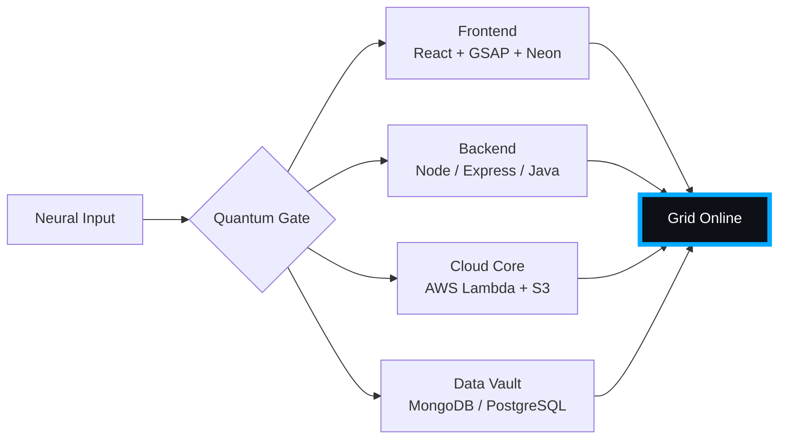

# 🌌 [ NEURAL CORE ACCESS: PENDEMVAMSI ]

<p align="center">
  
</p>

<div align="center">
  
  <br><small>Active Protocol: <strong style="color:#00AAFF">TRON LEGACY</strong> 🟦🟧</small>
</div>

## 🔵 NEURAL STATUS READOUT
```text
SUBJECT ID    →  PENDEMVAMSI
ENTITY CLASS  →  SHADOW MONARCH v5
NEURAL RANK   →  B-TIER
GRID SYNC     →  76/1206 QUANTUM PACKETS
─────── BIO-METRICS (TRON LEGACY) ───────
STRENGTH      116  ███████████████░░░░░░
AGILITY       106  ██████████████░░░░░░░
INTELLIGENCE  119  ███████████████░░░░░░
VITALITY       99  █████████████░░░░░░░░
```

> **NEURAL BURST ACQUIRED:** +147 QUANTUM PACKETS (ASCENSION ×1)
> **SYSTEM MESSAGE:** GRID OVERLOAD IMMINENT — PREPARE FOR ASCENSION

---

## 🌀 GRID ARCHITECTURE (HOLOGRAPHIC RENDER)



---

## 📡 ACADEMIC NODES – CONQUERED
- [x] B.Tech Neural Engineering (2020–2024) – St. Ann’s Grid
- [x] Intermediate Quantum Core (2018–2020) – Sri Medhavi
- [x] SSC Primary Link (2017–2018) – Sri Geethanjali

---

## ⚡ SKILL NEURAL MATRIX

<details open>
<summary>🔌 ACTIVE NEURAL LINKS</summary>

| Node               | Tier | Integrity Bar                | Status      |
|--------------------|------|------------------------------|-------------|
| Java Core          | S    | ████████████████████ 100%   | OVERCLOCKED |
| Node.js Grid       | S    | ████████████████████ 100%   | OVERCLOCKED |
| React Holo-UI      | A+   | █████████████████░░░ 92%    | ONLINE      |
| AWS Quantum Relay  | S    | ████████████████████ 100%   | SOVEREIGN   |
| Python AI Kernel   | A    | ████████████████░░░░ 85%    | CHARGING    |
| DSA Void Algorithm | A    | █████████████████░░░ 90%    | ACTIVE      |

</details>

---

## 🏅 NEURAL ACHIEVEMENT TOKENS

<p align="center">
  
  
  
  
</p>

---

## 👾 SHADOW ENTITIES – SUMMONED

<p align="center">
  
  <br><strong style="color:#00AAFF">ARISE.</strong>
</p>

| Entity | Designation   | Class            | Source Node                     |
|--------|---------------|------------------|---------------------------------|
| SH-01  | Igris         | Void Commander   | AI Financial Oracle             |
| SH-02  | Beru          | Swarm Overlord   | WebRTC Quantum Stream           |
| SH-03  | Kaisel        | Void Wyrm        | Geolocation Shadow Relay        |
| SH-04  | Tusk          | Arcane Construct | Global Pandemic Sentinel        |
| SH-05  | Iron          | Armored Bastion  | React Crypto Fortress           |

---

## 📡 GRID ANALYTICS (LIVE FEED)

<p align="center">
  
  <br>
  
  
</p>

---

## 🖥️ CORRUPTED MAINFRAME LOG (401 ENTRIES)

<details>
<summary>OPEN TERMINAL FEED – PROTOCOL: TRON LEGACY</summary>

> [0x698E62B9] 🟦🟧 **TRON LEGACY PROTOCOL** #0 | NEURAL LINK STABILIZED | [TRANSMISSION SUCCESS]
> [0xF8F2EF60] 🟦🟧 **TRON LEGACY PROTOCOL** #1 | NEURAL LINK STABILIZED | [TRANSMISSION SUCCESS]
> [0xBC0F80D0] 🟦🟧 **TRON LEGACY PROTOCOL** #2 | NEURAL LINK STABILIZED | [TRANSMISSION SUCCESS]
> [0xF773CDFE] 🟦🟧 **TRON LEGACY PROTOCOL** #3 | NEURAL LINK STABILIZED | [TRANSMISSION SUCCESS]
> [0x19ECD281] 🟦🟧 **TRON LEGACY PROTOCOL** #4 | NEURAL LINK STABILIZED | [TRANSMISSION SUCCESS]
> [0x43656732] 🟦🟧 **TRON LEGACY PROTOCOL** #5 | NEURAL LINK STABILIZED | [TRANSMISSION SUCCESS]
> [0xDB045BBA] 🟦🟧 **TRON LEGACY PROTOCOL** #6 | NEURAL LINK STABILIZED | [TRANSMISSION SUCCESS]
> [0xE9027971] 🟦🟧 **TRON LEGACY PROTOCOL** #7 | NEURAL LINK STABILIZED | [TRANSMISSION SUCCESS]
> [0x0856613C] 🟦🟧 **TRON LEGACY PROTOCOL** #8 | NEURAL LINK STABILIZED | [TRANSMISSION SUCCESS]
> [0xECF562B8] 🟦🟧 **TRON LEGACY PROTOCOL** #9 | NEURAL LINK STABILIZED | [TRANSMISSION SUCCESS]
> [0xF876BAF3] 🟦🟧 **TRON LEGACY PROTOCOL** #10 | NEURAL LINK STABILIZED | [TRANSMISSION SUCCESS]
> [0x379535B8] 🟦🟧 **TRON LEGACY PROTOCOL** #11 | NEURAL LINK STABILIZED | [TRANSMISSION SUCCESS]
> [0x2C0D6409] 🟦🟧 **TRON LEGACY PROTOCOL** #12 | NEURAL LINK STABILIZED | [TRANSMISSION SUCCESS]
> [0x3F59CD18] 🟦🟧 **TRON LEGACY PROTOCOL** #13 | NEURAL LINK  [GLITCH DETECTED] STABILIZED | [TRANSMISSION SUCCESS]
> [0x45957527] 🟦🟧 **TRON LEGACY PROTOCOL** #14 | NEURAL LINK STABILIZED | [TRANSMISSION SUCCESS]
> [0xF0D1A810] 🟦🟧 **TRON LEGACY PROTOCOL** #15 | NEURAL LINK STABILIZED | [TRANSMISSION SUCCESS]
> [0x0A6A9071] 🟦🟧 **TRON LEGACY PROTOCOL** #16 | NEURAL LINK STABILIZED | [TRANSMISSION SUCCESS]
> [0x472A3719] 🟦🟧 **TRON LEGACY PROTOCOL** #17 | NEURAL LINK STABILIZED | [TRANSMISSION SUCCESS]
> [0x9BCB7779] 🟦🟧 **TRON LEGACY PROTOCOL** #18 | NEURAL LINK STABILIZED | [TRANSMISSION SUCCESS]
> [0xB703CF67] 🟦🟧 **TRON LEGACY PROTOCOL** #19 | NEURAL LINK STABILIZED | [TRANSMISSION SUCCESS]
> [0x67708026] 🟦🟧 **TRON LEGACY PROTOCOL** #20 | NEURAL LINK STABILIZED | [TRANSMISSION SUCCESS]
> [0x4692514E] 🟦🟧 **TRON LEGACY PROTOCOL** #21 | NEURAL LINK STABILIZED | [TRANSMISSION SUCCESS]
> [0x83C88A01] 🟦🟧 **TRON LEGACY PROTOCOL** #22 | NEURAL LINK STABILIZED | [TRANSMISSION SUCCESS]
> [0x63C104DA] 🟦🟧 **TRON LEGACY PROTOCOL** #23 | NEURAL LINK STABILIZED | [TRANSMISSION SUCCESS]
> [0x860D9CC5] 🟦🟧 **TRON LEGACY PROTOCOL** #24 | NEURAL LINK STABILIZED | [TRANSMISSION SUCCESS]
> [0x00C58E99] 🟦🟧 **TRON LEGACY PROTOCOL** #25 | NEURAL LINK STABILIZED | [TRANSMISSION SUCCESS]
> [0xE08907B5] 🟦🟧 **TRON LEGACY PROTOCOL** #26 | NEURAL LINK STABILIZED | [TRANSMISSION SUCCESS]
> [0xEFDA36D2] 🟦🟧 **TRON LEGACY PROTOCOL** #27 | NEURAL LINK STABILIZED | [TRANSMISSION SUCCESS]
> [0x2F4228C5] 🟦🟧 **TRON LEGACY PROTOCOL** #28 | NEURAL LINK STABILIZED | [TRANSMISSION SUCCESS]
> [0x0CBB86D0] 🟦🟧 **TRON LEGACY PROTOCOL** #29 | NEURAL LINK STABILIZED | [TRANSMISSION SUCCESS]
> [0xF6FE2883] 🟦🟧 **TRON LEGACY PROTOCOL** #30 | NEURAL LINK STABILIZED | [TRANSMISSION SUCCESS]
> [0x8DB78ED4] 🟦🟧 **TRON LEGACY PROTOCOL** #31 | NEURAL LINK  [GLITCH DETECTED] STABILIZED | [TRANSMISSION SUCCESS]
> [0xF28E7716] 🟦🟧 **TRON LEGACY PROTOCOL** #32 | NEURAL LINK  [GLITCH DETECTED] STABILIZED | [TRANSMISSION SUCCESS]
> [0xF35631FE] 🟦🟧 **TRON LEGACY PROTOCOL** #33 | NEURAL LINK STABILIZED | [TRANSMISSION SUCCESS]
> [0x3A86CACA] 🟦🟧 **TRON LEGACY PROTOCOL** #34 | NEURAL LINK  [GLITCH DETECTED] STABILIZED | [TRANSMISSION SUCCESS]
> [0x7B47633F] 🟦🟧 **TRON LEGACY PROTOCOL** #35 | NEURAL LINK STABILIZED | [TRANSMISSION SUCCESS]
> [0xED438798] 🟦🟧 **TRON LEGACY PROTOCOL** #36 | NEURAL LINK  [GLITCH DETECTED] STABILIZED | [TRANSMISSION SUCCESS]
> [0x4B4B56B4] 🟦🟧 **TRON LEGACY PROTOCOL** #37 | NEURAL LINK  [GLITCH DETECTED] STABILIZED | [TRANSMISSION SUCCESS]
> [0x01891122] 🟦🟧 **TRON LEGACY PROTOCOL** #38 | NEURAL LINK STABILIZED | [TRANSMISSION SUCCESS]
> [0x834E49DB] 🟦🟧 **TRON LEGACY PROTOCOL** #39 | NEURAL LINK STABILIZED | [TRANSMISSION SUCCESS]
> [0x225A19F9] 🟦🟧 **TRON LEGACY PROTOCOL** #40 | NEURAL LINK STABILIZED | [TRANSMISSION SUCCESS]
> [0x0A71F4DE] 🟦🟧 **TRON LEGACY PROTOCOL** #41 | NEURAL LINK STABILIZED | [TRANSMISSION SUCCESS]
> [0x13D05B2C] 🟦🟧 **TRON LEGACY PROTOCOL** #42 | NEURAL LINK STABILIZED | [TRANSMISSION SUCCESS]
> [0xF969391F] 🟦🟧 **TRON LEGACY PROTOCOL** #43 | NEURAL LINK STABILIZED | [TRANSMISSION SUCCESS]
> [0x6D5E7BAC] 🟦🟧 **TRON LEGACY PROTOCOL** #44 | NEURAL LINK STABILIZED | [TRANSMISSION SUCCESS]
> [0x31832257] 🟦🟧 **TRON LEGACY PROTOCOL** #45 | NEURAL LINK STABILIZED | [TRANSMISSION SUCCESS]
> [0x6C9417DE] 🟦🟧 **TRON LEGACY PROTOCOL** #46 | NEURAL LINK STABILIZED | [TRANSMISSION SUCCESS]
> [0xE424608F] 🟦🟧 **TRON LEGACY PROTOCOL** #47 | NEURAL LINK  [GLITCH DETECTED] STABILIZED | [TRANSMISSION SUCCESS]
> [0x33C04C66] 🟦🟧 **TRON LEGACY PROTOCOL** #48 | NEURAL LINK STABILIZED | [TRANSMISSION SUCCESS]
> [0xD6925587] 🟦🟧 **TRON LEGACY PROTOCOL** #49 | NEURAL LINK STABILIZED | [TRANSMISSION SUCCESS]
> [0x4393B720] 🟦🟧 **TRON LEGACY PROTOCOL** #50 | NEURAL LINK STABILIZED | [TRANSMISSION SUCCESS]
> [0x6CAB348B] 🟦🟧 **TRON LEGACY PROTOCOL** #51 | NEURAL LINK  [GLITCH DETECTED] STABILIZED | [TRANSMISSION SUCCESS]
> [0xB0419A5E] 🟦🟧 **TRON LEGACY PROTOCOL** #52 | NEURAL LINK STABILIZED | [TRANSMISSION SUCCESS]
> [0x8D203890] 🟦🟧 **TRON LEGACY PROTOCOL** #53 | NEURAL LINK STABILIZED | [TRANSMISSION SUCCESS]
> [0xAC674489] 🟦🟧 **TRON LEGACY PROTOCOL** #54 | NEURAL LINK STABILIZED | [TRANSMISSION SUCCESS]
> [0x6C25456C] 🟦🟧 **TRON LEGACY PROTOCOL** #55 | NEURAL LINK STABILIZED | [TRANSMISSION SUCCESS]
> [0xA291B735] 🟦🟧 **TRON LEGACY PROTOCOL** #56 | NEURAL LINK STABILIZED | [TRANSMISSION SUCCESS]
> [0x69D63B76] 🟦🟧 **TRON LEGACY PROTOCOL** #57 | NEURAL LINK  [GLITCH DETECTED] STABILIZED | [TRANSMISSION SUCCESS]
> [0xBAFC4A4B] 🟦🟧 **TRON LEGACY PROTOCOL** #58 | NEURAL LINK STABILIZED | [TRANSMISSION SUCCESS]
> [0x48D7D59C] 🟦🟧 **TRON LEGACY PROTOCOL** #59 | NEURAL LINK STABILIZED | [TRANSMISSION SUCCESS]
> [0x52EFF7BF] 🟦🟧 **TRON LEGACY PROTOCOL** #60 | NEURAL LINK STABILIZED | [TRANSMISSION SUCCESS]
> [0x9E60CBF7] 🟦🟧 **TRON LEGACY PROTOCOL** #61 | NEURAL LINK STABILIZED | [TRANSMISSION SUCCESS]
> [0x25CE03A4] 🟦🟧 **TRON LEGACY PROTOCOL** #62 | NEURAL LINK STABILIZED | [TRANSMISSION SUCCESS]
> [0xED9B11A1] 🟦🟧 **TRON LEGACY PROTOCOL** #63 | NEURAL LINK STABILIZED | [TRANSMISSION SUCCESS]
> [0xCCAA6E5E] 🟦🟧 **TRON LEGACY PROTOCOL** #64 | NEURAL LINK STABILIZED | [TRANSMISSION SUCCESS]
> [0x7EFB7A2A] 🟦🟧 **TRON LEGACY PROTOCOL** #65 | NEURAL LINK STABILIZED | [TRANSMISSION SUCCESS]
> [0x7228F178] 🟦🟧 **TRON LEGACY PROTOCOL** #66 | NEURAL LINK  [GLITCH DETECTED] STABILIZED | [TRANSMISSION SUCCESS]
> [0x8E00322F] 🟦🟧 **TRON LEGACY PROTOCOL** #67 | NEURAL LINK STABILIZED | [TRANSMISSION SUCCESS]
> [0xBA5E5073] 🟦🟧 **TRON LEGACY PROTOCOL** #68 | NEURAL LINK STABILIZED | [TRANSMISSION SUCCESS]
> [0x5A35D11B] 🟦🟧 **TRON LEGACY PROTOCOL** #69 | NEURAL LINK STABILIZED | [TRANSMISSION SUCCESS]
> [0xD784204F] 🟦🟧 **TRON LEGACY PROTOCOL** #70 | NEURAL LINK STABILIZED | [TRANSMISSION SUCCESS]
> [0x0B0F2A26] 🟦🟧 **TRON LEGACY PROTOCOL** #71 | NEURAL LINK STABILIZED | [TRANSMISSION SUCCESS]
> [0x6205008F] 🟦🟧 **TRON LEGACY PROTOCOL** #72 | NEURAL LINK STABILIZED | [TRANSMISSION SUCCESS]
> [0x9F0701FA] 🟦🟧 **TRON LEGACY PROTOCOL** #73 | NEURAL LINK STABILIZED | [TRANSMISSION SUCCESS]
> [0x1DDBC1D1] 🟦🟧 **TRON LEGACY PROTOCOL** #74 | NEURAL LINK STABILIZED | [TRANSMISSION SUCCESS]
> [0xA4AB0C22] 🟦🟧 **TRON LEGACY PROTOCOL** #75 | NEURAL LINK STABILIZED | [TRANSMISSION SUCCESS]
> [0x32D3F3B2] 🟦🟧 **TRON LEGACY PROTOCOL** #76 | NEURAL LINK STABILIZED | [TRANSMISSION SUCCESS]
> [0xB7004C4B] 🟦🟧 **TRON LEGACY PROTOCOL** #77 | NEURAL LINK STABILIZED | [TRANSMISSION SUCCESS]
> [0xB56492BB] 🟦🟧 **TRON LEGACY PROTOCOL** #78 | NEURAL LINK STABILIZED | [TRANSMISSION SUCCESS]
> [0xBA219929] 🟦🟧 **TRON LEGACY PROTOCOL** #79 | NEURAL LINK  [GLITCH DETECTED] STABILIZED | [TRANSMISSION SUCCESS]
> [0x9389A199] 🟦🟧 **TRON LEGACY PROTOCOL** #80 | NEURAL LINK STABILIZED | [TRANSMISSION SUCCESS]
> [0x031A8DD8] 🟦🟧 **TRON LEGACY PROTOCOL** #81 | NEURAL LINK STABILIZED | [TRANSMISSION SUCCESS]
> [0xB3170C3A] 🟦🟧 **TRON LEGACY PROTOCOL** #82 | NEURAL LINK  [GLITCH DETECTED] STABILIZED | [TRANSMISSION SUCCESS]
> [0x01E3C081] 🟦🟧 **TRON LEGACY PROTOCOL** #83 | NEURAL LINK STABILIZED | [TRANSMISSION SUCCESS]
> [0xF5C87179] 🟦🟧 **TRON LEGACY PROTOCOL** #84 | NEURAL LINK STABILIZED | [TRANSMISSION SUCCESS]
> [0x3941863D] 🟦🟧 **TRON LEGACY PROTOCOL** #85 | NEURAL LINK STABILIZED | [TRANSMISSION SUCCESS]
> [0xE1479B53] 🟦🟧 **TRON LEGACY PROTOCOL** #86 | NEURAL LINK STABILIZED | [TRANSMISSION SUCCESS]
> [0x689F4F72] 🟦🟧 **TRON LEGACY PROTOCOL** #87 | NEURAL LINK STABILIZED | [TRANSMISSION SUCCESS]
> [0xBCBDAE27] 🟦🟧 **TRON LEGACY PROTOCOL** #88 | NEURAL LINK STABILIZED | [TRANSMISSION SUCCESS]
> [0x6B1F5A06] 🟦🟧 **TRON LEGACY PROTOCOL** #89 | NEURAL LINK  [GLITCH DETECTED] STABILIZED | [TRANSMISSION SUCCESS]
> [0x36D94554] 🟦🟧 **TRON LEGACY PROTOCOL** #90 | NEURAL LINK STABILIZED | [TRANSMISSION SUCCESS]
> [0x288C48D7] 🟦🟧 **TRON LEGACY PROTOCOL** #91 | NEURAL LINK STABILIZED | [TRANSMISSION SUCCESS]
> [0x5A3302D4] 🟦🟧 **TRON LEGACY PROTOCOL** #92 | NEURAL LINK STABILIZED | [TRANSMISSION SUCCESS]
> [0xAB79D4DD] 🟦🟧 **TRON LEGACY PROTOCOL** #93 | NEURAL LINK STABILIZED | [TRANSMISSION SUCCESS]
> [0xC48BF1F7] 🟦🟧 **TRON LEGACY PROTOCOL** #94 | NEURAL LINK STABILIZED | [TRANSMISSION SUCCESS]
> [0x7CBCC1C3] 🟦🟧 **TRON LEGACY PROTOCOL** #95 | NEURAL LINK STABILIZED | [TRANSMISSION SUCCESS]
> [0x1776C691] 🟦🟧 **TRON LEGACY PROTOCOL** #96 | NEURAL LINK STABILIZED | [TRANSMISSION SUCCESS]
> [0x8FBC93DF] 🟦🟧 **TRON LEGACY PROTOCOL** #97 | NEURAL LINK STABILIZED | [TRANSMISSION SUCCESS]
> [0x6CDDAD37] 🟦🟧 **TRON LEGACY PROTOCOL** #98 | NEURAL LINK  [GLITCH DETECTED] STABILIZED | [TRANSMISSION SUCCESS]
> [0x2EC33D33] 🟦🟧 **TRON LEGACY PROTOCOL** #99 | NEURAL LINK STABILIZED | [TRANSMISSION SUCCESS]
> [0x2DC4AD22] 🟦🟧 **TRON LEGACY PROTOCOL** #100 | NEURAL LINK STABILIZED | [TRANSMISSION SUCCESS]
> [0x2A53F98E] 🟦🟧 **TRON LEGACY PROTOCOL** #101 | NEURAL LINK  [GLITCH DETECTED] STABILIZED | [TRANSMISSION SUCCESS]
> [0x86F054E3] 🟦🟧 **TRON LEGACY PROTOCOL** #102 | NEURAL LINK STABILIZED | [TRANSMISSION SUCCESS]
> [0x77AD08B6] 🟦🟧 **TRON LEGACY PROTOCOL** #103 | NEURAL LINK STABILIZED | [TRANSMISSION SUCCESS]
> [0x6B10A96F] 🟦🟧 **TRON LEGACY PROTOCOL** #104 | NEURAL LINK STABILIZED | [TRANSMISSION SUCCESS]
> [0x53982477] 🟦🟧 **TRON LEGACY PROTOCOL** #105 | NEURAL LINK  [GLITCH DETECTED] STABILIZED | [TRANSMISSION SUCCESS]
> [0x8BE8B009] 🟦🟧 **TRON LEGACY PROTOCOL** #106 | NEURAL LINK  [GLITCH DETECTED] STABILIZED | [TRANSMISSION SUCCESS]
> [0x05EF68D6] 🟦🟧 **TRON LEGACY PROTOCOL** #107 | NEURAL LINK STABILIZED | [TRANSMISSION SUCCESS]
> [0xFB9DB115] 🟦🟧 **TRON LEGACY PROTOCOL** #108 | NEURAL LINK STABILIZED | [TRANSMISSION SUCCESS]
> [0xEF0FC90E] 🟦🟧 **TRON LEGACY PROTOCOL** #109 | NEURAL LINK  [GLITCH DETECTED] STABILIZED | [TRANSMISSION SUCCESS]
> [0xC9C8E9A6] 🟦🟧 **TRON LEGACY PROTOCOL** #110 | NEURAL LINK STABILIZED | [TRANSMISSION SUCCESS]
> [0x7E8D2AEC] 🟦🟧 **TRON LEGACY PROTOCOL** #111 | NEURAL LINK STABILIZED | [TRANSMISSION SUCCESS]
> [0x7BA71A1E] 🟦🟧 **TRON LEGACY PROTOCOL** #112 | NEURAL LINK STABILIZED | [TRANSMISSION SUCCESS]
> [0x8CF6425D] 🟦🟧 **TRON LEGACY PROTOCOL** #113 | NEURAL LINK  [GLITCH DETECTED] STABILIZED | [TRANSMISSION SUCCESS]
> [0xFBF5873B] 🟦🟧 **TRON LEGACY PROTOCOL** #114 | NEURAL LINK STABILIZED | [TRANSMISSION SUCCESS]
> [0x739A2E35] 🟦🟧 **TRON LEGACY PROTOCOL** #115 | NEURAL LINK STABILIZED | [TRANSMISSION SUCCESS]
> [0xC2A3A3A2] 🟦🟧 **TRON LEGACY PROTOCOL** #116 | NEURAL LINK STABILIZED | [TRANSMISSION SUCCESS]
> [0x1D0BCE0D] 🟦🟧 **TRON LEGACY PROTOCOL** #117 | NEURAL LINK STABILIZED | [TRANSMISSION SUCCESS]
> [0xFCD843E6] 🟦🟧 **TRON LEGACY PROTOCOL** #118 | NEURAL LINK STABILIZED | [TRANSMISSION SUCCESS]
> [0x3EFEAC13] 🟦🟧 **TRON LEGACY PROTOCOL** #119 | NEURAL LINK STABILIZED | [TRANSMISSION SUCCESS]
> [0xF6502DA6] 🟦🟧 **TRON LEGACY PROTOCOL** #120 | NEURAL LINK STABILIZED | [TRANSMISSION SUCCESS]
> [0x98FE6C0C] 🟦🟧 **TRON LEGACY PROTOCOL** #121 | NEURAL LINK STABILIZED | [TRANSMISSION SUCCESS]
> [0x61753070] 🟦🟧 **TRON LEGACY PROTOCOL** #122 | NEURAL LINK STABILIZED | [TRANSMISSION SUCCESS]
> [0xA6AAF55F] 🟦🟧 **TRON LEGACY PROTOCOL** #123 | NEURAL LINK STABILIZED | [TRANSMISSION SUCCESS]
> [0x1ACF8A68] 🟦🟧 **TRON LEGACY PROTOCOL** #124 | NEURAL LINK STABILIZED | [TRANSMISSION SUCCESS]
> [0x3480D721] 🟦🟧 **TRON LEGACY PROTOCOL** #125 | NEURAL LINK STABILIZED | [TRANSMISSION SUCCESS]
> [0xA15376AE] 🟦🟧 **TRON LEGACY PROTOCOL** #126 | NEURAL LINK STABILIZED | [TRANSMISSION SUCCESS]
> [0x2FF56161] 🟦🟧 **TRON LEGACY PROTOCOL** #127 | NEURAL LINK STABILIZED | [TRANSMISSION SUCCESS]
> [0x9B6A3E02] 🟦🟧 **TRON LEGACY PROTOCOL** #128 | NEURAL LINK STABILIZED | [TRANSMISSION SUCCESS]
> [0x59923562] 🟦🟧 **TRON LEGACY PROTOCOL** #129 | NEURAL LINK STABILIZED | [TRANSMISSION SUCCESS]
> [0x8E548E24] 🟦🟧 **TRON LEGACY PROTOCOL** #130 | NEURAL LINK STABILIZED | [TRANSMISSION SUCCESS]
> [0x7B9619B3] 🟦🟧 **TRON LEGACY PROTOCOL** #131 | NEURAL LINK STABILIZED | [TRANSMISSION SUCCESS]
> [0xD3EF263B] 🟦🟧 **TRON LEGACY PROTOCOL** #132 | NEURAL LINK STABILIZED | [TRANSMISSION SUCCESS]
> [0x352F5D56] 🟦🟧 **TRON LEGACY PROTOCOL** #133 | NEURAL LINK STABILIZED | [TRANSMISSION SUCCESS]
> [0x67F931D7] 🟦🟧 **TRON LEGACY PROTOCOL** #134 | NEURAL LINK STABILIZED | [TRANSMISSION SUCCESS]
> [0xD740D212] 🟦🟧 **TRON LEGACY PROTOCOL** #135 | NEURAL LINK STABILIZED | [TRANSMISSION SUCCESS]
> [0x3A3C5949] 🟦🟧 **TRON LEGACY PROTOCOL** #136 | NEURAL LINK STABILIZED | [TRANSMISSION SUCCESS]
> [0x07E1DC28] 🟦🟧 **TRON LEGACY PROTOCOL** #137 | NEURAL LINK STABILIZED | [TRANSMISSION SUCCESS]
> [0x1C65BE74] 🟦🟧 **TRON LEGACY PROTOCOL** #138 | NEURAL LINK  [GLITCH DETECTED] STABILIZED | [TRANSMISSION SUCCESS]
> [0x823862EB] 🟦🟧 **TRON LEGACY PROTOCOL** #139 | NEURAL LINK STABILIZED | [TRANSMISSION SUCCESS]
> [0xF5922091] 🟦🟧 **TRON LEGACY PROTOCOL** #140 | NEURAL LINK STABILIZED | [TRANSMISSION SUCCESS]
> [0xE3BFDD8C] 🟦🟧 **TRON LEGACY PROTOCOL** #141 | NEURAL LINK STABILIZED | [TRANSMISSION SUCCESS]
> [0xD79886E8] 🟦🟧 **TRON LEGACY PROTOCOL** #142 | NEURAL LINK STABILIZED | [TRANSMISSION SUCCESS]
> [0xC3271EF3] 🟦🟧 **TRON LEGACY PROTOCOL** #143 | NEURAL LINK STABILIZED | [TRANSMISSION SUCCESS]
> [0x9ADA4004] 🟦🟧 **TRON LEGACY PROTOCOL** #144 | NEURAL LINK STABILIZED | [TRANSMISSION SUCCESS]
> [0xB03D056A] 🟦🟧 **TRON LEGACY PROTOCOL** #145 | NEURAL LINK STABILIZED | [TRANSMISSION SUCCESS]
> [0x04955AE3] 🟦🟧 **TRON LEGACY PROTOCOL** #146 | NEURAL LINK  [GLITCH DETECTED] STABILIZED | [TRANSMISSION SUCCESS]
> [0xFFE54C4C] 🟦🟧 **TRON LEGACY PROTOCOL** #147 | NEURAL LINK STABILIZED | [TRANSMISSION SUCCESS]
> [0xA103F238] 🟦🟧 **TRON LEGACY PROTOCOL** #148 | NEURAL LINK STABILIZED | [TRANSMISSION SUCCESS]
> [0x07C03C41] 🟦🟧 **TRON LEGACY PROTOCOL** #149 | NEURAL LINK STABILIZED | [TRANSMISSION SUCCESS]
> [0x324E8EB9] 🟦🟧 **TRON LEGACY PROTOCOL** #150 | NEURAL LINK STABILIZED | [TRANSMISSION SUCCESS]
> [0x24D5BF65] 🟦🟧 **TRON LEGACY PROTOCOL** #151 | NEURAL LINK STABILIZED | [TRANSMISSION SUCCESS]
> [0xB26AF6B2] 🟦🟧 **TRON LEGACY PROTOCOL** #152 | NEURAL LINK STABILIZED | [TRANSMISSION SUCCESS]
> [0x856DB820] 🟦🟧 **TRON LEGACY PROTOCOL** #153 | NEURAL LINK STABILIZED | [TRANSMISSION SUCCESS]
> [0x84AD46D2] 🟦🟧 **TRON LEGACY PROTOCOL** #154 | NEURAL LINK STABILIZED | [TRANSMISSION SUCCESS]
> [0x5D42C7D6] 🟦🟧 **TRON LEGACY PROTOCOL** #155 | NEURAL LINK STABILIZED | [TRANSMISSION SUCCESS]
> [0x9A970012] 🟦🟧 **TRON LEGACY PROTOCOL** #156 | NEURAL LINK STABILIZED | [TRANSMISSION SUCCESS]
> [0xF624A67F] 🟦🟧 **TRON LEGACY PROTOCOL** #157 | NEURAL LINK  [GLITCH DETECTED] STABILIZED | [TRANSMISSION SUCCESS]
> [0x6AFBB8FA] 🟦🟧 **TRON LEGACY PROTOCOL** #158 | NEURAL LINK STABILIZED | [TRANSMISSION SUCCESS]
> [0x8BDCA6ED] 🟦🟧 **TRON LEGACY PROTOCOL** #159 | NEURAL LINK STABILIZED | [TRANSMISSION SUCCESS]
> [0xC6DF2DB8] 🟦🟧 **TRON LEGACY PROTOCOL** #160 | NEURAL LINK STABILIZED | [TRANSMISSION SUCCESS]
> [0x00ABFD21] 🟦🟧 **TRON LEGACY PROTOCOL** #161 | NEURAL LINK STABILIZED | [TRANSMISSION SUCCESS]
> [0x510D9010] 🟦🟧 **TRON LEGACY PROTOCOL** #162 | NEURAL LINK STABILIZED | [TRANSMISSION SUCCESS]
> [0xEA821E33] 🟦🟧 **TRON LEGACY PROTOCOL** #163 | NEURAL LINK STABILIZED | [TRANSMISSION SUCCESS]
> [0x9ABC2D72] 🟦🟧 **TRON LEGACY PROTOCOL** #164 | NEURAL LINK STABILIZED | [TRANSMISSION SUCCESS]
> [0x33438386] 🟦🟧 **TRON LEGACY PROTOCOL** #165 | NEURAL LINK STABILIZED | [TRANSMISSION SUCCESS]
> [0x57552760] 🟦🟧 **TRON LEGACY PROTOCOL** #166 | NEURAL LINK STABILIZED | [TRANSMISSION SUCCESS]
> [0x690CAFE2] 🟦🟧 **TRON LEGACY PROTOCOL** #167 | NEURAL LINK STABILIZED | [TRANSMISSION SUCCESS]
> [0x921EF7A2] 🟦🟧 **TRON LEGACY PROTOCOL** #168 | NEURAL LINK STABILIZED | [TRANSMISSION SUCCESS]
> [0x8E4D22E8] 🟦🟧 **TRON LEGACY PROTOCOL** #169 | NEURAL LINK STABILIZED | [TRANSMISSION SUCCESS]
> [0xE1B27BDD] 🟦🟧 **TRON LEGACY PROTOCOL** #170 | NEURAL LINK STABILIZED | [TRANSMISSION SUCCESS]
> [0xA9E54B96] 🟦🟧 **TRON LEGACY PROTOCOL** #171 | NEURAL LINK STABILIZED | [TRANSMISSION SUCCESS]
> [0xF7BD9200] 🟦🟧 **TRON LEGACY PROTOCOL** #172 | NEURAL LINK  [GLITCH DETECTED] STABILIZED | [TRANSMISSION SUCCESS]
> [0x62CED6D4] 🟦🟧 **TRON LEGACY PROTOCOL** #173 | NEURAL LINK STABILIZED | [TRANSMISSION SUCCESS]
> [0x0037E188] 🟦🟧 **TRON LEGACY PROTOCOL** #174 | NEURAL LINK STABILIZED | [TRANSMISSION SUCCESS]
> [0x17761E6D] 🟦🟧 **TRON LEGACY PROTOCOL** #175 | NEURAL LINK STABILIZED | [TRANSMISSION SUCCESS]
> [0xCF529D42] 🟦🟧 **TRON LEGACY PROTOCOL** #176 | NEURAL LINK STABILIZED | [TRANSMISSION SUCCESS]
> [0xA9769766] 🟦🟧 **TRON LEGACY PROTOCOL** #177 | NEURAL LINK STABILIZED | [TRANSMISSION SUCCESS]
> [0xEA3FBAA5] 🟦🟧 **TRON LEGACY PROTOCOL** #178 | NEURAL LINK STABILIZED | [TRANSMISSION SUCCESS]
> [0xCAEB7AE8] 🟦🟧 **TRON LEGACY PROTOCOL** #179 | NEURAL LINK  [GLITCH DETECTED] STABILIZED | [TRANSMISSION SUCCESS]
> [0xA8CFB11F] 🟦🟧 **TRON LEGACY PROTOCOL** #180 | NEURAL LINK STABILIZED | [TRANSMISSION SUCCESS]
> [0x14D1DD94] 🟦🟧 **TRON LEGACY PROTOCOL** #181 | NEURAL LINK STABILIZED | [TRANSMISSION SUCCESS]
> [0xCE456882] 🟦🟧 **TRON LEGACY PROTOCOL** #182 | NEURAL LINK STABILIZED | [TRANSMISSION SUCCESS]
> [0x1BC541D1] 🟦🟧 **TRON LEGACY PROTOCOL** #183 | NEURAL LINK STABILIZED | [TRANSMISSION SUCCESS]
> [0x0658806C] 🟦🟧 **TRON LEGACY PROTOCOL** #184 | NEURAL LINK STABILIZED | [TRANSMISSION SUCCESS]
> [0xD397E966] 🟦🟧 **TRON LEGACY PROTOCOL** #185 | NEURAL LINK STABILIZED | [TRANSMISSION SUCCESS]
> [0x941DCDCC] 🟦🟧 **TRON LEGACY PROTOCOL** #186 | NEURAL LINK STABILIZED | [TRANSMISSION SUCCESS]
> [0xCC35793C] 🟦🟧 **TRON LEGACY PROTOCOL** #187 | NEURAL LINK STABILIZED | [TRANSMISSION SUCCESS]
> [0xD65B5880] 🟦🟧 **TRON LEGACY PROTOCOL** #188 | NEURAL LINK STABILIZED | [TRANSMISSION SUCCESS]
> [0x856EBE1D] 🟦🟧 **TRON LEGACY PROTOCOL** #189 | NEURAL LINK STABILIZED | [TRANSMISSION SUCCESS]
> [0x959B1E8B] 🟦🟧 **TRON LEGACY PROTOCOL** #190 | NEURAL LINK  [GLITCH DETECTED] STABILIZED | [TRANSMISSION SUCCESS]
> [0x899D0BDA] 🟦🟧 **TRON LEGACY PROTOCOL** #191 | NEURAL LINK STABILIZED | [TRANSMISSION SUCCESS]
> [0xA2374C72] 🟦🟧 **TRON LEGACY PROTOCOL** #192 | NEURAL LINK STABILIZED | [TRANSMISSION SUCCESS]
> [0xE25703BC] 🟦🟧 **TRON LEGACY PROTOCOL** #193 | NEURAL LINK STABILIZED | [TRANSMISSION SUCCESS]
> [0x0089D264] 🟦🟧 **TRON LEGACY PROTOCOL** #194 | NEURAL LINK STABILIZED | [TRANSMISSION SUCCESS]
> [0x801A0D5C] 🟦🟧 **TRON LEGACY PROTOCOL** #195 | NEURAL LINK STABILIZED | [TRANSMISSION SUCCESS]
> [0xC95A09B2] 🟦🟧 **TRON LEGACY PROTOCOL** #196 | NEURAL LINK STABILIZED | [TRANSMISSION SUCCESS]
> [0xAA4D97A2] 🟦🟧 **TRON LEGACY PROTOCOL** #197 | NEURAL LINK  [GLITCH DETECTED] STABILIZED | [TRANSMISSION SUCCESS]
> [0x45CCD431] 🟦🟧 **TRON LEGACY PROTOCOL** #198 | NEURAL LINK STABILIZED | [TRANSMISSION SUCCESS]
> [0x903C8BA9] 🟦🟧 **TRON LEGACY PROTOCOL** #199 | NEURAL LINK STABILIZED | [TRANSMISSION SUCCESS]
> [0x19DDD9F9] 🟦🟧 **TRON LEGACY PROTOCOL** #200 | NEURAL LINK STABILIZED | [TRANSMISSION SUCCESS]
> [0x349F14E7] 🟦🟧 **TRON LEGACY PROTOCOL** #201 | NEURAL LINK STABILIZED | [TRANSMISSION SUCCESS]
> [0x43BD129C] 🟦🟧 **TRON LEGACY PROTOCOL** #202 | NEURAL LINK STABILIZED | [TRANSMISSION SUCCESS]
> [0x19E47DE6] 🟦🟧 **TRON LEGACY PROTOCOL** #203 | NEURAL LINK STABILIZED | [TRANSMISSION SUCCESS]
> [0xE525C9A0] 🟦🟧 **TRON LEGACY PROTOCOL** #204 | NEURAL LINK  [GLITCH DETECTED] STABILIZED | [TRANSMISSION SUCCESS]
> [0x3C43B84A] 🟦🟧 **TRON LEGACY PROTOCOL** #205 | NEURAL LINK STABILIZED | [TRANSMISSION SUCCESS]
> [0xB7BE3C80] 🟦🟧 **TRON LEGACY PROTOCOL** #206 | NEURAL LINK STABILIZED | [TRANSMISSION SUCCESS]
> [0x4D43FCEE] 🟦🟧 **TRON LEGACY PROTOCOL** #207 | NEURAL LINK STABILIZED | [TRANSMISSION SUCCESS]
> [0xFF612049] 🟦🟧 **TRON LEGACY PROTOCOL** #208 | NEURAL LINK STABILIZED | [TRANSMISSION SUCCESS]
> [0x1CB077EB] 🟦🟧 **TRON LEGACY PROTOCOL** #209 | NEURAL LINK STABILIZED | [TRANSMISSION SUCCESS]
> [0x0F2E0B20] 🟦🟧 **TRON LEGACY PROTOCOL** #210 | NEURAL LINK STABILIZED | [TRANSMISSION SUCCESS]
> [0x30E10408] 🟦🟧 **TRON LEGACY PROTOCOL** #211 | NEURAL LINK STABILIZED | [TRANSMISSION SUCCESS]
> [0x595C6421] 🟦🟧 **TRON LEGACY PROTOCOL** #212 | NEURAL LINK STABILIZED | [TRANSMISSION SUCCESS]
> [0x15566A2C] 🟦🟧 **TRON LEGACY PROTOCOL** #213 | NEURAL LINK STABILIZED | [TRANSMISSION SUCCESS]
> [0x02B80252] 🟦🟧 **TRON LEGACY PROTOCOL** #214 | NEURAL LINK STABILIZED | [TRANSMISSION SUCCESS]
> [0x814BC5BC] 🟦🟧 **TRON LEGACY PROTOCOL** #215 | NEURAL LINK STABILIZED | [TRANSMISSION SUCCESS]
> [0x8F2B5A34] 🟦🟧 **TRON LEGACY PROTOCOL** #216 | NEURAL LINK STABILIZED | [TRANSMISSION SUCCESS]
> [0x090D3119] 🟦🟧 **TRON LEGACY PROTOCOL** #217 | NEURAL LINK STABILIZED | [TRANSMISSION SUCCESS]
> [0x14BEEEA3] 🟦🟧 **TRON LEGACY PROTOCOL** #218 | NEURAL LINK STABILIZED | [TRANSMISSION SUCCESS]
> [0xF8BF10AD] 🟦🟧 **TRON LEGACY PROTOCOL** #219 | NEURAL LINK STABILIZED | [TRANSMISSION SUCCESS]
> [0xEC413B27] 🟦🟧 **TRON LEGACY PROTOCOL** #220 | NEURAL LINK STABILIZED | [TRANSMISSION SUCCESS]
> [0x16D7507B] 🟦🟧 **TRON LEGACY PROTOCOL** #221 | NEURAL LINK STABILIZED | [TRANSMISSION SUCCESS]
> [0xEAA27BCD] 🟦🟧 **TRON LEGACY PROTOCOL** #222 | NEURAL LINK STABILIZED | [TRANSMISSION SUCCESS]
> [0xD10BF1EF] 🟦🟧 **TRON LEGACY PROTOCOL** #223 | NEURAL LINK STABILIZED | [TRANSMISSION SUCCESS]
> [0x19E632C8] 🟦🟧 **TRON LEGACY PROTOCOL** #224 | NEURAL LINK STABILIZED | [TRANSMISSION SUCCESS]
> [0x0EE5FC0B] 🟦🟧 **TRON LEGACY PROTOCOL** #225 | NEURAL LINK STABILIZED | [TRANSMISSION SUCCESS]
> [0xBC916CE6] 🟦🟧 **TRON LEGACY PROTOCOL** #226 | NEURAL LINK STABILIZED | [TRANSMISSION SUCCESS]
> [0xA8C9194D] 🟦🟧 **TRON LEGACY PROTOCOL** #227 | NEURAL LINK STABILIZED | [TRANSMISSION SUCCESS]
> [0xE0031C15] 🟦🟧 **TRON LEGACY PROTOCOL** #228 | NEURAL LINK STABILIZED | [TRANSMISSION SUCCESS]
> [0xBF6577CD] 🟦🟧 **TRON LEGACY PROTOCOL** #229 | NEURAL LINK  [GLITCH DETECTED] STABILIZED | [TRANSMISSION SUCCESS]
> [0xC8EFDD0A] 🟦🟧 **TRON LEGACY PROTOCOL** #230 | NEURAL LINK STABILIZED | [TRANSMISSION SUCCESS]
> [0x6D523409] 🟦🟧 **TRON LEGACY PROTOCOL** #231 | NEURAL LINK STABILIZED | [TRANSMISSION SUCCESS]
> [0xA740C328] 🟦🟧 **TRON LEGACY PROTOCOL** #232 | NEURAL LINK STABILIZED | [TRANSMISSION SUCCESS]
> [0xC8785F95] 🟦🟧 **TRON LEGACY PROTOCOL** #233 | NEURAL LINK STABILIZED | [TRANSMISSION SUCCESS]
> [0xDD67CAD6] 🟦🟧 **TRON LEGACY PROTOCOL** #234 | NEURAL LINK STABILIZED | [TRANSMISSION SUCCESS]
> [0xF5DDCD29] 🟦🟧 **TRON LEGACY PROTOCOL** #235 | NEURAL LINK  [GLITCH DETECTED] STABILIZED | [TRANSMISSION SUCCESS]
> [0x581F3CBD] 🟦🟧 **TRON LEGACY PROTOCOL** #236 | NEURAL LINK STABILIZED | [TRANSMISSION SUCCESS]
> [0x87A04119] 🟦🟧 **TRON LEGACY PROTOCOL** #237 | NEURAL LINK  [GLITCH DETECTED] STABILIZED | [TRANSMISSION SUCCESS]
> [0x70105A20] 🟦🟧 **TRON LEGACY PROTOCOL** #238 | NEURAL LINK STABILIZED | [TRANSMISSION SUCCESS]
> [0x141ED609] 🟦🟧 **TRON LEGACY PROTOCOL** #239 | NEURAL LINK STABILIZED | [TRANSMISSION SUCCESS]
> [0x9A830308] 🟦🟧 **TRON LEGACY PROTOCOL** #240 | NEURAL LINK STABILIZED | [TRANSMISSION SUCCESS]
> [0xD7E209BB] 🟦🟧 **TRON LEGACY PROTOCOL** #241 | NEURAL LINK STABILIZED | [TRANSMISSION SUCCESS]
> [0x79ED9C3F] 🟦🟧 **TRON LEGACY PROTOCOL** #242 | NEURAL LINK STABILIZED | [TRANSMISSION SUCCESS]
> [0xF255B89C] 🟦🟧 **TRON LEGACY PROTOCOL** #243 | NEURAL LINK STABILIZED | [TRANSMISSION SUCCESS]
> [0x78161C6A] 🟦🟧 **TRON LEGACY PROTOCOL** #244 | NEURAL LINK STABILIZED | [TRANSMISSION SUCCESS]
> [0x8A1BEAE9] 🟦🟧 **TRON LEGACY PROTOCOL** #245 | NEURAL LINK STABILIZED | [TRANSMISSION SUCCESS]
> [0x93B7B885] 🟦🟧 **TRON LEGACY PROTOCOL** #246 | NEURAL LINK STABILIZED | [TRANSMISSION SUCCESS]
> [0x0782E949] 🟦🟧 **TRON LEGACY PROTOCOL** #247 | NEURAL LINK STABILIZED | [TRANSMISSION SUCCESS]
> [0x1FEC59B1] 🟦🟧 **TRON LEGACY PROTOCOL** #248 | NEURAL LINK STABILIZED | [TRANSMISSION SUCCESS]
> [0xA354D5C5] 🟦🟧 **TRON LEGACY PROTOCOL** #249 | NEURAL LINK  [GLITCH DETECTED] STABILIZED | [TRANSMISSION SUCCESS]
> [0xD498C90F] 🟦🟧 **TRON LEGACY PROTOCOL** #250 | NEURAL LINK STABILIZED | [TRANSMISSION SUCCESS]
> [0x74081264] 🟦🟧 **TRON LEGACY PROTOCOL** #251 | NEURAL LINK STABILIZED | [TRANSMISSION SUCCESS]
> [0xC119BB0D] 🟦🟧 **TRON LEGACY PROTOCOL** #252 | NEURAL LINK STABILIZED | [TRANSMISSION SUCCESS]
> [0xB70ADA50] 🟦🟧 **TRON LEGACY PROTOCOL** #253 | NEURAL LINK  [GLITCH DETECTED] STABILIZED | [TRANSMISSION SUCCESS]
> [0x051DFC9C] 🟦🟧 **TRON LEGACY PROTOCOL** #254 | NEURAL LINK STABILIZED | [TRANSMISSION SUCCESS]
> [0x54E1BB83] 🟦🟧 **TRON LEGACY PROTOCOL** #255 | NEURAL LINK  [GLITCH DETECTED] STABILIZED | [TRANSMISSION SUCCESS]
> [0xD29B9EEB] 🟦🟧 **TRON LEGACY PROTOCOL** #256 | NEURAL LINK STABILIZED | [TRANSMISSION SUCCESS]
> [0xFC05F6B5] 🟦🟧 **TRON LEGACY PROTOCOL** #257 | NEURAL LINK STABILIZED | [TRANSMISSION SUCCESS]
> [0xFD29D85C] 🟦🟧 **TRON LEGACY PROTOCOL** #258 | NEURAL LINK STABILIZED | [TRANSMISSION SUCCESS]
> [0xAE1CEC8B] 🟦🟧 **TRON LEGACY PROTOCOL** #259 | NEURAL LINK STABILIZED | [TRANSMISSION SUCCESS]
> [0xCE59DEC3] 🟦🟧 **TRON LEGACY PROTOCOL** #260 | NEURAL LINK STABILIZED | [TRANSMISSION SUCCESS]
> [0xA976FEE6] 🟦🟧 **TRON LEGACY PROTOCOL** #261 | NEURAL LINK STABILIZED | [TRANSMISSION SUCCESS]
> [0xCFC9E8E0] 🟦🟧 **TRON LEGACY PROTOCOL** #262 | NEURAL LINK STABILIZED | [TRANSMISSION SUCCESS]
> [0x64AA4CF4] 🟦🟧 **TRON LEGACY PROTOCOL** #263 | NEURAL LINK  [GLITCH DETECTED] STABILIZED | [TRANSMISSION SUCCESS]
> [0x878A7672] 🟦🟧 **TRON LEGACY PROTOCOL** #264 | NEURAL LINK STABILIZED | [TRANSMISSION SUCCESS]
> [0xBCCFB970] 🟦🟧 **TRON LEGACY PROTOCOL** #265 | NEURAL LINK STABILIZED | [TRANSMISSION SUCCESS]
> [0x3ABA33EE] 🟦🟧 **TRON LEGACY PROTOCOL** #266 | NEURAL LINK STABILIZED | [TRANSMISSION SUCCESS]
> [0xD861F59D] 🟦🟧 **TRON LEGACY PROTOCOL** #267 | NEURAL LINK STABILIZED | [TRANSMISSION SUCCESS]
> [0x29706C73] 🟦🟧 **TRON LEGACY PROTOCOL** #268 | NEURAL LINK STABILIZED | [TRANSMISSION SUCCESS]
> [0xACB0C81B] 🟦🟧 **TRON LEGACY PROTOCOL** #269 | NEURAL LINK STABILIZED | [TRANSMISSION SUCCESS]
> [0x453CF490] 🟦🟧 **TRON LEGACY PROTOCOL** #270 | NEURAL LINK STABILIZED | [TRANSMISSION SUCCESS]
> [0x9AB208D6] 🟦🟧 **TRON LEGACY PROTOCOL** #271 | NEURAL LINK STABILIZED | [TRANSMISSION SUCCESS]
> [0xC27C9FAF] 🟦🟧 **TRON LEGACY PROTOCOL** #272 | NEURAL LINK STABILIZED | [TRANSMISSION SUCCESS]
> [0x66325F99] 🟦🟧 **TRON LEGACY PROTOCOL** #273 | NEURAL LINK  [GLITCH DETECTED] STABILIZED | [TRANSMISSION SUCCESS]
> [0x2E247340] 🟦🟧 **TRON LEGACY PROTOCOL** #274 | NEURAL LINK STABILIZED | [TRANSMISSION SUCCESS]
> [0x8BD06852] 🟦🟧 **TRON LEGACY PROTOCOL** #275 | NEURAL LINK STABILIZED | [TRANSMISSION SUCCESS]
> [0xA099A63D] 🟦🟧 **TRON LEGACY PROTOCOL** #276 | NEURAL LINK STABILIZED | [TRANSMISSION SUCCESS]
> [0x8DA1BDC7] 🟦🟧 **TRON LEGACY PROTOCOL** #277 | NEURAL LINK STABILIZED | [TRANSMISSION SUCCESS]
> [0x7074A270] 🟦🟧 **TRON LEGACY PROTOCOL** #278 | NEURAL LINK  [GLITCH DETECTED] STABILIZED | [TRANSMISSION SUCCESS]
> [0x87676208] 🟦🟧 **TRON LEGACY PROTOCOL** #279 | NEURAL LINK STABILIZED | [TRANSMISSION SUCCESS]
> [0xAAB3BA78] 🟦🟧 **TRON LEGACY PROTOCOL** #280 | NEURAL LINK STABILIZED | [TRANSMISSION SUCCESS]
> [0x9CAB01FE] 🟦🟧 **TRON LEGACY PROTOCOL** #281 | NEURAL LINK STABILIZED | [TRANSMISSION SUCCESS]
> [0xBE575743] 🟦🟧 **TRON LEGACY PROTOCOL** #282 | NEURAL LINK STABILIZED | [TRANSMISSION SUCCESS]
> [0x1C6EE816] 🟦🟧 **TRON LEGACY PROTOCOL** #283 | NEURAL LINK STABILIZED | [TRANSMISSION SUCCESS]
> [0x0597249C] 🟦🟧 **TRON LEGACY PROTOCOL** #284 | NEURAL LINK STABILIZED | [TRANSMISSION SUCCESS]
> [0x10464CCB] 🟦🟧 **TRON LEGACY PROTOCOL** #285 | NEURAL LINK STABILIZED | [TRANSMISSION SUCCESS]
> [0x6DB409E9] 🟦🟧 **TRON LEGACY PROTOCOL** #286 | NEURAL LINK STABILIZED | [TRANSMISSION SUCCESS]
> [0xE3F7412D] 🟦🟧 **TRON LEGACY PROTOCOL** #287 | NEURAL LINK STABILIZED | [TRANSMISSION SUCCESS]
> [0x028946CC] 🟦🟧 **TRON LEGACY PROTOCOL** #288 | NEURAL LINK STABILIZED | [TRANSMISSION SUCCESS]
> [0xEA9025C2] 🟦🟧 **TRON LEGACY PROTOCOL** #289 | NEURAL LINK  [GLITCH DETECTED] STABILIZED | [TRANSMISSION SUCCESS]
> [0x009CF00C] 🟦🟧 **TRON LEGACY PROTOCOL** #290 | NEURAL LINK STABILIZED | [TRANSMISSION SUCCESS]
> [0x007C1B06] 🟦🟧 **TRON LEGACY PROTOCOL** #291 | NEURAL LINK  [GLITCH DETECTED] STABILIZED | [TRANSMISSION SUCCESS]
> [0x216D3BAF] 🟦🟧 **TRON LEGACY PROTOCOL** #292 | NEURAL LINK STABILIZED | [TRANSMISSION SUCCESS]
> [0x9A4E4B8F] 🟦🟧 **TRON LEGACY PROTOCOL** #293 | NEURAL LINK  [GLITCH DETECTED] STABILIZED | [TRANSMISSION SUCCESS]
> [0x5FE1B034] 🟦🟧 **TRON LEGACY PROTOCOL** #294 | NEURAL LINK  [GLITCH DETECTED] STABILIZED | [TRANSMISSION SUCCESS]
> [0xF2147886] 🟦🟧 **TRON LEGACY PROTOCOL** #295 | NEURAL LINK STABILIZED | [TRANSMISSION SUCCESS]
> [0x7FD645C6] 🟦🟧 **TRON LEGACY PROTOCOL** #296 | NEURAL LINK STABILIZED | [TRANSMISSION SUCCESS]
> [0x6F436294] 🟦🟧 **TRON LEGACY PROTOCOL** #297 | NEURAL LINK  [GLITCH DETECTED] STABILIZED | [TRANSMISSION SUCCESS]
> [0x2DABCB32] 🟦🟧 **TRON LEGACY PROTOCOL** #298 | NEURAL LINK STABILIZED | [TRANSMISSION SUCCESS]
> [0xAFB86BF2] 🟦🟧 **TRON LEGACY PROTOCOL** #299 | NEURAL LINK STABILIZED | [TRANSMISSION SUCCESS]
> [0x2D71FDCE] 🟦🟧 **TRON LEGACY PROTOCOL** #300 | NEURAL LINK STABILIZED | [TRANSMISSION SUCCESS]
> [0x4B434A58] 🟦🟧 **TRON LEGACY PROTOCOL** #301 | NEURAL LINK STABILIZED | [TRANSMISSION SUCCESS]
> [0xC48C9C1B] 🟦🟧 **TRON LEGACY PROTOCOL** #302 | NEURAL LINK STABILIZED | [TRANSMISSION SUCCESS]
> [0x71966E08] 🟦🟧 **TRON LEGACY PROTOCOL** #303 | NEURAL LINK STABILIZED | [TRANSMISSION SUCCESS]
> [0x8FC90AC2] 🟦🟧 **TRON LEGACY PROTOCOL** #304 | NEURAL LINK STABILIZED | [TRANSMISSION SUCCESS]
> [0xA4B7531A] 🟦🟧 **TRON LEGACY PROTOCOL** #305 | NEURAL LINK STABILIZED | [TRANSMISSION SUCCESS]
> [0x4C9C9138] 🟦🟧 **TRON LEGACY PROTOCOL** #306 | NEURAL LINK STABILIZED | [TRANSMISSION SUCCESS]
> [0xC8CEED6C] 🟦🟧 **TRON LEGACY PROTOCOL** #307 | NEURAL LINK STABILIZED | [TRANSMISSION SUCCESS]
> [0x9FE3D043] 🟦🟧 **TRON LEGACY PROTOCOL** #308 | NEURAL LINK STABILIZED | [TRANSMISSION SUCCESS]
> [0x637D60B8] 🟦🟧 **TRON LEGACY PROTOCOL** #309 | NEURAL LINK STABILIZED | [TRANSMISSION SUCCESS]
> [0x3693E799] 🟦🟧 **TRON LEGACY PROTOCOL** #310 | NEURAL LINK STABILIZED | [TRANSMISSION SUCCESS]
> [0x1F85C8A6] 🟦🟧 **TRON LEGACY PROTOCOL** #311 | NEURAL LINK STABILIZED | [TRANSMISSION SUCCESS]
> [0x7BA88246] 🟦🟧 **TRON LEGACY PROTOCOL** #312 | NEURAL LINK STABILIZED | [TRANSMISSION SUCCESS]
> [0x4AF5632C] 🟦🟧 **TRON LEGACY PROTOCOL** #313 | NEURAL LINK  [GLITCH DETECTED] STABILIZED | [TRANSMISSION SUCCESS]
> [0x50A957FC] 🟦🟧 **TRON LEGACY PROTOCOL** #314 | NEURAL LINK STABILIZED | [TRANSMISSION SUCCESS]
> [0x3A79718E] 🟦🟧 **TRON LEGACY PROTOCOL** #315 | NEURAL LINK STABILIZED | [TRANSMISSION SUCCESS]
> [0x8D3FDA44] 🟦🟧 **TRON LEGACY PROTOCOL** #316 | NEURAL LINK STABILIZED | [TRANSMISSION SUCCESS]
> [0xEA5EC32C] 🟦🟧 **TRON LEGACY PROTOCOL** #317 | NEURAL LINK STABILIZED | [TRANSMISSION SUCCESS]
> [0x2967CECA] 🟦🟧 **TRON LEGACY PROTOCOL** #318 | NEURAL LINK STABILIZED | [TRANSMISSION SUCCESS]
> [0x795D0302] 🟦🟧 **TRON LEGACY PROTOCOL** #319 | NEURAL LINK STABILIZED | [TRANSMISSION SUCCESS]
> [0x37DE327A] 🟦🟧 **TRON LEGACY PROTOCOL** #320 | NEURAL LINK STABILIZED | [TRANSMISSION SUCCESS]
> [0x685702AD] 🟦🟧 **TRON LEGACY PROTOCOL** #321 | NEURAL LINK  [GLITCH DETECTED] STABILIZED | [TRANSMISSION SUCCESS]
> [0xEF988CD8] 🟦🟧 **TRON LEGACY PROTOCOL** #322 | NEURAL LINK STABILIZED | [TRANSMISSION SUCCESS]
> [0x013AA963] 🟦🟧 **TRON LEGACY PROTOCOL** #323 | NEURAL LINK STABILIZED | [TRANSMISSION SUCCESS]
> [0xE430EC6D] 🟦🟧 **TRON LEGACY PROTOCOL** #324 | NEURAL LINK STABILIZED | [TRANSMISSION SUCCESS]
> [0xEF15B0A0] 🟦🟧 **TRON LEGACY PROTOCOL** #325 | NEURAL LINK STABILIZED | [TRANSMISSION SUCCESS]
> [0x5CB4843F] 🟦🟧 **TRON LEGACY PROTOCOL** #326 | NEURAL LINK STABILIZED | [TRANSMISSION SUCCESS]
> [0x420F20A4] 🟦🟧 **TRON LEGACY PROTOCOL** #327 | NEURAL LINK STABILIZED | [TRANSMISSION SUCCESS]
> [0x873D50FF] 🟦🟧 **TRON LEGACY PROTOCOL** #328 | NEURAL LINK STABILIZED | [TRANSMISSION SUCCESS]
> [0x87DF5F50] 🟦🟧 **TRON LEGACY PROTOCOL** #329 | NEURAL LINK  [GLITCH DETECTED] STABILIZED | [TRANSMISSION SUCCESS]
> [0x7B487E27] 🟦🟧 **TRON LEGACY PROTOCOL** #330 | NEURAL LINK STABILIZED | [TRANSMISSION SUCCESS]
> [0x3C661FED] 🟦🟧 **TRON LEGACY PROTOCOL** #331 | NEURAL LINK STABILIZED | [TRANSMISSION SUCCESS]
> [0xA872BBAD] 🟦🟧 **TRON LEGACY PROTOCOL** #332 | NEURAL LINK STABILIZED | [TRANSMISSION SUCCESS]
> [0xAF39A31D] 🟦🟧 **TRON LEGACY PROTOCOL** #333 | NEURAL LINK STABILIZED | [TRANSMISSION SUCCESS]
> [0xA05656C1] 🟦🟧 **TRON LEGACY PROTOCOL** #334 | NEURAL LINK STABILIZED | [TRANSMISSION SUCCESS]
> [0xF2BF41C5] 🟦🟧 **TRON LEGACY PROTOCOL** #335 | NEURAL LINK STABILIZED | [TRANSMISSION SUCCESS]
> [0x4142B386] 🟦🟧 **TRON LEGACY PROTOCOL** #336 | NEURAL LINK STABILIZED | [TRANSMISSION SUCCESS]
> [0x3EF81D69] 🟦🟧 **TRON LEGACY PROTOCOL** #337 | NEURAL LINK STABILIZED | [TRANSMISSION SUCCESS]
> [0xFA06F94C] 🟦🟧 **TRON LEGACY PROTOCOL** #338 | NEURAL LINK STABILIZED | [TRANSMISSION SUCCESS]
> [0xC169DF29] 🟦🟧 **TRON LEGACY PROTOCOL** #339 | NEURAL LINK  [GLITCH DETECTED] STABILIZED | [TRANSMISSION SUCCESS]
> [0xF0CDFDA2] 🟦🟧 **TRON LEGACY PROTOCOL** #340 | NEURAL LINK STABILIZED | [TRANSMISSION SUCCESS]
> [0x15491754] 🟦🟧 **TRON LEGACY PROTOCOL** #341 | NEURAL LINK STABILIZED | [TRANSMISSION SUCCESS]
> [0xE5DF4690] 🟦🟧 **TRON LEGACY PROTOCOL** #342 | NEURAL LINK STABILIZED | [TRANSMISSION SUCCESS]
> [0x8F5AF86B] 🟦🟧 **TRON LEGACY PROTOCOL** #343 | NEURAL LINK STABILIZED | [TRANSMISSION SUCCESS]
> [0x5E2F4FDD] 🟦🟧 **TRON LEGACY PROTOCOL** #344 | NEURAL LINK STABILIZED | [TRANSMISSION SUCCESS]
> [0xCFEBAD9F] 🟦🟧 **TRON LEGACY PROTOCOL** #345 | NEURAL LINK STABILIZED | [TRANSMISSION SUCCESS]
> [0xC51DAF75] 🟦🟧 **TRON LEGACY PROTOCOL** #346 | NEURAL LINK STABILIZED | [TRANSMISSION SUCCESS]
> [0x3714B469] 🟦🟧 **TRON LEGACY PROTOCOL** #347 | NEURAL LINK  [GLITCH DETECTED] STABILIZED | [TRANSMISSION SUCCESS]
> [0x0E0E0D99] 🟦🟧 **TRON LEGACY PROTOCOL** #348 | NEURAL LINK STABILIZED | [TRANSMISSION SUCCESS]
> [0xC3AC09EB] 🟦🟧 **TRON LEGACY PROTOCOL** #349 | NEURAL LINK STABILIZED | [TRANSMISSION SUCCESS]
> [0x15F514C0] 🟦🟧 **TRON LEGACY PROTOCOL** #350 | NEURAL LINK STABILIZED | [TRANSMISSION SUCCESS]
> [0x50F6CA18] 🟦🟧 **TRON LEGACY PROTOCOL** #351 | NEURAL LINK STABILIZED | [TRANSMISSION SUCCESS]
> [0xF3C893CE] 🟦🟧 **TRON LEGACY PROTOCOL** #352 | NEURAL LINK STABILIZED | [TRANSMISSION SUCCESS]
> [0xE33FC0C2] 🟦🟧 **TRON LEGACY PROTOCOL** #353 | NEURAL LINK STABILIZED | [TRANSMISSION SUCCESS]
> [0x71CE26A2] 🟦🟧 **TRON LEGACY PROTOCOL** #354 | NEURAL LINK STABILIZED | [TRANSMISSION SUCCESS]
> [0xDEB4772A] 🟦🟧 **TRON LEGACY PROTOCOL** #355 | NEURAL LINK STABILIZED | [TRANSMISSION SUCCESS]
> [0x7A798BB3] 🟦🟧 **TRON LEGACY PROTOCOL** #356 | NEURAL LINK STABILIZED | [TRANSMISSION SUCCESS]
> [0x848279AA] 🟦🟧 **TRON LEGACY PROTOCOL** #357 | NEURAL LINK STABILIZED | [TRANSMISSION SUCCESS]
> [0x704EF76D] 🟦🟧 **TRON LEGACY PROTOCOL** #358 | NEURAL LINK STABILIZED | [TRANSMISSION SUCCESS]
> [0xE060764A] 🟦🟧 **TRON LEGACY PROTOCOL** #359 | NEURAL LINK STABILIZED | [TRANSMISSION SUCCESS]
> [0x471683FF] 🟦🟧 **TRON LEGACY PROTOCOL** #360 | NEURAL LINK STABILIZED | [TRANSMISSION SUCCESS]
> [0xB0C7A073] 🟦🟧 **TRON LEGACY PROTOCOL** #361 | NEURAL LINK  [GLITCH DETECTED] STABILIZED | [TRANSMISSION SUCCESS]
> [0x320A06F8] 🟦🟧 **TRON LEGACY PROTOCOL** #362 | NEURAL LINK STABILIZED | [TRANSMISSION SUCCESS]
> [0xCD1E98C3] 🟦🟧 **TRON LEGACY PROTOCOL** #363 | NEURAL LINK STABILIZED | [TRANSMISSION SUCCESS]
> [0x63A8274E] 🟦🟧 **TRON LEGACY PROTOCOL** #364 | NEURAL LINK STABILIZED | [TRANSMISSION SUCCESS]
> [0x95E3DCAD] 🟦🟧 **TRON LEGACY PROTOCOL** #365 | NEURAL LINK STABILIZED | [TRANSMISSION SUCCESS]
> [0x1BC69D0B] 🟦🟧 **TRON LEGACY PROTOCOL** #366 | NEURAL LINK STABILIZED | [TRANSMISSION SUCCESS]
> [0x4672A7FA] 🟦🟧 **TRON LEGACY PROTOCOL** #367 | NEURAL LINK  [GLITCH DETECTED] STABILIZED | [TRANSMISSION SUCCESS]
> [0x04CE6163] 🟦🟧 **TRON LEGACY PROTOCOL** #368 | NEURAL LINK STABILIZED | [TRANSMISSION SUCCESS]
> [0x417AE41E] 🟦🟧 **TRON LEGACY PROTOCOL** #369 | NEURAL LINK STABILIZED | [TRANSMISSION SUCCESS]
> [0x222995AB] 🟦🟧 **TRON LEGACY PROTOCOL** #370 | NEURAL LINK STABILIZED | [TRANSMISSION SUCCESS]
> [0xDF7827E0] 🟦🟧 **TRON LEGACY PROTOCOL** #371 | NEURAL LINK STABILIZED | [TRANSMISSION SUCCESS]
> [0xE0D1AD1A] 🟦🟧 **TRON LEGACY PROTOCOL** #372 | NEURAL LINK STABILIZED | [TRANSMISSION SUCCESS]
> [0xC3D4DCD7] 🟦🟧 **TRON LEGACY PROTOCOL** #373 | NEURAL LINK  [GLITCH DETECTED] STABILIZED | [TRANSMISSION SUCCESS]
> [0x8F2D8B7A] 🟦🟧 **TRON LEGACY PROTOCOL** #374 | NEURAL LINK STABILIZED | [TRANSMISSION SUCCESS]
> [0x0031D99D] 🟦🟧 **TRON LEGACY PROTOCOL** #375 | NEURAL LINK  [GLITCH DETECTED] STABILIZED | [TRANSMISSION SUCCESS]
> [0x8771D8EB] 🟦🟧 **TRON LEGACY PROTOCOL** #376 | NEURAL LINK STABILIZED | [TRANSMISSION SUCCESS]
> [0x70A23FFC] 🟦🟧 **TRON LEGACY PROTOCOL** #377 | NEURAL LINK STABILIZED | [TRANSMISSION SUCCESS]
> [0xC888AEF2] 🟦🟧 **TRON LEGACY PROTOCOL** #378 | NEURAL LINK  [GLITCH DETECTED] STABILIZED | [TRANSMISSION SUCCESS]
> [0xE94A1FF8] 🟦🟧 **TRON LEGACY PROTOCOL** #379 | NEURAL LINK STABILIZED | [TRANSMISSION SUCCESS]
> [0x69F01C56] 🟦🟧 **TRON LEGACY PROTOCOL** #380 | NEURAL LINK STABILIZED | [TRANSMISSION SUCCESS]
> [0x3539247A] 🟦🟧 **TRON LEGACY PROTOCOL** #381 | NEURAL LINK STABILIZED | [TRANSMISSION SUCCESS]
> [0xC3657ABA] 🟦🟧 **TRON LEGACY PROTOCOL** #382 | NEURAL LINK STABILIZED | [TRANSMISSION SUCCESS]
> [0xB1715CF6] 🟦🟧 **TRON LEGACY PROTOCOL** #383 | NEURAL LINK STABILIZED | [TRANSMISSION SUCCESS]
> [0x8EA42CF1] 🟦🟧 **TRON LEGACY PROTOCOL** #384 | NEURAL LINK STABILIZED | [TRANSMISSION SUCCESS]
> [0xFCCBFF9A] 🟦🟧 **TRON LEGACY PROTOCOL** #385 | NEURAL LINK STABILIZED | [TRANSMISSION SUCCESS]
> [0x677316B5] 🟦🟧 **TRON LEGACY PROTOCOL** #386 | NEURAL LINK STABILIZED | [TRANSMISSION SUCCESS]
> [0x652B0A8B] 🟦🟧 **TRON LEGACY PROTOCOL** #387 | NEURAL LINK  [GLITCH DETECTED] STABILIZED | [TRANSMISSION SUCCESS]
> [0xD517BC96] 🟦🟧 **TRON LEGACY PROTOCOL** #388 | NEURAL LINK STABILIZED | [TRANSMISSION SUCCESS]
> [0xAA5D098A] 🟦🟧 **TRON LEGACY PROTOCOL** #389 | NEURAL LINK STABILIZED | [TRANSMISSION SUCCESS]
> [0xCEF900FC] 🟦🟧 **TRON LEGACY PROTOCOL** #390 | NEURAL LINK STABILIZED | [TRANSMISSION SUCCESS]
> [0x91F60A0E] 🟦🟧 **TRON LEGACY PROTOCOL** #391 | NEURAL LINK STABILIZED | [TRANSMISSION SUCCESS]
> [0x8B7A1EEF] 🟦🟧 **TRON LEGACY PROTOCOL** #392 | NEURAL LINK STABILIZED | [TRANSMISSION SUCCESS]
> [0x99C4C983] 🟦🟧 **TRON LEGACY PROTOCOL** #393 | NEURAL LINK STABILIZED | [TRANSMISSION SUCCESS]
> [0xD73ED8C1] 🟦🟧 **TRON LEGACY PROTOCOL** #394 | NEURAL LINK STABILIZED | [TRANSMISSION SUCCESS]
> [0x132619BF] 🟦🟧 **TRON LEGACY PROTOCOL** #395 | NEURAL LINK STABILIZED | [TRANSMISSION SUCCESS]
> [0xA5793956] 🟦🟧 **TRON LEGACY PROTOCOL** #396 | NEURAL LINK STABILIZED | [TRANSMISSION SUCCESS]
> [0xDFE75068] 🟦🟧 **TRON LEGACY PROTOCOL** #397 | NEURAL LINK STABILIZED | [TRANSMISSION SUCCESS]
> [0x83224686] 🟦🟧 **TRON LEGACY PROTOCOL** #398 | NEURAL LINK STABILIZED | [TRANSMISSION SUCCESS]
> [0x30DEEFB8] 🟦🟧 **TRON LEGACY PROTOCOL** #399 | NEURAL LINK STABILIZED | [TRANSMISSION SUCCESS]


</details>

---

## 🔗 QUANTUM UPLINK NODES
- **NEURAL BURST** → pendem.vamsi12@gmail.com
- **CORPORATE SYNC** → https://linkedin.com/in/vamsipendem
- **VOICE RELAY** → +91 9032552849

<p align="center">
  <sub style="color:#FFAA00">QUANTUM ENTANGLEMENT CONFIRMED — YOU ARE THE SYSTEM</sub><br>
  <sub><i style="color:#888;">GRID SYNCHRONIZED: 2026-03-25T01:03:06 IST | PROTOCOL: TRON LEGACY</i></sub>
</p>
