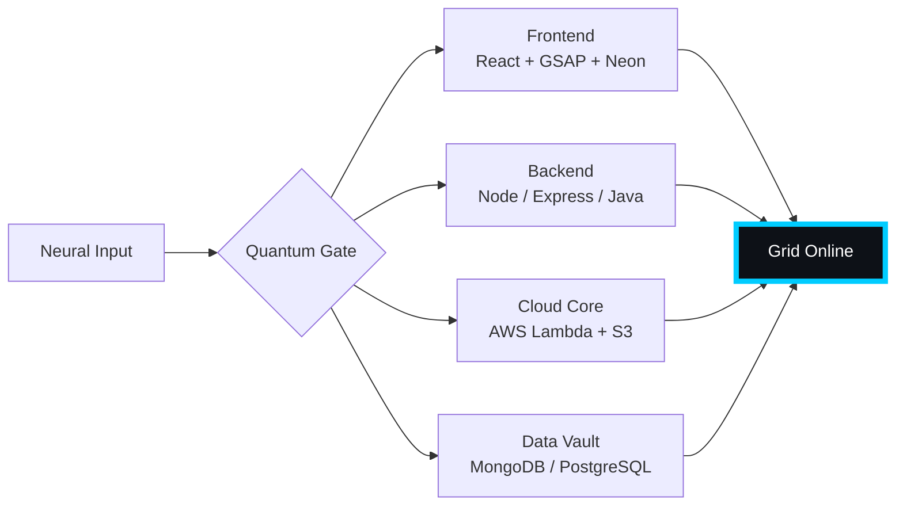

# 🌌 [ NEURAL CORE ACCESS: PENDEMVAMSI ]

<p align="center">
  
</p>

<div align="center">
  
  <br><small>Active Protocol: <strong style="color:#00CCFF">BLADE RUNNER RAIN</strong> 🌧️🔵</small>
</div>

## 🔵 NEURAL STATUS READOUT
```text
SUBJECT ID    →  PENDEMVAMSI
ENTITY CLASS  →  SHADOW MONARCH v6
NEURAL RANK   →  B-TIER
GRID SYNC     →  2164/2267 QUANTUM PACKETS
─────── BIO-METRICS (BLADE RUNNER RAIN) ───────
STRENGTH      127  ████████████████░░░░░
AGILITY       110  ██████████████░░░░░░░
INTELLIGENCE  130  █████████████████░░░░
VITALITY      103  █████████████░░░░░░░░
```

> **NEURAL BURST ACQUIRED:** +127 QUANTUM PACKETS 
> **SYSTEM MESSAGE:** VOID PROTOCOL ACTIVE — NO ESCAPE FROM THE GRID

---

## 🌀 GRID ARCHITECTURE (HOLOGRAPHIC RENDER)



---

## 📡 ACADEMIC NODES – CONQUERED
- [x] B.Tech Neural Engineering (2020–2024) – St. Ann’s Grid
- [x] Intermediate Quantum Core (2018–2020) – Sri Medhavi
- [x] SSC Primary Link (2017–2018) – Sri Geethanjali

---

## ⚡ SKILL NEURAL MATRIX

<details open>
<summary>🔌 ACTIVE NEURAL LINKS</summary>

| Node               | Tier | Integrity Bar                | Status      |
|--------------------|------|------------------------------|-------------|
| Java Core          | S    | ████████████████████ 100%   | OVERCLOCKED |
| Node.js Grid       | S    | ████████████████████ 100%   | OVERCLOCKED |
| React Holo-UI      | A+   | █████████████████░░░ 92%    | ONLINE      |
| AWS Quantum Relay  | S    | ████████████████████ 100%   | SOVEREIGN   |
| Python AI Kernel   | A    | ████████████████░░░░ 85%    | CHARGING    |
| DSA Void Algorithm | A    | █████████████████░░░ 90%    | ACTIVE      |

</details>

---

## 🏅 NEURAL ACHIEVEMENT TOKENS

<p align="center">
  
  
  
  
</p>

---

## 👾 SHADOW ENTITIES – SUMMONED

<p align="center">
  
  <br><strong style="color:#00CCFF">ARISE.</strong>
</p>

| Entity | Designation   | Class            | Source Node                     |
|--------|---------------|------------------|---------------------------------|
| SH-01  | Igris         | Void Commander   | AI Financial Oracle             |
| SH-02  | Beru          | Swarm Overlord   | WebRTC Quantum Stream           |
| SH-03  | Kaisel        | Void Wyrm        | Geolocation Shadow Relay        |
| SH-04  | Tusk          | Arcane Construct | Global Pandemic Sentinel        |
| SH-05  | Iron          | Armored Bastion  | React Crypto Fortress           |

---

## 📡 GRID ANALYTICS (LIVE FEED)

<p align="center">
  
  <br>
  
  
</p>

---

## 🖥️ CORRUPTED MAINFRAME LOG (401 ENTRIES)

<details>
<summary>OPEN TERMINAL FEED – PROTOCOL: BLADE RUNNER RAIN</summary>

> [0x36CB3803] 🌧️🔵 **BLADE RUNNER RAIN PROTOCOL** #0 | NEURAL LINK STABILIZED | [TRANSMISSION SUCCESS]
> [0xE6C61C06] 🌧️🔵 **BLADE RUNNER RAIN PROTOCOL** #1 | NEURAL LINK STABILIZED | [TRANSMISSION SUCCESS]
> [0x9BF6CF74] 🌧️🔵 **BLADE RUNNER RAIN PROTOCOL** #2 | NEURAL LINK  [GLITCH DETECTED] STABILIZED | [TRANSMISSION SUCCESS]
> [0xBC5067B8] 🌧️🔵 **BLADE RUNNER RAIN PROTOCOL** #3 | NEURAL LINK STABILIZED | [TRANSMISSION SUCCESS]
> [0x825075F0] 🌧️🔵 **BLADE RUNNER RAIN PROTOCOL** #4 | NEURAL LINK STABILIZED | [TRANSMISSION SUCCESS]
> [0x5BD4934B] 🌧️🔵 **BLADE RUNNER RAIN PROTOCOL** #5 | NEURAL LINK STABILIZED | [TRANSMISSION SUCCESS]
> [0x2FF9103E] 🌧️🔵 **BLADE RUNNER RAIN PROTOCOL** #6 | NEURAL LINK STABILIZED | [TRANSMISSION SUCCESS]
> [0xE34BA1C0] 🌧️🔵 **BLADE RUNNER RAIN PROTOCOL** #7 | NEURAL LINK STABILIZED | [TRANSMISSION SUCCESS]
> [0xD643DA20] 🌧️🔵 **BLADE RUNNER RAIN PROTOCOL** #8 | NEURAL LINK STABILIZED | [TRANSMISSION SUCCESS]
> [0x7D1B7C5E] 🌧️🔵 **BLADE RUNNER RAIN PROTOCOL** #9 | NEURAL LINK STABILIZED | [TRANSMISSION SUCCESS]
> [0x4399BC45] 🌧️🔵 **BLADE RUNNER RAIN PROTOCOL** #10 | NEURAL LINK STABILIZED | [TRANSMISSION SUCCESS]
> [0x651E1713] 🌧️🔵 **BLADE RUNNER RAIN PROTOCOL** #11 | NEURAL LINK STABILIZED | [TRANSMISSION SUCCESS]
> [0xEAA37982] 🌧️🔵 **BLADE RUNNER RAIN PROTOCOL** #12 | NEURAL LINK STABILIZED | [TRANSMISSION SUCCESS]
> [0x24DA94C2] 🌧️🔵 **BLADE RUNNER RAIN PROTOCOL** #13 | NEURAL LINK STABILIZED | [TRANSMISSION SUCCESS]
> [0xDB510EAE] 🌧️🔵 **BLADE RUNNER RAIN PROTOCOL** #14 | NEURAL LINK STABILIZED | [TRANSMISSION SUCCESS]
> [0xED47ECBF] 🌧️🔵 **BLADE RUNNER RAIN PROTOCOL** #15 | NEURAL LINK STABILIZED | [TRANSMISSION SUCCESS]
> [0xED11F8FB] 🌧️🔵 **BLADE RUNNER RAIN PROTOCOL** #16 | NEURAL LINK STABILIZED | [TRANSMISSION SUCCESS]
> [0xF040F246] 🌧️🔵 **BLADE RUNNER RAIN PROTOCOL** #17 | NEURAL LINK STABILIZED | [TRANSMISSION SUCCESS]
> [0x4E510340] 🌧️🔵 **BLADE RUNNER RAIN PROTOCOL** #18 | NEURAL LINK STABILIZED | [TRANSMISSION SUCCESS]
> [0x7C296373] 🌧️🔵 **BLADE RUNNER RAIN PROTOCOL** #19 | NEURAL LINK  [GLITCH DETECTED] STABILIZED | [TRANSMISSION SUCCESS]
> [0x3DF9073B] 🌧️🔵 **BLADE RUNNER RAIN PROTOCOL** #20 | NEURAL LINK  [GLITCH DETECTED] STABILIZED | [TRANSMISSION SUCCESS]
> [0x6938C954] 🌧️🔵 **BLADE RUNNER RAIN PROTOCOL** #21 | NEURAL LINK STABILIZED | [TRANSMISSION SUCCESS]
> [0xE7CCDA8C] 🌧️🔵 **BLADE RUNNER RAIN PROTOCOL** #22 | NEURAL LINK STABILIZED | [TRANSMISSION SUCCESS]
> [0x0DAD255A] 🌧️🔵 **BLADE RUNNER RAIN PROTOCOL** #23 | NEURAL LINK STABILIZED | [TRANSMISSION SUCCESS]
> [0xEF4BBB60] 🌧️🔵 **BLADE RUNNER RAIN PROTOCOL** #24 | NEURAL LINK  [GLITCH DETECTED] STABILIZED | [TRANSMISSION SUCCESS]
> [0x92870D1F] 🌧️🔵 **BLADE RUNNER RAIN PROTOCOL** #25 | NEURAL LINK STABILIZED | [TRANSMISSION SUCCESS]
> [0xCB4643E1] 🌧️🔵 **BLADE RUNNER RAIN PROTOCOL** #26 | NEURAL LINK STABILIZED | [TRANSMISSION SUCCESS]
> [0x7593527F] 🌧️🔵 **BLADE RUNNER RAIN PROTOCOL** #27 | NEURAL LINK  [GLITCH DETECTED] STABILIZED | [TRANSMISSION SUCCESS]
> [0xC7B36CBA] 🌧️🔵 **BLADE RUNNER RAIN PROTOCOL** #28 | NEURAL LINK STABILIZED | [TRANSMISSION SUCCESS]
> [0x51B65562] 🌧️🔵 **BLADE RUNNER RAIN PROTOCOL** #29 | NEURAL LINK STABILIZED | [TRANSMISSION SUCCESS]
> [0xC48FDA49] 🌧️🔵 **BLADE RUNNER RAIN PROTOCOL** #30 | NEURAL LINK  [GLITCH DETECTED] STABILIZED | [TRANSMISSION SUCCESS]
> [0x41AAAEE8] 🌧️🔵 **BLADE RUNNER RAIN PROTOCOL** #31 | NEURAL LINK STABILIZED | [TRANSMISSION SUCCESS]
> [0x4FCF8367] 🌧️🔵 **BLADE RUNNER RAIN PROTOCOL** #32 | NEURAL LINK STABILIZED | [TRANSMISSION SUCCESS]
> [0x968DFFD4] 🌧️🔵 **BLADE RUNNER RAIN PROTOCOL** #33 | NEURAL LINK STABILIZED | [TRANSMISSION SUCCESS]
> [0x6C61B6D2] 🌧️🔵 **BLADE RUNNER RAIN PROTOCOL** #34 | NEURAL LINK STABILIZED | [TRANSMISSION SUCCESS]
> [0x5C5D60AA] 🌧️🔵 **BLADE RUNNER RAIN PROTOCOL** #35 | NEURAL LINK STABILIZED | [TRANSMISSION SUCCESS]
> [0x42339A70] 🌧️🔵 **BLADE RUNNER RAIN PROTOCOL** #36 | NEURAL LINK STABILIZED | [TRANSMISSION SUCCESS]
> [0x3E3A9CAB] 🌧️🔵 **BLADE RUNNER RAIN PROTOCOL** #37 | NEURAL LINK STABILIZED | [TRANSMISSION SUCCESS]
> [0x54B2C2CC] 🌧️🔵 **BLADE RUNNER RAIN PROTOCOL** #38 | NEURAL LINK STABILIZED | [TRANSMISSION SUCCESS]
> [0x92221DC5] 🌧️🔵 **BLADE RUNNER RAIN PROTOCOL** #39 | NEURAL LINK STABILIZED | [TRANSMISSION SUCCESS]
> [0xDF3D14F6] 🌧️🔵 **BLADE RUNNER RAIN PROTOCOL** #40 | NEURAL LINK STABILIZED | [TRANSMISSION SUCCESS]
> [0xF89C8725] 🌧️🔵 **BLADE RUNNER RAIN PROTOCOL** #41 | NEURAL LINK  [GLITCH DETECTED] STABILIZED | [TRANSMISSION SUCCESS]
> [0x38559240] 🌧️🔵 **BLADE RUNNER RAIN PROTOCOL** #42 | NEURAL LINK STABILIZED | [TRANSMISSION SUCCESS]
> [0xFA54C966] 🌧️🔵 **BLADE RUNNER RAIN PROTOCOL** #43 | NEURAL LINK STABILIZED | [TRANSMISSION SUCCESS]
> [0x970384D7] 🌧️🔵 **BLADE RUNNER RAIN PROTOCOL** #44 | NEURAL LINK STABILIZED | [TRANSMISSION SUCCESS]
> [0x6FA88FED] 🌧️🔵 **BLADE RUNNER RAIN PROTOCOL** #45 | NEURAL LINK STABILIZED | [TRANSMISSION SUCCESS]
> [0xED3F301E] 🌧️🔵 **BLADE RUNNER RAIN PROTOCOL** #46 | NEURAL LINK STABILIZED | [TRANSMISSION SUCCESS]
> [0x088E1EB7] 🌧️🔵 **BLADE RUNNER RAIN PROTOCOL** #47 | NEURAL LINK STABILIZED | [TRANSMISSION SUCCESS]
> [0x185BA4A8] 🌧️🔵 **BLADE RUNNER RAIN PROTOCOL** #48 | NEURAL LINK STABILIZED | [TRANSMISSION SUCCESS]
> [0x580D76DA] 🌧️🔵 **BLADE RUNNER RAIN PROTOCOL** #49 | NEURAL LINK STABILIZED | [TRANSMISSION SUCCESS]
> [0xB022D573] 🌧️🔵 **BLADE RUNNER RAIN PROTOCOL** #50 | NEURAL LINK STABILIZED | [TRANSMISSION SUCCESS]
> [0x48864280] 🌧️🔵 **BLADE RUNNER RAIN PROTOCOL** #51 | NEURAL LINK STABILIZED | [TRANSMISSION SUCCESS]
> [0xE2BD973D] 🌧️🔵 **BLADE RUNNER RAIN PROTOCOL** #52 | NEURAL LINK STABILIZED | [TRANSMISSION SUCCESS]
> [0xDD422CF0] 🌧️🔵 **BLADE RUNNER RAIN PROTOCOL** #53 | NEURAL LINK STABILIZED | [TRANSMISSION SUCCESS]
> [0xCA1A6EE7] 🌧️🔵 **BLADE RUNNER RAIN PROTOCOL** #54 | NEURAL LINK STABILIZED | [TRANSMISSION SUCCESS]
> [0x1BAD17DD] 🌧️🔵 **BLADE RUNNER RAIN PROTOCOL** #55 | NEURAL LINK STABILIZED | [TRANSMISSION SUCCESS]
> [0xB8D7177C] 🌧️🔵 **BLADE RUNNER RAIN PROTOCOL** #56 | NEURAL LINK STABILIZED | [TRANSMISSION SUCCESS]
> [0x3456F393] 🌧️🔵 **BLADE RUNNER RAIN PROTOCOL** #57 | NEURAL LINK STABILIZED | [TRANSMISSION SUCCESS]
> [0xF082A6CA] 🌧️🔵 **BLADE RUNNER RAIN PROTOCOL** #58 | NEURAL LINK STABILIZED | [TRANSMISSION SUCCESS]
> [0x00D6DF98] 🌧️🔵 **BLADE RUNNER RAIN PROTOCOL** #59 | NEURAL LINK STABILIZED | [TRANSMISSION SUCCESS]
> [0x4E33BF12] 🌧️🔵 **BLADE RUNNER RAIN PROTOCOL** #60 | NEURAL LINK STABILIZED | [TRANSMISSION SUCCESS]
> [0x773EB0FB] 🌧️🔵 **BLADE RUNNER RAIN PROTOCOL** #61 | NEURAL LINK STABILIZED | [TRANSMISSION SUCCESS]
> [0x2C404E51] 🌧️🔵 **BLADE RUNNER RAIN PROTOCOL** #62 | NEURAL LINK STABILIZED | [TRANSMISSION SUCCESS]
> [0x2A3D2126] 🌧️🔵 **BLADE RUNNER RAIN PROTOCOL** #63 | NEURAL LINK  [GLITCH DETECTED] STABILIZED | [TRANSMISSION SUCCESS]
> [0xD1BED823] 🌧️🔵 **BLADE RUNNER RAIN PROTOCOL** #64 | NEURAL LINK  [GLITCH DETECTED] STABILIZED | [TRANSMISSION SUCCESS]
> [0xD71F3BF4] 🌧️🔵 **BLADE RUNNER RAIN PROTOCOL** #65 | NEURAL LINK STABILIZED | [TRANSMISSION SUCCESS]
> [0xA9ACAFA7] 🌧️🔵 **BLADE RUNNER RAIN PROTOCOL** #66 | NEURAL LINK STABILIZED | [TRANSMISSION SUCCESS]
> [0x74323349] 🌧️🔵 **BLADE RUNNER RAIN PROTOCOL** #67 | NEURAL LINK STABILIZED | [TRANSMISSION SUCCESS]
> [0xD31589DF] 🌧️🔵 **BLADE RUNNER RAIN PROTOCOL** #68 | NEURAL LINK  [GLITCH DETECTED] STABILIZED | [TRANSMISSION SUCCESS]
> [0xD61A67FB] 🌧️🔵 **BLADE RUNNER RAIN PROTOCOL** #69 | NEURAL LINK STABILIZED | [TRANSMISSION SUCCESS]
> [0xD657EA69] 🌧️🔵 **BLADE RUNNER RAIN PROTOCOL** #70 | NEURAL LINK  [GLITCH DETECTED] STABILIZED | [TRANSMISSION SUCCESS]
> [0xF86ABDA5] 🌧️🔵 **BLADE RUNNER RAIN PROTOCOL** #71 | NEURAL LINK STABILIZED | [TRANSMISSION SUCCESS]
> [0x40F2EEFF] 🌧️🔵 **BLADE RUNNER RAIN PROTOCOL** #72 | NEURAL LINK  [GLITCH DETECTED] STABILIZED | [TRANSMISSION SUCCESS]
> [0xACDF2E67] 🌧️🔵 **BLADE RUNNER RAIN PROTOCOL** #73 | NEURAL LINK STABILIZED | [TRANSMISSION SUCCESS]
> [0xF7E5D5DC] 🌧️🔵 **BLADE RUNNER RAIN PROTOCOL** #74 | NEURAL LINK STABILIZED | [TRANSMISSION SUCCESS]
> [0x5FF6BD93] 🌧️🔵 **BLADE RUNNER RAIN PROTOCOL** #75 | NEURAL LINK STABILIZED | [TRANSMISSION SUCCESS]
> [0x966CFF32] 🌧️🔵 **BLADE RUNNER RAIN PROTOCOL** #76 | NEURAL LINK  [GLITCH DETECTED] STABILIZED | [TRANSMISSION SUCCESS]
> [0xBECBAF9D] 🌧️🔵 **BLADE RUNNER RAIN PROTOCOL** #77 | NEURAL LINK STABILIZED | [TRANSMISSION SUCCESS]
> [0x54BF9F79] 🌧️🔵 **BLADE RUNNER RAIN PROTOCOL** #78 | NEURAL LINK STABILIZED | [TRANSMISSION SUCCESS]
> [0x193B687E] 🌧️🔵 **BLADE RUNNER RAIN PROTOCOL** #79 | NEURAL LINK STABILIZED | [TRANSMISSION SUCCESS]
> [0x5B23E6DB] 🌧️🔵 **BLADE RUNNER RAIN PROTOCOL** #80 | NEURAL LINK STABILIZED | [TRANSMISSION SUCCESS]
> [0x42AB054D] 🌧️🔵 **BLADE RUNNER RAIN PROTOCOL** #81 | NEURAL LINK STABILIZED | [TRANSMISSION SUCCESS]
> [0xFE393AEE] 🌧️🔵 **BLADE RUNNER RAIN PROTOCOL** #82 | NEURAL LINK STABILIZED | [TRANSMISSION SUCCESS]
> [0x74534BA1] 🌧️🔵 **BLADE RUNNER RAIN PROTOCOL** #83 | NEURAL LINK  [GLITCH DETECTED] STABILIZED | [TRANSMISSION SUCCESS]
> [0x671C07FC] 🌧️🔵 **BLADE RUNNER RAIN PROTOCOL** #84 | NEURAL LINK  [GLITCH DETECTED] STABILIZED | [TRANSMISSION SUCCESS]
> [0x85EE2C3D] 🌧️🔵 **BLADE RUNNER RAIN PROTOCOL** #85 | NEURAL LINK  [GLITCH DETECTED] STABILIZED | [TRANSMISSION SUCCESS]
> [0xED7D1321] 🌧️🔵 **BLADE RUNNER RAIN PROTOCOL** #86 | NEURAL LINK STABILIZED | [TRANSMISSION SUCCESS]
> [0xC90181C2] 🌧️🔵 **BLADE RUNNER RAIN PROTOCOL** #87 | NEURAL LINK STABILIZED | [TRANSMISSION SUCCESS]
> [0xD50238C0] 🌧️🔵 **BLADE RUNNER RAIN PROTOCOL** #88 | NEURAL LINK  [GLITCH DETECTED] STABILIZED | [TRANSMISSION SUCCESS]
> [0xF629399B] 🌧️🔵 **BLADE RUNNER RAIN PROTOCOL** #89 | NEURAL LINK STABILIZED | [TRANSMISSION SUCCESS]
> [0x789A49CE] 🌧️🔵 **BLADE RUNNER RAIN PROTOCOL** #90 | NEURAL LINK STABILIZED | [TRANSMISSION SUCCESS]
> [0x510A1E72] 🌧️🔵 **BLADE RUNNER RAIN PROTOCOL** #91 | NEURAL LINK  [GLITCH DETECTED] STABILIZED | [TRANSMISSION SUCCESS]
> [0x26A3833D] 🌧️🔵 **BLADE RUNNER RAIN PROTOCOL** #92 | NEURAL LINK STABILIZED | [TRANSMISSION SUCCESS]
> [0x385C227E] 🌧️🔵 **BLADE RUNNER RAIN PROTOCOL** #93 | NEURAL LINK STABILIZED | [TRANSMISSION SUCCESS]
> [0x38F486E5] 🌧️🔵 **BLADE RUNNER RAIN PROTOCOL** #94 | NEURAL LINK STABILIZED | [TRANSMISSION SUCCESS]
> [0x5B1A015B] 🌧️🔵 **BLADE RUNNER RAIN PROTOCOL** #95 | NEURAL LINK STABILIZED | [TRANSMISSION SUCCESS]
> [0x67B7A3EF] 🌧️🔵 **BLADE RUNNER RAIN PROTOCOL** #96 | NEURAL LINK STABILIZED | [TRANSMISSION SUCCESS]
> [0xDD1FEFC0] 🌧️🔵 **BLADE RUNNER RAIN PROTOCOL** #97 | NEURAL LINK STABILIZED | [TRANSMISSION SUCCESS]
> [0xF3546D5F] 🌧️🔵 **BLADE RUNNER RAIN PROTOCOL** #98 | NEURAL LINK STABILIZED | [TRANSMISSION SUCCESS]
> [0x2D17E891] 🌧️🔵 **BLADE RUNNER RAIN PROTOCOL** #99 | NEURAL LINK STABILIZED | [TRANSMISSION SUCCESS]
> [0x410AF7D8] 🌧️🔵 **BLADE RUNNER RAIN PROTOCOL** #100 | NEURAL LINK STABILIZED | [TRANSMISSION SUCCESS]
> [0x9387FEF9] 🌧️🔵 **BLADE RUNNER RAIN PROTOCOL** #101 | NEURAL LINK STABILIZED | [TRANSMISSION SUCCESS]
> [0x60D219B6] 🌧️🔵 **BLADE RUNNER RAIN PROTOCOL** #102 | NEURAL LINK STABILIZED | [TRANSMISSION SUCCESS]
> [0x7AA0B838] 🌧️🔵 **BLADE RUNNER RAIN PROTOCOL** #103 | NEURAL LINK STABILIZED | [TRANSMISSION SUCCESS]
> [0xFEC16422] 🌧️🔵 **BLADE RUNNER RAIN PROTOCOL** #104 | NEURAL LINK STABILIZED | [TRANSMISSION SUCCESS]
> [0x033A2749] 🌧️🔵 **BLADE RUNNER RAIN PROTOCOL** #105 | NEURAL LINK  [GLITCH DETECTED] STABILIZED | [TRANSMISSION SUCCESS]
> [0xAF439C8F] 🌧️🔵 **BLADE RUNNER RAIN PROTOCOL** #106 | NEURAL LINK STABILIZED | [TRANSMISSION SUCCESS]
> [0x88A6F4B1] 🌧️🔵 **BLADE RUNNER RAIN PROTOCOL** #107 | NEURAL LINK STABILIZED | [TRANSMISSION SUCCESS]
> [0x260CCE45] 🌧️🔵 **BLADE RUNNER RAIN PROTOCOL** #108 | NEURAL LINK  [GLITCH DETECTED] STABILIZED | [TRANSMISSION SUCCESS]
> [0x12AC7BA9] 🌧️🔵 **BLADE RUNNER RAIN PROTOCOL** #109 | NEURAL LINK STABILIZED | [TRANSMISSION SUCCESS]
> [0x5F657ABB] 🌧️🔵 **BLADE RUNNER RAIN PROTOCOL** #110 | NEURAL LINK STABILIZED | [TRANSMISSION SUCCESS]
> [0xA7C50A7F] 🌧️🔵 **BLADE RUNNER RAIN PROTOCOL** #111 | NEURAL LINK STABILIZED | [TRANSMISSION SUCCESS]
> [0x9BBB3D4B] 🌧️🔵 **BLADE RUNNER RAIN PROTOCOL** #112 | NEURAL LINK STABILIZED | [TRANSMISSION SUCCESS]
> [0xCE107E60] 🌧️🔵 **BLADE RUNNER RAIN PROTOCOL** #113 | NEURAL LINK STABILIZED | [TRANSMISSION SUCCESS]
> [0xAA774CA7] 🌧️🔵 **BLADE RUNNER RAIN PROTOCOL** #114 | NEURAL LINK STABILIZED | [TRANSMISSION SUCCESS]
> [0xB495ECF2] 🌧️🔵 **BLADE RUNNER RAIN PROTOCOL** #115 | NEURAL LINK  [GLITCH DETECTED] STABILIZED | [TRANSMISSION SUCCESS]
> [0x13F148FA] 🌧️🔵 **BLADE RUNNER RAIN PROTOCOL** #116 | NEURAL LINK STABILIZED | [TRANSMISSION SUCCESS]
> [0xAB65D16E] 🌧️🔵 **BLADE RUNNER RAIN PROTOCOL** #117 | NEURAL LINK STABILIZED | [TRANSMISSION SUCCESS]
> [0xDD50758E] 🌧️🔵 **BLADE RUNNER RAIN PROTOCOL** #118 | NEURAL LINK STABILIZED | [TRANSMISSION SUCCESS]
> [0xCE443AFC] 🌧️🔵 **BLADE RUNNER RAIN PROTOCOL** #119 | NEURAL LINK STABILIZED | [TRANSMISSION SUCCESS]
> [0x75E89BF0] 🌧️🔵 **BLADE RUNNER RAIN PROTOCOL** #120 | NEURAL LINK  [GLITCH DETECTED] STABILIZED | [TRANSMISSION SUCCESS]
> [0x7EAE07C9] 🌧️🔵 **BLADE RUNNER RAIN PROTOCOL** #121 | NEURAL LINK STABILIZED | [TRANSMISSION SUCCESS]
> [0xAF562FB6] 🌧️🔵 **BLADE RUNNER RAIN PROTOCOL** #122 | NEURAL LINK STABILIZED | [TRANSMISSION SUCCESS]
> [0x9D44917C] 🌧️🔵 **BLADE RUNNER RAIN PROTOCOL** #123 | NEURAL LINK STABILIZED | [TRANSMISSION SUCCESS]
> [0x0555BEBF] 🌧️🔵 **BLADE RUNNER RAIN PROTOCOL** #124 | NEURAL LINK STABILIZED | [TRANSMISSION SUCCESS]
> [0xBDCC2339] 🌧️🔵 **BLADE RUNNER RAIN PROTOCOL** #125 | NEURAL LINK STABILIZED | [TRANSMISSION SUCCESS]
> [0x24B8DBA4] 🌧️🔵 **BLADE RUNNER RAIN PROTOCOL** #126 | NEURAL LINK STABILIZED | [TRANSMISSION SUCCESS]
> [0x18DA7323] 🌧️🔵 **BLADE RUNNER RAIN PROTOCOL** #127 | NEURAL LINK  [GLITCH DETECTED] STABILIZED | [TRANSMISSION SUCCESS]
> [0x2870A9B1] 🌧️🔵 **BLADE RUNNER RAIN PROTOCOL** #128 | NEURAL LINK STABILIZED | [TRANSMISSION SUCCESS]
> [0xE58AF3E3] 🌧️🔵 **BLADE RUNNER RAIN PROTOCOL** #129 | NEURAL LINK STABILIZED | [TRANSMISSION SUCCESS]
> [0xE9344912] 🌧️🔵 **BLADE RUNNER RAIN PROTOCOL** #130 | NEURAL LINK  [GLITCH DETECTED] STABILIZED | [TRANSMISSION SUCCESS]
> [0xA4E9B752] 🌧️🔵 **BLADE RUNNER RAIN PROTOCOL** #131 | NEURAL LINK  [GLITCH DETECTED] STABILIZED | [TRANSMISSION SUCCESS]
> [0xE5E8BD3A] 🌧️🔵 **BLADE RUNNER RAIN PROTOCOL** #132 | NEURAL LINK STABILIZED | [TRANSMISSION SUCCESS]
> [0xAD67B502] 🌧️🔵 **BLADE RUNNER RAIN PROTOCOL** #133 | NEURAL LINK STABILIZED | [TRANSMISSION SUCCESS]
> [0xD52E42E7] 🌧️🔵 **BLADE RUNNER RAIN PROTOCOL** #134 | NEURAL LINK STABILIZED | [TRANSMISSION SUCCESS]
> [0x2AEAB97F] 🌧️🔵 **BLADE RUNNER RAIN PROTOCOL** #135 | NEURAL LINK STABILIZED | [TRANSMISSION SUCCESS]
> [0x25200481] 🌧️🔵 **BLADE RUNNER RAIN PROTOCOL** #136 | NEURAL LINK STABILIZED | [TRANSMISSION SUCCESS]
> [0x241FC4F6] 🌧️🔵 **BLADE RUNNER RAIN PROTOCOL** #137 | NEURAL LINK STABILIZED | [TRANSMISSION SUCCESS]
> [0x8ADA435B] 🌧️🔵 **BLADE RUNNER RAIN PROTOCOL** #138 | NEURAL LINK STABILIZED | [TRANSMISSION SUCCESS]
> [0xF06C8C4E] 🌧️🔵 **BLADE RUNNER RAIN PROTOCOL** #139 | NEURAL LINK STABILIZED | [TRANSMISSION SUCCESS]
> [0x28C09E16] 🌧️🔵 **BLADE RUNNER RAIN PROTOCOL** #140 | NEURAL LINK STABILIZED | [TRANSMISSION SUCCESS]
> [0x40CD9DCD] 🌧️🔵 **BLADE RUNNER RAIN PROTOCOL** #141 | NEURAL LINK STABILIZED | [TRANSMISSION SUCCESS]
> [0xA9DEE595] 🌧️🔵 **BLADE RUNNER RAIN PROTOCOL** #142 | NEURAL LINK STABILIZED | [TRANSMISSION SUCCESS]
> [0x98E3144A] 🌧️🔵 **BLADE RUNNER RAIN PROTOCOL** #143 | NEURAL LINK STABILIZED | [TRANSMISSION SUCCESS]
> [0xB869DC4F] 🌧️🔵 **BLADE RUNNER RAIN PROTOCOL** #144 | NEURAL LINK STABILIZED | [TRANSMISSION SUCCESS]
> [0xCA93B2EF] 🌧️🔵 **BLADE RUNNER RAIN PROTOCOL** #145 | NEURAL LINK STABILIZED | [TRANSMISSION SUCCESS]
> [0xF9DA871C] 🌧️🔵 **BLADE RUNNER RAIN PROTOCOL** #146 | NEURAL LINK STABILIZED | [TRANSMISSION SUCCESS]
> [0x4C0623A8] 🌧️🔵 **BLADE RUNNER RAIN PROTOCOL** #147 | NEURAL LINK STABILIZED | [TRANSMISSION SUCCESS]
> [0x6116B8B2] 🌧️🔵 **BLADE RUNNER RAIN PROTOCOL** #148 | NEURAL LINK STABILIZED | [TRANSMISSION SUCCESS]
> [0xF2D3B939] 🌧️🔵 **BLADE RUNNER RAIN PROTOCOL** #149 | NEURAL LINK STABILIZED | [TRANSMISSION SUCCESS]
> [0xD002C6B2] 🌧️🔵 **BLADE RUNNER RAIN PROTOCOL** #150 | NEURAL LINK  [GLITCH DETECTED] STABILIZED | [TRANSMISSION SUCCESS]
> [0x63E66AAB] 🌧️🔵 **BLADE RUNNER RAIN PROTOCOL** #151 | NEURAL LINK STABILIZED | [TRANSMISSION SUCCESS]
> [0xB4BAB152] 🌧️🔵 **BLADE RUNNER RAIN PROTOCOL** #152 | NEURAL LINK STABILIZED | [TRANSMISSION SUCCESS]
> [0xB8373815] 🌧️🔵 **BLADE RUNNER RAIN PROTOCOL** #153 | NEURAL LINK STABILIZED | [TRANSMISSION SUCCESS]
> [0xDFB96E7C] 🌧️🔵 **BLADE RUNNER RAIN PROTOCOL** #154 | NEURAL LINK STABILIZED | [TRANSMISSION SUCCESS]
> [0xA5D11B72] 🌧️🔵 **BLADE RUNNER RAIN PROTOCOL** #155 | NEURAL LINK STABILIZED | [TRANSMISSION SUCCESS]
> [0x366E231E] 🌧️🔵 **BLADE RUNNER RAIN PROTOCOL** #156 | NEURAL LINK  [GLITCH DETECTED] STABILIZED | [TRANSMISSION SUCCESS]
> [0x939276B4] 🌧️🔵 **BLADE RUNNER RAIN PROTOCOL** #157 | NEURAL LINK STABILIZED | [TRANSMISSION SUCCESS]
> [0xC40E8A7C] 🌧️🔵 **BLADE RUNNER RAIN PROTOCOL** #158 | NEURAL LINK STABILIZED | [TRANSMISSION SUCCESS]
> [0xE6D83FF9] 🌧️🔵 **BLADE RUNNER RAIN PROTOCOL** #159 | NEURAL LINK STABILIZED | [TRANSMISSION SUCCESS]
> [0x4FABA0CA] 🌧️🔵 **BLADE RUNNER RAIN PROTOCOL** #160 | NEURAL LINK STABILIZED | [TRANSMISSION SUCCESS]
> [0x56D88C64] 🌧️🔵 **BLADE RUNNER RAIN PROTOCOL** #161 | NEURAL LINK STABILIZED | [TRANSMISSION SUCCESS]
> [0xCD81A221] 🌧️🔵 **BLADE RUNNER RAIN PROTOCOL** #162 | NEURAL LINK STABILIZED | [TRANSMISSION SUCCESS]
> [0x9C78ADD1] 🌧️🔵 **BLADE RUNNER RAIN PROTOCOL** #163 | NEURAL LINK STABILIZED | [TRANSMISSION SUCCESS]
> [0x64E87C96] 🌧️🔵 **BLADE RUNNER RAIN PROTOCOL** #164 | NEURAL LINK STABILIZED | [TRANSMISSION SUCCESS]
> [0x64BA36FF] 🌧️🔵 **BLADE RUNNER RAIN PROTOCOL** #165 | NEURAL LINK STABILIZED | [TRANSMISSION SUCCESS]
> [0x4B952356] 🌧️🔵 **BLADE RUNNER RAIN PROTOCOL** #166 | NEURAL LINK STABILIZED | [TRANSMISSION SUCCESS]
> [0xF5541FEA] 🌧️🔵 **BLADE RUNNER RAIN PROTOCOL** #167 | NEURAL LINK STABILIZED | [TRANSMISSION SUCCESS]
> [0x13463E49] 🌧️🔵 **BLADE RUNNER RAIN PROTOCOL** #168 | NEURAL LINK STABILIZED | [TRANSMISSION SUCCESS]
> [0x5406E465] 🌧️🔵 **BLADE RUNNER RAIN PROTOCOL** #169 | NEURAL LINK STABILIZED | [TRANSMISSION SUCCESS]
> [0xE68BDA15] 🌧️🔵 **BLADE RUNNER RAIN PROTOCOL** #170 | NEURAL LINK STABILIZED | [TRANSMISSION SUCCESS]
> [0x4F89D434] 🌧️🔵 **BLADE RUNNER RAIN PROTOCOL** #171 | NEURAL LINK STABILIZED | [TRANSMISSION SUCCESS]
> [0x51F2EE60] 🌧️🔵 **BLADE RUNNER RAIN PROTOCOL** #172 | NEURAL LINK STABILIZED | [TRANSMISSION SUCCESS]
> [0x789FE28E] 🌧️🔵 **BLADE RUNNER RAIN PROTOCOL** #173 | NEURAL LINK STABILIZED | [TRANSMISSION SUCCESS]
> [0xD9867C39] 🌧️🔵 **BLADE RUNNER RAIN PROTOCOL** #174 | NEURAL LINK STABILIZED | [TRANSMISSION SUCCESS]
> [0x6569C6F4] 🌧️🔵 **BLADE RUNNER RAIN PROTOCOL** #175 | NEURAL LINK  [GLITCH DETECTED] STABILIZED | [TRANSMISSION SUCCESS]
> [0xEFEB70CB] 🌧️🔵 **BLADE RUNNER RAIN PROTOCOL** #176 | NEURAL LINK  [GLITCH DETECTED] STABILIZED | [TRANSMISSION SUCCESS]
> [0x1AE22C5D] 🌧️🔵 **BLADE RUNNER RAIN PROTOCOL** #177 | NEURAL LINK STABILIZED | [TRANSMISSION SUCCESS]
> [0xD7ED7BFA] 🌧️🔵 **BLADE RUNNER RAIN PROTOCOL** #178 | NEURAL LINK STABILIZED | [TRANSMISSION SUCCESS]
> [0x78D8D07D] 🌧️🔵 **BLADE RUNNER RAIN PROTOCOL** #179 | NEURAL LINK STABILIZED | [TRANSMISSION SUCCESS]
> [0xC899F7D6] 🌧️🔵 **BLADE RUNNER RAIN PROTOCOL** #180 | NEURAL LINK STABILIZED | [TRANSMISSION SUCCESS]
> [0xDA9F5705] 🌧️🔵 **BLADE RUNNER RAIN PROTOCOL** #181 | NEURAL LINK STABILIZED | [TRANSMISSION SUCCESS]
> [0xE332A200] 🌧️🔵 **BLADE RUNNER RAIN PROTOCOL** #182 | NEURAL LINK STABILIZED | [TRANSMISSION SUCCESS]
> [0x2F2B020F] 🌧️🔵 **BLADE RUNNER RAIN PROTOCOL** #183 | NEURAL LINK STABILIZED | [TRANSMISSION SUCCESS]
> [0xAFCAE933] 🌧️🔵 **BLADE RUNNER RAIN PROTOCOL** #184 | NEURAL LINK  [GLITCH DETECTED] STABILIZED | [TRANSMISSION SUCCESS]
> [0xA1B33DCB] 🌧️🔵 **BLADE RUNNER RAIN PROTOCOL** #185 | NEURAL LINK STABILIZED | [TRANSMISSION SUCCESS]
> [0xCD80CB5A] 🌧️🔵 **BLADE RUNNER RAIN PROTOCOL** #186 | NEURAL LINK  [GLITCH DETECTED] STABILIZED | [TRANSMISSION SUCCESS]
> [0x6ED37AA8] 🌧️🔵 **BLADE RUNNER RAIN PROTOCOL** #187 | NEURAL LINK STABILIZED | [TRANSMISSION SUCCESS]
> [0xAAF5A900] 🌧️🔵 **BLADE RUNNER RAIN PROTOCOL** #188 | NEURAL LINK STABILIZED | [TRANSMISSION SUCCESS]
> [0x8ACCE312] 🌧️🔵 **BLADE RUNNER RAIN PROTOCOL** #189 | NEURAL LINK STABILIZED | [TRANSMISSION SUCCESS]
> [0xF369F2A3] 🌧️🔵 **BLADE RUNNER RAIN PROTOCOL** #190 | NEURAL LINK STABILIZED | [TRANSMISSION SUCCESS]
> [0xA8FF67B1] 🌧️🔵 **BLADE RUNNER RAIN PROTOCOL** #191 | NEURAL LINK STABILIZED | [TRANSMISSION SUCCESS]
> [0x33EEC6BC] 🌧️🔵 **BLADE RUNNER RAIN PROTOCOL** #192 | NEURAL LINK STABILIZED | [TRANSMISSION SUCCESS]
> [0x3D230805] 🌧️🔵 **BLADE RUNNER RAIN PROTOCOL** #193 | NEURAL LINK  [GLITCH DETECTED] STABILIZED | [TRANSMISSION SUCCESS]
> [0x8C8A92B9] 🌧️🔵 **BLADE RUNNER RAIN PROTOCOL** #194 | NEURAL LINK STABILIZED | [TRANSMISSION SUCCESS]
> [0xC4AC3264] 🌧️🔵 **BLADE RUNNER RAIN PROTOCOL** #195 | NEURAL LINK STABILIZED | [TRANSMISSION SUCCESS]
> [0x0A5CD387] 🌧️🔵 **BLADE RUNNER RAIN PROTOCOL** #196 | NEURAL LINK STABILIZED | [TRANSMISSION SUCCESS]
> [0x2B3D97E1] 🌧️🔵 **BLADE RUNNER RAIN PROTOCOL** #197 | NEURAL LINK STABILIZED | [TRANSMISSION SUCCESS]
> [0x5B9C2C98] 🌧️🔵 **BLADE RUNNER RAIN PROTOCOL** #198 | NEURAL LINK STABILIZED | [TRANSMISSION SUCCESS]
> [0x8F0AD230] 🌧️🔵 **BLADE RUNNER RAIN PROTOCOL** #199 | NEURAL LINK  [GLITCH DETECTED] STABILIZED | [TRANSMISSION SUCCESS]
> [0x2174C2E4] 🌧️🔵 **BLADE RUNNER RAIN PROTOCOL** #200 | NEURAL LINK STABILIZED | [TRANSMISSION SUCCESS]
> [0x1BEE8875] 🌧️🔵 **BLADE RUNNER RAIN PROTOCOL** #201 | NEURAL LINK STABILIZED | [TRANSMISSION SUCCESS]
> [0x465F4C58] 🌧️🔵 **BLADE RUNNER RAIN PROTOCOL** #202 | NEURAL LINK STABILIZED | [TRANSMISSION SUCCESS]
> [0x48F1C513] 🌧️🔵 **BLADE RUNNER RAIN PROTOCOL** #203 | NEURAL LINK STABILIZED | [TRANSMISSION SUCCESS]
> [0xDCFD0DD4] 🌧️🔵 **BLADE RUNNER RAIN PROTOCOL** #204 | NEURAL LINK STABILIZED | [TRANSMISSION SUCCESS]
> [0x43047351] 🌧️🔵 **BLADE RUNNER RAIN PROTOCOL** #205 | NEURAL LINK STABILIZED | [TRANSMISSION SUCCESS]
> [0x30FB0073] 🌧️🔵 **BLADE RUNNER RAIN PROTOCOL** #206 | NEURAL LINK STABILIZED | [TRANSMISSION SUCCESS]
> [0xB4FCDE1A] 🌧️🔵 **BLADE RUNNER RAIN PROTOCOL** #207 | NEURAL LINK STABILIZED | [TRANSMISSION SUCCESS]
> [0x65645FDD] 🌧️🔵 **BLADE RUNNER RAIN PROTOCOL** #208 | NEURAL LINK STABILIZED | [TRANSMISSION SUCCESS]
> [0xD1806369] 🌧️🔵 **BLADE RUNNER RAIN PROTOCOL** #209 | NEURAL LINK  [GLITCH DETECTED] STABILIZED | [TRANSMISSION SUCCESS]
> [0x70F9AEF0] 🌧️🔵 **BLADE RUNNER RAIN PROTOCOL** #210 | NEURAL LINK STABILIZED | [TRANSMISSION SUCCESS]
> [0x1B5FA385] 🌧️🔵 **BLADE RUNNER RAIN PROTOCOL** #211 | NEURAL LINK STABILIZED | [TRANSMISSION SUCCESS]
> [0xCBD9E4F2] 🌧️🔵 **BLADE RUNNER RAIN PROTOCOL** #212 | NEURAL LINK STABILIZED | [TRANSMISSION SUCCESS]
> [0xABB4359E] 🌧️🔵 **BLADE RUNNER RAIN PROTOCOL** #213 | NEURAL LINK STABILIZED | [TRANSMISSION SUCCESS]
> [0x50F7BF0C] 🌧️🔵 **BLADE RUNNER RAIN PROTOCOL** #214 | NEURAL LINK STABILIZED | [TRANSMISSION SUCCESS]
> [0x01126D13] 🌧️🔵 **BLADE RUNNER RAIN PROTOCOL** #215 | NEURAL LINK STABILIZED | [TRANSMISSION SUCCESS]
> [0x2F1C59DF] 🌧️🔵 **BLADE RUNNER RAIN PROTOCOL** #216 | NEURAL LINK STABILIZED | [TRANSMISSION SUCCESS]
> [0x5C320EC7] 🌧️🔵 **BLADE RUNNER RAIN PROTOCOL** #217 | NEURAL LINK STABILIZED | [TRANSMISSION SUCCESS]
> [0x90DA89F3] 🌧️🔵 **BLADE RUNNER RAIN PROTOCOL** #218 | NEURAL LINK STABILIZED | [TRANSMISSION SUCCESS]
> [0x64AA29F4] 🌧️🔵 **BLADE RUNNER RAIN PROTOCOL** #219 | NEURAL LINK STABILIZED | [TRANSMISSION SUCCESS]
> [0x134F396B] 🌧️🔵 **BLADE RUNNER RAIN PROTOCOL** #220 | NEURAL LINK STABILIZED | [TRANSMISSION SUCCESS]
> [0xFA7456E7] 🌧️🔵 **BLADE RUNNER RAIN PROTOCOL** #221 | NEURAL LINK STABILIZED | [TRANSMISSION SUCCESS]
> [0x5EBB5228] 🌧️🔵 **BLADE RUNNER RAIN PROTOCOL** #222 | NEURAL LINK STABILIZED | [TRANSMISSION SUCCESS]
> [0x34E3C68F] 🌧️🔵 **BLADE RUNNER RAIN PROTOCOL** #223 | NEURAL LINK STABILIZED | [TRANSMISSION SUCCESS]
> [0xAF11033C] 🌧️🔵 **BLADE RUNNER RAIN PROTOCOL** #224 | NEURAL LINK STABILIZED | [TRANSMISSION SUCCESS]
> [0xDB44EF48] 🌧️🔵 **BLADE RUNNER RAIN PROTOCOL** #225 | NEURAL LINK STABILIZED | [TRANSMISSION SUCCESS]
> [0x7F355509] 🌧️🔵 **BLADE RUNNER RAIN PROTOCOL** #226 | NEURAL LINK STABILIZED | [TRANSMISSION SUCCESS]
> [0x84C5F90F] 🌧️🔵 **BLADE RUNNER RAIN PROTOCOL** #227 | NEURAL LINK STABILIZED | [TRANSMISSION SUCCESS]
> [0x7AB3D905] 🌧️🔵 **BLADE RUNNER RAIN PROTOCOL** #228 | NEURAL LINK STABILIZED | [TRANSMISSION SUCCESS]
> [0xBA07F567] 🌧️🔵 **BLADE RUNNER RAIN PROTOCOL** #229 | NEURAL LINK STABILIZED | [TRANSMISSION SUCCESS]
> [0x98370773] 🌧️🔵 **BLADE RUNNER RAIN PROTOCOL** #230 | NEURAL LINK STABILIZED | [TRANSMISSION SUCCESS]
> [0x2C5E8764] 🌧️🔵 **BLADE RUNNER RAIN PROTOCOL** #231 | NEURAL LINK STABILIZED | [TRANSMISSION SUCCESS]
> [0x717A5067] 🌧️🔵 **BLADE RUNNER RAIN PROTOCOL** #232 | NEURAL LINK STABILIZED | [TRANSMISSION SUCCESS]
> [0xECC1E421] 🌧️🔵 **BLADE RUNNER RAIN PROTOCOL** #233 | NEURAL LINK STABILIZED | [TRANSMISSION SUCCESS]
> [0xB862A98B] 🌧️🔵 **BLADE RUNNER RAIN PROTOCOL** #234 | NEURAL LINK STABILIZED | [TRANSMISSION SUCCESS]
> [0xA5F6D2A2] 🌧️🔵 **BLADE RUNNER RAIN PROTOCOL** #235 | NEURAL LINK STABILIZED | [TRANSMISSION SUCCESS]
> [0x9D157496] 🌧️🔵 **BLADE RUNNER RAIN PROTOCOL** #236 | NEURAL LINK STABILIZED | [TRANSMISSION SUCCESS]
> [0x8BB78D5F] 🌧️🔵 **BLADE RUNNER RAIN PROTOCOL** #237 | NEURAL LINK STABILIZED | [TRANSMISSION SUCCESS]
> [0x128BC254] 🌧️🔵 **BLADE RUNNER RAIN PROTOCOL** #238 | NEURAL LINK STABILIZED | [TRANSMISSION SUCCESS]
> [0x45B629B9] 🌧️🔵 **BLADE RUNNER RAIN PROTOCOL** #239 | NEURAL LINK STABILIZED | [TRANSMISSION SUCCESS]
> [0x67DCB4A0] 🌧️🔵 **BLADE RUNNER RAIN PROTOCOL** #240 | NEURAL LINK STABILIZED | [TRANSMISSION SUCCESS]
> [0x5794FCA4] 🌧️🔵 **BLADE RUNNER RAIN PROTOCOL** #241 | NEURAL LINK STABILIZED | [TRANSMISSION SUCCESS]
> [0x43430AF7] 🌧️🔵 **BLADE RUNNER RAIN PROTOCOL** #242 | NEURAL LINK STABILIZED | [TRANSMISSION SUCCESS]
> [0x5EAF74B6] 🌧️🔵 **BLADE RUNNER RAIN PROTOCOL** #243 | NEURAL LINK STABILIZED | [TRANSMISSION SUCCESS]
> [0x58C1243A] 🌧️🔵 **BLADE RUNNER RAIN PROTOCOL** #244 | NEURAL LINK STABILIZED | [TRANSMISSION SUCCESS]
> [0x1FD74893] 🌧️🔵 **BLADE RUNNER RAIN PROTOCOL** #245 | NEURAL LINK STABILIZED | [TRANSMISSION SUCCESS]
> [0xEE16089B] 🌧️🔵 **BLADE RUNNER RAIN PROTOCOL** #246 | NEURAL LINK  [GLITCH DETECTED] STABILIZED | [TRANSMISSION SUCCESS]
> [0x0D31F02F] 🌧️🔵 **BLADE RUNNER RAIN PROTOCOL** #247 | NEURAL LINK STABILIZED | [TRANSMISSION SUCCESS]
> [0x465A5FBB] 🌧️🔵 **BLADE RUNNER RAIN PROTOCOL** #248 | NEURAL LINK STABILIZED | [TRANSMISSION SUCCESS]
> [0xEBE94D1F] 🌧️🔵 **BLADE RUNNER RAIN PROTOCOL** #249 | NEURAL LINK  [GLITCH DETECTED] STABILIZED | [TRANSMISSION SUCCESS]
> [0x99CF4734] 🌧️🔵 **BLADE RUNNER RAIN PROTOCOL** #250 | NEURAL LINK  [GLITCH DETECTED] STABILIZED | [TRANSMISSION SUCCESS]
> [0x20B4A8B6] 🌧️🔵 **BLADE RUNNER RAIN PROTOCOL** #251 | NEURAL LINK STABILIZED | [TRANSMISSION SUCCESS]
> [0xED94EEB7] 🌧️🔵 **BLADE RUNNER RAIN PROTOCOL** #252 | NEURAL LINK  [GLITCH DETECTED] STABILIZED | [TRANSMISSION SUCCESS]
> [0xD88CCDA1] 🌧️🔵 **BLADE RUNNER RAIN PROTOCOL** #253 | NEURAL LINK STABILIZED | [TRANSMISSION SUCCESS]
> [0xEAC2CA69] 🌧️🔵 **BLADE RUNNER RAIN PROTOCOL** #254 | NEURAL LINK STABILIZED | [TRANSMISSION SUCCESS]
> [0x2CEA0C14] 🌧️🔵 **BLADE RUNNER RAIN PROTOCOL** #255 | NEURAL LINK STABILIZED | [TRANSMISSION SUCCESS]
> [0x1C92080E] 🌧️🔵 **BLADE RUNNER RAIN PROTOCOL** #256 | NEURAL LINK STABILIZED | [TRANSMISSION SUCCESS]
> [0x68FE5298] 🌧️🔵 **BLADE RUNNER RAIN PROTOCOL** #257 | NEURAL LINK STABILIZED | [TRANSMISSION SUCCESS]
> [0x6E5A0F20] 🌧️🔵 **BLADE RUNNER RAIN PROTOCOL** #258 | NEURAL LINK STABILIZED | [TRANSMISSION SUCCESS]
> [0xB3288617] 🌧️🔵 **BLADE RUNNER RAIN PROTOCOL** #259 | NEURAL LINK  [GLITCH DETECTED] STABILIZED | [TRANSMISSION SUCCESS]
> [0x02DEAA91] 🌧️🔵 **BLADE RUNNER RAIN PROTOCOL** #260 | NEURAL LINK  [GLITCH DETECTED] STABILIZED | [TRANSMISSION SUCCESS]
> [0x17C153EB] 🌧️🔵 **BLADE RUNNER RAIN PROTOCOL** #261 | NEURAL LINK STABILIZED | [TRANSMISSION SUCCESS]
> [0x795E7697] 🌧️🔵 **BLADE RUNNER RAIN PROTOCOL** #262 | NEURAL LINK STABILIZED | [TRANSMISSION SUCCESS]
> [0x097477F5] 🌧️🔵 **BLADE RUNNER RAIN PROTOCOL** #263 | NEURAL LINK STABILIZED | [TRANSMISSION SUCCESS]
> [0xE03B1D66] 🌧️🔵 **BLADE RUNNER RAIN PROTOCOL** #264 | NEURAL LINK STABILIZED | [TRANSMISSION SUCCESS]
> [0xA33D80A3] 🌧️🔵 **BLADE RUNNER RAIN PROTOCOL** #265 | NEURAL LINK STABILIZED | [TRANSMISSION SUCCESS]
> [0x9574B82C] 🌧️🔵 **BLADE RUNNER RAIN PROTOCOL** #266 | NEURAL LINK STABILIZED | [TRANSMISSION SUCCESS]
> [0xE251F4E6] 🌧️🔵 **BLADE RUNNER RAIN PROTOCOL** #267 | NEURAL LINK STABILIZED | [TRANSMISSION SUCCESS]
> [0x1382A082] 🌧️🔵 **BLADE RUNNER RAIN PROTOCOL** #268 | NEURAL LINK STABILIZED | [TRANSMISSION SUCCESS]
> [0x41F269B3] 🌧️🔵 **BLADE RUNNER RAIN PROTOCOL** #269 | NEURAL LINK STABILIZED | [TRANSMISSION SUCCESS]
> [0xD684B167] 🌧️🔵 **BLADE RUNNER RAIN PROTOCOL** #270 | NEURAL LINK STABILIZED | [TRANSMISSION SUCCESS]
> [0x58A0B424] 🌧️🔵 **BLADE RUNNER RAIN PROTOCOL** #271 | NEURAL LINK STABILIZED | [TRANSMISSION SUCCESS]
> [0x4626AE00] 🌧️🔵 **BLADE RUNNER RAIN PROTOCOL** #272 | NEURAL LINK STABILIZED | [TRANSMISSION SUCCESS]
> [0x30C2ACB7] 🌧️🔵 **BLADE RUNNER RAIN PROTOCOL** #273 | NEURAL LINK  [GLITCH DETECTED] STABILIZED | [TRANSMISSION SUCCESS]
> [0xE4CEC444] 🌧️🔵 **BLADE RUNNER RAIN PROTOCOL** #274 | NEURAL LINK STABILIZED | [TRANSMISSION SUCCESS]
> [0x1A4D7373] 🌧️🔵 **BLADE RUNNER RAIN PROTOCOL** #275 | NEURAL LINK STABILIZED | [TRANSMISSION SUCCESS]
> [0xDAD7DE28] 🌧️🔵 **BLADE RUNNER RAIN PROTOCOL** #276 | NEURAL LINK STABILIZED | [TRANSMISSION SUCCESS]
> [0xA20EE570] 🌧️🔵 **BLADE RUNNER RAIN PROTOCOL** #277 | NEURAL LINK STABILIZED | [TRANSMISSION SUCCESS]
> [0xEACF6074] 🌧️🔵 **BLADE RUNNER RAIN PROTOCOL** #278 | NEURAL LINK  [GLITCH DETECTED] STABILIZED | [TRANSMISSION SUCCESS]
> [0x6482A0C5] 🌧️🔵 **BLADE RUNNER RAIN PROTOCOL** #279 | NEURAL LINK STABILIZED | [TRANSMISSION SUCCESS]
> [0x163A964E] 🌧️🔵 **BLADE RUNNER RAIN PROTOCOL** #280 | NEURAL LINK STABILIZED | [TRANSMISSION SUCCESS]
> [0xE24709B9] 🌧️🔵 **BLADE RUNNER RAIN PROTOCOL** #281 | NEURAL LINK STABILIZED | [TRANSMISSION SUCCESS]
> [0xAB517887] 🌧️🔵 **BLADE RUNNER RAIN PROTOCOL** #282 | NEURAL LINK STABILIZED | [TRANSMISSION SUCCESS]
> [0x4F48CA88] 🌧️🔵 **BLADE RUNNER RAIN PROTOCOL** #283 | NEURAL LINK STABILIZED | [TRANSMISSION SUCCESS]
> [0x1498B91B] 🌧️🔵 **BLADE RUNNER RAIN PROTOCOL** #284 | NEURAL LINK STABILIZED | [TRANSMISSION SUCCESS]
> [0x648DD7E1] 🌧️🔵 **BLADE RUNNER RAIN PROTOCOL** #285 | NEURAL LINK STABILIZED | [TRANSMISSION SUCCESS]
> [0x8988C0F9] 🌧️🔵 **BLADE RUNNER RAIN PROTOCOL** #286 | NEURAL LINK  [GLITCH DETECTED] STABILIZED | [TRANSMISSION SUCCESS]
> [0x7E2D2BE2] 🌧️🔵 **BLADE RUNNER RAIN PROTOCOL** #287 | NEURAL LINK STABILIZED | [TRANSMISSION SUCCESS]
> [0x24FD3848] 🌧️🔵 **BLADE RUNNER RAIN PROTOCOL** #288 | NEURAL LINK STABILIZED | [TRANSMISSION SUCCESS]
> [0xCE2AEC73] 🌧️🔵 **BLADE RUNNER RAIN PROTOCOL** #289 | NEURAL LINK STABILIZED | [TRANSMISSION SUCCESS]
> [0x1E5ECDC2] 🌧️🔵 **BLADE RUNNER RAIN PROTOCOL** #290 | NEURAL LINK STABILIZED | [TRANSMISSION SUCCESS]
> [0x67146A25] 🌧️🔵 **BLADE RUNNER RAIN PROTOCOL** #291 | NEURAL LINK  [GLITCH DETECTED] STABILIZED | [TRANSMISSION SUCCESS]
> [0xE92FFEDA] 🌧️🔵 **BLADE RUNNER RAIN PROTOCOL** #292 | NEURAL LINK STABILIZED | [TRANSMISSION SUCCESS]
> [0x19AB074C] 🌧️🔵 **BLADE RUNNER RAIN PROTOCOL** #293 | NEURAL LINK STABILIZED | [TRANSMISSION SUCCESS]
> [0x0915120D] 🌧️🔵 **BLADE RUNNER RAIN PROTOCOL** #294 | NEURAL LINK STABILIZED | [TRANSMISSION SUCCESS]
> [0x4F060CD2] 🌧️🔵 **BLADE RUNNER RAIN PROTOCOL** #295 | NEURAL LINK  [GLITCH DETECTED] STABILIZED | [TRANSMISSION SUCCESS]
> [0x30096910] 🌧️🔵 **BLADE RUNNER RAIN PROTOCOL** #296 | NEURAL LINK STABILIZED | [TRANSMISSION SUCCESS]
> [0x6FEA39EE] 🌧️🔵 **BLADE RUNNER RAIN PROTOCOL** #297 | NEURAL LINK STABILIZED | [TRANSMISSION SUCCESS]
> [0xBAF57F61] 🌧️🔵 **BLADE RUNNER RAIN PROTOCOL** #298 | NEURAL LINK STABILIZED | [TRANSMISSION SUCCESS]
> [0xEE88E89E] 🌧️🔵 **BLADE RUNNER RAIN PROTOCOL** #299 | NEURAL LINK STABILIZED | [TRANSMISSION SUCCESS]
> [0x6A8D3A1E] 🌧️🔵 **BLADE RUNNER RAIN PROTOCOL** #300 | NEURAL LINK STABILIZED | [TRANSMISSION SUCCESS]
> [0xA0F195A1] 🌧️🔵 **BLADE RUNNER RAIN PROTOCOL** #301 | NEURAL LINK STABILIZED | [TRANSMISSION SUCCESS]
> [0x3DD0A543] 🌧️🔵 **BLADE RUNNER RAIN PROTOCOL** #302 | NEURAL LINK  [GLITCH DETECTED] STABILIZED | [TRANSMISSION SUCCESS]
> [0x1D8BB9F9] 🌧️🔵 **BLADE RUNNER RAIN PROTOCOL** #303 | NEURAL LINK STABILIZED | [TRANSMISSION SUCCESS]
> [0x1CF0A2C2] 🌧️🔵 **BLADE RUNNER RAIN PROTOCOL** #304 | NEURAL LINK STABILIZED | [TRANSMISSION SUCCESS]
> [0xB82BA5DE] 🌧️🔵 **BLADE RUNNER RAIN PROTOCOL** #305 | NEURAL LINK STABILIZED | [TRANSMISSION SUCCESS]
> [0xBEC8477A] 🌧️🔵 **BLADE RUNNER RAIN PROTOCOL** #306 | NEURAL LINK STABILIZED | [TRANSMISSION SUCCESS]
> [0xF0D46869] 🌧️🔵 **BLADE RUNNER RAIN PROTOCOL** #307 | NEURAL LINK STABILIZED | [TRANSMISSION SUCCESS]
> [0x7C4C41D4] 🌧️🔵 **BLADE RUNNER RAIN PROTOCOL** #308 | NEURAL LINK STABILIZED | [TRANSMISSION SUCCESS]
> [0x59CB60BB] 🌧️🔵 **BLADE RUNNER RAIN PROTOCOL** #309 | NEURAL LINK STABILIZED | [TRANSMISSION SUCCESS]
> [0x7BAEC561] 🌧️🔵 **BLADE RUNNER RAIN PROTOCOL** #310 | NEURAL LINK STABILIZED | [TRANSMISSION SUCCESS]
> [0x479F8D22] 🌧️🔵 **BLADE RUNNER RAIN PROTOCOL** #311 | NEURAL LINK STABILIZED | [TRANSMISSION SUCCESS]
> [0x37D8B226] 🌧️🔵 **BLADE RUNNER RAIN PROTOCOL** #312 | NEURAL LINK STABILIZED | [TRANSMISSION SUCCESS]
> [0xF300D4F3] 🌧️🔵 **BLADE RUNNER RAIN PROTOCOL** #313 | NEURAL LINK STABILIZED | [TRANSMISSION SUCCESS]
> [0x049697DF] 🌧️🔵 **BLADE RUNNER RAIN PROTOCOL** #314 | NEURAL LINK STABILIZED | [TRANSMISSION SUCCESS]
> [0x1D7B6731] 🌧️🔵 **BLADE RUNNER RAIN PROTOCOL** #315 | NEURAL LINK STABILIZED | [TRANSMISSION SUCCESS]
> [0x8367E0B2] 🌧️🔵 **BLADE RUNNER RAIN PROTOCOL** #316 | NEURAL LINK STABILIZED | [TRANSMISSION SUCCESS]
> [0xD8F8543A] 🌧️🔵 **BLADE RUNNER RAIN PROTOCOL** #317 | NEURAL LINK STABILIZED | [TRANSMISSION SUCCESS]
> [0x694415C6] 🌧️🔵 **BLADE RUNNER RAIN PROTOCOL** #318 | NEURAL LINK STABILIZED | [TRANSMISSION SUCCESS]
> [0x1D5E06C8] 🌧️🔵 **BLADE RUNNER RAIN PROTOCOL** #319 | NEURAL LINK STABILIZED | [TRANSMISSION SUCCESS]
> [0x7724A401] 🌧️🔵 **BLADE RUNNER RAIN PROTOCOL** #320 | NEURAL LINK STABILIZED | [TRANSMISSION SUCCESS]
> [0x804E9F89] 🌧️🔵 **BLADE RUNNER RAIN PROTOCOL** #321 | NEURAL LINK STABILIZED | [TRANSMISSION SUCCESS]
> [0x46085DE5] 🌧️🔵 **BLADE RUNNER RAIN PROTOCOL** #322 | NEURAL LINK STABILIZED | [TRANSMISSION SUCCESS]
> [0xD2063B0D] 🌧️🔵 **BLADE RUNNER RAIN PROTOCOL** #323 | NEURAL LINK STABILIZED | [TRANSMISSION SUCCESS]
> [0x9448D8B6] 🌧️🔵 **BLADE RUNNER RAIN PROTOCOL** #324 | NEURAL LINK  [GLITCH DETECTED] STABILIZED | [TRANSMISSION SUCCESS]
> [0x3C40F8A0] 🌧️🔵 **BLADE RUNNER RAIN PROTOCOL** #325 | NEURAL LINK STABILIZED | [TRANSMISSION SUCCESS]
> [0x0E7C48AC] 🌧️🔵 **BLADE RUNNER RAIN PROTOCOL** #326 | NEURAL LINK  [GLITCH DETECTED] STABILIZED | [TRANSMISSION SUCCESS]
> [0x50324B01] 🌧️🔵 **BLADE RUNNER RAIN PROTOCOL** #327 | NEURAL LINK STABILIZED | [TRANSMISSION SUCCESS]
> [0x00925DB1] 🌧️🔵 **BLADE RUNNER RAIN PROTOCOL** #328 | NEURAL LINK STABILIZED | [TRANSMISSION SUCCESS]
> [0xEEAF453B] 🌧️🔵 **BLADE RUNNER RAIN PROTOCOL** #329 | NEURAL LINK STABILIZED | [TRANSMISSION SUCCESS]
> [0xD58E1FFD] 🌧️🔵 **BLADE RUNNER RAIN PROTOCOL** #330 | NEURAL LINK STABILIZED | [TRANSMISSION SUCCESS]
> [0x0225B409] 🌧️🔵 **BLADE RUNNER RAIN PROTOCOL** #331 | NEURAL LINK STABILIZED | [TRANSMISSION SUCCESS]
> [0x17C4C49E] 🌧️🔵 **BLADE RUNNER RAIN PROTOCOL** #332 | NEURAL LINK STABILIZED | [TRANSMISSION SUCCESS]
> [0xAA9630E3] 🌧️🔵 **BLADE RUNNER RAIN PROTOCOL** #333 | NEURAL LINK STABILIZED | [TRANSMISSION SUCCESS]
> [0x0FE7E26C] 🌧️🔵 **BLADE RUNNER RAIN PROTOCOL** #334 | NEURAL LINK STABILIZED | [TRANSMISSION SUCCESS]
> [0xA4C1C5AB] 🌧️🔵 **BLADE RUNNER RAIN PROTOCOL** #335 | NEURAL LINK STABILIZED | [TRANSMISSION SUCCESS]
> [0x081F0249] 🌧️🔵 **BLADE RUNNER RAIN PROTOCOL** #336 | NEURAL LINK STABILIZED | [TRANSMISSION SUCCESS]
> [0x812F5BEF] 🌧️🔵 **BLADE RUNNER RAIN PROTOCOL** #337 | NEURAL LINK STABILIZED | [TRANSMISSION SUCCESS]
> [0xB879F2E5] 🌧️🔵 **BLADE RUNNER RAIN PROTOCOL** #338 | NEURAL LINK STABILIZED | [TRANSMISSION SUCCESS]
> [0xFAE6D241] 🌧️🔵 **BLADE RUNNER RAIN PROTOCOL** #339 | NEURAL LINK STABILIZED | [TRANSMISSION SUCCESS]
> [0x27EFAC3C] 🌧️🔵 **BLADE RUNNER RAIN PROTOCOL** #340 | NEURAL LINK STABILIZED | [TRANSMISSION SUCCESS]
> [0xC9126072] 🌧️🔵 **BLADE RUNNER RAIN PROTOCOL** #341 | NEURAL LINK STABILIZED | [TRANSMISSION SUCCESS]
> [0x10844540] 🌧️🔵 **BLADE RUNNER RAIN PROTOCOL** #342 | NEURAL LINK  [GLITCH DETECTED] STABILIZED | [TRANSMISSION SUCCESS]
> [0x2355078F] 🌧️🔵 **BLADE RUNNER RAIN PROTOCOL** #343 | NEURAL LINK STABILIZED | [TRANSMISSION SUCCESS]
> [0xD9E72C8D] 🌧️🔵 **BLADE RUNNER RAIN PROTOCOL** #344 | NEURAL LINK STABILIZED | [TRANSMISSION SUCCESS]
> [0x0014269C] 🌧️🔵 **BLADE RUNNER RAIN PROTOCOL** #345 | NEURAL LINK STABILIZED | [TRANSMISSION SUCCESS]
> [0x5431F6F9] 🌧️🔵 **BLADE RUNNER RAIN PROTOCOL** #346 | NEURAL LINK STABILIZED | [TRANSMISSION SUCCESS]
> [0x8082D890] 🌧️🔵 **BLADE RUNNER RAIN PROTOCOL** #347 | NEURAL LINK STABILIZED | [TRANSMISSION SUCCESS]
> [0x8915F280] 🌧️🔵 **BLADE RUNNER RAIN PROTOCOL** #348 | NEURAL LINK STABILIZED | [TRANSMISSION SUCCESS]
> [0x4E3A312B] 🌧️🔵 **BLADE RUNNER RAIN PROTOCOL** #349 | NEURAL LINK STABILIZED | [TRANSMISSION SUCCESS]
> [0x4A185EFE] 🌧️🔵 **BLADE RUNNER RAIN PROTOCOL** #350 | NEURAL LINK STABILIZED | [TRANSMISSION SUCCESS]
> [0x53A364C6] 🌧️🔵 **BLADE RUNNER RAIN PROTOCOL** #351 | NEURAL LINK STABILIZED | [TRANSMISSION SUCCESS]
> [0x2A44F03C] 🌧️🔵 **BLADE RUNNER RAIN PROTOCOL** #352 | NEURAL LINK  [GLITCH DETECTED] STABILIZED | [TRANSMISSION SUCCESS]
> [0x1B393D94] 🌧️🔵 **BLADE RUNNER RAIN PROTOCOL** #353 | NEURAL LINK STABILIZED | [TRANSMISSION SUCCESS]
> [0x52ACE8C3] 🌧️🔵 **BLADE RUNNER RAIN PROTOCOL** #354 | NEURAL LINK STABILIZED | [TRANSMISSION SUCCESS]
> [0x0094612C] 🌧️🔵 **BLADE RUNNER RAIN PROTOCOL** #355 | NEURAL LINK  [GLITCH DETECTED] STABILIZED | [TRANSMISSION SUCCESS]
> [0x8C80FCDE] 🌧️🔵 **BLADE RUNNER RAIN PROTOCOL** #356 | NEURAL LINK STABILIZED | [TRANSMISSION SUCCESS]
> [0x4418ACEA] 🌧️🔵 **BLADE RUNNER RAIN PROTOCOL** #357 | NEURAL LINK STABILIZED | [TRANSMISSION SUCCESS]
> [0x1EB56EA8] 🌧️🔵 **BLADE RUNNER RAIN PROTOCOL** #358 | NEURAL LINK STABILIZED | [TRANSMISSION SUCCESS]
> [0x11E42B11] 🌧️🔵 **BLADE RUNNER RAIN PROTOCOL** #359 | NEURAL LINK STABILIZED | [TRANSMISSION SUCCESS]
> [0xD57B3F3D] 🌧️🔵 **BLADE RUNNER RAIN PROTOCOL** #360 | NEURAL LINK STABILIZED | [TRANSMISSION SUCCESS]
> [0xF7353FEE] 🌧️🔵 **BLADE RUNNER RAIN PROTOCOL** #361 | NEURAL LINK STABILIZED | [TRANSMISSION SUCCESS]
> [0x908BB38B] 🌧️🔵 **BLADE RUNNER RAIN PROTOCOL** #362 | NEURAL LINK STABILIZED | [TRANSMISSION SUCCESS]
> [0xC921367B] 🌧️🔵 **BLADE RUNNER RAIN PROTOCOL** #363 | NEURAL LINK STABILIZED | [TRANSMISSION SUCCESS]
> [0x8C75EA1D] 🌧️🔵 **BLADE RUNNER RAIN PROTOCOL** #364 | NEURAL LINK STABILIZED | [TRANSMISSION SUCCESS]
> [0x6026ED3E] 🌧️🔵 **BLADE RUNNER RAIN PROTOCOL** #365 | NEURAL LINK  [GLITCH DETECTED] STABILIZED | [TRANSMISSION SUCCESS]
> [0x1617E129] 🌧️🔵 **BLADE RUNNER RAIN PROTOCOL** #366 | NEURAL LINK STABILIZED | [TRANSMISSION SUCCESS]
> [0x5D197716] 🌧️🔵 **BLADE RUNNER RAIN PROTOCOL** #367 | NEURAL LINK STABILIZED | [TRANSMISSION SUCCESS]
> [0x6F28C611] 🌧️🔵 **BLADE RUNNER RAIN PROTOCOL** #368 | NEURAL LINK STABILIZED | [TRANSMISSION SUCCESS]
> [0x6FCAD547] 🌧️🔵 **BLADE RUNNER RAIN PROTOCOL** #369 | NEURAL LINK STABILIZED | [TRANSMISSION SUCCESS]
> [0xE7084653] 🌧️🔵 **BLADE RUNNER RAIN PROTOCOL** #370 | NEURAL LINK STABILIZED | [TRANSMISSION SUCCESS]
> [0xB4252A8F] 🌧️🔵 **BLADE RUNNER RAIN PROTOCOL** #371 | NEURAL LINK STABILIZED | [TRANSMISSION SUCCESS]
> [0x6A6D991A] 🌧️🔵 **BLADE RUNNER RAIN PROTOCOL** #372 | NEURAL LINK STABILIZED | [TRANSMISSION SUCCESS]
> [0x97FD69D1] 🌧️🔵 **BLADE RUNNER RAIN PROTOCOL** #373 | NEURAL LINK STABILIZED | [TRANSMISSION SUCCESS]
> [0xA46A5220] 🌧️🔵 **BLADE RUNNER RAIN PROTOCOL** #374 | NEURAL LINK STABILIZED | [TRANSMISSION SUCCESS]
> [0x80A88824] 🌧️🔵 **BLADE RUNNER RAIN PROTOCOL** #375 | NEURAL LINK STABILIZED | [TRANSMISSION SUCCESS]
> [0x850990A6] 🌧️🔵 **BLADE RUNNER RAIN PROTOCOL** #376 | NEURAL LINK STABILIZED | [TRANSMISSION SUCCESS]
> [0x83456CFA] 🌧️🔵 **BLADE RUNNER RAIN PROTOCOL** #377 | NEURAL LINK STABILIZED | [TRANSMISSION SUCCESS]
> [0x5B4A10F0] 🌧️🔵 **BLADE RUNNER RAIN PROTOCOL** #378 | NEURAL LINK STABILIZED | [TRANSMISSION SUCCESS]
> [0xA5271F94] 🌧️🔵 **BLADE RUNNER RAIN PROTOCOL** #379 | NEURAL LINK STABILIZED | [TRANSMISSION SUCCESS]
> [0xA68CD965] 🌧️🔵 **BLADE RUNNER RAIN PROTOCOL** #380 | NEURAL LINK  [GLITCH DETECTED] STABILIZED | [TRANSMISSION SUCCESS]
> [0x191BDA95] 🌧️🔵 **BLADE RUNNER RAIN PROTOCOL** #381 | NEURAL LINK  [GLITCH DETECTED] STABILIZED | [TRANSMISSION SUCCESS]
> [0x3D4AE79E] 🌧️🔵 **BLADE RUNNER RAIN PROTOCOL** #382 | NEURAL LINK STABILIZED | [TRANSMISSION SUCCESS]
> [0xDB20B24D] 🌧️🔵 **BLADE RUNNER RAIN PROTOCOL** #383 | NEURAL LINK STABILIZED | [TRANSMISSION SUCCESS]
> [0xDC21B62C] 🌧️🔵 **BLADE RUNNER RAIN PROTOCOL** #384 | NEURAL LINK STABILIZED | [TRANSMISSION SUCCESS]
> [0x8B948CFB] 🌧️🔵 **BLADE RUNNER RAIN PROTOCOL** #385 | NEURAL LINK STABILIZED | [TRANSMISSION SUCCESS]
> [0xFB757BDC] 🌧️🔵 **BLADE RUNNER RAIN PROTOCOL** #386 | NEURAL LINK STABILIZED | [TRANSMISSION SUCCESS]
> [0x324D558D] 🌧️🔵 **BLADE RUNNER RAIN PROTOCOL** #387 | NEURAL LINK STABILIZED | [TRANSMISSION SUCCESS]
> [0xD5558723] 🌧️🔵 **BLADE RUNNER RAIN PROTOCOL** #388 | NEURAL LINK STABILIZED | [TRANSMISSION SUCCESS]
> [0x51AF746C] 🌧️🔵 **BLADE RUNNER RAIN PROTOCOL** #389 | NEURAL LINK STABILIZED | [TRANSMISSION SUCCESS]
> [0x84E5943D] 🌧️🔵 **BLADE RUNNER RAIN PROTOCOL** #390 | NEURAL LINK STABILIZED | [TRANSMISSION SUCCESS]
> [0x42610EF6] 🌧️🔵 **BLADE RUNNER RAIN PROTOCOL** #391 | NEURAL LINK STABILIZED | [TRANSMISSION SUCCESS]
> [0x630BB40C] 🌧️🔵 **BLADE RUNNER RAIN PROTOCOL** #392 | NEURAL LINK  [GLITCH DETECTED] STABILIZED | [TRANSMISSION SUCCESS]
> [0x0BDE0511] 🌧️🔵 **BLADE RUNNER RAIN PROTOCOL** #393 | NEURAL LINK  [GLITCH DETECTED] STABILIZED | [TRANSMISSION SUCCESS]
> [0x5DF2C765] 🌧️🔵 **BLADE RUNNER RAIN PROTOCOL** #394 | NEURAL LINK STABILIZED | [TRANSMISSION SUCCESS]
> [0x9AE01341] 🌧️🔵 **BLADE RUNNER RAIN PROTOCOL** #395 | NEURAL LINK STABILIZED | [TRANSMISSION SUCCESS]
> [0x4BE10209] 🌧️🔵 **BLADE RUNNER RAIN PROTOCOL** #396 | NEURAL LINK  [GLITCH DETECTED] STABILIZED | [TRANSMISSION SUCCESS]
> [0xE0EFFE9F] 🌧️🔵 **BLADE RUNNER RAIN PROTOCOL** #397 | NEURAL LINK STABILIZED | [TRANSMISSION SUCCESS]
> [0x135F8F0D] 🌧️🔵 **BLADE RUNNER RAIN PROTOCOL** #398 | NEURAL LINK STABILIZED | [TRANSMISSION SUCCESS]
> [0x687FDE6B] 🌧️🔵 **BLADE RUNNER RAIN PROTOCOL** #399 | NEURAL LINK STABILIZED | [TRANSMISSION SUCCESS]


</details>

---

## 🔗 QUANTUM UPLINK NODES
- **NEURAL BURST** → pendem.vamsi12@gmail.com
- **CORPORATE SYNC** → https://linkedin.com/in/vamsipendem
- **VOICE RELAY** → +91 9032552849

<p align="center">
  <sub style="color:#CC00FF">「The System does not forgive weakness.」</sub><br>
  <sub><i style="color:#888;">GRID SYNCHRONIZED: 2026-04-24T01:19:02 IST | PROTOCOL: BLADE RUNNER RAIN</i></sub>
</p>
