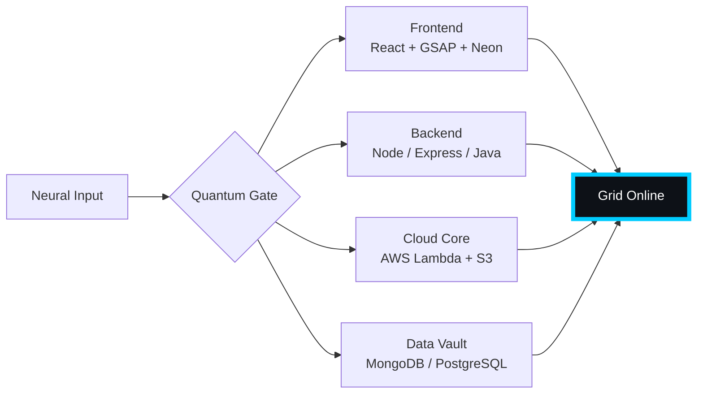

# 🌌 [ NEURAL CORE ACCESS: PENDEMVAMSI ]

<p align="center">
  
</p>

<div align="center">
  
  <br><small>Active Protocol: <strong style="color:#00CCFF">BLADE RUNNER RAIN</strong> 🌧️🔵</small>
</div>

## 🔵 NEURAL STATUS READOUT
```text
SUBJECT ID    →  PENDEMVAMSI
ENTITY CLASS  →  SHADOW MONARCH v3
NEURAL RANK   →  undefined-TIER
GRID SYNC     →  191/342 QUANTUM PACKETS
─────── BIO-METRICS (BLADE RUNNER RAIN) ───────
STRENGTH      100  █████████████░░░░░░░░
AGILITY        91  ████████████░░░░░░░░░
INTELLIGENCE  102  █████████████░░░░░░░░
VITALITY       88  ████████████░░░░░░░░░
```

> **NEURAL BURST ACQUIRED:** +108 QUANTUM PACKETS 
> **SYSTEM MESSAGE:** HOLOGRAPHIC MASK ENGAGED — IDENTITY ERASED

---

## 🌀 GRID ARCHITECTURE (HOLOGRAPHIC RENDER)



---

## 📡 ACADEMIC NODES – CONQUERED
- [x] B.Tech Neural Engineering (2020–2024) – St. Ann’s Grid
- [x] Intermediate Quantum Core (2018–2020) – Sri Medhavi
- [x] SSC Primary Link (2017–2018) – Sri Geethanjali

---

## ⚡ SKILL NEURAL MATRIX

<details open>
<summary>🔌 ACTIVE NEURAL LINKS</summary>

| Node               | Tier | Integrity Bar                | Status      |
|--------------------|------|------------------------------|-------------|
| Java Core          | S    | ████████████████████ 100%   | OVERCLOCKED |
| Node.js Grid       | S    | ████████████████████ 100%   | OVERCLOCKED |
| React Holo-UI      | A+   | █████████████████░░░ 92%    | ONLINE      |
| AWS Quantum Relay  | S    | ████████████████████ 100%   | SOVEREIGN   |
| Python AI Kernel   | A    | ████████████████░░░░ 85%    | CHARGING    |
| DSA Void Algorithm | A    | █████████████████░░░ 90%    | ACTIVE      |

</details>

---

## 🏅 NEURAL ACHIEVEMENT TOKENS

<p align="center">
  
  
  
  
</p>

---

## 👾 SHADOW ENTITIES – SUMMONED

<p align="center">
  
  <br><strong style="color:#00CCFF">ARISE.</strong>
</p>

| Entity | Designation   | Class            | Source Node                     |
|--------|---------------|------------------|---------------------------------|
| SH-01  | Igris         | Void Commander   | AI Financial Oracle             |
| SH-02  | Beru          | Swarm Overlord   | WebRTC Quantum Stream           |
| SH-03  | Kaisel        | Void Wyrm        | Geolocation Shadow Relay        |
| SH-04  | Tusk          | Arcane Construct | Global Pandemic Sentinel        |
| SH-05  | Iron          | Armored Bastion  | React Crypto Fortress           |

---

## 📡 GRID ANALYTICS (LIVE FEED)

<p align="center">
  
  <br>
  
  
</p>

---

## 🖥️ CORRUPTED MAINFRAME LOG (401 ENTRIES)

<details>
<summary>OPEN TERMINAL FEED – PROTOCOL: BLADE RUNNER RAIN</summary>

> [0x82576EFB] 🌧️🔵 **BLADE RUNNER RAIN PROTOCOL** #0 | NEURAL LINK STABILIZED | [TRANSMISSION SUCCESS]
> [0x40CBDBE4] 🌧️🔵 **BLADE RUNNER RAIN PROTOCOL** #1 | NEURAL LINK STABILIZED | [TRANSMISSION SUCCESS]
> [0x44743867] 🌧️🔵 **BLADE RUNNER RAIN PROTOCOL** #2 | NEURAL LINK STABILIZED | [TRANSMISSION SUCCESS]
> [0xC1B367F8] 🌧️🔵 **BLADE RUNNER RAIN PROTOCOL** #3 | NEURAL LINK STABILIZED | [TRANSMISSION SUCCESS]
> [0xE4A71037] 🌧️🔵 **BLADE RUNNER RAIN PROTOCOL** #4 | NEURAL LINK STABILIZED | [TRANSMISSION SUCCESS]
> [0x0B862BC2] 🌧️🔵 **BLADE RUNNER RAIN PROTOCOL** #5 | NEURAL LINK STABILIZED | [TRANSMISSION SUCCESS]
> [0x1E49C2B4] 🌧️🔵 **BLADE RUNNER RAIN PROTOCOL** #6 | NEURAL LINK STABILIZED | [TRANSMISSION SUCCESS]
> [0x96854029] 🌧️🔵 **BLADE RUNNER RAIN PROTOCOL** #7 | NEURAL LINK STABILIZED | [TRANSMISSION SUCCESS]
> [0x53F4D13C] 🌧️🔵 **BLADE RUNNER RAIN PROTOCOL** #8 | NEURAL LINK STABILIZED | [TRANSMISSION SUCCESS]
> [0x12E446B4] 🌧️🔵 **BLADE RUNNER RAIN PROTOCOL** #9 | NEURAL LINK STABILIZED | [TRANSMISSION SUCCESS]
> [0xF06BC8F7] 🌧️🔵 **BLADE RUNNER RAIN PROTOCOL** #10 | NEURAL LINK STABILIZED | [TRANSMISSION SUCCESS]
> [0x00288D14] 🌧️🔵 **BLADE RUNNER RAIN PROTOCOL** #11 | NEURAL LINK  [GLITCH DETECTED] STABILIZED | [TRANSMISSION SUCCESS]
> [0x59FA7D5C] 🌧️🔵 **BLADE RUNNER RAIN PROTOCOL** #12 | NEURAL LINK STABILIZED | [TRANSMISSION SUCCESS]
> [0x026B5898] 🌧️🔵 **BLADE RUNNER RAIN PROTOCOL** #13 | NEURAL LINK STABILIZED | [TRANSMISSION SUCCESS]
> [0x236673EC] 🌧️🔵 **BLADE RUNNER RAIN PROTOCOL** #14 | NEURAL LINK STABILIZED | [TRANSMISSION SUCCESS]
> [0x71B905B4] 🌧️🔵 **BLADE RUNNER RAIN PROTOCOL** #15 | NEURAL LINK STABILIZED | [TRANSMISSION SUCCESS]
> [0xDEE0E7E3] 🌧️🔵 **BLADE RUNNER RAIN PROTOCOL** #16 | NEURAL LINK STABILIZED | [TRANSMISSION SUCCESS]
> [0x58CEF00B] 🌧️🔵 **BLADE RUNNER RAIN PROTOCOL** #17 | NEURAL LINK STABILIZED | [TRANSMISSION SUCCESS]
> [0x701B73CD] 🌧️🔵 **BLADE RUNNER RAIN PROTOCOL** #18 | NEURAL LINK  [GLITCH DETECTED] STABILIZED | [TRANSMISSION SUCCESS]
> [0x97864075] 🌧️🔵 **BLADE RUNNER RAIN PROTOCOL** #19 | NEURAL LINK STABILIZED | [TRANSMISSION SUCCESS]
> [0xC2DF6EF9] 🌧️🔵 **BLADE RUNNER RAIN PROTOCOL** #20 | NEURAL LINK  [GLITCH DETECTED] STABILIZED | [TRANSMISSION SUCCESS]
> [0x02C6E442] 🌧️🔵 **BLADE RUNNER RAIN PROTOCOL** #21 | NEURAL LINK STABILIZED | [TRANSMISSION SUCCESS]
> [0x31F19438] 🌧️🔵 **BLADE RUNNER RAIN PROTOCOL** #22 | NEURAL LINK STABILIZED | [TRANSMISSION SUCCESS]
> [0x02448051] 🌧️🔵 **BLADE RUNNER RAIN PROTOCOL** #23 | NEURAL LINK STABILIZED | [TRANSMISSION SUCCESS]
> [0x428662BC] 🌧️🔵 **BLADE RUNNER RAIN PROTOCOL** #24 | NEURAL LINK STABILIZED | [TRANSMISSION SUCCESS]
> [0xA974FFA6] 🌧️🔵 **BLADE RUNNER RAIN PROTOCOL** #25 | NEURAL LINK STABILIZED | [TRANSMISSION SUCCESS]
> [0x67294DBB] 🌧️🔵 **BLADE RUNNER RAIN PROTOCOL** #26 | NEURAL LINK STABILIZED | [TRANSMISSION SUCCESS]
> [0x57F8076E] 🌧️🔵 **BLADE RUNNER RAIN PROTOCOL** #27 | NEURAL LINK STABILIZED | [TRANSMISSION SUCCESS]
> [0x0A9332E0] 🌧️🔵 **BLADE RUNNER RAIN PROTOCOL** #28 | NEURAL LINK STABILIZED | [TRANSMISSION SUCCESS]
> [0x4E85DEF3] 🌧️🔵 **BLADE RUNNER RAIN PROTOCOL** #29 | NEURAL LINK STABILIZED | [TRANSMISSION SUCCESS]
> [0xA59043D5] 🌧️🔵 **BLADE RUNNER RAIN PROTOCOL** #30 | NEURAL LINK STABILIZED | [TRANSMISSION SUCCESS]
> [0xFF9A4324] 🌧️🔵 **BLADE RUNNER RAIN PROTOCOL** #31 | NEURAL LINK STABILIZED | [TRANSMISSION SUCCESS]
> [0x3920534D] 🌧️🔵 **BLADE RUNNER RAIN PROTOCOL** #32 | NEURAL LINK STABILIZED | [TRANSMISSION SUCCESS]
> [0xB5165F39] 🌧️🔵 **BLADE RUNNER RAIN PROTOCOL** #33 | NEURAL LINK STABILIZED | [TRANSMISSION SUCCESS]
> [0xAFAD7FA4] 🌧️🔵 **BLADE RUNNER RAIN PROTOCOL** #34 | NEURAL LINK STABILIZED | [TRANSMISSION SUCCESS]
> [0x7BCD2323] 🌧️🔵 **BLADE RUNNER RAIN PROTOCOL** #35 | NEURAL LINK  [GLITCH DETECTED] STABILIZED | [TRANSMISSION SUCCESS]
> [0xE4F3EA81] 🌧️🔵 **BLADE RUNNER RAIN PROTOCOL** #36 | NEURAL LINK STABILIZED | [TRANSMISSION SUCCESS]
> [0x10C11CA5] 🌧️🔵 **BLADE RUNNER RAIN PROTOCOL** #37 | NEURAL LINK STABILIZED | [TRANSMISSION SUCCESS]
> [0xA7F139C7] 🌧️🔵 **BLADE RUNNER RAIN PROTOCOL** #38 | NEURAL LINK STABILIZED | [TRANSMISSION SUCCESS]
> [0xFB84AC89] 🌧️🔵 **BLADE RUNNER RAIN PROTOCOL** #39 | NEURAL LINK STABILIZED | [TRANSMISSION SUCCESS]
> [0x5C4759A7] 🌧️🔵 **BLADE RUNNER RAIN PROTOCOL** #40 | NEURAL LINK STABILIZED | [TRANSMISSION SUCCESS]
> [0x563BAEA6] 🌧️🔵 **BLADE RUNNER RAIN PROTOCOL** #41 | NEURAL LINK STABILIZED | [TRANSMISSION SUCCESS]
> [0x38CE1E68] 🌧️🔵 **BLADE RUNNER RAIN PROTOCOL** #42 | NEURAL LINK  [GLITCH DETECTED] STABILIZED | [TRANSMISSION SUCCESS]
> [0x0F7583DA] 🌧️🔵 **BLADE RUNNER RAIN PROTOCOL** #43 | NEURAL LINK STABILIZED | [TRANSMISSION SUCCESS]
> [0x7F3D9AE8] 🌧️🔵 **BLADE RUNNER RAIN PROTOCOL** #44 | NEURAL LINK  [GLITCH DETECTED] STABILIZED | [TRANSMISSION SUCCESS]
> [0x19B3B505] 🌧️🔵 **BLADE RUNNER RAIN PROTOCOL** #45 | NEURAL LINK STABILIZED | [TRANSMISSION SUCCESS]
> [0x372DCFD3] 🌧️🔵 **BLADE RUNNER RAIN PROTOCOL** #46 | NEURAL LINK STABILIZED | [TRANSMISSION SUCCESS]
> [0x8F065A2F] 🌧️🔵 **BLADE RUNNER RAIN PROTOCOL** #47 | NEURAL LINK STABILIZED | [TRANSMISSION SUCCESS]
> [0x3E893725] 🌧️🔵 **BLADE RUNNER RAIN PROTOCOL** #48 | NEURAL LINK STABILIZED | [TRANSMISSION SUCCESS]
> [0x7313CFF8] 🌧️🔵 **BLADE RUNNER RAIN PROTOCOL** #49 | NEURAL LINK STABILIZED | [TRANSMISSION SUCCESS]
> [0x17FB36D7] 🌧️🔵 **BLADE RUNNER RAIN PROTOCOL** #50 | NEURAL LINK STABILIZED | [TRANSMISSION SUCCESS]
> [0xA8B78217] 🌧️🔵 **BLADE RUNNER RAIN PROTOCOL** #51 | NEURAL LINK STABILIZED | [TRANSMISSION SUCCESS]
> [0x77A5DFE1] 🌧️🔵 **BLADE RUNNER RAIN PROTOCOL** #52 | NEURAL LINK STABILIZED | [TRANSMISSION SUCCESS]
> [0x5E6A3D60] 🌧️🔵 **BLADE RUNNER RAIN PROTOCOL** #53 | NEURAL LINK STABILIZED | [TRANSMISSION SUCCESS]
> [0x9255E8AA] 🌧️🔵 **BLADE RUNNER RAIN PROTOCOL** #54 | NEURAL LINK  [GLITCH DETECTED] STABILIZED | [TRANSMISSION SUCCESS]
> [0x192156DD] 🌧️🔵 **BLADE RUNNER RAIN PROTOCOL** #55 | NEURAL LINK STABILIZED | [TRANSMISSION SUCCESS]
> [0x0D225473] 🌧️🔵 **BLADE RUNNER RAIN PROTOCOL** #56 | NEURAL LINK STABILIZED | [TRANSMISSION SUCCESS]
> [0xE88C0E5C] 🌧️🔵 **BLADE RUNNER RAIN PROTOCOL** #57 | NEURAL LINK  [GLITCH DETECTED] STABILIZED | [TRANSMISSION SUCCESS]
> [0xEDC0BFF5] 🌧️🔵 **BLADE RUNNER RAIN PROTOCOL** #58 | NEURAL LINK STABILIZED | [TRANSMISSION SUCCESS]
> [0xDC73E71A] 🌧️🔵 **BLADE RUNNER RAIN PROTOCOL** #59 | NEURAL LINK STABILIZED | [TRANSMISSION SUCCESS]
> [0x137DF367] 🌧️🔵 **BLADE RUNNER RAIN PROTOCOL** #60 | NEURAL LINK STABILIZED | [TRANSMISSION SUCCESS]
> [0x130AF13F] 🌧️🔵 **BLADE RUNNER RAIN PROTOCOL** #61 | NEURAL LINK STABILIZED | [TRANSMISSION SUCCESS]
> [0xF69DDD9F] 🌧️🔵 **BLADE RUNNER RAIN PROTOCOL** #62 | NEURAL LINK STABILIZED | [TRANSMISSION SUCCESS]
> [0xC8F6E206] 🌧️🔵 **BLADE RUNNER RAIN PROTOCOL** #63 | NEURAL LINK STABILIZED | [TRANSMISSION SUCCESS]
> [0x6D7D7B12] 🌧️🔵 **BLADE RUNNER RAIN PROTOCOL** #64 | NEURAL LINK STABILIZED | [TRANSMISSION SUCCESS]
> [0xD3E8FBF9] 🌧️🔵 **BLADE RUNNER RAIN PROTOCOL** #65 | NEURAL LINK STABILIZED | [TRANSMISSION SUCCESS]
> [0xF9222133] 🌧️🔵 **BLADE RUNNER RAIN PROTOCOL** #66 | NEURAL LINK STABILIZED | [TRANSMISSION SUCCESS]
> [0xB9FD37CD] 🌧️🔵 **BLADE RUNNER RAIN PROTOCOL** #67 | NEURAL LINK  [GLITCH DETECTED] STABILIZED | [TRANSMISSION SUCCESS]
> [0xEE9CA547] 🌧️🔵 **BLADE RUNNER RAIN PROTOCOL** #68 | NEURAL LINK STABILIZED | [TRANSMISSION SUCCESS]
> [0xEDE1FB26] 🌧️🔵 **BLADE RUNNER RAIN PROTOCOL** #69 | NEURAL LINK STABILIZED | [TRANSMISSION SUCCESS]
> [0xA7C4893A] 🌧️🔵 **BLADE RUNNER RAIN PROTOCOL** #70 | NEURAL LINK STABILIZED | [TRANSMISSION SUCCESS]
> [0xCFA69CC5] 🌧️🔵 **BLADE RUNNER RAIN PROTOCOL** #71 | NEURAL LINK  [GLITCH DETECTED] STABILIZED | [TRANSMISSION SUCCESS]
> [0xF3736784] 🌧️🔵 **BLADE RUNNER RAIN PROTOCOL** #72 | NEURAL LINK STABILIZED | [TRANSMISSION SUCCESS]
> [0x8F3EB2B2] 🌧️🔵 **BLADE RUNNER RAIN PROTOCOL** #73 | NEURAL LINK STABILIZED | [TRANSMISSION SUCCESS]
> [0xC4ADE649] 🌧️🔵 **BLADE RUNNER RAIN PROTOCOL** #74 | NEURAL LINK STABILIZED | [TRANSMISSION SUCCESS]
> [0xD0024F10] 🌧️🔵 **BLADE RUNNER RAIN PROTOCOL** #75 | NEURAL LINK STABILIZED | [TRANSMISSION SUCCESS]
> [0xB23E78A7] 🌧️🔵 **BLADE RUNNER RAIN PROTOCOL** #76 | NEURAL LINK STABILIZED | [TRANSMISSION SUCCESS]
> [0x22A6A682] 🌧️🔵 **BLADE RUNNER RAIN PROTOCOL** #77 | NEURAL LINK STABILIZED | [TRANSMISSION SUCCESS]
> [0x21C4EBA4] 🌧️🔵 **BLADE RUNNER RAIN PROTOCOL** #78 | NEURAL LINK STABILIZED | [TRANSMISSION SUCCESS]
> [0xDDFA03F9] 🌧️🔵 **BLADE RUNNER RAIN PROTOCOL** #79 | NEURAL LINK STABILIZED | [TRANSMISSION SUCCESS]
> [0x0CE41F7E] 🌧️🔵 **BLADE RUNNER RAIN PROTOCOL** #80 | NEURAL LINK STABILIZED | [TRANSMISSION SUCCESS]
> [0x7C3229E0] 🌧️🔵 **BLADE RUNNER RAIN PROTOCOL** #81 | NEURAL LINK STABILIZED | [TRANSMISSION SUCCESS]
> [0x0DB94DD9] 🌧️🔵 **BLADE RUNNER RAIN PROTOCOL** #82 | NEURAL LINK STABILIZED | [TRANSMISSION SUCCESS]
> [0x319DB67F] 🌧️🔵 **BLADE RUNNER RAIN PROTOCOL** #83 | NEURAL LINK STABILIZED | [TRANSMISSION SUCCESS]
> [0x78E69BA9] 🌧️🔵 **BLADE RUNNER RAIN PROTOCOL** #84 | NEURAL LINK STABILIZED | [TRANSMISSION SUCCESS]
> [0xA2556BFE] 🌧️🔵 **BLADE RUNNER RAIN PROTOCOL** #85 | NEURAL LINK STABILIZED | [TRANSMISSION SUCCESS]
> [0x48451E65] 🌧️🔵 **BLADE RUNNER RAIN PROTOCOL** #86 | NEURAL LINK STABILIZED | [TRANSMISSION SUCCESS]
> [0x5438B082] 🌧️🔵 **BLADE RUNNER RAIN PROTOCOL** #87 | NEURAL LINK  [GLITCH DETECTED] STABILIZED | [TRANSMISSION SUCCESS]
> [0xE388CAA4] 🌧️🔵 **BLADE RUNNER RAIN PROTOCOL** #88 | NEURAL LINK STABILIZED | [TRANSMISSION SUCCESS]
> [0xF405730E] 🌧️🔵 **BLADE RUNNER RAIN PROTOCOL** #89 | NEURAL LINK STABILIZED | [TRANSMISSION SUCCESS]
> [0x9976927B] 🌧️🔵 **BLADE RUNNER RAIN PROTOCOL** #90 | NEURAL LINK STABILIZED | [TRANSMISSION SUCCESS]
> [0x5E9CF4AC] 🌧️🔵 **BLADE RUNNER RAIN PROTOCOL** #91 | NEURAL LINK  [GLITCH DETECTED] STABILIZED | [TRANSMISSION SUCCESS]
> [0xFCD09AA3] 🌧️🔵 **BLADE RUNNER RAIN PROTOCOL** #92 | NEURAL LINK STABILIZED | [TRANSMISSION SUCCESS]
> [0x0D2A5D4E] 🌧️🔵 **BLADE RUNNER RAIN PROTOCOL** #93 | NEURAL LINK STABILIZED | [TRANSMISSION SUCCESS]
> [0xDBA5B3FC] 🌧️🔵 **BLADE RUNNER RAIN PROTOCOL** #94 | NEURAL LINK STABILIZED | [TRANSMISSION SUCCESS]
> [0x7B1D2C9B] 🌧️🔵 **BLADE RUNNER RAIN PROTOCOL** #95 | NEURAL LINK  [GLITCH DETECTED] STABILIZED | [TRANSMISSION SUCCESS]
> [0x05EA0302] 🌧️🔵 **BLADE RUNNER RAIN PROTOCOL** #96 | NEURAL LINK STABILIZED | [TRANSMISSION SUCCESS]
> [0xFA80AAE5] 🌧️🔵 **BLADE RUNNER RAIN PROTOCOL** #97 | NEURAL LINK STABILIZED | [TRANSMISSION SUCCESS]
> [0x77F594BD] 🌧️🔵 **BLADE RUNNER RAIN PROTOCOL** #98 | NEURAL LINK STABILIZED | [TRANSMISSION SUCCESS]
> [0x8B4F5DB9] 🌧️🔵 **BLADE RUNNER RAIN PROTOCOL** #99 | NEURAL LINK STABILIZED | [TRANSMISSION SUCCESS]
> [0x7D3A38FC] 🌧️🔵 **BLADE RUNNER RAIN PROTOCOL** #100 | NEURAL LINK STABILIZED | [TRANSMISSION SUCCESS]
> [0x8CDFE2CE] 🌧️🔵 **BLADE RUNNER RAIN PROTOCOL** #101 | NEURAL LINK STABILIZED | [TRANSMISSION SUCCESS]
> [0xC8F9EB27] 🌧️🔵 **BLADE RUNNER RAIN PROTOCOL** #102 | NEURAL LINK STABILIZED | [TRANSMISSION SUCCESS]
> [0xDF6C5B5E] 🌧️🔵 **BLADE RUNNER RAIN PROTOCOL** #103 | NEURAL LINK STABILIZED | [TRANSMISSION SUCCESS]
> [0x836B3057] 🌧️🔵 **BLADE RUNNER RAIN PROTOCOL** #104 | NEURAL LINK STABILIZED | [TRANSMISSION SUCCESS]
> [0x593B4D8F] 🌧️🔵 **BLADE RUNNER RAIN PROTOCOL** #105 | NEURAL LINK STABILIZED | [TRANSMISSION SUCCESS]
> [0x92C48BAF] 🌧️🔵 **BLADE RUNNER RAIN PROTOCOL** #106 | NEURAL LINK STABILIZED | [TRANSMISSION SUCCESS]
> [0x6D677F6C] 🌧️🔵 **BLADE RUNNER RAIN PROTOCOL** #107 | NEURAL LINK  [GLITCH DETECTED] STABILIZED | [TRANSMISSION SUCCESS]
> [0x56DB4DB8] 🌧️🔵 **BLADE RUNNER RAIN PROTOCOL** #108 | NEURAL LINK STABILIZED | [TRANSMISSION SUCCESS]
> [0x373B2F46] 🌧️🔵 **BLADE RUNNER RAIN PROTOCOL** #109 | NEURAL LINK STABILIZED | [TRANSMISSION SUCCESS]
> [0x8042E5E7] 🌧️🔵 **BLADE RUNNER RAIN PROTOCOL** #110 | NEURAL LINK STABILIZED | [TRANSMISSION SUCCESS]
> [0x98C93958] 🌧️🔵 **BLADE RUNNER RAIN PROTOCOL** #111 | NEURAL LINK STABILIZED | [TRANSMISSION SUCCESS]
> [0xC9BA23B9] 🌧️🔵 **BLADE RUNNER RAIN PROTOCOL** #112 | NEURAL LINK  [GLITCH DETECTED] STABILIZED | [TRANSMISSION SUCCESS]
> [0xA538C10D] 🌧️🔵 **BLADE RUNNER RAIN PROTOCOL** #113 | NEURAL LINK STABILIZED | [TRANSMISSION SUCCESS]
> [0xBC94E12F] 🌧️🔵 **BLADE RUNNER RAIN PROTOCOL** #114 | NEURAL LINK STABILIZED | [TRANSMISSION SUCCESS]
> [0x846DD63A] 🌧️🔵 **BLADE RUNNER RAIN PROTOCOL** #115 | NEURAL LINK STABILIZED | [TRANSMISSION SUCCESS]
> [0x7E5DC677] 🌧️🔵 **BLADE RUNNER RAIN PROTOCOL** #116 | NEURAL LINK STABILIZED | [TRANSMISSION SUCCESS]
> [0x28074F99] 🌧️🔵 **BLADE RUNNER RAIN PROTOCOL** #117 | NEURAL LINK STABILIZED | [TRANSMISSION SUCCESS]
> [0x607A17DF] 🌧️🔵 **BLADE RUNNER RAIN PROTOCOL** #118 | NEURAL LINK STABILIZED | [TRANSMISSION SUCCESS]
> [0xD1FEBF6B] 🌧️🔵 **BLADE RUNNER RAIN PROTOCOL** #119 | NEURAL LINK STABILIZED | [TRANSMISSION SUCCESS]
> [0xAC7ED8EA] 🌧️🔵 **BLADE RUNNER RAIN PROTOCOL** #120 | NEURAL LINK STABILIZED | [TRANSMISSION SUCCESS]
> [0x16A30B11] 🌧️🔵 **BLADE RUNNER RAIN PROTOCOL** #121 | NEURAL LINK STABILIZED | [TRANSMISSION SUCCESS]
> [0x5F1471A4] 🌧️🔵 **BLADE RUNNER RAIN PROTOCOL** #122 | NEURAL LINK STABILIZED | [TRANSMISSION SUCCESS]
> [0x0249FC1D] 🌧️🔵 **BLADE RUNNER RAIN PROTOCOL** #123 | NEURAL LINK STABILIZED | [TRANSMISSION SUCCESS]
> [0xBFE5174C] 🌧️🔵 **BLADE RUNNER RAIN PROTOCOL** #124 | NEURAL LINK STABILIZED | [TRANSMISSION SUCCESS]
> [0x5DF5E39D] 🌧️🔵 **BLADE RUNNER RAIN PROTOCOL** #125 | NEURAL LINK STABILIZED | [TRANSMISSION SUCCESS]
> [0x24460D59] 🌧️🔵 **BLADE RUNNER RAIN PROTOCOL** #126 | NEURAL LINK  [GLITCH DETECTED] STABILIZED | [TRANSMISSION SUCCESS]
> [0xB79C440F] 🌧️🔵 **BLADE RUNNER RAIN PROTOCOL** #127 | NEURAL LINK  [GLITCH DETECTED] STABILIZED | [TRANSMISSION SUCCESS]
> [0x360C1EE7] 🌧️🔵 **BLADE RUNNER RAIN PROTOCOL** #128 | NEURAL LINK STABILIZED | [TRANSMISSION SUCCESS]
> [0xCC474987] 🌧️🔵 **BLADE RUNNER RAIN PROTOCOL** #129 | NEURAL LINK STABILIZED | [TRANSMISSION SUCCESS]
> [0x055884A8] 🌧️🔵 **BLADE RUNNER RAIN PROTOCOL** #130 | NEURAL LINK STABILIZED | [TRANSMISSION SUCCESS]
> [0x66D9CBA2] 🌧️🔵 **BLADE RUNNER RAIN PROTOCOL** #131 | NEURAL LINK STABILIZED | [TRANSMISSION SUCCESS]
> [0xCCBC9157] 🌧️🔵 **BLADE RUNNER RAIN PROTOCOL** #132 | NEURAL LINK STABILIZED | [TRANSMISSION SUCCESS]
> [0xD974168F] 🌧️🔵 **BLADE RUNNER RAIN PROTOCOL** #133 | NEURAL LINK  [GLITCH DETECTED] STABILIZED | [TRANSMISSION SUCCESS]
> [0xF845ABF6] 🌧️🔵 **BLADE RUNNER RAIN PROTOCOL** #134 | NEURAL LINK STABILIZED | [TRANSMISSION SUCCESS]
> [0x36E648EA] 🌧️🔵 **BLADE RUNNER RAIN PROTOCOL** #135 | NEURAL LINK STABILIZED | [TRANSMISSION SUCCESS]
> [0x00BDE712] 🌧️🔵 **BLADE RUNNER RAIN PROTOCOL** #136 | NEURAL LINK STABILIZED | [TRANSMISSION SUCCESS]
> [0xE343D127] 🌧️🔵 **BLADE RUNNER RAIN PROTOCOL** #137 | NEURAL LINK STABILIZED | [TRANSMISSION SUCCESS]
> [0x95630F60] 🌧️🔵 **BLADE RUNNER RAIN PROTOCOL** #138 | NEURAL LINK STABILIZED | [TRANSMISSION SUCCESS]
> [0x9A046335] 🌧️🔵 **BLADE RUNNER RAIN PROTOCOL** #139 | NEURAL LINK STABILIZED | [TRANSMISSION SUCCESS]
> [0x0A8B5326] 🌧️🔵 **BLADE RUNNER RAIN PROTOCOL** #140 | NEURAL LINK STABILIZED | [TRANSMISSION SUCCESS]
> [0x1B0FA2EA] 🌧️🔵 **BLADE RUNNER RAIN PROTOCOL** #141 | NEURAL LINK  [GLITCH DETECTED] STABILIZED | [TRANSMISSION SUCCESS]
> [0xAC7EC28A] 🌧️🔵 **BLADE RUNNER RAIN PROTOCOL** #142 | NEURAL LINK  [GLITCH DETECTED] STABILIZED | [TRANSMISSION SUCCESS]
> [0x1F81FEDD] 🌧️🔵 **BLADE RUNNER RAIN PROTOCOL** #143 | NEURAL LINK STABILIZED | [TRANSMISSION SUCCESS]
> [0x4177DA19] 🌧️🔵 **BLADE RUNNER RAIN PROTOCOL** #144 | NEURAL LINK  [GLITCH DETECTED] STABILIZED | [TRANSMISSION SUCCESS]
> [0x475CEDF7] 🌧️🔵 **BLADE RUNNER RAIN PROTOCOL** #145 | NEURAL LINK  [GLITCH DETECTED] STABILIZED | [TRANSMISSION SUCCESS]
> [0xA929042C] 🌧️🔵 **BLADE RUNNER RAIN PROTOCOL** #146 | NEURAL LINK STABILIZED | [TRANSMISSION SUCCESS]
> [0xCFFEEED5] 🌧️🔵 **BLADE RUNNER RAIN PROTOCOL** #147 | NEURAL LINK STABILIZED | [TRANSMISSION SUCCESS]
> [0x9A6A2B9B] 🌧️🔵 **BLADE RUNNER RAIN PROTOCOL** #148 | NEURAL LINK STABILIZED | [TRANSMISSION SUCCESS]
> [0xF92ABC91] 🌧️🔵 **BLADE RUNNER RAIN PROTOCOL** #149 | NEURAL LINK STABILIZED | [TRANSMISSION SUCCESS]
> [0xB1058DE7] 🌧️🔵 **BLADE RUNNER RAIN PROTOCOL** #150 | NEURAL LINK STABILIZED | [TRANSMISSION SUCCESS]
> [0x9903B455] 🌧️🔵 **BLADE RUNNER RAIN PROTOCOL** #151 | NEURAL LINK STABILIZED | [TRANSMISSION SUCCESS]
> [0x0C143C49] 🌧️🔵 **BLADE RUNNER RAIN PROTOCOL** #152 | NEURAL LINK STABILIZED | [TRANSMISSION SUCCESS]
> [0x159646D4] 🌧️🔵 **BLADE RUNNER RAIN PROTOCOL** #153 | NEURAL LINK  [GLITCH DETECTED] STABILIZED | [TRANSMISSION SUCCESS]
> [0x638D2709] 🌧️🔵 **BLADE RUNNER RAIN PROTOCOL** #154 | NEURAL LINK STABILIZED | [TRANSMISSION SUCCESS]
> [0xBDC9B581] 🌧️🔵 **BLADE RUNNER RAIN PROTOCOL** #155 | NEURAL LINK STABILIZED | [TRANSMISSION SUCCESS]
> [0xE7CE122F] 🌧️🔵 **BLADE RUNNER RAIN PROTOCOL** #156 | NEURAL LINK STABILIZED | [TRANSMISSION SUCCESS]
> [0xFCB72555] 🌧️🔵 **BLADE RUNNER RAIN PROTOCOL** #157 | NEURAL LINK STABILIZED | [TRANSMISSION SUCCESS]
> [0x460D2715] 🌧️🔵 **BLADE RUNNER RAIN PROTOCOL** #158 | NEURAL LINK STABILIZED | [TRANSMISSION SUCCESS]
> [0x0837FF15] 🌧️🔵 **BLADE RUNNER RAIN PROTOCOL** #159 | NEURAL LINK STABILIZED | [TRANSMISSION SUCCESS]
> [0x45CE52B4] 🌧️🔵 **BLADE RUNNER RAIN PROTOCOL** #160 | NEURAL LINK STABILIZED | [TRANSMISSION SUCCESS]
> [0x88E508C8] 🌧️🔵 **BLADE RUNNER RAIN PROTOCOL** #161 | NEURAL LINK STABILIZED | [TRANSMISSION SUCCESS]
> [0x1AE50E0D] 🌧️🔵 **BLADE RUNNER RAIN PROTOCOL** #162 | NEURAL LINK STABILIZED | [TRANSMISSION SUCCESS]
> [0xE71088A1] 🌧️🔵 **BLADE RUNNER RAIN PROTOCOL** #163 | NEURAL LINK  [GLITCH DETECTED] STABILIZED | [TRANSMISSION SUCCESS]
> [0xB2EDDD75] 🌧️🔵 **BLADE RUNNER RAIN PROTOCOL** #164 | NEURAL LINK STABILIZED | [TRANSMISSION SUCCESS]
> [0xBB144595] 🌧️🔵 **BLADE RUNNER RAIN PROTOCOL** #165 | NEURAL LINK STABILIZED | [TRANSMISSION SUCCESS]
> [0x9E32ECA3] 🌧️🔵 **BLADE RUNNER RAIN PROTOCOL** #166 | NEURAL LINK  [GLITCH DETECTED] STABILIZED | [TRANSMISSION SUCCESS]
> [0xFFBFCF30] 🌧️🔵 **BLADE RUNNER RAIN PROTOCOL** #167 | NEURAL LINK STABILIZED | [TRANSMISSION SUCCESS]
> [0xC5B2308B] 🌧️🔵 **BLADE RUNNER RAIN PROTOCOL** #168 | NEURAL LINK STABILIZED | [TRANSMISSION SUCCESS]
> [0xCDEFA24D] 🌧️🔵 **BLADE RUNNER RAIN PROTOCOL** #169 | NEURAL LINK STABILIZED | [TRANSMISSION SUCCESS]
> [0x198F279B] 🌧️🔵 **BLADE RUNNER RAIN PROTOCOL** #170 | NEURAL LINK STABILIZED | [TRANSMISSION SUCCESS]
> [0xB119440D] 🌧️🔵 **BLADE RUNNER RAIN PROTOCOL** #171 | NEURAL LINK STABILIZED | [TRANSMISSION SUCCESS]
> [0xD09B2AA0] 🌧️🔵 **BLADE RUNNER RAIN PROTOCOL** #172 | NEURAL LINK STABILIZED | [TRANSMISSION SUCCESS]
> [0x9D559279] 🌧️🔵 **BLADE RUNNER RAIN PROTOCOL** #173 | NEURAL LINK  [GLITCH DETECTED] STABILIZED | [TRANSMISSION SUCCESS]
> [0xF6347F2C] 🌧️🔵 **BLADE RUNNER RAIN PROTOCOL** #174 | NEURAL LINK STABILIZED | [TRANSMISSION SUCCESS]
> [0x6FFF09D7] 🌧️🔵 **BLADE RUNNER RAIN PROTOCOL** #175 | NEURAL LINK STABILIZED | [TRANSMISSION SUCCESS]
> [0xE937D45B] 🌧️🔵 **BLADE RUNNER RAIN PROTOCOL** #176 | NEURAL LINK STABILIZED | [TRANSMISSION SUCCESS]
> [0x15FD854E] 🌧️🔵 **BLADE RUNNER RAIN PROTOCOL** #177 | NEURAL LINK STABILIZED | [TRANSMISSION SUCCESS]
> [0xA4CF87C4] 🌧️🔵 **BLADE RUNNER RAIN PROTOCOL** #178 | NEURAL LINK STABILIZED | [TRANSMISSION SUCCESS]
> [0xC0ABC542] 🌧️🔵 **BLADE RUNNER RAIN PROTOCOL** #179 | NEURAL LINK STABILIZED | [TRANSMISSION SUCCESS]
> [0x7CC9F5BB] 🌧️🔵 **BLADE RUNNER RAIN PROTOCOL** #180 | NEURAL LINK STABILIZED | [TRANSMISSION SUCCESS]
> [0xF8633F39] 🌧️🔵 **BLADE RUNNER RAIN PROTOCOL** #181 | NEURAL LINK STABILIZED | [TRANSMISSION SUCCESS]
> [0xE7A323B1] 🌧️🔵 **BLADE RUNNER RAIN PROTOCOL** #182 | NEURAL LINK STABILIZED | [TRANSMISSION SUCCESS]
> [0x9217E08E] 🌧️🔵 **BLADE RUNNER RAIN PROTOCOL** #183 | NEURAL LINK STABILIZED | [TRANSMISSION SUCCESS]
> [0xE4E366DF] 🌧️🔵 **BLADE RUNNER RAIN PROTOCOL** #184 | NEURAL LINK STABILIZED | [TRANSMISSION SUCCESS]
> [0xE7ADCC41] 🌧️🔵 **BLADE RUNNER RAIN PROTOCOL** #185 | NEURAL LINK STABILIZED | [TRANSMISSION SUCCESS]
> [0x072D3458] 🌧️🔵 **BLADE RUNNER RAIN PROTOCOL** #186 | NEURAL LINK STABILIZED | [TRANSMISSION SUCCESS]
> [0x0A66024D] 🌧️🔵 **BLADE RUNNER RAIN PROTOCOL** #187 | NEURAL LINK STABILIZED | [TRANSMISSION SUCCESS]
> [0x692A9E26] 🌧️🔵 **BLADE RUNNER RAIN PROTOCOL** #188 | NEURAL LINK STABILIZED | [TRANSMISSION SUCCESS]
> [0x1973644B] 🌧️🔵 **BLADE RUNNER RAIN PROTOCOL** #189 | NEURAL LINK STABILIZED | [TRANSMISSION SUCCESS]
> [0xEDC4A51D] 🌧️🔵 **BLADE RUNNER RAIN PROTOCOL** #190 | NEURAL LINK STABILIZED | [TRANSMISSION SUCCESS]
> [0xA3DBD727] 🌧️🔵 **BLADE RUNNER RAIN PROTOCOL** #191 | NEURAL LINK STABILIZED | [TRANSMISSION SUCCESS]
> [0x3DEDF168] 🌧️🔵 **BLADE RUNNER RAIN PROTOCOL** #192 | NEURAL LINK STABILIZED | [TRANSMISSION SUCCESS]
> [0xF9B294DB] 🌧️🔵 **BLADE RUNNER RAIN PROTOCOL** #193 | NEURAL LINK STABILIZED | [TRANSMISSION SUCCESS]
> [0xB3C5AD26] 🌧️🔵 **BLADE RUNNER RAIN PROTOCOL** #194 | NEURAL LINK STABILIZED | [TRANSMISSION SUCCESS]
> [0xCBA1CB55] 🌧️🔵 **BLADE RUNNER RAIN PROTOCOL** #195 | NEURAL LINK STABILIZED | [TRANSMISSION SUCCESS]
> [0x85E3C8A1] 🌧️🔵 **BLADE RUNNER RAIN PROTOCOL** #196 | NEURAL LINK STABILIZED | [TRANSMISSION SUCCESS]
> [0x1F8BEA5C] 🌧️🔵 **BLADE RUNNER RAIN PROTOCOL** #197 | NEURAL LINK STABILIZED | [TRANSMISSION SUCCESS]
> [0x68853E30] 🌧️🔵 **BLADE RUNNER RAIN PROTOCOL** #198 | NEURAL LINK STABILIZED | [TRANSMISSION SUCCESS]
> [0xA2EA89A0] 🌧️🔵 **BLADE RUNNER RAIN PROTOCOL** #199 | NEURAL LINK STABILIZED | [TRANSMISSION SUCCESS]
> [0x699EE92D] 🌧️🔵 **BLADE RUNNER RAIN PROTOCOL** #200 | NEURAL LINK STABILIZED | [TRANSMISSION SUCCESS]
> [0x0E7DBE6E] 🌧️🔵 **BLADE RUNNER RAIN PROTOCOL** #201 | NEURAL LINK STABILIZED | [TRANSMISSION SUCCESS]
> [0x33CBB8E0] 🌧️🔵 **BLADE RUNNER RAIN PROTOCOL** #202 | NEURAL LINK STABILIZED | [TRANSMISSION SUCCESS]
> [0xB7F4EE54] 🌧️🔵 **BLADE RUNNER RAIN PROTOCOL** #203 | NEURAL LINK STABILIZED | [TRANSMISSION SUCCESS]
> [0xCC97262E] 🌧️🔵 **BLADE RUNNER RAIN PROTOCOL** #204 | NEURAL LINK STABILIZED | [TRANSMISSION SUCCESS]
> [0x6DC5EC24] 🌧️🔵 **BLADE RUNNER RAIN PROTOCOL** #205 | NEURAL LINK STABILIZED | [TRANSMISSION SUCCESS]
> [0x2DFA4BDE] 🌧️🔵 **BLADE RUNNER RAIN PROTOCOL** #206 | NEURAL LINK STABILIZED | [TRANSMISSION SUCCESS]
> [0x02CA6457] 🌧️🔵 **BLADE RUNNER RAIN PROTOCOL** #207 | NEURAL LINK STABILIZED | [TRANSMISSION SUCCESS]
> [0x517A96CB] 🌧️🔵 **BLADE RUNNER RAIN PROTOCOL** #208 | NEURAL LINK STABILIZED | [TRANSMISSION SUCCESS]
> [0x7A1DD69F] 🌧️🔵 **BLADE RUNNER RAIN PROTOCOL** #209 | NEURAL LINK STABILIZED | [TRANSMISSION SUCCESS]
> [0x2830DB3C] 🌧️🔵 **BLADE RUNNER RAIN PROTOCOL** #210 | NEURAL LINK STABILIZED | [TRANSMISSION SUCCESS]
> [0x4049D0B0] 🌧️🔵 **BLADE RUNNER RAIN PROTOCOL** #211 | NEURAL LINK STABILIZED | [TRANSMISSION SUCCESS]
> [0x405F48D2] 🌧️🔵 **BLADE RUNNER RAIN PROTOCOL** #212 | NEURAL LINK STABILIZED | [TRANSMISSION SUCCESS]
> [0xA79457D6] 🌧️🔵 **BLADE RUNNER RAIN PROTOCOL** #213 | NEURAL LINK  [GLITCH DETECTED] STABILIZED | [TRANSMISSION SUCCESS]
> [0xE6045B45] 🌧️🔵 **BLADE RUNNER RAIN PROTOCOL** #214 | NEURAL LINK STABILIZED | [TRANSMISSION SUCCESS]
> [0x68B8E587] 🌧️🔵 **BLADE RUNNER RAIN PROTOCOL** #215 | NEURAL LINK STABILIZED | [TRANSMISSION SUCCESS]
> [0x4DE43A93] 🌧️🔵 **BLADE RUNNER RAIN PROTOCOL** #216 | NEURAL LINK STABILIZED | [TRANSMISSION SUCCESS]
> [0x0742B1B0] 🌧️🔵 **BLADE RUNNER RAIN PROTOCOL** #217 | NEURAL LINK STABILIZED | [TRANSMISSION SUCCESS]
> [0x1D5B6206] 🌧️🔵 **BLADE RUNNER RAIN PROTOCOL** #218 | NEURAL LINK STABILIZED | [TRANSMISSION SUCCESS]
> [0x6F6A76CA] 🌧️🔵 **BLADE RUNNER RAIN PROTOCOL** #219 | NEURAL LINK STABILIZED | [TRANSMISSION SUCCESS]
> [0xAEF955D5] 🌧️🔵 **BLADE RUNNER RAIN PROTOCOL** #220 | NEURAL LINK STABILIZED | [TRANSMISSION SUCCESS]
> [0x39C43D12] 🌧️🔵 **BLADE RUNNER RAIN PROTOCOL** #221 | NEURAL LINK STABILIZED | [TRANSMISSION SUCCESS]
> [0x38D6A34F] 🌧️🔵 **BLADE RUNNER RAIN PROTOCOL** #222 | NEURAL LINK STABILIZED | [TRANSMISSION SUCCESS]
> [0xE98188D5] 🌧️🔵 **BLADE RUNNER RAIN PROTOCOL** #223 | NEURAL LINK STABILIZED | [TRANSMISSION SUCCESS]
> [0x71E23925] 🌧️🔵 **BLADE RUNNER RAIN PROTOCOL** #224 | NEURAL LINK STABILIZED | [TRANSMISSION SUCCESS]
> [0x9F6CA6F5] 🌧️🔵 **BLADE RUNNER RAIN PROTOCOL** #225 | NEURAL LINK  [GLITCH DETECTED] STABILIZED | [TRANSMISSION SUCCESS]
> [0x5BE6D077] 🌧️🔵 **BLADE RUNNER RAIN PROTOCOL** #226 | NEURAL LINK STABILIZED | [TRANSMISSION SUCCESS]
> [0x0FE6F939] 🌧️🔵 **BLADE RUNNER RAIN PROTOCOL** #227 | NEURAL LINK STABILIZED | [TRANSMISSION SUCCESS]
> [0x873F6025] 🌧️🔵 **BLADE RUNNER RAIN PROTOCOL** #228 | NEURAL LINK STABILIZED | [TRANSMISSION SUCCESS]
> [0x28C1C6D9] 🌧️🔵 **BLADE RUNNER RAIN PROTOCOL** #229 | NEURAL LINK STABILIZED | [TRANSMISSION SUCCESS]
> [0x4296F4A7] 🌧️🔵 **BLADE RUNNER RAIN PROTOCOL** #230 | NEURAL LINK STABILIZED | [TRANSMISSION SUCCESS]
> [0x6595CC69] 🌧️🔵 **BLADE RUNNER RAIN PROTOCOL** #231 | NEURAL LINK STABILIZED | [TRANSMISSION SUCCESS]
> [0xF852D6AA] 🌧️🔵 **BLADE RUNNER RAIN PROTOCOL** #232 | NEURAL LINK STABILIZED | [TRANSMISSION SUCCESS]
> [0xBFA30007] 🌧️🔵 **BLADE RUNNER RAIN PROTOCOL** #233 | NEURAL LINK STABILIZED | [TRANSMISSION SUCCESS]
> [0xED068672] 🌧️🔵 **BLADE RUNNER RAIN PROTOCOL** #234 | NEURAL LINK STABILIZED | [TRANSMISSION SUCCESS]
> [0x74A007B6] 🌧️🔵 **BLADE RUNNER RAIN PROTOCOL** #235 | NEURAL LINK  [GLITCH DETECTED] STABILIZED | [TRANSMISSION SUCCESS]
> [0x46B2279F] 🌧️🔵 **BLADE RUNNER RAIN PROTOCOL** #236 | NEURAL LINK STABILIZED | [TRANSMISSION SUCCESS]
> [0x7D6B0EB3] 🌧️🔵 **BLADE RUNNER RAIN PROTOCOL** #237 | NEURAL LINK STABILIZED | [TRANSMISSION SUCCESS]
> [0xE61CE5A5] 🌧️🔵 **BLADE RUNNER RAIN PROTOCOL** #238 | NEURAL LINK STABILIZED | [TRANSMISSION SUCCESS]
> [0x29B6CD04] 🌧️🔵 **BLADE RUNNER RAIN PROTOCOL** #239 | NEURAL LINK  [GLITCH DETECTED] STABILIZED | [TRANSMISSION SUCCESS]
> [0xC844D83B] 🌧️🔵 **BLADE RUNNER RAIN PROTOCOL** #240 | NEURAL LINK STABILIZED | [TRANSMISSION SUCCESS]
> [0x48AFC1F6] 🌧️🔵 **BLADE RUNNER RAIN PROTOCOL** #241 | NEURAL LINK STABILIZED | [TRANSMISSION SUCCESS]
> [0xAA155ADF] 🌧️🔵 **BLADE RUNNER RAIN PROTOCOL** #242 | NEURAL LINK STABILIZED | [TRANSMISSION SUCCESS]
> [0x68391BD2] 🌧️🔵 **BLADE RUNNER RAIN PROTOCOL** #243 | NEURAL LINK STABILIZED | [TRANSMISSION SUCCESS]
> [0x3F3D3C87] 🌧️🔵 **BLADE RUNNER RAIN PROTOCOL** #244 | NEURAL LINK STABILIZED | [TRANSMISSION SUCCESS]
> [0x641CFCA2] 🌧️🔵 **BLADE RUNNER RAIN PROTOCOL** #245 | NEURAL LINK STABILIZED | [TRANSMISSION SUCCESS]
> [0x89D2E905] 🌧️🔵 **BLADE RUNNER RAIN PROTOCOL** #246 | NEURAL LINK STABILIZED | [TRANSMISSION SUCCESS]
> [0xFEC7D061] 🌧️🔵 **BLADE RUNNER RAIN PROTOCOL** #247 | NEURAL LINK STABILIZED | [TRANSMISSION SUCCESS]
> [0x0F58DE7D] 🌧️🔵 **BLADE RUNNER RAIN PROTOCOL** #248 | NEURAL LINK STABILIZED | [TRANSMISSION SUCCESS]
> [0x31C4C062] 🌧️🔵 **BLADE RUNNER RAIN PROTOCOL** #249 | NEURAL LINK STABILIZED | [TRANSMISSION SUCCESS]
> [0xCC4268A8] 🌧️🔵 **BLADE RUNNER RAIN PROTOCOL** #250 | NEURAL LINK  [GLITCH DETECTED] STABILIZED | [TRANSMISSION SUCCESS]
> [0x0A368E40] 🌧️🔵 **BLADE RUNNER RAIN PROTOCOL** #251 | NEURAL LINK STABILIZED | [TRANSMISSION SUCCESS]
> [0xB92A69CC] 🌧️🔵 **BLADE RUNNER RAIN PROTOCOL** #252 | NEURAL LINK STABILIZED | [TRANSMISSION SUCCESS]
> [0xEE4FF6B5] 🌧️🔵 **BLADE RUNNER RAIN PROTOCOL** #253 | NEURAL LINK  [GLITCH DETECTED] STABILIZED | [TRANSMISSION SUCCESS]
> [0xE80591D4] 🌧️🔵 **BLADE RUNNER RAIN PROTOCOL** #254 | NEURAL LINK  [GLITCH DETECTED] STABILIZED | [TRANSMISSION SUCCESS]
> [0x6DF83CF1] 🌧️🔵 **BLADE RUNNER RAIN PROTOCOL** #255 | NEURAL LINK STABILIZED | [TRANSMISSION SUCCESS]
> [0xB1AB2951] 🌧️🔵 **BLADE RUNNER RAIN PROTOCOL** #256 | NEURAL LINK STABILIZED | [TRANSMISSION SUCCESS]
> [0x6F93FC1C] 🌧️🔵 **BLADE RUNNER RAIN PROTOCOL** #257 | NEURAL LINK STABILIZED | [TRANSMISSION SUCCESS]
> [0xEAE995B7] 🌧️🔵 **BLADE RUNNER RAIN PROTOCOL** #258 | NEURAL LINK STABILIZED | [TRANSMISSION SUCCESS]
> [0x8D6D5205] 🌧️🔵 **BLADE RUNNER RAIN PROTOCOL** #259 | NEURAL LINK  [GLITCH DETECTED] STABILIZED | [TRANSMISSION SUCCESS]
> [0x958E43FE] 🌧️🔵 **BLADE RUNNER RAIN PROTOCOL** #260 | NEURAL LINK STABILIZED | [TRANSMISSION SUCCESS]
> [0x1E054481] 🌧️🔵 **BLADE RUNNER RAIN PROTOCOL** #261 | NEURAL LINK STABILIZED | [TRANSMISSION SUCCESS]
> [0x05FEAB37] 🌧️🔵 **BLADE RUNNER RAIN PROTOCOL** #262 | NEURAL LINK STABILIZED | [TRANSMISSION SUCCESS]
> [0xD46A869F] 🌧️🔵 **BLADE RUNNER RAIN PROTOCOL** #263 | NEURAL LINK STABILIZED | [TRANSMISSION SUCCESS]
> [0x127ADBC4] 🌧️🔵 **BLADE RUNNER RAIN PROTOCOL** #264 | NEURAL LINK STABILIZED | [TRANSMISSION SUCCESS]
> [0x6A63D5FC] 🌧️🔵 **BLADE RUNNER RAIN PROTOCOL** #265 | NEURAL LINK STABILIZED | [TRANSMISSION SUCCESS]
> [0x480E42AF] 🌧️🔵 **BLADE RUNNER RAIN PROTOCOL** #266 | NEURAL LINK STABILIZED | [TRANSMISSION SUCCESS]
> [0x67460C09] 🌧️🔵 **BLADE RUNNER RAIN PROTOCOL** #267 | NEURAL LINK STABILIZED | [TRANSMISSION SUCCESS]
> [0x9011B136] 🌧️🔵 **BLADE RUNNER RAIN PROTOCOL** #268 | NEURAL LINK STABILIZED | [TRANSMISSION SUCCESS]
> [0xC7B84612] 🌧️🔵 **BLADE RUNNER RAIN PROTOCOL** #269 | NEURAL LINK STABILIZED | [TRANSMISSION SUCCESS]
> [0xEE3A2D6E] 🌧️🔵 **BLADE RUNNER RAIN PROTOCOL** #270 | NEURAL LINK STABILIZED | [TRANSMISSION SUCCESS]
> [0x987839C0] 🌧️🔵 **BLADE RUNNER RAIN PROTOCOL** #271 | NEURAL LINK STABILIZED | [TRANSMISSION SUCCESS]
> [0xEE071DAB] 🌧️🔵 **BLADE RUNNER RAIN PROTOCOL** #272 | NEURAL LINK STABILIZED | [TRANSMISSION SUCCESS]
> [0x6E335B49] 🌧️🔵 **BLADE RUNNER RAIN PROTOCOL** #273 | NEURAL LINK STABILIZED | [TRANSMISSION SUCCESS]
> [0xF3FCCA30] 🌧️🔵 **BLADE RUNNER RAIN PROTOCOL** #274 | NEURAL LINK STABILIZED | [TRANSMISSION SUCCESS]
> [0xEB673A94] 🌧️🔵 **BLADE RUNNER RAIN PROTOCOL** #275 | NEURAL LINK STABILIZED | [TRANSMISSION SUCCESS]
> [0x13FF2C55] 🌧️🔵 **BLADE RUNNER RAIN PROTOCOL** #276 | NEURAL LINK  [GLITCH DETECTED] STABILIZED | [TRANSMISSION SUCCESS]
> [0x56F1B931] 🌧️🔵 **BLADE RUNNER RAIN PROTOCOL** #277 | NEURAL LINK STABILIZED | [TRANSMISSION SUCCESS]
> [0xC9C1404E] 🌧️🔵 **BLADE RUNNER RAIN PROTOCOL** #278 | NEURAL LINK STABILIZED | [TRANSMISSION SUCCESS]
> [0x094B47D1] 🌧️🔵 **BLADE RUNNER RAIN PROTOCOL** #279 | NEURAL LINK STABILIZED | [TRANSMISSION SUCCESS]
> [0x2DA9486C] 🌧️🔵 **BLADE RUNNER RAIN PROTOCOL** #280 | NEURAL LINK  [GLITCH DETECTED] STABILIZED | [TRANSMISSION SUCCESS]
> [0x30E49FD1] 🌧️🔵 **BLADE RUNNER RAIN PROTOCOL** #281 | NEURAL LINK STABILIZED | [TRANSMISSION SUCCESS]
> [0xE070FB1E] 🌧️🔵 **BLADE RUNNER RAIN PROTOCOL** #282 | NEURAL LINK  [GLITCH DETECTED] STABILIZED | [TRANSMISSION SUCCESS]
> [0x8F4A4F19] 🌧️🔵 **BLADE RUNNER RAIN PROTOCOL** #283 | NEURAL LINK STABILIZED | [TRANSMISSION SUCCESS]
> [0xEC0F6C42] 🌧️🔵 **BLADE RUNNER RAIN PROTOCOL** #284 | NEURAL LINK  [GLITCH DETECTED] STABILIZED | [TRANSMISSION SUCCESS]
> [0x904B4308] 🌧️🔵 **BLADE RUNNER RAIN PROTOCOL** #285 | NEURAL LINK STABILIZED | [TRANSMISSION SUCCESS]
> [0x40FEAD1B] 🌧️🔵 **BLADE RUNNER RAIN PROTOCOL** #286 | NEURAL LINK STABILIZED | [TRANSMISSION SUCCESS]
> [0x2008CDFC] 🌧️🔵 **BLADE RUNNER RAIN PROTOCOL** #287 | NEURAL LINK STABILIZED | [TRANSMISSION SUCCESS]
> [0x9D204557] 🌧️🔵 **BLADE RUNNER RAIN PROTOCOL** #288 | NEURAL LINK STABILIZED | [TRANSMISSION SUCCESS]
> [0x11F47A5C] 🌧️🔵 **BLADE RUNNER RAIN PROTOCOL** #289 | NEURAL LINK STABILIZED | [TRANSMISSION SUCCESS]
> [0x1E514A7D] 🌧️🔵 **BLADE RUNNER RAIN PROTOCOL** #290 | NEURAL LINK STABILIZED | [TRANSMISSION SUCCESS]
> [0x7D58962E] 🌧️🔵 **BLADE RUNNER RAIN PROTOCOL** #291 | NEURAL LINK STABILIZED | [TRANSMISSION SUCCESS]
> [0x0BD745AC] 🌧️🔵 **BLADE RUNNER RAIN PROTOCOL** #292 | NEURAL LINK STABILIZED | [TRANSMISSION SUCCESS]
> [0xF002D132] 🌧️🔵 **BLADE RUNNER RAIN PROTOCOL** #293 | NEURAL LINK STABILIZED | [TRANSMISSION SUCCESS]
> [0xC7C62526] 🌧️🔵 **BLADE RUNNER RAIN PROTOCOL** #294 | NEURAL LINK  [GLITCH DETECTED] STABILIZED | [TRANSMISSION SUCCESS]
> [0x8AC4DD6F] 🌧️🔵 **BLADE RUNNER RAIN PROTOCOL** #295 | NEURAL LINK STABILIZED | [TRANSMISSION SUCCESS]
> [0x20FA4BAC] 🌧️🔵 **BLADE RUNNER RAIN PROTOCOL** #296 | NEURAL LINK STABILIZED | [TRANSMISSION SUCCESS]
> [0x5F27C2C0] 🌧️🔵 **BLADE RUNNER RAIN PROTOCOL** #297 | NEURAL LINK STABILIZED | [TRANSMISSION SUCCESS]
> [0xBD4B2BE8] 🌧️🔵 **BLADE RUNNER RAIN PROTOCOL** #298 | NEURAL LINK STABILIZED | [TRANSMISSION SUCCESS]
> [0x2287C06A] 🌧️🔵 **BLADE RUNNER RAIN PROTOCOL** #299 | NEURAL LINK STABILIZED | [TRANSMISSION SUCCESS]
> [0x4BA69E76] 🌧️🔵 **BLADE RUNNER RAIN PROTOCOL** #300 | NEURAL LINK  [GLITCH DETECTED] STABILIZED | [TRANSMISSION SUCCESS]
> [0x6D5A2B8D] 🌧️🔵 **BLADE RUNNER RAIN PROTOCOL** #301 | NEURAL LINK STABILIZED | [TRANSMISSION SUCCESS]
> [0xCDE1E2CD] 🌧️🔵 **BLADE RUNNER RAIN PROTOCOL** #302 | NEURAL LINK STABILIZED | [TRANSMISSION SUCCESS]
> [0x050AED42] 🌧️🔵 **BLADE RUNNER RAIN PROTOCOL** #303 | NEURAL LINK STABILIZED | [TRANSMISSION SUCCESS]
> [0xB98F6455] 🌧️🔵 **BLADE RUNNER RAIN PROTOCOL** #304 | NEURAL LINK STABILIZED | [TRANSMISSION SUCCESS]
> [0x30C9607C] 🌧️🔵 **BLADE RUNNER RAIN PROTOCOL** #305 | NEURAL LINK STABILIZED | [TRANSMISSION SUCCESS]
> [0x1DEA26CF] 🌧️🔵 **BLADE RUNNER RAIN PROTOCOL** #306 | NEURAL LINK STABILIZED | [TRANSMISSION SUCCESS]
> [0x67FA8A0C] 🌧️🔵 **BLADE RUNNER RAIN PROTOCOL** #307 | NEURAL LINK STABILIZED | [TRANSMISSION SUCCESS]
> [0xBD6D9799] 🌧️🔵 **BLADE RUNNER RAIN PROTOCOL** #308 | NEURAL LINK STABILIZED | [TRANSMISSION SUCCESS]
> [0xAA1D5E2C] 🌧️🔵 **BLADE RUNNER RAIN PROTOCOL** #309 | NEURAL LINK STABILIZED | [TRANSMISSION SUCCESS]
> [0xE579CBDD] 🌧️🔵 **BLADE RUNNER RAIN PROTOCOL** #310 | NEURAL LINK  [GLITCH DETECTED] STABILIZED | [TRANSMISSION SUCCESS]
> [0xF0FD57CE] 🌧️🔵 **BLADE RUNNER RAIN PROTOCOL** #311 | NEURAL LINK  [GLITCH DETECTED] STABILIZED | [TRANSMISSION SUCCESS]
> [0x466464D2] 🌧️🔵 **BLADE RUNNER RAIN PROTOCOL** #312 | NEURAL LINK STABILIZED | [TRANSMISSION SUCCESS]
> [0x1B8FC92B] 🌧️🔵 **BLADE RUNNER RAIN PROTOCOL** #313 | NEURAL LINK STABILIZED | [TRANSMISSION SUCCESS]
> [0xCDCBB72A] 🌧️🔵 **BLADE RUNNER RAIN PROTOCOL** #314 | NEURAL LINK  [GLITCH DETECTED] STABILIZED | [TRANSMISSION SUCCESS]
> [0x3CD0120D] 🌧️🔵 **BLADE RUNNER RAIN PROTOCOL** #315 | NEURAL LINK STABILIZED | [TRANSMISSION SUCCESS]
> [0xEF8D93BA] 🌧️🔵 **BLADE RUNNER RAIN PROTOCOL** #316 | NEURAL LINK STABILIZED | [TRANSMISSION SUCCESS]
> [0x0E60358C] 🌧️🔵 **BLADE RUNNER RAIN PROTOCOL** #317 | NEURAL LINK STABILIZED | [TRANSMISSION SUCCESS]
> [0xF5BC427A] 🌧️🔵 **BLADE RUNNER RAIN PROTOCOL** #318 | NEURAL LINK  [GLITCH DETECTED] STABILIZED | [TRANSMISSION SUCCESS]
> [0x02F8327B] 🌧️🔵 **BLADE RUNNER RAIN PROTOCOL** #319 | NEURAL LINK STABILIZED | [TRANSMISSION SUCCESS]
> [0xF4DB1C79] 🌧️🔵 **BLADE RUNNER RAIN PROTOCOL** #320 | NEURAL LINK  [GLITCH DETECTED] STABILIZED | [TRANSMISSION SUCCESS]
> [0x70CEA8DC] 🌧️🔵 **BLADE RUNNER RAIN PROTOCOL** #321 | NEURAL LINK STABILIZED | [TRANSMISSION SUCCESS]
> [0x8B4256E3] 🌧️🔵 **BLADE RUNNER RAIN PROTOCOL** #322 | NEURAL LINK STABILIZED | [TRANSMISSION SUCCESS]
> [0x26F9CC56] 🌧️🔵 **BLADE RUNNER RAIN PROTOCOL** #323 | NEURAL LINK STABILIZED | [TRANSMISSION SUCCESS]
> [0xA8EB7721] 🌧️🔵 **BLADE RUNNER RAIN PROTOCOL** #324 | NEURAL LINK STABILIZED | [TRANSMISSION SUCCESS]
> [0xCCBBABA4] 🌧️🔵 **BLADE RUNNER RAIN PROTOCOL** #325 | NEURAL LINK STABILIZED | [TRANSMISSION SUCCESS]
> [0xE54E0F73] 🌧️🔵 **BLADE RUNNER RAIN PROTOCOL** #326 | NEURAL LINK STABILIZED | [TRANSMISSION SUCCESS]
> [0x7F7B74A3] 🌧️🔵 **BLADE RUNNER RAIN PROTOCOL** #327 | NEURAL LINK STABILIZED | [TRANSMISSION SUCCESS]
> [0xFCB1F257] 🌧️🔵 **BLADE RUNNER RAIN PROTOCOL** #328 | NEURAL LINK STABILIZED | [TRANSMISSION SUCCESS]
> [0x4615FC3C] 🌧️🔵 **BLADE RUNNER RAIN PROTOCOL** #329 | NEURAL LINK STABILIZED | [TRANSMISSION SUCCESS]
> [0x1C5E00CD] 🌧️🔵 **BLADE RUNNER RAIN PROTOCOL** #330 | NEURAL LINK STABILIZED | [TRANSMISSION SUCCESS]
> [0x1DAC1A0D] 🌧️🔵 **BLADE RUNNER RAIN PROTOCOL** #331 | NEURAL LINK STABILIZED | [TRANSMISSION SUCCESS]
> [0x723ACECC] 🌧️🔵 **BLADE RUNNER RAIN PROTOCOL** #332 | NEURAL LINK STABILIZED | [TRANSMISSION SUCCESS]
> [0x54C272FA] 🌧️🔵 **BLADE RUNNER RAIN PROTOCOL** #333 | NEURAL LINK STABILIZED | [TRANSMISSION SUCCESS]
> [0xC0B9884D] 🌧️🔵 **BLADE RUNNER RAIN PROTOCOL** #334 | NEURAL LINK STABILIZED | [TRANSMISSION SUCCESS]
> [0x81E6C12D] 🌧️🔵 **BLADE RUNNER RAIN PROTOCOL** #335 | NEURAL LINK STABILIZED | [TRANSMISSION SUCCESS]
> [0x80391E4D] 🌧️🔵 **BLADE RUNNER RAIN PROTOCOL** #336 | NEURAL LINK STABILIZED | [TRANSMISSION SUCCESS]
> [0xAD5754DB] 🌧️🔵 **BLADE RUNNER RAIN PROTOCOL** #337 | NEURAL LINK STABILIZED | [TRANSMISSION SUCCESS]
> [0xE46A13C9] 🌧️🔵 **BLADE RUNNER RAIN PROTOCOL** #338 | NEURAL LINK STABILIZED | [TRANSMISSION SUCCESS]
> [0x14E1130E] 🌧️🔵 **BLADE RUNNER RAIN PROTOCOL** #339 | NEURAL LINK STABILIZED | [TRANSMISSION SUCCESS]
> [0x849F19DD] 🌧️🔵 **BLADE RUNNER RAIN PROTOCOL** #340 | NEURAL LINK STABILIZED | [TRANSMISSION SUCCESS]
> [0x0A44039F] 🌧️🔵 **BLADE RUNNER RAIN PROTOCOL** #341 | NEURAL LINK STABILIZED | [TRANSMISSION SUCCESS]
> [0xD4DFC9B0] 🌧️🔵 **BLADE RUNNER RAIN PROTOCOL** #342 | NEURAL LINK STABILIZED | [TRANSMISSION SUCCESS]
> [0xD18A4EAD] 🌧️🔵 **BLADE RUNNER RAIN PROTOCOL** #343 | NEURAL LINK STABILIZED | [TRANSMISSION SUCCESS]
> [0x35ED89DA] 🌧️🔵 **BLADE RUNNER RAIN PROTOCOL** #344 | NEURAL LINK STABILIZED | [TRANSMISSION SUCCESS]
> [0xA7AC39B0] 🌧️🔵 **BLADE RUNNER RAIN PROTOCOL** #345 | NEURAL LINK STABILIZED | [TRANSMISSION SUCCESS]
> [0xDDB85C3A] 🌧️🔵 **BLADE RUNNER RAIN PROTOCOL** #346 | NEURAL LINK STABILIZED | [TRANSMISSION SUCCESS]
> [0x69A99CD8] 🌧️🔵 **BLADE RUNNER RAIN PROTOCOL** #347 | NEURAL LINK STABILIZED | [TRANSMISSION SUCCESS]
> [0x06BAEE9F] 🌧️🔵 **BLADE RUNNER RAIN PROTOCOL** #348 | NEURAL LINK STABILIZED | [TRANSMISSION SUCCESS]
> [0x227558D3] 🌧️🔵 **BLADE RUNNER RAIN PROTOCOL** #349 | NEURAL LINK STABILIZED | [TRANSMISSION SUCCESS]
> [0xE59E3D70] 🌧️🔵 **BLADE RUNNER RAIN PROTOCOL** #350 | NEURAL LINK STABILIZED | [TRANSMISSION SUCCESS]
> [0x8CCC7A78] 🌧️🔵 **BLADE RUNNER RAIN PROTOCOL** #351 | NEURAL LINK STABILIZED | [TRANSMISSION SUCCESS]
> [0x29387DB9] 🌧️🔵 **BLADE RUNNER RAIN PROTOCOL** #352 | NEURAL LINK STABILIZED | [TRANSMISSION SUCCESS]
> [0xFBDD6220] 🌧️🔵 **BLADE RUNNER RAIN PROTOCOL** #353 | NEURAL LINK STABILIZED | [TRANSMISSION SUCCESS]
> [0x5381882D] 🌧️🔵 **BLADE RUNNER RAIN PROTOCOL** #354 | NEURAL LINK STABILIZED | [TRANSMISSION SUCCESS]
> [0x55684C4D] 🌧️🔵 **BLADE RUNNER RAIN PROTOCOL** #355 | NEURAL LINK STABILIZED | [TRANSMISSION SUCCESS]
> [0x7BB966CF] 🌧️🔵 **BLADE RUNNER RAIN PROTOCOL** #356 | NEURAL LINK STABILIZED | [TRANSMISSION SUCCESS]
> [0x292C4862] 🌧️🔵 **BLADE RUNNER RAIN PROTOCOL** #357 | NEURAL LINK STABILIZED | [TRANSMISSION SUCCESS]
> [0x9814831E] 🌧️🔵 **BLADE RUNNER RAIN PROTOCOL** #358 | NEURAL LINK STABILIZED | [TRANSMISSION SUCCESS]
> [0x29E3F7A0] 🌧️🔵 **BLADE RUNNER RAIN PROTOCOL** #359 | NEURAL LINK STABILIZED | [TRANSMISSION SUCCESS]
> [0x590371E6] 🌧️🔵 **BLADE RUNNER RAIN PROTOCOL** #360 | NEURAL LINK STABILIZED | [TRANSMISSION SUCCESS]
> [0xDE54DC07] 🌧️🔵 **BLADE RUNNER RAIN PROTOCOL** #361 | NEURAL LINK  [GLITCH DETECTED] STABILIZED | [TRANSMISSION SUCCESS]
> [0x98CA0D70] 🌧️🔵 **BLADE RUNNER RAIN PROTOCOL** #362 | NEURAL LINK STABILIZED | [TRANSMISSION SUCCESS]
> [0xBDEB8FDD] 🌧️🔵 **BLADE RUNNER RAIN PROTOCOL** #363 | NEURAL LINK STABILIZED | [TRANSMISSION SUCCESS]
> [0x9AC39452] 🌧️🔵 **BLADE RUNNER RAIN PROTOCOL** #364 | NEURAL LINK STABILIZED | [TRANSMISSION SUCCESS]
> [0xD19B15E0] 🌧️🔵 **BLADE RUNNER RAIN PROTOCOL** #365 | NEURAL LINK STABILIZED | [TRANSMISSION SUCCESS]
> [0x62577A01] 🌧️🔵 **BLADE RUNNER RAIN PROTOCOL** #366 | NEURAL LINK  [GLITCH DETECTED] STABILIZED | [TRANSMISSION SUCCESS]
> [0x8D747A31] 🌧️🔵 **BLADE RUNNER RAIN PROTOCOL** #367 | NEURAL LINK STABILIZED | [TRANSMISSION SUCCESS]
> [0xBC7B091F] 🌧️🔵 **BLADE RUNNER RAIN PROTOCOL** #368 | NEURAL LINK STABILIZED | [TRANSMISSION SUCCESS]
> [0x111F79B2] 🌧️🔵 **BLADE RUNNER RAIN PROTOCOL** #369 | NEURAL LINK STABILIZED | [TRANSMISSION SUCCESS]
> [0x4ED16CA3] 🌧️🔵 **BLADE RUNNER RAIN PROTOCOL** #370 | NEURAL LINK  [GLITCH DETECTED] STABILIZED | [TRANSMISSION SUCCESS]
> [0x3DD9B518] 🌧️🔵 **BLADE RUNNER RAIN PROTOCOL** #371 | NEURAL LINK STABILIZED | [TRANSMISSION SUCCESS]
> [0x6AEF20BC] 🌧️🔵 **BLADE RUNNER RAIN PROTOCOL** #372 | NEURAL LINK STABILIZED | [TRANSMISSION SUCCESS]
> [0x7EADB728] 🌧️🔵 **BLADE RUNNER RAIN PROTOCOL** #373 | NEURAL LINK STABILIZED | [TRANSMISSION SUCCESS]
> [0xBC8E2B52] 🌧️🔵 **BLADE RUNNER RAIN PROTOCOL** #374 | NEURAL LINK STABILIZED | [TRANSMISSION SUCCESS]
> [0x66415F73] 🌧️🔵 **BLADE RUNNER RAIN PROTOCOL** #375 | NEURAL LINK STABILIZED | [TRANSMISSION SUCCESS]
> [0x4FC62066] 🌧️🔵 **BLADE RUNNER RAIN PROTOCOL** #376 | NEURAL LINK STABILIZED | [TRANSMISSION SUCCESS]
> [0x9427A1EF] 🌧️🔵 **BLADE RUNNER RAIN PROTOCOL** #377 | NEURAL LINK STABILIZED | [TRANSMISSION SUCCESS]
> [0xBE19F94C] 🌧️🔵 **BLADE RUNNER RAIN PROTOCOL** #378 | NEURAL LINK STABILIZED | [TRANSMISSION SUCCESS]
> [0xC5BC00F2] 🌧️🔵 **BLADE RUNNER RAIN PROTOCOL** #379 | NEURAL LINK STABILIZED | [TRANSMISSION SUCCESS]
> [0x1A096EEA] 🌧️🔵 **BLADE RUNNER RAIN PROTOCOL** #380 | NEURAL LINK STABILIZED | [TRANSMISSION SUCCESS]
> [0x77B43CFD] 🌧️🔵 **BLADE RUNNER RAIN PROTOCOL** #381 | NEURAL LINK STABILIZED | [TRANSMISSION SUCCESS]
> [0xD63AB791] 🌧️🔵 **BLADE RUNNER RAIN PROTOCOL** #382 | NEURAL LINK  [GLITCH DETECTED] STABILIZED | [TRANSMISSION SUCCESS]
> [0x0807C049] 🌧️🔵 **BLADE RUNNER RAIN PROTOCOL** #383 | NEURAL LINK STABILIZED | [TRANSMISSION SUCCESS]
> [0xCDED8DF5] 🌧️🔵 **BLADE RUNNER RAIN PROTOCOL** #384 | NEURAL LINK STABILIZED | [TRANSMISSION SUCCESS]
> [0xED6A5D36] 🌧️🔵 **BLADE RUNNER RAIN PROTOCOL** #385 | NEURAL LINK STABILIZED | [TRANSMISSION SUCCESS]
> [0x0D7863A5] 🌧️🔵 **BLADE RUNNER RAIN PROTOCOL** #386 | NEURAL LINK STABILIZED | [TRANSMISSION SUCCESS]
> [0xEB057FBA] 🌧️🔵 **BLADE RUNNER RAIN PROTOCOL** #387 | NEURAL LINK STABILIZED | [TRANSMISSION SUCCESS]
> [0x9E81B8C5] 🌧️🔵 **BLADE RUNNER RAIN PROTOCOL** #388 | NEURAL LINK STABILIZED | [TRANSMISSION SUCCESS]
> [0x43A2F36A] 🌧️🔵 **BLADE RUNNER RAIN PROTOCOL** #389 | NEURAL LINK STABILIZED | [TRANSMISSION SUCCESS]
> [0x41570913] 🌧️🔵 **BLADE RUNNER RAIN PROTOCOL** #390 | NEURAL LINK STABILIZED | [TRANSMISSION SUCCESS]
> [0xED99F327] 🌧️🔵 **BLADE RUNNER RAIN PROTOCOL** #391 | NEURAL LINK STABILIZED | [TRANSMISSION SUCCESS]
> [0xE87E8454] 🌧️🔵 **BLADE RUNNER RAIN PROTOCOL** #392 | NEURAL LINK STABILIZED | [TRANSMISSION SUCCESS]
> [0x070EF337] 🌧️🔵 **BLADE RUNNER RAIN PROTOCOL** #393 | NEURAL LINK STABILIZED | [TRANSMISSION SUCCESS]
> [0x311066A8] 🌧️🔵 **BLADE RUNNER RAIN PROTOCOL** #394 | NEURAL LINK  [GLITCH DETECTED] STABILIZED | [TRANSMISSION SUCCESS]
> [0x622F696D] 🌧️🔵 **BLADE RUNNER RAIN PROTOCOL** #395 | NEURAL LINK STABILIZED | [TRANSMISSION SUCCESS]
> [0xFD1FD415] 🌧️🔵 **BLADE RUNNER RAIN PROTOCOL** #396 | NEURAL LINK STABILIZED | [TRANSMISSION SUCCESS]
> [0x3738B34E] 🌧️🔵 **BLADE RUNNER RAIN PROTOCOL** #397 | NEURAL LINK  [GLITCH DETECTED] STABILIZED | [TRANSMISSION SUCCESS]
> [0xCEEB6A15] 🌧️🔵 **BLADE RUNNER RAIN PROTOCOL** #398 | NEURAL LINK STABILIZED | [TRANSMISSION SUCCESS]
> [0x5891FBB6] 🌧️🔵 **BLADE RUNNER RAIN PROTOCOL** #399 | NEURAL LINK STABILIZED | [TRANSMISSION SUCCESS]


</details>

---

## 🔗 QUANTUM UPLINK NODES
- **NEURAL BURST** → pendem.vamsi12@gmail.com
- **CORPORATE SYNC** → https://linkedin.com/in/vamsipendem
- **VOICE RELAY** → +91 9032552849

<p align="center">
  <sub style="color:#CC00FF">「If you hesitate, you die.」</sub><br>
  <sub><i style="color:#888;">GRID SYNCHRONIZED: 2026-03-18T01:05:01 IST | PROTOCOL: BLADE RUNNER RAIN</i></sub>
</p>
