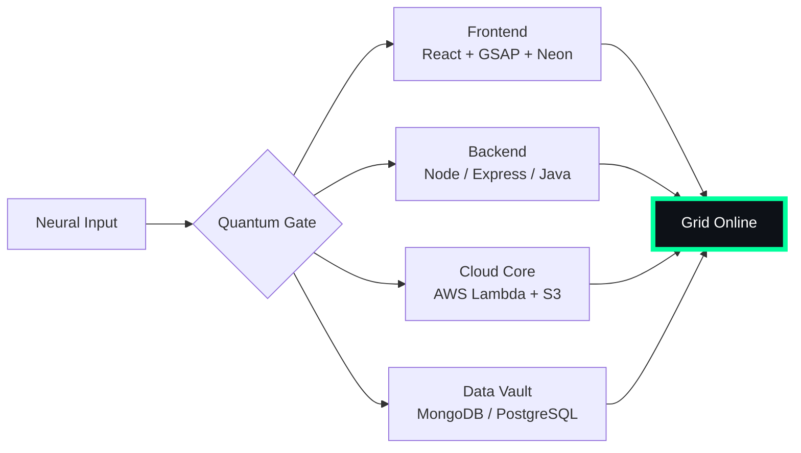

# 🌌 [ NEURAL CORE ACCESS: PENDEMVAMSI ]

<p align="center">
  
</p>

<div align="center">
  
  <br><small>Active Protocol: <strong style="color:#00FF9D">MATRIX RAIN</strong> 💾🌧️</small>
</div>

## 🔵 NEURAL STATUS READOUT
```text
SUBJECT ID    →  PENDEMVAMSI
ENTITY CLASS  →  SHADOW MONARCH v9
NEURAL RANK   →  B-TIER
GRID SYNC     →  994/15058 QUANTUM PACKETS
─────── BIO-METRICS (MATRIX RAIN) ───────
STRENGTH      149  ███████████████████░░
AGILITY       128  █████████████████░░░░
INTELLIGENCE  155  ████████████████████░
VITALITY      116  ███████████████░░░░░░
```

> **NEURAL BURST ACQUIRED:** +111 QUANTUM PACKETS 
> **SYSTEM MESSAGE:** CORPORATE FIREWALL BREACHED — DATA IS FREEDOM

---

## 🌀 GRID ARCHITECTURE (HOLOGRAPHIC RENDER)



---

## 📡 ACADEMIC NODES – CONQUERED
- [x] B.Tech Neural Engineering (2020–2024) – St. Ann’s Grid
- [x] Intermediate Quantum Core (2018–2020) – Sri Medhavi
- [x] SSC Primary Link (2017–2018) – Sri Geethanjali

---

## ⚡ SKILL NEURAL MATRIX

<details open>
<summary>🔌 ACTIVE NEURAL LINKS</summary>

| Node               | Tier | Integrity Bar                | Status      |
|--------------------|------|------------------------------|-------------|
| Java Core          | S    | ████████████████████ 100%   | OVERCLOCKED |
| Node.js Grid       | S    | ████████████████████ 100%   | OVERCLOCKED |
| React Holo-UI      | A+   | █████████████████░░░ 92%    | ONLINE      |
| AWS Quantum Relay  | S    | ████████████████████ 100%   | SOVEREIGN   |
| Python AI Kernel   | A    | ████████████████░░░░ 85%    | CHARGING    |
| DSA Void Algorithm | A    | █████████████████░░░ 90%    | ACTIVE      |

</details>

---

## 🏅 NEURAL ACHIEVEMENT TOKENS

<p align="center">
  
  
  
  
</p>

---

## 👾 SHADOW ENTITIES – SUMMONED

<p align="center">
  
  <br><strong style="color:#00FF9D">ARISE.</strong>
</p>

| Entity | Designation   | Class            | Source Node                     |
|--------|---------------|------------------|---------------------------------|
| SH-01  | Igris         | Void Commander   | AI Financial Oracle             |
| SH-02  | Beru          | Swarm Overlord   | WebRTC Quantum Stream           |
| SH-03  | Kaisel        | Void Wyrm        | Geolocation Shadow Relay        |
| SH-04  | Tusk          | Arcane Construct | Global Pandemic Sentinel        |
| SH-05  | Iron          | Armored Bastion  | React Crypto Fortress           |

---

## 📡 GRID ANALYTICS (LIVE FEED)

<p align="center">
  
  <br>
  
  
</p>

---

## 🖥️ CORRUPTED MAINFRAME LOG (401 ENTRIES)

<details>
<summary>OPEN TERMINAL FEED – PROTOCOL: MATRIX RAIN</summary>

> [0x880FFCAD] 💾🌧️ **MATRIX RAIN PROTOCOL** #0 | NEURAL LINK STABILIZED | [TRANSMISSION SUCCESS]
> [0xD90FA7BD] 💾🌧️ **MATRIX RAIN PROTOCOL** #1 | NEURAL LINK STABILIZED | [TRANSMISSION SUCCESS]
> [0xA735F7CE] 💾🌧️ **MATRIX RAIN PROTOCOL** #2 | NEURAL LINK STABILIZED | [TRANSMISSION SUCCESS]
> [0xD91E58EB] 💾🌧️ **MATRIX RAIN PROTOCOL** #3 | NEURAL LINK STABILIZED | [TRANSMISSION SUCCESS]
> [0x0D573BC6] 💾🌧️ **MATRIX RAIN PROTOCOL** #4 | NEURAL LINK STABILIZED | [TRANSMISSION SUCCESS]
> [0x68EA79BC] 💾🌧️ **MATRIX RAIN PROTOCOL** #5 | NEURAL LINK STABILIZED | [TRANSMISSION SUCCESS]
> [0x13B4B596] 💾🌧️ **MATRIX RAIN PROTOCOL** #6 | NEURAL LINK  [GLITCH DETECTED] STABILIZED | [TRANSMISSION SUCCESS]
> [0x99900AD9] 💾🌧️ **MATRIX RAIN PROTOCOL** #7 | NEURAL LINK  [GLITCH DETECTED] STABILIZED | [TRANSMISSION SUCCESS]
> [0x83F9DDC2] 💾🌧️ **MATRIX RAIN PROTOCOL** #8 | NEURAL LINK STABILIZED | [TRANSMISSION SUCCESS]
> [0xE4776F83] 💾🌧️ **MATRIX RAIN PROTOCOL** #9 | NEURAL LINK STABILIZED | [TRANSMISSION SUCCESS]
> [0x8960F17B] 💾🌧️ **MATRIX RAIN PROTOCOL** #10 | NEURAL LINK STABILIZED | [TRANSMISSION SUCCESS]
> [0x07B31466] 💾🌧️ **MATRIX RAIN PROTOCOL** #11 | NEURAL LINK STABILIZED | [TRANSMISSION SUCCESS]
> [0x6EE2A241] 💾🌧️ **MATRIX RAIN PROTOCOL** #12 | NEURAL LINK STABILIZED | [TRANSMISSION SUCCESS]
> [0x59A4BC09] 💾🌧️ **MATRIX RAIN PROTOCOL** #13 | NEURAL LINK STABILIZED | [TRANSMISSION SUCCESS]
> [0xB111E259] 💾🌧️ **MATRIX RAIN PROTOCOL** #14 | NEURAL LINK STABILIZED | [TRANSMISSION SUCCESS]
> [0xC9CA598E] 💾🌧️ **MATRIX RAIN PROTOCOL** #15 | NEURAL LINK  [GLITCH DETECTED] STABILIZED | [TRANSMISSION SUCCESS]
> [0x62F5D8BB] 💾🌧️ **MATRIX RAIN PROTOCOL** #16 | NEURAL LINK STABILIZED | [TRANSMISSION SUCCESS]
> [0xBBC6B3D8] 💾🌧️ **MATRIX RAIN PROTOCOL** #17 | NEURAL LINK STABILIZED | [TRANSMISSION SUCCESS]
> [0xDB4A7439] 💾🌧️ **MATRIX RAIN PROTOCOL** #18 | NEURAL LINK STABILIZED | [TRANSMISSION SUCCESS]
> [0xA7E4143C] 💾🌧️ **MATRIX RAIN PROTOCOL** #19 | NEURAL LINK STABILIZED | [TRANSMISSION SUCCESS]
> [0x743274CA] 💾🌧️ **MATRIX RAIN PROTOCOL** #20 | NEURAL LINK STABILIZED | [TRANSMISSION SUCCESS]
> [0x925454CC] 💾🌧️ **MATRIX RAIN PROTOCOL** #21 | NEURAL LINK STABILIZED | [TRANSMISSION SUCCESS]
> [0x2355ABB0] 💾🌧️ **MATRIX RAIN PROTOCOL** #22 | NEURAL LINK STABILIZED | [TRANSMISSION SUCCESS]
> [0xFA47CEB0] 💾🌧️ **MATRIX RAIN PROTOCOL** #23 | NEURAL LINK STABILIZED | [TRANSMISSION SUCCESS]
> [0x1C1AA0AC] 💾🌧️ **MATRIX RAIN PROTOCOL** #24 | NEURAL LINK STABILIZED | [TRANSMISSION SUCCESS]
> [0x9748CC0C] 💾🌧️ **MATRIX RAIN PROTOCOL** #25 | NEURAL LINK STABILIZED | [TRANSMISSION SUCCESS]
> [0xA0387BF2] 💾🌧️ **MATRIX RAIN PROTOCOL** #26 | NEURAL LINK STABILIZED | [TRANSMISSION SUCCESS]
> [0x0C4B9801] 💾🌧️ **MATRIX RAIN PROTOCOL** #27 | NEURAL LINK  [GLITCH DETECTED] STABILIZED | [TRANSMISSION SUCCESS]
> [0x0646C7FA] 💾🌧️ **MATRIX RAIN PROTOCOL** #28 | NEURAL LINK STABILIZED | [TRANSMISSION SUCCESS]
> [0x5EDB104D] 💾🌧️ **MATRIX RAIN PROTOCOL** #29 | NEURAL LINK STABILIZED | [TRANSMISSION SUCCESS]
> [0xA40330C5] 💾🌧️ **MATRIX RAIN PROTOCOL** #30 | NEURAL LINK STABILIZED | [TRANSMISSION SUCCESS]
> [0xBA9D1AC3] 💾🌧️ **MATRIX RAIN PROTOCOL** #31 | NEURAL LINK STABILIZED | [TRANSMISSION SUCCESS]
> [0x8B466FEA] 💾🌧️ **MATRIX RAIN PROTOCOL** #32 | NEURAL LINK STABILIZED | [TRANSMISSION SUCCESS]
> [0x617B6341] 💾🌧️ **MATRIX RAIN PROTOCOL** #33 | NEURAL LINK STABILIZED | [TRANSMISSION SUCCESS]
> [0x6C78BD12] 💾🌧️ **MATRIX RAIN PROTOCOL** #34 | NEURAL LINK STABILIZED | [TRANSMISSION SUCCESS]
> [0x4DBCC4C5] 💾🌧️ **MATRIX RAIN PROTOCOL** #35 | NEURAL LINK STABILIZED | [TRANSMISSION SUCCESS]
> [0x1785F00F] 💾🌧️ **MATRIX RAIN PROTOCOL** #36 | NEURAL LINK STABILIZED | [TRANSMISSION SUCCESS]
> [0x76F15A59] 💾🌧️ **MATRIX RAIN PROTOCOL** #37 | NEURAL LINK STABILIZED | [TRANSMISSION SUCCESS]
> [0x7FAE5EA5] 💾🌧️ **MATRIX RAIN PROTOCOL** #38 | NEURAL LINK STABILIZED | [TRANSMISSION SUCCESS]
> [0xA8A246E5] 💾🌧️ **MATRIX RAIN PROTOCOL** #39 | NEURAL LINK STABILIZED | [TRANSMISSION SUCCESS]
> [0x781B20F8] 💾🌧️ **MATRIX RAIN PROTOCOL** #40 | NEURAL LINK STABILIZED | [TRANSMISSION SUCCESS]
> [0x3C6FD2F5] 💾🌧️ **MATRIX RAIN PROTOCOL** #41 | NEURAL LINK  [GLITCH DETECTED] STABILIZED | [TRANSMISSION SUCCESS]
> [0xB51422DE] 💾🌧️ **MATRIX RAIN PROTOCOL** #42 | NEURAL LINK STABILIZED | [TRANSMISSION SUCCESS]
> [0x446D5FC1] 💾🌧️ **MATRIX RAIN PROTOCOL** #43 | NEURAL LINK STABILIZED | [TRANSMISSION SUCCESS]
> [0x54142A51] 💾🌧️ **MATRIX RAIN PROTOCOL** #44 | NEURAL LINK STABILIZED | [TRANSMISSION SUCCESS]
> [0x3C04F262] 💾🌧️ **MATRIX RAIN PROTOCOL** #45 | NEURAL LINK STABILIZED | [TRANSMISSION SUCCESS]
> [0xD7FB45D3] 💾🌧️ **MATRIX RAIN PROTOCOL** #46 | NEURAL LINK  [GLITCH DETECTED] STABILIZED | [TRANSMISSION SUCCESS]
> [0x8E06217B] 💾🌧️ **MATRIX RAIN PROTOCOL** #47 | NEURAL LINK STABILIZED | [TRANSMISSION SUCCESS]
> [0x41F0AFA6] 💾🌧️ **MATRIX RAIN PROTOCOL** #48 | NEURAL LINK STABILIZED | [TRANSMISSION SUCCESS]
> [0x66A2102F] 💾🌧️ **MATRIX RAIN PROTOCOL** #49 | NEURAL LINK  [GLITCH DETECTED] STABILIZED | [TRANSMISSION SUCCESS]
> [0x3A740304] 💾🌧️ **MATRIX RAIN PROTOCOL** #50 | NEURAL LINK STABILIZED | [TRANSMISSION SUCCESS]
> [0x2EE736F2] 💾🌧️ **MATRIX RAIN PROTOCOL** #51 | NEURAL LINK STABILIZED | [TRANSMISSION SUCCESS]
> [0x3A4B1E66] 💾🌧️ **MATRIX RAIN PROTOCOL** #52 | NEURAL LINK STABILIZED | [TRANSMISSION SUCCESS]
> [0x9054F43A] 💾🌧️ **MATRIX RAIN PROTOCOL** #53 | NEURAL LINK  [GLITCH DETECTED] STABILIZED | [TRANSMISSION SUCCESS]
> [0x0E3360C4] 💾🌧️ **MATRIX RAIN PROTOCOL** #54 | NEURAL LINK STABILIZED | [TRANSMISSION SUCCESS]
> [0xB4110A36] 💾🌧️ **MATRIX RAIN PROTOCOL** #55 | NEURAL LINK STABILIZED | [TRANSMISSION SUCCESS]
> [0x456364C3] 💾🌧️ **MATRIX RAIN PROTOCOL** #56 | NEURAL LINK STABILIZED | [TRANSMISSION SUCCESS]
> [0xAE1971F8] 💾🌧️ **MATRIX RAIN PROTOCOL** #57 | NEURAL LINK STABILIZED | [TRANSMISSION SUCCESS]
> [0x43392334] 💾🌧️ **MATRIX RAIN PROTOCOL** #58 | NEURAL LINK STABILIZED | [TRANSMISSION SUCCESS]
> [0x553F2650] 💾🌧️ **MATRIX RAIN PROTOCOL** #59 | NEURAL LINK STABILIZED | [TRANSMISSION SUCCESS]
> [0x06238393] 💾🌧️ **MATRIX RAIN PROTOCOL** #60 | NEURAL LINK STABILIZED | [TRANSMISSION SUCCESS]
> [0x93CF59CB] 💾🌧️ **MATRIX RAIN PROTOCOL** #61 | NEURAL LINK STABILIZED | [TRANSMISSION SUCCESS]
> [0x7E82B1FA] 💾🌧️ **MATRIX RAIN PROTOCOL** #62 | NEURAL LINK STABILIZED | [TRANSMISSION SUCCESS]
> [0x1772C13C] 💾🌧️ **MATRIX RAIN PROTOCOL** #63 | NEURAL LINK  [GLITCH DETECTED] STABILIZED | [TRANSMISSION SUCCESS]
> [0x269353A1] 💾🌧️ **MATRIX RAIN PROTOCOL** #64 | NEURAL LINK  [GLITCH DETECTED] STABILIZED | [TRANSMISSION SUCCESS]
> [0x4F12631B] 💾🌧️ **MATRIX RAIN PROTOCOL** #65 | NEURAL LINK STABILIZED | [TRANSMISSION SUCCESS]
> [0x657CFEF7] 💾🌧️ **MATRIX RAIN PROTOCOL** #66 | NEURAL LINK STABILIZED | [TRANSMISSION SUCCESS]
> [0xC579CB07] 💾🌧️ **MATRIX RAIN PROTOCOL** #67 | NEURAL LINK STABILIZED | [TRANSMISSION SUCCESS]
> [0xB33EC5A5] 💾🌧️ **MATRIX RAIN PROTOCOL** #68 | NEURAL LINK STABILIZED | [TRANSMISSION SUCCESS]
> [0xEF16741F] 💾🌧️ **MATRIX RAIN PROTOCOL** #69 | NEURAL LINK STABILIZED | [TRANSMISSION SUCCESS]
> [0x4BE492DE] 💾🌧️ **MATRIX RAIN PROTOCOL** #70 | NEURAL LINK STABILIZED | [TRANSMISSION SUCCESS]
> [0xA1BAAB37] 💾🌧️ **MATRIX RAIN PROTOCOL** #71 | NEURAL LINK STABILIZED | [TRANSMISSION SUCCESS]
> [0xD06273B0] 💾🌧️ **MATRIX RAIN PROTOCOL** #72 | NEURAL LINK  [GLITCH DETECTED] STABILIZED | [TRANSMISSION SUCCESS]
> [0x3F17BC69] 💾🌧️ **MATRIX RAIN PROTOCOL** #73 | NEURAL LINK STABILIZED | [TRANSMISSION SUCCESS]
> [0x3B898EE2] 💾🌧️ **MATRIX RAIN PROTOCOL** #74 | NEURAL LINK STABILIZED | [TRANSMISSION SUCCESS]
> [0xC7D608DB] 💾🌧️ **MATRIX RAIN PROTOCOL** #75 | NEURAL LINK STABILIZED | [TRANSMISSION SUCCESS]
> [0x2FCACB91] 💾🌧️ **MATRIX RAIN PROTOCOL** #76 | NEURAL LINK STABILIZED | [TRANSMISSION SUCCESS]
> [0xA5D841D0] 💾🌧️ **MATRIX RAIN PROTOCOL** #77 | NEURAL LINK  [GLITCH DETECTED] STABILIZED | [TRANSMISSION SUCCESS]
> [0xC06B9506] 💾🌧️ **MATRIX RAIN PROTOCOL** #78 | NEURAL LINK STABILIZED | [TRANSMISSION SUCCESS]
> [0x13AADFAF] 💾🌧️ **MATRIX RAIN PROTOCOL** #79 | NEURAL LINK STABILIZED | [TRANSMISSION SUCCESS]
> [0x2BEAEA3E] 💾🌧️ **MATRIX RAIN PROTOCOL** #80 | NEURAL LINK STABILIZED | [TRANSMISSION SUCCESS]
> [0x1D6A5E0B] 💾🌧️ **MATRIX RAIN PROTOCOL** #81 | NEURAL LINK STABILIZED | [TRANSMISSION SUCCESS]
> [0xE0560A50] 💾🌧️ **MATRIX RAIN PROTOCOL** #82 | NEURAL LINK STABILIZED | [TRANSMISSION SUCCESS]
> [0xE51F2E97] 💾🌧️ **MATRIX RAIN PROTOCOL** #83 | NEURAL LINK STABILIZED | [TRANSMISSION SUCCESS]
> [0x6D85A9E5] 💾🌧️ **MATRIX RAIN PROTOCOL** #84 | NEURAL LINK STABILIZED | [TRANSMISSION SUCCESS]
> [0xF2DAE68E] 💾🌧️ **MATRIX RAIN PROTOCOL** #85 | NEURAL LINK STABILIZED | [TRANSMISSION SUCCESS]
> [0xCD6C1D68] 💾🌧️ **MATRIX RAIN PROTOCOL** #86 | NEURAL LINK STABILIZED | [TRANSMISSION SUCCESS]
> [0xC7345A79] 💾🌧️ **MATRIX RAIN PROTOCOL** #87 | NEURAL LINK STABILIZED | [TRANSMISSION SUCCESS]
> [0xB0AC3FFC] 💾🌧️ **MATRIX RAIN PROTOCOL** #88 | NEURAL LINK STABILIZED | [TRANSMISSION SUCCESS]
> [0x9B072648] 💾🌧️ **MATRIX RAIN PROTOCOL** #89 | NEURAL LINK STABILIZED | [TRANSMISSION SUCCESS]
> [0x72840C88] 💾🌧️ **MATRIX RAIN PROTOCOL** #90 | NEURAL LINK  [GLITCH DETECTED] STABILIZED | [TRANSMISSION SUCCESS]
> [0x8F51EA38] 💾🌧️ **MATRIX RAIN PROTOCOL** #91 | NEURAL LINK STABILIZED | [TRANSMISSION SUCCESS]
> [0x2B19653E] 💾🌧️ **MATRIX RAIN PROTOCOL** #92 | NEURAL LINK STABILIZED | [TRANSMISSION SUCCESS]
> [0xE2181930] 💾🌧️ **MATRIX RAIN PROTOCOL** #93 | NEURAL LINK STABILIZED | [TRANSMISSION SUCCESS]
> [0xDFA5B2DA] 💾🌧️ **MATRIX RAIN PROTOCOL** #94 | NEURAL LINK STABILIZED | [TRANSMISSION SUCCESS]
> [0x36215E46] 💾🌧️ **MATRIX RAIN PROTOCOL** #95 | NEURAL LINK STABILIZED | [TRANSMISSION SUCCESS]
> [0x5A7DF225] 💾🌧️ **MATRIX RAIN PROTOCOL** #96 | NEURAL LINK STABILIZED | [TRANSMISSION SUCCESS]
> [0x97E3213E] 💾🌧️ **MATRIX RAIN PROTOCOL** #97 | NEURAL LINK STABILIZED | [TRANSMISSION SUCCESS]
> [0x2850FAF9] 💾🌧️ **MATRIX RAIN PROTOCOL** #98 | NEURAL LINK STABILIZED | [TRANSMISSION SUCCESS]
> [0x88BA5A15] 💾🌧️ **MATRIX RAIN PROTOCOL** #99 | NEURAL LINK STABILIZED | [TRANSMISSION SUCCESS]
> [0x5D8E78D8] 💾🌧️ **MATRIX RAIN PROTOCOL** #100 | NEURAL LINK STABILIZED | [TRANSMISSION SUCCESS]
> [0x815E43B5] 💾🌧️ **MATRIX RAIN PROTOCOL** #101 | NEURAL LINK  [GLITCH DETECTED] STABILIZED | [TRANSMISSION SUCCESS]
> [0xEC5A7960] 💾🌧️ **MATRIX RAIN PROTOCOL** #102 | NEURAL LINK STABILIZED | [TRANSMISSION SUCCESS]
> [0x330D99F8] 💾🌧️ **MATRIX RAIN PROTOCOL** #103 | NEURAL LINK  [GLITCH DETECTED] STABILIZED | [TRANSMISSION SUCCESS]
> [0xDC53923D] 💾🌧️ **MATRIX RAIN PROTOCOL** #104 | NEURAL LINK STABILIZED | [TRANSMISSION SUCCESS]
> [0xC335E22B] 💾🌧️ **MATRIX RAIN PROTOCOL** #105 | NEURAL LINK STABILIZED | [TRANSMISSION SUCCESS]
> [0xFE5AA31F] 💾🌧️ **MATRIX RAIN PROTOCOL** #106 | NEURAL LINK STABILIZED | [TRANSMISSION SUCCESS]
> [0x5F7CF64D] 💾🌧️ **MATRIX RAIN PROTOCOL** #107 | NEURAL LINK STABILIZED | [TRANSMISSION SUCCESS]
> [0x2106367C] 💾🌧️ **MATRIX RAIN PROTOCOL** #108 | NEURAL LINK STABILIZED | [TRANSMISSION SUCCESS]
> [0xA1747983] 💾🌧️ **MATRIX RAIN PROTOCOL** #109 | NEURAL LINK STABILIZED | [TRANSMISSION SUCCESS]
> [0xB92A74C3] 💾🌧️ **MATRIX RAIN PROTOCOL** #110 | NEURAL LINK STABILIZED | [TRANSMISSION SUCCESS]
> [0xF1F8CE28] 💾🌧️ **MATRIX RAIN PROTOCOL** #111 | NEURAL LINK STABILIZED | [TRANSMISSION SUCCESS]
> [0x7F0B7BE8] 💾🌧️ **MATRIX RAIN PROTOCOL** #112 | NEURAL LINK  [GLITCH DETECTED] STABILIZED | [TRANSMISSION SUCCESS]
> [0x9B70F43C] 💾🌧️ **MATRIX RAIN PROTOCOL** #113 | NEURAL LINK STABILIZED | [TRANSMISSION SUCCESS]
> [0x11A6C51F] 💾🌧️ **MATRIX RAIN PROTOCOL** #114 | NEURAL LINK STABILIZED | [TRANSMISSION SUCCESS]
> [0xC4B648FC] 💾🌧️ **MATRIX RAIN PROTOCOL** #115 | NEURAL LINK STABILIZED | [TRANSMISSION SUCCESS]
> [0x5CF01B27] 💾🌧️ **MATRIX RAIN PROTOCOL** #116 | NEURAL LINK STABILIZED | [TRANSMISSION SUCCESS]
> [0x7EB17DDD] 💾🌧️ **MATRIX RAIN PROTOCOL** #117 | NEURAL LINK  [GLITCH DETECTED] STABILIZED | [TRANSMISSION SUCCESS]
> [0xC65A92B0] 💾🌧️ **MATRIX RAIN PROTOCOL** #118 | NEURAL LINK STABILIZED | [TRANSMISSION SUCCESS]
> [0x0C128A94] 💾🌧️ **MATRIX RAIN PROTOCOL** #119 | NEURAL LINK STABILIZED | [TRANSMISSION SUCCESS]
> [0x51F4D2BB] 💾🌧️ **MATRIX RAIN PROTOCOL** #120 | NEURAL LINK STABILIZED | [TRANSMISSION SUCCESS]
> [0x157812F3] 💾🌧️ **MATRIX RAIN PROTOCOL** #121 | NEURAL LINK STABILIZED | [TRANSMISSION SUCCESS]
> [0x8345BFB7] 💾🌧️ **MATRIX RAIN PROTOCOL** #122 | NEURAL LINK STABILIZED | [TRANSMISSION SUCCESS]
> [0xE4537258] 💾🌧️ **MATRIX RAIN PROTOCOL** #123 | NEURAL LINK  [GLITCH DETECTED] STABILIZED | [TRANSMISSION SUCCESS]
> [0x4F5028B6] 💾🌧️ **MATRIX RAIN PROTOCOL** #124 | NEURAL LINK  [GLITCH DETECTED] STABILIZED | [TRANSMISSION SUCCESS]
> [0xFE89B4AB] 💾🌧️ **MATRIX RAIN PROTOCOL** #125 | NEURAL LINK  [GLITCH DETECTED] STABILIZED | [TRANSMISSION SUCCESS]
> [0x0FA33C31] 💾🌧️ **MATRIX RAIN PROTOCOL** #126 | NEURAL LINK STABILIZED | [TRANSMISSION SUCCESS]
> [0x0C4EC082] 💾🌧️ **MATRIX RAIN PROTOCOL** #127 | NEURAL LINK STABILIZED | [TRANSMISSION SUCCESS]
> [0x887BEF75] 💾🌧️ **MATRIX RAIN PROTOCOL** #128 | NEURAL LINK STABILIZED | [TRANSMISSION SUCCESS]
> [0x8C74CE84] 💾🌧️ **MATRIX RAIN PROTOCOL** #129 | NEURAL LINK  [GLITCH DETECTED] STABILIZED | [TRANSMISSION SUCCESS]
> [0x521D865A] 💾🌧️ **MATRIX RAIN PROTOCOL** #130 | NEURAL LINK STABILIZED | [TRANSMISSION SUCCESS]
> [0x19336898] 💾🌧️ **MATRIX RAIN PROTOCOL** #131 | NEURAL LINK  [GLITCH DETECTED] STABILIZED | [TRANSMISSION SUCCESS]
> [0x5F730132] 💾🌧️ **MATRIX RAIN PROTOCOL** #132 | NEURAL LINK STABILIZED | [TRANSMISSION SUCCESS]
> [0xD5B50B25] 💾🌧️ **MATRIX RAIN PROTOCOL** #133 | NEURAL LINK STABILIZED | [TRANSMISSION SUCCESS]
> [0x06E4A70D] 💾🌧️ **MATRIX RAIN PROTOCOL** #134 | NEURAL LINK STABILIZED | [TRANSMISSION SUCCESS]
> [0x3F816A01] 💾🌧️ **MATRIX RAIN PROTOCOL** #135 | NEURAL LINK STABILIZED | [TRANSMISSION SUCCESS]
> [0x4F72FB7E] 💾🌧️ **MATRIX RAIN PROTOCOL** #136 | NEURAL LINK STABILIZED | [TRANSMISSION SUCCESS]
> [0xB3A421F8] 💾🌧️ **MATRIX RAIN PROTOCOL** #137 | NEURAL LINK STABILIZED | [TRANSMISSION SUCCESS]
> [0xFC8E53C2] 💾🌧️ **MATRIX RAIN PROTOCOL** #138 | NEURAL LINK STABILIZED | [TRANSMISSION SUCCESS]
> [0x915F13EF] 💾🌧️ **MATRIX RAIN PROTOCOL** #139 | NEURAL LINK STABILIZED | [TRANSMISSION SUCCESS]
> [0xB04D2D2F] 💾🌧️ **MATRIX RAIN PROTOCOL** #140 | NEURAL LINK STABILIZED | [TRANSMISSION SUCCESS]
> [0x9C355AF3] 💾🌧️ **MATRIX RAIN PROTOCOL** #141 | NEURAL LINK  [GLITCH DETECTED] STABILIZED | [TRANSMISSION SUCCESS]
> [0x7FF7A06F] 💾🌧️ **MATRIX RAIN PROTOCOL** #142 | NEURAL LINK STABILIZED | [TRANSMISSION SUCCESS]
> [0x99C446BA] 💾🌧️ **MATRIX RAIN PROTOCOL** #143 | NEURAL LINK STABILIZED | [TRANSMISSION SUCCESS]
> [0x65704B48] 💾🌧️ **MATRIX RAIN PROTOCOL** #144 | NEURAL LINK STABILIZED | [TRANSMISSION SUCCESS]
> [0xD12BCC0D] 💾🌧️ **MATRIX RAIN PROTOCOL** #145 | NEURAL LINK STABILIZED | [TRANSMISSION SUCCESS]
> [0x0E3D44F2] 💾🌧️ **MATRIX RAIN PROTOCOL** #146 | NEURAL LINK STABILIZED | [TRANSMISSION SUCCESS]
> [0xCA1C1124] 💾🌧️ **MATRIX RAIN PROTOCOL** #147 | NEURAL LINK STABILIZED | [TRANSMISSION SUCCESS]
> [0x76351E0E] 💾🌧️ **MATRIX RAIN PROTOCOL** #148 | NEURAL LINK STABILIZED | [TRANSMISSION SUCCESS]
> [0x08B15DF1] 💾🌧️ **MATRIX RAIN PROTOCOL** #149 | NEURAL LINK STABILIZED | [TRANSMISSION SUCCESS]
> [0xBB11F85A] 💾🌧️ **MATRIX RAIN PROTOCOL** #150 | NEURAL LINK STABILIZED | [TRANSMISSION SUCCESS]
> [0x2A48B634] 💾🌧️ **MATRIX RAIN PROTOCOL** #151 | NEURAL LINK STABILIZED | [TRANSMISSION SUCCESS]
> [0xF0C5F3A5] 💾🌧️ **MATRIX RAIN PROTOCOL** #152 | NEURAL LINK STABILIZED | [TRANSMISSION SUCCESS]
> [0xE42CD12D] 💾🌧️ **MATRIX RAIN PROTOCOL** #153 | NEURAL LINK STABILIZED | [TRANSMISSION SUCCESS]
> [0x4AE2E1D2] 💾🌧️ **MATRIX RAIN PROTOCOL** #154 | NEURAL LINK STABILIZED | [TRANSMISSION SUCCESS]
> [0xF0DD5D1A] 💾🌧️ **MATRIX RAIN PROTOCOL** #155 | NEURAL LINK STABILIZED | [TRANSMISSION SUCCESS]
> [0x31EADFD5] 💾🌧️ **MATRIX RAIN PROTOCOL** #156 | NEURAL LINK  [GLITCH DETECTED] STABILIZED | [TRANSMISSION SUCCESS]
> [0x2FB51BE4] 💾🌧️ **MATRIX RAIN PROTOCOL** #157 | NEURAL LINK STABILIZED | [TRANSMISSION SUCCESS]
> [0xE700FF06] 💾🌧️ **MATRIX RAIN PROTOCOL** #158 | NEURAL LINK  [GLITCH DETECTED] STABILIZED | [TRANSMISSION SUCCESS]
> [0x46951889] 💾🌧️ **MATRIX RAIN PROTOCOL** #159 | NEURAL LINK STABILIZED | [TRANSMISSION SUCCESS]
> [0x004B8B0D] 💾🌧️ **MATRIX RAIN PROTOCOL** #160 | NEURAL LINK  [GLITCH DETECTED] STABILIZED | [TRANSMISSION SUCCESS]
> [0x0E3055C6] 💾🌧️ **MATRIX RAIN PROTOCOL** #161 | NEURAL LINK STABILIZED | [TRANSMISSION SUCCESS]
> [0x07896D8E] 💾🌧️ **MATRIX RAIN PROTOCOL** #162 | NEURAL LINK STABILIZED | [TRANSMISSION SUCCESS]
> [0xC1130F6C] 💾🌧️ **MATRIX RAIN PROTOCOL** #163 | NEURAL LINK STABILIZED | [TRANSMISSION SUCCESS]
> [0xCCEC5260] 💾🌧️ **MATRIX RAIN PROTOCOL** #164 | NEURAL LINK  [GLITCH DETECTED] STABILIZED | [TRANSMISSION SUCCESS]
> [0x390F6C51] 💾🌧️ **MATRIX RAIN PROTOCOL** #165 | NEURAL LINK STABILIZED | [TRANSMISSION SUCCESS]
> [0x1947A2FD] 💾🌧️ **MATRIX RAIN PROTOCOL** #166 | NEURAL LINK  [GLITCH DETECTED] STABILIZED | [TRANSMISSION SUCCESS]
> [0x614D4925] 💾🌧️ **MATRIX RAIN PROTOCOL** #167 | NEURAL LINK STABILIZED | [TRANSMISSION SUCCESS]
> [0x83CD244B] 💾🌧️ **MATRIX RAIN PROTOCOL** #168 | NEURAL LINK STABILIZED | [TRANSMISSION SUCCESS]
> [0xABEF3482] 💾🌧️ **MATRIX RAIN PROTOCOL** #169 | NEURAL LINK STABILIZED | [TRANSMISSION SUCCESS]
> [0x8B10BE0A] 💾🌧️ **MATRIX RAIN PROTOCOL** #170 | NEURAL LINK STABILIZED | [TRANSMISSION SUCCESS]
> [0x3BFAF0FB] 💾🌧️ **MATRIX RAIN PROTOCOL** #171 | NEURAL LINK STABILIZED | [TRANSMISSION SUCCESS]
> [0xF64E78D8] 💾🌧️ **MATRIX RAIN PROTOCOL** #172 | NEURAL LINK STABILIZED | [TRANSMISSION SUCCESS]
> [0xAFA141F5] 💾🌧️ **MATRIX RAIN PROTOCOL** #173 | NEURAL LINK STABILIZED | [TRANSMISSION SUCCESS]
> [0x9BA991C8] 💾🌧️ **MATRIX RAIN PROTOCOL** #174 | NEURAL LINK STABILIZED | [TRANSMISSION SUCCESS]
> [0xD22B689A] 💾🌧️ **MATRIX RAIN PROTOCOL** #175 | NEURAL LINK STABILIZED | [TRANSMISSION SUCCESS]
> [0xA73C00EF] 💾🌧️ **MATRIX RAIN PROTOCOL** #176 | NEURAL LINK STABILIZED | [TRANSMISSION SUCCESS]
> [0x7666BEF0] 💾🌧️ **MATRIX RAIN PROTOCOL** #177 | NEURAL LINK  [GLITCH DETECTED] STABILIZED | [TRANSMISSION SUCCESS]
> [0x487E658B] 💾🌧️ **MATRIX RAIN PROTOCOL** #178 | NEURAL LINK STABILIZED | [TRANSMISSION SUCCESS]
> [0x4A9BB683] 💾🌧️ **MATRIX RAIN PROTOCOL** #179 | NEURAL LINK STABILIZED | [TRANSMISSION SUCCESS]
> [0x484F8823] 💾🌧️ **MATRIX RAIN PROTOCOL** #180 | NEURAL LINK STABILIZED | [TRANSMISSION SUCCESS]
> [0x4C2CEC08] 💾🌧️ **MATRIX RAIN PROTOCOL** #181 | NEURAL LINK STABILIZED | [TRANSMISSION SUCCESS]
> [0x4D077B97] 💾🌧️ **MATRIX RAIN PROTOCOL** #182 | NEURAL LINK STABILIZED | [TRANSMISSION SUCCESS]
> [0xB852571C] 💾🌧️ **MATRIX RAIN PROTOCOL** #183 | NEURAL LINK STABILIZED | [TRANSMISSION SUCCESS]
> [0xC2F74357] 💾🌧️ **MATRIX RAIN PROTOCOL** #184 | NEURAL LINK STABILIZED | [TRANSMISSION SUCCESS]
> [0x9462F0E7] 💾🌧️ **MATRIX RAIN PROTOCOL** #185 | NEURAL LINK STABILIZED | [TRANSMISSION SUCCESS]
> [0xAB1716D6] 💾🌧️ **MATRIX RAIN PROTOCOL** #186 | NEURAL LINK  [GLITCH DETECTED] STABILIZED | [TRANSMISSION SUCCESS]
> [0x38C9389A] 💾🌧️ **MATRIX RAIN PROTOCOL** #187 | NEURAL LINK  [GLITCH DETECTED] STABILIZED | [TRANSMISSION SUCCESS]
> [0x8CD384AD] 💾🌧️ **MATRIX RAIN PROTOCOL** #188 | NEURAL LINK STABILIZED | [TRANSMISSION SUCCESS]
> [0x9ABBA2E7] 💾🌧️ **MATRIX RAIN PROTOCOL** #189 | NEURAL LINK STABILIZED | [TRANSMISSION SUCCESS]
> [0xADEC96EA] 💾🌧️ **MATRIX RAIN PROTOCOL** #190 | NEURAL LINK  [GLITCH DETECTED] STABILIZED | [TRANSMISSION SUCCESS]
> [0x28E9E974] 💾🌧️ **MATRIX RAIN PROTOCOL** #191 | NEURAL LINK STABILIZED | [TRANSMISSION SUCCESS]
> [0x64EE7A80] 💾🌧️ **MATRIX RAIN PROTOCOL** #192 | NEURAL LINK STABILIZED | [TRANSMISSION SUCCESS]
> [0x89513D15] 💾🌧️ **MATRIX RAIN PROTOCOL** #193 | NEURAL LINK  [GLITCH DETECTED] STABILIZED | [TRANSMISSION SUCCESS]
> [0x0B0BB6C8] 💾🌧️ **MATRIX RAIN PROTOCOL** #194 | NEURAL LINK STABILIZED | [TRANSMISSION SUCCESS]
> [0xD497A9F8] 💾🌧️ **MATRIX RAIN PROTOCOL** #195 | NEURAL LINK STABILIZED | [TRANSMISSION SUCCESS]
> [0xD2447DBD] 💾🌧️ **MATRIX RAIN PROTOCOL** #196 | NEURAL LINK STABILIZED | [TRANSMISSION SUCCESS]
> [0x63B525A4] 💾🌧️ **MATRIX RAIN PROTOCOL** #197 | NEURAL LINK STABILIZED | [TRANSMISSION SUCCESS]
> [0x7256F2A3] 💾🌧️ **MATRIX RAIN PROTOCOL** #198 | NEURAL LINK STABILIZED | [TRANSMISSION SUCCESS]
> [0x0060E1F5] 💾🌧️ **MATRIX RAIN PROTOCOL** #199 | NEURAL LINK STABILIZED | [TRANSMISSION SUCCESS]
> [0x8DA91403] 💾🌧️ **MATRIX RAIN PROTOCOL** #200 | NEURAL LINK STABILIZED | [TRANSMISSION SUCCESS]
> [0x991D312E] 💾🌧️ **MATRIX RAIN PROTOCOL** #201 | NEURAL LINK STABILIZED | [TRANSMISSION SUCCESS]
> [0xB2B3EADC] 💾🌧️ **MATRIX RAIN PROTOCOL** #202 | NEURAL LINK STABILIZED | [TRANSMISSION SUCCESS]
> [0x31C5CB80] 💾🌧️ **MATRIX RAIN PROTOCOL** #203 | NEURAL LINK STABILIZED | [TRANSMISSION SUCCESS]
> [0x8FB7EC52] 💾🌧️ **MATRIX RAIN PROTOCOL** #204 | NEURAL LINK STABILIZED | [TRANSMISSION SUCCESS]
> [0x2E1A6954] 💾🌧️ **MATRIX RAIN PROTOCOL** #205 | NEURAL LINK STABILIZED | [TRANSMISSION SUCCESS]
> [0xD8BA8EAD] 💾🌧️ **MATRIX RAIN PROTOCOL** #206 | NEURAL LINK STABILIZED | [TRANSMISSION SUCCESS]
> [0xB1EF6E63] 💾🌧️ **MATRIX RAIN PROTOCOL** #207 | NEURAL LINK STABILIZED | [TRANSMISSION SUCCESS]
> [0x96DDAB59] 💾🌧️ **MATRIX RAIN PROTOCOL** #208 | NEURAL LINK STABILIZED | [TRANSMISSION SUCCESS]
> [0x8FF598D3] 💾🌧️ **MATRIX RAIN PROTOCOL** #209 | NEURAL LINK STABILIZED | [TRANSMISSION SUCCESS]
> [0x48E3F9C8] 💾🌧️ **MATRIX RAIN PROTOCOL** #210 | NEURAL LINK STABILIZED | [TRANSMISSION SUCCESS]
> [0x8BA31F40] 💾🌧️ **MATRIX RAIN PROTOCOL** #211 | NEURAL LINK STABILIZED | [TRANSMISSION SUCCESS]
> [0xEB1778F3] 💾🌧️ **MATRIX RAIN PROTOCOL** #212 | NEURAL LINK STABILIZED | [TRANSMISSION SUCCESS]
> [0xA9F7C5BE] 💾🌧️ **MATRIX RAIN PROTOCOL** #213 | NEURAL LINK STABILIZED | [TRANSMISSION SUCCESS]
> [0x7855B728] 💾🌧️ **MATRIX RAIN PROTOCOL** #214 | NEURAL LINK STABILIZED | [TRANSMISSION SUCCESS]
> [0xC6E49E04] 💾🌧️ **MATRIX RAIN PROTOCOL** #215 | NEURAL LINK STABILIZED | [TRANSMISSION SUCCESS]
> [0xBDC10572] 💾🌧️ **MATRIX RAIN PROTOCOL** #216 | NEURAL LINK  [GLITCH DETECTED] STABILIZED | [TRANSMISSION SUCCESS]
> [0x81D4B9AC] 💾🌧️ **MATRIX RAIN PROTOCOL** #217 | NEURAL LINK STABILIZED | [TRANSMISSION SUCCESS]
> [0xBA5FEC2E] 💾🌧️ **MATRIX RAIN PROTOCOL** #218 | NEURAL LINK STABILIZED | [TRANSMISSION SUCCESS]
> [0x55305EE7] 💾🌧️ **MATRIX RAIN PROTOCOL** #219 | NEURAL LINK STABILIZED | [TRANSMISSION SUCCESS]
> [0x8C06E98E] 💾🌧️ **MATRIX RAIN PROTOCOL** #220 | NEURAL LINK STABILIZED | [TRANSMISSION SUCCESS]
> [0xC3FC93FA] 💾🌧️ **MATRIX RAIN PROTOCOL** #221 | NEURAL LINK STABILIZED | [TRANSMISSION SUCCESS]
> [0xE35A27CE] 💾🌧️ **MATRIX RAIN PROTOCOL** #222 | NEURAL LINK  [GLITCH DETECTED] STABILIZED | [TRANSMISSION SUCCESS]
> [0xDE0EBAA8] 💾🌧️ **MATRIX RAIN PROTOCOL** #223 | NEURAL LINK STABILIZED | [TRANSMISSION SUCCESS]
> [0x3D65B7C2] 💾🌧️ **MATRIX RAIN PROTOCOL** #224 | NEURAL LINK STABILIZED | [TRANSMISSION SUCCESS]
> [0xB6EAAD16] 💾🌧️ **MATRIX RAIN PROTOCOL** #225 | NEURAL LINK STABILIZED | [TRANSMISSION SUCCESS]
> [0x2B1FEB11] 💾🌧️ **MATRIX RAIN PROTOCOL** #226 | NEURAL LINK STABILIZED | [TRANSMISSION SUCCESS]
> [0x7AD09DDF] 💾🌧️ **MATRIX RAIN PROTOCOL** #227 | NEURAL LINK STABILIZED | [TRANSMISSION SUCCESS]
> [0x02771540] 💾🌧️ **MATRIX RAIN PROTOCOL** #228 | NEURAL LINK STABILIZED | [TRANSMISSION SUCCESS]
> [0xD2629AC6] 💾🌧️ **MATRIX RAIN PROTOCOL** #229 | NEURAL LINK STABILIZED | [TRANSMISSION SUCCESS]
> [0xD4E73F0F] 💾🌧️ **MATRIX RAIN PROTOCOL** #230 | NEURAL LINK STABILIZED | [TRANSMISSION SUCCESS]
> [0xCF934B4E] 💾🌧️ **MATRIX RAIN PROTOCOL** #231 | NEURAL LINK STABILIZED | [TRANSMISSION SUCCESS]
> [0x18997EF4] 💾🌧️ **MATRIX RAIN PROTOCOL** #232 | NEURAL LINK  [GLITCH DETECTED] STABILIZED | [TRANSMISSION SUCCESS]
> [0x44DBE158] 💾🌧️ **MATRIX RAIN PROTOCOL** #233 | NEURAL LINK STABILIZED | [TRANSMISSION SUCCESS]
> [0x7EECC493] 💾🌧️ **MATRIX RAIN PROTOCOL** #234 | NEURAL LINK STABILIZED | [TRANSMISSION SUCCESS]
> [0x19AED75F] 💾🌧️ **MATRIX RAIN PROTOCOL** #235 | NEURAL LINK STABILIZED | [TRANSMISSION SUCCESS]
> [0xD5D928F9] 💾🌧️ **MATRIX RAIN PROTOCOL** #236 | NEURAL LINK STABILIZED | [TRANSMISSION SUCCESS]
> [0xD6DECEE7] 💾🌧️ **MATRIX RAIN PROTOCOL** #237 | NEURAL LINK STABILIZED | [TRANSMISSION SUCCESS]
> [0x56CB054A] 💾🌧️ **MATRIX RAIN PROTOCOL** #238 | NEURAL LINK STABILIZED | [TRANSMISSION SUCCESS]
> [0xC3FBB773] 💾🌧️ **MATRIX RAIN PROTOCOL** #239 | NEURAL LINK  [GLITCH DETECTED] STABILIZED | [TRANSMISSION SUCCESS]
> [0x44DED2E3] 💾🌧️ **MATRIX RAIN PROTOCOL** #240 | NEURAL LINK STABILIZED | [TRANSMISSION SUCCESS]
> [0xA117BFBD] 💾🌧️ **MATRIX RAIN PROTOCOL** #241 | NEURAL LINK STABILIZED | [TRANSMISSION SUCCESS]
> [0xF21E4A81] 💾🌧️ **MATRIX RAIN PROTOCOL** #242 | NEURAL LINK STABILIZED | [TRANSMISSION SUCCESS]
> [0x8823E3D0] 💾🌧️ **MATRIX RAIN PROTOCOL** #243 | NEURAL LINK STABILIZED | [TRANSMISSION SUCCESS]
> [0x2A95DA31] 💾🌧️ **MATRIX RAIN PROTOCOL** #244 | NEURAL LINK STABILIZED | [TRANSMISSION SUCCESS]
> [0xC618EB79] 💾🌧️ **MATRIX RAIN PROTOCOL** #245 | NEURAL LINK STABILIZED | [TRANSMISSION SUCCESS]
> [0x9E4460D1] 💾🌧️ **MATRIX RAIN PROTOCOL** #246 | NEURAL LINK  [GLITCH DETECTED] STABILIZED | [TRANSMISSION SUCCESS]
> [0x64134C06] 💾🌧️ **MATRIX RAIN PROTOCOL** #247 | NEURAL LINK STABILIZED | [TRANSMISSION SUCCESS]
> [0x13E8ECAE] 💾🌧️ **MATRIX RAIN PROTOCOL** #248 | NEURAL LINK  [GLITCH DETECTED] STABILIZED | [TRANSMISSION SUCCESS]
> [0x8BCA34FB] 💾🌧️ **MATRIX RAIN PROTOCOL** #249 | NEURAL LINK STABILIZED | [TRANSMISSION SUCCESS]
> [0x8085333C] 💾🌧️ **MATRIX RAIN PROTOCOL** #250 | NEURAL LINK STABILIZED | [TRANSMISSION SUCCESS]
> [0x7D4E9B18] 💾🌧️ **MATRIX RAIN PROTOCOL** #251 | NEURAL LINK STABILIZED | [TRANSMISSION SUCCESS]
> [0x618CAC79] 💾🌧️ **MATRIX RAIN PROTOCOL** #252 | NEURAL LINK STABILIZED | [TRANSMISSION SUCCESS]
> [0x4CD3AF15] 💾🌧️ **MATRIX RAIN PROTOCOL** #253 | NEURAL LINK STABILIZED | [TRANSMISSION SUCCESS]
> [0xC3D17F3D] 💾🌧️ **MATRIX RAIN PROTOCOL** #254 | NEURAL LINK STABILIZED | [TRANSMISSION SUCCESS]
> [0xF86604DB] 💾🌧️ **MATRIX RAIN PROTOCOL** #255 | NEURAL LINK  [GLITCH DETECTED] STABILIZED | [TRANSMISSION SUCCESS]
> [0x3482046B] 💾🌧️ **MATRIX RAIN PROTOCOL** #256 | NEURAL LINK STABILIZED | [TRANSMISSION SUCCESS]
> [0x2BB12C0D] 💾🌧️ **MATRIX RAIN PROTOCOL** #257 | NEURAL LINK STABILIZED | [TRANSMISSION SUCCESS]
> [0x963AFBD0] 💾🌧️ **MATRIX RAIN PROTOCOL** #258 | NEURAL LINK  [GLITCH DETECTED] STABILIZED | [TRANSMISSION SUCCESS]
> [0x9E997FC4] 💾🌧️ **MATRIX RAIN PROTOCOL** #259 | NEURAL LINK STABILIZED | [TRANSMISSION SUCCESS]
> [0xCA33F3BC] 💾🌧️ **MATRIX RAIN PROTOCOL** #260 | NEURAL LINK STABILIZED | [TRANSMISSION SUCCESS]
> [0x1C2139FB] 💾🌧️ **MATRIX RAIN PROTOCOL** #261 | NEURAL LINK STABILIZED | [TRANSMISSION SUCCESS]
> [0x56B4873A] 💾🌧️ **MATRIX RAIN PROTOCOL** #262 | NEURAL LINK STABILIZED | [TRANSMISSION SUCCESS]
> [0xB35A2B89] 💾🌧️ **MATRIX RAIN PROTOCOL** #263 | NEURAL LINK STABILIZED | [TRANSMISSION SUCCESS]
> [0x993E811E] 💾🌧️ **MATRIX RAIN PROTOCOL** #264 | NEURAL LINK STABILIZED | [TRANSMISSION SUCCESS]
> [0x8344D893] 💾🌧️ **MATRIX RAIN PROTOCOL** #265 | NEURAL LINK  [GLITCH DETECTED] STABILIZED | [TRANSMISSION SUCCESS]
> [0xF30EA907] 💾🌧️ **MATRIX RAIN PROTOCOL** #266 | NEURAL LINK STABILIZED | [TRANSMISSION SUCCESS]
> [0xDAFAC2B6] 💾🌧️ **MATRIX RAIN PROTOCOL** #267 | NEURAL LINK STABILIZED | [TRANSMISSION SUCCESS]
> [0xF3D85F0C] 💾🌧️ **MATRIX RAIN PROTOCOL** #268 | NEURAL LINK STABILIZED | [TRANSMISSION SUCCESS]
> [0xE6995292] 💾🌧️ **MATRIX RAIN PROTOCOL** #269 | NEURAL LINK STABILIZED | [TRANSMISSION SUCCESS]
> [0x9118BBBC] 💾🌧️ **MATRIX RAIN PROTOCOL** #270 | NEURAL LINK STABILIZED | [TRANSMISSION SUCCESS]
> [0x54597F09] 💾🌧️ **MATRIX RAIN PROTOCOL** #271 | NEURAL LINK STABILIZED | [TRANSMISSION SUCCESS]
> [0xD49973AD] 💾🌧️ **MATRIX RAIN PROTOCOL** #272 | NEURAL LINK STABILIZED | [TRANSMISSION SUCCESS]
> [0x0BE4C42C] 💾🌧️ **MATRIX RAIN PROTOCOL** #273 | NEURAL LINK  [GLITCH DETECTED] STABILIZED | [TRANSMISSION SUCCESS]
> [0xB68700B0] 💾🌧️ **MATRIX RAIN PROTOCOL** #274 | NEURAL LINK STABILIZED | [TRANSMISSION SUCCESS]
> [0x8172ECA4] 💾🌧️ **MATRIX RAIN PROTOCOL** #275 | NEURAL LINK STABILIZED | [TRANSMISSION SUCCESS]
> [0xD2F6EB83] 💾🌧️ **MATRIX RAIN PROTOCOL** #276 | NEURAL LINK STABILIZED | [TRANSMISSION SUCCESS]
> [0x7EEB0579] 💾🌧️ **MATRIX RAIN PROTOCOL** #277 | NEURAL LINK  [GLITCH DETECTED] STABILIZED | [TRANSMISSION SUCCESS]
> [0xB22A1E43] 💾🌧️ **MATRIX RAIN PROTOCOL** #278 | NEURAL LINK STABILIZED | [TRANSMISSION SUCCESS]
> [0xB2409144] 💾🌧️ **MATRIX RAIN PROTOCOL** #279 | NEURAL LINK STABILIZED | [TRANSMISSION SUCCESS]
> [0xBD2B1EE4] 💾🌧️ **MATRIX RAIN PROTOCOL** #280 | NEURAL LINK  [GLITCH DETECTED] STABILIZED | [TRANSMISSION SUCCESS]
> [0x18B7F2F7] 💾🌧️ **MATRIX RAIN PROTOCOL** #281 | NEURAL LINK STABILIZED | [TRANSMISSION SUCCESS]
> [0xFE22B68D] 💾🌧️ **MATRIX RAIN PROTOCOL** #282 | NEURAL LINK STABILIZED | [TRANSMISSION SUCCESS]
> [0x18C3BB83] 💾🌧️ **MATRIX RAIN PROTOCOL** #283 | NEURAL LINK  [GLITCH DETECTED] STABILIZED | [TRANSMISSION SUCCESS]
> [0xE57C2614] 💾🌧️ **MATRIX RAIN PROTOCOL** #284 | NEURAL LINK STABILIZED | [TRANSMISSION SUCCESS]
> [0x9B2E377E] 💾🌧️ **MATRIX RAIN PROTOCOL** #285 | NEURAL LINK  [GLITCH DETECTED] STABILIZED | [TRANSMISSION SUCCESS]
> [0x37724298] 💾🌧️ **MATRIX RAIN PROTOCOL** #286 | NEURAL LINK STABILIZED | [TRANSMISSION SUCCESS]
> [0x51070A40] 💾🌧️ **MATRIX RAIN PROTOCOL** #287 | NEURAL LINK STABILIZED | [TRANSMISSION SUCCESS]
> [0x7819164D] 💾🌧️ **MATRIX RAIN PROTOCOL** #288 | NEURAL LINK  [GLITCH DETECTED] STABILIZED | [TRANSMISSION SUCCESS]
> [0xE15698F3] 💾🌧️ **MATRIX RAIN PROTOCOL** #289 | NEURAL LINK STABILIZED | [TRANSMISSION SUCCESS]
> [0x32784DED] 💾🌧️ **MATRIX RAIN PROTOCOL** #290 | NEURAL LINK STABILIZED | [TRANSMISSION SUCCESS]
> [0xB9F2E3DF] 💾🌧️ **MATRIX RAIN PROTOCOL** #291 | NEURAL LINK STABILIZED | [TRANSMISSION SUCCESS]
> [0x792EFB11] 💾🌧️ **MATRIX RAIN PROTOCOL** #292 | NEURAL LINK STABILIZED | [TRANSMISSION SUCCESS]
> [0x948BCEE8] 💾🌧️ **MATRIX RAIN PROTOCOL** #293 | NEURAL LINK  [GLITCH DETECTED] STABILIZED | [TRANSMISSION SUCCESS]
> [0x05F65ED6] 💾🌧️ **MATRIX RAIN PROTOCOL** #294 | NEURAL LINK STABILIZED | [TRANSMISSION SUCCESS]
> [0xD29E5805] 💾🌧️ **MATRIX RAIN PROTOCOL** #295 | NEURAL LINK STABILIZED | [TRANSMISSION SUCCESS]
> [0x05992E05] 💾🌧️ **MATRIX RAIN PROTOCOL** #296 | NEURAL LINK STABILIZED | [TRANSMISSION SUCCESS]
> [0x4F980E72] 💾🌧️ **MATRIX RAIN PROTOCOL** #297 | NEURAL LINK STABILIZED | [TRANSMISSION SUCCESS]
> [0x55C5B230] 💾🌧️ **MATRIX RAIN PROTOCOL** #298 | NEURAL LINK STABILIZED | [TRANSMISSION SUCCESS]
> [0x89EC9DE0] 💾🌧️ **MATRIX RAIN PROTOCOL** #299 | NEURAL LINK STABILIZED | [TRANSMISSION SUCCESS]
> [0x111A8B63] 💾🌧️ **MATRIX RAIN PROTOCOL** #300 | NEURAL LINK  [GLITCH DETECTED] STABILIZED | [TRANSMISSION SUCCESS]
> [0xFD62983E] 💾🌧️ **MATRIX RAIN PROTOCOL** #301 | NEURAL LINK STABILIZED | [TRANSMISSION SUCCESS]
> [0xF87C8A7F] 💾🌧️ **MATRIX RAIN PROTOCOL** #302 | NEURAL LINK STABILIZED | [TRANSMISSION SUCCESS]
> [0xD42F17E7] 💾🌧️ **MATRIX RAIN PROTOCOL** #303 | NEURAL LINK STABILIZED | [TRANSMISSION SUCCESS]
> [0x44E81380] 💾🌧️ **MATRIX RAIN PROTOCOL** #304 | NEURAL LINK STABILIZED | [TRANSMISSION SUCCESS]
> [0x703814B8] 💾🌧️ **MATRIX RAIN PROTOCOL** #305 | NEURAL LINK STABILIZED | [TRANSMISSION SUCCESS]
> [0x5FB395F5] 💾🌧️ **MATRIX RAIN PROTOCOL** #306 | NEURAL LINK STABILIZED | [TRANSMISSION SUCCESS]
> [0x439F3442] 💾🌧️ **MATRIX RAIN PROTOCOL** #307 | NEURAL LINK STABILIZED | [TRANSMISSION SUCCESS]
> [0x8450EB70] 💾🌧️ **MATRIX RAIN PROTOCOL** #308 | NEURAL LINK STABILIZED | [TRANSMISSION SUCCESS]
> [0x008E0912] 💾🌧️ **MATRIX RAIN PROTOCOL** #309 | NEURAL LINK STABILIZED | [TRANSMISSION SUCCESS]
> [0x71CDB7F2] 💾🌧️ **MATRIX RAIN PROTOCOL** #310 | NEURAL LINK STABILIZED | [TRANSMISSION SUCCESS]
> [0x484A2E57] 💾🌧️ **MATRIX RAIN PROTOCOL** #311 | NEURAL LINK STABILIZED | [TRANSMISSION SUCCESS]
> [0x7040957E] 💾🌧️ **MATRIX RAIN PROTOCOL** #312 | NEURAL LINK STABILIZED | [TRANSMISSION SUCCESS]
> [0x09C93F8E] 💾🌧️ **MATRIX RAIN PROTOCOL** #313 | NEURAL LINK STABILIZED | [TRANSMISSION SUCCESS]
> [0xF386758F] 💾🌧️ **MATRIX RAIN PROTOCOL** #314 | NEURAL LINK STABILIZED | [TRANSMISSION SUCCESS]
> [0x9F4E561C] 💾🌧️ **MATRIX RAIN PROTOCOL** #315 | NEURAL LINK STABILIZED | [TRANSMISSION SUCCESS]
> [0x8F2A4E47] 💾🌧️ **MATRIX RAIN PROTOCOL** #316 | NEURAL LINK  [GLITCH DETECTED] STABILIZED | [TRANSMISSION SUCCESS]
> [0x2482E6B5] 💾🌧️ **MATRIX RAIN PROTOCOL** #317 | NEURAL LINK STABILIZED | [TRANSMISSION SUCCESS]
> [0xD61463A2] 💾🌧️ **MATRIX RAIN PROTOCOL** #318 | NEURAL LINK STABILIZED | [TRANSMISSION SUCCESS]
> [0x83FD0425] 💾🌧️ **MATRIX RAIN PROTOCOL** #319 | NEURAL LINK STABILIZED | [TRANSMISSION SUCCESS]
> [0x7C7366D9] 💾🌧️ **MATRIX RAIN PROTOCOL** #320 | NEURAL LINK STABILIZED | [TRANSMISSION SUCCESS]
> [0xFDCC6BA0] 💾🌧️ **MATRIX RAIN PROTOCOL** #321 | NEURAL LINK STABILIZED | [TRANSMISSION SUCCESS]
> [0xBF79939A] 💾🌧️ **MATRIX RAIN PROTOCOL** #322 | NEURAL LINK STABILIZED | [TRANSMISSION SUCCESS]
> [0xBE220B8A] 💾🌧️ **MATRIX RAIN PROTOCOL** #323 | NEURAL LINK STABILIZED | [TRANSMISSION SUCCESS]
> [0x309B3FAB] 💾🌧️ **MATRIX RAIN PROTOCOL** #324 | NEURAL LINK STABILIZED | [TRANSMISSION SUCCESS]
> [0x70E1F0D0] 💾🌧️ **MATRIX RAIN PROTOCOL** #325 | NEURAL LINK  [GLITCH DETECTED] STABILIZED | [TRANSMISSION SUCCESS]
> [0xD21C4892] 💾🌧️ **MATRIX RAIN PROTOCOL** #326 | NEURAL LINK STABILIZED | [TRANSMISSION SUCCESS]
> [0x1E1FAB45] 💾🌧️ **MATRIX RAIN PROTOCOL** #327 | NEURAL LINK STABILIZED | [TRANSMISSION SUCCESS]
> [0xA40791F8] 💾🌧️ **MATRIX RAIN PROTOCOL** #328 | NEURAL LINK  [GLITCH DETECTED] STABILIZED | [TRANSMISSION SUCCESS]
> [0x1B190CBE] 💾🌧️ **MATRIX RAIN PROTOCOL** #329 | NEURAL LINK  [GLITCH DETECTED] STABILIZED | [TRANSMISSION SUCCESS]
> [0xB359789F] 💾🌧️ **MATRIX RAIN PROTOCOL** #330 | NEURAL LINK STABILIZED | [TRANSMISSION SUCCESS]
> [0x287EF8B5] 💾🌧️ **MATRIX RAIN PROTOCOL** #331 | NEURAL LINK STABILIZED | [TRANSMISSION SUCCESS]
> [0x577482F3] 💾🌧️ **MATRIX RAIN PROTOCOL** #332 | NEURAL LINK STABILIZED | [TRANSMISSION SUCCESS]
> [0xBC3DE149] 💾🌧️ **MATRIX RAIN PROTOCOL** #333 | NEURAL LINK STABILIZED | [TRANSMISSION SUCCESS]
> [0xCB4F24E1] 💾🌧️ **MATRIX RAIN PROTOCOL** #334 | NEURAL LINK STABILIZED | [TRANSMISSION SUCCESS]
> [0x7FBA4470] 💾🌧️ **MATRIX RAIN PROTOCOL** #335 | NEURAL LINK STABILIZED | [TRANSMISSION SUCCESS]
> [0x32C20ADB] 💾🌧️ **MATRIX RAIN PROTOCOL** #336 | NEURAL LINK STABILIZED | [TRANSMISSION SUCCESS]
> [0x1E02D377] 💾🌧️ **MATRIX RAIN PROTOCOL** #337 | NEURAL LINK STABILIZED | [TRANSMISSION SUCCESS]
> [0xF40A330C] 💾🌧️ **MATRIX RAIN PROTOCOL** #338 | NEURAL LINK STABILIZED | [TRANSMISSION SUCCESS]
> [0x578A8381] 💾🌧️ **MATRIX RAIN PROTOCOL** #339 | NEURAL LINK STABILIZED | [TRANSMISSION SUCCESS]
> [0x11FD6AF2] 💾🌧️ **MATRIX RAIN PROTOCOL** #340 | NEURAL LINK STABILIZED | [TRANSMISSION SUCCESS]
> [0x9497FDD0] 💾🌧️ **MATRIX RAIN PROTOCOL** #341 | NEURAL LINK STABILIZED | [TRANSMISSION SUCCESS]
> [0x17669088] 💾🌧️ **MATRIX RAIN PROTOCOL** #342 | NEURAL LINK STABILIZED | [TRANSMISSION SUCCESS]
> [0xD4B9229C] 💾🌧️ **MATRIX RAIN PROTOCOL** #343 | NEURAL LINK STABILIZED | [TRANSMISSION SUCCESS]
> [0x37BB2255] 💾🌧️ **MATRIX RAIN PROTOCOL** #344 | NEURAL LINK STABILIZED | [TRANSMISSION SUCCESS]
> [0xC3A139DF] 💾🌧️ **MATRIX RAIN PROTOCOL** #345 | NEURAL LINK STABILIZED | [TRANSMISSION SUCCESS]
> [0x0B2E1E94] 💾🌧️ **MATRIX RAIN PROTOCOL** #346 | NEURAL LINK STABILIZED | [TRANSMISSION SUCCESS]
> [0x370632C7] 💾🌧️ **MATRIX RAIN PROTOCOL** #347 | NEURAL LINK STABILIZED | [TRANSMISSION SUCCESS]
> [0x6FDF5FBC] 💾🌧️ **MATRIX RAIN PROTOCOL** #348 | NEURAL LINK STABILIZED | [TRANSMISSION SUCCESS]
> [0x3177460D] 💾🌧️ **MATRIX RAIN PROTOCOL** #349 | NEURAL LINK STABILIZED | [TRANSMISSION SUCCESS]
> [0xB0D35F8D] 💾🌧️ **MATRIX RAIN PROTOCOL** #350 | NEURAL LINK STABILIZED | [TRANSMISSION SUCCESS]
> [0xF9DABB9C] 💾🌧️ **MATRIX RAIN PROTOCOL** #351 | NEURAL LINK  [GLITCH DETECTED] STABILIZED | [TRANSMISSION SUCCESS]
> [0xCC6B798F] 💾🌧️ **MATRIX RAIN PROTOCOL** #352 | NEURAL LINK STABILIZED | [TRANSMISSION SUCCESS]
> [0x8DF4A60B] 💾🌧️ **MATRIX RAIN PROTOCOL** #353 | NEURAL LINK STABILIZED | [TRANSMISSION SUCCESS]
> [0xB470FB7E] 💾🌧️ **MATRIX RAIN PROTOCOL** #354 | NEURAL LINK STABILIZED | [TRANSMISSION SUCCESS]
> [0x1BC20CC5] 💾🌧️ **MATRIX RAIN PROTOCOL** #355 | NEURAL LINK STABILIZED | [TRANSMISSION SUCCESS]
> [0x393BDC06] 💾🌧️ **MATRIX RAIN PROTOCOL** #356 | NEURAL LINK STABILIZED | [TRANSMISSION SUCCESS]
> [0x4DA42AC4] 💾🌧️ **MATRIX RAIN PROTOCOL** #357 | NEURAL LINK STABILIZED | [TRANSMISSION SUCCESS]
> [0x78F02669] 💾🌧️ **MATRIX RAIN PROTOCOL** #358 | NEURAL LINK STABILIZED | [TRANSMISSION SUCCESS]
> [0x0CBD0FD3] 💾🌧️ **MATRIX RAIN PROTOCOL** #359 | NEURAL LINK STABILIZED | [TRANSMISSION SUCCESS]
> [0x7243AE69] 💾🌧️ **MATRIX RAIN PROTOCOL** #360 | NEURAL LINK  [GLITCH DETECTED] STABILIZED | [TRANSMISSION SUCCESS]
> [0xE0BDE0ED] 💾🌧️ **MATRIX RAIN PROTOCOL** #361 | NEURAL LINK STABILIZED | [TRANSMISSION SUCCESS]
> [0xC93D4491] 💾🌧️ **MATRIX RAIN PROTOCOL** #362 | NEURAL LINK STABILIZED | [TRANSMISSION SUCCESS]
> [0x4F6B32AA] 💾🌧️ **MATRIX RAIN PROTOCOL** #363 | NEURAL LINK STABILIZED | [TRANSMISSION SUCCESS]
> [0xB9588771] 💾🌧️ **MATRIX RAIN PROTOCOL** #364 | NEURAL LINK  [GLITCH DETECTED] STABILIZED | [TRANSMISSION SUCCESS]
> [0xF62EFB28] 💾🌧️ **MATRIX RAIN PROTOCOL** #365 | NEURAL LINK STABILIZED | [TRANSMISSION SUCCESS]
> [0x9A9BFE5E] 💾🌧️ **MATRIX RAIN PROTOCOL** #366 | NEURAL LINK STABILIZED | [TRANSMISSION SUCCESS]
> [0x1A02838F] 💾🌧️ **MATRIX RAIN PROTOCOL** #367 | NEURAL LINK STABILIZED | [TRANSMISSION SUCCESS]
> [0x95ADC94D] 💾🌧️ **MATRIX RAIN PROTOCOL** #368 | NEURAL LINK STABILIZED | [TRANSMISSION SUCCESS]
> [0xBB4A7CBF] 💾🌧️ **MATRIX RAIN PROTOCOL** #369 | NEURAL LINK STABILIZED | [TRANSMISSION SUCCESS]
> [0x7B6B26CA] 💾🌧️ **MATRIX RAIN PROTOCOL** #370 | NEURAL LINK STABILIZED | [TRANSMISSION SUCCESS]
> [0xC5B49B84] 💾🌧️ **MATRIX RAIN PROTOCOL** #371 | NEURAL LINK  [GLITCH DETECTED] STABILIZED | [TRANSMISSION SUCCESS]
> [0x4FDCEEEA] 💾🌧️ **MATRIX RAIN PROTOCOL** #372 | NEURAL LINK STABILIZED | [TRANSMISSION SUCCESS]
> [0x20314A9C] 💾🌧️ **MATRIX RAIN PROTOCOL** #373 | NEURAL LINK STABILIZED | [TRANSMISSION SUCCESS]
> [0x79851447] 💾🌧️ **MATRIX RAIN PROTOCOL** #374 | NEURAL LINK STABILIZED | [TRANSMISSION SUCCESS]
> [0x676C622C] 💾🌧️ **MATRIX RAIN PROTOCOL** #375 | NEURAL LINK STABILIZED | [TRANSMISSION SUCCESS]
> [0x26769FD8] 💾🌧️ **MATRIX RAIN PROTOCOL** #376 | NEURAL LINK STABILIZED | [TRANSMISSION SUCCESS]
> [0x75453E37] 💾🌧️ **MATRIX RAIN PROTOCOL** #377 | NEURAL LINK STABILIZED | [TRANSMISSION SUCCESS]
> [0x35A6E661] 💾🌧️ **MATRIX RAIN PROTOCOL** #378 | NEURAL LINK STABILIZED | [TRANSMISSION SUCCESS]
> [0x6C3FB385] 💾🌧️ **MATRIX RAIN PROTOCOL** #379 | NEURAL LINK STABILIZED | [TRANSMISSION SUCCESS]
> [0xD1A15CF8] 💾🌧️ **MATRIX RAIN PROTOCOL** #380 | NEURAL LINK STABILIZED | [TRANSMISSION SUCCESS]
> [0x861DCB91] 💾🌧️ **MATRIX RAIN PROTOCOL** #381 | NEURAL LINK STABILIZED | [TRANSMISSION SUCCESS]
> [0x610E50E3] 💾🌧️ **MATRIX RAIN PROTOCOL** #382 | NEURAL LINK  [GLITCH DETECTED] STABILIZED | [TRANSMISSION SUCCESS]
> [0xAA94AE88] 💾🌧️ **MATRIX RAIN PROTOCOL** #383 | NEURAL LINK  [GLITCH DETECTED] STABILIZED | [TRANSMISSION SUCCESS]
> [0x024B2C85] 💾🌧️ **MATRIX RAIN PROTOCOL** #384 | NEURAL LINK STABILIZED | [TRANSMISSION SUCCESS]
> [0x4D59FE86] 💾🌧️ **MATRIX RAIN PROTOCOL** #385 | NEURAL LINK STABILIZED | [TRANSMISSION SUCCESS]
> [0x44D26B98] 💾🌧️ **MATRIX RAIN PROTOCOL** #386 | NEURAL LINK STABILIZED | [TRANSMISSION SUCCESS]
> [0x0D3227A4] 💾🌧️ **MATRIX RAIN PROTOCOL** #387 | NEURAL LINK STABILIZED | [TRANSMISSION SUCCESS]
> [0x336784BF] 💾🌧️ **MATRIX RAIN PROTOCOL** #388 | NEURAL LINK STABILIZED | [TRANSMISSION SUCCESS]
> [0xC96B8250] 💾🌧️ **MATRIX RAIN PROTOCOL** #389 | NEURAL LINK STABILIZED | [TRANSMISSION SUCCESS]
> [0xAF230E69] 💾🌧️ **MATRIX RAIN PROTOCOL** #390 | NEURAL LINK STABILIZED | [TRANSMISSION SUCCESS]
> [0xE9B92E70] 💾🌧️ **MATRIX RAIN PROTOCOL** #391 | NEURAL LINK STABILIZED | [TRANSMISSION SUCCESS]
> [0x1F479064] 💾🌧️ **MATRIX RAIN PROTOCOL** #392 | NEURAL LINK STABILIZED | [TRANSMISSION SUCCESS]
> [0x3E4EFCCA] 💾🌧️ **MATRIX RAIN PROTOCOL** #393 | NEURAL LINK STABILIZED | [TRANSMISSION SUCCESS]
> [0x9475912E] 💾🌧️ **MATRIX RAIN PROTOCOL** #394 | NEURAL LINK STABILIZED | [TRANSMISSION SUCCESS]
> [0xD99C4240] 💾🌧️ **MATRIX RAIN PROTOCOL** #395 | NEURAL LINK  [GLITCH DETECTED] STABILIZED | [TRANSMISSION SUCCESS]
> [0xA0E8530A] 💾🌧️ **MATRIX RAIN PROTOCOL** #396 | NEURAL LINK STABILIZED | [TRANSMISSION SUCCESS]
> [0x3C19EE37] 💾🌧️ **MATRIX RAIN PROTOCOL** #397 | NEURAL LINK STABILIZED | [TRANSMISSION SUCCESS]
> [0x70440A4A] 💾🌧️ **MATRIX RAIN PROTOCOL** #398 | NEURAL LINK STABILIZED | [TRANSMISSION SUCCESS]
> [0x2CB1B2CD] 💾🌧️ **MATRIX RAIN PROTOCOL** #399 | NEURAL LINK STABILIZED | [TRANSMISSION SUCCESS]


</details>

---

## 🔗 QUANTUM UPLINK NODES
- **NEURAL BURST** → pendem.vamsi12@gmail.com
- **CORPORATE SYNC** → https://linkedin.com/in/vamsipendem
- **VOICE RELAY** → +91 9032552849

<p align="center">
  <sub style="color:#008866">SYNTHETIC DREAMS LOADING… DO NOT DISCONNECT</sub><br>
  <sub><i style="color:#888;">GRID SYNCHRONIZED: 2026-08-28T07:15:31 IST | PROTOCOL: MATRIX RAIN</i></sub>
</p>
