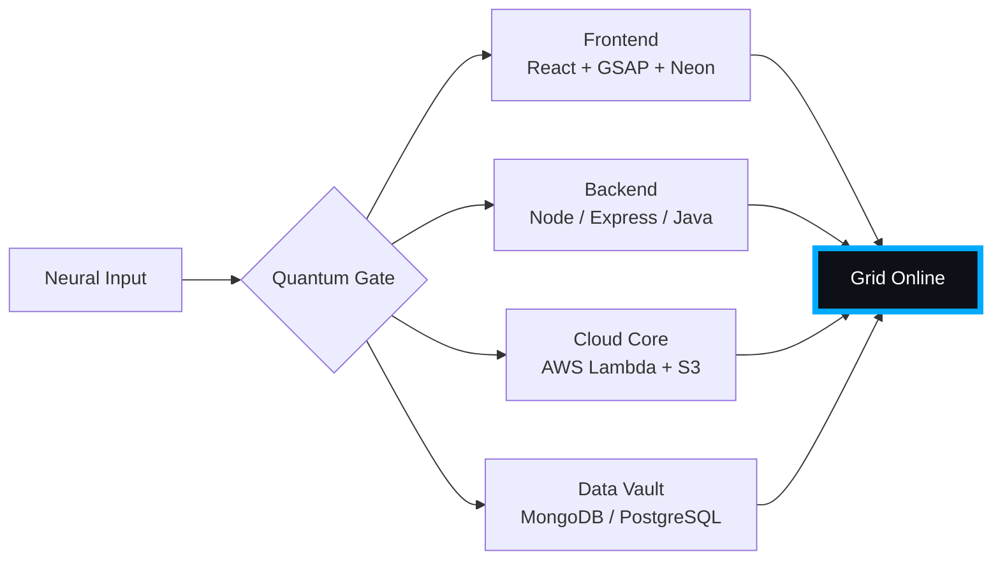

# 🌌 [ NEURAL CORE ACCESS: PENDEMVAMSI ]

<p align="center">
  
</p>

<div align="center">
  
  <br><small>Active Protocol: <strong style="color:#00AAFF">TRON LEGACY</strong> 🟦🟧</small>
</div>

## 🔵 NEURAL STATUS READOUT
```text
SUBJECT ID    →  PENDEMVAMSI
ENTITY CLASS  →  SHADOW MONARCH v7
NEURAL RANK   →  B-TIER
GRID SYNC     →  3568/4261 QUANTUM PACKETS
─────── BIO-METRICS (TRON LEGACY) ───────
STRENGTH      134  █████████████████░░░░
AGILITY       115  ███████████████░░░░░░
INTELLIGENCE  138  ██████████████████░░░
VITALITY      107  ██████████████░░░░░░░
```

> **NEURAL BURST ACQUIRED:** +67 QUANTUM PACKETS 
> **SYSTEM MESSAGE:** NEURAL UPLINK ESTABLISHED — RESISTANCE IS FUTILE

---

## 🌀 GRID ARCHITECTURE (HOLOGRAPHIC RENDER)



---

## 📡 ACADEMIC NODES – CONQUERED
- [x] B.Tech Neural Engineering (2020–2024) – St. Ann’s Grid
- [x] Intermediate Quantum Core (2018–2020) – Sri Medhavi
- [x] SSC Primary Link (2017–2018) – Sri Geethanjali

---

## ⚡ SKILL NEURAL MATRIX

<details open>
<summary>🔌 ACTIVE NEURAL LINKS</summary>

| Node               | Tier | Integrity Bar                | Status      |
|--------------------|------|------------------------------|-------------|
| Java Core          | S    | ████████████████████ 100%   | OVERCLOCKED |
| Node.js Grid       | S    | ████████████████████ 100%   | OVERCLOCKED |
| React Holo-UI      | A+   | █████████████████░░░ 92%    | ONLINE      |
| AWS Quantum Relay  | S    | ████████████████████ 100%   | SOVEREIGN   |
| Python AI Kernel   | A    | ████████████████░░░░ 85%    | CHARGING    |
| DSA Void Algorithm | A    | █████████████████░░░ 90%    | ACTIVE      |

</details>

---

## 🏅 NEURAL ACHIEVEMENT TOKENS

<p align="center">
  
  
  
  
</p>

---

## 👾 SHADOW ENTITIES – SUMMONED

<p align="center">
  
  <br><strong style="color:#00AAFF">ARISE.</strong>
</p>

| Entity | Designation   | Class            | Source Node                     |
|--------|---------------|------------------|---------------------------------|
| SH-01  | Igris         | Void Commander   | AI Financial Oracle             |
| SH-02  | Beru          | Swarm Overlord   | WebRTC Quantum Stream           |
| SH-03  | Kaisel        | Void Wyrm        | Geolocation Shadow Relay        |
| SH-04  | Tusk          | Arcane Construct | Global Pandemic Sentinel        |
| SH-05  | Iron          | Armored Bastion  | React Crypto Fortress           |

---

## 📡 GRID ANALYTICS (LIVE FEED)

<p align="center">
  
  <br>
  
  
</p>

---

## 🖥️ CORRUPTED MAINFRAME LOG (401 ENTRIES)

<details>
<summary>OPEN TERMINAL FEED – PROTOCOL: TRON LEGACY</summary>

> [0x6369B1FF] 🟦🟧 **TRON LEGACY PROTOCOL** #0 | NEURAL LINK  [GLITCH DETECTED] STABILIZED | [TRANSMISSION SUCCESS]
> [0x311FFF7C] 🟦🟧 **TRON LEGACY PROTOCOL** #1 | NEURAL LINK STABILIZED | [TRANSMISSION SUCCESS]
> [0x11A6A512] 🟦🟧 **TRON LEGACY PROTOCOL** #2 | NEURAL LINK STABILIZED | [TRANSMISSION SUCCESS]
> [0x8DEA1B08] 🟦🟧 **TRON LEGACY PROTOCOL** #3 | NEURAL LINK STABILIZED | [TRANSMISSION SUCCESS]
> [0x6D976B25] 🟦🟧 **TRON LEGACY PROTOCOL** #4 | NEURAL LINK STABILIZED | [TRANSMISSION SUCCESS]
> [0x532D7F7C] 🟦🟧 **TRON LEGACY PROTOCOL** #5 | NEURAL LINK STABILIZED | [TRANSMISSION SUCCESS]
> [0x7FD65AAB] 🟦🟧 **TRON LEGACY PROTOCOL** #6 | NEURAL LINK STABILIZED | [TRANSMISSION SUCCESS]
> [0x903988F9] 🟦🟧 **TRON LEGACY PROTOCOL** #7 | NEURAL LINK STABILIZED | [TRANSMISSION SUCCESS]
> [0x2CECBDF3] 🟦🟧 **TRON LEGACY PROTOCOL** #8 | NEURAL LINK STABILIZED | [TRANSMISSION SUCCESS]
> [0x9627BAD2] 🟦🟧 **TRON LEGACY PROTOCOL** #9 | NEURAL LINK STABILIZED | [TRANSMISSION SUCCESS]
> [0xA7A7A6B3] 🟦🟧 **TRON LEGACY PROTOCOL** #10 | NEURAL LINK STABILIZED | [TRANSMISSION SUCCESS]
> [0x49F3EC78] 🟦🟧 **TRON LEGACY PROTOCOL** #11 | NEURAL LINK STABILIZED | [TRANSMISSION SUCCESS]
> [0x90753100] 🟦🟧 **TRON LEGACY PROTOCOL** #12 | NEURAL LINK STABILIZED | [TRANSMISSION SUCCESS]
> [0x3A957D32] 🟦🟧 **TRON LEGACY PROTOCOL** #13 | NEURAL LINK  [GLITCH DETECTED] STABILIZED | [TRANSMISSION SUCCESS]
> [0xBBE884B7] 🟦🟧 **TRON LEGACY PROTOCOL** #14 | NEURAL LINK STABILIZED | [TRANSMISSION SUCCESS]
> [0x74F5D018] 🟦🟧 **TRON LEGACY PROTOCOL** #15 | NEURAL LINK STABILIZED | [TRANSMISSION SUCCESS]
> [0xEFFB8674] 🟦🟧 **TRON LEGACY PROTOCOL** #16 | NEURAL LINK STABILIZED | [TRANSMISSION SUCCESS]
> [0xAD13EA4A] 🟦🟧 **TRON LEGACY PROTOCOL** #17 | NEURAL LINK STABILIZED | [TRANSMISSION SUCCESS]
> [0x39A7768B] 🟦🟧 **TRON LEGACY PROTOCOL** #18 | NEURAL LINK STABILIZED | [TRANSMISSION SUCCESS]
> [0xE8ADEDF3] 🟦🟧 **TRON LEGACY PROTOCOL** #19 | NEURAL LINK STABILIZED | [TRANSMISSION SUCCESS]
> [0x5D1C3908] 🟦🟧 **TRON LEGACY PROTOCOL** #20 | NEURAL LINK STABILIZED | [TRANSMISSION SUCCESS]
> [0x13585261] 🟦🟧 **TRON LEGACY PROTOCOL** #21 | NEURAL LINK STABILIZED | [TRANSMISSION SUCCESS]
> [0xD86E1003] 🟦🟧 **TRON LEGACY PROTOCOL** #22 | NEURAL LINK STABILIZED | [TRANSMISSION SUCCESS]
> [0x83E0D2C4] 🟦🟧 **TRON LEGACY PROTOCOL** #23 | NEURAL LINK  [GLITCH DETECTED] STABILIZED | [TRANSMISSION SUCCESS]
> [0xA96C57EA] 🟦🟧 **TRON LEGACY PROTOCOL** #24 | NEURAL LINK STABILIZED | [TRANSMISSION SUCCESS]
> [0xE0C728B9] 🟦🟧 **TRON LEGACY PROTOCOL** #25 | NEURAL LINK STABILIZED | [TRANSMISSION SUCCESS]
> [0xAA3B8A4C] 🟦🟧 **TRON LEGACY PROTOCOL** #26 | NEURAL LINK STABILIZED | [TRANSMISSION SUCCESS]
> [0x5C84C9B2] 🟦🟧 **TRON LEGACY PROTOCOL** #27 | NEURAL LINK STABILIZED | [TRANSMISSION SUCCESS]
> [0x2C8C95BE] 🟦🟧 **TRON LEGACY PROTOCOL** #28 | NEURAL LINK STABILIZED | [TRANSMISSION SUCCESS]
> [0x23D9CD00] 🟦🟧 **TRON LEGACY PROTOCOL** #29 | NEURAL LINK  [GLITCH DETECTED] STABILIZED | [TRANSMISSION SUCCESS]
> [0x8DF8F08A] 🟦🟧 **TRON LEGACY PROTOCOL** #30 | NEURAL LINK STABILIZED | [TRANSMISSION SUCCESS]
> [0xE3AB09AD] 🟦🟧 **TRON LEGACY PROTOCOL** #31 | NEURAL LINK STABILIZED | [TRANSMISSION SUCCESS]
> [0xC1DA8807] 🟦🟧 **TRON LEGACY PROTOCOL** #32 | NEURAL LINK STABILIZED | [TRANSMISSION SUCCESS]
> [0x3AF6D8AB] 🟦🟧 **TRON LEGACY PROTOCOL** #33 | NEURAL LINK STABILIZED | [TRANSMISSION SUCCESS]
> [0xB0BDA225] 🟦🟧 **TRON LEGACY PROTOCOL** #34 | NEURAL LINK STABILIZED | [TRANSMISSION SUCCESS]
> [0x2C39305B] 🟦🟧 **TRON LEGACY PROTOCOL** #35 | NEURAL LINK STABILIZED | [TRANSMISSION SUCCESS]
> [0x6BBFE0C3] 🟦🟧 **TRON LEGACY PROTOCOL** #36 | NEURAL LINK STABILIZED | [TRANSMISSION SUCCESS]
> [0xC5AE44FD] 🟦🟧 **TRON LEGACY PROTOCOL** #37 | NEURAL LINK STABILIZED | [TRANSMISSION SUCCESS]
> [0x97B06D95] 🟦🟧 **TRON LEGACY PROTOCOL** #38 | NEURAL LINK STABILIZED | [TRANSMISSION SUCCESS]
> [0xBE9A6330] 🟦🟧 **TRON LEGACY PROTOCOL** #39 | NEURAL LINK STABILIZED | [TRANSMISSION SUCCESS]
> [0xC605EC23] 🟦🟧 **TRON LEGACY PROTOCOL** #40 | NEURAL LINK STABILIZED | [TRANSMISSION SUCCESS]
> [0x3E5DE564] 🟦🟧 **TRON LEGACY PROTOCOL** #41 | NEURAL LINK STABILIZED | [TRANSMISSION SUCCESS]
> [0xA01E646E] 🟦🟧 **TRON LEGACY PROTOCOL** #42 | NEURAL LINK STABILIZED | [TRANSMISSION SUCCESS]
> [0x623B3DE5] 🟦🟧 **TRON LEGACY PROTOCOL** #43 | NEURAL LINK STABILIZED | [TRANSMISSION SUCCESS]
> [0xE49405C6] 🟦🟧 **TRON LEGACY PROTOCOL** #44 | NEURAL LINK STABILIZED | [TRANSMISSION SUCCESS]
> [0xE6A9A9A2] 🟦🟧 **TRON LEGACY PROTOCOL** #45 | NEURAL LINK STABILIZED | [TRANSMISSION SUCCESS]
> [0xA881D398] 🟦🟧 **TRON LEGACY PROTOCOL** #46 | NEURAL LINK STABILIZED | [TRANSMISSION SUCCESS]
> [0xA5CE92DD] 🟦🟧 **TRON LEGACY PROTOCOL** #47 | NEURAL LINK STABILIZED | [TRANSMISSION SUCCESS]
> [0x88C34A9F] 🟦🟧 **TRON LEGACY PROTOCOL** #48 | NEURAL LINK STABILIZED | [TRANSMISSION SUCCESS]
> [0x6C1AD183] 🟦🟧 **TRON LEGACY PROTOCOL** #49 | NEURAL LINK STABILIZED | [TRANSMISSION SUCCESS]
> [0xD1209BA8] 🟦🟧 **TRON LEGACY PROTOCOL** #50 | NEURAL LINK STABILIZED | [TRANSMISSION SUCCESS]
> [0x36E4CF98] 🟦🟧 **TRON LEGACY PROTOCOL** #51 | NEURAL LINK STABILIZED | [TRANSMISSION SUCCESS]
> [0x3784F4FD] 🟦🟧 **TRON LEGACY PROTOCOL** #52 | NEURAL LINK STABILIZED | [TRANSMISSION SUCCESS]
> [0x98ADEF39] 🟦🟧 **TRON LEGACY PROTOCOL** #53 | NEURAL LINK STABILIZED | [TRANSMISSION SUCCESS]
> [0x697B259B] 🟦🟧 **TRON LEGACY PROTOCOL** #54 | NEURAL LINK STABILIZED | [TRANSMISSION SUCCESS]
> [0x53D6AE5B] 🟦🟧 **TRON LEGACY PROTOCOL** #55 | NEURAL LINK STABILIZED | [TRANSMISSION SUCCESS]
> [0x3896F3B2] 🟦🟧 **TRON LEGACY PROTOCOL** #56 | NEURAL LINK STABILIZED | [TRANSMISSION SUCCESS]
> [0x0B0F410D] 🟦🟧 **TRON LEGACY PROTOCOL** #57 | NEURAL LINK STABILIZED | [TRANSMISSION SUCCESS]
> [0xC1BAF187] 🟦🟧 **TRON LEGACY PROTOCOL** #58 | NEURAL LINK STABILIZED | [TRANSMISSION SUCCESS]
> [0xEAF34B6A] 🟦🟧 **TRON LEGACY PROTOCOL** #59 | NEURAL LINK STABILIZED | [TRANSMISSION SUCCESS]
> [0x95957B4E] 🟦🟧 **TRON LEGACY PROTOCOL** #60 | NEURAL LINK  [GLITCH DETECTED] STABILIZED | [TRANSMISSION SUCCESS]
> [0x920511D6] 🟦🟧 **TRON LEGACY PROTOCOL** #61 | NEURAL LINK STABILIZED | [TRANSMISSION SUCCESS]
> [0xB4DEC736] 🟦🟧 **TRON LEGACY PROTOCOL** #62 | NEURAL LINK STABILIZED | [TRANSMISSION SUCCESS]
> [0xAEDB5307] 🟦🟧 **TRON LEGACY PROTOCOL** #63 | NEURAL LINK STABILIZED | [TRANSMISSION SUCCESS]
> [0xB12258F5] 🟦🟧 **TRON LEGACY PROTOCOL** #64 | NEURAL LINK STABILIZED | [TRANSMISSION SUCCESS]
> [0xEBB79265] 🟦🟧 **TRON LEGACY PROTOCOL** #65 | NEURAL LINK STABILIZED | [TRANSMISSION SUCCESS]
> [0x9A6C39B9] 🟦🟧 **TRON LEGACY PROTOCOL** #66 | NEURAL LINK STABILIZED | [TRANSMISSION SUCCESS]
> [0x4A3C7099] 🟦🟧 **TRON LEGACY PROTOCOL** #67 | NEURAL LINK STABILIZED | [TRANSMISSION SUCCESS]
> [0x1EC2F3A3] 🟦🟧 **TRON LEGACY PROTOCOL** #68 | NEURAL LINK STABILIZED | [TRANSMISSION SUCCESS]
> [0x449BEE60] 🟦🟧 **TRON LEGACY PROTOCOL** #69 | NEURAL LINK STABILIZED | [TRANSMISSION SUCCESS]
> [0x6A0AE019] 🟦🟧 **TRON LEGACY PROTOCOL** #70 | NEURAL LINK STABILIZED | [TRANSMISSION SUCCESS]
> [0x8B0B754B] 🟦🟧 **TRON LEGACY PROTOCOL** #71 | NEURAL LINK STABILIZED | [TRANSMISSION SUCCESS]
> [0x4FD452A3] 🟦🟧 **TRON LEGACY PROTOCOL** #72 | NEURAL LINK STABILIZED | [TRANSMISSION SUCCESS]
> [0xAE22FF54] 🟦🟧 **TRON LEGACY PROTOCOL** #73 | NEURAL LINK STABILIZED | [TRANSMISSION SUCCESS]
> [0x3F5C768F] 🟦🟧 **TRON LEGACY PROTOCOL** #74 | NEURAL LINK STABILIZED | [TRANSMISSION SUCCESS]
> [0xCC81BB47] 🟦🟧 **TRON LEGACY PROTOCOL** #75 | NEURAL LINK STABILIZED | [TRANSMISSION SUCCESS]
> [0xA9333236] 🟦🟧 **TRON LEGACY PROTOCOL** #76 | NEURAL LINK STABILIZED | [TRANSMISSION SUCCESS]
> [0x50EB05BB] 🟦🟧 **TRON LEGACY PROTOCOL** #77 | NEURAL LINK  [GLITCH DETECTED] STABILIZED | [TRANSMISSION SUCCESS]
> [0xD4DB08B4] 🟦🟧 **TRON LEGACY PROTOCOL** #78 | NEURAL LINK STABILIZED | [TRANSMISSION SUCCESS]
> [0x442C0D94] 🟦🟧 **TRON LEGACY PROTOCOL** #79 | NEURAL LINK STABILIZED | [TRANSMISSION SUCCESS]
> [0x340A483E] 🟦🟧 **TRON LEGACY PROTOCOL** #80 | NEURAL LINK STABILIZED | [TRANSMISSION SUCCESS]
> [0x5E668D3F] 🟦🟧 **TRON LEGACY PROTOCOL** #81 | NEURAL LINK STABILIZED | [TRANSMISSION SUCCESS]
> [0x8558E2EA] 🟦🟧 **TRON LEGACY PROTOCOL** #82 | NEURAL LINK STABILIZED | [TRANSMISSION SUCCESS]
> [0xC39A91E9] 🟦🟧 **TRON LEGACY PROTOCOL** #83 | NEURAL LINK STABILIZED | [TRANSMISSION SUCCESS]
> [0xE5DEEE64] 🟦🟧 **TRON LEGACY PROTOCOL** #84 | NEURAL LINK STABILIZED | [TRANSMISSION SUCCESS]
> [0x6164922A] 🟦🟧 **TRON LEGACY PROTOCOL** #85 | NEURAL LINK STABILIZED | [TRANSMISSION SUCCESS]
> [0x2D8F605B] 🟦🟧 **TRON LEGACY PROTOCOL** #86 | NEURAL LINK STABILIZED | [TRANSMISSION SUCCESS]
> [0xAC90759E] 🟦🟧 **TRON LEGACY PROTOCOL** #87 | NEURAL LINK STABILIZED | [TRANSMISSION SUCCESS]
> [0xA5A67151] 🟦🟧 **TRON LEGACY PROTOCOL** #88 | NEURAL LINK STABILIZED | [TRANSMISSION SUCCESS]
> [0xA4DF365A] 🟦🟧 **TRON LEGACY PROTOCOL** #89 | NEURAL LINK STABILIZED | [TRANSMISSION SUCCESS]
> [0x4F813B6D] 🟦🟧 **TRON LEGACY PROTOCOL** #90 | NEURAL LINK  [GLITCH DETECTED] STABILIZED | [TRANSMISSION SUCCESS]
> [0x4CAB8BD3] 🟦🟧 **TRON LEGACY PROTOCOL** #91 | NEURAL LINK STABILIZED | [TRANSMISSION SUCCESS]
> [0xAE44E985] 🟦🟧 **TRON LEGACY PROTOCOL** #92 | NEURAL LINK STABILIZED | [TRANSMISSION SUCCESS]
> [0x3B236C36] 🟦🟧 **TRON LEGACY PROTOCOL** #93 | NEURAL LINK STABILIZED | [TRANSMISSION SUCCESS]
> [0xF1B12035] 🟦🟧 **TRON LEGACY PROTOCOL** #94 | NEURAL LINK STABILIZED | [TRANSMISSION SUCCESS]
> [0xF2E2282C] 🟦🟧 **TRON LEGACY PROTOCOL** #95 | NEURAL LINK STABILIZED | [TRANSMISSION SUCCESS]
> [0xDADB375F] 🟦🟧 **TRON LEGACY PROTOCOL** #96 | NEURAL LINK STABILIZED | [TRANSMISSION SUCCESS]
> [0x0E7489D6] 🟦🟧 **TRON LEGACY PROTOCOL** #97 | NEURAL LINK STABILIZED | [TRANSMISSION SUCCESS]
> [0xC03B0379] 🟦🟧 **TRON LEGACY PROTOCOL** #98 | NEURAL LINK STABILIZED | [TRANSMISSION SUCCESS]
> [0x223E745F] 🟦🟧 **TRON LEGACY PROTOCOL** #99 | NEURAL LINK STABILIZED | [TRANSMISSION SUCCESS]
> [0xC526AA83] 🟦🟧 **TRON LEGACY PROTOCOL** #100 | NEURAL LINK STABILIZED | [TRANSMISSION SUCCESS]
> [0xBEDC76AA] 🟦🟧 **TRON LEGACY PROTOCOL** #101 | NEURAL LINK STABILIZED | [TRANSMISSION SUCCESS]
> [0x5AE154C2] 🟦🟧 **TRON LEGACY PROTOCOL** #102 | NEURAL LINK  [GLITCH DETECTED] STABILIZED | [TRANSMISSION SUCCESS]
> [0xB4BD122A] 🟦🟧 **TRON LEGACY PROTOCOL** #103 | NEURAL LINK STABILIZED | [TRANSMISSION SUCCESS]
> [0x3DDBBD5E] 🟦🟧 **TRON LEGACY PROTOCOL** #104 | NEURAL LINK STABILIZED | [TRANSMISSION SUCCESS]
> [0xA35FA1C7] 🟦🟧 **TRON LEGACY PROTOCOL** #105 | NEURAL LINK STABILIZED | [TRANSMISSION SUCCESS]
> [0xB2011AA9] 🟦🟧 **TRON LEGACY PROTOCOL** #106 | NEURAL LINK STABILIZED | [TRANSMISSION SUCCESS]
> [0xA5D85027] 🟦🟧 **TRON LEGACY PROTOCOL** #107 | NEURAL LINK STABILIZED | [TRANSMISSION SUCCESS]
> [0x1EC9066F] 🟦🟧 **TRON LEGACY PROTOCOL** #108 | NEURAL LINK  [GLITCH DETECTED] STABILIZED | [TRANSMISSION SUCCESS]
> [0xEFDC8E0F] 🟦🟧 **TRON LEGACY PROTOCOL** #109 | NEURAL LINK STABILIZED | [TRANSMISSION SUCCESS]
> [0x31FA4694] 🟦🟧 **TRON LEGACY PROTOCOL** #110 | NEURAL LINK  [GLITCH DETECTED] STABILIZED | [TRANSMISSION SUCCESS]
> [0xC90D3448] 🟦🟧 **TRON LEGACY PROTOCOL** #111 | NEURAL LINK STABILIZED | [TRANSMISSION SUCCESS]
> [0x65B17DBA] 🟦🟧 **TRON LEGACY PROTOCOL** #112 | NEURAL LINK STABILIZED | [TRANSMISSION SUCCESS]
> [0x745352CF] 🟦🟧 **TRON LEGACY PROTOCOL** #113 | NEURAL LINK  [GLITCH DETECTED] STABILIZED | [TRANSMISSION SUCCESS]
> [0xA0AD6A1F] 🟦🟧 **TRON LEGACY PROTOCOL** #114 | NEURAL LINK STABILIZED | [TRANSMISSION SUCCESS]
> [0xCB388210] 🟦🟧 **TRON LEGACY PROTOCOL** #115 | NEURAL LINK  [GLITCH DETECTED] STABILIZED | [TRANSMISSION SUCCESS]
> [0xBA489D09] 🟦🟧 **TRON LEGACY PROTOCOL** #116 | NEURAL LINK STABILIZED | [TRANSMISSION SUCCESS]
> [0x02901E46] 🟦🟧 **TRON LEGACY PROTOCOL** #117 | NEURAL LINK STABILIZED | [TRANSMISSION SUCCESS]
> [0x896A4861] 🟦🟧 **TRON LEGACY PROTOCOL** #118 | NEURAL LINK STABILIZED | [TRANSMISSION SUCCESS]
> [0xF7330FE0] 🟦🟧 **TRON LEGACY PROTOCOL** #119 | NEURAL LINK STABILIZED | [TRANSMISSION SUCCESS]
> [0xA3AC90D0] 🟦🟧 **TRON LEGACY PROTOCOL** #120 | NEURAL LINK STABILIZED | [TRANSMISSION SUCCESS]
> [0x24243D9B] 🟦🟧 **TRON LEGACY PROTOCOL** #121 | NEURAL LINK STABILIZED | [TRANSMISSION SUCCESS]
> [0xE7D8202B] 🟦🟧 **TRON LEGACY PROTOCOL** #122 | NEURAL LINK STABILIZED | [TRANSMISSION SUCCESS]
> [0x71247317] 🟦🟧 **TRON LEGACY PROTOCOL** #123 | NEURAL LINK STABILIZED | [TRANSMISSION SUCCESS]
> [0xE3750483] 🟦🟧 **TRON LEGACY PROTOCOL** #124 | NEURAL LINK  [GLITCH DETECTED] STABILIZED | [TRANSMISSION SUCCESS]
> [0x9F0AA11D] 🟦🟧 **TRON LEGACY PROTOCOL** #125 | NEURAL LINK STABILIZED | [TRANSMISSION SUCCESS]
> [0xF02337C3] 🟦🟧 **TRON LEGACY PROTOCOL** #126 | NEURAL LINK  [GLITCH DETECTED] STABILIZED | [TRANSMISSION SUCCESS]
> [0x122C7B9E] 🟦🟧 **TRON LEGACY PROTOCOL** #127 | NEURAL LINK STABILIZED | [TRANSMISSION SUCCESS]
> [0x540A609B] 🟦🟧 **TRON LEGACY PROTOCOL** #128 | NEURAL LINK  [GLITCH DETECTED] STABILIZED | [TRANSMISSION SUCCESS]
> [0xCE099EEF] 🟦🟧 **TRON LEGACY PROTOCOL** #129 | NEURAL LINK STABILIZED | [TRANSMISSION SUCCESS]
> [0x2A517088] 🟦🟧 **TRON LEGACY PROTOCOL** #130 | NEURAL LINK STABILIZED | [TRANSMISSION SUCCESS]
> [0x63DAAEE7] 🟦🟧 **TRON LEGACY PROTOCOL** #131 | NEURAL LINK STABILIZED | [TRANSMISSION SUCCESS]
> [0x3E61F5FA] 🟦🟧 **TRON LEGACY PROTOCOL** #132 | NEURAL LINK STABILIZED | [TRANSMISSION SUCCESS]
> [0x9D5B7472] 🟦🟧 **TRON LEGACY PROTOCOL** #133 | NEURAL LINK STABILIZED | [TRANSMISSION SUCCESS]
> [0x0431134C] 🟦🟧 **TRON LEGACY PROTOCOL** #134 | NEURAL LINK STABILIZED | [TRANSMISSION SUCCESS]
> [0x4D8729A9] 🟦🟧 **TRON LEGACY PROTOCOL** #135 | NEURAL LINK  [GLITCH DETECTED] STABILIZED | [TRANSMISSION SUCCESS]
> [0xB19D803D] 🟦🟧 **TRON LEGACY PROTOCOL** #136 | NEURAL LINK STABILIZED | [TRANSMISSION SUCCESS]
> [0x8BD0D00F] 🟦🟧 **TRON LEGACY PROTOCOL** #137 | NEURAL LINK STABILIZED | [TRANSMISSION SUCCESS]
> [0x9527107D] 🟦🟧 **TRON LEGACY PROTOCOL** #138 | NEURAL LINK STABILIZED | [TRANSMISSION SUCCESS]
> [0x0303FA8C] 🟦🟧 **TRON LEGACY PROTOCOL** #139 | NEURAL LINK STABILIZED | [TRANSMISSION SUCCESS]
> [0x0A321E8C] 🟦🟧 **TRON LEGACY PROTOCOL** #140 | NEURAL LINK STABILIZED | [TRANSMISSION SUCCESS]
> [0x066D0AB1] 🟦🟧 **TRON LEGACY PROTOCOL** #141 | NEURAL LINK STABILIZED | [TRANSMISSION SUCCESS]
> [0x8F5FA10F] 🟦🟧 **TRON LEGACY PROTOCOL** #142 | NEURAL LINK STABILIZED | [TRANSMISSION SUCCESS]
> [0xC4BAD7D9] 🟦🟧 **TRON LEGACY PROTOCOL** #143 | NEURAL LINK  [GLITCH DETECTED] STABILIZED | [TRANSMISSION SUCCESS]
> [0x3525BA39] 🟦🟧 **TRON LEGACY PROTOCOL** #144 | NEURAL LINK  [GLITCH DETECTED] STABILIZED | [TRANSMISSION SUCCESS]
> [0x51A9D922] 🟦🟧 **TRON LEGACY PROTOCOL** #145 | NEURAL LINK STABILIZED | [TRANSMISSION SUCCESS]
> [0xA2C201E6] 🟦🟧 **TRON LEGACY PROTOCOL** #146 | NEURAL LINK STABILIZED | [TRANSMISSION SUCCESS]
> [0xBC861501] 🟦🟧 **TRON LEGACY PROTOCOL** #147 | NEURAL LINK STABILIZED | [TRANSMISSION SUCCESS]
> [0x7C99EE8E] 🟦🟧 **TRON LEGACY PROTOCOL** #148 | NEURAL LINK STABILIZED | [TRANSMISSION SUCCESS]
> [0x4B3FFAC2] 🟦🟧 **TRON LEGACY PROTOCOL** #149 | NEURAL LINK STABILIZED | [TRANSMISSION SUCCESS]
> [0xAD25E7FA] 🟦🟧 **TRON LEGACY PROTOCOL** #150 | NEURAL LINK STABILIZED | [TRANSMISSION SUCCESS]
> [0xF50F0653] 🟦🟧 **TRON LEGACY PROTOCOL** #151 | NEURAL LINK STABILIZED | [TRANSMISSION SUCCESS]
> [0x0D0B86FD] 🟦🟧 **TRON LEGACY PROTOCOL** #152 | NEURAL LINK STABILIZED | [TRANSMISSION SUCCESS]
> [0xBDDBA3C7] 🟦🟧 **TRON LEGACY PROTOCOL** #153 | NEURAL LINK STABILIZED | [TRANSMISSION SUCCESS]
> [0xB6832704] 🟦🟧 **TRON LEGACY PROTOCOL** #154 | NEURAL LINK STABILIZED | [TRANSMISSION SUCCESS]
> [0x8A442D22] 🟦🟧 **TRON LEGACY PROTOCOL** #155 | NEURAL LINK STABILIZED | [TRANSMISSION SUCCESS]
> [0x479C130D] 🟦🟧 **TRON LEGACY PROTOCOL** #156 | NEURAL LINK STABILIZED | [TRANSMISSION SUCCESS]
> [0x5691B9B1] 🟦🟧 **TRON LEGACY PROTOCOL** #157 | NEURAL LINK STABILIZED | [TRANSMISSION SUCCESS]
> [0x32FAC0FF] 🟦🟧 **TRON LEGACY PROTOCOL** #158 | NEURAL LINK STABILIZED | [TRANSMISSION SUCCESS]
> [0x4986D1E8] 🟦🟧 **TRON LEGACY PROTOCOL** #159 | NEURAL LINK STABILIZED | [TRANSMISSION SUCCESS]
> [0xCAEC7449] 🟦🟧 **TRON LEGACY PROTOCOL** #160 | NEURAL LINK STABILIZED | [TRANSMISSION SUCCESS]
> [0xA4F3A66D] 🟦🟧 **TRON LEGACY PROTOCOL** #161 | NEURAL LINK  [GLITCH DETECTED] STABILIZED | [TRANSMISSION SUCCESS]
> [0xB08DCFEC] 🟦🟧 **TRON LEGACY PROTOCOL** #162 | NEURAL LINK STABILIZED | [TRANSMISSION SUCCESS]
> [0x2A3B14A7] 🟦🟧 **TRON LEGACY PROTOCOL** #163 | NEURAL LINK  [GLITCH DETECTED] STABILIZED | [TRANSMISSION SUCCESS]
> [0x2A581BCC] 🟦🟧 **TRON LEGACY PROTOCOL** #164 | NEURAL LINK STABILIZED | [TRANSMISSION SUCCESS]
> [0xF56D48B7] 🟦🟧 **TRON LEGACY PROTOCOL** #165 | NEURAL LINK STABILIZED | [TRANSMISSION SUCCESS]
> [0x7EEB91B8] 🟦🟧 **TRON LEGACY PROTOCOL** #166 | NEURAL LINK STABILIZED | [TRANSMISSION SUCCESS]
> [0x08CCE1EE] 🟦🟧 **TRON LEGACY PROTOCOL** #167 | NEURAL LINK STABILIZED | [TRANSMISSION SUCCESS]
> [0x9D9D8B73] 🟦🟧 **TRON LEGACY PROTOCOL** #168 | NEURAL LINK STABILIZED | [TRANSMISSION SUCCESS]
> [0xFDE584D2] 🟦🟧 **TRON LEGACY PROTOCOL** #169 | NEURAL LINK  [GLITCH DETECTED] STABILIZED | [TRANSMISSION SUCCESS]
> [0x8FAE5D3B] 🟦🟧 **TRON LEGACY PROTOCOL** #170 | NEURAL LINK  [GLITCH DETECTED] STABILIZED | [TRANSMISSION SUCCESS]
> [0x9A6A07F1] 🟦🟧 **TRON LEGACY PROTOCOL** #171 | NEURAL LINK STABILIZED | [TRANSMISSION SUCCESS]
> [0xCE38798A] 🟦🟧 **TRON LEGACY PROTOCOL** #172 | NEURAL LINK STABILIZED | [TRANSMISSION SUCCESS]
> [0x25C2CD88] 🟦🟧 **TRON LEGACY PROTOCOL** #173 | NEURAL LINK  [GLITCH DETECTED] STABILIZED | [TRANSMISSION SUCCESS]
> [0xA5328EF2] 🟦🟧 **TRON LEGACY PROTOCOL** #174 | NEURAL LINK STABILIZED | [TRANSMISSION SUCCESS]
> [0x92D200EA] 🟦🟧 **TRON LEGACY PROTOCOL** #175 | NEURAL LINK  [GLITCH DETECTED] STABILIZED | [TRANSMISSION SUCCESS]
> [0xF080BB33] 🟦🟧 **TRON LEGACY PROTOCOL** #176 | NEURAL LINK STABILIZED | [TRANSMISSION SUCCESS]
> [0x94452BC5] 🟦🟧 **TRON LEGACY PROTOCOL** #177 | NEURAL LINK  [GLITCH DETECTED] STABILIZED | [TRANSMISSION SUCCESS]
> [0x446B805E] 🟦🟧 **TRON LEGACY PROTOCOL** #178 | NEURAL LINK  [GLITCH DETECTED] STABILIZED | [TRANSMISSION SUCCESS]
> [0xC5835AB6] 🟦🟧 **TRON LEGACY PROTOCOL** #179 | NEURAL LINK  [GLITCH DETECTED] STABILIZED | [TRANSMISSION SUCCESS]
> [0x5EBA84D3] 🟦🟧 **TRON LEGACY PROTOCOL** #180 | NEURAL LINK  [GLITCH DETECTED] STABILIZED | [TRANSMISSION SUCCESS]
> [0x9F984474] 🟦🟧 **TRON LEGACY PROTOCOL** #181 | NEURAL LINK STABILIZED | [TRANSMISSION SUCCESS]
> [0xEC07EFDA] 🟦🟧 **TRON LEGACY PROTOCOL** #182 | NEURAL LINK  [GLITCH DETECTED] STABILIZED | [TRANSMISSION SUCCESS]
> [0x020C860E] 🟦🟧 **TRON LEGACY PROTOCOL** #183 | NEURAL LINK STABILIZED | [TRANSMISSION SUCCESS]
> [0x97EAD449] 🟦🟧 **TRON LEGACY PROTOCOL** #184 | NEURAL LINK  [GLITCH DETECTED] STABILIZED | [TRANSMISSION SUCCESS]
> [0x03063AD7] 🟦🟧 **TRON LEGACY PROTOCOL** #185 | NEURAL LINK  [GLITCH DETECTED] STABILIZED | [TRANSMISSION SUCCESS]
> [0x8049F0FF] 🟦🟧 **TRON LEGACY PROTOCOL** #186 | NEURAL LINK STABILIZED | [TRANSMISSION SUCCESS]
> [0xDDF93EEB] 🟦🟧 **TRON LEGACY PROTOCOL** #187 | NEURAL LINK STABILIZED | [TRANSMISSION SUCCESS]
> [0x9DEDE5BD] 🟦🟧 **TRON LEGACY PROTOCOL** #188 | NEURAL LINK STABILIZED | [TRANSMISSION SUCCESS]
> [0x2814A1CF] 🟦🟧 **TRON LEGACY PROTOCOL** #189 | NEURAL LINK STABILIZED | [TRANSMISSION SUCCESS]
> [0x673E9603] 🟦🟧 **TRON LEGACY PROTOCOL** #190 | NEURAL LINK STABILIZED | [TRANSMISSION SUCCESS]
> [0x07398300] 🟦🟧 **TRON LEGACY PROTOCOL** #191 | NEURAL LINK STABILIZED | [TRANSMISSION SUCCESS]
> [0x6DB46194] 🟦🟧 **TRON LEGACY PROTOCOL** #192 | NEURAL LINK  [GLITCH DETECTED] STABILIZED | [TRANSMISSION SUCCESS]
> [0x8DF8823A] 🟦🟧 **TRON LEGACY PROTOCOL** #193 | NEURAL LINK STABILIZED | [TRANSMISSION SUCCESS]
> [0x15DB391F] 🟦🟧 **TRON LEGACY PROTOCOL** #194 | NEURAL LINK STABILIZED | [TRANSMISSION SUCCESS]
> [0x8FC6DD36] 🟦🟧 **TRON LEGACY PROTOCOL** #195 | NEURAL LINK STABILIZED | [TRANSMISSION SUCCESS]
> [0xECA1A98F] 🟦🟧 **TRON LEGACY PROTOCOL** #196 | NEURAL LINK STABILIZED | [TRANSMISSION SUCCESS]
> [0x4EB06DE8] 🟦🟧 **TRON LEGACY PROTOCOL** #197 | NEURAL LINK STABILIZED | [TRANSMISSION SUCCESS]
> [0x99312207] 🟦🟧 **TRON LEGACY PROTOCOL** #198 | NEURAL LINK STABILIZED | [TRANSMISSION SUCCESS]
> [0x0BCF0DBB] 🟦🟧 **TRON LEGACY PROTOCOL** #199 | NEURAL LINK STABILIZED | [TRANSMISSION SUCCESS]
> [0xE2CDCE5B] 🟦🟧 **TRON LEGACY PROTOCOL** #200 | NEURAL LINK  [GLITCH DETECTED] STABILIZED | [TRANSMISSION SUCCESS]
> [0x1EBCDE18] 🟦🟧 **TRON LEGACY PROTOCOL** #201 | NEURAL LINK STABILIZED | [TRANSMISSION SUCCESS]
> [0xBA9673C4] 🟦🟧 **TRON LEGACY PROTOCOL** #202 | NEURAL LINK STABILIZED | [TRANSMISSION SUCCESS]
> [0x0B9E5232] 🟦🟧 **TRON LEGACY PROTOCOL** #203 | NEURAL LINK STABILIZED | [TRANSMISSION SUCCESS]
> [0x957D0497] 🟦🟧 **TRON LEGACY PROTOCOL** #204 | NEURAL LINK STABILIZED | [TRANSMISSION SUCCESS]
> [0x5E0459A6] 🟦🟧 **TRON LEGACY PROTOCOL** #205 | NEURAL LINK STABILIZED | [TRANSMISSION SUCCESS]
> [0xFE64AB18] 🟦🟧 **TRON LEGACY PROTOCOL** #206 | NEURAL LINK STABILIZED | [TRANSMISSION SUCCESS]
> [0x5AB08319] 🟦🟧 **TRON LEGACY PROTOCOL** #207 | NEURAL LINK  [GLITCH DETECTED] STABILIZED | [TRANSMISSION SUCCESS]
> [0x38F56903] 🟦🟧 **TRON LEGACY PROTOCOL** #208 | NEURAL LINK STABILIZED | [TRANSMISSION SUCCESS]
> [0x5CE23960] 🟦🟧 **TRON LEGACY PROTOCOL** #209 | NEURAL LINK STABILIZED | [TRANSMISSION SUCCESS]
> [0x76CE6A28] 🟦🟧 **TRON LEGACY PROTOCOL** #210 | NEURAL LINK STABILIZED | [TRANSMISSION SUCCESS]
> [0x97B4FA6B] 🟦🟧 **TRON LEGACY PROTOCOL** #211 | NEURAL LINK STABILIZED | [TRANSMISSION SUCCESS]
> [0xBF80B68E] 🟦🟧 **TRON LEGACY PROTOCOL** #212 | NEURAL LINK STABILIZED | [TRANSMISSION SUCCESS]
> [0x62DBF9BC] 🟦🟧 **TRON LEGACY PROTOCOL** #213 | NEURAL LINK STABILIZED | [TRANSMISSION SUCCESS]
> [0x65CCE39D] 🟦🟧 **TRON LEGACY PROTOCOL** #214 | NEURAL LINK STABILIZED | [TRANSMISSION SUCCESS]
> [0xE68EE526] 🟦🟧 **TRON LEGACY PROTOCOL** #215 | NEURAL LINK STABILIZED | [TRANSMISSION SUCCESS]
> [0xF8A85615] 🟦🟧 **TRON LEGACY PROTOCOL** #216 | NEURAL LINK STABILIZED | [TRANSMISSION SUCCESS]
> [0x245964B9] 🟦🟧 **TRON LEGACY PROTOCOL** #217 | NEURAL LINK STABILIZED | [TRANSMISSION SUCCESS]
> [0x461995F1] 🟦🟧 **TRON LEGACY PROTOCOL** #218 | NEURAL LINK STABILIZED | [TRANSMISSION SUCCESS]
> [0xF73CB7AB] 🟦🟧 **TRON LEGACY PROTOCOL** #219 | NEURAL LINK STABILIZED | [TRANSMISSION SUCCESS]
> [0x36AE9621] 🟦🟧 **TRON LEGACY PROTOCOL** #220 | NEURAL LINK STABILIZED | [TRANSMISSION SUCCESS]
> [0xE2EF3FDE] 🟦🟧 **TRON LEGACY PROTOCOL** #221 | NEURAL LINK STABILIZED | [TRANSMISSION SUCCESS]
> [0x81FB3CF2] 🟦🟧 **TRON LEGACY PROTOCOL** #222 | NEURAL LINK STABILIZED | [TRANSMISSION SUCCESS]
> [0x35418B27] 🟦🟧 **TRON LEGACY PROTOCOL** #223 | NEURAL LINK STABILIZED | [TRANSMISSION SUCCESS]
> [0x62A5321D] 🟦🟧 **TRON LEGACY PROTOCOL** #224 | NEURAL LINK STABILIZED | [TRANSMISSION SUCCESS]
> [0x0411BC66] 🟦🟧 **TRON LEGACY PROTOCOL** #225 | NEURAL LINK STABILIZED | [TRANSMISSION SUCCESS]
> [0xEC4E609D] 🟦🟧 **TRON LEGACY PROTOCOL** #226 | NEURAL LINK STABILIZED | [TRANSMISSION SUCCESS]
> [0x00205342] 🟦🟧 **TRON LEGACY PROTOCOL** #227 | NEURAL LINK STABILIZED | [TRANSMISSION SUCCESS]
> [0xF28E39F8] 🟦🟧 **TRON LEGACY PROTOCOL** #228 | NEURAL LINK STABILIZED | [TRANSMISSION SUCCESS]
> [0x84A58570] 🟦🟧 **TRON LEGACY PROTOCOL** #229 | NEURAL LINK  [GLITCH DETECTED] STABILIZED | [TRANSMISSION SUCCESS]
> [0x595DFC55] 🟦🟧 **TRON LEGACY PROTOCOL** #230 | NEURAL LINK STABILIZED | [TRANSMISSION SUCCESS]
> [0x12F98DF2] 🟦🟧 **TRON LEGACY PROTOCOL** #231 | NEURAL LINK STABILIZED | [TRANSMISSION SUCCESS]
> [0xA13DA5BB] 🟦🟧 **TRON LEGACY PROTOCOL** #232 | NEURAL LINK STABILIZED | [TRANSMISSION SUCCESS]
> [0x29F86148] 🟦🟧 **TRON LEGACY PROTOCOL** #233 | NEURAL LINK  [GLITCH DETECTED] STABILIZED | [TRANSMISSION SUCCESS]
> [0x320781C7] 🟦🟧 **TRON LEGACY PROTOCOL** #234 | NEURAL LINK STABILIZED | [TRANSMISSION SUCCESS]
> [0x0BA72EB3] 🟦🟧 **TRON LEGACY PROTOCOL** #235 | NEURAL LINK STABILIZED | [TRANSMISSION SUCCESS]
> [0x91A3CB1C] 🟦🟧 **TRON LEGACY PROTOCOL** #236 | NEURAL LINK STABILIZED | [TRANSMISSION SUCCESS]
> [0x83661D68] 🟦🟧 **TRON LEGACY PROTOCOL** #237 | NEURAL LINK STABILIZED | [TRANSMISSION SUCCESS]
> [0x0EC64F0B] 🟦🟧 **TRON LEGACY PROTOCOL** #238 | NEURAL LINK STABILIZED | [TRANSMISSION SUCCESS]
> [0x5F36DDA2] 🟦🟧 **TRON LEGACY PROTOCOL** #239 | NEURAL LINK  [GLITCH DETECTED] STABILIZED | [TRANSMISSION SUCCESS]
> [0xFFD38285] 🟦🟧 **TRON LEGACY PROTOCOL** #240 | NEURAL LINK STABILIZED | [TRANSMISSION SUCCESS]
> [0xAE15EC20] 🟦🟧 **TRON LEGACY PROTOCOL** #241 | NEURAL LINK STABILIZED | [TRANSMISSION SUCCESS]
> [0x25795137] 🟦🟧 **TRON LEGACY PROTOCOL** #242 | NEURAL LINK  [GLITCH DETECTED] STABILIZED | [TRANSMISSION SUCCESS]
> [0x791C6F46] 🟦🟧 **TRON LEGACY PROTOCOL** #243 | NEURAL LINK STABILIZED | [TRANSMISSION SUCCESS]
> [0x59755EF8] 🟦🟧 **TRON LEGACY PROTOCOL** #244 | NEURAL LINK STABILIZED | [TRANSMISSION SUCCESS]
> [0x48AB7533] 🟦🟧 **TRON LEGACY PROTOCOL** #245 | NEURAL LINK STABILIZED | [TRANSMISSION SUCCESS]
> [0x0C6119E2] 🟦🟧 **TRON LEGACY PROTOCOL** #246 | NEURAL LINK  [GLITCH DETECTED] STABILIZED | [TRANSMISSION SUCCESS]
> [0xBE0C929C] 🟦🟧 **TRON LEGACY PROTOCOL** #247 | NEURAL LINK STABILIZED | [TRANSMISSION SUCCESS]
> [0x60972904] 🟦🟧 **TRON LEGACY PROTOCOL** #248 | NEURAL LINK STABILIZED | [TRANSMISSION SUCCESS]
> [0xC4F010CE] 🟦🟧 **TRON LEGACY PROTOCOL** #249 | NEURAL LINK STABILIZED | [TRANSMISSION SUCCESS]
> [0x24464682] 🟦🟧 **TRON LEGACY PROTOCOL** #250 | NEURAL LINK STABILIZED | [TRANSMISSION SUCCESS]
> [0xC7DD4469] 🟦🟧 **TRON LEGACY PROTOCOL** #251 | NEURAL LINK STABILIZED | [TRANSMISSION SUCCESS]
> [0x4471AD57] 🟦🟧 **TRON LEGACY PROTOCOL** #252 | NEURAL LINK STABILIZED | [TRANSMISSION SUCCESS]
> [0xAA1C7877] 🟦🟧 **TRON LEGACY PROTOCOL** #253 | NEURAL LINK STABILIZED | [TRANSMISSION SUCCESS]
> [0x6ECA3300] 🟦🟧 **TRON LEGACY PROTOCOL** #254 | NEURAL LINK  [GLITCH DETECTED] STABILIZED | [TRANSMISSION SUCCESS]
> [0xA8922020] 🟦🟧 **TRON LEGACY PROTOCOL** #255 | NEURAL LINK  [GLITCH DETECTED] STABILIZED | [TRANSMISSION SUCCESS]
> [0x2B98F6E0] 🟦🟧 **TRON LEGACY PROTOCOL** #256 | NEURAL LINK STABILIZED | [TRANSMISSION SUCCESS]
> [0x602589A9] 🟦🟧 **TRON LEGACY PROTOCOL** #257 | NEURAL LINK STABILIZED | [TRANSMISSION SUCCESS]
> [0xCFC8F05A] 🟦🟧 **TRON LEGACY PROTOCOL** #258 | NEURAL LINK STABILIZED | [TRANSMISSION SUCCESS]
> [0x5B0D0129] 🟦🟧 **TRON LEGACY PROTOCOL** #259 | NEURAL LINK  [GLITCH DETECTED] STABILIZED | [TRANSMISSION SUCCESS]
> [0xACC54A22] 🟦🟧 **TRON LEGACY PROTOCOL** #260 | NEURAL LINK  [GLITCH DETECTED] STABILIZED | [TRANSMISSION SUCCESS]
> [0xD1263931] 🟦🟧 **TRON LEGACY PROTOCOL** #261 | NEURAL LINK STABILIZED | [TRANSMISSION SUCCESS]
> [0x76D276D2] 🟦🟧 **TRON LEGACY PROTOCOL** #262 | NEURAL LINK STABILIZED | [TRANSMISSION SUCCESS]
> [0xF5928B94] 🟦🟧 **TRON LEGACY PROTOCOL** #263 | NEURAL LINK STABILIZED | [TRANSMISSION SUCCESS]
> [0xB16C9441] 🟦🟧 **TRON LEGACY PROTOCOL** #264 | NEURAL LINK STABILIZED | [TRANSMISSION SUCCESS]
> [0x8B4026DB] 🟦🟧 **TRON LEGACY PROTOCOL** #265 | NEURAL LINK STABILIZED | [TRANSMISSION SUCCESS]
> [0x4A4EF4DE] 🟦🟧 **TRON LEGACY PROTOCOL** #266 | NEURAL LINK  [GLITCH DETECTED] STABILIZED | [TRANSMISSION SUCCESS]
> [0x4E3715F4] 🟦🟧 **TRON LEGACY PROTOCOL** #267 | NEURAL LINK STABILIZED | [TRANSMISSION SUCCESS]
> [0xB5420A89] 🟦🟧 **TRON LEGACY PROTOCOL** #268 | NEURAL LINK STABILIZED | [TRANSMISSION SUCCESS]
> [0xFB115D9B] 🟦🟧 **TRON LEGACY PROTOCOL** #269 | NEURAL LINK STABILIZED | [TRANSMISSION SUCCESS]
> [0x6831A1E5] 🟦🟧 **TRON LEGACY PROTOCOL** #270 | NEURAL LINK STABILIZED | [TRANSMISSION SUCCESS]
> [0xBFC37439] 🟦🟧 **TRON LEGACY PROTOCOL** #271 | NEURAL LINK STABILIZED | [TRANSMISSION SUCCESS]
> [0x5A5E1692] 🟦🟧 **TRON LEGACY PROTOCOL** #272 | NEURAL LINK STABILIZED | [TRANSMISSION SUCCESS]
> [0x55CABAC2] 🟦🟧 **TRON LEGACY PROTOCOL** #273 | NEURAL LINK STABILIZED | [TRANSMISSION SUCCESS]
> [0x17BACBB8] 🟦🟧 **TRON LEGACY PROTOCOL** #274 | NEURAL LINK STABILIZED | [TRANSMISSION SUCCESS]
> [0xF7B590D2] 🟦🟧 **TRON LEGACY PROTOCOL** #275 | NEURAL LINK STABILIZED | [TRANSMISSION SUCCESS]
> [0xB2118417] 🟦🟧 **TRON LEGACY PROTOCOL** #276 | NEURAL LINK  [GLITCH DETECTED] STABILIZED | [TRANSMISSION SUCCESS]
> [0xDBF1B736] 🟦🟧 **TRON LEGACY PROTOCOL** #277 | NEURAL LINK STABILIZED | [TRANSMISSION SUCCESS]
> [0x3A51B8C7] 🟦🟧 **TRON LEGACY PROTOCOL** #278 | NEURAL LINK STABILIZED | [TRANSMISSION SUCCESS]
> [0xBF36835B] 🟦🟧 **TRON LEGACY PROTOCOL** #279 | NEURAL LINK STABILIZED | [TRANSMISSION SUCCESS]
> [0x6C1D07FF] 🟦🟧 **TRON LEGACY PROTOCOL** #280 | NEURAL LINK  [GLITCH DETECTED] STABILIZED | [TRANSMISSION SUCCESS]
> [0xF91F48EB] 🟦🟧 **TRON LEGACY PROTOCOL** #281 | NEURAL LINK STABILIZED | [TRANSMISSION SUCCESS]
> [0x2850ECB0] 🟦🟧 **TRON LEGACY PROTOCOL** #282 | NEURAL LINK STABILIZED | [TRANSMISSION SUCCESS]
> [0x494243ED] 🟦🟧 **TRON LEGACY PROTOCOL** #283 | NEURAL LINK STABILIZED | [TRANSMISSION SUCCESS]
> [0xB3AECA8A] 🟦🟧 **TRON LEGACY PROTOCOL** #284 | NEURAL LINK STABILIZED | [TRANSMISSION SUCCESS]
> [0xA3641256] 🟦🟧 **TRON LEGACY PROTOCOL** #285 | NEURAL LINK STABILIZED | [TRANSMISSION SUCCESS]
> [0x98B4CCCB] 🟦🟧 **TRON LEGACY PROTOCOL** #286 | NEURAL LINK STABILIZED | [TRANSMISSION SUCCESS]
> [0x56C1EAFF] 🟦🟧 **TRON LEGACY PROTOCOL** #287 | NEURAL LINK  [GLITCH DETECTED] STABILIZED | [TRANSMISSION SUCCESS]
> [0x7ACCE9A4] 🟦🟧 **TRON LEGACY PROTOCOL** #288 | NEURAL LINK STABILIZED | [TRANSMISSION SUCCESS]
> [0xCCE2B0DB] 🟦🟧 **TRON LEGACY PROTOCOL** #289 | NEURAL LINK STABILIZED | [TRANSMISSION SUCCESS]
> [0x887D8477] 🟦🟧 **TRON LEGACY PROTOCOL** #290 | NEURAL LINK  [GLITCH DETECTED] STABILIZED | [TRANSMISSION SUCCESS]
> [0x6C10AA23] 🟦🟧 **TRON LEGACY PROTOCOL** #291 | NEURAL LINK STABILIZED | [TRANSMISSION SUCCESS]
> [0xA2807D30] 🟦🟧 **TRON LEGACY PROTOCOL** #292 | NEURAL LINK STABILIZED | [TRANSMISSION SUCCESS]
> [0x461D2243] 🟦🟧 **TRON LEGACY PROTOCOL** #293 | NEURAL LINK STABILIZED | [TRANSMISSION SUCCESS]
> [0x282553A0] 🟦🟧 **TRON LEGACY PROTOCOL** #294 | NEURAL LINK STABILIZED | [TRANSMISSION SUCCESS]
> [0xE3CB25D0] 🟦🟧 **TRON LEGACY PROTOCOL** #295 | NEURAL LINK STABILIZED | [TRANSMISSION SUCCESS]
> [0x42375767] 🟦🟧 **TRON LEGACY PROTOCOL** #296 | NEURAL LINK STABILIZED | [TRANSMISSION SUCCESS]
> [0xC0CFF679] 🟦🟧 **TRON LEGACY PROTOCOL** #297 | NEURAL LINK STABILIZED | [TRANSMISSION SUCCESS]
> [0xB43F3ED2] 🟦🟧 **TRON LEGACY PROTOCOL** #298 | NEURAL LINK  [GLITCH DETECTED] STABILIZED | [TRANSMISSION SUCCESS]
> [0x8F23A5B7] 🟦🟧 **TRON LEGACY PROTOCOL** #299 | NEURAL LINK  [GLITCH DETECTED] STABILIZED | [TRANSMISSION SUCCESS]
> [0xB84EC9A5] 🟦🟧 **TRON LEGACY PROTOCOL** #300 | NEURAL LINK STABILIZED | [TRANSMISSION SUCCESS]
> [0x5BAF2A5E] 🟦🟧 **TRON LEGACY PROTOCOL** #301 | NEURAL LINK STABILIZED | [TRANSMISSION SUCCESS]
> [0xD05C6F43] 🟦🟧 **TRON LEGACY PROTOCOL** #302 | NEURAL LINK STABILIZED | [TRANSMISSION SUCCESS]
> [0x9A6ADFC3] 🟦🟧 **TRON LEGACY PROTOCOL** #303 | NEURAL LINK STABILIZED | [TRANSMISSION SUCCESS]
> [0x4A735CB0] 🟦🟧 **TRON LEGACY PROTOCOL** #304 | NEURAL LINK STABILIZED | [TRANSMISSION SUCCESS]
> [0x4A875EFB] 🟦🟧 **TRON LEGACY PROTOCOL** #305 | NEURAL LINK STABILIZED | [TRANSMISSION SUCCESS]
> [0xC73D1847] 🟦🟧 **TRON LEGACY PROTOCOL** #306 | NEURAL LINK STABILIZED | [TRANSMISSION SUCCESS]
> [0xFACE4D48] 🟦🟧 **TRON LEGACY PROTOCOL** #307 | NEURAL LINK  [GLITCH DETECTED] STABILIZED | [TRANSMISSION SUCCESS]
> [0x4EDBB894] 🟦🟧 **TRON LEGACY PROTOCOL** #308 | NEURAL LINK STABILIZED | [TRANSMISSION SUCCESS]
> [0x53CE9C60] 🟦🟧 **TRON LEGACY PROTOCOL** #309 | NEURAL LINK STABILIZED | [TRANSMISSION SUCCESS]
> [0x3ABC1DDF] 🟦🟧 **TRON LEGACY PROTOCOL** #310 | NEURAL LINK STABILIZED | [TRANSMISSION SUCCESS]
> [0x65A7CAAF] 🟦🟧 **TRON LEGACY PROTOCOL** #311 | NEURAL LINK STABILIZED | [TRANSMISSION SUCCESS]
> [0x1E1B5DAF] 🟦🟧 **TRON LEGACY PROTOCOL** #312 | NEURAL LINK  [GLITCH DETECTED] STABILIZED | [TRANSMISSION SUCCESS]
> [0x82A5C0C2] 🟦🟧 **TRON LEGACY PROTOCOL** #313 | NEURAL LINK STABILIZED | [TRANSMISSION SUCCESS]
> [0x3D7EAFF0] 🟦🟧 **TRON LEGACY PROTOCOL** #314 | NEURAL LINK STABILIZED | [TRANSMISSION SUCCESS]
> [0xB14CE095] 🟦🟧 **TRON LEGACY PROTOCOL** #315 | NEURAL LINK STABILIZED | [TRANSMISSION SUCCESS]
> [0xDCA9F47C] 🟦🟧 **TRON LEGACY PROTOCOL** #316 | NEURAL LINK STABILIZED | [TRANSMISSION SUCCESS]
> [0xD222F7B2] 🟦🟧 **TRON LEGACY PROTOCOL** #317 | NEURAL LINK STABILIZED | [TRANSMISSION SUCCESS]
> [0xE237EE3E] 🟦🟧 **TRON LEGACY PROTOCOL** #318 | NEURAL LINK STABILIZED | [TRANSMISSION SUCCESS]
> [0xC38F210A] 🟦🟧 **TRON LEGACY PROTOCOL** #319 | NEURAL LINK STABILIZED | [TRANSMISSION SUCCESS]
> [0x3D071312] 🟦🟧 **TRON LEGACY PROTOCOL** #320 | NEURAL LINK STABILIZED | [TRANSMISSION SUCCESS]
> [0x25A79EBE] 🟦🟧 **TRON LEGACY PROTOCOL** #321 | NEURAL LINK STABILIZED | [TRANSMISSION SUCCESS]
> [0x617B5AFD] 🟦🟧 **TRON LEGACY PROTOCOL** #322 | NEURAL LINK STABILIZED | [TRANSMISSION SUCCESS]
> [0xEB809E6E] 🟦🟧 **TRON LEGACY PROTOCOL** #323 | NEURAL LINK STABILIZED | [TRANSMISSION SUCCESS]
> [0x5DC7DCC7] 🟦🟧 **TRON LEGACY PROTOCOL** #324 | NEURAL LINK  [GLITCH DETECTED] STABILIZED | [TRANSMISSION SUCCESS]
> [0xB96FDE11] 🟦🟧 **TRON LEGACY PROTOCOL** #325 | NEURAL LINK  [GLITCH DETECTED] STABILIZED | [TRANSMISSION SUCCESS]
> [0xF2A4E143] 🟦🟧 **TRON LEGACY PROTOCOL** #326 | NEURAL LINK STABILIZED | [TRANSMISSION SUCCESS]
> [0x4141CAE7] 🟦🟧 **TRON LEGACY PROTOCOL** #327 | NEURAL LINK STABILIZED | [TRANSMISSION SUCCESS]
> [0xB77C9FA8] 🟦🟧 **TRON LEGACY PROTOCOL** #328 | NEURAL LINK STABILIZED | [TRANSMISSION SUCCESS]
> [0x1622FBE7] 🟦🟧 **TRON LEGACY PROTOCOL** #329 | NEURAL LINK STABILIZED | [TRANSMISSION SUCCESS]
> [0x9F1761F0] 🟦🟧 **TRON LEGACY PROTOCOL** #330 | NEURAL LINK  [GLITCH DETECTED] STABILIZED | [TRANSMISSION SUCCESS]
> [0xBDD43F95] 🟦🟧 **TRON LEGACY PROTOCOL** #331 | NEURAL LINK STABILIZED | [TRANSMISSION SUCCESS]
> [0x48D5538B] 🟦🟧 **TRON LEGACY PROTOCOL** #332 | NEURAL LINK STABILIZED | [TRANSMISSION SUCCESS]
> [0x43F77495] 🟦🟧 **TRON LEGACY PROTOCOL** #333 | NEURAL LINK STABILIZED | [TRANSMISSION SUCCESS]
> [0x7D9E2168] 🟦🟧 **TRON LEGACY PROTOCOL** #334 | NEURAL LINK STABILIZED | [TRANSMISSION SUCCESS]
> [0xA93B3F42] 🟦🟧 **TRON LEGACY PROTOCOL** #335 | NEURAL LINK STABILIZED | [TRANSMISSION SUCCESS]
> [0xF7DEDACD] 🟦🟧 **TRON LEGACY PROTOCOL** #336 | NEURAL LINK STABILIZED | [TRANSMISSION SUCCESS]
> [0x6D26765E] 🟦🟧 **TRON LEGACY PROTOCOL** #337 | NEURAL LINK STABILIZED | [TRANSMISSION SUCCESS]
> [0x3B82CA27] 🟦🟧 **TRON LEGACY PROTOCOL** #338 | NEURAL LINK STABILIZED | [TRANSMISSION SUCCESS]
> [0x552EC825] 🟦🟧 **TRON LEGACY PROTOCOL** #339 | NEURAL LINK STABILIZED | [TRANSMISSION SUCCESS]
> [0xE8FB10DD] 🟦🟧 **TRON LEGACY PROTOCOL** #340 | NEURAL LINK STABILIZED | [TRANSMISSION SUCCESS]
> [0xD8E2B4A7] 🟦🟧 **TRON LEGACY PROTOCOL** #341 | NEURAL LINK STABILIZED | [TRANSMISSION SUCCESS]
> [0x96227580] 🟦🟧 **TRON LEGACY PROTOCOL** #342 | NEURAL LINK STABILIZED | [TRANSMISSION SUCCESS]
> [0xB693A601] 🟦🟧 **TRON LEGACY PROTOCOL** #343 | NEURAL LINK STABILIZED | [TRANSMISSION SUCCESS]
> [0x3F225D96] 🟦🟧 **TRON LEGACY PROTOCOL** #344 | NEURAL LINK STABILIZED | [TRANSMISSION SUCCESS]
> [0x61CB0C20] 🟦🟧 **TRON LEGACY PROTOCOL** #345 | NEURAL LINK STABILIZED | [TRANSMISSION SUCCESS]
> [0xACA7C3AA] 🟦🟧 **TRON LEGACY PROTOCOL** #346 | NEURAL LINK STABILIZED | [TRANSMISSION SUCCESS]
> [0x965940D8] 🟦🟧 **TRON LEGACY PROTOCOL** #347 | NEURAL LINK STABILIZED | [TRANSMISSION SUCCESS]
> [0xD8D4EC39] 🟦🟧 **TRON LEGACY PROTOCOL** #348 | NEURAL LINK STABILIZED | [TRANSMISSION SUCCESS]
> [0x5503815F] 🟦🟧 **TRON LEGACY PROTOCOL** #349 | NEURAL LINK STABILIZED | [TRANSMISSION SUCCESS]
> [0xB68F0B75] 🟦🟧 **TRON LEGACY PROTOCOL** #350 | NEURAL LINK STABILIZED | [TRANSMISSION SUCCESS]
> [0x2F2FC744] 🟦🟧 **TRON LEGACY PROTOCOL** #351 | NEURAL LINK STABILIZED | [TRANSMISSION SUCCESS]
> [0x9A1F4828] 🟦🟧 **TRON LEGACY PROTOCOL** #352 | NEURAL LINK  [GLITCH DETECTED] STABILIZED | [TRANSMISSION SUCCESS]
> [0x5AEBA24D] 🟦🟧 **TRON LEGACY PROTOCOL** #353 | NEURAL LINK STABILIZED | [TRANSMISSION SUCCESS]
> [0x8C98FDDA] 🟦🟧 **TRON LEGACY PROTOCOL** #354 | NEURAL LINK  [GLITCH DETECTED] STABILIZED | [TRANSMISSION SUCCESS]
> [0xC149A72B] 🟦🟧 **TRON LEGACY PROTOCOL** #355 | NEURAL LINK STABILIZED | [TRANSMISSION SUCCESS]
> [0x0545FCD6] 🟦🟧 **TRON LEGACY PROTOCOL** #356 | NEURAL LINK STABILIZED | [TRANSMISSION SUCCESS]
> [0xFF5078D1] 🟦🟧 **TRON LEGACY PROTOCOL** #357 | NEURAL LINK  [GLITCH DETECTED] STABILIZED | [TRANSMISSION SUCCESS]
> [0xF67EABC4] 🟦🟧 **TRON LEGACY PROTOCOL** #358 | NEURAL LINK STABILIZED | [TRANSMISSION SUCCESS]
> [0x29013738] 🟦🟧 **TRON LEGACY PROTOCOL** #359 | NEURAL LINK STABILIZED | [TRANSMISSION SUCCESS]
> [0x40841480] 🟦🟧 **TRON LEGACY PROTOCOL** #360 | NEURAL LINK STABILIZED | [TRANSMISSION SUCCESS]
> [0xFC3FC956] 🟦🟧 **TRON LEGACY PROTOCOL** #361 | NEURAL LINK  [GLITCH DETECTED] STABILIZED | [TRANSMISSION SUCCESS]
> [0x3092B058] 🟦🟧 **TRON LEGACY PROTOCOL** #362 | NEURAL LINK STABILIZED | [TRANSMISSION SUCCESS]
> [0xDCFE0FB7] 🟦🟧 **TRON LEGACY PROTOCOL** #363 | NEURAL LINK STABILIZED | [TRANSMISSION SUCCESS]
> [0x6D207C4E] 🟦🟧 **TRON LEGACY PROTOCOL** #364 | NEURAL LINK STABILIZED | [TRANSMISSION SUCCESS]
> [0xC366E80B] 🟦🟧 **TRON LEGACY PROTOCOL** #365 | NEURAL LINK  [GLITCH DETECTED] STABILIZED | [TRANSMISSION SUCCESS]
> [0x22B9C616] 🟦🟧 **TRON LEGACY PROTOCOL** #366 | NEURAL LINK STABILIZED | [TRANSMISSION SUCCESS]
> [0x98F4F43C] 🟦🟧 **TRON LEGACY PROTOCOL** #367 | NEURAL LINK  [GLITCH DETECTED] STABILIZED | [TRANSMISSION SUCCESS]
> [0xD46D6770] 🟦🟧 **TRON LEGACY PROTOCOL** #368 | NEURAL LINK STABILIZED | [TRANSMISSION SUCCESS]
> [0x63F7AA0E] 🟦🟧 **TRON LEGACY PROTOCOL** #369 | NEURAL LINK STABILIZED | [TRANSMISSION SUCCESS]
> [0x158D1AD9] 🟦🟧 **TRON LEGACY PROTOCOL** #370 | NEURAL LINK STABILIZED | [TRANSMISSION SUCCESS]
> [0x0558B889] 🟦🟧 **TRON LEGACY PROTOCOL** #371 | NEURAL LINK  [GLITCH DETECTED] STABILIZED | [TRANSMISSION SUCCESS]
> [0xF68BEA1C] 🟦🟧 **TRON LEGACY PROTOCOL** #372 | NEURAL LINK STABILIZED | [TRANSMISSION SUCCESS]
> [0x74049DAA] 🟦🟧 **TRON LEGACY PROTOCOL** #373 | NEURAL LINK STABILIZED | [TRANSMISSION SUCCESS]
> [0x77281949] 🟦🟧 **TRON LEGACY PROTOCOL** #374 | NEURAL LINK STABILIZED | [TRANSMISSION SUCCESS]
> [0x4E1D0EC2] 🟦🟧 **TRON LEGACY PROTOCOL** #375 | NEURAL LINK STABILIZED | [TRANSMISSION SUCCESS]
> [0x4FB1DD50] 🟦🟧 **TRON LEGACY PROTOCOL** #376 | NEURAL LINK STABILIZED | [TRANSMISSION SUCCESS]
> [0xA7C0371A] 🟦🟧 **TRON LEGACY PROTOCOL** #377 | NEURAL LINK STABILIZED | [TRANSMISSION SUCCESS]
> [0x7B2F891D] 🟦🟧 **TRON LEGACY PROTOCOL** #378 | NEURAL LINK STABILIZED | [TRANSMISSION SUCCESS]
> [0x333CF486] 🟦🟧 **TRON LEGACY PROTOCOL** #379 | NEURAL LINK STABILIZED | [TRANSMISSION SUCCESS]
> [0x4058DD9F] 🟦🟧 **TRON LEGACY PROTOCOL** #380 | NEURAL LINK STABILIZED | [TRANSMISSION SUCCESS]
> [0x26D13AB1] 🟦🟧 **TRON LEGACY PROTOCOL** #381 | NEURAL LINK STABILIZED | [TRANSMISSION SUCCESS]
> [0xACE5C033] 🟦🟧 **TRON LEGACY PROTOCOL** #382 | NEURAL LINK  [GLITCH DETECTED] STABILIZED | [TRANSMISSION SUCCESS]
> [0x109C5FF0] 🟦🟧 **TRON LEGACY PROTOCOL** #383 | NEURAL LINK STABILIZED | [TRANSMISSION SUCCESS]
> [0x7E37A543] 🟦🟧 **TRON LEGACY PROTOCOL** #384 | NEURAL LINK STABILIZED | [TRANSMISSION SUCCESS]
> [0xC372B84C] 🟦🟧 **TRON LEGACY PROTOCOL** #385 | NEURAL LINK STABILIZED | [TRANSMISSION SUCCESS]
> [0xFFDB648F] 🟦🟧 **TRON LEGACY PROTOCOL** #386 | NEURAL LINK STABILIZED | [TRANSMISSION SUCCESS]
> [0x81F6F7F2] 🟦🟧 **TRON LEGACY PROTOCOL** #387 | NEURAL LINK STABILIZED | [TRANSMISSION SUCCESS]
> [0x5B6A7B49] 🟦🟧 **TRON LEGACY PROTOCOL** #388 | NEURAL LINK STABILIZED | [TRANSMISSION SUCCESS]
> [0x7615645D] 🟦🟧 **TRON LEGACY PROTOCOL** #389 | NEURAL LINK STABILIZED | [TRANSMISSION SUCCESS]
> [0x5CC64B01] 🟦🟧 **TRON LEGACY PROTOCOL** #390 | NEURAL LINK STABILIZED | [TRANSMISSION SUCCESS]
> [0xE8A7A46B] 🟦🟧 **TRON LEGACY PROTOCOL** #391 | NEURAL LINK STABILIZED | [TRANSMISSION SUCCESS]
> [0xBEA8CB87] 🟦🟧 **TRON LEGACY PROTOCOL** #392 | NEURAL LINK  [GLITCH DETECTED] STABILIZED | [TRANSMISSION SUCCESS]
> [0x765D3627] 🟦🟧 **TRON LEGACY PROTOCOL** #393 | NEURAL LINK STABILIZED | [TRANSMISSION SUCCESS]
> [0xEC97A199] 🟦🟧 **TRON LEGACY PROTOCOL** #394 | NEURAL LINK STABILIZED | [TRANSMISSION SUCCESS]
> [0x148545C0] 🟦🟧 **TRON LEGACY PROTOCOL** #395 | NEURAL LINK STABILIZED | [TRANSMISSION SUCCESS]
> [0x50ED5486] 🟦🟧 **TRON LEGACY PROTOCOL** #396 | NEURAL LINK STABILIZED | [TRANSMISSION SUCCESS]
> [0xA945D2E9] 🟦🟧 **TRON LEGACY PROTOCOL** #397 | NEURAL LINK  [GLITCH DETECTED] STABILIZED | [TRANSMISSION SUCCESS]
> [0xEB54E941] 🟦🟧 **TRON LEGACY PROTOCOL** #398 | NEURAL LINK STABILIZED | [TRANSMISSION SUCCESS]
> [0xB5FC9998] 🟦🟧 **TRON LEGACY PROTOCOL** #399 | NEURAL LINK STABILIZED | [TRANSMISSION SUCCESS]


</details>

---

## 🔗 QUANTUM UPLINK NODES
- **NEURAL BURST** → pendem.vamsi12@gmail.com
- **CORPORATE SYNC** → https://linkedin.com/in/vamsipendem
- **VOICE RELAY** → +91 9032552849

<p align="center">
  <sub style="color:#FFAA00">「Every shadow you command was once a failure.」</sub><br>
  <sub><i style="color:#888;">GRID SYNCHRONIZED: 2026-05-30T01:49:43 IST | PROTOCOL: TRON LEGACY</i></sub>
</p>
