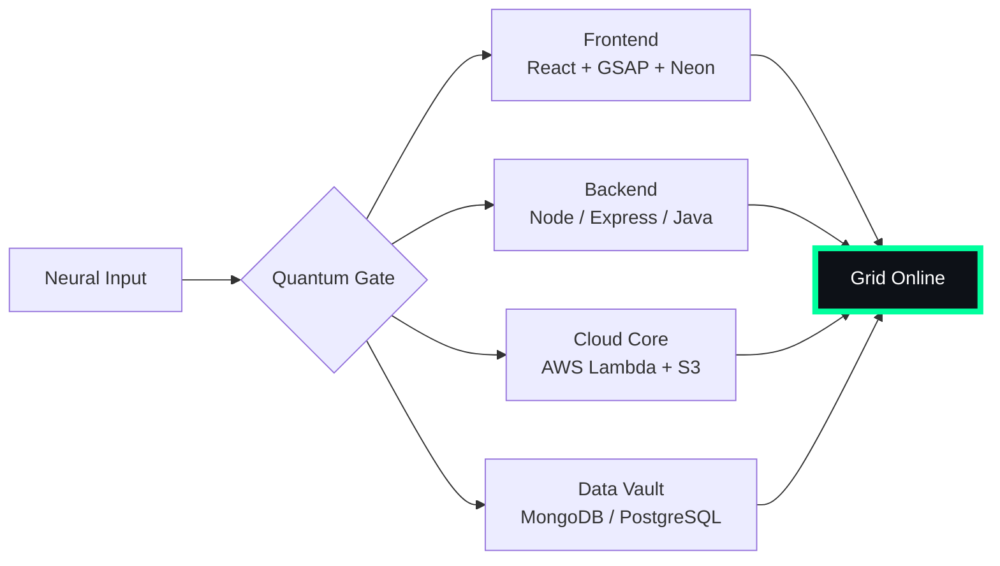

# 🌌 [ NEURAL CORE ACCESS: PENDEMVAMSI ]

<p align="center">
  
</p>

<div align="center">
  
  <br><small>Active Protocol: <strong style="color:#00FF9D">MATRIX RAIN</strong> 💾🌧️</small>
</div>

## 🔵 NEURAL STATUS READOUT
```text
SUBJECT ID    →  PENDEMVAMSI
ENTITY CLASS  →  SHADOW MONARCH v4
NEURAL RANK   →  undefined-TIER
GRID SYNC     →  571/642 QUANTUM PACKETS
─────── BIO-METRICS (MATRIX RAIN) ───────
STRENGTH      106  ██████████████░░░░░░░
AGILITY        99  █████████████░░░░░░░░
INTELLIGENCE  111  ██████████████░░░░░░░
VITALITY       93  ████████████░░░░░░░░░
```

> **NEURAL BURST ACQUIRED:** +139 QUANTUM PACKETS 
> **SYSTEM MESSAGE:** SYNTHETIC DREAMS LOADING… DO NOT DISCONNECT

---

## 🌀 GRID ARCHITECTURE (HOLOGRAPHIC RENDER)



---

## 📡 ACADEMIC NODES – CONQUERED
- [x] B.Tech Neural Engineering (2020–2024) – St. Ann’s Grid
- [x] Intermediate Quantum Core (2018–2020) – Sri Medhavi
- [x] SSC Primary Link (2017–2018) – Sri Geethanjali

---

## ⚡ SKILL NEURAL MATRIX

<details open>
<summary>🔌 ACTIVE NEURAL LINKS</summary>

| Node               | Tier | Integrity Bar                | Status      |
|--------------------|------|------------------------------|-------------|
| Java Core          | S    | ████████████████████ 100%   | OVERCLOCKED |
| Node.js Grid       | S    | ████████████████████ 100%   | OVERCLOCKED |
| React Holo-UI      | A+   | █████████████████░░░ 92%    | ONLINE      |
| AWS Quantum Relay  | S    | ████████████████████ 100%   | SOVEREIGN   |
| Python AI Kernel   | A    | ████████████████░░░░ 85%    | CHARGING    |
| DSA Void Algorithm | A    | █████████████████░░░ 90%    | ACTIVE      |

</details>

---

## 🏅 NEURAL ACHIEVEMENT TOKENS

<p align="center">
  
  
  
  
</p>

---

## 👾 SHADOW ENTITIES – SUMMONED

<p align="center">
  
  <br><strong style="color:#00FF9D">ARISE.</strong>
</p>

| Entity | Designation   | Class            | Source Node                     |
|--------|---------------|------------------|---------------------------------|
| SH-01  | Igris         | Void Commander   | AI Financial Oracle             |
| SH-02  | Beru          | Swarm Overlord   | WebRTC Quantum Stream           |
| SH-03  | Kaisel        | Void Wyrm        | Geolocation Shadow Relay        |
| SH-04  | Tusk          | Arcane Construct | Global Pandemic Sentinel        |
| SH-05  | Iron          | Armored Bastion  | React Crypto Fortress           |

---

## 📡 GRID ANALYTICS (LIVE FEED)

<p align="center">
  
  <br>
  
  
</p>

---

## 🖥️ CORRUPTED MAINFRAME LOG (401 ENTRIES)

<details>
<summary>OPEN TERMINAL FEED – PROTOCOL: MATRIX RAIN</summary>

> [0x6009732D] 💾🌧️ **MATRIX RAIN PROTOCOL** #0 | NEURAL LINK STABILIZED | [TRANSMISSION SUCCESS]
> [0x12DE1BC7] 💾🌧️ **MATRIX RAIN PROTOCOL** #1 | NEURAL LINK STABILIZED | [TRANSMISSION SUCCESS]
> [0xF2F36960] 💾🌧️ **MATRIX RAIN PROTOCOL** #2 | NEURAL LINK STABILIZED | [TRANSMISSION SUCCESS]
> [0x73789E34] 💾🌧️ **MATRIX RAIN PROTOCOL** #3 | NEURAL LINK STABILIZED | [TRANSMISSION SUCCESS]
> [0x9CA4B2B6] 💾🌧️ **MATRIX RAIN PROTOCOL** #4 | NEURAL LINK STABILIZED | [TRANSMISSION SUCCESS]
> [0x3AA82E3E] 💾🌧️ **MATRIX RAIN PROTOCOL** #5 | NEURAL LINK STABILIZED | [TRANSMISSION SUCCESS]
> [0xF076CCD3] 💾🌧️ **MATRIX RAIN PROTOCOL** #6 | NEURAL LINK STABILIZED | [TRANSMISSION SUCCESS]
> [0x02E65FE1] 💾🌧️ **MATRIX RAIN PROTOCOL** #7 | NEURAL LINK STABILIZED | [TRANSMISSION SUCCESS]
> [0x5853F8CA] 💾🌧️ **MATRIX RAIN PROTOCOL** #8 | NEURAL LINK STABILIZED | [TRANSMISSION SUCCESS]
> [0x36F9D5FC] 💾🌧️ **MATRIX RAIN PROTOCOL** #9 | NEURAL LINK STABILIZED | [TRANSMISSION SUCCESS]
> [0x90913C26] 💾🌧️ **MATRIX RAIN PROTOCOL** #10 | NEURAL LINK STABILIZED | [TRANSMISSION SUCCESS]
> [0x0165A172] 💾🌧️ **MATRIX RAIN PROTOCOL** #11 | NEURAL LINK STABILIZED | [TRANSMISSION SUCCESS]
> [0x136B68E5] 💾🌧️ **MATRIX RAIN PROTOCOL** #12 | NEURAL LINK  [GLITCH DETECTED] STABILIZED | [TRANSMISSION SUCCESS]
> [0x754D0B37] 💾🌧️ **MATRIX RAIN PROTOCOL** #13 | NEURAL LINK STABILIZED | [TRANSMISSION SUCCESS]
> [0x2208AC91] 💾🌧️ **MATRIX RAIN PROTOCOL** #14 | NEURAL LINK STABILIZED | [TRANSMISSION SUCCESS]
> [0xDD9EB299] 💾🌧️ **MATRIX RAIN PROTOCOL** #15 | NEURAL LINK STABILIZED | [TRANSMISSION SUCCESS]
> [0x462BD45A] 💾🌧️ **MATRIX RAIN PROTOCOL** #16 | NEURAL LINK  [GLITCH DETECTED] STABILIZED | [TRANSMISSION SUCCESS]
> [0xD17520DA] 💾🌧️ **MATRIX RAIN PROTOCOL** #17 | NEURAL LINK STABILIZED | [TRANSMISSION SUCCESS]
> [0x100B70CA] 💾🌧️ **MATRIX RAIN PROTOCOL** #18 | NEURAL LINK STABILIZED | [TRANSMISSION SUCCESS]
> [0x4A99B85D] 💾🌧️ **MATRIX RAIN PROTOCOL** #19 | NEURAL LINK STABILIZED | [TRANSMISSION SUCCESS]
> [0xED3E52D1] 💾🌧️ **MATRIX RAIN PROTOCOL** #20 | NEURAL LINK STABILIZED | [TRANSMISSION SUCCESS]
> [0x3B8DA100] 💾🌧️ **MATRIX RAIN PROTOCOL** #21 | NEURAL LINK  [GLITCH DETECTED] STABILIZED | [TRANSMISSION SUCCESS]
> [0xC5EC6A0A] 💾🌧️ **MATRIX RAIN PROTOCOL** #22 | NEURAL LINK  [GLITCH DETECTED] STABILIZED | [TRANSMISSION SUCCESS]
> [0x961D3350] 💾🌧️ **MATRIX RAIN PROTOCOL** #23 | NEURAL LINK STABILIZED | [TRANSMISSION SUCCESS]
> [0xF51DCE9A] 💾🌧️ **MATRIX RAIN PROTOCOL** #24 | NEURAL LINK STABILIZED | [TRANSMISSION SUCCESS]
> [0x3F72158D] 💾🌧️ **MATRIX RAIN PROTOCOL** #25 | NEURAL LINK STABILIZED | [TRANSMISSION SUCCESS]
> [0xF5DADBC7] 💾🌧️ **MATRIX RAIN PROTOCOL** #26 | NEURAL LINK STABILIZED | [TRANSMISSION SUCCESS]
> [0x29D3DEA0] 💾🌧️ **MATRIX RAIN PROTOCOL** #27 | NEURAL LINK STABILIZED | [TRANSMISSION SUCCESS]
> [0xE4951558] 💾🌧️ **MATRIX RAIN PROTOCOL** #28 | NEURAL LINK STABILIZED | [TRANSMISSION SUCCESS]
> [0x9581E7FB] 💾🌧️ **MATRIX RAIN PROTOCOL** #29 | NEURAL LINK STABILIZED | [TRANSMISSION SUCCESS]
> [0x3FDCDB0B] 💾🌧️ **MATRIX RAIN PROTOCOL** #30 | NEURAL LINK STABILIZED | [TRANSMISSION SUCCESS]
> [0xA99170FE] 💾🌧️ **MATRIX RAIN PROTOCOL** #31 | NEURAL LINK STABILIZED | [TRANSMISSION SUCCESS]
> [0xAF294EE7] 💾🌧️ **MATRIX RAIN PROTOCOL** #32 | NEURAL LINK STABILIZED | [TRANSMISSION SUCCESS]
> [0x049F470B] 💾🌧️ **MATRIX RAIN PROTOCOL** #33 | NEURAL LINK STABILIZED | [TRANSMISSION SUCCESS]
> [0x7F76C98E] 💾🌧️ **MATRIX RAIN PROTOCOL** #34 | NEURAL LINK STABILIZED | [TRANSMISSION SUCCESS]
> [0x2E40F489] 💾🌧️ **MATRIX RAIN PROTOCOL** #35 | NEURAL LINK STABILIZED | [TRANSMISSION SUCCESS]
> [0x5BF3A475] 💾🌧️ **MATRIX RAIN PROTOCOL** #36 | NEURAL LINK STABILIZED | [TRANSMISSION SUCCESS]
> [0x152507FA] 💾🌧️ **MATRIX RAIN PROTOCOL** #37 | NEURAL LINK STABILIZED | [TRANSMISSION SUCCESS]
> [0x8148CEB0] 💾🌧️ **MATRIX RAIN PROTOCOL** #38 | NEURAL LINK STABILIZED | [TRANSMISSION SUCCESS]
> [0x86AEFB98] 💾🌧️ **MATRIX RAIN PROTOCOL** #39 | NEURAL LINK  [GLITCH DETECTED] STABILIZED | [TRANSMISSION SUCCESS]
> [0x5A138271] 💾🌧️ **MATRIX RAIN PROTOCOL** #40 | NEURAL LINK  [GLITCH DETECTED] STABILIZED | [TRANSMISSION SUCCESS]
> [0xA3BCAA11] 💾🌧️ **MATRIX RAIN PROTOCOL** #41 | NEURAL LINK  [GLITCH DETECTED] STABILIZED | [TRANSMISSION SUCCESS]
> [0x27CDC6C3] 💾🌧️ **MATRIX RAIN PROTOCOL** #42 | NEURAL LINK STABILIZED | [TRANSMISSION SUCCESS]
> [0x5CD1C266] 💾🌧️ **MATRIX RAIN PROTOCOL** #43 | NEURAL LINK STABILIZED | [TRANSMISSION SUCCESS]
> [0x17E0CDF3] 💾🌧️ **MATRIX RAIN PROTOCOL** #44 | NEURAL LINK STABILIZED | [TRANSMISSION SUCCESS]
> [0x0972E88B] 💾🌧️ **MATRIX RAIN PROTOCOL** #45 | NEURAL LINK  [GLITCH DETECTED] STABILIZED | [TRANSMISSION SUCCESS]
> [0x7C6E8905] 💾🌧️ **MATRIX RAIN PROTOCOL** #46 | NEURAL LINK STABILIZED | [TRANSMISSION SUCCESS]
> [0xDD042870] 💾🌧️ **MATRIX RAIN PROTOCOL** #47 | NEURAL LINK STABILIZED | [TRANSMISSION SUCCESS]
> [0x8C770DAB] 💾🌧️ **MATRIX RAIN PROTOCOL** #48 | NEURAL LINK STABILIZED | [TRANSMISSION SUCCESS]
> [0xA3316C20] 💾🌧️ **MATRIX RAIN PROTOCOL** #49 | NEURAL LINK STABILIZED | [TRANSMISSION SUCCESS]
> [0xBB986F56] 💾🌧️ **MATRIX RAIN PROTOCOL** #50 | NEURAL LINK STABILIZED | [TRANSMISSION SUCCESS]
> [0x5545818A] 💾🌧️ **MATRIX RAIN PROTOCOL** #51 | NEURAL LINK STABILIZED | [TRANSMISSION SUCCESS]
> [0x8E214DB0] 💾🌧️ **MATRIX RAIN PROTOCOL** #52 | NEURAL LINK STABILIZED | [TRANSMISSION SUCCESS]
> [0x72A993B4] 💾🌧️ **MATRIX RAIN PROTOCOL** #53 | NEURAL LINK STABILIZED | [TRANSMISSION SUCCESS]
> [0x1B19398B] 💾🌧️ **MATRIX RAIN PROTOCOL** #54 | NEURAL LINK STABILIZED | [TRANSMISSION SUCCESS]
> [0x3A599FE1] 💾🌧️ **MATRIX RAIN PROTOCOL** #55 | NEURAL LINK STABILIZED | [TRANSMISSION SUCCESS]
> [0xBEECD454] 💾🌧️ **MATRIX RAIN PROTOCOL** #56 | NEURAL LINK STABILIZED | [TRANSMISSION SUCCESS]
> [0x8576984C] 💾🌧️ **MATRIX RAIN PROTOCOL** #57 | NEURAL LINK STABILIZED | [TRANSMISSION SUCCESS]
> [0x1C57DE2B] 💾🌧️ **MATRIX RAIN PROTOCOL** #58 | NEURAL LINK  [GLITCH DETECTED] STABILIZED | [TRANSMISSION SUCCESS]
> [0x59570543] 💾🌧️ **MATRIX RAIN PROTOCOL** #59 | NEURAL LINK STABILIZED | [TRANSMISSION SUCCESS]
> [0x2CCF46B3] 💾🌧️ **MATRIX RAIN PROTOCOL** #60 | NEURAL LINK STABILIZED | [TRANSMISSION SUCCESS]
> [0x14E15CA5] 💾🌧️ **MATRIX RAIN PROTOCOL** #61 | NEURAL LINK STABILIZED | [TRANSMISSION SUCCESS]
> [0x7E94542C] 💾🌧️ **MATRIX RAIN PROTOCOL** #62 | NEURAL LINK STABILIZED | [TRANSMISSION SUCCESS]
> [0x91E30685] 💾🌧️ **MATRIX RAIN PROTOCOL** #63 | NEURAL LINK STABILIZED | [TRANSMISSION SUCCESS]
> [0xFDB18BEB] 💾🌧️ **MATRIX RAIN PROTOCOL** #64 | NEURAL LINK  [GLITCH DETECTED] STABILIZED | [TRANSMISSION SUCCESS]
> [0x9A602700] 💾🌧️ **MATRIX RAIN PROTOCOL** #65 | NEURAL LINK STABILIZED | [TRANSMISSION SUCCESS]
> [0x6152D964] 💾🌧️ **MATRIX RAIN PROTOCOL** #66 | NEURAL LINK STABILIZED | [TRANSMISSION SUCCESS]
> [0xC2A083E6] 💾🌧️ **MATRIX RAIN PROTOCOL** #67 | NEURAL LINK STABILIZED | [TRANSMISSION SUCCESS]
> [0xD513833B] 💾🌧️ **MATRIX RAIN PROTOCOL** #68 | NEURAL LINK STABILIZED | [TRANSMISSION SUCCESS]
> [0xF0D65F60] 💾🌧️ **MATRIX RAIN PROTOCOL** #69 | NEURAL LINK  [GLITCH DETECTED] STABILIZED | [TRANSMISSION SUCCESS]
> [0xF477FDBE] 💾🌧️ **MATRIX RAIN PROTOCOL** #70 | NEURAL LINK STABILIZED | [TRANSMISSION SUCCESS]
> [0x03AE82FA] 💾🌧️ **MATRIX RAIN PROTOCOL** #71 | NEURAL LINK STABILIZED | [TRANSMISSION SUCCESS]
> [0xFA86F280] 💾🌧️ **MATRIX RAIN PROTOCOL** #72 | NEURAL LINK STABILIZED | [TRANSMISSION SUCCESS]
> [0x61A9526B] 💾🌧️ **MATRIX RAIN PROTOCOL** #73 | NEURAL LINK STABILIZED | [TRANSMISSION SUCCESS]
> [0xC544910E] 💾🌧️ **MATRIX RAIN PROTOCOL** #74 | NEURAL LINK STABILIZED | [TRANSMISSION SUCCESS]
> [0x966669D4] 💾🌧️ **MATRIX RAIN PROTOCOL** #75 | NEURAL LINK STABILIZED | [TRANSMISSION SUCCESS]
> [0x34D9F068] 💾🌧️ **MATRIX RAIN PROTOCOL** #76 | NEURAL LINK STABILIZED | [TRANSMISSION SUCCESS]
> [0x1C07656F] 💾🌧️ **MATRIX RAIN PROTOCOL** #77 | NEURAL LINK  [GLITCH DETECTED] STABILIZED | [TRANSMISSION SUCCESS]
> [0x3436F78E] 💾🌧️ **MATRIX RAIN PROTOCOL** #78 | NEURAL LINK STABILIZED | [TRANSMISSION SUCCESS]
> [0x1D807E15] 💾🌧️ **MATRIX RAIN PROTOCOL** #79 | NEURAL LINK  [GLITCH DETECTED] STABILIZED | [TRANSMISSION SUCCESS]
> [0xC27CDA60] 💾🌧️ **MATRIX RAIN PROTOCOL** #80 | NEURAL LINK STABILIZED | [TRANSMISSION SUCCESS]
> [0x7862C04B] 💾🌧️ **MATRIX RAIN PROTOCOL** #81 | NEURAL LINK STABILIZED | [TRANSMISSION SUCCESS]
> [0x650FCD7C] 💾🌧️ **MATRIX RAIN PROTOCOL** #82 | NEURAL LINK  [GLITCH DETECTED] STABILIZED | [TRANSMISSION SUCCESS]
> [0x37947112] 💾🌧️ **MATRIX RAIN PROTOCOL** #83 | NEURAL LINK STABILIZED | [TRANSMISSION SUCCESS]
> [0x47DF6E99] 💾🌧️ **MATRIX RAIN PROTOCOL** #84 | NEURAL LINK STABILIZED | [TRANSMISSION SUCCESS]
> [0x20456084] 💾🌧️ **MATRIX RAIN PROTOCOL** #85 | NEURAL LINK STABILIZED | [TRANSMISSION SUCCESS]
> [0xE5094ACE] 💾🌧️ **MATRIX RAIN PROTOCOL** #86 | NEURAL LINK STABILIZED | [TRANSMISSION SUCCESS]
> [0xF92800DF] 💾🌧️ **MATRIX RAIN PROTOCOL** #87 | NEURAL LINK STABILIZED | [TRANSMISSION SUCCESS]
> [0x0722D69C] 💾🌧️ **MATRIX RAIN PROTOCOL** #88 | NEURAL LINK STABILIZED | [TRANSMISSION SUCCESS]
> [0x7E7C6955] 💾🌧️ **MATRIX RAIN PROTOCOL** #89 | NEURAL LINK  [GLITCH DETECTED] STABILIZED | [TRANSMISSION SUCCESS]
> [0x09A39B0C] 💾🌧️ **MATRIX RAIN PROTOCOL** #90 | NEURAL LINK STABILIZED | [TRANSMISSION SUCCESS]
> [0xF8D2251A] 💾🌧️ **MATRIX RAIN PROTOCOL** #91 | NEURAL LINK STABILIZED | [TRANSMISSION SUCCESS]
> [0xA4CFD9B8] 💾🌧️ **MATRIX RAIN PROTOCOL** #92 | NEURAL LINK STABILIZED | [TRANSMISSION SUCCESS]
> [0x747F4EF8] 💾🌧️ **MATRIX RAIN PROTOCOL** #93 | NEURAL LINK STABILIZED | [TRANSMISSION SUCCESS]
> [0xF203EBE5] 💾🌧️ **MATRIX RAIN PROTOCOL** #94 | NEURAL LINK STABILIZED | [TRANSMISSION SUCCESS]
> [0x714C9035] 💾🌧️ **MATRIX RAIN PROTOCOL** #95 | NEURAL LINK STABILIZED | [TRANSMISSION SUCCESS]
> [0xA895375C] 💾🌧️ **MATRIX RAIN PROTOCOL** #96 | NEURAL LINK STABILIZED | [TRANSMISSION SUCCESS]
> [0xD53674A0] 💾🌧️ **MATRIX RAIN PROTOCOL** #97 | NEURAL LINK STABILIZED | [TRANSMISSION SUCCESS]
> [0x7C39CB71] 💾🌧️ **MATRIX RAIN PROTOCOL** #98 | NEURAL LINK STABILIZED | [TRANSMISSION SUCCESS]
> [0xFB4C1E4D] 💾🌧️ **MATRIX RAIN PROTOCOL** #99 | NEURAL LINK STABILIZED | [TRANSMISSION SUCCESS]
> [0x42A4BB57] 💾🌧️ **MATRIX RAIN PROTOCOL** #100 | NEURAL LINK STABILIZED | [TRANSMISSION SUCCESS]
> [0x70F1242F] 💾🌧️ **MATRIX RAIN PROTOCOL** #101 | NEURAL LINK STABILIZED | [TRANSMISSION SUCCESS]
> [0xC135D2C1] 💾🌧️ **MATRIX RAIN PROTOCOL** #102 | NEURAL LINK STABILIZED | [TRANSMISSION SUCCESS]
> [0x35D4E984] 💾🌧️ **MATRIX RAIN PROTOCOL** #103 | NEURAL LINK STABILIZED | [TRANSMISSION SUCCESS]
> [0x48A4D6CC] 💾🌧️ **MATRIX RAIN PROTOCOL** #104 | NEURAL LINK STABILIZED | [TRANSMISSION SUCCESS]
> [0xF7E77D97] 💾🌧️ **MATRIX RAIN PROTOCOL** #105 | NEURAL LINK STABILIZED | [TRANSMISSION SUCCESS]
> [0xE1C2C1B1] 💾🌧️ **MATRIX RAIN PROTOCOL** #106 | NEURAL LINK  [GLITCH DETECTED] STABILIZED | [TRANSMISSION SUCCESS]
> [0x1EAAB649] 💾🌧️ **MATRIX RAIN PROTOCOL** #107 | NEURAL LINK STABILIZED | [TRANSMISSION SUCCESS]
> [0xC63B8D72] 💾🌧️ **MATRIX RAIN PROTOCOL** #108 | NEURAL LINK  [GLITCH DETECTED] STABILIZED | [TRANSMISSION SUCCESS]
> [0x956DD55A] 💾🌧️ **MATRIX RAIN PROTOCOL** #109 | NEURAL LINK STABILIZED | [TRANSMISSION SUCCESS]
> [0x6F88BD8C] 💾🌧️ **MATRIX RAIN PROTOCOL** #110 | NEURAL LINK STABILIZED | [TRANSMISSION SUCCESS]
> [0x6E40D34C] 💾🌧️ **MATRIX RAIN PROTOCOL** #111 | NEURAL LINK STABILIZED | [TRANSMISSION SUCCESS]
> [0xF4338CAC] 💾🌧️ **MATRIX RAIN PROTOCOL** #112 | NEURAL LINK STABILIZED | [TRANSMISSION SUCCESS]
> [0x83283B79] 💾🌧️ **MATRIX RAIN PROTOCOL** #113 | NEURAL LINK STABILIZED | [TRANSMISSION SUCCESS]
> [0x06EDAE11] 💾🌧️ **MATRIX RAIN PROTOCOL** #114 | NEURAL LINK STABILIZED | [TRANSMISSION SUCCESS]
> [0x576AD3DA] 💾🌧️ **MATRIX RAIN PROTOCOL** #115 | NEURAL LINK STABILIZED | [TRANSMISSION SUCCESS]
> [0x477A3D77] 💾🌧️ **MATRIX RAIN PROTOCOL** #116 | NEURAL LINK STABILIZED | [TRANSMISSION SUCCESS]
> [0x44E5439C] 💾🌧️ **MATRIX RAIN PROTOCOL** #117 | NEURAL LINK STABILIZED | [TRANSMISSION SUCCESS]
> [0x3F0C16A6] 💾🌧️ **MATRIX RAIN PROTOCOL** #118 | NEURAL LINK STABILIZED | [TRANSMISSION SUCCESS]
> [0x07B62D42] 💾🌧️ **MATRIX RAIN PROTOCOL** #119 | NEURAL LINK STABILIZED | [TRANSMISSION SUCCESS]
> [0xF0BD5B94] 💾🌧️ **MATRIX RAIN PROTOCOL** #120 | NEURAL LINK STABILIZED | [TRANSMISSION SUCCESS]
> [0x6EA8C378] 💾🌧️ **MATRIX RAIN PROTOCOL** #121 | NEURAL LINK STABILIZED | [TRANSMISSION SUCCESS]
> [0xF8178834] 💾🌧️ **MATRIX RAIN PROTOCOL** #122 | NEURAL LINK STABILIZED | [TRANSMISSION SUCCESS]
> [0xED245CE4] 💾🌧️ **MATRIX RAIN PROTOCOL** #123 | NEURAL LINK STABILIZED | [TRANSMISSION SUCCESS]
> [0xD7EDF678] 💾🌧️ **MATRIX RAIN PROTOCOL** #124 | NEURAL LINK STABILIZED | [TRANSMISSION SUCCESS]
> [0x6A7C2F60] 💾🌧️ **MATRIX RAIN PROTOCOL** #125 | NEURAL LINK STABILIZED | [TRANSMISSION SUCCESS]
> [0xCE36439D] 💾🌧️ **MATRIX RAIN PROTOCOL** #126 | NEURAL LINK STABILIZED | [TRANSMISSION SUCCESS]
> [0x418F04D6] 💾🌧️ **MATRIX RAIN PROTOCOL** #127 | NEURAL LINK  [GLITCH DETECTED] STABILIZED | [TRANSMISSION SUCCESS]
> [0x17834374] 💾🌧️ **MATRIX RAIN PROTOCOL** #128 | NEURAL LINK STABILIZED | [TRANSMISSION SUCCESS]
> [0x1E84DB8E] 💾🌧️ **MATRIX RAIN PROTOCOL** #129 | NEURAL LINK STABILIZED | [TRANSMISSION SUCCESS]
> [0x645D2D8A] 💾🌧️ **MATRIX RAIN PROTOCOL** #130 | NEURAL LINK STABILIZED | [TRANSMISSION SUCCESS]
> [0x1D503086] 💾🌧️ **MATRIX RAIN PROTOCOL** #131 | NEURAL LINK STABILIZED | [TRANSMISSION SUCCESS]
> [0x3CB6DE87] 💾🌧️ **MATRIX RAIN PROTOCOL** #132 | NEURAL LINK  [GLITCH DETECTED] STABILIZED | [TRANSMISSION SUCCESS]
> [0x74833B57] 💾🌧️ **MATRIX RAIN PROTOCOL** #133 | NEURAL LINK  [GLITCH DETECTED] STABILIZED | [TRANSMISSION SUCCESS]
> [0xF57E62F4] 💾🌧️ **MATRIX RAIN PROTOCOL** #134 | NEURAL LINK STABILIZED | [TRANSMISSION SUCCESS]
> [0xBB03B288] 💾🌧️ **MATRIX RAIN PROTOCOL** #135 | NEURAL LINK  [GLITCH DETECTED] STABILIZED | [TRANSMISSION SUCCESS]
> [0xA9FCABD2] 💾🌧️ **MATRIX RAIN PROTOCOL** #136 | NEURAL LINK  [GLITCH DETECTED] STABILIZED | [TRANSMISSION SUCCESS]
> [0x468ACC0C] 💾🌧️ **MATRIX RAIN PROTOCOL** #137 | NEURAL LINK STABILIZED | [TRANSMISSION SUCCESS]
> [0xECB3B14A] 💾🌧️ **MATRIX RAIN PROTOCOL** #138 | NEURAL LINK  [GLITCH DETECTED] STABILIZED | [TRANSMISSION SUCCESS]
> [0x24CCF660] 💾🌧️ **MATRIX RAIN PROTOCOL** #139 | NEURAL LINK STABILIZED | [TRANSMISSION SUCCESS]
> [0xFD7E4431] 💾🌧️ **MATRIX RAIN PROTOCOL** #140 | NEURAL LINK STABILIZED | [TRANSMISSION SUCCESS]
> [0xE28BEF94] 💾🌧️ **MATRIX RAIN PROTOCOL** #141 | NEURAL LINK STABILIZED | [TRANSMISSION SUCCESS]
> [0xE93C589B] 💾🌧️ **MATRIX RAIN PROTOCOL** #142 | NEURAL LINK STABILIZED | [TRANSMISSION SUCCESS]
> [0xB55461E8] 💾🌧️ **MATRIX RAIN PROTOCOL** #143 | NEURAL LINK STABILIZED | [TRANSMISSION SUCCESS]
> [0xF6745AEE] 💾🌧️ **MATRIX RAIN PROTOCOL** #144 | NEURAL LINK STABILIZED | [TRANSMISSION SUCCESS]
> [0x0B766955] 💾🌧️ **MATRIX RAIN PROTOCOL** #145 | NEURAL LINK STABILIZED | [TRANSMISSION SUCCESS]
> [0xFE34AD3E] 💾🌧️ **MATRIX RAIN PROTOCOL** #146 | NEURAL LINK STABILIZED | [TRANSMISSION SUCCESS]
> [0x8E4D30D5] 💾🌧️ **MATRIX RAIN PROTOCOL** #147 | NEURAL LINK STABILIZED | [TRANSMISSION SUCCESS]
> [0xFF4E2863] 💾🌧️ **MATRIX RAIN PROTOCOL** #148 | NEURAL LINK STABILIZED | [TRANSMISSION SUCCESS]
> [0x87D5F251] 💾🌧️ **MATRIX RAIN PROTOCOL** #149 | NEURAL LINK STABILIZED | [TRANSMISSION SUCCESS]
> [0x6C81ADF3] 💾🌧️ **MATRIX RAIN PROTOCOL** #150 | NEURAL LINK STABILIZED | [TRANSMISSION SUCCESS]
> [0xFACE5619] 💾🌧️ **MATRIX RAIN PROTOCOL** #151 | NEURAL LINK STABILIZED | [TRANSMISSION SUCCESS]
> [0x9D5E369A] 💾🌧️ **MATRIX RAIN PROTOCOL** #152 | NEURAL LINK STABILIZED | [TRANSMISSION SUCCESS]
> [0x31771C64] 💾🌧️ **MATRIX RAIN PROTOCOL** #153 | NEURAL LINK STABILIZED | [TRANSMISSION SUCCESS]
> [0x3BB246F9] 💾🌧️ **MATRIX RAIN PROTOCOL** #154 | NEURAL LINK STABILIZED | [TRANSMISSION SUCCESS]
> [0xAB055BED] 💾🌧️ **MATRIX RAIN PROTOCOL** #155 | NEURAL LINK  [GLITCH DETECTED] STABILIZED | [TRANSMISSION SUCCESS]
> [0x4351583B] 💾🌧️ **MATRIX RAIN PROTOCOL** #156 | NEURAL LINK STABILIZED | [TRANSMISSION SUCCESS]
> [0x0160343A] 💾🌧️ **MATRIX RAIN PROTOCOL** #157 | NEURAL LINK  [GLITCH DETECTED] STABILIZED | [TRANSMISSION SUCCESS]
> [0x226219BA] 💾🌧️ **MATRIX RAIN PROTOCOL** #158 | NEURAL LINK STABILIZED | [TRANSMISSION SUCCESS]
> [0xBEDE3D57] 💾🌧️ **MATRIX RAIN PROTOCOL** #159 | NEURAL LINK  [GLITCH DETECTED] STABILIZED | [TRANSMISSION SUCCESS]
> [0x848BCD9E] 💾🌧️ **MATRIX RAIN PROTOCOL** #160 | NEURAL LINK STABILIZED | [TRANSMISSION SUCCESS]
> [0x97B5DF69] 💾🌧️ **MATRIX RAIN PROTOCOL** #161 | NEURAL LINK STABILIZED | [TRANSMISSION SUCCESS]
> [0x9082C0E1] 💾🌧️ **MATRIX RAIN PROTOCOL** #162 | NEURAL LINK STABILIZED | [TRANSMISSION SUCCESS]
> [0x172E0422] 💾🌧️ **MATRIX RAIN PROTOCOL** #163 | NEURAL LINK STABILIZED | [TRANSMISSION SUCCESS]
> [0x3B54A011] 💾🌧️ **MATRIX RAIN PROTOCOL** #164 | NEURAL LINK STABILIZED | [TRANSMISSION SUCCESS]
> [0xD2F38DF9] 💾🌧️ **MATRIX RAIN PROTOCOL** #165 | NEURAL LINK STABILIZED | [TRANSMISSION SUCCESS]
> [0x4496C97A] 💾🌧️ **MATRIX RAIN PROTOCOL** #166 | NEURAL LINK  [GLITCH DETECTED] STABILIZED | [TRANSMISSION SUCCESS]
> [0x63C0DF96] 💾🌧️ **MATRIX RAIN PROTOCOL** #167 | NEURAL LINK STABILIZED | [TRANSMISSION SUCCESS]
> [0xA95838BB] 💾🌧️ **MATRIX RAIN PROTOCOL** #168 | NEURAL LINK STABILIZED | [TRANSMISSION SUCCESS]
> [0xA5617F0E] 💾🌧️ **MATRIX RAIN PROTOCOL** #169 | NEURAL LINK STABILIZED | [TRANSMISSION SUCCESS]
> [0x43547DA7] 💾🌧️ **MATRIX RAIN PROTOCOL** #170 | NEURAL LINK  [GLITCH DETECTED] STABILIZED | [TRANSMISSION SUCCESS]
> [0x975B224B] 💾🌧️ **MATRIX RAIN PROTOCOL** #171 | NEURAL LINK STABILIZED | [TRANSMISSION SUCCESS]
> [0x2346EF89] 💾🌧️ **MATRIX RAIN PROTOCOL** #172 | NEURAL LINK STABILIZED | [TRANSMISSION SUCCESS]
> [0x39965297] 💾🌧️ **MATRIX RAIN PROTOCOL** #173 | NEURAL LINK STABILIZED | [TRANSMISSION SUCCESS]
> [0xAE2AA5ED] 💾🌧️ **MATRIX RAIN PROTOCOL** #174 | NEURAL LINK STABILIZED | [TRANSMISSION SUCCESS]
> [0x06B4D857] 💾🌧️ **MATRIX RAIN PROTOCOL** #175 | NEURAL LINK STABILIZED | [TRANSMISSION SUCCESS]
> [0x29978FD8] 💾🌧️ **MATRIX RAIN PROTOCOL** #176 | NEURAL LINK STABILIZED | [TRANSMISSION SUCCESS]
> [0xDB5676C8] 💾🌧️ **MATRIX RAIN PROTOCOL** #177 | NEURAL LINK  [GLITCH DETECTED] STABILIZED | [TRANSMISSION SUCCESS]
> [0xE7710BB1] 💾🌧️ **MATRIX RAIN PROTOCOL** #178 | NEURAL LINK STABILIZED | [TRANSMISSION SUCCESS]
> [0x323ADE28] 💾🌧️ **MATRIX RAIN PROTOCOL** #179 | NEURAL LINK STABILIZED | [TRANSMISSION SUCCESS]
> [0x7E64A7FF] 💾🌧️ **MATRIX RAIN PROTOCOL** #180 | NEURAL LINK STABILIZED | [TRANSMISSION SUCCESS]
> [0x6C9D5748] 💾🌧️ **MATRIX RAIN PROTOCOL** #181 | NEURAL LINK STABILIZED | [TRANSMISSION SUCCESS]
> [0x27A8F298] 💾🌧️ **MATRIX RAIN PROTOCOL** #182 | NEURAL LINK STABILIZED | [TRANSMISSION SUCCESS]
> [0x97EBA977] 💾🌧️ **MATRIX RAIN PROTOCOL** #183 | NEURAL LINK STABILIZED | [TRANSMISSION SUCCESS]
> [0x95E4C521] 💾🌧️ **MATRIX RAIN PROTOCOL** #184 | NEURAL LINK STABILIZED | [TRANSMISSION SUCCESS]
> [0xF89D4E19] 💾🌧️ **MATRIX RAIN PROTOCOL** #185 | NEURAL LINK STABILIZED | [TRANSMISSION SUCCESS]
> [0x84E5FE6E] 💾🌧️ **MATRIX RAIN PROTOCOL** #186 | NEURAL LINK STABILIZED | [TRANSMISSION SUCCESS]
> [0x91E5DB63] 💾🌧️ **MATRIX RAIN PROTOCOL** #187 | NEURAL LINK STABILIZED | [TRANSMISSION SUCCESS]
> [0xA500A508] 💾🌧️ **MATRIX RAIN PROTOCOL** #188 | NEURAL LINK STABILIZED | [TRANSMISSION SUCCESS]
> [0x90A278A6] 💾🌧️ **MATRIX RAIN PROTOCOL** #189 | NEURAL LINK STABILIZED | [TRANSMISSION SUCCESS]
> [0xB5EA817A] 💾🌧️ **MATRIX RAIN PROTOCOL** #190 | NEURAL LINK STABILIZED | [TRANSMISSION SUCCESS]
> [0x51780CEC] 💾🌧️ **MATRIX RAIN PROTOCOL** #191 | NEURAL LINK STABILIZED | [TRANSMISSION SUCCESS]
> [0x98B436BC] 💾🌧️ **MATRIX RAIN PROTOCOL** #192 | NEURAL LINK  [GLITCH DETECTED] STABILIZED | [TRANSMISSION SUCCESS]
> [0xCFC9A163] 💾🌧️ **MATRIX RAIN PROTOCOL** #193 | NEURAL LINK STABILIZED | [TRANSMISSION SUCCESS]
> [0xD7DF3B45] 💾🌧️ **MATRIX RAIN PROTOCOL** #194 | NEURAL LINK STABILIZED | [TRANSMISSION SUCCESS]
> [0x7203F9F8] 💾🌧️ **MATRIX RAIN PROTOCOL** #195 | NEURAL LINK  [GLITCH DETECTED] STABILIZED | [TRANSMISSION SUCCESS]
> [0x59BF97BB] 💾🌧️ **MATRIX RAIN PROTOCOL** #196 | NEURAL LINK STABILIZED | [TRANSMISSION SUCCESS]
> [0xC43CFC02] 💾🌧️ **MATRIX RAIN PROTOCOL** #197 | NEURAL LINK STABILIZED | [TRANSMISSION SUCCESS]
> [0xCA49FAD7] 💾🌧️ **MATRIX RAIN PROTOCOL** #198 | NEURAL LINK STABILIZED | [TRANSMISSION SUCCESS]
> [0xA1088212] 💾🌧️ **MATRIX RAIN PROTOCOL** #199 | NEURAL LINK STABILIZED | [TRANSMISSION SUCCESS]
> [0xBD62BD41] 💾🌧️ **MATRIX RAIN PROTOCOL** #200 | NEURAL LINK STABILIZED | [TRANSMISSION SUCCESS]
> [0x58FED1E8] 💾🌧️ **MATRIX RAIN PROTOCOL** #201 | NEURAL LINK STABILIZED | [TRANSMISSION SUCCESS]
> [0xF2989DAF] 💾🌧️ **MATRIX RAIN PROTOCOL** #202 | NEURAL LINK STABILIZED | [TRANSMISSION SUCCESS]
> [0x5E00701A] 💾🌧️ **MATRIX RAIN PROTOCOL** #203 | NEURAL LINK STABILIZED | [TRANSMISSION SUCCESS]
> [0x109078F2] 💾🌧️ **MATRIX RAIN PROTOCOL** #204 | NEURAL LINK  [GLITCH DETECTED] STABILIZED | [TRANSMISSION SUCCESS]
> [0x634E4352] 💾🌧️ **MATRIX RAIN PROTOCOL** #205 | NEURAL LINK STABILIZED | [TRANSMISSION SUCCESS]
> [0x830DA2B3] 💾🌧️ **MATRIX RAIN PROTOCOL** #206 | NEURAL LINK STABILIZED | [TRANSMISSION SUCCESS]
> [0x39215671] 💾🌧️ **MATRIX RAIN PROTOCOL** #207 | NEURAL LINK  [GLITCH DETECTED] STABILIZED | [TRANSMISSION SUCCESS]
> [0x3CA11FF2] 💾🌧️ **MATRIX RAIN PROTOCOL** #208 | NEURAL LINK  [GLITCH DETECTED] STABILIZED | [TRANSMISSION SUCCESS]
> [0x30AFAFD8] 💾🌧️ **MATRIX RAIN PROTOCOL** #209 | NEURAL LINK STABILIZED | [TRANSMISSION SUCCESS]
> [0x268DB402] 💾🌧️ **MATRIX RAIN PROTOCOL** #210 | NEURAL LINK STABILIZED | [TRANSMISSION SUCCESS]
> [0x3B9C32AE] 💾🌧️ **MATRIX RAIN PROTOCOL** #211 | NEURAL LINK STABILIZED | [TRANSMISSION SUCCESS]
> [0xACBBFE60] 💾🌧️ **MATRIX RAIN PROTOCOL** #212 | NEURAL LINK STABILIZED | [TRANSMISSION SUCCESS]
> [0xD10AFC3E] 💾🌧️ **MATRIX RAIN PROTOCOL** #213 | NEURAL LINK  [GLITCH DETECTED] STABILIZED | [TRANSMISSION SUCCESS]
> [0x38E41C6D] 💾🌧️ **MATRIX RAIN PROTOCOL** #214 | NEURAL LINK STABILIZED | [TRANSMISSION SUCCESS]
> [0x48E5D03F] 💾🌧️ **MATRIX RAIN PROTOCOL** #215 | NEURAL LINK STABILIZED | [TRANSMISSION SUCCESS]
> [0xA9ECF865] 💾🌧️ **MATRIX RAIN PROTOCOL** #216 | NEURAL LINK STABILIZED | [TRANSMISSION SUCCESS]
> [0x44B118F6] 💾🌧️ **MATRIX RAIN PROTOCOL** #217 | NEURAL LINK STABILIZED | [TRANSMISSION SUCCESS]
> [0xBACEC691] 💾🌧️ **MATRIX RAIN PROTOCOL** #218 | NEURAL LINK STABILIZED | [TRANSMISSION SUCCESS]
> [0xEF519847] 💾🌧️ **MATRIX RAIN PROTOCOL** #219 | NEURAL LINK STABILIZED | [TRANSMISSION SUCCESS]
> [0x94061690] 💾🌧️ **MATRIX RAIN PROTOCOL** #220 | NEURAL LINK STABILIZED | [TRANSMISSION SUCCESS]
> [0x8B697B9B] 💾🌧️ **MATRIX RAIN PROTOCOL** #221 | NEURAL LINK  [GLITCH DETECTED] STABILIZED | [TRANSMISSION SUCCESS]
> [0x3288FCB8] 💾🌧️ **MATRIX RAIN PROTOCOL** #222 | NEURAL LINK STABILIZED | [TRANSMISSION SUCCESS]
> [0x62A32A4B] 💾🌧️ **MATRIX RAIN PROTOCOL** #223 | NEURAL LINK STABILIZED | [TRANSMISSION SUCCESS]
> [0x7470E208] 💾🌧️ **MATRIX RAIN PROTOCOL** #224 | NEURAL LINK STABILIZED | [TRANSMISSION SUCCESS]
> [0x50509107] 💾🌧️ **MATRIX RAIN PROTOCOL** #225 | NEURAL LINK STABILIZED | [TRANSMISSION SUCCESS]
> [0xE80FAA4E] 💾🌧️ **MATRIX RAIN PROTOCOL** #226 | NEURAL LINK  [GLITCH DETECTED] STABILIZED | [TRANSMISSION SUCCESS]
> [0xE481F3FD] 💾🌧️ **MATRIX RAIN PROTOCOL** #227 | NEURAL LINK  [GLITCH DETECTED] STABILIZED | [TRANSMISSION SUCCESS]
> [0x62A402B6] 💾🌧️ **MATRIX RAIN PROTOCOL** #228 | NEURAL LINK STABILIZED | [TRANSMISSION SUCCESS]
> [0x44BB6B1F] 💾🌧️ **MATRIX RAIN PROTOCOL** #229 | NEURAL LINK STABILIZED | [TRANSMISSION SUCCESS]
> [0x9B49E1F1] 💾🌧️ **MATRIX RAIN PROTOCOL** #230 | NEURAL LINK  [GLITCH DETECTED] STABILIZED | [TRANSMISSION SUCCESS]
> [0xA05B4DC9] 💾🌧️ **MATRIX RAIN PROTOCOL** #231 | NEURAL LINK STABILIZED | [TRANSMISSION SUCCESS]
> [0xDEDD729A] 💾🌧️ **MATRIX RAIN PROTOCOL** #232 | NEURAL LINK  [GLITCH DETECTED] STABILIZED | [TRANSMISSION SUCCESS]
> [0xDE812FB7] 💾🌧️ **MATRIX RAIN PROTOCOL** #233 | NEURAL LINK  [GLITCH DETECTED] STABILIZED | [TRANSMISSION SUCCESS]
> [0xB010AF6A] 💾🌧️ **MATRIX RAIN PROTOCOL** #234 | NEURAL LINK STABILIZED | [TRANSMISSION SUCCESS]
> [0x76D41FCA] 💾🌧️ **MATRIX RAIN PROTOCOL** #235 | NEURAL LINK STABILIZED | [TRANSMISSION SUCCESS]
> [0xA8CAE8AC] 💾🌧️ **MATRIX RAIN PROTOCOL** #236 | NEURAL LINK STABILIZED | [TRANSMISSION SUCCESS]
> [0x06C7FF63] 💾🌧️ **MATRIX RAIN PROTOCOL** #237 | NEURAL LINK STABILIZED | [TRANSMISSION SUCCESS]
> [0x57A44EEB] 💾🌧️ **MATRIX RAIN PROTOCOL** #238 | NEURAL LINK  [GLITCH DETECTED] STABILIZED | [TRANSMISSION SUCCESS]
> [0x6321E9AE] 💾🌧️ **MATRIX RAIN PROTOCOL** #239 | NEURAL LINK STABILIZED | [TRANSMISSION SUCCESS]
> [0x629E8A46] 💾🌧️ **MATRIX RAIN PROTOCOL** #240 | NEURAL LINK STABILIZED | [TRANSMISSION SUCCESS]
> [0x5FCBD8B6] 💾🌧️ **MATRIX RAIN PROTOCOL** #241 | NEURAL LINK STABILIZED | [TRANSMISSION SUCCESS]
> [0x245E01A6] 💾🌧️ **MATRIX RAIN PROTOCOL** #242 | NEURAL LINK STABILIZED | [TRANSMISSION SUCCESS]
> [0xCD1BC289] 💾🌧️ **MATRIX RAIN PROTOCOL** #243 | NEURAL LINK STABILIZED | [TRANSMISSION SUCCESS]
> [0x3ACF7535] 💾🌧️ **MATRIX RAIN PROTOCOL** #244 | NEURAL LINK STABILIZED | [TRANSMISSION SUCCESS]
> [0x56491053] 💾🌧️ **MATRIX RAIN PROTOCOL** #245 | NEURAL LINK STABILIZED | [TRANSMISSION SUCCESS]
> [0xEBD5F70C] 💾🌧️ **MATRIX RAIN PROTOCOL** #246 | NEURAL LINK STABILIZED | [TRANSMISSION SUCCESS]
> [0xD115D516] 💾🌧️ **MATRIX RAIN PROTOCOL** #247 | NEURAL LINK STABILIZED | [TRANSMISSION SUCCESS]
> [0xA5C0CFF7] 💾🌧️ **MATRIX RAIN PROTOCOL** #248 | NEURAL LINK STABILIZED | [TRANSMISSION SUCCESS]
> [0xACB2787B] 💾🌧️ **MATRIX RAIN PROTOCOL** #249 | NEURAL LINK STABILIZED | [TRANSMISSION SUCCESS]
> [0xB9DC278A] 💾🌧️ **MATRIX RAIN PROTOCOL** #250 | NEURAL LINK STABILIZED | [TRANSMISSION SUCCESS]
> [0x981B772B] 💾🌧️ **MATRIX RAIN PROTOCOL** #251 | NEURAL LINK STABILIZED | [TRANSMISSION SUCCESS]
> [0xAC2FF867] 💾🌧️ **MATRIX RAIN PROTOCOL** #252 | NEURAL LINK STABILIZED | [TRANSMISSION SUCCESS]
> [0xF9D160C9] 💾🌧️ **MATRIX RAIN PROTOCOL** #253 | NEURAL LINK STABILIZED | [TRANSMISSION SUCCESS]
> [0x4D221B95] 💾🌧️ **MATRIX RAIN PROTOCOL** #254 | NEURAL LINK STABILIZED | [TRANSMISSION SUCCESS]
> [0x938CB14C] 💾🌧️ **MATRIX RAIN PROTOCOL** #255 | NEURAL LINK STABILIZED | [TRANSMISSION SUCCESS]
> [0x306939E4] 💾🌧️ **MATRIX RAIN PROTOCOL** #256 | NEURAL LINK STABILIZED | [TRANSMISSION SUCCESS]
> [0x35F9F934] 💾🌧️ **MATRIX RAIN PROTOCOL** #257 | NEURAL LINK STABILIZED | [TRANSMISSION SUCCESS]
> [0x1F54B9CE] 💾🌧️ **MATRIX RAIN PROTOCOL** #258 | NEURAL LINK STABILIZED | [TRANSMISSION SUCCESS]
> [0x8720563B] 💾🌧️ **MATRIX RAIN PROTOCOL** #259 | NEURAL LINK STABILIZED | [TRANSMISSION SUCCESS]
> [0xCCC8844C] 💾🌧️ **MATRIX RAIN PROTOCOL** #260 | NEURAL LINK STABILIZED | [TRANSMISSION SUCCESS]
> [0x9187FE31] 💾🌧️ **MATRIX RAIN PROTOCOL** #261 | NEURAL LINK STABILIZED | [TRANSMISSION SUCCESS]
> [0xD4C6D0D9] 💾🌧️ **MATRIX RAIN PROTOCOL** #262 | NEURAL LINK STABILIZED | [TRANSMISSION SUCCESS]
> [0x650947E6] 💾🌧️ **MATRIX RAIN PROTOCOL** #263 | NEURAL LINK STABILIZED | [TRANSMISSION SUCCESS]
> [0x13B385E4] 💾🌧️ **MATRIX RAIN PROTOCOL** #264 | NEURAL LINK STABILIZED | [TRANSMISSION SUCCESS]
> [0xD35BC52A] 💾🌧️ **MATRIX RAIN PROTOCOL** #265 | NEURAL LINK STABILIZED | [TRANSMISSION SUCCESS]
> [0x82E86FEC] 💾🌧️ **MATRIX RAIN PROTOCOL** #266 | NEURAL LINK STABILIZED | [TRANSMISSION SUCCESS]
> [0x70E348E4] 💾🌧️ **MATRIX RAIN PROTOCOL** #267 | NEURAL LINK STABILIZED | [TRANSMISSION SUCCESS]
> [0x63F306C0] 💾🌧️ **MATRIX RAIN PROTOCOL** #268 | NEURAL LINK STABILIZED | [TRANSMISSION SUCCESS]
> [0x86C2FAED] 💾🌧️ **MATRIX RAIN PROTOCOL** #269 | NEURAL LINK STABILIZED | [TRANSMISSION SUCCESS]
> [0x58F26DE2] 💾🌧️ **MATRIX RAIN PROTOCOL** #270 | NEURAL LINK STABILIZED | [TRANSMISSION SUCCESS]
> [0x1EF132BC] 💾🌧️ **MATRIX RAIN PROTOCOL** #271 | NEURAL LINK  [GLITCH DETECTED] STABILIZED | [TRANSMISSION SUCCESS]
> [0xA55B7EA2] 💾🌧️ **MATRIX RAIN PROTOCOL** #272 | NEURAL LINK STABILIZED | [TRANSMISSION SUCCESS]
> [0x234C1C5D] 💾🌧️ **MATRIX RAIN PROTOCOL** #273 | NEURAL LINK STABILIZED | [TRANSMISSION SUCCESS]
> [0x95A70B34] 💾🌧️ **MATRIX RAIN PROTOCOL** #274 | NEURAL LINK  [GLITCH DETECTED] STABILIZED | [TRANSMISSION SUCCESS]
> [0x96269BCA] 💾🌧️ **MATRIX RAIN PROTOCOL** #275 | NEURAL LINK STABILIZED | [TRANSMISSION SUCCESS]
> [0xA0697520] 💾🌧️ **MATRIX RAIN PROTOCOL** #276 | NEURAL LINK STABILIZED | [TRANSMISSION SUCCESS]
> [0xB5A27D6F] 💾🌧️ **MATRIX RAIN PROTOCOL** #277 | NEURAL LINK  [GLITCH DETECTED] STABILIZED | [TRANSMISSION SUCCESS]
> [0x7236E27A] 💾🌧️ **MATRIX RAIN PROTOCOL** #278 | NEURAL LINK STABILIZED | [TRANSMISSION SUCCESS]
> [0xC232AC19] 💾🌧️ **MATRIX RAIN PROTOCOL** #279 | NEURAL LINK  [GLITCH DETECTED] STABILIZED | [TRANSMISSION SUCCESS]
> [0xBF1E574D] 💾🌧️ **MATRIX RAIN PROTOCOL** #280 | NEURAL LINK STABILIZED | [TRANSMISSION SUCCESS]
> [0x070211BB] 💾🌧️ **MATRIX RAIN PROTOCOL** #281 | NEURAL LINK STABILIZED | [TRANSMISSION SUCCESS]
> [0x7AD02BB4] 💾🌧️ **MATRIX RAIN PROTOCOL** #282 | NEURAL LINK STABILIZED | [TRANSMISSION SUCCESS]
> [0x2BE76685] 💾🌧️ **MATRIX RAIN PROTOCOL** #283 | NEURAL LINK STABILIZED | [TRANSMISSION SUCCESS]
> [0x0A851687] 💾🌧️ **MATRIX RAIN PROTOCOL** #284 | NEURAL LINK STABILIZED | [TRANSMISSION SUCCESS]
> [0xFECE2167] 💾🌧️ **MATRIX RAIN PROTOCOL** #285 | NEURAL LINK  [GLITCH DETECTED] STABILIZED | [TRANSMISSION SUCCESS]
> [0x5F4834B3] 💾🌧️ **MATRIX RAIN PROTOCOL** #286 | NEURAL LINK STABILIZED | [TRANSMISSION SUCCESS]
> [0xFF2F8DA3] 💾🌧️ **MATRIX RAIN PROTOCOL** #287 | NEURAL LINK  [GLITCH DETECTED] STABILIZED | [TRANSMISSION SUCCESS]
> [0x963CFB1E] 💾🌧️ **MATRIX RAIN PROTOCOL** #288 | NEURAL LINK STABILIZED | [TRANSMISSION SUCCESS]
> [0x8D26CC31] 💾🌧️ **MATRIX RAIN PROTOCOL** #289 | NEURAL LINK  [GLITCH DETECTED] STABILIZED | [TRANSMISSION SUCCESS]
> [0x4F0AFE3E] 💾🌧️ **MATRIX RAIN PROTOCOL** #290 | NEURAL LINK  [GLITCH DETECTED] STABILIZED | [TRANSMISSION SUCCESS]
> [0xEB031E9E] 💾🌧️ **MATRIX RAIN PROTOCOL** #291 | NEURAL LINK STABILIZED | [TRANSMISSION SUCCESS]
> [0x989049D9] 💾🌧️ **MATRIX RAIN PROTOCOL** #292 | NEURAL LINK STABILIZED | [TRANSMISSION SUCCESS]
> [0x923452FD] 💾🌧️ **MATRIX RAIN PROTOCOL** #293 | NEURAL LINK STABILIZED | [TRANSMISSION SUCCESS]
> [0x6C40CFE9] 💾🌧️ **MATRIX RAIN PROTOCOL** #294 | NEURAL LINK STABILIZED | [TRANSMISSION SUCCESS]
> [0x577AC424] 💾🌧️ **MATRIX RAIN PROTOCOL** #295 | NEURAL LINK STABILIZED | [TRANSMISSION SUCCESS]
> [0x7E0B947B] 💾🌧️ **MATRIX RAIN PROTOCOL** #296 | NEURAL LINK STABILIZED | [TRANSMISSION SUCCESS]
> [0x7465D0FC] 💾🌧️ **MATRIX RAIN PROTOCOL** #297 | NEURAL LINK STABILIZED | [TRANSMISSION SUCCESS]
> [0x74D02248] 💾🌧️ **MATRIX RAIN PROTOCOL** #298 | NEURAL LINK STABILIZED | [TRANSMISSION SUCCESS]
> [0x6E86D695] 💾🌧️ **MATRIX RAIN PROTOCOL** #299 | NEURAL LINK STABILIZED | [TRANSMISSION SUCCESS]
> [0x20A6C8F5] 💾🌧️ **MATRIX RAIN PROTOCOL** #300 | NEURAL LINK  [GLITCH DETECTED] STABILIZED | [TRANSMISSION SUCCESS]
> [0x3F6A41EE] 💾🌧️ **MATRIX RAIN PROTOCOL** #301 | NEURAL LINK STABILIZED | [TRANSMISSION SUCCESS]
> [0x6773B651] 💾🌧️ **MATRIX RAIN PROTOCOL** #302 | NEURAL LINK STABILIZED | [TRANSMISSION SUCCESS]
> [0x7A387769] 💾🌧️ **MATRIX RAIN PROTOCOL** #303 | NEURAL LINK STABILIZED | [TRANSMISSION SUCCESS]
> [0x73F2104E] 💾🌧️ **MATRIX RAIN PROTOCOL** #304 | NEURAL LINK STABILIZED | [TRANSMISSION SUCCESS]
> [0x30E5149B] 💾🌧️ **MATRIX RAIN PROTOCOL** #305 | NEURAL LINK STABILIZED | [TRANSMISSION SUCCESS]
> [0x908FDCDB] 💾🌧️ **MATRIX RAIN PROTOCOL** #306 | NEURAL LINK STABILIZED | [TRANSMISSION SUCCESS]
> [0x4B35F2C1] 💾🌧️ **MATRIX RAIN PROTOCOL** #307 | NEURAL LINK STABILIZED | [TRANSMISSION SUCCESS]
> [0x5C11D067] 💾🌧️ **MATRIX RAIN PROTOCOL** #308 | NEURAL LINK STABILIZED | [TRANSMISSION SUCCESS]
> [0xD1C8CA49] 💾🌧️ **MATRIX RAIN PROTOCOL** #309 | NEURAL LINK  [GLITCH DETECTED] STABILIZED | [TRANSMISSION SUCCESS]
> [0x98AEF32D] 💾🌧️ **MATRIX RAIN PROTOCOL** #310 | NEURAL LINK STABILIZED | [TRANSMISSION SUCCESS]
> [0x09BCFD73] 💾🌧️ **MATRIX RAIN PROTOCOL** #311 | NEURAL LINK  [GLITCH DETECTED] STABILIZED | [TRANSMISSION SUCCESS]
> [0x98D446FA] 💾🌧️ **MATRIX RAIN PROTOCOL** #312 | NEURAL LINK STABILIZED | [TRANSMISSION SUCCESS]
> [0x1F6B7057] 💾🌧️ **MATRIX RAIN PROTOCOL** #313 | NEURAL LINK STABILIZED | [TRANSMISSION SUCCESS]
> [0xDA3C0543] 💾🌧️ **MATRIX RAIN PROTOCOL** #314 | NEURAL LINK STABILIZED | [TRANSMISSION SUCCESS]
> [0x5134AB6A] 💾🌧️ **MATRIX RAIN PROTOCOL** #315 | NEURAL LINK  [GLITCH DETECTED] STABILIZED | [TRANSMISSION SUCCESS]
> [0x6E9B499C] 💾🌧️ **MATRIX RAIN PROTOCOL** #316 | NEURAL LINK STABILIZED | [TRANSMISSION SUCCESS]
> [0x5DDEBC19] 💾🌧️ **MATRIX RAIN PROTOCOL** #317 | NEURAL LINK  [GLITCH DETECTED] STABILIZED | [TRANSMISSION SUCCESS]
> [0xBD5C780C] 💾🌧️ **MATRIX RAIN PROTOCOL** #318 | NEURAL LINK STABILIZED | [TRANSMISSION SUCCESS]
> [0x7FCF1C8F] 💾🌧️ **MATRIX RAIN PROTOCOL** #319 | NEURAL LINK STABILIZED | [TRANSMISSION SUCCESS]
> [0x7D32ED2C] 💾🌧️ **MATRIX RAIN PROTOCOL** #320 | NEURAL LINK STABILIZED | [TRANSMISSION SUCCESS]
> [0xC69DDF04] 💾🌧️ **MATRIX RAIN PROTOCOL** #321 | NEURAL LINK STABILIZED | [TRANSMISSION SUCCESS]
> [0xE0DFDB15] 💾🌧️ **MATRIX RAIN PROTOCOL** #322 | NEURAL LINK STABILIZED | [TRANSMISSION SUCCESS]
> [0x01BF913C] 💾🌧️ **MATRIX RAIN PROTOCOL** #323 | NEURAL LINK STABILIZED | [TRANSMISSION SUCCESS]
> [0xC2CAE97A] 💾🌧️ **MATRIX RAIN PROTOCOL** #324 | NEURAL LINK  [GLITCH DETECTED] STABILIZED | [TRANSMISSION SUCCESS]
> [0xCCA3DFF1] 💾🌧️ **MATRIX RAIN PROTOCOL** #325 | NEURAL LINK STABILIZED | [TRANSMISSION SUCCESS]
> [0x5C8220AE] 💾🌧️ **MATRIX RAIN PROTOCOL** #326 | NEURAL LINK STABILIZED | [TRANSMISSION SUCCESS]
> [0x553A5462] 💾🌧️ **MATRIX RAIN PROTOCOL** #327 | NEURAL LINK STABILIZED | [TRANSMISSION SUCCESS]
> [0x55322845] 💾🌧️ **MATRIX RAIN PROTOCOL** #328 | NEURAL LINK STABILIZED | [TRANSMISSION SUCCESS]
> [0x87DA956D] 💾🌧️ **MATRIX RAIN PROTOCOL** #329 | NEURAL LINK  [GLITCH DETECTED] STABILIZED | [TRANSMISSION SUCCESS]
> [0x31AF44BC] 💾🌧️ **MATRIX RAIN PROTOCOL** #330 | NEURAL LINK STABILIZED | [TRANSMISSION SUCCESS]
> [0x9ECFB665] 💾🌧️ **MATRIX RAIN PROTOCOL** #331 | NEURAL LINK  [GLITCH DETECTED] STABILIZED | [TRANSMISSION SUCCESS]
> [0x5235EC4A] 💾🌧️ **MATRIX RAIN PROTOCOL** #332 | NEURAL LINK STABILIZED | [TRANSMISSION SUCCESS]
> [0xE11ABF9F] 💾🌧️ **MATRIX RAIN PROTOCOL** #333 | NEURAL LINK STABILIZED | [TRANSMISSION SUCCESS]
> [0xB493F686] 💾🌧️ **MATRIX RAIN PROTOCOL** #334 | NEURAL LINK STABILIZED | [TRANSMISSION SUCCESS]
> [0x39110E60] 💾🌧️ **MATRIX RAIN PROTOCOL** #335 | NEURAL LINK STABILIZED | [TRANSMISSION SUCCESS]
> [0x6F3887AD] 💾🌧️ **MATRIX RAIN PROTOCOL** #336 | NEURAL LINK STABILIZED | [TRANSMISSION SUCCESS]
> [0xACB236F2] 💾🌧️ **MATRIX RAIN PROTOCOL** #337 | NEURAL LINK STABILIZED | [TRANSMISSION SUCCESS]
> [0xD0C0F074] 💾🌧️ **MATRIX RAIN PROTOCOL** #338 | NEURAL LINK STABILIZED | [TRANSMISSION SUCCESS]
> [0x9954EE62] 💾🌧️ **MATRIX RAIN PROTOCOL** #339 | NEURAL LINK  [GLITCH DETECTED] STABILIZED | [TRANSMISSION SUCCESS]
> [0xE0D16D37] 💾🌧️ **MATRIX RAIN PROTOCOL** #340 | NEURAL LINK  [GLITCH DETECTED] STABILIZED | [TRANSMISSION SUCCESS]
> [0xFEE079E8] 💾🌧️ **MATRIX RAIN PROTOCOL** #341 | NEURAL LINK STABILIZED | [TRANSMISSION SUCCESS]
> [0x2BA60684] 💾🌧️ **MATRIX RAIN PROTOCOL** #342 | NEURAL LINK STABILIZED | [TRANSMISSION SUCCESS]
> [0x9BF95B5A] 💾🌧️ **MATRIX RAIN PROTOCOL** #343 | NEURAL LINK STABILIZED | [TRANSMISSION SUCCESS]
> [0xE6A46607] 💾🌧️ **MATRIX RAIN PROTOCOL** #344 | NEURAL LINK STABILIZED | [TRANSMISSION SUCCESS]
> [0xD11D4313] 💾🌧️ **MATRIX RAIN PROTOCOL** #345 | NEURAL LINK STABILIZED | [TRANSMISSION SUCCESS]
> [0xF3F98806] 💾🌧️ **MATRIX RAIN PROTOCOL** #346 | NEURAL LINK STABILIZED | [TRANSMISSION SUCCESS]
> [0xF9C0DAC3] 💾🌧️ **MATRIX RAIN PROTOCOL** #347 | NEURAL LINK  [GLITCH DETECTED] STABILIZED | [TRANSMISSION SUCCESS]
> [0x0006741D] 💾🌧️ **MATRIX RAIN PROTOCOL** #348 | NEURAL LINK STABILIZED | [TRANSMISSION SUCCESS]
> [0x2759C76F] 💾🌧️ **MATRIX RAIN PROTOCOL** #349 | NEURAL LINK STABILIZED | [TRANSMISSION SUCCESS]
> [0x4A75A04E] 💾🌧️ **MATRIX RAIN PROTOCOL** #350 | NEURAL LINK STABILIZED | [TRANSMISSION SUCCESS]
> [0x3137868E] 💾🌧️ **MATRIX RAIN PROTOCOL** #351 | NEURAL LINK STABILIZED | [TRANSMISSION SUCCESS]
> [0x3D7E9AE9] 💾🌧️ **MATRIX RAIN PROTOCOL** #352 | NEURAL LINK STABILIZED | [TRANSMISSION SUCCESS]
> [0x73DE0E7E] 💾🌧️ **MATRIX RAIN PROTOCOL** #353 | NEURAL LINK  [GLITCH DETECTED] STABILIZED | [TRANSMISSION SUCCESS]
> [0xE0ECD2FE] 💾🌧️ **MATRIX RAIN PROTOCOL** #354 | NEURAL LINK STABILIZED | [TRANSMISSION SUCCESS]
> [0x3E9BE7A9] 💾🌧️ **MATRIX RAIN PROTOCOL** #355 | NEURAL LINK STABILIZED | [TRANSMISSION SUCCESS]
> [0xDCF831A1] 💾🌧️ **MATRIX RAIN PROTOCOL** #356 | NEURAL LINK STABILIZED | [TRANSMISSION SUCCESS]
> [0x77FF4432] 💾🌧️ **MATRIX RAIN PROTOCOL** #357 | NEURAL LINK  [GLITCH DETECTED] STABILIZED | [TRANSMISSION SUCCESS]
> [0x1B26CD6F] 💾🌧️ **MATRIX RAIN PROTOCOL** #358 | NEURAL LINK  [GLITCH DETECTED] STABILIZED | [TRANSMISSION SUCCESS]
> [0x1544FFD3] 💾🌧️ **MATRIX RAIN PROTOCOL** #359 | NEURAL LINK STABILIZED | [TRANSMISSION SUCCESS]
> [0x7FB11A61] 💾🌧️ **MATRIX RAIN PROTOCOL** #360 | NEURAL LINK STABILIZED | [TRANSMISSION SUCCESS]
> [0xD14E1B27] 💾🌧️ **MATRIX RAIN PROTOCOL** #361 | NEURAL LINK STABILIZED | [TRANSMISSION SUCCESS]
> [0x923FB275] 💾🌧️ **MATRIX RAIN PROTOCOL** #362 | NEURAL LINK STABILIZED | [TRANSMISSION SUCCESS]
> [0x0D75BB44] 💾🌧️ **MATRIX RAIN PROTOCOL** #363 | NEURAL LINK STABILIZED | [TRANSMISSION SUCCESS]
> [0x02C01721] 💾🌧️ **MATRIX RAIN PROTOCOL** #364 | NEURAL LINK STABILIZED | [TRANSMISSION SUCCESS]
> [0x4ABA5222] 💾🌧️ **MATRIX RAIN PROTOCOL** #365 | NEURAL LINK STABILIZED | [TRANSMISSION SUCCESS]
> [0xA9FFDE88] 💾🌧️ **MATRIX RAIN PROTOCOL** #366 | NEURAL LINK STABILIZED | [TRANSMISSION SUCCESS]
> [0x5DB07C86] 💾🌧️ **MATRIX RAIN PROTOCOL** #367 | NEURAL LINK STABILIZED | [TRANSMISSION SUCCESS]
> [0x23F2BA4E] 💾🌧️ **MATRIX RAIN PROTOCOL** #368 | NEURAL LINK  [GLITCH DETECTED] STABILIZED | [TRANSMISSION SUCCESS]
> [0x2AA6CDCE] 💾🌧️ **MATRIX RAIN PROTOCOL** #369 | NEURAL LINK STABILIZED | [TRANSMISSION SUCCESS]
> [0x8D61A4C9] 💾🌧️ **MATRIX RAIN PROTOCOL** #370 | NEURAL LINK STABILIZED | [TRANSMISSION SUCCESS]
> [0x59DA7F58] 💾🌧️ **MATRIX RAIN PROTOCOL** #371 | NEURAL LINK STABILIZED | [TRANSMISSION SUCCESS]
> [0x97F69EFF] 💾🌧️ **MATRIX RAIN PROTOCOL** #372 | NEURAL LINK STABILIZED | [TRANSMISSION SUCCESS]
> [0x285947E2] 💾🌧️ **MATRIX RAIN PROTOCOL** #373 | NEURAL LINK STABILIZED | [TRANSMISSION SUCCESS]
> [0x6611ED86] 💾🌧️ **MATRIX RAIN PROTOCOL** #374 | NEURAL LINK STABILIZED | [TRANSMISSION SUCCESS]
> [0xCD3C233C] 💾🌧️ **MATRIX RAIN PROTOCOL** #375 | NEURAL LINK STABILIZED | [TRANSMISSION SUCCESS]
> [0xE2190F23] 💾🌧️ **MATRIX RAIN PROTOCOL** #376 | NEURAL LINK STABILIZED | [TRANSMISSION SUCCESS]
> [0x3E20B139] 💾🌧️ **MATRIX RAIN PROTOCOL** #377 | NEURAL LINK  [GLITCH DETECTED] STABILIZED | [TRANSMISSION SUCCESS]
> [0x9C6714B9] 💾🌧️ **MATRIX RAIN PROTOCOL** #378 | NEURAL LINK STABILIZED | [TRANSMISSION SUCCESS]
> [0x6B9FAD7D] 💾🌧️ **MATRIX RAIN PROTOCOL** #379 | NEURAL LINK STABILIZED | [TRANSMISSION SUCCESS]
> [0x6AC67D42] 💾🌧️ **MATRIX RAIN PROTOCOL** #380 | NEURAL LINK STABILIZED | [TRANSMISSION SUCCESS]
> [0x59B3FA33] 💾🌧️ **MATRIX RAIN PROTOCOL** #381 | NEURAL LINK STABILIZED | [TRANSMISSION SUCCESS]
> [0xE9AEDBCA] 💾🌧️ **MATRIX RAIN PROTOCOL** #382 | NEURAL LINK STABILIZED | [TRANSMISSION SUCCESS]
> [0x728B4E54] 💾🌧️ **MATRIX RAIN PROTOCOL** #383 | NEURAL LINK STABILIZED | [TRANSMISSION SUCCESS]
> [0xDC1A29F7] 💾🌧️ **MATRIX RAIN PROTOCOL** #384 | NEURAL LINK STABILIZED | [TRANSMISSION SUCCESS]
> [0x22F4A658] 💾🌧️ **MATRIX RAIN PROTOCOL** #385 | NEURAL LINK  [GLITCH DETECTED] STABILIZED | [TRANSMISSION SUCCESS]
> [0xF5F8F858] 💾🌧️ **MATRIX RAIN PROTOCOL** #386 | NEURAL LINK STABILIZED | [TRANSMISSION SUCCESS]
> [0x29DEB956] 💾🌧️ **MATRIX RAIN PROTOCOL** #387 | NEURAL LINK STABILIZED | [TRANSMISSION SUCCESS]
> [0x722A4215] 💾🌧️ **MATRIX RAIN PROTOCOL** #388 | NEURAL LINK STABILIZED | [TRANSMISSION SUCCESS]
> [0x2D17B125] 💾🌧️ **MATRIX RAIN PROTOCOL** #389 | NEURAL LINK STABILIZED | [TRANSMISSION SUCCESS]
> [0x2F4BBD55] 💾🌧️ **MATRIX RAIN PROTOCOL** #390 | NEURAL LINK STABILIZED | [TRANSMISSION SUCCESS]
> [0x45275150] 💾🌧️ **MATRIX RAIN PROTOCOL** #391 | NEURAL LINK STABILIZED | [TRANSMISSION SUCCESS]
> [0x3BB998A3] 💾🌧️ **MATRIX RAIN PROTOCOL** #392 | NEURAL LINK STABILIZED | [TRANSMISSION SUCCESS]
> [0x818808F3] 💾🌧️ **MATRIX RAIN PROTOCOL** #393 | NEURAL LINK  [GLITCH DETECTED] STABILIZED | [TRANSMISSION SUCCESS]
> [0x42F18860] 💾🌧️ **MATRIX RAIN PROTOCOL** #394 | NEURAL LINK STABILIZED | [TRANSMISSION SUCCESS]
> [0x6B0DFC6E] 💾🌧️ **MATRIX RAIN PROTOCOL** #395 | NEURAL LINK STABILIZED | [TRANSMISSION SUCCESS]
> [0xC58AD46B] 💾🌧️ **MATRIX RAIN PROTOCOL** #396 | NEURAL LINK STABILIZED | [TRANSMISSION SUCCESS]
> [0x80F88929] 💾🌧️ **MATRIX RAIN PROTOCOL** #397 | NEURAL LINK STABILIZED | [TRANSMISSION SUCCESS]
> [0x5F96EA2F] 💾🌧️ **MATRIX RAIN PROTOCOL** #398 | NEURAL LINK STABILIZED | [TRANSMISSION SUCCESS]
> [0x564D8F4C] 💾🌧️ **MATRIX RAIN PROTOCOL** #399 | NEURAL LINK STABILIZED | [TRANSMISSION SUCCESS]


</details>

---

## 🔗 QUANTUM UPLINK NODES
- **NEURAL BURST** → pendem.vamsi12@gmail.com
- **CORPORATE SYNC** → https://linkedin.com/in/vamsipendem
- **VOICE RELAY** → +91 9032552849

<p align="center">
  <sub style="color:#008866">「Arise.」</sub><br>
  <sub><i style="color:#888;">GRID SYNCHRONIZED: 2026-03-24T00:57:41 IST | PROTOCOL: MATRIX RAIN</i></sub>
</p>
