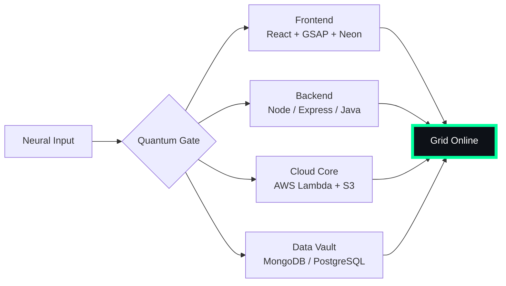

# 🌌 [ NEURAL CORE ACCESS: PENDEMVAMSI ]

<p align="center">
  
</p>

<div align="center">
  
  <br><small>Active Protocol: <strong style="color:#00FF9D">MATRIX RAIN</strong> 💾🌧️</small>
</div>

## 🔵 NEURAL STATUS READOUT
```text
SUBJECT ID    →  PENDEMVAMSI
ENTITY CLASS  →  SHADOW MONARCH v8
NEURAL RANK   →  B-TIER
GRID SYNC     →  4760/8010 QUANTUM PACKETS
─────── BIO-METRICS (MATRIX RAIN) ───────
STRENGTH      140  ██████████████████░░░
AGILITY       122  ████████████████░░░░░
INTELLIGENCE  147  ███████████████████░░
VITALITY      112  ███████████████░░░░░░
```

> **NEURAL BURST ACQUIRED:** +119 QUANTUM PACKETS 
> **SYSTEM MESSAGE:** SYNTHETIC DREAMS LOADING… DO NOT DISCONNECT

---

## 🌀 GRID ARCHITECTURE (HOLOGRAPHIC RENDER)



---

## 📡 ACADEMIC NODES – CONQUERED
- [x] B.Tech Neural Engineering (2020–2024) – St. Ann’s Grid
- [x] Intermediate Quantum Core (2018–2020) – Sri Medhavi
- [x] SSC Primary Link (2017–2018) – Sri Geethanjali

---

## ⚡ SKILL NEURAL MATRIX

<details open>
<summary>🔌 ACTIVE NEURAL LINKS</summary>

| Node               | Tier | Integrity Bar                | Status      |
|--------------------|------|------------------------------|-------------|
| Java Core          | S    | ████████████████████ 100%   | OVERCLOCKED |
| Node.js Grid       | S    | ████████████████████ 100%   | OVERCLOCKED |
| React Holo-UI      | A+   | █████████████████░░░ 92%    | ONLINE      |
| AWS Quantum Relay  | S    | ████████████████████ 100%   | SOVEREIGN   |
| Python AI Kernel   | A    | ████████████████░░░░ 85%    | CHARGING    |
| DSA Void Algorithm | A    | █████████████████░░░ 90%    | ACTIVE      |

</details>

---

## 🏅 NEURAL ACHIEVEMENT TOKENS

<p align="center">
  
  
  
  
</p>

---

## 👾 SHADOW ENTITIES – SUMMONED

<p align="center">
  
  <br><strong style="color:#00FF9D">ARISE.</strong>
</p>

| Entity | Designation   | Class            | Source Node                     |
|--------|---------------|------------------|---------------------------------|
| SH-01  | Igris         | Void Commander   | AI Financial Oracle             |
| SH-02  | Beru          | Swarm Overlord   | WebRTC Quantum Stream           |
| SH-03  | Kaisel        | Void Wyrm        | Geolocation Shadow Relay        |
| SH-04  | Tusk          | Arcane Construct | Global Pandemic Sentinel        |
| SH-05  | Iron          | Armored Bastion  | React Crypto Fortress           |

---

## 📡 GRID ANALYTICS (LIVE FEED)

<p align="center">
  
  <br>
  
  
</p>

---

## 🖥️ CORRUPTED MAINFRAME LOG (401 ENTRIES)

<details>
<summary>OPEN TERMINAL FEED – PROTOCOL: MATRIX RAIN</summary>

> [0x969D529C] 💾🌧️ **MATRIX RAIN PROTOCOL** #0 | NEURAL LINK STABILIZED | [TRANSMISSION SUCCESS]
> [0x496535BE] 💾🌧️ **MATRIX RAIN PROTOCOL** #1 | NEURAL LINK STABILIZED | [TRANSMISSION SUCCESS]
> [0x6B69E8FA] 💾🌧️ **MATRIX RAIN PROTOCOL** #2 | NEURAL LINK STABILIZED | [TRANSMISSION SUCCESS]
> [0xAF6BC147] 💾🌧️ **MATRIX RAIN PROTOCOL** #3 | NEURAL LINK STABILIZED | [TRANSMISSION SUCCESS]
> [0x509DA715] 💾🌧️ **MATRIX RAIN PROTOCOL** #4 | NEURAL LINK  [GLITCH DETECTED] STABILIZED | [TRANSMISSION SUCCESS]
> [0xBCDAA82F] 💾🌧️ **MATRIX RAIN PROTOCOL** #5 | NEURAL LINK STABILIZED | [TRANSMISSION SUCCESS]
> [0xE16644F1] 💾🌧️ **MATRIX RAIN PROTOCOL** #6 | NEURAL LINK STABILIZED | [TRANSMISSION SUCCESS]
> [0x2F916CFC] 💾🌧️ **MATRIX RAIN PROTOCOL** #7 | NEURAL LINK STABILIZED | [TRANSMISSION SUCCESS]
> [0xBCD965C8] 💾🌧️ **MATRIX RAIN PROTOCOL** #8 | NEURAL LINK STABILIZED | [TRANSMISSION SUCCESS]
> [0x257C0FAF] 💾🌧️ **MATRIX RAIN PROTOCOL** #9 | NEURAL LINK  [GLITCH DETECTED] STABILIZED | [TRANSMISSION SUCCESS]
> [0x1D10A7B4] 💾🌧️ **MATRIX RAIN PROTOCOL** #10 | NEURAL LINK STABILIZED | [TRANSMISSION SUCCESS]
> [0x407D8BE5] 💾🌧️ **MATRIX RAIN PROTOCOL** #11 | NEURAL LINK STABILIZED | [TRANSMISSION SUCCESS]
> [0x2DD0094A] 💾🌧️ **MATRIX RAIN PROTOCOL** #12 | NEURAL LINK STABILIZED | [TRANSMISSION SUCCESS]
> [0xB0DE4EAF] 💾🌧️ **MATRIX RAIN PROTOCOL** #13 | NEURAL LINK STABILIZED | [TRANSMISSION SUCCESS]
> [0x27F72EAA] 💾🌧️ **MATRIX RAIN PROTOCOL** #14 | NEURAL LINK STABILIZED | [TRANSMISSION SUCCESS]
> [0x170C3ABB] 💾🌧️ **MATRIX RAIN PROTOCOL** #15 | NEURAL LINK STABILIZED | [TRANSMISSION SUCCESS]
> [0xB2E48A63] 💾🌧️ **MATRIX RAIN PROTOCOL** #16 | NEURAL LINK STABILIZED | [TRANSMISSION SUCCESS]
> [0x23AEDB5D] 💾🌧️ **MATRIX RAIN PROTOCOL** #17 | NEURAL LINK STABILIZED | [TRANSMISSION SUCCESS]
> [0x18048DFC] 💾🌧️ **MATRIX RAIN PROTOCOL** #18 | NEURAL LINK  [GLITCH DETECTED] STABILIZED | [TRANSMISSION SUCCESS]
> [0xF8C2D61F] 💾🌧️ **MATRIX RAIN PROTOCOL** #19 | NEURAL LINK STABILIZED | [TRANSMISSION SUCCESS]
> [0xE4DBD345] 💾🌧️ **MATRIX RAIN PROTOCOL** #20 | NEURAL LINK STABILIZED | [TRANSMISSION SUCCESS]
> [0xFB577D7E] 💾🌧️ **MATRIX RAIN PROTOCOL** #21 | NEURAL LINK STABILIZED | [TRANSMISSION SUCCESS]
> [0x45DACE6F] 💾🌧️ **MATRIX RAIN PROTOCOL** #22 | NEURAL LINK STABILIZED | [TRANSMISSION SUCCESS]
> [0x21A92BE0] 💾🌧️ **MATRIX RAIN PROTOCOL** #23 | NEURAL LINK STABILIZED | [TRANSMISSION SUCCESS]
> [0xCE092673] 💾🌧️ **MATRIX RAIN PROTOCOL** #24 | NEURAL LINK STABILIZED | [TRANSMISSION SUCCESS]
> [0x89D7D603] 💾🌧️ **MATRIX RAIN PROTOCOL** #25 | NEURAL LINK  [GLITCH DETECTED] STABILIZED | [TRANSMISSION SUCCESS]
> [0x92882DDB] 💾🌧️ **MATRIX RAIN PROTOCOL** #26 | NEURAL LINK STABILIZED | [TRANSMISSION SUCCESS]
> [0x027E5A37] 💾🌧️ **MATRIX RAIN PROTOCOL** #27 | NEURAL LINK STABILIZED | [TRANSMISSION SUCCESS]
> [0x60C9ED46] 💾🌧️ **MATRIX RAIN PROTOCOL** #28 | NEURAL LINK STABILIZED | [TRANSMISSION SUCCESS]
> [0x064A7A04] 💾🌧️ **MATRIX RAIN PROTOCOL** #29 | NEURAL LINK  [GLITCH DETECTED] STABILIZED | [TRANSMISSION SUCCESS]
> [0xDCFFA646] 💾🌧️ **MATRIX RAIN PROTOCOL** #30 | NEURAL LINK STABILIZED | [TRANSMISSION SUCCESS]
> [0x0278B6CA] 💾🌧️ **MATRIX RAIN PROTOCOL** #31 | NEURAL LINK  [GLITCH DETECTED] STABILIZED | [TRANSMISSION SUCCESS]
> [0x284CB9EB] 💾🌧️ **MATRIX RAIN PROTOCOL** #32 | NEURAL LINK STABILIZED | [TRANSMISSION SUCCESS]
> [0x4B52AD56] 💾🌧️ **MATRIX RAIN PROTOCOL** #33 | NEURAL LINK STABILIZED | [TRANSMISSION SUCCESS]
> [0x60F3263F] 💾🌧️ **MATRIX RAIN PROTOCOL** #34 | NEURAL LINK STABILIZED | [TRANSMISSION SUCCESS]
> [0x80BB953F] 💾🌧️ **MATRIX RAIN PROTOCOL** #35 | NEURAL LINK STABILIZED | [TRANSMISSION SUCCESS]
> [0x08F6752A] 💾🌧️ **MATRIX RAIN PROTOCOL** #36 | NEURAL LINK STABILIZED | [TRANSMISSION SUCCESS]
> [0xE764F11C] 💾🌧️ **MATRIX RAIN PROTOCOL** #37 | NEURAL LINK STABILIZED | [TRANSMISSION SUCCESS]
> [0xDD170826] 💾🌧️ **MATRIX RAIN PROTOCOL** #38 | NEURAL LINK STABILIZED | [TRANSMISSION SUCCESS]
> [0x88366FD7] 💾🌧️ **MATRIX RAIN PROTOCOL** #39 | NEURAL LINK STABILIZED | [TRANSMISSION SUCCESS]
> [0x8FCE6B82] 💾🌧️ **MATRIX RAIN PROTOCOL** #40 | NEURAL LINK STABILIZED | [TRANSMISSION SUCCESS]
> [0x4EAE44C1] 💾🌧️ **MATRIX RAIN PROTOCOL** #41 | NEURAL LINK STABILIZED | [TRANSMISSION SUCCESS]
> [0xD09D473C] 💾🌧️ **MATRIX RAIN PROTOCOL** #42 | NEURAL LINK STABILIZED | [TRANSMISSION SUCCESS]
> [0x5CA0CB6C] 💾🌧️ **MATRIX RAIN PROTOCOL** #43 | NEURAL LINK STABILIZED | [TRANSMISSION SUCCESS]
> [0x5F660645] 💾🌧️ **MATRIX RAIN PROTOCOL** #44 | NEURAL LINK STABILIZED | [TRANSMISSION SUCCESS]
> [0x197CF41F] 💾🌧️ **MATRIX RAIN PROTOCOL** #45 | NEURAL LINK  [GLITCH DETECTED] STABILIZED | [TRANSMISSION SUCCESS]
> [0x06B2B3DA] 💾🌧️ **MATRIX RAIN PROTOCOL** #46 | NEURAL LINK STABILIZED | [TRANSMISSION SUCCESS]
> [0x329C2A66] 💾🌧️ **MATRIX RAIN PROTOCOL** #47 | NEURAL LINK STABILIZED | [TRANSMISSION SUCCESS]
> [0xC564FB06] 💾🌧️ **MATRIX RAIN PROTOCOL** #48 | NEURAL LINK STABILIZED | [TRANSMISSION SUCCESS]
> [0xACA11AE8] 💾🌧️ **MATRIX RAIN PROTOCOL** #49 | NEURAL LINK STABILIZED | [TRANSMISSION SUCCESS]
> [0xAD844C96] 💾🌧️ **MATRIX RAIN PROTOCOL** #50 | NEURAL LINK STABILIZED | [TRANSMISSION SUCCESS]
> [0xBBB80D61] 💾🌧️ **MATRIX RAIN PROTOCOL** #51 | NEURAL LINK STABILIZED | [TRANSMISSION SUCCESS]
> [0x0F4CB027] 💾🌧️ **MATRIX RAIN PROTOCOL** #52 | NEURAL LINK STABILIZED | [TRANSMISSION SUCCESS]
> [0xD4A02EDC] 💾🌧️ **MATRIX RAIN PROTOCOL** #53 | NEURAL LINK STABILIZED | [TRANSMISSION SUCCESS]
> [0x5422A351] 💾🌧️ **MATRIX RAIN PROTOCOL** #54 | NEURAL LINK STABILIZED | [TRANSMISSION SUCCESS]
> [0x5BB0E938] 💾🌧️ **MATRIX RAIN PROTOCOL** #55 | NEURAL LINK STABILIZED | [TRANSMISSION SUCCESS]
> [0x6E31DDCD] 💾🌧️ **MATRIX RAIN PROTOCOL** #56 | NEURAL LINK STABILIZED | [TRANSMISSION SUCCESS]
> [0x7D3BA0A2] 💾🌧️ **MATRIX RAIN PROTOCOL** #57 | NEURAL LINK STABILIZED | [TRANSMISSION SUCCESS]
> [0x5B176698] 💾🌧️ **MATRIX RAIN PROTOCOL** #58 | NEURAL LINK STABILIZED | [TRANSMISSION SUCCESS]
> [0x52CE5C51] 💾🌧️ **MATRIX RAIN PROTOCOL** #59 | NEURAL LINK STABILIZED | [TRANSMISSION SUCCESS]
> [0x0135E53D] 💾🌧️ **MATRIX RAIN PROTOCOL** #60 | NEURAL LINK STABILIZED | [TRANSMISSION SUCCESS]
> [0x7567876C] 💾🌧️ **MATRIX RAIN PROTOCOL** #61 | NEURAL LINK STABILIZED | [TRANSMISSION SUCCESS]
> [0xFC515B22] 💾🌧️ **MATRIX RAIN PROTOCOL** #62 | NEURAL LINK  [GLITCH DETECTED] STABILIZED | [TRANSMISSION SUCCESS]
> [0x14165916] 💾🌧️ **MATRIX RAIN PROTOCOL** #63 | NEURAL LINK STABILIZED | [TRANSMISSION SUCCESS]
> [0x77C9A4EF] 💾🌧️ **MATRIX RAIN PROTOCOL** #64 | NEURAL LINK STABILIZED | [TRANSMISSION SUCCESS]
> [0x15F63DC1] 💾🌧️ **MATRIX RAIN PROTOCOL** #65 | NEURAL LINK STABILIZED | [TRANSMISSION SUCCESS]
> [0x62470E34] 💾🌧️ **MATRIX RAIN PROTOCOL** #66 | NEURAL LINK STABILIZED | [TRANSMISSION SUCCESS]
> [0x657BFEEA] 💾🌧️ **MATRIX RAIN PROTOCOL** #67 | NEURAL LINK STABILIZED | [TRANSMISSION SUCCESS]
> [0xCB7DC640] 💾🌧️ **MATRIX RAIN PROTOCOL** #68 | NEURAL LINK STABILIZED | [TRANSMISSION SUCCESS]
> [0x667F6016] 💾🌧️ **MATRIX RAIN PROTOCOL** #69 | NEURAL LINK STABILIZED | [TRANSMISSION SUCCESS]
> [0x17DC0078] 💾🌧️ **MATRIX RAIN PROTOCOL** #70 | NEURAL LINK STABILIZED | [TRANSMISSION SUCCESS]
> [0xA01FBD24] 💾🌧️ **MATRIX RAIN PROTOCOL** #71 | NEURAL LINK STABILIZED | [TRANSMISSION SUCCESS]
> [0x95C81928] 💾🌧️ **MATRIX RAIN PROTOCOL** #72 | NEURAL LINK STABILIZED | [TRANSMISSION SUCCESS]
> [0x70EF3A4F] 💾🌧️ **MATRIX RAIN PROTOCOL** #73 | NEURAL LINK STABILIZED | [TRANSMISSION SUCCESS]
> [0x26747E44] 💾🌧️ **MATRIX RAIN PROTOCOL** #74 | NEURAL LINK STABILIZED | [TRANSMISSION SUCCESS]
> [0xEABF37E1] 💾🌧️ **MATRIX RAIN PROTOCOL** #75 | NEURAL LINK STABILIZED | [TRANSMISSION SUCCESS]
> [0x39D252FC] 💾🌧️ **MATRIX RAIN PROTOCOL** #76 | NEURAL LINK STABILIZED | [TRANSMISSION SUCCESS]
> [0xD67F9CAC] 💾🌧️ **MATRIX RAIN PROTOCOL** #77 | NEURAL LINK STABILIZED | [TRANSMISSION SUCCESS]
> [0xF8BF5B18] 💾🌧️ **MATRIX RAIN PROTOCOL** #78 | NEURAL LINK STABILIZED | [TRANSMISSION SUCCESS]
> [0x1063C958] 💾🌧️ **MATRIX RAIN PROTOCOL** #79 | NEURAL LINK STABILIZED | [TRANSMISSION SUCCESS]
> [0x0F487348] 💾🌧️ **MATRIX RAIN PROTOCOL** #80 | NEURAL LINK  [GLITCH DETECTED] STABILIZED | [TRANSMISSION SUCCESS]
> [0x0BBD97BD] 💾🌧️ **MATRIX RAIN PROTOCOL** #81 | NEURAL LINK STABILIZED | [TRANSMISSION SUCCESS]
> [0xBF8F15BF] 💾🌧️ **MATRIX RAIN PROTOCOL** #82 | NEURAL LINK  [GLITCH DETECTED] STABILIZED | [TRANSMISSION SUCCESS]
> [0xF77F7146] 💾🌧️ **MATRIX RAIN PROTOCOL** #83 | NEURAL LINK STABILIZED | [TRANSMISSION SUCCESS]
> [0xE2A004AB] 💾🌧️ **MATRIX RAIN PROTOCOL** #84 | NEURAL LINK STABILIZED | [TRANSMISSION SUCCESS]
> [0x041C7763] 💾🌧️ **MATRIX RAIN PROTOCOL** #85 | NEURAL LINK STABILIZED | [TRANSMISSION SUCCESS]
> [0x6E5506D7] 💾🌧️ **MATRIX RAIN PROTOCOL** #86 | NEURAL LINK STABILIZED | [TRANSMISSION SUCCESS]
> [0x07238FBB] 💾🌧️ **MATRIX RAIN PROTOCOL** #87 | NEURAL LINK STABILIZED | [TRANSMISSION SUCCESS]
> [0x8B11F406] 💾🌧️ **MATRIX RAIN PROTOCOL** #88 | NEURAL LINK STABILIZED | [TRANSMISSION SUCCESS]
> [0xEC05602E] 💾🌧️ **MATRIX RAIN PROTOCOL** #89 | NEURAL LINK STABILIZED | [TRANSMISSION SUCCESS]
> [0xA6FFDC2F] 💾🌧️ **MATRIX RAIN PROTOCOL** #90 | NEURAL LINK STABILIZED | [TRANSMISSION SUCCESS]
> [0xEBB2900B] 💾🌧️ **MATRIX RAIN PROTOCOL** #91 | NEURAL LINK STABILIZED | [TRANSMISSION SUCCESS]
> [0xC4F54847] 💾🌧️ **MATRIX RAIN PROTOCOL** #92 | NEURAL LINK STABILIZED | [TRANSMISSION SUCCESS]
> [0xEF730854] 💾🌧️ **MATRIX RAIN PROTOCOL** #93 | NEURAL LINK STABILIZED | [TRANSMISSION SUCCESS]
> [0x92AD64D6] 💾🌧️ **MATRIX RAIN PROTOCOL** #94 | NEURAL LINK  [GLITCH DETECTED] STABILIZED | [TRANSMISSION SUCCESS]
> [0x925D108B] 💾🌧️ **MATRIX RAIN PROTOCOL** #95 | NEURAL LINK STABILIZED | [TRANSMISSION SUCCESS]
> [0x56FFEF61] 💾🌧️ **MATRIX RAIN PROTOCOL** #96 | NEURAL LINK STABILIZED | [TRANSMISSION SUCCESS]
> [0x0B9D76D3] 💾🌧️ **MATRIX RAIN PROTOCOL** #97 | NEURAL LINK STABILIZED | [TRANSMISSION SUCCESS]
> [0x7DCF9EAA] 💾🌧️ **MATRIX RAIN PROTOCOL** #98 | NEURAL LINK STABILIZED | [TRANSMISSION SUCCESS]
> [0xA4CEB9FA] 💾🌧️ **MATRIX RAIN PROTOCOL** #99 | NEURAL LINK STABILIZED | [TRANSMISSION SUCCESS]
> [0x7D87ED51] 💾🌧️ **MATRIX RAIN PROTOCOL** #100 | NEURAL LINK STABILIZED | [TRANSMISSION SUCCESS]
> [0x98EC48BC] 💾🌧️ **MATRIX RAIN PROTOCOL** #101 | NEURAL LINK STABILIZED | [TRANSMISSION SUCCESS]
> [0x29C0C036] 💾🌧️ **MATRIX RAIN PROTOCOL** #102 | NEURAL LINK STABILIZED | [TRANSMISSION SUCCESS]
> [0x4BA5F002] 💾🌧️ **MATRIX RAIN PROTOCOL** #103 | NEURAL LINK STABILIZED | [TRANSMISSION SUCCESS]
> [0x41E3FA74] 💾🌧️ **MATRIX RAIN PROTOCOL** #104 | NEURAL LINK  [GLITCH DETECTED] STABILIZED | [TRANSMISSION SUCCESS]
> [0xED46E095] 💾🌧️ **MATRIX RAIN PROTOCOL** #105 | NEURAL LINK STABILIZED | [TRANSMISSION SUCCESS]
> [0x9C36D34B] 💾🌧️ **MATRIX RAIN PROTOCOL** #106 | NEURAL LINK STABILIZED | [TRANSMISSION SUCCESS]
> [0x601E0560] 💾🌧️ **MATRIX RAIN PROTOCOL** #107 | NEURAL LINK STABILIZED | [TRANSMISSION SUCCESS]
> [0xCDAD9D50] 💾🌧️ **MATRIX RAIN PROTOCOL** #108 | NEURAL LINK STABILIZED | [TRANSMISSION SUCCESS]
> [0xE0F1D2D8] 💾🌧️ **MATRIX RAIN PROTOCOL** #109 | NEURAL LINK STABILIZED | [TRANSMISSION SUCCESS]
> [0xEB505160] 💾🌧️ **MATRIX RAIN PROTOCOL** #110 | NEURAL LINK STABILIZED | [TRANSMISSION SUCCESS]
> [0xDF7FB475] 💾🌧️ **MATRIX RAIN PROTOCOL** #111 | NEURAL LINK STABILIZED | [TRANSMISSION SUCCESS]
> [0x75EBBF0A] 💾🌧️ **MATRIX RAIN PROTOCOL** #112 | NEURAL LINK STABILIZED | [TRANSMISSION SUCCESS]
> [0x6E79BFB9] 💾🌧️ **MATRIX RAIN PROTOCOL** #113 | NEURAL LINK  [GLITCH DETECTED] STABILIZED | [TRANSMISSION SUCCESS]
> [0x48DAB791] 💾🌧️ **MATRIX RAIN PROTOCOL** #114 | NEURAL LINK STABILIZED | [TRANSMISSION SUCCESS]
> [0x92AD1EE4] 💾🌧️ **MATRIX RAIN PROTOCOL** #115 | NEURAL LINK  [GLITCH DETECTED] STABILIZED | [TRANSMISSION SUCCESS]
> [0x99775BA0] 💾🌧️ **MATRIX RAIN PROTOCOL** #116 | NEURAL LINK STABILIZED | [TRANSMISSION SUCCESS]
> [0x98EE2EE3] 💾🌧️ **MATRIX RAIN PROTOCOL** #117 | NEURAL LINK STABILIZED | [TRANSMISSION SUCCESS]
> [0x87CD27B3] 💾🌧️ **MATRIX RAIN PROTOCOL** #118 | NEURAL LINK STABILIZED | [TRANSMISSION SUCCESS]
> [0xD7A27C65] 💾🌧️ **MATRIX RAIN PROTOCOL** #119 | NEURAL LINK STABILIZED | [TRANSMISSION SUCCESS]
> [0x3EBD1474] 💾🌧️ **MATRIX RAIN PROTOCOL** #120 | NEURAL LINK  [GLITCH DETECTED] STABILIZED | [TRANSMISSION SUCCESS]
> [0x505F3311] 💾🌧️ **MATRIX RAIN PROTOCOL** #121 | NEURAL LINK STABILIZED | [TRANSMISSION SUCCESS]
> [0x1E559089] 💾🌧️ **MATRIX RAIN PROTOCOL** #122 | NEURAL LINK STABILIZED | [TRANSMISSION SUCCESS]
> [0xA8ED16DC] 💾🌧️ **MATRIX RAIN PROTOCOL** #123 | NEURAL LINK  [GLITCH DETECTED] STABILIZED | [TRANSMISSION SUCCESS]
> [0x53FA561F] 💾🌧️ **MATRIX RAIN PROTOCOL** #124 | NEURAL LINK STABILIZED | [TRANSMISSION SUCCESS]
> [0x7FD1F05B] 💾🌧️ **MATRIX RAIN PROTOCOL** #125 | NEURAL LINK STABILIZED | [TRANSMISSION SUCCESS]
> [0xFA108DC1] 💾🌧️ **MATRIX RAIN PROTOCOL** #126 | NEURAL LINK STABILIZED | [TRANSMISSION SUCCESS]
> [0x4BEC8D1D] 💾🌧️ **MATRIX RAIN PROTOCOL** #127 | NEURAL LINK STABILIZED | [TRANSMISSION SUCCESS]
> [0xA3796D3C] 💾🌧️ **MATRIX RAIN PROTOCOL** #128 | NEURAL LINK STABILIZED | [TRANSMISSION SUCCESS]
> [0x1855E505] 💾🌧️ **MATRIX RAIN PROTOCOL** #129 | NEURAL LINK STABILIZED | [TRANSMISSION SUCCESS]
> [0x2A118E28] 💾🌧️ **MATRIX RAIN PROTOCOL** #130 | NEURAL LINK STABILIZED | [TRANSMISSION SUCCESS]
> [0xD66E89E8] 💾🌧️ **MATRIX RAIN PROTOCOL** #131 | NEURAL LINK STABILIZED | [TRANSMISSION SUCCESS]
> [0x9FFA14A7] 💾🌧️ **MATRIX RAIN PROTOCOL** #132 | NEURAL LINK STABILIZED | [TRANSMISSION SUCCESS]
> [0x5BFA5D1A] 💾🌧️ **MATRIX RAIN PROTOCOL** #133 | NEURAL LINK STABILIZED | [TRANSMISSION SUCCESS]
> [0xD5145E11] 💾🌧️ **MATRIX RAIN PROTOCOL** #134 | NEURAL LINK STABILIZED | [TRANSMISSION SUCCESS]
> [0x9BB60201] 💾🌧️ **MATRIX RAIN PROTOCOL** #135 | NEURAL LINK STABILIZED | [TRANSMISSION SUCCESS]
> [0x8A5CE4C1] 💾🌧️ **MATRIX RAIN PROTOCOL** #136 | NEURAL LINK STABILIZED | [TRANSMISSION SUCCESS]
> [0x30E09996] 💾🌧️ **MATRIX RAIN PROTOCOL** #137 | NEURAL LINK STABILIZED | [TRANSMISSION SUCCESS]
> [0x2C5CED6A] 💾🌧️ **MATRIX RAIN PROTOCOL** #138 | NEURAL LINK STABILIZED | [TRANSMISSION SUCCESS]
> [0x8441AF37] 💾🌧️ **MATRIX RAIN PROTOCOL** #139 | NEURAL LINK STABILIZED | [TRANSMISSION SUCCESS]
> [0x0DB75E90] 💾🌧️ **MATRIX RAIN PROTOCOL** #140 | NEURAL LINK  [GLITCH DETECTED] STABILIZED | [TRANSMISSION SUCCESS]
> [0x558EDF74] 💾🌧️ **MATRIX RAIN PROTOCOL** #141 | NEURAL LINK STABILIZED | [TRANSMISSION SUCCESS]
> [0x071A3EE4] 💾🌧️ **MATRIX RAIN PROTOCOL** #142 | NEURAL LINK STABILIZED | [TRANSMISSION SUCCESS]
> [0x0B6624C2] 💾🌧️ **MATRIX RAIN PROTOCOL** #143 | NEURAL LINK STABILIZED | [TRANSMISSION SUCCESS]
> [0x6A794DC2] 💾🌧️ **MATRIX RAIN PROTOCOL** #144 | NEURAL LINK STABILIZED | [TRANSMISSION SUCCESS]
> [0xD6E12A13] 💾🌧️ **MATRIX RAIN PROTOCOL** #145 | NEURAL LINK STABILIZED | [TRANSMISSION SUCCESS]
> [0x3A4B1FFC] 💾🌧️ **MATRIX RAIN PROTOCOL** #146 | NEURAL LINK  [GLITCH DETECTED] STABILIZED | [TRANSMISSION SUCCESS]
> [0x53110339] 💾🌧️ **MATRIX RAIN PROTOCOL** #147 | NEURAL LINK STABILIZED | [TRANSMISSION SUCCESS]
> [0xB35BB2F1] 💾🌧️ **MATRIX RAIN PROTOCOL** #148 | NEURAL LINK STABILIZED | [TRANSMISSION SUCCESS]
> [0x34B6378E] 💾🌧️ **MATRIX RAIN PROTOCOL** #149 | NEURAL LINK STABILIZED | [TRANSMISSION SUCCESS]
> [0x92CAFF36] 💾🌧️ **MATRIX RAIN PROTOCOL** #150 | NEURAL LINK STABILIZED | [TRANSMISSION SUCCESS]
> [0xB6C72C3A] 💾🌧️ **MATRIX RAIN PROTOCOL** #151 | NEURAL LINK STABILIZED | [TRANSMISSION SUCCESS]
> [0x3FDC463B] 💾🌧️ **MATRIX RAIN PROTOCOL** #152 | NEURAL LINK STABILIZED | [TRANSMISSION SUCCESS]
> [0x240AC2E2] 💾🌧️ **MATRIX RAIN PROTOCOL** #153 | NEURAL LINK STABILIZED | [TRANSMISSION SUCCESS]
> [0x75B24414] 💾🌧️ **MATRIX RAIN PROTOCOL** #154 | NEURAL LINK STABILIZED | [TRANSMISSION SUCCESS]
> [0x4BE8343A] 💾🌧️ **MATRIX RAIN PROTOCOL** #155 | NEURAL LINK STABILIZED | [TRANSMISSION SUCCESS]
> [0x28E7ABA5] 💾🌧️ **MATRIX RAIN PROTOCOL** #156 | NEURAL LINK STABILIZED | [TRANSMISSION SUCCESS]
> [0x34327E88] 💾🌧️ **MATRIX RAIN PROTOCOL** #157 | NEURAL LINK STABILIZED | [TRANSMISSION SUCCESS]
> [0x36F89708] 💾🌧️ **MATRIX RAIN PROTOCOL** #158 | NEURAL LINK  [GLITCH DETECTED] STABILIZED | [TRANSMISSION SUCCESS]
> [0x245E7BCC] 💾🌧️ **MATRIX RAIN PROTOCOL** #159 | NEURAL LINK STABILIZED | [TRANSMISSION SUCCESS]
> [0x524E566F] 💾🌧️ **MATRIX RAIN PROTOCOL** #160 | NEURAL LINK STABILIZED | [TRANSMISSION SUCCESS]
> [0xD3B5706C] 💾🌧️ **MATRIX RAIN PROTOCOL** #161 | NEURAL LINK STABILIZED | [TRANSMISSION SUCCESS]
> [0xD983CD6C] 💾🌧️ **MATRIX RAIN PROTOCOL** #162 | NEURAL LINK STABILIZED | [TRANSMISSION SUCCESS]
> [0x8714F2A1] 💾🌧️ **MATRIX RAIN PROTOCOL** #163 | NEURAL LINK STABILIZED | [TRANSMISSION SUCCESS]
> [0xE1DAA62C] 💾🌧️ **MATRIX RAIN PROTOCOL** #164 | NEURAL LINK  [GLITCH DETECTED] STABILIZED | [TRANSMISSION SUCCESS]
> [0x9DD71D4A] 💾🌧️ **MATRIX RAIN PROTOCOL** #165 | NEURAL LINK STABILIZED | [TRANSMISSION SUCCESS]
> [0x3746B14E] 💾🌧️ **MATRIX RAIN PROTOCOL** #166 | NEURAL LINK STABILIZED | [TRANSMISSION SUCCESS]
> [0x14576B03] 💾🌧️ **MATRIX RAIN PROTOCOL** #167 | NEURAL LINK STABILIZED | [TRANSMISSION SUCCESS]
> [0xC1351B73] 💾🌧️ **MATRIX RAIN PROTOCOL** #168 | NEURAL LINK STABILIZED | [TRANSMISSION SUCCESS]
> [0x92638024] 💾🌧️ **MATRIX RAIN PROTOCOL** #169 | NEURAL LINK STABILIZED | [TRANSMISSION SUCCESS]
> [0x7DCA1F6F] 💾🌧️ **MATRIX RAIN PROTOCOL** #170 | NEURAL LINK STABILIZED | [TRANSMISSION SUCCESS]
> [0x606F51A2] 💾🌧️ **MATRIX RAIN PROTOCOL** #171 | NEURAL LINK STABILIZED | [TRANSMISSION SUCCESS]
> [0x4F9E44CC] 💾🌧️ **MATRIX RAIN PROTOCOL** #172 | NEURAL LINK STABILIZED | [TRANSMISSION SUCCESS]
> [0x8C86A112] 💾🌧️ **MATRIX RAIN PROTOCOL** #173 | NEURAL LINK STABILIZED | [TRANSMISSION SUCCESS]
> [0xAB82ABD8] 💾🌧️ **MATRIX RAIN PROTOCOL** #174 | NEURAL LINK STABILIZED | [TRANSMISSION SUCCESS]
> [0x0FA1C00B] 💾🌧️ **MATRIX RAIN PROTOCOL** #175 | NEURAL LINK STABILIZED | [TRANSMISSION SUCCESS]
> [0x7CA8B021] 💾🌧️ **MATRIX RAIN PROTOCOL** #176 | NEURAL LINK STABILIZED | [TRANSMISSION SUCCESS]
> [0x7E2C0D12] 💾🌧️ **MATRIX RAIN PROTOCOL** #177 | NEURAL LINK STABILIZED | [TRANSMISSION SUCCESS]
> [0x69615E46] 💾🌧️ **MATRIX RAIN PROTOCOL** #178 | NEURAL LINK STABILIZED | [TRANSMISSION SUCCESS]
> [0xD6E1CE2A] 💾🌧️ **MATRIX RAIN PROTOCOL** #179 | NEURAL LINK STABILIZED | [TRANSMISSION SUCCESS]
> [0xA0FF678F] 💾🌧️ **MATRIX RAIN PROTOCOL** #180 | NEURAL LINK STABILIZED | [TRANSMISSION SUCCESS]
> [0xB86CCF26] 💾🌧️ **MATRIX RAIN PROTOCOL** #181 | NEURAL LINK STABILIZED | [TRANSMISSION SUCCESS]
> [0x5B9EC29E] 💾🌧️ **MATRIX RAIN PROTOCOL** #182 | NEURAL LINK STABILIZED | [TRANSMISSION SUCCESS]
> [0x8B67588E] 💾🌧️ **MATRIX RAIN PROTOCOL** #183 | NEURAL LINK STABILIZED | [TRANSMISSION SUCCESS]
> [0xD8BE8EA4] 💾🌧️ **MATRIX RAIN PROTOCOL** #184 | NEURAL LINK STABILIZED | [TRANSMISSION SUCCESS]
> [0x98574591] 💾🌧️ **MATRIX RAIN PROTOCOL** #185 | NEURAL LINK STABILIZED | [TRANSMISSION SUCCESS]
> [0x5E0F3D6A] 💾🌧️ **MATRIX RAIN PROTOCOL** #186 | NEURAL LINK STABILIZED | [TRANSMISSION SUCCESS]
> [0x5A8D9A75] 💾🌧️ **MATRIX RAIN PROTOCOL** #187 | NEURAL LINK STABILIZED | [TRANSMISSION SUCCESS]
> [0x261E6F9A] 💾🌧️ **MATRIX RAIN PROTOCOL** #188 | NEURAL LINK STABILIZED | [TRANSMISSION SUCCESS]
> [0x94DFAF00] 💾🌧️ **MATRIX RAIN PROTOCOL** #189 | NEURAL LINK STABILIZED | [TRANSMISSION SUCCESS]
> [0x02CAE678] 💾🌧️ **MATRIX RAIN PROTOCOL** #190 | NEURAL LINK STABILIZED | [TRANSMISSION SUCCESS]
> [0x091AF58A] 💾🌧️ **MATRIX RAIN PROTOCOL** #191 | NEURAL LINK  [GLITCH DETECTED] STABILIZED | [TRANSMISSION SUCCESS]
> [0x5550EF65] 💾🌧️ **MATRIX RAIN PROTOCOL** #192 | NEURAL LINK STABILIZED | [TRANSMISSION SUCCESS]
> [0xF70A86D1] 💾🌧️ **MATRIX RAIN PROTOCOL** #193 | NEURAL LINK STABILIZED | [TRANSMISSION SUCCESS]
> [0x7C9B419D] 💾🌧️ **MATRIX RAIN PROTOCOL** #194 | NEURAL LINK STABILIZED | [TRANSMISSION SUCCESS]
> [0xBCCE9366] 💾🌧️ **MATRIX RAIN PROTOCOL** #195 | NEURAL LINK STABILIZED | [TRANSMISSION SUCCESS]
> [0x9D090C95] 💾🌧️ **MATRIX RAIN PROTOCOL** #196 | NEURAL LINK STABILIZED | [TRANSMISSION SUCCESS]
> [0xE850BB78] 💾🌧️ **MATRIX RAIN PROTOCOL** #197 | NEURAL LINK  [GLITCH DETECTED] STABILIZED | [TRANSMISSION SUCCESS]
> [0xEDDDBDDF] 💾🌧️ **MATRIX RAIN PROTOCOL** #198 | NEURAL LINK STABILIZED | [TRANSMISSION SUCCESS]
> [0x241F6CDD] 💾🌧️ **MATRIX RAIN PROTOCOL** #199 | NEURAL LINK STABILIZED | [TRANSMISSION SUCCESS]
> [0xFE9476F7] 💾🌧️ **MATRIX RAIN PROTOCOL** #200 | NEURAL LINK STABILIZED | [TRANSMISSION SUCCESS]
> [0x004E7F95] 💾🌧️ **MATRIX RAIN PROTOCOL** #201 | NEURAL LINK STABILIZED | [TRANSMISSION SUCCESS]
> [0x1D797638] 💾🌧️ **MATRIX RAIN PROTOCOL** #202 | NEURAL LINK STABILIZED | [TRANSMISSION SUCCESS]
> [0x12A7B0ED] 💾🌧️ **MATRIX RAIN PROTOCOL** #203 | NEURAL LINK STABILIZED | [TRANSMISSION SUCCESS]
> [0x76FCC01B] 💾🌧️ **MATRIX RAIN PROTOCOL** #204 | NEURAL LINK STABILIZED | [TRANSMISSION SUCCESS]
> [0x9B3A36BA] 💾🌧️ **MATRIX RAIN PROTOCOL** #205 | NEURAL LINK STABILIZED | [TRANSMISSION SUCCESS]
> [0x206B4792] 💾🌧️ **MATRIX RAIN PROTOCOL** #206 | NEURAL LINK  [GLITCH DETECTED] STABILIZED | [TRANSMISSION SUCCESS]
> [0x43F78938] 💾🌧️ **MATRIX RAIN PROTOCOL** #207 | NEURAL LINK  [GLITCH DETECTED] STABILIZED | [TRANSMISSION SUCCESS]
> [0x4CF9DBC3] 💾🌧️ **MATRIX RAIN PROTOCOL** #208 | NEURAL LINK STABILIZED | [TRANSMISSION SUCCESS]
> [0xF218ADBB] 💾🌧️ **MATRIX RAIN PROTOCOL** #209 | NEURAL LINK STABILIZED | [TRANSMISSION SUCCESS]
> [0x8F8586B0] 💾🌧️ **MATRIX RAIN PROTOCOL** #210 | NEURAL LINK STABILIZED | [TRANSMISSION SUCCESS]
> [0x07093624] 💾🌧️ **MATRIX RAIN PROTOCOL** #211 | NEURAL LINK STABILIZED | [TRANSMISSION SUCCESS]
> [0x341B453F] 💾🌧️ **MATRIX RAIN PROTOCOL** #212 | NEURAL LINK STABILIZED | [TRANSMISSION SUCCESS]
> [0x810C8DF6] 💾🌧️ **MATRIX RAIN PROTOCOL** #213 | NEURAL LINK  [GLITCH DETECTED] STABILIZED | [TRANSMISSION SUCCESS]
> [0x9509319D] 💾🌧️ **MATRIX RAIN PROTOCOL** #214 | NEURAL LINK STABILIZED | [TRANSMISSION SUCCESS]
> [0x59C6F902] 💾🌧️ **MATRIX RAIN PROTOCOL** #215 | NEURAL LINK STABILIZED | [TRANSMISSION SUCCESS]
> [0x60F07FE9] 💾🌧️ **MATRIX RAIN PROTOCOL** #216 | NEURAL LINK STABILIZED | [TRANSMISSION SUCCESS]
> [0xDBF6136D] 💾🌧️ **MATRIX RAIN PROTOCOL** #217 | NEURAL LINK STABILIZED | [TRANSMISSION SUCCESS]
> [0x3D4FB6ED] 💾🌧️ **MATRIX RAIN PROTOCOL** #218 | NEURAL LINK STABILIZED | [TRANSMISSION SUCCESS]
> [0x2EB8E334] 💾🌧️ **MATRIX RAIN PROTOCOL** #219 | NEURAL LINK STABILIZED | [TRANSMISSION SUCCESS]
> [0xD646FF54] 💾🌧️ **MATRIX RAIN PROTOCOL** #220 | NEURAL LINK STABILIZED | [TRANSMISSION SUCCESS]
> [0xED11C25B] 💾🌧️ **MATRIX RAIN PROTOCOL** #221 | NEURAL LINK STABILIZED | [TRANSMISSION SUCCESS]
> [0xAE1CCDA0] 💾🌧️ **MATRIX RAIN PROTOCOL** #222 | NEURAL LINK STABILIZED | [TRANSMISSION SUCCESS]
> [0x9D0A218E] 💾🌧️ **MATRIX RAIN PROTOCOL** #223 | NEURAL LINK STABILIZED | [TRANSMISSION SUCCESS]
> [0xDD6B50DD] 💾🌧️ **MATRIX RAIN PROTOCOL** #224 | NEURAL LINK STABILIZED | [TRANSMISSION SUCCESS]
> [0x5FA46D28] 💾🌧️ **MATRIX RAIN PROTOCOL** #225 | NEURAL LINK STABILIZED | [TRANSMISSION SUCCESS]
> [0x18039528] 💾🌧️ **MATRIX RAIN PROTOCOL** #226 | NEURAL LINK STABILIZED | [TRANSMISSION SUCCESS]
> [0x71457C24] 💾🌧️ **MATRIX RAIN PROTOCOL** #227 | NEURAL LINK STABILIZED | [TRANSMISSION SUCCESS]
> [0x8F457AA6] 💾🌧️ **MATRIX RAIN PROTOCOL** #228 | NEURAL LINK STABILIZED | [TRANSMISSION SUCCESS]
> [0x7CDABA49] 💾🌧️ **MATRIX RAIN PROTOCOL** #229 | NEURAL LINK STABILIZED | [TRANSMISSION SUCCESS]
> [0x3AE18264] 💾🌧️ **MATRIX RAIN PROTOCOL** #230 | NEURAL LINK STABILIZED | [TRANSMISSION SUCCESS]
> [0xB66CD353] 💾🌧️ **MATRIX RAIN PROTOCOL** #231 | NEURAL LINK STABILIZED | [TRANSMISSION SUCCESS]
> [0x92B4BE4F] 💾🌧️ **MATRIX RAIN PROTOCOL** #232 | NEURAL LINK STABILIZED | [TRANSMISSION SUCCESS]
> [0xFC9F3341] 💾🌧️ **MATRIX RAIN PROTOCOL** #233 | NEURAL LINK  [GLITCH DETECTED] STABILIZED | [TRANSMISSION SUCCESS]
> [0x40F2D28D] 💾🌧️ **MATRIX RAIN PROTOCOL** #234 | NEURAL LINK STABILIZED | [TRANSMISSION SUCCESS]
> [0x4EF58796] 💾🌧️ **MATRIX RAIN PROTOCOL** #235 | NEURAL LINK STABILIZED | [TRANSMISSION SUCCESS]
> [0xC1E579AB] 💾🌧️ **MATRIX RAIN PROTOCOL** #236 | NEURAL LINK STABILIZED | [TRANSMISSION SUCCESS]
> [0x51C5DF63] 💾🌧️ **MATRIX RAIN PROTOCOL** #237 | NEURAL LINK STABILIZED | [TRANSMISSION SUCCESS]
> [0x7ED5BA15] 💾🌧️ **MATRIX RAIN PROTOCOL** #238 | NEURAL LINK STABILIZED | [TRANSMISSION SUCCESS]
> [0x76DAA240] 💾🌧️ **MATRIX RAIN PROTOCOL** #239 | NEURAL LINK STABILIZED | [TRANSMISSION SUCCESS]
> [0xBC235954] 💾🌧️ **MATRIX RAIN PROTOCOL** #240 | NEURAL LINK STABILIZED | [TRANSMISSION SUCCESS]
> [0xFF42E092] 💾🌧️ **MATRIX RAIN PROTOCOL** #241 | NEURAL LINK STABILIZED | [TRANSMISSION SUCCESS]
> [0xBF13ADD1] 💾🌧️ **MATRIX RAIN PROTOCOL** #242 | NEURAL LINK STABILIZED | [TRANSMISSION SUCCESS]
> [0xE273965B] 💾🌧️ **MATRIX RAIN PROTOCOL** #243 | NEURAL LINK STABILIZED | [TRANSMISSION SUCCESS]
> [0x49A64648] 💾🌧️ **MATRIX RAIN PROTOCOL** #244 | NEURAL LINK STABILIZED | [TRANSMISSION SUCCESS]
> [0x5AC434C8] 💾🌧️ **MATRIX RAIN PROTOCOL** #245 | NEURAL LINK STABILIZED | [TRANSMISSION SUCCESS]
> [0xDE861D0C] 💾🌧️ **MATRIX RAIN PROTOCOL** #246 | NEURAL LINK STABILIZED | [TRANSMISSION SUCCESS]
> [0xDD198002] 💾🌧️ **MATRIX RAIN PROTOCOL** #247 | NEURAL LINK STABILIZED | [TRANSMISSION SUCCESS]
> [0x39ED815F] 💾🌧️ **MATRIX RAIN PROTOCOL** #248 | NEURAL LINK STABILIZED | [TRANSMISSION SUCCESS]
> [0xDDF29A47] 💾🌧️ **MATRIX RAIN PROTOCOL** #249 | NEURAL LINK STABILIZED | [TRANSMISSION SUCCESS]
> [0xDBDCB89B] 💾🌧️ **MATRIX RAIN PROTOCOL** #250 | NEURAL LINK STABILIZED | [TRANSMISSION SUCCESS]
> [0x99946697] 💾🌧️ **MATRIX RAIN PROTOCOL** #251 | NEURAL LINK STABILIZED | [TRANSMISSION SUCCESS]
> [0xA774B5EE] 💾🌧️ **MATRIX RAIN PROTOCOL** #252 | NEURAL LINK STABILIZED | [TRANSMISSION SUCCESS]
> [0x7CFD9F3A] 💾🌧️ **MATRIX RAIN PROTOCOL** #253 | NEURAL LINK STABILIZED | [TRANSMISSION SUCCESS]
> [0x5FEAEE99] 💾🌧️ **MATRIX RAIN PROTOCOL** #254 | NEURAL LINK STABILIZED | [TRANSMISSION SUCCESS]
> [0x8B5D7931] 💾🌧️ **MATRIX RAIN PROTOCOL** #255 | NEURAL LINK STABILIZED | [TRANSMISSION SUCCESS]
> [0x82C7A13A] 💾🌧️ **MATRIX RAIN PROTOCOL** #256 | NEURAL LINK STABILIZED | [TRANSMISSION SUCCESS]
> [0xFF9B8A90] 💾🌧️ **MATRIX RAIN PROTOCOL** #257 | NEURAL LINK STABILIZED | [TRANSMISSION SUCCESS]
> [0x03FF533C] 💾🌧️ **MATRIX RAIN PROTOCOL** #258 | NEURAL LINK STABILIZED | [TRANSMISSION SUCCESS]
> [0x62CFB9CB] 💾🌧️ **MATRIX RAIN PROTOCOL** #259 | NEURAL LINK STABILIZED | [TRANSMISSION SUCCESS]
> [0xD30B4D69] 💾🌧️ **MATRIX RAIN PROTOCOL** #260 | NEURAL LINK STABILIZED | [TRANSMISSION SUCCESS]
> [0x9AEC8085] 💾🌧️ **MATRIX RAIN PROTOCOL** #261 | NEURAL LINK STABILIZED | [TRANSMISSION SUCCESS]
> [0x55EF0C05] 💾🌧️ **MATRIX RAIN PROTOCOL** #262 | NEURAL LINK STABILIZED | [TRANSMISSION SUCCESS]
> [0x79E49EF9] 💾🌧️ **MATRIX RAIN PROTOCOL** #263 | NEURAL LINK STABILIZED | [TRANSMISSION SUCCESS]
> [0x3AD4B439] 💾🌧️ **MATRIX RAIN PROTOCOL** #264 | NEURAL LINK STABILIZED | [TRANSMISSION SUCCESS]
> [0xB515F53A] 💾🌧️ **MATRIX RAIN PROTOCOL** #265 | NEURAL LINK STABILIZED | [TRANSMISSION SUCCESS]
> [0xBF42A3B3] 💾🌧️ **MATRIX RAIN PROTOCOL** #266 | NEURAL LINK STABILIZED | [TRANSMISSION SUCCESS]
> [0xCBF5F19D] 💾🌧️ **MATRIX RAIN PROTOCOL** #267 | NEURAL LINK STABILIZED | [TRANSMISSION SUCCESS]
> [0x3549B2A6] 💾🌧️ **MATRIX RAIN PROTOCOL** #268 | NEURAL LINK STABILIZED | [TRANSMISSION SUCCESS]
> [0x0101C88B] 💾🌧️ **MATRIX RAIN PROTOCOL** #269 | NEURAL LINK STABILIZED | [TRANSMISSION SUCCESS]
> [0xE1B8D4B9] 💾🌧️ **MATRIX RAIN PROTOCOL** #270 | NEURAL LINK STABILIZED | [TRANSMISSION SUCCESS]
> [0x3D8567F6] 💾🌧️ **MATRIX RAIN PROTOCOL** #271 | NEURAL LINK STABILIZED | [TRANSMISSION SUCCESS]
> [0xE2AE1375] 💾🌧️ **MATRIX RAIN PROTOCOL** #272 | NEURAL LINK STABILIZED | [TRANSMISSION SUCCESS]
> [0x5DA2F347] 💾🌧️ **MATRIX RAIN PROTOCOL** #273 | NEURAL LINK STABILIZED | [TRANSMISSION SUCCESS]
> [0xDC46613E] 💾🌧️ **MATRIX RAIN PROTOCOL** #274 | NEURAL LINK  [GLITCH DETECTED] STABILIZED | [TRANSMISSION SUCCESS]
> [0xCDF19597] 💾🌧️ **MATRIX RAIN PROTOCOL** #275 | NEURAL LINK STABILIZED | [TRANSMISSION SUCCESS]
> [0x83862B96] 💾🌧️ **MATRIX RAIN PROTOCOL** #276 | NEURAL LINK  [GLITCH DETECTED] STABILIZED | [TRANSMISSION SUCCESS]
> [0xA6AC1FB9] 💾🌧️ **MATRIX RAIN PROTOCOL** #277 | NEURAL LINK STABILIZED | [TRANSMISSION SUCCESS]
> [0xED876737] 💾🌧️ **MATRIX RAIN PROTOCOL** #278 | NEURAL LINK STABILIZED | [TRANSMISSION SUCCESS]
> [0xAA6BAE87] 💾🌧️ **MATRIX RAIN PROTOCOL** #279 | NEURAL LINK STABILIZED | [TRANSMISSION SUCCESS]
> [0xE7182516] 💾🌧️ **MATRIX RAIN PROTOCOL** #280 | NEURAL LINK STABILIZED | [TRANSMISSION SUCCESS]
> [0xD1A06E43] 💾🌧️ **MATRIX RAIN PROTOCOL** #281 | NEURAL LINK STABILIZED | [TRANSMISSION SUCCESS]
> [0xD52FA78E] 💾🌧️ **MATRIX RAIN PROTOCOL** #282 | NEURAL LINK STABILIZED | [TRANSMISSION SUCCESS]
> [0x918C68CB] 💾🌧️ **MATRIX RAIN PROTOCOL** #283 | NEURAL LINK STABILIZED | [TRANSMISSION SUCCESS]
> [0xD9228999] 💾🌧️ **MATRIX RAIN PROTOCOL** #284 | NEURAL LINK STABILIZED | [TRANSMISSION SUCCESS]
> [0x78BDFFB4] 💾🌧️ **MATRIX RAIN PROTOCOL** #285 | NEURAL LINK STABILIZED | [TRANSMISSION SUCCESS]
> [0x72971D40] 💾🌧️ **MATRIX RAIN PROTOCOL** #286 | NEURAL LINK STABILIZED | [TRANSMISSION SUCCESS]
> [0xF44BA6F8] 💾🌧️ **MATRIX RAIN PROTOCOL** #287 | NEURAL LINK STABILIZED | [TRANSMISSION SUCCESS]
> [0xDCB1E8AC] 💾🌧️ **MATRIX RAIN PROTOCOL** #288 | NEURAL LINK STABILIZED | [TRANSMISSION SUCCESS]
> [0x927E981E] 💾🌧️ **MATRIX RAIN PROTOCOL** #289 | NEURAL LINK STABILIZED | [TRANSMISSION SUCCESS]
> [0xA28377C4] 💾🌧️ **MATRIX RAIN PROTOCOL** #290 | NEURAL LINK  [GLITCH DETECTED] STABILIZED | [TRANSMISSION SUCCESS]
> [0xE650396F] 💾🌧️ **MATRIX RAIN PROTOCOL** #291 | NEURAL LINK STABILIZED | [TRANSMISSION SUCCESS]
> [0x97CC6F43] 💾🌧️ **MATRIX RAIN PROTOCOL** #292 | NEURAL LINK STABILIZED | [TRANSMISSION SUCCESS]
> [0x8ADD42E5] 💾🌧️ **MATRIX RAIN PROTOCOL** #293 | NEURAL LINK  [GLITCH DETECTED] STABILIZED | [TRANSMISSION SUCCESS]
> [0x44BEAE6E] 💾🌧️ **MATRIX RAIN PROTOCOL** #294 | NEURAL LINK  [GLITCH DETECTED] STABILIZED | [TRANSMISSION SUCCESS]
> [0x0A6FA32E] 💾🌧️ **MATRIX RAIN PROTOCOL** #295 | NEURAL LINK STABILIZED | [TRANSMISSION SUCCESS]
> [0x8BD8B627] 💾🌧️ **MATRIX RAIN PROTOCOL** #296 | NEURAL LINK STABILIZED | [TRANSMISSION SUCCESS]
> [0x92AD46EB] 💾🌧️ **MATRIX RAIN PROTOCOL** #297 | NEURAL LINK STABILIZED | [TRANSMISSION SUCCESS]
> [0xE2FCA57D] 💾🌧️ **MATRIX RAIN PROTOCOL** #298 | NEURAL LINK STABILIZED | [TRANSMISSION SUCCESS]
> [0x43995586] 💾🌧️ **MATRIX RAIN PROTOCOL** #299 | NEURAL LINK STABILIZED | [TRANSMISSION SUCCESS]
> [0x171C00AB] 💾🌧️ **MATRIX RAIN PROTOCOL** #300 | NEURAL LINK STABILIZED | [TRANSMISSION SUCCESS]
> [0x766FC9E7] 💾🌧️ **MATRIX RAIN PROTOCOL** #301 | NEURAL LINK STABILIZED | [TRANSMISSION SUCCESS]
> [0x28FC6876] 💾🌧️ **MATRIX RAIN PROTOCOL** #302 | NEURAL LINK STABILIZED | [TRANSMISSION SUCCESS]
> [0x5EE406AB] 💾🌧️ **MATRIX RAIN PROTOCOL** #303 | NEURAL LINK STABILIZED | [TRANSMISSION SUCCESS]
> [0x8CC9FD61] 💾🌧️ **MATRIX RAIN PROTOCOL** #304 | NEURAL LINK STABILIZED | [TRANSMISSION SUCCESS]
> [0x9D7F3C71] 💾🌧️ **MATRIX RAIN PROTOCOL** #305 | NEURAL LINK STABILIZED | [TRANSMISSION SUCCESS]
> [0xD2D9ADBE] 💾🌧️ **MATRIX RAIN PROTOCOL** #306 | NEURAL LINK STABILIZED | [TRANSMISSION SUCCESS]
> [0x334000D7] 💾🌧️ **MATRIX RAIN PROTOCOL** #307 | NEURAL LINK STABILIZED | [TRANSMISSION SUCCESS]
> [0x0C4EB8E4] 💾🌧️ **MATRIX RAIN PROTOCOL** #308 | NEURAL LINK STABILIZED | [TRANSMISSION SUCCESS]
> [0x1249C70A] 💾🌧️ **MATRIX RAIN PROTOCOL** #309 | NEURAL LINK STABILIZED | [TRANSMISSION SUCCESS]
> [0xB50B5503] 💾🌧️ **MATRIX RAIN PROTOCOL** #310 | NEURAL LINK STABILIZED | [TRANSMISSION SUCCESS]
> [0x10033074] 💾🌧️ **MATRIX RAIN PROTOCOL** #311 | NEURAL LINK STABILIZED | [TRANSMISSION SUCCESS]
> [0xFD975947] 💾🌧️ **MATRIX RAIN PROTOCOL** #312 | NEURAL LINK STABILIZED | [TRANSMISSION SUCCESS]
> [0xDC0681C3] 💾🌧️ **MATRIX RAIN PROTOCOL** #313 | NEURAL LINK  [GLITCH DETECTED] STABILIZED | [TRANSMISSION SUCCESS]
> [0x967A2D74] 💾🌧️ **MATRIX RAIN PROTOCOL** #314 | NEURAL LINK STABILIZED | [TRANSMISSION SUCCESS]
> [0xAF10BCCD] 💾🌧️ **MATRIX RAIN PROTOCOL** #315 | NEURAL LINK STABILIZED | [TRANSMISSION SUCCESS]
> [0xCBF5FBFF] 💾🌧️ **MATRIX RAIN PROTOCOL** #316 | NEURAL LINK STABILIZED | [TRANSMISSION SUCCESS]
> [0xC4C2DE7E] 💾🌧️ **MATRIX RAIN PROTOCOL** #317 | NEURAL LINK STABILIZED | [TRANSMISSION SUCCESS]
> [0xFAA6672E] 💾🌧️ **MATRIX RAIN PROTOCOL** #318 | NEURAL LINK  [GLITCH DETECTED] STABILIZED | [TRANSMISSION SUCCESS]
> [0xFE21AF83] 💾🌧️ **MATRIX RAIN PROTOCOL** #319 | NEURAL LINK STABILIZED | [TRANSMISSION SUCCESS]
> [0xF1DEDA8D] 💾🌧️ **MATRIX RAIN PROTOCOL** #320 | NEURAL LINK STABILIZED | [TRANSMISSION SUCCESS]
> [0xC4523E22] 💾🌧️ **MATRIX RAIN PROTOCOL** #321 | NEURAL LINK STABILIZED | [TRANSMISSION SUCCESS]
> [0xA7ADC4BF] 💾🌧️ **MATRIX RAIN PROTOCOL** #322 | NEURAL LINK  [GLITCH DETECTED] STABILIZED | [TRANSMISSION SUCCESS]
> [0x9AD54999] 💾🌧️ **MATRIX RAIN PROTOCOL** #323 | NEURAL LINK STABILIZED | [TRANSMISSION SUCCESS]
> [0x678FA9C2] 💾🌧️ **MATRIX RAIN PROTOCOL** #324 | NEURAL LINK STABILIZED | [TRANSMISSION SUCCESS]
> [0x26C4DA41] 💾🌧️ **MATRIX RAIN PROTOCOL** #325 | NEURAL LINK STABILIZED | [TRANSMISSION SUCCESS]
> [0xBCD09CA2] 💾🌧️ **MATRIX RAIN PROTOCOL** #326 | NEURAL LINK  [GLITCH DETECTED] STABILIZED | [TRANSMISSION SUCCESS]
> [0x36ED96C1] 💾🌧️ **MATRIX RAIN PROTOCOL** #327 | NEURAL LINK STABILIZED | [TRANSMISSION SUCCESS]
> [0xBD671006] 💾🌧️ **MATRIX RAIN PROTOCOL** #328 | NEURAL LINK STABILIZED | [TRANSMISSION SUCCESS]
> [0xB0B83085] 💾🌧️ **MATRIX RAIN PROTOCOL** #329 | NEURAL LINK  [GLITCH DETECTED] STABILIZED | [TRANSMISSION SUCCESS]
> [0x1F92A4BD] 💾🌧️ **MATRIX RAIN PROTOCOL** #330 | NEURAL LINK  [GLITCH DETECTED] STABILIZED | [TRANSMISSION SUCCESS]
> [0xAF531E95] 💾🌧️ **MATRIX RAIN PROTOCOL** #331 | NEURAL LINK STABILIZED | [TRANSMISSION SUCCESS]
> [0xAA778E0B] 💾🌧️ **MATRIX RAIN PROTOCOL** #332 | NEURAL LINK STABILIZED | [TRANSMISSION SUCCESS]
> [0x64C27368] 💾🌧️ **MATRIX RAIN PROTOCOL** #333 | NEURAL LINK STABILIZED | [TRANSMISSION SUCCESS]
> [0x5255D375] 💾🌧️ **MATRIX RAIN PROTOCOL** #334 | NEURAL LINK STABILIZED | [TRANSMISSION SUCCESS]
> [0x5B400EB7] 💾🌧️ **MATRIX RAIN PROTOCOL** #335 | NEURAL LINK STABILIZED | [TRANSMISSION SUCCESS]
> [0xC492B018] 💾🌧️ **MATRIX RAIN PROTOCOL** #336 | NEURAL LINK STABILIZED | [TRANSMISSION SUCCESS]
> [0x6E7BF9AC] 💾🌧️ **MATRIX RAIN PROTOCOL** #337 | NEURAL LINK STABILIZED | [TRANSMISSION SUCCESS]
> [0x143001B1] 💾🌧️ **MATRIX RAIN PROTOCOL** #338 | NEURAL LINK STABILIZED | [TRANSMISSION SUCCESS]
> [0x023A6520] 💾🌧️ **MATRIX RAIN PROTOCOL** #339 | NEURAL LINK STABILIZED | [TRANSMISSION SUCCESS]
> [0x36AF6511] 💾🌧️ **MATRIX RAIN PROTOCOL** #340 | NEURAL LINK STABILIZED | [TRANSMISSION SUCCESS]
> [0x828D0823] 💾🌧️ **MATRIX RAIN PROTOCOL** #341 | NEURAL LINK STABILIZED | [TRANSMISSION SUCCESS]
> [0x40758486] 💾🌧️ **MATRIX RAIN PROTOCOL** #342 | NEURAL LINK STABILIZED | [TRANSMISSION SUCCESS]
> [0x8D131EF8] 💾🌧️ **MATRIX RAIN PROTOCOL** #343 | NEURAL LINK STABILIZED | [TRANSMISSION SUCCESS]
> [0xEA739C59] 💾🌧️ **MATRIX RAIN PROTOCOL** #344 | NEURAL LINK STABILIZED | [TRANSMISSION SUCCESS]
> [0xBC0CD991] 💾🌧️ **MATRIX RAIN PROTOCOL** #345 | NEURAL LINK STABILIZED | [TRANSMISSION SUCCESS]
> [0x7EECB97A] 💾🌧️ **MATRIX RAIN PROTOCOL** #346 | NEURAL LINK STABILIZED | [TRANSMISSION SUCCESS]
> [0xB67D0B3C] 💾🌧️ **MATRIX RAIN PROTOCOL** #347 | NEURAL LINK STABILIZED | [TRANSMISSION SUCCESS]
> [0x80D519DC] 💾🌧️ **MATRIX RAIN PROTOCOL** #348 | NEURAL LINK STABILIZED | [TRANSMISSION SUCCESS]
> [0xD0A2E4D4] 💾🌧️ **MATRIX RAIN PROTOCOL** #349 | NEURAL LINK STABILIZED | [TRANSMISSION SUCCESS]
> [0xE833F83A] 💾🌧️ **MATRIX RAIN PROTOCOL** #350 | NEURAL LINK STABILIZED | [TRANSMISSION SUCCESS]
> [0xA3EA356B] 💾🌧️ **MATRIX RAIN PROTOCOL** #351 | NEURAL LINK STABILIZED | [TRANSMISSION SUCCESS]
> [0x595689AD] 💾🌧️ **MATRIX RAIN PROTOCOL** #352 | NEURAL LINK STABILIZED | [TRANSMISSION SUCCESS]
> [0x7D4D83CE] 💾🌧️ **MATRIX RAIN PROTOCOL** #353 | NEURAL LINK STABILIZED | [TRANSMISSION SUCCESS]
> [0x76DDEFB3] 💾🌧️ **MATRIX RAIN PROTOCOL** #354 | NEURAL LINK  [GLITCH DETECTED] STABILIZED | [TRANSMISSION SUCCESS]
> [0x2C4A8D5E] 💾🌧️ **MATRIX RAIN PROTOCOL** #355 | NEURAL LINK  [GLITCH DETECTED] STABILIZED | [TRANSMISSION SUCCESS]
> [0x7656E96D] 💾🌧️ **MATRIX RAIN PROTOCOL** #356 | NEURAL LINK STABILIZED | [TRANSMISSION SUCCESS]
> [0xC356AA74] 💾🌧️ **MATRIX RAIN PROTOCOL** #357 | NEURAL LINK STABILIZED | [TRANSMISSION SUCCESS]
> [0x2FA56E85] 💾🌧️ **MATRIX RAIN PROTOCOL** #358 | NEURAL LINK STABILIZED | [TRANSMISSION SUCCESS]
> [0xA87B2C4E] 💾🌧️ **MATRIX RAIN PROTOCOL** #359 | NEURAL LINK STABILIZED | [TRANSMISSION SUCCESS]
> [0x6419DB30] 💾🌧️ **MATRIX RAIN PROTOCOL** #360 | NEURAL LINK STABILIZED | [TRANSMISSION SUCCESS]
> [0x0310BA3C] 💾🌧️ **MATRIX RAIN PROTOCOL** #361 | NEURAL LINK STABILIZED | [TRANSMISSION SUCCESS]
> [0xFE08AAAB] 💾🌧️ **MATRIX RAIN PROTOCOL** #362 | NEURAL LINK STABILIZED | [TRANSMISSION SUCCESS]
> [0xF7FD5530] 💾🌧️ **MATRIX RAIN PROTOCOL** #363 | NEURAL LINK STABILIZED | [TRANSMISSION SUCCESS]
> [0xB91FD68D] 💾🌧️ **MATRIX RAIN PROTOCOL** #364 | NEURAL LINK  [GLITCH DETECTED] STABILIZED | [TRANSMISSION SUCCESS]
> [0xDBD7817B] 💾🌧️ **MATRIX RAIN PROTOCOL** #365 | NEURAL LINK STABILIZED | [TRANSMISSION SUCCESS]
> [0x0AA29FAC] 💾🌧️ **MATRIX RAIN PROTOCOL** #366 | NEURAL LINK STABILIZED | [TRANSMISSION SUCCESS]
> [0x8A698CAC] 💾🌧️ **MATRIX RAIN PROTOCOL** #367 | NEURAL LINK STABILIZED | [TRANSMISSION SUCCESS]
> [0x44228087] 💾🌧️ **MATRIX RAIN PROTOCOL** #368 | NEURAL LINK  [GLITCH DETECTED] STABILIZED | [TRANSMISSION SUCCESS]
> [0xBAF8A00B] 💾🌧️ **MATRIX RAIN PROTOCOL** #369 | NEURAL LINK STABILIZED | [TRANSMISSION SUCCESS]
> [0xF527A210] 💾🌧️ **MATRIX RAIN PROTOCOL** #370 | NEURAL LINK  [GLITCH DETECTED] STABILIZED | [TRANSMISSION SUCCESS]
> [0x476072B3] 💾🌧️ **MATRIX RAIN PROTOCOL** #371 | NEURAL LINK STABILIZED | [TRANSMISSION SUCCESS]
> [0xC38C347E] 💾🌧️ **MATRIX RAIN PROTOCOL** #372 | NEURAL LINK  [GLITCH DETECTED] STABILIZED | [TRANSMISSION SUCCESS]
> [0x6FA32EE4] 💾🌧️ **MATRIX RAIN PROTOCOL** #373 | NEURAL LINK STABILIZED | [TRANSMISSION SUCCESS]
> [0x2F133253] 💾🌧️ **MATRIX RAIN PROTOCOL** #374 | NEURAL LINK STABILIZED | [TRANSMISSION SUCCESS]
> [0xEB8D43D3] 💾🌧️ **MATRIX RAIN PROTOCOL** #375 | NEURAL LINK STABILIZED | [TRANSMISSION SUCCESS]
> [0x14B23EE4] 💾🌧️ **MATRIX RAIN PROTOCOL** #376 | NEURAL LINK STABILIZED | [TRANSMISSION SUCCESS]
> [0xA2C07BC0] 💾🌧️ **MATRIX RAIN PROTOCOL** #377 | NEURAL LINK STABILIZED | [TRANSMISSION SUCCESS]
> [0x05C502D5] 💾🌧️ **MATRIX RAIN PROTOCOL** #378 | NEURAL LINK STABILIZED | [TRANSMISSION SUCCESS]
> [0xB85B4957] 💾🌧️ **MATRIX RAIN PROTOCOL** #379 | NEURAL LINK STABILIZED | [TRANSMISSION SUCCESS]
> [0x1D2AC8FB] 💾🌧️ **MATRIX RAIN PROTOCOL** #380 | NEURAL LINK STABILIZED | [TRANSMISSION SUCCESS]
> [0x9057FBDE] 💾🌧️ **MATRIX RAIN PROTOCOL** #381 | NEURAL LINK STABILIZED | [TRANSMISSION SUCCESS]
> [0xEFE15E4C] 💾🌧️ **MATRIX RAIN PROTOCOL** #382 | NEURAL LINK STABILIZED | [TRANSMISSION SUCCESS]
> [0x7B2D801D] 💾🌧️ **MATRIX RAIN PROTOCOL** #383 | NEURAL LINK STABILIZED | [TRANSMISSION SUCCESS]
> [0x6BB4EAEF] 💾🌧️ **MATRIX RAIN PROTOCOL** #384 | NEURAL LINK STABILIZED | [TRANSMISSION SUCCESS]
> [0xA2FE4923] 💾🌧️ **MATRIX RAIN PROTOCOL** #385 | NEURAL LINK  [GLITCH DETECTED] STABILIZED | [TRANSMISSION SUCCESS]
> [0x528F6657] 💾🌧️ **MATRIX RAIN PROTOCOL** #386 | NEURAL LINK STABILIZED | [TRANSMISSION SUCCESS]
> [0xE9986E57] 💾🌧️ **MATRIX RAIN PROTOCOL** #387 | NEURAL LINK STABILIZED | [TRANSMISSION SUCCESS]
> [0xFC47E18C] 💾🌧️ **MATRIX RAIN PROTOCOL** #388 | NEURAL LINK STABILIZED | [TRANSMISSION SUCCESS]
> [0x79F93236] 💾🌧️ **MATRIX RAIN PROTOCOL** #389 | NEURAL LINK STABILIZED | [TRANSMISSION SUCCESS]
> [0xCB6B175E] 💾🌧️ **MATRIX RAIN PROTOCOL** #390 | NEURAL LINK STABILIZED | [TRANSMISSION SUCCESS]
> [0x1D6E6FDE] 💾🌧️ **MATRIX RAIN PROTOCOL** #391 | NEURAL LINK STABILIZED | [TRANSMISSION SUCCESS]
> [0x2A532719] 💾🌧️ **MATRIX RAIN PROTOCOL** #392 | NEURAL LINK  [GLITCH DETECTED] STABILIZED | [TRANSMISSION SUCCESS]
> [0xB0139E81] 💾🌧️ **MATRIX RAIN PROTOCOL** #393 | NEURAL LINK STABILIZED | [TRANSMISSION SUCCESS]
> [0x87355262] 💾🌧️ **MATRIX RAIN PROTOCOL** #394 | NEURAL LINK STABILIZED | [TRANSMISSION SUCCESS]
> [0x28DE1B66] 💾🌧️ **MATRIX RAIN PROTOCOL** #395 | NEURAL LINK STABILIZED | [TRANSMISSION SUCCESS]
> [0x1679E010] 💾🌧️ **MATRIX RAIN PROTOCOL** #396 | NEURAL LINK STABILIZED | [TRANSMISSION SUCCESS]
> [0x81D8ACBB] 💾🌧️ **MATRIX RAIN PROTOCOL** #397 | NEURAL LINK STABILIZED | [TRANSMISSION SUCCESS]
> [0x32AC600D] 💾🌧️ **MATRIX RAIN PROTOCOL** #398 | NEURAL LINK STABILIZED | [TRANSMISSION SUCCESS]
> [0xB12D4BDF] 💾🌧️ **MATRIX RAIN PROTOCOL** #399 | NEURAL LINK  [GLITCH DETECTED] STABILIZED | [TRANSMISSION SUCCESS]


</details>

---

## 🔗 QUANTUM UPLINK NODES
- **NEURAL BURST** → pendem.vamsi12@gmail.com
- **CORPORATE SYNC** → https://linkedin.com/in/vamsipendem
- **VOICE RELAY** → +91 9032552849

<p align="center">
  <sub style="color:#008866">「Arise.」</sub><br>
  <sub><i style="color:#888;">GRID SYNCHRONIZED: 2026-07-21T01:17:52 IST | PROTOCOL: MATRIX RAIN</i></sub>
</p>
