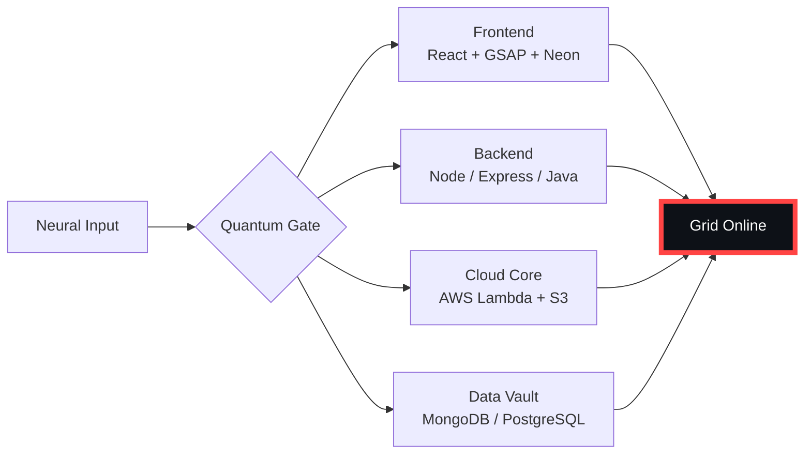

# 🌌 [ NEURAL CORE ACCESS: PENDEMVAMSI ]

<p align="center">
  
</p>

<div align="center">
  
  <br><small>Active Protocol: <strong style="color:#FF4444">NECROMORPH INFEST</strong> 🩸☠️</small>
</div>

## 🔵 NEURAL STATUS READOUT
```text
SUBJECT ID    →  PENDEMVAMSI
ENTITY CLASS  →  SHADOW MONARCH v8
NEURAL RANK   →  B-TIER
GRID SYNC     →  6429/8010 QUANTUM PACKETS
─────── BIO-METRICS (NECROMORPH INFEST) ───────
STRENGTH      140  ██████████████████░░░
AGILITY       122  ████████████████░░░░░
INTELLIGENCE  147  ███████████████████░░
VITALITY      112  ███████████████░░░░░░
```

> **NEURAL BURST ACQUIRED:** +114 QUANTUM PACKETS 
> **SYSTEM MESSAGE:** SHADOW EXTRACTION COMPLETE — ALL HAIL THE MONARCH

---

## 🌀 GRID ARCHITECTURE (HOLOGRAPHIC RENDER)



---

## 📡 ACADEMIC NODES – CONQUERED
- [x] B.Tech Neural Engineering (2020–2024) – St. Ann’s Grid
- [x] Intermediate Quantum Core (2018–2020) – Sri Medhavi
- [x] SSC Primary Link (2017–2018) – Sri Geethanjali

---

## ⚡ SKILL NEURAL MATRIX

<details open>
<summary>🔌 ACTIVE NEURAL LINKS</summary>

| Node               | Tier | Integrity Bar                | Status      |
|--------------------|------|------------------------------|-------------|
| Java Core          | S    | ████████████████████ 100%   | OVERCLOCKED |
| Node.js Grid       | S    | ████████████████████ 100%   | OVERCLOCKED |
| React Holo-UI      | A+   | █████████████████░░░ 92%    | ONLINE      |
| AWS Quantum Relay  | S    | ████████████████████ 100%   | SOVEREIGN   |
| Python AI Kernel   | A    | ████████████████░░░░ 85%    | CHARGING    |
| DSA Void Algorithm | A    | █████████████████░░░ 90%    | ACTIVE      |

</details>

---

## 🏅 NEURAL ACHIEVEMENT TOKENS

<p align="center">
  
  
  
  
</p>

---

## 👾 SHADOW ENTITIES – SUMMONED

<p align="center">
  
  <br><strong style="color:#FF4444">ARISE.</strong>
</p>

| Entity | Designation   | Class            | Source Node                     |
|--------|---------------|------------------|---------------------------------|
| SH-01  | Igris         | Void Commander   | AI Financial Oracle             |
| SH-02  | Beru          | Swarm Overlord   | WebRTC Quantum Stream           |
| SH-03  | Kaisel        | Void Wyrm        | Geolocation Shadow Relay        |
| SH-04  | Tusk          | Arcane Construct | Global Pandemic Sentinel        |
| SH-05  | Iron          | Armored Bastion  | React Crypto Fortress           |

---

## 📡 GRID ANALYTICS (LIVE FEED)

<p align="center">
  
  <br>
  
  
</p>

---

## 🖥️ CORRUPTED MAINFRAME LOG (401 ENTRIES)

<details>
<summary>OPEN TERMINAL FEED – PROTOCOL: NECROMORPH INFEST</summary>

> [0xF9065D16] 🩸☠️ **NECROMORPH INFEST PROTOCOL** #0 | NEURAL LINK STABILIZED | [TRANSMISSION SUCCESS]
> [0x0985FCFD] 🩸☠️ **NECROMORPH INFEST PROTOCOL** #1 | NEURAL LINK STABILIZED | [TRANSMISSION SUCCESS]
> [0xAE918B24] 🩸☠️ **NECROMORPH INFEST PROTOCOL** #2 | NEURAL LINK  [GLITCH DETECTED] STABILIZED | [TRANSMISSION SUCCESS]
> [0xABF5B3D9] 🩸☠️ **NECROMORPH INFEST PROTOCOL** #3 | NEURAL LINK STABILIZED | [TRANSMISSION SUCCESS]
> [0x964C185C] 🩸☠️ **NECROMORPH INFEST PROTOCOL** #4 | NEURAL LINK STABILIZED | [TRANSMISSION SUCCESS]
> [0x29A60D7E] 🩸☠️ **NECROMORPH INFEST PROTOCOL** #5 | NEURAL LINK STABILIZED | [TRANSMISSION SUCCESS]
> [0x1245F8AE] 🩸☠️ **NECROMORPH INFEST PROTOCOL** #6 | NEURAL LINK STABILIZED | [TRANSMISSION SUCCESS]
> [0xC34FB185] 🩸☠️ **NECROMORPH INFEST PROTOCOL** #7 | NEURAL LINK  [GLITCH DETECTED] STABILIZED | [TRANSMISSION SUCCESS]
> [0xF289D3D5] 🩸☠️ **NECROMORPH INFEST PROTOCOL** #8 | NEURAL LINK STABILIZED | [TRANSMISSION SUCCESS]
> [0xAB433859] 🩸☠️ **NECROMORPH INFEST PROTOCOL** #9 | NEURAL LINK STABILIZED | [TRANSMISSION SUCCESS]
> [0x995F7FC2] 🩸☠️ **NECROMORPH INFEST PROTOCOL** #10 | NEURAL LINK STABILIZED | [TRANSMISSION SUCCESS]
> [0xF29433C3] 🩸☠️ **NECROMORPH INFEST PROTOCOL** #11 | NEURAL LINK STABILIZED | [TRANSMISSION SUCCESS]
> [0x1B6BEC7C] 🩸☠️ **NECROMORPH INFEST PROTOCOL** #12 | NEURAL LINK STABILIZED | [TRANSMISSION SUCCESS]
> [0x1F22E809] 🩸☠️ **NECROMORPH INFEST PROTOCOL** #13 | NEURAL LINK STABILIZED | [TRANSMISSION SUCCESS]
> [0x84AFA1E7] 🩸☠️ **NECROMORPH INFEST PROTOCOL** #14 | NEURAL LINK  [GLITCH DETECTED] STABILIZED | [TRANSMISSION SUCCESS]
> [0xD98B0368] 🩸☠️ **NECROMORPH INFEST PROTOCOL** #15 | NEURAL LINK STABILIZED | [TRANSMISSION SUCCESS]
> [0xAD6C0EBD] 🩸☠️ **NECROMORPH INFEST PROTOCOL** #16 | NEURAL LINK STABILIZED | [TRANSMISSION SUCCESS]
> [0xD55A423E] 🩸☠️ **NECROMORPH INFEST PROTOCOL** #17 | NEURAL LINK STABILIZED | [TRANSMISSION SUCCESS]
> [0x52BBD3D3] 🩸☠️ **NECROMORPH INFEST PROTOCOL** #18 | NEURAL LINK STABILIZED | [TRANSMISSION SUCCESS]
> [0x980F27F4] 🩸☠️ **NECROMORPH INFEST PROTOCOL** #19 | NEURAL LINK  [GLITCH DETECTED] STABILIZED | [TRANSMISSION SUCCESS]
> [0xBECA55B4] 🩸☠️ **NECROMORPH INFEST PROTOCOL** #20 | NEURAL LINK  [GLITCH DETECTED] STABILIZED | [TRANSMISSION SUCCESS]
> [0x07D05A9E] 🩸☠️ **NECROMORPH INFEST PROTOCOL** #21 | NEURAL LINK  [GLITCH DETECTED] STABILIZED | [TRANSMISSION SUCCESS]
> [0x236A39A6] 🩸☠️ **NECROMORPH INFEST PROTOCOL** #22 | NEURAL LINK STABILIZED | [TRANSMISSION SUCCESS]
> [0x8AD6E712] 🩸☠️ **NECROMORPH INFEST PROTOCOL** #23 | NEURAL LINK STABILIZED | [TRANSMISSION SUCCESS]
> [0x8F43F32D] 🩸☠️ **NECROMORPH INFEST PROTOCOL** #24 | NEURAL LINK STABILIZED | [TRANSMISSION SUCCESS]
> [0x2482E850] 🩸☠️ **NECROMORPH INFEST PROTOCOL** #25 | NEURAL LINK STABILIZED | [TRANSMISSION SUCCESS]
> [0x7E384401] 🩸☠️ **NECROMORPH INFEST PROTOCOL** #26 | NEURAL LINK STABILIZED | [TRANSMISSION SUCCESS]
> [0x81B5E357] 🩸☠️ **NECROMORPH INFEST PROTOCOL** #27 | NEURAL LINK STABILIZED | [TRANSMISSION SUCCESS]
> [0xA5816229] 🩸☠️ **NECROMORPH INFEST PROTOCOL** #28 | NEURAL LINK  [GLITCH DETECTED] STABILIZED | [TRANSMISSION SUCCESS]
> [0xBBAE0DD6] 🩸☠️ **NECROMORPH INFEST PROTOCOL** #29 | NEURAL LINK  [GLITCH DETECTED] STABILIZED | [TRANSMISSION SUCCESS]
> [0x2826B698] 🩸☠️ **NECROMORPH INFEST PROTOCOL** #30 | NEURAL LINK STABILIZED | [TRANSMISSION SUCCESS]
> [0xEDA01207] 🩸☠️ **NECROMORPH INFEST PROTOCOL** #31 | NEURAL LINK STABILIZED | [TRANSMISSION SUCCESS]
> [0x81BE3258] 🩸☠️ **NECROMORPH INFEST PROTOCOL** #32 | NEURAL LINK STABILIZED | [TRANSMISSION SUCCESS]
> [0x0DD28C72] 🩸☠️ **NECROMORPH INFEST PROTOCOL** #33 | NEURAL LINK STABILIZED | [TRANSMISSION SUCCESS]
> [0x313C129B] 🩸☠️ **NECROMORPH INFEST PROTOCOL** #34 | NEURAL LINK STABILIZED | [TRANSMISSION SUCCESS]
> [0x20C75D79] 🩸☠️ **NECROMORPH INFEST PROTOCOL** #35 | NEURAL LINK STABILIZED | [TRANSMISSION SUCCESS]
> [0x4B8AC063] 🩸☠️ **NECROMORPH INFEST PROTOCOL** #36 | NEURAL LINK STABILIZED | [TRANSMISSION SUCCESS]
> [0x9991FDD3] 🩸☠️ **NECROMORPH INFEST PROTOCOL** #37 | NEURAL LINK STABILIZED | [TRANSMISSION SUCCESS]
> [0xA80AC69F] 🩸☠️ **NECROMORPH INFEST PROTOCOL** #38 | NEURAL LINK  [GLITCH DETECTED] STABILIZED | [TRANSMISSION SUCCESS]
> [0xE03CD779] 🩸☠️ **NECROMORPH INFEST PROTOCOL** #39 | NEURAL LINK STABILIZED | [TRANSMISSION SUCCESS]
> [0xF0613D27] 🩸☠️ **NECROMORPH INFEST PROTOCOL** #40 | NEURAL LINK STABILIZED | [TRANSMISSION SUCCESS]
> [0x51F86B3B] 🩸☠️ **NECROMORPH INFEST PROTOCOL** #41 | NEURAL LINK STABILIZED | [TRANSMISSION SUCCESS]
> [0x036C0864] 🩸☠️ **NECROMORPH INFEST PROTOCOL** #42 | NEURAL LINK STABILIZED | [TRANSMISSION SUCCESS]
> [0xCC3DF293] 🩸☠️ **NECROMORPH INFEST PROTOCOL** #43 | NEURAL LINK STABILIZED | [TRANSMISSION SUCCESS]
> [0x9A06ED81] 🩸☠️ **NECROMORPH INFEST PROTOCOL** #44 | NEURAL LINK STABILIZED | [TRANSMISSION SUCCESS]
> [0xCF5D1AC4] 🩸☠️ **NECROMORPH INFEST PROTOCOL** #45 | NEURAL LINK STABILIZED | [TRANSMISSION SUCCESS]
> [0xB6007029] 🩸☠️ **NECROMORPH INFEST PROTOCOL** #46 | NEURAL LINK STABILIZED | [TRANSMISSION SUCCESS]
> [0x8F00E525] 🩸☠️ **NECROMORPH INFEST PROTOCOL** #47 | NEURAL LINK STABILIZED | [TRANSMISSION SUCCESS]
> [0xF34FB46C] 🩸☠️ **NECROMORPH INFEST PROTOCOL** #48 | NEURAL LINK STABILIZED | [TRANSMISSION SUCCESS]
> [0x53BBB259] 🩸☠️ **NECROMORPH INFEST PROTOCOL** #49 | NEURAL LINK  [GLITCH DETECTED] STABILIZED | [TRANSMISSION SUCCESS]
> [0x684C5D82] 🩸☠️ **NECROMORPH INFEST PROTOCOL** #50 | NEURAL LINK STABILIZED | [TRANSMISSION SUCCESS]
> [0x2060A43C] 🩸☠️ **NECROMORPH INFEST PROTOCOL** #51 | NEURAL LINK STABILIZED | [TRANSMISSION SUCCESS]
> [0x28F18323] 🩸☠️ **NECROMORPH INFEST PROTOCOL** #52 | NEURAL LINK  [GLITCH DETECTED] STABILIZED | [TRANSMISSION SUCCESS]
> [0xC43E0A0E] 🩸☠️ **NECROMORPH INFEST PROTOCOL** #53 | NEURAL LINK STABILIZED | [TRANSMISSION SUCCESS]
> [0xFDA56619] 🩸☠️ **NECROMORPH INFEST PROTOCOL** #54 | NEURAL LINK STABILIZED | [TRANSMISSION SUCCESS]
> [0xCCE1333D] 🩸☠️ **NECROMORPH INFEST PROTOCOL** #55 | NEURAL LINK STABILIZED | [TRANSMISSION SUCCESS]
> [0x9FB8C656] 🩸☠️ **NECROMORPH INFEST PROTOCOL** #56 | NEURAL LINK STABILIZED | [TRANSMISSION SUCCESS]
> [0x46B1BBB8] 🩸☠️ **NECROMORPH INFEST PROTOCOL** #57 | NEURAL LINK STABILIZED | [TRANSMISSION SUCCESS]
> [0x9396EF11] 🩸☠️ **NECROMORPH INFEST PROTOCOL** #58 | NEURAL LINK STABILIZED | [TRANSMISSION SUCCESS]
> [0x61986564] 🩸☠️ **NECROMORPH INFEST PROTOCOL** #59 | NEURAL LINK STABILIZED | [TRANSMISSION SUCCESS]
> [0xC0AF0B60] 🩸☠️ **NECROMORPH INFEST PROTOCOL** #60 | NEURAL LINK STABILIZED | [TRANSMISSION SUCCESS]
> [0xB7B9A291] 🩸☠️ **NECROMORPH INFEST PROTOCOL** #61 | NEURAL LINK STABILIZED | [TRANSMISSION SUCCESS]
> [0xD28BDBB7] 🩸☠️ **NECROMORPH INFEST PROTOCOL** #62 | NEURAL LINK STABILIZED | [TRANSMISSION SUCCESS]
> [0x71A4533E] 🩸☠️ **NECROMORPH INFEST PROTOCOL** #63 | NEURAL LINK STABILIZED | [TRANSMISSION SUCCESS]
> [0x8E9C4BE8] 🩸☠️ **NECROMORPH INFEST PROTOCOL** #64 | NEURAL LINK STABILIZED | [TRANSMISSION SUCCESS]
> [0xEE2708E2] 🩸☠️ **NECROMORPH INFEST PROTOCOL** #65 | NEURAL LINK STABILIZED | [TRANSMISSION SUCCESS]
> [0x67B52020] 🩸☠️ **NECROMORPH INFEST PROTOCOL** #66 | NEURAL LINK STABILIZED | [TRANSMISSION SUCCESS]
> [0xE3868552] 🩸☠️ **NECROMORPH INFEST PROTOCOL** #67 | NEURAL LINK  [GLITCH DETECTED] STABILIZED | [TRANSMISSION SUCCESS]
> [0x4C1226A5] 🩸☠️ **NECROMORPH INFEST PROTOCOL** #68 | NEURAL LINK  [GLITCH DETECTED] STABILIZED | [TRANSMISSION SUCCESS]
> [0x96903409] 🩸☠️ **NECROMORPH INFEST PROTOCOL** #69 | NEURAL LINK STABILIZED | [TRANSMISSION SUCCESS]
> [0x6D8ED8A0] 🩸☠️ **NECROMORPH INFEST PROTOCOL** #70 | NEURAL LINK STABILIZED | [TRANSMISSION SUCCESS]
> [0xB9F484CC] 🩸☠️ **NECROMORPH INFEST PROTOCOL** #71 | NEURAL LINK STABILIZED | [TRANSMISSION SUCCESS]
> [0xE9866104] 🩸☠️ **NECROMORPH INFEST PROTOCOL** #72 | NEURAL LINK  [GLITCH DETECTED] STABILIZED | [TRANSMISSION SUCCESS]
> [0x5F4CE686] 🩸☠️ **NECROMORPH INFEST PROTOCOL** #73 | NEURAL LINK STABILIZED | [TRANSMISSION SUCCESS]
> [0x202119B0] 🩸☠️ **NECROMORPH INFEST PROTOCOL** #74 | NEURAL LINK STABILIZED | [TRANSMISSION SUCCESS]
> [0xC4BC70FC] 🩸☠️ **NECROMORPH INFEST PROTOCOL** #75 | NEURAL LINK STABILIZED | [TRANSMISSION SUCCESS]
> [0xCA823583] 🩸☠️ **NECROMORPH INFEST PROTOCOL** #76 | NEURAL LINK STABILIZED | [TRANSMISSION SUCCESS]
> [0xE3C3EBD2] 🩸☠️ **NECROMORPH INFEST PROTOCOL** #77 | NEURAL LINK STABILIZED | [TRANSMISSION SUCCESS]
> [0x85DE0A02] 🩸☠️ **NECROMORPH INFEST PROTOCOL** #78 | NEURAL LINK STABILIZED | [TRANSMISSION SUCCESS]
> [0xF3433763] 🩸☠️ **NECROMORPH INFEST PROTOCOL** #79 | NEURAL LINK STABILIZED | [TRANSMISSION SUCCESS]
> [0x22435126] 🩸☠️ **NECROMORPH INFEST PROTOCOL** #80 | NEURAL LINK STABILIZED | [TRANSMISSION SUCCESS]
> [0xFE1F0D1D] 🩸☠️ **NECROMORPH INFEST PROTOCOL** #81 | NEURAL LINK STABILIZED | [TRANSMISSION SUCCESS]
> [0xAB9B29F4] 🩸☠️ **NECROMORPH INFEST PROTOCOL** #82 | NEURAL LINK STABILIZED | [TRANSMISSION SUCCESS]
> [0xEEEA8A66] 🩸☠️ **NECROMORPH INFEST PROTOCOL** #83 | NEURAL LINK STABILIZED | [TRANSMISSION SUCCESS]
> [0x5AFB31FF] 🩸☠️ **NECROMORPH INFEST PROTOCOL** #84 | NEURAL LINK STABILIZED | [TRANSMISSION SUCCESS]
> [0x3FA6422A] 🩸☠️ **NECROMORPH INFEST PROTOCOL** #85 | NEURAL LINK STABILIZED | [TRANSMISSION SUCCESS]
> [0xECDE88C5] 🩸☠️ **NECROMORPH INFEST PROTOCOL** #86 | NEURAL LINK STABILIZED | [TRANSMISSION SUCCESS]
> [0xC066940B] 🩸☠️ **NECROMORPH INFEST PROTOCOL** #87 | NEURAL LINK STABILIZED | [TRANSMISSION SUCCESS]
> [0xEC32EF11] 🩸☠️ **NECROMORPH INFEST PROTOCOL** #88 | NEURAL LINK  [GLITCH DETECTED] STABILIZED | [TRANSMISSION SUCCESS]
> [0x5090F697] 🩸☠️ **NECROMORPH INFEST PROTOCOL** #89 | NEURAL LINK  [GLITCH DETECTED] STABILIZED | [TRANSMISSION SUCCESS]
> [0xF60D2EAB] 🩸☠️ **NECROMORPH INFEST PROTOCOL** #90 | NEURAL LINK STABILIZED | [TRANSMISSION SUCCESS]
> [0x7FBDF732] 🩸☠️ **NECROMORPH INFEST PROTOCOL** #91 | NEURAL LINK STABILIZED | [TRANSMISSION SUCCESS]
> [0x3BE9C435] 🩸☠️ **NECROMORPH INFEST PROTOCOL** #92 | NEURAL LINK  [GLITCH DETECTED] STABILIZED | [TRANSMISSION SUCCESS]
> [0xDE08AE2F] 🩸☠️ **NECROMORPH INFEST PROTOCOL** #93 | NEURAL LINK STABILIZED | [TRANSMISSION SUCCESS]
> [0xE0230605] 🩸☠️ **NECROMORPH INFEST PROTOCOL** #94 | NEURAL LINK STABILIZED | [TRANSMISSION SUCCESS]
> [0x0AB7369F] 🩸☠️ **NECROMORPH INFEST PROTOCOL** #95 | NEURAL LINK STABILIZED | [TRANSMISSION SUCCESS]
> [0x33A97CEA] 🩸☠️ **NECROMORPH INFEST PROTOCOL** #96 | NEURAL LINK STABILIZED | [TRANSMISSION SUCCESS]
> [0xCB6BEC7B] 🩸☠️ **NECROMORPH INFEST PROTOCOL** #97 | NEURAL LINK  [GLITCH DETECTED] STABILIZED | [TRANSMISSION SUCCESS]
> [0x4DC224D8] 🩸☠️ **NECROMORPH INFEST PROTOCOL** #98 | NEURAL LINK STABILIZED | [TRANSMISSION SUCCESS]
> [0xD35EE18F] 🩸☠️ **NECROMORPH INFEST PROTOCOL** #99 | NEURAL LINK STABILIZED | [TRANSMISSION SUCCESS]
> [0x7F0491E5] 🩸☠️ **NECROMORPH INFEST PROTOCOL** #100 | NEURAL LINK STABILIZED | [TRANSMISSION SUCCESS]
> [0x109F8AB9] 🩸☠️ **NECROMORPH INFEST PROTOCOL** #101 | NEURAL LINK STABILIZED | [TRANSMISSION SUCCESS]
> [0x94DE5DC9] 🩸☠️ **NECROMORPH INFEST PROTOCOL** #102 | NEURAL LINK STABILIZED | [TRANSMISSION SUCCESS]
> [0x664B5D97] 🩸☠️ **NECROMORPH INFEST PROTOCOL** #103 | NEURAL LINK STABILIZED | [TRANSMISSION SUCCESS]
> [0xAC11738A] 🩸☠️ **NECROMORPH INFEST PROTOCOL** #104 | NEURAL LINK STABILIZED | [TRANSMISSION SUCCESS]
> [0x94FD242E] 🩸☠️ **NECROMORPH INFEST PROTOCOL** #105 | NEURAL LINK STABILIZED | [TRANSMISSION SUCCESS]
> [0xA2CD2463] 🩸☠️ **NECROMORPH INFEST PROTOCOL** #106 | NEURAL LINK  [GLITCH DETECTED] STABILIZED | [TRANSMISSION SUCCESS]
> [0x61991038] 🩸☠️ **NECROMORPH INFEST PROTOCOL** #107 | NEURAL LINK STABILIZED | [TRANSMISSION SUCCESS]
> [0x9731724A] 🩸☠️ **NECROMORPH INFEST PROTOCOL** #108 | NEURAL LINK STABILIZED | [TRANSMISSION SUCCESS]
> [0x390E6FA5] 🩸☠️ **NECROMORPH INFEST PROTOCOL** #109 | NEURAL LINK STABILIZED | [TRANSMISSION SUCCESS]
> [0x6B5027E1] 🩸☠️ **NECROMORPH INFEST PROTOCOL** #110 | NEURAL LINK STABILIZED | [TRANSMISSION SUCCESS]
> [0xD506A2D2] 🩸☠️ **NECROMORPH INFEST PROTOCOL** #111 | NEURAL LINK  [GLITCH DETECTED] STABILIZED | [TRANSMISSION SUCCESS]
> [0x0B9D0E66] 🩸☠️ **NECROMORPH INFEST PROTOCOL** #112 | NEURAL LINK STABILIZED | [TRANSMISSION SUCCESS]
> [0xF0E147CF] 🩸☠️ **NECROMORPH INFEST PROTOCOL** #113 | NEURAL LINK STABILIZED | [TRANSMISSION SUCCESS]
> [0x6CF02812] 🩸☠️ **NECROMORPH INFEST PROTOCOL** #114 | NEURAL LINK STABILIZED | [TRANSMISSION SUCCESS]
> [0xB8ECE545] 🩸☠️ **NECROMORPH INFEST PROTOCOL** #115 | NEURAL LINK STABILIZED | [TRANSMISSION SUCCESS]
> [0x7B54DD87] 🩸☠️ **NECROMORPH INFEST PROTOCOL** #116 | NEURAL LINK STABILIZED | [TRANSMISSION SUCCESS]
> [0x8378776D] 🩸☠️ **NECROMORPH INFEST PROTOCOL** #117 | NEURAL LINK STABILIZED | [TRANSMISSION SUCCESS]
> [0xB5149333] 🩸☠️ **NECROMORPH INFEST PROTOCOL** #118 | NEURAL LINK STABILIZED | [TRANSMISSION SUCCESS]
> [0xD5987075] 🩸☠️ **NECROMORPH INFEST PROTOCOL** #119 | NEURAL LINK STABILIZED | [TRANSMISSION SUCCESS]
> [0x61784EE4] 🩸☠️ **NECROMORPH INFEST PROTOCOL** #120 | NEURAL LINK STABILIZED | [TRANSMISSION SUCCESS]
> [0xE75FFF40] 🩸☠️ **NECROMORPH INFEST PROTOCOL** #121 | NEURAL LINK STABILIZED | [TRANSMISSION SUCCESS]
> [0xA0B57828] 🩸☠️ **NECROMORPH INFEST PROTOCOL** #122 | NEURAL LINK STABILIZED | [TRANSMISSION SUCCESS]
> [0xAA48F0B2] 🩸☠️ **NECROMORPH INFEST PROTOCOL** #123 | NEURAL LINK STABILIZED | [TRANSMISSION SUCCESS]
> [0xCA919C6C] 🩸☠️ **NECROMORPH INFEST PROTOCOL** #124 | NEURAL LINK STABILIZED | [TRANSMISSION SUCCESS]
> [0xAAE0A9F7] 🩸☠️ **NECROMORPH INFEST PROTOCOL** #125 | NEURAL LINK STABILIZED | [TRANSMISSION SUCCESS]
> [0x1326956D] 🩸☠️ **NECROMORPH INFEST PROTOCOL** #126 | NEURAL LINK  [GLITCH DETECTED] STABILIZED | [TRANSMISSION SUCCESS]
> [0xF4025C0A] 🩸☠️ **NECROMORPH INFEST PROTOCOL** #127 | NEURAL LINK STABILIZED | [TRANSMISSION SUCCESS]
> [0xE5F99F5A] 🩸☠️ **NECROMORPH INFEST PROTOCOL** #128 | NEURAL LINK STABILIZED | [TRANSMISSION SUCCESS]
> [0x01B92993] 🩸☠️ **NECROMORPH INFEST PROTOCOL** #129 | NEURAL LINK STABILIZED | [TRANSMISSION SUCCESS]
> [0x9C0C0651] 🩸☠️ **NECROMORPH INFEST PROTOCOL** #130 | NEURAL LINK STABILIZED | [TRANSMISSION SUCCESS]
> [0x203EDD53] 🩸☠️ **NECROMORPH INFEST PROTOCOL** #131 | NEURAL LINK STABILIZED | [TRANSMISSION SUCCESS]
> [0x66721BB7] 🩸☠️ **NECROMORPH INFEST PROTOCOL** #132 | NEURAL LINK STABILIZED | [TRANSMISSION SUCCESS]
> [0x7D57C77F] 🩸☠️ **NECROMORPH INFEST PROTOCOL** #133 | NEURAL LINK STABILIZED | [TRANSMISSION SUCCESS]
> [0xA6B604D1] 🩸☠️ **NECROMORPH INFEST PROTOCOL** #134 | NEURAL LINK  [GLITCH DETECTED] STABILIZED | [TRANSMISSION SUCCESS]
> [0x9B9E578E] 🩸☠️ **NECROMORPH INFEST PROTOCOL** #135 | NEURAL LINK STABILIZED | [TRANSMISSION SUCCESS]
> [0x0F707F57] 🩸☠️ **NECROMORPH INFEST PROTOCOL** #136 | NEURAL LINK  [GLITCH DETECTED] STABILIZED | [TRANSMISSION SUCCESS]
> [0xF5431E35] 🩸☠️ **NECROMORPH INFEST PROTOCOL** #137 | NEURAL LINK STABILIZED | [TRANSMISSION SUCCESS]
> [0x0C1DCB8A] 🩸☠️ **NECROMORPH INFEST PROTOCOL** #138 | NEURAL LINK STABILIZED | [TRANSMISSION SUCCESS]
> [0xF8D6C2C6] 🩸☠️ **NECROMORPH INFEST PROTOCOL** #139 | NEURAL LINK STABILIZED | [TRANSMISSION SUCCESS]
> [0xE03A3A59] 🩸☠️ **NECROMORPH INFEST PROTOCOL** #140 | NEURAL LINK STABILIZED | [TRANSMISSION SUCCESS]
> [0xEE04D71E] 🩸☠️ **NECROMORPH INFEST PROTOCOL** #141 | NEURAL LINK STABILIZED | [TRANSMISSION SUCCESS]
> [0xAFA0A720] 🩸☠️ **NECROMORPH INFEST PROTOCOL** #142 | NEURAL LINK STABILIZED | [TRANSMISSION SUCCESS]
> [0x721D4E91] 🩸☠️ **NECROMORPH INFEST PROTOCOL** #143 | NEURAL LINK  [GLITCH DETECTED] STABILIZED | [TRANSMISSION SUCCESS]
> [0xBDA74C52] 🩸☠️ **NECROMORPH INFEST PROTOCOL** #144 | NEURAL LINK STABILIZED | [TRANSMISSION SUCCESS]
> [0x003AC14A] 🩸☠️ **NECROMORPH INFEST PROTOCOL** #145 | NEURAL LINK STABILIZED | [TRANSMISSION SUCCESS]
> [0xDA783E3A] 🩸☠️ **NECROMORPH INFEST PROTOCOL** #146 | NEURAL LINK STABILIZED | [TRANSMISSION SUCCESS]
> [0xFAD0FC6E] 🩸☠️ **NECROMORPH INFEST PROTOCOL** #147 | NEURAL LINK  [GLITCH DETECTED] STABILIZED | [TRANSMISSION SUCCESS]
> [0xB2ADFB7D] 🩸☠️ **NECROMORPH INFEST PROTOCOL** #148 | NEURAL LINK STABILIZED | [TRANSMISSION SUCCESS]
> [0x96B5096F] 🩸☠️ **NECROMORPH INFEST PROTOCOL** #149 | NEURAL LINK STABILIZED | [TRANSMISSION SUCCESS]
> [0x7067C38C] 🩸☠️ **NECROMORPH INFEST PROTOCOL** #150 | NEURAL LINK STABILIZED | [TRANSMISSION SUCCESS]
> [0xBFCBC7CF] 🩸☠️ **NECROMORPH INFEST PROTOCOL** #151 | NEURAL LINK STABILIZED | [TRANSMISSION SUCCESS]
> [0xB621F55E] 🩸☠️ **NECROMORPH INFEST PROTOCOL** #152 | NEURAL LINK STABILIZED | [TRANSMISSION SUCCESS]
> [0x10477424] 🩸☠️ **NECROMORPH INFEST PROTOCOL** #153 | NEURAL LINK STABILIZED | [TRANSMISSION SUCCESS]
> [0xF868C657] 🩸☠️ **NECROMORPH INFEST PROTOCOL** #154 | NEURAL LINK  [GLITCH DETECTED] STABILIZED | [TRANSMISSION SUCCESS]
> [0xACDC3144] 🩸☠️ **NECROMORPH INFEST PROTOCOL** #155 | NEURAL LINK STABILIZED | [TRANSMISSION SUCCESS]
> [0x6B73CFE1] 🩸☠️ **NECROMORPH INFEST PROTOCOL** #156 | NEURAL LINK STABILIZED | [TRANSMISSION SUCCESS]
> [0x7E1F0C54] 🩸☠️ **NECROMORPH INFEST PROTOCOL** #157 | NEURAL LINK STABILIZED | [TRANSMISSION SUCCESS]
> [0xBAE72AAF] 🩸☠️ **NECROMORPH INFEST PROTOCOL** #158 | NEURAL LINK  [GLITCH DETECTED] STABILIZED | [TRANSMISSION SUCCESS]
> [0x208857A0] 🩸☠️ **NECROMORPH INFEST PROTOCOL** #159 | NEURAL LINK STABILIZED | [TRANSMISSION SUCCESS]
> [0x85E3A60B] 🩸☠️ **NECROMORPH INFEST PROTOCOL** #160 | NEURAL LINK STABILIZED | [TRANSMISSION SUCCESS]
> [0x02DF6C03] 🩸☠️ **NECROMORPH INFEST PROTOCOL** #161 | NEURAL LINK STABILIZED | [TRANSMISSION SUCCESS]
> [0xFD269251] 🩸☠️ **NECROMORPH INFEST PROTOCOL** #162 | NEURAL LINK  [GLITCH DETECTED] STABILIZED | [TRANSMISSION SUCCESS]
> [0x22592E5D] 🩸☠️ **NECROMORPH INFEST PROTOCOL** #163 | NEURAL LINK STABILIZED | [TRANSMISSION SUCCESS]
> [0x2626B571] 🩸☠️ **NECROMORPH INFEST PROTOCOL** #164 | NEURAL LINK STABILIZED | [TRANSMISSION SUCCESS]
> [0x09755627] 🩸☠️ **NECROMORPH INFEST PROTOCOL** #165 | NEURAL LINK STABILIZED | [TRANSMISSION SUCCESS]
> [0x555B8AAD] 🩸☠️ **NECROMORPH INFEST PROTOCOL** #166 | NEURAL LINK STABILIZED | [TRANSMISSION SUCCESS]
> [0x1E6CECDA] 🩸☠️ **NECROMORPH INFEST PROTOCOL** #167 | NEURAL LINK STABILIZED | [TRANSMISSION SUCCESS]
> [0xCE2BD6A9] 🩸☠️ **NECROMORPH INFEST PROTOCOL** #168 | NEURAL LINK STABILIZED | [TRANSMISSION SUCCESS]
> [0x0061AE02] 🩸☠️ **NECROMORPH INFEST PROTOCOL** #169 | NEURAL LINK STABILIZED | [TRANSMISSION SUCCESS]
> [0x1A98395D] 🩸☠️ **NECROMORPH INFEST PROTOCOL** #170 | NEURAL LINK STABILIZED | [TRANSMISSION SUCCESS]
> [0x1EBF5400] 🩸☠️ **NECROMORPH INFEST PROTOCOL** #171 | NEURAL LINK STABILIZED | [TRANSMISSION SUCCESS]
> [0x7E130949] 🩸☠️ **NECROMORPH INFEST PROTOCOL** #172 | NEURAL LINK  [GLITCH DETECTED] STABILIZED | [TRANSMISSION SUCCESS]
> [0x4C027583] 🩸☠️ **NECROMORPH INFEST PROTOCOL** #173 | NEURAL LINK STABILIZED | [TRANSMISSION SUCCESS]
> [0xDA0AEA9B] 🩸☠️ **NECROMORPH INFEST PROTOCOL** #174 | NEURAL LINK STABILIZED | [TRANSMISSION SUCCESS]
> [0x4B0A8914] 🩸☠️ **NECROMORPH INFEST PROTOCOL** #175 | NEURAL LINK STABILIZED | [TRANSMISSION SUCCESS]
> [0x6C566F14] 🩸☠️ **NECROMORPH INFEST PROTOCOL** #176 | NEURAL LINK STABILIZED | [TRANSMISSION SUCCESS]
> [0x0742BBC7] 🩸☠️ **NECROMORPH INFEST PROTOCOL** #177 | NEURAL LINK STABILIZED | [TRANSMISSION SUCCESS]
> [0xA6B43252] 🩸☠️ **NECROMORPH INFEST PROTOCOL** #178 | NEURAL LINK  [GLITCH DETECTED] STABILIZED | [TRANSMISSION SUCCESS]
> [0xDFE8C349] 🩸☠️ **NECROMORPH INFEST PROTOCOL** #179 | NEURAL LINK STABILIZED | [TRANSMISSION SUCCESS]
> [0xD1F5438B] 🩸☠️ **NECROMORPH INFEST PROTOCOL** #180 | NEURAL LINK STABILIZED | [TRANSMISSION SUCCESS]
> [0xFE242A60] 🩸☠️ **NECROMORPH INFEST PROTOCOL** #181 | NEURAL LINK STABILIZED | [TRANSMISSION SUCCESS]
> [0x9A25C087] 🩸☠️ **NECROMORPH INFEST PROTOCOL** #182 | NEURAL LINK STABILIZED | [TRANSMISSION SUCCESS]
> [0x064A973E] 🩸☠️ **NECROMORPH INFEST PROTOCOL** #183 | NEURAL LINK STABILIZED | [TRANSMISSION SUCCESS]
> [0x0DB1F348] 🩸☠️ **NECROMORPH INFEST PROTOCOL** #184 | NEURAL LINK STABILIZED | [TRANSMISSION SUCCESS]
> [0x4C5BBF15] 🩸☠️ **NECROMORPH INFEST PROTOCOL** #185 | NEURAL LINK  [GLITCH DETECTED] STABILIZED | [TRANSMISSION SUCCESS]
> [0xDE6FCAEA] 🩸☠️ **NECROMORPH INFEST PROTOCOL** #186 | NEURAL LINK  [GLITCH DETECTED] STABILIZED | [TRANSMISSION SUCCESS]
> [0x6F1A2AAE] 🩸☠️ **NECROMORPH INFEST PROTOCOL** #187 | NEURAL LINK STABILIZED | [TRANSMISSION SUCCESS]
> [0x208A4607] 🩸☠️ **NECROMORPH INFEST PROTOCOL** #188 | NEURAL LINK STABILIZED | [TRANSMISSION SUCCESS]
> [0x4470CE91] 🩸☠️ **NECROMORPH INFEST PROTOCOL** #189 | NEURAL LINK STABILIZED | [TRANSMISSION SUCCESS]
> [0x78679CC1] 🩸☠️ **NECROMORPH INFEST PROTOCOL** #190 | NEURAL LINK STABILIZED | [TRANSMISSION SUCCESS]
> [0x1192B94D] 🩸☠️ **NECROMORPH INFEST PROTOCOL** #191 | NEURAL LINK STABILIZED | [TRANSMISSION SUCCESS]
> [0x7BC2B688] 🩸☠️ **NECROMORPH INFEST PROTOCOL** #192 | NEURAL LINK STABILIZED | [TRANSMISSION SUCCESS]
> [0xEC9C2D58] 🩸☠️ **NECROMORPH INFEST PROTOCOL** #193 | NEURAL LINK STABILIZED | [TRANSMISSION SUCCESS]
> [0xC090ECA6] 🩸☠️ **NECROMORPH INFEST PROTOCOL** #194 | NEURAL LINK STABILIZED | [TRANSMISSION SUCCESS]
> [0xF7BFE10E] 🩸☠️ **NECROMORPH INFEST PROTOCOL** #195 | NEURAL LINK  [GLITCH DETECTED] STABILIZED | [TRANSMISSION SUCCESS]
> [0x802F6B08] 🩸☠️ **NECROMORPH INFEST PROTOCOL** #196 | NEURAL LINK STABILIZED | [TRANSMISSION SUCCESS]
> [0x26FBD156] 🩸☠️ **NECROMORPH INFEST PROTOCOL** #197 | NEURAL LINK STABILIZED | [TRANSMISSION SUCCESS]
> [0xA15FE236] 🩸☠️ **NECROMORPH INFEST PROTOCOL** #198 | NEURAL LINK STABILIZED | [TRANSMISSION SUCCESS]
> [0x41E98317] 🩸☠️ **NECROMORPH INFEST PROTOCOL** #199 | NEURAL LINK STABILIZED | [TRANSMISSION SUCCESS]
> [0xB2689D2D] 🩸☠️ **NECROMORPH INFEST PROTOCOL** #200 | NEURAL LINK STABILIZED | [TRANSMISSION SUCCESS]
> [0xC28D6A6B] 🩸☠️ **NECROMORPH INFEST PROTOCOL** #201 | NEURAL LINK STABILIZED | [TRANSMISSION SUCCESS]
> [0x1553EB71] 🩸☠️ **NECROMORPH INFEST PROTOCOL** #202 | NEURAL LINK STABILIZED | [TRANSMISSION SUCCESS]
> [0xAB9C8570] 🩸☠️ **NECROMORPH INFEST PROTOCOL** #203 | NEURAL LINK STABILIZED | [TRANSMISSION SUCCESS]
> [0x17662394] 🩸☠️ **NECROMORPH INFEST PROTOCOL** #204 | NEURAL LINK STABILIZED | [TRANSMISSION SUCCESS]
> [0xAE0DD5AC] 🩸☠️ **NECROMORPH INFEST PROTOCOL** #205 | NEURAL LINK STABILIZED | [TRANSMISSION SUCCESS]
> [0x6A349D4C] 🩸☠️ **NECROMORPH INFEST PROTOCOL** #206 | NEURAL LINK  [GLITCH DETECTED] STABILIZED | [TRANSMISSION SUCCESS]
> [0x519F3BAB] 🩸☠️ **NECROMORPH INFEST PROTOCOL** #207 | NEURAL LINK  [GLITCH DETECTED] STABILIZED | [TRANSMISSION SUCCESS]
> [0x04AA915C] 🩸☠️ **NECROMORPH INFEST PROTOCOL** #208 | NEURAL LINK STABILIZED | [TRANSMISSION SUCCESS]
> [0x7FDB2879] 🩸☠️ **NECROMORPH INFEST PROTOCOL** #209 | NEURAL LINK STABILIZED | [TRANSMISSION SUCCESS]
> [0x6C453414] 🩸☠️ **NECROMORPH INFEST PROTOCOL** #210 | NEURAL LINK STABILIZED | [TRANSMISSION SUCCESS]
> [0x5BF8E89B] 🩸☠️ **NECROMORPH INFEST PROTOCOL** #211 | NEURAL LINK  [GLITCH DETECTED] STABILIZED | [TRANSMISSION SUCCESS]
> [0x9EE53078] 🩸☠️ **NECROMORPH INFEST PROTOCOL** #212 | NEURAL LINK  [GLITCH DETECTED] STABILIZED | [TRANSMISSION SUCCESS]
> [0xDA36C756] 🩸☠️ **NECROMORPH INFEST PROTOCOL** #213 | NEURAL LINK STABILIZED | [TRANSMISSION SUCCESS]
> [0x3FBE2298] 🩸☠️ **NECROMORPH INFEST PROTOCOL** #214 | NEURAL LINK  [GLITCH DETECTED] STABILIZED | [TRANSMISSION SUCCESS]
> [0x59A4F907] 🩸☠️ **NECROMORPH INFEST PROTOCOL** #215 | NEURAL LINK STABILIZED | [TRANSMISSION SUCCESS]
> [0x2017C587] 🩸☠️ **NECROMORPH INFEST PROTOCOL** #216 | NEURAL LINK STABILIZED | [TRANSMISSION SUCCESS]
> [0x9031BAE0] 🩸☠️ **NECROMORPH INFEST PROTOCOL** #217 | NEURAL LINK  [GLITCH DETECTED] STABILIZED | [TRANSMISSION SUCCESS]
> [0x5576723D] 🩸☠️ **NECROMORPH INFEST PROTOCOL** #218 | NEURAL LINK STABILIZED | [TRANSMISSION SUCCESS]
> [0xFC034731] 🩸☠️ **NECROMORPH INFEST PROTOCOL** #219 | NEURAL LINK STABILIZED | [TRANSMISSION SUCCESS]
> [0xEE574193] 🩸☠️ **NECROMORPH INFEST PROTOCOL** #220 | NEURAL LINK STABILIZED | [TRANSMISSION SUCCESS]
> [0x9B44A229] 🩸☠️ **NECROMORPH INFEST PROTOCOL** #221 | NEURAL LINK  [GLITCH DETECTED] STABILIZED | [TRANSMISSION SUCCESS]
> [0xBF6E67B9] 🩸☠️ **NECROMORPH INFEST PROTOCOL** #222 | NEURAL LINK STABILIZED | [TRANSMISSION SUCCESS]
> [0x2F9BFB7A] 🩸☠️ **NECROMORPH INFEST PROTOCOL** #223 | NEURAL LINK  [GLITCH DETECTED] STABILIZED | [TRANSMISSION SUCCESS]
> [0x83621080] 🩸☠️ **NECROMORPH INFEST PROTOCOL** #224 | NEURAL LINK STABILIZED | [TRANSMISSION SUCCESS]
> [0x9302B259] 🩸☠️ **NECROMORPH INFEST PROTOCOL** #225 | NEURAL LINK STABILIZED | [TRANSMISSION SUCCESS]
> [0x3B8B7720] 🩸☠️ **NECROMORPH INFEST PROTOCOL** #226 | NEURAL LINK STABILIZED | [TRANSMISSION SUCCESS]
> [0x0CBF941D] 🩸☠️ **NECROMORPH INFEST PROTOCOL** #227 | NEURAL LINK STABILIZED | [TRANSMISSION SUCCESS]
> [0xE6F86CCC] 🩸☠️ **NECROMORPH INFEST PROTOCOL** #228 | NEURAL LINK STABILIZED | [TRANSMISSION SUCCESS]
> [0xA914AA29] 🩸☠️ **NECROMORPH INFEST PROTOCOL** #229 | NEURAL LINK STABILIZED | [TRANSMISSION SUCCESS]
> [0xFCE38BC4] 🩸☠️ **NECROMORPH INFEST PROTOCOL** #230 | NEURAL LINK STABILIZED | [TRANSMISSION SUCCESS]
> [0xB03A5399] 🩸☠️ **NECROMORPH INFEST PROTOCOL** #231 | NEURAL LINK STABILIZED | [TRANSMISSION SUCCESS]
> [0x4F64FF55] 🩸☠️ **NECROMORPH INFEST PROTOCOL** #232 | NEURAL LINK STABILIZED | [TRANSMISSION SUCCESS]
> [0xD83EFDB7] 🩸☠️ **NECROMORPH INFEST PROTOCOL** #233 | NEURAL LINK  [GLITCH DETECTED] STABILIZED | [TRANSMISSION SUCCESS]
> [0x40528AF0] 🩸☠️ **NECROMORPH INFEST PROTOCOL** #234 | NEURAL LINK STABILIZED | [TRANSMISSION SUCCESS]
> [0x202944DA] 🩸☠️ **NECROMORPH INFEST PROTOCOL** #235 | NEURAL LINK STABILIZED | [TRANSMISSION SUCCESS]
> [0xEF51ECC1] 🩸☠️ **NECROMORPH INFEST PROTOCOL** #236 | NEURAL LINK  [GLITCH DETECTED] STABILIZED | [TRANSMISSION SUCCESS]
> [0x3A282C53] 🩸☠️ **NECROMORPH INFEST PROTOCOL** #237 | NEURAL LINK  [GLITCH DETECTED] STABILIZED | [TRANSMISSION SUCCESS]
> [0xA078D6D4] 🩸☠️ **NECROMORPH INFEST PROTOCOL** #238 | NEURAL LINK STABILIZED | [TRANSMISSION SUCCESS]
> [0xB17304CE] 🩸☠️ **NECROMORPH INFEST PROTOCOL** #239 | NEURAL LINK STABILIZED | [TRANSMISSION SUCCESS]
> [0x4F5FFBCF] 🩸☠️ **NECROMORPH INFEST PROTOCOL** #240 | NEURAL LINK STABILIZED | [TRANSMISSION SUCCESS]
> [0x6331AE49] 🩸☠️ **NECROMORPH INFEST PROTOCOL** #241 | NEURAL LINK STABILIZED | [TRANSMISSION SUCCESS]
> [0x9E08D2CD] 🩸☠️ **NECROMORPH INFEST PROTOCOL** #242 | NEURAL LINK STABILIZED | [TRANSMISSION SUCCESS]
> [0x2AB03948] 🩸☠️ **NECROMORPH INFEST PROTOCOL** #243 | NEURAL LINK STABILIZED | [TRANSMISSION SUCCESS]
> [0x8439F59A] 🩸☠️ **NECROMORPH INFEST PROTOCOL** #244 | NEURAL LINK STABILIZED | [TRANSMISSION SUCCESS]
> [0xE3B23A45] 🩸☠️ **NECROMORPH INFEST PROTOCOL** #245 | NEURAL LINK STABILIZED | [TRANSMISSION SUCCESS]
> [0xBBEC5994] 🩸☠️ **NECROMORPH INFEST PROTOCOL** #246 | NEURAL LINK STABILIZED | [TRANSMISSION SUCCESS]
> [0xF6B3FAF9] 🩸☠️ **NECROMORPH INFEST PROTOCOL** #247 | NEURAL LINK  [GLITCH DETECTED] STABILIZED | [TRANSMISSION SUCCESS]
> [0xF1AFE7EC] 🩸☠️ **NECROMORPH INFEST PROTOCOL** #248 | NEURAL LINK STABILIZED | [TRANSMISSION SUCCESS]
> [0x3BFA890C] 🩸☠️ **NECROMORPH INFEST PROTOCOL** #249 | NEURAL LINK STABILIZED | [TRANSMISSION SUCCESS]
> [0xE83732BC] 🩸☠️ **NECROMORPH INFEST PROTOCOL** #250 | NEURAL LINK STABILIZED | [TRANSMISSION SUCCESS]
> [0xDAF990BC] 🩸☠️ **NECROMORPH INFEST PROTOCOL** #251 | NEURAL LINK STABILIZED | [TRANSMISSION SUCCESS]
> [0xD2ABAB67] 🩸☠️ **NECROMORPH INFEST PROTOCOL** #252 | NEURAL LINK STABILIZED | [TRANSMISSION SUCCESS]
> [0xDED9C146] 🩸☠️ **NECROMORPH INFEST PROTOCOL** #253 | NEURAL LINK STABILIZED | [TRANSMISSION SUCCESS]
> [0x70C52B27] 🩸☠️ **NECROMORPH INFEST PROTOCOL** #254 | NEURAL LINK STABILIZED | [TRANSMISSION SUCCESS]
> [0x75B70B92] 🩸☠️ **NECROMORPH INFEST PROTOCOL** #255 | NEURAL LINK STABILIZED | [TRANSMISSION SUCCESS]
> [0xC58FF951] 🩸☠️ **NECROMORPH INFEST PROTOCOL** #256 | NEURAL LINK STABILIZED | [TRANSMISSION SUCCESS]
> [0x7F6F1B00] 🩸☠️ **NECROMORPH INFEST PROTOCOL** #257 | NEURAL LINK  [GLITCH DETECTED] STABILIZED | [TRANSMISSION SUCCESS]
> [0xCD2C7691] 🩸☠️ **NECROMORPH INFEST PROTOCOL** #258 | NEURAL LINK STABILIZED | [TRANSMISSION SUCCESS]
> [0x98AC03F6] 🩸☠️ **NECROMORPH INFEST PROTOCOL** #259 | NEURAL LINK  [GLITCH DETECTED] STABILIZED | [TRANSMISSION SUCCESS]
> [0xFAED6D23] 🩸☠️ **NECROMORPH INFEST PROTOCOL** #260 | NEURAL LINK STABILIZED | [TRANSMISSION SUCCESS]
> [0x492D8008] 🩸☠️ **NECROMORPH INFEST PROTOCOL** #261 | NEURAL LINK STABILIZED | [TRANSMISSION SUCCESS]
> [0xCFBE9420] 🩸☠️ **NECROMORPH INFEST PROTOCOL** #262 | NEURAL LINK STABILIZED | [TRANSMISSION SUCCESS]
> [0x453BE1B2] 🩸☠️ **NECROMORPH INFEST PROTOCOL** #263 | NEURAL LINK  [GLITCH DETECTED] STABILIZED | [TRANSMISSION SUCCESS]
> [0x34F2C557] 🩸☠️ **NECROMORPH INFEST PROTOCOL** #264 | NEURAL LINK  [GLITCH DETECTED] STABILIZED | [TRANSMISSION SUCCESS]
> [0xCD2EF017] 🩸☠️ **NECROMORPH INFEST PROTOCOL** #265 | NEURAL LINK  [GLITCH DETECTED] STABILIZED | [TRANSMISSION SUCCESS]
> [0x0DDCB868] 🩸☠️ **NECROMORPH INFEST PROTOCOL** #266 | NEURAL LINK STABILIZED | [TRANSMISSION SUCCESS]
> [0x27DA1438] 🩸☠️ **NECROMORPH INFEST PROTOCOL** #267 | NEURAL LINK STABILIZED | [TRANSMISSION SUCCESS]
> [0xF31A9D86] 🩸☠️ **NECROMORPH INFEST PROTOCOL** #268 | NEURAL LINK  [GLITCH DETECTED] STABILIZED | [TRANSMISSION SUCCESS]
> [0xFD5CA1C7] 🩸☠️ **NECROMORPH INFEST PROTOCOL** #269 | NEURAL LINK  [GLITCH DETECTED] STABILIZED | [TRANSMISSION SUCCESS]
> [0xE796B58E] 🩸☠️ **NECROMORPH INFEST PROTOCOL** #270 | NEURAL LINK STABILIZED | [TRANSMISSION SUCCESS]
> [0xE62DA592] 🩸☠️ **NECROMORPH INFEST PROTOCOL** #271 | NEURAL LINK  [GLITCH DETECTED] STABILIZED | [TRANSMISSION SUCCESS]
> [0x785D56C0] 🩸☠️ **NECROMORPH INFEST PROTOCOL** #272 | NEURAL LINK STABILIZED | [TRANSMISSION SUCCESS]
> [0x2D2B29CE] 🩸☠️ **NECROMORPH INFEST PROTOCOL** #273 | NEURAL LINK STABILIZED | [TRANSMISSION SUCCESS]
> [0x10AE3367] 🩸☠️ **NECROMORPH INFEST PROTOCOL** #274 | NEURAL LINK STABILIZED | [TRANSMISSION SUCCESS]
> [0x80834A03] 🩸☠️ **NECROMORPH INFEST PROTOCOL** #275 | NEURAL LINK STABILIZED | [TRANSMISSION SUCCESS]
> [0x523E0CAC] 🩸☠️ **NECROMORPH INFEST PROTOCOL** #276 | NEURAL LINK STABILIZED | [TRANSMISSION SUCCESS]
> [0xE0FD4D33] 🩸☠️ **NECROMORPH INFEST PROTOCOL** #277 | NEURAL LINK STABILIZED | [TRANSMISSION SUCCESS]
> [0xD1C0F1E6] 🩸☠️ **NECROMORPH INFEST PROTOCOL** #278 | NEURAL LINK STABILIZED | [TRANSMISSION SUCCESS]
> [0x439B1993] 🩸☠️ **NECROMORPH INFEST PROTOCOL** #279 | NEURAL LINK STABILIZED | [TRANSMISSION SUCCESS]
> [0x4E3C871F] 🩸☠️ **NECROMORPH INFEST PROTOCOL** #280 | NEURAL LINK STABILIZED | [TRANSMISSION SUCCESS]
> [0x9900A487] 🩸☠️ **NECROMORPH INFEST PROTOCOL** #281 | NEURAL LINK STABILIZED | [TRANSMISSION SUCCESS]
> [0x951EA217] 🩸☠️ **NECROMORPH INFEST PROTOCOL** #282 | NEURAL LINK STABILIZED | [TRANSMISSION SUCCESS]
> [0xA1AB60C5] 🩸☠️ **NECROMORPH INFEST PROTOCOL** #283 | NEURAL LINK  [GLITCH DETECTED] STABILIZED | [TRANSMISSION SUCCESS]
> [0xA05C45B8] 🩸☠️ **NECROMORPH INFEST PROTOCOL** #284 | NEURAL LINK STABILIZED | [TRANSMISSION SUCCESS]
> [0x0889956A] 🩸☠️ **NECROMORPH INFEST PROTOCOL** #285 | NEURAL LINK STABILIZED | [TRANSMISSION SUCCESS]
> [0xF34DBDBB] 🩸☠️ **NECROMORPH INFEST PROTOCOL** #286 | NEURAL LINK STABILIZED | [TRANSMISSION SUCCESS]
> [0x5A85C5F9] 🩸☠️ **NECROMORPH INFEST PROTOCOL** #287 | NEURAL LINK STABILIZED | [TRANSMISSION SUCCESS]
> [0xF97EAA4D] 🩸☠️ **NECROMORPH INFEST PROTOCOL** #288 | NEURAL LINK STABILIZED | [TRANSMISSION SUCCESS]
> [0x7C0811B5] 🩸☠️ **NECROMORPH INFEST PROTOCOL** #289 | NEURAL LINK  [GLITCH DETECTED] STABILIZED | [TRANSMISSION SUCCESS]
> [0x225E3150] 🩸☠️ **NECROMORPH INFEST PROTOCOL** #290 | NEURAL LINK  [GLITCH DETECTED] STABILIZED | [TRANSMISSION SUCCESS]
> [0x7D557955] 🩸☠️ **NECROMORPH INFEST PROTOCOL** #291 | NEURAL LINK  [GLITCH DETECTED] STABILIZED | [TRANSMISSION SUCCESS]
> [0xA9057E44] 🩸☠️ **NECROMORPH INFEST PROTOCOL** #292 | NEURAL LINK STABILIZED | [TRANSMISSION SUCCESS]
> [0xD9835150] 🩸☠️ **NECROMORPH INFEST PROTOCOL** #293 | NEURAL LINK STABILIZED | [TRANSMISSION SUCCESS]
> [0xF1883B33] 🩸☠️ **NECROMORPH INFEST PROTOCOL** #294 | NEURAL LINK STABILIZED | [TRANSMISSION SUCCESS]
> [0x13D9A39C] 🩸☠️ **NECROMORPH INFEST PROTOCOL** #295 | NEURAL LINK STABILIZED | [TRANSMISSION SUCCESS]
> [0x020F725A] 🩸☠️ **NECROMORPH INFEST PROTOCOL** #296 | NEURAL LINK STABILIZED | [TRANSMISSION SUCCESS]
> [0x4CA748FD] 🩸☠️ **NECROMORPH INFEST PROTOCOL** #297 | NEURAL LINK STABILIZED | [TRANSMISSION SUCCESS]
> [0xAB9DD1DA] 🩸☠️ **NECROMORPH INFEST PROTOCOL** #298 | NEURAL LINK STABILIZED | [TRANSMISSION SUCCESS]
> [0x36B387F4] 🩸☠️ **NECROMORPH INFEST PROTOCOL** #299 | NEURAL LINK STABILIZED | [TRANSMISSION SUCCESS]
> [0xD47A7085] 🩸☠️ **NECROMORPH INFEST PROTOCOL** #300 | NEURAL LINK STABILIZED | [TRANSMISSION SUCCESS]
> [0x22B5B6AC] 🩸☠️ **NECROMORPH INFEST PROTOCOL** #301 | NEURAL LINK STABILIZED | [TRANSMISSION SUCCESS]
> [0x558CDFEC] 🩸☠️ **NECROMORPH INFEST PROTOCOL** #302 | NEURAL LINK STABILIZED | [TRANSMISSION SUCCESS]
> [0x3118DCEC] 🩸☠️ **NECROMORPH INFEST PROTOCOL** #303 | NEURAL LINK STABILIZED | [TRANSMISSION SUCCESS]
> [0x69BEB7EA] 🩸☠️ **NECROMORPH INFEST PROTOCOL** #304 | NEURAL LINK  [GLITCH DETECTED] STABILIZED | [TRANSMISSION SUCCESS]
> [0xF472FEC5] 🩸☠️ **NECROMORPH INFEST PROTOCOL** #305 | NEURAL LINK  [GLITCH DETECTED] STABILIZED | [TRANSMISSION SUCCESS]
> [0x5E254881] 🩸☠️ **NECROMORPH INFEST PROTOCOL** #306 | NEURAL LINK STABILIZED | [TRANSMISSION SUCCESS]
> [0x94191FD5] 🩸☠️ **NECROMORPH INFEST PROTOCOL** #307 | NEURAL LINK STABILIZED | [TRANSMISSION SUCCESS]
> [0x5F3BDE0C] 🩸☠️ **NECROMORPH INFEST PROTOCOL** #308 | NEURAL LINK STABILIZED | [TRANSMISSION SUCCESS]
> [0xEB14F5FE] 🩸☠️ **NECROMORPH INFEST PROTOCOL** #309 | NEURAL LINK STABILIZED | [TRANSMISSION SUCCESS]
> [0x8C4A704E] 🩸☠️ **NECROMORPH INFEST PROTOCOL** #310 | NEURAL LINK STABILIZED | [TRANSMISSION SUCCESS]
> [0x7EC116EC] 🩸☠️ **NECROMORPH INFEST PROTOCOL** #311 | NEURAL LINK STABILIZED | [TRANSMISSION SUCCESS]
> [0x6885329A] 🩸☠️ **NECROMORPH INFEST PROTOCOL** #312 | NEURAL LINK STABILIZED | [TRANSMISSION SUCCESS]
> [0xF4506BC8] 🩸☠️ **NECROMORPH INFEST PROTOCOL** #313 | NEURAL LINK STABILIZED | [TRANSMISSION SUCCESS]
> [0x49C990ED] 🩸☠️ **NECROMORPH INFEST PROTOCOL** #314 | NEURAL LINK  [GLITCH DETECTED] STABILIZED | [TRANSMISSION SUCCESS]
> [0x217F9933] 🩸☠️ **NECROMORPH INFEST PROTOCOL** #315 | NEURAL LINK STABILIZED | [TRANSMISSION SUCCESS]
> [0x8CFAB4C1] 🩸☠️ **NECROMORPH INFEST PROTOCOL** #316 | NEURAL LINK  [GLITCH DETECTED] STABILIZED | [TRANSMISSION SUCCESS]
> [0xE7D95D61] 🩸☠️ **NECROMORPH INFEST PROTOCOL** #317 | NEURAL LINK STABILIZED | [TRANSMISSION SUCCESS]
> [0x0BF88118] 🩸☠️ **NECROMORPH INFEST PROTOCOL** #318 | NEURAL LINK STABILIZED | [TRANSMISSION SUCCESS]
> [0xAC0E6667] 🩸☠️ **NECROMORPH INFEST PROTOCOL** #319 | NEURAL LINK STABILIZED | [TRANSMISSION SUCCESS]
> [0xEDE2A298] 🩸☠️ **NECROMORPH INFEST PROTOCOL** #320 | NEURAL LINK STABILIZED | [TRANSMISSION SUCCESS]
> [0x502AFC19] 🩸☠️ **NECROMORPH INFEST PROTOCOL** #321 | NEURAL LINK STABILIZED | [TRANSMISSION SUCCESS]
> [0xA094BAD9] 🩸☠️ **NECROMORPH INFEST PROTOCOL** #322 | NEURAL LINK STABILIZED | [TRANSMISSION SUCCESS]
> [0x18C0305B] 🩸☠️ **NECROMORPH INFEST PROTOCOL** #323 | NEURAL LINK STABILIZED | [TRANSMISSION SUCCESS]
> [0xC6D0A6DE] 🩸☠️ **NECROMORPH INFEST PROTOCOL** #324 | NEURAL LINK STABILIZED | [TRANSMISSION SUCCESS]
> [0x27EE3CF3] 🩸☠️ **NECROMORPH INFEST PROTOCOL** #325 | NEURAL LINK STABILIZED | [TRANSMISSION SUCCESS]
> [0x2A31039D] 🩸☠️ **NECROMORPH INFEST PROTOCOL** #326 | NEURAL LINK STABILIZED | [TRANSMISSION SUCCESS]
> [0x0D21043E] 🩸☠️ **NECROMORPH INFEST PROTOCOL** #327 | NEURAL LINK  [GLITCH DETECTED] STABILIZED | [TRANSMISSION SUCCESS]
> [0xBF44CED0] 🩸☠️ **NECROMORPH INFEST PROTOCOL** #328 | NEURAL LINK STABILIZED | [TRANSMISSION SUCCESS]
> [0xA5290F1B] 🩸☠️ **NECROMORPH INFEST PROTOCOL** #329 | NEURAL LINK STABILIZED | [TRANSMISSION SUCCESS]
> [0x0D20A592] 🩸☠️ **NECROMORPH INFEST PROTOCOL** #330 | NEURAL LINK  [GLITCH DETECTED] STABILIZED | [TRANSMISSION SUCCESS]
> [0x6EA3177D] 🩸☠️ **NECROMORPH INFEST PROTOCOL** #331 | NEURAL LINK STABILIZED | [TRANSMISSION SUCCESS]
> [0xAAD4AC90] 🩸☠️ **NECROMORPH INFEST PROTOCOL** #332 | NEURAL LINK  [GLITCH DETECTED] STABILIZED | [TRANSMISSION SUCCESS]
> [0x1D698AD8] 🩸☠️ **NECROMORPH INFEST PROTOCOL** #333 | NEURAL LINK STABILIZED | [TRANSMISSION SUCCESS]
> [0x4EFA9C1C] 🩸☠️ **NECROMORPH INFEST PROTOCOL** #334 | NEURAL LINK STABILIZED | [TRANSMISSION SUCCESS]
> [0x7A2548CE] 🩸☠️ **NECROMORPH INFEST PROTOCOL** #335 | NEURAL LINK STABILIZED | [TRANSMISSION SUCCESS]
> [0x3DFD718E] 🩸☠️ **NECROMORPH INFEST PROTOCOL** #336 | NEURAL LINK STABILIZED | [TRANSMISSION SUCCESS]
> [0x69E0F38E] 🩸☠️ **NECROMORPH INFEST PROTOCOL** #337 | NEURAL LINK STABILIZED | [TRANSMISSION SUCCESS]
> [0x3CD40785] 🩸☠️ **NECROMORPH INFEST PROTOCOL** #338 | NEURAL LINK  [GLITCH DETECTED] STABILIZED | [TRANSMISSION SUCCESS]
> [0xD8A13C29] 🩸☠️ **NECROMORPH INFEST PROTOCOL** #339 | NEURAL LINK STABILIZED | [TRANSMISSION SUCCESS]
> [0x76922971] 🩸☠️ **NECROMORPH INFEST PROTOCOL** #340 | NEURAL LINK STABILIZED | [TRANSMISSION SUCCESS]
> [0xB430DB7E] 🩸☠️ **NECROMORPH INFEST PROTOCOL** #341 | NEURAL LINK STABILIZED | [TRANSMISSION SUCCESS]
> [0x4B03508B] 🩸☠️ **NECROMORPH INFEST PROTOCOL** #342 | NEURAL LINK  [GLITCH DETECTED] STABILIZED | [TRANSMISSION SUCCESS]
> [0xBCAE7A35] 🩸☠️ **NECROMORPH INFEST PROTOCOL** #343 | NEURAL LINK STABILIZED | [TRANSMISSION SUCCESS]
> [0xE0082AEF] 🩸☠️ **NECROMORPH INFEST PROTOCOL** #344 | NEURAL LINK STABILIZED | [TRANSMISSION SUCCESS]
> [0x6E220D8C] 🩸☠️ **NECROMORPH INFEST PROTOCOL** #345 | NEURAL LINK  [GLITCH DETECTED] STABILIZED | [TRANSMISSION SUCCESS]
> [0xA88E665E] 🩸☠️ **NECROMORPH INFEST PROTOCOL** #346 | NEURAL LINK STABILIZED | [TRANSMISSION SUCCESS]
> [0x7DDAACDB] 🩸☠️ **NECROMORPH INFEST PROTOCOL** #347 | NEURAL LINK STABILIZED | [TRANSMISSION SUCCESS]
> [0x73738232] 🩸☠️ **NECROMORPH INFEST PROTOCOL** #348 | NEURAL LINK STABILIZED | [TRANSMISSION SUCCESS]
> [0x38361A1F] 🩸☠️ **NECROMORPH INFEST PROTOCOL** #349 | NEURAL LINK STABILIZED | [TRANSMISSION SUCCESS]
> [0x1D0F381C] 🩸☠️ **NECROMORPH INFEST PROTOCOL** #350 | NEURAL LINK STABILIZED | [TRANSMISSION SUCCESS]
> [0x30D7A404] 🩸☠️ **NECROMORPH INFEST PROTOCOL** #351 | NEURAL LINK STABILIZED | [TRANSMISSION SUCCESS]
> [0x0A73B823] 🩸☠️ **NECROMORPH INFEST PROTOCOL** #352 | NEURAL LINK STABILIZED | [TRANSMISSION SUCCESS]
> [0xB419AF71] 🩸☠️ **NECROMORPH INFEST PROTOCOL** #353 | NEURAL LINK STABILIZED | [TRANSMISSION SUCCESS]
> [0x2E07AB8D] 🩸☠️ **NECROMORPH INFEST PROTOCOL** #354 | NEURAL LINK STABILIZED | [TRANSMISSION SUCCESS]
> [0x95C83FFE] 🩸☠️ **NECROMORPH INFEST PROTOCOL** #355 | NEURAL LINK  [GLITCH DETECTED] STABILIZED | [TRANSMISSION SUCCESS]
> [0xF02EE73A] 🩸☠️ **NECROMORPH INFEST PROTOCOL** #356 | NEURAL LINK STABILIZED | [TRANSMISSION SUCCESS]
> [0x32A7DCF9] 🩸☠️ **NECROMORPH INFEST PROTOCOL** #357 | NEURAL LINK STABILIZED | [TRANSMISSION SUCCESS]
> [0x7149AA78] 🩸☠️ **NECROMORPH INFEST PROTOCOL** #358 | NEURAL LINK STABILIZED | [TRANSMISSION SUCCESS]
> [0xDCAEE2D4] 🩸☠️ **NECROMORPH INFEST PROTOCOL** #359 | NEURAL LINK STABILIZED | [TRANSMISSION SUCCESS]
> [0xBECC738C] 🩸☠️ **NECROMORPH INFEST PROTOCOL** #360 | NEURAL LINK  [GLITCH DETECTED] STABILIZED | [TRANSMISSION SUCCESS]
> [0x118FEE95] 🩸☠️ **NECROMORPH INFEST PROTOCOL** #361 | NEURAL LINK STABILIZED | [TRANSMISSION SUCCESS]
> [0x69DAA06E] 🩸☠️ **NECROMORPH INFEST PROTOCOL** #362 | NEURAL LINK STABILIZED | [TRANSMISSION SUCCESS]
> [0xA6858CA2] 🩸☠️ **NECROMORPH INFEST PROTOCOL** #363 | NEURAL LINK STABILIZED | [TRANSMISSION SUCCESS]
> [0x205C000D] 🩸☠️ **NECROMORPH INFEST PROTOCOL** #364 | NEURAL LINK STABILIZED | [TRANSMISSION SUCCESS]
> [0x94F06F96] 🩸☠️ **NECROMORPH INFEST PROTOCOL** #365 | NEURAL LINK  [GLITCH DETECTED] STABILIZED | [TRANSMISSION SUCCESS]
> [0x6684583B] 🩸☠️ **NECROMORPH INFEST PROTOCOL** #366 | NEURAL LINK STABILIZED | [TRANSMISSION SUCCESS]
> [0x0A0908BC] 🩸☠️ **NECROMORPH INFEST PROTOCOL** #367 | NEURAL LINK STABILIZED | [TRANSMISSION SUCCESS]
> [0xAD619136] 🩸☠️ **NECROMORPH INFEST PROTOCOL** #368 | NEURAL LINK  [GLITCH DETECTED] STABILIZED | [TRANSMISSION SUCCESS]
> [0x062FAEB8] 🩸☠️ **NECROMORPH INFEST PROTOCOL** #369 | NEURAL LINK STABILIZED | [TRANSMISSION SUCCESS]
> [0xC9977014] 🩸☠️ **NECROMORPH INFEST PROTOCOL** #370 | NEURAL LINK STABILIZED | [TRANSMISSION SUCCESS]
> [0x7EC2831B] 🩸☠️ **NECROMORPH INFEST PROTOCOL** #371 | NEURAL LINK STABILIZED | [TRANSMISSION SUCCESS]
> [0xEFC43BA8] 🩸☠️ **NECROMORPH INFEST PROTOCOL** #372 | NEURAL LINK STABILIZED | [TRANSMISSION SUCCESS]
> [0xC21F98F9] 🩸☠️ **NECROMORPH INFEST PROTOCOL** #373 | NEURAL LINK STABILIZED | [TRANSMISSION SUCCESS]
> [0x53EF0A27] 🩸☠️ **NECROMORPH INFEST PROTOCOL** #374 | NEURAL LINK STABILIZED | [TRANSMISSION SUCCESS]
> [0x4B75F637] 🩸☠️ **NECROMORPH INFEST PROTOCOL** #375 | NEURAL LINK STABILIZED | [TRANSMISSION SUCCESS]
> [0x4F28A26C] 🩸☠️ **NECROMORPH INFEST PROTOCOL** #376 | NEURAL LINK STABILIZED | [TRANSMISSION SUCCESS]
> [0x39D252CE] 🩸☠️ **NECROMORPH INFEST PROTOCOL** #377 | NEURAL LINK  [GLITCH DETECTED] STABILIZED | [TRANSMISSION SUCCESS]
> [0x1FC5DFBB] 🩸☠️ **NECROMORPH INFEST PROTOCOL** #378 | NEURAL LINK STABILIZED | [TRANSMISSION SUCCESS]
> [0x6335745F] 🩸☠️ **NECROMORPH INFEST PROTOCOL** #379 | NEURAL LINK STABILIZED | [TRANSMISSION SUCCESS]
> [0xCB8DC385] 🩸☠️ **NECROMORPH INFEST PROTOCOL** #380 | NEURAL LINK STABILIZED | [TRANSMISSION SUCCESS]
> [0x43208F70] 🩸☠️ **NECROMORPH INFEST PROTOCOL** #381 | NEURAL LINK STABILIZED | [TRANSMISSION SUCCESS]
> [0xA8179F51] 🩸☠️ **NECROMORPH INFEST PROTOCOL** #382 | NEURAL LINK STABILIZED | [TRANSMISSION SUCCESS]
> [0x357CD519] 🩸☠️ **NECROMORPH INFEST PROTOCOL** #383 | NEURAL LINK STABILIZED | [TRANSMISSION SUCCESS]
> [0x903285BB] 🩸☠️ **NECROMORPH INFEST PROTOCOL** #384 | NEURAL LINK STABILIZED | [TRANSMISSION SUCCESS]
> [0x0DBC7445] 🩸☠️ **NECROMORPH INFEST PROTOCOL** #385 | NEURAL LINK STABILIZED | [TRANSMISSION SUCCESS]
> [0xCEACBDD0] 🩸☠️ **NECROMORPH INFEST PROTOCOL** #386 | NEURAL LINK STABILIZED | [TRANSMISSION SUCCESS]
> [0x17871C82] 🩸☠️ **NECROMORPH INFEST PROTOCOL** #387 | NEURAL LINK STABILIZED | [TRANSMISSION SUCCESS]
> [0xCF492733] 🩸☠️ **NECROMORPH INFEST PROTOCOL** #388 | NEURAL LINK STABILIZED | [TRANSMISSION SUCCESS]
> [0x159DD6F9] 🩸☠️ **NECROMORPH INFEST PROTOCOL** #389 | NEURAL LINK STABILIZED | [TRANSMISSION SUCCESS]
> [0x4A989070] 🩸☠️ **NECROMORPH INFEST PROTOCOL** #390 | NEURAL LINK  [GLITCH DETECTED] STABILIZED | [TRANSMISSION SUCCESS]
> [0xD277D2DD] 🩸☠️ **NECROMORPH INFEST PROTOCOL** #391 | NEURAL LINK STABILIZED | [TRANSMISSION SUCCESS]
> [0x2A05AF8A] 🩸☠️ **NECROMORPH INFEST PROTOCOL** #392 | NEURAL LINK STABILIZED | [TRANSMISSION SUCCESS]
> [0x24C33622] 🩸☠️ **NECROMORPH INFEST PROTOCOL** #393 | NEURAL LINK STABILIZED | [TRANSMISSION SUCCESS]
> [0xE9E3CC1B] 🩸☠️ **NECROMORPH INFEST PROTOCOL** #394 | NEURAL LINK  [GLITCH DETECTED] STABILIZED | [TRANSMISSION SUCCESS]
> [0x561218C5] 🩸☠️ **NECROMORPH INFEST PROTOCOL** #395 | NEURAL LINK STABILIZED | [TRANSMISSION SUCCESS]
> [0x929FFC26] 🩸☠️ **NECROMORPH INFEST PROTOCOL** #396 | NEURAL LINK STABILIZED | [TRANSMISSION SUCCESS]
> [0x6C4910B5] 🩸☠️ **NECROMORPH INFEST PROTOCOL** #397 | NEURAL LINK STABILIZED | [TRANSMISSION SUCCESS]
> [0x81C73A71] 🩸☠️ **NECROMORPH INFEST PROTOCOL** #398 | NEURAL LINK STABILIZED | [TRANSMISSION SUCCESS]
> [0xF7F2EE81] 🩸☠️ **NECROMORPH INFEST PROTOCOL** #399 | NEURAL LINK STABILIZED | [TRANSMISSION SUCCESS]


</details>

---

## 🔗 QUANTUM UPLINK NODES
- **NEURAL BURST** → pendem.vamsi12@gmail.com
- **CORPORATE SYNC** → https://linkedin.com/in/vamsipendem
- **VOICE RELAY** → +91 9032552849

<p align="center">
  <sub style="color:#AA0000">「Level up or perish.」</sub><br>
  <sub><i style="color:#888;">GRID SYNCHRONIZED: 2026-08-05T01:16:26 IST | PROTOCOL: NECROMORPH INFEST</i></sub>
</p>
