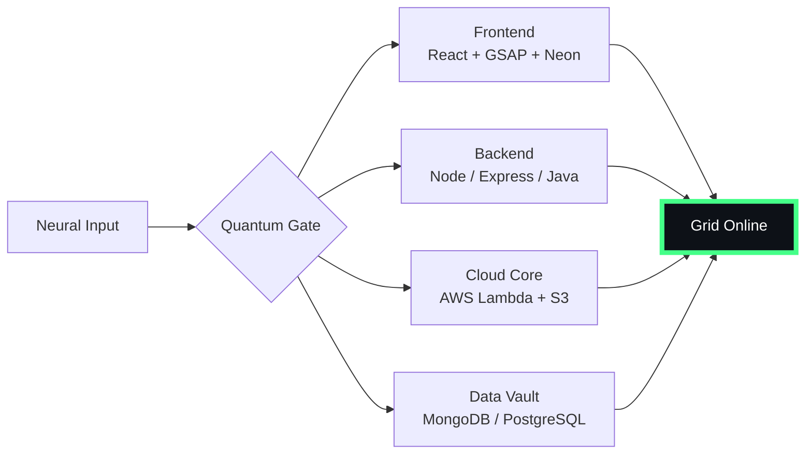

# 🌌 [ NEURAL CORE ACCESS: PENDEMVAMSI ]

<p align="center">
  
</p>

<div align="center">
  
  <br><small>Active Protocol: <strong style="color:#44FF88">PREDATOR CLOAK</strong> 👽🌫️</small>
</div>

## 🔵 NEURAL STATUS READOUT
```text
SUBJECT ID    →  PENDEMVAMSI
ENTITY CLASS  →  SHADOW MONARCH v8
NEURAL RANK   →  B-TIER
GRID SYNC     →  2478/8010 QUANTUM PACKETS
─────── BIO-METRICS (PREDATOR CLOAK) ───────
STRENGTH      140  ██████████████████░░░
AGILITY       122  ████████████████░░░░░
INTELLIGENCE  147  ███████████████████░░
VITALITY      112  ███████████████░░░░░░
```

> **NEURAL BURST ACQUIRED:** +162 QUANTUM PACKETS 
> **SYSTEM MESSAGE:** HOLOGRAPHIC MASK ENGAGED — IDENTITY ERASED

---

## 🌀 GRID ARCHITECTURE (HOLOGRAPHIC RENDER)



---

## 📡 ACADEMIC NODES – CONQUERED
- [x] B.Tech Neural Engineering (2020–2024) – St. Ann’s Grid
- [x] Intermediate Quantum Core (2018–2020) – Sri Medhavi
- [x] SSC Primary Link (2017–2018) – Sri Geethanjali

---

## ⚡ SKILL NEURAL MATRIX

<details open>
<summary>🔌 ACTIVE NEURAL LINKS</summary>

| Node               | Tier | Integrity Bar                | Status      |
|--------------------|------|------------------------------|-------------|
| Java Core          | S    | ████████████████████ 100%   | OVERCLOCKED |
| Node.js Grid       | S    | ████████████████████ 100%   | OVERCLOCKED |
| React Holo-UI      | A+   | █████████████████░░░ 92%    | ONLINE      |
| AWS Quantum Relay  | S    | ████████████████████ 100%   | SOVEREIGN   |
| Python AI Kernel   | A    | ████████████████░░░░ 85%    | CHARGING    |
| DSA Void Algorithm | A    | █████████████████░░░ 90%    | ACTIVE      |

</details>

---

## 🏅 NEURAL ACHIEVEMENT TOKENS

<p align="center">
  
  
  
  
</p>

---

## 👾 SHADOW ENTITIES – SUMMONED

<p align="center">
  
  <br><strong style="color:#44FF88">ARISE.</strong>
</p>

| Entity | Designation   | Class            | Source Node                     |
|--------|---------------|------------------|---------------------------------|
| SH-01  | Igris         | Void Commander   | AI Financial Oracle             |
| SH-02  | Beru          | Swarm Overlord   | WebRTC Quantum Stream           |
| SH-03  | Kaisel        | Void Wyrm        | Geolocation Shadow Relay        |
| SH-04  | Tusk          | Arcane Construct | Global Pandemic Sentinel        |
| SH-05  | Iron          | Armored Bastion  | React Crypto Fortress           |

---

## 📡 GRID ANALYTICS (LIVE FEED)

<p align="center">
  
  <br>
  
  
</p>

---

## 🖥️ CORRUPTED MAINFRAME LOG (401 ENTRIES)

<details>
<summary>OPEN TERMINAL FEED – PROTOCOL: PREDATOR CLOAK</summary>

> [0x20201C31] 👽🌫️ **PREDATOR CLOAK PROTOCOL** #0 | NEURAL LINK  [GLITCH DETECTED] STABILIZED | [TRANSMISSION SUCCESS]
> [0x58015912] 👽🌫️ **PREDATOR CLOAK PROTOCOL** #1 | NEURAL LINK STABILIZED | [TRANSMISSION SUCCESS]
> [0x29465868] 👽🌫️ **PREDATOR CLOAK PROTOCOL** #2 | NEURAL LINK STABILIZED | [TRANSMISSION SUCCESS]
> [0x9E00043C] 👽🌫️ **PREDATOR CLOAK PROTOCOL** #3 | NEURAL LINK STABILIZED | [TRANSMISSION SUCCESS]
> [0x1B07FFCF] 👽🌫️ **PREDATOR CLOAK PROTOCOL** #4 | NEURAL LINK STABILIZED | [TRANSMISSION SUCCESS]
> [0x1F173CA7] 👽🌫️ **PREDATOR CLOAK PROTOCOL** #5 | NEURAL LINK STABILIZED | [TRANSMISSION SUCCESS]
> [0x5EE40C16] 👽🌫️ **PREDATOR CLOAK PROTOCOL** #6 | NEURAL LINK  [GLITCH DETECTED] STABILIZED | [TRANSMISSION SUCCESS]
> [0x6CFEBD80] 👽🌫️ **PREDATOR CLOAK PROTOCOL** #7 | NEURAL LINK STABILIZED | [TRANSMISSION SUCCESS]
> [0x4625836D] 👽🌫️ **PREDATOR CLOAK PROTOCOL** #8 | NEURAL LINK  [GLITCH DETECTED] STABILIZED | [TRANSMISSION SUCCESS]
> [0x86CBCA42] 👽🌫️ **PREDATOR CLOAK PROTOCOL** #9 | NEURAL LINK STABILIZED | [TRANSMISSION SUCCESS]
> [0x212A432C] 👽🌫️ **PREDATOR CLOAK PROTOCOL** #10 | NEURAL LINK STABILIZED | [TRANSMISSION SUCCESS]
> [0xBA1F60B7] 👽🌫️ **PREDATOR CLOAK PROTOCOL** #11 | NEURAL LINK  [GLITCH DETECTED] STABILIZED | [TRANSMISSION SUCCESS]
> [0x73BC6440] 👽🌫️ **PREDATOR CLOAK PROTOCOL** #12 | NEURAL LINK STABILIZED | [TRANSMISSION SUCCESS]
> [0x8DC62EDE] 👽🌫️ **PREDATOR CLOAK PROTOCOL** #13 | NEURAL LINK  [GLITCH DETECTED] STABILIZED | [TRANSMISSION SUCCESS]
> [0xBEF3078C] 👽🌫️ **PREDATOR CLOAK PROTOCOL** #14 | NEURAL LINK STABILIZED | [TRANSMISSION SUCCESS]
> [0x9E5547CF] 👽🌫️ **PREDATOR CLOAK PROTOCOL** #15 | NEURAL LINK  [GLITCH DETECTED] STABILIZED | [TRANSMISSION SUCCESS]
> [0x718B9003] 👽🌫️ **PREDATOR CLOAK PROTOCOL** #16 | NEURAL LINK STABILIZED | [TRANSMISSION SUCCESS]
> [0x0189DBD8] 👽🌫️ **PREDATOR CLOAK PROTOCOL** #17 | NEURAL LINK STABILIZED | [TRANSMISSION SUCCESS]
> [0x5F1EE02C] 👽🌫️ **PREDATOR CLOAK PROTOCOL** #18 | NEURAL LINK STABILIZED | [TRANSMISSION SUCCESS]
> [0xFF907FA9] 👽🌫️ **PREDATOR CLOAK PROTOCOL** #19 | NEURAL LINK STABILIZED | [TRANSMISSION SUCCESS]
> [0x3B9D5613] 👽🌫️ **PREDATOR CLOAK PROTOCOL** #20 | NEURAL LINK  [GLITCH DETECTED] STABILIZED | [TRANSMISSION SUCCESS]
> [0xFCAF7A35] 👽🌫️ **PREDATOR CLOAK PROTOCOL** #21 | NEURAL LINK STABILIZED | [TRANSMISSION SUCCESS]
> [0xAE48ABF0] 👽🌫️ **PREDATOR CLOAK PROTOCOL** #22 | NEURAL LINK STABILIZED | [TRANSMISSION SUCCESS]
> [0x0EF10CE5] 👽🌫️ **PREDATOR CLOAK PROTOCOL** #23 | NEURAL LINK STABILIZED | [TRANSMISSION SUCCESS]
> [0x057FE683] 👽🌫️ **PREDATOR CLOAK PROTOCOL** #24 | NEURAL LINK STABILIZED | [TRANSMISSION SUCCESS]
> [0x4326CDE9] 👽🌫️ **PREDATOR CLOAK PROTOCOL** #25 | NEURAL LINK STABILIZED | [TRANSMISSION SUCCESS]
> [0x8D81E7DC] 👽🌫️ **PREDATOR CLOAK PROTOCOL** #26 | NEURAL LINK STABILIZED | [TRANSMISSION SUCCESS]
> [0x435567D9] 👽🌫️ **PREDATOR CLOAK PROTOCOL** #27 | NEURAL LINK STABILIZED | [TRANSMISSION SUCCESS]
> [0x677D0511] 👽🌫️ **PREDATOR CLOAK PROTOCOL** #28 | NEURAL LINK STABILIZED | [TRANSMISSION SUCCESS]
> [0xEB04DD28] 👽🌫️ **PREDATOR CLOAK PROTOCOL** #29 | NEURAL LINK STABILIZED | [TRANSMISSION SUCCESS]
> [0x71F4257F] 👽🌫️ **PREDATOR CLOAK PROTOCOL** #30 | NEURAL LINK STABILIZED | [TRANSMISSION SUCCESS]
> [0xEE124208] 👽🌫️ **PREDATOR CLOAK PROTOCOL** #31 | NEURAL LINK STABILIZED | [TRANSMISSION SUCCESS]
> [0xF6C94B72] 👽🌫️ **PREDATOR CLOAK PROTOCOL** #32 | NEURAL LINK STABILIZED | [TRANSMISSION SUCCESS]
> [0xBB87E6D7] 👽🌫️ **PREDATOR CLOAK PROTOCOL** #33 | NEURAL LINK STABILIZED | [TRANSMISSION SUCCESS]
> [0xC72A3C6E] 👽🌫️ **PREDATOR CLOAK PROTOCOL** #34 | NEURAL LINK STABILIZED | [TRANSMISSION SUCCESS]
> [0xA6EB11EE] 👽🌫️ **PREDATOR CLOAK PROTOCOL** #35 | NEURAL LINK STABILIZED | [TRANSMISSION SUCCESS]
> [0xC15B4545] 👽🌫️ **PREDATOR CLOAK PROTOCOL** #36 | NEURAL LINK  [GLITCH DETECTED] STABILIZED | [TRANSMISSION SUCCESS]
> [0x95799F67] 👽🌫️ **PREDATOR CLOAK PROTOCOL** #37 | NEURAL LINK STABILIZED | [TRANSMISSION SUCCESS]
> [0xF245188B] 👽🌫️ **PREDATOR CLOAK PROTOCOL** #38 | NEURAL LINK STABILIZED | [TRANSMISSION SUCCESS]
> [0x48E56172] 👽🌫️ **PREDATOR CLOAK PROTOCOL** #39 | NEURAL LINK STABILIZED | [TRANSMISSION SUCCESS]
> [0x383CB950] 👽🌫️ **PREDATOR CLOAK PROTOCOL** #40 | NEURAL LINK STABILIZED | [TRANSMISSION SUCCESS]
> [0x2CABCC76] 👽🌫️ **PREDATOR CLOAK PROTOCOL** #41 | NEURAL LINK STABILIZED | [TRANSMISSION SUCCESS]
> [0xD91E7BD4] 👽🌫️ **PREDATOR CLOAK PROTOCOL** #42 | NEURAL LINK STABILIZED | [TRANSMISSION SUCCESS]
> [0x5627B7DE] 👽🌫️ **PREDATOR CLOAK PROTOCOL** #43 | NEURAL LINK  [GLITCH DETECTED] STABILIZED | [TRANSMISSION SUCCESS]
> [0xE39BCAD7] 👽🌫️ **PREDATOR CLOAK PROTOCOL** #44 | NEURAL LINK STABILIZED | [TRANSMISSION SUCCESS]
> [0xB6D69E48] 👽🌫️ **PREDATOR CLOAK PROTOCOL** #45 | NEURAL LINK STABILIZED | [TRANSMISSION SUCCESS]
> [0xB03F0393] 👽🌫️ **PREDATOR CLOAK PROTOCOL** #46 | NEURAL LINK STABILIZED | [TRANSMISSION SUCCESS]
> [0x681082B6] 👽🌫️ **PREDATOR CLOAK PROTOCOL** #47 | NEURAL LINK STABILIZED | [TRANSMISSION SUCCESS]
> [0x14AEC566] 👽🌫️ **PREDATOR CLOAK PROTOCOL** #48 | NEURAL LINK STABILIZED | [TRANSMISSION SUCCESS]
> [0x0ABCF6CF] 👽🌫️ **PREDATOR CLOAK PROTOCOL** #49 | NEURAL LINK STABILIZED | [TRANSMISSION SUCCESS]
> [0xE6611E5E] 👽🌫️ **PREDATOR CLOAK PROTOCOL** #50 | NEURAL LINK  [GLITCH DETECTED] STABILIZED | [TRANSMISSION SUCCESS]
> [0xED2689AA] 👽🌫️ **PREDATOR CLOAK PROTOCOL** #51 | NEURAL LINK STABILIZED | [TRANSMISSION SUCCESS]
> [0x91919B7B] 👽🌫️ **PREDATOR CLOAK PROTOCOL** #52 | NEURAL LINK STABILIZED | [TRANSMISSION SUCCESS]
> [0x3CCB484D] 👽🌫️ **PREDATOR CLOAK PROTOCOL** #53 | NEURAL LINK STABILIZED | [TRANSMISSION SUCCESS]
> [0x9880820D] 👽🌫️ **PREDATOR CLOAK PROTOCOL** #54 | NEURAL LINK STABILIZED | [TRANSMISSION SUCCESS]
> [0xCBE0587A] 👽🌫️ **PREDATOR CLOAK PROTOCOL** #55 | NEURAL LINK STABILIZED | [TRANSMISSION SUCCESS]
> [0x864631EB] 👽🌫️ **PREDATOR CLOAK PROTOCOL** #56 | NEURAL LINK STABILIZED | [TRANSMISSION SUCCESS]
> [0xC9E45683] 👽🌫️ **PREDATOR CLOAK PROTOCOL** #57 | NEURAL LINK STABILIZED | [TRANSMISSION SUCCESS]
> [0x15AD61B4] 👽🌫️ **PREDATOR CLOAK PROTOCOL** #58 | NEURAL LINK STABILIZED | [TRANSMISSION SUCCESS]
> [0x926031C2] 👽🌫️ **PREDATOR CLOAK PROTOCOL** #59 | NEURAL LINK STABILIZED | [TRANSMISSION SUCCESS]
> [0x0ED1EBED] 👽🌫️ **PREDATOR CLOAK PROTOCOL** #60 | NEURAL LINK STABILIZED | [TRANSMISSION SUCCESS]
> [0xEC5312BE] 👽🌫️ **PREDATOR CLOAK PROTOCOL** #61 | NEURAL LINK  [GLITCH DETECTED] STABILIZED | [TRANSMISSION SUCCESS]
> [0xF3AB3781] 👽🌫️ **PREDATOR CLOAK PROTOCOL** #62 | NEURAL LINK STABILIZED | [TRANSMISSION SUCCESS]
> [0x61D6E31B] 👽🌫️ **PREDATOR CLOAK PROTOCOL** #63 | NEURAL LINK STABILIZED | [TRANSMISSION SUCCESS]
> [0xC49E15BF] 👽🌫️ **PREDATOR CLOAK PROTOCOL** #64 | NEURAL LINK STABILIZED | [TRANSMISSION SUCCESS]
> [0x04BFF4EB] 👽🌫️ **PREDATOR CLOAK PROTOCOL** #65 | NEURAL LINK  [GLITCH DETECTED] STABILIZED | [TRANSMISSION SUCCESS]
> [0x150A3B9C] 👽🌫️ **PREDATOR CLOAK PROTOCOL** #66 | NEURAL LINK STABILIZED | [TRANSMISSION SUCCESS]
> [0xB9876F99] 👽🌫️ **PREDATOR CLOAK PROTOCOL** #67 | NEURAL LINK STABILIZED | [TRANSMISSION SUCCESS]
> [0xBA6FBF30] 👽🌫️ **PREDATOR CLOAK PROTOCOL** #68 | NEURAL LINK STABILIZED | [TRANSMISSION SUCCESS]
> [0x0F78D38B] 👽🌫️ **PREDATOR CLOAK PROTOCOL** #69 | NEURAL LINK STABILIZED | [TRANSMISSION SUCCESS]
> [0x77B89C94] 👽🌫️ **PREDATOR CLOAK PROTOCOL** #70 | NEURAL LINK STABILIZED | [TRANSMISSION SUCCESS]
> [0xD8E1EF50] 👽🌫️ **PREDATOR CLOAK PROTOCOL** #71 | NEURAL LINK STABILIZED | [TRANSMISSION SUCCESS]
> [0x3174F76C] 👽🌫️ **PREDATOR CLOAK PROTOCOL** #72 | NEURAL LINK STABILIZED | [TRANSMISSION SUCCESS]
> [0x1C3D0F6F] 👽🌫️ **PREDATOR CLOAK PROTOCOL** #73 | NEURAL LINK STABILIZED | [TRANSMISSION SUCCESS]
> [0xE5267A56] 👽🌫️ **PREDATOR CLOAK PROTOCOL** #74 | NEURAL LINK STABILIZED | [TRANSMISSION SUCCESS]
> [0xE60C8260] 👽🌫️ **PREDATOR CLOAK PROTOCOL** #75 | NEURAL LINK STABILIZED | [TRANSMISSION SUCCESS]
> [0x753B8BB2] 👽🌫️ **PREDATOR CLOAK PROTOCOL** #76 | NEURAL LINK  [GLITCH DETECTED] STABILIZED | [TRANSMISSION SUCCESS]
> [0x5E339987] 👽🌫️ **PREDATOR CLOAK PROTOCOL** #77 | NEURAL LINK STABILIZED | [TRANSMISSION SUCCESS]
> [0x9C84C342] 👽🌫️ **PREDATOR CLOAK PROTOCOL** #78 | NEURAL LINK STABILIZED | [TRANSMISSION SUCCESS]
> [0xEDC2A972] 👽🌫️ **PREDATOR CLOAK PROTOCOL** #79 | NEURAL LINK STABILIZED | [TRANSMISSION SUCCESS]
> [0x90A28795] 👽🌫️ **PREDATOR CLOAK PROTOCOL** #80 | NEURAL LINK STABILIZED | [TRANSMISSION SUCCESS]
> [0xBCD5EA55] 👽🌫️ **PREDATOR CLOAK PROTOCOL** #81 | NEURAL LINK STABILIZED | [TRANSMISSION SUCCESS]
> [0x4D6D49CB] 👽🌫️ **PREDATOR CLOAK PROTOCOL** #82 | NEURAL LINK STABILIZED | [TRANSMISSION SUCCESS]
> [0x60152971] 👽🌫️ **PREDATOR CLOAK PROTOCOL** #83 | NEURAL LINK STABILIZED | [TRANSMISSION SUCCESS]
> [0xD3B57674] 👽🌫️ **PREDATOR CLOAK PROTOCOL** #84 | NEURAL LINK  [GLITCH DETECTED] STABILIZED | [TRANSMISSION SUCCESS]
> [0xFDE1B7A9] 👽🌫️ **PREDATOR CLOAK PROTOCOL** #85 | NEURAL LINK STABILIZED | [TRANSMISSION SUCCESS]
> [0x20EF65D6] 👽🌫️ **PREDATOR CLOAK PROTOCOL** #86 | NEURAL LINK STABILIZED | [TRANSMISSION SUCCESS]
> [0x9BE6DC4E] 👽🌫️ **PREDATOR CLOAK PROTOCOL** #87 | NEURAL LINK STABILIZED | [TRANSMISSION SUCCESS]
> [0xBA809F0B] 👽🌫️ **PREDATOR CLOAK PROTOCOL** #88 | NEURAL LINK STABILIZED | [TRANSMISSION SUCCESS]
> [0x1807D728] 👽🌫️ **PREDATOR CLOAK PROTOCOL** #89 | NEURAL LINK STABILIZED | [TRANSMISSION SUCCESS]
> [0xCF300AC0] 👽🌫️ **PREDATOR CLOAK PROTOCOL** #90 | NEURAL LINK STABILIZED | [TRANSMISSION SUCCESS]
> [0xBA973F6A] 👽🌫️ **PREDATOR CLOAK PROTOCOL** #91 | NEURAL LINK STABILIZED | [TRANSMISSION SUCCESS]
> [0x0CB697D7] 👽🌫️ **PREDATOR CLOAK PROTOCOL** #92 | NEURAL LINK STABILIZED | [TRANSMISSION SUCCESS]
> [0xAAAD69C5] 👽🌫️ **PREDATOR CLOAK PROTOCOL** #93 | NEURAL LINK STABILIZED | [TRANSMISSION SUCCESS]
> [0x6F8F0403] 👽🌫️ **PREDATOR CLOAK PROTOCOL** #94 | NEURAL LINK STABILIZED | [TRANSMISSION SUCCESS]
> [0x43EFE00F] 👽🌫️ **PREDATOR CLOAK PROTOCOL** #95 | NEURAL LINK STABILIZED | [TRANSMISSION SUCCESS]
> [0x8E8F9B39] 👽🌫️ **PREDATOR CLOAK PROTOCOL** #96 | NEURAL LINK STABILIZED | [TRANSMISSION SUCCESS]
> [0x127F9582] 👽🌫️ **PREDATOR CLOAK PROTOCOL** #97 | NEURAL LINK STABILIZED | [TRANSMISSION SUCCESS]
> [0xBC1A70C8] 👽🌫️ **PREDATOR CLOAK PROTOCOL** #98 | NEURAL LINK STABILIZED | [TRANSMISSION SUCCESS]
> [0x134F2E57] 👽🌫️ **PREDATOR CLOAK PROTOCOL** #99 | NEURAL LINK STABILIZED | [TRANSMISSION SUCCESS]
> [0x4D62BC3B] 👽🌫️ **PREDATOR CLOAK PROTOCOL** #100 | NEURAL LINK STABILIZED | [TRANSMISSION SUCCESS]
> [0x62DEDE33] 👽🌫️ **PREDATOR CLOAK PROTOCOL** #101 | NEURAL LINK STABILIZED | [TRANSMISSION SUCCESS]
> [0x36592501] 👽🌫️ **PREDATOR CLOAK PROTOCOL** #102 | NEURAL LINK  [GLITCH DETECTED] STABILIZED | [TRANSMISSION SUCCESS]
> [0x3AEF69FC] 👽🌫️ **PREDATOR CLOAK PROTOCOL** #103 | NEURAL LINK STABILIZED | [TRANSMISSION SUCCESS]
> [0x31067AE1] 👽🌫️ **PREDATOR CLOAK PROTOCOL** #104 | NEURAL LINK STABILIZED | [TRANSMISSION SUCCESS]
> [0x65E4F5E3] 👽🌫️ **PREDATOR CLOAK PROTOCOL** #105 | NEURAL LINK STABILIZED | [TRANSMISSION SUCCESS]
> [0xB747C97A] 👽🌫️ **PREDATOR CLOAK PROTOCOL** #106 | NEURAL LINK STABILIZED | [TRANSMISSION SUCCESS]
> [0x4F496190] 👽🌫️ **PREDATOR CLOAK PROTOCOL** #107 | NEURAL LINK STABILIZED | [TRANSMISSION SUCCESS]
> [0xEBAAA8DA] 👽🌫️ **PREDATOR CLOAK PROTOCOL** #108 | NEURAL LINK  [GLITCH DETECTED] STABILIZED | [TRANSMISSION SUCCESS]
> [0x8DB5B51B] 👽🌫️ **PREDATOR CLOAK PROTOCOL** #109 | NEURAL LINK STABILIZED | [TRANSMISSION SUCCESS]
> [0x3C32237B] 👽🌫️ **PREDATOR CLOAK PROTOCOL** #110 | NEURAL LINK STABILIZED | [TRANSMISSION SUCCESS]
> [0x09BA268D] 👽🌫️ **PREDATOR CLOAK PROTOCOL** #111 | NEURAL LINK STABILIZED | [TRANSMISSION SUCCESS]
> [0x6CFC04ED] 👽🌫️ **PREDATOR CLOAK PROTOCOL** #112 | NEURAL LINK STABILIZED | [TRANSMISSION SUCCESS]
> [0x6614410B] 👽🌫️ **PREDATOR CLOAK PROTOCOL** #113 | NEURAL LINK STABILIZED | [TRANSMISSION SUCCESS]
> [0x2D55A53C] 👽🌫️ **PREDATOR CLOAK PROTOCOL** #114 | NEURAL LINK STABILIZED | [TRANSMISSION SUCCESS]
> [0x042303DB] 👽🌫️ **PREDATOR CLOAK PROTOCOL** #115 | NEURAL LINK STABILIZED | [TRANSMISSION SUCCESS]
> [0x7184745B] 👽🌫️ **PREDATOR CLOAK PROTOCOL** #116 | NEURAL LINK STABILIZED | [TRANSMISSION SUCCESS]
> [0x812A3F8B] 👽🌫️ **PREDATOR CLOAK PROTOCOL** #117 | NEURAL LINK STABILIZED | [TRANSMISSION SUCCESS]
> [0xE700B15F] 👽🌫️ **PREDATOR CLOAK PROTOCOL** #118 | NEURAL LINK STABILIZED | [TRANSMISSION SUCCESS]
> [0x6F029CBA] 👽🌫️ **PREDATOR CLOAK PROTOCOL** #119 | NEURAL LINK STABILIZED | [TRANSMISSION SUCCESS]
> [0xACED7705] 👽🌫️ **PREDATOR CLOAK PROTOCOL** #120 | NEURAL LINK STABILIZED | [TRANSMISSION SUCCESS]
> [0x6EF94150] 👽🌫️ **PREDATOR CLOAK PROTOCOL** #121 | NEURAL LINK STABILIZED | [TRANSMISSION SUCCESS]
> [0xD6C8BA5F] 👽🌫️ **PREDATOR CLOAK PROTOCOL** #122 | NEURAL LINK STABILIZED | [TRANSMISSION SUCCESS]
> [0x9466C385] 👽🌫️ **PREDATOR CLOAK PROTOCOL** #123 | NEURAL LINK STABILIZED | [TRANSMISSION SUCCESS]
> [0x79B0FA69] 👽🌫️ **PREDATOR CLOAK PROTOCOL** #124 | NEURAL LINK  [GLITCH DETECTED] STABILIZED | [TRANSMISSION SUCCESS]
> [0x9B49A831] 👽🌫️ **PREDATOR CLOAK PROTOCOL** #125 | NEURAL LINK  [GLITCH DETECTED] STABILIZED | [TRANSMISSION SUCCESS]
> [0xBA97BF7F] 👽🌫️ **PREDATOR CLOAK PROTOCOL** #126 | NEURAL LINK STABILIZED | [TRANSMISSION SUCCESS]
> [0x2F49595D] 👽🌫️ **PREDATOR CLOAK PROTOCOL** #127 | NEURAL LINK STABILIZED | [TRANSMISSION SUCCESS]
> [0xDE9AC4FA] 👽🌫️ **PREDATOR CLOAK PROTOCOL** #128 | NEURAL LINK STABILIZED | [TRANSMISSION SUCCESS]
> [0x8752BE31] 👽🌫️ **PREDATOR CLOAK PROTOCOL** #129 | NEURAL LINK  [GLITCH DETECTED] STABILIZED | [TRANSMISSION SUCCESS]
> [0x94FD099E] 👽🌫️ **PREDATOR CLOAK PROTOCOL** #130 | NEURAL LINK STABILIZED | [TRANSMISSION SUCCESS]
> [0xF0190FA8] 👽🌫️ **PREDATOR CLOAK PROTOCOL** #131 | NEURAL LINK STABILIZED | [TRANSMISSION SUCCESS]
> [0xA22712A6] 👽🌫️ **PREDATOR CLOAK PROTOCOL** #132 | NEURAL LINK STABILIZED | [TRANSMISSION SUCCESS]
> [0x5F3B1462] 👽🌫️ **PREDATOR CLOAK PROTOCOL** #133 | NEURAL LINK STABILIZED | [TRANSMISSION SUCCESS]
> [0x2B6B35C5] 👽🌫️ **PREDATOR CLOAK PROTOCOL** #134 | NEURAL LINK  [GLITCH DETECTED] STABILIZED | [TRANSMISSION SUCCESS]
> [0xA5B980A9] 👽🌫️ **PREDATOR CLOAK PROTOCOL** #135 | NEURAL LINK STABILIZED | [TRANSMISSION SUCCESS]
> [0x2A84A44C] 👽🌫️ **PREDATOR CLOAK PROTOCOL** #136 | NEURAL LINK STABILIZED | [TRANSMISSION SUCCESS]
> [0xF0DD9F60] 👽🌫️ **PREDATOR CLOAK PROTOCOL** #137 | NEURAL LINK STABILIZED | [TRANSMISSION SUCCESS]
> [0x09030EF3] 👽🌫️ **PREDATOR CLOAK PROTOCOL** #138 | NEURAL LINK STABILIZED | [TRANSMISSION SUCCESS]
> [0x3FACAB0E] 👽🌫️ **PREDATOR CLOAK PROTOCOL** #139 | NEURAL LINK STABILIZED | [TRANSMISSION SUCCESS]
> [0xCBB4F53D] 👽🌫️ **PREDATOR CLOAK PROTOCOL** #140 | NEURAL LINK STABILIZED | [TRANSMISSION SUCCESS]
> [0x7042365B] 👽🌫️ **PREDATOR CLOAK PROTOCOL** #141 | NEURAL LINK STABILIZED | [TRANSMISSION SUCCESS]
> [0x28CC283C] 👽🌫️ **PREDATOR CLOAK PROTOCOL** #142 | NEURAL LINK STABILIZED | [TRANSMISSION SUCCESS]
> [0xFC53D3E6] 👽🌫️ **PREDATOR CLOAK PROTOCOL** #143 | NEURAL LINK STABILIZED | [TRANSMISSION SUCCESS]
> [0x76D07BB4] 👽🌫️ **PREDATOR CLOAK PROTOCOL** #144 | NEURAL LINK STABILIZED | [TRANSMISSION SUCCESS]
> [0x5F8A5E2B] 👽🌫️ **PREDATOR CLOAK PROTOCOL** #145 | NEURAL LINK STABILIZED | [TRANSMISSION SUCCESS]
> [0xB9447CA4] 👽🌫️ **PREDATOR CLOAK PROTOCOL** #146 | NEURAL LINK  [GLITCH DETECTED] STABILIZED | [TRANSMISSION SUCCESS]
> [0x45665C17] 👽🌫️ **PREDATOR CLOAK PROTOCOL** #147 | NEURAL LINK STABILIZED | [TRANSMISSION SUCCESS]
> [0x8E191614] 👽🌫️ **PREDATOR CLOAK PROTOCOL** #148 | NEURAL LINK  [GLITCH DETECTED] STABILIZED | [TRANSMISSION SUCCESS]
> [0xD76B6B4C] 👽🌫️ **PREDATOR CLOAK PROTOCOL** #149 | NEURAL LINK STABILIZED | [TRANSMISSION SUCCESS]
> [0xF49DFFDE] 👽🌫️ **PREDATOR CLOAK PROTOCOL** #150 | NEURAL LINK STABILIZED | [TRANSMISSION SUCCESS]
> [0x14853E40] 👽🌫️ **PREDATOR CLOAK PROTOCOL** #151 | NEURAL LINK STABILIZED | [TRANSMISSION SUCCESS]
> [0x6CB17E65] 👽🌫️ **PREDATOR CLOAK PROTOCOL** #152 | NEURAL LINK  [GLITCH DETECTED] STABILIZED | [TRANSMISSION SUCCESS]
> [0x3526F763] 👽🌫️ **PREDATOR CLOAK PROTOCOL** #153 | NEURAL LINK STABILIZED | [TRANSMISSION SUCCESS]
> [0x2AD2B400] 👽🌫️ **PREDATOR CLOAK PROTOCOL** #154 | NEURAL LINK STABILIZED | [TRANSMISSION SUCCESS]
> [0xB3AAF15C] 👽🌫️ **PREDATOR CLOAK PROTOCOL** #155 | NEURAL LINK STABILIZED | [TRANSMISSION SUCCESS]
> [0x9A01F41F] 👽🌫️ **PREDATOR CLOAK PROTOCOL** #156 | NEURAL LINK STABILIZED | [TRANSMISSION SUCCESS]
> [0x723AF10D] 👽🌫️ **PREDATOR CLOAK PROTOCOL** #157 | NEURAL LINK  [GLITCH DETECTED] STABILIZED | [TRANSMISSION SUCCESS]
> [0x9068D60F] 👽🌫️ **PREDATOR CLOAK PROTOCOL** #158 | NEURAL LINK  [GLITCH DETECTED] STABILIZED | [TRANSMISSION SUCCESS]
> [0xCEFAEE10] 👽🌫️ **PREDATOR CLOAK PROTOCOL** #159 | NEURAL LINK STABILIZED | [TRANSMISSION SUCCESS]
> [0xEDCA6D57] 👽🌫️ **PREDATOR CLOAK PROTOCOL** #160 | NEURAL LINK STABILIZED | [TRANSMISSION SUCCESS]
> [0x54A629B8] 👽🌫️ **PREDATOR CLOAK PROTOCOL** #161 | NEURAL LINK STABILIZED | [TRANSMISSION SUCCESS]
> [0x7307C4DB] 👽🌫️ **PREDATOR CLOAK PROTOCOL** #162 | NEURAL LINK STABILIZED | [TRANSMISSION SUCCESS]
> [0xD666B329] 👽🌫️ **PREDATOR CLOAK PROTOCOL** #163 | NEURAL LINK STABILIZED | [TRANSMISSION SUCCESS]
> [0x73D1B86A] 👽🌫️ **PREDATOR CLOAK PROTOCOL** #164 | NEURAL LINK STABILIZED | [TRANSMISSION SUCCESS]
> [0xE1B74651] 👽🌫️ **PREDATOR CLOAK PROTOCOL** #165 | NEURAL LINK STABILIZED | [TRANSMISSION SUCCESS]
> [0xAB8A3B10] 👽🌫️ **PREDATOR CLOAK PROTOCOL** #166 | NEURAL LINK STABILIZED | [TRANSMISSION SUCCESS]
> [0x51D496F7] 👽🌫️ **PREDATOR CLOAK PROTOCOL** #167 | NEURAL LINK STABILIZED | [TRANSMISSION SUCCESS]
> [0x5A4CF37B] 👽🌫️ **PREDATOR CLOAK PROTOCOL** #168 | NEURAL LINK STABILIZED | [TRANSMISSION SUCCESS]
> [0xF0704E01] 👽🌫️ **PREDATOR CLOAK PROTOCOL** #169 | NEURAL LINK STABILIZED | [TRANSMISSION SUCCESS]
> [0x39575F1C] 👽🌫️ **PREDATOR CLOAK PROTOCOL** #170 | NEURAL LINK STABILIZED | [TRANSMISSION SUCCESS]
> [0x025CE01B] 👽🌫️ **PREDATOR CLOAK PROTOCOL** #171 | NEURAL LINK  [GLITCH DETECTED] STABILIZED | [TRANSMISSION SUCCESS]
> [0xC83F126C] 👽🌫️ **PREDATOR CLOAK PROTOCOL** #172 | NEURAL LINK STABILIZED | [TRANSMISSION SUCCESS]
> [0x6448A564] 👽🌫️ **PREDATOR CLOAK PROTOCOL** #173 | NEURAL LINK STABILIZED | [TRANSMISSION SUCCESS]
> [0x96FB7D9A] 👽🌫️ **PREDATOR CLOAK PROTOCOL** #174 | NEURAL LINK STABILIZED | [TRANSMISSION SUCCESS]
> [0xA9E62084] 👽🌫️ **PREDATOR CLOAK PROTOCOL** #175 | NEURAL LINK STABILIZED | [TRANSMISSION SUCCESS]
> [0x4496F64A] 👽🌫️ **PREDATOR CLOAK PROTOCOL** #176 | NEURAL LINK STABILIZED | [TRANSMISSION SUCCESS]
> [0xD2CCC629] 👽🌫️ **PREDATOR CLOAK PROTOCOL** #177 | NEURAL LINK STABILIZED | [TRANSMISSION SUCCESS]
> [0x8238F509] 👽🌫️ **PREDATOR CLOAK PROTOCOL** #178 | NEURAL LINK STABILIZED | [TRANSMISSION SUCCESS]
> [0x67903AE5] 👽🌫️ **PREDATOR CLOAK PROTOCOL** #179 | NEURAL LINK  [GLITCH DETECTED] STABILIZED | [TRANSMISSION SUCCESS]
> [0x7B96C7CE] 👽🌫️ **PREDATOR CLOAK PROTOCOL** #180 | NEURAL LINK STABILIZED | [TRANSMISSION SUCCESS]
> [0xE2E92814] 👽🌫️ **PREDATOR CLOAK PROTOCOL** #181 | NEURAL LINK STABILIZED | [TRANSMISSION SUCCESS]
> [0x7E9F44B2] 👽🌫️ **PREDATOR CLOAK PROTOCOL** #182 | NEURAL LINK STABILIZED | [TRANSMISSION SUCCESS]
> [0x958258F7] 👽🌫️ **PREDATOR CLOAK PROTOCOL** #183 | NEURAL LINK STABILIZED | [TRANSMISSION SUCCESS]
> [0x6373C541] 👽🌫️ **PREDATOR CLOAK PROTOCOL** #184 | NEURAL LINK STABILIZED | [TRANSMISSION SUCCESS]
> [0x13731A9A] 👽🌫️ **PREDATOR CLOAK PROTOCOL** #185 | NEURAL LINK STABILIZED | [TRANSMISSION SUCCESS]
> [0x3872BD68] 👽🌫️ **PREDATOR CLOAK PROTOCOL** #186 | NEURAL LINK STABILIZED | [TRANSMISSION SUCCESS]
> [0x5CFCFD82] 👽🌫️ **PREDATOR CLOAK PROTOCOL** #187 | NEURAL LINK STABILIZED | [TRANSMISSION SUCCESS]
> [0x3CC964F4] 👽🌫️ **PREDATOR CLOAK PROTOCOL** #188 | NEURAL LINK STABILIZED | [TRANSMISSION SUCCESS]
> [0x49FBD2A9] 👽🌫️ **PREDATOR CLOAK PROTOCOL** #189 | NEURAL LINK STABILIZED | [TRANSMISSION SUCCESS]
> [0x771A92EB] 👽🌫️ **PREDATOR CLOAK PROTOCOL** #190 | NEURAL LINK  [GLITCH DETECTED] STABILIZED | [TRANSMISSION SUCCESS]
> [0x99C6D756] 👽🌫️ **PREDATOR CLOAK PROTOCOL** #191 | NEURAL LINK STABILIZED | [TRANSMISSION SUCCESS]
> [0xA50B6C5F] 👽🌫️ **PREDATOR CLOAK PROTOCOL** #192 | NEURAL LINK  [GLITCH DETECTED] STABILIZED | [TRANSMISSION SUCCESS]
> [0x02867AAC] 👽🌫️ **PREDATOR CLOAK PROTOCOL** #193 | NEURAL LINK STABILIZED | [TRANSMISSION SUCCESS]
> [0x8CDD9D99] 👽🌫️ **PREDATOR CLOAK PROTOCOL** #194 | NEURAL LINK STABILIZED | [TRANSMISSION SUCCESS]
> [0xADAFA8CA] 👽🌫️ **PREDATOR CLOAK PROTOCOL** #195 | NEURAL LINK STABILIZED | [TRANSMISSION SUCCESS]
> [0xE20DD713] 👽🌫️ **PREDATOR CLOAK PROTOCOL** #196 | NEURAL LINK STABILIZED | [TRANSMISSION SUCCESS]
> [0x20200D30] 👽🌫️ **PREDATOR CLOAK PROTOCOL** #197 | NEURAL LINK STABILIZED | [TRANSMISSION SUCCESS]
> [0x32EF960E] 👽🌫️ **PREDATOR CLOAK PROTOCOL** #198 | NEURAL LINK STABILIZED | [TRANSMISSION SUCCESS]
> [0xFCD1F39E] 👽🌫️ **PREDATOR CLOAK PROTOCOL** #199 | NEURAL LINK  [GLITCH DETECTED] STABILIZED | [TRANSMISSION SUCCESS]
> [0x5B1E8897] 👽🌫️ **PREDATOR CLOAK PROTOCOL** #200 | NEURAL LINK STABILIZED | [TRANSMISSION SUCCESS]
> [0xC37ACFA3] 👽🌫️ **PREDATOR CLOAK PROTOCOL** #201 | NEURAL LINK STABILIZED | [TRANSMISSION SUCCESS]
> [0x93F4A2AD] 👽🌫️ **PREDATOR CLOAK PROTOCOL** #202 | NEURAL LINK STABILIZED | [TRANSMISSION SUCCESS]
> [0x8A83716B] 👽🌫️ **PREDATOR CLOAK PROTOCOL** #203 | NEURAL LINK STABILIZED | [TRANSMISSION SUCCESS]
> [0xCFD04A6A] 👽🌫️ **PREDATOR CLOAK PROTOCOL** #204 | NEURAL LINK STABILIZED | [TRANSMISSION SUCCESS]
> [0xCCCF438F] 👽🌫️ **PREDATOR CLOAK PROTOCOL** #205 | NEURAL LINK STABILIZED | [TRANSMISSION SUCCESS]
> [0x7E8E7962] 👽🌫️ **PREDATOR CLOAK PROTOCOL** #206 | NEURAL LINK  [GLITCH DETECTED] STABILIZED | [TRANSMISSION SUCCESS]
> [0xD6589AE4] 👽🌫️ **PREDATOR CLOAK PROTOCOL** #207 | NEURAL LINK STABILIZED | [TRANSMISSION SUCCESS]
> [0x28B79AE2] 👽🌫️ **PREDATOR CLOAK PROTOCOL** #208 | NEURAL LINK  [GLITCH DETECTED] STABILIZED | [TRANSMISSION SUCCESS]
> [0xB216AA8A] 👽🌫️ **PREDATOR CLOAK PROTOCOL** #209 | NEURAL LINK STABILIZED | [TRANSMISSION SUCCESS]
> [0x0FBDB3AA] 👽🌫️ **PREDATOR CLOAK PROTOCOL** #210 | NEURAL LINK STABILIZED | [TRANSMISSION SUCCESS]
> [0x90E66411] 👽🌫️ **PREDATOR CLOAK PROTOCOL** #211 | NEURAL LINK STABILIZED | [TRANSMISSION SUCCESS]
> [0xDC52C84A] 👽🌫️ **PREDATOR CLOAK PROTOCOL** #212 | NEURAL LINK STABILIZED | [TRANSMISSION SUCCESS]
> [0x077CAF17] 👽🌫️ **PREDATOR CLOAK PROTOCOL** #213 | NEURAL LINK STABILIZED | [TRANSMISSION SUCCESS]
> [0x6E86725F] 👽🌫️ **PREDATOR CLOAK PROTOCOL** #214 | NEURAL LINK STABILIZED | [TRANSMISSION SUCCESS]
> [0xCAAB8E22] 👽🌫️ **PREDATOR CLOAK PROTOCOL** #215 | NEURAL LINK STABILIZED | [TRANSMISSION SUCCESS]
> [0x9A77EAEC] 👽🌫️ **PREDATOR CLOAK PROTOCOL** #216 | NEURAL LINK STABILIZED | [TRANSMISSION SUCCESS]
> [0x2124BFDC] 👽🌫️ **PREDATOR CLOAK PROTOCOL** #217 | NEURAL LINK STABILIZED | [TRANSMISSION SUCCESS]
> [0x1425C092] 👽🌫️ **PREDATOR CLOAK PROTOCOL** #218 | NEURAL LINK STABILIZED | [TRANSMISSION SUCCESS]
> [0xA8681C64] 👽🌫️ **PREDATOR CLOAK PROTOCOL** #219 | NEURAL LINK STABILIZED | [TRANSMISSION SUCCESS]
> [0xFDCA7EC9] 👽🌫️ **PREDATOR CLOAK PROTOCOL** #220 | NEURAL LINK STABILIZED | [TRANSMISSION SUCCESS]
> [0x5EB8525B] 👽🌫️ **PREDATOR CLOAK PROTOCOL** #221 | NEURAL LINK STABILIZED | [TRANSMISSION SUCCESS]
> [0x6B73BD60] 👽🌫️ **PREDATOR CLOAK PROTOCOL** #222 | NEURAL LINK STABILIZED | [TRANSMISSION SUCCESS]
> [0x08522798] 👽🌫️ **PREDATOR CLOAK PROTOCOL** #223 | NEURAL LINK STABILIZED | [TRANSMISSION SUCCESS]
> [0x0EA3FDA6] 👽🌫️ **PREDATOR CLOAK PROTOCOL** #224 | NEURAL LINK STABILIZED | [TRANSMISSION SUCCESS]
> [0x63508667] 👽🌫️ **PREDATOR CLOAK PROTOCOL** #225 | NEURAL LINK STABILIZED | [TRANSMISSION SUCCESS]
> [0x6D3A4854] 👽🌫️ **PREDATOR CLOAK PROTOCOL** #226 | NEURAL LINK  [GLITCH DETECTED] STABILIZED | [TRANSMISSION SUCCESS]
> [0xF4155CC4] 👽🌫️ **PREDATOR CLOAK PROTOCOL** #227 | NEURAL LINK  [GLITCH DETECTED] STABILIZED | [TRANSMISSION SUCCESS]
> [0xE4054BCA] 👽🌫️ **PREDATOR CLOAK PROTOCOL** #228 | NEURAL LINK STABILIZED | [TRANSMISSION SUCCESS]
> [0x4E19E061] 👽🌫️ **PREDATOR CLOAK PROTOCOL** #229 | NEURAL LINK  [GLITCH DETECTED] STABILIZED | [TRANSMISSION SUCCESS]
> [0x849EDE64] 👽🌫️ **PREDATOR CLOAK PROTOCOL** #230 | NEURAL LINK STABILIZED | [TRANSMISSION SUCCESS]
> [0x39F3B7A1] 👽🌫️ **PREDATOR CLOAK PROTOCOL** #231 | NEURAL LINK STABILIZED | [TRANSMISSION SUCCESS]
> [0xD8A5D5D5] 👽🌫️ **PREDATOR CLOAK PROTOCOL** #232 | NEURAL LINK STABILIZED | [TRANSMISSION SUCCESS]
> [0x38F0CD02] 👽🌫️ **PREDATOR CLOAK PROTOCOL** #233 | NEURAL LINK  [GLITCH DETECTED] STABILIZED | [TRANSMISSION SUCCESS]
> [0xA88044C7] 👽🌫️ **PREDATOR CLOAK PROTOCOL** #234 | NEURAL LINK STABILIZED | [TRANSMISSION SUCCESS]
> [0x69E52AC8] 👽🌫️ **PREDATOR CLOAK PROTOCOL** #235 | NEURAL LINK STABILIZED | [TRANSMISSION SUCCESS]
> [0x01F9028D] 👽🌫️ **PREDATOR CLOAK PROTOCOL** #236 | NEURAL LINK STABILIZED | [TRANSMISSION SUCCESS]
> [0x0A73C785] 👽🌫️ **PREDATOR CLOAK PROTOCOL** #237 | NEURAL LINK STABILIZED | [TRANSMISSION SUCCESS]
> [0xE5001A7E] 👽🌫️ **PREDATOR CLOAK PROTOCOL** #238 | NEURAL LINK STABILIZED | [TRANSMISSION SUCCESS]
> [0xAC348CCA] 👽🌫️ **PREDATOR CLOAK PROTOCOL** #239 | NEURAL LINK STABILIZED | [TRANSMISSION SUCCESS]
> [0x101603CD] 👽🌫️ **PREDATOR CLOAK PROTOCOL** #240 | NEURAL LINK STABILIZED | [TRANSMISSION SUCCESS]
> [0x3150995D] 👽🌫️ **PREDATOR CLOAK PROTOCOL** #241 | NEURAL LINK STABILIZED | [TRANSMISSION SUCCESS]
> [0xF0EFC164] 👽🌫️ **PREDATOR CLOAK PROTOCOL** #242 | NEURAL LINK STABILIZED | [TRANSMISSION SUCCESS]
> [0xD2BCA2BC] 👽🌫️ **PREDATOR CLOAK PROTOCOL** #243 | NEURAL LINK STABILIZED | [TRANSMISSION SUCCESS]
> [0xB08B3231] 👽🌫️ **PREDATOR CLOAK PROTOCOL** #244 | NEURAL LINK STABILIZED | [TRANSMISSION SUCCESS]
> [0x889DC2CA] 👽🌫️ **PREDATOR CLOAK PROTOCOL** #245 | NEURAL LINK STABILIZED | [TRANSMISSION SUCCESS]
> [0xBF6FA307] 👽🌫️ **PREDATOR CLOAK PROTOCOL** #246 | NEURAL LINK  [GLITCH DETECTED] STABILIZED | [TRANSMISSION SUCCESS]
> [0xA7ADDFFE] 👽🌫️ **PREDATOR CLOAK PROTOCOL** #247 | NEURAL LINK STABILIZED | [TRANSMISSION SUCCESS]
> [0x0013446C] 👽🌫️ **PREDATOR CLOAK PROTOCOL** #248 | NEURAL LINK STABILIZED | [TRANSMISSION SUCCESS]
> [0x1C609530] 👽🌫️ **PREDATOR CLOAK PROTOCOL** #249 | NEURAL LINK STABILIZED | [TRANSMISSION SUCCESS]
> [0x802535DD] 👽🌫️ **PREDATOR CLOAK PROTOCOL** #250 | NEURAL LINK  [GLITCH DETECTED] STABILIZED | [TRANSMISSION SUCCESS]
> [0x2FFA9893] 👽🌫️ **PREDATOR CLOAK PROTOCOL** #251 | NEURAL LINK STABILIZED | [TRANSMISSION SUCCESS]
> [0x4ABEC27F] 👽🌫️ **PREDATOR CLOAK PROTOCOL** #252 | NEURAL LINK STABILIZED | [TRANSMISSION SUCCESS]
> [0x82C0F007] 👽🌫️ **PREDATOR CLOAK PROTOCOL** #253 | NEURAL LINK  [GLITCH DETECTED] STABILIZED | [TRANSMISSION SUCCESS]
> [0xF3E39B54] 👽🌫️ **PREDATOR CLOAK PROTOCOL** #254 | NEURAL LINK STABILIZED | [TRANSMISSION SUCCESS]
> [0xE2D6313E] 👽🌫️ **PREDATOR CLOAK PROTOCOL** #255 | NEURAL LINK STABILIZED | [TRANSMISSION SUCCESS]
> [0x2AA25CCE] 👽🌫️ **PREDATOR CLOAK PROTOCOL** #256 | NEURAL LINK STABILIZED | [TRANSMISSION SUCCESS]
> [0x6E8C9E7C] 👽🌫️ **PREDATOR CLOAK PROTOCOL** #257 | NEURAL LINK STABILIZED | [TRANSMISSION SUCCESS]
> [0xEACA15FD] 👽🌫️ **PREDATOR CLOAK PROTOCOL** #258 | NEURAL LINK  [GLITCH DETECTED] STABILIZED | [TRANSMISSION SUCCESS]
> [0x9072A33A] 👽🌫️ **PREDATOR CLOAK PROTOCOL** #259 | NEURAL LINK STABILIZED | [TRANSMISSION SUCCESS]
> [0x670C55A0] 👽🌫️ **PREDATOR CLOAK PROTOCOL** #260 | NEURAL LINK STABILIZED | [TRANSMISSION SUCCESS]
> [0x6B120862] 👽🌫️ **PREDATOR CLOAK PROTOCOL** #261 | NEURAL LINK STABILIZED | [TRANSMISSION SUCCESS]
> [0x8BAE65AC] 👽🌫️ **PREDATOR CLOAK PROTOCOL** #262 | NEURAL LINK STABILIZED | [TRANSMISSION SUCCESS]
> [0xF4418E86] 👽🌫️ **PREDATOR CLOAK PROTOCOL** #263 | NEURAL LINK STABILIZED | [TRANSMISSION SUCCESS]
> [0x77A53B6B] 👽🌫️ **PREDATOR CLOAK PROTOCOL** #264 | NEURAL LINK STABILIZED | [TRANSMISSION SUCCESS]
> [0xBF769AAA] 👽🌫️ **PREDATOR CLOAK PROTOCOL** #265 | NEURAL LINK STABILIZED | [TRANSMISSION SUCCESS]
> [0xA3214964] 👽🌫️ **PREDATOR CLOAK PROTOCOL** #266 | NEURAL LINK STABILIZED | [TRANSMISSION SUCCESS]
> [0x041FBE6F] 👽🌫️ **PREDATOR CLOAK PROTOCOL** #267 | NEURAL LINK STABILIZED | [TRANSMISSION SUCCESS]
> [0xA7BBB3D4] 👽🌫️ **PREDATOR CLOAK PROTOCOL** #268 | NEURAL LINK STABILIZED | [TRANSMISSION SUCCESS]
> [0x9F0A840D] 👽🌫️ **PREDATOR CLOAK PROTOCOL** #269 | NEURAL LINK STABILIZED | [TRANSMISSION SUCCESS]
> [0x0683986F] 👽🌫️ **PREDATOR CLOAK PROTOCOL** #270 | NEURAL LINK  [GLITCH DETECTED] STABILIZED | [TRANSMISSION SUCCESS]
> [0x0B11DBA0] 👽🌫️ **PREDATOR CLOAK PROTOCOL** #271 | NEURAL LINK  [GLITCH DETECTED] STABILIZED | [TRANSMISSION SUCCESS]
> [0x8AC7AAFB] 👽🌫️ **PREDATOR CLOAK PROTOCOL** #272 | NEURAL LINK STABILIZED | [TRANSMISSION SUCCESS]
> [0x0CCE03B9] 👽🌫️ **PREDATOR CLOAK PROTOCOL** #273 | NEURAL LINK STABILIZED | [TRANSMISSION SUCCESS]
> [0xA662160D] 👽🌫️ **PREDATOR CLOAK PROTOCOL** #274 | NEURAL LINK STABILIZED | [TRANSMISSION SUCCESS]
> [0x1B71CCFB] 👽🌫️ **PREDATOR CLOAK PROTOCOL** #275 | NEURAL LINK STABILIZED | [TRANSMISSION SUCCESS]
> [0xE09060E4] 👽🌫️ **PREDATOR CLOAK PROTOCOL** #276 | NEURAL LINK STABILIZED | [TRANSMISSION SUCCESS]
> [0x5D97886D] 👽🌫️ **PREDATOR CLOAK PROTOCOL** #277 | NEURAL LINK STABILIZED | [TRANSMISSION SUCCESS]
> [0xD2B8B9B1] 👽🌫️ **PREDATOR CLOAK PROTOCOL** #278 | NEURAL LINK STABILIZED | [TRANSMISSION SUCCESS]
> [0xE3C28173] 👽🌫️ **PREDATOR CLOAK PROTOCOL** #279 | NEURAL LINK  [GLITCH DETECTED] STABILIZED | [TRANSMISSION SUCCESS]
> [0x8B0E613D] 👽🌫️ **PREDATOR CLOAK PROTOCOL** #280 | NEURAL LINK STABILIZED | [TRANSMISSION SUCCESS]
> [0xD93D1492] 👽🌫️ **PREDATOR CLOAK PROTOCOL** #281 | NEURAL LINK STABILIZED | [TRANSMISSION SUCCESS]
> [0xFBF4DAE8] 👽🌫️ **PREDATOR CLOAK PROTOCOL** #282 | NEURAL LINK STABILIZED | [TRANSMISSION SUCCESS]
> [0xBF87B654] 👽🌫️ **PREDATOR CLOAK PROTOCOL** #283 | NEURAL LINK STABILIZED | [TRANSMISSION SUCCESS]
> [0x1CF3079E] 👽🌫️ **PREDATOR CLOAK PROTOCOL** #284 | NEURAL LINK STABILIZED | [TRANSMISSION SUCCESS]
> [0x056B56DC] 👽🌫️ **PREDATOR CLOAK PROTOCOL** #285 | NEURAL LINK STABILIZED | [TRANSMISSION SUCCESS]
> [0xCFBE3233] 👽🌫️ **PREDATOR CLOAK PROTOCOL** #286 | NEURAL LINK STABILIZED | [TRANSMISSION SUCCESS]
> [0x8B2E90E2] 👽🌫️ **PREDATOR CLOAK PROTOCOL** #287 | NEURAL LINK STABILIZED | [TRANSMISSION SUCCESS]
> [0xB17EB6AD] 👽🌫️ **PREDATOR CLOAK PROTOCOL** #288 | NEURAL LINK STABILIZED | [TRANSMISSION SUCCESS]
> [0x564484EC] 👽🌫️ **PREDATOR CLOAK PROTOCOL** #289 | NEURAL LINK STABILIZED | [TRANSMISSION SUCCESS]
> [0x8E4B90AD] 👽🌫️ **PREDATOR CLOAK PROTOCOL** #290 | NEURAL LINK STABILIZED | [TRANSMISSION SUCCESS]
> [0x8AAAF795] 👽🌫️ **PREDATOR CLOAK PROTOCOL** #291 | NEURAL LINK STABILIZED | [TRANSMISSION SUCCESS]
> [0xEA63EA27] 👽🌫️ **PREDATOR CLOAK PROTOCOL** #292 | NEURAL LINK STABILIZED | [TRANSMISSION SUCCESS]
> [0x1A3FD27A] 👽🌫️ **PREDATOR CLOAK PROTOCOL** #293 | NEURAL LINK STABILIZED | [TRANSMISSION SUCCESS]
> [0x83AEA3A4] 👽🌫️ **PREDATOR CLOAK PROTOCOL** #294 | NEURAL LINK STABILIZED | [TRANSMISSION SUCCESS]
> [0xFE01C7EE] 👽🌫️ **PREDATOR CLOAK PROTOCOL** #295 | NEURAL LINK STABILIZED | [TRANSMISSION SUCCESS]
> [0x21A20134] 👽🌫️ **PREDATOR CLOAK PROTOCOL** #296 | NEURAL LINK STABILIZED | [TRANSMISSION SUCCESS]
> [0x9C2F921E] 👽🌫️ **PREDATOR CLOAK PROTOCOL** #297 | NEURAL LINK  [GLITCH DETECTED] STABILIZED | [TRANSMISSION SUCCESS]
> [0xEE6FBB29] 👽🌫️ **PREDATOR CLOAK PROTOCOL** #298 | NEURAL LINK STABILIZED | [TRANSMISSION SUCCESS]
> [0x19BDD2D4] 👽🌫️ **PREDATOR CLOAK PROTOCOL** #299 | NEURAL LINK STABILIZED | [TRANSMISSION SUCCESS]
> [0x4B25F5F3] 👽🌫️ **PREDATOR CLOAK PROTOCOL** #300 | NEURAL LINK STABILIZED | [TRANSMISSION SUCCESS]
> [0xF8D33ADF] 👽🌫️ **PREDATOR CLOAK PROTOCOL** #301 | NEURAL LINK  [GLITCH DETECTED] STABILIZED | [TRANSMISSION SUCCESS]
> [0x022D443B] 👽🌫️ **PREDATOR CLOAK PROTOCOL** #302 | NEURAL LINK STABILIZED | [TRANSMISSION SUCCESS]
> [0x2270314D] 👽🌫️ **PREDATOR CLOAK PROTOCOL** #303 | NEURAL LINK STABILIZED | [TRANSMISSION SUCCESS]
> [0xEE20D59E] 👽🌫️ **PREDATOR CLOAK PROTOCOL** #304 | NEURAL LINK  [GLITCH DETECTED] STABILIZED | [TRANSMISSION SUCCESS]
> [0xB04FEF4A] 👽🌫️ **PREDATOR CLOAK PROTOCOL** #305 | NEURAL LINK STABILIZED | [TRANSMISSION SUCCESS]
> [0x2B623902] 👽🌫️ **PREDATOR CLOAK PROTOCOL** #306 | NEURAL LINK STABILIZED | [TRANSMISSION SUCCESS]
> [0x4FFF21D1] 👽🌫️ **PREDATOR CLOAK PROTOCOL** #307 | NEURAL LINK STABILIZED | [TRANSMISSION SUCCESS]
> [0xF3ABE4E5] 👽🌫️ **PREDATOR CLOAK PROTOCOL** #308 | NEURAL LINK  [GLITCH DETECTED] STABILIZED | [TRANSMISSION SUCCESS]
> [0xD929B3A0] 👽🌫️ **PREDATOR CLOAK PROTOCOL** #309 | NEURAL LINK  [GLITCH DETECTED] STABILIZED | [TRANSMISSION SUCCESS]
> [0x35B34025] 👽🌫️ **PREDATOR CLOAK PROTOCOL** #310 | NEURAL LINK  [GLITCH DETECTED] STABILIZED | [TRANSMISSION SUCCESS]
> [0xE6D82E48] 👽🌫️ **PREDATOR CLOAK PROTOCOL** #311 | NEURAL LINK  [GLITCH DETECTED] STABILIZED | [TRANSMISSION SUCCESS]
> [0x37F94879] 👽🌫️ **PREDATOR CLOAK PROTOCOL** #312 | NEURAL LINK STABILIZED | [TRANSMISSION SUCCESS]
> [0xC78B4EFF] 👽🌫️ **PREDATOR CLOAK PROTOCOL** #313 | NEURAL LINK STABILIZED | [TRANSMISSION SUCCESS]
> [0x8B0BAB97] 👽🌫️ **PREDATOR CLOAK PROTOCOL** #314 | NEURAL LINK STABILIZED | [TRANSMISSION SUCCESS]
> [0x145C1FD2] 👽🌫️ **PREDATOR CLOAK PROTOCOL** #315 | NEURAL LINK STABILIZED | [TRANSMISSION SUCCESS]
> [0xAE6B3B30] 👽🌫️ **PREDATOR CLOAK PROTOCOL** #316 | NEURAL LINK  [GLITCH DETECTED] STABILIZED | [TRANSMISSION SUCCESS]
> [0x65B2706D] 👽🌫️ **PREDATOR CLOAK PROTOCOL** #317 | NEURAL LINK STABILIZED | [TRANSMISSION SUCCESS]
> [0xCC9BB626] 👽🌫️ **PREDATOR CLOAK PROTOCOL** #318 | NEURAL LINK STABILIZED | [TRANSMISSION SUCCESS]
> [0x29A8AEDF] 👽🌫️ **PREDATOR CLOAK PROTOCOL** #319 | NEURAL LINK  [GLITCH DETECTED] STABILIZED | [TRANSMISSION SUCCESS]
> [0x3E418DF5] 👽🌫️ **PREDATOR CLOAK PROTOCOL** #320 | NEURAL LINK STABILIZED | [TRANSMISSION SUCCESS]
> [0x67482FC4] 👽🌫️ **PREDATOR CLOAK PROTOCOL** #321 | NEURAL LINK STABILIZED | [TRANSMISSION SUCCESS]
> [0x2E511BD8] 👽🌫️ **PREDATOR CLOAK PROTOCOL** #322 | NEURAL LINK STABILIZED | [TRANSMISSION SUCCESS]
> [0xAA2B2383] 👽🌫️ **PREDATOR CLOAK PROTOCOL** #323 | NEURAL LINK STABILIZED | [TRANSMISSION SUCCESS]
> [0xFB72DC83] 👽🌫️ **PREDATOR CLOAK PROTOCOL** #324 | NEURAL LINK STABILIZED | [TRANSMISSION SUCCESS]
> [0x7249AF80] 👽🌫️ **PREDATOR CLOAK PROTOCOL** #325 | NEURAL LINK STABILIZED | [TRANSMISSION SUCCESS]
> [0xFC08448B] 👽🌫️ **PREDATOR CLOAK PROTOCOL** #326 | NEURAL LINK STABILIZED | [TRANSMISSION SUCCESS]
> [0x9928B678] 👽🌫️ **PREDATOR CLOAK PROTOCOL** #327 | NEURAL LINK  [GLITCH DETECTED] STABILIZED | [TRANSMISSION SUCCESS]
> [0xAA5A9DBF] 👽🌫️ **PREDATOR CLOAK PROTOCOL** #328 | NEURAL LINK  [GLITCH DETECTED] STABILIZED | [TRANSMISSION SUCCESS]
> [0xEDB6ED61] 👽🌫️ **PREDATOR CLOAK PROTOCOL** #329 | NEURAL LINK STABILIZED | [TRANSMISSION SUCCESS]
> [0x976D45E0] 👽🌫️ **PREDATOR CLOAK PROTOCOL** #330 | NEURAL LINK STABILIZED | [TRANSMISSION SUCCESS]
> [0xD5BAEAA0] 👽🌫️ **PREDATOR CLOAK PROTOCOL** #331 | NEURAL LINK STABILIZED | [TRANSMISSION SUCCESS]
> [0x19630006] 👽🌫️ **PREDATOR CLOAK PROTOCOL** #332 | NEURAL LINK STABILIZED | [TRANSMISSION SUCCESS]
> [0x321064AD] 👽🌫️ **PREDATOR CLOAK PROTOCOL** #333 | NEURAL LINK STABILIZED | [TRANSMISSION SUCCESS]
> [0x03A4683A] 👽🌫️ **PREDATOR CLOAK PROTOCOL** #334 | NEURAL LINK  [GLITCH DETECTED] STABILIZED | [TRANSMISSION SUCCESS]
> [0x21F633AE] 👽🌫️ **PREDATOR CLOAK PROTOCOL** #335 | NEURAL LINK STABILIZED | [TRANSMISSION SUCCESS]
> [0x50BCFC81] 👽🌫️ **PREDATOR CLOAK PROTOCOL** #336 | NEURAL LINK STABILIZED | [TRANSMISSION SUCCESS]
> [0x9EAA91A4] 👽🌫️ **PREDATOR CLOAK PROTOCOL** #337 | NEURAL LINK  [GLITCH DETECTED] STABILIZED | [TRANSMISSION SUCCESS]
> [0xAE0A6DBE] 👽🌫️ **PREDATOR CLOAK PROTOCOL** #338 | NEURAL LINK STABILIZED | [TRANSMISSION SUCCESS]
> [0x82CE90AE] 👽🌫️ **PREDATOR CLOAK PROTOCOL** #339 | NEURAL LINK STABILIZED | [TRANSMISSION SUCCESS]
> [0xC5E26EE1] 👽🌫️ **PREDATOR CLOAK PROTOCOL** #340 | NEURAL LINK STABILIZED | [TRANSMISSION SUCCESS]
> [0x71370D33] 👽🌫️ **PREDATOR CLOAK PROTOCOL** #341 | NEURAL LINK STABILIZED | [TRANSMISSION SUCCESS]
> [0x618D50A0] 👽🌫️ **PREDATOR CLOAK PROTOCOL** #342 | NEURAL LINK STABILIZED | [TRANSMISSION SUCCESS]
> [0xDC11B5DD] 👽🌫️ **PREDATOR CLOAK PROTOCOL** #343 | NEURAL LINK STABILIZED | [TRANSMISSION SUCCESS]
> [0xAE6AED95] 👽🌫️ **PREDATOR CLOAK PROTOCOL** #344 | NEURAL LINK STABILIZED | [TRANSMISSION SUCCESS]
> [0x053649D8] 👽🌫️ **PREDATOR CLOAK PROTOCOL** #345 | NEURAL LINK STABILIZED | [TRANSMISSION SUCCESS]
> [0x1273740C] 👽🌫️ **PREDATOR CLOAK PROTOCOL** #346 | NEURAL LINK STABILIZED | [TRANSMISSION SUCCESS]
> [0xCF0C3DEB] 👽🌫️ **PREDATOR CLOAK PROTOCOL** #347 | NEURAL LINK STABILIZED | [TRANSMISSION SUCCESS]
> [0xB25CA1DF] 👽🌫️ **PREDATOR CLOAK PROTOCOL** #348 | NEURAL LINK STABILIZED | [TRANSMISSION SUCCESS]
> [0xC1A0D0BD] 👽🌫️ **PREDATOR CLOAK PROTOCOL** #349 | NEURAL LINK STABILIZED | [TRANSMISSION SUCCESS]
> [0xF66E9A51] 👽🌫️ **PREDATOR CLOAK PROTOCOL** #350 | NEURAL LINK STABILIZED | [TRANSMISSION SUCCESS]
> [0xF592CD4B] 👽🌫️ **PREDATOR CLOAK PROTOCOL** #351 | NEURAL LINK STABILIZED | [TRANSMISSION SUCCESS]
> [0x5851378E] 👽🌫️ **PREDATOR CLOAK PROTOCOL** #352 | NEURAL LINK STABILIZED | [TRANSMISSION SUCCESS]
> [0x557A8D8B] 👽🌫️ **PREDATOR CLOAK PROTOCOL** #353 | NEURAL LINK STABILIZED | [TRANSMISSION SUCCESS]
> [0x148B172E] 👽🌫️ **PREDATOR CLOAK PROTOCOL** #354 | NEURAL LINK STABILIZED | [TRANSMISSION SUCCESS]
> [0x6877C0E4] 👽🌫️ **PREDATOR CLOAK PROTOCOL** #355 | NEURAL LINK  [GLITCH DETECTED] STABILIZED | [TRANSMISSION SUCCESS]
> [0x88F2E63C] 👽🌫️ **PREDATOR CLOAK PROTOCOL** #356 | NEURAL LINK STABILIZED | [TRANSMISSION SUCCESS]
> [0xF3F28F8B] 👽🌫️ **PREDATOR CLOAK PROTOCOL** #357 | NEURAL LINK STABILIZED | [TRANSMISSION SUCCESS]
> [0x6D30CD35] 👽🌫️ **PREDATOR CLOAK PROTOCOL** #358 | NEURAL LINK STABILIZED | [TRANSMISSION SUCCESS]
> [0x8CAEDEC5] 👽🌫️ **PREDATOR CLOAK PROTOCOL** #359 | NEURAL LINK STABILIZED | [TRANSMISSION SUCCESS]
> [0x177E6AA4] 👽🌫️ **PREDATOR CLOAK PROTOCOL** #360 | NEURAL LINK STABILIZED | [TRANSMISSION SUCCESS]
> [0xFDB72994] 👽🌫️ **PREDATOR CLOAK PROTOCOL** #361 | NEURAL LINK  [GLITCH DETECTED] STABILIZED | [TRANSMISSION SUCCESS]
> [0x25356C74] 👽🌫️ **PREDATOR CLOAK PROTOCOL** #362 | NEURAL LINK STABILIZED | [TRANSMISSION SUCCESS]
> [0x30E88499] 👽🌫️ **PREDATOR CLOAK PROTOCOL** #363 | NEURAL LINK STABILIZED | [TRANSMISSION SUCCESS]
> [0xF8AFEED9] 👽🌫️ **PREDATOR CLOAK PROTOCOL** #364 | NEURAL LINK STABILIZED | [TRANSMISSION SUCCESS]
> [0xDA00CD12] 👽🌫️ **PREDATOR CLOAK PROTOCOL** #365 | NEURAL LINK STABILIZED | [TRANSMISSION SUCCESS]
> [0xB8A8CA74] 👽🌫️ **PREDATOR CLOAK PROTOCOL** #366 | NEURAL LINK STABILIZED | [TRANSMISSION SUCCESS]
> [0xE445C636] 👽🌫️ **PREDATOR CLOAK PROTOCOL** #367 | NEURAL LINK STABILIZED | [TRANSMISSION SUCCESS]
> [0x775680BE] 👽🌫️ **PREDATOR CLOAK PROTOCOL** #368 | NEURAL LINK STABILIZED | [TRANSMISSION SUCCESS]
> [0xF0634743] 👽🌫️ **PREDATOR CLOAK PROTOCOL** #369 | NEURAL LINK STABILIZED | [TRANSMISSION SUCCESS]
> [0x841C3ACA] 👽🌫️ **PREDATOR CLOAK PROTOCOL** #370 | NEURAL LINK STABILIZED | [TRANSMISSION SUCCESS]
> [0xCA06D586] 👽🌫️ **PREDATOR CLOAK PROTOCOL** #371 | NEURAL LINK STABILIZED | [TRANSMISSION SUCCESS]
> [0xDB0CACBD] 👽🌫️ **PREDATOR CLOAK PROTOCOL** #372 | NEURAL LINK STABILIZED | [TRANSMISSION SUCCESS]
> [0x7796467E] 👽🌫️ **PREDATOR CLOAK PROTOCOL** #373 | NEURAL LINK STABILIZED | [TRANSMISSION SUCCESS]
> [0x0EB1A272] 👽🌫️ **PREDATOR CLOAK PROTOCOL** #374 | NEURAL LINK STABILIZED | [TRANSMISSION SUCCESS]
> [0xA3092FA2] 👽🌫️ **PREDATOR CLOAK PROTOCOL** #375 | NEURAL LINK STABILIZED | [TRANSMISSION SUCCESS]
> [0x68BBA342] 👽🌫️ **PREDATOR CLOAK PROTOCOL** #376 | NEURAL LINK  [GLITCH DETECTED] STABILIZED | [TRANSMISSION SUCCESS]
> [0x37B6855F] 👽🌫️ **PREDATOR CLOAK PROTOCOL** #377 | NEURAL LINK STABILIZED | [TRANSMISSION SUCCESS]
> [0x72ECCAE0] 👽🌫️ **PREDATOR CLOAK PROTOCOL** #378 | NEURAL LINK STABILIZED | [TRANSMISSION SUCCESS]
> [0x476932A7] 👽🌫️ **PREDATOR CLOAK PROTOCOL** #379 | NEURAL LINK STABILIZED | [TRANSMISSION SUCCESS]
> [0x80BBDA2E] 👽🌫️ **PREDATOR CLOAK PROTOCOL** #380 | NEURAL LINK  [GLITCH DETECTED] STABILIZED | [TRANSMISSION SUCCESS]
> [0xB3A0BFDC] 👽🌫️ **PREDATOR CLOAK PROTOCOL** #381 | NEURAL LINK STABILIZED | [TRANSMISSION SUCCESS]
> [0x3DFFF420] 👽🌫️ **PREDATOR CLOAK PROTOCOL** #382 | NEURAL LINK STABILIZED | [TRANSMISSION SUCCESS]
> [0xB9D90D87] 👽🌫️ **PREDATOR CLOAK PROTOCOL** #383 | NEURAL LINK  [GLITCH DETECTED] STABILIZED | [TRANSMISSION SUCCESS]
> [0x83F4F380] 👽🌫️ **PREDATOR CLOAK PROTOCOL** #384 | NEURAL LINK STABILIZED | [TRANSMISSION SUCCESS]
> [0x5BAFFD4B] 👽🌫️ **PREDATOR CLOAK PROTOCOL** #385 | NEURAL LINK STABILIZED | [TRANSMISSION SUCCESS]
> [0x56B4501D] 👽🌫️ **PREDATOR CLOAK PROTOCOL** #386 | NEURAL LINK  [GLITCH DETECTED] STABILIZED | [TRANSMISSION SUCCESS]
> [0x4E03D5E8] 👽🌫️ **PREDATOR CLOAK PROTOCOL** #387 | NEURAL LINK STABILIZED | [TRANSMISSION SUCCESS]
> [0xF03C5DA5] 👽🌫️ **PREDATOR CLOAK PROTOCOL** #388 | NEURAL LINK STABILIZED | [TRANSMISSION SUCCESS]
> [0x9D0BF8B4] 👽🌫️ **PREDATOR CLOAK PROTOCOL** #389 | NEURAL LINK STABILIZED | [TRANSMISSION SUCCESS]
> [0x39C60FF7] 👽🌫️ **PREDATOR CLOAK PROTOCOL** #390 | NEURAL LINK STABILIZED | [TRANSMISSION SUCCESS]
> [0x599E4048] 👽🌫️ **PREDATOR CLOAK PROTOCOL** #391 | NEURAL LINK STABILIZED | [TRANSMISSION SUCCESS]
> [0x6E82CE25] 👽🌫️ **PREDATOR CLOAK PROTOCOL** #392 | NEURAL LINK STABILIZED | [TRANSMISSION SUCCESS]
> [0x07E6EE4D] 👽🌫️ **PREDATOR CLOAK PROTOCOL** #393 | NEURAL LINK STABILIZED | [TRANSMISSION SUCCESS]
> [0xE1CFA342] 👽🌫️ **PREDATOR CLOAK PROTOCOL** #394 | NEURAL LINK STABILIZED | [TRANSMISSION SUCCESS]
> [0xCDD05D69] 👽🌫️ **PREDATOR CLOAK PROTOCOL** #395 | NEURAL LINK STABILIZED | [TRANSMISSION SUCCESS]
> [0x04FD3D8C] 👽🌫️ **PREDATOR CLOAK PROTOCOL** #396 | NEURAL LINK STABILIZED | [TRANSMISSION SUCCESS]
> [0xEF2970F4] 👽🌫️ **PREDATOR CLOAK PROTOCOL** #397 | NEURAL LINK  [GLITCH DETECTED] STABILIZED | [TRANSMISSION SUCCESS]
> [0x05E4701B] 👽🌫️ **PREDATOR CLOAK PROTOCOL** #398 | NEURAL LINK STABILIZED | [TRANSMISSION SUCCESS]
> [0x6015ABEC] 👽🌫️ **PREDATOR CLOAK PROTOCOL** #399 | NEURAL LINK STABILIZED | [TRANSMISSION SUCCESS]


</details>

---

## 🔗 QUANTUM UPLINK NODES
- **NEURAL BURST** → pendem.vamsi12@gmail.com
- **CORPORATE SYNC** → https://linkedin.com/in/vamsipendem
- **VOICE RELAY** → +91 9032552849

<p align="center">
  <sub style="color:#88FFCC">GRID OVERLOAD IMMINENT — PREPARE FOR ASCENSION</sub><br>
  <sub><i style="color:#888;">GRID SYNCHRONIZED: 2026-06-28T02:03:34 IST | PROTOCOL: PREDATOR CLOAK</i></sub>
</p>
