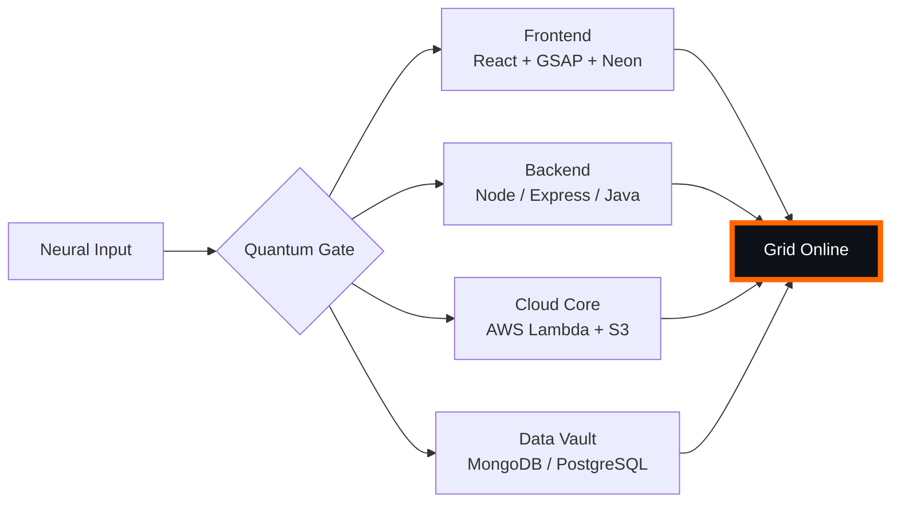

# 🌌 [ NEURAL CORE ACCESS: PENDEMVAMSI ]

<p align="center">
  
</p>

<div align="center">
  
  <br><small>Active Protocol: <strong style="color:#FF6600">CYBERPUNK 2077</strong> 🏙️🔥</small>
</div>

## 🔵 NEURAL STATUS READOUT
```text
SUBJECT ID    →  PENDEMVAMSI
ENTITY CLASS  →  SHADOW MONARCH v8
NEURAL RANK   →  B-TIER
GRID SYNC     →  3164/8010 QUANTUM PACKETS
─────── BIO-METRICS (CYBERPUNK 2077) ───────
STRENGTH      140  ██████████████████░░░
AGILITY       122  ████████████████░░░░░
INTELLIGENCE  147  ███████████████████░░
VITALITY      112  ███████████████░░░░░░
```

> **NEURAL BURST ACQUIRED:** +109 QUANTUM PACKETS 
> **SYSTEM MESSAGE:** SHADOW EXTRACTION COMPLETE — ALL HAIL THE MONARCH

---

## 🌀 GRID ARCHITECTURE (HOLOGRAPHIC RENDER)



---

## 📡 ACADEMIC NODES – CONQUERED
- [x] B.Tech Neural Engineering (2020–2024) – St. Ann’s Grid
- [x] Intermediate Quantum Core (2018–2020) – Sri Medhavi
- [x] SSC Primary Link (2017–2018) – Sri Geethanjali

---

## ⚡ SKILL NEURAL MATRIX

<details open>
<summary>🔌 ACTIVE NEURAL LINKS</summary>

| Node               | Tier | Integrity Bar                | Status      |
|--------------------|------|------------------------------|-------------|
| Java Core          | S    | ████████████████████ 100%   | OVERCLOCKED |
| Node.js Grid       | S    | ████████████████████ 100%   | OVERCLOCKED |
| React Holo-UI      | A+   | █████████████████░░░ 92%    | ONLINE      |
| AWS Quantum Relay  | S    | ████████████████████ 100%   | SOVEREIGN   |
| Python AI Kernel   | A    | ████████████████░░░░ 85%    | CHARGING    |
| DSA Void Algorithm | A    | █████████████████░░░ 90%    | ACTIVE      |

</details>

---

## 🏅 NEURAL ACHIEVEMENT TOKENS

<p align="center">
  
  
  
  
</p>

---

## 👾 SHADOW ENTITIES – SUMMONED

<p align="center">
  
  <br><strong style="color:#FF6600">ARISE.</strong>
</p>

| Entity | Designation   | Class            | Source Node                     |
|--------|---------------|------------------|---------------------------------|
| SH-01  | Igris         | Void Commander   | AI Financial Oracle             |
| SH-02  | Beru          | Swarm Overlord   | WebRTC Quantum Stream           |
| SH-03  | Kaisel        | Void Wyrm        | Geolocation Shadow Relay        |
| SH-04  | Tusk          | Arcane Construct | Global Pandemic Sentinel        |
| SH-05  | Iron          | Armored Bastion  | React Crypto Fortress           |

---

## 📡 GRID ANALYTICS (LIVE FEED)

<p align="center">
  
  <br>
  
  
</p>

---

## 🖥️ CORRUPTED MAINFRAME LOG (401 ENTRIES)

<details>
<summary>OPEN TERMINAL FEED – PROTOCOL: CYBERPUNK 2077</summary>

> [0xADDFA34F] 🏙️🔥 **CYBERPUNK 2077 PROTOCOL** #0 | NEURAL LINK STABILIZED | [TRANSMISSION SUCCESS]
> [0x5A4F54E0] 🏙️🔥 **CYBERPUNK 2077 PROTOCOL** #1 | NEURAL LINK STABILIZED | [TRANSMISSION SUCCESS]
> [0xE50633A4] 🏙️🔥 **CYBERPUNK 2077 PROTOCOL** #2 | NEURAL LINK STABILIZED | [TRANSMISSION SUCCESS]
> [0x384886C5] 🏙️🔥 **CYBERPUNK 2077 PROTOCOL** #3 | NEURAL LINK STABILIZED | [TRANSMISSION SUCCESS]
> [0x564B6CBA] 🏙️🔥 **CYBERPUNK 2077 PROTOCOL** #4 | NEURAL LINK STABILIZED | [TRANSMISSION SUCCESS]
> [0x9A9B51A5] 🏙️🔥 **CYBERPUNK 2077 PROTOCOL** #5 | NEURAL LINK  [GLITCH DETECTED] STABILIZED | [TRANSMISSION SUCCESS]
> [0x9EC6A3DB] 🏙️🔥 **CYBERPUNK 2077 PROTOCOL** #6 | NEURAL LINK STABILIZED | [TRANSMISSION SUCCESS]
> [0xF8830482] 🏙️🔥 **CYBERPUNK 2077 PROTOCOL** #7 | NEURAL LINK STABILIZED | [TRANSMISSION SUCCESS]
> [0x88ED0C98] 🏙️🔥 **CYBERPUNK 2077 PROTOCOL** #8 | NEURAL LINK STABILIZED | [TRANSMISSION SUCCESS]
> [0x6DC9CE40] 🏙️🔥 **CYBERPUNK 2077 PROTOCOL** #9 | NEURAL LINK  [GLITCH DETECTED] STABILIZED | [TRANSMISSION SUCCESS]
> [0x689D5FB6] 🏙️🔥 **CYBERPUNK 2077 PROTOCOL** #10 | NEURAL LINK  [GLITCH DETECTED] STABILIZED | [TRANSMISSION SUCCESS]
> [0x5735AB84] 🏙️🔥 **CYBERPUNK 2077 PROTOCOL** #11 | NEURAL LINK STABILIZED | [TRANSMISSION SUCCESS]
> [0xEB7E8B97] 🏙️🔥 **CYBERPUNK 2077 PROTOCOL** #12 | NEURAL LINK STABILIZED | [TRANSMISSION SUCCESS]
> [0x8D9FA429] 🏙️🔥 **CYBERPUNK 2077 PROTOCOL** #13 | NEURAL LINK STABILIZED | [TRANSMISSION SUCCESS]
> [0x1021BC11] 🏙️🔥 **CYBERPUNK 2077 PROTOCOL** #14 | NEURAL LINK STABILIZED | [TRANSMISSION SUCCESS]
> [0xAC71F38B] 🏙️🔥 **CYBERPUNK 2077 PROTOCOL** #15 | NEURAL LINK STABILIZED | [TRANSMISSION SUCCESS]
> [0x4B4B5867] 🏙️🔥 **CYBERPUNK 2077 PROTOCOL** #16 | NEURAL LINK STABILIZED | [TRANSMISSION SUCCESS]
> [0xCF1ACC11] 🏙️🔥 **CYBERPUNK 2077 PROTOCOL** #17 | NEURAL LINK  [GLITCH DETECTED] STABILIZED | [TRANSMISSION SUCCESS]
> [0x70F1A2A1] 🏙️🔥 **CYBERPUNK 2077 PROTOCOL** #18 | NEURAL LINK STABILIZED | [TRANSMISSION SUCCESS]
> [0x456A38A7] 🏙️🔥 **CYBERPUNK 2077 PROTOCOL** #19 | NEURAL LINK STABILIZED | [TRANSMISSION SUCCESS]
> [0x4CE1862A] 🏙️🔥 **CYBERPUNK 2077 PROTOCOL** #20 | NEURAL LINK STABILIZED | [TRANSMISSION SUCCESS]
> [0xDC442E52] 🏙️🔥 **CYBERPUNK 2077 PROTOCOL** #21 | NEURAL LINK STABILIZED | [TRANSMISSION SUCCESS]
> [0x60548E24] 🏙️🔥 **CYBERPUNK 2077 PROTOCOL** #22 | NEURAL LINK STABILIZED | [TRANSMISSION SUCCESS]
> [0xA7F0AF79] 🏙️🔥 **CYBERPUNK 2077 PROTOCOL** #23 | NEURAL LINK STABILIZED | [TRANSMISSION SUCCESS]
> [0x3612EFAA] 🏙️🔥 **CYBERPUNK 2077 PROTOCOL** #24 | NEURAL LINK  [GLITCH DETECTED] STABILIZED | [TRANSMISSION SUCCESS]
> [0x7A77FB77] 🏙️🔥 **CYBERPUNK 2077 PROTOCOL** #25 | NEURAL LINK STABILIZED | [TRANSMISSION SUCCESS]
> [0x2DEB93A0] 🏙️🔥 **CYBERPUNK 2077 PROTOCOL** #26 | NEURAL LINK STABILIZED | [TRANSMISSION SUCCESS]
> [0xE7F2BFC3] 🏙️🔥 **CYBERPUNK 2077 PROTOCOL** #27 | NEURAL LINK STABILIZED | [TRANSMISSION SUCCESS]
> [0x1CDE9EBE] 🏙️🔥 **CYBERPUNK 2077 PROTOCOL** #28 | NEURAL LINK STABILIZED | [TRANSMISSION SUCCESS]
> [0xA88D2E53] 🏙️🔥 **CYBERPUNK 2077 PROTOCOL** #29 | NEURAL LINK STABILIZED | [TRANSMISSION SUCCESS]
> [0xEA1489B3] 🏙️🔥 **CYBERPUNK 2077 PROTOCOL** #30 | NEURAL LINK STABILIZED | [TRANSMISSION SUCCESS]
> [0xAED579F1] 🏙️🔥 **CYBERPUNK 2077 PROTOCOL** #31 | NEURAL LINK STABILIZED | [TRANSMISSION SUCCESS]
> [0x8632C616] 🏙️🔥 **CYBERPUNK 2077 PROTOCOL** #32 | NEURAL LINK STABILIZED | [TRANSMISSION SUCCESS]
> [0x3A3DE40B] 🏙️🔥 **CYBERPUNK 2077 PROTOCOL** #33 | NEURAL LINK STABILIZED | [TRANSMISSION SUCCESS]
> [0xD986D6AD] 🏙️🔥 **CYBERPUNK 2077 PROTOCOL** #34 | NEURAL LINK STABILIZED | [TRANSMISSION SUCCESS]
> [0x3F19A554] 🏙️🔥 **CYBERPUNK 2077 PROTOCOL** #35 | NEURAL LINK STABILIZED | [TRANSMISSION SUCCESS]
> [0x9A1EA7A2] 🏙️🔥 **CYBERPUNK 2077 PROTOCOL** #36 | NEURAL LINK STABILIZED | [TRANSMISSION SUCCESS]
> [0x36ED02D2] 🏙️🔥 **CYBERPUNK 2077 PROTOCOL** #37 | NEURAL LINK STABILIZED | [TRANSMISSION SUCCESS]
> [0xBF91CD0D] 🏙️🔥 **CYBERPUNK 2077 PROTOCOL** #38 | NEURAL LINK  [GLITCH DETECTED] STABILIZED | [TRANSMISSION SUCCESS]
> [0x103BA2A1] 🏙️🔥 **CYBERPUNK 2077 PROTOCOL** #39 | NEURAL LINK STABILIZED | [TRANSMISSION SUCCESS]
> [0xECFE7EC8] 🏙️🔥 **CYBERPUNK 2077 PROTOCOL** #40 | NEURAL LINK STABILIZED | [TRANSMISSION SUCCESS]
> [0x981C242D] 🏙️🔥 **CYBERPUNK 2077 PROTOCOL** #41 | NEURAL LINK STABILIZED | [TRANSMISSION SUCCESS]
> [0x9FD73511] 🏙️🔥 **CYBERPUNK 2077 PROTOCOL** #42 | NEURAL LINK STABILIZED | [TRANSMISSION SUCCESS]
> [0xDA5782F3] 🏙️🔥 **CYBERPUNK 2077 PROTOCOL** #43 | NEURAL LINK STABILIZED | [TRANSMISSION SUCCESS]
> [0xF6207A21] 🏙️🔥 **CYBERPUNK 2077 PROTOCOL** #44 | NEURAL LINK  [GLITCH DETECTED] STABILIZED | [TRANSMISSION SUCCESS]
> [0x8924134B] 🏙️🔥 **CYBERPUNK 2077 PROTOCOL** #45 | NEURAL LINK STABILIZED | [TRANSMISSION SUCCESS]
> [0x3FAD0273] 🏙️🔥 **CYBERPUNK 2077 PROTOCOL** #46 | NEURAL LINK STABILIZED | [TRANSMISSION SUCCESS]
> [0x7499E010] 🏙️🔥 **CYBERPUNK 2077 PROTOCOL** #47 | NEURAL LINK STABILIZED | [TRANSMISSION SUCCESS]
> [0xF385B53C] 🏙️🔥 **CYBERPUNK 2077 PROTOCOL** #48 | NEURAL LINK STABILIZED | [TRANSMISSION SUCCESS]
> [0x6B1B25E4] 🏙️🔥 **CYBERPUNK 2077 PROTOCOL** #49 | NEURAL LINK STABILIZED | [TRANSMISSION SUCCESS]
> [0x85C7F54E] 🏙️🔥 **CYBERPUNK 2077 PROTOCOL** #50 | NEURAL LINK STABILIZED | [TRANSMISSION SUCCESS]
> [0xCE80BB0F] 🏙️🔥 **CYBERPUNK 2077 PROTOCOL** #51 | NEURAL LINK STABILIZED | [TRANSMISSION SUCCESS]
> [0x41E6433F] 🏙️🔥 **CYBERPUNK 2077 PROTOCOL** #52 | NEURAL LINK STABILIZED | [TRANSMISSION SUCCESS]
> [0xE25FEF60] 🏙️🔥 **CYBERPUNK 2077 PROTOCOL** #53 | NEURAL LINK STABILIZED | [TRANSMISSION SUCCESS]
> [0xDE6479FC] 🏙️🔥 **CYBERPUNK 2077 PROTOCOL** #54 | NEURAL LINK STABILIZED | [TRANSMISSION SUCCESS]
> [0x95230416] 🏙️🔥 **CYBERPUNK 2077 PROTOCOL** #55 | NEURAL LINK STABILIZED | [TRANSMISSION SUCCESS]
> [0xEBF1CC75] 🏙️🔥 **CYBERPUNK 2077 PROTOCOL** #56 | NEURAL LINK STABILIZED | [TRANSMISSION SUCCESS]
> [0xB5B3681A] 🏙️🔥 **CYBERPUNK 2077 PROTOCOL** #57 | NEURAL LINK STABILIZED | [TRANSMISSION SUCCESS]
> [0x5A899DC8] 🏙️🔥 **CYBERPUNK 2077 PROTOCOL** #58 | NEURAL LINK STABILIZED | [TRANSMISSION SUCCESS]
> [0x1D2B04AB] 🏙️🔥 **CYBERPUNK 2077 PROTOCOL** #59 | NEURAL LINK STABILIZED | [TRANSMISSION SUCCESS]
> [0x73340E45] 🏙️🔥 **CYBERPUNK 2077 PROTOCOL** #60 | NEURAL LINK STABILIZED | [TRANSMISSION SUCCESS]
> [0x62E5573E] 🏙️🔥 **CYBERPUNK 2077 PROTOCOL** #61 | NEURAL LINK STABILIZED | [TRANSMISSION SUCCESS]
> [0x0E73D897] 🏙️🔥 **CYBERPUNK 2077 PROTOCOL** #62 | NEURAL LINK STABILIZED | [TRANSMISSION SUCCESS]
> [0x32A54A88] 🏙️🔥 **CYBERPUNK 2077 PROTOCOL** #63 | NEURAL LINK STABILIZED | [TRANSMISSION SUCCESS]
> [0x5E5F1F71] 🏙️🔥 **CYBERPUNK 2077 PROTOCOL** #64 | NEURAL LINK  [GLITCH DETECTED] STABILIZED | [TRANSMISSION SUCCESS]
> [0x2436BB33] 🏙️🔥 **CYBERPUNK 2077 PROTOCOL** #65 | NEURAL LINK STABILIZED | [TRANSMISSION SUCCESS]
> [0x1CE3B8D7] 🏙️🔥 **CYBERPUNK 2077 PROTOCOL** #66 | NEURAL LINK STABILIZED | [TRANSMISSION SUCCESS]
> [0x8F53E00B] 🏙️🔥 **CYBERPUNK 2077 PROTOCOL** #67 | NEURAL LINK STABILIZED | [TRANSMISSION SUCCESS]
> [0xC67EA4F9] 🏙️🔥 **CYBERPUNK 2077 PROTOCOL** #68 | NEURAL LINK STABILIZED | [TRANSMISSION SUCCESS]
> [0x58BA2C1B] 🏙️🔥 **CYBERPUNK 2077 PROTOCOL** #69 | NEURAL LINK STABILIZED | [TRANSMISSION SUCCESS]
> [0xBD49BE8B] 🏙️🔥 **CYBERPUNK 2077 PROTOCOL** #70 | NEURAL LINK STABILIZED | [TRANSMISSION SUCCESS]
> [0xB4F38A81] 🏙️🔥 **CYBERPUNK 2077 PROTOCOL** #71 | NEURAL LINK STABILIZED | [TRANSMISSION SUCCESS]
> [0x62D8663B] 🏙️🔥 **CYBERPUNK 2077 PROTOCOL** #72 | NEURAL LINK STABILIZED | [TRANSMISSION SUCCESS]
> [0x250987F1] 🏙️🔥 **CYBERPUNK 2077 PROTOCOL** #73 | NEURAL LINK  [GLITCH DETECTED] STABILIZED | [TRANSMISSION SUCCESS]
> [0xA478D4BB] 🏙️🔥 **CYBERPUNK 2077 PROTOCOL** #74 | NEURAL LINK STABILIZED | [TRANSMISSION SUCCESS]
> [0x8CB80461] 🏙️🔥 **CYBERPUNK 2077 PROTOCOL** #75 | NEURAL LINK STABILIZED | [TRANSMISSION SUCCESS]
> [0xE798F692] 🏙️🔥 **CYBERPUNK 2077 PROTOCOL** #76 | NEURAL LINK  [GLITCH DETECTED] STABILIZED | [TRANSMISSION SUCCESS]
> [0x65668EE4] 🏙️🔥 **CYBERPUNK 2077 PROTOCOL** #77 | NEURAL LINK STABILIZED | [TRANSMISSION SUCCESS]
> [0xFD680FDB] 🏙️🔥 **CYBERPUNK 2077 PROTOCOL** #78 | NEURAL LINK  [GLITCH DETECTED] STABILIZED | [TRANSMISSION SUCCESS]
> [0xAFC73957] 🏙️🔥 **CYBERPUNK 2077 PROTOCOL** #79 | NEURAL LINK STABILIZED | [TRANSMISSION SUCCESS]
> [0xE7A16F87] 🏙️🔥 **CYBERPUNK 2077 PROTOCOL** #80 | NEURAL LINK STABILIZED | [TRANSMISSION SUCCESS]
> [0x6C1367A9] 🏙️🔥 **CYBERPUNK 2077 PROTOCOL** #81 | NEURAL LINK STABILIZED | [TRANSMISSION SUCCESS]
> [0xE9AC6639] 🏙️🔥 **CYBERPUNK 2077 PROTOCOL** #82 | NEURAL LINK STABILIZED | [TRANSMISSION SUCCESS]
> [0x7F746B52] 🏙️🔥 **CYBERPUNK 2077 PROTOCOL** #83 | NEURAL LINK STABILIZED | [TRANSMISSION SUCCESS]
> [0xD6771951] 🏙️🔥 **CYBERPUNK 2077 PROTOCOL** #84 | NEURAL LINK STABILIZED | [TRANSMISSION SUCCESS]
> [0x7BA25F14] 🏙️🔥 **CYBERPUNK 2077 PROTOCOL** #85 | NEURAL LINK  [GLITCH DETECTED] STABILIZED | [TRANSMISSION SUCCESS]
> [0xF16208F5] 🏙️🔥 **CYBERPUNK 2077 PROTOCOL** #86 | NEURAL LINK STABILIZED | [TRANSMISSION SUCCESS]
> [0xAE721521] 🏙️🔥 **CYBERPUNK 2077 PROTOCOL** #87 | NEURAL LINK  [GLITCH DETECTED] STABILIZED | [TRANSMISSION SUCCESS]
> [0x1B1B94AF] 🏙️🔥 **CYBERPUNK 2077 PROTOCOL** #88 | NEURAL LINK  [GLITCH DETECTED] STABILIZED | [TRANSMISSION SUCCESS]
> [0xB1C470E2] 🏙️🔥 **CYBERPUNK 2077 PROTOCOL** #89 | NEURAL LINK STABILIZED | [TRANSMISSION SUCCESS]
> [0x9489CE9F] 🏙️🔥 **CYBERPUNK 2077 PROTOCOL** #90 | NEURAL LINK STABILIZED | [TRANSMISSION SUCCESS]
> [0x6E90110B] 🏙️🔥 **CYBERPUNK 2077 PROTOCOL** #91 | NEURAL LINK STABILIZED | [TRANSMISSION SUCCESS]
> [0x90EE06B4] 🏙️🔥 **CYBERPUNK 2077 PROTOCOL** #92 | NEURAL LINK STABILIZED | [TRANSMISSION SUCCESS]
> [0x1335AD2A] 🏙️🔥 **CYBERPUNK 2077 PROTOCOL** #93 | NEURAL LINK STABILIZED | [TRANSMISSION SUCCESS]
> [0x6ECFD6EC] 🏙️🔥 **CYBERPUNK 2077 PROTOCOL** #94 | NEURAL LINK STABILIZED | [TRANSMISSION SUCCESS]
> [0x8D05FDC7] 🏙️🔥 **CYBERPUNK 2077 PROTOCOL** #95 | NEURAL LINK  [GLITCH DETECTED] STABILIZED | [TRANSMISSION SUCCESS]
> [0x60ECE838] 🏙️🔥 **CYBERPUNK 2077 PROTOCOL** #96 | NEURAL LINK STABILIZED | [TRANSMISSION SUCCESS]
> [0x68459067] 🏙️🔥 **CYBERPUNK 2077 PROTOCOL** #97 | NEURAL LINK STABILIZED | [TRANSMISSION SUCCESS]
> [0x5334E44B] 🏙️🔥 **CYBERPUNK 2077 PROTOCOL** #98 | NEURAL LINK STABILIZED | [TRANSMISSION SUCCESS]
> [0x1D6D71EE] 🏙️🔥 **CYBERPUNK 2077 PROTOCOL** #99 | NEURAL LINK  [GLITCH DETECTED] STABILIZED | [TRANSMISSION SUCCESS]
> [0x83EF08F1] 🏙️🔥 **CYBERPUNK 2077 PROTOCOL** #100 | NEURAL LINK STABILIZED | [TRANSMISSION SUCCESS]
> [0xE5AE9FBC] 🏙️🔥 **CYBERPUNK 2077 PROTOCOL** #101 | NEURAL LINK STABILIZED | [TRANSMISSION SUCCESS]
> [0x59C3353D] 🏙️🔥 **CYBERPUNK 2077 PROTOCOL** #102 | NEURAL LINK STABILIZED | [TRANSMISSION SUCCESS]
> [0x99343D88] 🏙️🔥 **CYBERPUNK 2077 PROTOCOL** #103 | NEURAL LINK  [GLITCH DETECTED] STABILIZED | [TRANSMISSION SUCCESS]
> [0x1499CAD4] 🏙️🔥 **CYBERPUNK 2077 PROTOCOL** #104 | NEURAL LINK STABILIZED | [TRANSMISSION SUCCESS]
> [0x2365C7E4] 🏙️🔥 **CYBERPUNK 2077 PROTOCOL** #105 | NEURAL LINK STABILIZED | [TRANSMISSION SUCCESS]
> [0x85C33C0B] 🏙️🔥 **CYBERPUNK 2077 PROTOCOL** #106 | NEURAL LINK STABILIZED | [TRANSMISSION SUCCESS]
> [0xEE210D79] 🏙️🔥 **CYBERPUNK 2077 PROTOCOL** #107 | NEURAL LINK STABILIZED | [TRANSMISSION SUCCESS]
> [0x70A043BC] 🏙️🔥 **CYBERPUNK 2077 PROTOCOL** #108 | NEURAL LINK STABILIZED | [TRANSMISSION SUCCESS]
> [0xCF81DBA4] 🏙️🔥 **CYBERPUNK 2077 PROTOCOL** #109 | NEURAL LINK STABILIZED | [TRANSMISSION SUCCESS]
> [0x62C72B6D] 🏙️🔥 **CYBERPUNK 2077 PROTOCOL** #110 | NEURAL LINK STABILIZED | [TRANSMISSION SUCCESS]
> [0x5721B121] 🏙️🔥 **CYBERPUNK 2077 PROTOCOL** #111 | NEURAL LINK STABILIZED | [TRANSMISSION SUCCESS]
> [0x2B735150] 🏙️🔥 **CYBERPUNK 2077 PROTOCOL** #112 | NEURAL LINK STABILIZED | [TRANSMISSION SUCCESS]
> [0xCAB423FA] 🏙️🔥 **CYBERPUNK 2077 PROTOCOL** #113 | NEURAL LINK STABILIZED | [TRANSMISSION SUCCESS]
> [0x0527837D] 🏙️🔥 **CYBERPUNK 2077 PROTOCOL** #114 | NEURAL LINK STABILIZED | [TRANSMISSION SUCCESS]
> [0xDCF83DB9] 🏙️🔥 **CYBERPUNK 2077 PROTOCOL** #115 | NEURAL LINK  [GLITCH DETECTED] STABILIZED | [TRANSMISSION SUCCESS]
> [0xE22FCFBA] 🏙️🔥 **CYBERPUNK 2077 PROTOCOL** #116 | NEURAL LINK STABILIZED | [TRANSMISSION SUCCESS]
> [0xE7816907] 🏙️🔥 **CYBERPUNK 2077 PROTOCOL** #117 | NEURAL LINK STABILIZED | [TRANSMISSION SUCCESS]
> [0xF42CAD26] 🏙️🔥 **CYBERPUNK 2077 PROTOCOL** #118 | NEURAL LINK  [GLITCH DETECTED] STABILIZED | [TRANSMISSION SUCCESS]
> [0x2C89907F] 🏙️🔥 **CYBERPUNK 2077 PROTOCOL** #119 | NEURAL LINK  [GLITCH DETECTED] STABILIZED | [TRANSMISSION SUCCESS]
> [0x6E06E57C] 🏙️🔥 **CYBERPUNK 2077 PROTOCOL** #120 | NEURAL LINK STABILIZED | [TRANSMISSION SUCCESS]
> [0x637EB852] 🏙️🔥 **CYBERPUNK 2077 PROTOCOL** #121 | NEURAL LINK STABILIZED | [TRANSMISSION SUCCESS]
> [0xBF38EA19] 🏙️🔥 **CYBERPUNK 2077 PROTOCOL** #122 | NEURAL LINK STABILIZED | [TRANSMISSION SUCCESS]
> [0x9E10B08B] 🏙️🔥 **CYBERPUNK 2077 PROTOCOL** #123 | NEURAL LINK STABILIZED | [TRANSMISSION SUCCESS]
> [0x6239434F] 🏙️🔥 **CYBERPUNK 2077 PROTOCOL** #124 | NEURAL LINK STABILIZED | [TRANSMISSION SUCCESS]
> [0x65F5DCBB] 🏙️🔥 **CYBERPUNK 2077 PROTOCOL** #125 | NEURAL LINK STABILIZED | [TRANSMISSION SUCCESS]
> [0xEC4CB9E6] 🏙️🔥 **CYBERPUNK 2077 PROTOCOL** #126 | NEURAL LINK STABILIZED | [TRANSMISSION SUCCESS]
> [0x3D632654] 🏙️🔥 **CYBERPUNK 2077 PROTOCOL** #127 | NEURAL LINK STABILIZED | [TRANSMISSION SUCCESS]
> [0xE257988C] 🏙️🔥 **CYBERPUNK 2077 PROTOCOL** #128 | NEURAL LINK STABILIZED | [TRANSMISSION SUCCESS]
> [0x79EE6BCA] 🏙️🔥 **CYBERPUNK 2077 PROTOCOL** #129 | NEURAL LINK  [GLITCH DETECTED] STABILIZED | [TRANSMISSION SUCCESS]
> [0xDDB12E83] 🏙️🔥 **CYBERPUNK 2077 PROTOCOL** #130 | NEURAL LINK  [GLITCH DETECTED] STABILIZED | [TRANSMISSION SUCCESS]
> [0xBB588D2E] 🏙️🔥 **CYBERPUNK 2077 PROTOCOL** #131 | NEURAL LINK STABILIZED | [TRANSMISSION SUCCESS]
> [0x64BF3387] 🏙️🔥 **CYBERPUNK 2077 PROTOCOL** #132 | NEURAL LINK STABILIZED | [TRANSMISSION SUCCESS]
> [0x46DEACE0] 🏙️🔥 **CYBERPUNK 2077 PROTOCOL** #133 | NEURAL LINK STABILIZED | [TRANSMISSION SUCCESS]
> [0xCC97F8BD] 🏙️🔥 **CYBERPUNK 2077 PROTOCOL** #134 | NEURAL LINK STABILIZED | [TRANSMISSION SUCCESS]
> [0x60666818] 🏙️🔥 **CYBERPUNK 2077 PROTOCOL** #135 | NEURAL LINK STABILIZED | [TRANSMISSION SUCCESS]
> [0x9A68D174] 🏙️🔥 **CYBERPUNK 2077 PROTOCOL** #136 | NEURAL LINK STABILIZED | [TRANSMISSION SUCCESS]
> [0xAB06DCC4] 🏙️🔥 **CYBERPUNK 2077 PROTOCOL** #137 | NEURAL LINK STABILIZED | [TRANSMISSION SUCCESS]
> [0x4A9FD4CA] 🏙️🔥 **CYBERPUNK 2077 PROTOCOL** #138 | NEURAL LINK STABILIZED | [TRANSMISSION SUCCESS]
> [0x5866785F] 🏙️🔥 **CYBERPUNK 2077 PROTOCOL** #139 | NEURAL LINK STABILIZED | [TRANSMISSION SUCCESS]
> [0x16433C3B] 🏙️🔥 **CYBERPUNK 2077 PROTOCOL** #140 | NEURAL LINK STABILIZED | [TRANSMISSION SUCCESS]
> [0x06935905] 🏙️🔥 **CYBERPUNK 2077 PROTOCOL** #141 | NEURAL LINK STABILIZED | [TRANSMISSION SUCCESS]
> [0x39A46474] 🏙️🔥 **CYBERPUNK 2077 PROTOCOL** #142 | NEURAL LINK STABILIZED | [TRANSMISSION SUCCESS]
> [0xB425390A] 🏙️🔥 **CYBERPUNK 2077 PROTOCOL** #143 | NEURAL LINK STABILIZED | [TRANSMISSION SUCCESS]
> [0x2B64A754] 🏙️🔥 **CYBERPUNK 2077 PROTOCOL** #144 | NEURAL LINK STABILIZED | [TRANSMISSION SUCCESS]
> [0x441A57A9] 🏙️🔥 **CYBERPUNK 2077 PROTOCOL** #145 | NEURAL LINK  [GLITCH DETECTED] STABILIZED | [TRANSMISSION SUCCESS]
> [0xFD633C86] 🏙️🔥 **CYBERPUNK 2077 PROTOCOL** #146 | NEURAL LINK STABILIZED | [TRANSMISSION SUCCESS]
> [0xB0C085B5] 🏙️🔥 **CYBERPUNK 2077 PROTOCOL** #147 | NEURAL LINK STABILIZED | [TRANSMISSION SUCCESS]
> [0x51E01BEE] 🏙️🔥 **CYBERPUNK 2077 PROTOCOL** #148 | NEURAL LINK STABILIZED | [TRANSMISSION SUCCESS]
> [0x673F5216] 🏙️🔥 **CYBERPUNK 2077 PROTOCOL** #149 | NEURAL LINK STABILIZED | [TRANSMISSION SUCCESS]
> [0xE8B31FBD] 🏙️🔥 **CYBERPUNK 2077 PROTOCOL** #150 | NEURAL LINK STABILIZED | [TRANSMISSION SUCCESS]
> [0xF8D90233] 🏙️🔥 **CYBERPUNK 2077 PROTOCOL** #151 | NEURAL LINK STABILIZED | [TRANSMISSION SUCCESS]
> [0xBB97D867] 🏙️🔥 **CYBERPUNK 2077 PROTOCOL** #152 | NEURAL LINK STABILIZED | [TRANSMISSION SUCCESS]
> [0x8144D482] 🏙️🔥 **CYBERPUNK 2077 PROTOCOL** #153 | NEURAL LINK  [GLITCH DETECTED] STABILIZED | [TRANSMISSION SUCCESS]
> [0x6694A80D] 🏙️🔥 **CYBERPUNK 2077 PROTOCOL** #154 | NEURAL LINK STABILIZED | [TRANSMISSION SUCCESS]
> [0x7995BEF4] 🏙️🔥 **CYBERPUNK 2077 PROTOCOL** #155 | NEURAL LINK  [GLITCH DETECTED] STABILIZED | [TRANSMISSION SUCCESS]
> [0x6D5A23F4] 🏙️🔥 **CYBERPUNK 2077 PROTOCOL** #156 | NEURAL LINK STABILIZED | [TRANSMISSION SUCCESS]
> [0x72D2DD5A] 🏙️🔥 **CYBERPUNK 2077 PROTOCOL** #157 | NEURAL LINK STABILIZED | [TRANSMISSION SUCCESS]
> [0xD7FFCA4B] 🏙️🔥 **CYBERPUNK 2077 PROTOCOL** #158 | NEURAL LINK STABILIZED | [TRANSMISSION SUCCESS]
> [0xE63E50A1] 🏙️🔥 **CYBERPUNK 2077 PROTOCOL** #159 | NEURAL LINK STABILIZED | [TRANSMISSION SUCCESS]
> [0x269F69CF] 🏙️🔥 **CYBERPUNK 2077 PROTOCOL** #160 | NEURAL LINK STABILIZED | [TRANSMISSION SUCCESS]
> [0x2B3EF982] 🏙️🔥 **CYBERPUNK 2077 PROTOCOL** #161 | NEURAL LINK STABILIZED | [TRANSMISSION SUCCESS]
> [0xC94E11BB] 🏙️🔥 **CYBERPUNK 2077 PROTOCOL** #162 | NEURAL LINK STABILIZED | [TRANSMISSION SUCCESS]
> [0x8C004E7C] 🏙️🔥 **CYBERPUNK 2077 PROTOCOL** #163 | NEURAL LINK STABILIZED | [TRANSMISSION SUCCESS]
> [0x3DEC4194] 🏙️🔥 **CYBERPUNK 2077 PROTOCOL** #164 | NEURAL LINK STABILIZED | [TRANSMISSION SUCCESS]
> [0x571DA363] 🏙️🔥 **CYBERPUNK 2077 PROTOCOL** #165 | NEURAL LINK STABILIZED | [TRANSMISSION SUCCESS]
> [0x48FB1F8D] 🏙️🔥 **CYBERPUNK 2077 PROTOCOL** #166 | NEURAL LINK STABILIZED | [TRANSMISSION SUCCESS]
> [0xAE4F1715] 🏙️🔥 **CYBERPUNK 2077 PROTOCOL** #167 | NEURAL LINK STABILIZED | [TRANSMISSION SUCCESS]
> [0xA3CF7003] 🏙️🔥 **CYBERPUNK 2077 PROTOCOL** #168 | NEURAL LINK STABILIZED | [TRANSMISSION SUCCESS]
> [0xE5B6AF26] 🏙️🔥 **CYBERPUNK 2077 PROTOCOL** #169 | NEURAL LINK  [GLITCH DETECTED] STABILIZED | [TRANSMISSION SUCCESS]
> [0x3A301C7A] 🏙️🔥 **CYBERPUNK 2077 PROTOCOL** #170 | NEURAL LINK STABILIZED | [TRANSMISSION SUCCESS]
> [0xE817C34E] 🏙️🔥 **CYBERPUNK 2077 PROTOCOL** #171 | NEURAL LINK  [GLITCH DETECTED] STABILIZED | [TRANSMISSION SUCCESS]
> [0x6D40D0B7] 🏙️🔥 **CYBERPUNK 2077 PROTOCOL** #172 | NEURAL LINK  [GLITCH DETECTED] STABILIZED | [TRANSMISSION SUCCESS]
> [0x34934F5C] 🏙️🔥 **CYBERPUNK 2077 PROTOCOL** #173 | NEURAL LINK STABILIZED | [TRANSMISSION SUCCESS]
> [0x6BCA1C96] 🏙️🔥 **CYBERPUNK 2077 PROTOCOL** #174 | NEURAL LINK  [GLITCH DETECTED] STABILIZED | [TRANSMISSION SUCCESS]
> [0xB1865000] 🏙️🔥 **CYBERPUNK 2077 PROTOCOL** #175 | NEURAL LINK STABILIZED | [TRANSMISSION SUCCESS]
> [0x16C53C47] 🏙️🔥 **CYBERPUNK 2077 PROTOCOL** #176 | NEURAL LINK STABILIZED | [TRANSMISSION SUCCESS]
> [0x62E6A3CD] 🏙️🔥 **CYBERPUNK 2077 PROTOCOL** #177 | NEURAL LINK  [GLITCH DETECTED] STABILIZED | [TRANSMISSION SUCCESS]
> [0x600507C3] 🏙️🔥 **CYBERPUNK 2077 PROTOCOL** #178 | NEURAL LINK STABILIZED | [TRANSMISSION SUCCESS]
> [0xD54810C2] 🏙️🔥 **CYBERPUNK 2077 PROTOCOL** #179 | NEURAL LINK STABILIZED | [TRANSMISSION SUCCESS]
> [0x53C6487D] 🏙️🔥 **CYBERPUNK 2077 PROTOCOL** #180 | NEURAL LINK STABILIZED | [TRANSMISSION SUCCESS]
> [0x7200A3C9] 🏙️🔥 **CYBERPUNK 2077 PROTOCOL** #181 | NEURAL LINK STABILIZED | [TRANSMISSION SUCCESS]
> [0x026D787F] 🏙️🔥 **CYBERPUNK 2077 PROTOCOL** #182 | NEURAL LINK  [GLITCH DETECTED] STABILIZED | [TRANSMISSION SUCCESS]
> [0x48C74B49] 🏙️🔥 **CYBERPUNK 2077 PROTOCOL** #183 | NEURAL LINK STABILIZED | [TRANSMISSION SUCCESS]
> [0x4ECB2E7F] 🏙️🔥 **CYBERPUNK 2077 PROTOCOL** #184 | NEURAL LINK STABILIZED | [TRANSMISSION SUCCESS]
> [0xC356B5B7] 🏙️🔥 **CYBERPUNK 2077 PROTOCOL** #185 | NEURAL LINK STABILIZED | [TRANSMISSION SUCCESS]
> [0xAC3A81D3] 🏙️🔥 **CYBERPUNK 2077 PROTOCOL** #186 | NEURAL LINK  [GLITCH DETECTED] STABILIZED | [TRANSMISSION SUCCESS]
> [0x98D4D3DE] 🏙️🔥 **CYBERPUNK 2077 PROTOCOL** #187 | NEURAL LINK STABILIZED | [TRANSMISSION SUCCESS]
> [0xF54EB299] 🏙️🔥 **CYBERPUNK 2077 PROTOCOL** #188 | NEURAL LINK STABILIZED | [TRANSMISSION SUCCESS]
> [0x1EABAB05] 🏙️🔥 **CYBERPUNK 2077 PROTOCOL** #189 | NEURAL LINK STABILIZED | [TRANSMISSION SUCCESS]
> [0x9D1A8083] 🏙️🔥 **CYBERPUNK 2077 PROTOCOL** #190 | NEURAL LINK STABILIZED | [TRANSMISSION SUCCESS]
> [0xA1416AD6] 🏙️🔥 **CYBERPUNK 2077 PROTOCOL** #191 | NEURAL LINK STABILIZED | [TRANSMISSION SUCCESS]
> [0x43250905] 🏙️🔥 **CYBERPUNK 2077 PROTOCOL** #192 | NEURAL LINK STABILIZED | [TRANSMISSION SUCCESS]
> [0xAE367930] 🏙️🔥 **CYBERPUNK 2077 PROTOCOL** #193 | NEURAL LINK STABILIZED | [TRANSMISSION SUCCESS]
> [0x4BF6A5E3] 🏙️🔥 **CYBERPUNK 2077 PROTOCOL** #194 | NEURAL LINK STABILIZED | [TRANSMISSION SUCCESS]
> [0x2E1F0B80] 🏙️🔥 **CYBERPUNK 2077 PROTOCOL** #195 | NEURAL LINK STABILIZED | [TRANSMISSION SUCCESS]
> [0xF1A3741E] 🏙️🔥 **CYBERPUNK 2077 PROTOCOL** #196 | NEURAL LINK STABILIZED | [TRANSMISSION SUCCESS]
> [0x4EBE4ADA] 🏙️🔥 **CYBERPUNK 2077 PROTOCOL** #197 | NEURAL LINK STABILIZED | [TRANSMISSION SUCCESS]
> [0xD0E95533] 🏙️🔥 **CYBERPUNK 2077 PROTOCOL** #198 | NEURAL LINK  [GLITCH DETECTED] STABILIZED | [TRANSMISSION SUCCESS]
> [0xC55031C0] 🏙️🔥 **CYBERPUNK 2077 PROTOCOL** #199 | NEURAL LINK STABILIZED | [TRANSMISSION SUCCESS]
> [0x3C2B3FE1] 🏙️🔥 **CYBERPUNK 2077 PROTOCOL** #200 | NEURAL LINK STABILIZED | [TRANSMISSION SUCCESS]
> [0x734278E6] 🏙️🔥 **CYBERPUNK 2077 PROTOCOL** #201 | NEURAL LINK STABILIZED | [TRANSMISSION SUCCESS]
> [0x37449526] 🏙️🔥 **CYBERPUNK 2077 PROTOCOL** #202 | NEURAL LINK STABILIZED | [TRANSMISSION SUCCESS]
> [0x695B3063] 🏙️🔥 **CYBERPUNK 2077 PROTOCOL** #203 | NEURAL LINK STABILIZED | [TRANSMISSION SUCCESS]
> [0xC827F919] 🏙️🔥 **CYBERPUNK 2077 PROTOCOL** #204 | NEURAL LINK STABILIZED | [TRANSMISSION SUCCESS]
> [0xCFAE2E03] 🏙️🔥 **CYBERPUNK 2077 PROTOCOL** #205 | NEURAL LINK STABILIZED | [TRANSMISSION SUCCESS]
> [0x97BECAD4] 🏙️🔥 **CYBERPUNK 2077 PROTOCOL** #206 | NEURAL LINK  [GLITCH DETECTED] STABILIZED | [TRANSMISSION SUCCESS]
> [0x5CA52620] 🏙️🔥 **CYBERPUNK 2077 PROTOCOL** #207 | NEURAL LINK STABILIZED | [TRANSMISSION SUCCESS]
> [0xA988C6CF] 🏙️🔥 **CYBERPUNK 2077 PROTOCOL** #208 | NEURAL LINK STABILIZED | [TRANSMISSION SUCCESS]
> [0x1329718D] 🏙️🔥 **CYBERPUNK 2077 PROTOCOL** #209 | NEURAL LINK STABILIZED | [TRANSMISSION SUCCESS]
> [0x18F90C59] 🏙️🔥 **CYBERPUNK 2077 PROTOCOL** #210 | NEURAL LINK STABILIZED | [TRANSMISSION SUCCESS]
> [0x180066D5] 🏙️🔥 **CYBERPUNK 2077 PROTOCOL** #211 | NEURAL LINK  [GLITCH DETECTED] STABILIZED | [TRANSMISSION SUCCESS]
> [0x57F2D74D] 🏙️🔥 **CYBERPUNK 2077 PROTOCOL** #212 | NEURAL LINK STABILIZED | [TRANSMISSION SUCCESS]
> [0xDEDFB34E] 🏙️🔥 **CYBERPUNK 2077 PROTOCOL** #213 | NEURAL LINK STABILIZED | [TRANSMISSION SUCCESS]
> [0xC98F0D69] 🏙️🔥 **CYBERPUNK 2077 PROTOCOL** #214 | NEURAL LINK STABILIZED | [TRANSMISSION SUCCESS]
> [0x93589E20] 🏙️🔥 **CYBERPUNK 2077 PROTOCOL** #215 | NEURAL LINK STABILIZED | [TRANSMISSION SUCCESS]
> [0xC8EADDCC] 🏙️🔥 **CYBERPUNK 2077 PROTOCOL** #216 | NEURAL LINK STABILIZED | [TRANSMISSION SUCCESS]
> [0x51B00E41] 🏙️🔥 **CYBERPUNK 2077 PROTOCOL** #217 | NEURAL LINK STABILIZED | [TRANSMISSION SUCCESS]
> [0xB674B9F3] 🏙️🔥 **CYBERPUNK 2077 PROTOCOL** #218 | NEURAL LINK STABILIZED | [TRANSMISSION SUCCESS]
> [0xAF8C7475] 🏙️🔥 **CYBERPUNK 2077 PROTOCOL** #219 | NEURAL LINK STABILIZED | [TRANSMISSION SUCCESS]
> [0x4C041771] 🏙️🔥 **CYBERPUNK 2077 PROTOCOL** #220 | NEURAL LINK STABILIZED | [TRANSMISSION SUCCESS]
> [0x820F5C89] 🏙️🔥 **CYBERPUNK 2077 PROTOCOL** #221 | NEURAL LINK STABILIZED | [TRANSMISSION SUCCESS]
> [0x904CC044] 🏙️🔥 **CYBERPUNK 2077 PROTOCOL** #222 | NEURAL LINK STABILIZED | [TRANSMISSION SUCCESS]
> [0x20A53EAB] 🏙️🔥 **CYBERPUNK 2077 PROTOCOL** #223 | NEURAL LINK STABILIZED | [TRANSMISSION SUCCESS]
> [0xC040499B] 🏙️🔥 **CYBERPUNK 2077 PROTOCOL** #224 | NEURAL LINK STABILIZED | [TRANSMISSION SUCCESS]
> [0x8CB8C4EC] 🏙️🔥 **CYBERPUNK 2077 PROTOCOL** #225 | NEURAL LINK  [GLITCH DETECTED] STABILIZED | [TRANSMISSION SUCCESS]
> [0x07BD9CD3] 🏙️🔥 **CYBERPUNK 2077 PROTOCOL** #226 | NEURAL LINK STABILIZED | [TRANSMISSION SUCCESS]
> [0xC8DCDF82] 🏙️🔥 **CYBERPUNK 2077 PROTOCOL** #227 | NEURAL LINK STABILIZED | [TRANSMISSION SUCCESS]
> [0xE350BC19] 🏙️🔥 **CYBERPUNK 2077 PROTOCOL** #228 | NEURAL LINK STABILIZED | [TRANSMISSION SUCCESS]
> [0x9C651DFA] 🏙️🔥 **CYBERPUNK 2077 PROTOCOL** #229 | NEURAL LINK STABILIZED | [TRANSMISSION SUCCESS]
> [0x864FC0B5] 🏙️🔥 **CYBERPUNK 2077 PROTOCOL** #230 | NEURAL LINK STABILIZED | [TRANSMISSION SUCCESS]
> [0x91E0EEB4] 🏙️🔥 **CYBERPUNK 2077 PROTOCOL** #231 | NEURAL LINK STABILIZED | [TRANSMISSION SUCCESS]
> [0xA7D9CEEF] 🏙️🔥 **CYBERPUNK 2077 PROTOCOL** #232 | NEURAL LINK STABILIZED | [TRANSMISSION SUCCESS]
> [0x74FF4EEF] 🏙️🔥 **CYBERPUNK 2077 PROTOCOL** #233 | NEURAL LINK STABILIZED | [TRANSMISSION SUCCESS]
> [0x96A15F71] 🏙️🔥 **CYBERPUNK 2077 PROTOCOL** #234 | NEURAL LINK STABILIZED | [TRANSMISSION SUCCESS]
> [0x33C6D3A1] 🏙️🔥 **CYBERPUNK 2077 PROTOCOL** #235 | NEURAL LINK STABILIZED | [TRANSMISSION SUCCESS]
> [0x8DD0F7E7] 🏙️🔥 **CYBERPUNK 2077 PROTOCOL** #236 | NEURAL LINK  [GLITCH DETECTED] STABILIZED | [TRANSMISSION SUCCESS]
> [0xE0B45535] 🏙️🔥 **CYBERPUNK 2077 PROTOCOL** #237 | NEURAL LINK STABILIZED | [TRANSMISSION SUCCESS]
> [0x592F4C22] 🏙️🔥 **CYBERPUNK 2077 PROTOCOL** #238 | NEURAL LINK STABILIZED | [TRANSMISSION SUCCESS]
> [0x971C4167] 🏙️🔥 **CYBERPUNK 2077 PROTOCOL** #239 | NEURAL LINK STABILIZED | [TRANSMISSION SUCCESS]
> [0x33A67D47] 🏙️🔥 **CYBERPUNK 2077 PROTOCOL** #240 | NEURAL LINK STABILIZED | [TRANSMISSION SUCCESS]
> [0x230A62BB] 🏙️🔥 **CYBERPUNK 2077 PROTOCOL** #241 | NEURAL LINK STABILIZED | [TRANSMISSION SUCCESS]
> [0x7E639BB8] 🏙️🔥 **CYBERPUNK 2077 PROTOCOL** #242 | NEURAL LINK STABILIZED | [TRANSMISSION SUCCESS]
> [0x851F9DE3] 🏙️🔥 **CYBERPUNK 2077 PROTOCOL** #243 | NEURAL LINK  [GLITCH DETECTED] STABILIZED | [TRANSMISSION SUCCESS]
> [0xF9CD9B46] 🏙️🔥 **CYBERPUNK 2077 PROTOCOL** #244 | NEURAL LINK STABILIZED | [TRANSMISSION SUCCESS]
> [0xE55BE10D] 🏙️🔥 **CYBERPUNK 2077 PROTOCOL** #245 | NEURAL LINK STABILIZED | [TRANSMISSION SUCCESS]
> [0x5A38FD51] 🏙️🔥 **CYBERPUNK 2077 PROTOCOL** #246 | NEURAL LINK  [GLITCH DETECTED] STABILIZED | [TRANSMISSION SUCCESS]
> [0x618EC1AA] 🏙️🔥 **CYBERPUNK 2077 PROTOCOL** #247 | NEURAL LINK STABILIZED | [TRANSMISSION SUCCESS]
> [0x88F1391C] 🏙️🔥 **CYBERPUNK 2077 PROTOCOL** #248 | NEURAL LINK STABILIZED | [TRANSMISSION SUCCESS]
> [0x0CAAE822] 🏙️🔥 **CYBERPUNK 2077 PROTOCOL** #249 | NEURAL LINK STABILIZED | [TRANSMISSION SUCCESS]
> [0xC4845637] 🏙️🔥 **CYBERPUNK 2077 PROTOCOL** #250 | NEURAL LINK  [GLITCH DETECTED] STABILIZED | [TRANSMISSION SUCCESS]
> [0x49AC06C7] 🏙️🔥 **CYBERPUNK 2077 PROTOCOL** #251 | NEURAL LINK STABILIZED | [TRANSMISSION SUCCESS]
> [0xA3347FD6] 🏙️🔥 **CYBERPUNK 2077 PROTOCOL** #252 | NEURAL LINK STABILIZED | [TRANSMISSION SUCCESS]
> [0x8CD18823] 🏙️🔥 **CYBERPUNK 2077 PROTOCOL** #253 | NEURAL LINK STABILIZED | [TRANSMISSION SUCCESS]
> [0x6B58BABC] 🏙️🔥 **CYBERPUNK 2077 PROTOCOL** #254 | NEURAL LINK STABILIZED | [TRANSMISSION SUCCESS]
> [0x91E7D29C] 🏙️🔥 **CYBERPUNK 2077 PROTOCOL** #255 | NEURAL LINK STABILIZED | [TRANSMISSION SUCCESS]
> [0x89C671B9] 🏙️🔥 **CYBERPUNK 2077 PROTOCOL** #256 | NEURAL LINK STABILIZED | [TRANSMISSION SUCCESS]
> [0xF3312E82] 🏙️🔥 **CYBERPUNK 2077 PROTOCOL** #257 | NEURAL LINK STABILIZED | [TRANSMISSION SUCCESS]
> [0xDFFBAD0D] 🏙️🔥 **CYBERPUNK 2077 PROTOCOL** #258 | NEURAL LINK STABILIZED | [TRANSMISSION SUCCESS]
> [0xA212F697] 🏙️🔥 **CYBERPUNK 2077 PROTOCOL** #259 | NEURAL LINK STABILIZED | [TRANSMISSION SUCCESS]
> [0xC3FD256D] 🏙️🔥 **CYBERPUNK 2077 PROTOCOL** #260 | NEURAL LINK STABILIZED | [TRANSMISSION SUCCESS]
> [0x5C7E525D] 🏙️🔥 **CYBERPUNK 2077 PROTOCOL** #261 | NEURAL LINK STABILIZED | [TRANSMISSION SUCCESS]
> [0xB3A9EC99] 🏙️🔥 **CYBERPUNK 2077 PROTOCOL** #262 | NEURAL LINK STABILIZED | [TRANSMISSION SUCCESS]
> [0x84C46A9D] 🏙️🔥 **CYBERPUNK 2077 PROTOCOL** #263 | NEURAL LINK STABILIZED | [TRANSMISSION SUCCESS]
> [0xAA925FCA] 🏙️🔥 **CYBERPUNK 2077 PROTOCOL** #264 | NEURAL LINK  [GLITCH DETECTED] STABILIZED | [TRANSMISSION SUCCESS]
> [0x18AD8681] 🏙️🔥 **CYBERPUNK 2077 PROTOCOL** #265 | NEURAL LINK STABILIZED | [TRANSMISSION SUCCESS]
> [0xF9302B1B] 🏙️🔥 **CYBERPUNK 2077 PROTOCOL** #266 | NEURAL LINK STABILIZED | [TRANSMISSION SUCCESS]
> [0xA408EEB9] 🏙️🔥 **CYBERPUNK 2077 PROTOCOL** #267 | NEURAL LINK STABILIZED | [TRANSMISSION SUCCESS]
> [0x8B4B520D] 🏙️🔥 **CYBERPUNK 2077 PROTOCOL** #268 | NEURAL LINK STABILIZED | [TRANSMISSION SUCCESS]
> [0xA4BE53DE] 🏙️🔥 **CYBERPUNK 2077 PROTOCOL** #269 | NEURAL LINK STABILIZED | [TRANSMISSION SUCCESS]
> [0x6BE4798C] 🏙️🔥 **CYBERPUNK 2077 PROTOCOL** #270 | NEURAL LINK STABILIZED | [TRANSMISSION SUCCESS]
> [0xBE7F7508] 🏙️🔥 **CYBERPUNK 2077 PROTOCOL** #271 | NEURAL LINK STABILIZED | [TRANSMISSION SUCCESS]
> [0x3EEAEE22] 🏙️🔥 **CYBERPUNK 2077 PROTOCOL** #272 | NEURAL LINK  [GLITCH DETECTED] STABILIZED | [TRANSMISSION SUCCESS]
> [0x44430D18] 🏙️🔥 **CYBERPUNK 2077 PROTOCOL** #273 | NEURAL LINK STABILIZED | [TRANSMISSION SUCCESS]
> [0xDD20EA75] 🏙️🔥 **CYBERPUNK 2077 PROTOCOL** #274 | NEURAL LINK STABILIZED | [TRANSMISSION SUCCESS]
> [0x2FE723C4] 🏙️🔥 **CYBERPUNK 2077 PROTOCOL** #275 | NEURAL LINK STABILIZED | [TRANSMISSION SUCCESS]
> [0x10855455] 🏙️🔥 **CYBERPUNK 2077 PROTOCOL** #276 | NEURAL LINK STABILIZED | [TRANSMISSION SUCCESS]
> [0x35435636] 🏙️🔥 **CYBERPUNK 2077 PROTOCOL** #277 | NEURAL LINK STABILIZED | [TRANSMISSION SUCCESS]
> [0xDF5B16BA] 🏙️🔥 **CYBERPUNK 2077 PROTOCOL** #278 | NEURAL LINK STABILIZED | [TRANSMISSION SUCCESS]
> [0xD1C7CB52] 🏙️🔥 **CYBERPUNK 2077 PROTOCOL** #279 | NEURAL LINK STABILIZED | [TRANSMISSION SUCCESS]
> [0x9A4469F3] 🏙️🔥 **CYBERPUNK 2077 PROTOCOL** #280 | NEURAL LINK STABILIZED | [TRANSMISSION SUCCESS]
> [0xDD5CEA9B] 🏙️🔥 **CYBERPUNK 2077 PROTOCOL** #281 | NEURAL LINK STABILIZED | [TRANSMISSION SUCCESS]
> [0xD0D76156] 🏙️🔥 **CYBERPUNK 2077 PROTOCOL** #282 | NEURAL LINK  [GLITCH DETECTED] STABILIZED | [TRANSMISSION SUCCESS]
> [0x4741CEC2] 🏙️🔥 **CYBERPUNK 2077 PROTOCOL** #283 | NEURAL LINK  [GLITCH DETECTED] STABILIZED | [TRANSMISSION SUCCESS]
> [0x7108EFA6] 🏙️🔥 **CYBERPUNK 2077 PROTOCOL** #284 | NEURAL LINK STABILIZED | [TRANSMISSION SUCCESS]
> [0x64B75131] 🏙️🔥 **CYBERPUNK 2077 PROTOCOL** #285 | NEURAL LINK STABILIZED | [TRANSMISSION SUCCESS]
> [0xE842312F] 🏙️🔥 **CYBERPUNK 2077 PROTOCOL** #286 | NEURAL LINK STABILIZED | [TRANSMISSION SUCCESS]
> [0xF6047C39] 🏙️🔥 **CYBERPUNK 2077 PROTOCOL** #287 | NEURAL LINK STABILIZED | [TRANSMISSION SUCCESS]
> [0x04986169] 🏙️🔥 **CYBERPUNK 2077 PROTOCOL** #288 | NEURAL LINK STABILIZED | [TRANSMISSION SUCCESS]
> [0x4F86838F] 🏙️🔥 **CYBERPUNK 2077 PROTOCOL** #289 | NEURAL LINK STABILIZED | [TRANSMISSION SUCCESS]
> [0x1A8109C0] 🏙️🔥 **CYBERPUNK 2077 PROTOCOL** #290 | NEURAL LINK STABILIZED | [TRANSMISSION SUCCESS]
> [0x07B62076] 🏙️🔥 **CYBERPUNK 2077 PROTOCOL** #291 | NEURAL LINK STABILIZED | [TRANSMISSION SUCCESS]
> [0x39385A46] 🏙️🔥 **CYBERPUNK 2077 PROTOCOL** #292 | NEURAL LINK STABILIZED | [TRANSMISSION SUCCESS]
> [0x5262C3C9] 🏙️🔥 **CYBERPUNK 2077 PROTOCOL** #293 | NEURAL LINK STABILIZED | [TRANSMISSION SUCCESS]
> [0x951723B6] 🏙️🔥 **CYBERPUNK 2077 PROTOCOL** #294 | NEURAL LINK STABILIZED | [TRANSMISSION SUCCESS]
> [0xD43E3E90] 🏙️🔥 **CYBERPUNK 2077 PROTOCOL** #295 | NEURAL LINK STABILIZED | [TRANSMISSION SUCCESS]
> [0x05983344] 🏙️🔥 **CYBERPUNK 2077 PROTOCOL** #296 | NEURAL LINK STABILIZED | [TRANSMISSION SUCCESS]
> [0x6E0DD8ED] 🏙️🔥 **CYBERPUNK 2077 PROTOCOL** #297 | NEURAL LINK STABILIZED | [TRANSMISSION SUCCESS]
> [0xE0879997] 🏙️🔥 **CYBERPUNK 2077 PROTOCOL** #298 | NEURAL LINK STABILIZED | [TRANSMISSION SUCCESS]
> [0x4C3E6279] 🏙️🔥 **CYBERPUNK 2077 PROTOCOL** #299 | NEURAL LINK STABILIZED | [TRANSMISSION SUCCESS]
> [0xEF5CE2C2] 🏙️🔥 **CYBERPUNK 2077 PROTOCOL** #300 | NEURAL LINK STABILIZED | [TRANSMISSION SUCCESS]
> [0x204314BC] 🏙️🔥 **CYBERPUNK 2077 PROTOCOL** #301 | NEURAL LINK STABILIZED | [TRANSMISSION SUCCESS]
> [0x9882807E] 🏙️🔥 **CYBERPUNK 2077 PROTOCOL** #302 | NEURAL LINK STABILIZED | [TRANSMISSION SUCCESS]
> [0xEA75D2C9] 🏙️🔥 **CYBERPUNK 2077 PROTOCOL** #303 | NEURAL LINK STABILIZED | [TRANSMISSION SUCCESS]
> [0x93A2CBCA] 🏙️🔥 **CYBERPUNK 2077 PROTOCOL** #304 | NEURAL LINK  [GLITCH DETECTED] STABILIZED | [TRANSMISSION SUCCESS]
> [0xFCACDB37] 🏙️🔥 **CYBERPUNK 2077 PROTOCOL** #305 | NEURAL LINK  [GLITCH DETECTED] STABILIZED | [TRANSMISSION SUCCESS]
> [0xFAA497E9] 🏙️🔥 **CYBERPUNK 2077 PROTOCOL** #306 | NEURAL LINK STABILIZED | [TRANSMISSION SUCCESS]
> [0x46C8DBE3] 🏙️🔥 **CYBERPUNK 2077 PROTOCOL** #307 | NEURAL LINK STABILIZED | [TRANSMISSION SUCCESS]
> [0xFCF9EF6B] 🏙️🔥 **CYBERPUNK 2077 PROTOCOL** #308 | NEURAL LINK STABILIZED | [TRANSMISSION SUCCESS]
> [0x82FF71D8] 🏙️🔥 **CYBERPUNK 2077 PROTOCOL** #309 | NEURAL LINK STABILIZED | [TRANSMISSION SUCCESS]
> [0x1B9A439D] 🏙️🔥 **CYBERPUNK 2077 PROTOCOL** #310 | NEURAL LINK  [GLITCH DETECTED] STABILIZED | [TRANSMISSION SUCCESS]
> [0x4105BB63] 🏙️🔥 **CYBERPUNK 2077 PROTOCOL** #311 | NEURAL LINK STABILIZED | [TRANSMISSION SUCCESS]
> [0x3B25E21F] 🏙️🔥 **CYBERPUNK 2077 PROTOCOL** #312 | NEURAL LINK  [GLITCH DETECTED] STABILIZED | [TRANSMISSION SUCCESS]
> [0x8961588F] 🏙️🔥 **CYBERPUNK 2077 PROTOCOL** #313 | NEURAL LINK STABILIZED | [TRANSMISSION SUCCESS]
> [0x7A87C1B5] 🏙️🔥 **CYBERPUNK 2077 PROTOCOL** #314 | NEURAL LINK STABILIZED | [TRANSMISSION SUCCESS]
> [0x35BA24F8] 🏙️🔥 **CYBERPUNK 2077 PROTOCOL** #315 | NEURAL LINK STABILIZED | [TRANSMISSION SUCCESS]
> [0x00BEAADE] 🏙️🔥 **CYBERPUNK 2077 PROTOCOL** #316 | NEURAL LINK STABILIZED | [TRANSMISSION SUCCESS]
> [0xA2D47DA6] 🏙️🔥 **CYBERPUNK 2077 PROTOCOL** #317 | NEURAL LINK STABILIZED | [TRANSMISSION SUCCESS]
> [0xDA4B4D54] 🏙️🔥 **CYBERPUNK 2077 PROTOCOL** #318 | NEURAL LINK STABILIZED | [TRANSMISSION SUCCESS]
> [0x786CC33C] 🏙️🔥 **CYBERPUNK 2077 PROTOCOL** #319 | NEURAL LINK STABILIZED | [TRANSMISSION SUCCESS]
> [0xF3501458] 🏙️🔥 **CYBERPUNK 2077 PROTOCOL** #320 | NEURAL LINK STABILIZED | [TRANSMISSION SUCCESS]
> [0x579BFB6E] 🏙️🔥 **CYBERPUNK 2077 PROTOCOL** #321 | NEURAL LINK STABILIZED | [TRANSMISSION SUCCESS]
> [0x39B47874] 🏙️🔥 **CYBERPUNK 2077 PROTOCOL** #322 | NEURAL LINK STABILIZED | [TRANSMISSION SUCCESS]
> [0x81BDD461] 🏙️🔥 **CYBERPUNK 2077 PROTOCOL** #323 | NEURAL LINK STABILIZED | [TRANSMISSION SUCCESS]
> [0xB2CF8E4B] 🏙️🔥 **CYBERPUNK 2077 PROTOCOL** #324 | NEURAL LINK STABILIZED | [TRANSMISSION SUCCESS]
> [0x03FCD037] 🏙️🔥 **CYBERPUNK 2077 PROTOCOL** #325 | NEURAL LINK STABILIZED | [TRANSMISSION SUCCESS]
> [0xF926C6AD] 🏙️🔥 **CYBERPUNK 2077 PROTOCOL** #326 | NEURAL LINK STABILIZED | [TRANSMISSION SUCCESS]
> [0x49D4BC48] 🏙️🔥 **CYBERPUNK 2077 PROTOCOL** #327 | NEURAL LINK  [GLITCH DETECTED] STABILIZED | [TRANSMISSION SUCCESS]
> [0x99CC1A5D] 🏙️🔥 **CYBERPUNK 2077 PROTOCOL** #328 | NEURAL LINK  [GLITCH DETECTED] STABILIZED | [TRANSMISSION SUCCESS]
> [0x1CC518D2] 🏙️🔥 **CYBERPUNK 2077 PROTOCOL** #329 | NEURAL LINK  [GLITCH DETECTED] STABILIZED | [TRANSMISSION SUCCESS]
> [0xB4B10684] 🏙️🔥 **CYBERPUNK 2077 PROTOCOL** #330 | NEURAL LINK STABILIZED | [TRANSMISSION SUCCESS]
> [0xA47FD21A] 🏙️🔥 **CYBERPUNK 2077 PROTOCOL** #331 | NEURAL LINK STABILIZED | [TRANSMISSION SUCCESS]
> [0x2D154895] 🏙️🔥 **CYBERPUNK 2077 PROTOCOL** #332 | NEURAL LINK  [GLITCH DETECTED] STABILIZED | [TRANSMISSION SUCCESS]
> [0xC5DEB01B] 🏙️🔥 **CYBERPUNK 2077 PROTOCOL** #333 | NEURAL LINK STABILIZED | [TRANSMISSION SUCCESS]
> [0x2F56BCDF] 🏙️🔥 **CYBERPUNK 2077 PROTOCOL** #334 | NEURAL LINK STABILIZED | [TRANSMISSION SUCCESS]
> [0xACCDD136] 🏙️🔥 **CYBERPUNK 2077 PROTOCOL** #335 | NEURAL LINK  [GLITCH DETECTED] STABILIZED | [TRANSMISSION SUCCESS]
> [0x688D065A] 🏙️🔥 **CYBERPUNK 2077 PROTOCOL** #336 | NEURAL LINK STABILIZED | [TRANSMISSION SUCCESS]
> [0x89F1BBA2] 🏙️🔥 **CYBERPUNK 2077 PROTOCOL** #337 | NEURAL LINK STABILIZED | [TRANSMISSION SUCCESS]
> [0x1400DA54] 🏙️🔥 **CYBERPUNK 2077 PROTOCOL** #338 | NEURAL LINK STABILIZED | [TRANSMISSION SUCCESS]
> [0xC27433E5] 🏙️🔥 **CYBERPUNK 2077 PROTOCOL** #339 | NEURAL LINK STABILIZED | [TRANSMISSION SUCCESS]
> [0xB0C37B56] 🏙️🔥 **CYBERPUNK 2077 PROTOCOL** #340 | NEURAL LINK  [GLITCH DETECTED] STABILIZED | [TRANSMISSION SUCCESS]
> [0xDFE0FF27] 🏙️🔥 **CYBERPUNK 2077 PROTOCOL** #341 | NEURAL LINK STABILIZED | [TRANSMISSION SUCCESS]
> [0x70E129EF] 🏙️🔥 **CYBERPUNK 2077 PROTOCOL** #342 | NEURAL LINK STABILIZED | [TRANSMISSION SUCCESS]
> [0x78B7A43C] 🏙️🔥 **CYBERPUNK 2077 PROTOCOL** #343 | NEURAL LINK STABILIZED | [TRANSMISSION SUCCESS]
> [0x52F89E40] 🏙️🔥 **CYBERPUNK 2077 PROTOCOL** #344 | NEURAL LINK STABILIZED | [TRANSMISSION SUCCESS]
> [0xC2DF595E] 🏙️🔥 **CYBERPUNK 2077 PROTOCOL** #345 | NEURAL LINK STABILIZED | [TRANSMISSION SUCCESS]
> [0x4C9E3066] 🏙️🔥 **CYBERPUNK 2077 PROTOCOL** #346 | NEURAL LINK STABILIZED | [TRANSMISSION SUCCESS]
> [0x17F2CB1F] 🏙️🔥 **CYBERPUNK 2077 PROTOCOL** #347 | NEURAL LINK STABILIZED | [TRANSMISSION SUCCESS]
> [0xBF5C9152] 🏙️🔥 **CYBERPUNK 2077 PROTOCOL** #348 | NEURAL LINK STABILIZED | [TRANSMISSION SUCCESS]
> [0x87CFE2C0] 🏙️🔥 **CYBERPUNK 2077 PROTOCOL** #349 | NEURAL LINK STABILIZED | [TRANSMISSION SUCCESS]
> [0xD836F696] 🏙️🔥 **CYBERPUNK 2077 PROTOCOL** #350 | NEURAL LINK STABILIZED | [TRANSMISSION SUCCESS]
> [0x4B8B831C] 🏙️🔥 **CYBERPUNK 2077 PROTOCOL** #351 | NEURAL LINK STABILIZED | [TRANSMISSION SUCCESS]
> [0x9DA9E783] 🏙️🔥 **CYBERPUNK 2077 PROTOCOL** #352 | NEURAL LINK STABILIZED | [TRANSMISSION SUCCESS]
> [0x5B01B413] 🏙️🔥 **CYBERPUNK 2077 PROTOCOL** #353 | NEURAL LINK  [GLITCH DETECTED] STABILIZED | [TRANSMISSION SUCCESS]
> [0x82348078] 🏙️🔥 **CYBERPUNK 2077 PROTOCOL** #354 | NEURAL LINK STABILIZED | [TRANSMISSION SUCCESS]
> [0x9C24A924] 🏙️🔥 **CYBERPUNK 2077 PROTOCOL** #355 | NEURAL LINK STABILIZED | [TRANSMISSION SUCCESS]
> [0x1C70C01A] 🏙️🔥 **CYBERPUNK 2077 PROTOCOL** #356 | NEURAL LINK STABILIZED | [TRANSMISSION SUCCESS]
> [0xA0A16D20] 🏙️🔥 **CYBERPUNK 2077 PROTOCOL** #357 | NEURAL LINK STABILIZED | [TRANSMISSION SUCCESS]
> [0x3F0C7D49] 🏙️🔥 **CYBERPUNK 2077 PROTOCOL** #358 | NEURAL LINK STABILIZED | [TRANSMISSION SUCCESS]
> [0xDF6FBF83] 🏙️🔥 **CYBERPUNK 2077 PROTOCOL** #359 | NEURAL LINK STABILIZED | [TRANSMISSION SUCCESS]
> [0x67333DA0] 🏙️🔥 **CYBERPUNK 2077 PROTOCOL** #360 | NEURAL LINK STABILIZED | [TRANSMISSION SUCCESS]
> [0x48641EDF] 🏙️🔥 **CYBERPUNK 2077 PROTOCOL** #361 | NEURAL LINK STABILIZED | [TRANSMISSION SUCCESS]
> [0x4083BCE3] 🏙️🔥 **CYBERPUNK 2077 PROTOCOL** #362 | NEURAL LINK STABILIZED | [TRANSMISSION SUCCESS]
> [0xDD1B81C2] 🏙️🔥 **CYBERPUNK 2077 PROTOCOL** #363 | NEURAL LINK STABILIZED | [TRANSMISSION SUCCESS]
> [0xA79EB4F9] 🏙️🔥 **CYBERPUNK 2077 PROTOCOL** #364 | NEURAL LINK STABILIZED | [TRANSMISSION SUCCESS]
> [0xD5E7CE98] 🏙️🔥 **CYBERPUNK 2077 PROTOCOL** #365 | NEURAL LINK STABILIZED | [TRANSMISSION SUCCESS]
> [0x875FC3B9] 🏙️🔥 **CYBERPUNK 2077 PROTOCOL** #366 | NEURAL LINK STABILIZED | [TRANSMISSION SUCCESS]
> [0xC1A2D125] 🏙️🔥 **CYBERPUNK 2077 PROTOCOL** #367 | NEURAL LINK STABILIZED | [TRANSMISSION SUCCESS]
> [0x2A2F71B3] 🏙️🔥 **CYBERPUNK 2077 PROTOCOL** #368 | NEURAL LINK STABILIZED | [TRANSMISSION SUCCESS]
> [0x7E70E9C4] 🏙️🔥 **CYBERPUNK 2077 PROTOCOL** #369 | NEURAL LINK STABILIZED | [TRANSMISSION SUCCESS]
> [0x642490DE] 🏙️🔥 **CYBERPUNK 2077 PROTOCOL** #370 | NEURAL LINK STABILIZED | [TRANSMISSION SUCCESS]
> [0x74DF704F] 🏙️🔥 **CYBERPUNK 2077 PROTOCOL** #371 | NEURAL LINK STABILIZED | [TRANSMISSION SUCCESS]
> [0xEC449833] 🏙️🔥 **CYBERPUNK 2077 PROTOCOL** #372 | NEURAL LINK  [GLITCH DETECTED] STABILIZED | [TRANSMISSION SUCCESS]
> [0xAF813970] 🏙️🔥 **CYBERPUNK 2077 PROTOCOL** #373 | NEURAL LINK STABILIZED | [TRANSMISSION SUCCESS]
> [0x2DB9FB35] 🏙️🔥 **CYBERPUNK 2077 PROTOCOL** #374 | NEURAL LINK STABILIZED | [TRANSMISSION SUCCESS]
> [0x4EA508F3] 🏙️🔥 **CYBERPUNK 2077 PROTOCOL** #375 | NEURAL LINK  [GLITCH DETECTED] STABILIZED | [TRANSMISSION SUCCESS]
> [0x927A8445] 🏙️🔥 **CYBERPUNK 2077 PROTOCOL** #376 | NEURAL LINK  [GLITCH DETECTED] STABILIZED | [TRANSMISSION SUCCESS]
> [0x38EF10A4] 🏙️🔥 **CYBERPUNK 2077 PROTOCOL** #377 | NEURAL LINK STABILIZED | [TRANSMISSION SUCCESS]
> [0x35735AC9] 🏙️🔥 **CYBERPUNK 2077 PROTOCOL** #378 | NEURAL LINK STABILIZED | [TRANSMISSION SUCCESS]
> [0xC7D576D9] 🏙️🔥 **CYBERPUNK 2077 PROTOCOL** #379 | NEURAL LINK STABILIZED | [TRANSMISSION SUCCESS]
> [0x8C944E0A] 🏙️🔥 **CYBERPUNK 2077 PROTOCOL** #380 | NEURAL LINK STABILIZED | [TRANSMISSION SUCCESS]
> [0x668E6CA9] 🏙️🔥 **CYBERPUNK 2077 PROTOCOL** #381 | NEURAL LINK STABILIZED | [TRANSMISSION SUCCESS]
> [0x53445D3E] 🏙️🔥 **CYBERPUNK 2077 PROTOCOL** #382 | NEURAL LINK STABILIZED | [TRANSMISSION SUCCESS]
> [0x7BBE4E6F] 🏙️🔥 **CYBERPUNK 2077 PROTOCOL** #383 | NEURAL LINK STABILIZED | [TRANSMISSION SUCCESS]
> [0x544A6F29] 🏙️🔥 **CYBERPUNK 2077 PROTOCOL** #384 | NEURAL LINK STABILIZED | [TRANSMISSION SUCCESS]
> [0x7A9F54AD] 🏙️🔥 **CYBERPUNK 2077 PROTOCOL** #385 | NEURAL LINK  [GLITCH DETECTED] STABILIZED | [TRANSMISSION SUCCESS]
> [0x2AF7BF77] 🏙️🔥 **CYBERPUNK 2077 PROTOCOL** #386 | NEURAL LINK  [GLITCH DETECTED] STABILIZED | [TRANSMISSION SUCCESS]
> [0x0E18278B] 🏙️🔥 **CYBERPUNK 2077 PROTOCOL** #387 | NEURAL LINK STABILIZED | [TRANSMISSION SUCCESS]
> [0xADC1B817] 🏙️🔥 **CYBERPUNK 2077 PROTOCOL** #388 | NEURAL LINK STABILIZED | [TRANSMISSION SUCCESS]
> [0x475AD5AE] 🏙️🔥 **CYBERPUNK 2077 PROTOCOL** #389 | NEURAL LINK STABILIZED | [TRANSMISSION SUCCESS]
> [0xDB582487] 🏙️🔥 **CYBERPUNK 2077 PROTOCOL** #390 | NEURAL LINK STABILIZED | [TRANSMISSION SUCCESS]
> [0x0FE9FC09] 🏙️🔥 **CYBERPUNK 2077 PROTOCOL** #391 | NEURAL LINK STABILIZED | [TRANSMISSION SUCCESS]
> [0x02539EA0] 🏙️🔥 **CYBERPUNK 2077 PROTOCOL** #392 | NEURAL LINK STABILIZED | [TRANSMISSION SUCCESS]
> [0xC359674A] 🏙️🔥 **CYBERPUNK 2077 PROTOCOL** #393 | NEURAL LINK STABILIZED | [TRANSMISSION SUCCESS]
> [0xBC80B5CB] 🏙️🔥 **CYBERPUNK 2077 PROTOCOL** #394 | NEURAL LINK STABILIZED | [TRANSMISSION SUCCESS]
> [0x919EF496] 🏙️🔥 **CYBERPUNK 2077 PROTOCOL** #395 | NEURAL LINK STABILIZED | [TRANSMISSION SUCCESS]
> [0x49AEF08F] 🏙️🔥 **CYBERPUNK 2077 PROTOCOL** #396 | NEURAL LINK STABILIZED | [TRANSMISSION SUCCESS]
> [0x449330DC] 🏙️🔥 **CYBERPUNK 2077 PROTOCOL** #397 | NEURAL LINK STABILIZED | [TRANSMISSION SUCCESS]
> [0x006C33FD] 🏙️🔥 **CYBERPUNK 2077 PROTOCOL** #398 | NEURAL LINK  [GLITCH DETECTED] STABILIZED | [TRANSMISSION SUCCESS]
> [0x5928EF7F] 🏙️🔥 **CYBERPUNK 2077 PROTOCOL** #399 | NEURAL LINK STABILIZED | [TRANSMISSION SUCCESS]


</details>

---

## 🔗 QUANTUM UPLINK NODES
- **NEURAL BURST** → pendem.vamsi12@gmail.com
- **CORPORATE SYNC** → https://linkedin.com/in/vamsipendem
- **VOICE RELAY** → +91 9032552849

<p align="center">
  <sub style="color:#FF9900">HOLOGRAPHIC MASK ENGAGED — IDENTITY ERASED</sub><br>
  <sub><i style="color:#888;">GRID SYNCHRONIZED: 2026-07-04T01:27:36 IST | PROTOCOL: CYBERPUNK 2077</i></sub>
</p>
