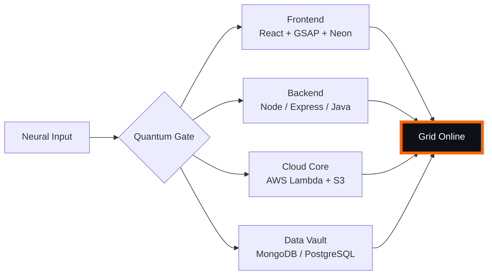

# 🌌 [ NEURAL CORE ACCESS: PENDEMVAMSI ]

<p align="center">
  
</p>

<div align="center">
  
  <br><small>Active Protocol: <strong style="color:#FF6600">CYBERPUNK 2077</strong> 🏙️🔥</small>
</div>

## 🔵 NEURAL STATUS READOUT
```text
SUBJECT ID    →  PENDEMVAMSI
ENTITY CLASS  →  SHADOW MONARCH v4
NEURAL RANK   →  undefined-TIER
GRID SYNC     →  432/642 QUANTUM PACKETS
─────── BIO-METRICS (CYBERPUNK 2077) ───────
STRENGTH      106  ██████████████░░░░░░░
AGILITY        99  █████████████░░░░░░░░
INTELLIGENCE  111  ██████████████░░░░░░░
VITALITY       93  ████████████░░░░░░░░░
```

> **NEURAL BURST ACQUIRED:** +143 QUANTUM PACKETS 
> **SYSTEM MESSAGE:** GRID OVERLOAD IMMINENT — PREPARE FOR ASCENSION

---

## 🌀 GRID ARCHITECTURE (HOLOGRAPHIC RENDER)



---

## 📡 ACADEMIC NODES – CONQUERED
- [x] B.Tech Neural Engineering (2020–2024) – St. Ann’s Grid
- [x] Intermediate Quantum Core (2018–2020) – Sri Medhavi
- [x] SSC Primary Link (2017–2018) – Sri Geethanjali

---

## ⚡ SKILL NEURAL MATRIX

<details open>
<summary>🔌 ACTIVE NEURAL LINKS</summary>

| Node               | Tier | Integrity Bar                | Status      |
|--------------------|------|------------------------------|-------------|
| Java Core          | S    | ████████████████████ 100%   | OVERCLOCKED |
| Node.js Grid       | S    | ████████████████████ 100%   | OVERCLOCKED |
| React Holo-UI      | A+   | █████████████████░░░ 92%    | ONLINE      |
| AWS Quantum Relay  | S    | ████████████████████ 100%   | SOVEREIGN   |
| Python AI Kernel   | A    | ████████████████░░░░ 85%    | CHARGING    |
| DSA Void Algorithm | A    | █████████████████░░░ 90%    | ACTIVE      |

</details>

---

## 🏅 NEURAL ACHIEVEMENT TOKENS

<p align="center">
  
  
  
  
</p>

---

## 👾 SHADOW ENTITIES – SUMMONED

<p align="center">
  
  <br><strong style="color:#FF6600">ARISE.</strong>
</p>

| Entity | Designation   | Class            | Source Node                     |
|--------|---------------|------------------|---------------------------------|
| SH-01  | Igris         | Void Commander   | AI Financial Oracle             |
| SH-02  | Beru          | Swarm Overlord   | WebRTC Quantum Stream           |
| SH-03  | Kaisel        | Void Wyrm        | Geolocation Shadow Relay        |
| SH-04  | Tusk          | Arcane Construct | Global Pandemic Sentinel        |
| SH-05  | Iron          | Armored Bastion  | React Crypto Fortress           |

---

## 📡 GRID ANALYTICS (LIVE FEED)

<p align="center">
  
  <br>
  
  
</p>

---

## 🖥️ CORRUPTED MAINFRAME LOG (401 ENTRIES)

<details>
<summary>OPEN TERMINAL FEED – PROTOCOL: CYBERPUNK 2077</summary>

> [0xC1A144E5] 🏙️🔥 **CYBERPUNK 2077 PROTOCOL** #0 | NEURAL LINK STABILIZED | [TRANSMISSION SUCCESS]
> [0x28F21E8C] 🏙️🔥 **CYBERPUNK 2077 PROTOCOL** #1 | NEURAL LINK STABILIZED | [TRANSMISSION SUCCESS]
> [0x5BD987FF] 🏙️🔥 **CYBERPUNK 2077 PROTOCOL** #2 | NEURAL LINK STABILIZED | [TRANSMISSION SUCCESS]
> [0x4DF3C807] 🏙️🔥 **CYBERPUNK 2077 PROTOCOL** #3 | NEURAL LINK STABILIZED | [TRANSMISSION SUCCESS]
> [0xF220C652] 🏙️🔥 **CYBERPUNK 2077 PROTOCOL** #4 | NEURAL LINK STABILIZED | [TRANSMISSION SUCCESS]
> [0x17141F92] 🏙️🔥 **CYBERPUNK 2077 PROTOCOL** #5 | NEURAL LINK STABILIZED | [TRANSMISSION SUCCESS]
> [0xA61B5D3C] 🏙️🔥 **CYBERPUNK 2077 PROTOCOL** #6 | NEURAL LINK  [GLITCH DETECTED] STABILIZED | [TRANSMISSION SUCCESS]
> [0xAF8C4FF0] 🏙️🔥 **CYBERPUNK 2077 PROTOCOL** #7 | NEURAL LINK STABILIZED | [TRANSMISSION SUCCESS]
> [0x7F99B790] 🏙️🔥 **CYBERPUNK 2077 PROTOCOL** #8 | NEURAL LINK STABILIZED | [TRANSMISSION SUCCESS]
> [0xCE30A940] 🏙️🔥 **CYBERPUNK 2077 PROTOCOL** #9 | NEURAL LINK STABILIZED | [TRANSMISSION SUCCESS]
> [0x4D9697E2] 🏙️🔥 **CYBERPUNK 2077 PROTOCOL** #10 | NEURAL LINK STABILIZED | [TRANSMISSION SUCCESS]
> [0xF6D08DF8] 🏙️🔥 **CYBERPUNK 2077 PROTOCOL** #11 | NEURAL LINK  [GLITCH DETECTED] STABILIZED | [TRANSMISSION SUCCESS]
> [0x6DF800FA] 🏙️🔥 **CYBERPUNK 2077 PROTOCOL** #12 | NEURAL LINK  [GLITCH DETECTED] STABILIZED | [TRANSMISSION SUCCESS]
> [0x6B4D8DC8] 🏙️🔥 **CYBERPUNK 2077 PROTOCOL** #13 | NEURAL LINK STABILIZED | [TRANSMISSION SUCCESS]
> [0x7C1AD260] 🏙️🔥 **CYBERPUNK 2077 PROTOCOL** #14 | NEURAL LINK STABILIZED | [TRANSMISSION SUCCESS]
> [0xBC4B0F30] 🏙️🔥 **CYBERPUNK 2077 PROTOCOL** #15 | NEURAL LINK  [GLITCH DETECTED] STABILIZED | [TRANSMISSION SUCCESS]
> [0xC44AC143] 🏙️🔥 **CYBERPUNK 2077 PROTOCOL** #16 | NEURAL LINK STABILIZED | [TRANSMISSION SUCCESS]
> [0xF5A20D2B] 🏙️🔥 **CYBERPUNK 2077 PROTOCOL** #17 | NEURAL LINK STABILIZED | [TRANSMISSION SUCCESS]
> [0xFA015191] 🏙️🔥 **CYBERPUNK 2077 PROTOCOL** #18 | NEURAL LINK STABILIZED | [TRANSMISSION SUCCESS]
> [0xFC50C667] 🏙️🔥 **CYBERPUNK 2077 PROTOCOL** #19 | NEURAL LINK STABILIZED | [TRANSMISSION SUCCESS]
> [0x4561CA1D] 🏙️🔥 **CYBERPUNK 2077 PROTOCOL** #20 | NEURAL LINK STABILIZED | [TRANSMISSION SUCCESS]
> [0x83C4023C] 🏙️🔥 **CYBERPUNK 2077 PROTOCOL** #21 | NEURAL LINK STABILIZED | [TRANSMISSION SUCCESS]
> [0x668E9E54] 🏙️🔥 **CYBERPUNK 2077 PROTOCOL** #22 | NEURAL LINK STABILIZED | [TRANSMISSION SUCCESS]
> [0x2C25F04A] 🏙️🔥 **CYBERPUNK 2077 PROTOCOL** #23 | NEURAL LINK  [GLITCH DETECTED] STABILIZED | [TRANSMISSION SUCCESS]
> [0x5809573B] 🏙️🔥 **CYBERPUNK 2077 PROTOCOL** #24 | NEURAL LINK STABILIZED | [TRANSMISSION SUCCESS]
> [0x4891D5B0] 🏙️🔥 **CYBERPUNK 2077 PROTOCOL** #25 | NEURAL LINK STABILIZED | [TRANSMISSION SUCCESS]
> [0x82362F61] 🏙️🔥 **CYBERPUNK 2077 PROTOCOL** #26 | NEURAL LINK STABILIZED | [TRANSMISSION SUCCESS]
> [0xA6C338E2] 🏙️🔥 **CYBERPUNK 2077 PROTOCOL** #27 | NEURAL LINK STABILIZED | [TRANSMISSION SUCCESS]
> [0x61D092AE] 🏙️🔥 **CYBERPUNK 2077 PROTOCOL** #28 | NEURAL LINK STABILIZED | [TRANSMISSION SUCCESS]
> [0xED704FA4] 🏙️🔥 **CYBERPUNK 2077 PROTOCOL** #29 | NEURAL LINK STABILIZED | [TRANSMISSION SUCCESS]
> [0x21492F6A] 🏙️🔥 **CYBERPUNK 2077 PROTOCOL** #30 | NEURAL LINK  [GLITCH DETECTED] STABILIZED | [TRANSMISSION SUCCESS]
> [0xCB9950BB] 🏙️🔥 **CYBERPUNK 2077 PROTOCOL** #31 | NEURAL LINK STABILIZED | [TRANSMISSION SUCCESS]
> [0x5BC8272E] 🏙️🔥 **CYBERPUNK 2077 PROTOCOL** #32 | NEURAL LINK STABILIZED | [TRANSMISSION SUCCESS]
> [0xD935F1D6] 🏙️🔥 **CYBERPUNK 2077 PROTOCOL** #33 | NEURAL LINK STABILIZED | [TRANSMISSION SUCCESS]
> [0xEEB716D1] 🏙️🔥 **CYBERPUNK 2077 PROTOCOL** #34 | NEURAL LINK STABILIZED | [TRANSMISSION SUCCESS]
> [0xAED99CA2] 🏙️🔥 **CYBERPUNK 2077 PROTOCOL** #35 | NEURAL LINK  [GLITCH DETECTED] STABILIZED | [TRANSMISSION SUCCESS]
> [0xB7E96DD1] 🏙️🔥 **CYBERPUNK 2077 PROTOCOL** #36 | NEURAL LINK STABILIZED | [TRANSMISSION SUCCESS]
> [0x2E5CAA7B] 🏙️🔥 **CYBERPUNK 2077 PROTOCOL** #37 | NEURAL LINK STABILIZED | [TRANSMISSION SUCCESS]
> [0xD32E9DD6] 🏙️🔥 **CYBERPUNK 2077 PROTOCOL** #38 | NEURAL LINK  [GLITCH DETECTED] STABILIZED | [TRANSMISSION SUCCESS]
> [0x921B915E] 🏙️🔥 **CYBERPUNK 2077 PROTOCOL** #39 | NEURAL LINK STABILIZED | [TRANSMISSION SUCCESS]
> [0x2E7A8BBF] 🏙️🔥 **CYBERPUNK 2077 PROTOCOL** #40 | NEURAL LINK STABILIZED | [TRANSMISSION SUCCESS]
> [0x1251D34A] 🏙️🔥 **CYBERPUNK 2077 PROTOCOL** #41 | NEURAL LINK STABILIZED | [TRANSMISSION SUCCESS]
> [0xF51A0F7C] 🏙️🔥 **CYBERPUNK 2077 PROTOCOL** #42 | NEURAL LINK STABILIZED | [TRANSMISSION SUCCESS]
> [0x7C9857B0] 🏙️🔥 **CYBERPUNK 2077 PROTOCOL** #43 | NEURAL LINK STABILIZED | [TRANSMISSION SUCCESS]
> [0x33814649] 🏙️🔥 **CYBERPUNK 2077 PROTOCOL** #44 | NEURAL LINK STABILIZED | [TRANSMISSION SUCCESS]
> [0xB49C052E] 🏙️🔥 **CYBERPUNK 2077 PROTOCOL** #45 | NEURAL LINK STABILIZED | [TRANSMISSION SUCCESS]
> [0xD0A6F06A] 🏙️🔥 **CYBERPUNK 2077 PROTOCOL** #46 | NEURAL LINK STABILIZED | [TRANSMISSION SUCCESS]
> [0xDE746A66] 🏙️🔥 **CYBERPUNK 2077 PROTOCOL** #47 | NEURAL LINK STABILIZED | [TRANSMISSION SUCCESS]
> [0x024B176C] 🏙️🔥 **CYBERPUNK 2077 PROTOCOL** #48 | NEURAL LINK  [GLITCH DETECTED] STABILIZED | [TRANSMISSION SUCCESS]
> [0xC7881A75] 🏙️🔥 **CYBERPUNK 2077 PROTOCOL** #49 | NEURAL LINK STABILIZED | [TRANSMISSION SUCCESS]
> [0xEB1E80D3] 🏙️🔥 **CYBERPUNK 2077 PROTOCOL** #50 | NEURAL LINK  [GLITCH DETECTED] STABILIZED | [TRANSMISSION SUCCESS]
> [0x3E448C5C] 🏙️🔥 **CYBERPUNK 2077 PROTOCOL** #51 | NEURAL LINK STABILIZED | [TRANSMISSION SUCCESS]
> [0x08E7C855] 🏙️🔥 **CYBERPUNK 2077 PROTOCOL** #52 | NEURAL LINK  [GLITCH DETECTED] STABILIZED | [TRANSMISSION SUCCESS]
> [0xD43E2A73] 🏙️🔥 **CYBERPUNK 2077 PROTOCOL** #53 | NEURAL LINK STABILIZED | [TRANSMISSION SUCCESS]
> [0x551D83D2] 🏙️🔥 **CYBERPUNK 2077 PROTOCOL** #54 | NEURAL LINK STABILIZED | [TRANSMISSION SUCCESS]
> [0x41879457] 🏙️🔥 **CYBERPUNK 2077 PROTOCOL** #55 | NEURAL LINK STABILIZED | [TRANSMISSION SUCCESS]
> [0xA0F4DAD2] 🏙️🔥 **CYBERPUNK 2077 PROTOCOL** #56 | NEURAL LINK  [GLITCH DETECTED] STABILIZED | [TRANSMISSION SUCCESS]
> [0xE50AB745] 🏙️🔥 **CYBERPUNK 2077 PROTOCOL** #57 | NEURAL LINK STABILIZED | [TRANSMISSION SUCCESS]
> [0xDF6729F4] 🏙️🔥 **CYBERPUNK 2077 PROTOCOL** #58 | NEURAL LINK STABILIZED | [TRANSMISSION SUCCESS]
> [0xB33DA651] 🏙️🔥 **CYBERPUNK 2077 PROTOCOL** #59 | NEURAL LINK STABILIZED | [TRANSMISSION SUCCESS]
> [0xBC81580C] 🏙️🔥 **CYBERPUNK 2077 PROTOCOL** #60 | NEURAL LINK STABILIZED | [TRANSMISSION SUCCESS]
> [0x3BD0298C] 🏙️🔥 **CYBERPUNK 2077 PROTOCOL** #61 | NEURAL LINK STABILIZED | [TRANSMISSION SUCCESS]
> [0x5D28A434] 🏙️🔥 **CYBERPUNK 2077 PROTOCOL** #62 | NEURAL LINK STABILIZED | [TRANSMISSION SUCCESS]
> [0xF85CA7A4] 🏙️🔥 **CYBERPUNK 2077 PROTOCOL** #63 | NEURAL LINK STABILIZED | [TRANSMISSION SUCCESS]
> [0x3C276829] 🏙️🔥 **CYBERPUNK 2077 PROTOCOL** #64 | NEURAL LINK STABILIZED | [TRANSMISSION SUCCESS]
> [0xC475AF9D] 🏙️🔥 **CYBERPUNK 2077 PROTOCOL** #65 | NEURAL LINK STABILIZED | [TRANSMISSION SUCCESS]
> [0x596F25A1] 🏙️🔥 **CYBERPUNK 2077 PROTOCOL** #66 | NEURAL LINK STABILIZED | [TRANSMISSION SUCCESS]
> [0x283E749B] 🏙️🔥 **CYBERPUNK 2077 PROTOCOL** #67 | NEURAL LINK STABILIZED | [TRANSMISSION SUCCESS]
> [0x3566C93B] 🏙️🔥 **CYBERPUNK 2077 PROTOCOL** #68 | NEURAL LINK STABILIZED | [TRANSMISSION SUCCESS]
> [0xE04A63F6] 🏙️🔥 **CYBERPUNK 2077 PROTOCOL** #69 | NEURAL LINK STABILIZED | [TRANSMISSION SUCCESS]
> [0x54089CCA] 🏙️🔥 **CYBERPUNK 2077 PROTOCOL** #70 | NEURAL LINK STABILIZED | [TRANSMISSION SUCCESS]
> [0xA9B2E7FB] 🏙️🔥 **CYBERPUNK 2077 PROTOCOL** #71 | NEURAL LINK STABILIZED | [TRANSMISSION SUCCESS]
> [0x23FAA912] 🏙️🔥 **CYBERPUNK 2077 PROTOCOL** #72 | NEURAL LINK STABILIZED | [TRANSMISSION SUCCESS]
> [0xED4FB72A] 🏙️🔥 **CYBERPUNK 2077 PROTOCOL** #73 | NEURAL LINK STABILIZED | [TRANSMISSION SUCCESS]
> [0x1E9BF963] 🏙️🔥 **CYBERPUNK 2077 PROTOCOL** #74 | NEURAL LINK STABILIZED | [TRANSMISSION SUCCESS]
> [0x2C157E12] 🏙️🔥 **CYBERPUNK 2077 PROTOCOL** #75 | NEURAL LINK STABILIZED | [TRANSMISSION SUCCESS]
> [0x6DBD8C7F] 🏙️🔥 **CYBERPUNK 2077 PROTOCOL** #76 | NEURAL LINK STABILIZED | [TRANSMISSION SUCCESS]
> [0x8DF865D3] 🏙️🔥 **CYBERPUNK 2077 PROTOCOL** #77 | NEURAL LINK  [GLITCH DETECTED] STABILIZED | [TRANSMISSION SUCCESS]
> [0x5FE34A41] 🏙️🔥 **CYBERPUNK 2077 PROTOCOL** #78 | NEURAL LINK STABILIZED | [TRANSMISSION SUCCESS]
> [0x01EC6428] 🏙️🔥 **CYBERPUNK 2077 PROTOCOL** #79 | NEURAL LINK STABILIZED | [TRANSMISSION SUCCESS]
> [0x339F8B73] 🏙️🔥 **CYBERPUNK 2077 PROTOCOL** #80 | NEURAL LINK STABILIZED | [TRANSMISSION SUCCESS]
> [0x6F4106DA] 🏙️🔥 **CYBERPUNK 2077 PROTOCOL** #81 | NEURAL LINK STABILIZED | [TRANSMISSION SUCCESS]
> [0xE0A61F8C] 🏙️🔥 **CYBERPUNK 2077 PROTOCOL** #82 | NEURAL LINK  [GLITCH DETECTED] STABILIZED | [TRANSMISSION SUCCESS]
> [0x32D6401B] 🏙️🔥 **CYBERPUNK 2077 PROTOCOL** #83 | NEURAL LINK STABILIZED | [TRANSMISSION SUCCESS]
> [0x79D577D2] 🏙️🔥 **CYBERPUNK 2077 PROTOCOL** #84 | NEURAL LINK  [GLITCH DETECTED] STABILIZED | [TRANSMISSION SUCCESS]
> [0xA275A263] 🏙️🔥 **CYBERPUNK 2077 PROTOCOL** #85 | NEURAL LINK STABILIZED | [TRANSMISSION SUCCESS]
> [0x0408BA5E] 🏙️🔥 **CYBERPUNK 2077 PROTOCOL** #86 | NEURAL LINK STABILIZED | [TRANSMISSION SUCCESS]
> [0xBCF4921B] 🏙️🔥 **CYBERPUNK 2077 PROTOCOL** #87 | NEURAL LINK STABILIZED | [TRANSMISSION SUCCESS]
> [0x7C3B39AA] 🏙️🔥 **CYBERPUNK 2077 PROTOCOL** #88 | NEURAL LINK  [GLITCH DETECTED] STABILIZED | [TRANSMISSION SUCCESS]
> [0xAACAB470] 🏙️🔥 **CYBERPUNK 2077 PROTOCOL** #89 | NEURAL LINK STABILIZED | [TRANSMISSION SUCCESS]
> [0x532DCCB6] 🏙️🔥 **CYBERPUNK 2077 PROTOCOL** #90 | NEURAL LINK STABILIZED | [TRANSMISSION SUCCESS]
> [0xE554F453] 🏙️🔥 **CYBERPUNK 2077 PROTOCOL** #91 | NEURAL LINK STABILIZED | [TRANSMISSION SUCCESS]
> [0x5530682C] 🏙️🔥 **CYBERPUNK 2077 PROTOCOL** #92 | NEURAL LINK STABILIZED | [TRANSMISSION SUCCESS]
> [0xC6DFBD01] 🏙️🔥 **CYBERPUNK 2077 PROTOCOL** #93 | NEURAL LINK STABILIZED | [TRANSMISSION SUCCESS]
> [0xBB6F0CA5] 🏙️🔥 **CYBERPUNK 2077 PROTOCOL** #94 | NEURAL LINK STABILIZED | [TRANSMISSION SUCCESS]
> [0x708DA546] 🏙️🔥 **CYBERPUNK 2077 PROTOCOL** #95 | NEURAL LINK STABILIZED | [TRANSMISSION SUCCESS]
> [0x439ACC8E] 🏙️🔥 **CYBERPUNK 2077 PROTOCOL** #96 | NEURAL LINK  [GLITCH DETECTED] STABILIZED | [TRANSMISSION SUCCESS]
> [0x9FC7AA52] 🏙️🔥 **CYBERPUNK 2077 PROTOCOL** #97 | NEURAL LINK STABILIZED | [TRANSMISSION SUCCESS]
> [0x6073E3C8] 🏙️🔥 **CYBERPUNK 2077 PROTOCOL** #98 | NEURAL LINK STABILIZED | [TRANSMISSION SUCCESS]
> [0x85831DBB] 🏙️🔥 **CYBERPUNK 2077 PROTOCOL** #99 | NEURAL LINK STABILIZED | [TRANSMISSION SUCCESS]
> [0xC2976EC2] 🏙️🔥 **CYBERPUNK 2077 PROTOCOL** #100 | NEURAL LINK STABILIZED | [TRANSMISSION SUCCESS]
> [0x090FB4D1] 🏙️🔥 **CYBERPUNK 2077 PROTOCOL** #101 | NEURAL LINK STABILIZED | [TRANSMISSION SUCCESS]
> [0xD957AED3] 🏙️🔥 **CYBERPUNK 2077 PROTOCOL** #102 | NEURAL LINK STABILIZED | [TRANSMISSION SUCCESS]
> [0x9893C614] 🏙️🔥 **CYBERPUNK 2077 PROTOCOL** #103 | NEURAL LINK  [GLITCH DETECTED] STABILIZED | [TRANSMISSION SUCCESS]
> [0xF197131F] 🏙️🔥 **CYBERPUNK 2077 PROTOCOL** #104 | NEURAL LINK STABILIZED | [TRANSMISSION SUCCESS]
> [0x4A13EC50] 🏙️🔥 **CYBERPUNK 2077 PROTOCOL** #105 | NEURAL LINK STABILIZED | [TRANSMISSION SUCCESS]
> [0xB8193B19] 🏙️🔥 **CYBERPUNK 2077 PROTOCOL** #106 | NEURAL LINK STABILIZED | [TRANSMISSION SUCCESS]
> [0x9126D22A] 🏙️🔥 **CYBERPUNK 2077 PROTOCOL** #107 | NEURAL LINK STABILIZED | [TRANSMISSION SUCCESS]
> [0x4F1A0B16] 🏙️🔥 **CYBERPUNK 2077 PROTOCOL** #108 | NEURAL LINK STABILIZED | [TRANSMISSION SUCCESS]
> [0x06AB8A71] 🏙️🔥 **CYBERPUNK 2077 PROTOCOL** #109 | NEURAL LINK STABILIZED | [TRANSMISSION SUCCESS]
> [0x6C8B2019] 🏙️🔥 **CYBERPUNK 2077 PROTOCOL** #110 | NEURAL LINK STABILIZED | [TRANSMISSION SUCCESS]
> [0xF826DE84] 🏙️🔥 **CYBERPUNK 2077 PROTOCOL** #111 | NEURAL LINK STABILIZED | [TRANSMISSION SUCCESS]
> [0xBBA993FD] 🏙️🔥 **CYBERPUNK 2077 PROTOCOL** #112 | NEURAL LINK  [GLITCH DETECTED] STABILIZED | [TRANSMISSION SUCCESS]
> [0x5E6A3A27] 🏙️🔥 **CYBERPUNK 2077 PROTOCOL** #113 | NEURAL LINK STABILIZED | [TRANSMISSION SUCCESS]
> [0xC2BFD64D] 🏙️🔥 **CYBERPUNK 2077 PROTOCOL** #114 | NEURAL LINK  [GLITCH DETECTED] STABILIZED | [TRANSMISSION SUCCESS]
> [0xA348BF1B] 🏙️🔥 **CYBERPUNK 2077 PROTOCOL** #115 | NEURAL LINK STABILIZED | [TRANSMISSION SUCCESS]
> [0x5761BCAE] 🏙️🔥 **CYBERPUNK 2077 PROTOCOL** #116 | NEURAL LINK STABILIZED | [TRANSMISSION SUCCESS]
> [0x80AD31E4] 🏙️🔥 **CYBERPUNK 2077 PROTOCOL** #117 | NEURAL LINK STABILIZED | [TRANSMISSION SUCCESS]
> [0xEFB5D5FE] 🏙️🔥 **CYBERPUNK 2077 PROTOCOL** #118 | NEURAL LINK  [GLITCH DETECTED] STABILIZED | [TRANSMISSION SUCCESS]
> [0xE31A5DF6] 🏙️🔥 **CYBERPUNK 2077 PROTOCOL** #119 | NEURAL LINK STABILIZED | [TRANSMISSION SUCCESS]
> [0xA2DC938E] 🏙️🔥 **CYBERPUNK 2077 PROTOCOL** #120 | NEURAL LINK  [GLITCH DETECTED] STABILIZED | [TRANSMISSION SUCCESS]
> [0x97F30B87] 🏙️🔥 **CYBERPUNK 2077 PROTOCOL** #121 | NEURAL LINK STABILIZED | [TRANSMISSION SUCCESS]
> [0xC6C6D18B] 🏙️🔥 **CYBERPUNK 2077 PROTOCOL** #122 | NEURAL LINK STABILIZED | [TRANSMISSION SUCCESS]
> [0xA2F606C8] 🏙️🔥 **CYBERPUNK 2077 PROTOCOL** #123 | NEURAL LINK STABILIZED | [TRANSMISSION SUCCESS]
> [0x544E4A5C] 🏙️🔥 **CYBERPUNK 2077 PROTOCOL** #124 | NEURAL LINK STABILIZED | [TRANSMISSION SUCCESS]
> [0x84685A3A] 🏙️🔥 **CYBERPUNK 2077 PROTOCOL** #125 | NEURAL LINK STABILIZED | [TRANSMISSION SUCCESS]
> [0x7D250F24] 🏙️🔥 **CYBERPUNK 2077 PROTOCOL** #126 | NEURAL LINK STABILIZED | [TRANSMISSION SUCCESS]
> [0xC954DB83] 🏙️🔥 **CYBERPUNK 2077 PROTOCOL** #127 | NEURAL LINK STABILIZED | [TRANSMISSION SUCCESS]
> [0x3F859BBF] 🏙️🔥 **CYBERPUNK 2077 PROTOCOL** #128 | NEURAL LINK STABILIZED | [TRANSMISSION SUCCESS]
> [0xCBD8ABBD] 🏙️🔥 **CYBERPUNK 2077 PROTOCOL** #129 | NEURAL LINK STABILIZED | [TRANSMISSION SUCCESS]
> [0x575D4D09] 🏙️🔥 **CYBERPUNK 2077 PROTOCOL** #130 | NEURAL LINK STABILIZED | [TRANSMISSION SUCCESS]
> [0xB2AC43CC] 🏙️🔥 **CYBERPUNK 2077 PROTOCOL** #131 | NEURAL LINK  [GLITCH DETECTED] STABILIZED | [TRANSMISSION SUCCESS]
> [0xAB5BEDF3] 🏙️🔥 **CYBERPUNK 2077 PROTOCOL** #132 | NEURAL LINK STABILIZED | [TRANSMISSION SUCCESS]
> [0x688E349B] 🏙️🔥 **CYBERPUNK 2077 PROTOCOL** #133 | NEURAL LINK STABILIZED | [TRANSMISSION SUCCESS]
> [0xEBF5BC23] 🏙️🔥 **CYBERPUNK 2077 PROTOCOL** #134 | NEURAL LINK STABILIZED | [TRANSMISSION SUCCESS]
> [0x847DAA2C] 🏙️🔥 **CYBERPUNK 2077 PROTOCOL** #135 | NEURAL LINK STABILIZED | [TRANSMISSION SUCCESS]
> [0x25BCEBD5] 🏙️🔥 **CYBERPUNK 2077 PROTOCOL** #136 | NEURAL LINK STABILIZED | [TRANSMISSION SUCCESS]
> [0xA2EF3FEE] 🏙️🔥 **CYBERPUNK 2077 PROTOCOL** #137 | NEURAL LINK STABILIZED | [TRANSMISSION SUCCESS]
> [0xC3B174FC] 🏙️🔥 **CYBERPUNK 2077 PROTOCOL** #138 | NEURAL LINK STABILIZED | [TRANSMISSION SUCCESS]
> [0xF28EAF7B] 🏙️🔥 **CYBERPUNK 2077 PROTOCOL** #139 | NEURAL LINK STABILIZED | [TRANSMISSION SUCCESS]
> [0xA72693E6] 🏙️🔥 **CYBERPUNK 2077 PROTOCOL** #140 | NEURAL LINK STABILIZED | [TRANSMISSION SUCCESS]
> [0xCD25B8B1] 🏙️🔥 **CYBERPUNK 2077 PROTOCOL** #141 | NEURAL LINK STABILIZED | [TRANSMISSION SUCCESS]
> [0x73F291FA] 🏙️🔥 **CYBERPUNK 2077 PROTOCOL** #142 | NEURAL LINK  [GLITCH DETECTED] STABILIZED | [TRANSMISSION SUCCESS]
> [0xD32170F8] 🏙️🔥 **CYBERPUNK 2077 PROTOCOL** #143 | NEURAL LINK STABILIZED | [TRANSMISSION SUCCESS]
> [0x8DCA87B3] 🏙️🔥 **CYBERPUNK 2077 PROTOCOL** #144 | NEURAL LINK STABILIZED | [TRANSMISSION SUCCESS]
> [0xDEA4F865] 🏙️🔥 **CYBERPUNK 2077 PROTOCOL** #145 | NEURAL LINK STABILIZED | [TRANSMISSION SUCCESS]
> [0x4F163DD2] 🏙️🔥 **CYBERPUNK 2077 PROTOCOL** #146 | NEURAL LINK STABILIZED | [TRANSMISSION SUCCESS]
> [0xB640D9A1] 🏙️🔥 **CYBERPUNK 2077 PROTOCOL** #147 | NEURAL LINK  [GLITCH DETECTED] STABILIZED | [TRANSMISSION SUCCESS]
> [0x55A81E33] 🏙️🔥 **CYBERPUNK 2077 PROTOCOL** #148 | NEURAL LINK STABILIZED | [TRANSMISSION SUCCESS]
> [0xAC1725B6] 🏙️🔥 **CYBERPUNK 2077 PROTOCOL** #149 | NEURAL LINK STABILIZED | [TRANSMISSION SUCCESS]
> [0x877951FB] 🏙️🔥 **CYBERPUNK 2077 PROTOCOL** #150 | NEURAL LINK STABILIZED | [TRANSMISSION SUCCESS]
> [0x15045F40] 🏙️🔥 **CYBERPUNK 2077 PROTOCOL** #151 | NEURAL LINK STABILIZED | [TRANSMISSION SUCCESS]
> [0xA3C068C6] 🏙️🔥 **CYBERPUNK 2077 PROTOCOL** #152 | NEURAL LINK STABILIZED | [TRANSMISSION SUCCESS]
> [0x5ADA8921] 🏙️🔥 **CYBERPUNK 2077 PROTOCOL** #153 | NEURAL LINK STABILIZED | [TRANSMISSION SUCCESS]
> [0xD815E1BB] 🏙️🔥 **CYBERPUNK 2077 PROTOCOL** #154 | NEURAL LINK  [GLITCH DETECTED] STABILIZED | [TRANSMISSION SUCCESS]
> [0x4F3588F4] 🏙️🔥 **CYBERPUNK 2077 PROTOCOL** #155 | NEURAL LINK STABILIZED | [TRANSMISSION SUCCESS]
> [0xFDB89124] 🏙️🔥 **CYBERPUNK 2077 PROTOCOL** #156 | NEURAL LINK STABILIZED | [TRANSMISSION SUCCESS]
> [0x8BDD72DB] 🏙️🔥 **CYBERPUNK 2077 PROTOCOL** #157 | NEURAL LINK STABILIZED | [TRANSMISSION SUCCESS]
> [0xEEBD226C] 🏙️🔥 **CYBERPUNK 2077 PROTOCOL** #158 | NEURAL LINK STABILIZED | [TRANSMISSION SUCCESS]
> [0xE489B0AA] 🏙️🔥 **CYBERPUNK 2077 PROTOCOL** #159 | NEURAL LINK STABILIZED | [TRANSMISSION SUCCESS]
> [0xB06A40A0] 🏙️🔥 **CYBERPUNK 2077 PROTOCOL** #160 | NEURAL LINK STABILIZED | [TRANSMISSION SUCCESS]
> [0xDAD7E08B] 🏙️🔥 **CYBERPUNK 2077 PROTOCOL** #161 | NEURAL LINK STABILIZED | [TRANSMISSION SUCCESS]
> [0x3259B13D] 🏙️🔥 **CYBERPUNK 2077 PROTOCOL** #162 | NEURAL LINK STABILIZED | [TRANSMISSION SUCCESS]
> [0x12B0E56F] 🏙️🔥 **CYBERPUNK 2077 PROTOCOL** #163 | NEURAL LINK STABILIZED | [TRANSMISSION SUCCESS]
> [0x627581A2] 🏙️🔥 **CYBERPUNK 2077 PROTOCOL** #164 | NEURAL LINK STABILIZED | [TRANSMISSION SUCCESS]
> [0x94A8B1A1] 🏙️🔥 **CYBERPUNK 2077 PROTOCOL** #165 | NEURAL LINK STABILIZED | [TRANSMISSION SUCCESS]
> [0xA692A86F] 🏙️🔥 **CYBERPUNK 2077 PROTOCOL** #166 | NEURAL LINK STABILIZED | [TRANSMISSION SUCCESS]
> [0x24493E9D] 🏙️🔥 **CYBERPUNK 2077 PROTOCOL** #167 | NEURAL LINK STABILIZED | [TRANSMISSION SUCCESS]
> [0xE79CF2CA] 🏙️🔥 **CYBERPUNK 2077 PROTOCOL** #168 | NEURAL LINK STABILIZED | [TRANSMISSION SUCCESS]
> [0x6C811504] 🏙️🔥 **CYBERPUNK 2077 PROTOCOL** #169 | NEURAL LINK  [GLITCH DETECTED] STABILIZED | [TRANSMISSION SUCCESS]
> [0x8E14E035] 🏙️🔥 **CYBERPUNK 2077 PROTOCOL** #170 | NEURAL LINK STABILIZED | [TRANSMISSION SUCCESS]
> [0xE4A1427D] 🏙️🔥 **CYBERPUNK 2077 PROTOCOL** #171 | NEURAL LINK STABILIZED | [TRANSMISSION SUCCESS]
> [0x64DA0872] 🏙️🔥 **CYBERPUNK 2077 PROTOCOL** #172 | NEURAL LINK STABILIZED | [TRANSMISSION SUCCESS]
> [0xCBA965F8] 🏙️🔥 **CYBERPUNK 2077 PROTOCOL** #173 | NEURAL LINK  [GLITCH DETECTED] STABILIZED | [TRANSMISSION SUCCESS]
> [0x037F8A79] 🏙️🔥 **CYBERPUNK 2077 PROTOCOL** #174 | NEURAL LINK STABILIZED | [TRANSMISSION SUCCESS]
> [0x463113F4] 🏙️🔥 **CYBERPUNK 2077 PROTOCOL** #175 | NEURAL LINK STABILIZED | [TRANSMISSION SUCCESS]
> [0xAA4D20CF] 🏙️🔥 **CYBERPUNK 2077 PROTOCOL** #176 | NEURAL LINK STABILIZED | [TRANSMISSION SUCCESS]
> [0xBDDEF82A] 🏙️🔥 **CYBERPUNK 2077 PROTOCOL** #177 | NEURAL LINK STABILIZED | [TRANSMISSION SUCCESS]
> [0x5B1DFD59] 🏙️🔥 **CYBERPUNK 2077 PROTOCOL** #178 | NEURAL LINK STABILIZED | [TRANSMISSION SUCCESS]
> [0xC6C9B2B0] 🏙️🔥 **CYBERPUNK 2077 PROTOCOL** #179 | NEURAL LINK STABILIZED | [TRANSMISSION SUCCESS]
> [0xF1A60C5E] 🏙️🔥 **CYBERPUNK 2077 PROTOCOL** #180 | NEURAL LINK STABILIZED | [TRANSMISSION SUCCESS]
> [0x7932B088] 🏙️🔥 **CYBERPUNK 2077 PROTOCOL** #181 | NEURAL LINK STABILIZED | [TRANSMISSION SUCCESS]
> [0x28FE7BD1] 🏙️🔥 **CYBERPUNK 2077 PROTOCOL** #182 | NEURAL LINK  [GLITCH DETECTED] STABILIZED | [TRANSMISSION SUCCESS]
> [0xBD91C69B] 🏙️🔥 **CYBERPUNK 2077 PROTOCOL** #183 | NEURAL LINK  [GLITCH DETECTED] STABILIZED | [TRANSMISSION SUCCESS]
> [0x8C26B5B6] 🏙️🔥 **CYBERPUNK 2077 PROTOCOL** #184 | NEURAL LINK STABILIZED | [TRANSMISSION SUCCESS]
> [0x2D3E8078] 🏙️🔥 **CYBERPUNK 2077 PROTOCOL** #185 | NEURAL LINK STABILIZED | [TRANSMISSION SUCCESS]
> [0x92C3C0EB] 🏙️🔥 **CYBERPUNK 2077 PROTOCOL** #186 | NEURAL LINK STABILIZED | [TRANSMISSION SUCCESS]
> [0xCCD5D4C6] 🏙️🔥 **CYBERPUNK 2077 PROTOCOL** #187 | NEURAL LINK STABILIZED | [TRANSMISSION SUCCESS]
> [0xBC979C79] 🏙️🔥 **CYBERPUNK 2077 PROTOCOL** #188 | NEURAL LINK  [GLITCH DETECTED] STABILIZED | [TRANSMISSION SUCCESS]
> [0x86996FA5] 🏙️🔥 **CYBERPUNK 2077 PROTOCOL** #189 | NEURAL LINK STABILIZED | [TRANSMISSION SUCCESS]
> [0xE0BA74F9] 🏙️🔥 **CYBERPUNK 2077 PROTOCOL** #190 | NEURAL LINK  [GLITCH DETECTED] STABILIZED | [TRANSMISSION SUCCESS]
> [0xC3E80509] 🏙️🔥 **CYBERPUNK 2077 PROTOCOL** #191 | NEURAL LINK  [GLITCH DETECTED] STABILIZED | [TRANSMISSION SUCCESS]
> [0x90873D49] 🏙️🔥 **CYBERPUNK 2077 PROTOCOL** #192 | NEURAL LINK STABILIZED | [TRANSMISSION SUCCESS]
> [0xE8C898D7] 🏙️🔥 **CYBERPUNK 2077 PROTOCOL** #193 | NEURAL LINK STABILIZED | [TRANSMISSION SUCCESS]
> [0x2CEC8C26] 🏙️🔥 **CYBERPUNK 2077 PROTOCOL** #194 | NEURAL LINK STABILIZED | [TRANSMISSION SUCCESS]
> [0x773C13AF] 🏙️🔥 **CYBERPUNK 2077 PROTOCOL** #195 | NEURAL LINK STABILIZED | [TRANSMISSION SUCCESS]
> [0xC1471633] 🏙️🔥 **CYBERPUNK 2077 PROTOCOL** #196 | NEURAL LINK STABILIZED | [TRANSMISSION SUCCESS]
> [0xBE76ACBF] 🏙️🔥 **CYBERPUNK 2077 PROTOCOL** #197 | NEURAL LINK STABILIZED | [TRANSMISSION SUCCESS]
> [0x40FFA8CA] 🏙️🔥 **CYBERPUNK 2077 PROTOCOL** #198 | NEURAL LINK STABILIZED | [TRANSMISSION SUCCESS]
> [0x31CC425A] 🏙️🔥 **CYBERPUNK 2077 PROTOCOL** #199 | NEURAL LINK STABILIZED | [TRANSMISSION SUCCESS]
> [0x6C1604EF] 🏙️🔥 **CYBERPUNK 2077 PROTOCOL** #200 | NEURAL LINK STABILIZED | [TRANSMISSION SUCCESS]
> [0x9A5B86F2] 🏙️🔥 **CYBERPUNK 2077 PROTOCOL** #201 | NEURAL LINK STABILIZED | [TRANSMISSION SUCCESS]
> [0x120F5005] 🏙️🔥 **CYBERPUNK 2077 PROTOCOL** #202 | NEURAL LINK STABILIZED | [TRANSMISSION SUCCESS]
> [0xAAAF61AE] 🏙️🔥 **CYBERPUNK 2077 PROTOCOL** #203 | NEURAL LINK STABILIZED | [TRANSMISSION SUCCESS]
> [0x034C324A] 🏙️🔥 **CYBERPUNK 2077 PROTOCOL** #204 | NEURAL LINK STABILIZED | [TRANSMISSION SUCCESS]
> [0x5E9EB1A3] 🏙️🔥 **CYBERPUNK 2077 PROTOCOL** #205 | NEURAL LINK STABILIZED | [TRANSMISSION SUCCESS]
> [0xFC758C48] 🏙️🔥 **CYBERPUNK 2077 PROTOCOL** #206 | NEURAL LINK STABILIZED | [TRANSMISSION SUCCESS]
> [0x3632FFE1] 🏙️🔥 **CYBERPUNK 2077 PROTOCOL** #207 | NEURAL LINK STABILIZED | [TRANSMISSION SUCCESS]
> [0x67D991EF] 🏙️🔥 **CYBERPUNK 2077 PROTOCOL** #208 | NEURAL LINK STABILIZED | [TRANSMISSION SUCCESS]
> [0x02314C4E] 🏙️🔥 **CYBERPUNK 2077 PROTOCOL** #209 | NEURAL LINK STABILIZED | [TRANSMISSION SUCCESS]
> [0x641EE951] 🏙️🔥 **CYBERPUNK 2077 PROTOCOL** #210 | NEURAL LINK STABILIZED | [TRANSMISSION SUCCESS]
> [0x03F6C3EF] 🏙️🔥 **CYBERPUNK 2077 PROTOCOL** #211 | NEURAL LINK STABILIZED | [TRANSMISSION SUCCESS]
> [0x17E157AE] 🏙️🔥 **CYBERPUNK 2077 PROTOCOL** #212 | NEURAL LINK STABILIZED | [TRANSMISSION SUCCESS]
> [0xFDE30ECB] 🏙️🔥 **CYBERPUNK 2077 PROTOCOL** #213 | NEURAL LINK STABILIZED | [TRANSMISSION SUCCESS]
> [0x94833BF6] 🏙️🔥 **CYBERPUNK 2077 PROTOCOL** #214 | NEURAL LINK STABILIZED | [TRANSMISSION SUCCESS]
> [0x1BAC845A] 🏙️🔥 **CYBERPUNK 2077 PROTOCOL** #215 | NEURAL LINK STABILIZED | [TRANSMISSION SUCCESS]
> [0x29951759] 🏙️🔥 **CYBERPUNK 2077 PROTOCOL** #216 | NEURAL LINK STABILIZED | [TRANSMISSION SUCCESS]
> [0xF7834A9F] 🏙️🔥 **CYBERPUNK 2077 PROTOCOL** #217 | NEURAL LINK STABILIZED | [TRANSMISSION SUCCESS]
> [0x8AFF078F] 🏙️🔥 **CYBERPUNK 2077 PROTOCOL** #218 | NEURAL LINK STABILIZED | [TRANSMISSION SUCCESS]
> [0x7809624E] 🏙️🔥 **CYBERPUNK 2077 PROTOCOL** #219 | NEURAL LINK STABILIZED | [TRANSMISSION SUCCESS]
> [0xBC639929] 🏙️🔥 **CYBERPUNK 2077 PROTOCOL** #220 | NEURAL LINK STABILIZED | [TRANSMISSION SUCCESS]
> [0x86A57FF5] 🏙️🔥 **CYBERPUNK 2077 PROTOCOL** #221 | NEURAL LINK  [GLITCH DETECTED] STABILIZED | [TRANSMISSION SUCCESS]
> [0x213FD698] 🏙️🔥 **CYBERPUNK 2077 PROTOCOL** #222 | NEURAL LINK STABILIZED | [TRANSMISSION SUCCESS]
> [0xB297BDE3] 🏙️🔥 **CYBERPUNK 2077 PROTOCOL** #223 | NEURAL LINK STABILIZED | [TRANSMISSION SUCCESS]
> [0xF823A80A] 🏙️🔥 **CYBERPUNK 2077 PROTOCOL** #224 | NEURAL LINK STABILIZED | [TRANSMISSION SUCCESS]
> [0xBFF6B028] 🏙️🔥 **CYBERPUNK 2077 PROTOCOL** #225 | NEURAL LINK STABILIZED | [TRANSMISSION SUCCESS]
> [0x8DD4A248] 🏙️🔥 **CYBERPUNK 2077 PROTOCOL** #226 | NEURAL LINK STABILIZED | [TRANSMISSION SUCCESS]
> [0x14169420] 🏙️🔥 **CYBERPUNK 2077 PROTOCOL** #227 | NEURAL LINK STABILIZED | [TRANSMISSION SUCCESS]
> [0x163396FF] 🏙️🔥 **CYBERPUNK 2077 PROTOCOL** #228 | NEURAL LINK STABILIZED | [TRANSMISSION SUCCESS]
> [0x974EA138] 🏙️🔥 **CYBERPUNK 2077 PROTOCOL** #229 | NEURAL LINK STABILIZED | [TRANSMISSION SUCCESS]
> [0xEEB84DE6] 🏙️🔥 **CYBERPUNK 2077 PROTOCOL** #230 | NEURAL LINK STABILIZED | [TRANSMISSION SUCCESS]
> [0xF0C4892B] 🏙️🔥 **CYBERPUNK 2077 PROTOCOL** #231 | NEURAL LINK STABILIZED | [TRANSMISSION SUCCESS]
> [0xC68D0B1F] 🏙️🔥 **CYBERPUNK 2077 PROTOCOL** #232 | NEURAL LINK  [GLITCH DETECTED] STABILIZED | [TRANSMISSION SUCCESS]
> [0xEC0AB3A0] 🏙️🔥 **CYBERPUNK 2077 PROTOCOL** #233 | NEURAL LINK STABILIZED | [TRANSMISSION SUCCESS]
> [0x69EE5C56] 🏙️🔥 **CYBERPUNK 2077 PROTOCOL** #234 | NEURAL LINK STABILIZED | [TRANSMISSION SUCCESS]
> [0xA3DA5BA5] 🏙️🔥 **CYBERPUNK 2077 PROTOCOL** #235 | NEURAL LINK  [GLITCH DETECTED] STABILIZED | [TRANSMISSION SUCCESS]
> [0x59E02222] 🏙️🔥 **CYBERPUNK 2077 PROTOCOL** #236 | NEURAL LINK STABILIZED | [TRANSMISSION SUCCESS]
> [0xD46CC494] 🏙️🔥 **CYBERPUNK 2077 PROTOCOL** #237 | NEURAL LINK STABILIZED | [TRANSMISSION SUCCESS]
> [0xCD8A1C2E] 🏙️🔥 **CYBERPUNK 2077 PROTOCOL** #238 | NEURAL LINK STABILIZED | [TRANSMISSION SUCCESS]
> [0xCDA99CA3] 🏙️🔥 **CYBERPUNK 2077 PROTOCOL** #239 | NEURAL LINK STABILIZED | [TRANSMISSION SUCCESS]
> [0x677AE9A4] 🏙️🔥 **CYBERPUNK 2077 PROTOCOL** #240 | NEURAL LINK STABILIZED | [TRANSMISSION SUCCESS]
> [0x30552085] 🏙️🔥 **CYBERPUNK 2077 PROTOCOL** #241 | NEURAL LINK STABILIZED | [TRANSMISSION SUCCESS]
> [0xBD6A2AA9] 🏙️🔥 **CYBERPUNK 2077 PROTOCOL** #242 | NEURAL LINK STABILIZED | [TRANSMISSION SUCCESS]
> [0x1501F2C2] 🏙️🔥 **CYBERPUNK 2077 PROTOCOL** #243 | NEURAL LINK STABILIZED | [TRANSMISSION SUCCESS]
> [0x0D48E075] 🏙️🔥 **CYBERPUNK 2077 PROTOCOL** #244 | NEURAL LINK STABILIZED | [TRANSMISSION SUCCESS]
> [0xA94177B1] 🏙️🔥 **CYBERPUNK 2077 PROTOCOL** #245 | NEURAL LINK STABILIZED | [TRANSMISSION SUCCESS]
> [0x7168FCA7] 🏙️🔥 **CYBERPUNK 2077 PROTOCOL** #246 | NEURAL LINK STABILIZED | [TRANSMISSION SUCCESS]
> [0x19AE900B] 🏙️🔥 **CYBERPUNK 2077 PROTOCOL** #247 | NEURAL LINK STABILIZED | [TRANSMISSION SUCCESS]
> [0x4A0E21C0] 🏙️🔥 **CYBERPUNK 2077 PROTOCOL** #248 | NEURAL LINK STABILIZED | [TRANSMISSION SUCCESS]
> [0x3A382A10] 🏙️🔥 **CYBERPUNK 2077 PROTOCOL** #249 | NEURAL LINK STABILIZED | [TRANSMISSION SUCCESS]
> [0x26891ACD] 🏙️🔥 **CYBERPUNK 2077 PROTOCOL** #250 | NEURAL LINK STABILIZED | [TRANSMISSION SUCCESS]
> [0xEF9F7432] 🏙️🔥 **CYBERPUNK 2077 PROTOCOL** #251 | NEURAL LINK STABILIZED | [TRANSMISSION SUCCESS]
> [0x98310F63] 🏙️🔥 **CYBERPUNK 2077 PROTOCOL** #252 | NEURAL LINK STABILIZED | [TRANSMISSION SUCCESS]
> [0x6FEAA5B1] 🏙️🔥 **CYBERPUNK 2077 PROTOCOL** #253 | NEURAL LINK STABILIZED | [TRANSMISSION SUCCESS]
> [0x5950E8EC] 🏙️🔥 **CYBERPUNK 2077 PROTOCOL** #254 | NEURAL LINK STABILIZED | [TRANSMISSION SUCCESS]
> [0xEF1CE501] 🏙️🔥 **CYBERPUNK 2077 PROTOCOL** #255 | NEURAL LINK STABILIZED | [TRANSMISSION SUCCESS]
> [0x3DA10D64] 🏙️🔥 **CYBERPUNK 2077 PROTOCOL** #256 | NEURAL LINK  [GLITCH DETECTED] STABILIZED | [TRANSMISSION SUCCESS]
> [0xDD34F02F] 🏙️🔥 **CYBERPUNK 2077 PROTOCOL** #257 | NEURAL LINK STABILIZED | [TRANSMISSION SUCCESS]
> [0x573E928B] 🏙️🔥 **CYBERPUNK 2077 PROTOCOL** #258 | NEURAL LINK STABILIZED | [TRANSMISSION SUCCESS]
> [0xB03A22B3] 🏙️🔥 **CYBERPUNK 2077 PROTOCOL** #259 | NEURAL LINK STABILIZED | [TRANSMISSION SUCCESS]
> [0xAA8F9D31] 🏙️🔥 **CYBERPUNK 2077 PROTOCOL** #260 | NEURAL LINK STABILIZED | [TRANSMISSION SUCCESS]
> [0xC448CE2E] 🏙️🔥 **CYBERPUNK 2077 PROTOCOL** #261 | NEURAL LINK STABILIZED | [TRANSMISSION SUCCESS]
> [0x84AD2A54] 🏙️🔥 **CYBERPUNK 2077 PROTOCOL** #262 | NEURAL LINK STABILIZED | [TRANSMISSION SUCCESS]
> [0x45AF46CE] 🏙️🔥 **CYBERPUNK 2077 PROTOCOL** #263 | NEURAL LINK STABILIZED | [TRANSMISSION SUCCESS]
> [0xB24D45DC] 🏙️🔥 **CYBERPUNK 2077 PROTOCOL** #264 | NEURAL LINK STABILIZED | [TRANSMISSION SUCCESS]
> [0xF44CCCC0] 🏙️🔥 **CYBERPUNK 2077 PROTOCOL** #265 | NEURAL LINK STABILIZED | [TRANSMISSION SUCCESS]
> [0x1E2B2990] 🏙️🔥 **CYBERPUNK 2077 PROTOCOL** #266 | NEURAL LINK STABILIZED | [TRANSMISSION SUCCESS]
> [0x56B1A520] 🏙️🔥 **CYBERPUNK 2077 PROTOCOL** #267 | NEURAL LINK STABILIZED | [TRANSMISSION SUCCESS]
> [0xE3BF3D5E] 🏙️🔥 **CYBERPUNK 2077 PROTOCOL** #268 | NEURAL LINK  [GLITCH DETECTED] STABILIZED | [TRANSMISSION SUCCESS]
> [0x12FF3014] 🏙️🔥 **CYBERPUNK 2077 PROTOCOL** #269 | NEURAL LINK STABILIZED | [TRANSMISSION SUCCESS]
> [0xD342FCC2] 🏙️🔥 **CYBERPUNK 2077 PROTOCOL** #270 | NEURAL LINK STABILIZED | [TRANSMISSION SUCCESS]
> [0x258F7495] 🏙️🔥 **CYBERPUNK 2077 PROTOCOL** #271 | NEURAL LINK STABILIZED | [TRANSMISSION SUCCESS]
> [0x20086F51] 🏙️🔥 **CYBERPUNK 2077 PROTOCOL** #272 | NEURAL LINK STABILIZED | [TRANSMISSION SUCCESS]
> [0x8A31ECC9] 🏙️🔥 **CYBERPUNK 2077 PROTOCOL** #273 | NEURAL LINK STABILIZED | [TRANSMISSION SUCCESS]
> [0xA2DE2B0E] 🏙️🔥 **CYBERPUNK 2077 PROTOCOL** #274 | NEURAL LINK STABILIZED | [TRANSMISSION SUCCESS]
> [0x12261ED0] 🏙️🔥 **CYBERPUNK 2077 PROTOCOL** #275 | NEURAL LINK STABILIZED | [TRANSMISSION SUCCESS]
> [0xC4C68DB3] 🏙️🔥 **CYBERPUNK 2077 PROTOCOL** #276 | NEURAL LINK STABILIZED | [TRANSMISSION SUCCESS]
> [0xEED8D295] 🏙️🔥 **CYBERPUNK 2077 PROTOCOL** #277 | NEURAL LINK STABILIZED | [TRANSMISSION SUCCESS]
> [0xFA9F626C] 🏙️🔥 **CYBERPUNK 2077 PROTOCOL** #278 | NEURAL LINK STABILIZED | [TRANSMISSION SUCCESS]
> [0x4086F4F6] 🏙️🔥 **CYBERPUNK 2077 PROTOCOL** #279 | NEURAL LINK STABILIZED | [TRANSMISSION SUCCESS]
> [0xBA823FB3] 🏙️🔥 **CYBERPUNK 2077 PROTOCOL** #280 | NEURAL LINK STABILIZED | [TRANSMISSION SUCCESS]
> [0x05CE27AF] 🏙️🔥 **CYBERPUNK 2077 PROTOCOL** #281 | NEURAL LINK STABILIZED | [TRANSMISSION SUCCESS]
> [0xFE8A44B8] 🏙️🔥 **CYBERPUNK 2077 PROTOCOL** #282 | NEURAL LINK  [GLITCH DETECTED] STABILIZED | [TRANSMISSION SUCCESS]
> [0x7064E0A8] 🏙️🔥 **CYBERPUNK 2077 PROTOCOL** #283 | NEURAL LINK STABILIZED | [TRANSMISSION SUCCESS]
> [0x89F839B7] 🏙️🔥 **CYBERPUNK 2077 PROTOCOL** #284 | NEURAL LINK STABILIZED | [TRANSMISSION SUCCESS]
> [0x366197F6] 🏙️🔥 **CYBERPUNK 2077 PROTOCOL** #285 | NEURAL LINK STABILIZED | [TRANSMISSION SUCCESS]
> [0x96001F55] 🏙️🔥 **CYBERPUNK 2077 PROTOCOL** #286 | NEURAL LINK STABILIZED | [TRANSMISSION SUCCESS]
> [0x8ED7D80F] 🏙️🔥 **CYBERPUNK 2077 PROTOCOL** #287 | NEURAL LINK STABILIZED | [TRANSMISSION SUCCESS]
> [0xA5041F69] 🏙️🔥 **CYBERPUNK 2077 PROTOCOL** #288 | NEURAL LINK STABILIZED | [TRANSMISSION SUCCESS]
> [0xD0AEB464] 🏙️🔥 **CYBERPUNK 2077 PROTOCOL** #289 | NEURAL LINK  [GLITCH DETECTED] STABILIZED | [TRANSMISSION SUCCESS]
> [0x17461061] 🏙️🔥 **CYBERPUNK 2077 PROTOCOL** #290 | NEURAL LINK  [GLITCH DETECTED] STABILIZED | [TRANSMISSION SUCCESS]
> [0x5CB6E55A] 🏙️🔥 **CYBERPUNK 2077 PROTOCOL** #291 | NEURAL LINK STABILIZED | [TRANSMISSION SUCCESS]
> [0x8EEE1DBE] 🏙️🔥 **CYBERPUNK 2077 PROTOCOL** #292 | NEURAL LINK STABILIZED | [TRANSMISSION SUCCESS]
> [0x23F22A58] 🏙️🔥 **CYBERPUNK 2077 PROTOCOL** #293 | NEURAL LINK  [GLITCH DETECTED] STABILIZED | [TRANSMISSION SUCCESS]
> [0x233E53B6] 🏙️🔥 **CYBERPUNK 2077 PROTOCOL** #294 | NEURAL LINK STABILIZED | [TRANSMISSION SUCCESS]
> [0x8F636008] 🏙️🔥 **CYBERPUNK 2077 PROTOCOL** #295 | NEURAL LINK STABILIZED | [TRANSMISSION SUCCESS]
> [0x9253DC94] 🏙️🔥 **CYBERPUNK 2077 PROTOCOL** #296 | NEURAL LINK STABILIZED | [TRANSMISSION SUCCESS]
> [0xAA1A5758] 🏙️🔥 **CYBERPUNK 2077 PROTOCOL** #297 | NEURAL LINK STABILIZED | [TRANSMISSION SUCCESS]
> [0x5581795B] 🏙️🔥 **CYBERPUNK 2077 PROTOCOL** #298 | NEURAL LINK STABILIZED | [TRANSMISSION SUCCESS]
> [0xD172EDB9] 🏙️🔥 **CYBERPUNK 2077 PROTOCOL** #299 | NEURAL LINK STABILIZED | [TRANSMISSION SUCCESS]
> [0xDD457166] 🏙️🔥 **CYBERPUNK 2077 PROTOCOL** #300 | NEURAL LINK  [GLITCH DETECTED] STABILIZED | [TRANSMISSION SUCCESS]
> [0x799BE089] 🏙️🔥 **CYBERPUNK 2077 PROTOCOL** #301 | NEURAL LINK STABILIZED | [TRANSMISSION SUCCESS]
> [0xBC54E3DA] 🏙️🔥 **CYBERPUNK 2077 PROTOCOL** #302 | NEURAL LINK  [GLITCH DETECTED] STABILIZED | [TRANSMISSION SUCCESS]
> [0xB65B39C1] 🏙️🔥 **CYBERPUNK 2077 PROTOCOL** #303 | NEURAL LINK STABILIZED | [TRANSMISSION SUCCESS]
> [0xF22EA6CE] 🏙️🔥 **CYBERPUNK 2077 PROTOCOL** #304 | NEURAL LINK STABILIZED | [TRANSMISSION SUCCESS]
> [0xD2E9AF5A] 🏙️🔥 **CYBERPUNK 2077 PROTOCOL** #305 | NEURAL LINK STABILIZED | [TRANSMISSION SUCCESS]
> [0xEE75EA8E] 🏙️🔥 **CYBERPUNK 2077 PROTOCOL** #306 | NEURAL LINK  [GLITCH DETECTED] STABILIZED | [TRANSMISSION SUCCESS]
> [0x407DBA85] 🏙️🔥 **CYBERPUNK 2077 PROTOCOL** #307 | NEURAL LINK STABILIZED | [TRANSMISSION SUCCESS]
> [0x734EDADD] 🏙️🔥 **CYBERPUNK 2077 PROTOCOL** #308 | NEURAL LINK STABILIZED | [TRANSMISSION SUCCESS]
> [0xACA1E1DF] 🏙️🔥 **CYBERPUNK 2077 PROTOCOL** #309 | NEURAL LINK STABILIZED | [TRANSMISSION SUCCESS]
> [0x725A24F8] 🏙️🔥 **CYBERPUNK 2077 PROTOCOL** #310 | NEURAL LINK STABILIZED | [TRANSMISSION SUCCESS]
> [0x57D171D6] 🏙️🔥 **CYBERPUNK 2077 PROTOCOL** #311 | NEURAL LINK STABILIZED | [TRANSMISSION SUCCESS]
> [0x05D0745C] 🏙️🔥 **CYBERPUNK 2077 PROTOCOL** #312 | NEURAL LINK STABILIZED | [TRANSMISSION SUCCESS]
> [0xB8B99573] 🏙️🔥 **CYBERPUNK 2077 PROTOCOL** #313 | NEURAL LINK STABILIZED | [TRANSMISSION SUCCESS]
> [0xBC6934F5] 🏙️🔥 **CYBERPUNK 2077 PROTOCOL** #314 | NEURAL LINK STABILIZED | [TRANSMISSION SUCCESS]
> [0xBE621A92] 🏙️🔥 **CYBERPUNK 2077 PROTOCOL** #315 | NEURAL LINK STABILIZED | [TRANSMISSION SUCCESS]
> [0x786FE31D] 🏙️🔥 **CYBERPUNK 2077 PROTOCOL** #316 | NEURAL LINK STABILIZED | [TRANSMISSION SUCCESS]
> [0x6DFA47BD] 🏙️🔥 **CYBERPUNK 2077 PROTOCOL** #317 | NEURAL LINK STABILIZED | [TRANSMISSION SUCCESS]
> [0xF0CE3389] 🏙️🔥 **CYBERPUNK 2077 PROTOCOL** #318 | NEURAL LINK STABILIZED | [TRANSMISSION SUCCESS]
> [0xAB24DF04] 🏙️🔥 **CYBERPUNK 2077 PROTOCOL** #319 | NEURAL LINK STABILIZED | [TRANSMISSION SUCCESS]
> [0x5E87B57B] 🏙️🔥 **CYBERPUNK 2077 PROTOCOL** #320 | NEURAL LINK STABILIZED | [TRANSMISSION SUCCESS]
> [0x104AC100] 🏙️🔥 **CYBERPUNK 2077 PROTOCOL** #321 | NEURAL LINK STABILIZED | [TRANSMISSION SUCCESS]
> [0x094D6DA3] 🏙️🔥 **CYBERPUNK 2077 PROTOCOL** #322 | NEURAL LINK STABILIZED | [TRANSMISSION SUCCESS]
> [0x0DD5A860] 🏙️🔥 **CYBERPUNK 2077 PROTOCOL** #323 | NEURAL LINK  [GLITCH DETECTED] STABILIZED | [TRANSMISSION SUCCESS]
> [0xBC5DA091] 🏙️🔥 **CYBERPUNK 2077 PROTOCOL** #324 | NEURAL LINK STABILIZED | [TRANSMISSION SUCCESS]
> [0x22D23F96] 🏙️🔥 **CYBERPUNK 2077 PROTOCOL** #325 | NEURAL LINK STABILIZED | [TRANSMISSION SUCCESS]
> [0x0E26973A] 🏙️🔥 **CYBERPUNK 2077 PROTOCOL** #326 | NEURAL LINK  [GLITCH DETECTED] STABILIZED | [TRANSMISSION SUCCESS]
> [0x095629CC] 🏙️🔥 **CYBERPUNK 2077 PROTOCOL** #327 | NEURAL LINK STABILIZED | [TRANSMISSION SUCCESS]
> [0xDAAD93B7] 🏙️🔥 **CYBERPUNK 2077 PROTOCOL** #328 | NEURAL LINK STABILIZED | [TRANSMISSION SUCCESS]
> [0x0DFDC7E6] 🏙️🔥 **CYBERPUNK 2077 PROTOCOL** #329 | NEURAL LINK STABILIZED | [TRANSMISSION SUCCESS]
> [0x53087BC0] 🏙️🔥 **CYBERPUNK 2077 PROTOCOL** #330 | NEURAL LINK  [GLITCH DETECTED] STABILIZED | [TRANSMISSION SUCCESS]
> [0x61765786] 🏙️🔥 **CYBERPUNK 2077 PROTOCOL** #331 | NEURAL LINK STABILIZED | [TRANSMISSION SUCCESS]
> [0xEA15494D] 🏙️🔥 **CYBERPUNK 2077 PROTOCOL** #332 | NEURAL LINK STABILIZED | [TRANSMISSION SUCCESS]
> [0xE2908AD9] 🏙️🔥 **CYBERPUNK 2077 PROTOCOL** #333 | NEURAL LINK STABILIZED | [TRANSMISSION SUCCESS]
> [0x97723E47] 🏙️🔥 **CYBERPUNK 2077 PROTOCOL** #334 | NEURAL LINK STABILIZED | [TRANSMISSION SUCCESS]
> [0x9905C12E] 🏙️🔥 **CYBERPUNK 2077 PROTOCOL** #335 | NEURAL LINK STABILIZED | [TRANSMISSION SUCCESS]
> [0x86DF982D] 🏙️🔥 **CYBERPUNK 2077 PROTOCOL** #336 | NEURAL LINK STABILIZED | [TRANSMISSION SUCCESS]
> [0x1BEC1874] 🏙️🔥 **CYBERPUNK 2077 PROTOCOL** #337 | NEURAL LINK  [GLITCH DETECTED] STABILIZED | [TRANSMISSION SUCCESS]
> [0x0BE377D8] 🏙️🔥 **CYBERPUNK 2077 PROTOCOL** #338 | NEURAL LINK STABILIZED | [TRANSMISSION SUCCESS]
> [0x8A27D6A8] 🏙️🔥 **CYBERPUNK 2077 PROTOCOL** #339 | NEURAL LINK STABILIZED | [TRANSMISSION SUCCESS]
> [0xE74BDBBF] 🏙️🔥 **CYBERPUNK 2077 PROTOCOL** #340 | NEURAL LINK STABILIZED | [TRANSMISSION SUCCESS]
> [0xE304672A] 🏙️🔥 **CYBERPUNK 2077 PROTOCOL** #341 | NEURAL LINK STABILIZED | [TRANSMISSION SUCCESS]
> [0x513B2605] 🏙️🔥 **CYBERPUNK 2077 PROTOCOL** #342 | NEURAL LINK STABILIZED | [TRANSMISSION SUCCESS]
> [0x9878222F] 🏙️🔥 **CYBERPUNK 2077 PROTOCOL** #343 | NEURAL LINK STABILIZED | [TRANSMISSION SUCCESS]
> [0xE62E7FE7] 🏙️🔥 **CYBERPUNK 2077 PROTOCOL** #344 | NEURAL LINK STABILIZED | [TRANSMISSION SUCCESS]
> [0x3C9DD559] 🏙️🔥 **CYBERPUNK 2077 PROTOCOL** #345 | NEURAL LINK STABILIZED | [TRANSMISSION SUCCESS]
> [0x9892CEE6] 🏙️🔥 **CYBERPUNK 2077 PROTOCOL** #346 | NEURAL LINK STABILIZED | [TRANSMISSION SUCCESS]
> [0x594AC2D1] 🏙️🔥 **CYBERPUNK 2077 PROTOCOL** #347 | NEURAL LINK  [GLITCH DETECTED] STABILIZED | [TRANSMISSION SUCCESS]
> [0xC537E4CA] 🏙️🔥 **CYBERPUNK 2077 PROTOCOL** #348 | NEURAL LINK STABILIZED | [TRANSMISSION SUCCESS]
> [0x73EFC356] 🏙️🔥 **CYBERPUNK 2077 PROTOCOL** #349 | NEURAL LINK STABILIZED | [TRANSMISSION SUCCESS]
> [0xD328BA64] 🏙️🔥 **CYBERPUNK 2077 PROTOCOL** #350 | NEURAL LINK STABILIZED | [TRANSMISSION SUCCESS]
> [0x44FE3E42] 🏙️🔥 **CYBERPUNK 2077 PROTOCOL** #351 | NEURAL LINK STABILIZED | [TRANSMISSION SUCCESS]
> [0xBB4E728E] 🏙️🔥 **CYBERPUNK 2077 PROTOCOL** #352 | NEURAL LINK STABILIZED | [TRANSMISSION SUCCESS]
> [0xCD7B5F65] 🏙️🔥 **CYBERPUNK 2077 PROTOCOL** #353 | NEURAL LINK STABILIZED | [TRANSMISSION SUCCESS]
> [0x4A279A56] 🏙️🔥 **CYBERPUNK 2077 PROTOCOL** #354 | NEURAL LINK STABILIZED | [TRANSMISSION SUCCESS]
> [0x5EBC2AEE] 🏙️🔥 **CYBERPUNK 2077 PROTOCOL** #355 | NEURAL LINK STABILIZED | [TRANSMISSION SUCCESS]
> [0xD3C6665D] 🏙️🔥 **CYBERPUNK 2077 PROTOCOL** #356 | NEURAL LINK STABILIZED | [TRANSMISSION SUCCESS]
> [0xA3264ECD] 🏙️🔥 **CYBERPUNK 2077 PROTOCOL** #357 | NEURAL LINK STABILIZED | [TRANSMISSION SUCCESS]
> [0x461E2FE3] 🏙️🔥 **CYBERPUNK 2077 PROTOCOL** #358 | NEURAL LINK STABILIZED | [TRANSMISSION SUCCESS]
> [0x8CDC2B21] 🏙️🔥 **CYBERPUNK 2077 PROTOCOL** #359 | NEURAL LINK STABILIZED | [TRANSMISSION SUCCESS]
> [0xBBB2F861] 🏙️🔥 **CYBERPUNK 2077 PROTOCOL** #360 | NEURAL LINK STABILIZED | [TRANSMISSION SUCCESS]
> [0x02EF3A02] 🏙️🔥 **CYBERPUNK 2077 PROTOCOL** #361 | NEURAL LINK STABILIZED | [TRANSMISSION SUCCESS]
> [0x1FD0767C] 🏙️🔥 **CYBERPUNK 2077 PROTOCOL** #362 | NEURAL LINK  [GLITCH DETECTED] STABILIZED | [TRANSMISSION SUCCESS]
> [0x09AA95D4] 🏙️🔥 **CYBERPUNK 2077 PROTOCOL** #363 | NEURAL LINK STABILIZED | [TRANSMISSION SUCCESS]
> [0xF7F1BFC9] 🏙️🔥 **CYBERPUNK 2077 PROTOCOL** #364 | NEURAL LINK  [GLITCH DETECTED] STABILIZED | [TRANSMISSION SUCCESS]
> [0x896E3737] 🏙️🔥 **CYBERPUNK 2077 PROTOCOL** #365 | NEURAL LINK STABILIZED | [TRANSMISSION SUCCESS]
> [0x27B01BE6] 🏙️🔥 **CYBERPUNK 2077 PROTOCOL** #366 | NEURAL LINK STABILIZED | [TRANSMISSION SUCCESS]
> [0x4FDDA3A8] 🏙️🔥 **CYBERPUNK 2077 PROTOCOL** #367 | NEURAL LINK STABILIZED | [TRANSMISSION SUCCESS]
> [0x8CAA0B3D] 🏙️🔥 **CYBERPUNK 2077 PROTOCOL** #368 | NEURAL LINK STABILIZED | [TRANSMISSION SUCCESS]
> [0xD51576C4] 🏙️🔥 **CYBERPUNK 2077 PROTOCOL** #369 | NEURAL LINK STABILIZED | [TRANSMISSION SUCCESS]
> [0xF3EFAB00] 🏙️🔥 **CYBERPUNK 2077 PROTOCOL** #370 | NEURAL LINK STABILIZED | [TRANSMISSION SUCCESS]
> [0x5A9F6A46] 🏙️🔥 **CYBERPUNK 2077 PROTOCOL** #371 | NEURAL LINK STABILIZED | [TRANSMISSION SUCCESS]
> [0x0F470AF3] 🏙️🔥 **CYBERPUNK 2077 PROTOCOL** #372 | NEURAL LINK STABILIZED | [TRANSMISSION SUCCESS]
> [0x391D1527] 🏙️🔥 **CYBERPUNK 2077 PROTOCOL** #373 | NEURAL LINK STABILIZED | [TRANSMISSION SUCCESS]
> [0x2F351E38] 🏙️🔥 **CYBERPUNK 2077 PROTOCOL** #374 | NEURAL LINK STABILIZED | [TRANSMISSION SUCCESS]
> [0x4CE283D7] 🏙️🔥 **CYBERPUNK 2077 PROTOCOL** #375 | NEURAL LINK STABILIZED | [TRANSMISSION SUCCESS]
> [0xA3A263D0] 🏙️🔥 **CYBERPUNK 2077 PROTOCOL** #376 | NEURAL LINK  [GLITCH DETECTED] STABILIZED | [TRANSMISSION SUCCESS]
> [0x4DA84225] 🏙️🔥 **CYBERPUNK 2077 PROTOCOL** #377 | NEURAL LINK  [GLITCH DETECTED] STABILIZED | [TRANSMISSION SUCCESS]
> [0xF6B85AC2] 🏙️🔥 **CYBERPUNK 2077 PROTOCOL** #378 | NEURAL LINK STABILIZED | [TRANSMISSION SUCCESS]
> [0x578E4146] 🏙️🔥 **CYBERPUNK 2077 PROTOCOL** #379 | NEURAL LINK STABILIZED | [TRANSMISSION SUCCESS]
> [0xE51C4932] 🏙️🔥 **CYBERPUNK 2077 PROTOCOL** #380 | NEURAL LINK STABILIZED | [TRANSMISSION SUCCESS]
> [0x43DA3DEA] 🏙️🔥 **CYBERPUNK 2077 PROTOCOL** #381 | NEURAL LINK  [GLITCH DETECTED] STABILIZED | [TRANSMISSION SUCCESS]
> [0xDA432689] 🏙️🔥 **CYBERPUNK 2077 PROTOCOL** #382 | NEURAL LINK  [GLITCH DETECTED] STABILIZED | [TRANSMISSION SUCCESS]
> [0x55624B8D] 🏙️🔥 **CYBERPUNK 2077 PROTOCOL** #383 | NEURAL LINK STABILIZED | [TRANSMISSION SUCCESS]
> [0xB53661E1] 🏙️🔥 **CYBERPUNK 2077 PROTOCOL** #384 | NEURAL LINK STABILIZED | [TRANSMISSION SUCCESS]
> [0x59FF6D2D] 🏙️🔥 **CYBERPUNK 2077 PROTOCOL** #385 | NEURAL LINK STABILIZED | [TRANSMISSION SUCCESS]
> [0x0A6C2E8A] 🏙️🔥 **CYBERPUNK 2077 PROTOCOL** #386 | NEURAL LINK STABILIZED | [TRANSMISSION SUCCESS]
> [0x76BA02B6] 🏙️🔥 **CYBERPUNK 2077 PROTOCOL** #387 | NEURAL LINK STABILIZED | [TRANSMISSION SUCCESS]
> [0x8E3FCBC1] 🏙️🔥 **CYBERPUNK 2077 PROTOCOL** #388 | NEURAL LINK STABILIZED | [TRANSMISSION SUCCESS]
> [0x0AAF21EE] 🏙️🔥 **CYBERPUNK 2077 PROTOCOL** #389 | NEURAL LINK STABILIZED | [TRANSMISSION SUCCESS]
> [0xD5FF300D] 🏙️🔥 **CYBERPUNK 2077 PROTOCOL** #390 | NEURAL LINK STABILIZED | [TRANSMISSION SUCCESS]
> [0x04191BC6] 🏙️🔥 **CYBERPUNK 2077 PROTOCOL** #391 | NEURAL LINK STABILIZED | [TRANSMISSION SUCCESS]
> [0xC94C100B] 🏙️🔥 **CYBERPUNK 2077 PROTOCOL** #392 | NEURAL LINK STABILIZED | [TRANSMISSION SUCCESS]
> [0x2919B109] 🏙️🔥 **CYBERPUNK 2077 PROTOCOL** #393 | NEURAL LINK STABILIZED | [TRANSMISSION SUCCESS]
> [0x422CA658] 🏙️🔥 **CYBERPUNK 2077 PROTOCOL** #394 | NEURAL LINK STABILIZED | [TRANSMISSION SUCCESS]
> [0xA43A8FBF] 🏙️🔥 **CYBERPUNK 2077 PROTOCOL** #395 | NEURAL LINK STABILIZED | [TRANSMISSION SUCCESS]
> [0xD3584B7F] 🏙️🔥 **CYBERPUNK 2077 PROTOCOL** #396 | NEURAL LINK STABILIZED | [TRANSMISSION SUCCESS]
> [0xCE526C23] 🏙️🔥 **CYBERPUNK 2077 PROTOCOL** #397 | NEURAL LINK STABILIZED | [TRANSMISSION SUCCESS]
> [0xA716CCDB] 🏙️🔥 **CYBERPUNK 2077 PROTOCOL** #398 | NEURAL LINK STABILIZED | [TRANSMISSION SUCCESS]
> [0x37E8AB17] 🏙️🔥 **CYBERPUNK 2077 PROTOCOL** #399 | NEURAL LINK STABILIZED | [TRANSMISSION SUCCESS]


</details>

---

## 🔗 QUANTUM UPLINK NODES
- **NEURAL BURST** → pendem.vamsi12@gmail.com
- **CORPORATE SYNC** → https://linkedin.com/in/vamsipendem
- **VOICE RELAY** → +91 9032552849

<p align="center">
  <sub style="color:#FF9900">SYNTHETIC DREAMS LOADING… DO NOT DISCONNECT</sub><br>
  <sub><i style="color:#888;">GRID SYNCHRONIZED: 2026-03-23T01:05:23 IST | PROTOCOL: CYBERPUNK 2077</i></sub>
</p>
