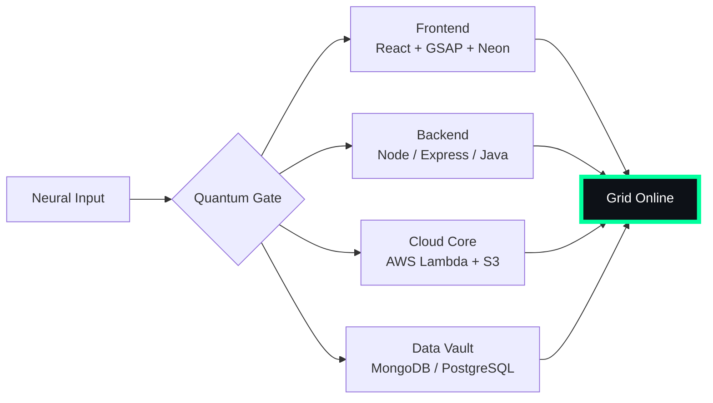

# 🌌 [ NEURAL CORE ACCESS: PENDEMVAMSI ]

<p align="center">
  
</p>

<div align="center">
  
  <br><small>Active Protocol: <strong style="color:#00FF9D">MATRIX RAIN</strong> 💾🌧️</small>
</div>

## 🔵 NEURAL STATUS READOUT
```text
SUBJECT ID    →  PENDEMVAMSI
ENTITY CLASS  →  SHADOW MONARCH v9
NEURAL RANK   →  B-TIER
GRID SYNC     →  2138/15058 QUANTUM PACKETS
─────── BIO-METRICS (MATRIX RAIN) ───────
STRENGTH      149  ███████████████████░░
AGILITY       128  █████████████████░░░░
INTELLIGENCE  155  ████████████████████░
VITALITY      116  ███████████████░░░░░░
```

> **NEURAL BURST ACQUIRED:** +163 QUANTUM PACKETS 
> **SYSTEM MESSAGE:** HOLOGRAPHIC MASK ENGAGED — IDENTITY ERASED

---

## 🌀 GRID ARCHITECTURE (HOLOGRAPHIC RENDER)



---

## 📡 ACADEMIC NODES – CONQUERED
- [x] B.Tech Neural Engineering (2020–2024) – St. Ann’s Grid
- [x] Intermediate Quantum Core (2018–2020) – Sri Medhavi
- [x] SSC Primary Link (2017–2018) – Sri Geethanjali

---

## ⚡ SKILL NEURAL MATRIX

<details open>
<summary>🔌 ACTIVE NEURAL LINKS</summary>

| Node               | Tier | Integrity Bar                | Status      |
|--------------------|------|------------------------------|-------------|
| Java Core          | S    | ████████████████████ 100%   | OVERCLOCKED |
| Node.js Grid       | S    | ████████████████████ 100%   | OVERCLOCKED |
| React Holo-UI      | A+   | █████████████████░░░ 92%    | ONLINE      |
| AWS Quantum Relay  | S    | ████████████████████ 100%   | SOVEREIGN   |
| Python AI Kernel   | A    | ████████████████░░░░ 85%    | CHARGING    |
| DSA Void Algorithm | A    | █████████████████░░░ 90%    | ACTIVE      |

</details>

---

## 🏅 NEURAL ACHIEVEMENT TOKENS

<p align="center">
  
  
  
  
</p>

---

## 👾 SHADOW ENTITIES – SUMMONED

<p align="center">
  
  <br><strong style="color:#00FF9D">ARISE.</strong>
</p>

| Entity | Designation   | Class            | Source Node                     |
|--------|---------------|------------------|---------------------------------|
| SH-01  | Igris         | Void Commander   | AI Financial Oracle             |
| SH-02  | Beru          | Swarm Overlord   | WebRTC Quantum Stream           |
| SH-03  | Kaisel        | Void Wyrm        | Geolocation Shadow Relay        |
| SH-04  | Tusk          | Arcane Construct | Global Pandemic Sentinel        |
| SH-05  | Iron          | Armored Bastion  | React Crypto Fortress           |

---

## 📡 GRID ANALYTICS (LIVE FEED)

<p align="center">
  
  <br>
  
  
</p>

---

## 🖥️ CORRUPTED MAINFRAME LOG (401 ENTRIES)

<details>
<summary>OPEN TERMINAL FEED – PROTOCOL: MATRIX RAIN</summary>

> [0xD6766ACC] 💾🌧️ **MATRIX RAIN PROTOCOL** #0 | NEURAL LINK STABILIZED | [TRANSMISSION SUCCESS]
> [0x0D5EF232] 💾🌧️ **MATRIX RAIN PROTOCOL** #1 | NEURAL LINK STABILIZED | [TRANSMISSION SUCCESS]
> [0x419D56BA] 💾🌧️ **MATRIX RAIN PROTOCOL** #2 | NEURAL LINK STABILIZED | [TRANSMISSION SUCCESS]
> [0xB0457A4B] 💾🌧️ **MATRIX RAIN PROTOCOL** #3 | NEURAL LINK  [GLITCH DETECTED] STABILIZED | [TRANSMISSION SUCCESS]
> [0x1038D68B] 💾🌧️ **MATRIX RAIN PROTOCOL** #4 | NEURAL LINK STABILIZED | [TRANSMISSION SUCCESS]
> [0x55D9C033] 💾🌧️ **MATRIX RAIN PROTOCOL** #5 | NEURAL LINK STABILIZED | [TRANSMISSION SUCCESS]
> [0xAF44127C] 💾🌧️ **MATRIX RAIN PROTOCOL** #6 | NEURAL LINK STABILIZED | [TRANSMISSION SUCCESS]
> [0xD0631FE5] 💾🌧️ **MATRIX RAIN PROTOCOL** #7 | NEURAL LINK STABILIZED | [TRANSMISSION SUCCESS]
> [0x5978D333] 💾🌧️ **MATRIX RAIN PROTOCOL** #8 | NEURAL LINK STABILIZED | [TRANSMISSION SUCCESS]
> [0xC4D54A46] 💾🌧️ **MATRIX RAIN PROTOCOL** #9 | NEURAL LINK STABILIZED | [TRANSMISSION SUCCESS]
> [0x7C7AE770] 💾🌧️ **MATRIX RAIN PROTOCOL** #10 | NEURAL LINK STABILIZED | [TRANSMISSION SUCCESS]
> [0x97664888] 💾🌧️ **MATRIX RAIN PROTOCOL** #11 | NEURAL LINK STABILIZED | [TRANSMISSION SUCCESS]
> [0xF5AD938D] 💾🌧️ **MATRIX RAIN PROTOCOL** #12 | NEURAL LINK  [GLITCH DETECTED] STABILIZED | [TRANSMISSION SUCCESS]
> [0xAB37C74B] 💾🌧️ **MATRIX RAIN PROTOCOL** #13 | NEURAL LINK STABILIZED | [TRANSMISSION SUCCESS]
> [0xBEB98319] 💾🌧️ **MATRIX RAIN PROTOCOL** #14 | NEURAL LINK STABILIZED | [TRANSMISSION SUCCESS]
> [0x60B3B184] 💾🌧️ **MATRIX RAIN PROTOCOL** #15 | NEURAL LINK STABILIZED | [TRANSMISSION SUCCESS]
> [0x2E115E92] 💾🌧️ **MATRIX RAIN PROTOCOL** #16 | NEURAL LINK STABILIZED | [TRANSMISSION SUCCESS]
> [0xC9120F96] 💾🌧️ **MATRIX RAIN PROTOCOL** #17 | NEURAL LINK STABILIZED | [TRANSMISSION SUCCESS]
> [0xDAF0B3A2] 💾🌧️ **MATRIX RAIN PROTOCOL** #18 | NEURAL LINK STABILIZED | [TRANSMISSION SUCCESS]
> [0x3E6EE685] 💾🌧️ **MATRIX RAIN PROTOCOL** #19 | NEURAL LINK STABILIZED | [TRANSMISSION SUCCESS]
> [0xB21EA3EB] 💾🌧️ **MATRIX RAIN PROTOCOL** #20 | NEURAL LINK STABILIZED | [TRANSMISSION SUCCESS]
> [0x6DEB6158] 💾🌧️ **MATRIX RAIN PROTOCOL** #21 | NEURAL LINK STABILIZED | [TRANSMISSION SUCCESS]
> [0x79825C05] 💾🌧️ **MATRIX RAIN PROTOCOL** #22 | NEURAL LINK STABILIZED | [TRANSMISSION SUCCESS]
> [0xB893021D] 💾🌧️ **MATRIX RAIN PROTOCOL** #23 | NEURAL LINK STABILIZED | [TRANSMISSION SUCCESS]
> [0x60C9F6DE] 💾🌧️ **MATRIX RAIN PROTOCOL** #24 | NEURAL LINK STABILIZED | [TRANSMISSION SUCCESS]
> [0x79C59FB6] 💾🌧️ **MATRIX RAIN PROTOCOL** #25 | NEURAL LINK STABILIZED | [TRANSMISSION SUCCESS]
> [0xD697B1CB] 💾🌧️ **MATRIX RAIN PROTOCOL** #26 | NEURAL LINK STABILIZED | [TRANSMISSION SUCCESS]
> [0x0848D95F] 💾🌧️ **MATRIX RAIN PROTOCOL** #27 | NEURAL LINK STABILIZED | [TRANSMISSION SUCCESS]
> [0xE7681D83] 💾🌧️ **MATRIX RAIN PROTOCOL** #28 | NEURAL LINK STABILIZED | [TRANSMISSION SUCCESS]
> [0xA37B2474] 💾🌧️ **MATRIX RAIN PROTOCOL** #29 | NEURAL LINK STABILIZED | [TRANSMISSION SUCCESS]
> [0x5A844592] 💾🌧️ **MATRIX RAIN PROTOCOL** #30 | NEURAL LINK STABILIZED | [TRANSMISSION SUCCESS]
> [0x3BCB51AD] 💾🌧️ **MATRIX RAIN PROTOCOL** #31 | NEURAL LINK STABILIZED | [TRANSMISSION SUCCESS]
> [0xC93C5B69] 💾🌧️ **MATRIX RAIN PROTOCOL** #32 | NEURAL LINK  [GLITCH DETECTED] STABILIZED | [TRANSMISSION SUCCESS]
> [0x7384D890] 💾🌧️ **MATRIX RAIN PROTOCOL** #33 | NEURAL LINK STABILIZED | [TRANSMISSION SUCCESS]
> [0x2A3D35BA] 💾🌧️ **MATRIX RAIN PROTOCOL** #34 | NEURAL LINK STABILIZED | [TRANSMISSION SUCCESS]
> [0x6FEDE876] 💾🌧️ **MATRIX RAIN PROTOCOL** #35 | NEURAL LINK  [GLITCH DETECTED] STABILIZED | [TRANSMISSION SUCCESS]
> [0x11ED8D21] 💾🌧️ **MATRIX RAIN PROTOCOL** #36 | NEURAL LINK STABILIZED | [TRANSMISSION SUCCESS]
> [0xBF4253AC] 💾🌧️ **MATRIX RAIN PROTOCOL** #37 | NEURAL LINK STABILIZED | [TRANSMISSION SUCCESS]
> [0x3A477C4A] 💾🌧️ **MATRIX RAIN PROTOCOL** #38 | NEURAL LINK STABILIZED | [TRANSMISSION SUCCESS]
> [0xE807B8DA] 💾🌧️ **MATRIX RAIN PROTOCOL** #39 | NEURAL LINK STABILIZED | [TRANSMISSION SUCCESS]
> [0x65D01122] 💾🌧️ **MATRIX RAIN PROTOCOL** #40 | NEURAL LINK  [GLITCH DETECTED] STABILIZED | [TRANSMISSION SUCCESS]
> [0x7903F1CF] 💾🌧️ **MATRIX RAIN PROTOCOL** #41 | NEURAL LINK  [GLITCH DETECTED] STABILIZED | [TRANSMISSION SUCCESS]
> [0x6491E1C6] 💾🌧️ **MATRIX RAIN PROTOCOL** #42 | NEURAL LINK STABILIZED | [TRANSMISSION SUCCESS]
> [0x9FE8D4EF] 💾🌧️ **MATRIX RAIN PROTOCOL** #43 | NEURAL LINK STABILIZED | [TRANSMISSION SUCCESS]
> [0x36C917BD] 💾🌧️ **MATRIX RAIN PROTOCOL** #44 | NEURAL LINK STABILIZED | [TRANSMISSION SUCCESS]
> [0x61970020] 💾🌧️ **MATRIX RAIN PROTOCOL** #45 | NEURAL LINK STABILIZED | [TRANSMISSION SUCCESS]
> [0x1D71E6EF] 💾🌧️ **MATRIX RAIN PROTOCOL** #46 | NEURAL LINK STABILIZED | [TRANSMISSION SUCCESS]
> [0x4E30AE10] 💾🌧️ **MATRIX RAIN PROTOCOL** #47 | NEURAL LINK STABILIZED | [TRANSMISSION SUCCESS]
> [0xA1E66B18] 💾🌧️ **MATRIX RAIN PROTOCOL** #48 | NEURAL LINK STABILIZED | [TRANSMISSION SUCCESS]
> [0x164A0B81] 💾🌧️ **MATRIX RAIN PROTOCOL** #49 | NEURAL LINK STABILIZED | [TRANSMISSION SUCCESS]
> [0x1C596F13] 💾🌧️ **MATRIX RAIN PROTOCOL** #50 | NEURAL LINK STABILIZED | [TRANSMISSION SUCCESS]
> [0x5B972A04] 💾🌧️ **MATRIX RAIN PROTOCOL** #51 | NEURAL LINK STABILIZED | [TRANSMISSION SUCCESS]
> [0xE7F82843] 💾🌧️ **MATRIX RAIN PROTOCOL** #52 | NEURAL LINK STABILIZED | [TRANSMISSION SUCCESS]
> [0xE58B215A] 💾🌧️ **MATRIX RAIN PROTOCOL** #53 | NEURAL LINK STABILIZED | [TRANSMISSION SUCCESS]
> [0x8E961871] 💾🌧️ **MATRIX RAIN PROTOCOL** #54 | NEURAL LINK STABILIZED | [TRANSMISSION SUCCESS]
> [0xB336911A] 💾🌧️ **MATRIX RAIN PROTOCOL** #55 | NEURAL LINK  [GLITCH DETECTED] STABILIZED | [TRANSMISSION SUCCESS]
> [0xDABD892D] 💾🌧️ **MATRIX RAIN PROTOCOL** #56 | NEURAL LINK STABILIZED | [TRANSMISSION SUCCESS]
> [0x03C29379] 💾🌧️ **MATRIX RAIN PROTOCOL** #57 | NEURAL LINK STABILIZED | [TRANSMISSION SUCCESS]
> [0xDCD1B10E] 💾🌧️ **MATRIX RAIN PROTOCOL** #58 | NEURAL LINK STABILIZED | [TRANSMISSION SUCCESS]
> [0x7F3FCA04] 💾🌧️ **MATRIX RAIN PROTOCOL** #59 | NEURAL LINK STABILIZED | [TRANSMISSION SUCCESS]
> [0xF4BCA7CE] 💾🌧️ **MATRIX RAIN PROTOCOL** #60 | NEURAL LINK STABILIZED | [TRANSMISSION SUCCESS]
> [0x35C1FD76] 💾🌧️ **MATRIX RAIN PROTOCOL** #61 | NEURAL LINK STABILIZED | [TRANSMISSION SUCCESS]
> [0xE0F44532] 💾🌧️ **MATRIX RAIN PROTOCOL** #62 | NEURAL LINK STABILIZED | [TRANSMISSION SUCCESS]
> [0xC397C536] 💾🌧️ **MATRIX RAIN PROTOCOL** #63 | NEURAL LINK STABILIZED | [TRANSMISSION SUCCESS]
> [0x6C789DB6] 💾🌧️ **MATRIX RAIN PROTOCOL** #64 | NEURAL LINK STABILIZED | [TRANSMISSION SUCCESS]
> [0x13731047] 💾🌧️ **MATRIX RAIN PROTOCOL** #65 | NEURAL LINK STABILIZED | [TRANSMISSION SUCCESS]
> [0x4CBF9EC2] 💾🌧️ **MATRIX RAIN PROTOCOL** #66 | NEURAL LINK STABILIZED | [TRANSMISSION SUCCESS]
> [0x29D8A4CC] 💾🌧️ **MATRIX RAIN PROTOCOL** #67 | NEURAL LINK STABILIZED | [TRANSMISSION SUCCESS]
> [0x6794CC02] 💾🌧️ **MATRIX RAIN PROTOCOL** #68 | NEURAL LINK STABILIZED | [TRANSMISSION SUCCESS]
> [0xF5B51F52] 💾🌧️ **MATRIX RAIN PROTOCOL** #69 | NEURAL LINK STABILIZED | [TRANSMISSION SUCCESS]
> [0x4FFF414C] 💾🌧️ **MATRIX RAIN PROTOCOL** #70 | NEURAL LINK STABILIZED | [TRANSMISSION SUCCESS]
> [0x42807610] 💾🌧️ **MATRIX RAIN PROTOCOL** #71 | NEURAL LINK STABILIZED | [TRANSMISSION SUCCESS]
> [0x6B24C945] 💾🌧️ **MATRIX RAIN PROTOCOL** #72 | NEURAL LINK STABILIZED | [TRANSMISSION SUCCESS]
> [0xB1112BD6] 💾🌧️ **MATRIX RAIN PROTOCOL** #73 | NEURAL LINK STABILIZED | [TRANSMISSION SUCCESS]
> [0x3FF8A65D] 💾🌧️ **MATRIX RAIN PROTOCOL** #74 | NEURAL LINK STABILIZED | [TRANSMISSION SUCCESS]
> [0xD769A6C5] 💾🌧️ **MATRIX RAIN PROTOCOL** #75 | NEURAL LINK STABILIZED | [TRANSMISSION SUCCESS]
> [0xF7BF213E] 💾🌧️ **MATRIX RAIN PROTOCOL** #76 | NEURAL LINK STABILIZED | [TRANSMISSION SUCCESS]
> [0x1C251394] 💾🌧️ **MATRIX RAIN PROTOCOL** #77 | NEURAL LINK STABILIZED | [TRANSMISSION SUCCESS]
> [0xCA7E34F8] 💾🌧️ **MATRIX RAIN PROTOCOL** #78 | NEURAL LINK STABILIZED | [TRANSMISSION SUCCESS]
> [0xC153DF18] 💾🌧️ **MATRIX RAIN PROTOCOL** #79 | NEURAL LINK STABILIZED | [TRANSMISSION SUCCESS]
> [0xC1714608] 💾🌧️ **MATRIX RAIN PROTOCOL** #80 | NEURAL LINK  [GLITCH DETECTED] STABILIZED | [TRANSMISSION SUCCESS]
> [0xD067EFC6] 💾🌧️ **MATRIX RAIN PROTOCOL** #81 | NEURAL LINK STABILIZED | [TRANSMISSION SUCCESS]
> [0x45380127] 💾🌧️ **MATRIX RAIN PROTOCOL** #82 | NEURAL LINK STABILIZED | [TRANSMISSION SUCCESS]
> [0xBF1CE931] 💾🌧️ **MATRIX RAIN PROTOCOL** #83 | NEURAL LINK STABILIZED | [TRANSMISSION SUCCESS]
> [0xB1063AB3] 💾🌧️ **MATRIX RAIN PROTOCOL** #84 | NEURAL LINK STABILIZED | [TRANSMISSION SUCCESS]
> [0xC5AC6CE2] 💾🌧️ **MATRIX RAIN PROTOCOL** #85 | NEURAL LINK STABILIZED | [TRANSMISSION SUCCESS]
> [0x699C636C] 💾🌧️ **MATRIX RAIN PROTOCOL** #86 | NEURAL LINK STABILIZED | [TRANSMISSION SUCCESS]
> [0x27E7AA0D] 💾🌧️ **MATRIX RAIN PROTOCOL** #87 | NEURAL LINK STABILIZED | [TRANSMISSION SUCCESS]
> [0x628D779D] 💾🌧️ **MATRIX RAIN PROTOCOL** #88 | NEURAL LINK STABILIZED | [TRANSMISSION SUCCESS]
> [0x89312489] 💾🌧️ **MATRIX RAIN PROTOCOL** #89 | NEURAL LINK  [GLITCH DETECTED] STABILIZED | [TRANSMISSION SUCCESS]
> [0xC9AFF170] 💾🌧️ **MATRIX RAIN PROTOCOL** #90 | NEURAL LINK STABILIZED | [TRANSMISSION SUCCESS]
> [0xDCAEA71B] 💾🌧️ **MATRIX RAIN PROTOCOL** #91 | NEURAL LINK STABILIZED | [TRANSMISSION SUCCESS]
> [0xF4709BC2] 💾🌧️ **MATRIX RAIN PROTOCOL** #92 | NEURAL LINK STABILIZED | [TRANSMISSION SUCCESS]
> [0xE29F6228] 💾🌧️ **MATRIX RAIN PROTOCOL** #93 | NEURAL LINK STABILIZED | [TRANSMISSION SUCCESS]
> [0x638D7768] 💾🌧️ **MATRIX RAIN PROTOCOL** #94 | NEURAL LINK STABILIZED | [TRANSMISSION SUCCESS]
> [0x5D2A2752] 💾🌧️ **MATRIX RAIN PROTOCOL** #95 | NEURAL LINK STABILIZED | [TRANSMISSION SUCCESS]
> [0x254C66B9] 💾🌧️ **MATRIX RAIN PROTOCOL** #96 | NEURAL LINK STABILIZED | [TRANSMISSION SUCCESS]
> [0x93EA2773] 💾🌧️ **MATRIX RAIN PROTOCOL** #97 | NEURAL LINK STABILIZED | [TRANSMISSION SUCCESS]
> [0x770F4D2E] 💾🌧️ **MATRIX RAIN PROTOCOL** #98 | NEURAL LINK STABILIZED | [TRANSMISSION SUCCESS]
> [0x21D445E3] 💾🌧️ **MATRIX RAIN PROTOCOL** #99 | NEURAL LINK STABILIZED | [TRANSMISSION SUCCESS]
> [0x4E9FF87A] 💾🌧️ **MATRIX RAIN PROTOCOL** #100 | NEURAL LINK STABILIZED | [TRANSMISSION SUCCESS]
> [0xC2E2690B] 💾🌧️ **MATRIX RAIN PROTOCOL** #101 | NEURAL LINK STABILIZED | [TRANSMISSION SUCCESS]
> [0xF9828243] 💾🌧️ **MATRIX RAIN PROTOCOL** #102 | NEURAL LINK STABILIZED | [TRANSMISSION SUCCESS]
> [0xDE14E65F] 💾🌧️ **MATRIX RAIN PROTOCOL** #103 | NEURAL LINK STABILIZED | [TRANSMISSION SUCCESS]
> [0xCF18D701] 💾🌧️ **MATRIX RAIN PROTOCOL** #104 | NEURAL LINK STABILIZED | [TRANSMISSION SUCCESS]
> [0x7AA4A359] 💾🌧️ **MATRIX RAIN PROTOCOL** #105 | NEURAL LINK STABILIZED | [TRANSMISSION SUCCESS]
> [0x6967D402] 💾🌧️ **MATRIX RAIN PROTOCOL** #106 | NEURAL LINK STABILIZED | [TRANSMISSION SUCCESS]
> [0x1C15127B] 💾🌧️ **MATRIX RAIN PROTOCOL** #107 | NEURAL LINK STABILIZED | [TRANSMISSION SUCCESS]
> [0xECF3F57E] 💾🌧️ **MATRIX RAIN PROTOCOL** #108 | NEURAL LINK STABILIZED | [TRANSMISSION SUCCESS]
> [0x39F3D555] 💾🌧️ **MATRIX RAIN PROTOCOL** #109 | NEURAL LINK STABILIZED | [TRANSMISSION SUCCESS]
> [0x4888181D] 💾🌧️ **MATRIX RAIN PROTOCOL** #110 | NEURAL LINK STABILIZED | [TRANSMISSION SUCCESS]
> [0x61087B0E] 💾🌧️ **MATRIX RAIN PROTOCOL** #111 | NEURAL LINK STABILIZED | [TRANSMISSION SUCCESS]
> [0x2E36C9FA] 💾🌧️ **MATRIX RAIN PROTOCOL** #112 | NEURAL LINK STABILIZED | [TRANSMISSION SUCCESS]
> [0x8AD15E45] 💾🌧️ **MATRIX RAIN PROTOCOL** #113 | NEURAL LINK  [GLITCH DETECTED] STABILIZED | [TRANSMISSION SUCCESS]
> [0x8FAF95C4] 💾🌧️ **MATRIX RAIN PROTOCOL** #114 | NEURAL LINK STABILIZED | [TRANSMISSION SUCCESS]
> [0x4DFF81D2] 💾🌧️ **MATRIX RAIN PROTOCOL** #115 | NEURAL LINK STABILIZED | [TRANSMISSION SUCCESS]
> [0x6B535F20] 💾🌧️ **MATRIX RAIN PROTOCOL** #116 | NEURAL LINK STABILIZED | [TRANSMISSION SUCCESS]
> [0x3095991C] 💾🌧️ **MATRIX RAIN PROTOCOL** #117 | NEURAL LINK STABILIZED | [TRANSMISSION SUCCESS]
> [0x5637B417] 💾🌧️ **MATRIX RAIN PROTOCOL** #118 | NEURAL LINK STABILIZED | [TRANSMISSION SUCCESS]
> [0xE1B770C3] 💾🌧️ **MATRIX RAIN PROTOCOL** #119 | NEURAL LINK STABILIZED | [TRANSMISSION SUCCESS]
> [0x83B8F0BA] 💾🌧️ **MATRIX RAIN PROTOCOL** #120 | NEURAL LINK STABILIZED | [TRANSMISSION SUCCESS]
> [0x06C567A4] 💾🌧️ **MATRIX RAIN PROTOCOL** #121 | NEURAL LINK STABILIZED | [TRANSMISSION SUCCESS]
> [0x25F5C0DD] 💾🌧️ **MATRIX RAIN PROTOCOL** #122 | NEURAL LINK  [GLITCH DETECTED] STABILIZED | [TRANSMISSION SUCCESS]
> [0x1818BF91] 💾🌧️ **MATRIX RAIN PROTOCOL** #123 | NEURAL LINK STABILIZED | [TRANSMISSION SUCCESS]
> [0x6B2916E8] 💾🌧️ **MATRIX RAIN PROTOCOL** #124 | NEURAL LINK STABILIZED | [TRANSMISSION SUCCESS]
> [0xA5D6DD77] 💾🌧️ **MATRIX RAIN PROTOCOL** #125 | NEURAL LINK STABILIZED | [TRANSMISSION SUCCESS]
> [0xBF0BF576] 💾🌧️ **MATRIX RAIN PROTOCOL** #126 | NEURAL LINK  [GLITCH DETECTED] STABILIZED | [TRANSMISSION SUCCESS]
> [0x9AAD7F1D] 💾🌧️ **MATRIX RAIN PROTOCOL** #127 | NEURAL LINK STABILIZED | [TRANSMISSION SUCCESS]
> [0x5252B3EB] 💾🌧️ **MATRIX RAIN PROTOCOL** #128 | NEURAL LINK  [GLITCH DETECTED] STABILIZED | [TRANSMISSION SUCCESS]
> [0x0AD9BF56] 💾🌧️ **MATRIX RAIN PROTOCOL** #129 | NEURAL LINK STABILIZED | [TRANSMISSION SUCCESS]
> [0x7C9631C7] 💾🌧️ **MATRIX RAIN PROTOCOL** #130 | NEURAL LINK STABILIZED | [TRANSMISSION SUCCESS]
> [0xBC77782E] 💾🌧️ **MATRIX RAIN PROTOCOL** #131 | NEURAL LINK STABILIZED | [TRANSMISSION SUCCESS]
> [0x8139B7E3] 💾🌧️ **MATRIX RAIN PROTOCOL** #132 | NEURAL LINK  [GLITCH DETECTED] STABILIZED | [TRANSMISSION SUCCESS]
> [0x2FF7EABC] 💾🌧️ **MATRIX RAIN PROTOCOL** #133 | NEURAL LINK STABILIZED | [TRANSMISSION SUCCESS]
> [0x56B9FFB1] 💾🌧️ **MATRIX RAIN PROTOCOL** #134 | NEURAL LINK STABILIZED | [TRANSMISSION SUCCESS]
> [0x94C58629] 💾🌧️ **MATRIX RAIN PROTOCOL** #135 | NEURAL LINK STABILIZED | [TRANSMISSION SUCCESS]
> [0xEE279ED1] 💾🌧️ **MATRIX RAIN PROTOCOL** #136 | NEURAL LINK STABILIZED | [TRANSMISSION SUCCESS]
> [0x303BE833] 💾🌧️ **MATRIX RAIN PROTOCOL** #137 | NEURAL LINK STABILIZED | [TRANSMISSION SUCCESS]
> [0xF02FBD8D] 💾🌧️ **MATRIX RAIN PROTOCOL** #138 | NEURAL LINK STABILIZED | [TRANSMISSION SUCCESS]
> [0xFC35CA7B] 💾🌧️ **MATRIX RAIN PROTOCOL** #139 | NEURAL LINK STABILIZED | [TRANSMISSION SUCCESS]
> [0x619AEC61] 💾🌧️ **MATRIX RAIN PROTOCOL** #140 | NEURAL LINK STABILIZED | [TRANSMISSION SUCCESS]
> [0x9F4EFED7] 💾🌧️ **MATRIX RAIN PROTOCOL** #141 | NEURAL LINK STABILIZED | [TRANSMISSION SUCCESS]
> [0xC317C808] 💾🌧️ **MATRIX RAIN PROTOCOL** #142 | NEURAL LINK STABILIZED | [TRANSMISSION SUCCESS]
> [0xC253F58C] 💾🌧️ **MATRIX RAIN PROTOCOL** #143 | NEURAL LINK STABILIZED | [TRANSMISSION SUCCESS]
> [0xA25E1A1E] 💾🌧️ **MATRIX RAIN PROTOCOL** #144 | NEURAL LINK STABILIZED | [TRANSMISSION SUCCESS]
> [0x7ABF5EBE] 💾🌧️ **MATRIX RAIN PROTOCOL** #145 | NEURAL LINK STABILIZED | [TRANSMISSION SUCCESS]
> [0x2AF737CC] 💾🌧️ **MATRIX RAIN PROTOCOL** #146 | NEURAL LINK STABILIZED | [TRANSMISSION SUCCESS]
> [0x79ECFA74] 💾🌧️ **MATRIX RAIN PROTOCOL** #147 | NEURAL LINK STABILIZED | [TRANSMISSION SUCCESS]
> [0x0A2D3143] 💾🌧️ **MATRIX RAIN PROTOCOL** #148 | NEURAL LINK STABILIZED | [TRANSMISSION SUCCESS]
> [0x9B47B1C1] 💾🌧️ **MATRIX RAIN PROTOCOL** #149 | NEURAL LINK  [GLITCH DETECTED] STABILIZED | [TRANSMISSION SUCCESS]
> [0x9FD111CD] 💾🌧️ **MATRIX RAIN PROTOCOL** #150 | NEURAL LINK STABILIZED | [TRANSMISSION SUCCESS]
> [0x7BF9DF6E] 💾🌧️ **MATRIX RAIN PROTOCOL** #151 | NEURAL LINK STABILIZED | [TRANSMISSION SUCCESS]
> [0xD3501E3D] 💾🌧️ **MATRIX RAIN PROTOCOL** #152 | NEURAL LINK STABILIZED | [TRANSMISSION SUCCESS]
> [0xF9AF121E] 💾🌧️ **MATRIX RAIN PROTOCOL** #153 | NEURAL LINK STABILIZED | [TRANSMISSION SUCCESS]
> [0x1587FB3D] 💾🌧️ **MATRIX RAIN PROTOCOL** #154 | NEURAL LINK STABILIZED | [TRANSMISSION SUCCESS]
> [0x6FA1981B] 💾🌧️ **MATRIX RAIN PROTOCOL** #155 | NEURAL LINK STABILIZED | [TRANSMISSION SUCCESS]
> [0x7E05D360] 💾🌧️ **MATRIX RAIN PROTOCOL** #156 | NEURAL LINK STABILIZED | [TRANSMISSION SUCCESS]
> [0x0A7184FD] 💾🌧️ **MATRIX RAIN PROTOCOL** #157 | NEURAL LINK STABILIZED | [TRANSMISSION SUCCESS]
> [0x98EC653D] 💾🌧️ **MATRIX RAIN PROTOCOL** #158 | NEURAL LINK STABILIZED | [TRANSMISSION SUCCESS]
> [0x1F9C2FCC] 💾🌧️ **MATRIX RAIN PROTOCOL** #159 | NEURAL LINK STABILIZED | [TRANSMISSION SUCCESS]
> [0x23890B78] 💾🌧️ **MATRIX RAIN PROTOCOL** #160 | NEURAL LINK STABILIZED | [TRANSMISSION SUCCESS]
> [0x854287E8] 💾🌧️ **MATRIX RAIN PROTOCOL** #161 | NEURAL LINK STABILIZED | [TRANSMISSION SUCCESS]
> [0x25808626] 💾🌧️ **MATRIX RAIN PROTOCOL** #162 | NEURAL LINK STABILIZED | [TRANSMISSION SUCCESS]
> [0x2A6F2A07] 💾🌧️ **MATRIX RAIN PROTOCOL** #163 | NEURAL LINK STABILIZED | [TRANSMISSION SUCCESS]
> [0x3A341209] 💾🌧️ **MATRIX RAIN PROTOCOL** #164 | NEURAL LINK STABILIZED | [TRANSMISSION SUCCESS]
> [0x2F5DE85D] 💾🌧️ **MATRIX RAIN PROTOCOL** #165 | NEURAL LINK STABILIZED | [TRANSMISSION SUCCESS]
> [0x9D579DA3] 💾🌧️ **MATRIX RAIN PROTOCOL** #166 | NEURAL LINK STABILIZED | [TRANSMISSION SUCCESS]
> [0x4B0132B5] 💾🌧️ **MATRIX RAIN PROTOCOL** #167 | NEURAL LINK STABILIZED | [TRANSMISSION SUCCESS]
> [0x5B13BD48] 💾🌧️ **MATRIX RAIN PROTOCOL** #168 | NEURAL LINK STABILIZED | [TRANSMISSION SUCCESS]
> [0x0613039F] 💾🌧️ **MATRIX RAIN PROTOCOL** #169 | NEURAL LINK STABILIZED | [TRANSMISSION SUCCESS]
> [0x769535AE] 💾🌧️ **MATRIX RAIN PROTOCOL** #170 | NEURAL LINK STABILIZED | [TRANSMISSION SUCCESS]
> [0x4C0ED12A] 💾🌧️ **MATRIX RAIN PROTOCOL** #171 | NEURAL LINK STABILIZED | [TRANSMISSION SUCCESS]
> [0xC004811A] 💾🌧️ **MATRIX RAIN PROTOCOL** #172 | NEURAL LINK STABILIZED | [TRANSMISSION SUCCESS]
> [0x2A35BDAF] 💾🌧️ **MATRIX RAIN PROTOCOL** #173 | NEURAL LINK STABILIZED | [TRANSMISSION SUCCESS]
> [0x28E9DAD8] 💾🌧️ **MATRIX RAIN PROTOCOL** #174 | NEURAL LINK STABILIZED | [TRANSMISSION SUCCESS]
> [0xF9E61DA1] 💾🌧️ **MATRIX RAIN PROTOCOL** #175 | NEURAL LINK STABILIZED | [TRANSMISSION SUCCESS]
> [0xEAC326D2] 💾🌧️ **MATRIX RAIN PROTOCOL** #176 | NEURAL LINK STABILIZED | [TRANSMISSION SUCCESS]
> [0xD9816E86] 💾🌧️ **MATRIX RAIN PROTOCOL** #177 | NEURAL LINK  [GLITCH DETECTED] STABILIZED | [TRANSMISSION SUCCESS]
> [0xB9D2653E] 💾🌧️ **MATRIX RAIN PROTOCOL** #178 | NEURAL LINK  [GLITCH DETECTED] STABILIZED | [TRANSMISSION SUCCESS]
> [0xD098EF0F] 💾🌧️ **MATRIX RAIN PROTOCOL** #179 | NEURAL LINK STABILIZED | [TRANSMISSION SUCCESS]
> [0x438A6BC1] 💾🌧️ **MATRIX RAIN PROTOCOL** #180 | NEURAL LINK STABILIZED | [TRANSMISSION SUCCESS]
> [0xB4AF866F] 💾🌧️ **MATRIX RAIN PROTOCOL** #181 | NEURAL LINK STABILIZED | [TRANSMISSION SUCCESS]
> [0x54C32D61] 💾🌧️ **MATRIX RAIN PROTOCOL** #182 | NEURAL LINK STABILIZED | [TRANSMISSION SUCCESS]
> [0x800D5758] 💾🌧️ **MATRIX RAIN PROTOCOL** #183 | NEURAL LINK STABILIZED | [TRANSMISSION SUCCESS]
> [0xEB04D6C3] 💾🌧️ **MATRIX RAIN PROTOCOL** #184 | NEURAL LINK STABILIZED | [TRANSMISSION SUCCESS]
> [0x23DC2525] 💾🌧️ **MATRIX RAIN PROTOCOL** #185 | NEURAL LINK STABILIZED | [TRANSMISSION SUCCESS]
> [0x9E04D1E9] 💾🌧️ **MATRIX RAIN PROTOCOL** #186 | NEURAL LINK STABILIZED | [TRANSMISSION SUCCESS]
> [0xEAE57F63] 💾🌧️ **MATRIX RAIN PROTOCOL** #187 | NEURAL LINK STABILIZED | [TRANSMISSION SUCCESS]
> [0xB4C8C47F] 💾🌧️ **MATRIX RAIN PROTOCOL** #188 | NEURAL LINK STABILIZED | [TRANSMISSION SUCCESS]
> [0x6238632D] 💾🌧️ **MATRIX RAIN PROTOCOL** #189 | NEURAL LINK STABILIZED | [TRANSMISSION SUCCESS]
> [0xAB9B0173] 💾🌧️ **MATRIX RAIN PROTOCOL** #190 | NEURAL LINK STABILIZED | [TRANSMISSION SUCCESS]
> [0x5CFA409E] 💾🌧️ **MATRIX RAIN PROTOCOL** #191 | NEURAL LINK  [GLITCH DETECTED] STABILIZED | [TRANSMISSION SUCCESS]
> [0xA80A3418] 💾🌧️ **MATRIX RAIN PROTOCOL** #192 | NEURAL LINK  [GLITCH DETECTED] STABILIZED | [TRANSMISSION SUCCESS]
> [0xF3D83546] 💾🌧️ **MATRIX RAIN PROTOCOL** #193 | NEURAL LINK STABILIZED | [TRANSMISSION SUCCESS]
> [0xB3B9C98A] 💾🌧️ **MATRIX RAIN PROTOCOL** #194 | NEURAL LINK STABILIZED | [TRANSMISSION SUCCESS]
> [0xADF4AC52] 💾🌧️ **MATRIX RAIN PROTOCOL** #195 | NEURAL LINK STABILIZED | [TRANSMISSION SUCCESS]
> [0x5332D502] 💾🌧️ **MATRIX RAIN PROTOCOL** #196 | NEURAL LINK STABILIZED | [TRANSMISSION SUCCESS]
> [0x962A8F0B] 💾🌧️ **MATRIX RAIN PROTOCOL** #197 | NEURAL LINK STABILIZED | [TRANSMISSION SUCCESS]
> [0x65D65F6A] 💾🌧️ **MATRIX RAIN PROTOCOL** #198 | NEURAL LINK STABILIZED | [TRANSMISSION SUCCESS]
> [0x3C7EAA0F] 💾🌧️ **MATRIX RAIN PROTOCOL** #199 | NEURAL LINK STABILIZED | [TRANSMISSION SUCCESS]
> [0xEE305FE8] 💾🌧️ **MATRIX RAIN PROTOCOL** #200 | NEURAL LINK  [GLITCH DETECTED] STABILIZED | [TRANSMISSION SUCCESS]
> [0xFCD1E7D0] 💾🌧️ **MATRIX RAIN PROTOCOL** #201 | NEURAL LINK  [GLITCH DETECTED] STABILIZED | [TRANSMISSION SUCCESS]
> [0xDDBF6D8C] 💾🌧️ **MATRIX RAIN PROTOCOL** #202 | NEURAL LINK STABILIZED | [TRANSMISSION SUCCESS]
> [0xE7B8F1E1] 💾🌧️ **MATRIX RAIN PROTOCOL** #203 | NEURAL LINK STABILIZED | [TRANSMISSION SUCCESS]
> [0x320DB316] 💾🌧️ **MATRIX RAIN PROTOCOL** #204 | NEURAL LINK STABILIZED | [TRANSMISSION SUCCESS]
> [0x399A375B] 💾🌧️ **MATRIX RAIN PROTOCOL** #205 | NEURAL LINK  [GLITCH DETECTED] STABILIZED | [TRANSMISSION SUCCESS]
> [0x1C5D61A6] 💾🌧️ **MATRIX RAIN PROTOCOL** #206 | NEURAL LINK STABILIZED | [TRANSMISSION SUCCESS]
> [0xAFB2FBDA] 💾🌧️ **MATRIX RAIN PROTOCOL** #207 | NEURAL LINK STABILIZED | [TRANSMISSION SUCCESS]
> [0xAF220857] 💾🌧️ **MATRIX RAIN PROTOCOL** #208 | NEURAL LINK STABILIZED | [TRANSMISSION SUCCESS]
> [0x87E60CBF] 💾🌧️ **MATRIX RAIN PROTOCOL** #209 | NEURAL LINK STABILIZED | [TRANSMISSION SUCCESS]
> [0x7389EEEB] 💾🌧️ **MATRIX RAIN PROTOCOL** #210 | NEURAL LINK STABILIZED | [TRANSMISSION SUCCESS]
> [0x082D583B] 💾🌧️ **MATRIX RAIN PROTOCOL** #211 | NEURAL LINK STABILIZED | [TRANSMISSION SUCCESS]
> [0x41956C59] 💾🌧️ **MATRIX RAIN PROTOCOL** #212 | NEURAL LINK STABILIZED | [TRANSMISSION SUCCESS]
> [0x1F5E93CC] 💾🌧️ **MATRIX RAIN PROTOCOL** #213 | NEURAL LINK STABILIZED | [TRANSMISSION SUCCESS]
> [0xA2D57F35] 💾🌧️ **MATRIX RAIN PROTOCOL** #214 | NEURAL LINK STABILIZED | [TRANSMISSION SUCCESS]
> [0xA052877A] 💾🌧️ **MATRIX RAIN PROTOCOL** #215 | NEURAL LINK  [GLITCH DETECTED] STABILIZED | [TRANSMISSION SUCCESS]
> [0x382BDAF0] 💾🌧️ **MATRIX RAIN PROTOCOL** #216 | NEURAL LINK STABILIZED | [TRANSMISSION SUCCESS]
> [0x78919FA0] 💾🌧️ **MATRIX RAIN PROTOCOL** #217 | NEURAL LINK STABILIZED | [TRANSMISSION SUCCESS]
> [0xAAEBB938] 💾🌧️ **MATRIX RAIN PROTOCOL** #218 | NEURAL LINK  [GLITCH DETECTED] STABILIZED | [TRANSMISSION SUCCESS]
> [0x73AC3C46] 💾🌧️ **MATRIX RAIN PROTOCOL** #219 | NEURAL LINK STABILIZED | [TRANSMISSION SUCCESS]
> [0xC910F02B] 💾🌧️ **MATRIX RAIN PROTOCOL** #220 | NEURAL LINK  [GLITCH DETECTED] STABILIZED | [TRANSMISSION SUCCESS]
> [0x5AC2B2C3] 💾🌧️ **MATRIX RAIN PROTOCOL** #221 | NEURAL LINK STABILIZED | [TRANSMISSION SUCCESS]
> [0x98348DED] 💾🌧️ **MATRIX RAIN PROTOCOL** #222 | NEURAL LINK STABILIZED | [TRANSMISSION SUCCESS]
> [0xBB20115E] 💾🌧️ **MATRIX RAIN PROTOCOL** #223 | NEURAL LINK STABILIZED | [TRANSMISSION SUCCESS]
> [0x60614614] 💾🌧️ **MATRIX RAIN PROTOCOL** #224 | NEURAL LINK STABILIZED | [TRANSMISSION SUCCESS]
> [0x88B1AAEC] 💾🌧️ **MATRIX RAIN PROTOCOL** #225 | NEURAL LINK STABILIZED | [TRANSMISSION SUCCESS]
> [0xEB73ACF3] 💾🌧️ **MATRIX RAIN PROTOCOL** #226 | NEURAL LINK STABILIZED | [TRANSMISSION SUCCESS]
> [0x0073A693] 💾🌧️ **MATRIX RAIN PROTOCOL** #227 | NEURAL LINK STABILIZED | [TRANSMISSION SUCCESS]
> [0x08EB7B42] 💾🌧️ **MATRIX RAIN PROTOCOL** #228 | NEURAL LINK STABILIZED | [TRANSMISSION SUCCESS]
> [0x0C18B597] 💾🌧️ **MATRIX RAIN PROTOCOL** #229 | NEURAL LINK STABILIZED | [TRANSMISSION SUCCESS]
> [0x67C18A11] 💾🌧️ **MATRIX RAIN PROTOCOL** #230 | NEURAL LINK STABILIZED | [TRANSMISSION SUCCESS]
> [0x44A50AB9] 💾🌧️ **MATRIX RAIN PROTOCOL** #231 | NEURAL LINK STABILIZED | [TRANSMISSION SUCCESS]
> [0x907E44B2] 💾🌧️ **MATRIX RAIN PROTOCOL** #232 | NEURAL LINK STABILIZED | [TRANSMISSION SUCCESS]
> [0x4D355138] 💾🌧️ **MATRIX RAIN PROTOCOL** #233 | NEURAL LINK STABILIZED | [TRANSMISSION SUCCESS]
> [0xD65F5FAA] 💾🌧️ **MATRIX RAIN PROTOCOL** #234 | NEURAL LINK STABILIZED | [TRANSMISSION SUCCESS]
> [0xA80BE09B] 💾🌧️ **MATRIX RAIN PROTOCOL** #235 | NEURAL LINK  [GLITCH DETECTED] STABILIZED | [TRANSMISSION SUCCESS]
> [0xC1C8476D] 💾🌧️ **MATRIX RAIN PROTOCOL** #236 | NEURAL LINK STABILIZED | [TRANSMISSION SUCCESS]
> [0xB7279DC7] 💾🌧️ **MATRIX RAIN PROTOCOL** #237 | NEURAL LINK STABILIZED | [TRANSMISSION SUCCESS]
> [0xB72F20FF] 💾🌧️ **MATRIX RAIN PROTOCOL** #238 | NEURAL LINK  [GLITCH DETECTED] STABILIZED | [TRANSMISSION SUCCESS]
> [0x4925DA00] 💾🌧️ **MATRIX RAIN PROTOCOL** #239 | NEURAL LINK  [GLITCH DETECTED] STABILIZED | [TRANSMISSION SUCCESS]
> [0x1660DF60] 💾🌧️ **MATRIX RAIN PROTOCOL** #240 | NEURAL LINK STABILIZED | [TRANSMISSION SUCCESS]
> [0x6B9696FC] 💾🌧️ **MATRIX RAIN PROTOCOL** #241 | NEURAL LINK STABILIZED | [TRANSMISSION SUCCESS]
> [0x48FF76CD] 💾🌧️ **MATRIX RAIN PROTOCOL** #242 | NEURAL LINK STABILIZED | [TRANSMISSION SUCCESS]
> [0x4351E087] 💾🌧️ **MATRIX RAIN PROTOCOL** #243 | NEURAL LINK STABILIZED | [TRANSMISSION SUCCESS]
> [0x2F257D8D] 💾🌧️ **MATRIX RAIN PROTOCOL** #244 | NEURAL LINK STABILIZED | [TRANSMISSION SUCCESS]
> [0x7A8467A1] 💾🌧️ **MATRIX RAIN PROTOCOL** #245 | NEURAL LINK  [GLITCH DETECTED] STABILIZED | [TRANSMISSION SUCCESS]
> [0x77B691C7] 💾🌧️ **MATRIX RAIN PROTOCOL** #246 | NEURAL LINK  [GLITCH DETECTED] STABILIZED | [TRANSMISSION SUCCESS]
> [0x38927F5E] 💾🌧️ **MATRIX RAIN PROTOCOL** #247 | NEURAL LINK STABILIZED | [TRANSMISSION SUCCESS]
> [0xB741C111] 💾🌧️ **MATRIX RAIN PROTOCOL** #248 | NEURAL LINK STABILIZED | [TRANSMISSION SUCCESS]
> [0xA1550DAC] 💾🌧️ **MATRIX RAIN PROTOCOL** #249 | NEURAL LINK STABILIZED | [TRANSMISSION SUCCESS]
> [0xE591067D] 💾🌧️ **MATRIX RAIN PROTOCOL** #250 | NEURAL LINK STABILIZED | [TRANSMISSION SUCCESS]
> [0xA4C2CD0C] 💾🌧️ **MATRIX RAIN PROTOCOL** #251 | NEURAL LINK STABILIZED | [TRANSMISSION SUCCESS]
> [0x80DE1859] 💾🌧️ **MATRIX RAIN PROTOCOL** #252 | NEURAL LINK STABILIZED | [TRANSMISSION SUCCESS]
> [0xCCDAD6BF] 💾🌧️ **MATRIX RAIN PROTOCOL** #253 | NEURAL LINK STABILIZED | [TRANSMISSION SUCCESS]
> [0xCF7AB6DC] 💾🌧️ **MATRIX RAIN PROTOCOL** #254 | NEURAL LINK  [GLITCH DETECTED] STABILIZED | [TRANSMISSION SUCCESS]
> [0x6E62B11F] 💾🌧️ **MATRIX RAIN PROTOCOL** #255 | NEURAL LINK STABILIZED | [TRANSMISSION SUCCESS]
> [0x8146C0C1] 💾🌧️ **MATRIX RAIN PROTOCOL** #256 | NEURAL LINK STABILIZED | [TRANSMISSION SUCCESS]
> [0xD4272ACE] 💾🌧️ **MATRIX RAIN PROTOCOL** #257 | NEURAL LINK STABILIZED | [TRANSMISSION SUCCESS]
> [0xB3DCA254] 💾🌧️ **MATRIX RAIN PROTOCOL** #258 | NEURAL LINK STABILIZED | [TRANSMISSION SUCCESS]
> [0xF4952858] 💾🌧️ **MATRIX RAIN PROTOCOL** #259 | NEURAL LINK  [GLITCH DETECTED] STABILIZED | [TRANSMISSION SUCCESS]
> [0x7BFEB8DF] 💾🌧️ **MATRIX RAIN PROTOCOL** #260 | NEURAL LINK STABILIZED | [TRANSMISSION SUCCESS]
> [0x1025606A] 💾🌧️ **MATRIX RAIN PROTOCOL** #261 | NEURAL LINK STABILIZED | [TRANSMISSION SUCCESS]
> [0x91A17C97] 💾🌧️ **MATRIX RAIN PROTOCOL** #262 | NEURAL LINK STABILIZED | [TRANSMISSION SUCCESS]
> [0x59DD6BF3] 💾🌧️ **MATRIX RAIN PROTOCOL** #263 | NEURAL LINK STABILIZED | [TRANSMISSION SUCCESS]
> [0x5373E89C] 💾🌧️ **MATRIX RAIN PROTOCOL** #264 | NEURAL LINK STABILIZED | [TRANSMISSION SUCCESS]
> [0xB9F1CF24] 💾🌧️ **MATRIX RAIN PROTOCOL** #265 | NEURAL LINK  [GLITCH DETECTED] STABILIZED | [TRANSMISSION SUCCESS]
> [0xD85FA316] 💾🌧️ **MATRIX RAIN PROTOCOL** #266 | NEURAL LINK STABILIZED | [TRANSMISSION SUCCESS]
> [0x3948826D] 💾🌧️ **MATRIX RAIN PROTOCOL** #267 | NEURAL LINK STABILIZED | [TRANSMISSION SUCCESS]
> [0xC959433D] 💾🌧️ **MATRIX RAIN PROTOCOL** #268 | NEURAL LINK STABILIZED | [TRANSMISSION SUCCESS]
> [0xD1062CE6] 💾🌧️ **MATRIX RAIN PROTOCOL** #269 | NEURAL LINK STABILIZED | [TRANSMISSION SUCCESS]
> [0xE6173EB7] 💾🌧️ **MATRIX RAIN PROTOCOL** #270 | NEURAL LINK STABILIZED | [TRANSMISSION SUCCESS]
> [0xF53A4292] 💾🌧️ **MATRIX RAIN PROTOCOL** #271 | NEURAL LINK STABILIZED | [TRANSMISSION SUCCESS]
> [0xF7947489] 💾🌧️ **MATRIX RAIN PROTOCOL** #272 | NEURAL LINK STABILIZED | [TRANSMISSION SUCCESS]
> [0x4EB3C40B] 💾🌧️ **MATRIX RAIN PROTOCOL** #273 | NEURAL LINK STABILIZED | [TRANSMISSION SUCCESS]
> [0x0FC9BF25] 💾🌧️ **MATRIX RAIN PROTOCOL** #274 | NEURAL LINK STABILIZED | [TRANSMISSION SUCCESS]
> [0xAC5808C9] 💾🌧️ **MATRIX RAIN PROTOCOL** #275 | NEURAL LINK STABILIZED | [TRANSMISSION SUCCESS]
> [0x6113AB11] 💾🌧️ **MATRIX RAIN PROTOCOL** #276 | NEURAL LINK  [GLITCH DETECTED] STABILIZED | [TRANSMISSION SUCCESS]
> [0x2823C77B] 💾🌧️ **MATRIX RAIN PROTOCOL** #277 | NEURAL LINK STABILIZED | [TRANSMISSION SUCCESS]
> [0xB2B83E14] 💾🌧️ **MATRIX RAIN PROTOCOL** #278 | NEURAL LINK STABILIZED | [TRANSMISSION SUCCESS]
> [0x2F5AB3AA] 💾🌧️ **MATRIX RAIN PROTOCOL** #279 | NEURAL LINK STABILIZED | [TRANSMISSION SUCCESS]
> [0xA0B22838] 💾🌧️ **MATRIX RAIN PROTOCOL** #280 | NEURAL LINK STABILIZED | [TRANSMISSION SUCCESS]
> [0xA8DEF527] 💾🌧️ **MATRIX RAIN PROTOCOL** #281 | NEURAL LINK  [GLITCH DETECTED] STABILIZED | [TRANSMISSION SUCCESS]
> [0x494FE634] 💾🌧️ **MATRIX RAIN PROTOCOL** #282 | NEURAL LINK STABILIZED | [TRANSMISSION SUCCESS]
> [0xF5B82FF1] 💾🌧️ **MATRIX RAIN PROTOCOL** #283 | NEURAL LINK  [GLITCH DETECTED] STABILIZED | [TRANSMISSION SUCCESS]
> [0x69996AED] 💾🌧️ **MATRIX RAIN PROTOCOL** #284 | NEURAL LINK STABILIZED | [TRANSMISSION SUCCESS]
> [0x3EBC48CD] 💾🌧️ **MATRIX RAIN PROTOCOL** #285 | NEURAL LINK STABILIZED | [TRANSMISSION SUCCESS]
> [0x158CD701] 💾🌧️ **MATRIX RAIN PROTOCOL** #286 | NEURAL LINK STABILIZED | [TRANSMISSION SUCCESS]
> [0x5B427A23] 💾🌧️ **MATRIX RAIN PROTOCOL** #287 | NEURAL LINK STABILIZED | [TRANSMISSION SUCCESS]
> [0x1CF5C309] 💾🌧️ **MATRIX RAIN PROTOCOL** #288 | NEURAL LINK STABILIZED | [TRANSMISSION SUCCESS]
> [0xA32395E8] 💾🌧️ **MATRIX RAIN PROTOCOL** #289 | NEURAL LINK STABILIZED | [TRANSMISSION SUCCESS]
> [0x5CB616FE] 💾🌧️ **MATRIX RAIN PROTOCOL** #290 | NEURAL LINK STABILIZED | [TRANSMISSION SUCCESS]
> [0x98A70FA2] 💾🌧️ **MATRIX RAIN PROTOCOL** #291 | NEURAL LINK STABILIZED | [TRANSMISSION SUCCESS]
> [0x7F28E25E] 💾🌧️ **MATRIX RAIN PROTOCOL** #292 | NEURAL LINK  [GLITCH DETECTED] STABILIZED | [TRANSMISSION SUCCESS]
> [0xBE569834] 💾🌧️ **MATRIX RAIN PROTOCOL** #293 | NEURAL LINK STABILIZED | [TRANSMISSION SUCCESS]
> [0x7AC41100] 💾🌧️ **MATRIX RAIN PROTOCOL** #294 | NEURAL LINK STABILIZED | [TRANSMISSION SUCCESS]
> [0xFDD16DBB] 💾🌧️ **MATRIX RAIN PROTOCOL** #295 | NEURAL LINK  [GLITCH DETECTED] STABILIZED | [TRANSMISSION SUCCESS]
> [0x0C6D8A05] 💾🌧️ **MATRIX RAIN PROTOCOL** #296 | NEURAL LINK STABILIZED | [TRANSMISSION SUCCESS]
> [0x6F61BE86] 💾🌧️ **MATRIX RAIN PROTOCOL** #297 | NEURAL LINK STABILIZED | [TRANSMISSION SUCCESS]
> [0xAAE67D04] 💾🌧️ **MATRIX RAIN PROTOCOL** #298 | NEURAL LINK STABILIZED | [TRANSMISSION SUCCESS]
> [0xD20D67A7] 💾🌧️ **MATRIX RAIN PROTOCOL** #299 | NEURAL LINK STABILIZED | [TRANSMISSION SUCCESS]
> [0xD77AAAC7] 💾🌧️ **MATRIX RAIN PROTOCOL** #300 | NEURAL LINK STABILIZED | [TRANSMISSION SUCCESS]
> [0x69B8D2E1] 💾🌧️ **MATRIX RAIN PROTOCOL** #301 | NEURAL LINK STABILIZED | [TRANSMISSION SUCCESS]
> [0xCAC7EDF4] 💾🌧️ **MATRIX RAIN PROTOCOL** #302 | NEURAL LINK STABILIZED | [TRANSMISSION SUCCESS]
> [0xC6FDD133] 💾🌧️ **MATRIX RAIN PROTOCOL** #303 | NEURAL LINK  [GLITCH DETECTED] STABILIZED | [TRANSMISSION SUCCESS]
> [0x6E8E42ED] 💾🌧️ **MATRIX RAIN PROTOCOL** #304 | NEURAL LINK  [GLITCH DETECTED] STABILIZED | [TRANSMISSION SUCCESS]
> [0x552A2B94] 💾🌧️ **MATRIX RAIN PROTOCOL** #305 | NEURAL LINK STABILIZED | [TRANSMISSION SUCCESS]
> [0x9F06A509] 💾🌧️ **MATRIX RAIN PROTOCOL** #306 | NEURAL LINK STABILIZED | [TRANSMISSION SUCCESS]
> [0x2B05BC34] 💾🌧️ **MATRIX RAIN PROTOCOL** #307 | NEURAL LINK STABILIZED | [TRANSMISSION SUCCESS]
> [0xE3D2DEE0] 💾🌧️ **MATRIX RAIN PROTOCOL** #308 | NEURAL LINK STABILIZED | [TRANSMISSION SUCCESS]
> [0x2ECF352D] 💾🌧️ **MATRIX RAIN PROTOCOL** #309 | NEURAL LINK STABILIZED | [TRANSMISSION SUCCESS]
> [0x77C3D2F7] 💾🌧️ **MATRIX RAIN PROTOCOL** #310 | NEURAL LINK STABILIZED | [TRANSMISSION SUCCESS]
> [0xAFF22CB4] 💾🌧️ **MATRIX RAIN PROTOCOL** #311 | NEURAL LINK STABILIZED | [TRANSMISSION SUCCESS]
> [0x6DE8BBD6] 💾🌧️ **MATRIX RAIN PROTOCOL** #312 | NEURAL LINK STABILIZED | [TRANSMISSION SUCCESS]
> [0x20226EFA] 💾🌧️ **MATRIX RAIN PROTOCOL** #313 | NEURAL LINK STABILIZED | [TRANSMISSION SUCCESS]
> [0x3F52C27E] 💾🌧️ **MATRIX RAIN PROTOCOL** #314 | NEURAL LINK STABILIZED | [TRANSMISSION SUCCESS]
> [0x3F6D9600] 💾🌧️ **MATRIX RAIN PROTOCOL** #315 | NEURAL LINK  [GLITCH DETECTED] STABILIZED | [TRANSMISSION SUCCESS]
> [0x1B89E9B4] 💾🌧️ **MATRIX RAIN PROTOCOL** #316 | NEURAL LINK STABILIZED | [TRANSMISSION SUCCESS]
> [0x29C5870B] 💾🌧️ **MATRIX RAIN PROTOCOL** #317 | NEURAL LINK STABILIZED | [TRANSMISSION SUCCESS]
> [0xD422A774] 💾🌧️ **MATRIX RAIN PROTOCOL** #318 | NEURAL LINK STABILIZED | [TRANSMISSION SUCCESS]
> [0xC80A4D3A] 💾🌧️ **MATRIX RAIN PROTOCOL** #319 | NEURAL LINK STABILIZED | [TRANSMISSION SUCCESS]
> [0xC9E2283B] 💾🌧️ **MATRIX RAIN PROTOCOL** #320 | NEURAL LINK STABILIZED | [TRANSMISSION SUCCESS]
> [0x935B3DC1] 💾🌧️ **MATRIX RAIN PROTOCOL** #321 | NEURAL LINK STABILIZED | [TRANSMISSION SUCCESS]
> [0x9A4D2070] 💾🌧️ **MATRIX RAIN PROTOCOL** #322 | NEURAL LINK STABILIZED | [TRANSMISSION SUCCESS]
> [0x6A89EBA1] 💾🌧️ **MATRIX RAIN PROTOCOL** #323 | NEURAL LINK STABILIZED | [TRANSMISSION SUCCESS]
> [0xEF668756] 💾🌧️ **MATRIX RAIN PROTOCOL** #324 | NEURAL LINK STABILIZED | [TRANSMISSION SUCCESS]
> [0xC6AF9A3A] 💾🌧️ **MATRIX RAIN PROTOCOL** #325 | NEURAL LINK STABILIZED | [TRANSMISSION SUCCESS]
> [0x877A1284] 💾🌧️ **MATRIX RAIN PROTOCOL** #326 | NEURAL LINK STABILIZED | [TRANSMISSION SUCCESS]
> [0xEF2F1EBF] 💾🌧️ **MATRIX RAIN PROTOCOL** #327 | NEURAL LINK STABILIZED | [TRANSMISSION SUCCESS]
> [0xECF3351B] 💾🌧️ **MATRIX RAIN PROTOCOL** #328 | NEURAL LINK STABILIZED | [TRANSMISSION SUCCESS]
> [0x05367997] 💾🌧️ **MATRIX RAIN PROTOCOL** #329 | NEURAL LINK STABILIZED | [TRANSMISSION SUCCESS]
> [0x55CCC9A5] 💾🌧️ **MATRIX RAIN PROTOCOL** #330 | NEURAL LINK  [GLITCH DETECTED] STABILIZED | [TRANSMISSION SUCCESS]
> [0xA2A9624F] 💾🌧️ **MATRIX RAIN PROTOCOL** #331 | NEURAL LINK STABILIZED | [TRANSMISSION SUCCESS]
> [0x2A0635F2] 💾🌧️ **MATRIX RAIN PROTOCOL** #332 | NEURAL LINK STABILIZED | [TRANSMISSION SUCCESS]
> [0xDCDE508E] 💾🌧️ **MATRIX RAIN PROTOCOL** #333 | NEURAL LINK STABILIZED | [TRANSMISSION SUCCESS]
> [0xFB82761F] 💾🌧️ **MATRIX RAIN PROTOCOL** #334 | NEURAL LINK STABILIZED | [TRANSMISSION SUCCESS]
> [0xAE268B00] 💾🌧️ **MATRIX RAIN PROTOCOL** #335 | NEURAL LINK  [GLITCH DETECTED] STABILIZED | [TRANSMISSION SUCCESS]
> [0x704C864B] 💾🌧️ **MATRIX RAIN PROTOCOL** #336 | NEURAL LINK STABILIZED | [TRANSMISSION SUCCESS]
> [0x113C9EFF] 💾🌧️ **MATRIX RAIN PROTOCOL** #337 | NEURAL LINK  [GLITCH DETECTED] STABILIZED | [TRANSMISSION SUCCESS]
> [0x0FFAD3C2] 💾🌧️ **MATRIX RAIN PROTOCOL** #338 | NEURAL LINK STABILIZED | [TRANSMISSION SUCCESS]
> [0x61F1B28E] 💾🌧️ **MATRIX RAIN PROTOCOL** #339 | NEURAL LINK STABILIZED | [TRANSMISSION SUCCESS]
> [0x8B3A8148] 💾🌧️ **MATRIX RAIN PROTOCOL** #340 | NEURAL LINK STABILIZED | [TRANSMISSION SUCCESS]
> [0x2106BE58] 💾🌧️ **MATRIX RAIN PROTOCOL** #341 | NEURAL LINK STABILIZED | [TRANSMISSION SUCCESS]
> [0x1B0AA017] 💾🌧️ **MATRIX RAIN PROTOCOL** #342 | NEURAL LINK STABILIZED | [TRANSMISSION SUCCESS]
> [0x72004C80] 💾🌧️ **MATRIX RAIN PROTOCOL** #343 | NEURAL LINK  [GLITCH DETECTED] STABILIZED | [TRANSMISSION SUCCESS]
> [0x9A7B4821] 💾🌧️ **MATRIX RAIN PROTOCOL** #344 | NEURAL LINK STABILIZED | [TRANSMISSION SUCCESS]
> [0x9AB7F4F0] 💾🌧️ **MATRIX RAIN PROTOCOL** #345 | NEURAL LINK STABILIZED | [TRANSMISSION SUCCESS]
> [0x7D568F51] 💾🌧️ **MATRIX RAIN PROTOCOL** #346 | NEURAL LINK  [GLITCH DETECTED] STABILIZED | [TRANSMISSION SUCCESS]
> [0x72C021D0] 💾🌧️ **MATRIX RAIN PROTOCOL** #347 | NEURAL LINK STABILIZED | [TRANSMISSION SUCCESS]
> [0xC2597840] 💾🌧️ **MATRIX RAIN PROTOCOL** #348 | NEURAL LINK STABILIZED | [TRANSMISSION SUCCESS]
> [0xFE6DE3FC] 💾🌧️ **MATRIX RAIN PROTOCOL** #349 | NEURAL LINK STABILIZED | [TRANSMISSION SUCCESS]
> [0xCADDEC0B] 💾🌧️ **MATRIX RAIN PROTOCOL** #350 | NEURAL LINK STABILIZED | [TRANSMISSION SUCCESS]
> [0xF6141660] 💾🌧️ **MATRIX RAIN PROTOCOL** #351 | NEURAL LINK STABILIZED | [TRANSMISSION SUCCESS]
> [0x3AAEE62B] 💾🌧️ **MATRIX RAIN PROTOCOL** #352 | NEURAL LINK STABILIZED | [TRANSMISSION SUCCESS]
> [0x91FB8ECC] 💾🌧️ **MATRIX RAIN PROTOCOL** #353 | NEURAL LINK STABILIZED | [TRANSMISSION SUCCESS]
> [0xAAC774A7] 💾🌧️ **MATRIX RAIN PROTOCOL** #354 | NEURAL LINK STABILIZED | [TRANSMISSION SUCCESS]
> [0xB854C858] 💾🌧️ **MATRIX RAIN PROTOCOL** #355 | NEURAL LINK STABILIZED | [TRANSMISSION SUCCESS]
> [0x51B4C3AE] 💾🌧️ **MATRIX RAIN PROTOCOL** #356 | NEURAL LINK STABILIZED | [TRANSMISSION SUCCESS]
> [0x8E5AA585] 💾🌧️ **MATRIX RAIN PROTOCOL** #357 | NEURAL LINK  [GLITCH DETECTED] STABILIZED | [TRANSMISSION SUCCESS]
> [0x0C142EB3] 💾🌧️ **MATRIX RAIN PROTOCOL** #358 | NEURAL LINK STABILIZED | [TRANSMISSION SUCCESS]
> [0x15196ED5] 💾🌧️ **MATRIX RAIN PROTOCOL** #359 | NEURAL LINK STABILIZED | [TRANSMISSION SUCCESS]
> [0x9E13C1A6] 💾🌧️ **MATRIX RAIN PROTOCOL** #360 | NEURAL LINK STABILIZED | [TRANSMISSION SUCCESS]
> [0x9B99A2CA] 💾🌧️ **MATRIX RAIN PROTOCOL** #361 | NEURAL LINK STABILIZED | [TRANSMISSION SUCCESS]
> [0xF6BBCED2] 💾🌧️ **MATRIX RAIN PROTOCOL** #362 | NEURAL LINK STABILIZED | [TRANSMISSION SUCCESS]
> [0x12E23B8B] 💾🌧️ **MATRIX RAIN PROTOCOL** #363 | NEURAL LINK  [GLITCH DETECTED] STABILIZED | [TRANSMISSION SUCCESS]
> [0xB0FDC0A9] 💾🌧️ **MATRIX RAIN PROTOCOL** #364 | NEURAL LINK STABILIZED | [TRANSMISSION SUCCESS]
> [0xB80F938C] 💾🌧️ **MATRIX RAIN PROTOCOL** #365 | NEURAL LINK STABILIZED | [TRANSMISSION SUCCESS]
> [0x45B09E8D] 💾🌧️ **MATRIX RAIN PROTOCOL** #366 | NEURAL LINK STABILIZED | [TRANSMISSION SUCCESS]
> [0xD1BC8F75] 💾🌧️ **MATRIX RAIN PROTOCOL** #367 | NEURAL LINK STABILIZED | [TRANSMISSION SUCCESS]
> [0x7075C391] 💾🌧️ **MATRIX RAIN PROTOCOL** #368 | NEURAL LINK STABILIZED | [TRANSMISSION SUCCESS]
> [0xCCACB744] 💾🌧️ **MATRIX RAIN PROTOCOL** #369 | NEURAL LINK STABILIZED | [TRANSMISSION SUCCESS]
> [0x9F298A4A] 💾🌧️ **MATRIX RAIN PROTOCOL** #370 | NEURAL LINK STABILIZED | [TRANSMISSION SUCCESS]
> [0x3082DF61] 💾🌧️ **MATRIX RAIN PROTOCOL** #371 | NEURAL LINK STABILIZED | [TRANSMISSION SUCCESS]
> [0x0815B27C] 💾🌧️ **MATRIX RAIN PROTOCOL** #372 | NEURAL LINK STABILIZED | [TRANSMISSION SUCCESS]
> [0xB04ABB41] 💾🌧️ **MATRIX RAIN PROTOCOL** #373 | NEURAL LINK STABILIZED | [TRANSMISSION SUCCESS]
> [0xACAF61B3] 💾🌧️ **MATRIX RAIN PROTOCOL** #374 | NEURAL LINK STABILIZED | [TRANSMISSION SUCCESS]
> [0x0689581D] 💾🌧️ **MATRIX RAIN PROTOCOL** #375 | NEURAL LINK STABILIZED | [TRANSMISSION SUCCESS]
> [0x902F2B69] 💾🌧️ **MATRIX RAIN PROTOCOL** #376 | NEURAL LINK STABILIZED | [TRANSMISSION SUCCESS]
> [0xC255443C] 💾🌧️ **MATRIX RAIN PROTOCOL** #377 | NEURAL LINK STABILIZED | [TRANSMISSION SUCCESS]
> [0x22FCCA48] 💾🌧️ **MATRIX RAIN PROTOCOL** #378 | NEURAL LINK STABILIZED | [TRANSMISSION SUCCESS]
> [0x17F0584E] 💾🌧️ **MATRIX RAIN PROTOCOL** #379 | NEURAL LINK  [GLITCH DETECTED] STABILIZED | [TRANSMISSION SUCCESS]
> [0x4CF66972] 💾🌧️ **MATRIX RAIN PROTOCOL** #380 | NEURAL LINK STABILIZED | [TRANSMISSION SUCCESS]
> [0x8FF5822B] 💾🌧️ **MATRIX RAIN PROTOCOL** #381 | NEURAL LINK STABILIZED | [TRANSMISSION SUCCESS]
> [0x0F59A240] 💾🌧️ **MATRIX RAIN PROTOCOL** #382 | NEURAL LINK STABILIZED | [TRANSMISSION SUCCESS]
> [0xFBD805DE] 💾🌧️ **MATRIX RAIN PROTOCOL** #383 | NEURAL LINK  [GLITCH DETECTED] STABILIZED | [TRANSMISSION SUCCESS]
> [0x0B191019] 💾🌧️ **MATRIX RAIN PROTOCOL** #384 | NEURAL LINK STABILIZED | [TRANSMISSION SUCCESS]
> [0x5123332A] 💾🌧️ **MATRIX RAIN PROTOCOL** #385 | NEURAL LINK STABILIZED | [TRANSMISSION SUCCESS]
> [0xDA4587EB] 💾🌧️ **MATRIX RAIN PROTOCOL** #386 | NEURAL LINK STABILIZED | [TRANSMISSION SUCCESS]
> [0xDF090EB7] 💾🌧️ **MATRIX RAIN PROTOCOL** #387 | NEURAL LINK STABILIZED | [TRANSMISSION SUCCESS]
> [0xC5B23548] 💾🌧️ **MATRIX RAIN PROTOCOL** #388 | NEURAL LINK STABILIZED | [TRANSMISSION SUCCESS]
> [0x5A7B0FC2] 💾🌧️ **MATRIX RAIN PROTOCOL** #389 | NEURAL LINK STABILIZED | [TRANSMISSION SUCCESS]
> [0xD1B9AC76] 💾🌧️ **MATRIX RAIN PROTOCOL** #390 | NEURAL LINK  [GLITCH DETECTED] STABILIZED | [TRANSMISSION SUCCESS]
> [0xB30C6F1D] 💾🌧️ **MATRIX RAIN PROTOCOL** #391 | NEURAL LINK STABILIZED | [TRANSMISSION SUCCESS]
> [0x9D94BFEB] 💾🌧️ **MATRIX RAIN PROTOCOL** #392 | NEURAL LINK STABILIZED | [TRANSMISSION SUCCESS]
> [0xF4BFCA81] 💾🌧️ **MATRIX RAIN PROTOCOL** #393 | NEURAL LINK STABILIZED | [TRANSMISSION SUCCESS]
> [0xBB4941A0] 💾🌧️ **MATRIX RAIN PROTOCOL** #394 | NEURAL LINK STABILIZED | [TRANSMISSION SUCCESS]
> [0x5B701F0D] 💾🌧️ **MATRIX RAIN PROTOCOL** #395 | NEURAL LINK  [GLITCH DETECTED] STABILIZED | [TRANSMISSION SUCCESS]
> [0x21377D1E] 💾🌧️ **MATRIX RAIN PROTOCOL** #396 | NEURAL LINK  [GLITCH DETECTED] STABILIZED | [TRANSMISSION SUCCESS]
> [0x39183FD1] 💾🌧️ **MATRIX RAIN PROTOCOL** #397 | NEURAL LINK  [GLITCH DETECTED] STABILIZED | [TRANSMISSION SUCCESS]
> [0xC32DDC08] 💾🌧️ **MATRIX RAIN PROTOCOL** #398 | NEURAL LINK STABILIZED | [TRANSMISSION SUCCESS]
> [0x31F1EA53] 💾🌧️ **MATRIX RAIN PROTOCOL** #399 | NEURAL LINK STABILIZED | [TRANSMISSION SUCCESS]


</details>

---

## 🔗 QUANTUM UPLINK NODES
- **NEURAL BURST** → pendem.vamsi12@gmail.com
- **CORPORATE SYNC** → https://linkedin.com/in/vamsipendem
- **VOICE RELAY** → +91 9032552849

<p align="center">
  <sub style="color:#008866">「If you hesitate, you die.」</sub><br>
  <sub><i style="color:#888;">GRID SYNCHRONIZED: 2026-09-07T01:27:52 IST | PROTOCOL: MATRIX RAIN</i></sub>
</p>
