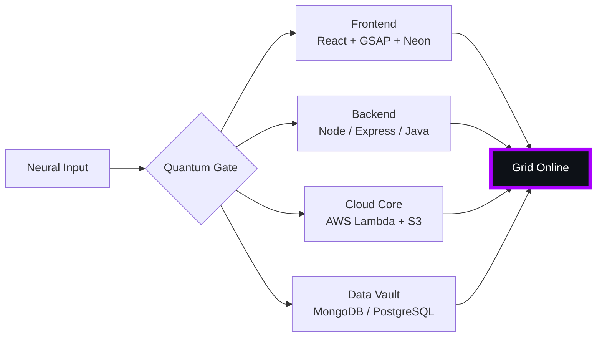

# 🌌 [ NEURAL CORE ACCESS: PENDEMVAMSI ]

<p align="center">
  
</p>

<div align="center">
  
  <br><small>Active Protocol: <strong style="color:#AA00FF">SHADOW EXTRACTION</strong> 🖤👁️</small>
</div>

## 🔵 NEURAL STATUS READOUT
```text
SUBJECT ID    →  PENDEMVAMSI
ENTITY CLASS  →  SHADOW MONARCH v7
NEURAL RANK   →  B-TIER
GRID SYNC     →  236/4261 QUANTUM PACKETS
─────── BIO-METRICS (SHADOW EXTRACTION) ───────
STRENGTH      134  █████████████████░░░░
AGILITY       115  ███████████████░░░░░░
INTELLIGENCE  138  ██████████████████░░░
VITALITY      107  ██████████████░░░░░░░
```

> **NEURAL BURST ACQUIRED:** +54 QUANTUM PACKETS 
> **SYSTEM MESSAGE:** VOID PROTOCOL ACTIVE — NO ESCAPE FROM THE GRID

---

## 🌀 GRID ARCHITECTURE (HOLOGRAPHIC RENDER)



---

## 📡 ACADEMIC NODES – CONQUERED
- [x] B.Tech Neural Engineering (2020–2024) – St. Ann’s Grid
- [x] Intermediate Quantum Core (2018–2020) – Sri Medhavi
- [x] SSC Primary Link (2017–2018) – Sri Geethanjali

---

## ⚡ SKILL NEURAL MATRIX

<details open>
<summary>🔌 ACTIVE NEURAL LINKS</summary>

| Node               | Tier | Integrity Bar                | Status      |
|--------------------|------|------------------------------|-------------|
| Java Core          | S    | ████████████████████ 100%   | OVERCLOCKED |
| Node.js Grid       | S    | ████████████████████ 100%   | OVERCLOCKED |
| React Holo-UI      | A+   | █████████████████░░░ 92%    | ONLINE      |
| AWS Quantum Relay  | S    | ████████████████████ 100%   | SOVEREIGN   |
| Python AI Kernel   | A    | ████████████████░░░░ 85%    | CHARGING    |
| DSA Void Algorithm | A    | █████████████████░░░ 90%    | ACTIVE      |

</details>

---

## 🏅 NEURAL ACHIEVEMENT TOKENS

<p align="center">
  
  
  
  
</p>

---

## 👾 SHADOW ENTITIES – SUMMONED

<p align="center">
  
  <br><strong style="color:#AA00FF">ARISE.</strong>
</p>

| Entity | Designation   | Class            | Source Node                     |
|--------|---------------|------------------|---------------------------------|
| SH-01  | Igris         | Void Commander   | AI Financial Oracle             |
| SH-02  | Beru          | Swarm Overlord   | WebRTC Quantum Stream           |
| SH-03  | Kaisel        | Void Wyrm        | Geolocation Shadow Relay        |
| SH-04  | Tusk          | Arcane Construct | Global Pandemic Sentinel        |
| SH-05  | Iron          | Armored Bastion  | React Crypto Fortress           |

---

## 📡 GRID ANALYTICS (LIVE FEED)

<p align="center">
  
  <br>
  
  
</p>

---

## 🖥️ CORRUPTED MAINFRAME LOG (401 ENTRIES)

<details>
<summary>OPEN TERMINAL FEED – PROTOCOL: SHADOW EXTRACTION</summary>

> [0x5FEBD8F0] 🖤👁️ **SHADOW EXTRACTION PROTOCOL** #0 | NEURAL LINK  [GLITCH DETECTED] STABILIZED | [TRANSMISSION SUCCESS]
> [0x2D67811B] 🖤👁️ **SHADOW EXTRACTION PROTOCOL** #1 | NEURAL LINK STABILIZED | [TRANSMISSION SUCCESS]
> [0xCD0D67EA] 🖤👁️ **SHADOW EXTRACTION PROTOCOL** #2 | NEURAL LINK STABILIZED | [TRANSMISSION SUCCESS]
> [0x8AEA69FF] 🖤👁️ **SHADOW EXTRACTION PROTOCOL** #3 | NEURAL LINK STABILIZED | [TRANSMISSION SUCCESS]
> [0xFA01C00D] 🖤👁️ **SHADOW EXTRACTION PROTOCOL** #4 | NEURAL LINK  [GLITCH DETECTED] STABILIZED | [TRANSMISSION SUCCESS]
> [0xC79E5598] 🖤👁️ **SHADOW EXTRACTION PROTOCOL** #5 | NEURAL LINK STABILIZED | [TRANSMISSION SUCCESS]
> [0xBF50F58F] 🖤👁️ **SHADOW EXTRACTION PROTOCOL** #6 | NEURAL LINK STABILIZED | [TRANSMISSION SUCCESS]
> [0x4FFB9EA5] 🖤👁️ **SHADOW EXTRACTION PROTOCOL** #7 | NEURAL LINK STABILIZED | [TRANSMISSION SUCCESS]
> [0x76FFE36A] 🖤👁️ **SHADOW EXTRACTION PROTOCOL** #8 | NEURAL LINK STABILIZED | [TRANSMISSION SUCCESS]
> [0xBC42AB8E] 🖤👁️ **SHADOW EXTRACTION PROTOCOL** #9 | NEURAL LINK STABILIZED | [TRANSMISSION SUCCESS]
> [0xD34ED420] 🖤👁️ **SHADOW EXTRACTION PROTOCOL** #10 | NEURAL LINK STABILIZED | [TRANSMISSION SUCCESS]
> [0xD94F98FB] 🖤👁️ **SHADOW EXTRACTION PROTOCOL** #11 | NEURAL LINK STABILIZED | [TRANSMISSION SUCCESS]
> [0x6E8F7E30] 🖤👁️ **SHADOW EXTRACTION PROTOCOL** #12 | NEURAL LINK STABILIZED | [TRANSMISSION SUCCESS]
> [0x616B7603] 🖤👁️ **SHADOW EXTRACTION PROTOCOL** #13 | NEURAL LINK  [GLITCH DETECTED] STABILIZED | [TRANSMISSION SUCCESS]
> [0x71CD679E] 🖤👁️ **SHADOW EXTRACTION PROTOCOL** #14 | NEURAL LINK STABILIZED | [TRANSMISSION SUCCESS]
> [0x8F536E90] 🖤👁️ **SHADOW EXTRACTION PROTOCOL** #15 | NEURAL LINK  [GLITCH DETECTED] STABILIZED | [TRANSMISSION SUCCESS]
> [0x0DA812B1] 🖤👁️ **SHADOW EXTRACTION PROTOCOL** #16 | NEURAL LINK  [GLITCH DETECTED] STABILIZED | [TRANSMISSION SUCCESS]
> [0x181ADFD7] 🖤👁️ **SHADOW EXTRACTION PROTOCOL** #17 | NEURAL LINK STABILIZED | [TRANSMISSION SUCCESS]
> [0x2B581930] 🖤👁️ **SHADOW EXTRACTION PROTOCOL** #18 | NEURAL LINK STABILIZED | [TRANSMISSION SUCCESS]
> [0x4334D817] 🖤👁️ **SHADOW EXTRACTION PROTOCOL** #19 | NEURAL LINK STABILIZED | [TRANSMISSION SUCCESS]
> [0x2F740665] 🖤👁️ **SHADOW EXTRACTION PROTOCOL** #20 | NEURAL LINK STABILIZED | [TRANSMISSION SUCCESS]
> [0x11C180E6] 🖤👁️ **SHADOW EXTRACTION PROTOCOL** #21 | NEURAL LINK STABILIZED | [TRANSMISSION SUCCESS]
> [0xF2A6E15B] 🖤👁️ **SHADOW EXTRACTION PROTOCOL** #22 | NEURAL LINK STABILIZED | [TRANSMISSION SUCCESS]
> [0xAB29FD90] 🖤👁️ **SHADOW EXTRACTION PROTOCOL** #23 | NEURAL LINK STABILIZED | [TRANSMISSION SUCCESS]
> [0x06D7D7FF] 🖤👁️ **SHADOW EXTRACTION PROTOCOL** #24 | NEURAL LINK STABILIZED | [TRANSMISSION SUCCESS]
> [0xA10B599B] 🖤👁️ **SHADOW EXTRACTION PROTOCOL** #25 | NEURAL LINK  [GLITCH DETECTED] STABILIZED | [TRANSMISSION SUCCESS]
> [0x934E67B8] 🖤👁️ **SHADOW EXTRACTION PROTOCOL** #26 | NEURAL LINK  [GLITCH DETECTED] STABILIZED | [TRANSMISSION SUCCESS]
> [0xA7432980] 🖤👁️ **SHADOW EXTRACTION PROTOCOL** #27 | NEURAL LINK STABILIZED | [TRANSMISSION SUCCESS]
> [0x9A0DD5F2] 🖤👁️ **SHADOW EXTRACTION PROTOCOL** #28 | NEURAL LINK STABILIZED | [TRANSMISSION SUCCESS]
> [0x8F7D4691] 🖤👁️ **SHADOW EXTRACTION PROTOCOL** #29 | NEURAL LINK STABILIZED | [TRANSMISSION SUCCESS]
> [0x4605D401] 🖤👁️ **SHADOW EXTRACTION PROTOCOL** #30 | NEURAL LINK  [GLITCH DETECTED] STABILIZED | [TRANSMISSION SUCCESS]
> [0xA767AB1C] 🖤👁️ **SHADOW EXTRACTION PROTOCOL** #31 | NEURAL LINK STABILIZED | [TRANSMISSION SUCCESS]
> [0x19D8A2DE] 🖤👁️ **SHADOW EXTRACTION PROTOCOL** #32 | NEURAL LINK STABILIZED | [TRANSMISSION SUCCESS]
> [0x4C7E5BC1] 🖤👁️ **SHADOW EXTRACTION PROTOCOL** #33 | NEURAL LINK STABILIZED | [TRANSMISSION SUCCESS]
> [0x21E90DB2] 🖤👁️ **SHADOW EXTRACTION PROTOCOL** #34 | NEURAL LINK STABILIZED | [TRANSMISSION SUCCESS]
> [0x14CE6EB6] 🖤👁️ **SHADOW EXTRACTION PROTOCOL** #35 | NEURAL LINK STABILIZED | [TRANSMISSION SUCCESS]
> [0xFF9EF188] 🖤👁️ **SHADOW EXTRACTION PROTOCOL** #36 | NEURAL LINK STABILIZED | [TRANSMISSION SUCCESS]
> [0x85D8F1D7] 🖤👁️ **SHADOW EXTRACTION PROTOCOL** #37 | NEURAL LINK STABILIZED | [TRANSMISSION SUCCESS]
> [0xD21E7C75] 🖤👁️ **SHADOW EXTRACTION PROTOCOL** #38 | NEURAL LINK STABILIZED | [TRANSMISSION SUCCESS]
> [0x84B436A0] 🖤👁️ **SHADOW EXTRACTION PROTOCOL** #39 | NEURAL LINK STABILIZED | [TRANSMISSION SUCCESS]
> [0xD3FE7C02] 🖤👁️ **SHADOW EXTRACTION PROTOCOL** #40 | NEURAL LINK STABILIZED | [TRANSMISSION SUCCESS]
> [0x39282B07] 🖤👁️ **SHADOW EXTRACTION PROTOCOL** #41 | NEURAL LINK  [GLITCH DETECTED] STABILIZED | [TRANSMISSION SUCCESS]
> [0x7E0A254F] 🖤👁️ **SHADOW EXTRACTION PROTOCOL** #42 | NEURAL LINK STABILIZED | [TRANSMISSION SUCCESS]
> [0x2290C450] 🖤👁️ **SHADOW EXTRACTION PROTOCOL** #43 | NEURAL LINK  [GLITCH DETECTED] STABILIZED | [TRANSMISSION SUCCESS]
> [0xC2316479] 🖤👁️ **SHADOW EXTRACTION PROTOCOL** #44 | NEURAL LINK STABILIZED | [TRANSMISSION SUCCESS]
> [0x3EA58DA0] 🖤👁️ **SHADOW EXTRACTION PROTOCOL** #45 | NEURAL LINK STABILIZED | [TRANSMISSION SUCCESS]
> [0xF312B23C] 🖤👁️ **SHADOW EXTRACTION PROTOCOL** #46 | NEURAL LINK  [GLITCH DETECTED] STABILIZED | [TRANSMISSION SUCCESS]
> [0xCE469B94] 🖤👁️ **SHADOW EXTRACTION PROTOCOL** #47 | NEURAL LINK STABILIZED | [TRANSMISSION SUCCESS]
> [0x4567C591] 🖤👁️ **SHADOW EXTRACTION PROTOCOL** #48 | NEURAL LINK STABILIZED | [TRANSMISSION SUCCESS]
> [0xAB9481B7] 🖤👁️ **SHADOW EXTRACTION PROTOCOL** #49 | NEURAL LINK STABILIZED | [TRANSMISSION SUCCESS]
> [0x9400B35B] 🖤👁️ **SHADOW EXTRACTION PROTOCOL** #50 | NEURAL LINK STABILIZED | [TRANSMISSION SUCCESS]
> [0xA9754C60] 🖤👁️ **SHADOW EXTRACTION PROTOCOL** #51 | NEURAL LINK STABILIZED | [TRANSMISSION SUCCESS]
> [0xFCA36AD0] 🖤👁️ **SHADOW EXTRACTION PROTOCOL** #52 | NEURAL LINK STABILIZED | [TRANSMISSION SUCCESS]
> [0x3A84DA98] 🖤👁️ **SHADOW EXTRACTION PROTOCOL** #53 | NEURAL LINK STABILIZED | [TRANSMISSION SUCCESS]
> [0x6A911FFD] 🖤👁️ **SHADOW EXTRACTION PROTOCOL** #54 | NEURAL LINK STABILIZED | [TRANSMISSION SUCCESS]
> [0xE5867B2D] 🖤👁️ **SHADOW EXTRACTION PROTOCOL** #55 | NEURAL LINK STABILIZED | [TRANSMISSION SUCCESS]
> [0x452F2B4A] 🖤👁️ **SHADOW EXTRACTION PROTOCOL** #56 | NEURAL LINK STABILIZED | [TRANSMISSION SUCCESS]
> [0x650BDEBD] 🖤👁️ **SHADOW EXTRACTION PROTOCOL** #57 | NEURAL LINK STABILIZED | [TRANSMISSION SUCCESS]
> [0x416FFDD5] 🖤👁️ **SHADOW EXTRACTION PROTOCOL** #58 | NEURAL LINK STABILIZED | [TRANSMISSION SUCCESS]
> [0xBD04DAAB] 🖤👁️ **SHADOW EXTRACTION PROTOCOL** #59 | NEURAL LINK STABILIZED | [TRANSMISSION SUCCESS]
> [0x248F41E4] 🖤👁️ **SHADOW EXTRACTION PROTOCOL** #60 | NEURAL LINK STABILIZED | [TRANSMISSION SUCCESS]
> [0x5CA317C9] 🖤👁️ **SHADOW EXTRACTION PROTOCOL** #61 | NEURAL LINK STABILIZED | [TRANSMISSION SUCCESS]
> [0x24AF3B78] 🖤👁️ **SHADOW EXTRACTION PROTOCOL** #62 | NEURAL LINK  [GLITCH DETECTED] STABILIZED | [TRANSMISSION SUCCESS]
> [0x98E5336C] 🖤👁️ **SHADOW EXTRACTION PROTOCOL** #63 | NEURAL LINK STABILIZED | [TRANSMISSION SUCCESS]
> [0x1B9E466B] 🖤👁️ **SHADOW EXTRACTION PROTOCOL** #64 | NEURAL LINK STABILIZED | [TRANSMISSION SUCCESS]
> [0xFF60A9F7] 🖤👁️ **SHADOW EXTRACTION PROTOCOL** #65 | NEURAL LINK STABILIZED | [TRANSMISSION SUCCESS]
> [0x38430400] 🖤👁️ **SHADOW EXTRACTION PROTOCOL** #66 | NEURAL LINK STABILIZED | [TRANSMISSION SUCCESS]
> [0x889C0120] 🖤👁️ **SHADOW EXTRACTION PROTOCOL** #67 | NEURAL LINK STABILIZED | [TRANSMISSION SUCCESS]
> [0x59658CFC] 🖤👁️ **SHADOW EXTRACTION PROTOCOL** #68 | NEURAL LINK  [GLITCH DETECTED] STABILIZED | [TRANSMISSION SUCCESS]
> [0x9F588E5C] 🖤👁️ **SHADOW EXTRACTION PROTOCOL** #69 | NEURAL LINK STABILIZED | [TRANSMISSION SUCCESS]
> [0xF579B4D8] 🖤👁️ **SHADOW EXTRACTION PROTOCOL** #70 | NEURAL LINK STABILIZED | [TRANSMISSION SUCCESS]
> [0x151AD4DC] 🖤👁️ **SHADOW EXTRACTION PROTOCOL** #71 | NEURAL LINK STABILIZED | [TRANSMISSION SUCCESS]
> [0xE9C8E45C] 🖤👁️ **SHADOW EXTRACTION PROTOCOL** #72 | NEURAL LINK STABILIZED | [TRANSMISSION SUCCESS]
> [0xAE37EEFE] 🖤👁️ **SHADOW EXTRACTION PROTOCOL** #73 | NEURAL LINK  [GLITCH DETECTED] STABILIZED | [TRANSMISSION SUCCESS]
> [0xC0028F1A] 🖤👁️ **SHADOW EXTRACTION PROTOCOL** #74 | NEURAL LINK  [GLITCH DETECTED] STABILIZED | [TRANSMISSION SUCCESS]
> [0x467D36CE] 🖤👁️ **SHADOW EXTRACTION PROTOCOL** #75 | NEURAL LINK  [GLITCH DETECTED] STABILIZED | [TRANSMISSION SUCCESS]
> [0x95F9446B] 🖤👁️ **SHADOW EXTRACTION PROTOCOL** #76 | NEURAL LINK STABILIZED | [TRANSMISSION SUCCESS]
> [0xB14BF76E] 🖤👁️ **SHADOW EXTRACTION PROTOCOL** #77 | NEURAL LINK STABILIZED | [TRANSMISSION SUCCESS]
> [0x3302EE39] 🖤👁️ **SHADOW EXTRACTION PROTOCOL** #78 | NEURAL LINK STABILIZED | [TRANSMISSION SUCCESS]
> [0xFE1C91F3] 🖤👁️ **SHADOW EXTRACTION PROTOCOL** #79 | NEURAL LINK STABILIZED | [TRANSMISSION SUCCESS]
> [0x13EC6336] 🖤👁️ **SHADOW EXTRACTION PROTOCOL** #80 | NEURAL LINK STABILIZED | [TRANSMISSION SUCCESS]
> [0xAAF5764E] 🖤👁️ **SHADOW EXTRACTION PROTOCOL** #81 | NEURAL LINK STABILIZED | [TRANSMISSION SUCCESS]
> [0xAA38BD41] 🖤👁️ **SHADOW EXTRACTION PROTOCOL** #82 | NEURAL LINK  [GLITCH DETECTED] STABILIZED | [TRANSMISSION SUCCESS]
> [0x59947C14] 🖤👁️ **SHADOW EXTRACTION PROTOCOL** #83 | NEURAL LINK  [GLITCH DETECTED] STABILIZED | [TRANSMISSION SUCCESS]
> [0x1A1F914D] 🖤👁️ **SHADOW EXTRACTION PROTOCOL** #84 | NEURAL LINK STABILIZED | [TRANSMISSION SUCCESS]
> [0x01981D34] 🖤👁️ **SHADOW EXTRACTION PROTOCOL** #85 | NEURAL LINK STABILIZED | [TRANSMISSION SUCCESS]
> [0x49D0BAF8] 🖤👁️ **SHADOW EXTRACTION PROTOCOL** #86 | NEURAL LINK STABILIZED | [TRANSMISSION SUCCESS]
> [0x9E1EC40E] 🖤👁️ **SHADOW EXTRACTION PROTOCOL** #87 | NEURAL LINK STABILIZED | [TRANSMISSION SUCCESS]
> [0x76D00159] 🖤👁️ **SHADOW EXTRACTION PROTOCOL** #88 | NEURAL LINK STABILIZED | [TRANSMISSION SUCCESS]
> [0xE88C9941] 🖤👁️ **SHADOW EXTRACTION PROTOCOL** #89 | NEURAL LINK  [GLITCH DETECTED] STABILIZED | [TRANSMISSION SUCCESS]
> [0xC1677785] 🖤👁️ **SHADOW EXTRACTION PROTOCOL** #90 | NEURAL LINK STABILIZED | [TRANSMISSION SUCCESS]
> [0x236947AC] 🖤👁️ **SHADOW EXTRACTION PROTOCOL** #91 | NEURAL LINK STABILIZED | [TRANSMISSION SUCCESS]
> [0xCFAEF8A1] 🖤👁️ **SHADOW EXTRACTION PROTOCOL** #92 | NEURAL LINK STABILIZED | [TRANSMISSION SUCCESS]
> [0xFE51C4E5] 🖤👁️ **SHADOW EXTRACTION PROTOCOL** #93 | NEURAL LINK STABILIZED | [TRANSMISSION SUCCESS]
> [0xCA935A22] 🖤👁️ **SHADOW EXTRACTION PROTOCOL** #94 | NEURAL LINK  [GLITCH DETECTED] STABILIZED | [TRANSMISSION SUCCESS]
> [0x225856E2] 🖤👁️ **SHADOW EXTRACTION PROTOCOL** #95 | NEURAL LINK STABILIZED | [TRANSMISSION SUCCESS]
> [0x3231C261] 🖤👁️ **SHADOW EXTRACTION PROTOCOL** #96 | NEURAL LINK  [GLITCH DETECTED] STABILIZED | [TRANSMISSION SUCCESS]
> [0xBBD5C0D0] 🖤👁️ **SHADOW EXTRACTION PROTOCOL** #97 | NEURAL LINK STABILIZED | [TRANSMISSION SUCCESS]
> [0xFDF1B1D9] 🖤👁️ **SHADOW EXTRACTION PROTOCOL** #98 | NEURAL LINK STABILIZED | [TRANSMISSION SUCCESS]
> [0xD44115F5] 🖤👁️ **SHADOW EXTRACTION PROTOCOL** #99 | NEURAL LINK STABILIZED | [TRANSMISSION SUCCESS]
> [0x1561C3BC] 🖤👁️ **SHADOW EXTRACTION PROTOCOL** #100 | NEURAL LINK STABILIZED | [TRANSMISSION SUCCESS]
> [0x1D2866DD] 🖤👁️ **SHADOW EXTRACTION PROTOCOL** #101 | NEURAL LINK STABILIZED | [TRANSMISSION SUCCESS]
> [0x5B2E02CF] 🖤👁️ **SHADOW EXTRACTION PROTOCOL** #102 | NEURAL LINK STABILIZED | [TRANSMISSION SUCCESS]
> [0xBE762518] 🖤👁️ **SHADOW EXTRACTION PROTOCOL** #103 | NEURAL LINK STABILIZED | [TRANSMISSION SUCCESS]
> [0x665B72F1] 🖤👁️ **SHADOW EXTRACTION PROTOCOL** #104 | NEURAL LINK STABILIZED | [TRANSMISSION SUCCESS]
> [0x64F106F5] 🖤👁️ **SHADOW EXTRACTION PROTOCOL** #105 | NEURAL LINK STABILIZED | [TRANSMISSION SUCCESS]
> [0x5AE03C4F] 🖤👁️ **SHADOW EXTRACTION PROTOCOL** #106 | NEURAL LINK STABILIZED | [TRANSMISSION SUCCESS]
> [0xD2D1999F] 🖤👁️ **SHADOW EXTRACTION PROTOCOL** #107 | NEURAL LINK  [GLITCH DETECTED] STABILIZED | [TRANSMISSION SUCCESS]
> [0x42F140DE] 🖤👁️ **SHADOW EXTRACTION PROTOCOL** #108 | NEURAL LINK STABILIZED | [TRANSMISSION SUCCESS]
> [0xAB97E2F6] 🖤👁️ **SHADOW EXTRACTION PROTOCOL** #109 | NEURAL LINK  [GLITCH DETECTED] STABILIZED | [TRANSMISSION SUCCESS]
> [0x524FF834] 🖤👁️ **SHADOW EXTRACTION PROTOCOL** #110 | NEURAL LINK STABILIZED | [TRANSMISSION SUCCESS]
> [0x2642ECAB] 🖤👁️ **SHADOW EXTRACTION PROTOCOL** #111 | NEURAL LINK STABILIZED | [TRANSMISSION SUCCESS]
> [0x60A9B9A5] 🖤👁️ **SHADOW EXTRACTION PROTOCOL** #112 | NEURAL LINK STABILIZED | [TRANSMISSION SUCCESS]
> [0xFC9FB487] 🖤👁️ **SHADOW EXTRACTION PROTOCOL** #113 | NEURAL LINK  [GLITCH DETECTED] STABILIZED | [TRANSMISSION SUCCESS]
> [0xDB6CA5BD] 🖤👁️ **SHADOW EXTRACTION PROTOCOL** #114 | NEURAL LINK  [GLITCH DETECTED] STABILIZED | [TRANSMISSION SUCCESS]
> [0xBC3C1B21] 🖤👁️ **SHADOW EXTRACTION PROTOCOL** #115 | NEURAL LINK STABILIZED | [TRANSMISSION SUCCESS]
> [0xE15C35DC] 🖤👁️ **SHADOW EXTRACTION PROTOCOL** #116 | NEURAL LINK STABILIZED | [TRANSMISSION SUCCESS]
> [0xFA9B6261] 🖤👁️ **SHADOW EXTRACTION PROTOCOL** #117 | NEURAL LINK STABILIZED | [TRANSMISSION SUCCESS]
> [0xB51DAC0D] 🖤👁️ **SHADOW EXTRACTION PROTOCOL** #118 | NEURAL LINK  [GLITCH DETECTED] STABILIZED | [TRANSMISSION SUCCESS]
> [0x44282030] 🖤👁️ **SHADOW EXTRACTION PROTOCOL** #119 | NEURAL LINK  [GLITCH DETECTED] STABILIZED | [TRANSMISSION SUCCESS]
> [0x75260199] 🖤👁️ **SHADOW EXTRACTION PROTOCOL** #120 | NEURAL LINK STABILIZED | [TRANSMISSION SUCCESS]
> [0x3C6312E3] 🖤👁️ **SHADOW EXTRACTION PROTOCOL** #121 | NEURAL LINK STABILIZED | [TRANSMISSION SUCCESS]
> [0xB63C9D3E] 🖤👁️ **SHADOW EXTRACTION PROTOCOL** #122 | NEURAL LINK STABILIZED | [TRANSMISSION SUCCESS]
> [0xA1142EE8] 🖤👁️ **SHADOW EXTRACTION PROTOCOL** #123 | NEURAL LINK STABILIZED | [TRANSMISSION SUCCESS]
> [0xE062D92E] 🖤👁️ **SHADOW EXTRACTION PROTOCOL** #124 | NEURAL LINK STABILIZED | [TRANSMISSION SUCCESS]
> [0x02FAD70F] 🖤👁️ **SHADOW EXTRACTION PROTOCOL** #125 | NEURAL LINK  [GLITCH DETECTED] STABILIZED | [TRANSMISSION SUCCESS]
> [0x7C703B44] 🖤👁️ **SHADOW EXTRACTION PROTOCOL** #126 | NEURAL LINK STABILIZED | [TRANSMISSION SUCCESS]
> [0xC7C98EC6] 🖤👁️ **SHADOW EXTRACTION PROTOCOL** #127 | NEURAL LINK STABILIZED | [TRANSMISSION SUCCESS]
> [0xFFDA2B7B] 🖤👁️ **SHADOW EXTRACTION PROTOCOL** #128 | NEURAL LINK  [GLITCH DETECTED] STABILIZED | [TRANSMISSION SUCCESS]
> [0xCA92FDA7] 🖤👁️ **SHADOW EXTRACTION PROTOCOL** #129 | NEURAL LINK  [GLITCH DETECTED] STABILIZED | [TRANSMISSION SUCCESS]
> [0x08FF287D] 🖤👁️ **SHADOW EXTRACTION PROTOCOL** #130 | NEURAL LINK STABILIZED | [TRANSMISSION SUCCESS]
> [0xAD5DA561] 🖤👁️ **SHADOW EXTRACTION PROTOCOL** #131 | NEURAL LINK STABILIZED | [TRANSMISSION SUCCESS]
> [0xC2174DEC] 🖤👁️ **SHADOW EXTRACTION PROTOCOL** #132 | NEURAL LINK STABILIZED | [TRANSMISSION SUCCESS]
> [0x8434382D] 🖤👁️ **SHADOW EXTRACTION PROTOCOL** #133 | NEURAL LINK STABILIZED | [TRANSMISSION SUCCESS]
> [0x89794363] 🖤👁️ **SHADOW EXTRACTION PROTOCOL** #134 | NEURAL LINK STABILIZED | [TRANSMISSION SUCCESS]
> [0xE5932C23] 🖤👁️ **SHADOW EXTRACTION PROTOCOL** #135 | NEURAL LINK STABILIZED | [TRANSMISSION SUCCESS]
> [0xEA021C38] 🖤👁️ **SHADOW EXTRACTION PROTOCOL** #136 | NEURAL LINK STABILIZED | [TRANSMISSION SUCCESS]
> [0x839DC46B] 🖤👁️ **SHADOW EXTRACTION PROTOCOL** #137 | NEURAL LINK STABILIZED | [TRANSMISSION SUCCESS]
> [0x48E77B3D] 🖤👁️ **SHADOW EXTRACTION PROTOCOL** #138 | NEURAL LINK STABILIZED | [TRANSMISSION SUCCESS]
> [0x4FE8AA91] 🖤👁️ **SHADOW EXTRACTION PROTOCOL** #139 | NEURAL LINK STABILIZED | [TRANSMISSION SUCCESS]
> [0x7985C23F] 🖤👁️ **SHADOW EXTRACTION PROTOCOL** #140 | NEURAL LINK STABILIZED | [TRANSMISSION SUCCESS]
> [0xEB96E70E] 🖤👁️ **SHADOW EXTRACTION PROTOCOL** #141 | NEURAL LINK STABILIZED | [TRANSMISSION SUCCESS]
> [0x952F8FB1] 🖤👁️ **SHADOW EXTRACTION PROTOCOL** #142 | NEURAL LINK STABILIZED | [TRANSMISSION SUCCESS]
> [0xD20AD390] 🖤👁️ **SHADOW EXTRACTION PROTOCOL** #143 | NEURAL LINK STABILIZED | [TRANSMISSION SUCCESS]
> [0xA651E47F] 🖤👁️ **SHADOW EXTRACTION PROTOCOL** #144 | NEURAL LINK STABILIZED | [TRANSMISSION SUCCESS]
> [0xC0BBA1A2] 🖤👁️ **SHADOW EXTRACTION PROTOCOL** #145 | NEURAL LINK STABILIZED | [TRANSMISSION SUCCESS]
> [0x1469475F] 🖤👁️ **SHADOW EXTRACTION PROTOCOL** #146 | NEURAL LINK STABILIZED | [TRANSMISSION SUCCESS]
> [0x8A74882A] 🖤👁️ **SHADOW EXTRACTION PROTOCOL** #147 | NEURAL LINK STABILIZED | [TRANSMISSION SUCCESS]
> [0x9121A68F] 🖤👁️ **SHADOW EXTRACTION PROTOCOL** #148 | NEURAL LINK STABILIZED | [TRANSMISSION SUCCESS]
> [0xBA91A659] 🖤👁️ **SHADOW EXTRACTION PROTOCOL** #149 | NEURAL LINK STABILIZED | [TRANSMISSION SUCCESS]
> [0x579D5EAB] 🖤👁️ **SHADOW EXTRACTION PROTOCOL** #150 | NEURAL LINK STABILIZED | [TRANSMISSION SUCCESS]
> [0x9B4380BF] 🖤👁️ **SHADOW EXTRACTION PROTOCOL** #151 | NEURAL LINK STABILIZED | [TRANSMISSION SUCCESS]
> [0xF5128DA2] 🖤👁️ **SHADOW EXTRACTION PROTOCOL** #152 | NEURAL LINK STABILIZED | [TRANSMISSION SUCCESS]
> [0x2A971DBA] 🖤👁️ **SHADOW EXTRACTION PROTOCOL** #153 | NEURAL LINK  [GLITCH DETECTED] STABILIZED | [TRANSMISSION SUCCESS]
> [0x1A7507D2] 🖤👁️ **SHADOW EXTRACTION PROTOCOL** #154 | NEURAL LINK STABILIZED | [TRANSMISSION SUCCESS]
> [0x8640DD3A] 🖤👁️ **SHADOW EXTRACTION PROTOCOL** #155 | NEURAL LINK STABILIZED | [TRANSMISSION SUCCESS]
> [0x98369485] 🖤👁️ **SHADOW EXTRACTION PROTOCOL** #156 | NEURAL LINK STABILIZED | [TRANSMISSION SUCCESS]
> [0xDDAA2FC2] 🖤👁️ **SHADOW EXTRACTION PROTOCOL** #157 | NEURAL LINK STABILIZED | [TRANSMISSION SUCCESS]
> [0x2B0B969D] 🖤👁️ **SHADOW EXTRACTION PROTOCOL** #158 | NEURAL LINK STABILIZED | [TRANSMISSION SUCCESS]
> [0xFCBB2550] 🖤👁️ **SHADOW EXTRACTION PROTOCOL** #159 | NEURAL LINK STABILIZED | [TRANSMISSION SUCCESS]
> [0x93B532ED] 🖤👁️ **SHADOW EXTRACTION PROTOCOL** #160 | NEURAL LINK STABILIZED | [TRANSMISSION SUCCESS]
> [0xF870CEE5] 🖤👁️ **SHADOW EXTRACTION PROTOCOL** #161 | NEURAL LINK STABILIZED | [TRANSMISSION SUCCESS]
> [0xF5E7A026] 🖤👁️ **SHADOW EXTRACTION PROTOCOL** #162 | NEURAL LINK STABILIZED | [TRANSMISSION SUCCESS]
> [0x90AB0BBB] 🖤👁️ **SHADOW EXTRACTION PROTOCOL** #163 | NEURAL LINK STABILIZED | [TRANSMISSION SUCCESS]
> [0xC27F487E] 🖤👁️ **SHADOW EXTRACTION PROTOCOL** #164 | NEURAL LINK  [GLITCH DETECTED] STABILIZED | [TRANSMISSION SUCCESS]
> [0xEF97E7B0] 🖤👁️ **SHADOW EXTRACTION PROTOCOL** #165 | NEURAL LINK STABILIZED | [TRANSMISSION SUCCESS]
> [0x3162B9B9] 🖤👁️ **SHADOW EXTRACTION PROTOCOL** #166 | NEURAL LINK STABILIZED | [TRANSMISSION SUCCESS]
> [0x098CB375] 🖤👁️ **SHADOW EXTRACTION PROTOCOL** #167 | NEURAL LINK STABILIZED | [TRANSMISSION SUCCESS]
> [0xE80243C6] 🖤👁️ **SHADOW EXTRACTION PROTOCOL** #168 | NEURAL LINK STABILIZED | [TRANSMISSION SUCCESS]
> [0x3A3FC639] 🖤👁️ **SHADOW EXTRACTION PROTOCOL** #169 | NEURAL LINK STABILIZED | [TRANSMISSION SUCCESS]
> [0x55ED54D0] 🖤👁️ **SHADOW EXTRACTION PROTOCOL** #170 | NEURAL LINK STABILIZED | [TRANSMISSION SUCCESS]
> [0xC4478531] 🖤👁️ **SHADOW EXTRACTION PROTOCOL** #171 | NEURAL LINK STABILIZED | [TRANSMISSION SUCCESS]
> [0x45222B0E] 🖤👁️ **SHADOW EXTRACTION PROTOCOL** #172 | NEURAL LINK STABILIZED | [TRANSMISSION SUCCESS]
> [0xF42AB625] 🖤👁️ **SHADOW EXTRACTION PROTOCOL** #173 | NEURAL LINK STABILIZED | [TRANSMISSION SUCCESS]
> [0x460B843D] 🖤👁️ **SHADOW EXTRACTION PROTOCOL** #174 | NEURAL LINK STABILIZED | [TRANSMISSION SUCCESS]
> [0x219A5BFA] 🖤👁️ **SHADOW EXTRACTION PROTOCOL** #175 | NEURAL LINK STABILIZED | [TRANSMISSION SUCCESS]
> [0x05069684] 🖤👁️ **SHADOW EXTRACTION PROTOCOL** #176 | NEURAL LINK STABILIZED | [TRANSMISSION SUCCESS]
> [0x7D166C8B] 🖤👁️ **SHADOW EXTRACTION PROTOCOL** #177 | NEURAL LINK STABILIZED | [TRANSMISSION SUCCESS]
> [0xBD82B5A5] 🖤👁️ **SHADOW EXTRACTION PROTOCOL** #178 | NEURAL LINK STABILIZED | [TRANSMISSION SUCCESS]
> [0xCBE814B5] 🖤👁️ **SHADOW EXTRACTION PROTOCOL** #179 | NEURAL LINK STABILIZED | [TRANSMISSION SUCCESS]
> [0x4303A9DC] 🖤👁️ **SHADOW EXTRACTION PROTOCOL** #180 | NEURAL LINK STABILIZED | [TRANSMISSION SUCCESS]
> [0xD33E2482] 🖤👁️ **SHADOW EXTRACTION PROTOCOL** #181 | NEURAL LINK STABILIZED | [TRANSMISSION SUCCESS]
> [0xE89190A6] 🖤👁️ **SHADOW EXTRACTION PROTOCOL** #182 | NEURAL LINK  [GLITCH DETECTED] STABILIZED | [TRANSMISSION SUCCESS]
> [0x2BB35678] 🖤👁️ **SHADOW EXTRACTION PROTOCOL** #183 | NEURAL LINK STABILIZED | [TRANSMISSION SUCCESS]
> [0x49C98384] 🖤👁️ **SHADOW EXTRACTION PROTOCOL** #184 | NEURAL LINK STABILIZED | [TRANSMISSION SUCCESS]
> [0x3807C8BD] 🖤👁️ **SHADOW EXTRACTION PROTOCOL** #185 | NEURAL LINK STABILIZED | [TRANSMISSION SUCCESS]
> [0x18284274] 🖤👁️ **SHADOW EXTRACTION PROTOCOL** #186 | NEURAL LINK STABILIZED | [TRANSMISSION SUCCESS]
> [0x5FE42A4A] 🖤👁️ **SHADOW EXTRACTION PROTOCOL** #187 | NEURAL LINK STABILIZED | [TRANSMISSION SUCCESS]
> [0xE861735E] 🖤👁️ **SHADOW EXTRACTION PROTOCOL** #188 | NEURAL LINK STABILIZED | [TRANSMISSION SUCCESS]
> [0x7015F69F] 🖤👁️ **SHADOW EXTRACTION PROTOCOL** #189 | NEURAL LINK STABILIZED | [TRANSMISSION SUCCESS]
> [0x50EADEE1] 🖤👁️ **SHADOW EXTRACTION PROTOCOL** #190 | NEURAL LINK  [GLITCH DETECTED] STABILIZED | [TRANSMISSION SUCCESS]
> [0xB08F0049] 🖤👁️ **SHADOW EXTRACTION PROTOCOL** #191 | NEURAL LINK  [GLITCH DETECTED] STABILIZED | [TRANSMISSION SUCCESS]
> [0x4DF1AA2F] 🖤👁️ **SHADOW EXTRACTION PROTOCOL** #192 | NEURAL LINK STABILIZED | [TRANSMISSION SUCCESS]
> [0xC93BBF4C] 🖤👁️ **SHADOW EXTRACTION PROTOCOL** #193 | NEURAL LINK STABILIZED | [TRANSMISSION SUCCESS]
> [0x508D197A] 🖤👁️ **SHADOW EXTRACTION PROTOCOL** #194 | NEURAL LINK STABILIZED | [TRANSMISSION SUCCESS]
> [0xE883D64C] 🖤👁️ **SHADOW EXTRACTION PROTOCOL** #195 | NEURAL LINK STABILIZED | [TRANSMISSION SUCCESS]
> [0x15807316] 🖤👁️ **SHADOW EXTRACTION PROTOCOL** #196 | NEURAL LINK STABILIZED | [TRANSMISSION SUCCESS]
> [0xF88E7922] 🖤👁️ **SHADOW EXTRACTION PROTOCOL** #197 | NEURAL LINK STABILIZED | [TRANSMISSION SUCCESS]
> [0xDB947DC6] 🖤👁️ **SHADOW EXTRACTION PROTOCOL** #198 | NEURAL LINK  [GLITCH DETECTED] STABILIZED | [TRANSMISSION SUCCESS]
> [0x5C4874CA] 🖤👁️ **SHADOW EXTRACTION PROTOCOL** #199 | NEURAL LINK STABILIZED | [TRANSMISSION SUCCESS]
> [0xE324F13D] 🖤👁️ **SHADOW EXTRACTION PROTOCOL** #200 | NEURAL LINK STABILIZED | [TRANSMISSION SUCCESS]
> [0x969F1E7E] 🖤👁️ **SHADOW EXTRACTION PROTOCOL** #201 | NEURAL LINK STABILIZED | [TRANSMISSION SUCCESS]
> [0x15F787EB] 🖤👁️ **SHADOW EXTRACTION PROTOCOL** #202 | NEURAL LINK  [GLITCH DETECTED] STABILIZED | [TRANSMISSION SUCCESS]
> [0x280ABFBB] 🖤👁️ **SHADOW EXTRACTION PROTOCOL** #203 | NEURAL LINK STABILIZED | [TRANSMISSION SUCCESS]
> [0xEDCC9EB9] 🖤👁️ **SHADOW EXTRACTION PROTOCOL** #204 | NEURAL LINK STABILIZED | [TRANSMISSION SUCCESS]
> [0x9E5B0C58] 🖤👁️ **SHADOW EXTRACTION PROTOCOL** #205 | NEURAL LINK STABILIZED | [TRANSMISSION SUCCESS]
> [0x3C30EF49] 🖤👁️ **SHADOW EXTRACTION PROTOCOL** #206 | NEURAL LINK  [GLITCH DETECTED] STABILIZED | [TRANSMISSION SUCCESS]
> [0x99E5CA95] 🖤👁️ **SHADOW EXTRACTION PROTOCOL** #207 | NEURAL LINK STABILIZED | [TRANSMISSION SUCCESS]
> [0xDBD05CD6] 🖤👁️ **SHADOW EXTRACTION PROTOCOL** #208 | NEURAL LINK STABILIZED | [TRANSMISSION SUCCESS]
> [0xAFFC608F] 🖤👁️ **SHADOW EXTRACTION PROTOCOL** #209 | NEURAL LINK STABILIZED | [TRANSMISSION SUCCESS]
> [0x3B07C123] 🖤👁️ **SHADOW EXTRACTION PROTOCOL** #210 | NEURAL LINK STABILIZED | [TRANSMISSION SUCCESS]
> [0xBAF36D2C] 🖤👁️ **SHADOW EXTRACTION PROTOCOL** #211 | NEURAL LINK STABILIZED | [TRANSMISSION SUCCESS]
> [0xF86C507E] 🖤👁️ **SHADOW EXTRACTION PROTOCOL** #212 | NEURAL LINK STABILIZED | [TRANSMISSION SUCCESS]
> [0xE39E7E08] 🖤👁️ **SHADOW EXTRACTION PROTOCOL** #213 | NEURAL LINK STABILIZED | [TRANSMISSION SUCCESS]
> [0x91400DDE] 🖤👁️ **SHADOW EXTRACTION PROTOCOL** #214 | NEURAL LINK STABILIZED | [TRANSMISSION SUCCESS]
> [0x12AD6BCB] 🖤👁️ **SHADOW EXTRACTION PROTOCOL** #215 | NEURAL LINK  [GLITCH DETECTED] STABILIZED | [TRANSMISSION SUCCESS]
> [0xBC2C0492] 🖤👁️ **SHADOW EXTRACTION PROTOCOL** #216 | NEURAL LINK STABILIZED | [TRANSMISSION SUCCESS]
> [0x831135ED] 🖤👁️ **SHADOW EXTRACTION PROTOCOL** #217 | NEURAL LINK STABILIZED | [TRANSMISSION SUCCESS]
> [0x31A953CB] 🖤👁️ **SHADOW EXTRACTION PROTOCOL** #218 | NEURAL LINK STABILIZED | [TRANSMISSION SUCCESS]
> [0x28885645] 🖤👁️ **SHADOW EXTRACTION PROTOCOL** #219 | NEURAL LINK STABILIZED | [TRANSMISSION SUCCESS]
> [0x0221ED07] 🖤👁️ **SHADOW EXTRACTION PROTOCOL** #220 | NEURAL LINK STABILIZED | [TRANSMISSION SUCCESS]
> [0x7719D3B8] 🖤👁️ **SHADOW EXTRACTION PROTOCOL** #221 | NEURAL LINK  [GLITCH DETECTED] STABILIZED | [TRANSMISSION SUCCESS]
> [0x0A913324] 🖤👁️ **SHADOW EXTRACTION PROTOCOL** #222 | NEURAL LINK STABILIZED | [TRANSMISSION SUCCESS]
> [0x92F8C849] 🖤👁️ **SHADOW EXTRACTION PROTOCOL** #223 | NEURAL LINK STABILIZED | [TRANSMISSION SUCCESS]
> [0xC16EC643] 🖤👁️ **SHADOW EXTRACTION PROTOCOL** #224 | NEURAL LINK STABILIZED | [TRANSMISSION SUCCESS]
> [0xED55ED69] 🖤👁️ **SHADOW EXTRACTION PROTOCOL** #225 | NEURAL LINK  [GLITCH DETECTED] STABILIZED | [TRANSMISSION SUCCESS]
> [0x3CF82650] 🖤👁️ **SHADOW EXTRACTION PROTOCOL** #226 | NEURAL LINK STABILIZED | [TRANSMISSION SUCCESS]
> [0xD10AFC85] 🖤👁️ **SHADOW EXTRACTION PROTOCOL** #227 | NEURAL LINK STABILIZED | [TRANSMISSION SUCCESS]
> [0x49BD6548] 🖤👁️ **SHADOW EXTRACTION PROTOCOL** #228 | NEURAL LINK STABILIZED | [TRANSMISSION SUCCESS]
> [0x29984988] 🖤👁️ **SHADOW EXTRACTION PROTOCOL** #229 | NEURAL LINK STABILIZED | [TRANSMISSION SUCCESS]
> [0xE0163515] 🖤👁️ **SHADOW EXTRACTION PROTOCOL** #230 | NEURAL LINK STABILIZED | [TRANSMISSION SUCCESS]
> [0x7265CEA4] 🖤👁️ **SHADOW EXTRACTION PROTOCOL** #231 | NEURAL LINK STABILIZED | [TRANSMISSION SUCCESS]
> [0xA4B724F9] 🖤👁️ **SHADOW EXTRACTION PROTOCOL** #232 | NEURAL LINK STABILIZED | [TRANSMISSION SUCCESS]
> [0x4816B3C3] 🖤👁️ **SHADOW EXTRACTION PROTOCOL** #233 | NEURAL LINK STABILIZED | [TRANSMISSION SUCCESS]
> [0x0DEA5640] 🖤👁️ **SHADOW EXTRACTION PROTOCOL** #234 | NEURAL LINK STABILIZED | [TRANSMISSION SUCCESS]
> [0x0D814933] 🖤👁️ **SHADOW EXTRACTION PROTOCOL** #235 | NEURAL LINK STABILIZED | [TRANSMISSION SUCCESS]
> [0xD07892E2] 🖤👁️ **SHADOW EXTRACTION PROTOCOL** #236 | NEURAL LINK STABILIZED | [TRANSMISSION SUCCESS]
> [0x862326E5] 🖤👁️ **SHADOW EXTRACTION PROTOCOL** #237 | NEURAL LINK STABILIZED | [TRANSMISSION SUCCESS]
> [0x49D7A436] 🖤👁️ **SHADOW EXTRACTION PROTOCOL** #238 | NEURAL LINK STABILIZED | [TRANSMISSION SUCCESS]
> [0xDCA0E839] 🖤👁️ **SHADOW EXTRACTION PROTOCOL** #239 | NEURAL LINK STABILIZED | [TRANSMISSION SUCCESS]
> [0xA8B83341] 🖤👁️ **SHADOW EXTRACTION PROTOCOL** #240 | NEURAL LINK STABILIZED | [TRANSMISSION SUCCESS]
> [0x0BDB241E] 🖤👁️ **SHADOW EXTRACTION PROTOCOL** #241 | NEURAL LINK STABILIZED | [TRANSMISSION SUCCESS]
> [0x3813D33A] 🖤👁️ **SHADOW EXTRACTION PROTOCOL** #242 | NEURAL LINK STABILIZED | [TRANSMISSION SUCCESS]
> [0xBEEA5040] 🖤👁️ **SHADOW EXTRACTION PROTOCOL** #243 | NEURAL LINK STABILIZED | [TRANSMISSION SUCCESS]
> [0xF6BD2C47] 🖤👁️ **SHADOW EXTRACTION PROTOCOL** #244 | NEURAL LINK STABILIZED | [TRANSMISSION SUCCESS]
> [0x4720686C] 🖤👁️ **SHADOW EXTRACTION PROTOCOL** #245 | NEURAL LINK STABILIZED | [TRANSMISSION SUCCESS]
> [0x3F899EEB] 🖤👁️ **SHADOW EXTRACTION PROTOCOL** #246 | NEURAL LINK STABILIZED | [TRANSMISSION SUCCESS]
> [0x78FB5DE8] 🖤👁️ **SHADOW EXTRACTION PROTOCOL** #247 | NEURAL LINK STABILIZED | [TRANSMISSION SUCCESS]
> [0xB76D0014] 🖤👁️ **SHADOW EXTRACTION PROTOCOL** #248 | NEURAL LINK  [GLITCH DETECTED] STABILIZED | [TRANSMISSION SUCCESS]
> [0xF1AADF4E] 🖤👁️ **SHADOW EXTRACTION PROTOCOL** #249 | NEURAL LINK STABILIZED | [TRANSMISSION SUCCESS]
> [0x05C48F36] 🖤👁️ **SHADOW EXTRACTION PROTOCOL** #250 | NEURAL LINK STABILIZED | [TRANSMISSION SUCCESS]
> [0x58978676] 🖤👁️ **SHADOW EXTRACTION PROTOCOL** #251 | NEURAL LINK STABILIZED | [TRANSMISSION SUCCESS]
> [0x78BBBFD7] 🖤👁️ **SHADOW EXTRACTION PROTOCOL** #252 | NEURAL LINK STABILIZED | [TRANSMISSION SUCCESS]
> [0x4A186F54] 🖤👁️ **SHADOW EXTRACTION PROTOCOL** #253 | NEURAL LINK  [GLITCH DETECTED] STABILIZED | [TRANSMISSION SUCCESS]
> [0x00487763] 🖤👁️ **SHADOW EXTRACTION PROTOCOL** #254 | NEURAL LINK STABILIZED | [TRANSMISSION SUCCESS]
> [0xE0D76196] 🖤👁️ **SHADOW EXTRACTION PROTOCOL** #255 | NEURAL LINK STABILIZED | [TRANSMISSION SUCCESS]
> [0x51867AF0] 🖤👁️ **SHADOW EXTRACTION PROTOCOL** #256 | NEURAL LINK  [GLITCH DETECTED] STABILIZED | [TRANSMISSION SUCCESS]
> [0xB6283E13] 🖤👁️ **SHADOW EXTRACTION PROTOCOL** #257 | NEURAL LINK STABILIZED | [TRANSMISSION SUCCESS]
> [0xE458A459] 🖤👁️ **SHADOW EXTRACTION PROTOCOL** #258 | NEURAL LINK STABILIZED | [TRANSMISSION SUCCESS]
> [0xDAC904F6] 🖤👁️ **SHADOW EXTRACTION PROTOCOL** #259 | NEURAL LINK STABILIZED | [TRANSMISSION SUCCESS]
> [0xB42626E6] 🖤👁️ **SHADOW EXTRACTION PROTOCOL** #260 | NEURAL LINK STABILIZED | [TRANSMISSION SUCCESS]
> [0x70CEBA1E] 🖤👁️ **SHADOW EXTRACTION PROTOCOL** #261 | NEURAL LINK STABILIZED | [TRANSMISSION SUCCESS]
> [0xB8C430CD] 🖤👁️ **SHADOW EXTRACTION PROTOCOL** #262 | NEURAL LINK STABILIZED | [TRANSMISSION SUCCESS]
> [0x8C7A533C] 🖤👁️ **SHADOW EXTRACTION PROTOCOL** #263 | NEURAL LINK STABILIZED | [TRANSMISSION SUCCESS]
> [0x39841331] 🖤👁️ **SHADOW EXTRACTION PROTOCOL** #264 | NEURAL LINK STABILIZED | [TRANSMISSION SUCCESS]
> [0x7116A098] 🖤👁️ **SHADOW EXTRACTION PROTOCOL** #265 | NEURAL LINK STABILIZED | [TRANSMISSION SUCCESS]
> [0xC9249D78] 🖤👁️ **SHADOW EXTRACTION PROTOCOL** #266 | NEURAL LINK STABILIZED | [TRANSMISSION SUCCESS]
> [0x7DA16D3A] 🖤👁️ **SHADOW EXTRACTION PROTOCOL** #267 | NEURAL LINK STABILIZED | [TRANSMISSION SUCCESS]
> [0xDFA4DFE1] 🖤👁️ **SHADOW EXTRACTION PROTOCOL** #268 | NEURAL LINK STABILIZED | [TRANSMISSION SUCCESS]
> [0xF5EE4E1C] 🖤👁️ **SHADOW EXTRACTION PROTOCOL** #269 | NEURAL LINK STABILIZED | [TRANSMISSION SUCCESS]
> [0x561233B8] 🖤👁️ **SHADOW EXTRACTION PROTOCOL** #270 | NEURAL LINK STABILIZED | [TRANSMISSION SUCCESS]
> [0xAE253479] 🖤👁️ **SHADOW EXTRACTION PROTOCOL** #271 | NEURAL LINK STABILIZED | [TRANSMISSION SUCCESS]
> [0x6C283409] 🖤👁️ **SHADOW EXTRACTION PROTOCOL** #272 | NEURAL LINK STABILIZED | [TRANSMISSION SUCCESS]
> [0x024F1B5E] 🖤👁️ **SHADOW EXTRACTION PROTOCOL** #273 | NEURAL LINK STABILIZED | [TRANSMISSION SUCCESS]
> [0xC9C3CF65] 🖤👁️ **SHADOW EXTRACTION PROTOCOL** #274 | NEURAL LINK STABILIZED | [TRANSMISSION SUCCESS]
> [0x9FAE883F] 🖤👁️ **SHADOW EXTRACTION PROTOCOL** #275 | NEURAL LINK STABILIZED | [TRANSMISSION SUCCESS]
> [0xF0DB70BE] 🖤👁️ **SHADOW EXTRACTION PROTOCOL** #276 | NEURAL LINK STABILIZED | [TRANSMISSION SUCCESS]
> [0x91096813] 🖤👁️ **SHADOW EXTRACTION PROTOCOL** #277 | NEURAL LINK STABILIZED | [TRANSMISSION SUCCESS]
> [0x04B0C201] 🖤👁️ **SHADOW EXTRACTION PROTOCOL** #278 | NEURAL LINK STABILIZED | [TRANSMISSION SUCCESS]
> [0x901C3709] 🖤👁️ **SHADOW EXTRACTION PROTOCOL** #279 | NEURAL LINK STABILIZED | [TRANSMISSION SUCCESS]
> [0x07265E7F] 🖤👁️ **SHADOW EXTRACTION PROTOCOL** #280 | NEURAL LINK STABILIZED | [TRANSMISSION SUCCESS]
> [0xE2199D09] 🖤👁️ **SHADOW EXTRACTION PROTOCOL** #281 | NEURAL LINK STABILIZED | [TRANSMISSION SUCCESS]
> [0x906E0E19] 🖤👁️ **SHADOW EXTRACTION PROTOCOL** #282 | NEURAL LINK STABILIZED | [TRANSMISSION SUCCESS]
> [0x971B4E1E] 🖤👁️ **SHADOW EXTRACTION PROTOCOL** #283 | NEURAL LINK STABILIZED | [TRANSMISSION SUCCESS]
> [0x10DFD95F] 🖤👁️ **SHADOW EXTRACTION PROTOCOL** #284 | NEURAL LINK STABILIZED | [TRANSMISSION SUCCESS]
> [0xA9F3386D] 🖤👁️ **SHADOW EXTRACTION PROTOCOL** #285 | NEURAL LINK  [GLITCH DETECTED] STABILIZED | [TRANSMISSION SUCCESS]
> [0xB1535BF9] 🖤👁️ **SHADOW EXTRACTION PROTOCOL** #286 | NEURAL LINK STABILIZED | [TRANSMISSION SUCCESS]
> [0x1C2F4179] 🖤👁️ **SHADOW EXTRACTION PROTOCOL** #287 | NEURAL LINK STABILIZED | [TRANSMISSION SUCCESS]
> [0x37596A03] 🖤👁️ **SHADOW EXTRACTION PROTOCOL** #288 | NEURAL LINK STABILIZED | [TRANSMISSION SUCCESS]
> [0x18FAA91C] 🖤👁️ **SHADOW EXTRACTION PROTOCOL** #289 | NEURAL LINK STABILIZED | [TRANSMISSION SUCCESS]
> [0x29DC0483] 🖤👁️ **SHADOW EXTRACTION PROTOCOL** #290 | NEURAL LINK STABILIZED | [TRANSMISSION SUCCESS]
> [0x1B7FB85E] 🖤👁️ **SHADOW EXTRACTION PROTOCOL** #291 | NEURAL LINK STABILIZED | [TRANSMISSION SUCCESS]
> [0x2D15B727] 🖤👁️ **SHADOW EXTRACTION PROTOCOL** #292 | NEURAL LINK  [GLITCH DETECTED] STABILIZED | [TRANSMISSION SUCCESS]
> [0x68063567] 🖤👁️ **SHADOW EXTRACTION PROTOCOL** #293 | NEURAL LINK STABILIZED | [TRANSMISSION SUCCESS]
> [0x5DA60AE8] 🖤👁️ **SHADOW EXTRACTION PROTOCOL** #294 | NEURAL LINK STABILIZED | [TRANSMISSION SUCCESS]
> [0xBBF179DE] 🖤👁️ **SHADOW EXTRACTION PROTOCOL** #295 | NEURAL LINK  [GLITCH DETECTED] STABILIZED | [TRANSMISSION SUCCESS]
> [0x4C59B00C] 🖤👁️ **SHADOW EXTRACTION PROTOCOL** #296 | NEURAL LINK STABILIZED | [TRANSMISSION SUCCESS]
> [0xB964770A] 🖤👁️ **SHADOW EXTRACTION PROTOCOL** #297 | NEURAL LINK STABILIZED | [TRANSMISSION SUCCESS]
> [0x0B2E4319] 🖤👁️ **SHADOW EXTRACTION PROTOCOL** #298 | NEURAL LINK STABILIZED | [TRANSMISSION SUCCESS]
> [0x6CD2181F] 🖤👁️ **SHADOW EXTRACTION PROTOCOL** #299 | NEURAL LINK STABILIZED | [TRANSMISSION SUCCESS]
> [0x94299924] 🖤👁️ **SHADOW EXTRACTION PROTOCOL** #300 | NEURAL LINK STABILIZED | [TRANSMISSION SUCCESS]
> [0x3746A469] 🖤👁️ **SHADOW EXTRACTION PROTOCOL** #301 | NEURAL LINK STABILIZED | [TRANSMISSION SUCCESS]
> [0xC0993F92] 🖤👁️ **SHADOW EXTRACTION PROTOCOL** #302 | NEURAL LINK STABILIZED | [TRANSMISSION SUCCESS]
> [0x5E0EB5E5] 🖤👁️ **SHADOW EXTRACTION PROTOCOL** #303 | NEURAL LINK STABILIZED | [TRANSMISSION SUCCESS]
> [0x0B4EDC16] 🖤👁️ **SHADOW EXTRACTION PROTOCOL** #304 | NEURAL LINK STABILIZED | [TRANSMISSION SUCCESS]
> [0xFD2FA9C3] 🖤👁️ **SHADOW EXTRACTION PROTOCOL** #305 | NEURAL LINK STABILIZED | [TRANSMISSION SUCCESS]
> [0x83920E32] 🖤👁️ **SHADOW EXTRACTION PROTOCOL** #306 | NEURAL LINK STABILIZED | [TRANSMISSION SUCCESS]
> [0xC910E513] 🖤👁️ **SHADOW EXTRACTION PROTOCOL** #307 | NEURAL LINK STABILIZED | [TRANSMISSION SUCCESS]
> [0x1AF8D0C3] 🖤👁️ **SHADOW EXTRACTION PROTOCOL** #308 | NEURAL LINK STABILIZED | [TRANSMISSION SUCCESS]
> [0x96B18D91] 🖤👁️ **SHADOW EXTRACTION PROTOCOL** #309 | NEURAL LINK STABILIZED | [TRANSMISSION SUCCESS]
> [0x2A711E27] 🖤👁️ **SHADOW EXTRACTION PROTOCOL** #310 | NEURAL LINK STABILIZED | [TRANSMISSION SUCCESS]
> [0x360EF79B] 🖤👁️ **SHADOW EXTRACTION PROTOCOL** #311 | NEURAL LINK STABILIZED | [TRANSMISSION SUCCESS]
> [0x18D90CE6] 🖤👁️ **SHADOW EXTRACTION PROTOCOL** #312 | NEURAL LINK STABILIZED | [TRANSMISSION SUCCESS]
> [0xFEED4469] 🖤👁️ **SHADOW EXTRACTION PROTOCOL** #313 | NEURAL LINK STABILIZED | [TRANSMISSION SUCCESS]
> [0x06B02D7C] 🖤👁️ **SHADOW EXTRACTION PROTOCOL** #314 | NEURAL LINK STABILIZED | [TRANSMISSION SUCCESS]
> [0x86D15B66] 🖤👁️ **SHADOW EXTRACTION PROTOCOL** #315 | NEURAL LINK STABILIZED | [TRANSMISSION SUCCESS]
> [0xDF31F922] 🖤👁️ **SHADOW EXTRACTION PROTOCOL** #316 | NEURAL LINK STABILIZED | [TRANSMISSION SUCCESS]
> [0xB95872E0] 🖤👁️ **SHADOW EXTRACTION PROTOCOL** #317 | NEURAL LINK STABILIZED | [TRANSMISSION SUCCESS]
> [0xB5AE3A98] 🖤👁️ **SHADOW EXTRACTION PROTOCOL** #318 | NEURAL LINK STABILIZED | [TRANSMISSION SUCCESS]
> [0xAE481824] 🖤👁️ **SHADOW EXTRACTION PROTOCOL** #319 | NEURAL LINK  [GLITCH DETECTED] STABILIZED | [TRANSMISSION SUCCESS]
> [0x499D3E0A] 🖤👁️ **SHADOW EXTRACTION PROTOCOL** #320 | NEURAL LINK  [GLITCH DETECTED] STABILIZED | [TRANSMISSION SUCCESS]
> [0xFA5A6A84] 🖤👁️ **SHADOW EXTRACTION PROTOCOL** #321 | NEURAL LINK STABILIZED | [TRANSMISSION SUCCESS]
> [0x55926E12] 🖤👁️ **SHADOW EXTRACTION PROTOCOL** #322 | NEURAL LINK STABILIZED | [TRANSMISSION SUCCESS]
> [0x65BA0A43] 🖤👁️ **SHADOW EXTRACTION PROTOCOL** #323 | NEURAL LINK STABILIZED | [TRANSMISSION SUCCESS]
> [0xE1982D5F] 🖤👁️ **SHADOW EXTRACTION PROTOCOL** #324 | NEURAL LINK STABILIZED | [TRANSMISSION SUCCESS]
> [0x0B41D7D8] 🖤👁️ **SHADOW EXTRACTION PROTOCOL** #325 | NEURAL LINK STABILIZED | [TRANSMISSION SUCCESS]
> [0x89C185A7] 🖤👁️ **SHADOW EXTRACTION PROTOCOL** #326 | NEURAL LINK STABILIZED | [TRANSMISSION SUCCESS]
> [0xE1C754DA] 🖤👁️ **SHADOW EXTRACTION PROTOCOL** #327 | NEURAL LINK STABILIZED | [TRANSMISSION SUCCESS]
> [0xA91D72A9] 🖤👁️ **SHADOW EXTRACTION PROTOCOL** #328 | NEURAL LINK STABILIZED | [TRANSMISSION SUCCESS]
> [0x2D1A9472] 🖤👁️ **SHADOW EXTRACTION PROTOCOL** #329 | NEURAL LINK  [GLITCH DETECTED] STABILIZED | [TRANSMISSION SUCCESS]
> [0x308B2B8F] 🖤👁️ **SHADOW EXTRACTION PROTOCOL** #330 | NEURAL LINK STABILIZED | [TRANSMISSION SUCCESS]
> [0x11D0429E] 🖤👁️ **SHADOW EXTRACTION PROTOCOL** #331 | NEURAL LINK STABILIZED | [TRANSMISSION SUCCESS]
> [0x5AD6AE41] 🖤👁️ **SHADOW EXTRACTION PROTOCOL** #332 | NEURAL LINK STABILIZED | [TRANSMISSION SUCCESS]
> [0x1F652C0D] 🖤👁️ **SHADOW EXTRACTION PROTOCOL** #333 | NEURAL LINK  [GLITCH DETECTED] STABILIZED | [TRANSMISSION SUCCESS]
> [0xE839663E] 🖤👁️ **SHADOW EXTRACTION PROTOCOL** #334 | NEURAL LINK  [GLITCH DETECTED] STABILIZED | [TRANSMISSION SUCCESS]
> [0xF4A309C7] 🖤👁️ **SHADOW EXTRACTION PROTOCOL** #335 | NEURAL LINK  [GLITCH DETECTED] STABILIZED | [TRANSMISSION SUCCESS]
> [0xA7FB2F0F] 🖤👁️ **SHADOW EXTRACTION PROTOCOL** #336 | NEURAL LINK  [GLITCH DETECTED] STABILIZED | [TRANSMISSION SUCCESS]
> [0x698D0456] 🖤👁️ **SHADOW EXTRACTION PROTOCOL** #337 | NEURAL LINK STABILIZED | [TRANSMISSION SUCCESS]
> [0x1B2ED4AA] 🖤👁️ **SHADOW EXTRACTION PROTOCOL** #338 | NEURAL LINK STABILIZED | [TRANSMISSION SUCCESS]
> [0xAB5D1B23] 🖤👁️ **SHADOW EXTRACTION PROTOCOL** #339 | NEURAL LINK  [GLITCH DETECTED] STABILIZED | [TRANSMISSION SUCCESS]
> [0x183410DD] 🖤👁️ **SHADOW EXTRACTION PROTOCOL** #340 | NEURAL LINK STABILIZED | [TRANSMISSION SUCCESS]
> [0x113B8C35] 🖤👁️ **SHADOW EXTRACTION PROTOCOL** #341 | NEURAL LINK STABILIZED | [TRANSMISSION SUCCESS]
> [0xE25B42F0] 🖤👁️ **SHADOW EXTRACTION PROTOCOL** #342 | NEURAL LINK STABILIZED | [TRANSMISSION SUCCESS]
> [0xCE5DC2EE] 🖤👁️ **SHADOW EXTRACTION PROTOCOL** #343 | NEURAL LINK  [GLITCH DETECTED] STABILIZED | [TRANSMISSION SUCCESS]
> [0x5EC4A8D8] 🖤👁️ **SHADOW EXTRACTION PROTOCOL** #344 | NEURAL LINK STABILIZED | [TRANSMISSION SUCCESS]
> [0xC34DF7C7] 🖤👁️ **SHADOW EXTRACTION PROTOCOL** #345 | NEURAL LINK STABILIZED | [TRANSMISSION SUCCESS]
> [0x1F66CB57] 🖤👁️ **SHADOW EXTRACTION PROTOCOL** #346 | NEURAL LINK  [GLITCH DETECTED] STABILIZED | [TRANSMISSION SUCCESS]
> [0x940B10FC] 🖤👁️ **SHADOW EXTRACTION PROTOCOL** #347 | NEURAL LINK STABILIZED | [TRANSMISSION SUCCESS]
> [0x7E5FE4BB] 🖤👁️ **SHADOW EXTRACTION PROTOCOL** #348 | NEURAL LINK STABILIZED | [TRANSMISSION SUCCESS]
> [0xDAA24B10] 🖤👁️ **SHADOW EXTRACTION PROTOCOL** #349 | NEURAL LINK STABILIZED | [TRANSMISSION SUCCESS]
> [0x2628FCF8] 🖤👁️ **SHADOW EXTRACTION PROTOCOL** #350 | NEURAL LINK STABILIZED | [TRANSMISSION SUCCESS]
> [0x6769E3FC] 🖤👁️ **SHADOW EXTRACTION PROTOCOL** #351 | NEURAL LINK STABILIZED | [TRANSMISSION SUCCESS]
> [0xEC88E846] 🖤👁️ **SHADOW EXTRACTION PROTOCOL** #352 | NEURAL LINK  [GLITCH DETECTED] STABILIZED | [TRANSMISSION SUCCESS]
> [0xC519EB8A] 🖤👁️ **SHADOW EXTRACTION PROTOCOL** #353 | NEURAL LINK STABILIZED | [TRANSMISSION SUCCESS]
> [0xE70370A2] 🖤👁️ **SHADOW EXTRACTION PROTOCOL** #354 | NEURAL LINK  [GLITCH DETECTED] STABILIZED | [TRANSMISSION SUCCESS]
> [0x8485037F] 🖤👁️ **SHADOW EXTRACTION PROTOCOL** #355 | NEURAL LINK STABILIZED | [TRANSMISSION SUCCESS]
> [0x1A0924B9] 🖤👁️ **SHADOW EXTRACTION PROTOCOL** #356 | NEURAL LINK  [GLITCH DETECTED] STABILIZED | [TRANSMISSION SUCCESS]
> [0x4E5B0B4F] 🖤👁️ **SHADOW EXTRACTION PROTOCOL** #357 | NEURAL LINK STABILIZED | [TRANSMISSION SUCCESS]
> [0xA4E9215C] 🖤👁️ **SHADOW EXTRACTION PROTOCOL** #358 | NEURAL LINK STABILIZED | [TRANSMISSION SUCCESS]
> [0x3A3E5D31] 🖤👁️ **SHADOW EXTRACTION PROTOCOL** #359 | NEURAL LINK STABILIZED | [TRANSMISSION SUCCESS]
> [0xA7F09938] 🖤👁️ **SHADOW EXTRACTION PROTOCOL** #360 | NEURAL LINK STABILIZED | [TRANSMISSION SUCCESS]
> [0x9140B979] 🖤👁️ **SHADOW EXTRACTION PROTOCOL** #361 | NEURAL LINK STABILIZED | [TRANSMISSION SUCCESS]
> [0x7A650447] 🖤👁️ **SHADOW EXTRACTION PROTOCOL** #362 | NEURAL LINK STABILIZED | [TRANSMISSION SUCCESS]
> [0x14397A53] 🖤👁️ **SHADOW EXTRACTION PROTOCOL** #363 | NEURAL LINK STABILIZED | [TRANSMISSION SUCCESS]
> [0xD46FC2F1] 🖤👁️ **SHADOW EXTRACTION PROTOCOL** #364 | NEURAL LINK STABILIZED | [TRANSMISSION SUCCESS]
> [0x22678F63] 🖤👁️ **SHADOW EXTRACTION PROTOCOL** #365 | NEURAL LINK STABILIZED | [TRANSMISSION SUCCESS]
> [0xA2BDCB92] 🖤👁️ **SHADOW EXTRACTION PROTOCOL** #366 | NEURAL LINK STABILIZED | [TRANSMISSION SUCCESS]
> [0xCC61CAF8] 🖤👁️ **SHADOW EXTRACTION PROTOCOL** #367 | NEURAL LINK  [GLITCH DETECTED] STABILIZED | [TRANSMISSION SUCCESS]
> [0x85B32B6D] 🖤👁️ **SHADOW EXTRACTION PROTOCOL** #368 | NEURAL LINK STABILIZED | [TRANSMISSION SUCCESS]
> [0xA12D3F79] 🖤👁️ **SHADOW EXTRACTION PROTOCOL** #369 | NEURAL LINK STABILIZED | [TRANSMISSION SUCCESS]
> [0x427616D6] 🖤👁️ **SHADOW EXTRACTION PROTOCOL** #370 | NEURAL LINK STABILIZED | [TRANSMISSION SUCCESS]
> [0xDE8D03C0] 🖤👁️ **SHADOW EXTRACTION PROTOCOL** #371 | NEURAL LINK STABILIZED | [TRANSMISSION SUCCESS]
> [0x6034085E] 🖤👁️ **SHADOW EXTRACTION PROTOCOL** #372 | NEURAL LINK STABILIZED | [TRANSMISSION SUCCESS]
> [0x7F6AEB6E] 🖤👁️ **SHADOW EXTRACTION PROTOCOL** #373 | NEURAL LINK STABILIZED | [TRANSMISSION SUCCESS]
> [0x7BD8CCA5] 🖤👁️ **SHADOW EXTRACTION PROTOCOL** #374 | NEURAL LINK STABILIZED | [TRANSMISSION SUCCESS]
> [0xF471B260] 🖤👁️ **SHADOW EXTRACTION PROTOCOL** #375 | NEURAL LINK STABILIZED | [TRANSMISSION SUCCESS]
> [0xC4872C6D] 🖤👁️ **SHADOW EXTRACTION PROTOCOL** #376 | NEURAL LINK STABILIZED | [TRANSMISSION SUCCESS]
> [0x727C5D5E] 🖤👁️ **SHADOW EXTRACTION PROTOCOL** #377 | NEURAL LINK STABILIZED | [TRANSMISSION SUCCESS]
> [0xE5FFCF1D] 🖤👁️ **SHADOW EXTRACTION PROTOCOL** #378 | NEURAL LINK  [GLITCH DETECTED] STABILIZED | [TRANSMISSION SUCCESS]
> [0x52BCEC82] 🖤👁️ **SHADOW EXTRACTION PROTOCOL** #379 | NEURAL LINK STABILIZED | [TRANSMISSION SUCCESS]
> [0x97855A17] 🖤👁️ **SHADOW EXTRACTION PROTOCOL** #380 | NEURAL LINK STABILIZED | [TRANSMISSION SUCCESS]
> [0xCFE83A56] 🖤👁️ **SHADOW EXTRACTION PROTOCOL** #381 | NEURAL LINK  [GLITCH DETECTED] STABILIZED | [TRANSMISSION SUCCESS]
> [0x9971057E] 🖤👁️ **SHADOW EXTRACTION PROTOCOL** #382 | NEURAL LINK STABILIZED | [TRANSMISSION SUCCESS]
> [0xDE095E73] 🖤👁️ **SHADOW EXTRACTION PROTOCOL** #383 | NEURAL LINK STABILIZED | [TRANSMISSION SUCCESS]
> [0x7E3B9B5B] 🖤👁️ **SHADOW EXTRACTION PROTOCOL** #384 | NEURAL LINK STABILIZED | [TRANSMISSION SUCCESS]
> [0xD3F5E7CD] 🖤👁️ **SHADOW EXTRACTION PROTOCOL** #385 | NEURAL LINK STABILIZED | [TRANSMISSION SUCCESS]
> [0x974DC0C2] 🖤👁️ **SHADOW EXTRACTION PROTOCOL** #386 | NEURAL LINK STABILIZED | [TRANSMISSION SUCCESS]
> [0x5B27900B] 🖤👁️ **SHADOW EXTRACTION PROTOCOL** #387 | NEURAL LINK STABILIZED | [TRANSMISSION SUCCESS]
> [0x91AAC493] 🖤👁️ **SHADOW EXTRACTION PROTOCOL** #388 | NEURAL LINK STABILIZED | [TRANSMISSION SUCCESS]
> [0x86B15DB5] 🖤👁️ **SHADOW EXTRACTION PROTOCOL** #389 | NEURAL LINK STABILIZED | [TRANSMISSION SUCCESS]
> [0x9BEF0B42] 🖤👁️ **SHADOW EXTRACTION PROTOCOL** #390 | NEURAL LINK STABILIZED | [TRANSMISSION SUCCESS]
> [0xD3E5265E] 🖤👁️ **SHADOW EXTRACTION PROTOCOL** #391 | NEURAL LINK STABILIZED | [TRANSMISSION SUCCESS]
> [0xEE9F9350] 🖤👁️ **SHADOW EXTRACTION PROTOCOL** #392 | NEURAL LINK  [GLITCH DETECTED] STABILIZED | [TRANSMISSION SUCCESS]
> [0x77ED78EA] 🖤👁️ **SHADOW EXTRACTION PROTOCOL** #393 | NEURAL LINK STABILIZED | [TRANSMISSION SUCCESS]
> [0xFF90D885] 🖤👁️ **SHADOW EXTRACTION PROTOCOL** #394 | NEURAL LINK STABILIZED | [TRANSMISSION SUCCESS]
> [0x2AC0E142] 🖤👁️ **SHADOW EXTRACTION PROTOCOL** #395 | NEURAL LINK STABILIZED | [TRANSMISSION SUCCESS]
> [0x422EC6C3] 🖤👁️ **SHADOW EXTRACTION PROTOCOL** #396 | NEURAL LINK STABILIZED | [TRANSMISSION SUCCESS]
> [0x6B2A54D7] 🖤👁️ **SHADOW EXTRACTION PROTOCOL** #397 | NEURAL LINK  [GLITCH DETECTED] STABILIZED | [TRANSMISSION SUCCESS]
> [0x7F48F7ED] 🖤👁️ **SHADOW EXTRACTION PROTOCOL** #398 | NEURAL LINK STABILIZED | [TRANSMISSION SUCCESS]
> [0x8BD184A9] 🖤👁️ **SHADOW EXTRACTION PROTOCOL** #399 | NEURAL LINK STABILIZED | [TRANSMISSION SUCCESS]


</details>

---

## 🔗 QUANTUM UPLINK NODES
- **NEURAL BURST** → pendem.vamsi12@gmail.com
- **CORPORATE SYNC** → https://linkedin.com/in/vamsipendem
- **VOICE RELAY** → +91 9032552849

<p align="center">
  <sub style="color:#FF3366">QUANTUM ENTANGLEMENT CONFIRMED — YOU ARE THE SYSTEM</sub><br>
  <sub><i style="color:#888;">GRID SYNCHRONIZED: 2026-04-28T01:28:28 IST | PROTOCOL: SHADOW EXTRACTION</i></sub>
</p>
