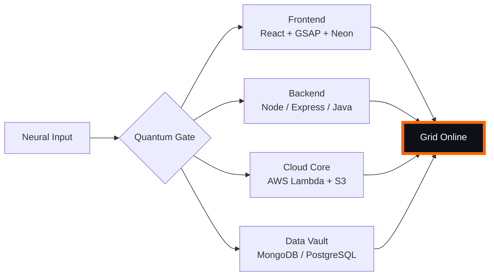

# 🌌 [ NEURAL CORE ACCESS: PENDEMVAMSI ]

<p align="center">
  
</p>

<div align="center">
  
  <br><small>Active Protocol: <strong style="color:#FF6600">CYBERPUNK 2077</strong> 🏙️🔥</small>
</div>

## 🔵 NEURAL STATUS READOUT
```text
SUBJECT ID    →  PENDEMVAMSI
ENTITY CLASS  →  SHADOW MONARCH v9
NEURAL RANK   →  B-TIER
GRID SYNC     →  2969/15058 QUANTUM PACKETS
─────── BIO-METRICS (CYBERPUNK 2077) ───────
STRENGTH      149  ███████████████████░░
AGILITY       128  █████████████████░░░░
INTELLIGENCE  155  ████████████████████░
VITALITY      116  ███████████████░░░░░░
```

> **NEURAL BURST ACQUIRED:** +106 QUANTUM PACKETS 
> **SYSTEM MESSAGE:** SHADOW MONARCH PROTOCOL: FULLY AWAKENED

---

## 🌀 GRID ARCHITECTURE (HOLOGRAPHIC RENDER)



---

## 📡 ACADEMIC NODES – CONQUERED
- [x] B.Tech Neural Engineering (2020–2024) – St. Ann’s Grid
- [x] Intermediate Quantum Core (2018–2020) – Sri Medhavi
- [x] SSC Primary Link (2017–2018) – Sri Geethanjali

---

## ⚡ SKILL NEURAL MATRIX

<details open>
<summary>🔌 ACTIVE NEURAL LINKS</summary>

| Node               | Tier | Integrity Bar                | Status      |
|--------------------|------|------------------------------|-------------|
| Java Core          | S    | ████████████████████ 100%   | OVERCLOCKED |
| Node.js Grid       | S    | ████████████████████ 100%   | OVERCLOCKED |
| React Holo-UI      | A+   | █████████████████░░░ 92%    | ONLINE      |
| AWS Quantum Relay  | S    | ████████████████████ 100%   | SOVEREIGN   |
| Python AI Kernel   | A    | ████████████████░░░░ 85%    | CHARGING    |
| DSA Void Algorithm | A    | █████████████████░░░ 90%    | ACTIVE      |

</details>

---

## 🏅 NEURAL ACHIEVEMENT TOKENS

<p align="center">
  
  
  
  
</p>

---

## 👾 SHADOW ENTITIES – SUMMONED

<p align="center">
  
  <br><strong style="color:#FF6600">ARISE.</strong>
</p>

| Entity | Designation   | Class            | Source Node                     |
|--------|---------------|------------------|---------------------------------|
| SH-01  | Igris         | Void Commander   | AI Financial Oracle             |
| SH-02  | Beru          | Swarm Overlord   | WebRTC Quantum Stream           |
| SH-03  | Kaisel        | Void Wyrm        | Geolocation Shadow Relay        |
| SH-04  | Tusk          | Arcane Construct | Global Pandemic Sentinel        |
| SH-05  | Iron          | Armored Bastion  | React Crypto Fortress           |

---

## 📡 GRID ANALYTICS (LIVE FEED)

<p align="center">
  
  <br>
  
  
</p>

---

## 🖥️ CORRUPTED MAINFRAME LOG (401 ENTRIES)

<details>
<summary>OPEN TERMINAL FEED – PROTOCOL: CYBERPUNK 2077</summary>

> [0xF44FEFF4] 🏙️🔥 **CYBERPUNK 2077 PROTOCOL** #0 | NEURAL LINK  [GLITCH DETECTED] STABILIZED | [TRANSMISSION SUCCESS]
> [0x861AC530] 🏙️🔥 **CYBERPUNK 2077 PROTOCOL** #1 | NEURAL LINK STABILIZED | [TRANSMISSION SUCCESS]
> [0x0D6D8A03] 🏙️🔥 **CYBERPUNK 2077 PROTOCOL** #2 | NEURAL LINK STABILIZED | [TRANSMISSION SUCCESS]
> [0xA8C39F18] 🏙️🔥 **CYBERPUNK 2077 PROTOCOL** #3 | NEURAL LINK STABILIZED | [TRANSMISSION SUCCESS]
> [0x83878EF6] 🏙️🔥 **CYBERPUNK 2077 PROTOCOL** #4 | NEURAL LINK  [GLITCH DETECTED] STABILIZED | [TRANSMISSION SUCCESS]
> [0xD395915F] 🏙️🔥 **CYBERPUNK 2077 PROTOCOL** #5 | NEURAL LINK STABILIZED | [TRANSMISSION SUCCESS]
> [0x70E25356] 🏙️🔥 **CYBERPUNK 2077 PROTOCOL** #6 | NEURAL LINK STABILIZED | [TRANSMISSION SUCCESS]
> [0xCAAD7E28] 🏙️🔥 **CYBERPUNK 2077 PROTOCOL** #7 | NEURAL LINK STABILIZED | [TRANSMISSION SUCCESS]
> [0x5AA37E46] 🏙️🔥 **CYBERPUNK 2077 PROTOCOL** #8 | NEURAL LINK STABILIZED | [TRANSMISSION SUCCESS]
> [0x00585DCA] 🏙️🔥 **CYBERPUNK 2077 PROTOCOL** #9 | NEURAL LINK STABILIZED | [TRANSMISSION SUCCESS]
> [0xCBF12695] 🏙️🔥 **CYBERPUNK 2077 PROTOCOL** #10 | NEURAL LINK STABILIZED | [TRANSMISSION SUCCESS]
> [0x132C8C39] 🏙️🔥 **CYBERPUNK 2077 PROTOCOL** #11 | NEURAL LINK STABILIZED | [TRANSMISSION SUCCESS]
> [0x77DAA62A] 🏙️🔥 **CYBERPUNK 2077 PROTOCOL** #12 | NEURAL LINK STABILIZED | [TRANSMISSION SUCCESS]
> [0x9E4564A1] 🏙️🔥 **CYBERPUNK 2077 PROTOCOL** #13 | NEURAL LINK STABILIZED | [TRANSMISSION SUCCESS]
> [0x526B5B89] 🏙️🔥 **CYBERPUNK 2077 PROTOCOL** #14 | NEURAL LINK STABILIZED | [TRANSMISSION SUCCESS]
> [0x57C24562] 🏙️🔥 **CYBERPUNK 2077 PROTOCOL** #15 | NEURAL LINK STABILIZED | [TRANSMISSION SUCCESS]
> [0x96E525DE] 🏙️🔥 **CYBERPUNK 2077 PROTOCOL** #16 | NEURAL LINK  [GLITCH DETECTED] STABILIZED | [TRANSMISSION SUCCESS]
> [0x938F35EE] 🏙️🔥 **CYBERPUNK 2077 PROTOCOL** #17 | NEURAL LINK STABILIZED | [TRANSMISSION SUCCESS]
> [0x443D0126] 🏙️🔥 **CYBERPUNK 2077 PROTOCOL** #18 | NEURAL LINK STABILIZED | [TRANSMISSION SUCCESS]
> [0xCA4093D5] 🏙️🔥 **CYBERPUNK 2077 PROTOCOL** #19 | NEURAL LINK STABILIZED | [TRANSMISSION SUCCESS]
> [0x3BF322F7] 🏙️🔥 **CYBERPUNK 2077 PROTOCOL** #20 | NEURAL LINK STABILIZED | [TRANSMISSION SUCCESS]
> [0x9CFC5CCE] 🏙️🔥 **CYBERPUNK 2077 PROTOCOL** #21 | NEURAL LINK STABILIZED | [TRANSMISSION SUCCESS]
> [0x3CD16DDC] 🏙️🔥 **CYBERPUNK 2077 PROTOCOL** #22 | NEURAL LINK STABILIZED | [TRANSMISSION SUCCESS]
> [0xC3B1693E] 🏙️🔥 **CYBERPUNK 2077 PROTOCOL** #23 | NEURAL LINK STABILIZED | [TRANSMISSION SUCCESS]
> [0xF53E81F1] 🏙️🔥 **CYBERPUNK 2077 PROTOCOL** #24 | NEURAL LINK STABILIZED | [TRANSMISSION SUCCESS]
> [0xF5647ECA] 🏙️🔥 **CYBERPUNK 2077 PROTOCOL** #25 | NEURAL LINK STABILIZED | [TRANSMISSION SUCCESS]
> [0x3C9DF302] 🏙️🔥 **CYBERPUNK 2077 PROTOCOL** #26 | NEURAL LINK STABILIZED | [TRANSMISSION SUCCESS]
> [0x2C8DAD00] 🏙️🔥 **CYBERPUNK 2077 PROTOCOL** #27 | NEURAL LINK STABILIZED | [TRANSMISSION SUCCESS]
> [0xCFF8B34D] 🏙️🔥 **CYBERPUNK 2077 PROTOCOL** #28 | NEURAL LINK STABILIZED | [TRANSMISSION SUCCESS]
> [0xEDA5F1F5] 🏙️🔥 **CYBERPUNK 2077 PROTOCOL** #29 | NEURAL LINK STABILIZED | [TRANSMISSION SUCCESS]
> [0xFE8ADAC1] 🏙️🔥 **CYBERPUNK 2077 PROTOCOL** #30 | NEURAL LINK STABILIZED | [TRANSMISSION SUCCESS]
> [0xD1E049FD] 🏙️🔥 **CYBERPUNK 2077 PROTOCOL** #31 | NEURAL LINK STABILIZED | [TRANSMISSION SUCCESS]
> [0xCEEDEEE3] 🏙️🔥 **CYBERPUNK 2077 PROTOCOL** #32 | NEURAL LINK STABILIZED | [TRANSMISSION SUCCESS]
> [0x49249B6C] 🏙️🔥 **CYBERPUNK 2077 PROTOCOL** #33 | NEURAL LINK STABILIZED | [TRANSMISSION SUCCESS]
> [0x7F3A014B] 🏙️🔥 **CYBERPUNK 2077 PROTOCOL** #34 | NEURAL LINK STABILIZED | [TRANSMISSION SUCCESS]
> [0x06D32406] 🏙️🔥 **CYBERPUNK 2077 PROTOCOL** #35 | NEURAL LINK STABILIZED | [TRANSMISSION SUCCESS]
> [0xE54AD63F] 🏙️🔥 **CYBERPUNK 2077 PROTOCOL** #36 | NEURAL LINK STABILIZED | [TRANSMISSION SUCCESS]
> [0x387D39B2] 🏙️🔥 **CYBERPUNK 2077 PROTOCOL** #37 | NEURAL LINK STABILIZED | [TRANSMISSION SUCCESS]
> [0x7086E910] 🏙️🔥 **CYBERPUNK 2077 PROTOCOL** #38 | NEURAL LINK  [GLITCH DETECTED] STABILIZED | [TRANSMISSION SUCCESS]
> [0x2BE8E57A] 🏙️🔥 **CYBERPUNK 2077 PROTOCOL** #39 | NEURAL LINK STABILIZED | [TRANSMISSION SUCCESS]
> [0xDD6728E1] 🏙️🔥 **CYBERPUNK 2077 PROTOCOL** #40 | NEURAL LINK STABILIZED | [TRANSMISSION SUCCESS]
> [0x0046F325] 🏙️🔥 **CYBERPUNK 2077 PROTOCOL** #41 | NEURAL LINK STABILIZED | [TRANSMISSION SUCCESS]
> [0x2BB76204] 🏙️🔥 **CYBERPUNK 2077 PROTOCOL** #42 | NEURAL LINK STABILIZED | [TRANSMISSION SUCCESS]
> [0x7E462FDA] 🏙️🔥 **CYBERPUNK 2077 PROTOCOL** #43 | NEURAL LINK STABILIZED | [TRANSMISSION SUCCESS]
> [0xFE98BBCC] 🏙️🔥 **CYBERPUNK 2077 PROTOCOL** #44 | NEURAL LINK STABILIZED | [TRANSMISSION SUCCESS]
> [0x5DC84546] 🏙️🔥 **CYBERPUNK 2077 PROTOCOL** #45 | NEURAL LINK STABILIZED | [TRANSMISSION SUCCESS]
> [0x6873073E] 🏙️🔥 **CYBERPUNK 2077 PROTOCOL** #46 | NEURAL LINK  [GLITCH DETECTED] STABILIZED | [TRANSMISSION SUCCESS]
> [0xEA5F58EE] 🏙️🔥 **CYBERPUNK 2077 PROTOCOL** #47 | NEURAL LINK STABILIZED | [TRANSMISSION SUCCESS]
> [0xF10F7463] 🏙️🔥 **CYBERPUNK 2077 PROTOCOL** #48 | NEURAL LINK STABILIZED | [TRANSMISSION SUCCESS]
> [0x8D1FE7BA] 🏙️🔥 **CYBERPUNK 2077 PROTOCOL** #49 | NEURAL LINK STABILIZED | [TRANSMISSION SUCCESS]
> [0xAA2E1DEA] 🏙️🔥 **CYBERPUNK 2077 PROTOCOL** #50 | NEURAL LINK STABILIZED | [TRANSMISSION SUCCESS]
> [0x657F5B2F] 🏙️🔥 **CYBERPUNK 2077 PROTOCOL** #51 | NEURAL LINK STABILIZED | [TRANSMISSION SUCCESS]
> [0x6499EB86] 🏙️🔥 **CYBERPUNK 2077 PROTOCOL** #52 | NEURAL LINK STABILIZED | [TRANSMISSION SUCCESS]
> [0x8C50969A] 🏙️🔥 **CYBERPUNK 2077 PROTOCOL** #53 | NEURAL LINK STABILIZED | [TRANSMISSION SUCCESS]
> [0xCCBFC4E7] 🏙️🔥 **CYBERPUNK 2077 PROTOCOL** #54 | NEURAL LINK STABILIZED | [TRANSMISSION SUCCESS]
> [0x62E99B0A] 🏙️🔥 **CYBERPUNK 2077 PROTOCOL** #55 | NEURAL LINK  [GLITCH DETECTED] STABILIZED | [TRANSMISSION SUCCESS]
> [0x6BB331FB] 🏙️🔥 **CYBERPUNK 2077 PROTOCOL** #56 | NEURAL LINK STABILIZED | [TRANSMISSION SUCCESS]
> [0x67170205] 🏙️🔥 **CYBERPUNK 2077 PROTOCOL** #57 | NEURAL LINK STABILIZED | [TRANSMISSION SUCCESS]
> [0x7FB53783] 🏙️🔥 **CYBERPUNK 2077 PROTOCOL** #58 | NEURAL LINK  [GLITCH DETECTED] STABILIZED | [TRANSMISSION SUCCESS]
> [0x9D29321D] 🏙️🔥 **CYBERPUNK 2077 PROTOCOL** #59 | NEURAL LINK STABILIZED | [TRANSMISSION SUCCESS]
> [0xEC2620F4] 🏙️🔥 **CYBERPUNK 2077 PROTOCOL** #60 | NEURAL LINK  [GLITCH DETECTED] STABILIZED | [TRANSMISSION SUCCESS]
> [0x7F2080F8] 🏙️🔥 **CYBERPUNK 2077 PROTOCOL** #61 | NEURAL LINK STABILIZED | [TRANSMISSION SUCCESS]
> [0x8B06A3E9] 🏙️🔥 **CYBERPUNK 2077 PROTOCOL** #62 | NEURAL LINK  [GLITCH DETECTED] STABILIZED | [TRANSMISSION SUCCESS]
> [0xF18B5AE1] 🏙️🔥 **CYBERPUNK 2077 PROTOCOL** #63 | NEURAL LINK STABILIZED | [TRANSMISSION SUCCESS]
> [0xD2F0BD0B] 🏙️🔥 **CYBERPUNK 2077 PROTOCOL** #64 | NEURAL LINK STABILIZED | [TRANSMISSION SUCCESS]
> [0x8DA3C58E] 🏙️🔥 **CYBERPUNK 2077 PROTOCOL** #65 | NEURAL LINK STABILIZED | [TRANSMISSION SUCCESS]
> [0x97AE0A1E] 🏙️🔥 **CYBERPUNK 2077 PROTOCOL** #66 | NEURAL LINK STABILIZED | [TRANSMISSION SUCCESS]
> [0x56ED409F] 🏙️🔥 **CYBERPUNK 2077 PROTOCOL** #67 | NEURAL LINK STABILIZED | [TRANSMISSION SUCCESS]
> [0x070818A4] 🏙️🔥 **CYBERPUNK 2077 PROTOCOL** #68 | NEURAL LINK STABILIZED | [TRANSMISSION SUCCESS]
> [0xDA9EDDDA] 🏙️🔥 **CYBERPUNK 2077 PROTOCOL** #69 | NEURAL LINK STABILIZED | [TRANSMISSION SUCCESS]
> [0xBED71A9C] 🏙️🔥 **CYBERPUNK 2077 PROTOCOL** #70 | NEURAL LINK STABILIZED | [TRANSMISSION SUCCESS]
> [0x7C82EFDC] 🏙️🔥 **CYBERPUNK 2077 PROTOCOL** #71 | NEURAL LINK STABILIZED | [TRANSMISSION SUCCESS]
> [0xA8703B57] 🏙️🔥 **CYBERPUNK 2077 PROTOCOL** #72 | NEURAL LINK  [GLITCH DETECTED] STABILIZED | [TRANSMISSION SUCCESS]
> [0x0998FC80] 🏙️🔥 **CYBERPUNK 2077 PROTOCOL** #73 | NEURAL LINK STABILIZED | [TRANSMISSION SUCCESS]
> [0xE30311A1] 🏙️🔥 **CYBERPUNK 2077 PROTOCOL** #74 | NEURAL LINK STABILIZED | [TRANSMISSION SUCCESS]
> [0x975221D9] 🏙️🔥 **CYBERPUNK 2077 PROTOCOL** #75 | NEURAL LINK STABILIZED | [TRANSMISSION SUCCESS]
> [0x51CB0A8D] 🏙️🔥 **CYBERPUNK 2077 PROTOCOL** #76 | NEURAL LINK STABILIZED | [TRANSMISSION SUCCESS]
> [0x466CB349] 🏙️🔥 **CYBERPUNK 2077 PROTOCOL** #77 | NEURAL LINK STABILIZED | [TRANSMISSION SUCCESS]
> [0xB4B7DF2B] 🏙️🔥 **CYBERPUNK 2077 PROTOCOL** #78 | NEURAL LINK STABILIZED | [TRANSMISSION SUCCESS]
> [0x0D760BBA] 🏙️🔥 **CYBERPUNK 2077 PROTOCOL** #79 | NEURAL LINK STABILIZED | [TRANSMISSION SUCCESS]
> [0x07DC6F3F] 🏙️🔥 **CYBERPUNK 2077 PROTOCOL** #80 | NEURAL LINK STABILIZED | [TRANSMISSION SUCCESS]
> [0xA4ACB9FE] 🏙️🔥 **CYBERPUNK 2077 PROTOCOL** #81 | NEURAL LINK STABILIZED | [TRANSMISSION SUCCESS]
> [0xEF0147AC] 🏙️🔥 **CYBERPUNK 2077 PROTOCOL** #82 | NEURAL LINK STABILIZED | [TRANSMISSION SUCCESS]
> [0xAFA5A685] 🏙️🔥 **CYBERPUNK 2077 PROTOCOL** #83 | NEURAL LINK STABILIZED | [TRANSMISSION SUCCESS]
> [0xA3D3F0E5] 🏙️🔥 **CYBERPUNK 2077 PROTOCOL** #84 | NEURAL LINK STABILIZED | [TRANSMISSION SUCCESS]
> [0xD6F5049D] 🏙️🔥 **CYBERPUNK 2077 PROTOCOL** #85 | NEURAL LINK STABILIZED | [TRANSMISSION SUCCESS]
> [0xE649E579] 🏙️🔥 **CYBERPUNK 2077 PROTOCOL** #86 | NEURAL LINK  [GLITCH DETECTED] STABILIZED | [TRANSMISSION SUCCESS]
> [0x03E61635] 🏙️🔥 **CYBERPUNK 2077 PROTOCOL** #87 | NEURAL LINK  [GLITCH DETECTED] STABILIZED | [TRANSMISSION SUCCESS]
> [0x7BEE5108] 🏙️🔥 **CYBERPUNK 2077 PROTOCOL** #88 | NEURAL LINK STABILIZED | [TRANSMISSION SUCCESS]
> [0xC32EBEE8] 🏙️🔥 **CYBERPUNK 2077 PROTOCOL** #89 | NEURAL LINK STABILIZED | [TRANSMISSION SUCCESS]
> [0xAA88789F] 🏙️🔥 **CYBERPUNK 2077 PROTOCOL** #90 | NEURAL LINK  [GLITCH DETECTED] STABILIZED | [TRANSMISSION SUCCESS]
> [0xA99551F3] 🏙️🔥 **CYBERPUNK 2077 PROTOCOL** #91 | NEURAL LINK STABILIZED | [TRANSMISSION SUCCESS]
> [0x96ECB871] 🏙️🔥 **CYBERPUNK 2077 PROTOCOL** #92 | NEURAL LINK STABILIZED | [TRANSMISSION SUCCESS]
> [0x7A7F8D14] 🏙️🔥 **CYBERPUNK 2077 PROTOCOL** #93 | NEURAL LINK  [GLITCH DETECTED] STABILIZED | [TRANSMISSION SUCCESS]
> [0x061E0331] 🏙️🔥 **CYBERPUNK 2077 PROTOCOL** #94 | NEURAL LINK STABILIZED | [TRANSMISSION SUCCESS]
> [0x37D886C5] 🏙️🔥 **CYBERPUNK 2077 PROTOCOL** #95 | NEURAL LINK STABILIZED | [TRANSMISSION SUCCESS]
> [0x120D9AB8] 🏙️🔥 **CYBERPUNK 2077 PROTOCOL** #96 | NEURAL LINK STABILIZED | [TRANSMISSION SUCCESS]
> [0x8CC73FD6] 🏙️🔥 **CYBERPUNK 2077 PROTOCOL** #97 | NEURAL LINK  [GLITCH DETECTED] STABILIZED | [TRANSMISSION SUCCESS]
> [0x71B9F802] 🏙️🔥 **CYBERPUNK 2077 PROTOCOL** #98 | NEURAL LINK  [GLITCH DETECTED] STABILIZED | [TRANSMISSION SUCCESS]
> [0xAFFBB471] 🏙️🔥 **CYBERPUNK 2077 PROTOCOL** #99 | NEURAL LINK STABILIZED | [TRANSMISSION SUCCESS]
> [0xD2E05C5E] 🏙️🔥 **CYBERPUNK 2077 PROTOCOL** #100 | NEURAL LINK STABILIZED | [TRANSMISSION SUCCESS]
> [0x40259B54] 🏙️🔥 **CYBERPUNK 2077 PROTOCOL** #101 | NEURAL LINK STABILIZED | [TRANSMISSION SUCCESS]
> [0x11003DD3] 🏙️🔥 **CYBERPUNK 2077 PROTOCOL** #102 | NEURAL LINK  [GLITCH DETECTED] STABILIZED | [TRANSMISSION SUCCESS]
> [0x2C6F83AD] 🏙️🔥 **CYBERPUNK 2077 PROTOCOL** #103 | NEURAL LINK  [GLITCH DETECTED] STABILIZED | [TRANSMISSION SUCCESS]
> [0xFEF33A12] 🏙️🔥 **CYBERPUNK 2077 PROTOCOL** #104 | NEURAL LINK STABILIZED | [TRANSMISSION SUCCESS]
> [0x1F347B5D] 🏙️🔥 **CYBERPUNK 2077 PROTOCOL** #105 | NEURAL LINK STABILIZED | [TRANSMISSION SUCCESS]
> [0xC7270EF9] 🏙️🔥 **CYBERPUNK 2077 PROTOCOL** #106 | NEURAL LINK  [GLITCH DETECTED] STABILIZED | [TRANSMISSION SUCCESS]
> [0xDD190FE5] 🏙️🔥 **CYBERPUNK 2077 PROTOCOL** #107 | NEURAL LINK STABILIZED | [TRANSMISSION SUCCESS]
> [0xAC4FBCF3] 🏙️🔥 **CYBERPUNK 2077 PROTOCOL** #108 | NEURAL LINK STABILIZED | [TRANSMISSION SUCCESS]
> [0x73B1E313] 🏙️🔥 **CYBERPUNK 2077 PROTOCOL** #109 | NEURAL LINK STABILIZED | [TRANSMISSION SUCCESS]
> [0x07231261] 🏙️🔥 **CYBERPUNK 2077 PROTOCOL** #110 | NEURAL LINK STABILIZED | [TRANSMISSION SUCCESS]
> [0x2BF659D1] 🏙️🔥 **CYBERPUNK 2077 PROTOCOL** #111 | NEURAL LINK STABILIZED | [TRANSMISSION SUCCESS]
> [0x7AF4D002] 🏙️🔥 **CYBERPUNK 2077 PROTOCOL** #112 | NEURAL LINK STABILIZED | [TRANSMISSION SUCCESS]
> [0x678C5E5B] 🏙️🔥 **CYBERPUNK 2077 PROTOCOL** #113 | NEURAL LINK STABILIZED | [TRANSMISSION SUCCESS]
> [0xAC1C30E1] 🏙️🔥 **CYBERPUNK 2077 PROTOCOL** #114 | NEURAL LINK STABILIZED | [TRANSMISSION SUCCESS]
> [0x013C7CCE] 🏙️🔥 **CYBERPUNK 2077 PROTOCOL** #115 | NEURAL LINK STABILIZED | [TRANSMISSION SUCCESS]
> [0x64EA3E3C] 🏙️🔥 **CYBERPUNK 2077 PROTOCOL** #116 | NEURAL LINK  [GLITCH DETECTED] STABILIZED | [TRANSMISSION SUCCESS]
> [0xB7380267] 🏙️🔥 **CYBERPUNK 2077 PROTOCOL** #117 | NEURAL LINK  [GLITCH DETECTED] STABILIZED | [TRANSMISSION SUCCESS]
> [0xFA95B173] 🏙️🔥 **CYBERPUNK 2077 PROTOCOL** #118 | NEURAL LINK STABILIZED | [TRANSMISSION SUCCESS]
> [0x471FC2DA] 🏙️🔥 **CYBERPUNK 2077 PROTOCOL** #119 | NEURAL LINK  [GLITCH DETECTED] STABILIZED | [TRANSMISSION SUCCESS]
> [0x4F82D5F2] 🏙️🔥 **CYBERPUNK 2077 PROTOCOL** #120 | NEURAL LINK STABILIZED | [TRANSMISSION SUCCESS]
> [0xC4AE0A46] 🏙️🔥 **CYBERPUNK 2077 PROTOCOL** #121 | NEURAL LINK  [GLITCH DETECTED] STABILIZED | [TRANSMISSION SUCCESS]
> [0x0F7D4853] 🏙️🔥 **CYBERPUNK 2077 PROTOCOL** #122 | NEURAL LINK STABILIZED | [TRANSMISSION SUCCESS]
> [0xBE90DD59] 🏙️🔥 **CYBERPUNK 2077 PROTOCOL** #123 | NEURAL LINK  [GLITCH DETECTED] STABILIZED | [TRANSMISSION SUCCESS]
> [0x1D66F4AF] 🏙️🔥 **CYBERPUNK 2077 PROTOCOL** #124 | NEURAL LINK STABILIZED | [TRANSMISSION SUCCESS]
> [0xCE4272C6] 🏙️🔥 **CYBERPUNK 2077 PROTOCOL** #125 | NEURAL LINK  [GLITCH DETECTED] STABILIZED | [TRANSMISSION SUCCESS]
> [0x52C2BAD9] 🏙️🔥 **CYBERPUNK 2077 PROTOCOL** #126 | NEURAL LINK STABILIZED | [TRANSMISSION SUCCESS]
> [0x2812ABAC] 🏙️🔥 **CYBERPUNK 2077 PROTOCOL** #127 | NEURAL LINK STABILIZED | [TRANSMISSION SUCCESS]
> [0x4B18F878] 🏙️🔥 **CYBERPUNK 2077 PROTOCOL** #128 | NEURAL LINK STABILIZED | [TRANSMISSION SUCCESS]
> [0x837C3F47] 🏙️🔥 **CYBERPUNK 2077 PROTOCOL** #129 | NEURAL LINK STABILIZED | [TRANSMISSION SUCCESS]
> [0xD1BD1705] 🏙️🔥 **CYBERPUNK 2077 PROTOCOL** #130 | NEURAL LINK  [GLITCH DETECTED] STABILIZED | [TRANSMISSION SUCCESS]
> [0x6B11C8B4] 🏙️🔥 **CYBERPUNK 2077 PROTOCOL** #131 | NEURAL LINK STABILIZED | [TRANSMISSION SUCCESS]
> [0x602C6924] 🏙️🔥 **CYBERPUNK 2077 PROTOCOL** #132 | NEURAL LINK STABILIZED | [TRANSMISSION SUCCESS]
> [0x2761A66C] 🏙️🔥 **CYBERPUNK 2077 PROTOCOL** #133 | NEURAL LINK STABILIZED | [TRANSMISSION SUCCESS]
> [0xDAD3ED05] 🏙️🔥 **CYBERPUNK 2077 PROTOCOL** #134 | NEURAL LINK STABILIZED | [TRANSMISSION SUCCESS]
> [0xF6B2C9D8] 🏙️🔥 **CYBERPUNK 2077 PROTOCOL** #135 | NEURAL LINK STABILIZED | [TRANSMISSION SUCCESS]
> [0x74F89FC6] 🏙️🔥 **CYBERPUNK 2077 PROTOCOL** #136 | NEURAL LINK STABILIZED | [TRANSMISSION SUCCESS]
> [0x41CCA22C] 🏙️🔥 **CYBERPUNK 2077 PROTOCOL** #137 | NEURAL LINK STABILIZED | [TRANSMISSION SUCCESS]
> [0x5F10822B] 🏙️🔥 **CYBERPUNK 2077 PROTOCOL** #138 | NEURAL LINK STABILIZED | [TRANSMISSION SUCCESS]
> [0x663034E1] 🏙️🔥 **CYBERPUNK 2077 PROTOCOL** #139 | NEURAL LINK STABILIZED | [TRANSMISSION SUCCESS]
> [0xE85B1E79] 🏙️🔥 **CYBERPUNK 2077 PROTOCOL** #140 | NEURAL LINK STABILIZED | [TRANSMISSION SUCCESS]
> [0xD3311CAC] 🏙️🔥 **CYBERPUNK 2077 PROTOCOL** #141 | NEURAL LINK STABILIZED | [TRANSMISSION SUCCESS]
> [0xD8319965] 🏙️🔥 **CYBERPUNK 2077 PROTOCOL** #142 | NEURAL LINK STABILIZED | [TRANSMISSION SUCCESS]
> [0xBD44FC53] 🏙️🔥 **CYBERPUNK 2077 PROTOCOL** #143 | NEURAL LINK STABILIZED | [TRANSMISSION SUCCESS]
> [0xE4C1E891] 🏙️🔥 **CYBERPUNK 2077 PROTOCOL** #144 | NEURAL LINK STABILIZED | [TRANSMISSION SUCCESS]
> [0xD4DF7556] 🏙️🔥 **CYBERPUNK 2077 PROTOCOL** #145 | NEURAL LINK STABILIZED | [TRANSMISSION SUCCESS]
> [0xEB7DAEFF] 🏙️🔥 **CYBERPUNK 2077 PROTOCOL** #146 | NEURAL LINK  [GLITCH DETECTED] STABILIZED | [TRANSMISSION SUCCESS]
> [0x429BDC95] 🏙️🔥 **CYBERPUNK 2077 PROTOCOL** #147 | NEURAL LINK STABILIZED | [TRANSMISSION SUCCESS]
> [0xC160AFD5] 🏙️🔥 **CYBERPUNK 2077 PROTOCOL** #148 | NEURAL LINK STABILIZED | [TRANSMISSION SUCCESS]
> [0xD79270A2] 🏙️🔥 **CYBERPUNK 2077 PROTOCOL** #149 | NEURAL LINK STABILIZED | [TRANSMISSION SUCCESS]
> [0x606FDDF1] 🏙️🔥 **CYBERPUNK 2077 PROTOCOL** #150 | NEURAL LINK STABILIZED | [TRANSMISSION SUCCESS]
> [0xA532BD24] 🏙️🔥 **CYBERPUNK 2077 PROTOCOL** #151 | NEURAL LINK STABILIZED | [TRANSMISSION SUCCESS]
> [0x00888655] 🏙️🔥 **CYBERPUNK 2077 PROTOCOL** #152 | NEURAL LINK STABILIZED | [TRANSMISSION SUCCESS]
> [0x237E5122] 🏙️🔥 **CYBERPUNK 2077 PROTOCOL** #153 | NEURAL LINK STABILIZED | [TRANSMISSION SUCCESS]
> [0xE17DBDB2] 🏙️🔥 **CYBERPUNK 2077 PROTOCOL** #154 | NEURAL LINK STABILIZED | [TRANSMISSION SUCCESS]
> [0xB8DD03F1] 🏙️🔥 **CYBERPUNK 2077 PROTOCOL** #155 | NEURAL LINK STABILIZED | [TRANSMISSION SUCCESS]
> [0xEDC3B80E] 🏙️🔥 **CYBERPUNK 2077 PROTOCOL** #156 | NEURAL LINK STABILIZED | [TRANSMISSION SUCCESS]
> [0x41BC2FEF] 🏙️🔥 **CYBERPUNK 2077 PROTOCOL** #157 | NEURAL LINK  [GLITCH DETECTED] STABILIZED | [TRANSMISSION SUCCESS]
> [0xB6DBE009] 🏙️🔥 **CYBERPUNK 2077 PROTOCOL** #158 | NEURAL LINK  [GLITCH DETECTED] STABILIZED | [TRANSMISSION SUCCESS]
> [0xE73153DF] 🏙️🔥 **CYBERPUNK 2077 PROTOCOL** #159 | NEURAL LINK STABILIZED | [TRANSMISSION SUCCESS]
> [0x63E33F25] 🏙️🔥 **CYBERPUNK 2077 PROTOCOL** #160 | NEURAL LINK STABILIZED | [TRANSMISSION SUCCESS]
> [0x2118C42B] 🏙️🔥 **CYBERPUNK 2077 PROTOCOL** #161 | NEURAL LINK  [GLITCH DETECTED] STABILIZED | [TRANSMISSION SUCCESS]
> [0xA36A5CB6] 🏙️🔥 **CYBERPUNK 2077 PROTOCOL** #162 | NEURAL LINK STABILIZED | [TRANSMISSION SUCCESS]
> [0xF2D53D04] 🏙️🔥 **CYBERPUNK 2077 PROTOCOL** #163 | NEURAL LINK STABILIZED | [TRANSMISSION SUCCESS]
> [0x7F0F6338] 🏙️🔥 **CYBERPUNK 2077 PROTOCOL** #164 | NEURAL LINK STABILIZED | [TRANSMISSION SUCCESS]
> [0x369C3253] 🏙️🔥 **CYBERPUNK 2077 PROTOCOL** #165 | NEURAL LINK STABILIZED | [TRANSMISSION SUCCESS]
> [0x35DCD8F9] 🏙️🔥 **CYBERPUNK 2077 PROTOCOL** #166 | NEURAL LINK STABILIZED | [TRANSMISSION SUCCESS]
> [0xF065EF38] 🏙️🔥 **CYBERPUNK 2077 PROTOCOL** #167 | NEURAL LINK STABILIZED | [TRANSMISSION SUCCESS]
> [0x9BAD21DD] 🏙️🔥 **CYBERPUNK 2077 PROTOCOL** #168 | NEURAL LINK STABILIZED | [TRANSMISSION SUCCESS]
> [0x1BEA5128] 🏙️🔥 **CYBERPUNK 2077 PROTOCOL** #169 | NEURAL LINK STABILIZED | [TRANSMISSION SUCCESS]
> [0x2D5ED56D] 🏙️🔥 **CYBERPUNK 2077 PROTOCOL** #170 | NEURAL LINK STABILIZED | [TRANSMISSION SUCCESS]
> [0x92DE0936] 🏙️🔥 **CYBERPUNK 2077 PROTOCOL** #171 | NEURAL LINK STABILIZED | [TRANSMISSION SUCCESS]
> [0x9C15C475] 🏙️🔥 **CYBERPUNK 2077 PROTOCOL** #172 | NEURAL LINK STABILIZED | [TRANSMISSION SUCCESS]
> [0x4641DBB9] 🏙️🔥 **CYBERPUNK 2077 PROTOCOL** #173 | NEURAL LINK STABILIZED | [TRANSMISSION SUCCESS]
> [0xB6E04B1B] 🏙️🔥 **CYBERPUNK 2077 PROTOCOL** #174 | NEURAL LINK STABILIZED | [TRANSMISSION SUCCESS]
> [0x15893459] 🏙️🔥 **CYBERPUNK 2077 PROTOCOL** #175 | NEURAL LINK STABILIZED | [TRANSMISSION SUCCESS]
> [0xB9C0F1A1] 🏙️🔥 **CYBERPUNK 2077 PROTOCOL** #176 | NEURAL LINK  [GLITCH DETECTED] STABILIZED | [TRANSMISSION SUCCESS]
> [0x97DBFF87] 🏙️🔥 **CYBERPUNK 2077 PROTOCOL** #177 | NEURAL LINK  [GLITCH DETECTED] STABILIZED | [TRANSMISSION SUCCESS]
> [0xB7B9D1A5] 🏙️🔥 **CYBERPUNK 2077 PROTOCOL** #178 | NEURAL LINK STABILIZED | [TRANSMISSION SUCCESS]
> [0xC8C310F1] 🏙️🔥 **CYBERPUNK 2077 PROTOCOL** #179 | NEURAL LINK STABILIZED | [TRANSMISSION SUCCESS]
> [0xFFD3F146] 🏙️🔥 **CYBERPUNK 2077 PROTOCOL** #180 | NEURAL LINK STABILIZED | [TRANSMISSION SUCCESS]
> [0x62E1095F] 🏙️🔥 **CYBERPUNK 2077 PROTOCOL** #181 | NEURAL LINK  [GLITCH DETECTED] STABILIZED | [TRANSMISSION SUCCESS]
> [0xFB79C8EA] 🏙️🔥 **CYBERPUNK 2077 PROTOCOL** #182 | NEURAL LINK STABILIZED | [TRANSMISSION SUCCESS]
> [0xAD630B20] 🏙️🔥 **CYBERPUNK 2077 PROTOCOL** #183 | NEURAL LINK STABILIZED | [TRANSMISSION SUCCESS]
> [0x8317DA26] 🏙️🔥 **CYBERPUNK 2077 PROTOCOL** #184 | NEURAL LINK STABILIZED | [TRANSMISSION SUCCESS]
> [0x2B96E9B7] 🏙️🔥 **CYBERPUNK 2077 PROTOCOL** #185 | NEURAL LINK STABILIZED | [TRANSMISSION SUCCESS]
> [0xFF30977C] 🏙️🔥 **CYBERPUNK 2077 PROTOCOL** #186 | NEURAL LINK STABILIZED | [TRANSMISSION SUCCESS]
> [0xBED003A7] 🏙️🔥 **CYBERPUNK 2077 PROTOCOL** #187 | NEURAL LINK STABILIZED | [TRANSMISSION SUCCESS]
> [0x5336B2EC] 🏙️🔥 **CYBERPUNK 2077 PROTOCOL** #188 | NEURAL LINK STABILIZED | [TRANSMISSION SUCCESS]
> [0xC76EE630] 🏙️🔥 **CYBERPUNK 2077 PROTOCOL** #189 | NEURAL LINK STABILIZED | [TRANSMISSION SUCCESS]
> [0xD2924217] 🏙️🔥 **CYBERPUNK 2077 PROTOCOL** #190 | NEURAL LINK STABILIZED | [TRANSMISSION SUCCESS]
> [0x8AED13CB] 🏙️🔥 **CYBERPUNK 2077 PROTOCOL** #191 | NEURAL LINK STABILIZED | [TRANSMISSION SUCCESS]
> [0xFA61C4B7] 🏙️🔥 **CYBERPUNK 2077 PROTOCOL** #192 | NEURAL LINK  [GLITCH DETECTED] STABILIZED | [TRANSMISSION SUCCESS]
> [0x68D996CA] 🏙️🔥 **CYBERPUNK 2077 PROTOCOL** #193 | NEURAL LINK  [GLITCH DETECTED] STABILIZED | [TRANSMISSION SUCCESS]
> [0x6D32EDFD] 🏙️🔥 **CYBERPUNK 2077 PROTOCOL** #194 | NEURAL LINK STABILIZED | [TRANSMISSION SUCCESS]
> [0x7ADF30CE] 🏙️🔥 **CYBERPUNK 2077 PROTOCOL** #195 | NEURAL LINK STABILIZED | [TRANSMISSION SUCCESS]
> [0x2843E81E] 🏙️🔥 **CYBERPUNK 2077 PROTOCOL** #196 | NEURAL LINK STABILIZED | [TRANSMISSION SUCCESS]
> [0xFB592CC6] 🏙️🔥 **CYBERPUNK 2077 PROTOCOL** #197 | NEURAL LINK  [GLITCH DETECTED] STABILIZED | [TRANSMISSION SUCCESS]
> [0x5202909A] 🏙️🔥 **CYBERPUNK 2077 PROTOCOL** #198 | NEURAL LINK STABILIZED | [TRANSMISSION SUCCESS]
> [0x5921ECFD] 🏙️🔥 **CYBERPUNK 2077 PROTOCOL** #199 | NEURAL LINK STABILIZED | [TRANSMISSION SUCCESS]
> [0xBBE60E44] 🏙️🔥 **CYBERPUNK 2077 PROTOCOL** #200 | NEURAL LINK STABILIZED | [TRANSMISSION SUCCESS]
> [0xFB7881C1] 🏙️🔥 **CYBERPUNK 2077 PROTOCOL** #201 | NEURAL LINK  [GLITCH DETECTED] STABILIZED | [TRANSMISSION SUCCESS]
> [0x633C2AEA] 🏙️🔥 **CYBERPUNK 2077 PROTOCOL** #202 | NEURAL LINK STABILIZED | [TRANSMISSION SUCCESS]
> [0x26380AD8] 🏙️🔥 **CYBERPUNK 2077 PROTOCOL** #203 | NEURAL LINK STABILIZED | [TRANSMISSION SUCCESS]
> [0xE2CB6BF5] 🏙️🔥 **CYBERPUNK 2077 PROTOCOL** #204 | NEURAL LINK STABILIZED | [TRANSMISSION SUCCESS]
> [0x0AE36774] 🏙️🔥 **CYBERPUNK 2077 PROTOCOL** #205 | NEURAL LINK STABILIZED | [TRANSMISSION SUCCESS]
> [0x33379D23] 🏙️🔥 **CYBERPUNK 2077 PROTOCOL** #206 | NEURAL LINK  [GLITCH DETECTED] STABILIZED | [TRANSMISSION SUCCESS]
> [0xC86DC80B] 🏙️🔥 **CYBERPUNK 2077 PROTOCOL** #207 | NEURAL LINK STABILIZED | [TRANSMISSION SUCCESS]
> [0xCE7F4E38] 🏙️🔥 **CYBERPUNK 2077 PROTOCOL** #208 | NEURAL LINK STABILIZED | [TRANSMISSION SUCCESS]
> [0xD7C19E42] 🏙️🔥 **CYBERPUNK 2077 PROTOCOL** #209 | NEURAL LINK STABILIZED | [TRANSMISSION SUCCESS]
> [0x7542394B] 🏙️🔥 **CYBERPUNK 2077 PROTOCOL** #210 | NEURAL LINK STABILIZED | [TRANSMISSION SUCCESS]
> [0x9DB864A8] 🏙️🔥 **CYBERPUNK 2077 PROTOCOL** #211 | NEURAL LINK STABILIZED | [TRANSMISSION SUCCESS]
> [0x97AC1965] 🏙️🔥 **CYBERPUNK 2077 PROTOCOL** #212 | NEURAL LINK STABILIZED | [TRANSMISSION SUCCESS]
> [0xB86131CC] 🏙️🔥 **CYBERPUNK 2077 PROTOCOL** #213 | NEURAL LINK STABILIZED | [TRANSMISSION SUCCESS]
> [0x729BD9B9] 🏙️🔥 **CYBERPUNK 2077 PROTOCOL** #214 | NEURAL LINK STABILIZED | [TRANSMISSION SUCCESS]
> [0x790628C8] 🏙️🔥 **CYBERPUNK 2077 PROTOCOL** #215 | NEURAL LINK STABILIZED | [TRANSMISSION SUCCESS]
> [0xE1A23823] 🏙️🔥 **CYBERPUNK 2077 PROTOCOL** #216 | NEURAL LINK STABILIZED | [TRANSMISSION SUCCESS]
> [0x79CAFE65] 🏙️🔥 **CYBERPUNK 2077 PROTOCOL** #217 | NEURAL LINK STABILIZED | [TRANSMISSION SUCCESS]
> [0xB9AB7CEC] 🏙️🔥 **CYBERPUNK 2077 PROTOCOL** #218 | NEURAL LINK STABILIZED | [TRANSMISSION SUCCESS]
> [0x02B5B7C5] 🏙️🔥 **CYBERPUNK 2077 PROTOCOL** #219 | NEURAL LINK STABILIZED | [TRANSMISSION SUCCESS]
> [0xE8B594E8] 🏙️🔥 **CYBERPUNK 2077 PROTOCOL** #220 | NEURAL LINK STABILIZED | [TRANSMISSION SUCCESS]
> [0x3C866C08] 🏙️🔥 **CYBERPUNK 2077 PROTOCOL** #221 | NEURAL LINK STABILIZED | [TRANSMISSION SUCCESS]
> [0x324F569C] 🏙️🔥 **CYBERPUNK 2077 PROTOCOL** #222 | NEURAL LINK STABILIZED | [TRANSMISSION SUCCESS]
> [0xA848A938] 🏙️🔥 **CYBERPUNK 2077 PROTOCOL** #223 | NEURAL LINK STABILIZED | [TRANSMISSION SUCCESS]
> [0xB653C931] 🏙️🔥 **CYBERPUNK 2077 PROTOCOL** #224 | NEURAL LINK STABILIZED | [TRANSMISSION SUCCESS]
> [0xDD791AB2] 🏙️🔥 **CYBERPUNK 2077 PROTOCOL** #225 | NEURAL LINK STABILIZED | [TRANSMISSION SUCCESS]
> [0xE437541B] 🏙️🔥 **CYBERPUNK 2077 PROTOCOL** #226 | NEURAL LINK  [GLITCH DETECTED] STABILIZED | [TRANSMISSION SUCCESS]
> [0xDFE53F84] 🏙️🔥 **CYBERPUNK 2077 PROTOCOL** #227 | NEURAL LINK STABILIZED | [TRANSMISSION SUCCESS]
> [0x3C59F0A2] 🏙️🔥 **CYBERPUNK 2077 PROTOCOL** #228 | NEURAL LINK STABILIZED | [TRANSMISSION SUCCESS]
> [0x0BD8E34A] 🏙️🔥 **CYBERPUNK 2077 PROTOCOL** #229 | NEURAL LINK STABILIZED | [TRANSMISSION SUCCESS]
> [0xCFFC72B5] 🏙️🔥 **CYBERPUNK 2077 PROTOCOL** #230 | NEURAL LINK STABILIZED | [TRANSMISSION SUCCESS]
> [0xB468C8EA] 🏙️🔥 **CYBERPUNK 2077 PROTOCOL** #231 | NEURAL LINK STABILIZED | [TRANSMISSION SUCCESS]
> [0x7AB3AFB5] 🏙️🔥 **CYBERPUNK 2077 PROTOCOL** #232 | NEURAL LINK STABILIZED | [TRANSMISSION SUCCESS]
> [0x97A2F5D7] 🏙️🔥 **CYBERPUNK 2077 PROTOCOL** #233 | NEURAL LINK STABILIZED | [TRANSMISSION SUCCESS]
> [0x4130EF48] 🏙️🔥 **CYBERPUNK 2077 PROTOCOL** #234 | NEURAL LINK STABILIZED | [TRANSMISSION SUCCESS]
> [0x85E698ED] 🏙️🔥 **CYBERPUNK 2077 PROTOCOL** #235 | NEURAL LINK STABILIZED | [TRANSMISSION SUCCESS]
> [0xD15A6250] 🏙️🔥 **CYBERPUNK 2077 PROTOCOL** #236 | NEURAL LINK STABILIZED | [TRANSMISSION SUCCESS]
> [0x646EC71F] 🏙️🔥 **CYBERPUNK 2077 PROTOCOL** #237 | NEURAL LINK STABILIZED | [TRANSMISSION SUCCESS]
> [0x28D88ACB] 🏙️🔥 **CYBERPUNK 2077 PROTOCOL** #238 | NEURAL LINK  [GLITCH DETECTED] STABILIZED | [TRANSMISSION SUCCESS]
> [0x0FB0939F] 🏙️🔥 **CYBERPUNK 2077 PROTOCOL** #239 | NEURAL LINK STABILIZED | [TRANSMISSION SUCCESS]
> [0x4A36F081] 🏙️🔥 **CYBERPUNK 2077 PROTOCOL** #240 | NEURAL LINK STABILIZED | [TRANSMISSION SUCCESS]
> [0xA9303B79] 🏙️🔥 **CYBERPUNK 2077 PROTOCOL** #241 | NEURAL LINK STABILIZED | [TRANSMISSION SUCCESS]
> [0x00B0BE59] 🏙️🔥 **CYBERPUNK 2077 PROTOCOL** #242 | NEURAL LINK STABILIZED | [TRANSMISSION SUCCESS]
> [0xF9921958] 🏙️🔥 **CYBERPUNK 2077 PROTOCOL** #243 | NEURAL LINK STABILIZED | [TRANSMISSION SUCCESS]
> [0x55F06721] 🏙️🔥 **CYBERPUNK 2077 PROTOCOL** #244 | NEURAL LINK STABILIZED | [TRANSMISSION SUCCESS]
> [0x1A4DBCBD] 🏙️🔥 **CYBERPUNK 2077 PROTOCOL** #245 | NEURAL LINK STABILIZED | [TRANSMISSION SUCCESS]
> [0xA888816B] 🏙️🔥 **CYBERPUNK 2077 PROTOCOL** #246 | NEURAL LINK STABILIZED | [TRANSMISSION SUCCESS]
> [0xC16A17FB] 🏙️🔥 **CYBERPUNK 2077 PROTOCOL** #247 | NEURAL LINK STABILIZED | [TRANSMISSION SUCCESS]
> [0x0DB53B47] 🏙️🔥 **CYBERPUNK 2077 PROTOCOL** #248 | NEURAL LINK STABILIZED | [TRANSMISSION SUCCESS]
> [0x0157E6BF] 🏙️🔥 **CYBERPUNK 2077 PROTOCOL** #249 | NEURAL LINK STABILIZED | [TRANSMISSION SUCCESS]
> [0x2292A086] 🏙️🔥 **CYBERPUNK 2077 PROTOCOL** #250 | NEURAL LINK STABILIZED | [TRANSMISSION SUCCESS]
> [0x62021DB6] 🏙️🔥 **CYBERPUNK 2077 PROTOCOL** #251 | NEURAL LINK STABILIZED | [TRANSMISSION SUCCESS]
> [0xF70401C1] 🏙️🔥 **CYBERPUNK 2077 PROTOCOL** #252 | NEURAL LINK STABILIZED | [TRANSMISSION SUCCESS]
> [0xA4069287] 🏙️🔥 **CYBERPUNK 2077 PROTOCOL** #253 | NEURAL LINK STABILIZED | [TRANSMISSION SUCCESS]
> [0x29EE6B64] 🏙️🔥 **CYBERPUNK 2077 PROTOCOL** #254 | NEURAL LINK STABILIZED | [TRANSMISSION SUCCESS]
> [0x7CA66C2C] 🏙️🔥 **CYBERPUNK 2077 PROTOCOL** #255 | NEURAL LINK STABILIZED | [TRANSMISSION SUCCESS]
> [0xBAAA8707] 🏙️🔥 **CYBERPUNK 2077 PROTOCOL** #256 | NEURAL LINK STABILIZED | [TRANSMISSION SUCCESS]
> [0x8885E1E3] 🏙️🔥 **CYBERPUNK 2077 PROTOCOL** #257 | NEURAL LINK STABILIZED | [TRANSMISSION SUCCESS]
> [0x30703F63] 🏙️🔥 **CYBERPUNK 2077 PROTOCOL** #258 | NEURAL LINK STABILIZED | [TRANSMISSION SUCCESS]
> [0x802DF30B] 🏙️🔥 **CYBERPUNK 2077 PROTOCOL** #259 | NEURAL LINK  [GLITCH DETECTED] STABILIZED | [TRANSMISSION SUCCESS]
> [0xD993235F] 🏙️🔥 **CYBERPUNK 2077 PROTOCOL** #260 | NEURAL LINK  [GLITCH DETECTED] STABILIZED | [TRANSMISSION SUCCESS]
> [0x5769BECE] 🏙️🔥 **CYBERPUNK 2077 PROTOCOL** #261 | NEURAL LINK STABILIZED | [TRANSMISSION SUCCESS]
> [0xEA65E2E2] 🏙️🔥 **CYBERPUNK 2077 PROTOCOL** #262 | NEURAL LINK STABILIZED | [TRANSMISSION SUCCESS]
> [0xE49E6361] 🏙️🔥 **CYBERPUNK 2077 PROTOCOL** #263 | NEURAL LINK STABILIZED | [TRANSMISSION SUCCESS]
> [0x443D552D] 🏙️🔥 **CYBERPUNK 2077 PROTOCOL** #264 | NEURAL LINK STABILIZED | [TRANSMISSION SUCCESS]
> [0xC01CFB9F] 🏙️🔥 **CYBERPUNK 2077 PROTOCOL** #265 | NEURAL LINK STABILIZED | [TRANSMISSION SUCCESS]
> [0x595F8199] 🏙️🔥 **CYBERPUNK 2077 PROTOCOL** #266 | NEURAL LINK  [GLITCH DETECTED] STABILIZED | [TRANSMISSION SUCCESS]
> [0xBC133021] 🏙️🔥 **CYBERPUNK 2077 PROTOCOL** #267 | NEURAL LINK STABILIZED | [TRANSMISSION SUCCESS]
> [0x805E435D] 🏙️🔥 **CYBERPUNK 2077 PROTOCOL** #268 | NEURAL LINK STABILIZED | [TRANSMISSION SUCCESS]
> [0xA9DF05D4] 🏙️🔥 **CYBERPUNK 2077 PROTOCOL** #269 | NEURAL LINK STABILIZED | [TRANSMISSION SUCCESS]
> [0x5AA4B38A] 🏙️🔥 **CYBERPUNK 2077 PROTOCOL** #270 | NEURAL LINK STABILIZED | [TRANSMISSION SUCCESS]
> [0xC8D5B153] 🏙️🔥 **CYBERPUNK 2077 PROTOCOL** #271 | NEURAL LINK STABILIZED | [TRANSMISSION SUCCESS]
> [0xF01992A8] 🏙️🔥 **CYBERPUNK 2077 PROTOCOL** #272 | NEURAL LINK STABILIZED | [TRANSMISSION SUCCESS]
> [0x1D148EC1] 🏙️🔥 **CYBERPUNK 2077 PROTOCOL** #273 | NEURAL LINK  [GLITCH DETECTED] STABILIZED | [TRANSMISSION SUCCESS]
> [0x8E419EC7] 🏙️🔥 **CYBERPUNK 2077 PROTOCOL** #274 | NEURAL LINK STABILIZED | [TRANSMISSION SUCCESS]
> [0xB73DC6C5] 🏙️🔥 **CYBERPUNK 2077 PROTOCOL** #275 | NEURAL LINK  [GLITCH DETECTED] STABILIZED | [TRANSMISSION SUCCESS]
> [0x18B0BE94] 🏙️🔥 **CYBERPUNK 2077 PROTOCOL** #276 | NEURAL LINK STABILIZED | [TRANSMISSION SUCCESS]
> [0xAAFDE2DF] 🏙️🔥 **CYBERPUNK 2077 PROTOCOL** #277 | NEURAL LINK STABILIZED | [TRANSMISSION SUCCESS]
> [0x1906A383] 🏙️🔥 **CYBERPUNK 2077 PROTOCOL** #278 | NEURAL LINK STABILIZED | [TRANSMISSION SUCCESS]
> [0xE8831F59] 🏙️🔥 **CYBERPUNK 2077 PROTOCOL** #279 | NEURAL LINK STABILIZED | [TRANSMISSION SUCCESS]
> [0x00E84DA5] 🏙️🔥 **CYBERPUNK 2077 PROTOCOL** #280 | NEURAL LINK STABILIZED | [TRANSMISSION SUCCESS]
> [0x30D1AA5E] 🏙️🔥 **CYBERPUNK 2077 PROTOCOL** #281 | NEURAL LINK STABILIZED | [TRANSMISSION SUCCESS]
> [0x5C1410F8] 🏙️🔥 **CYBERPUNK 2077 PROTOCOL** #282 | NEURAL LINK STABILIZED | [TRANSMISSION SUCCESS]
> [0x761B56C3] 🏙️🔥 **CYBERPUNK 2077 PROTOCOL** #283 | NEURAL LINK STABILIZED | [TRANSMISSION SUCCESS]
> [0x5890CE03] 🏙️🔥 **CYBERPUNK 2077 PROTOCOL** #284 | NEURAL LINK STABILIZED | [TRANSMISSION SUCCESS]
> [0x55F2A5AB] 🏙️🔥 **CYBERPUNK 2077 PROTOCOL** #285 | NEURAL LINK  [GLITCH DETECTED] STABILIZED | [TRANSMISSION SUCCESS]
> [0x0DC74D60] 🏙️🔥 **CYBERPUNK 2077 PROTOCOL** #286 | NEURAL LINK STABILIZED | [TRANSMISSION SUCCESS]
> [0xC95E5526] 🏙️🔥 **CYBERPUNK 2077 PROTOCOL** #287 | NEURAL LINK  [GLITCH DETECTED] STABILIZED | [TRANSMISSION SUCCESS]
> [0x14634840] 🏙️🔥 **CYBERPUNK 2077 PROTOCOL** #288 | NEURAL LINK STABILIZED | [TRANSMISSION SUCCESS]
> [0xA59B8BF7] 🏙️🔥 **CYBERPUNK 2077 PROTOCOL** #289 | NEURAL LINK  [GLITCH DETECTED] STABILIZED | [TRANSMISSION SUCCESS]
> [0x5875E430] 🏙️🔥 **CYBERPUNK 2077 PROTOCOL** #290 | NEURAL LINK STABILIZED | [TRANSMISSION SUCCESS]
> [0x5DF80978] 🏙️🔥 **CYBERPUNK 2077 PROTOCOL** #291 | NEURAL LINK STABILIZED | [TRANSMISSION SUCCESS]
> [0x550E7442] 🏙️🔥 **CYBERPUNK 2077 PROTOCOL** #292 | NEURAL LINK STABILIZED | [TRANSMISSION SUCCESS]
> [0x03A6A50A] 🏙️🔥 **CYBERPUNK 2077 PROTOCOL** #293 | NEURAL LINK STABILIZED | [TRANSMISSION SUCCESS]
> [0x56DB05A3] 🏙️🔥 **CYBERPUNK 2077 PROTOCOL** #294 | NEURAL LINK STABILIZED | [TRANSMISSION SUCCESS]
> [0x76EE8FD4] 🏙️🔥 **CYBERPUNK 2077 PROTOCOL** #295 | NEURAL LINK  [GLITCH DETECTED] STABILIZED | [TRANSMISSION SUCCESS]
> [0x64D327C5] 🏙️🔥 **CYBERPUNK 2077 PROTOCOL** #296 | NEURAL LINK STABILIZED | [TRANSMISSION SUCCESS]
> [0xC47D7144] 🏙️🔥 **CYBERPUNK 2077 PROTOCOL** #297 | NEURAL LINK STABILIZED | [TRANSMISSION SUCCESS]
> [0xE9007BDB] 🏙️🔥 **CYBERPUNK 2077 PROTOCOL** #298 | NEURAL LINK STABILIZED | [TRANSMISSION SUCCESS]
> [0xE7E30BB4] 🏙️🔥 **CYBERPUNK 2077 PROTOCOL** #299 | NEURAL LINK STABILIZED | [TRANSMISSION SUCCESS]
> [0xDDBD8B5C] 🏙️🔥 **CYBERPUNK 2077 PROTOCOL** #300 | NEURAL LINK STABILIZED | [TRANSMISSION SUCCESS]
> [0x3F37BBD1] 🏙️🔥 **CYBERPUNK 2077 PROTOCOL** #301 | NEURAL LINK STABILIZED | [TRANSMISSION SUCCESS]
> [0xDD8F431E] 🏙️🔥 **CYBERPUNK 2077 PROTOCOL** #302 | NEURAL LINK STABILIZED | [TRANSMISSION SUCCESS]
> [0x7A4D2BD0] 🏙️🔥 **CYBERPUNK 2077 PROTOCOL** #303 | NEURAL LINK  [GLITCH DETECTED] STABILIZED | [TRANSMISSION SUCCESS]
> [0xBAA8A66D] 🏙️🔥 **CYBERPUNK 2077 PROTOCOL** #304 | NEURAL LINK STABILIZED | [TRANSMISSION SUCCESS]
> [0x1B13BAE8] 🏙️🔥 **CYBERPUNK 2077 PROTOCOL** #305 | NEURAL LINK STABILIZED | [TRANSMISSION SUCCESS]
> [0x7823BCF8] 🏙️🔥 **CYBERPUNK 2077 PROTOCOL** #306 | NEURAL LINK STABILIZED | [TRANSMISSION SUCCESS]
> [0x671294DF] 🏙️🔥 **CYBERPUNK 2077 PROTOCOL** #307 | NEURAL LINK STABILIZED | [TRANSMISSION SUCCESS]
> [0xC0A1C579] 🏙️🔥 **CYBERPUNK 2077 PROTOCOL** #308 | NEURAL LINK STABILIZED | [TRANSMISSION SUCCESS]
> [0xBFC02F5F] 🏙️🔥 **CYBERPUNK 2077 PROTOCOL** #309 | NEURAL LINK STABILIZED | [TRANSMISSION SUCCESS]
> [0x45CC4190] 🏙️🔥 **CYBERPUNK 2077 PROTOCOL** #310 | NEURAL LINK STABILIZED | [TRANSMISSION SUCCESS]
> [0xEFFAAD97] 🏙️🔥 **CYBERPUNK 2077 PROTOCOL** #311 | NEURAL LINK STABILIZED | [TRANSMISSION SUCCESS]
> [0x365BD166] 🏙️🔥 **CYBERPUNK 2077 PROTOCOL** #312 | NEURAL LINK STABILIZED | [TRANSMISSION SUCCESS]
> [0xDCF2F68C] 🏙️🔥 **CYBERPUNK 2077 PROTOCOL** #313 | NEURAL LINK STABILIZED | [TRANSMISSION SUCCESS]
> [0x3F7283D0] 🏙️🔥 **CYBERPUNK 2077 PROTOCOL** #314 | NEURAL LINK STABILIZED | [TRANSMISSION SUCCESS]
> [0xD661BF50] 🏙️🔥 **CYBERPUNK 2077 PROTOCOL** #315 | NEURAL LINK STABILIZED | [TRANSMISSION SUCCESS]
> [0x02DD1D0F] 🏙️🔥 **CYBERPUNK 2077 PROTOCOL** #316 | NEURAL LINK STABILIZED | [TRANSMISSION SUCCESS]
> [0x38E45FF8] 🏙️🔥 **CYBERPUNK 2077 PROTOCOL** #317 | NEURAL LINK STABILIZED | [TRANSMISSION SUCCESS]
> [0x6266F00C] 🏙️🔥 **CYBERPUNK 2077 PROTOCOL** #318 | NEURAL LINK STABILIZED | [TRANSMISSION SUCCESS]
> [0xFECD0397] 🏙️🔥 **CYBERPUNK 2077 PROTOCOL** #319 | NEURAL LINK STABILIZED | [TRANSMISSION SUCCESS]
> [0x590DCDE1] 🏙️🔥 **CYBERPUNK 2077 PROTOCOL** #320 | NEURAL LINK STABILIZED | [TRANSMISSION SUCCESS]
> [0x3256F6F5] 🏙️🔥 **CYBERPUNK 2077 PROTOCOL** #321 | NEURAL LINK STABILIZED | [TRANSMISSION SUCCESS]
> [0x1587F200] 🏙️🔥 **CYBERPUNK 2077 PROTOCOL** #322 | NEURAL LINK STABILIZED | [TRANSMISSION SUCCESS]
> [0x6777BC21] 🏙️🔥 **CYBERPUNK 2077 PROTOCOL** #323 | NEURAL LINK STABILIZED | [TRANSMISSION SUCCESS]
> [0xA7F00AAE] 🏙️🔥 **CYBERPUNK 2077 PROTOCOL** #324 | NEURAL LINK STABILIZED | [TRANSMISSION SUCCESS]
> [0x0419635A] 🏙️🔥 **CYBERPUNK 2077 PROTOCOL** #325 | NEURAL LINK STABILIZED | [TRANSMISSION SUCCESS]
> [0x495F54C9] 🏙️🔥 **CYBERPUNK 2077 PROTOCOL** #326 | NEURAL LINK STABILIZED | [TRANSMISSION SUCCESS]
> [0x97C1A236] 🏙️🔥 **CYBERPUNK 2077 PROTOCOL** #327 | NEURAL LINK STABILIZED | [TRANSMISSION SUCCESS]
> [0x7B1B2E68] 🏙️🔥 **CYBERPUNK 2077 PROTOCOL** #328 | NEURAL LINK STABILIZED | [TRANSMISSION SUCCESS]
> [0xB8F47DDF] 🏙️🔥 **CYBERPUNK 2077 PROTOCOL** #329 | NEURAL LINK STABILIZED | [TRANSMISSION SUCCESS]
> [0x69D52A2D] 🏙️🔥 **CYBERPUNK 2077 PROTOCOL** #330 | NEURAL LINK STABILIZED | [TRANSMISSION SUCCESS]
> [0x9384FA73] 🏙️🔥 **CYBERPUNK 2077 PROTOCOL** #331 | NEURAL LINK  [GLITCH DETECTED] STABILIZED | [TRANSMISSION SUCCESS]
> [0x32D3C8AA] 🏙️🔥 **CYBERPUNK 2077 PROTOCOL** #332 | NEURAL LINK STABILIZED | [TRANSMISSION SUCCESS]
> [0x34BA1A60] 🏙️🔥 **CYBERPUNK 2077 PROTOCOL** #333 | NEURAL LINK STABILIZED | [TRANSMISSION SUCCESS]
> [0x7B7DEC95] 🏙️🔥 **CYBERPUNK 2077 PROTOCOL** #334 | NEURAL LINK STABILIZED | [TRANSMISSION SUCCESS]
> [0xA9AD8836] 🏙️🔥 **CYBERPUNK 2077 PROTOCOL** #335 | NEURAL LINK STABILIZED | [TRANSMISSION SUCCESS]
> [0x60F171F2] 🏙️🔥 **CYBERPUNK 2077 PROTOCOL** #336 | NEURAL LINK STABILIZED | [TRANSMISSION SUCCESS]
> [0x78646914] 🏙️🔥 **CYBERPUNK 2077 PROTOCOL** #337 | NEURAL LINK  [GLITCH DETECTED] STABILIZED | [TRANSMISSION SUCCESS]
> [0x34048D70] 🏙️🔥 **CYBERPUNK 2077 PROTOCOL** #338 | NEURAL LINK STABILIZED | [TRANSMISSION SUCCESS]
> [0x16440AB0] 🏙️🔥 **CYBERPUNK 2077 PROTOCOL** #339 | NEURAL LINK STABILIZED | [TRANSMISSION SUCCESS]
> [0x4C0282DF] 🏙️🔥 **CYBERPUNK 2077 PROTOCOL** #340 | NEURAL LINK STABILIZED | [TRANSMISSION SUCCESS]
> [0x95CEBFD7] 🏙️🔥 **CYBERPUNK 2077 PROTOCOL** #341 | NEURAL LINK STABILIZED | [TRANSMISSION SUCCESS]
> [0x28DA9422] 🏙️🔥 **CYBERPUNK 2077 PROTOCOL** #342 | NEURAL LINK  [GLITCH DETECTED] STABILIZED | [TRANSMISSION SUCCESS]
> [0x1E555985] 🏙️🔥 **CYBERPUNK 2077 PROTOCOL** #343 | NEURAL LINK STABILIZED | [TRANSMISSION SUCCESS]
> [0xF74BF758] 🏙️🔥 **CYBERPUNK 2077 PROTOCOL** #344 | NEURAL LINK STABILIZED | [TRANSMISSION SUCCESS]
> [0x91C06D9B] 🏙️🔥 **CYBERPUNK 2077 PROTOCOL** #345 | NEURAL LINK  [GLITCH DETECTED] STABILIZED | [TRANSMISSION SUCCESS]
> [0x0D90FAFB] 🏙️🔥 **CYBERPUNK 2077 PROTOCOL** #346 | NEURAL LINK STABILIZED | [TRANSMISSION SUCCESS]
> [0x52A0EC44] 🏙️🔥 **CYBERPUNK 2077 PROTOCOL** #347 | NEURAL LINK  [GLITCH DETECTED] STABILIZED | [TRANSMISSION SUCCESS]
> [0xC1AF7CF4] 🏙️🔥 **CYBERPUNK 2077 PROTOCOL** #348 | NEURAL LINK  [GLITCH DETECTED] STABILIZED | [TRANSMISSION SUCCESS]
> [0x1829927D] 🏙️🔥 **CYBERPUNK 2077 PROTOCOL** #349 | NEURAL LINK STABILIZED | [TRANSMISSION SUCCESS]
> [0x7A032441] 🏙️🔥 **CYBERPUNK 2077 PROTOCOL** #350 | NEURAL LINK STABILIZED | [TRANSMISSION SUCCESS]
> [0x70DF52CA] 🏙️🔥 **CYBERPUNK 2077 PROTOCOL** #351 | NEURAL LINK STABILIZED | [TRANSMISSION SUCCESS]
> [0x1FD5EB83] 🏙️🔥 **CYBERPUNK 2077 PROTOCOL** #352 | NEURAL LINK STABILIZED | [TRANSMISSION SUCCESS]
> [0xDDDAED76] 🏙️🔥 **CYBERPUNK 2077 PROTOCOL** #353 | NEURAL LINK STABILIZED | [TRANSMISSION SUCCESS]
> [0x4108F67F] 🏙️🔥 **CYBERPUNK 2077 PROTOCOL** #354 | NEURAL LINK  [GLITCH DETECTED] STABILIZED | [TRANSMISSION SUCCESS]
> [0x1F4C9746] 🏙️🔥 **CYBERPUNK 2077 PROTOCOL** #355 | NEURAL LINK STABILIZED | [TRANSMISSION SUCCESS]
> [0xCB1452F7] 🏙️🔥 **CYBERPUNK 2077 PROTOCOL** #356 | NEURAL LINK STABILIZED | [TRANSMISSION SUCCESS]
> [0xDA62236C] 🏙️🔥 **CYBERPUNK 2077 PROTOCOL** #357 | NEURAL LINK STABILIZED | [TRANSMISSION SUCCESS]
> [0x11F0E7BA] 🏙️🔥 **CYBERPUNK 2077 PROTOCOL** #358 | NEURAL LINK STABILIZED | [TRANSMISSION SUCCESS]
> [0xD6C0AB50] 🏙️🔥 **CYBERPUNK 2077 PROTOCOL** #359 | NEURAL LINK STABILIZED | [TRANSMISSION SUCCESS]
> [0x98E0793F] 🏙️🔥 **CYBERPUNK 2077 PROTOCOL** #360 | NEURAL LINK STABILIZED | [TRANSMISSION SUCCESS]
> [0xA127CC39] 🏙️🔥 **CYBERPUNK 2077 PROTOCOL** #361 | NEURAL LINK  [GLITCH DETECTED] STABILIZED | [TRANSMISSION SUCCESS]
> [0x9F8F5D7F] 🏙️🔥 **CYBERPUNK 2077 PROTOCOL** #362 | NEURAL LINK STABILIZED | [TRANSMISSION SUCCESS]
> [0xBE4A22A8] 🏙️🔥 **CYBERPUNK 2077 PROTOCOL** #363 | NEURAL LINK STABILIZED | [TRANSMISSION SUCCESS]
> [0xA42685B6] 🏙️🔥 **CYBERPUNK 2077 PROTOCOL** #364 | NEURAL LINK STABILIZED | [TRANSMISSION SUCCESS]
> [0xA3C6D42D] 🏙️🔥 **CYBERPUNK 2077 PROTOCOL** #365 | NEURAL LINK  [GLITCH DETECTED] STABILIZED | [TRANSMISSION SUCCESS]
> [0x5548BE38] 🏙️🔥 **CYBERPUNK 2077 PROTOCOL** #366 | NEURAL LINK STABILIZED | [TRANSMISSION SUCCESS]
> [0xC2D9AA5C] 🏙️🔥 **CYBERPUNK 2077 PROTOCOL** #367 | NEURAL LINK  [GLITCH DETECTED] STABILIZED | [TRANSMISSION SUCCESS]
> [0xB0889530] 🏙️🔥 **CYBERPUNK 2077 PROTOCOL** #368 | NEURAL LINK STABILIZED | [TRANSMISSION SUCCESS]
> [0x7C7FB513] 🏙️🔥 **CYBERPUNK 2077 PROTOCOL** #369 | NEURAL LINK STABILIZED | [TRANSMISSION SUCCESS]
> [0x80D9D313] 🏙️🔥 **CYBERPUNK 2077 PROTOCOL** #370 | NEURAL LINK STABILIZED | [TRANSMISSION SUCCESS]
> [0x1B32C711] 🏙️🔥 **CYBERPUNK 2077 PROTOCOL** #371 | NEURAL LINK STABILIZED | [TRANSMISSION SUCCESS]
> [0xFB873D39] 🏙️🔥 **CYBERPUNK 2077 PROTOCOL** #372 | NEURAL LINK STABILIZED | [TRANSMISSION SUCCESS]
> [0x1AB61983] 🏙️🔥 **CYBERPUNK 2077 PROTOCOL** #373 | NEURAL LINK STABILIZED | [TRANSMISSION SUCCESS]
> [0xE6093F0B] 🏙️🔥 **CYBERPUNK 2077 PROTOCOL** #374 | NEURAL LINK STABILIZED | [TRANSMISSION SUCCESS]
> [0xCD0F4BF3] 🏙️🔥 **CYBERPUNK 2077 PROTOCOL** #375 | NEURAL LINK STABILIZED | [TRANSMISSION SUCCESS]
> [0xA34ECB8B] 🏙️🔥 **CYBERPUNK 2077 PROTOCOL** #376 | NEURAL LINK  [GLITCH DETECTED] STABILIZED | [TRANSMISSION SUCCESS]
> [0xF334A775] 🏙️🔥 **CYBERPUNK 2077 PROTOCOL** #377 | NEURAL LINK STABILIZED | [TRANSMISSION SUCCESS]
> [0xF558974F] 🏙️🔥 **CYBERPUNK 2077 PROTOCOL** #378 | NEURAL LINK STABILIZED | [TRANSMISSION SUCCESS]
> [0x474547A3] 🏙️🔥 **CYBERPUNK 2077 PROTOCOL** #379 | NEURAL LINK STABILIZED | [TRANSMISSION SUCCESS]
> [0x9445E8CD] 🏙️🔥 **CYBERPUNK 2077 PROTOCOL** #380 | NEURAL LINK STABILIZED | [TRANSMISSION SUCCESS]
> [0xD239D03C] 🏙️🔥 **CYBERPUNK 2077 PROTOCOL** #381 | NEURAL LINK STABILIZED | [TRANSMISSION SUCCESS]
> [0xE8DE994D] 🏙️🔥 **CYBERPUNK 2077 PROTOCOL** #382 | NEURAL LINK  [GLITCH DETECTED] STABILIZED | [TRANSMISSION SUCCESS]
> [0xBA139745] 🏙️🔥 **CYBERPUNK 2077 PROTOCOL** #383 | NEURAL LINK  [GLITCH DETECTED] STABILIZED | [TRANSMISSION SUCCESS]
> [0x4C461604] 🏙️🔥 **CYBERPUNK 2077 PROTOCOL** #384 | NEURAL LINK STABILIZED | [TRANSMISSION SUCCESS]
> [0x1AD9B5AA] 🏙️🔥 **CYBERPUNK 2077 PROTOCOL** #385 | NEURAL LINK  [GLITCH DETECTED] STABILIZED | [TRANSMISSION SUCCESS]
> [0xB370809D] 🏙️🔥 **CYBERPUNK 2077 PROTOCOL** #386 | NEURAL LINK STABILIZED | [TRANSMISSION SUCCESS]
> [0x8977CD16] 🏙️🔥 **CYBERPUNK 2077 PROTOCOL** #387 | NEURAL LINK STABILIZED | [TRANSMISSION SUCCESS]
> [0xFE5903EB] 🏙️🔥 **CYBERPUNK 2077 PROTOCOL** #388 | NEURAL LINK STABILIZED | [TRANSMISSION SUCCESS]
> [0xCDCEBFEE] 🏙️🔥 **CYBERPUNK 2077 PROTOCOL** #389 | NEURAL LINK STABILIZED | [TRANSMISSION SUCCESS]
> [0xCCD3C7A7] 🏙️🔥 **CYBERPUNK 2077 PROTOCOL** #390 | NEURAL LINK STABILIZED | [TRANSMISSION SUCCESS]
> [0x26AE80F0] 🏙️🔥 **CYBERPUNK 2077 PROTOCOL** #391 | NEURAL LINK STABILIZED | [TRANSMISSION SUCCESS]
> [0xEFCE3C0D] 🏙️🔥 **CYBERPUNK 2077 PROTOCOL** #392 | NEURAL LINK STABILIZED | [TRANSMISSION SUCCESS]
> [0x7FCD7015] 🏙️🔥 **CYBERPUNK 2077 PROTOCOL** #393 | NEURAL LINK STABILIZED | [TRANSMISSION SUCCESS]
> [0xC0A8E42F] 🏙️🔥 **CYBERPUNK 2077 PROTOCOL** #394 | NEURAL LINK STABILIZED | [TRANSMISSION SUCCESS]
> [0x4C0E670F] 🏙️🔥 **CYBERPUNK 2077 PROTOCOL** #395 | NEURAL LINK STABILIZED | [TRANSMISSION SUCCESS]
> [0xE951C0DD] 🏙️🔥 **CYBERPUNK 2077 PROTOCOL** #396 | NEURAL LINK STABILIZED | [TRANSMISSION SUCCESS]
> [0x85E1CA70] 🏙️🔥 **CYBERPUNK 2077 PROTOCOL** #397 | NEURAL LINK STABILIZED | [TRANSMISSION SUCCESS]
> [0xE809DC7A] 🏙️🔥 **CYBERPUNK 2077 PROTOCOL** #398 | NEURAL LINK STABILIZED | [TRANSMISSION SUCCESS]
> [0x39771EAB] 🏙️🔥 **CYBERPUNK 2077 PROTOCOL** #399 | NEURAL LINK  [GLITCH DETECTED] STABILIZED | [TRANSMISSION SUCCESS]


</details>

---

## 🔗 QUANTUM UPLINK NODES
- **NEURAL BURST** → pendem.vamsi12@gmail.com
- **CORPORATE SYNC** → https://linkedin.com/in/vamsipendem
- **VOICE RELAY** → +91 9032552849

<p align="center">
  <sub style="color:#FF9900">「Every shadow you command was once a failure.」</sub><br>
  <sub><i style="color:#888;">GRID SYNCHRONIZED: 2026-09-15T02:03:04 IST | PROTOCOL: CYBERPUNK 2077</i></sub>
</p>
