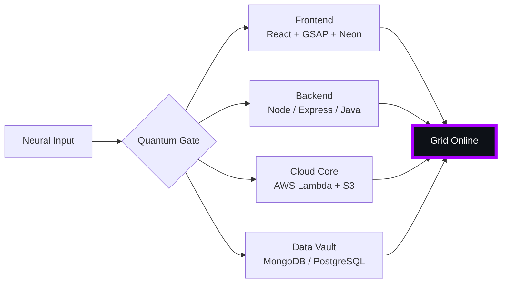

# 🌌 [ NEURAL CORE ACCESS: PENDEMVAMSI ]

<p align="center">
  
</p>

<div align="center">
  
  <br><small>Active Protocol: <strong style="color:#AA00FF">SHADOW EXTRACTION</strong> 🖤👁️</small>
</div>

## 🔵 NEURAL STATUS READOUT
```text
SUBJECT ID    →  PENDEMVAMSI
ENTITY CLASS  →  SHADOW MONARCH v6
NEURAL RANK   →  B-TIER
GRID SYNC     →  1152/2267 QUANTUM PACKETS
─────── BIO-METRICS (SHADOW EXTRACTION) ───────
STRENGTH      127  ████████████████░░░░░
AGILITY       110  ██████████████░░░░░░░
INTELLIGENCE  130  █████████████████░░░░
VITALITY      103  █████████████░░░░░░░░
```

> **NEURAL BURST ACQUIRED:** +71 QUANTUM PACKETS 
> **SYSTEM MESSAGE:** SYNTHETIC DREAMS LOADING… DO NOT DISCONNECT

---

## 🌀 GRID ARCHITECTURE (HOLOGRAPHIC RENDER)



---

## 📡 ACADEMIC NODES – CONQUERED
- [x] B.Tech Neural Engineering (2020–2024) – St. Ann’s Grid
- [x] Intermediate Quantum Core (2018–2020) – Sri Medhavi
- [x] SSC Primary Link (2017–2018) – Sri Geethanjali

---

## ⚡ SKILL NEURAL MATRIX

<details open>
<summary>🔌 ACTIVE NEURAL LINKS</summary>

| Node               | Tier | Integrity Bar                | Status      |
|--------------------|------|------------------------------|-------------|
| Java Core          | S    | ████████████████████ 100%   | OVERCLOCKED |
| Node.js Grid       | S    | ████████████████████ 100%   | OVERCLOCKED |
| React Holo-UI      | A+   | █████████████████░░░ 92%    | ONLINE      |
| AWS Quantum Relay  | S    | ████████████████████ 100%   | SOVEREIGN   |
| Python AI Kernel   | A    | ████████████████░░░░ 85%    | CHARGING    |
| DSA Void Algorithm | A    | █████████████████░░░ 90%    | ACTIVE      |

</details>

---

## 🏅 NEURAL ACHIEVEMENT TOKENS

<p align="center">
  
  
  
  
</p>

---

## 👾 SHADOW ENTITIES – SUMMONED

<p align="center">
  
  <br><strong style="color:#AA00FF">ARISE.</strong>
</p>

| Entity | Designation   | Class            | Source Node                     |
|--------|---------------|------------------|---------------------------------|
| SH-01  | Igris         | Void Commander   | AI Financial Oracle             |
| SH-02  | Beru          | Swarm Overlord   | WebRTC Quantum Stream           |
| SH-03  | Kaisel        | Void Wyrm        | Geolocation Shadow Relay        |
| SH-04  | Tusk          | Arcane Construct | Global Pandemic Sentinel        |
| SH-05  | Iron          | Armored Bastion  | React Crypto Fortress           |

---

## 📡 GRID ANALYTICS (LIVE FEED)

<p align="center">
  
  <br>
  
  
</p>

---

## 🖥️ CORRUPTED MAINFRAME LOG (401 ENTRIES)

<details>
<summary>OPEN TERMINAL FEED – PROTOCOL: SHADOW EXTRACTION</summary>

> [0xE9EFC7C0] 🖤👁️ **SHADOW EXTRACTION PROTOCOL** #0 | NEURAL LINK STABILIZED | [TRANSMISSION SUCCESS]
> [0x9727A991] 🖤👁️ **SHADOW EXTRACTION PROTOCOL** #1 | NEURAL LINK STABILIZED | [TRANSMISSION SUCCESS]
> [0xC2DBA267] 🖤👁️ **SHADOW EXTRACTION PROTOCOL** #2 | NEURAL LINK STABILIZED | [TRANSMISSION SUCCESS]
> [0xF2D7F08A] 🖤👁️ **SHADOW EXTRACTION PROTOCOL** #3 | NEURAL LINK STABILIZED | [TRANSMISSION SUCCESS]
> [0x62A9BDCB] 🖤👁️ **SHADOW EXTRACTION PROTOCOL** #4 | NEURAL LINK STABILIZED | [TRANSMISSION SUCCESS]
> [0x592E2332] 🖤👁️ **SHADOW EXTRACTION PROTOCOL** #5 | NEURAL LINK STABILIZED | [TRANSMISSION SUCCESS]
> [0xB451B19D] 🖤👁️ **SHADOW EXTRACTION PROTOCOL** #6 | NEURAL LINK STABILIZED | [TRANSMISSION SUCCESS]
> [0x195C3A16] 🖤👁️ **SHADOW EXTRACTION PROTOCOL** #7 | NEURAL LINK STABILIZED | [TRANSMISSION SUCCESS]
> [0xF545DC81] 🖤👁️ **SHADOW EXTRACTION PROTOCOL** #8 | NEURAL LINK STABILIZED | [TRANSMISSION SUCCESS]
> [0xC19A48E1] 🖤👁️ **SHADOW EXTRACTION PROTOCOL** #9 | NEURAL LINK STABILIZED | [TRANSMISSION SUCCESS]
> [0xE4B04001] 🖤👁️ **SHADOW EXTRACTION PROTOCOL** #10 | NEURAL LINK STABILIZED | [TRANSMISSION SUCCESS]
> [0xAA2B42CE] 🖤👁️ **SHADOW EXTRACTION PROTOCOL** #11 | NEURAL LINK STABILIZED | [TRANSMISSION SUCCESS]
> [0xF483E052] 🖤👁️ **SHADOW EXTRACTION PROTOCOL** #12 | NEURAL LINK STABILIZED | [TRANSMISSION SUCCESS]
> [0x489C5C75] 🖤👁️ **SHADOW EXTRACTION PROTOCOL** #13 | NEURAL LINK STABILIZED | [TRANSMISSION SUCCESS]
> [0xE4138F56] 🖤👁️ **SHADOW EXTRACTION PROTOCOL** #14 | NEURAL LINK STABILIZED | [TRANSMISSION SUCCESS]
> [0x089D95F2] 🖤👁️ **SHADOW EXTRACTION PROTOCOL** #15 | NEURAL LINK  [GLITCH DETECTED] STABILIZED | [TRANSMISSION SUCCESS]
> [0x30C26FB8] 🖤👁️ **SHADOW EXTRACTION PROTOCOL** #16 | NEURAL LINK STABILIZED | [TRANSMISSION SUCCESS]
> [0x481AA9AD] 🖤👁️ **SHADOW EXTRACTION PROTOCOL** #17 | NEURAL LINK STABILIZED | [TRANSMISSION SUCCESS]
> [0xD441802A] 🖤👁️ **SHADOW EXTRACTION PROTOCOL** #18 | NEURAL LINK STABILIZED | [TRANSMISSION SUCCESS]
> [0xCCBEAEEE] 🖤👁️ **SHADOW EXTRACTION PROTOCOL** #19 | NEURAL LINK STABILIZED | [TRANSMISSION SUCCESS]
> [0xEAB91080] 🖤👁️ **SHADOW EXTRACTION PROTOCOL** #20 | NEURAL LINK STABILIZED | [TRANSMISSION SUCCESS]
> [0x6D73A74F] 🖤👁️ **SHADOW EXTRACTION PROTOCOL** #21 | NEURAL LINK STABILIZED | [TRANSMISSION SUCCESS]
> [0xE2DA49FD] 🖤👁️ **SHADOW EXTRACTION PROTOCOL** #22 | NEURAL LINK STABILIZED | [TRANSMISSION SUCCESS]
> [0x5BA24192] 🖤👁️ **SHADOW EXTRACTION PROTOCOL** #23 | NEURAL LINK STABILIZED | [TRANSMISSION SUCCESS]
> [0xE30E6F04] 🖤👁️ **SHADOW EXTRACTION PROTOCOL** #24 | NEURAL LINK STABILIZED | [TRANSMISSION SUCCESS]
> [0xD7429886] 🖤👁️ **SHADOW EXTRACTION PROTOCOL** #25 | NEURAL LINK STABILIZED | [TRANSMISSION SUCCESS]
> [0x173B913B] 🖤👁️ **SHADOW EXTRACTION PROTOCOL** #26 | NEURAL LINK STABILIZED | [TRANSMISSION SUCCESS]
> [0x74CE5E0A] 🖤👁️ **SHADOW EXTRACTION PROTOCOL** #27 | NEURAL LINK STABILIZED | [TRANSMISSION SUCCESS]
> [0xC51BA04B] 🖤👁️ **SHADOW EXTRACTION PROTOCOL** #28 | NEURAL LINK STABILIZED | [TRANSMISSION SUCCESS]
> [0xC131941A] 🖤👁️ **SHADOW EXTRACTION PROTOCOL** #29 | NEURAL LINK STABILIZED | [TRANSMISSION SUCCESS]
> [0xC4580575] 🖤👁️ **SHADOW EXTRACTION PROTOCOL** #30 | NEURAL LINK STABILIZED | [TRANSMISSION SUCCESS]
> [0x7DAACD48] 🖤👁️ **SHADOW EXTRACTION PROTOCOL** #31 | NEURAL LINK STABILIZED | [TRANSMISSION SUCCESS]
> [0xCBE442FE] 🖤👁️ **SHADOW EXTRACTION PROTOCOL** #32 | NEURAL LINK STABILIZED | [TRANSMISSION SUCCESS]
> [0x82A5BC6C] 🖤👁️ **SHADOW EXTRACTION PROTOCOL** #33 | NEURAL LINK STABILIZED | [TRANSMISSION SUCCESS]
> [0x2D69D325] 🖤👁️ **SHADOW EXTRACTION PROTOCOL** #34 | NEURAL LINK STABILIZED | [TRANSMISSION SUCCESS]
> [0x0D39BE6C] 🖤👁️ **SHADOW EXTRACTION PROTOCOL** #35 | NEURAL LINK STABILIZED | [TRANSMISSION SUCCESS]
> [0xD6A51DD4] 🖤👁️ **SHADOW EXTRACTION PROTOCOL** #36 | NEURAL LINK  [GLITCH DETECTED] STABILIZED | [TRANSMISSION SUCCESS]
> [0x06A6464C] 🖤👁️ **SHADOW EXTRACTION PROTOCOL** #37 | NEURAL LINK STABILIZED | [TRANSMISSION SUCCESS]
> [0xB407A4EC] 🖤👁️ **SHADOW EXTRACTION PROTOCOL** #38 | NEURAL LINK STABILIZED | [TRANSMISSION SUCCESS]
> [0xF876763C] 🖤👁️ **SHADOW EXTRACTION PROTOCOL** #39 | NEURAL LINK STABILIZED | [TRANSMISSION SUCCESS]
> [0xF1D169A2] 🖤👁️ **SHADOW EXTRACTION PROTOCOL** #40 | NEURAL LINK STABILIZED | [TRANSMISSION SUCCESS]
> [0x95948C74] 🖤👁️ **SHADOW EXTRACTION PROTOCOL** #41 | NEURAL LINK STABILIZED | [TRANSMISSION SUCCESS]
> [0xA7B76E4F] 🖤👁️ **SHADOW EXTRACTION PROTOCOL** #42 | NEURAL LINK STABILIZED | [TRANSMISSION SUCCESS]
> [0x18D42E68] 🖤👁️ **SHADOW EXTRACTION PROTOCOL** #43 | NEURAL LINK  [GLITCH DETECTED] STABILIZED | [TRANSMISSION SUCCESS]
> [0x627B494E] 🖤👁️ **SHADOW EXTRACTION PROTOCOL** #44 | NEURAL LINK STABILIZED | [TRANSMISSION SUCCESS]
> [0x547EC107] 🖤👁️ **SHADOW EXTRACTION PROTOCOL** #45 | NEURAL LINK STABILIZED | [TRANSMISSION SUCCESS]
> [0x17E3EB85] 🖤👁️ **SHADOW EXTRACTION PROTOCOL** #46 | NEURAL LINK STABILIZED | [TRANSMISSION SUCCESS]
> [0x550D5E7A] 🖤👁️ **SHADOW EXTRACTION PROTOCOL** #47 | NEURAL LINK STABILIZED | [TRANSMISSION SUCCESS]
> [0xB34B8A4A] 🖤👁️ **SHADOW EXTRACTION PROTOCOL** #48 | NEURAL LINK STABILIZED | [TRANSMISSION SUCCESS]
> [0x16E92642] 🖤👁️ **SHADOW EXTRACTION PROTOCOL** #49 | NEURAL LINK  [GLITCH DETECTED] STABILIZED | [TRANSMISSION SUCCESS]
> [0x9F2CEAC1] 🖤👁️ **SHADOW EXTRACTION PROTOCOL** #50 | NEURAL LINK STABILIZED | [TRANSMISSION SUCCESS]
> [0xB411E8BC] 🖤👁️ **SHADOW EXTRACTION PROTOCOL** #51 | NEURAL LINK STABILIZED | [TRANSMISSION SUCCESS]
> [0x3263AC3A] 🖤👁️ **SHADOW EXTRACTION PROTOCOL** #52 | NEURAL LINK  [GLITCH DETECTED] STABILIZED | [TRANSMISSION SUCCESS]
> [0xC16F8451] 🖤👁️ **SHADOW EXTRACTION PROTOCOL** #53 | NEURAL LINK  [GLITCH DETECTED] STABILIZED | [TRANSMISSION SUCCESS]
> [0x0606CE47] 🖤👁️ **SHADOW EXTRACTION PROTOCOL** #54 | NEURAL LINK  [GLITCH DETECTED] STABILIZED | [TRANSMISSION SUCCESS]
> [0x5035CF52] 🖤👁️ **SHADOW EXTRACTION PROTOCOL** #55 | NEURAL LINK STABILIZED | [TRANSMISSION SUCCESS]
> [0xB585D445] 🖤👁️ **SHADOW EXTRACTION PROTOCOL** #56 | NEURAL LINK STABILIZED | [TRANSMISSION SUCCESS]
> [0x15BF09A3] 🖤👁️ **SHADOW EXTRACTION PROTOCOL** #57 | NEURAL LINK STABILIZED | [TRANSMISSION SUCCESS]
> [0xC70930DA] 🖤👁️ **SHADOW EXTRACTION PROTOCOL** #58 | NEURAL LINK STABILIZED | [TRANSMISSION SUCCESS]
> [0xF24EE94F] 🖤👁️ **SHADOW EXTRACTION PROTOCOL** #59 | NEURAL LINK STABILIZED | [TRANSMISSION SUCCESS]
> [0xC0F4B262] 🖤👁️ **SHADOW EXTRACTION PROTOCOL** #60 | NEURAL LINK STABILIZED | [TRANSMISSION SUCCESS]
> [0x5579F7E6] 🖤👁️ **SHADOW EXTRACTION PROTOCOL** #61 | NEURAL LINK STABILIZED | [TRANSMISSION SUCCESS]
> [0x75085D7C] 🖤👁️ **SHADOW EXTRACTION PROTOCOL** #62 | NEURAL LINK STABILIZED | [TRANSMISSION SUCCESS]
> [0x88D07015] 🖤👁️ **SHADOW EXTRACTION PROTOCOL** #63 | NEURAL LINK  [GLITCH DETECTED] STABILIZED | [TRANSMISSION SUCCESS]
> [0x1BAF3A9D] 🖤👁️ **SHADOW EXTRACTION PROTOCOL** #64 | NEURAL LINK  [GLITCH DETECTED] STABILIZED | [TRANSMISSION SUCCESS]
> [0x5D8F4361] 🖤👁️ **SHADOW EXTRACTION PROTOCOL** #65 | NEURAL LINK STABILIZED | [TRANSMISSION SUCCESS]
> [0xB95C0BBF] 🖤👁️ **SHADOW EXTRACTION PROTOCOL** #66 | NEURAL LINK STABILIZED | [TRANSMISSION SUCCESS]
> [0x128CA0D2] 🖤👁️ **SHADOW EXTRACTION PROTOCOL** #67 | NEURAL LINK STABILIZED | [TRANSMISSION SUCCESS]
> [0x4C860590] 🖤👁️ **SHADOW EXTRACTION PROTOCOL** #68 | NEURAL LINK STABILIZED | [TRANSMISSION SUCCESS]
> [0x9912C50F] 🖤👁️ **SHADOW EXTRACTION PROTOCOL** #69 | NEURAL LINK STABILIZED | [TRANSMISSION SUCCESS]
> [0x49ED5521] 🖤👁️ **SHADOW EXTRACTION PROTOCOL** #70 | NEURAL LINK STABILIZED | [TRANSMISSION SUCCESS]
> [0xD27B8961] 🖤👁️ **SHADOW EXTRACTION PROTOCOL** #71 | NEURAL LINK  [GLITCH DETECTED] STABILIZED | [TRANSMISSION SUCCESS]
> [0xC5CE1FC1] 🖤👁️ **SHADOW EXTRACTION PROTOCOL** #72 | NEURAL LINK STABILIZED | [TRANSMISSION SUCCESS]
> [0x908AD8D5] 🖤👁️ **SHADOW EXTRACTION PROTOCOL** #73 | NEURAL LINK STABILIZED | [TRANSMISSION SUCCESS]
> [0x8822FCEF] 🖤👁️ **SHADOW EXTRACTION PROTOCOL** #74 | NEURAL LINK STABILIZED | [TRANSMISSION SUCCESS]
> [0x716E6D8E] 🖤👁️ **SHADOW EXTRACTION PROTOCOL** #75 | NEURAL LINK STABILIZED | [TRANSMISSION SUCCESS]
> [0x6BEA6457] 🖤👁️ **SHADOW EXTRACTION PROTOCOL** #76 | NEURAL LINK STABILIZED | [TRANSMISSION SUCCESS]
> [0xC5CDB577] 🖤👁️ **SHADOW EXTRACTION PROTOCOL** #77 | NEURAL LINK  [GLITCH DETECTED] STABILIZED | [TRANSMISSION SUCCESS]
> [0x72C8A887] 🖤👁️ **SHADOW EXTRACTION PROTOCOL** #78 | NEURAL LINK STABILIZED | [TRANSMISSION SUCCESS]
> [0xA358A11A] 🖤👁️ **SHADOW EXTRACTION PROTOCOL** #79 | NEURAL LINK STABILIZED | [TRANSMISSION SUCCESS]
> [0x9C69151F] 🖤👁️ **SHADOW EXTRACTION PROTOCOL** #80 | NEURAL LINK STABILIZED | [TRANSMISSION SUCCESS]
> [0x7592F9DC] 🖤👁️ **SHADOW EXTRACTION PROTOCOL** #81 | NEURAL LINK STABILIZED | [TRANSMISSION SUCCESS]
> [0xC92EBFE2] 🖤👁️ **SHADOW EXTRACTION PROTOCOL** #82 | NEURAL LINK  [GLITCH DETECTED] STABILIZED | [TRANSMISSION SUCCESS]
> [0x173F0A71] 🖤👁️ **SHADOW EXTRACTION PROTOCOL** #83 | NEURAL LINK STABILIZED | [TRANSMISSION SUCCESS]
> [0xD88DA5AA] 🖤👁️ **SHADOW EXTRACTION PROTOCOL** #84 | NEURAL LINK STABILIZED | [TRANSMISSION SUCCESS]
> [0xB69C2C05] 🖤👁️ **SHADOW EXTRACTION PROTOCOL** #85 | NEURAL LINK STABILIZED | [TRANSMISSION SUCCESS]
> [0x11709620] 🖤👁️ **SHADOW EXTRACTION PROTOCOL** #86 | NEURAL LINK STABILIZED | [TRANSMISSION SUCCESS]
> [0x536ED2F3] 🖤👁️ **SHADOW EXTRACTION PROTOCOL** #87 | NEURAL LINK STABILIZED | [TRANSMISSION SUCCESS]
> [0x7AD5B630] 🖤👁️ **SHADOW EXTRACTION PROTOCOL** #88 | NEURAL LINK  [GLITCH DETECTED] STABILIZED | [TRANSMISSION SUCCESS]
> [0xDB2766A2] 🖤👁️ **SHADOW EXTRACTION PROTOCOL** #89 | NEURAL LINK STABILIZED | [TRANSMISSION SUCCESS]
> [0xE590AAE9] 🖤👁️ **SHADOW EXTRACTION PROTOCOL** #90 | NEURAL LINK STABILIZED | [TRANSMISSION SUCCESS]
> [0x16CEEB2A] 🖤👁️ **SHADOW EXTRACTION PROTOCOL** #91 | NEURAL LINK STABILIZED | [TRANSMISSION SUCCESS]
> [0x300D3B11] 🖤👁️ **SHADOW EXTRACTION PROTOCOL** #92 | NEURAL LINK STABILIZED | [TRANSMISSION SUCCESS]
> [0x6EDC5D20] 🖤👁️ **SHADOW EXTRACTION PROTOCOL** #93 | NEURAL LINK STABILIZED | [TRANSMISSION SUCCESS]
> [0x0D21DD6A] 🖤👁️ **SHADOW EXTRACTION PROTOCOL** #94 | NEURAL LINK STABILIZED | [TRANSMISSION SUCCESS]
> [0x3FF354D9] 🖤👁️ **SHADOW EXTRACTION PROTOCOL** #95 | NEURAL LINK STABILIZED | [TRANSMISSION SUCCESS]
> [0x7EA97056] 🖤👁️ **SHADOW EXTRACTION PROTOCOL** #96 | NEURAL LINK STABILIZED | [TRANSMISSION SUCCESS]
> [0xD5B17D36] 🖤👁️ **SHADOW EXTRACTION PROTOCOL** #97 | NEURAL LINK STABILIZED | [TRANSMISSION SUCCESS]
> [0x4F86E692] 🖤👁️ **SHADOW EXTRACTION PROTOCOL** #98 | NEURAL LINK STABILIZED | [TRANSMISSION SUCCESS]
> [0xA8749C99] 🖤👁️ **SHADOW EXTRACTION PROTOCOL** #99 | NEURAL LINK STABILIZED | [TRANSMISSION SUCCESS]
> [0xA6F03412] 🖤👁️ **SHADOW EXTRACTION PROTOCOL** #100 | NEURAL LINK STABILIZED | [TRANSMISSION SUCCESS]
> [0xA07C0F35] 🖤👁️ **SHADOW EXTRACTION PROTOCOL** #101 | NEURAL LINK STABILIZED | [TRANSMISSION SUCCESS]
> [0xF6FB2BDD] 🖤👁️ **SHADOW EXTRACTION PROTOCOL** #102 | NEURAL LINK STABILIZED | [TRANSMISSION SUCCESS]
> [0xD51F9043] 🖤👁️ **SHADOW EXTRACTION PROTOCOL** #103 | NEURAL LINK STABILIZED | [TRANSMISSION SUCCESS]
> [0x1805BB93] 🖤👁️ **SHADOW EXTRACTION PROTOCOL** #104 | NEURAL LINK STABILIZED | [TRANSMISSION SUCCESS]
> [0xE63C350D] 🖤👁️ **SHADOW EXTRACTION PROTOCOL** #105 | NEURAL LINK STABILIZED | [TRANSMISSION SUCCESS]
> [0xC4967F40] 🖤👁️ **SHADOW EXTRACTION PROTOCOL** #106 | NEURAL LINK  [GLITCH DETECTED] STABILIZED | [TRANSMISSION SUCCESS]
> [0x32D4602D] 🖤👁️ **SHADOW EXTRACTION PROTOCOL** #107 | NEURAL LINK STABILIZED | [TRANSMISSION SUCCESS]
> [0x601844FC] 🖤👁️ **SHADOW EXTRACTION PROTOCOL** #108 | NEURAL LINK  [GLITCH DETECTED] STABILIZED | [TRANSMISSION SUCCESS]
> [0x1A7C8106] 🖤👁️ **SHADOW EXTRACTION PROTOCOL** #109 | NEURAL LINK STABILIZED | [TRANSMISSION SUCCESS]
> [0xF5FE6AF4] 🖤👁️ **SHADOW EXTRACTION PROTOCOL** #110 | NEURAL LINK STABILIZED | [TRANSMISSION SUCCESS]
> [0xE6C55975] 🖤👁️ **SHADOW EXTRACTION PROTOCOL** #111 | NEURAL LINK STABILIZED | [TRANSMISSION SUCCESS]
> [0xC3E86861] 🖤👁️ **SHADOW EXTRACTION PROTOCOL** #112 | NEURAL LINK STABILIZED | [TRANSMISSION SUCCESS]
> [0x70437C14] 🖤👁️ **SHADOW EXTRACTION PROTOCOL** #113 | NEURAL LINK STABILIZED | [TRANSMISSION SUCCESS]
> [0x78960597] 🖤👁️ **SHADOW EXTRACTION PROTOCOL** #114 | NEURAL LINK STABILIZED | [TRANSMISSION SUCCESS]
> [0xC83B4869] 🖤👁️ **SHADOW EXTRACTION PROTOCOL** #115 | NEURAL LINK STABILIZED | [TRANSMISSION SUCCESS]
> [0xA8C5C4FC] 🖤👁️ **SHADOW EXTRACTION PROTOCOL** #116 | NEURAL LINK STABILIZED | [TRANSMISSION SUCCESS]
> [0xAA926C0C] 🖤👁️ **SHADOW EXTRACTION PROTOCOL** #117 | NEURAL LINK STABILIZED | [TRANSMISSION SUCCESS]
> [0x6E5B1F5E] 🖤👁️ **SHADOW EXTRACTION PROTOCOL** #118 | NEURAL LINK STABILIZED | [TRANSMISSION SUCCESS]
> [0x83F7F2EC] 🖤👁️ **SHADOW EXTRACTION PROTOCOL** #119 | NEURAL LINK  [GLITCH DETECTED] STABILIZED | [TRANSMISSION SUCCESS]
> [0xDB79F553] 🖤👁️ **SHADOW EXTRACTION PROTOCOL** #120 | NEURAL LINK STABILIZED | [TRANSMISSION SUCCESS]
> [0x24B3AF3D] 🖤👁️ **SHADOW EXTRACTION PROTOCOL** #121 | NEURAL LINK STABILIZED | [TRANSMISSION SUCCESS]
> [0x1DF9C4E7] 🖤👁️ **SHADOW EXTRACTION PROTOCOL** #122 | NEURAL LINK STABILIZED | [TRANSMISSION SUCCESS]
> [0x162AA046] 🖤👁️ **SHADOW EXTRACTION PROTOCOL** #123 | NEURAL LINK STABILIZED | [TRANSMISSION SUCCESS]
> [0xC95C797E] 🖤👁️ **SHADOW EXTRACTION PROTOCOL** #124 | NEURAL LINK STABILIZED | [TRANSMISSION SUCCESS]
> [0x83DA72D5] 🖤👁️ **SHADOW EXTRACTION PROTOCOL** #125 | NEURAL LINK STABILIZED | [TRANSMISSION SUCCESS]
> [0xA282DCE6] 🖤👁️ **SHADOW EXTRACTION PROTOCOL** #126 | NEURAL LINK STABILIZED | [TRANSMISSION SUCCESS]
> [0x7DABAD9B] 🖤👁️ **SHADOW EXTRACTION PROTOCOL** #127 | NEURAL LINK STABILIZED | [TRANSMISSION SUCCESS]
> [0x20B30D29] 🖤👁️ **SHADOW EXTRACTION PROTOCOL** #128 | NEURAL LINK STABILIZED | [TRANSMISSION SUCCESS]
> [0xA6B0447F] 🖤👁️ **SHADOW EXTRACTION PROTOCOL** #129 | NEURAL LINK STABILIZED | [TRANSMISSION SUCCESS]
> [0x6C76F63E] 🖤👁️ **SHADOW EXTRACTION PROTOCOL** #130 | NEURAL LINK STABILIZED | [TRANSMISSION SUCCESS]
> [0x8A9C02D4] 🖤👁️ **SHADOW EXTRACTION PROTOCOL** #131 | NEURAL LINK STABILIZED | [TRANSMISSION SUCCESS]
> [0xB73E42A0] 🖤👁️ **SHADOW EXTRACTION PROTOCOL** #132 | NEURAL LINK STABILIZED | [TRANSMISSION SUCCESS]
> [0x36FAAE25] 🖤👁️ **SHADOW EXTRACTION PROTOCOL** #133 | NEURAL LINK STABILIZED | [TRANSMISSION SUCCESS]
> [0xA74329B0] 🖤👁️ **SHADOW EXTRACTION PROTOCOL** #134 | NEURAL LINK STABILIZED | [TRANSMISSION SUCCESS]
> [0xE62C2479] 🖤👁️ **SHADOW EXTRACTION PROTOCOL** #135 | NEURAL LINK STABILIZED | [TRANSMISSION SUCCESS]
> [0xC2E6B0EF] 🖤👁️ **SHADOW EXTRACTION PROTOCOL** #136 | NEURAL LINK STABILIZED | [TRANSMISSION SUCCESS]
> [0x98D0B7C8] 🖤👁️ **SHADOW EXTRACTION PROTOCOL** #137 | NEURAL LINK STABILIZED | [TRANSMISSION SUCCESS]
> [0x06788C01] 🖤👁️ **SHADOW EXTRACTION PROTOCOL** #138 | NEURAL LINK STABILIZED | [TRANSMISSION SUCCESS]
> [0x883905AA] 🖤👁️ **SHADOW EXTRACTION PROTOCOL** #139 | NEURAL LINK  [GLITCH DETECTED] STABILIZED | [TRANSMISSION SUCCESS]
> [0x0A60F4B3] 🖤👁️ **SHADOW EXTRACTION PROTOCOL** #140 | NEURAL LINK STABILIZED | [TRANSMISSION SUCCESS]
> [0x6143C292] 🖤👁️ **SHADOW EXTRACTION PROTOCOL** #141 | NEURAL LINK STABILIZED | [TRANSMISSION SUCCESS]
> [0x04A2FCE2] 🖤👁️ **SHADOW EXTRACTION PROTOCOL** #142 | NEURAL LINK STABILIZED | [TRANSMISSION SUCCESS]
> [0x16B3116E] 🖤👁️ **SHADOW EXTRACTION PROTOCOL** #143 | NEURAL LINK  [GLITCH DETECTED] STABILIZED | [TRANSMISSION SUCCESS]
> [0x74095537] 🖤👁️ **SHADOW EXTRACTION PROTOCOL** #144 | NEURAL LINK STABILIZED | [TRANSMISSION SUCCESS]
> [0xF8F1122D] 🖤👁️ **SHADOW EXTRACTION PROTOCOL** #145 | NEURAL LINK  [GLITCH DETECTED] STABILIZED | [TRANSMISSION SUCCESS]
> [0x8A317151] 🖤👁️ **SHADOW EXTRACTION PROTOCOL** #146 | NEURAL LINK STABILIZED | [TRANSMISSION SUCCESS]
> [0x8B79FBA0] 🖤👁️ **SHADOW EXTRACTION PROTOCOL** #147 | NEURAL LINK  [GLITCH DETECTED] STABILIZED | [TRANSMISSION SUCCESS]
> [0x8AD363E0] 🖤👁️ **SHADOW EXTRACTION PROTOCOL** #148 | NEURAL LINK STABILIZED | [TRANSMISSION SUCCESS]
> [0xE64144C9] 🖤👁️ **SHADOW EXTRACTION PROTOCOL** #149 | NEURAL LINK STABILIZED | [TRANSMISSION SUCCESS]
> [0xCF0437CB] 🖤👁️ **SHADOW EXTRACTION PROTOCOL** #150 | NEURAL LINK STABILIZED | [TRANSMISSION SUCCESS]
> [0x0253F009] 🖤👁️ **SHADOW EXTRACTION PROTOCOL** #151 | NEURAL LINK STABILIZED | [TRANSMISSION SUCCESS]
> [0xE3CD57BF] 🖤👁️ **SHADOW EXTRACTION PROTOCOL** #152 | NEURAL LINK STABILIZED | [TRANSMISSION SUCCESS]
> [0xDBD8094C] 🖤👁️ **SHADOW EXTRACTION PROTOCOL** #153 | NEURAL LINK STABILIZED | [TRANSMISSION SUCCESS]
> [0xF2F488C8] 🖤👁️ **SHADOW EXTRACTION PROTOCOL** #154 | NEURAL LINK STABILIZED | [TRANSMISSION SUCCESS]
> [0xE6B678DA] 🖤👁️ **SHADOW EXTRACTION PROTOCOL** #155 | NEURAL LINK STABILIZED | [TRANSMISSION SUCCESS]
> [0x8342CCDF] 🖤👁️ **SHADOW EXTRACTION PROTOCOL** #156 | NEURAL LINK STABILIZED | [TRANSMISSION SUCCESS]
> [0xB2E2861C] 🖤👁️ **SHADOW EXTRACTION PROTOCOL** #157 | NEURAL LINK STABILIZED | [TRANSMISSION SUCCESS]
> [0x0565607E] 🖤👁️ **SHADOW EXTRACTION PROTOCOL** #158 | NEURAL LINK STABILIZED | [TRANSMISSION SUCCESS]
> [0x0FBF046E] 🖤👁️ **SHADOW EXTRACTION PROTOCOL** #159 | NEURAL LINK  [GLITCH DETECTED] STABILIZED | [TRANSMISSION SUCCESS]
> [0xD038CC08] 🖤👁️ **SHADOW EXTRACTION PROTOCOL** #160 | NEURAL LINK  [GLITCH DETECTED] STABILIZED | [TRANSMISSION SUCCESS]
> [0x6E118696] 🖤👁️ **SHADOW EXTRACTION PROTOCOL** #161 | NEURAL LINK STABILIZED | [TRANSMISSION SUCCESS]
> [0x4D25801B] 🖤👁️ **SHADOW EXTRACTION PROTOCOL** #162 | NEURAL LINK STABILIZED | [TRANSMISSION SUCCESS]
> [0x0D025EEC] 🖤👁️ **SHADOW EXTRACTION PROTOCOL** #163 | NEURAL LINK STABILIZED | [TRANSMISSION SUCCESS]
> [0x1E857FB8] 🖤👁️ **SHADOW EXTRACTION PROTOCOL** #164 | NEURAL LINK  [GLITCH DETECTED] STABILIZED | [TRANSMISSION SUCCESS]
> [0xBFE5CA9B] 🖤👁️ **SHADOW EXTRACTION PROTOCOL** #165 | NEURAL LINK STABILIZED | [TRANSMISSION SUCCESS]
> [0x8591F49D] 🖤👁️ **SHADOW EXTRACTION PROTOCOL** #166 | NEURAL LINK STABILIZED | [TRANSMISSION SUCCESS]
> [0xD241C50C] 🖤👁️ **SHADOW EXTRACTION PROTOCOL** #167 | NEURAL LINK STABILIZED | [TRANSMISSION SUCCESS]
> [0x2C8ACA8A] 🖤👁️ **SHADOW EXTRACTION PROTOCOL** #168 | NEURAL LINK  [GLITCH DETECTED] STABILIZED | [TRANSMISSION SUCCESS]
> [0xE05A8E4D] 🖤👁️ **SHADOW EXTRACTION PROTOCOL** #169 | NEURAL LINK STABILIZED | [TRANSMISSION SUCCESS]
> [0x30A893C9] 🖤👁️ **SHADOW EXTRACTION PROTOCOL** #170 | NEURAL LINK STABILIZED | [TRANSMISSION SUCCESS]
> [0x517F74C0] 🖤👁️ **SHADOW EXTRACTION PROTOCOL** #171 | NEURAL LINK STABILIZED | [TRANSMISSION SUCCESS]
> [0x98FB1E34] 🖤👁️ **SHADOW EXTRACTION PROTOCOL** #172 | NEURAL LINK STABILIZED | [TRANSMISSION SUCCESS]
> [0x88BE4B36] 🖤👁️ **SHADOW EXTRACTION PROTOCOL** #173 | NEURAL LINK STABILIZED | [TRANSMISSION SUCCESS]
> [0xB8CB64B0] 🖤👁️ **SHADOW EXTRACTION PROTOCOL** #174 | NEURAL LINK STABILIZED | [TRANSMISSION SUCCESS]
> [0x5C11DBE9] 🖤👁️ **SHADOW EXTRACTION PROTOCOL** #175 | NEURAL LINK STABILIZED | [TRANSMISSION SUCCESS]
> [0x0B644B08] 🖤👁️ **SHADOW EXTRACTION PROTOCOL** #176 | NEURAL LINK STABILIZED | [TRANSMISSION SUCCESS]
> [0xF2E53E98] 🖤👁️ **SHADOW EXTRACTION PROTOCOL** #177 | NEURAL LINK STABILIZED | [TRANSMISSION SUCCESS]
> [0x85031BE2] 🖤👁️ **SHADOW EXTRACTION PROTOCOL** #178 | NEURAL LINK  [GLITCH DETECTED] STABILIZED | [TRANSMISSION SUCCESS]
> [0x7F5A2A2C] 🖤👁️ **SHADOW EXTRACTION PROTOCOL** #179 | NEURAL LINK STABILIZED | [TRANSMISSION SUCCESS]
> [0x4E9D935D] 🖤👁️ **SHADOW EXTRACTION PROTOCOL** #180 | NEURAL LINK STABILIZED | [TRANSMISSION SUCCESS]
> [0x0C785059] 🖤👁️ **SHADOW EXTRACTION PROTOCOL** #181 | NEURAL LINK STABILIZED | [TRANSMISSION SUCCESS]
> [0x60AF2E49] 🖤👁️ **SHADOW EXTRACTION PROTOCOL** #182 | NEURAL LINK STABILIZED | [TRANSMISSION SUCCESS]
> [0xF3D60BEB] 🖤👁️ **SHADOW EXTRACTION PROTOCOL** #183 | NEURAL LINK STABILIZED | [TRANSMISSION SUCCESS]
> [0x8FF94BA0] 🖤👁️ **SHADOW EXTRACTION PROTOCOL** #184 | NEURAL LINK STABILIZED | [TRANSMISSION SUCCESS]
> [0x2479EBE1] 🖤👁️ **SHADOW EXTRACTION PROTOCOL** #185 | NEURAL LINK STABILIZED | [TRANSMISSION SUCCESS]
> [0x98A119C0] 🖤👁️ **SHADOW EXTRACTION PROTOCOL** #186 | NEURAL LINK STABILIZED | [TRANSMISSION SUCCESS]
> [0x0628AF5B] 🖤👁️ **SHADOW EXTRACTION PROTOCOL** #187 | NEURAL LINK STABILIZED | [TRANSMISSION SUCCESS]
> [0xFFFE2BA0] 🖤👁️ **SHADOW EXTRACTION PROTOCOL** #188 | NEURAL LINK  [GLITCH DETECTED] STABILIZED | [TRANSMISSION SUCCESS]
> [0x2344620A] 🖤👁️ **SHADOW EXTRACTION PROTOCOL** #189 | NEURAL LINK STABILIZED | [TRANSMISSION SUCCESS]
> [0xD26C132E] 🖤👁️ **SHADOW EXTRACTION PROTOCOL** #190 | NEURAL LINK STABILIZED | [TRANSMISSION SUCCESS]
> [0xBA7708F2] 🖤👁️ **SHADOW EXTRACTION PROTOCOL** #191 | NEURAL LINK STABILIZED | [TRANSMISSION SUCCESS]
> [0xA165C765] 🖤👁️ **SHADOW EXTRACTION PROTOCOL** #192 | NEURAL LINK STABILIZED | [TRANSMISSION SUCCESS]
> [0x808C585B] 🖤👁️ **SHADOW EXTRACTION PROTOCOL** #193 | NEURAL LINK STABILIZED | [TRANSMISSION SUCCESS]
> [0xBB9A6ABF] 🖤👁️ **SHADOW EXTRACTION PROTOCOL** #194 | NEURAL LINK STABILIZED | [TRANSMISSION SUCCESS]
> [0x06AE69EC] 🖤👁️ **SHADOW EXTRACTION PROTOCOL** #195 | NEURAL LINK  [GLITCH DETECTED] STABILIZED | [TRANSMISSION SUCCESS]
> [0xD9750A7E] 🖤👁️ **SHADOW EXTRACTION PROTOCOL** #196 | NEURAL LINK  [GLITCH DETECTED] STABILIZED | [TRANSMISSION SUCCESS]
> [0x442B6ADF] 🖤👁️ **SHADOW EXTRACTION PROTOCOL** #197 | NEURAL LINK STABILIZED | [TRANSMISSION SUCCESS]
> [0xC6076D05] 🖤👁️ **SHADOW EXTRACTION PROTOCOL** #198 | NEURAL LINK STABILIZED | [TRANSMISSION SUCCESS]
> [0x5306B27A] 🖤👁️ **SHADOW EXTRACTION PROTOCOL** #199 | NEURAL LINK STABILIZED | [TRANSMISSION SUCCESS]
> [0xDCDF3DFD] 🖤👁️ **SHADOW EXTRACTION PROTOCOL** #200 | NEURAL LINK STABILIZED | [TRANSMISSION SUCCESS]
> [0xA3797215] 🖤👁️ **SHADOW EXTRACTION PROTOCOL** #201 | NEURAL LINK STABILIZED | [TRANSMISSION SUCCESS]
> [0x978426C0] 🖤👁️ **SHADOW EXTRACTION PROTOCOL** #202 | NEURAL LINK  [GLITCH DETECTED] STABILIZED | [TRANSMISSION SUCCESS]
> [0x8A22CDF4] 🖤👁️ **SHADOW EXTRACTION PROTOCOL** #203 | NEURAL LINK STABILIZED | [TRANSMISSION SUCCESS]
> [0x8B5A1475] 🖤👁️ **SHADOW EXTRACTION PROTOCOL** #204 | NEURAL LINK STABILIZED | [TRANSMISSION SUCCESS]
> [0x9A46DC6C] 🖤👁️ **SHADOW EXTRACTION PROTOCOL** #205 | NEURAL LINK STABILIZED | [TRANSMISSION SUCCESS]
> [0x6D70D9BC] 🖤👁️ **SHADOW EXTRACTION PROTOCOL** #206 | NEURAL LINK STABILIZED | [TRANSMISSION SUCCESS]
> [0xEDDADE27] 🖤👁️ **SHADOW EXTRACTION PROTOCOL** #207 | NEURAL LINK STABILIZED | [TRANSMISSION SUCCESS]
> [0x3F0B4EBC] 🖤👁️ **SHADOW EXTRACTION PROTOCOL** #208 | NEURAL LINK STABILIZED | [TRANSMISSION SUCCESS]
> [0x4C9FF228] 🖤👁️ **SHADOW EXTRACTION PROTOCOL** #209 | NEURAL LINK STABILIZED | [TRANSMISSION SUCCESS]
> [0xE97C6A07] 🖤👁️ **SHADOW EXTRACTION PROTOCOL** #210 | NEURAL LINK STABILIZED | [TRANSMISSION SUCCESS]
> [0x60471E53] 🖤👁️ **SHADOW EXTRACTION PROTOCOL** #211 | NEURAL LINK STABILIZED | [TRANSMISSION SUCCESS]
> [0xCE8E7CFF] 🖤👁️ **SHADOW EXTRACTION PROTOCOL** #212 | NEURAL LINK STABILIZED | [TRANSMISSION SUCCESS]
> [0x1AA0D99B] 🖤👁️ **SHADOW EXTRACTION PROTOCOL** #213 | NEURAL LINK STABILIZED | [TRANSMISSION SUCCESS]
> [0x458CF3B3] 🖤👁️ **SHADOW EXTRACTION PROTOCOL** #214 | NEURAL LINK STABILIZED | [TRANSMISSION SUCCESS]
> [0x6FB548F5] 🖤👁️ **SHADOW EXTRACTION PROTOCOL** #215 | NEURAL LINK  [GLITCH DETECTED] STABILIZED | [TRANSMISSION SUCCESS]
> [0x7C0FFDEA] 🖤👁️ **SHADOW EXTRACTION PROTOCOL** #216 | NEURAL LINK  [GLITCH DETECTED] STABILIZED | [TRANSMISSION SUCCESS]
> [0x5134D5AE] 🖤👁️ **SHADOW EXTRACTION PROTOCOL** #217 | NEURAL LINK STABILIZED | [TRANSMISSION SUCCESS]
> [0x05136EEE] 🖤👁️ **SHADOW EXTRACTION PROTOCOL** #218 | NEURAL LINK STABILIZED | [TRANSMISSION SUCCESS]
> [0x1D786297] 🖤👁️ **SHADOW EXTRACTION PROTOCOL** #219 | NEURAL LINK STABILIZED | [TRANSMISSION SUCCESS]
> [0x802A8E03] 🖤👁️ **SHADOW EXTRACTION PROTOCOL** #220 | NEURAL LINK STABILIZED | [TRANSMISSION SUCCESS]
> [0x98D76A61] 🖤👁️ **SHADOW EXTRACTION PROTOCOL** #221 | NEURAL LINK STABILIZED | [TRANSMISSION SUCCESS]
> [0xB3B50166] 🖤👁️ **SHADOW EXTRACTION PROTOCOL** #222 | NEURAL LINK STABILIZED | [TRANSMISSION SUCCESS]
> [0xD4E5C42C] 🖤👁️ **SHADOW EXTRACTION PROTOCOL** #223 | NEURAL LINK STABILIZED | [TRANSMISSION SUCCESS]
> [0x753365AE] 🖤👁️ **SHADOW EXTRACTION PROTOCOL** #224 | NEURAL LINK STABILIZED | [TRANSMISSION SUCCESS]
> [0xF56A9F7F] 🖤👁️ **SHADOW EXTRACTION PROTOCOL** #225 | NEURAL LINK STABILIZED | [TRANSMISSION SUCCESS]
> [0xB6C55D07] 🖤👁️ **SHADOW EXTRACTION PROTOCOL** #226 | NEURAL LINK STABILIZED | [TRANSMISSION SUCCESS]
> [0xBB410C67] 🖤👁️ **SHADOW EXTRACTION PROTOCOL** #227 | NEURAL LINK STABILIZED | [TRANSMISSION SUCCESS]
> [0x134C1DE6] 🖤👁️ **SHADOW EXTRACTION PROTOCOL** #228 | NEURAL LINK STABILIZED | [TRANSMISSION SUCCESS]
> [0x48D04B25] 🖤👁️ **SHADOW EXTRACTION PROTOCOL** #229 | NEURAL LINK STABILIZED | [TRANSMISSION SUCCESS]
> [0x9DDC2F3A] 🖤👁️ **SHADOW EXTRACTION PROTOCOL** #230 | NEURAL LINK STABILIZED | [TRANSMISSION SUCCESS]
> [0x8BF7AE7C] 🖤👁️ **SHADOW EXTRACTION PROTOCOL** #231 | NEURAL LINK STABILIZED | [TRANSMISSION SUCCESS]
> [0x4C245F46] 🖤👁️ **SHADOW EXTRACTION PROTOCOL** #232 | NEURAL LINK STABILIZED | [TRANSMISSION SUCCESS]
> [0x480A4B16] 🖤👁️ **SHADOW EXTRACTION PROTOCOL** #233 | NEURAL LINK STABILIZED | [TRANSMISSION SUCCESS]
> [0xF2B9D85F] 🖤👁️ **SHADOW EXTRACTION PROTOCOL** #234 | NEURAL LINK  [GLITCH DETECTED] STABILIZED | [TRANSMISSION SUCCESS]
> [0xDC792DB3] 🖤👁️ **SHADOW EXTRACTION PROTOCOL** #235 | NEURAL LINK STABILIZED | [TRANSMISSION SUCCESS]
> [0x73EB945F] 🖤👁️ **SHADOW EXTRACTION PROTOCOL** #236 | NEURAL LINK STABILIZED | [TRANSMISSION SUCCESS]
> [0xE29D5BA0] 🖤👁️ **SHADOW EXTRACTION PROTOCOL** #237 | NEURAL LINK STABILIZED | [TRANSMISSION SUCCESS]
> [0x5C9CA1A3] 🖤👁️ **SHADOW EXTRACTION PROTOCOL** #238 | NEURAL LINK  [GLITCH DETECTED] STABILIZED | [TRANSMISSION SUCCESS]
> [0x0F989D61] 🖤👁️ **SHADOW EXTRACTION PROTOCOL** #239 | NEURAL LINK STABILIZED | [TRANSMISSION SUCCESS]
> [0xA034FF19] 🖤👁️ **SHADOW EXTRACTION PROTOCOL** #240 | NEURAL LINK STABILIZED | [TRANSMISSION SUCCESS]
> [0x2EA221CF] 🖤👁️ **SHADOW EXTRACTION PROTOCOL** #241 | NEURAL LINK STABILIZED | [TRANSMISSION SUCCESS]
> [0xA3EEB564] 🖤👁️ **SHADOW EXTRACTION PROTOCOL** #242 | NEURAL LINK STABILIZED | [TRANSMISSION SUCCESS]
> [0xAC327478] 🖤👁️ **SHADOW EXTRACTION PROTOCOL** #243 | NEURAL LINK STABILIZED | [TRANSMISSION SUCCESS]
> [0x32852F5D] 🖤👁️ **SHADOW EXTRACTION PROTOCOL** #244 | NEURAL LINK STABILIZED | [TRANSMISSION SUCCESS]
> [0x5E2AD4CE] 🖤👁️ **SHADOW EXTRACTION PROTOCOL** #245 | NEURAL LINK  [GLITCH DETECTED] STABILIZED | [TRANSMISSION SUCCESS]
> [0x88B55049] 🖤👁️ **SHADOW EXTRACTION PROTOCOL** #246 | NEURAL LINK  [GLITCH DETECTED] STABILIZED | [TRANSMISSION SUCCESS]
> [0xDA748547] 🖤👁️ **SHADOW EXTRACTION PROTOCOL** #247 | NEURAL LINK STABILIZED | [TRANSMISSION SUCCESS]
> [0x3FA5374E] 🖤👁️ **SHADOW EXTRACTION PROTOCOL** #248 | NEURAL LINK STABILIZED | [TRANSMISSION SUCCESS]
> [0x6C4570F4] 🖤👁️ **SHADOW EXTRACTION PROTOCOL** #249 | NEURAL LINK STABILIZED | [TRANSMISSION SUCCESS]
> [0xA0F9D946] 🖤👁️ **SHADOW EXTRACTION PROTOCOL** #250 | NEURAL LINK  [GLITCH DETECTED] STABILIZED | [TRANSMISSION SUCCESS]
> [0x8082C5B6] 🖤👁️ **SHADOW EXTRACTION PROTOCOL** #251 | NEURAL LINK STABILIZED | [TRANSMISSION SUCCESS]
> [0x55F8A7EF] 🖤👁️ **SHADOW EXTRACTION PROTOCOL** #252 | NEURAL LINK STABILIZED | [TRANSMISSION SUCCESS]
> [0x19D35825] 🖤👁️ **SHADOW EXTRACTION PROTOCOL** #253 | NEURAL LINK STABILIZED | [TRANSMISSION SUCCESS]
> [0xC4EFC0BD] 🖤👁️ **SHADOW EXTRACTION PROTOCOL** #254 | NEURAL LINK STABILIZED | [TRANSMISSION SUCCESS]
> [0x404098F9] 🖤👁️ **SHADOW EXTRACTION PROTOCOL** #255 | NEURAL LINK STABILIZED | [TRANSMISSION SUCCESS]
> [0x07E08496] 🖤👁️ **SHADOW EXTRACTION PROTOCOL** #256 | NEURAL LINK STABILIZED | [TRANSMISSION SUCCESS]
> [0x189A4019] 🖤👁️ **SHADOW EXTRACTION PROTOCOL** #257 | NEURAL LINK STABILIZED | [TRANSMISSION SUCCESS]
> [0x12A380B7] 🖤👁️ **SHADOW EXTRACTION PROTOCOL** #258 | NEURAL LINK STABILIZED | [TRANSMISSION SUCCESS]
> [0x9FC0D96F] 🖤👁️ **SHADOW EXTRACTION PROTOCOL** #259 | NEURAL LINK STABILIZED | [TRANSMISSION SUCCESS]
> [0x3A834A73] 🖤👁️ **SHADOW EXTRACTION PROTOCOL** #260 | NEURAL LINK STABILIZED | [TRANSMISSION SUCCESS]
> [0xBDF59C36] 🖤👁️ **SHADOW EXTRACTION PROTOCOL** #261 | NEURAL LINK STABILIZED | [TRANSMISSION SUCCESS]
> [0x137CEB75] 🖤👁️ **SHADOW EXTRACTION PROTOCOL** #262 | NEURAL LINK STABILIZED | [TRANSMISSION SUCCESS]
> [0xA3E72C13] 🖤👁️ **SHADOW EXTRACTION PROTOCOL** #263 | NEURAL LINK STABILIZED | [TRANSMISSION SUCCESS]
> [0x006A97D5] 🖤👁️ **SHADOW EXTRACTION PROTOCOL** #264 | NEURAL LINK STABILIZED | [TRANSMISSION SUCCESS]
> [0x28E88945] 🖤👁️ **SHADOW EXTRACTION PROTOCOL** #265 | NEURAL LINK STABILIZED | [TRANSMISSION SUCCESS]
> [0x36987072] 🖤👁️ **SHADOW EXTRACTION PROTOCOL** #266 | NEURAL LINK STABILIZED | [TRANSMISSION SUCCESS]
> [0xCFB00675] 🖤👁️ **SHADOW EXTRACTION PROTOCOL** #267 | NEURAL LINK STABILIZED | [TRANSMISSION SUCCESS]
> [0xBE61FF4D] 🖤👁️ **SHADOW EXTRACTION PROTOCOL** #268 | NEURAL LINK STABILIZED | [TRANSMISSION SUCCESS]
> [0x22889704] 🖤👁️ **SHADOW EXTRACTION PROTOCOL** #269 | NEURAL LINK  [GLITCH DETECTED] STABILIZED | [TRANSMISSION SUCCESS]
> [0xC397A076] 🖤👁️ **SHADOW EXTRACTION PROTOCOL** #270 | NEURAL LINK STABILIZED | [TRANSMISSION SUCCESS]
> [0xDED35EA7] 🖤👁️ **SHADOW EXTRACTION PROTOCOL** #271 | NEURAL LINK STABILIZED | [TRANSMISSION SUCCESS]
> [0x72E8C9E5] 🖤👁️ **SHADOW EXTRACTION PROTOCOL** #272 | NEURAL LINK STABILIZED | [TRANSMISSION SUCCESS]
> [0xF02B2D6B] 🖤👁️ **SHADOW EXTRACTION PROTOCOL** #273 | NEURAL LINK  [GLITCH DETECTED] STABILIZED | [TRANSMISSION SUCCESS]
> [0xD1EF03F5] 🖤👁️ **SHADOW EXTRACTION PROTOCOL** #274 | NEURAL LINK STABILIZED | [TRANSMISSION SUCCESS]
> [0x242415BB] 🖤👁️ **SHADOW EXTRACTION PROTOCOL** #275 | NEURAL LINK STABILIZED | [TRANSMISSION SUCCESS]
> [0x07E88A2D] 🖤👁️ **SHADOW EXTRACTION PROTOCOL** #276 | NEURAL LINK STABILIZED | [TRANSMISSION SUCCESS]
> [0xD5D3962C] 🖤👁️ **SHADOW EXTRACTION PROTOCOL** #277 | NEURAL LINK STABILIZED | [TRANSMISSION SUCCESS]
> [0x1E5E6329] 🖤👁️ **SHADOW EXTRACTION PROTOCOL** #278 | NEURAL LINK STABILIZED | [TRANSMISSION SUCCESS]
> [0x5F7279FF] 🖤👁️ **SHADOW EXTRACTION PROTOCOL** #279 | NEURAL LINK STABILIZED | [TRANSMISSION SUCCESS]
> [0x415DB437] 🖤👁️ **SHADOW EXTRACTION PROTOCOL** #280 | NEURAL LINK STABILIZED | [TRANSMISSION SUCCESS]
> [0x61D45A9E] 🖤👁️ **SHADOW EXTRACTION PROTOCOL** #281 | NEURAL LINK STABILIZED | [TRANSMISSION SUCCESS]
> [0x9ACF717B] 🖤👁️ **SHADOW EXTRACTION PROTOCOL** #282 | NEURAL LINK STABILIZED | [TRANSMISSION SUCCESS]
> [0x3AFB643C] 🖤👁️ **SHADOW EXTRACTION PROTOCOL** #283 | NEURAL LINK STABILIZED | [TRANSMISSION SUCCESS]
> [0x3C4622CD] 🖤👁️ **SHADOW EXTRACTION PROTOCOL** #284 | NEURAL LINK STABILIZED | [TRANSMISSION SUCCESS]
> [0xEB927BB9] 🖤👁️ **SHADOW EXTRACTION PROTOCOL** #285 | NEURAL LINK STABILIZED | [TRANSMISSION SUCCESS]
> [0xE25C4E68] 🖤👁️ **SHADOW EXTRACTION PROTOCOL** #286 | NEURAL LINK STABILIZED | [TRANSMISSION SUCCESS]
> [0xE5E942B4] 🖤👁️ **SHADOW EXTRACTION PROTOCOL** #287 | NEURAL LINK  [GLITCH DETECTED] STABILIZED | [TRANSMISSION SUCCESS]
> [0x99202D1C] 🖤👁️ **SHADOW EXTRACTION PROTOCOL** #288 | NEURAL LINK STABILIZED | [TRANSMISSION SUCCESS]
> [0x10E07BE9] 🖤👁️ **SHADOW EXTRACTION PROTOCOL** #289 | NEURAL LINK STABILIZED | [TRANSMISSION SUCCESS]
> [0x75A5DD97] 🖤👁️ **SHADOW EXTRACTION PROTOCOL** #290 | NEURAL LINK  [GLITCH DETECTED] STABILIZED | [TRANSMISSION SUCCESS]
> [0xFF9B60A9] 🖤👁️ **SHADOW EXTRACTION PROTOCOL** #291 | NEURAL LINK STABILIZED | [TRANSMISSION SUCCESS]
> [0x6972D4A5] 🖤👁️ **SHADOW EXTRACTION PROTOCOL** #292 | NEURAL LINK STABILIZED | [TRANSMISSION SUCCESS]
> [0xCCD721BC] 🖤👁️ **SHADOW EXTRACTION PROTOCOL** #293 | NEURAL LINK STABILIZED | [TRANSMISSION SUCCESS]
> [0xCED22573] 🖤👁️ **SHADOW EXTRACTION PROTOCOL** #294 | NEURAL LINK STABILIZED | [TRANSMISSION SUCCESS]
> [0x7CCA255F] 🖤👁️ **SHADOW EXTRACTION PROTOCOL** #295 | NEURAL LINK STABILIZED | [TRANSMISSION SUCCESS]
> [0xCB124268] 🖤👁️ **SHADOW EXTRACTION PROTOCOL** #296 | NEURAL LINK STABILIZED | [TRANSMISSION SUCCESS]
> [0x419CA415] 🖤👁️ **SHADOW EXTRACTION PROTOCOL** #297 | NEURAL LINK STABILIZED | [TRANSMISSION SUCCESS]
> [0x36D60415] 🖤👁️ **SHADOW EXTRACTION PROTOCOL** #298 | NEURAL LINK  [GLITCH DETECTED] STABILIZED | [TRANSMISSION SUCCESS]
> [0xC542BA15] 🖤👁️ **SHADOW EXTRACTION PROTOCOL** #299 | NEURAL LINK STABILIZED | [TRANSMISSION SUCCESS]
> [0xC81256A7] 🖤👁️ **SHADOW EXTRACTION PROTOCOL** #300 | NEURAL LINK STABILIZED | [TRANSMISSION SUCCESS]
> [0x26AD0336] 🖤👁️ **SHADOW EXTRACTION PROTOCOL** #301 | NEURAL LINK  [GLITCH DETECTED] STABILIZED | [TRANSMISSION SUCCESS]
> [0xDBA8E403] 🖤👁️ **SHADOW EXTRACTION PROTOCOL** #302 | NEURAL LINK STABILIZED | [TRANSMISSION SUCCESS]
> [0xA2B6F2CC] 🖤👁️ **SHADOW EXTRACTION PROTOCOL** #303 | NEURAL LINK STABILIZED | [TRANSMISSION SUCCESS]
> [0x89B7B269] 🖤👁️ **SHADOW EXTRACTION PROTOCOL** #304 | NEURAL LINK  [GLITCH DETECTED] STABILIZED | [TRANSMISSION SUCCESS]
> [0x406E281F] 🖤👁️ **SHADOW EXTRACTION PROTOCOL** #305 | NEURAL LINK STABILIZED | [TRANSMISSION SUCCESS]
> [0xC6DD1D44] 🖤👁️ **SHADOW EXTRACTION PROTOCOL** #306 | NEURAL LINK  [GLITCH DETECTED] STABILIZED | [TRANSMISSION SUCCESS]
> [0x15EFC64A] 🖤👁️ **SHADOW EXTRACTION PROTOCOL** #307 | NEURAL LINK STABILIZED | [TRANSMISSION SUCCESS]
> [0xE2251E79] 🖤👁️ **SHADOW EXTRACTION PROTOCOL** #308 | NEURAL LINK STABILIZED | [TRANSMISSION SUCCESS]
> [0x5BE9C0F5] 🖤👁️ **SHADOW EXTRACTION PROTOCOL** #309 | NEURAL LINK STABILIZED | [TRANSMISSION SUCCESS]
> [0x4217C001] 🖤👁️ **SHADOW EXTRACTION PROTOCOL** #310 | NEURAL LINK STABILIZED | [TRANSMISSION SUCCESS]
> [0xDF205A78] 🖤👁️ **SHADOW EXTRACTION PROTOCOL** #311 | NEURAL LINK STABILIZED | [TRANSMISSION SUCCESS]
> [0xC065916A] 🖤👁️ **SHADOW EXTRACTION PROTOCOL** #312 | NEURAL LINK STABILIZED | [TRANSMISSION SUCCESS]
> [0x45B6DA85] 🖤👁️ **SHADOW EXTRACTION PROTOCOL** #313 | NEURAL LINK STABILIZED | [TRANSMISSION SUCCESS]
> [0x40844ABF] 🖤👁️ **SHADOW EXTRACTION PROTOCOL** #314 | NEURAL LINK STABILIZED | [TRANSMISSION SUCCESS]
> [0xD03FF59E] 🖤👁️ **SHADOW EXTRACTION PROTOCOL** #315 | NEURAL LINK STABILIZED | [TRANSMISSION SUCCESS]
> [0x1B4A229F] 🖤👁️ **SHADOW EXTRACTION PROTOCOL** #316 | NEURAL LINK STABILIZED | [TRANSMISSION SUCCESS]
> [0xF9219F15] 🖤👁️ **SHADOW EXTRACTION PROTOCOL** #317 | NEURAL LINK  [GLITCH DETECTED] STABILIZED | [TRANSMISSION SUCCESS]
> [0xDFC5C3BA] 🖤👁️ **SHADOW EXTRACTION PROTOCOL** #318 | NEURAL LINK  [GLITCH DETECTED] STABILIZED | [TRANSMISSION SUCCESS]
> [0xF335BDAF] 🖤👁️ **SHADOW EXTRACTION PROTOCOL** #319 | NEURAL LINK STABILIZED | [TRANSMISSION SUCCESS]
> [0xE7119C63] 🖤👁️ **SHADOW EXTRACTION PROTOCOL** #320 | NEURAL LINK STABILIZED | [TRANSMISSION SUCCESS]
> [0xBD95F038] 🖤👁️ **SHADOW EXTRACTION PROTOCOL** #321 | NEURAL LINK STABILIZED | [TRANSMISSION SUCCESS]
> [0x1E3BC1A9] 🖤👁️ **SHADOW EXTRACTION PROTOCOL** #322 | NEURAL LINK STABILIZED | [TRANSMISSION SUCCESS]
> [0xFAAC9EE2] 🖤👁️ **SHADOW EXTRACTION PROTOCOL** #323 | NEURAL LINK STABILIZED | [TRANSMISSION SUCCESS]
> [0x4AEBD1FD] 🖤👁️ **SHADOW EXTRACTION PROTOCOL** #324 | NEURAL LINK STABILIZED | [TRANSMISSION SUCCESS]
> [0xC4660779] 🖤👁️ **SHADOW EXTRACTION PROTOCOL** #325 | NEURAL LINK  [GLITCH DETECTED] STABILIZED | [TRANSMISSION SUCCESS]
> [0xA4CCB928] 🖤👁️ **SHADOW EXTRACTION PROTOCOL** #326 | NEURAL LINK STABILIZED | [TRANSMISSION SUCCESS]
> [0x5BEE90C4] 🖤👁️ **SHADOW EXTRACTION PROTOCOL** #327 | NEURAL LINK STABILIZED | [TRANSMISSION SUCCESS]
> [0x8723ECDE] 🖤👁️ **SHADOW EXTRACTION PROTOCOL** #328 | NEURAL LINK  [GLITCH DETECTED] STABILIZED | [TRANSMISSION SUCCESS]
> [0x789D9230] 🖤👁️ **SHADOW EXTRACTION PROTOCOL** #329 | NEURAL LINK STABILIZED | [TRANSMISSION SUCCESS]
> [0x219016CF] 🖤👁️ **SHADOW EXTRACTION PROTOCOL** #330 | NEURAL LINK STABILIZED | [TRANSMISSION SUCCESS]
> [0xD7D86BB3] 🖤👁️ **SHADOW EXTRACTION PROTOCOL** #331 | NEURAL LINK STABILIZED | [TRANSMISSION SUCCESS]
> [0x8FAECA0C] 🖤👁️ **SHADOW EXTRACTION PROTOCOL** #332 | NEURAL LINK  [GLITCH DETECTED] STABILIZED | [TRANSMISSION SUCCESS]
> [0xAEA4DFB3] 🖤👁️ **SHADOW EXTRACTION PROTOCOL** #333 | NEURAL LINK STABILIZED | [TRANSMISSION SUCCESS]
> [0x3490256F] 🖤👁️ **SHADOW EXTRACTION PROTOCOL** #334 | NEURAL LINK STABILIZED | [TRANSMISSION SUCCESS]
> [0x519C52CE] 🖤👁️ **SHADOW EXTRACTION PROTOCOL** #335 | NEURAL LINK STABILIZED | [TRANSMISSION SUCCESS]
> [0xA40F472A] 🖤👁️ **SHADOW EXTRACTION PROTOCOL** #336 | NEURAL LINK STABILIZED | [TRANSMISSION SUCCESS]
> [0x0A115DA0] 🖤👁️ **SHADOW EXTRACTION PROTOCOL** #337 | NEURAL LINK STABILIZED | [TRANSMISSION SUCCESS]
> [0xE4C7F0AD] 🖤👁️ **SHADOW EXTRACTION PROTOCOL** #338 | NEURAL LINK  [GLITCH DETECTED] STABILIZED | [TRANSMISSION SUCCESS]
> [0xF111E590] 🖤👁️ **SHADOW EXTRACTION PROTOCOL** #339 | NEURAL LINK STABILIZED | [TRANSMISSION SUCCESS]
> [0x2008A838] 🖤👁️ **SHADOW EXTRACTION PROTOCOL** #340 | NEURAL LINK STABILIZED | [TRANSMISSION SUCCESS]
> [0x95289F49] 🖤👁️ **SHADOW EXTRACTION PROTOCOL** #341 | NEURAL LINK STABILIZED | [TRANSMISSION SUCCESS]
> [0x0B479C6C] 🖤👁️ **SHADOW EXTRACTION PROTOCOL** #342 | NEURAL LINK STABILIZED | [TRANSMISSION SUCCESS]
> [0xBB1D25C0] 🖤👁️ **SHADOW EXTRACTION PROTOCOL** #343 | NEURAL LINK STABILIZED | [TRANSMISSION SUCCESS]
> [0xFE4B79E1] 🖤👁️ **SHADOW EXTRACTION PROTOCOL** #344 | NEURAL LINK STABILIZED | [TRANSMISSION SUCCESS]
> [0xD1C630B6] 🖤👁️ **SHADOW EXTRACTION PROTOCOL** #345 | NEURAL LINK STABILIZED | [TRANSMISSION SUCCESS]
> [0xC6CE950B] 🖤👁️ **SHADOW EXTRACTION PROTOCOL** #346 | NEURAL LINK STABILIZED | [TRANSMISSION SUCCESS]
> [0x82A984FA] 🖤👁️ **SHADOW EXTRACTION PROTOCOL** #347 | NEURAL LINK  [GLITCH DETECTED] STABILIZED | [TRANSMISSION SUCCESS]
> [0xA687559F] 🖤👁️ **SHADOW EXTRACTION PROTOCOL** #348 | NEURAL LINK STABILIZED | [TRANSMISSION SUCCESS]
> [0x79DF863B] 🖤👁️ **SHADOW EXTRACTION PROTOCOL** #349 | NEURAL LINK STABILIZED | [TRANSMISSION SUCCESS]
> [0xB153E31E] 🖤👁️ **SHADOW EXTRACTION PROTOCOL** #350 | NEURAL LINK STABILIZED | [TRANSMISSION SUCCESS]
> [0x17E62BE5] 🖤👁️ **SHADOW EXTRACTION PROTOCOL** #351 | NEURAL LINK STABILIZED | [TRANSMISSION SUCCESS]
> [0x8E3141F1] 🖤👁️ **SHADOW EXTRACTION PROTOCOL** #352 | NEURAL LINK  [GLITCH DETECTED] STABILIZED | [TRANSMISSION SUCCESS]
> [0x5927E811] 🖤👁️ **SHADOW EXTRACTION PROTOCOL** #353 | NEURAL LINK STABILIZED | [TRANSMISSION SUCCESS]
> [0x3F218EA0] 🖤👁️ **SHADOW EXTRACTION PROTOCOL** #354 | NEURAL LINK STABILIZED | [TRANSMISSION SUCCESS]
> [0x2A247EEB] 🖤👁️ **SHADOW EXTRACTION PROTOCOL** #355 | NEURAL LINK STABILIZED | [TRANSMISSION SUCCESS]
> [0x6C57B520] 🖤👁️ **SHADOW EXTRACTION PROTOCOL** #356 | NEURAL LINK STABILIZED | [TRANSMISSION SUCCESS]
> [0x2473C27F] 🖤👁️ **SHADOW EXTRACTION PROTOCOL** #357 | NEURAL LINK STABILIZED | [TRANSMISSION SUCCESS]
> [0x9F92F5B5] 🖤👁️ **SHADOW EXTRACTION PROTOCOL** #358 | NEURAL LINK STABILIZED | [TRANSMISSION SUCCESS]
> [0xFA5A407E] 🖤👁️ **SHADOW EXTRACTION PROTOCOL** #359 | NEURAL LINK STABILIZED | [TRANSMISSION SUCCESS]
> [0x7D4D1A42] 🖤👁️ **SHADOW EXTRACTION PROTOCOL** #360 | NEURAL LINK STABILIZED | [TRANSMISSION SUCCESS]
> [0x2BD5C806] 🖤👁️ **SHADOW EXTRACTION PROTOCOL** #361 | NEURAL LINK STABILIZED | [TRANSMISSION SUCCESS]
> [0x492A3EED] 🖤👁️ **SHADOW EXTRACTION PROTOCOL** #362 | NEURAL LINK STABILIZED | [TRANSMISSION SUCCESS]
> [0xD58BD1C9] 🖤👁️ **SHADOW EXTRACTION PROTOCOL** #363 | NEURAL LINK STABILIZED | [TRANSMISSION SUCCESS]
> [0x509D51DD] 🖤👁️ **SHADOW EXTRACTION PROTOCOL** #364 | NEURAL LINK STABILIZED | [TRANSMISSION SUCCESS]
> [0x4CF20B1D] 🖤👁️ **SHADOW EXTRACTION PROTOCOL** #365 | NEURAL LINK STABILIZED | [TRANSMISSION SUCCESS]
> [0x5F0564C3] 🖤👁️ **SHADOW EXTRACTION PROTOCOL** #366 | NEURAL LINK STABILIZED | [TRANSMISSION SUCCESS]
> [0x4F17118B] 🖤👁️ **SHADOW EXTRACTION PROTOCOL** #367 | NEURAL LINK STABILIZED | [TRANSMISSION SUCCESS]
> [0x3CD767F4] 🖤👁️ **SHADOW EXTRACTION PROTOCOL** #368 | NEURAL LINK STABILIZED | [TRANSMISSION SUCCESS]
> [0x88AF10F1] 🖤👁️ **SHADOW EXTRACTION PROTOCOL** #369 | NEURAL LINK STABILIZED | [TRANSMISSION SUCCESS]
> [0x27B3798B] 🖤👁️ **SHADOW EXTRACTION PROTOCOL** #370 | NEURAL LINK STABILIZED | [TRANSMISSION SUCCESS]
> [0x8C731B7A] 🖤👁️ **SHADOW EXTRACTION PROTOCOL** #371 | NEURAL LINK STABILIZED | [TRANSMISSION SUCCESS]
> [0x2A340634] 🖤👁️ **SHADOW EXTRACTION PROTOCOL** #372 | NEURAL LINK STABILIZED | [TRANSMISSION SUCCESS]
> [0x174251E1] 🖤👁️ **SHADOW EXTRACTION PROTOCOL** #373 | NEURAL LINK STABILIZED | [TRANSMISSION SUCCESS]
> [0x8B4F5678] 🖤👁️ **SHADOW EXTRACTION PROTOCOL** #374 | NEURAL LINK STABILIZED | [TRANSMISSION SUCCESS]
> [0xFBB9417F] 🖤👁️ **SHADOW EXTRACTION PROTOCOL** #375 | NEURAL LINK  [GLITCH DETECTED] STABILIZED | [TRANSMISSION SUCCESS]
> [0x2EEAA055] 🖤👁️ **SHADOW EXTRACTION PROTOCOL** #376 | NEURAL LINK  [GLITCH DETECTED] STABILIZED | [TRANSMISSION SUCCESS]
> [0x0B3D43BC] 🖤👁️ **SHADOW EXTRACTION PROTOCOL** #377 | NEURAL LINK STABILIZED | [TRANSMISSION SUCCESS]
> [0xED2255CA] 🖤👁️ **SHADOW EXTRACTION PROTOCOL** #378 | NEURAL LINK STABILIZED | [TRANSMISSION SUCCESS]
> [0x02E1A7DA] 🖤👁️ **SHADOW EXTRACTION PROTOCOL** #379 | NEURAL LINK STABILIZED | [TRANSMISSION SUCCESS]
> [0xC819BDF1] 🖤👁️ **SHADOW EXTRACTION PROTOCOL** #380 | NEURAL LINK  [GLITCH DETECTED] STABILIZED | [TRANSMISSION SUCCESS]
> [0x3116742B] 🖤👁️ **SHADOW EXTRACTION PROTOCOL** #381 | NEURAL LINK STABILIZED | [TRANSMISSION SUCCESS]
> [0x7B21CFCE] 🖤👁️ **SHADOW EXTRACTION PROTOCOL** #382 | NEURAL LINK STABILIZED | [TRANSMISSION SUCCESS]
> [0x2B563310] 🖤👁️ **SHADOW EXTRACTION PROTOCOL** #383 | NEURAL LINK STABILIZED | [TRANSMISSION SUCCESS]
> [0x702E39DF] 🖤👁️ **SHADOW EXTRACTION PROTOCOL** #384 | NEURAL LINK STABILIZED | [TRANSMISSION SUCCESS]
> [0x3DB9DA93] 🖤👁️ **SHADOW EXTRACTION PROTOCOL** #385 | NEURAL LINK STABILIZED | [TRANSMISSION SUCCESS]
> [0x15537B59] 🖤👁️ **SHADOW EXTRACTION PROTOCOL** #386 | NEURAL LINK STABILIZED | [TRANSMISSION SUCCESS]
> [0x3B61B453] 🖤👁️ **SHADOW EXTRACTION PROTOCOL** #387 | NEURAL LINK  [GLITCH DETECTED] STABILIZED | [TRANSMISSION SUCCESS]
> [0xC6B8A617] 🖤👁️ **SHADOW EXTRACTION PROTOCOL** #388 | NEURAL LINK  [GLITCH DETECTED] STABILIZED | [TRANSMISSION SUCCESS]
> [0x5C8B56E7] 🖤👁️ **SHADOW EXTRACTION PROTOCOL** #389 | NEURAL LINK STABILIZED | [TRANSMISSION SUCCESS]
> [0xFBBD14CC] 🖤👁️ **SHADOW EXTRACTION PROTOCOL** #390 | NEURAL LINK STABILIZED | [TRANSMISSION SUCCESS]
> [0xA37E97C1] 🖤👁️ **SHADOW EXTRACTION PROTOCOL** #391 | NEURAL LINK STABILIZED | [TRANSMISSION SUCCESS]
> [0xF1451AC7] 🖤👁️ **SHADOW EXTRACTION PROTOCOL** #392 | NEURAL LINK STABILIZED | [TRANSMISSION SUCCESS]
> [0xF6C59C1E] 🖤👁️ **SHADOW EXTRACTION PROTOCOL** #393 | NEURAL LINK STABILIZED | [TRANSMISSION SUCCESS]
> [0x814162FB] 🖤👁️ **SHADOW EXTRACTION PROTOCOL** #394 | NEURAL LINK STABILIZED | [TRANSMISSION SUCCESS]
> [0xABE851C9] 🖤👁️ **SHADOW EXTRACTION PROTOCOL** #395 | NEURAL LINK  [GLITCH DETECTED] STABILIZED | [TRANSMISSION SUCCESS]
> [0x2D0AE4EF] 🖤👁️ **SHADOW EXTRACTION PROTOCOL** #396 | NEURAL LINK STABILIZED | [TRANSMISSION SUCCESS]
> [0xA2A45084] 🖤👁️ **SHADOW EXTRACTION PROTOCOL** #397 | NEURAL LINK STABILIZED | [TRANSMISSION SUCCESS]
> [0x026C2CD4] 🖤👁️ **SHADOW EXTRACTION PROTOCOL** #398 | NEURAL LINK STABILIZED | [TRANSMISSION SUCCESS]
> [0xF0E9F32E] 🖤👁️ **SHADOW EXTRACTION PROTOCOL** #399 | NEURAL LINK STABILIZED | [TRANSMISSION SUCCESS]


</details>

---

## 🔗 QUANTUM UPLINK NODES
- **NEURAL BURST** → pendem.vamsi12@gmail.com
- **CORPORATE SYNC** → https://linkedin.com/in/vamsipendem
- **VOICE RELAY** → +91 9032552849

<p align="center">
  <sub style="color:#FF3366">SHADOW EXTRACTION COMPLETE — ALL HAIL THE MONARCH</sub><br>
  <sub><i style="color:#888;">GRID SYNCHRONIZED: 2026-04-16T01:18:25 IST | PROTOCOL: SHADOW EXTRACTION</i></sub>
</p>
