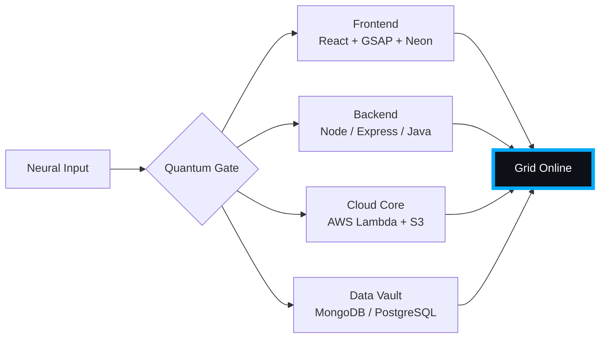

# 🌌 [ NEURAL CORE ACCESS: PENDEMVAMSI ]

<p align="center">
  
</p>

<div align="center">
  
  <br><small>Active Protocol: <strong style="color:#00AAFF">TRON LEGACY</strong> 🟦🟧</small>
</div>

## 🔵 NEURAL STATUS READOUT
```text
SUBJECT ID    →  PENDEMVAMSI
ENTITY CLASS  →  SHADOW MONARCH v7
NEURAL RANK   →  B-TIER
GRID SYNC     →  2917/4261 QUANTUM PACKETS
─────── BIO-METRICS (TRON LEGACY) ───────
STRENGTH      134  █████████████████░░░░
AGILITY       115  ███████████████░░░░░░
INTELLIGENCE  138  ██████████████████░░░
VITALITY      107  ██████████████░░░░░░░
```

> **NEURAL BURST ACQUIRED:** +140 QUANTUM PACKETS 
> **SYSTEM MESSAGE:** SHADOW MONARCH PROTOCOL: FULLY AWAKENED

---

## 🌀 GRID ARCHITECTURE (HOLOGRAPHIC RENDER)



---

## 📡 ACADEMIC NODES – CONQUERED
- [x] B.Tech Neural Engineering (2020–2024) – St. Ann’s Grid
- [x] Intermediate Quantum Core (2018–2020) – Sri Medhavi
- [x] SSC Primary Link (2017–2018) – Sri Geethanjali

---

## ⚡ SKILL NEURAL MATRIX

<details open>
<summary>🔌 ACTIVE NEURAL LINKS</summary>

| Node               | Tier | Integrity Bar                | Status      |
|--------------------|------|------------------------------|-------------|
| Java Core          | S    | ████████████████████ 100%   | OVERCLOCKED |
| Node.js Grid       | S    | ████████████████████ 100%   | OVERCLOCKED |
| React Holo-UI      | A+   | █████████████████░░░ 92%    | ONLINE      |
| AWS Quantum Relay  | S    | ████████████████████ 100%   | SOVEREIGN   |
| Python AI Kernel   | A    | ████████████████░░░░ 85%    | CHARGING    |
| DSA Void Algorithm | A    | █████████████████░░░ 90%    | ACTIVE      |

</details>

---

## 🏅 NEURAL ACHIEVEMENT TOKENS

<p align="center">
  
  
  
  
</p>

---

## 👾 SHADOW ENTITIES – SUMMONED

<p align="center">
  
  <br><strong style="color:#00AAFF">ARISE.</strong>
</p>

| Entity | Designation   | Class            | Source Node                     |
|--------|---------------|------------------|---------------------------------|
| SH-01  | Igris         | Void Commander   | AI Financial Oracle             |
| SH-02  | Beru          | Swarm Overlord   | WebRTC Quantum Stream           |
| SH-03  | Kaisel        | Void Wyrm        | Geolocation Shadow Relay        |
| SH-04  | Tusk          | Arcane Construct | Global Pandemic Sentinel        |
| SH-05  | Iron          | Armored Bastion  | React Crypto Fortress           |

---

## 📡 GRID ANALYTICS (LIVE FEED)

<p align="center">
  
  <br>
  
  
</p>

---

## 🖥️ CORRUPTED MAINFRAME LOG (401 ENTRIES)

<details>
<summary>OPEN TERMINAL FEED – PROTOCOL: TRON LEGACY</summary>

> [0xDC795746] 🟦🟧 **TRON LEGACY PROTOCOL** #0 | NEURAL LINK STABILIZED | [TRANSMISSION SUCCESS]
> [0x260DDD3E] 🟦🟧 **TRON LEGACY PROTOCOL** #1 | NEURAL LINK STABILIZED | [TRANSMISSION SUCCESS]
> [0x4CBA75FA] 🟦🟧 **TRON LEGACY PROTOCOL** #2 | NEURAL LINK STABILIZED | [TRANSMISSION SUCCESS]
> [0x152EBEDA] 🟦🟧 **TRON LEGACY PROTOCOL** #3 | NEURAL LINK STABILIZED | [TRANSMISSION SUCCESS]
> [0x5EE3FCBE] 🟦🟧 **TRON LEGACY PROTOCOL** #4 | NEURAL LINK STABILIZED | [TRANSMISSION SUCCESS]
> [0x5C429EF1] 🟦🟧 **TRON LEGACY PROTOCOL** #5 | NEURAL LINK STABILIZED | [TRANSMISSION SUCCESS]
> [0x795A7613] 🟦🟧 **TRON LEGACY PROTOCOL** #6 | NEURAL LINK STABILIZED | [TRANSMISSION SUCCESS]
> [0x1E5B1BB1] 🟦🟧 **TRON LEGACY PROTOCOL** #7 | NEURAL LINK STABILIZED | [TRANSMISSION SUCCESS]
> [0x61249259] 🟦🟧 **TRON LEGACY PROTOCOL** #8 | NEURAL LINK STABILIZED | [TRANSMISSION SUCCESS]
> [0xB56405C5] 🟦🟧 **TRON LEGACY PROTOCOL** #9 | NEURAL LINK STABILIZED | [TRANSMISSION SUCCESS]
> [0xA30F7CD2] 🟦🟧 **TRON LEGACY PROTOCOL** #10 | NEURAL LINK STABILIZED | [TRANSMISSION SUCCESS]
> [0x6E5DA4BF] 🟦🟧 **TRON LEGACY PROTOCOL** #11 | NEURAL LINK STABILIZED | [TRANSMISSION SUCCESS]
> [0x72039A90] 🟦🟧 **TRON LEGACY PROTOCOL** #12 | NEURAL LINK STABILIZED | [TRANSMISSION SUCCESS]
> [0x77926892] 🟦🟧 **TRON LEGACY PROTOCOL** #13 | NEURAL LINK STABILIZED | [TRANSMISSION SUCCESS]
> [0x4B1FC43B] 🟦🟧 **TRON LEGACY PROTOCOL** #14 | NEURAL LINK STABILIZED | [TRANSMISSION SUCCESS]
> [0x7CF378F5] 🟦🟧 **TRON LEGACY PROTOCOL** #15 | NEURAL LINK STABILIZED | [TRANSMISSION SUCCESS]
> [0xAD5BEBB1] 🟦🟧 **TRON LEGACY PROTOCOL** #16 | NEURAL LINK STABILIZED | [TRANSMISSION SUCCESS]
> [0x9D1DEF67] 🟦🟧 **TRON LEGACY PROTOCOL** #17 | NEURAL LINK STABILIZED | [TRANSMISSION SUCCESS]
> [0x98014570] 🟦🟧 **TRON LEGACY PROTOCOL** #18 | NEURAL LINK STABILIZED | [TRANSMISSION SUCCESS]
> [0xF0A1987A] 🟦🟧 **TRON LEGACY PROTOCOL** #19 | NEURAL LINK STABILIZED | [TRANSMISSION SUCCESS]
> [0xDA2B6251] 🟦🟧 **TRON LEGACY PROTOCOL** #20 | NEURAL LINK STABILIZED | [TRANSMISSION SUCCESS]
> [0x4652273B] 🟦🟧 **TRON LEGACY PROTOCOL** #21 | NEURAL LINK STABILIZED | [TRANSMISSION SUCCESS]
> [0x3ED6C80C] 🟦🟧 **TRON LEGACY PROTOCOL** #22 | NEURAL LINK STABILIZED | [TRANSMISSION SUCCESS]
> [0xB3A7BC69] 🟦🟧 **TRON LEGACY PROTOCOL** #23 | NEURAL LINK STABILIZED | [TRANSMISSION SUCCESS]
> [0x9410891F] 🟦🟧 **TRON LEGACY PROTOCOL** #24 | NEURAL LINK STABILIZED | [TRANSMISSION SUCCESS]
> [0xA3FE69F8] 🟦🟧 **TRON LEGACY PROTOCOL** #25 | NEURAL LINK STABILIZED | [TRANSMISSION SUCCESS]
> [0x4BCE6FBC] 🟦🟧 **TRON LEGACY PROTOCOL** #26 | NEURAL LINK STABILIZED | [TRANSMISSION SUCCESS]
> [0x1A51C1C6] 🟦🟧 **TRON LEGACY PROTOCOL** #27 | NEURAL LINK STABILIZED | [TRANSMISSION SUCCESS]
> [0xF5A5B116] 🟦🟧 **TRON LEGACY PROTOCOL** #28 | NEURAL LINK STABILIZED | [TRANSMISSION SUCCESS]
> [0x82D479BD] 🟦🟧 **TRON LEGACY PROTOCOL** #29 | NEURAL LINK STABILIZED | [TRANSMISSION SUCCESS]
> [0x6173A7DE] 🟦🟧 **TRON LEGACY PROTOCOL** #30 | NEURAL LINK STABILIZED | [TRANSMISSION SUCCESS]
> [0x088E44DD] 🟦🟧 **TRON LEGACY PROTOCOL** #31 | NEURAL LINK STABILIZED | [TRANSMISSION SUCCESS]
> [0x76D3A445] 🟦🟧 **TRON LEGACY PROTOCOL** #32 | NEURAL LINK  [GLITCH DETECTED] STABILIZED | [TRANSMISSION SUCCESS]
> [0x1A588B63] 🟦🟧 **TRON LEGACY PROTOCOL** #33 | NEURAL LINK STABILIZED | [TRANSMISSION SUCCESS]
> [0xAED8EE51] 🟦🟧 **TRON LEGACY PROTOCOL** #34 | NEURAL LINK STABILIZED | [TRANSMISSION SUCCESS]
> [0x73F69282] 🟦🟧 **TRON LEGACY PROTOCOL** #35 | NEURAL LINK STABILIZED | [TRANSMISSION SUCCESS]
> [0xEE703785] 🟦🟧 **TRON LEGACY PROTOCOL** #36 | NEURAL LINK STABILIZED | [TRANSMISSION SUCCESS]
> [0x7BFFF577] 🟦🟧 **TRON LEGACY PROTOCOL** #37 | NEURAL LINK STABILIZED | [TRANSMISSION SUCCESS]
> [0x4076D65D] 🟦🟧 **TRON LEGACY PROTOCOL** #38 | NEURAL LINK STABILIZED | [TRANSMISSION SUCCESS]
> [0x7932A8BD] 🟦🟧 **TRON LEGACY PROTOCOL** #39 | NEURAL LINK STABILIZED | [TRANSMISSION SUCCESS]
> [0x847540CF] 🟦🟧 **TRON LEGACY PROTOCOL** #40 | NEURAL LINK STABILIZED | [TRANSMISSION SUCCESS]
> [0x9767E524] 🟦🟧 **TRON LEGACY PROTOCOL** #41 | NEURAL LINK STABILIZED | [TRANSMISSION SUCCESS]
> [0xBE27EF7B] 🟦🟧 **TRON LEGACY PROTOCOL** #42 | NEURAL LINK STABILIZED | [TRANSMISSION SUCCESS]
> [0x62B0E52D] 🟦🟧 **TRON LEGACY PROTOCOL** #43 | NEURAL LINK STABILIZED | [TRANSMISSION SUCCESS]
> [0x03176086] 🟦🟧 **TRON LEGACY PROTOCOL** #44 | NEURAL LINK STABILIZED | [TRANSMISSION SUCCESS]
> [0xBDA45C51] 🟦🟧 **TRON LEGACY PROTOCOL** #45 | NEURAL LINK STABILIZED | [TRANSMISSION SUCCESS]
> [0x5572A514] 🟦🟧 **TRON LEGACY PROTOCOL** #46 | NEURAL LINK STABILIZED | [TRANSMISSION SUCCESS]
> [0xDEF54323] 🟦🟧 **TRON LEGACY PROTOCOL** #47 | NEURAL LINK STABILIZED | [TRANSMISSION SUCCESS]
> [0x209E7C9B] 🟦🟧 **TRON LEGACY PROTOCOL** #48 | NEURAL LINK STABILIZED | [TRANSMISSION SUCCESS]
> [0x03B7FD26] 🟦🟧 **TRON LEGACY PROTOCOL** #49 | NEURAL LINK STABILIZED | [TRANSMISSION SUCCESS]
> [0xE7868B92] 🟦🟧 **TRON LEGACY PROTOCOL** #50 | NEURAL LINK  [GLITCH DETECTED] STABILIZED | [TRANSMISSION SUCCESS]
> [0x6FC556D3] 🟦🟧 **TRON LEGACY PROTOCOL** #51 | NEURAL LINK STABILIZED | [TRANSMISSION SUCCESS]
> [0xA1490E9A] 🟦🟧 **TRON LEGACY PROTOCOL** #52 | NEURAL LINK STABILIZED | [TRANSMISSION SUCCESS]
> [0xB8352C87] 🟦🟧 **TRON LEGACY PROTOCOL** #53 | NEURAL LINK STABILIZED | [TRANSMISSION SUCCESS]
> [0x0DF8B5A4] 🟦🟧 **TRON LEGACY PROTOCOL** #54 | NEURAL LINK STABILIZED | [TRANSMISSION SUCCESS]
> [0x5A078AA2] 🟦🟧 **TRON LEGACY PROTOCOL** #55 | NEURAL LINK  [GLITCH DETECTED] STABILIZED | [TRANSMISSION SUCCESS]
> [0xDF7204C9] 🟦🟧 **TRON LEGACY PROTOCOL** #56 | NEURAL LINK STABILIZED | [TRANSMISSION SUCCESS]
> [0xD9BBAA4F] 🟦🟧 **TRON LEGACY PROTOCOL** #57 | NEURAL LINK STABILIZED | [TRANSMISSION SUCCESS]
> [0xE2348E3E] 🟦🟧 **TRON LEGACY PROTOCOL** #58 | NEURAL LINK  [GLITCH DETECTED] STABILIZED | [TRANSMISSION SUCCESS]
> [0x3928D857] 🟦🟧 **TRON LEGACY PROTOCOL** #59 | NEURAL LINK STABILIZED | [TRANSMISSION SUCCESS]
> [0xC47895B0] 🟦🟧 **TRON LEGACY PROTOCOL** #60 | NEURAL LINK  [GLITCH DETECTED] STABILIZED | [TRANSMISSION SUCCESS]
> [0xC410DBB8] 🟦🟧 **TRON LEGACY PROTOCOL** #61 | NEURAL LINK STABILIZED | [TRANSMISSION SUCCESS]
> [0x47DB49CD] 🟦🟧 **TRON LEGACY PROTOCOL** #62 | NEURAL LINK STABILIZED | [TRANSMISSION SUCCESS]
> [0x8B814EFC] 🟦🟧 **TRON LEGACY PROTOCOL** #63 | NEURAL LINK STABILIZED | [TRANSMISSION SUCCESS]
> [0x5ADA1E0A] 🟦🟧 **TRON LEGACY PROTOCOL** #64 | NEURAL LINK STABILIZED | [TRANSMISSION SUCCESS]
> [0xE120744F] 🟦🟧 **TRON LEGACY PROTOCOL** #65 | NEURAL LINK STABILIZED | [TRANSMISSION SUCCESS]
> [0x208C7C2D] 🟦🟧 **TRON LEGACY PROTOCOL** #66 | NEURAL LINK STABILIZED | [TRANSMISSION SUCCESS]
> [0x9EA27B79] 🟦🟧 **TRON LEGACY PROTOCOL** #67 | NEURAL LINK STABILIZED | [TRANSMISSION SUCCESS]
> [0x46E66A20] 🟦🟧 **TRON LEGACY PROTOCOL** #68 | NEURAL LINK STABILIZED | [TRANSMISSION SUCCESS]
> [0x26F2724B] 🟦🟧 **TRON LEGACY PROTOCOL** #69 | NEURAL LINK  [GLITCH DETECTED] STABILIZED | [TRANSMISSION SUCCESS]
> [0xBE6F64D6] 🟦🟧 **TRON LEGACY PROTOCOL** #70 | NEURAL LINK STABILIZED | [TRANSMISSION SUCCESS]
> [0x460BEFD8] 🟦🟧 **TRON LEGACY PROTOCOL** #71 | NEURAL LINK STABILIZED | [TRANSMISSION SUCCESS]
> [0xB706A8DF] 🟦🟧 **TRON LEGACY PROTOCOL** #72 | NEURAL LINK  [GLITCH DETECTED] STABILIZED | [TRANSMISSION SUCCESS]
> [0x8C9015A4] 🟦🟧 **TRON LEGACY PROTOCOL** #73 | NEURAL LINK STABILIZED | [TRANSMISSION SUCCESS]
> [0x5415B772] 🟦🟧 **TRON LEGACY PROTOCOL** #74 | NEURAL LINK  [GLITCH DETECTED] STABILIZED | [TRANSMISSION SUCCESS]
> [0xF92D8C93] 🟦🟧 **TRON LEGACY PROTOCOL** #75 | NEURAL LINK STABILIZED | [TRANSMISSION SUCCESS]
> [0xA1909087] 🟦🟧 **TRON LEGACY PROTOCOL** #76 | NEURAL LINK STABILIZED | [TRANSMISSION SUCCESS]
> [0xF7CBD6AC] 🟦🟧 **TRON LEGACY PROTOCOL** #77 | NEURAL LINK STABILIZED | [TRANSMISSION SUCCESS]
> [0x05ADB59B] 🟦🟧 **TRON LEGACY PROTOCOL** #78 | NEURAL LINK  [GLITCH DETECTED] STABILIZED | [TRANSMISSION SUCCESS]
> [0x3394ABA9] 🟦🟧 **TRON LEGACY PROTOCOL** #79 | NEURAL LINK STABILIZED | [TRANSMISSION SUCCESS]
> [0x8F24FD0B] 🟦🟧 **TRON LEGACY PROTOCOL** #80 | NEURAL LINK  [GLITCH DETECTED] STABILIZED | [TRANSMISSION SUCCESS]
> [0xB95C7185] 🟦🟧 **TRON LEGACY PROTOCOL** #81 | NEURAL LINK STABILIZED | [TRANSMISSION SUCCESS]
> [0xB5BEDE1F] 🟦🟧 **TRON LEGACY PROTOCOL** #82 | NEURAL LINK  [GLITCH DETECTED] STABILIZED | [TRANSMISSION SUCCESS]
> [0x0F586AAE] 🟦🟧 **TRON LEGACY PROTOCOL** #83 | NEURAL LINK STABILIZED | [TRANSMISSION SUCCESS]
> [0x19DB42F9] 🟦🟧 **TRON LEGACY PROTOCOL** #84 | NEURAL LINK STABILIZED | [TRANSMISSION SUCCESS]
> [0x1E25DA1C] 🟦🟧 **TRON LEGACY PROTOCOL** #85 | NEURAL LINK STABILIZED | [TRANSMISSION SUCCESS]
> [0x3EFF3568] 🟦🟧 **TRON LEGACY PROTOCOL** #86 | NEURAL LINK STABILIZED | [TRANSMISSION SUCCESS]
> [0x283180BC] 🟦🟧 **TRON LEGACY PROTOCOL** #87 | NEURAL LINK STABILIZED | [TRANSMISSION SUCCESS]
> [0x3BF3D271] 🟦🟧 **TRON LEGACY PROTOCOL** #88 | NEURAL LINK STABILIZED | [TRANSMISSION SUCCESS]
> [0x4137D7F7] 🟦🟧 **TRON LEGACY PROTOCOL** #89 | NEURAL LINK STABILIZED | [TRANSMISSION SUCCESS]
> [0x9BDEEBCF] 🟦🟧 **TRON LEGACY PROTOCOL** #90 | NEURAL LINK STABILIZED | [TRANSMISSION SUCCESS]
> [0xA3D82A24] 🟦🟧 **TRON LEGACY PROTOCOL** #91 | NEURAL LINK STABILIZED | [TRANSMISSION SUCCESS]
> [0xBC212592] 🟦🟧 **TRON LEGACY PROTOCOL** #92 | NEURAL LINK  [GLITCH DETECTED] STABILIZED | [TRANSMISSION SUCCESS]
> [0xCF383D28] 🟦🟧 **TRON LEGACY PROTOCOL** #93 | NEURAL LINK STABILIZED | [TRANSMISSION SUCCESS]
> [0x0BBE54C8] 🟦🟧 **TRON LEGACY PROTOCOL** #94 | NEURAL LINK STABILIZED | [TRANSMISSION SUCCESS]
> [0x8AC09FD8] 🟦🟧 **TRON LEGACY PROTOCOL** #95 | NEURAL LINK STABILIZED | [TRANSMISSION SUCCESS]
> [0x3B1B632C] 🟦🟧 **TRON LEGACY PROTOCOL** #96 | NEURAL LINK  [GLITCH DETECTED] STABILIZED | [TRANSMISSION SUCCESS]
> [0x2AD89BDC] 🟦🟧 **TRON LEGACY PROTOCOL** #97 | NEURAL LINK STABILIZED | [TRANSMISSION SUCCESS]
> [0xCD844A48] 🟦🟧 **TRON LEGACY PROTOCOL** #98 | NEURAL LINK STABILIZED | [TRANSMISSION SUCCESS]
> [0x338B8281] 🟦🟧 **TRON LEGACY PROTOCOL** #99 | NEURAL LINK STABILIZED | [TRANSMISSION SUCCESS]
> [0x78500A74] 🟦🟧 **TRON LEGACY PROTOCOL** #100 | NEURAL LINK STABILIZED | [TRANSMISSION SUCCESS]
> [0x1A619956] 🟦🟧 **TRON LEGACY PROTOCOL** #101 | NEURAL LINK STABILIZED | [TRANSMISSION SUCCESS]
> [0x5D555BB5] 🟦🟧 **TRON LEGACY PROTOCOL** #102 | NEURAL LINK STABILIZED | [TRANSMISSION SUCCESS]
> [0x079061A9] 🟦🟧 **TRON LEGACY PROTOCOL** #103 | NEURAL LINK STABILIZED | [TRANSMISSION SUCCESS]
> [0x2E83B2F4] 🟦🟧 **TRON LEGACY PROTOCOL** #104 | NEURAL LINK STABILIZED | [TRANSMISSION SUCCESS]
> [0x1B024C75] 🟦🟧 **TRON LEGACY PROTOCOL** #105 | NEURAL LINK STABILIZED | [TRANSMISSION SUCCESS]
> [0x32A31D3E] 🟦🟧 **TRON LEGACY PROTOCOL** #106 | NEURAL LINK STABILIZED | [TRANSMISSION SUCCESS]
> [0x7CE4D625] 🟦🟧 **TRON LEGACY PROTOCOL** #107 | NEURAL LINK  [GLITCH DETECTED] STABILIZED | [TRANSMISSION SUCCESS]
> [0x60493BDA] 🟦🟧 **TRON LEGACY PROTOCOL** #108 | NEURAL LINK STABILIZED | [TRANSMISSION SUCCESS]
> [0x1F1F0C67] 🟦🟧 **TRON LEGACY PROTOCOL** #109 | NEURAL LINK STABILIZED | [TRANSMISSION SUCCESS]
> [0x3CD49E9F] 🟦🟧 **TRON LEGACY PROTOCOL** #110 | NEURAL LINK STABILIZED | [TRANSMISSION SUCCESS]
> [0x1FB53B3A] 🟦🟧 **TRON LEGACY PROTOCOL** #111 | NEURAL LINK  [GLITCH DETECTED] STABILIZED | [TRANSMISSION SUCCESS]
> [0x30275F91] 🟦🟧 **TRON LEGACY PROTOCOL** #112 | NEURAL LINK STABILIZED | [TRANSMISSION SUCCESS]
> [0xE2121296] 🟦🟧 **TRON LEGACY PROTOCOL** #113 | NEURAL LINK  [GLITCH DETECTED] STABILIZED | [TRANSMISSION SUCCESS]
> [0xFC679FFE] 🟦🟧 **TRON LEGACY PROTOCOL** #114 | NEURAL LINK STABILIZED | [TRANSMISSION SUCCESS]
> [0x7B270D0E] 🟦🟧 **TRON LEGACY PROTOCOL** #115 | NEURAL LINK STABILIZED | [TRANSMISSION SUCCESS]
> [0x2FB99392] 🟦🟧 **TRON LEGACY PROTOCOL** #116 | NEURAL LINK STABILIZED | [TRANSMISSION SUCCESS]
> [0x6E7A3D81] 🟦🟧 **TRON LEGACY PROTOCOL** #117 | NEURAL LINK STABILIZED | [TRANSMISSION SUCCESS]
> [0x8E358669] 🟦🟧 **TRON LEGACY PROTOCOL** #118 | NEURAL LINK  [GLITCH DETECTED] STABILIZED | [TRANSMISSION SUCCESS]
> [0x3D8DC2A8] 🟦🟧 **TRON LEGACY PROTOCOL** #119 | NEURAL LINK STABILIZED | [TRANSMISSION SUCCESS]
> [0xCA6EF7AF] 🟦🟧 **TRON LEGACY PROTOCOL** #120 | NEURAL LINK STABILIZED | [TRANSMISSION SUCCESS]
> [0x4B6ECB1E] 🟦🟧 **TRON LEGACY PROTOCOL** #121 | NEURAL LINK  [GLITCH DETECTED] STABILIZED | [TRANSMISSION SUCCESS]
> [0x80F1B67B] 🟦🟧 **TRON LEGACY PROTOCOL** #122 | NEURAL LINK STABILIZED | [TRANSMISSION SUCCESS]
> [0x4B35A56D] 🟦🟧 **TRON LEGACY PROTOCOL** #123 | NEURAL LINK STABILIZED | [TRANSMISSION SUCCESS]
> [0xBBBEFBDC] 🟦🟧 **TRON LEGACY PROTOCOL** #124 | NEURAL LINK  [GLITCH DETECTED] STABILIZED | [TRANSMISSION SUCCESS]
> [0x709B6420] 🟦🟧 **TRON LEGACY PROTOCOL** #125 | NEURAL LINK STABILIZED | [TRANSMISSION SUCCESS]
> [0xA447B1CD] 🟦🟧 **TRON LEGACY PROTOCOL** #126 | NEURAL LINK STABILIZED | [TRANSMISSION SUCCESS]
> [0x92F97084] 🟦🟧 **TRON LEGACY PROTOCOL** #127 | NEURAL LINK STABILIZED | [TRANSMISSION SUCCESS]
> [0x674EB3E5] 🟦🟧 **TRON LEGACY PROTOCOL** #128 | NEURAL LINK STABILIZED | [TRANSMISSION SUCCESS]
> [0x802AAEDD] 🟦🟧 **TRON LEGACY PROTOCOL** #129 | NEURAL LINK STABILIZED | [TRANSMISSION SUCCESS]
> [0x3F3E53BF] 🟦🟧 **TRON LEGACY PROTOCOL** #130 | NEURAL LINK STABILIZED | [TRANSMISSION SUCCESS]
> [0x23554169] 🟦🟧 **TRON LEGACY PROTOCOL** #131 | NEURAL LINK  [GLITCH DETECTED] STABILIZED | [TRANSMISSION SUCCESS]
> [0x882D3CE8] 🟦🟧 **TRON LEGACY PROTOCOL** #132 | NEURAL LINK STABILIZED | [TRANSMISSION SUCCESS]
> [0x62F8A4F5] 🟦🟧 **TRON LEGACY PROTOCOL** #133 | NEURAL LINK STABILIZED | [TRANSMISSION SUCCESS]
> [0x1C20805B] 🟦🟧 **TRON LEGACY PROTOCOL** #134 | NEURAL LINK  [GLITCH DETECTED] STABILIZED | [TRANSMISSION SUCCESS]
> [0x79074B2E] 🟦🟧 **TRON LEGACY PROTOCOL** #135 | NEURAL LINK STABILIZED | [TRANSMISSION SUCCESS]
> [0x2949F5C7] 🟦🟧 **TRON LEGACY PROTOCOL** #136 | NEURAL LINK STABILIZED | [TRANSMISSION SUCCESS]
> [0x48544B82] 🟦🟧 **TRON LEGACY PROTOCOL** #137 | NEURAL LINK STABILIZED | [TRANSMISSION SUCCESS]
> [0x4BB2F6C0] 🟦🟧 **TRON LEGACY PROTOCOL** #138 | NEURAL LINK STABILIZED | [TRANSMISSION SUCCESS]
> [0x8117A3F2] 🟦🟧 **TRON LEGACY PROTOCOL** #139 | NEURAL LINK STABILIZED | [TRANSMISSION SUCCESS]
> [0x99F6D2CC] 🟦🟧 **TRON LEGACY PROTOCOL** #140 | NEURAL LINK STABILIZED | [TRANSMISSION SUCCESS]
> [0x44297AF6] 🟦🟧 **TRON LEGACY PROTOCOL** #141 | NEURAL LINK STABILIZED | [TRANSMISSION SUCCESS]
> [0xA36DAE46] 🟦🟧 **TRON LEGACY PROTOCOL** #142 | NEURAL LINK STABILIZED | [TRANSMISSION SUCCESS]
> [0xB82B2323] 🟦🟧 **TRON LEGACY PROTOCOL** #143 | NEURAL LINK STABILIZED | [TRANSMISSION SUCCESS]
> [0xABABAAC2] 🟦🟧 **TRON LEGACY PROTOCOL** #144 | NEURAL LINK STABILIZED | [TRANSMISSION SUCCESS]
> [0x1D20DEEA] 🟦🟧 **TRON LEGACY PROTOCOL** #145 | NEURAL LINK STABILIZED | [TRANSMISSION SUCCESS]
> [0x964FD112] 🟦🟧 **TRON LEGACY PROTOCOL** #146 | NEURAL LINK STABILIZED | [TRANSMISSION SUCCESS]
> [0x10E082BF] 🟦🟧 **TRON LEGACY PROTOCOL** #147 | NEURAL LINK STABILIZED | [TRANSMISSION SUCCESS]
> [0x7973C697] 🟦🟧 **TRON LEGACY PROTOCOL** #148 | NEURAL LINK STABILIZED | [TRANSMISSION SUCCESS]
> [0x7FA3B021] 🟦🟧 **TRON LEGACY PROTOCOL** #149 | NEURAL LINK STABILIZED | [TRANSMISSION SUCCESS]
> [0xAC10D969] 🟦🟧 **TRON LEGACY PROTOCOL** #150 | NEURAL LINK STABILIZED | [TRANSMISSION SUCCESS]
> [0xCCA11F44] 🟦🟧 **TRON LEGACY PROTOCOL** #151 | NEURAL LINK STABILIZED | [TRANSMISSION SUCCESS]
> [0x8C334C8E] 🟦🟧 **TRON LEGACY PROTOCOL** #152 | NEURAL LINK STABILIZED | [TRANSMISSION SUCCESS]
> [0xE384B555] 🟦🟧 **TRON LEGACY PROTOCOL** #153 | NEURAL LINK STABILIZED | [TRANSMISSION SUCCESS]
> [0xF4A0DAF9] 🟦🟧 **TRON LEGACY PROTOCOL** #154 | NEURAL LINK STABILIZED | [TRANSMISSION SUCCESS]
> [0xB30D88B5] 🟦🟧 **TRON LEGACY PROTOCOL** #155 | NEURAL LINK STABILIZED | [TRANSMISSION SUCCESS]
> [0x60A11D73] 🟦🟧 **TRON LEGACY PROTOCOL** #156 | NEURAL LINK STABILIZED | [TRANSMISSION SUCCESS]
> [0xECF18D75] 🟦🟧 **TRON LEGACY PROTOCOL** #157 | NEURAL LINK STABILIZED | [TRANSMISSION SUCCESS]
> [0x5C58A732] 🟦🟧 **TRON LEGACY PROTOCOL** #158 | NEURAL LINK STABILIZED | [TRANSMISSION SUCCESS]
> [0xD41A19A7] 🟦🟧 **TRON LEGACY PROTOCOL** #159 | NEURAL LINK STABILIZED | [TRANSMISSION SUCCESS]
> [0x120DE8E8] 🟦🟧 **TRON LEGACY PROTOCOL** #160 | NEURAL LINK  [GLITCH DETECTED] STABILIZED | [TRANSMISSION SUCCESS]
> [0x372E7791] 🟦🟧 **TRON LEGACY PROTOCOL** #161 | NEURAL LINK  [GLITCH DETECTED] STABILIZED | [TRANSMISSION SUCCESS]
> [0x8F93E0B8] 🟦🟧 **TRON LEGACY PROTOCOL** #162 | NEURAL LINK  [GLITCH DETECTED] STABILIZED | [TRANSMISSION SUCCESS]
> [0x5FCC1E5D] 🟦🟧 **TRON LEGACY PROTOCOL** #163 | NEURAL LINK STABILIZED | [TRANSMISSION SUCCESS]
> [0x354C2BD3] 🟦🟧 **TRON LEGACY PROTOCOL** #164 | NEURAL LINK  [GLITCH DETECTED] STABILIZED | [TRANSMISSION SUCCESS]
> [0xD75FF210] 🟦🟧 **TRON LEGACY PROTOCOL** #165 | NEURAL LINK STABILIZED | [TRANSMISSION SUCCESS]
> [0x528053BE] 🟦🟧 **TRON LEGACY PROTOCOL** #166 | NEURAL LINK  [GLITCH DETECTED] STABILIZED | [TRANSMISSION SUCCESS]
> [0xF110D8AB] 🟦🟧 **TRON LEGACY PROTOCOL** #167 | NEURAL LINK STABILIZED | [TRANSMISSION SUCCESS]
> [0x0EADBE97] 🟦🟧 **TRON LEGACY PROTOCOL** #168 | NEURAL LINK STABILIZED | [TRANSMISSION SUCCESS]
> [0x42E71A39] 🟦🟧 **TRON LEGACY PROTOCOL** #169 | NEURAL LINK STABILIZED | [TRANSMISSION SUCCESS]
> [0x981479D2] 🟦🟧 **TRON LEGACY PROTOCOL** #170 | NEURAL LINK STABILIZED | [TRANSMISSION SUCCESS]
> [0xB2DBDD7E] 🟦🟧 **TRON LEGACY PROTOCOL** #171 | NEURAL LINK STABILIZED | [TRANSMISSION SUCCESS]
> [0xFA0D7DF4] 🟦🟧 **TRON LEGACY PROTOCOL** #172 | NEURAL LINK STABILIZED | [TRANSMISSION SUCCESS]
> [0xC8BDF22C] 🟦🟧 **TRON LEGACY PROTOCOL** #173 | NEURAL LINK STABILIZED | [TRANSMISSION SUCCESS]
> [0xDBCB9D3E] 🟦🟧 **TRON LEGACY PROTOCOL** #174 | NEURAL LINK  [GLITCH DETECTED] STABILIZED | [TRANSMISSION SUCCESS]
> [0xE2F7259C] 🟦🟧 **TRON LEGACY PROTOCOL** #175 | NEURAL LINK STABILIZED | [TRANSMISSION SUCCESS]
> [0x56DE3189] 🟦🟧 **TRON LEGACY PROTOCOL** #176 | NEURAL LINK STABILIZED | [TRANSMISSION SUCCESS]
> [0x3EFC0074] 🟦🟧 **TRON LEGACY PROTOCOL** #177 | NEURAL LINK STABILIZED | [TRANSMISSION SUCCESS]
> [0x4948383E] 🟦🟧 **TRON LEGACY PROTOCOL** #178 | NEURAL LINK  [GLITCH DETECTED] STABILIZED | [TRANSMISSION SUCCESS]
> [0xE685A8E5] 🟦🟧 **TRON LEGACY PROTOCOL** #179 | NEURAL LINK  [GLITCH DETECTED] STABILIZED | [TRANSMISSION SUCCESS]
> [0x25F29431] 🟦🟧 **TRON LEGACY PROTOCOL** #180 | NEURAL LINK STABILIZED | [TRANSMISSION SUCCESS]
> [0x4BDF42B8] 🟦🟧 **TRON LEGACY PROTOCOL** #181 | NEURAL LINK STABILIZED | [TRANSMISSION SUCCESS]
> [0xF4D0A012] 🟦🟧 **TRON LEGACY PROTOCOL** #182 | NEURAL LINK STABILIZED | [TRANSMISSION SUCCESS]
> [0xA336DC25] 🟦🟧 **TRON LEGACY PROTOCOL** #183 | NEURAL LINK STABILIZED | [TRANSMISSION SUCCESS]
> [0x435E68FB] 🟦🟧 **TRON LEGACY PROTOCOL** #184 | NEURAL LINK STABILIZED | [TRANSMISSION SUCCESS]
> [0xC955F029] 🟦🟧 **TRON LEGACY PROTOCOL** #185 | NEURAL LINK STABILIZED | [TRANSMISSION SUCCESS]
> [0x162774CD] 🟦🟧 **TRON LEGACY PROTOCOL** #186 | NEURAL LINK STABILIZED | [TRANSMISSION SUCCESS]
> [0x43169DD1] 🟦🟧 **TRON LEGACY PROTOCOL** #187 | NEURAL LINK STABILIZED | [TRANSMISSION SUCCESS]
> [0x113C909C] 🟦🟧 **TRON LEGACY PROTOCOL** #188 | NEURAL LINK  [GLITCH DETECTED] STABILIZED | [TRANSMISSION SUCCESS]
> [0x378DA3A7] 🟦🟧 **TRON LEGACY PROTOCOL** #189 | NEURAL LINK STABILIZED | [TRANSMISSION SUCCESS]
> [0x7051DF18] 🟦🟧 **TRON LEGACY PROTOCOL** #190 | NEURAL LINK STABILIZED | [TRANSMISSION SUCCESS]
> [0xF39C7354] 🟦🟧 **TRON LEGACY PROTOCOL** #191 | NEURAL LINK STABILIZED | [TRANSMISSION SUCCESS]
> [0x73422BE4] 🟦🟧 **TRON LEGACY PROTOCOL** #192 | NEURAL LINK  [GLITCH DETECTED] STABILIZED | [TRANSMISSION SUCCESS]
> [0xBCD93878] 🟦🟧 **TRON LEGACY PROTOCOL** #193 | NEURAL LINK STABILIZED | [TRANSMISSION SUCCESS]
> [0x4DB2B2F7] 🟦🟧 **TRON LEGACY PROTOCOL** #194 | NEURAL LINK  [GLITCH DETECTED] STABILIZED | [TRANSMISSION SUCCESS]
> [0x082B434F] 🟦🟧 **TRON LEGACY PROTOCOL** #195 | NEURAL LINK STABILIZED | [TRANSMISSION SUCCESS]
> [0xD0CF8F77] 🟦🟧 **TRON LEGACY PROTOCOL** #196 | NEURAL LINK STABILIZED | [TRANSMISSION SUCCESS]
> [0xFB9F32FE] 🟦🟧 **TRON LEGACY PROTOCOL** #197 | NEURAL LINK STABILIZED | [TRANSMISSION SUCCESS]
> [0xA01830DF] 🟦🟧 **TRON LEGACY PROTOCOL** #198 | NEURAL LINK STABILIZED | [TRANSMISSION SUCCESS]
> [0x37EAB909] 🟦🟧 **TRON LEGACY PROTOCOL** #199 | NEURAL LINK STABILIZED | [TRANSMISSION SUCCESS]
> [0x92C5CF00] 🟦🟧 **TRON LEGACY PROTOCOL** #200 | NEURAL LINK STABILIZED | [TRANSMISSION SUCCESS]
> [0x8F23ACD0] 🟦🟧 **TRON LEGACY PROTOCOL** #201 | NEURAL LINK STABILIZED | [TRANSMISSION SUCCESS]
> [0x26C68ADE] 🟦🟧 **TRON LEGACY PROTOCOL** #202 | NEURAL LINK STABILIZED | [TRANSMISSION SUCCESS]
> [0x30742777] 🟦🟧 **TRON LEGACY PROTOCOL** #203 | NEURAL LINK STABILIZED | [TRANSMISSION SUCCESS]
> [0xACB57559] 🟦🟧 **TRON LEGACY PROTOCOL** #204 | NEURAL LINK STABILIZED | [TRANSMISSION SUCCESS]
> [0xB6FDE608] 🟦🟧 **TRON LEGACY PROTOCOL** #205 | NEURAL LINK STABILIZED | [TRANSMISSION SUCCESS]
> [0x634E2EDD] 🟦🟧 **TRON LEGACY PROTOCOL** #206 | NEURAL LINK STABILIZED | [TRANSMISSION SUCCESS]
> [0x17D430C1] 🟦🟧 **TRON LEGACY PROTOCOL** #207 | NEURAL LINK STABILIZED | [TRANSMISSION SUCCESS]
> [0x9B727D0D] 🟦🟧 **TRON LEGACY PROTOCOL** #208 | NEURAL LINK STABILIZED | [TRANSMISSION SUCCESS]
> [0x7D1844FA] 🟦🟧 **TRON LEGACY PROTOCOL** #209 | NEURAL LINK STABILIZED | [TRANSMISSION SUCCESS]
> [0xF9AF0B9B] 🟦🟧 **TRON LEGACY PROTOCOL** #210 | NEURAL LINK STABILIZED | [TRANSMISSION SUCCESS]
> [0x6F7319BB] 🟦🟧 **TRON LEGACY PROTOCOL** #211 | NEURAL LINK STABILIZED | [TRANSMISSION SUCCESS]
> [0x1D9E6B95] 🟦🟧 **TRON LEGACY PROTOCOL** #212 | NEURAL LINK STABILIZED | [TRANSMISSION SUCCESS]
> [0x73CC22DD] 🟦🟧 **TRON LEGACY PROTOCOL** #213 | NEURAL LINK STABILIZED | [TRANSMISSION SUCCESS]
> [0x9500A051] 🟦🟧 **TRON LEGACY PROTOCOL** #214 | NEURAL LINK STABILIZED | [TRANSMISSION SUCCESS]
> [0xEB79DE95] 🟦🟧 **TRON LEGACY PROTOCOL** #215 | NEURAL LINK STABILIZED | [TRANSMISSION SUCCESS]
> [0x9588FF76] 🟦🟧 **TRON LEGACY PROTOCOL** #216 | NEURAL LINK STABILIZED | [TRANSMISSION SUCCESS]
> [0x548EE35A] 🟦🟧 **TRON LEGACY PROTOCOL** #217 | NEURAL LINK STABILIZED | [TRANSMISSION SUCCESS]
> [0x58532410] 🟦🟧 **TRON LEGACY PROTOCOL** #218 | NEURAL LINK  [GLITCH DETECTED] STABILIZED | [TRANSMISSION SUCCESS]
> [0x63578DC9] 🟦🟧 **TRON LEGACY PROTOCOL** #219 | NEURAL LINK STABILIZED | [TRANSMISSION SUCCESS]
> [0xF4877B69] 🟦🟧 **TRON LEGACY PROTOCOL** #220 | NEURAL LINK STABILIZED | [TRANSMISSION SUCCESS]
> [0x31A558D9] 🟦🟧 **TRON LEGACY PROTOCOL** #221 | NEURAL LINK STABILIZED | [TRANSMISSION SUCCESS]
> [0x904153C4] 🟦🟧 **TRON LEGACY PROTOCOL** #222 | NEURAL LINK STABILIZED | [TRANSMISSION SUCCESS]
> [0x5FBB407B] 🟦🟧 **TRON LEGACY PROTOCOL** #223 | NEURAL LINK STABILIZED | [TRANSMISSION SUCCESS]
> [0x74662BC6] 🟦🟧 **TRON LEGACY PROTOCOL** #224 | NEURAL LINK STABILIZED | [TRANSMISSION SUCCESS]
> [0x613322C8] 🟦🟧 **TRON LEGACY PROTOCOL** #225 | NEURAL LINK STABILIZED | [TRANSMISSION SUCCESS]
> [0x17C85C39] 🟦🟧 **TRON LEGACY PROTOCOL** #226 | NEURAL LINK  [GLITCH DETECTED] STABILIZED | [TRANSMISSION SUCCESS]
> [0xEDE8E220] 🟦🟧 **TRON LEGACY PROTOCOL** #227 | NEURAL LINK STABILIZED | [TRANSMISSION SUCCESS]
> [0x5ACA4EC5] 🟦🟧 **TRON LEGACY PROTOCOL** #228 | NEURAL LINK  [GLITCH DETECTED] STABILIZED | [TRANSMISSION SUCCESS]
> [0x2D80DD56] 🟦🟧 **TRON LEGACY PROTOCOL** #229 | NEURAL LINK STABILIZED | [TRANSMISSION SUCCESS]
> [0x2C47A112] 🟦🟧 **TRON LEGACY PROTOCOL** #230 | NEURAL LINK STABILIZED | [TRANSMISSION SUCCESS]
> [0x73811581] 🟦🟧 **TRON LEGACY PROTOCOL** #231 | NEURAL LINK STABILIZED | [TRANSMISSION SUCCESS]
> [0x8B6429B2] 🟦🟧 **TRON LEGACY PROTOCOL** #232 | NEURAL LINK STABILIZED | [TRANSMISSION SUCCESS]
> [0xD8895EB8] 🟦🟧 **TRON LEGACY PROTOCOL** #233 | NEURAL LINK STABILIZED | [TRANSMISSION SUCCESS]
> [0xE5344E54] 🟦🟧 **TRON LEGACY PROTOCOL** #234 | NEURAL LINK  [GLITCH DETECTED] STABILIZED | [TRANSMISSION SUCCESS]
> [0x8A39D56D] 🟦🟧 **TRON LEGACY PROTOCOL** #235 | NEURAL LINK STABILIZED | [TRANSMISSION SUCCESS]
> [0x6245CB6A] 🟦🟧 **TRON LEGACY PROTOCOL** #236 | NEURAL LINK STABILIZED | [TRANSMISSION SUCCESS]
> [0xE1248D1A] 🟦🟧 **TRON LEGACY PROTOCOL** #237 | NEURAL LINK STABILIZED | [TRANSMISSION SUCCESS]
> [0x16ABCB48] 🟦🟧 **TRON LEGACY PROTOCOL** #238 | NEURAL LINK STABILIZED | [TRANSMISSION SUCCESS]
> [0x78C0B1C3] 🟦🟧 **TRON LEGACY PROTOCOL** #239 | NEURAL LINK STABILIZED | [TRANSMISSION SUCCESS]
> [0xE0DA04BE] 🟦🟧 **TRON LEGACY PROTOCOL** #240 | NEURAL LINK STABILIZED | [TRANSMISSION SUCCESS]
> [0xA85DDBB2] 🟦🟧 **TRON LEGACY PROTOCOL** #241 | NEURAL LINK STABILIZED | [TRANSMISSION SUCCESS]
> [0x391B05BA] 🟦🟧 **TRON LEGACY PROTOCOL** #242 | NEURAL LINK STABILIZED | [TRANSMISSION SUCCESS]
> [0x20588B67] 🟦🟧 **TRON LEGACY PROTOCOL** #243 | NEURAL LINK STABILIZED | [TRANSMISSION SUCCESS]
> [0xF8726AC2] 🟦🟧 **TRON LEGACY PROTOCOL** #244 | NEURAL LINK STABILIZED | [TRANSMISSION SUCCESS]
> [0xA2F5DEF9] 🟦🟧 **TRON LEGACY PROTOCOL** #245 | NEURAL LINK STABILIZED | [TRANSMISSION SUCCESS]
> [0x180EFE31] 🟦🟧 **TRON LEGACY PROTOCOL** #246 | NEURAL LINK  [GLITCH DETECTED] STABILIZED | [TRANSMISSION SUCCESS]
> [0x110819A5] 🟦🟧 **TRON LEGACY PROTOCOL** #247 | NEURAL LINK STABILIZED | [TRANSMISSION SUCCESS]
> [0x2A040875] 🟦🟧 **TRON LEGACY PROTOCOL** #248 | NEURAL LINK STABILIZED | [TRANSMISSION SUCCESS]
> [0xED31CF16] 🟦🟧 **TRON LEGACY PROTOCOL** #249 | NEURAL LINK STABILIZED | [TRANSMISSION SUCCESS]
> [0x1A9DDF9C] 🟦🟧 **TRON LEGACY PROTOCOL** #250 | NEURAL LINK STABILIZED | [TRANSMISSION SUCCESS]
> [0xFA74112F] 🟦🟧 **TRON LEGACY PROTOCOL** #251 | NEURAL LINK STABILIZED | [TRANSMISSION SUCCESS]
> [0xBFB1592D] 🟦🟧 **TRON LEGACY PROTOCOL** #252 | NEURAL LINK STABILIZED | [TRANSMISSION SUCCESS]
> [0x877C4FD7] 🟦🟧 **TRON LEGACY PROTOCOL** #253 | NEURAL LINK  [GLITCH DETECTED] STABILIZED | [TRANSMISSION SUCCESS]
> [0x85BB87ED] 🟦🟧 **TRON LEGACY PROTOCOL** #254 | NEURAL LINK  [GLITCH DETECTED] STABILIZED | [TRANSMISSION SUCCESS]
> [0x359F4C45] 🟦🟧 **TRON LEGACY PROTOCOL** #255 | NEURAL LINK STABILIZED | [TRANSMISSION SUCCESS]
> [0xEE1F882F] 🟦🟧 **TRON LEGACY PROTOCOL** #256 | NEURAL LINK STABILIZED | [TRANSMISSION SUCCESS]
> [0x768EFD70] 🟦🟧 **TRON LEGACY PROTOCOL** #257 | NEURAL LINK STABILIZED | [TRANSMISSION SUCCESS]
> [0x4C714B48] 🟦🟧 **TRON LEGACY PROTOCOL** #258 | NEURAL LINK STABILIZED | [TRANSMISSION SUCCESS]
> [0xAE6B1AFA] 🟦🟧 **TRON LEGACY PROTOCOL** #259 | NEURAL LINK STABILIZED | [TRANSMISSION SUCCESS]
> [0x8D4EC333] 🟦🟧 **TRON LEGACY PROTOCOL** #260 | NEURAL LINK  [GLITCH DETECTED] STABILIZED | [TRANSMISSION SUCCESS]
> [0xD49A9D69] 🟦🟧 **TRON LEGACY PROTOCOL** #261 | NEURAL LINK STABILIZED | [TRANSMISSION SUCCESS]
> [0xC2502F17] 🟦🟧 **TRON LEGACY PROTOCOL** #262 | NEURAL LINK STABILIZED | [TRANSMISSION SUCCESS]
> [0x56C2F403] 🟦🟧 **TRON LEGACY PROTOCOL** #263 | NEURAL LINK  [GLITCH DETECTED] STABILIZED | [TRANSMISSION SUCCESS]
> [0xC7E72AD7] 🟦🟧 **TRON LEGACY PROTOCOL** #264 | NEURAL LINK  [GLITCH DETECTED] STABILIZED | [TRANSMISSION SUCCESS]
> [0x197FCA04] 🟦🟧 **TRON LEGACY PROTOCOL** #265 | NEURAL LINK STABILIZED | [TRANSMISSION SUCCESS]
> [0x0E2830CF] 🟦🟧 **TRON LEGACY PROTOCOL** #266 | NEURAL LINK STABILIZED | [TRANSMISSION SUCCESS]
> [0xDE103CBC] 🟦🟧 **TRON LEGACY PROTOCOL** #267 | NEURAL LINK STABILIZED | [TRANSMISSION SUCCESS]
> [0x3F63B05B] 🟦🟧 **TRON LEGACY PROTOCOL** #268 | NEURAL LINK STABILIZED | [TRANSMISSION SUCCESS]
> [0x261E7ADC] 🟦🟧 **TRON LEGACY PROTOCOL** #269 | NEURAL LINK STABILIZED | [TRANSMISSION SUCCESS]
> [0x4A57C1DE] 🟦🟧 **TRON LEGACY PROTOCOL** #270 | NEURAL LINK STABILIZED | [TRANSMISSION SUCCESS]
> [0xCD7DE589] 🟦🟧 **TRON LEGACY PROTOCOL** #271 | NEURAL LINK STABILIZED | [TRANSMISSION SUCCESS]
> [0x0897FFD4] 🟦🟧 **TRON LEGACY PROTOCOL** #272 | NEURAL LINK STABILIZED | [TRANSMISSION SUCCESS]
> [0xA7AFF2FD] 🟦🟧 **TRON LEGACY PROTOCOL** #273 | NEURAL LINK STABILIZED | [TRANSMISSION SUCCESS]
> [0x168405AD] 🟦🟧 **TRON LEGACY PROTOCOL** #274 | NEURAL LINK STABILIZED | [TRANSMISSION SUCCESS]
> [0x36D8648E] 🟦🟧 **TRON LEGACY PROTOCOL** #275 | NEURAL LINK STABILIZED | [TRANSMISSION SUCCESS]
> [0x692F349A] 🟦🟧 **TRON LEGACY PROTOCOL** #276 | NEURAL LINK STABILIZED | [TRANSMISSION SUCCESS]
> [0x662F376E] 🟦🟧 **TRON LEGACY PROTOCOL** #277 | NEURAL LINK STABILIZED | [TRANSMISSION SUCCESS]
> [0x7AA82054] 🟦🟧 **TRON LEGACY PROTOCOL** #278 | NEURAL LINK STABILIZED | [TRANSMISSION SUCCESS]
> [0x0CE6AEE9] 🟦🟧 **TRON LEGACY PROTOCOL** #279 | NEURAL LINK  [GLITCH DETECTED] STABILIZED | [TRANSMISSION SUCCESS]
> [0x43958D6F] 🟦🟧 **TRON LEGACY PROTOCOL** #280 | NEURAL LINK STABILIZED | [TRANSMISSION SUCCESS]
> [0x843BDF0A] 🟦🟧 **TRON LEGACY PROTOCOL** #281 | NEURAL LINK STABILIZED | [TRANSMISSION SUCCESS]
> [0xF04D99DE] 🟦🟧 **TRON LEGACY PROTOCOL** #282 | NEURAL LINK  [GLITCH DETECTED] STABILIZED | [TRANSMISSION SUCCESS]
> [0x38D30C41] 🟦🟧 **TRON LEGACY PROTOCOL** #283 | NEURAL LINK STABILIZED | [TRANSMISSION SUCCESS]
> [0x5D5ABA4A] 🟦🟧 **TRON LEGACY PROTOCOL** #284 | NEURAL LINK STABILIZED | [TRANSMISSION SUCCESS]
> [0x539DF6B1] 🟦🟧 **TRON LEGACY PROTOCOL** #285 | NEURAL LINK  [GLITCH DETECTED] STABILIZED | [TRANSMISSION SUCCESS]
> [0x09905B5E] 🟦🟧 **TRON LEGACY PROTOCOL** #286 | NEURAL LINK STABILIZED | [TRANSMISSION SUCCESS]
> [0x44F5C959] 🟦🟧 **TRON LEGACY PROTOCOL** #287 | NEURAL LINK  [GLITCH DETECTED] STABILIZED | [TRANSMISSION SUCCESS]
> [0x98CC0C52] 🟦🟧 **TRON LEGACY PROTOCOL** #288 | NEURAL LINK STABILIZED | [TRANSMISSION SUCCESS]
> [0xA85091EC] 🟦🟧 **TRON LEGACY PROTOCOL** #289 | NEURAL LINK  [GLITCH DETECTED] STABILIZED | [TRANSMISSION SUCCESS]
> [0xB0F6A38F] 🟦🟧 **TRON LEGACY PROTOCOL** #290 | NEURAL LINK  [GLITCH DETECTED] STABILIZED | [TRANSMISSION SUCCESS]
> [0xF7732568] 🟦🟧 **TRON LEGACY PROTOCOL** #291 | NEURAL LINK STABILIZED | [TRANSMISSION SUCCESS]
> [0x22A3A104] 🟦🟧 **TRON LEGACY PROTOCOL** #292 | NEURAL LINK STABILIZED | [TRANSMISSION SUCCESS]
> [0xAEFF1785] 🟦🟧 **TRON LEGACY PROTOCOL** #293 | NEURAL LINK STABILIZED | [TRANSMISSION SUCCESS]
> [0x23604BE7] 🟦🟧 **TRON LEGACY PROTOCOL** #294 | NEURAL LINK STABILIZED | [TRANSMISSION SUCCESS]
> [0xD1267D40] 🟦🟧 **TRON LEGACY PROTOCOL** #295 | NEURAL LINK  [GLITCH DETECTED] STABILIZED | [TRANSMISSION SUCCESS]
> [0xF735C5B2] 🟦🟧 **TRON LEGACY PROTOCOL** #296 | NEURAL LINK STABILIZED | [TRANSMISSION SUCCESS]
> [0x9971BBC6] 🟦🟧 **TRON LEGACY PROTOCOL** #297 | NEURAL LINK STABILIZED | [TRANSMISSION SUCCESS]
> [0x77A21570] 🟦🟧 **TRON LEGACY PROTOCOL** #298 | NEURAL LINK STABILIZED | [TRANSMISSION SUCCESS]
> [0xA6D70E80] 🟦🟧 **TRON LEGACY PROTOCOL** #299 | NEURAL LINK STABILIZED | [TRANSMISSION SUCCESS]
> [0x7459F545] 🟦🟧 **TRON LEGACY PROTOCOL** #300 | NEURAL LINK STABILIZED | [TRANSMISSION SUCCESS]
> [0x721B5153] 🟦🟧 **TRON LEGACY PROTOCOL** #301 | NEURAL LINK STABILIZED | [TRANSMISSION SUCCESS]
> [0x02BC4D99] 🟦🟧 **TRON LEGACY PROTOCOL** #302 | NEURAL LINK  [GLITCH DETECTED] STABILIZED | [TRANSMISSION SUCCESS]
> [0x6B37BB3B] 🟦🟧 **TRON LEGACY PROTOCOL** #303 | NEURAL LINK STABILIZED | [TRANSMISSION SUCCESS]
> [0xD0B45C58] 🟦🟧 **TRON LEGACY PROTOCOL** #304 | NEURAL LINK STABILIZED | [TRANSMISSION SUCCESS]
> [0x9CA59FEB] 🟦🟧 **TRON LEGACY PROTOCOL** #305 | NEURAL LINK STABILIZED | [TRANSMISSION SUCCESS]
> [0x783EA2F5] 🟦🟧 **TRON LEGACY PROTOCOL** #306 | NEURAL LINK STABILIZED | [TRANSMISSION SUCCESS]
> [0x8FB6EAFA] 🟦🟧 **TRON LEGACY PROTOCOL** #307 | NEURAL LINK  [GLITCH DETECTED] STABILIZED | [TRANSMISSION SUCCESS]
> [0xF7364F2D] 🟦🟧 **TRON LEGACY PROTOCOL** #308 | NEURAL LINK STABILIZED | [TRANSMISSION SUCCESS]
> [0x59E144DC] 🟦🟧 **TRON LEGACY PROTOCOL** #309 | NEURAL LINK STABILIZED | [TRANSMISSION SUCCESS]
> [0x641F16D6] 🟦🟧 **TRON LEGACY PROTOCOL** #310 | NEURAL LINK STABILIZED | [TRANSMISSION SUCCESS]
> [0x5F4A9037] 🟦🟧 **TRON LEGACY PROTOCOL** #311 | NEURAL LINK STABILIZED | [TRANSMISSION SUCCESS]
> [0x5A04273C] 🟦🟧 **TRON LEGACY PROTOCOL** #312 | NEURAL LINK STABILIZED | [TRANSMISSION SUCCESS]
> [0x43865F47] 🟦🟧 **TRON LEGACY PROTOCOL** #313 | NEURAL LINK STABILIZED | [TRANSMISSION SUCCESS]
> [0x50432185] 🟦🟧 **TRON LEGACY PROTOCOL** #314 | NEURAL LINK  [GLITCH DETECTED] STABILIZED | [TRANSMISSION SUCCESS]
> [0x6834C581] 🟦🟧 **TRON LEGACY PROTOCOL** #315 | NEURAL LINK  [GLITCH DETECTED] STABILIZED | [TRANSMISSION SUCCESS]
> [0x1766970A] 🟦🟧 **TRON LEGACY PROTOCOL** #316 | NEURAL LINK STABILIZED | [TRANSMISSION SUCCESS]
> [0x26FC8048] 🟦🟧 **TRON LEGACY PROTOCOL** #317 | NEURAL LINK STABILIZED | [TRANSMISSION SUCCESS]
> [0x01395E3A] 🟦🟧 **TRON LEGACY PROTOCOL** #318 | NEURAL LINK STABILIZED | [TRANSMISSION SUCCESS]
> [0x8997DCC9] 🟦🟧 **TRON LEGACY PROTOCOL** #319 | NEURAL LINK STABILIZED | [TRANSMISSION SUCCESS]
> [0x43B19705] 🟦🟧 **TRON LEGACY PROTOCOL** #320 | NEURAL LINK STABILIZED | [TRANSMISSION SUCCESS]
> [0xC29C5C76] 🟦🟧 **TRON LEGACY PROTOCOL** #321 | NEURAL LINK STABILIZED | [TRANSMISSION SUCCESS]
> [0x923BFDBD] 🟦🟧 **TRON LEGACY PROTOCOL** #322 | NEURAL LINK STABILIZED | [TRANSMISSION SUCCESS]
> [0x86323BA7] 🟦🟧 **TRON LEGACY PROTOCOL** #323 | NEURAL LINK STABILIZED | [TRANSMISSION SUCCESS]
> [0x9D638FA3] 🟦🟧 **TRON LEGACY PROTOCOL** #324 | NEURAL LINK STABILIZED | [TRANSMISSION SUCCESS]
> [0x4303F4F8] 🟦🟧 **TRON LEGACY PROTOCOL** #325 | NEURAL LINK STABILIZED | [TRANSMISSION SUCCESS]
> [0xB11EE676] 🟦🟧 **TRON LEGACY PROTOCOL** #326 | NEURAL LINK STABILIZED | [TRANSMISSION SUCCESS]
> [0xBD973418] 🟦🟧 **TRON LEGACY PROTOCOL** #327 | NEURAL LINK STABILIZED | [TRANSMISSION SUCCESS]
> [0x7F3FBCA8] 🟦🟧 **TRON LEGACY PROTOCOL** #328 | NEURAL LINK STABILIZED | [TRANSMISSION SUCCESS]
> [0xDCD48775] 🟦🟧 **TRON LEGACY PROTOCOL** #329 | NEURAL LINK STABILIZED | [TRANSMISSION SUCCESS]
> [0xE0F0D668] 🟦🟧 **TRON LEGACY PROTOCOL** #330 | NEURAL LINK STABILIZED | [TRANSMISSION SUCCESS]
> [0x02E808D5] 🟦🟧 **TRON LEGACY PROTOCOL** #331 | NEURAL LINK STABILIZED | [TRANSMISSION SUCCESS]
> [0x9E67864B] 🟦🟧 **TRON LEGACY PROTOCOL** #332 | NEURAL LINK STABILIZED | [TRANSMISSION SUCCESS]
> [0x454F12DC] 🟦🟧 **TRON LEGACY PROTOCOL** #333 | NEURAL LINK STABILIZED | [TRANSMISSION SUCCESS]
> [0x85FB64F7] 🟦🟧 **TRON LEGACY PROTOCOL** #334 | NEURAL LINK STABILIZED | [TRANSMISSION SUCCESS]
> [0x69F7795B] 🟦🟧 **TRON LEGACY PROTOCOL** #335 | NEURAL LINK STABILIZED | [TRANSMISSION SUCCESS]
> [0x27ECAC60] 🟦🟧 **TRON LEGACY PROTOCOL** #336 | NEURAL LINK STABILIZED | [TRANSMISSION SUCCESS]
> [0x0ABB05D4] 🟦🟧 **TRON LEGACY PROTOCOL** #337 | NEURAL LINK STABILIZED | [TRANSMISSION SUCCESS]
> [0x37925632] 🟦🟧 **TRON LEGACY PROTOCOL** #338 | NEURAL LINK STABILIZED | [TRANSMISSION SUCCESS]
> [0x9A093180] 🟦🟧 **TRON LEGACY PROTOCOL** #339 | NEURAL LINK  [GLITCH DETECTED] STABILIZED | [TRANSMISSION SUCCESS]
> [0xB88DE1B1] 🟦🟧 **TRON LEGACY PROTOCOL** #340 | NEURAL LINK STABILIZED | [TRANSMISSION SUCCESS]
> [0x5018DB87] 🟦🟧 **TRON LEGACY PROTOCOL** #341 | NEURAL LINK STABILIZED | [TRANSMISSION SUCCESS]
> [0x4C76A96E] 🟦🟧 **TRON LEGACY PROTOCOL** #342 | NEURAL LINK STABILIZED | [TRANSMISSION SUCCESS]
> [0xB4C1E0AD] 🟦🟧 **TRON LEGACY PROTOCOL** #343 | NEURAL LINK  [GLITCH DETECTED] STABILIZED | [TRANSMISSION SUCCESS]
> [0x5240981E] 🟦🟧 **TRON LEGACY PROTOCOL** #344 | NEURAL LINK STABILIZED | [TRANSMISSION SUCCESS]
> [0x53675D04] 🟦🟧 **TRON LEGACY PROTOCOL** #345 | NEURAL LINK STABILIZED | [TRANSMISSION SUCCESS]
> [0x7B014C24] 🟦🟧 **TRON LEGACY PROTOCOL** #346 | NEURAL LINK STABILIZED | [TRANSMISSION SUCCESS]
> [0x31E2D6D0] 🟦🟧 **TRON LEGACY PROTOCOL** #347 | NEURAL LINK STABILIZED | [TRANSMISSION SUCCESS]
> [0xB489360E] 🟦🟧 **TRON LEGACY PROTOCOL** #348 | NEURAL LINK STABILIZED | [TRANSMISSION SUCCESS]
> [0xE850CED7] 🟦🟧 **TRON LEGACY PROTOCOL** #349 | NEURAL LINK STABILIZED | [TRANSMISSION SUCCESS]
> [0x6A6FF96F] 🟦🟧 **TRON LEGACY PROTOCOL** #350 | NEURAL LINK STABILIZED | [TRANSMISSION SUCCESS]
> [0xF4900412] 🟦🟧 **TRON LEGACY PROTOCOL** #351 | NEURAL LINK STABILIZED | [TRANSMISSION SUCCESS]
> [0xA85AAC45] 🟦🟧 **TRON LEGACY PROTOCOL** #352 | NEURAL LINK STABILIZED | [TRANSMISSION SUCCESS]
> [0x7B694784] 🟦🟧 **TRON LEGACY PROTOCOL** #353 | NEURAL LINK STABILIZED | [TRANSMISSION SUCCESS]
> [0x44D4254F] 🟦🟧 **TRON LEGACY PROTOCOL** #354 | NEURAL LINK STABILIZED | [TRANSMISSION SUCCESS]
> [0xA25EDAF3] 🟦🟧 **TRON LEGACY PROTOCOL** #355 | NEURAL LINK STABILIZED | [TRANSMISSION SUCCESS]
> [0xADB886BB] 🟦🟧 **TRON LEGACY PROTOCOL** #356 | NEURAL LINK STABILIZED | [TRANSMISSION SUCCESS]
> [0x9AE2B305] 🟦🟧 **TRON LEGACY PROTOCOL** #357 | NEURAL LINK STABILIZED | [TRANSMISSION SUCCESS]
> [0x29A41996] 🟦🟧 **TRON LEGACY PROTOCOL** #358 | NEURAL LINK  [GLITCH DETECTED] STABILIZED | [TRANSMISSION SUCCESS]
> [0xC481602C] 🟦🟧 **TRON LEGACY PROTOCOL** #359 | NEURAL LINK STABILIZED | [TRANSMISSION SUCCESS]
> [0x68A47235] 🟦🟧 **TRON LEGACY PROTOCOL** #360 | NEURAL LINK STABILIZED | [TRANSMISSION SUCCESS]
> [0x11EA7C89] 🟦🟧 **TRON LEGACY PROTOCOL** #361 | NEURAL LINK STABILIZED | [TRANSMISSION SUCCESS]
> [0x336DB65D] 🟦🟧 **TRON LEGACY PROTOCOL** #362 | NEURAL LINK STABILIZED | [TRANSMISSION SUCCESS]
> [0x005EF8E8] 🟦🟧 **TRON LEGACY PROTOCOL** #363 | NEURAL LINK STABILIZED | [TRANSMISSION SUCCESS]
> [0x22628E99] 🟦🟧 **TRON LEGACY PROTOCOL** #364 | NEURAL LINK STABILIZED | [TRANSMISSION SUCCESS]
> [0xE874A6C0] 🟦🟧 **TRON LEGACY PROTOCOL** #365 | NEURAL LINK STABILIZED | [TRANSMISSION SUCCESS]
> [0x8BB9B4C8] 🟦🟧 **TRON LEGACY PROTOCOL** #366 | NEURAL LINK STABILIZED | [TRANSMISSION SUCCESS]
> [0xEC7EB9A7] 🟦🟧 **TRON LEGACY PROTOCOL** #367 | NEURAL LINK STABILIZED | [TRANSMISSION SUCCESS]
> [0x04D1BF25] 🟦🟧 **TRON LEGACY PROTOCOL** #368 | NEURAL LINK STABILIZED | [TRANSMISSION SUCCESS]
> [0xD23546E1] 🟦🟧 **TRON LEGACY PROTOCOL** #369 | NEURAL LINK STABILIZED | [TRANSMISSION SUCCESS]
> [0x4542FDDC] 🟦🟧 **TRON LEGACY PROTOCOL** #370 | NEURAL LINK STABILIZED | [TRANSMISSION SUCCESS]
> [0xD86A2D0B] 🟦🟧 **TRON LEGACY PROTOCOL** #371 | NEURAL LINK  [GLITCH DETECTED] STABILIZED | [TRANSMISSION SUCCESS]
> [0xCD640FED] 🟦🟧 **TRON LEGACY PROTOCOL** #372 | NEURAL LINK STABILIZED | [TRANSMISSION SUCCESS]
> [0xF16DE823] 🟦🟧 **TRON LEGACY PROTOCOL** #373 | NEURAL LINK STABILIZED | [TRANSMISSION SUCCESS]
> [0xB429F5FE] 🟦🟧 **TRON LEGACY PROTOCOL** #374 | NEURAL LINK STABILIZED | [TRANSMISSION SUCCESS]
> [0x54765F4C] 🟦🟧 **TRON LEGACY PROTOCOL** #375 | NEURAL LINK STABILIZED | [TRANSMISSION SUCCESS]
> [0x3FF6EE21] 🟦🟧 **TRON LEGACY PROTOCOL** #376 | NEURAL LINK STABILIZED | [TRANSMISSION SUCCESS]
> [0x7F730804] 🟦🟧 **TRON LEGACY PROTOCOL** #377 | NEURAL LINK STABILIZED | [TRANSMISSION SUCCESS]
> [0x8826E681] 🟦🟧 **TRON LEGACY PROTOCOL** #378 | NEURAL LINK STABILIZED | [TRANSMISSION SUCCESS]
> [0xFF3E79FA] 🟦🟧 **TRON LEGACY PROTOCOL** #379 | NEURAL LINK STABILIZED | [TRANSMISSION SUCCESS]
> [0x34A127F1] 🟦🟧 **TRON LEGACY PROTOCOL** #380 | NEURAL LINK STABILIZED | [TRANSMISSION SUCCESS]
> [0x0C728D4D] 🟦🟧 **TRON LEGACY PROTOCOL** #381 | NEURAL LINK STABILIZED | [TRANSMISSION SUCCESS]
> [0xE822D9C5] 🟦🟧 **TRON LEGACY PROTOCOL** #382 | NEURAL LINK STABILIZED | [TRANSMISSION SUCCESS]
> [0xD714F4CD] 🟦🟧 **TRON LEGACY PROTOCOL** #383 | NEURAL LINK STABILIZED | [TRANSMISSION SUCCESS]
> [0x57E0F503] 🟦🟧 **TRON LEGACY PROTOCOL** #384 | NEURAL LINK STABILIZED | [TRANSMISSION SUCCESS]
> [0x11E11CE5] 🟦🟧 **TRON LEGACY PROTOCOL** #385 | NEURAL LINK STABILIZED | [TRANSMISSION SUCCESS]
> [0x7FE0485B] 🟦🟧 **TRON LEGACY PROTOCOL** #386 | NEURAL LINK STABILIZED | [TRANSMISSION SUCCESS]
> [0x139822B8] 🟦🟧 **TRON LEGACY PROTOCOL** #387 | NEURAL LINK STABILIZED | [TRANSMISSION SUCCESS]
> [0xD0039CA0] 🟦🟧 **TRON LEGACY PROTOCOL** #388 | NEURAL LINK STABILIZED | [TRANSMISSION SUCCESS]
> [0x7DE1EF21] 🟦🟧 **TRON LEGACY PROTOCOL** #389 | NEURAL LINK STABILIZED | [TRANSMISSION SUCCESS]
> [0xBB25C5BC] 🟦🟧 **TRON LEGACY PROTOCOL** #390 | NEURAL LINK STABILIZED | [TRANSMISSION SUCCESS]
> [0xFE9082BF] 🟦🟧 **TRON LEGACY PROTOCOL** #391 | NEURAL LINK STABILIZED | [TRANSMISSION SUCCESS]
> [0x05FEA1BA] 🟦🟧 **TRON LEGACY PROTOCOL** #392 | NEURAL LINK  [GLITCH DETECTED] STABILIZED | [TRANSMISSION SUCCESS]
> [0x5D6FC376] 🟦🟧 **TRON LEGACY PROTOCOL** #393 | NEURAL LINK  [GLITCH DETECTED] STABILIZED | [TRANSMISSION SUCCESS]
> [0xE54894B8] 🟦🟧 **TRON LEGACY PROTOCOL** #394 | NEURAL LINK STABILIZED | [TRANSMISSION SUCCESS]
> [0x9B4CB584] 🟦🟧 **TRON LEGACY PROTOCOL** #395 | NEURAL LINK  [GLITCH DETECTED] STABILIZED | [TRANSMISSION SUCCESS]
> [0x379F8AEE] 🟦🟧 **TRON LEGACY PROTOCOL** #396 | NEURAL LINK STABILIZED | [TRANSMISSION SUCCESS]
> [0x72F563AB] 🟦🟧 **TRON LEGACY PROTOCOL** #397 | NEURAL LINK  [GLITCH DETECTED] STABILIZED | [TRANSMISSION SUCCESS]
> [0x726125C3] 🟦🟧 **TRON LEGACY PROTOCOL** #398 | NEURAL LINK  [GLITCH DETECTED] STABILIZED | [TRANSMISSION SUCCESS]
> [0x06095309] 🟦🟧 **TRON LEGACY PROTOCOL** #399 | NEURAL LINK STABILIZED | [TRANSMISSION SUCCESS]


</details>

---

## 🔗 QUANTUM UPLINK NODES
- **NEURAL BURST** → pendem.vamsi12@gmail.com
- **CORPORATE SYNC** → https://linkedin.com/in/vamsipendem
- **VOICE RELAY** → +91 9032552849

<p align="center">
  <sub style="color:#FFAA00">「Arise.」</sub><br>
  <sub><i style="color:#888;">GRID SYNCHRONIZED: 2026-05-24T01:54:36 IST | PROTOCOL: TRON LEGACY</i></sub>
</p>
