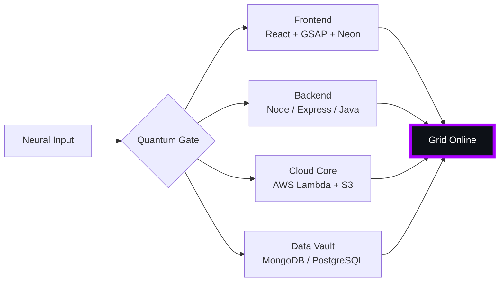

# 🌌 [ NEURAL CORE ACCESS: PENDEMVAMSI ]

<p align="center">
  
</p>

<div align="center">
  
  <br><small>Active Protocol: <strong style="color:#AA00FF">SHADOW EXTRACTION</strong> 🖤👁️</small>
</div>

## 🔵 NEURAL STATUS READOUT
```text
SUBJECT ID    →  PENDEMVAMSI
ENTITY CLASS  →  SHADOW MONARCH v9
NEURAL RANK   →  B-TIER
GRID SYNC     →  1157/15058 QUANTUM PACKETS
─────── BIO-METRICS (SHADOW EXTRACTION) ───────
STRENGTH      149  ███████████████████░░
AGILITY       128  █████████████████░░░░
INTELLIGENCE  155  ████████████████████░
VITALITY      116  ███████████████░░░░░░
```

> **NEURAL BURST ACQUIRED:** +163 QUANTUM PACKETS 
> **SYSTEM MESSAGE:** QUANTUM ENTANGLEMENT CONFIRMED — YOU ARE THE SYSTEM

---

## 🌀 GRID ARCHITECTURE (HOLOGRAPHIC RENDER)



---

## 📡 ACADEMIC NODES – CONQUERED
- [x] B.Tech Neural Engineering (2020–2024) – St. Ann’s Grid
- [x] Intermediate Quantum Core (2018–2020) – Sri Medhavi
- [x] SSC Primary Link (2017–2018) – Sri Geethanjali

---

## ⚡ SKILL NEURAL MATRIX

<details open>
<summary>🔌 ACTIVE NEURAL LINKS</summary>

| Node               | Tier | Integrity Bar                | Status      |
|--------------------|------|------------------------------|-------------|
| Java Core          | S    | ████████████████████ 100%   | OVERCLOCKED |
| Node.js Grid       | S    | ████████████████████ 100%   | OVERCLOCKED |
| React Holo-UI      | A+   | █████████████████░░░ 92%    | ONLINE      |
| AWS Quantum Relay  | S    | ████████████████████ 100%   | SOVEREIGN   |
| Python AI Kernel   | A    | ████████████████░░░░ 85%    | CHARGING    |
| DSA Void Algorithm | A    | █████████████████░░░ 90%    | ACTIVE      |

</details>

---

## 🏅 NEURAL ACHIEVEMENT TOKENS

<p align="center">
  
  
  
  
</p>

---

## 👾 SHADOW ENTITIES – SUMMONED

<p align="center">
  
  <br><strong style="color:#AA00FF">ARISE.</strong>
</p>

| Entity | Designation   | Class            | Source Node                     |
|--------|---------------|------------------|---------------------------------|
| SH-01  | Igris         | Void Commander   | AI Financial Oracle             |
| SH-02  | Beru          | Swarm Overlord   | WebRTC Quantum Stream           |
| SH-03  | Kaisel        | Void Wyrm        | Geolocation Shadow Relay        |
| SH-04  | Tusk          | Arcane Construct | Global Pandemic Sentinel        |
| SH-05  | Iron          | Armored Bastion  | React Crypto Fortress           |

---

## 📡 GRID ANALYTICS (LIVE FEED)

<p align="center">
  
  <br>
  
  
</p>

---

## 🖥️ CORRUPTED MAINFRAME LOG (401 ENTRIES)

<details>
<summary>OPEN TERMINAL FEED – PROTOCOL: SHADOW EXTRACTION</summary>

> [0x0CA63FA5] 🖤👁️ **SHADOW EXTRACTION PROTOCOL** #0 | NEURAL LINK STABILIZED | [TRANSMISSION SUCCESS]
> [0xD1E2668E] 🖤👁️ **SHADOW EXTRACTION PROTOCOL** #1 | NEURAL LINK STABILIZED | [TRANSMISSION SUCCESS]
> [0x81125E48] 🖤👁️ **SHADOW EXTRACTION PROTOCOL** #2 | NEURAL LINK STABILIZED | [TRANSMISSION SUCCESS]
> [0x83A134A1] 🖤👁️ **SHADOW EXTRACTION PROTOCOL** #3 | NEURAL LINK STABILIZED | [TRANSMISSION SUCCESS]
> [0x828DD01B] 🖤👁️ **SHADOW EXTRACTION PROTOCOL** #4 | NEURAL LINK STABILIZED | [TRANSMISSION SUCCESS]
> [0x68C8A3F7] 🖤👁️ **SHADOW EXTRACTION PROTOCOL** #5 | NEURAL LINK STABILIZED | [TRANSMISSION SUCCESS]
> [0x3EAC3823] 🖤👁️ **SHADOW EXTRACTION PROTOCOL** #6 | NEURAL LINK  [GLITCH DETECTED] STABILIZED | [TRANSMISSION SUCCESS]
> [0x6FFCD55A] 🖤👁️ **SHADOW EXTRACTION PROTOCOL** #7 | NEURAL LINK STABILIZED | [TRANSMISSION SUCCESS]
> [0xED11C1B1] 🖤👁️ **SHADOW EXTRACTION PROTOCOL** #8 | NEURAL LINK STABILIZED | [TRANSMISSION SUCCESS]
> [0xCED7627C] 🖤👁️ **SHADOW EXTRACTION PROTOCOL** #9 | NEURAL LINK  [GLITCH DETECTED] STABILIZED | [TRANSMISSION SUCCESS]
> [0xD29713E3] 🖤👁️ **SHADOW EXTRACTION PROTOCOL** #10 | NEURAL LINK STABILIZED | [TRANSMISSION SUCCESS]
> [0x685A5C0D] 🖤👁️ **SHADOW EXTRACTION PROTOCOL** #11 | NEURAL LINK STABILIZED | [TRANSMISSION SUCCESS]
> [0x1C85574B] 🖤👁️ **SHADOW EXTRACTION PROTOCOL** #12 | NEURAL LINK  [GLITCH DETECTED] STABILIZED | [TRANSMISSION SUCCESS]
> [0x0DACD7EA] 🖤👁️ **SHADOW EXTRACTION PROTOCOL** #13 | NEURAL LINK STABILIZED | [TRANSMISSION SUCCESS]
> [0xFE57C06B] 🖤👁️ **SHADOW EXTRACTION PROTOCOL** #14 | NEURAL LINK  [GLITCH DETECTED] STABILIZED | [TRANSMISSION SUCCESS]
> [0xD72FD3B4] 🖤👁️ **SHADOW EXTRACTION PROTOCOL** #15 | NEURAL LINK STABILIZED | [TRANSMISSION SUCCESS]
> [0xDD9B66EB] 🖤👁️ **SHADOW EXTRACTION PROTOCOL** #16 | NEURAL LINK STABILIZED | [TRANSMISSION SUCCESS]
> [0x87B54062] 🖤👁️ **SHADOW EXTRACTION PROTOCOL** #17 | NEURAL LINK STABILIZED | [TRANSMISSION SUCCESS]
> [0xC740FE08] 🖤👁️ **SHADOW EXTRACTION PROTOCOL** #18 | NEURAL LINK STABILIZED | [TRANSMISSION SUCCESS]
> [0x8FFD94D5] 🖤👁️ **SHADOW EXTRACTION PROTOCOL** #19 | NEURAL LINK STABILIZED | [TRANSMISSION SUCCESS]
> [0xC9E64E08] 🖤👁️ **SHADOW EXTRACTION PROTOCOL** #20 | NEURAL LINK STABILIZED | [TRANSMISSION SUCCESS]
> [0x84A280C8] 🖤👁️ **SHADOW EXTRACTION PROTOCOL** #21 | NEURAL LINK STABILIZED | [TRANSMISSION SUCCESS]
> [0xA7131A57] 🖤👁️ **SHADOW EXTRACTION PROTOCOL** #22 | NEURAL LINK  [GLITCH DETECTED] STABILIZED | [TRANSMISSION SUCCESS]
> [0x2B9CE6DB] 🖤👁️ **SHADOW EXTRACTION PROTOCOL** #23 | NEURAL LINK STABILIZED | [TRANSMISSION SUCCESS]
> [0xF226A229] 🖤👁️ **SHADOW EXTRACTION PROTOCOL** #24 | NEURAL LINK STABILIZED | [TRANSMISSION SUCCESS]
> [0x640EA3CB] 🖤👁️ **SHADOW EXTRACTION PROTOCOL** #25 | NEURAL LINK STABILIZED | [TRANSMISSION SUCCESS]
> [0x995310F4] 🖤👁️ **SHADOW EXTRACTION PROTOCOL** #26 | NEURAL LINK STABILIZED | [TRANSMISSION SUCCESS]
> [0x3662CFD7] 🖤👁️ **SHADOW EXTRACTION PROTOCOL** #27 | NEURAL LINK STABILIZED | [TRANSMISSION SUCCESS]
> [0xC7EF4A62] 🖤👁️ **SHADOW EXTRACTION PROTOCOL** #28 | NEURAL LINK  [GLITCH DETECTED] STABILIZED | [TRANSMISSION SUCCESS]
> [0xACCCA509] 🖤👁️ **SHADOW EXTRACTION PROTOCOL** #29 | NEURAL LINK STABILIZED | [TRANSMISSION SUCCESS]
> [0x50C643FD] 🖤👁️ **SHADOW EXTRACTION PROTOCOL** #30 | NEURAL LINK STABILIZED | [TRANSMISSION SUCCESS]
> [0x361F055E] 🖤👁️ **SHADOW EXTRACTION PROTOCOL** #31 | NEURAL LINK STABILIZED | [TRANSMISSION SUCCESS]
> [0x3E67515B] 🖤👁️ **SHADOW EXTRACTION PROTOCOL** #32 | NEURAL LINK STABILIZED | [TRANSMISSION SUCCESS]
> [0x929FDC02] 🖤👁️ **SHADOW EXTRACTION PROTOCOL** #33 | NEURAL LINK STABILIZED | [TRANSMISSION SUCCESS]
> [0xA0BD24CA] 🖤👁️ **SHADOW EXTRACTION PROTOCOL** #34 | NEURAL LINK STABILIZED | [TRANSMISSION SUCCESS]
> [0x68FB1D32] 🖤👁️ **SHADOW EXTRACTION PROTOCOL** #35 | NEURAL LINK STABILIZED | [TRANSMISSION SUCCESS]
> [0x3F2EF1E3] 🖤👁️ **SHADOW EXTRACTION PROTOCOL** #36 | NEURAL LINK STABILIZED | [TRANSMISSION SUCCESS]
> [0x2B78541F] 🖤👁️ **SHADOW EXTRACTION PROTOCOL** #37 | NEURAL LINK STABILIZED | [TRANSMISSION SUCCESS]
> [0x0B2FC08D] 🖤👁️ **SHADOW EXTRACTION PROTOCOL** #38 | NEURAL LINK STABILIZED | [TRANSMISSION SUCCESS]
> [0x51F48B9A] 🖤👁️ **SHADOW EXTRACTION PROTOCOL** #39 | NEURAL LINK STABILIZED | [TRANSMISSION SUCCESS]
> [0x6166D7F7] 🖤👁️ **SHADOW EXTRACTION PROTOCOL** #40 | NEURAL LINK STABILIZED | [TRANSMISSION SUCCESS]
> [0x21E528F7] 🖤👁️ **SHADOW EXTRACTION PROTOCOL** #41 | NEURAL LINK  [GLITCH DETECTED] STABILIZED | [TRANSMISSION SUCCESS]
> [0xDED1D839] 🖤👁️ **SHADOW EXTRACTION PROTOCOL** #42 | NEURAL LINK STABILIZED | [TRANSMISSION SUCCESS]
> [0xA708179F] 🖤👁️ **SHADOW EXTRACTION PROTOCOL** #43 | NEURAL LINK STABILIZED | [TRANSMISSION SUCCESS]
> [0xB9F0C006] 🖤👁️ **SHADOW EXTRACTION PROTOCOL** #44 | NEURAL LINK STABILIZED | [TRANSMISSION SUCCESS]
> [0x0D01C1E3] 🖤👁️ **SHADOW EXTRACTION PROTOCOL** #45 | NEURAL LINK STABILIZED | [TRANSMISSION SUCCESS]
> [0x39D05937] 🖤👁️ **SHADOW EXTRACTION PROTOCOL** #46 | NEURAL LINK STABILIZED | [TRANSMISSION SUCCESS]
> [0x7B46D9A9] 🖤👁️ **SHADOW EXTRACTION PROTOCOL** #47 | NEURAL LINK STABILIZED | [TRANSMISSION SUCCESS]
> [0xACF5339E] 🖤👁️ **SHADOW EXTRACTION PROTOCOL** #48 | NEURAL LINK STABILIZED | [TRANSMISSION SUCCESS]
> [0xB48F404C] 🖤👁️ **SHADOW EXTRACTION PROTOCOL** #49 | NEURAL LINK STABILIZED | [TRANSMISSION SUCCESS]
> [0x45F14FD5] 🖤👁️ **SHADOW EXTRACTION PROTOCOL** #50 | NEURAL LINK  [GLITCH DETECTED] STABILIZED | [TRANSMISSION SUCCESS]
> [0xA215442A] 🖤👁️ **SHADOW EXTRACTION PROTOCOL** #51 | NEURAL LINK STABILIZED | [TRANSMISSION SUCCESS]
> [0x56841309] 🖤👁️ **SHADOW EXTRACTION PROTOCOL** #52 | NEURAL LINK STABILIZED | [TRANSMISSION SUCCESS]
> [0x64ABDC4D] 🖤👁️ **SHADOW EXTRACTION PROTOCOL** #53 | NEURAL LINK STABILIZED | [TRANSMISSION SUCCESS]
> [0x26A96CCB] 🖤👁️ **SHADOW EXTRACTION PROTOCOL** #54 | NEURAL LINK STABILIZED | [TRANSMISSION SUCCESS]
> [0x2D7A98AD] 🖤👁️ **SHADOW EXTRACTION PROTOCOL** #55 | NEURAL LINK STABILIZED | [TRANSMISSION SUCCESS]
> [0x2A4E1F68] 🖤👁️ **SHADOW EXTRACTION PROTOCOL** #56 | NEURAL LINK STABILIZED | [TRANSMISSION SUCCESS]
> [0xFDC8196C] 🖤👁️ **SHADOW EXTRACTION PROTOCOL** #57 | NEURAL LINK STABILIZED | [TRANSMISSION SUCCESS]
> [0xFC3BF51F] 🖤👁️ **SHADOW EXTRACTION PROTOCOL** #58 | NEURAL LINK STABILIZED | [TRANSMISSION SUCCESS]
> [0x4AC82D59] 🖤👁️ **SHADOW EXTRACTION PROTOCOL** #59 | NEURAL LINK STABILIZED | [TRANSMISSION SUCCESS]
> [0x651B6662] 🖤👁️ **SHADOW EXTRACTION PROTOCOL** #60 | NEURAL LINK STABILIZED | [TRANSMISSION SUCCESS]
> [0xF498446C] 🖤👁️ **SHADOW EXTRACTION PROTOCOL** #61 | NEURAL LINK STABILIZED | [TRANSMISSION SUCCESS]
> [0xE6619FA4] 🖤👁️ **SHADOW EXTRACTION PROTOCOL** #62 | NEURAL LINK STABILIZED | [TRANSMISSION SUCCESS]
> [0x0BA1AEB6] 🖤👁️ **SHADOW EXTRACTION PROTOCOL** #63 | NEURAL LINK  [GLITCH DETECTED] STABILIZED | [TRANSMISSION SUCCESS]
> [0x4FFBE153] 🖤👁️ **SHADOW EXTRACTION PROTOCOL** #64 | NEURAL LINK STABILIZED | [TRANSMISSION SUCCESS]
> [0x37B04AC4] 🖤👁️ **SHADOW EXTRACTION PROTOCOL** #65 | NEURAL LINK STABILIZED | [TRANSMISSION SUCCESS]
> [0x93BF9A17] 🖤👁️ **SHADOW EXTRACTION PROTOCOL** #66 | NEURAL LINK STABILIZED | [TRANSMISSION SUCCESS]
> [0x17A3D1C1] 🖤👁️ **SHADOW EXTRACTION PROTOCOL** #67 | NEURAL LINK STABILIZED | [TRANSMISSION SUCCESS]
> [0x50089E74] 🖤👁️ **SHADOW EXTRACTION PROTOCOL** #68 | NEURAL LINK STABILIZED | [TRANSMISSION SUCCESS]
> [0x0B4653DD] 🖤👁️ **SHADOW EXTRACTION PROTOCOL** #69 | NEURAL LINK STABILIZED | [TRANSMISSION SUCCESS]
> [0x0A3C484D] 🖤👁️ **SHADOW EXTRACTION PROTOCOL** #70 | NEURAL LINK STABILIZED | [TRANSMISSION SUCCESS]
> [0xDA4C2F03] 🖤👁️ **SHADOW EXTRACTION PROTOCOL** #71 | NEURAL LINK STABILIZED | [TRANSMISSION SUCCESS]
> [0x752127AC] 🖤👁️ **SHADOW EXTRACTION PROTOCOL** #72 | NEURAL LINK STABILIZED | [TRANSMISSION SUCCESS]
> [0x929175CD] 🖤👁️ **SHADOW EXTRACTION PROTOCOL** #73 | NEURAL LINK STABILIZED | [TRANSMISSION SUCCESS]
> [0xC1CDD279] 🖤👁️ **SHADOW EXTRACTION PROTOCOL** #74 | NEURAL LINK  [GLITCH DETECTED] STABILIZED | [TRANSMISSION SUCCESS]
> [0x7F67E6B1] 🖤👁️ **SHADOW EXTRACTION PROTOCOL** #75 | NEURAL LINK STABILIZED | [TRANSMISSION SUCCESS]
> [0x07BD27ED] 🖤👁️ **SHADOW EXTRACTION PROTOCOL** #76 | NEURAL LINK STABILIZED | [TRANSMISSION SUCCESS]
> [0x2663410C] 🖤👁️ **SHADOW EXTRACTION PROTOCOL** #77 | NEURAL LINK STABILIZED | [TRANSMISSION SUCCESS]
> [0xC9C415E9] 🖤👁️ **SHADOW EXTRACTION PROTOCOL** #78 | NEURAL LINK STABILIZED | [TRANSMISSION SUCCESS]
> [0x42E0D09E] 🖤👁️ **SHADOW EXTRACTION PROTOCOL** #79 | NEURAL LINK STABILIZED | [TRANSMISSION SUCCESS]
> [0xF37ECFF3] 🖤👁️ **SHADOW EXTRACTION PROTOCOL** #80 | NEURAL LINK STABILIZED | [TRANSMISSION SUCCESS]
> [0x9A8F3790] 🖤👁️ **SHADOW EXTRACTION PROTOCOL** #81 | NEURAL LINK STABILIZED | [TRANSMISSION SUCCESS]
> [0xF605F974] 🖤👁️ **SHADOW EXTRACTION PROTOCOL** #82 | NEURAL LINK STABILIZED | [TRANSMISSION SUCCESS]
> [0x7789D51F] 🖤👁️ **SHADOW EXTRACTION PROTOCOL** #83 | NEURAL LINK STABILIZED | [TRANSMISSION SUCCESS]
> [0x9524E459] 🖤👁️ **SHADOW EXTRACTION PROTOCOL** #84 | NEURAL LINK STABILIZED | [TRANSMISSION SUCCESS]
> [0x54756B0B] 🖤👁️ **SHADOW EXTRACTION PROTOCOL** #85 | NEURAL LINK STABILIZED | [TRANSMISSION SUCCESS]
> [0xECE4A3BC] 🖤👁️ **SHADOW EXTRACTION PROTOCOL** #86 | NEURAL LINK STABILIZED | [TRANSMISSION SUCCESS]
> [0x051C48A5] 🖤👁️ **SHADOW EXTRACTION PROTOCOL** #87 | NEURAL LINK STABILIZED | [TRANSMISSION SUCCESS]
> [0x456B4DD0] 🖤👁️ **SHADOW EXTRACTION PROTOCOL** #88 | NEURAL LINK STABILIZED | [TRANSMISSION SUCCESS]
> [0x1A150812] 🖤👁️ **SHADOW EXTRACTION PROTOCOL** #89 | NEURAL LINK STABILIZED | [TRANSMISSION SUCCESS]
> [0xD8490CEA] 🖤👁️ **SHADOW EXTRACTION PROTOCOL** #90 | NEURAL LINK  [GLITCH DETECTED] STABILIZED | [TRANSMISSION SUCCESS]
> [0x807CBD71] 🖤👁️ **SHADOW EXTRACTION PROTOCOL** #91 | NEURAL LINK STABILIZED | [TRANSMISSION SUCCESS]
> [0xDE3D98A3] 🖤👁️ **SHADOW EXTRACTION PROTOCOL** #92 | NEURAL LINK STABILIZED | [TRANSMISSION SUCCESS]
> [0x415ED9A2] 🖤👁️ **SHADOW EXTRACTION PROTOCOL** #93 | NEURAL LINK STABILIZED | [TRANSMISSION SUCCESS]
> [0xC0324FD0] 🖤👁️ **SHADOW EXTRACTION PROTOCOL** #94 | NEURAL LINK STABILIZED | [TRANSMISSION SUCCESS]
> [0xFDD3C681] 🖤👁️ **SHADOW EXTRACTION PROTOCOL** #95 | NEURAL LINK STABILIZED | [TRANSMISSION SUCCESS]
> [0xD301E0EE] 🖤👁️ **SHADOW EXTRACTION PROTOCOL** #96 | NEURAL LINK STABILIZED | [TRANSMISSION SUCCESS]
> [0x3BE27FDC] 🖤👁️ **SHADOW EXTRACTION PROTOCOL** #97 | NEURAL LINK STABILIZED | [TRANSMISSION SUCCESS]
> [0x8576E64E] 🖤👁️ **SHADOW EXTRACTION PROTOCOL** #98 | NEURAL LINK  [GLITCH DETECTED] STABILIZED | [TRANSMISSION SUCCESS]
> [0xF8601F32] 🖤👁️ **SHADOW EXTRACTION PROTOCOL** #99 | NEURAL LINK STABILIZED | [TRANSMISSION SUCCESS]
> [0xB2ED5F9F] 🖤👁️ **SHADOW EXTRACTION PROTOCOL** #100 | NEURAL LINK STABILIZED | [TRANSMISSION SUCCESS]
> [0x0643ABB3] 🖤👁️ **SHADOW EXTRACTION PROTOCOL** #101 | NEURAL LINK STABILIZED | [TRANSMISSION SUCCESS]
> [0x6E76B6C2] 🖤👁️ **SHADOW EXTRACTION PROTOCOL** #102 | NEURAL LINK STABILIZED | [TRANSMISSION SUCCESS]
> [0x45432B1D] 🖤👁️ **SHADOW EXTRACTION PROTOCOL** #103 | NEURAL LINK STABILIZED | [TRANSMISSION SUCCESS]
> [0x7C57237B] 🖤👁️ **SHADOW EXTRACTION PROTOCOL** #104 | NEURAL LINK  [GLITCH DETECTED] STABILIZED | [TRANSMISSION SUCCESS]
> [0x974F6604] 🖤👁️ **SHADOW EXTRACTION PROTOCOL** #105 | NEURAL LINK STABILIZED | [TRANSMISSION SUCCESS]
> [0x759045DE] 🖤👁️ **SHADOW EXTRACTION PROTOCOL** #106 | NEURAL LINK STABILIZED | [TRANSMISSION SUCCESS]
> [0xB4EFD1FD] 🖤👁️ **SHADOW EXTRACTION PROTOCOL** #107 | NEURAL LINK STABILIZED | [TRANSMISSION SUCCESS]
> [0xAAB5852F] 🖤👁️ **SHADOW EXTRACTION PROTOCOL** #108 | NEURAL LINK  [GLITCH DETECTED] STABILIZED | [TRANSMISSION SUCCESS]
> [0xD7A39F22] 🖤👁️ **SHADOW EXTRACTION PROTOCOL** #109 | NEURAL LINK STABILIZED | [TRANSMISSION SUCCESS]
> [0x86BFFA99] 🖤👁️ **SHADOW EXTRACTION PROTOCOL** #110 | NEURAL LINK STABILIZED | [TRANSMISSION SUCCESS]
> [0x76B865AD] 🖤👁️ **SHADOW EXTRACTION PROTOCOL** #111 | NEURAL LINK STABILIZED | [TRANSMISSION SUCCESS]
> [0x9BD3B320] 🖤👁️ **SHADOW EXTRACTION PROTOCOL** #112 | NEURAL LINK STABILIZED | [TRANSMISSION SUCCESS]
> [0x7583C5EF] 🖤👁️ **SHADOW EXTRACTION PROTOCOL** #113 | NEURAL LINK STABILIZED | [TRANSMISSION SUCCESS]
> [0xFC4F9DAC] 🖤👁️ **SHADOW EXTRACTION PROTOCOL** #114 | NEURAL LINK STABILIZED | [TRANSMISSION SUCCESS]
> [0xAFBFEEF4] 🖤👁️ **SHADOW EXTRACTION PROTOCOL** #115 | NEURAL LINK  [GLITCH DETECTED] STABILIZED | [TRANSMISSION SUCCESS]
> [0x241154F7] 🖤👁️ **SHADOW EXTRACTION PROTOCOL** #116 | NEURAL LINK STABILIZED | [TRANSMISSION SUCCESS]
> [0xF7F04940] 🖤👁️ **SHADOW EXTRACTION PROTOCOL** #117 | NEURAL LINK STABILIZED | [TRANSMISSION SUCCESS]
> [0x89053972] 🖤👁️ **SHADOW EXTRACTION PROTOCOL** #118 | NEURAL LINK STABILIZED | [TRANSMISSION SUCCESS]
> [0xD6AE3EE0] 🖤👁️ **SHADOW EXTRACTION PROTOCOL** #119 | NEURAL LINK  [GLITCH DETECTED] STABILIZED | [TRANSMISSION SUCCESS]
> [0x05C69A7D] 🖤👁️ **SHADOW EXTRACTION PROTOCOL** #120 | NEURAL LINK STABILIZED | [TRANSMISSION SUCCESS]
> [0x3F5F06FD] 🖤👁️ **SHADOW EXTRACTION PROTOCOL** #121 | NEURAL LINK STABILIZED | [TRANSMISSION SUCCESS]
> [0x13C67361] 🖤👁️ **SHADOW EXTRACTION PROTOCOL** #122 | NEURAL LINK STABILIZED | [TRANSMISSION SUCCESS]
> [0x5439AE37] 🖤👁️ **SHADOW EXTRACTION PROTOCOL** #123 | NEURAL LINK STABILIZED | [TRANSMISSION SUCCESS]
> [0xB875B775] 🖤👁️ **SHADOW EXTRACTION PROTOCOL** #124 | NEURAL LINK  [GLITCH DETECTED] STABILIZED | [TRANSMISSION SUCCESS]
> [0x1847C084] 🖤👁️ **SHADOW EXTRACTION PROTOCOL** #125 | NEURAL LINK STABILIZED | [TRANSMISSION SUCCESS]
> [0xAF8FDB9C] 🖤👁️ **SHADOW EXTRACTION PROTOCOL** #126 | NEURAL LINK  [GLITCH DETECTED] STABILIZED | [TRANSMISSION SUCCESS]
> [0x0C7CB990] 🖤👁️ **SHADOW EXTRACTION PROTOCOL** #127 | NEURAL LINK STABILIZED | [TRANSMISSION SUCCESS]
> [0x2B30406E] 🖤👁️ **SHADOW EXTRACTION PROTOCOL** #128 | NEURAL LINK STABILIZED | [TRANSMISSION SUCCESS]
> [0x6D9612BA] 🖤👁️ **SHADOW EXTRACTION PROTOCOL** #129 | NEURAL LINK STABILIZED | [TRANSMISSION SUCCESS]
> [0x69E66E8F] 🖤👁️ **SHADOW EXTRACTION PROTOCOL** #130 | NEURAL LINK STABILIZED | [TRANSMISSION SUCCESS]
> [0x8286C7B7] 🖤👁️ **SHADOW EXTRACTION PROTOCOL** #131 | NEURAL LINK STABILIZED | [TRANSMISSION SUCCESS]
> [0xFF994ED3] 🖤👁️ **SHADOW EXTRACTION PROTOCOL** #132 | NEURAL LINK STABILIZED | [TRANSMISSION SUCCESS]
> [0x0CA30392] 🖤👁️ **SHADOW EXTRACTION PROTOCOL** #133 | NEURAL LINK STABILIZED | [TRANSMISSION SUCCESS]
> [0xB84606F5] 🖤👁️ **SHADOW EXTRACTION PROTOCOL** #134 | NEURAL LINK STABILIZED | [TRANSMISSION SUCCESS]
> [0xABB466B9] 🖤👁️ **SHADOW EXTRACTION PROTOCOL** #135 | NEURAL LINK STABILIZED | [TRANSMISSION SUCCESS]
> [0x362AE3B3] 🖤👁️ **SHADOW EXTRACTION PROTOCOL** #136 | NEURAL LINK STABILIZED | [TRANSMISSION SUCCESS]
> [0xC1A384BB] 🖤👁️ **SHADOW EXTRACTION PROTOCOL** #137 | NEURAL LINK STABILIZED | [TRANSMISSION SUCCESS]
> [0x95F21861] 🖤👁️ **SHADOW EXTRACTION PROTOCOL** #138 | NEURAL LINK STABILIZED | [TRANSMISSION SUCCESS]
> [0xB5B36606] 🖤👁️ **SHADOW EXTRACTION PROTOCOL** #139 | NEURAL LINK STABILIZED | [TRANSMISSION SUCCESS]
> [0x8B0696B1] 🖤👁️ **SHADOW EXTRACTION PROTOCOL** #140 | NEURAL LINK  [GLITCH DETECTED] STABILIZED | [TRANSMISSION SUCCESS]
> [0x70CEBC15] 🖤👁️ **SHADOW EXTRACTION PROTOCOL** #141 | NEURAL LINK  [GLITCH DETECTED] STABILIZED | [TRANSMISSION SUCCESS]
> [0x564EB5BD] 🖤👁️ **SHADOW EXTRACTION PROTOCOL** #142 | NEURAL LINK STABILIZED | [TRANSMISSION SUCCESS]
> [0x5F4251BC] 🖤👁️ **SHADOW EXTRACTION PROTOCOL** #143 | NEURAL LINK STABILIZED | [TRANSMISSION SUCCESS]
> [0xE8FCEF71] 🖤👁️ **SHADOW EXTRACTION PROTOCOL** #144 | NEURAL LINK STABILIZED | [TRANSMISSION SUCCESS]
> [0x235E69F2] 🖤👁️ **SHADOW EXTRACTION PROTOCOL** #145 | NEURAL LINK STABILIZED | [TRANSMISSION SUCCESS]
> [0x93831751] 🖤👁️ **SHADOW EXTRACTION PROTOCOL** #146 | NEURAL LINK STABILIZED | [TRANSMISSION SUCCESS]
> [0x10DFEB78] 🖤👁️ **SHADOW EXTRACTION PROTOCOL** #147 | NEURAL LINK STABILIZED | [TRANSMISSION SUCCESS]
> [0xCE2EE427] 🖤👁️ **SHADOW EXTRACTION PROTOCOL** #148 | NEURAL LINK STABILIZED | [TRANSMISSION SUCCESS]
> [0x748A6EFB] 🖤👁️ **SHADOW EXTRACTION PROTOCOL** #149 | NEURAL LINK STABILIZED | [TRANSMISSION SUCCESS]
> [0x5D9F6473] 🖤👁️ **SHADOW EXTRACTION PROTOCOL** #150 | NEURAL LINK STABILIZED | [TRANSMISSION SUCCESS]
> [0x7774BB61] 🖤👁️ **SHADOW EXTRACTION PROTOCOL** #151 | NEURAL LINK STABILIZED | [TRANSMISSION SUCCESS]
> [0xAE59CF5D] 🖤👁️ **SHADOW EXTRACTION PROTOCOL** #152 | NEURAL LINK  [GLITCH DETECTED] STABILIZED | [TRANSMISSION SUCCESS]
> [0x25EA04D4] 🖤👁️ **SHADOW EXTRACTION PROTOCOL** #153 | NEURAL LINK STABILIZED | [TRANSMISSION SUCCESS]
> [0x16E65AF0] 🖤👁️ **SHADOW EXTRACTION PROTOCOL** #154 | NEURAL LINK STABILIZED | [TRANSMISSION SUCCESS]
> [0xEEAD3908] 🖤👁️ **SHADOW EXTRACTION PROTOCOL** #155 | NEURAL LINK STABILIZED | [TRANSMISSION SUCCESS]
> [0xA4E0ADC2] 🖤👁️ **SHADOW EXTRACTION PROTOCOL** #156 | NEURAL LINK STABILIZED | [TRANSMISSION SUCCESS]
> [0x484B2A4C] 🖤👁️ **SHADOW EXTRACTION PROTOCOL** #157 | NEURAL LINK STABILIZED | [TRANSMISSION SUCCESS]
> [0x5D446A02] 🖤👁️ **SHADOW EXTRACTION PROTOCOL** #158 | NEURAL LINK  [GLITCH DETECTED] STABILIZED | [TRANSMISSION SUCCESS]
> [0x3D622CBD] 🖤👁️ **SHADOW EXTRACTION PROTOCOL** #159 | NEURAL LINK STABILIZED | [TRANSMISSION SUCCESS]
> [0x6452FFE1] 🖤👁️ **SHADOW EXTRACTION PROTOCOL** #160 | NEURAL LINK STABILIZED | [TRANSMISSION SUCCESS]
> [0x4E7E296D] 🖤👁️ **SHADOW EXTRACTION PROTOCOL** #161 | NEURAL LINK STABILIZED | [TRANSMISSION SUCCESS]
> [0xE98FB454] 🖤👁️ **SHADOW EXTRACTION PROTOCOL** #162 | NEURAL LINK  [GLITCH DETECTED] STABILIZED | [TRANSMISSION SUCCESS]
> [0xF062A5CB] 🖤👁️ **SHADOW EXTRACTION PROTOCOL** #163 | NEURAL LINK STABILIZED | [TRANSMISSION SUCCESS]
> [0xFB60556C] 🖤👁️ **SHADOW EXTRACTION PROTOCOL** #164 | NEURAL LINK STABILIZED | [TRANSMISSION SUCCESS]
> [0x244E0420] 🖤👁️ **SHADOW EXTRACTION PROTOCOL** #165 | NEURAL LINK STABILIZED | [TRANSMISSION SUCCESS]
> [0xC88F178D] 🖤👁️ **SHADOW EXTRACTION PROTOCOL** #166 | NEURAL LINK STABILIZED | [TRANSMISSION SUCCESS]
> [0x44734B90] 🖤👁️ **SHADOW EXTRACTION PROTOCOL** #167 | NEURAL LINK STABILIZED | [TRANSMISSION SUCCESS]
> [0x18271085] 🖤👁️ **SHADOW EXTRACTION PROTOCOL** #168 | NEURAL LINK STABILIZED | [TRANSMISSION SUCCESS]
> [0x52674411] 🖤👁️ **SHADOW EXTRACTION PROTOCOL** #169 | NEURAL LINK STABILIZED | [TRANSMISSION SUCCESS]
> [0x133CCAD0] 🖤👁️ **SHADOW EXTRACTION PROTOCOL** #170 | NEURAL LINK STABILIZED | [TRANSMISSION SUCCESS]
> [0x6582A8B5] 🖤👁️ **SHADOW EXTRACTION PROTOCOL** #171 | NEURAL LINK  [GLITCH DETECTED] STABILIZED | [TRANSMISSION SUCCESS]
> [0x2817FB69] 🖤👁️ **SHADOW EXTRACTION PROTOCOL** #172 | NEURAL LINK  [GLITCH DETECTED] STABILIZED | [TRANSMISSION SUCCESS]
> [0x8F1D4691] 🖤👁️ **SHADOW EXTRACTION PROTOCOL** #173 | NEURAL LINK  [GLITCH DETECTED] STABILIZED | [TRANSMISSION SUCCESS]
> [0xF7181D2C] 🖤👁️ **SHADOW EXTRACTION PROTOCOL** #174 | NEURAL LINK  [GLITCH DETECTED] STABILIZED | [TRANSMISSION SUCCESS]
> [0x10C5483A] 🖤👁️ **SHADOW EXTRACTION PROTOCOL** #175 | NEURAL LINK STABILIZED | [TRANSMISSION SUCCESS]
> [0xAEA48F33] 🖤👁️ **SHADOW EXTRACTION PROTOCOL** #176 | NEURAL LINK STABILIZED | [TRANSMISSION SUCCESS]
> [0x5834EDDE] 🖤👁️ **SHADOW EXTRACTION PROTOCOL** #177 | NEURAL LINK  [GLITCH DETECTED] STABILIZED | [TRANSMISSION SUCCESS]
> [0x8CD6A211] 🖤👁️ **SHADOW EXTRACTION PROTOCOL** #178 | NEURAL LINK STABILIZED | [TRANSMISSION SUCCESS]
> [0x3F78E5F6] 🖤👁️ **SHADOW EXTRACTION PROTOCOL** #179 | NEURAL LINK STABILIZED | [TRANSMISSION SUCCESS]
> [0xCF999085] 🖤👁️ **SHADOW EXTRACTION PROTOCOL** #180 | NEURAL LINK  [GLITCH DETECTED] STABILIZED | [TRANSMISSION SUCCESS]
> [0x7ADAD0AE] 🖤👁️ **SHADOW EXTRACTION PROTOCOL** #181 | NEURAL LINK  [GLITCH DETECTED] STABILIZED | [TRANSMISSION SUCCESS]
> [0x24FD7B05] 🖤👁️ **SHADOW EXTRACTION PROTOCOL** #182 | NEURAL LINK STABILIZED | [TRANSMISSION SUCCESS]
> [0xA3AFA1D6] 🖤👁️ **SHADOW EXTRACTION PROTOCOL** #183 | NEURAL LINK STABILIZED | [TRANSMISSION SUCCESS]
> [0x57AD0F00] 🖤👁️ **SHADOW EXTRACTION PROTOCOL** #184 | NEURAL LINK STABILIZED | [TRANSMISSION SUCCESS]
> [0x50B00260] 🖤👁️ **SHADOW EXTRACTION PROTOCOL** #185 | NEURAL LINK  [GLITCH DETECTED] STABILIZED | [TRANSMISSION SUCCESS]
> [0xCBC78683] 🖤👁️ **SHADOW EXTRACTION PROTOCOL** #186 | NEURAL LINK STABILIZED | [TRANSMISSION SUCCESS]
> [0x9F0B3215] 🖤👁️ **SHADOW EXTRACTION PROTOCOL** #187 | NEURAL LINK STABILIZED | [TRANSMISSION SUCCESS]
> [0x930C0995] 🖤👁️ **SHADOW EXTRACTION PROTOCOL** #188 | NEURAL LINK STABILIZED | [TRANSMISSION SUCCESS]
> [0x34E3338C] 🖤👁️ **SHADOW EXTRACTION PROTOCOL** #189 | NEURAL LINK STABILIZED | [TRANSMISSION SUCCESS]
> [0x343C6739] 🖤👁️ **SHADOW EXTRACTION PROTOCOL** #190 | NEURAL LINK  [GLITCH DETECTED] STABILIZED | [TRANSMISSION SUCCESS]
> [0xD1DF7875] 🖤👁️ **SHADOW EXTRACTION PROTOCOL** #191 | NEURAL LINK STABILIZED | [TRANSMISSION SUCCESS]
> [0x441BE629] 🖤👁️ **SHADOW EXTRACTION PROTOCOL** #192 | NEURAL LINK STABILIZED | [TRANSMISSION SUCCESS]
> [0x973BA10F] 🖤👁️ **SHADOW EXTRACTION PROTOCOL** #193 | NEURAL LINK STABILIZED | [TRANSMISSION SUCCESS]
> [0xB74D481B] 🖤👁️ **SHADOW EXTRACTION PROTOCOL** #194 | NEURAL LINK STABILIZED | [TRANSMISSION SUCCESS]
> [0x9565DCC0] 🖤👁️ **SHADOW EXTRACTION PROTOCOL** #195 | NEURAL LINK STABILIZED | [TRANSMISSION SUCCESS]
> [0x53BC2EF9] 🖤👁️ **SHADOW EXTRACTION PROTOCOL** #196 | NEURAL LINK STABILIZED | [TRANSMISSION SUCCESS]
> [0x21B850C8] 🖤👁️ **SHADOW EXTRACTION PROTOCOL** #197 | NEURAL LINK  [GLITCH DETECTED] STABILIZED | [TRANSMISSION SUCCESS]
> [0xBB6FD0FC] 🖤👁️ **SHADOW EXTRACTION PROTOCOL** #198 | NEURAL LINK STABILIZED | [TRANSMISSION SUCCESS]
> [0xBEF11924] 🖤👁️ **SHADOW EXTRACTION PROTOCOL** #199 | NEURAL LINK STABILIZED | [TRANSMISSION SUCCESS]
> [0x19D818FE] 🖤👁️ **SHADOW EXTRACTION PROTOCOL** #200 | NEURAL LINK STABILIZED | [TRANSMISSION SUCCESS]
> [0x908E4372] 🖤👁️ **SHADOW EXTRACTION PROTOCOL** #201 | NEURAL LINK STABILIZED | [TRANSMISSION SUCCESS]
> [0x2DC5BF16] 🖤👁️ **SHADOW EXTRACTION PROTOCOL** #202 | NEURAL LINK STABILIZED | [TRANSMISSION SUCCESS]
> [0x8637A438] 🖤👁️ **SHADOW EXTRACTION PROTOCOL** #203 | NEURAL LINK STABILIZED | [TRANSMISSION SUCCESS]
> [0x5997EBE7] 🖤👁️ **SHADOW EXTRACTION PROTOCOL** #204 | NEURAL LINK  [GLITCH DETECTED] STABILIZED | [TRANSMISSION SUCCESS]
> [0x23088528] 🖤👁️ **SHADOW EXTRACTION PROTOCOL** #205 | NEURAL LINK STABILIZED | [TRANSMISSION SUCCESS]
> [0x3CA563A9] 🖤👁️ **SHADOW EXTRACTION PROTOCOL** #206 | NEURAL LINK STABILIZED | [TRANSMISSION SUCCESS]
> [0x9A0E5BBF] 🖤👁️ **SHADOW EXTRACTION PROTOCOL** #207 | NEURAL LINK STABILIZED | [TRANSMISSION SUCCESS]
> [0xDE71E079] 🖤👁️ **SHADOW EXTRACTION PROTOCOL** #208 | NEURAL LINK  [GLITCH DETECTED] STABILIZED | [TRANSMISSION SUCCESS]
> [0x34ADE418] 🖤👁️ **SHADOW EXTRACTION PROTOCOL** #209 | NEURAL LINK STABILIZED | [TRANSMISSION SUCCESS]
> [0xA3BDDBCE] 🖤👁️ **SHADOW EXTRACTION PROTOCOL** #210 | NEURAL LINK STABILIZED | [TRANSMISSION SUCCESS]
> [0xB92B2045] 🖤👁️ **SHADOW EXTRACTION PROTOCOL** #211 | NEURAL LINK STABILIZED | [TRANSMISSION SUCCESS]
> [0x77423955] 🖤👁️ **SHADOW EXTRACTION PROTOCOL** #212 | NEURAL LINK STABILIZED | [TRANSMISSION SUCCESS]
> [0x9A366F28] 🖤👁️ **SHADOW EXTRACTION PROTOCOL** #213 | NEURAL LINK STABILIZED | [TRANSMISSION SUCCESS]
> [0x99EA92DB] 🖤👁️ **SHADOW EXTRACTION PROTOCOL** #214 | NEURAL LINK STABILIZED | [TRANSMISSION SUCCESS]
> [0x1BCFD258] 🖤👁️ **SHADOW EXTRACTION PROTOCOL** #215 | NEURAL LINK STABILIZED | [TRANSMISSION SUCCESS]
> [0x9ACBC653] 🖤👁️ **SHADOW EXTRACTION PROTOCOL** #216 | NEURAL LINK STABILIZED | [TRANSMISSION SUCCESS]
> [0x90324AFF] 🖤👁️ **SHADOW EXTRACTION PROTOCOL** #217 | NEURAL LINK STABILIZED | [TRANSMISSION SUCCESS]
> [0xF3931E2A] 🖤👁️ **SHADOW EXTRACTION PROTOCOL** #218 | NEURAL LINK STABILIZED | [TRANSMISSION SUCCESS]
> [0xF6943D5F] 🖤👁️ **SHADOW EXTRACTION PROTOCOL** #219 | NEURAL LINK STABILIZED | [TRANSMISSION SUCCESS]
> [0x44D304C9] 🖤👁️ **SHADOW EXTRACTION PROTOCOL** #220 | NEURAL LINK STABILIZED | [TRANSMISSION SUCCESS]
> [0x096047FD] 🖤👁️ **SHADOW EXTRACTION PROTOCOL** #221 | NEURAL LINK STABILIZED | [TRANSMISSION SUCCESS]
> [0xBA942225] 🖤👁️ **SHADOW EXTRACTION PROTOCOL** #222 | NEURAL LINK STABILIZED | [TRANSMISSION SUCCESS]
> [0xD1A7B62D] 🖤👁️ **SHADOW EXTRACTION PROTOCOL** #223 | NEURAL LINK STABILIZED | [TRANSMISSION SUCCESS]
> [0xAC0EB284] 🖤👁️ **SHADOW EXTRACTION PROTOCOL** #224 | NEURAL LINK STABILIZED | [TRANSMISSION SUCCESS]
> [0xDB63BD5E] 🖤👁️ **SHADOW EXTRACTION PROTOCOL** #225 | NEURAL LINK STABILIZED | [TRANSMISSION SUCCESS]
> [0x254813D4] 🖤👁️ **SHADOW EXTRACTION PROTOCOL** #226 | NEURAL LINK STABILIZED | [TRANSMISSION SUCCESS]
> [0xA5C1E937] 🖤👁️ **SHADOW EXTRACTION PROTOCOL** #227 | NEURAL LINK STABILIZED | [TRANSMISSION SUCCESS]
> [0x9604D6B2] 🖤👁️ **SHADOW EXTRACTION PROTOCOL** #228 | NEURAL LINK  [GLITCH DETECTED] STABILIZED | [TRANSMISSION SUCCESS]
> [0x451A9651] 🖤👁️ **SHADOW EXTRACTION PROTOCOL** #229 | NEURAL LINK STABILIZED | [TRANSMISSION SUCCESS]
> [0xBF25834C] 🖤👁️ **SHADOW EXTRACTION PROTOCOL** #230 | NEURAL LINK  [GLITCH DETECTED] STABILIZED | [TRANSMISSION SUCCESS]
> [0x6B29D61E] 🖤👁️ **SHADOW EXTRACTION PROTOCOL** #231 | NEURAL LINK STABILIZED | [TRANSMISSION SUCCESS]
> [0x79723EF2] 🖤👁️ **SHADOW EXTRACTION PROTOCOL** #232 | NEURAL LINK STABILIZED | [TRANSMISSION SUCCESS]
> [0x28B859BB] 🖤👁️ **SHADOW EXTRACTION PROTOCOL** #233 | NEURAL LINK STABILIZED | [TRANSMISSION SUCCESS]
> [0x74F14E28] 🖤👁️ **SHADOW EXTRACTION PROTOCOL** #234 | NEURAL LINK STABILIZED | [TRANSMISSION SUCCESS]
> [0xE2181733] 🖤👁️ **SHADOW EXTRACTION PROTOCOL** #235 | NEURAL LINK STABILIZED | [TRANSMISSION SUCCESS]
> [0x3BA591FE] 🖤👁️ **SHADOW EXTRACTION PROTOCOL** #236 | NEURAL LINK STABILIZED | [TRANSMISSION SUCCESS]
> [0xF6972316] 🖤👁️ **SHADOW EXTRACTION PROTOCOL** #237 | NEURAL LINK STABILIZED | [TRANSMISSION SUCCESS]
> [0x8BEA7878] 🖤👁️ **SHADOW EXTRACTION PROTOCOL** #238 | NEURAL LINK STABILIZED | [TRANSMISSION SUCCESS]
> [0x1E08D376] 🖤👁️ **SHADOW EXTRACTION PROTOCOL** #239 | NEURAL LINK STABILIZED | [TRANSMISSION SUCCESS]
> [0xAC95DEED] 🖤👁️ **SHADOW EXTRACTION PROTOCOL** #240 | NEURAL LINK  [GLITCH DETECTED] STABILIZED | [TRANSMISSION SUCCESS]
> [0xEBDF777A] 🖤👁️ **SHADOW EXTRACTION PROTOCOL** #241 | NEURAL LINK STABILIZED | [TRANSMISSION SUCCESS]
> [0xD5AC7376] 🖤👁️ **SHADOW EXTRACTION PROTOCOL** #242 | NEURAL LINK STABILIZED | [TRANSMISSION SUCCESS]
> [0xA5938549] 🖤👁️ **SHADOW EXTRACTION PROTOCOL** #243 | NEURAL LINK  [GLITCH DETECTED] STABILIZED | [TRANSMISSION SUCCESS]
> [0x7FD5E000] 🖤👁️ **SHADOW EXTRACTION PROTOCOL** #244 | NEURAL LINK STABILIZED | [TRANSMISSION SUCCESS]
> [0xF2AFEF2D] 🖤👁️ **SHADOW EXTRACTION PROTOCOL** #245 | NEURAL LINK STABILIZED | [TRANSMISSION SUCCESS]
> [0x75D1C316] 🖤👁️ **SHADOW EXTRACTION PROTOCOL** #246 | NEURAL LINK  [GLITCH DETECTED] STABILIZED | [TRANSMISSION SUCCESS]
> [0x4A0E3F9D] 🖤👁️ **SHADOW EXTRACTION PROTOCOL** #247 | NEURAL LINK STABILIZED | [TRANSMISSION SUCCESS]
> [0xF2CFC3F5] 🖤👁️ **SHADOW EXTRACTION PROTOCOL** #248 | NEURAL LINK STABILIZED | [TRANSMISSION SUCCESS]
> [0x72F9E818] 🖤👁️ **SHADOW EXTRACTION PROTOCOL** #249 | NEURAL LINK STABILIZED | [TRANSMISSION SUCCESS]
> [0x19535B77] 🖤👁️ **SHADOW EXTRACTION PROTOCOL** #250 | NEURAL LINK  [GLITCH DETECTED] STABILIZED | [TRANSMISSION SUCCESS]
> [0x74E41F36] 🖤👁️ **SHADOW EXTRACTION PROTOCOL** #251 | NEURAL LINK STABILIZED | [TRANSMISSION SUCCESS]
> [0x00592E5A] 🖤👁️ **SHADOW EXTRACTION PROTOCOL** #252 | NEURAL LINK STABILIZED | [TRANSMISSION SUCCESS]
> [0x2A8C5849] 🖤👁️ **SHADOW EXTRACTION PROTOCOL** #253 | NEURAL LINK STABILIZED | [TRANSMISSION SUCCESS]
> [0x90B80964] 🖤👁️ **SHADOW EXTRACTION PROTOCOL** #254 | NEURAL LINK STABILIZED | [TRANSMISSION SUCCESS]
> [0xE9DB0DB3] 🖤👁️ **SHADOW EXTRACTION PROTOCOL** #255 | NEURAL LINK STABILIZED | [TRANSMISSION SUCCESS]
> [0x87E04EA5] 🖤👁️ **SHADOW EXTRACTION PROTOCOL** #256 | NEURAL LINK STABILIZED | [TRANSMISSION SUCCESS]
> [0x34141B30] 🖤👁️ **SHADOW EXTRACTION PROTOCOL** #257 | NEURAL LINK STABILIZED | [TRANSMISSION SUCCESS]
> [0xCB659B23] 🖤👁️ **SHADOW EXTRACTION PROTOCOL** #258 | NEURAL LINK STABILIZED | [TRANSMISSION SUCCESS]
> [0x61608D70] 🖤👁️ **SHADOW EXTRACTION PROTOCOL** #259 | NEURAL LINK STABILIZED | [TRANSMISSION SUCCESS]
> [0x4B45248D] 🖤👁️ **SHADOW EXTRACTION PROTOCOL** #260 | NEURAL LINK STABILIZED | [TRANSMISSION SUCCESS]
> [0x44426951] 🖤👁️ **SHADOW EXTRACTION PROTOCOL** #261 | NEURAL LINK STABILIZED | [TRANSMISSION SUCCESS]
> [0xE64C8E1B] 🖤👁️ **SHADOW EXTRACTION PROTOCOL** #262 | NEURAL LINK STABILIZED | [TRANSMISSION SUCCESS]
> [0xCB60E89F] 🖤👁️ **SHADOW EXTRACTION PROTOCOL** #263 | NEURAL LINK STABILIZED | [TRANSMISSION SUCCESS]
> [0x8E4E018F] 🖤👁️ **SHADOW EXTRACTION PROTOCOL** #264 | NEURAL LINK  [GLITCH DETECTED] STABILIZED | [TRANSMISSION SUCCESS]
> [0x588FD270] 🖤👁️ **SHADOW EXTRACTION PROTOCOL** #265 | NEURAL LINK STABILIZED | [TRANSMISSION SUCCESS]
> [0xB60CD44A] 🖤👁️ **SHADOW EXTRACTION PROTOCOL** #266 | NEURAL LINK STABILIZED | [TRANSMISSION SUCCESS]
> [0xDD9DA816] 🖤👁️ **SHADOW EXTRACTION PROTOCOL** #267 | NEURAL LINK STABILIZED | [TRANSMISSION SUCCESS]
> [0xCA5BB645] 🖤👁️ **SHADOW EXTRACTION PROTOCOL** #268 | NEURAL LINK STABILIZED | [TRANSMISSION SUCCESS]
> [0xD0132753] 🖤👁️ **SHADOW EXTRACTION PROTOCOL** #269 | NEURAL LINK STABILIZED | [TRANSMISSION SUCCESS]
> [0x5DC4C186] 🖤👁️ **SHADOW EXTRACTION PROTOCOL** #270 | NEURAL LINK STABILIZED | [TRANSMISSION SUCCESS]
> [0xEE72DDD8] 🖤👁️ **SHADOW EXTRACTION PROTOCOL** #271 | NEURAL LINK STABILIZED | [TRANSMISSION SUCCESS]
> [0xACB2FBB3] 🖤👁️ **SHADOW EXTRACTION PROTOCOL** #272 | NEURAL LINK STABILIZED | [TRANSMISSION SUCCESS]
> [0x64F2CF9E] 🖤👁️ **SHADOW EXTRACTION PROTOCOL** #273 | NEURAL LINK STABILIZED | [TRANSMISSION SUCCESS]
> [0xD4402011] 🖤👁️ **SHADOW EXTRACTION PROTOCOL** #274 | NEURAL LINK STABILIZED | [TRANSMISSION SUCCESS]
> [0x952C1E3A] 🖤👁️ **SHADOW EXTRACTION PROTOCOL** #275 | NEURAL LINK STABILIZED | [TRANSMISSION SUCCESS]
> [0xD46F19E1] 🖤👁️ **SHADOW EXTRACTION PROTOCOL** #276 | NEURAL LINK STABILIZED | [TRANSMISSION SUCCESS]
> [0x6148EFDA] 🖤👁️ **SHADOW EXTRACTION PROTOCOL** #277 | NEURAL LINK STABILIZED | [TRANSMISSION SUCCESS]
> [0xE892DB0E] 🖤👁️ **SHADOW EXTRACTION PROTOCOL** #278 | NEURAL LINK STABILIZED | [TRANSMISSION SUCCESS]
> [0x079B9892] 🖤👁️ **SHADOW EXTRACTION PROTOCOL** #279 | NEURAL LINK STABILIZED | [TRANSMISSION SUCCESS]
> [0xC33D42D8] 🖤👁️ **SHADOW EXTRACTION PROTOCOL** #280 | NEURAL LINK STABILIZED | [TRANSMISSION SUCCESS]
> [0xF0649300] 🖤👁️ **SHADOW EXTRACTION PROTOCOL** #281 | NEURAL LINK STABILIZED | [TRANSMISSION SUCCESS]
> [0x6DFFC053] 🖤👁️ **SHADOW EXTRACTION PROTOCOL** #282 | NEURAL LINK STABILIZED | [TRANSMISSION SUCCESS]
> [0x7E81593F] 🖤👁️ **SHADOW EXTRACTION PROTOCOL** #283 | NEURAL LINK  [GLITCH DETECTED] STABILIZED | [TRANSMISSION SUCCESS]
> [0xEE8384DA] 🖤👁️ **SHADOW EXTRACTION PROTOCOL** #284 | NEURAL LINK STABILIZED | [TRANSMISSION SUCCESS]
> [0x5B3F578F] 🖤👁️ **SHADOW EXTRACTION PROTOCOL** #285 | NEURAL LINK STABILIZED | [TRANSMISSION SUCCESS]
> [0xE1E006F5] 🖤👁️ **SHADOW EXTRACTION PROTOCOL** #286 | NEURAL LINK STABILIZED | [TRANSMISSION SUCCESS]
> [0x9FB06ACE] 🖤👁️ **SHADOW EXTRACTION PROTOCOL** #287 | NEURAL LINK STABILIZED | [TRANSMISSION SUCCESS]
> [0x8C5087BB] 🖤👁️ **SHADOW EXTRACTION PROTOCOL** #288 | NEURAL LINK STABILIZED | [TRANSMISSION SUCCESS]
> [0xC39EDAFB] 🖤👁️ **SHADOW EXTRACTION PROTOCOL** #289 | NEURAL LINK STABILIZED | [TRANSMISSION SUCCESS]
> [0x4D513742] 🖤👁️ **SHADOW EXTRACTION PROTOCOL** #290 | NEURAL LINK STABILIZED | [TRANSMISSION SUCCESS]
> [0xFCC771E3] 🖤👁️ **SHADOW EXTRACTION PROTOCOL** #291 | NEURAL LINK  [GLITCH DETECTED] STABILIZED | [TRANSMISSION SUCCESS]
> [0x8FA8190D] 🖤👁️ **SHADOW EXTRACTION PROTOCOL** #292 | NEURAL LINK STABILIZED | [TRANSMISSION SUCCESS]
> [0xE28EE583] 🖤👁️ **SHADOW EXTRACTION PROTOCOL** #293 | NEURAL LINK STABILIZED | [TRANSMISSION SUCCESS]
> [0x125310AE] 🖤👁️ **SHADOW EXTRACTION PROTOCOL** #294 | NEURAL LINK STABILIZED | [TRANSMISSION SUCCESS]
> [0xE0488DFA] 🖤👁️ **SHADOW EXTRACTION PROTOCOL** #295 | NEURAL LINK STABILIZED | [TRANSMISSION SUCCESS]
> [0xB8789698] 🖤👁️ **SHADOW EXTRACTION PROTOCOL** #296 | NEURAL LINK STABILIZED | [TRANSMISSION SUCCESS]
> [0xA8654D78] 🖤👁️ **SHADOW EXTRACTION PROTOCOL** #297 | NEURAL LINK STABILIZED | [TRANSMISSION SUCCESS]
> [0xD162ECA2] 🖤👁️ **SHADOW EXTRACTION PROTOCOL** #298 | NEURAL LINK STABILIZED | [TRANSMISSION SUCCESS]
> [0x2DB89AFD] 🖤👁️ **SHADOW EXTRACTION PROTOCOL** #299 | NEURAL LINK STABILIZED | [TRANSMISSION SUCCESS]
> [0xF14C2493] 🖤👁️ **SHADOW EXTRACTION PROTOCOL** #300 | NEURAL LINK STABILIZED | [TRANSMISSION SUCCESS]
> [0xA1ABD884] 🖤👁️ **SHADOW EXTRACTION PROTOCOL** #301 | NEURAL LINK STABILIZED | [TRANSMISSION SUCCESS]
> [0x900266B5] 🖤👁️ **SHADOW EXTRACTION PROTOCOL** #302 | NEURAL LINK STABILIZED | [TRANSMISSION SUCCESS]
> [0xDB4DC640] 🖤👁️ **SHADOW EXTRACTION PROTOCOL** #303 | NEURAL LINK STABILIZED | [TRANSMISSION SUCCESS]
> [0xD5B9109F] 🖤👁️ **SHADOW EXTRACTION PROTOCOL** #304 | NEURAL LINK STABILIZED | [TRANSMISSION SUCCESS]
> [0x526D3818] 🖤👁️ **SHADOW EXTRACTION PROTOCOL** #305 | NEURAL LINK STABILIZED | [TRANSMISSION SUCCESS]
> [0xFACB3316] 🖤👁️ **SHADOW EXTRACTION PROTOCOL** #306 | NEURAL LINK  [GLITCH DETECTED] STABILIZED | [TRANSMISSION SUCCESS]
> [0x60BAE6CD] 🖤👁️ **SHADOW EXTRACTION PROTOCOL** #307 | NEURAL LINK STABILIZED | [TRANSMISSION SUCCESS]
> [0x031AF4F0] 🖤👁️ **SHADOW EXTRACTION PROTOCOL** #308 | NEURAL LINK STABILIZED | [TRANSMISSION SUCCESS]
> [0xFFC0A6EE] 🖤👁️ **SHADOW EXTRACTION PROTOCOL** #309 | NEURAL LINK STABILIZED | [TRANSMISSION SUCCESS]
> [0xA3E2A2A4] 🖤👁️ **SHADOW EXTRACTION PROTOCOL** #310 | NEURAL LINK STABILIZED | [TRANSMISSION SUCCESS]
> [0x30F5F487] 🖤👁️ **SHADOW EXTRACTION PROTOCOL** #311 | NEURAL LINK STABILIZED | [TRANSMISSION SUCCESS]
> [0x084FF161] 🖤👁️ **SHADOW EXTRACTION PROTOCOL** #312 | NEURAL LINK STABILIZED | [TRANSMISSION SUCCESS]
> [0xDA3ADF82] 🖤👁️ **SHADOW EXTRACTION PROTOCOL** #313 | NEURAL LINK  [GLITCH DETECTED] STABILIZED | [TRANSMISSION SUCCESS]
> [0x6252D886] 🖤👁️ **SHADOW EXTRACTION PROTOCOL** #314 | NEURAL LINK  [GLITCH DETECTED] STABILIZED | [TRANSMISSION SUCCESS]
> [0x8541220A] 🖤👁️ **SHADOW EXTRACTION PROTOCOL** #315 | NEURAL LINK STABILIZED | [TRANSMISSION SUCCESS]
> [0x97BEE038] 🖤👁️ **SHADOW EXTRACTION PROTOCOL** #316 | NEURAL LINK STABILIZED | [TRANSMISSION SUCCESS]
> [0x2D4DA3B2] 🖤👁️ **SHADOW EXTRACTION PROTOCOL** #317 | NEURAL LINK STABILIZED | [TRANSMISSION SUCCESS]
> [0x6B670FBF] 🖤👁️ **SHADOW EXTRACTION PROTOCOL** #318 | NEURAL LINK STABILIZED | [TRANSMISSION SUCCESS]
> [0x92694750] 🖤👁️ **SHADOW EXTRACTION PROTOCOL** #319 | NEURAL LINK STABILIZED | [TRANSMISSION SUCCESS]
> [0x01ED2A66] 🖤👁️ **SHADOW EXTRACTION PROTOCOL** #320 | NEURAL LINK STABILIZED | [TRANSMISSION SUCCESS]
> [0xDE2E7B81] 🖤👁️ **SHADOW EXTRACTION PROTOCOL** #321 | NEURAL LINK STABILIZED | [TRANSMISSION SUCCESS]
> [0x0B42C10F] 🖤👁️ **SHADOW EXTRACTION PROTOCOL** #322 | NEURAL LINK  [GLITCH DETECTED] STABILIZED | [TRANSMISSION SUCCESS]
> [0xDFD0F06E] 🖤👁️ **SHADOW EXTRACTION PROTOCOL** #323 | NEURAL LINK STABILIZED | [TRANSMISSION SUCCESS]
> [0xCA2BB49F] 🖤👁️ **SHADOW EXTRACTION PROTOCOL** #324 | NEURAL LINK STABILIZED | [TRANSMISSION SUCCESS]
> [0x652821D5] 🖤👁️ **SHADOW EXTRACTION PROTOCOL** #325 | NEURAL LINK STABILIZED | [TRANSMISSION SUCCESS]
> [0x04D36096] 🖤👁️ **SHADOW EXTRACTION PROTOCOL** #326 | NEURAL LINK  [GLITCH DETECTED] STABILIZED | [TRANSMISSION SUCCESS]
> [0xF276341B] 🖤👁️ **SHADOW EXTRACTION PROTOCOL** #327 | NEURAL LINK STABILIZED | [TRANSMISSION SUCCESS]
> [0x2E71F4C3] 🖤👁️ **SHADOW EXTRACTION PROTOCOL** #328 | NEURAL LINK  [GLITCH DETECTED] STABILIZED | [TRANSMISSION SUCCESS]
> [0x878068B5] 🖤👁️ **SHADOW EXTRACTION PROTOCOL** #329 | NEURAL LINK STABILIZED | [TRANSMISSION SUCCESS]
> [0x82D59D89] 🖤👁️ **SHADOW EXTRACTION PROTOCOL** #330 | NEURAL LINK STABILIZED | [TRANSMISSION SUCCESS]
> [0xA2BAA547] 🖤👁️ **SHADOW EXTRACTION PROTOCOL** #331 | NEURAL LINK STABILIZED | [TRANSMISSION SUCCESS]
> [0xA14C8220] 🖤👁️ **SHADOW EXTRACTION PROTOCOL** #332 | NEURAL LINK  [GLITCH DETECTED] STABILIZED | [TRANSMISSION SUCCESS]
> [0xB3A0B5EE] 🖤👁️ **SHADOW EXTRACTION PROTOCOL** #333 | NEURAL LINK STABILIZED | [TRANSMISSION SUCCESS]
> [0xEC1D1EB4] 🖤👁️ **SHADOW EXTRACTION PROTOCOL** #334 | NEURAL LINK  [GLITCH DETECTED] STABILIZED | [TRANSMISSION SUCCESS]
> [0x5062F4BE] 🖤👁️ **SHADOW EXTRACTION PROTOCOL** #335 | NEURAL LINK STABILIZED | [TRANSMISSION SUCCESS]
> [0x55AE7939] 🖤👁️ **SHADOW EXTRACTION PROTOCOL** #336 | NEURAL LINK STABILIZED | [TRANSMISSION SUCCESS]
> [0x3FA0EEA6] 🖤👁️ **SHADOW EXTRACTION PROTOCOL** #337 | NEURAL LINK STABILIZED | [TRANSMISSION SUCCESS]
> [0x7FE1DAA8] 🖤👁️ **SHADOW EXTRACTION PROTOCOL** #338 | NEURAL LINK  [GLITCH DETECTED] STABILIZED | [TRANSMISSION SUCCESS]
> [0x26EE970E] 🖤👁️ **SHADOW EXTRACTION PROTOCOL** #339 | NEURAL LINK STABILIZED | [TRANSMISSION SUCCESS]
> [0xA9CADD42] 🖤👁️ **SHADOW EXTRACTION PROTOCOL** #340 | NEURAL LINK STABILIZED | [TRANSMISSION SUCCESS]
> [0x020EF3CE] 🖤👁️ **SHADOW EXTRACTION PROTOCOL** #341 | NEURAL LINK STABILIZED | [TRANSMISSION SUCCESS]
> [0xD6397E2C] 🖤👁️ **SHADOW EXTRACTION PROTOCOL** #342 | NEURAL LINK STABILIZED | [TRANSMISSION SUCCESS]
> [0x27FB679E] 🖤👁️ **SHADOW EXTRACTION PROTOCOL** #343 | NEURAL LINK STABILIZED | [TRANSMISSION SUCCESS]
> [0xB626447B] 🖤👁️ **SHADOW EXTRACTION PROTOCOL** #344 | NEURAL LINK STABILIZED | [TRANSMISSION SUCCESS]
> [0xED81EC02] 🖤👁️ **SHADOW EXTRACTION PROTOCOL** #345 | NEURAL LINK STABILIZED | [TRANSMISSION SUCCESS]
> [0x9BEDBF47] 🖤👁️ **SHADOW EXTRACTION PROTOCOL** #346 | NEURAL LINK STABILIZED | [TRANSMISSION SUCCESS]
> [0x7F945B07] 🖤👁️ **SHADOW EXTRACTION PROTOCOL** #347 | NEURAL LINK STABILIZED | [TRANSMISSION SUCCESS]
> [0x17235005] 🖤👁️ **SHADOW EXTRACTION PROTOCOL** #348 | NEURAL LINK STABILIZED | [TRANSMISSION SUCCESS]
> [0x7956CA78] 🖤👁️ **SHADOW EXTRACTION PROTOCOL** #349 | NEURAL LINK STABILIZED | [TRANSMISSION SUCCESS]
> [0xF7870C83] 🖤👁️ **SHADOW EXTRACTION PROTOCOL** #350 | NEURAL LINK STABILIZED | [TRANSMISSION SUCCESS]
> [0x2F2A4F95] 🖤👁️ **SHADOW EXTRACTION PROTOCOL** #351 | NEURAL LINK STABILIZED | [TRANSMISSION SUCCESS]
> [0x4DA2E9DA] 🖤👁️ **SHADOW EXTRACTION PROTOCOL** #352 | NEURAL LINK STABILIZED | [TRANSMISSION SUCCESS]
> [0xE18F5961] 🖤👁️ **SHADOW EXTRACTION PROTOCOL** #353 | NEURAL LINK STABILIZED | [TRANSMISSION SUCCESS]
> [0x1424C9A6] 🖤👁️ **SHADOW EXTRACTION PROTOCOL** #354 | NEURAL LINK STABILIZED | [TRANSMISSION SUCCESS]
> [0x0481CA01] 🖤👁️ **SHADOW EXTRACTION PROTOCOL** #355 | NEURAL LINK STABILIZED | [TRANSMISSION SUCCESS]
> [0xF7AA6B12] 🖤👁️ **SHADOW EXTRACTION PROTOCOL** #356 | NEURAL LINK  [GLITCH DETECTED] STABILIZED | [TRANSMISSION SUCCESS]
> [0xC9409BA6] 🖤👁️ **SHADOW EXTRACTION PROTOCOL** #357 | NEURAL LINK STABILIZED | [TRANSMISSION SUCCESS]
> [0x4B30873B] 🖤👁️ **SHADOW EXTRACTION PROTOCOL** #358 | NEURAL LINK STABILIZED | [TRANSMISSION SUCCESS]
> [0xA6171248] 🖤👁️ **SHADOW EXTRACTION PROTOCOL** #359 | NEURAL LINK STABILIZED | [TRANSMISSION SUCCESS]
> [0xE7D2BC40] 🖤👁️ **SHADOW EXTRACTION PROTOCOL** #360 | NEURAL LINK STABILIZED | [TRANSMISSION SUCCESS]
> [0xC1CAF308] 🖤👁️ **SHADOW EXTRACTION PROTOCOL** #361 | NEURAL LINK STABILIZED | [TRANSMISSION SUCCESS]
> [0x221F89A8] 🖤👁️ **SHADOW EXTRACTION PROTOCOL** #362 | NEURAL LINK STABILIZED | [TRANSMISSION SUCCESS]
> [0xABF7BB81] 🖤👁️ **SHADOW EXTRACTION PROTOCOL** #363 | NEURAL LINK STABILIZED | [TRANSMISSION SUCCESS]
> [0x373873B0] 🖤👁️ **SHADOW EXTRACTION PROTOCOL** #364 | NEURAL LINK STABILIZED | [TRANSMISSION SUCCESS]
> [0xB69F7680] 🖤👁️ **SHADOW EXTRACTION PROTOCOL** #365 | NEURAL LINK  [GLITCH DETECTED] STABILIZED | [TRANSMISSION SUCCESS]
> [0xFF4F5977] 🖤👁️ **SHADOW EXTRACTION PROTOCOL** #366 | NEURAL LINK STABILIZED | [TRANSMISSION SUCCESS]
> [0x7CB68450] 🖤👁️ **SHADOW EXTRACTION PROTOCOL** #367 | NEURAL LINK STABILIZED | [TRANSMISSION SUCCESS]
> [0x5C60D6C1] 🖤👁️ **SHADOW EXTRACTION PROTOCOL** #368 | NEURAL LINK STABILIZED | [TRANSMISSION SUCCESS]
> [0xBC73B9EE] 🖤👁️ **SHADOW EXTRACTION PROTOCOL** #369 | NEURAL LINK STABILIZED | [TRANSMISSION SUCCESS]
> [0x78499C82] 🖤👁️ **SHADOW EXTRACTION PROTOCOL** #370 | NEURAL LINK  [GLITCH DETECTED] STABILIZED | [TRANSMISSION SUCCESS]
> [0x800CA23B] 🖤👁️ **SHADOW EXTRACTION PROTOCOL** #371 | NEURAL LINK STABILIZED | [TRANSMISSION SUCCESS]
> [0x93F31564] 🖤👁️ **SHADOW EXTRACTION PROTOCOL** #372 | NEURAL LINK  [GLITCH DETECTED] STABILIZED | [TRANSMISSION SUCCESS]
> [0xD62B7D59] 🖤👁️ **SHADOW EXTRACTION PROTOCOL** #373 | NEURAL LINK STABILIZED | [TRANSMISSION SUCCESS]
> [0xE1617608] 🖤👁️ **SHADOW EXTRACTION PROTOCOL** #374 | NEURAL LINK STABILIZED | [TRANSMISSION SUCCESS]
> [0x541A4FB8] 🖤👁️ **SHADOW EXTRACTION PROTOCOL** #375 | NEURAL LINK STABILIZED | [TRANSMISSION SUCCESS]
> [0xFBCBC5D0] 🖤👁️ **SHADOW EXTRACTION PROTOCOL** #376 | NEURAL LINK  [GLITCH DETECTED] STABILIZED | [TRANSMISSION SUCCESS]
> [0x01F08619] 🖤👁️ **SHADOW EXTRACTION PROTOCOL** #377 | NEURAL LINK STABILIZED | [TRANSMISSION SUCCESS]
> [0x6DDF5870] 🖤👁️ **SHADOW EXTRACTION PROTOCOL** #378 | NEURAL LINK STABILIZED | [TRANSMISSION SUCCESS]
> [0x10EC5A47] 🖤👁️ **SHADOW EXTRACTION PROTOCOL** #379 | NEURAL LINK STABILIZED | [TRANSMISSION SUCCESS]
> [0x6F5CAB87] 🖤👁️ **SHADOW EXTRACTION PROTOCOL** #380 | NEURAL LINK STABILIZED | [TRANSMISSION SUCCESS]
> [0x3D894DAF] 🖤👁️ **SHADOW EXTRACTION PROTOCOL** #381 | NEURAL LINK STABILIZED | [TRANSMISSION SUCCESS]
> [0x89650EEC] 🖤👁️ **SHADOW EXTRACTION PROTOCOL** #382 | NEURAL LINK STABILIZED | [TRANSMISSION SUCCESS]
> [0xCA1DC664] 🖤👁️ **SHADOW EXTRACTION PROTOCOL** #383 | NEURAL LINK STABILIZED | [TRANSMISSION SUCCESS]
> [0x0EB338EC] 🖤👁️ **SHADOW EXTRACTION PROTOCOL** #384 | NEURAL LINK  [GLITCH DETECTED] STABILIZED | [TRANSMISSION SUCCESS]
> [0xE5F57802] 🖤👁️ **SHADOW EXTRACTION PROTOCOL** #385 | NEURAL LINK STABILIZED | [TRANSMISSION SUCCESS]
> [0x3825FBD4] 🖤👁️ **SHADOW EXTRACTION PROTOCOL** #386 | NEURAL LINK STABILIZED | [TRANSMISSION SUCCESS]
> [0x0DB0FFF8] 🖤👁️ **SHADOW EXTRACTION PROTOCOL** #387 | NEURAL LINK STABILIZED | [TRANSMISSION SUCCESS]
> [0xF0E0F17F] 🖤👁️ **SHADOW EXTRACTION PROTOCOL** #388 | NEURAL LINK STABILIZED | [TRANSMISSION SUCCESS]
> [0x399D2A8B] 🖤👁️ **SHADOW EXTRACTION PROTOCOL** #389 | NEURAL LINK STABILIZED | [TRANSMISSION SUCCESS]
> [0x7D7ED4C7] 🖤👁️ **SHADOW EXTRACTION PROTOCOL** #390 | NEURAL LINK  [GLITCH DETECTED] STABILIZED | [TRANSMISSION SUCCESS]
> [0x5D834F80] 🖤👁️ **SHADOW EXTRACTION PROTOCOL** #391 | NEURAL LINK STABILIZED | [TRANSMISSION SUCCESS]
> [0x4ED318EC] 🖤👁️ **SHADOW EXTRACTION PROTOCOL** #392 | NEURAL LINK STABILIZED | [TRANSMISSION SUCCESS]
> [0x783F11DF] 🖤👁️ **SHADOW EXTRACTION PROTOCOL** #393 | NEURAL LINK STABILIZED | [TRANSMISSION SUCCESS]
> [0xB21081A3] 🖤👁️ **SHADOW EXTRACTION PROTOCOL** #394 | NEURAL LINK  [GLITCH DETECTED] STABILIZED | [TRANSMISSION SUCCESS]
> [0xF9529358] 🖤👁️ **SHADOW EXTRACTION PROTOCOL** #395 | NEURAL LINK STABILIZED | [TRANSMISSION SUCCESS]
> [0x98D671DE] 🖤👁️ **SHADOW EXTRACTION PROTOCOL** #396 | NEURAL LINK STABILIZED | [TRANSMISSION SUCCESS]
> [0x0A1874A9] 🖤👁️ **SHADOW EXTRACTION PROTOCOL** #397 | NEURAL LINK STABILIZED | [TRANSMISSION SUCCESS]
> [0x96440F04] 🖤👁️ **SHADOW EXTRACTION PROTOCOL** #398 | NEURAL LINK STABILIZED | [TRANSMISSION SUCCESS]
> [0x6B898F52] 🖤👁️ **SHADOW EXTRACTION PROTOCOL** #399 | NEURAL LINK STABILIZED | [TRANSMISSION SUCCESS]


</details>

---

## 🔗 QUANTUM UPLINK NODES
- **NEURAL BURST** → pendem.vamsi12@gmail.com
- **CORPORATE SYNC** → https://linkedin.com/in/vamsipendem
- **VOICE RELAY** → +91 9032552849

<p align="center">
  <sub style="color:#FF3366">GRID OVERLOAD IMMINENT — PREPARE FOR ASCENSION</sub><br>
  <sub><i style="color:#888;">GRID SYNCHRONIZED: 2026-08-29T04:27:03 IST | PROTOCOL: SHADOW EXTRACTION</i></sub>
</p>
