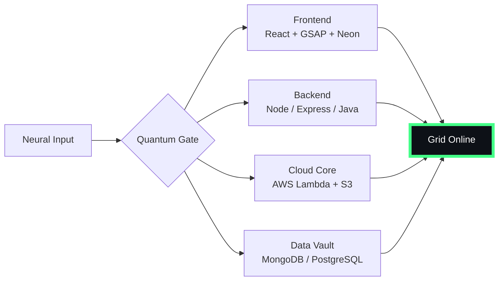

# 🌌 [ NEURAL CORE ACCESS: PENDEMVAMSI ]

<p align="center">
  
</p>

<div align="center">
  
  <br><small>Active Protocol: <strong style="color:#44FF88">PREDATOR CLOAK</strong> 👽🌫️</small>
</div>

## 🔵 NEURAL STATUS READOUT
```text
SUBJECT ID    →  PENDEMVAMSI
ENTITY CLASS  →  SHADOW MONARCH v9
NEURAL RANK   →  B-TIER
GRID SYNC     →  287/15058 QUANTUM PACKETS
─────── BIO-METRICS (PREDATOR CLOAK) ───────
STRENGTH      149  ███████████████████░░
AGILITY       128  █████████████████░░░░
INTELLIGENCE  155  ████████████████████░
VITALITY      116  ███████████████░░░░░░
```

> **NEURAL BURST ACQUIRED:** +97 QUANTUM PACKETS 
> **SYSTEM MESSAGE:** HOLOGRAPHIC MASK ENGAGED — IDENTITY ERASED

---

## 🌀 GRID ARCHITECTURE (HOLOGRAPHIC RENDER)



---

## 📡 ACADEMIC NODES – CONQUERED
- [x] B.Tech Neural Engineering (2020–2024) – St. Ann’s Grid
- [x] Intermediate Quantum Core (2018–2020) – Sri Medhavi
- [x] SSC Primary Link (2017–2018) – Sri Geethanjali

---

## ⚡ SKILL NEURAL MATRIX

<details open>
<summary>🔌 ACTIVE NEURAL LINKS</summary>

| Node               | Tier | Integrity Bar                | Status      |
|--------------------|------|------------------------------|-------------|
| Java Core          | S    | ████████████████████ 100%   | OVERCLOCKED |
| Node.js Grid       | S    | ████████████████████ 100%   | OVERCLOCKED |
| React Holo-UI      | A+   | █████████████████░░░ 92%    | ONLINE      |
| AWS Quantum Relay  | S    | ████████████████████ 100%   | SOVEREIGN   |
| Python AI Kernel   | A    | ████████████████░░░░ 85%    | CHARGING    |
| DSA Void Algorithm | A    | █████████████████░░░ 90%    | ACTIVE      |

</details>

---

## 🏅 NEURAL ACHIEVEMENT TOKENS

<p align="center">
  
  
  
  
</p>

---

## 👾 SHADOW ENTITIES – SUMMONED

<p align="center">
  
  <br><strong style="color:#44FF88">ARISE.</strong>
</p>

| Entity | Designation   | Class            | Source Node                     |
|--------|---------------|------------------|---------------------------------|
| SH-01  | Igris         | Void Commander   | AI Financial Oracle             |
| SH-02  | Beru          | Swarm Overlord   | WebRTC Quantum Stream           |
| SH-03  | Kaisel        | Void Wyrm        | Geolocation Shadow Relay        |
| SH-04  | Tusk          | Arcane Construct | Global Pandemic Sentinel        |
| SH-05  | Iron          | Armored Bastion  | React Crypto Fortress           |

---

## 📡 GRID ANALYTICS (LIVE FEED)

<p align="center">
  
  <br>
  
  
</p>

---

## 🖥️ CORRUPTED MAINFRAME LOG (401 ENTRIES)

<details>
<summary>OPEN TERMINAL FEED – PROTOCOL: PREDATOR CLOAK</summary>

> [0x7BB89393] 👽🌫️ **PREDATOR CLOAK PROTOCOL** #0 | NEURAL LINK STABILIZED | [TRANSMISSION SUCCESS]
> [0x6F0FC658] 👽🌫️ **PREDATOR CLOAK PROTOCOL** #1 | NEURAL LINK STABILIZED | [TRANSMISSION SUCCESS]
> [0x757CA6E2] 👽🌫️ **PREDATOR CLOAK PROTOCOL** #2 | NEURAL LINK STABILIZED | [TRANSMISSION SUCCESS]
> [0x8C1F2953] 👽🌫️ **PREDATOR CLOAK PROTOCOL** #3 | NEURAL LINK  [GLITCH DETECTED] STABILIZED | [TRANSMISSION SUCCESS]
> [0x705FFC38] 👽🌫️ **PREDATOR CLOAK PROTOCOL** #4 | NEURAL LINK STABILIZED | [TRANSMISSION SUCCESS]
> [0x0FAE2C2F] 👽🌫️ **PREDATOR CLOAK PROTOCOL** #5 | NEURAL LINK STABILIZED | [TRANSMISSION SUCCESS]
> [0xE87EA08D] 👽🌫️ **PREDATOR CLOAK PROTOCOL** #6 | NEURAL LINK STABILIZED | [TRANSMISSION SUCCESS]
> [0xFE8DE30A] 👽🌫️ **PREDATOR CLOAK PROTOCOL** #7 | NEURAL LINK STABILIZED | [TRANSMISSION SUCCESS]
> [0xF9834676] 👽🌫️ **PREDATOR CLOAK PROTOCOL** #8 | NEURAL LINK STABILIZED | [TRANSMISSION SUCCESS]
> [0xF8895A6E] 👽🌫️ **PREDATOR CLOAK PROTOCOL** #9 | NEURAL LINK STABILIZED | [TRANSMISSION SUCCESS]
> [0xA49425CF] 👽🌫️ **PREDATOR CLOAK PROTOCOL** #10 | NEURAL LINK STABILIZED | [TRANSMISSION SUCCESS]
> [0xD7BF1CFC] 👽🌫️ **PREDATOR CLOAK PROTOCOL** #11 | NEURAL LINK STABILIZED | [TRANSMISSION SUCCESS]
> [0x0BAA150E] 👽🌫️ **PREDATOR CLOAK PROTOCOL** #12 | NEURAL LINK STABILIZED | [TRANSMISSION SUCCESS]
> [0xE7458445] 👽🌫️ **PREDATOR CLOAK PROTOCOL** #13 | NEURAL LINK STABILIZED | [TRANSMISSION SUCCESS]
> [0xC310D6E1] 👽🌫️ **PREDATOR CLOAK PROTOCOL** #14 | NEURAL LINK STABILIZED | [TRANSMISSION SUCCESS]
> [0x57F04EA4] 👽🌫️ **PREDATOR CLOAK PROTOCOL** #15 | NEURAL LINK  [GLITCH DETECTED] STABILIZED | [TRANSMISSION SUCCESS]
> [0xA0C71E15] 👽🌫️ **PREDATOR CLOAK PROTOCOL** #16 | NEURAL LINK STABILIZED | [TRANSMISSION SUCCESS]
> [0x48DA8DB4] 👽🌫️ **PREDATOR CLOAK PROTOCOL** #17 | NEURAL LINK STABILIZED | [TRANSMISSION SUCCESS]
> [0xDF27A64D] 👽🌫️ **PREDATOR CLOAK PROTOCOL** #18 | NEURAL LINK STABILIZED | [TRANSMISSION SUCCESS]
> [0xBDF82E2C] 👽🌫️ **PREDATOR CLOAK PROTOCOL** #19 | NEURAL LINK  [GLITCH DETECTED] STABILIZED | [TRANSMISSION SUCCESS]
> [0x7424BE58] 👽🌫️ **PREDATOR CLOAK PROTOCOL** #20 | NEURAL LINK STABILIZED | [TRANSMISSION SUCCESS]
> [0x5862C6A6] 👽🌫️ **PREDATOR CLOAK PROTOCOL** #21 | NEURAL LINK STABILIZED | [TRANSMISSION SUCCESS]
> [0x32FCDE77] 👽🌫️ **PREDATOR CLOAK PROTOCOL** #22 | NEURAL LINK STABILIZED | [TRANSMISSION SUCCESS]
> [0x86882D27] 👽🌫️ **PREDATOR CLOAK PROTOCOL** #23 | NEURAL LINK STABILIZED | [TRANSMISSION SUCCESS]
> [0x977DD6C7] 👽🌫️ **PREDATOR CLOAK PROTOCOL** #24 | NEURAL LINK STABILIZED | [TRANSMISSION SUCCESS]
> [0x0314423D] 👽🌫️ **PREDATOR CLOAK PROTOCOL** #25 | NEURAL LINK STABILIZED | [TRANSMISSION SUCCESS]
> [0xCD9B4B4C] 👽🌫️ **PREDATOR CLOAK PROTOCOL** #26 | NEURAL LINK  [GLITCH DETECTED] STABILIZED | [TRANSMISSION SUCCESS]
> [0x5F21A8F0] 👽🌫️ **PREDATOR CLOAK PROTOCOL** #27 | NEURAL LINK STABILIZED | [TRANSMISSION SUCCESS]
> [0x44F7A64B] 👽🌫️ **PREDATOR CLOAK PROTOCOL** #28 | NEURAL LINK STABILIZED | [TRANSMISSION SUCCESS]
> [0xC209BFE9] 👽🌫️ **PREDATOR CLOAK PROTOCOL** #29 | NEURAL LINK STABILIZED | [TRANSMISSION SUCCESS]
> [0x1CFD49DB] 👽🌫️ **PREDATOR CLOAK PROTOCOL** #30 | NEURAL LINK STABILIZED | [TRANSMISSION SUCCESS]
> [0x487D3F26] 👽🌫️ **PREDATOR CLOAK PROTOCOL** #31 | NEURAL LINK STABILIZED | [TRANSMISSION SUCCESS]
> [0x9434E6CE] 👽🌫️ **PREDATOR CLOAK PROTOCOL** #32 | NEURAL LINK STABILIZED | [TRANSMISSION SUCCESS]
> [0x6C152EFD] 👽🌫️ **PREDATOR CLOAK PROTOCOL** #33 | NEURAL LINK STABILIZED | [TRANSMISSION SUCCESS]
> [0x7CD7A11D] 👽🌫️ **PREDATOR CLOAK PROTOCOL** #34 | NEURAL LINK STABILIZED | [TRANSMISSION SUCCESS]
> [0x40844256] 👽🌫️ **PREDATOR CLOAK PROTOCOL** #35 | NEURAL LINK STABILIZED | [TRANSMISSION SUCCESS]
> [0xEAF14B88] 👽🌫️ **PREDATOR CLOAK PROTOCOL** #36 | NEURAL LINK STABILIZED | [TRANSMISSION SUCCESS]
> [0x0200B36B] 👽🌫️ **PREDATOR CLOAK PROTOCOL** #37 | NEURAL LINK STABILIZED | [TRANSMISSION SUCCESS]
> [0xD7DB3F61] 👽🌫️ **PREDATOR CLOAK PROTOCOL** #38 | NEURAL LINK STABILIZED | [TRANSMISSION SUCCESS]
> [0x31A6CEE1] 👽🌫️ **PREDATOR CLOAK PROTOCOL** #39 | NEURAL LINK STABILIZED | [TRANSMISSION SUCCESS]
> [0x13C4D51D] 👽🌫️ **PREDATOR CLOAK PROTOCOL** #40 | NEURAL LINK STABILIZED | [TRANSMISSION SUCCESS]
> [0x31E4F008] 👽🌫️ **PREDATOR CLOAK PROTOCOL** #41 | NEURAL LINK STABILIZED | [TRANSMISSION SUCCESS]
> [0xB42C33C7] 👽🌫️ **PREDATOR CLOAK PROTOCOL** #42 | NEURAL LINK STABILIZED | [TRANSMISSION SUCCESS]
> [0xBB784189] 👽🌫️ **PREDATOR CLOAK PROTOCOL** #43 | NEURAL LINK STABILIZED | [TRANSMISSION SUCCESS]
> [0x2CBB771A] 👽🌫️ **PREDATOR CLOAK PROTOCOL** #44 | NEURAL LINK  [GLITCH DETECTED] STABILIZED | [TRANSMISSION SUCCESS]
> [0xEBB3865D] 👽🌫️ **PREDATOR CLOAK PROTOCOL** #45 | NEURAL LINK  [GLITCH DETECTED] STABILIZED | [TRANSMISSION SUCCESS]
> [0xD23597BA] 👽🌫️ **PREDATOR CLOAK PROTOCOL** #46 | NEURAL LINK STABILIZED | [TRANSMISSION SUCCESS]
> [0x60500728] 👽🌫️ **PREDATOR CLOAK PROTOCOL** #47 | NEURAL LINK STABILIZED | [TRANSMISSION SUCCESS]
> [0xB41EEC99] 👽🌫️ **PREDATOR CLOAK PROTOCOL** #48 | NEURAL LINK  [GLITCH DETECTED] STABILIZED | [TRANSMISSION SUCCESS]
> [0x4B77D035] 👽🌫️ **PREDATOR CLOAK PROTOCOL** #49 | NEURAL LINK STABILIZED | [TRANSMISSION SUCCESS]
> [0xD0D6FB45] 👽🌫️ **PREDATOR CLOAK PROTOCOL** #50 | NEURAL LINK STABILIZED | [TRANSMISSION SUCCESS]
> [0x99218820] 👽🌫️ **PREDATOR CLOAK PROTOCOL** #51 | NEURAL LINK  [GLITCH DETECTED] STABILIZED | [TRANSMISSION SUCCESS]
> [0x00E11CC2] 👽🌫️ **PREDATOR CLOAK PROTOCOL** #52 | NEURAL LINK STABILIZED | [TRANSMISSION SUCCESS]
> [0x88BE050E] 👽🌫️ **PREDATOR CLOAK PROTOCOL** #53 | NEURAL LINK STABILIZED | [TRANSMISSION SUCCESS]
> [0x72FAEC96] 👽🌫️ **PREDATOR CLOAK PROTOCOL** #54 | NEURAL LINK STABILIZED | [TRANSMISSION SUCCESS]
> [0x3AB3EEE2] 👽🌫️ **PREDATOR CLOAK PROTOCOL** #55 | NEURAL LINK  [GLITCH DETECTED] STABILIZED | [TRANSMISSION SUCCESS]
> [0xD03E0867] 👽🌫️ **PREDATOR CLOAK PROTOCOL** #56 | NEURAL LINK STABILIZED | [TRANSMISSION SUCCESS]
> [0x0B25F0E3] 👽🌫️ **PREDATOR CLOAK PROTOCOL** #57 | NEURAL LINK  [GLITCH DETECTED] STABILIZED | [TRANSMISSION SUCCESS]
> [0x618F2161] 👽🌫️ **PREDATOR CLOAK PROTOCOL** #58 | NEURAL LINK  [GLITCH DETECTED] STABILIZED | [TRANSMISSION SUCCESS]
> [0x49898B90] 👽🌫️ **PREDATOR CLOAK PROTOCOL** #59 | NEURAL LINK STABILIZED | [TRANSMISSION SUCCESS]
> [0xCB14CD82] 👽🌫️ **PREDATOR CLOAK PROTOCOL** #60 | NEURAL LINK  [GLITCH DETECTED] STABILIZED | [TRANSMISSION SUCCESS]
> [0xBBCA2B00] 👽🌫️ **PREDATOR CLOAK PROTOCOL** #61 | NEURAL LINK STABILIZED | [TRANSMISSION SUCCESS]
> [0xF1FCCE13] 👽🌫️ **PREDATOR CLOAK PROTOCOL** #62 | NEURAL LINK STABILIZED | [TRANSMISSION SUCCESS]
> [0xDBA3EB22] 👽🌫️ **PREDATOR CLOAK PROTOCOL** #63 | NEURAL LINK STABILIZED | [TRANSMISSION SUCCESS]
> [0xCE8A5185] 👽🌫️ **PREDATOR CLOAK PROTOCOL** #64 | NEURAL LINK STABILIZED | [TRANSMISSION SUCCESS]
> [0x52E26867] 👽🌫️ **PREDATOR CLOAK PROTOCOL** #65 | NEURAL LINK  [GLITCH DETECTED] STABILIZED | [TRANSMISSION SUCCESS]
> [0xED471696] 👽🌫️ **PREDATOR CLOAK PROTOCOL** #66 | NEURAL LINK STABILIZED | [TRANSMISSION SUCCESS]
> [0x0F21E188] 👽🌫️ **PREDATOR CLOAK PROTOCOL** #67 | NEURAL LINK STABILIZED | [TRANSMISSION SUCCESS]
> [0xF0ED35B9] 👽🌫️ **PREDATOR CLOAK PROTOCOL** #68 | NEURAL LINK STABILIZED | [TRANSMISSION SUCCESS]
> [0x9A7D820B] 👽🌫️ **PREDATOR CLOAK PROTOCOL** #69 | NEURAL LINK STABILIZED | [TRANSMISSION SUCCESS]
> [0xD863CBC0] 👽🌫️ **PREDATOR CLOAK PROTOCOL** #70 | NEURAL LINK STABILIZED | [TRANSMISSION SUCCESS]
> [0xEFBD2D57] 👽🌫️ **PREDATOR CLOAK PROTOCOL** #71 | NEURAL LINK STABILIZED | [TRANSMISSION SUCCESS]
> [0x06B91799] 👽🌫️ **PREDATOR CLOAK PROTOCOL** #72 | NEURAL LINK STABILIZED | [TRANSMISSION SUCCESS]
> [0xFBB17F23] 👽🌫️ **PREDATOR CLOAK PROTOCOL** #73 | NEURAL LINK  [GLITCH DETECTED] STABILIZED | [TRANSMISSION SUCCESS]
> [0x36901866] 👽🌫️ **PREDATOR CLOAK PROTOCOL** #74 | NEURAL LINK STABILIZED | [TRANSMISSION SUCCESS]
> [0xDE366B74] 👽🌫️ **PREDATOR CLOAK PROTOCOL** #75 | NEURAL LINK STABILIZED | [TRANSMISSION SUCCESS]
> [0x0FF97229] 👽🌫️ **PREDATOR CLOAK PROTOCOL** #76 | NEURAL LINK STABILIZED | [TRANSMISSION SUCCESS]
> [0x324F5776] 👽🌫️ **PREDATOR CLOAK PROTOCOL** #77 | NEURAL LINK STABILIZED | [TRANSMISSION SUCCESS]
> [0x9A6C1156] 👽🌫️ **PREDATOR CLOAK PROTOCOL** #78 | NEURAL LINK STABILIZED | [TRANSMISSION SUCCESS]
> [0x84ADC701] 👽🌫️ **PREDATOR CLOAK PROTOCOL** #79 | NEURAL LINK STABILIZED | [TRANSMISSION SUCCESS]
> [0x9805A0DE] 👽🌫️ **PREDATOR CLOAK PROTOCOL** #80 | NEURAL LINK  [GLITCH DETECTED] STABILIZED | [TRANSMISSION SUCCESS]
> [0x071F82C6] 👽🌫️ **PREDATOR CLOAK PROTOCOL** #81 | NEURAL LINK STABILIZED | [TRANSMISSION SUCCESS]
> [0xB6066DCC] 👽🌫️ **PREDATOR CLOAK PROTOCOL** #82 | NEURAL LINK STABILIZED | [TRANSMISSION SUCCESS]
> [0x46F3D3AF] 👽🌫️ **PREDATOR CLOAK PROTOCOL** #83 | NEURAL LINK STABILIZED | [TRANSMISSION SUCCESS]
> [0x191703AE] 👽🌫️ **PREDATOR CLOAK PROTOCOL** #84 | NEURAL LINK STABILIZED | [TRANSMISSION SUCCESS]
> [0x1ABEFAF6] 👽🌫️ **PREDATOR CLOAK PROTOCOL** #85 | NEURAL LINK STABILIZED | [TRANSMISSION SUCCESS]
> [0x46F44D95] 👽🌫️ **PREDATOR CLOAK PROTOCOL** #86 | NEURAL LINK  [GLITCH DETECTED] STABILIZED | [TRANSMISSION SUCCESS]
> [0xEC21668F] 👽🌫️ **PREDATOR CLOAK PROTOCOL** #87 | NEURAL LINK STABILIZED | [TRANSMISSION SUCCESS]
> [0x74355A4F] 👽🌫️ **PREDATOR CLOAK PROTOCOL** #88 | NEURAL LINK STABILIZED | [TRANSMISSION SUCCESS]
> [0x999E1252] 👽🌫️ **PREDATOR CLOAK PROTOCOL** #89 | NEURAL LINK STABILIZED | [TRANSMISSION SUCCESS]
> [0x5D57DF6D] 👽🌫️ **PREDATOR CLOAK PROTOCOL** #90 | NEURAL LINK  [GLITCH DETECTED] STABILIZED | [TRANSMISSION SUCCESS]
> [0x34CA2960] 👽🌫️ **PREDATOR CLOAK PROTOCOL** #91 | NEURAL LINK STABILIZED | [TRANSMISSION SUCCESS]
> [0x64B6E87A] 👽🌫️ **PREDATOR CLOAK PROTOCOL** #92 | NEURAL LINK  [GLITCH DETECTED] STABILIZED | [TRANSMISSION SUCCESS]
> [0xCA616690] 👽🌫️ **PREDATOR CLOAK PROTOCOL** #93 | NEURAL LINK STABILIZED | [TRANSMISSION SUCCESS]
> [0x53181A42] 👽🌫️ **PREDATOR CLOAK PROTOCOL** #94 | NEURAL LINK STABILIZED | [TRANSMISSION SUCCESS]
> [0x7B3B4148] 👽🌫️ **PREDATOR CLOAK PROTOCOL** #95 | NEURAL LINK  [GLITCH DETECTED] STABILIZED | [TRANSMISSION SUCCESS]
> [0x0E28C723] 👽🌫️ **PREDATOR CLOAK PROTOCOL** #96 | NEURAL LINK STABILIZED | [TRANSMISSION SUCCESS]
> [0x0D623357] 👽🌫️ **PREDATOR CLOAK PROTOCOL** #97 | NEURAL LINK STABILIZED | [TRANSMISSION SUCCESS]
> [0x76659654] 👽🌫️ **PREDATOR CLOAK PROTOCOL** #98 | NEURAL LINK STABILIZED | [TRANSMISSION SUCCESS]
> [0x38384B92] 👽🌫️ **PREDATOR CLOAK PROTOCOL** #99 | NEURAL LINK STABILIZED | [TRANSMISSION SUCCESS]
> [0xFD975C8B] 👽🌫️ **PREDATOR CLOAK PROTOCOL** #100 | NEURAL LINK STABILIZED | [TRANSMISSION SUCCESS]
> [0x7CAABFC5] 👽🌫️ **PREDATOR CLOAK PROTOCOL** #101 | NEURAL LINK STABILIZED | [TRANSMISSION SUCCESS]
> [0xFB525B36] 👽🌫️ **PREDATOR CLOAK PROTOCOL** #102 | NEURAL LINK STABILIZED | [TRANSMISSION SUCCESS]
> [0xCD0EBF02] 👽🌫️ **PREDATOR CLOAK PROTOCOL** #103 | NEURAL LINK STABILIZED | [TRANSMISSION SUCCESS]
> [0x8D0162D0] 👽🌫️ **PREDATOR CLOAK PROTOCOL** #104 | NEURAL LINK STABILIZED | [TRANSMISSION SUCCESS]
> [0x8426729D] 👽🌫️ **PREDATOR CLOAK PROTOCOL** #105 | NEURAL LINK STABILIZED | [TRANSMISSION SUCCESS]
> [0xCE6437FC] 👽🌫️ **PREDATOR CLOAK PROTOCOL** #106 | NEURAL LINK STABILIZED | [TRANSMISSION SUCCESS]
> [0x4F659208] 👽🌫️ **PREDATOR CLOAK PROTOCOL** #107 | NEURAL LINK STABILIZED | [TRANSMISSION SUCCESS]
> [0x91BC1D0C] 👽🌫️ **PREDATOR CLOAK PROTOCOL** #108 | NEURAL LINK STABILIZED | [TRANSMISSION SUCCESS]
> [0xA37446FA] 👽🌫️ **PREDATOR CLOAK PROTOCOL** #109 | NEURAL LINK STABILIZED | [TRANSMISSION SUCCESS]
> [0x4E75C793] 👽🌫️ **PREDATOR CLOAK PROTOCOL** #110 | NEURAL LINK  [GLITCH DETECTED] STABILIZED | [TRANSMISSION SUCCESS]
> [0xBE580A17] 👽🌫️ **PREDATOR CLOAK PROTOCOL** #111 | NEURAL LINK STABILIZED | [TRANSMISSION SUCCESS]
> [0x9108AE41] 👽🌫️ **PREDATOR CLOAK PROTOCOL** #112 | NEURAL LINK STABILIZED | [TRANSMISSION SUCCESS]
> [0x289FAFD1] 👽🌫️ **PREDATOR CLOAK PROTOCOL** #113 | NEURAL LINK STABILIZED | [TRANSMISSION SUCCESS]
> [0xCAF4C54D] 👽🌫️ **PREDATOR CLOAK PROTOCOL** #114 | NEURAL LINK STABILIZED | [TRANSMISSION SUCCESS]
> [0xC0DA9F2A] 👽🌫️ **PREDATOR CLOAK PROTOCOL** #115 | NEURAL LINK STABILIZED | [TRANSMISSION SUCCESS]
> [0x4E176DB1] 👽🌫️ **PREDATOR CLOAK PROTOCOL** #116 | NEURAL LINK STABILIZED | [TRANSMISSION SUCCESS]
> [0x29D6826C] 👽🌫️ **PREDATOR CLOAK PROTOCOL** #117 | NEURAL LINK STABILIZED | [TRANSMISSION SUCCESS]
> [0xD344EB8E] 👽🌫️ **PREDATOR CLOAK PROTOCOL** #118 | NEURAL LINK STABILIZED | [TRANSMISSION SUCCESS]
> [0x7554A538] 👽🌫️ **PREDATOR CLOAK PROTOCOL** #119 | NEURAL LINK STABILIZED | [TRANSMISSION SUCCESS]
> [0x34EA7AD7] 👽🌫️ **PREDATOR CLOAK PROTOCOL** #120 | NEURAL LINK STABILIZED | [TRANSMISSION SUCCESS]
> [0x01DDF720] 👽🌫️ **PREDATOR CLOAK PROTOCOL** #121 | NEURAL LINK STABILIZED | [TRANSMISSION SUCCESS]
> [0x623AE9C1] 👽🌫️ **PREDATOR CLOAK PROTOCOL** #122 | NEURAL LINK STABILIZED | [TRANSMISSION SUCCESS]
> [0x30493BDC] 👽🌫️ **PREDATOR CLOAK PROTOCOL** #123 | NEURAL LINK STABILIZED | [TRANSMISSION SUCCESS]
> [0x60FCAB89] 👽🌫️ **PREDATOR CLOAK PROTOCOL** #124 | NEURAL LINK STABILIZED | [TRANSMISSION SUCCESS]
> [0x34226BE5] 👽🌫️ **PREDATOR CLOAK PROTOCOL** #125 | NEURAL LINK STABILIZED | [TRANSMISSION SUCCESS]
> [0xD62794E4] 👽🌫️ **PREDATOR CLOAK PROTOCOL** #126 | NEURAL LINK STABILIZED | [TRANSMISSION SUCCESS]
> [0x9F12BE22] 👽🌫️ **PREDATOR CLOAK PROTOCOL** #127 | NEURAL LINK STABILIZED | [TRANSMISSION SUCCESS]
> [0x28089B4D] 👽🌫️ **PREDATOR CLOAK PROTOCOL** #128 | NEURAL LINK STABILIZED | [TRANSMISSION SUCCESS]
> [0x5A5B62BC] 👽🌫️ **PREDATOR CLOAK PROTOCOL** #129 | NEURAL LINK  [GLITCH DETECTED] STABILIZED | [TRANSMISSION SUCCESS]
> [0xC45808F4] 👽🌫️ **PREDATOR CLOAK PROTOCOL** #130 | NEURAL LINK STABILIZED | [TRANSMISSION SUCCESS]
> [0x6FFA5A6F] 👽🌫️ **PREDATOR CLOAK PROTOCOL** #131 | NEURAL LINK STABILIZED | [TRANSMISSION SUCCESS]
> [0x1364567E] 👽🌫️ **PREDATOR CLOAK PROTOCOL** #132 | NEURAL LINK STABILIZED | [TRANSMISSION SUCCESS]
> [0x24F40F27] 👽🌫️ **PREDATOR CLOAK PROTOCOL** #133 | NEURAL LINK  [GLITCH DETECTED] STABILIZED | [TRANSMISSION SUCCESS]
> [0x9980AAC6] 👽🌫️ **PREDATOR CLOAK PROTOCOL** #134 | NEURAL LINK STABILIZED | [TRANSMISSION SUCCESS]
> [0x11D2EFBD] 👽🌫️ **PREDATOR CLOAK PROTOCOL** #135 | NEURAL LINK STABILIZED | [TRANSMISSION SUCCESS]
> [0x6BCB1A8C] 👽🌫️ **PREDATOR CLOAK PROTOCOL** #136 | NEURAL LINK STABILIZED | [TRANSMISSION SUCCESS]
> [0x714B06B8] 👽🌫️ **PREDATOR CLOAK PROTOCOL** #137 | NEURAL LINK STABILIZED | [TRANSMISSION SUCCESS]
> [0xA0F04624] 👽🌫️ **PREDATOR CLOAK PROTOCOL** #138 | NEURAL LINK STABILIZED | [TRANSMISSION SUCCESS]
> [0xEA20BC5D] 👽🌫️ **PREDATOR CLOAK PROTOCOL** #139 | NEURAL LINK STABILIZED | [TRANSMISSION SUCCESS]
> [0x986CE67A] 👽🌫️ **PREDATOR CLOAK PROTOCOL** #140 | NEURAL LINK STABILIZED | [TRANSMISSION SUCCESS]
> [0x1E1AEC9A] 👽🌫️ **PREDATOR CLOAK PROTOCOL** #141 | NEURAL LINK STABILIZED | [TRANSMISSION SUCCESS]
> [0x598A20BB] 👽🌫️ **PREDATOR CLOAK PROTOCOL** #142 | NEURAL LINK STABILIZED | [TRANSMISSION SUCCESS]
> [0xF2B664CB] 👽🌫️ **PREDATOR CLOAK PROTOCOL** #143 | NEURAL LINK  [GLITCH DETECTED] STABILIZED | [TRANSMISSION SUCCESS]
> [0xB0AF656E] 👽🌫️ **PREDATOR CLOAK PROTOCOL** #144 | NEURAL LINK STABILIZED | [TRANSMISSION SUCCESS]
> [0xFED3B1F1] 👽🌫️ **PREDATOR CLOAK PROTOCOL** #145 | NEURAL LINK STABILIZED | [TRANSMISSION SUCCESS]
> [0x42CCA4C8] 👽🌫️ **PREDATOR CLOAK PROTOCOL** #146 | NEURAL LINK STABILIZED | [TRANSMISSION SUCCESS]
> [0x8AD8D36F] 👽🌫️ **PREDATOR CLOAK PROTOCOL** #147 | NEURAL LINK STABILIZED | [TRANSMISSION SUCCESS]
> [0x0C505F28] 👽🌫️ **PREDATOR CLOAK PROTOCOL** #148 | NEURAL LINK  [GLITCH DETECTED] STABILIZED | [TRANSMISSION SUCCESS]
> [0x8918E2D0] 👽🌫️ **PREDATOR CLOAK PROTOCOL** #149 | NEURAL LINK STABILIZED | [TRANSMISSION SUCCESS]
> [0x99560AC5] 👽🌫️ **PREDATOR CLOAK PROTOCOL** #150 | NEURAL LINK STABILIZED | [TRANSMISSION SUCCESS]
> [0x8EDD996B] 👽🌫️ **PREDATOR CLOAK PROTOCOL** #151 | NEURAL LINK STABILIZED | [TRANSMISSION SUCCESS]
> [0x5BFE7BF3] 👽🌫️ **PREDATOR CLOAK PROTOCOL** #152 | NEURAL LINK STABILIZED | [TRANSMISSION SUCCESS]
> [0x3F6F6DED] 👽🌫️ **PREDATOR CLOAK PROTOCOL** #153 | NEURAL LINK STABILIZED | [TRANSMISSION SUCCESS]
> [0x1698EDDE] 👽🌫️ **PREDATOR CLOAK PROTOCOL** #154 | NEURAL LINK STABILIZED | [TRANSMISSION SUCCESS]
> [0x05A6396A] 👽🌫️ **PREDATOR CLOAK PROTOCOL** #155 | NEURAL LINK STABILIZED | [TRANSMISSION SUCCESS]
> [0xABCB8F5C] 👽🌫️ **PREDATOR CLOAK PROTOCOL** #156 | NEURAL LINK STABILIZED | [TRANSMISSION SUCCESS]
> [0xE778268C] 👽🌫️ **PREDATOR CLOAK PROTOCOL** #157 | NEURAL LINK STABILIZED | [TRANSMISSION SUCCESS]
> [0xCA83261E] 👽🌫️ **PREDATOR CLOAK PROTOCOL** #158 | NEURAL LINK STABILIZED | [TRANSMISSION SUCCESS]
> [0x78C1FA28] 👽🌫️ **PREDATOR CLOAK PROTOCOL** #159 | NEURAL LINK  [GLITCH DETECTED] STABILIZED | [TRANSMISSION SUCCESS]
> [0x674E55F6] 👽🌫️ **PREDATOR CLOAK PROTOCOL** #160 | NEURAL LINK STABILIZED | [TRANSMISSION SUCCESS]
> [0xE8ECFE42] 👽🌫️ **PREDATOR CLOAK PROTOCOL** #161 | NEURAL LINK STABILIZED | [TRANSMISSION SUCCESS]
> [0x508F37CB] 👽🌫️ **PREDATOR CLOAK PROTOCOL** #162 | NEURAL LINK STABILIZED | [TRANSMISSION SUCCESS]
> [0xB22FC155] 👽🌫️ **PREDATOR CLOAK PROTOCOL** #163 | NEURAL LINK STABILIZED | [TRANSMISSION SUCCESS]
> [0x75F39971] 👽🌫️ **PREDATOR CLOAK PROTOCOL** #164 | NEURAL LINK STABILIZED | [TRANSMISSION SUCCESS]
> [0x01E027E5] 👽🌫️ **PREDATOR CLOAK PROTOCOL** #165 | NEURAL LINK STABILIZED | [TRANSMISSION SUCCESS]
> [0x95BC4634] 👽🌫️ **PREDATOR CLOAK PROTOCOL** #166 | NEURAL LINK STABILIZED | [TRANSMISSION SUCCESS]
> [0x21873A4A] 👽🌫️ **PREDATOR CLOAK PROTOCOL** #167 | NEURAL LINK STABILIZED | [TRANSMISSION SUCCESS]
> [0x4A11F1C4] 👽🌫️ **PREDATOR CLOAK PROTOCOL** #168 | NEURAL LINK STABILIZED | [TRANSMISSION SUCCESS]
> [0x8A807DBB] 👽🌫️ **PREDATOR CLOAK PROTOCOL** #169 | NEURAL LINK STABILIZED | [TRANSMISSION SUCCESS]
> [0x4802A353] 👽🌫️ **PREDATOR CLOAK PROTOCOL** #170 | NEURAL LINK STABILIZED | [TRANSMISSION SUCCESS]
> [0x9BD574AC] 👽🌫️ **PREDATOR CLOAK PROTOCOL** #171 | NEURAL LINK STABILIZED | [TRANSMISSION SUCCESS]
> [0x428660E0] 👽🌫️ **PREDATOR CLOAK PROTOCOL** #172 | NEURAL LINK STABILIZED | [TRANSMISSION SUCCESS]
> [0x7046C09A] 👽🌫️ **PREDATOR CLOAK PROTOCOL** #173 | NEURAL LINK STABILIZED | [TRANSMISSION SUCCESS]
> [0x42EAA90E] 👽🌫️ **PREDATOR CLOAK PROTOCOL** #174 | NEURAL LINK  [GLITCH DETECTED] STABILIZED | [TRANSMISSION SUCCESS]
> [0x1C046503] 👽🌫️ **PREDATOR CLOAK PROTOCOL** #175 | NEURAL LINK STABILIZED | [TRANSMISSION SUCCESS]
> [0xDF88BA9B] 👽🌫️ **PREDATOR CLOAK PROTOCOL** #176 | NEURAL LINK STABILIZED | [TRANSMISSION SUCCESS]
> [0x1D49FB4B] 👽🌫️ **PREDATOR CLOAK PROTOCOL** #177 | NEURAL LINK STABILIZED | [TRANSMISSION SUCCESS]
> [0x314C90C8] 👽🌫️ **PREDATOR CLOAK PROTOCOL** #178 | NEURAL LINK STABILIZED | [TRANSMISSION SUCCESS]
> [0x71065C51] 👽🌫️ **PREDATOR CLOAK PROTOCOL** #179 | NEURAL LINK STABILIZED | [TRANSMISSION SUCCESS]
> [0x08C1F192] 👽🌫️ **PREDATOR CLOAK PROTOCOL** #180 | NEURAL LINK STABILIZED | [TRANSMISSION SUCCESS]
> [0x3D4262D6] 👽🌫️ **PREDATOR CLOAK PROTOCOL** #181 | NEURAL LINK STABILIZED | [TRANSMISSION SUCCESS]
> [0x97F305D6] 👽🌫️ **PREDATOR CLOAK PROTOCOL** #182 | NEURAL LINK STABILIZED | [TRANSMISSION SUCCESS]
> [0x853BE454] 👽🌫️ **PREDATOR CLOAK PROTOCOL** #183 | NEURAL LINK STABILIZED | [TRANSMISSION SUCCESS]
> [0xD68B36DD] 👽🌫️ **PREDATOR CLOAK PROTOCOL** #184 | NEURAL LINK STABILIZED | [TRANSMISSION SUCCESS]
> [0x8890A854] 👽🌫️ **PREDATOR CLOAK PROTOCOL** #185 | NEURAL LINK STABILIZED | [TRANSMISSION SUCCESS]
> [0x815B10BD] 👽🌫️ **PREDATOR CLOAK PROTOCOL** #186 | NEURAL LINK STABILIZED | [TRANSMISSION SUCCESS]
> [0x7067A79E] 👽🌫️ **PREDATOR CLOAK PROTOCOL** #187 | NEURAL LINK STABILIZED | [TRANSMISSION SUCCESS]
> [0xEE029969] 👽🌫️ **PREDATOR CLOAK PROTOCOL** #188 | NEURAL LINK STABILIZED | [TRANSMISSION SUCCESS]
> [0x840C70B5] 👽🌫️ **PREDATOR CLOAK PROTOCOL** #189 | NEURAL LINK STABILIZED | [TRANSMISSION SUCCESS]
> [0xE14B4195] 👽🌫️ **PREDATOR CLOAK PROTOCOL** #190 | NEURAL LINK STABILIZED | [TRANSMISSION SUCCESS]
> [0xECE8DA9C] 👽🌫️ **PREDATOR CLOAK PROTOCOL** #191 | NEURAL LINK STABILIZED | [TRANSMISSION SUCCESS]
> [0x6DEDC945] 👽🌫️ **PREDATOR CLOAK PROTOCOL** #192 | NEURAL LINK STABILIZED | [TRANSMISSION SUCCESS]
> [0x22F6C5B3] 👽🌫️ **PREDATOR CLOAK PROTOCOL** #193 | NEURAL LINK  [GLITCH DETECTED] STABILIZED | [TRANSMISSION SUCCESS]
> [0xD7F9E254] 👽🌫️ **PREDATOR CLOAK PROTOCOL** #194 | NEURAL LINK STABILIZED | [TRANSMISSION SUCCESS]
> [0x431A5D51] 👽🌫️ **PREDATOR CLOAK PROTOCOL** #195 | NEURAL LINK STABILIZED | [TRANSMISSION SUCCESS]
> [0x8C40F925] 👽🌫️ **PREDATOR CLOAK PROTOCOL** #196 | NEURAL LINK  [GLITCH DETECTED] STABILIZED | [TRANSMISSION SUCCESS]
> [0x09387CFD] 👽🌫️ **PREDATOR CLOAK PROTOCOL** #197 | NEURAL LINK STABILIZED | [TRANSMISSION SUCCESS]
> [0x42683117] 👽🌫️ **PREDATOR CLOAK PROTOCOL** #198 | NEURAL LINK STABILIZED | [TRANSMISSION SUCCESS]
> [0x9EEF5191] 👽🌫️ **PREDATOR CLOAK PROTOCOL** #199 | NEURAL LINK STABILIZED | [TRANSMISSION SUCCESS]
> [0x288E0354] 👽🌫️ **PREDATOR CLOAK PROTOCOL** #200 | NEURAL LINK STABILIZED | [TRANSMISSION SUCCESS]
> [0x5E6C3D7D] 👽🌫️ **PREDATOR CLOAK PROTOCOL** #201 | NEURAL LINK STABILIZED | [TRANSMISSION SUCCESS]
> [0x2DAE7143] 👽🌫️ **PREDATOR CLOAK PROTOCOL** #202 | NEURAL LINK STABILIZED | [TRANSMISSION SUCCESS]
> [0x1967EB3F] 👽🌫️ **PREDATOR CLOAK PROTOCOL** #203 | NEURAL LINK  [GLITCH DETECTED] STABILIZED | [TRANSMISSION SUCCESS]
> [0x3588FB8D] 👽🌫️ **PREDATOR CLOAK PROTOCOL** #204 | NEURAL LINK STABILIZED | [TRANSMISSION SUCCESS]
> [0xF4D1E40F] 👽🌫️ **PREDATOR CLOAK PROTOCOL** #205 | NEURAL LINK STABILIZED | [TRANSMISSION SUCCESS]
> [0x39DAFBE8] 👽🌫️ **PREDATOR CLOAK PROTOCOL** #206 | NEURAL LINK STABILIZED | [TRANSMISSION SUCCESS]
> [0x6F8BF8D8] 👽🌫️ **PREDATOR CLOAK PROTOCOL** #207 | NEURAL LINK STABILIZED | [TRANSMISSION SUCCESS]
> [0xBF22212A] 👽🌫️ **PREDATOR CLOAK PROTOCOL** #208 | NEURAL LINK STABILIZED | [TRANSMISSION SUCCESS]
> [0x64FEDE97] 👽🌫️ **PREDATOR CLOAK PROTOCOL** #209 | NEURAL LINK STABILIZED | [TRANSMISSION SUCCESS]
> [0x5ABA672A] 👽🌫️ **PREDATOR CLOAK PROTOCOL** #210 | NEURAL LINK STABILIZED | [TRANSMISSION SUCCESS]
> [0x4A33B530] 👽🌫️ **PREDATOR CLOAK PROTOCOL** #211 | NEURAL LINK STABILIZED | [TRANSMISSION SUCCESS]
> [0xCF94C098] 👽🌫️ **PREDATOR CLOAK PROTOCOL** #212 | NEURAL LINK STABILIZED | [TRANSMISSION SUCCESS]
> [0xB256FD51] 👽🌫️ **PREDATOR CLOAK PROTOCOL** #213 | NEURAL LINK  [GLITCH DETECTED] STABILIZED | [TRANSMISSION SUCCESS]
> [0x62485A4D] 👽🌫️ **PREDATOR CLOAK PROTOCOL** #214 | NEURAL LINK  [GLITCH DETECTED] STABILIZED | [TRANSMISSION SUCCESS]
> [0xB753CC15] 👽🌫️ **PREDATOR CLOAK PROTOCOL** #215 | NEURAL LINK STABILIZED | [TRANSMISSION SUCCESS]
> [0xDB14555D] 👽🌫️ **PREDATOR CLOAK PROTOCOL** #216 | NEURAL LINK STABILIZED | [TRANSMISSION SUCCESS]
> [0x4C7CE06B] 👽🌫️ **PREDATOR CLOAK PROTOCOL** #217 | NEURAL LINK STABILIZED | [TRANSMISSION SUCCESS]
> [0x71C2F956] 👽🌫️ **PREDATOR CLOAK PROTOCOL** #218 | NEURAL LINK STABILIZED | [TRANSMISSION SUCCESS]
> [0x75DA3E94] 👽🌫️ **PREDATOR CLOAK PROTOCOL** #219 | NEURAL LINK STABILIZED | [TRANSMISSION SUCCESS]
> [0x3D5B178D] 👽🌫️ **PREDATOR CLOAK PROTOCOL** #220 | NEURAL LINK STABILIZED | [TRANSMISSION SUCCESS]
> [0x78E7B64C] 👽🌫️ **PREDATOR CLOAK PROTOCOL** #221 | NEURAL LINK STABILIZED | [TRANSMISSION SUCCESS]
> [0x31299C5B] 👽🌫️ **PREDATOR CLOAK PROTOCOL** #222 | NEURAL LINK STABILIZED | [TRANSMISSION SUCCESS]
> [0xDD6F70BD] 👽🌫️ **PREDATOR CLOAK PROTOCOL** #223 | NEURAL LINK STABILIZED | [TRANSMISSION SUCCESS]
> [0x48135394] 👽🌫️ **PREDATOR CLOAK PROTOCOL** #224 | NEURAL LINK STABILIZED | [TRANSMISSION SUCCESS]
> [0xCEA7867B] 👽🌫️ **PREDATOR CLOAK PROTOCOL** #225 | NEURAL LINK STABILIZED | [TRANSMISSION SUCCESS]
> [0xBEE8D6E2] 👽🌫️ **PREDATOR CLOAK PROTOCOL** #226 | NEURAL LINK STABILIZED | [TRANSMISSION SUCCESS]
> [0x1B6A0C52] 👽🌫️ **PREDATOR CLOAK PROTOCOL** #227 | NEURAL LINK STABILIZED | [TRANSMISSION SUCCESS]
> [0xA667633C] 👽🌫️ **PREDATOR CLOAK PROTOCOL** #228 | NEURAL LINK STABILIZED | [TRANSMISSION SUCCESS]
> [0xE39F8074] 👽🌫️ **PREDATOR CLOAK PROTOCOL** #229 | NEURAL LINK STABILIZED | [TRANSMISSION SUCCESS]
> [0x606AECAB] 👽🌫️ **PREDATOR CLOAK PROTOCOL** #230 | NEURAL LINK STABILIZED | [TRANSMISSION SUCCESS]
> [0xCEE47F0A] 👽🌫️ **PREDATOR CLOAK PROTOCOL** #231 | NEURAL LINK STABILIZED | [TRANSMISSION SUCCESS]
> [0xC922AE7C] 👽🌫️ **PREDATOR CLOAK PROTOCOL** #232 | NEURAL LINK STABILIZED | [TRANSMISSION SUCCESS]
> [0x838EB733] 👽🌫️ **PREDATOR CLOAK PROTOCOL** #233 | NEURAL LINK STABILIZED | [TRANSMISSION SUCCESS]
> [0xC5E07327] 👽🌫️ **PREDATOR CLOAK PROTOCOL** #234 | NEURAL LINK STABILIZED | [TRANSMISSION SUCCESS]
> [0xDEE41DAE] 👽🌫️ **PREDATOR CLOAK PROTOCOL** #235 | NEURAL LINK STABILIZED | [TRANSMISSION SUCCESS]
> [0x326CAD9E] 👽🌫️ **PREDATOR CLOAK PROTOCOL** #236 | NEURAL LINK STABILIZED | [TRANSMISSION SUCCESS]
> [0xE0637987] 👽🌫️ **PREDATOR CLOAK PROTOCOL** #237 | NEURAL LINK STABILIZED | [TRANSMISSION SUCCESS]
> [0x5D2BA4D3] 👽🌫️ **PREDATOR CLOAK PROTOCOL** #238 | NEURAL LINK  [GLITCH DETECTED] STABILIZED | [TRANSMISSION SUCCESS]
> [0x043CAB5E] 👽🌫️ **PREDATOR CLOAK PROTOCOL** #239 | NEURAL LINK STABILIZED | [TRANSMISSION SUCCESS]
> [0xE1EEEE8F] 👽🌫️ **PREDATOR CLOAK PROTOCOL** #240 | NEURAL LINK STABILIZED | [TRANSMISSION SUCCESS]
> [0x0439D0CE] 👽🌫️ **PREDATOR CLOAK PROTOCOL** #241 | NEURAL LINK STABILIZED | [TRANSMISSION SUCCESS]
> [0xE31416A1] 👽🌫️ **PREDATOR CLOAK PROTOCOL** #242 | NEURAL LINK STABILIZED | [TRANSMISSION SUCCESS]
> [0x2B19249A] 👽🌫️ **PREDATOR CLOAK PROTOCOL** #243 | NEURAL LINK  [GLITCH DETECTED] STABILIZED | [TRANSMISSION SUCCESS]
> [0xBEE1DACC] 👽🌫️ **PREDATOR CLOAK PROTOCOL** #244 | NEURAL LINK STABILIZED | [TRANSMISSION SUCCESS]
> [0xA26A2A01] 👽🌫️ **PREDATOR CLOAK PROTOCOL** #245 | NEURAL LINK STABILIZED | [TRANSMISSION SUCCESS]
> [0x66E0B6BA] 👽🌫️ **PREDATOR CLOAK PROTOCOL** #246 | NEURAL LINK STABILIZED | [TRANSMISSION SUCCESS]
> [0x1174C768] 👽🌫️ **PREDATOR CLOAK PROTOCOL** #247 | NEURAL LINK  [GLITCH DETECTED] STABILIZED | [TRANSMISSION SUCCESS]
> [0x70E6CD21] 👽🌫️ **PREDATOR CLOAK PROTOCOL** #248 | NEURAL LINK  [GLITCH DETECTED] STABILIZED | [TRANSMISSION SUCCESS]
> [0x3C1C0348] 👽🌫️ **PREDATOR CLOAK PROTOCOL** #249 | NEURAL LINK STABILIZED | [TRANSMISSION SUCCESS]
> [0x389650EF] 👽🌫️ **PREDATOR CLOAK PROTOCOL** #250 | NEURAL LINK STABILIZED | [TRANSMISSION SUCCESS]
> [0x2700F085] 👽🌫️ **PREDATOR CLOAK PROTOCOL** #251 | NEURAL LINK STABILIZED | [TRANSMISSION SUCCESS]
> [0x94F0367C] 👽🌫️ **PREDATOR CLOAK PROTOCOL** #252 | NEURAL LINK STABILIZED | [TRANSMISSION SUCCESS]
> [0x90E73B25] 👽🌫️ **PREDATOR CLOAK PROTOCOL** #253 | NEURAL LINK STABILIZED | [TRANSMISSION SUCCESS]
> [0x1AC1D7F4] 👽🌫️ **PREDATOR CLOAK PROTOCOL** #254 | NEURAL LINK STABILIZED | [TRANSMISSION SUCCESS]
> [0x60E536DC] 👽🌫️ **PREDATOR CLOAK PROTOCOL** #255 | NEURAL LINK STABILIZED | [TRANSMISSION SUCCESS]
> [0xE2511FE3] 👽🌫️ **PREDATOR CLOAK PROTOCOL** #256 | NEURAL LINK STABILIZED | [TRANSMISSION SUCCESS]
> [0xEEC0B308] 👽🌫️ **PREDATOR CLOAK PROTOCOL** #257 | NEURAL LINK STABILIZED | [TRANSMISSION SUCCESS]
> [0x0D30A31D] 👽🌫️ **PREDATOR CLOAK PROTOCOL** #258 | NEURAL LINK STABILIZED | [TRANSMISSION SUCCESS]
> [0xB1B319E1] 👽🌫️ **PREDATOR CLOAK PROTOCOL** #259 | NEURAL LINK STABILIZED | [TRANSMISSION SUCCESS]
> [0xCEBC6EDC] 👽🌫️ **PREDATOR CLOAK PROTOCOL** #260 | NEURAL LINK STABILIZED | [TRANSMISSION SUCCESS]
> [0xEB1EBC0F] 👽🌫️ **PREDATOR CLOAK PROTOCOL** #261 | NEURAL LINK STABILIZED | [TRANSMISSION SUCCESS]
> [0x3E8D99A4] 👽🌫️ **PREDATOR CLOAK PROTOCOL** #262 | NEURAL LINK  [GLITCH DETECTED] STABILIZED | [TRANSMISSION SUCCESS]
> [0x7C243959] 👽🌫️ **PREDATOR CLOAK PROTOCOL** #263 | NEURAL LINK STABILIZED | [TRANSMISSION SUCCESS]
> [0x4D0B984C] 👽🌫️ **PREDATOR CLOAK PROTOCOL** #264 | NEURAL LINK STABILIZED | [TRANSMISSION SUCCESS]
> [0x2EA749F9] 👽🌫️ **PREDATOR CLOAK PROTOCOL** #265 | NEURAL LINK STABILIZED | [TRANSMISSION SUCCESS]
> [0x3E6936E9] 👽🌫️ **PREDATOR CLOAK PROTOCOL** #266 | NEURAL LINK STABILIZED | [TRANSMISSION SUCCESS]
> [0x0F03B040] 👽🌫️ **PREDATOR CLOAK PROTOCOL** #267 | NEURAL LINK STABILIZED | [TRANSMISSION SUCCESS]
> [0xFF9BF5C0] 👽🌫️ **PREDATOR CLOAK PROTOCOL** #268 | NEURAL LINK STABILIZED | [TRANSMISSION SUCCESS]
> [0x9E620643] 👽🌫️ **PREDATOR CLOAK PROTOCOL** #269 | NEURAL LINK STABILIZED | [TRANSMISSION SUCCESS]
> [0x9605B147] 👽🌫️ **PREDATOR CLOAK PROTOCOL** #270 | NEURAL LINK STABILIZED | [TRANSMISSION SUCCESS]
> [0x140BED56] 👽🌫️ **PREDATOR CLOAK PROTOCOL** #271 | NEURAL LINK STABILIZED | [TRANSMISSION SUCCESS]
> [0x47384FD5] 👽🌫️ **PREDATOR CLOAK PROTOCOL** #272 | NEURAL LINK STABILIZED | [TRANSMISSION SUCCESS]
> [0x3672AF65] 👽🌫️ **PREDATOR CLOAK PROTOCOL** #273 | NEURAL LINK STABILIZED | [TRANSMISSION SUCCESS]
> [0xA978B302] 👽🌫️ **PREDATOR CLOAK PROTOCOL** #274 | NEURAL LINK STABILIZED | [TRANSMISSION SUCCESS]
> [0x030E28D1] 👽🌫️ **PREDATOR CLOAK PROTOCOL** #275 | NEURAL LINK STABILIZED | [TRANSMISSION SUCCESS]
> [0x0DD26B93] 👽🌫️ **PREDATOR CLOAK PROTOCOL** #276 | NEURAL LINK STABILIZED | [TRANSMISSION SUCCESS]
> [0x176BEEE0] 👽🌫️ **PREDATOR CLOAK PROTOCOL** #277 | NEURAL LINK STABILIZED | [TRANSMISSION SUCCESS]
> [0x60A39013] 👽🌫️ **PREDATOR CLOAK PROTOCOL** #278 | NEURAL LINK STABILIZED | [TRANSMISSION SUCCESS]
> [0xA5AB710B] 👽🌫️ **PREDATOR CLOAK PROTOCOL** #279 | NEURAL LINK  [GLITCH DETECTED] STABILIZED | [TRANSMISSION SUCCESS]
> [0xA3A883C6] 👽🌫️ **PREDATOR CLOAK PROTOCOL** #280 | NEURAL LINK STABILIZED | [TRANSMISSION SUCCESS]
> [0xE78C8FBA] 👽🌫️ **PREDATOR CLOAK PROTOCOL** #281 | NEURAL LINK STABILIZED | [TRANSMISSION SUCCESS]
> [0x3A91112D] 👽🌫️ **PREDATOR CLOAK PROTOCOL** #282 | NEURAL LINK STABILIZED | [TRANSMISSION SUCCESS]
> [0x687BE536] 👽🌫️ **PREDATOR CLOAK PROTOCOL** #283 | NEURAL LINK STABILIZED | [TRANSMISSION SUCCESS]
> [0x7848491E] 👽🌫️ **PREDATOR CLOAK PROTOCOL** #284 | NEURAL LINK STABILIZED | [TRANSMISSION SUCCESS]
> [0xC7C99332] 👽🌫️ **PREDATOR CLOAK PROTOCOL** #285 | NEURAL LINK STABILIZED | [TRANSMISSION SUCCESS]
> [0x0A13C110] 👽🌫️ **PREDATOR CLOAK PROTOCOL** #286 | NEURAL LINK STABILIZED | [TRANSMISSION SUCCESS]
> [0xB69B284F] 👽🌫️ **PREDATOR CLOAK PROTOCOL** #287 | NEURAL LINK STABILIZED | [TRANSMISSION SUCCESS]
> [0xCE7362BC] 👽🌫️ **PREDATOR CLOAK PROTOCOL** #288 | NEURAL LINK STABILIZED | [TRANSMISSION SUCCESS]
> [0x27E145F1] 👽🌫️ **PREDATOR CLOAK PROTOCOL** #289 | NEURAL LINK  [GLITCH DETECTED] STABILIZED | [TRANSMISSION SUCCESS]
> [0xD0E5AE3C] 👽🌫️ **PREDATOR CLOAK PROTOCOL** #290 | NEURAL LINK STABILIZED | [TRANSMISSION SUCCESS]
> [0x4E62A334] 👽🌫️ **PREDATOR CLOAK PROTOCOL** #291 | NEURAL LINK STABILIZED | [TRANSMISSION SUCCESS]
> [0x023059B2] 👽🌫️ **PREDATOR CLOAK PROTOCOL** #292 | NEURAL LINK  [GLITCH DETECTED] STABILIZED | [TRANSMISSION SUCCESS]
> [0xF5B02E17] 👽🌫️ **PREDATOR CLOAK PROTOCOL** #293 | NEURAL LINK STABILIZED | [TRANSMISSION SUCCESS]
> [0x305989FC] 👽🌫️ **PREDATOR CLOAK PROTOCOL** #294 | NEURAL LINK STABILIZED | [TRANSMISSION SUCCESS]
> [0xC321788F] 👽🌫️ **PREDATOR CLOAK PROTOCOL** #295 | NEURAL LINK STABILIZED | [TRANSMISSION SUCCESS]
> [0x1185ABFD] 👽🌫️ **PREDATOR CLOAK PROTOCOL** #296 | NEURAL LINK STABILIZED | [TRANSMISSION SUCCESS]
> [0x1710D8A5] 👽🌫️ **PREDATOR CLOAK PROTOCOL** #297 | NEURAL LINK  [GLITCH DETECTED] STABILIZED | [TRANSMISSION SUCCESS]
> [0x5B332F70] 👽🌫️ **PREDATOR CLOAK PROTOCOL** #298 | NEURAL LINK STABILIZED | [TRANSMISSION SUCCESS]
> [0xFA8A7F84] 👽🌫️ **PREDATOR CLOAK PROTOCOL** #299 | NEURAL LINK STABILIZED | [TRANSMISSION SUCCESS]
> [0x12124CF9] 👽🌫️ **PREDATOR CLOAK PROTOCOL** #300 | NEURAL LINK STABILIZED | [TRANSMISSION SUCCESS]
> [0x3BE545F8] 👽🌫️ **PREDATOR CLOAK PROTOCOL** #301 | NEURAL LINK STABILIZED | [TRANSMISSION SUCCESS]
> [0xD32A6BFD] 👽🌫️ **PREDATOR CLOAK PROTOCOL** #302 | NEURAL LINK STABILIZED | [TRANSMISSION SUCCESS]
> [0x32F36A7F] 👽🌫️ **PREDATOR CLOAK PROTOCOL** #303 | NEURAL LINK  [GLITCH DETECTED] STABILIZED | [TRANSMISSION SUCCESS]
> [0xC2FA9A25] 👽🌫️ **PREDATOR CLOAK PROTOCOL** #304 | NEURAL LINK STABILIZED | [TRANSMISSION SUCCESS]
> [0xE2CF39C2] 👽🌫️ **PREDATOR CLOAK PROTOCOL** #305 | NEURAL LINK STABILIZED | [TRANSMISSION SUCCESS]
> [0xD501D2EE] 👽🌫️ **PREDATOR CLOAK PROTOCOL** #306 | NEURAL LINK STABILIZED | [TRANSMISSION SUCCESS]
> [0xD9A7E6B5] 👽🌫️ **PREDATOR CLOAK PROTOCOL** #307 | NEURAL LINK STABILIZED | [TRANSMISSION SUCCESS]
> [0x44F4295B] 👽🌫️ **PREDATOR CLOAK PROTOCOL** #308 | NEURAL LINK STABILIZED | [TRANSMISSION SUCCESS]
> [0x26F3B29A] 👽🌫️ **PREDATOR CLOAK PROTOCOL** #309 | NEURAL LINK STABILIZED | [TRANSMISSION SUCCESS]
> [0x4507D684] 👽🌫️ **PREDATOR CLOAK PROTOCOL** #310 | NEURAL LINK  [GLITCH DETECTED] STABILIZED | [TRANSMISSION SUCCESS]
> [0x7044CB85] 👽🌫️ **PREDATOR CLOAK PROTOCOL** #311 | NEURAL LINK STABILIZED | [TRANSMISSION SUCCESS]
> [0x873779CB] 👽🌫️ **PREDATOR CLOAK PROTOCOL** #312 | NEURAL LINK STABILIZED | [TRANSMISSION SUCCESS]
> [0xCFD85065] 👽🌫️ **PREDATOR CLOAK PROTOCOL** #313 | NEURAL LINK STABILIZED | [TRANSMISSION SUCCESS]
> [0x42B6728C] 👽🌫️ **PREDATOR CLOAK PROTOCOL** #314 | NEURAL LINK STABILIZED | [TRANSMISSION SUCCESS]
> [0x4870129C] 👽🌫️ **PREDATOR CLOAK PROTOCOL** #315 | NEURAL LINK STABILIZED | [TRANSMISSION SUCCESS]
> [0x4D4F7702] 👽🌫️ **PREDATOR CLOAK PROTOCOL** #316 | NEURAL LINK STABILIZED | [TRANSMISSION SUCCESS]
> [0xC7991B21] 👽🌫️ **PREDATOR CLOAK PROTOCOL** #317 | NEURAL LINK STABILIZED | [TRANSMISSION SUCCESS]
> [0x19883CCF] 👽🌫️ **PREDATOR CLOAK PROTOCOL** #318 | NEURAL LINK STABILIZED | [TRANSMISSION SUCCESS]
> [0xE7B538A6] 👽🌫️ **PREDATOR CLOAK PROTOCOL** #319 | NEURAL LINK STABILIZED | [TRANSMISSION SUCCESS]
> [0x84B97CB0] 👽🌫️ **PREDATOR CLOAK PROTOCOL** #320 | NEURAL LINK STABILIZED | [TRANSMISSION SUCCESS]
> [0x113A2FF6] 👽🌫️ **PREDATOR CLOAK PROTOCOL** #321 | NEURAL LINK STABILIZED | [TRANSMISSION SUCCESS]
> [0x5F456C13] 👽🌫️ **PREDATOR CLOAK PROTOCOL** #322 | NEURAL LINK  [GLITCH DETECTED] STABILIZED | [TRANSMISSION SUCCESS]
> [0xED5F4E87] 👽🌫️ **PREDATOR CLOAK PROTOCOL** #323 | NEURAL LINK STABILIZED | [TRANSMISSION SUCCESS]
> [0x2461B7DB] 👽🌫️ **PREDATOR CLOAK PROTOCOL** #324 | NEURAL LINK  [GLITCH DETECTED] STABILIZED | [TRANSMISSION SUCCESS]
> [0x59DEFB07] 👽🌫️ **PREDATOR CLOAK PROTOCOL** #325 | NEURAL LINK STABILIZED | [TRANSMISSION SUCCESS]
> [0xEE275D1F] 👽🌫️ **PREDATOR CLOAK PROTOCOL** #326 | NEURAL LINK  [GLITCH DETECTED] STABILIZED | [TRANSMISSION SUCCESS]
> [0x7C8ED4D0] 👽🌫️ **PREDATOR CLOAK PROTOCOL** #327 | NEURAL LINK STABILIZED | [TRANSMISSION SUCCESS]
> [0xD57FE99B] 👽🌫️ **PREDATOR CLOAK PROTOCOL** #328 | NEURAL LINK STABILIZED | [TRANSMISSION SUCCESS]
> [0xE8877352] 👽🌫️ **PREDATOR CLOAK PROTOCOL** #329 | NEURAL LINK  [GLITCH DETECTED] STABILIZED | [TRANSMISSION SUCCESS]
> [0xC160BDA5] 👽🌫️ **PREDATOR CLOAK PROTOCOL** #330 | NEURAL LINK STABILIZED | [TRANSMISSION SUCCESS]
> [0x4A84014F] 👽🌫️ **PREDATOR CLOAK PROTOCOL** #331 | NEURAL LINK STABILIZED | [TRANSMISSION SUCCESS]
> [0x38077EC7] 👽🌫️ **PREDATOR CLOAK PROTOCOL** #332 | NEURAL LINK STABILIZED | [TRANSMISSION SUCCESS]
> [0x1C0AFB4B] 👽🌫️ **PREDATOR CLOAK PROTOCOL** #333 | NEURAL LINK STABILIZED | [TRANSMISSION SUCCESS]
> [0x097F2D07] 👽🌫️ **PREDATOR CLOAK PROTOCOL** #334 | NEURAL LINK STABILIZED | [TRANSMISSION SUCCESS]
> [0x1C2BE55E] 👽🌫️ **PREDATOR CLOAK PROTOCOL** #335 | NEURAL LINK STABILIZED | [TRANSMISSION SUCCESS]
> [0xFAAB1531] 👽🌫️ **PREDATOR CLOAK PROTOCOL** #336 | NEURAL LINK STABILIZED | [TRANSMISSION SUCCESS]
> [0x88ECCCFC] 👽🌫️ **PREDATOR CLOAK PROTOCOL** #337 | NEURAL LINK STABILIZED | [TRANSMISSION SUCCESS]
> [0xC0F402D6] 👽🌫️ **PREDATOR CLOAK PROTOCOL** #338 | NEURAL LINK STABILIZED | [TRANSMISSION SUCCESS]
> [0x23D0E7AC] 👽🌫️ **PREDATOR CLOAK PROTOCOL** #339 | NEURAL LINK STABILIZED | [TRANSMISSION SUCCESS]
> [0x41622BB6] 👽🌫️ **PREDATOR CLOAK PROTOCOL** #340 | NEURAL LINK STABILIZED | [TRANSMISSION SUCCESS]
> [0xF990E12A] 👽🌫️ **PREDATOR CLOAK PROTOCOL** #341 | NEURAL LINK  [GLITCH DETECTED] STABILIZED | [TRANSMISSION SUCCESS]
> [0xFD011DBE] 👽🌫️ **PREDATOR CLOAK PROTOCOL** #342 | NEURAL LINK STABILIZED | [TRANSMISSION SUCCESS]
> [0xA448C674] 👽🌫️ **PREDATOR CLOAK PROTOCOL** #343 | NEURAL LINK STABILIZED | [TRANSMISSION SUCCESS]
> [0x9205745E] 👽🌫️ **PREDATOR CLOAK PROTOCOL** #344 | NEURAL LINK STABILIZED | [TRANSMISSION SUCCESS]
> [0x68606F89] 👽🌫️ **PREDATOR CLOAK PROTOCOL** #345 | NEURAL LINK STABILIZED | [TRANSMISSION SUCCESS]
> [0x9E1B252A] 👽🌫️ **PREDATOR CLOAK PROTOCOL** #346 | NEURAL LINK STABILIZED | [TRANSMISSION SUCCESS]
> [0xFF04B8FC] 👽🌫️ **PREDATOR CLOAK PROTOCOL** #347 | NEURAL LINK STABILIZED | [TRANSMISSION SUCCESS]
> [0x933F1991] 👽🌫️ **PREDATOR CLOAK PROTOCOL** #348 | NEURAL LINK STABILIZED | [TRANSMISSION SUCCESS]
> [0x58CCFCA6] 👽🌫️ **PREDATOR CLOAK PROTOCOL** #349 | NEURAL LINK STABILIZED | [TRANSMISSION SUCCESS]
> [0xF61C47B5] 👽🌫️ **PREDATOR CLOAK PROTOCOL** #350 | NEURAL LINK STABILIZED | [TRANSMISSION SUCCESS]
> [0xB761A20B] 👽🌫️ **PREDATOR CLOAK PROTOCOL** #351 | NEURAL LINK STABILIZED | [TRANSMISSION SUCCESS]
> [0x5F1AFA7A] 👽🌫️ **PREDATOR CLOAK PROTOCOL** #352 | NEURAL LINK STABILIZED | [TRANSMISSION SUCCESS]
> [0x1A511EF7] 👽🌫️ **PREDATOR CLOAK PROTOCOL** #353 | NEURAL LINK STABILIZED | [TRANSMISSION SUCCESS]
> [0x7C703065] 👽🌫️ **PREDATOR CLOAK PROTOCOL** #354 | NEURAL LINK STABILIZED | [TRANSMISSION SUCCESS]
> [0x539EB0C7] 👽🌫️ **PREDATOR CLOAK PROTOCOL** #355 | NEURAL LINK STABILIZED | [TRANSMISSION SUCCESS]
> [0x99EAD0BE] 👽🌫️ **PREDATOR CLOAK PROTOCOL** #356 | NEURAL LINK STABILIZED | [TRANSMISSION SUCCESS]
> [0x45F92CA5] 👽🌫️ **PREDATOR CLOAK PROTOCOL** #357 | NEURAL LINK STABILIZED | [TRANSMISSION SUCCESS]
> [0x6110D494] 👽🌫️ **PREDATOR CLOAK PROTOCOL** #358 | NEURAL LINK STABILIZED | [TRANSMISSION SUCCESS]
> [0x14D02C70] 👽🌫️ **PREDATOR CLOAK PROTOCOL** #359 | NEURAL LINK STABILIZED | [TRANSMISSION SUCCESS]
> [0xC2C35C9B] 👽🌫️ **PREDATOR CLOAK PROTOCOL** #360 | NEURAL LINK STABILIZED | [TRANSMISSION SUCCESS]
> [0xD6B3B92C] 👽🌫️ **PREDATOR CLOAK PROTOCOL** #361 | NEURAL LINK STABILIZED | [TRANSMISSION SUCCESS]
> [0x33D2B3CA] 👽🌫️ **PREDATOR CLOAK PROTOCOL** #362 | NEURAL LINK STABILIZED | [TRANSMISSION SUCCESS]
> [0x5F179BCF] 👽🌫️ **PREDATOR CLOAK PROTOCOL** #363 | NEURAL LINK STABILIZED | [TRANSMISSION SUCCESS]
> [0x65FBA00B] 👽🌫️ **PREDATOR CLOAK PROTOCOL** #364 | NEURAL LINK STABILIZED | [TRANSMISSION SUCCESS]
> [0xF82AADF6] 👽🌫️ **PREDATOR CLOAK PROTOCOL** #365 | NEURAL LINK STABILIZED | [TRANSMISSION SUCCESS]
> [0xF0C39B38] 👽🌫️ **PREDATOR CLOAK PROTOCOL** #366 | NEURAL LINK  [GLITCH DETECTED] STABILIZED | [TRANSMISSION SUCCESS]
> [0x4B24DCBA] 👽🌫️ **PREDATOR CLOAK PROTOCOL** #367 | NEURAL LINK STABILIZED | [TRANSMISSION SUCCESS]
> [0xB2E08734] 👽🌫️ **PREDATOR CLOAK PROTOCOL** #368 | NEURAL LINK STABILIZED | [TRANSMISSION SUCCESS]
> [0xDFC33DC5] 👽🌫️ **PREDATOR CLOAK PROTOCOL** #369 | NEURAL LINK STABILIZED | [TRANSMISSION SUCCESS]
> [0xE107EFDD] 👽🌫️ **PREDATOR CLOAK PROTOCOL** #370 | NEURAL LINK STABILIZED | [TRANSMISSION SUCCESS]
> [0x98A6668F] 👽🌫️ **PREDATOR CLOAK PROTOCOL** #371 | NEURAL LINK STABILIZED | [TRANSMISSION SUCCESS]
> [0xBA2BF8BA] 👽🌫️ **PREDATOR CLOAK PROTOCOL** #372 | NEURAL LINK STABILIZED | [TRANSMISSION SUCCESS]
> [0x20BD5204] 👽🌫️ **PREDATOR CLOAK PROTOCOL** #373 | NEURAL LINK  [GLITCH DETECTED] STABILIZED | [TRANSMISSION SUCCESS]
> [0xB8C15EE0] 👽🌫️ **PREDATOR CLOAK PROTOCOL** #374 | NEURAL LINK STABILIZED | [TRANSMISSION SUCCESS]
> [0x80FAA71C] 👽🌫️ **PREDATOR CLOAK PROTOCOL** #375 | NEURAL LINK STABILIZED | [TRANSMISSION SUCCESS]
> [0x35496D07] 👽🌫️ **PREDATOR CLOAK PROTOCOL** #376 | NEURAL LINK  [GLITCH DETECTED] STABILIZED | [TRANSMISSION SUCCESS]
> [0x164009F5] 👽🌫️ **PREDATOR CLOAK PROTOCOL** #377 | NEURAL LINK  [GLITCH DETECTED] STABILIZED | [TRANSMISSION SUCCESS]
> [0xCA88A26E] 👽🌫️ **PREDATOR CLOAK PROTOCOL** #378 | NEURAL LINK STABILIZED | [TRANSMISSION SUCCESS]
> [0xE74BE4F7] 👽🌫️ **PREDATOR CLOAK PROTOCOL** #379 | NEURAL LINK STABILIZED | [TRANSMISSION SUCCESS]
> [0x509A610B] 👽🌫️ **PREDATOR CLOAK PROTOCOL** #380 | NEURAL LINK STABILIZED | [TRANSMISSION SUCCESS]
> [0x98F3A4F1] 👽🌫️ **PREDATOR CLOAK PROTOCOL** #381 | NEURAL LINK STABILIZED | [TRANSMISSION SUCCESS]
> [0x7E911ADD] 👽🌫️ **PREDATOR CLOAK PROTOCOL** #382 | NEURAL LINK STABILIZED | [TRANSMISSION SUCCESS]
> [0x7CC3406E] 👽🌫️ **PREDATOR CLOAK PROTOCOL** #383 | NEURAL LINK STABILIZED | [TRANSMISSION SUCCESS]
> [0x34C325EE] 👽🌫️ **PREDATOR CLOAK PROTOCOL** #384 | NEURAL LINK STABILIZED | [TRANSMISSION SUCCESS]
> [0x5D600D52] 👽🌫️ **PREDATOR CLOAK PROTOCOL** #385 | NEURAL LINK STABILIZED | [TRANSMISSION SUCCESS]
> [0xFF574940] 👽🌫️ **PREDATOR CLOAK PROTOCOL** #386 | NEURAL LINK STABILIZED | [TRANSMISSION SUCCESS]
> [0x6B0F44BC] 👽🌫️ **PREDATOR CLOAK PROTOCOL** #387 | NEURAL LINK STABILIZED | [TRANSMISSION SUCCESS]
> [0x5DBAC4C8] 👽🌫️ **PREDATOR CLOAK PROTOCOL** #388 | NEURAL LINK STABILIZED | [TRANSMISSION SUCCESS]
> [0xE578FD13] 👽🌫️ **PREDATOR CLOAK PROTOCOL** #389 | NEURAL LINK STABILIZED | [TRANSMISSION SUCCESS]
> [0x9261244B] 👽🌫️ **PREDATOR CLOAK PROTOCOL** #390 | NEURAL LINK STABILIZED | [TRANSMISSION SUCCESS]
> [0xCD6BDBAE] 👽🌫️ **PREDATOR CLOAK PROTOCOL** #391 | NEURAL LINK STABILIZED | [TRANSMISSION SUCCESS]
> [0xFAA3E24B] 👽🌫️ **PREDATOR CLOAK PROTOCOL** #392 | NEURAL LINK STABILIZED | [TRANSMISSION SUCCESS]
> [0x1B0C72F1] 👽🌫️ **PREDATOR CLOAK PROTOCOL** #393 | NEURAL LINK STABILIZED | [TRANSMISSION SUCCESS]
> [0xC34BD532] 👽🌫️ **PREDATOR CLOAK PROTOCOL** #394 | NEURAL LINK STABILIZED | [TRANSMISSION SUCCESS]
> [0xA9EB462C] 👽🌫️ **PREDATOR CLOAK PROTOCOL** #395 | NEURAL LINK STABILIZED | [TRANSMISSION SUCCESS]
> [0x6B021CFF] 👽🌫️ **PREDATOR CLOAK PROTOCOL** #396 | NEURAL LINK STABILIZED | [TRANSMISSION SUCCESS]
> [0xDD16204A] 👽🌫️ **PREDATOR CLOAK PROTOCOL** #397 | NEURAL LINK  [GLITCH DETECTED] STABILIZED | [TRANSMISSION SUCCESS]
> [0xE728FF89] 👽🌫️ **PREDATOR CLOAK PROTOCOL** #398 | NEURAL LINK STABILIZED | [TRANSMISSION SUCCESS]
> [0x13FB24D7] 👽🌫️ **PREDATOR CLOAK PROTOCOL** #399 | NEURAL LINK  [GLITCH DETECTED] STABILIZED | [TRANSMISSION SUCCESS]


</details>

---

## 🔗 QUANTUM UPLINK NODES
- **NEURAL BURST** → pendem.vamsi12@gmail.com
- **CORPORATE SYNC** → https://linkedin.com/in/vamsipendem
- **VOICE RELAY** → +91 9032552849

<p align="center">
  <sub style="color:#88FFCC">「Level up or perish.」</sub><br>
  <sub><i style="color:#888;">GRID SYNCHRONIZED: 2026-08-22T00:27:53 IST | PROTOCOL: PREDATOR CLOAK</i></sub>
</p>
