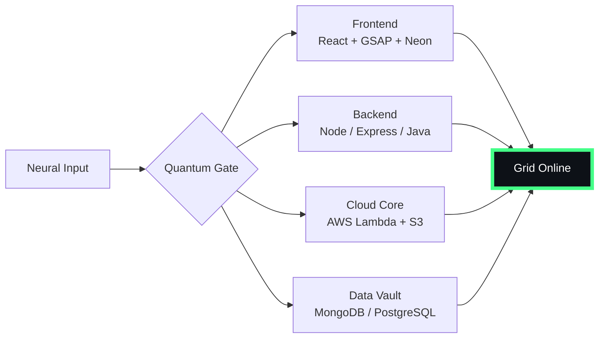

# 🌌 [ NEURAL CORE ACCESS: PENDEMVAMSI ]

<p align="center">
  
</p>

<div align="center">
  
  <br><small>Active Protocol: <strong style="color:#44FF88">PREDATOR CLOAK</strong> 👽🌫️</small>
</div>

## 🔵 NEURAL STATUS READOUT
```text
SUBJECT ID    →  PENDEMVAMSI
ENTITY CLASS  →  SHADOW MONARCH v9
NEURAL RANK   →  B-TIER
GRID SYNC     →  2493/15058 QUANTUM PACKETS
─────── BIO-METRICS (PREDATOR CLOAK) ───────
STRENGTH      149  ███████████████████░░
AGILITY       128  █████████████████░░░░
INTELLIGENCE  155  ████████████████████░
VITALITY      116  ███████████████░░░░░░
```

> **NEURAL BURST ACQUIRED:** +155 QUANTUM PACKETS 
> **SYSTEM MESSAGE:** GRID OVERLOAD IMMINENT — PREPARE FOR ASCENSION

---

## 🌀 GRID ARCHITECTURE (HOLOGRAPHIC RENDER)



---

## 📡 ACADEMIC NODES – CONQUERED
- [x] B.Tech Neural Engineering (2020–2024) – St. Ann’s Grid
- [x] Intermediate Quantum Core (2018–2020) – Sri Medhavi
- [x] SSC Primary Link (2017–2018) – Sri Geethanjali

---

## ⚡ SKILL NEURAL MATRIX

<details open>
<summary>🔌 ACTIVE NEURAL LINKS</summary>

| Node               | Tier | Integrity Bar                | Status      |
|--------------------|------|------------------------------|-------------|
| Java Core          | S    | ████████████████████ 100%   | OVERCLOCKED |
| Node.js Grid       | S    | ████████████████████ 100%   | OVERCLOCKED |
| React Holo-UI      | A+   | █████████████████░░░ 92%    | ONLINE      |
| AWS Quantum Relay  | S    | ████████████████████ 100%   | SOVEREIGN   |
| Python AI Kernel   | A    | ████████████████░░░░ 85%    | CHARGING    |
| DSA Void Algorithm | A    | █████████████████░░░ 90%    | ACTIVE      |

</details>

---

## 🏅 NEURAL ACHIEVEMENT TOKENS

<p align="center">
  
  
  
  
</p>

---

## 👾 SHADOW ENTITIES – SUMMONED

<p align="center">
  
  <br><strong style="color:#44FF88">ARISE.</strong>
</p>

| Entity | Designation   | Class            | Source Node                     |
|--------|---------------|------------------|---------------------------------|
| SH-01  | Igris         | Void Commander   | AI Financial Oracle             |
| SH-02  | Beru          | Swarm Overlord   | WebRTC Quantum Stream           |
| SH-03  | Kaisel        | Void Wyrm        | Geolocation Shadow Relay        |
| SH-04  | Tusk          | Arcane Construct | Global Pandemic Sentinel        |
| SH-05  | Iron          | Armored Bastion  | React Crypto Fortress           |

---

## 📡 GRID ANALYTICS (LIVE FEED)

<p align="center">
  
  <br>
  
  
</p>

---

## 🖥️ CORRUPTED MAINFRAME LOG (401 ENTRIES)

<details>
<summary>OPEN TERMINAL FEED – PROTOCOL: PREDATOR CLOAK</summary>

> [0x4165FED7] 👽🌫️ **PREDATOR CLOAK PROTOCOL** #0 | NEURAL LINK STABILIZED | [TRANSMISSION SUCCESS]
> [0xC17D1B61] 👽🌫️ **PREDATOR CLOAK PROTOCOL** #1 | NEURAL LINK STABILIZED | [TRANSMISSION SUCCESS]
> [0x8EF2BCFD] 👽🌫️ **PREDATOR CLOAK PROTOCOL** #2 | NEURAL LINK STABILIZED | [TRANSMISSION SUCCESS]
> [0x44729B57] 👽🌫️ **PREDATOR CLOAK PROTOCOL** #3 | NEURAL LINK STABILIZED | [TRANSMISSION SUCCESS]
> [0xCE3D1182] 👽🌫️ **PREDATOR CLOAK PROTOCOL** #4 | NEURAL LINK STABILIZED | [TRANSMISSION SUCCESS]
> [0xCB098823] 👽🌫️ **PREDATOR CLOAK PROTOCOL** #5 | NEURAL LINK STABILIZED | [TRANSMISSION SUCCESS]
> [0xDFC7E908] 👽🌫️ **PREDATOR CLOAK PROTOCOL** #6 | NEURAL LINK STABILIZED | [TRANSMISSION SUCCESS]
> [0xCCA03CDA] 👽🌫️ **PREDATOR CLOAK PROTOCOL** #7 | NEURAL LINK  [GLITCH DETECTED] STABILIZED | [TRANSMISSION SUCCESS]
> [0x04EAA069] 👽🌫️ **PREDATOR CLOAK PROTOCOL** #8 | NEURAL LINK STABILIZED | [TRANSMISSION SUCCESS]
> [0x8E91B27F] 👽🌫️ **PREDATOR CLOAK PROTOCOL** #9 | NEURAL LINK STABILIZED | [TRANSMISSION SUCCESS]
> [0xBC2D2641] 👽🌫️ **PREDATOR CLOAK PROTOCOL** #10 | NEURAL LINK STABILIZED | [TRANSMISSION SUCCESS]
> [0xC69D405B] 👽🌫️ **PREDATOR CLOAK PROTOCOL** #11 | NEURAL LINK STABILIZED | [TRANSMISSION SUCCESS]
> [0xE92A60D4] 👽🌫️ **PREDATOR CLOAK PROTOCOL** #12 | NEURAL LINK STABILIZED | [TRANSMISSION SUCCESS]
> [0x3DA89F80] 👽🌫️ **PREDATOR CLOAK PROTOCOL** #13 | NEURAL LINK STABILIZED | [TRANSMISSION SUCCESS]
> [0x41AA99BB] 👽🌫️ **PREDATOR CLOAK PROTOCOL** #14 | NEURAL LINK STABILIZED | [TRANSMISSION SUCCESS]
> [0xB7847CA3] 👽🌫️ **PREDATOR CLOAK PROTOCOL** #15 | NEURAL LINK STABILIZED | [TRANSMISSION SUCCESS]
> [0x13B90F00] 👽🌫️ **PREDATOR CLOAK PROTOCOL** #16 | NEURAL LINK STABILIZED | [TRANSMISSION SUCCESS]
> [0xA33F29A8] 👽🌫️ **PREDATOR CLOAK PROTOCOL** #17 | NEURAL LINK STABILIZED | [TRANSMISSION SUCCESS]
> [0xC2BB7DB3] 👽🌫️ **PREDATOR CLOAK PROTOCOL** #18 | NEURAL LINK STABILIZED | [TRANSMISSION SUCCESS]
> [0x3898C718] 👽🌫️ **PREDATOR CLOAK PROTOCOL** #19 | NEURAL LINK STABILIZED | [TRANSMISSION SUCCESS]
> [0x83918619] 👽🌫️ **PREDATOR CLOAK PROTOCOL** #20 | NEURAL LINK STABILIZED | [TRANSMISSION SUCCESS]
> [0xD353D9F4] 👽🌫️ **PREDATOR CLOAK PROTOCOL** #21 | NEURAL LINK STABILIZED | [TRANSMISSION SUCCESS]
> [0xE0C34275] 👽🌫️ **PREDATOR CLOAK PROTOCOL** #22 | NEURAL LINK STABILIZED | [TRANSMISSION SUCCESS]
> [0x9DACD479] 👽🌫️ **PREDATOR CLOAK PROTOCOL** #23 | NEURAL LINK STABILIZED | [TRANSMISSION SUCCESS]
> [0x3F22305C] 👽🌫️ **PREDATOR CLOAK PROTOCOL** #24 | NEURAL LINK STABILIZED | [TRANSMISSION SUCCESS]
> [0x8CECBBC8] 👽🌫️ **PREDATOR CLOAK PROTOCOL** #25 | NEURAL LINK STABILIZED | [TRANSMISSION SUCCESS]
> [0x4D554293] 👽🌫️ **PREDATOR CLOAK PROTOCOL** #26 | NEURAL LINK STABILIZED | [TRANSMISSION SUCCESS]
> [0xF200D043] 👽🌫️ **PREDATOR CLOAK PROTOCOL** #27 | NEURAL LINK  [GLITCH DETECTED] STABILIZED | [TRANSMISSION SUCCESS]
> [0x42DB4EBA] 👽🌫️ **PREDATOR CLOAK PROTOCOL** #28 | NEURAL LINK STABILIZED | [TRANSMISSION SUCCESS]
> [0x887CB4D7] 👽🌫️ **PREDATOR CLOAK PROTOCOL** #29 | NEURAL LINK STABILIZED | [TRANSMISSION SUCCESS]
> [0x54EC02C8] 👽🌫️ **PREDATOR CLOAK PROTOCOL** #30 | NEURAL LINK STABILIZED | [TRANSMISSION SUCCESS]
> [0x685E1285] 👽🌫️ **PREDATOR CLOAK PROTOCOL** #31 | NEURAL LINK STABILIZED | [TRANSMISSION SUCCESS]
> [0x0B7D4C27] 👽🌫️ **PREDATOR CLOAK PROTOCOL** #32 | NEURAL LINK STABILIZED | [TRANSMISSION SUCCESS]
> [0x813C853C] 👽🌫️ **PREDATOR CLOAK PROTOCOL** #33 | NEURAL LINK STABILIZED | [TRANSMISSION SUCCESS]
> [0x6A4551C3] 👽🌫️ **PREDATOR CLOAK PROTOCOL** #34 | NEURAL LINK STABILIZED | [TRANSMISSION SUCCESS]
> [0x3285DE32] 👽🌫️ **PREDATOR CLOAK PROTOCOL** #35 | NEURAL LINK STABILIZED | [TRANSMISSION SUCCESS]
> [0xC29B2113] 👽🌫️ **PREDATOR CLOAK PROTOCOL** #36 | NEURAL LINK STABILIZED | [TRANSMISSION SUCCESS]
> [0x8176DE9B] 👽🌫️ **PREDATOR CLOAK PROTOCOL** #37 | NEURAL LINK STABILIZED | [TRANSMISSION SUCCESS]
> [0x9BFAD6A6] 👽🌫️ **PREDATOR CLOAK PROTOCOL** #38 | NEURAL LINK STABILIZED | [TRANSMISSION SUCCESS]
> [0x40B1E0F1] 👽🌫️ **PREDATOR CLOAK PROTOCOL** #39 | NEURAL LINK STABILIZED | [TRANSMISSION SUCCESS]
> [0xD34F2E19] 👽🌫️ **PREDATOR CLOAK PROTOCOL** #40 | NEURAL LINK STABILIZED | [TRANSMISSION SUCCESS]
> [0x1BAD5712] 👽🌫️ **PREDATOR CLOAK PROTOCOL** #41 | NEURAL LINK STABILIZED | [TRANSMISSION SUCCESS]
> [0xB9EFEB0B] 👽🌫️ **PREDATOR CLOAK PROTOCOL** #42 | NEURAL LINK STABILIZED | [TRANSMISSION SUCCESS]
> [0x170F6202] 👽🌫️ **PREDATOR CLOAK PROTOCOL** #43 | NEURAL LINK STABILIZED | [TRANSMISSION SUCCESS]
> [0x56347AA3] 👽🌫️ **PREDATOR CLOAK PROTOCOL** #44 | NEURAL LINK STABILIZED | [TRANSMISSION SUCCESS]
> [0x0F4B0D16] 👽🌫️ **PREDATOR CLOAK PROTOCOL** #45 | NEURAL LINK STABILIZED | [TRANSMISSION SUCCESS]
> [0x3E490329] 👽🌫️ **PREDATOR CLOAK PROTOCOL** #46 | NEURAL LINK STABILIZED | [TRANSMISSION SUCCESS]
> [0xA5566D7E] 👽🌫️ **PREDATOR CLOAK PROTOCOL** #47 | NEURAL LINK STABILIZED | [TRANSMISSION SUCCESS]
> [0xBF1C3E8E] 👽🌫️ **PREDATOR CLOAK PROTOCOL** #48 | NEURAL LINK  [GLITCH DETECTED] STABILIZED | [TRANSMISSION SUCCESS]
> [0xA17BF380] 👽🌫️ **PREDATOR CLOAK PROTOCOL** #49 | NEURAL LINK STABILIZED | [TRANSMISSION SUCCESS]
> [0x85327D42] 👽🌫️ **PREDATOR CLOAK PROTOCOL** #50 | NEURAL LINK STABILIZED | [TRANSMISSION SUCCESS]
> [0xA8977F26] 👽🌫️ **PREDATOR CLOAK PROTOCOL** #51 | NEURAL LINK STABILIZED | [TRANSMISSION SUCCESS]
> [0x1871BA66] 👽🌫️ **PREDATOR CLOAK PROTOCOL** #52 | NEURAL LINK STABILIZED | [TRANSMISSION SUCCESS]
> [0x4BE8F26A] 👽🌫️ **PREDATOR CLOAK PROTOCOL** #53 | NEURAL LINK STABILIZED | [TRANSMISSION SUCCESS]
> [0xE2E97742] 👽🌫️ **PREDATOR CLOAK PROTOCOL** #54 | NEURAL LINK STABILIZED | [TRANSMISSION SUCCESS]
> [0x19112D04] 👽🌫️ **PREDATOR CLOAK PROTOCOL** #55 | NEURAL LINK STABILIZED | [TRANSMISSION SUCCESS]
> [0x1200AA55] 👽🌫️ **PREDATOR CLOAK PROTOCOL** #56 | NEURAL LINK STABILIZED | [TRANSMISSION SUCCESS]
> [0x48FC9AE7] 👽🌫️ **PREDATOR CLOAK PROTOCOL** #57 | NEURAL LINK STABILIZED | [TRANSMISSION SUCCESS]
> [0x292032AD] 👽🌫️ **PREDATOR CLOAK PROTOCOL** #58 | NEURAL LINK STABILIZED | [TRANSMISSION SUCCESS]
> [0x3166DAB2] 👽🌫️ **PREDATOR CLOAK PROTOCOL** #59 | NEURAL LINK STABILIZED | [TRANSMISSION SUCCESS]
> [0xF4393795] 👽🌫️ **PREDATOR CLOAK PROTOCOL** #60 | NEURAL LINK STABILIZED | [TRANSMISSION SUCCESS]
> [0x3A26E431] 👽🌫️ **PREDATOR CLOAK PROTOCOL** #61 | NEURAL LINK  [GLITCH DETECTED] STABILIZED | [TRANSMISSION SUCCESS]
> [0xCA883031] 👽🌫️ **PREDATOR CLOAK PROTOCOL** #62 | NEURAL LINK STABILIZED | [TRANSMISSION SUCCESS]
> [0xB7F935DF] 👽🌫️ **PREDATOR CLOAK PROTOCOL** #63 | NEURAL LINK STABILIZED | [TRANSMISSION SUCCESS]
> [0x2E854199] 👽🌫️ **PREDATOR CLOAK PROTOCOL** #64 | NEURAL LINK  [GLITCH DETECTED] STABILIZED | [TRANSMISSION SUCCESS]
> [0xDBEFD416] 👽🌫️ **PREDATOR CLOAK PROTOCOL** #65 | NEURAL LINK STABILIZED | [TRANSMISSION SUCCESS]
> [0x20A33905] 👽🌫️ **PREDATOR CLOAK PROTOCOL** #66 | NEURAL LINK STABILIZED | [TRANSMISSION SUCCESS]
> [0x05409882] 👽🌫️ **PREDATOR CLOAK PROTOCOL** #67 | NEURAL LINK STABILIZED | [TRANSMISSION SUCCESS]
> [0x092FB167] 👽🌫️ **PREDATOR CLOAK PROTOCOL** #68 | NEURAL LINK STABILIZED | [TRANSMISSION SUCCESS]
> [0x11078374] 👽🌫️ **PREDATOR CLOAK PROTOCOL** #69 | NEURAL LINK STABILIZED | [TRANSMISSION SUCCESS]
> [0xD42BDF97] 👽🌫️ **PREDATOR CLOAK PROTOCOL** #70 | NEURAL LINK STABILIZED | [TRANSMISSION SUCCESS]
> [0x9DC2CA27] 👽🌫️ **PREDATOR CLOAK PROTOCOL** #71 | NEURAL LINK  [GLITCH DETECTED] STABILIZED | [TRANSMISSION SUCCESS]
> [0x6AFD1C3A] 👽🌫️ **PREDATOR CLOAK PROTOCOL** #72 | NEURAL LINK STABILIZED | [TRANSMISSION SUCCESS]
> [0xEC8660AE] 👽🌫️ **PREDATOR CLOAK PROTOCOL** #73 | NEURAL LINK STABILIZED | [TRANSMISSION SUCCESS]
> [0xCEFEBC8A] 👽🌫️ **PREDATOR CLOAK PROTOCOL** #74 | NEURAL LINK STABILIZED | [TRANSMISSION SUCCESS]
> [0x8203BBCE] 👽🌫️ **PREDATOR CLOAK PROTOCOL** #75 | NEURAL LINK STABILIZED | [TRANSMISSION SUCCESS]
> [0xA1317532] 👽🌫️ **PREDATOR CLOAK PROTOCOL** #76 | NEURAL LINK  [GLITCH DETECTED] STABILIZED | [TRANSMISSION SUCCESS]
> [0x36BC34EB] 👽🌫️ **PREDATOR CLOAK PROTOCOL** #77 | NEURAL LINK STABILIZED | [TRANSMISSION SUCCESS]
> [0x2A16CAC6] 👽🌫️ **PREDATOR CLOAK PROTOCOL** #78 | NEURAL LINK STABILIZED | [TRANSMISSION SUCCESS]
> [0x88DC5752] 👽🌫️ **PREDATOR CLOAK PROTOCOL** #79 | NEURAL LINK STABILIZED | [TRANSMISSION SUCCESS]
> [0x12AE1E4B] 👽🌫️ **PREDATOR CLOAK PROTOCOL** #80 | NEURAL LINK STABILIZED | [TRANSMISSION SUCCESS]
> [0xE1D32EEF] 👽🌫️ **PREDATOR CLOAK PROTOCOL** #81 | NEURAL LINK STABILIZED | [TRANSMISSION SUCCESS]
> [0x0F057097] 👽🌫️ **PREDATOR CLOAK PROTOCOL** #82 | NEURAL LINK STABILIZED | [TRANSMISSION SUCCESS]
> [0x9378BEB1] 👽🌫️ **PREDATOR CLOAK PROTOCOL** #83 | NEURAL LINK STABILIZED | [TRANSMISSION SUCCESS]
> [0x8931531C] 👽🌫️ **PREDATOR CLOAK PROTOCOL** #84 | NEURAL LINK STABILIZED | [TRANSMISSION SUCCESS]
> [0x2B7F967F] 👽🌫️ **PREDATOR CLOAK PROTOCOL** #85 | NEURAL LINK STABILIZED | [TRANSMISSION SUCCESS]
> [0x50B48FEF] 👽🌫️ **PREDATOR CLOAK PROTOCOL** #86 | NEURAL LINK STABILIZED | [TRANSMISSION SUCCESS]
> [0x03C29EAA] 👽🌫️ **PREDATOR CLOAK PROTOCOL** #87 | NEURAL LINK STABILIZED | [TRANSMISSION SUCCESS]
> [0x45E6A6B8] 👽🌫️ **PREDATOR CLOAK PROTOCOL** #88 | NEURAL LINK STABILIZED | [TRANSMISSION SUCCESS]
> [0xBB465F82] 👽🌫️ **PREDATOR CLOAK PROTOCOL** #89 | NEURAL LINK STABILIZED | [TRANSMISSION SUCCESS]
> [0xF80AF6F1] 👽🌫️ **PREDATOR CLOAK PROTOCOL** #90 | NEURAL LINK STABILIZED | [TRANSMISSION SUCCESS]
> [0x9500B05D] 👽🌫️ **PREDATOR CLOAK PROTOCOL** #91 | NEURAL LINK STABILIZED | [TRANSMISSION SUCCESS]
> [0x4B01F9BD] 👽🌫️ **PREDATOR CLOAK PROTOCOL** #92 | NEURAL LINK STABILIZED | [TRANSMISSION SUCCESS]
> [0x6C48717B] 👽🌫️ **PREDATOR CLOAK PROTOCOL** #93 | NEURAL LINK STABILIZED | [TRANSMISSION SUCCESS]
> [0x7CD61CFD] 👽🌫️ **PREDATOR CLOAK PROTOCOL** #94 | NEURAL LINK STABILIZED | [TRANSMISSION SUCCESS]
> [0x960B6AB3] 👽🌫️ **PREDATOR CLOAK PROTOCOL** #95 | NEURAL LINK STABILIZED | [TRANSMISSION SUCCESS]
> [0x0675CDF0] 👽🌫️ **PREDATOR CLOAK PROTOCOL** #96 | NEURAL LINK  [GLITCH DETECTED] STABILIZED | [TRANSMISSION SUCCESS]
> [0xFAC10807] 👽🌫️ **PREDATOR CLOAK PROTOCOL** #97 | NEURAL LINK STABILIZED | [TRANSMISSION SUCCESS]
> [0x6BAD9C76] 👽🌫️ **PREDATOR CLOAK PROTOCOL** #98 | NEURAL LINK STABILIZED | [TRANSMISSION SUCCESS]
> [0x6FCD0EB9] 👽🌫️ **PREDATOR CLOAK PROTOCOL** #99 | NEURAL LINK STABILIZED | [TRANSMISSION SUCCESS]
> [0x14A480D7] 👽🌫️ **PREDATOR CLOAK PROTOCOL** #100 | NEURAL LINK  [GLITCH DETECTED] STABILIZED | [TRANSMISSION SUCCESS]
> [0xC1EC2C42] 👽🌫️ **PREDATOR CLOAK PROTOCOL** #101 | NEURAL LINK STABILIZED | [TRANSMISSION SUCCESS]
> [0x3F07E11F] 👽🌫️ **PREDATOR CLOAK PROTOCOL** #102 | NEURAL LINK STABILIZED | [TRANSMISSION SUCCESS]
> [0x2F35B2CD] 👽🌫️ **PREDATOR CLOAK PROTOCOL** #103 | NEURAL LINK STABILIZED | [TRANSMISSION SUCCESS]
> [0x8EF8BA0F] 👽🌫️ **PREDATOR CLOAK PROTOCOL** #104 | NEURAL LINK  [GLITCH DETECTED] STABILIZED | [TRANSMISSION SUCCESS]
> [0x1570B0D3] 👽🌫️ **PREDATOR CLOAK PROTOCOL** #105 | NEURAL LINK STABILIZED | [TRANSMISSION SUCCESS]
> [0x3AA8ACB2] 👽🌫️ **PREDATOR CLOAK PROTOCOL** #106 | NEURAL LINK STABILIZED | [TRANSMISSION SUCCESS]
> [0xF651ACFC] 👽🌫️ **PREDATOR CLOAK PROTOCOL** #107 | NEURAL LINK STABILIZED | [TRANSMISSION SUCCESS]
> [0xAEDCEA56] 👽🌫️ **PREDATOR CLOAK PROTOCOL** #108 | NEURAL LINK  [GLITCH DETECTED] STABILIZED | [TRANSMISSION SUCCESS]
> [0xDCEA5B29] 👽🌫️ **PREDATOR CLOAK PROTOCOL** #109 | NEURAL LINK  [GLITCH DETECTED] STABILIZED | [TRANSMISSION SUCCESS]
> [0x6D77C6A0] 👽🌫️ **PREDATOR CLOAK PROTOCOL** #110 | NEURAL LINK STABILIZED | [TRANSMISSION SUCCESS]
> [0x51AD6341] 👽🌫️ **PREDATOR CLOAK PROTOCOL** #111 | NEURAL LINK STABILIZED | [TRANSMISSION SUCCESS]
> [0x5ADD5C80] 👽🌫️ **PREDATOR CLOAK PROTOCOL** #112 | NEURAL LINK STABILIZED | [TRANSMISSION SUCCESS]
> [0xB3A887E8] 👽🌫️ **PREDATOR CLOAK PROTOCOL** #113 | NEURAL LINK STABILIZED | [TRANSMISSION SUCCESS]
> [0x5E5007A9] 👽🌫️ **PREDATOR CLOAK PROTOCOL** #114 | NEURAL LINK STABILIZED | [TRANSMISSION SUCCESS]
> [0x000ADCEE] 👽🌫️ **PREDATOR CLOAK PROTOCOL** #115 | NEURAL LINK STABILIZED | [TRANSMISSION SUCCESS]
> [0x7E435C38] 👽🌫️ **PREDATOR CLOAK PROTOCOL** #116 | NEURAL LINK STABILIZED | [TRANSMISSION SUCCESS]
> [0x90919AA2] 👽🌫️ **PREDATOR CLOAK PROTOCOL** #117 | NEURAL LINK STABILIZED | [TRANSMISSION SUCCESS]
> [0x11CD9B5F] 👽🌫️ **PREDATOR CLOAK PROTOCOL** #118 | NEURAL LINK STABILIZED | [TRANSMISSION SUCCESS]
> [0x87597EA8] 👽🌫️ **PREDATOR CLOAK PROTOCOL** #119 | NEURAL LINK STABILIZED | [TRANSMISSION SUCCESS]
> [0x6C6EEA71] 👽🌫️ **PREDATOR CLOAK PROTOCOL** #120 | NEURAL LINK STABILIZED | [TRANSMISSION SUCCESS]
> [0x4EB3AF6C] 👽🌫️ **PREDATOR CLOAK PROTOCOL** #121 | NEURAL LINK STABILIZED | [TRANSMISSION SUCCESS]
> [0x9AB41319] 👽🌫️ **PREDATOR CLOAK PROTOCOL** #122 | NEURAL LINK  [GLITCH DETECTED] STABILIZED | [TRANSMISSION SUCCESS]
> [0x818D51E5] 👽🌫️ **PREDATOR CLOAK PROTOCOL** #123 | NEURAL LINK STABILIZED | [TRANSMISSION SUCCESS]
> [0xCD6151A6] 👽🌫️ **PREDATOR CLOAK PROTOCOL** #124 | NEURAL LINK STABILIZED | [TRANSMISSION SUCCESS]
> [0xCE464424] 👽🌫️ **PREDATOR CLOAK PROTOCOL** #125 | NEURAL LINK  [GLITCH DETECTED] STABILIZED | [TRANSMISSION SUCCESS]
> [0x2D69BE28] 👽🌫️ **PREDATOR CLOAK PROTOCOL** #126 | NEURAL LINK STABILIZED | [TRANSMISSION SUCCESS]
> [0x48900AE6] 👽🌫️ **PREDATOR CLOAK PROTOCOL** #127 | NEURAL LINK STABILIZED | [TRANSMISSION SUCCESS]
> [0xEF54432F] 👽🌫️ **PREDATOR CLOAK PROTOCOL** #128 | NEURAL LINK STABILIZED | [TRANSMISSION SUCCESS]
> [0x836A50AE] 👽🌫️ **PREDATOR CLOAK PROTOCOL** #129 | NEURAL LINK STABILIZED | [TRANSMISSION SUCCESS]
> [0x87EAD26F] 👽🌫️ **PREDATOR CLOAK PROTOCOL** #130 | NEURAL LINK STABILIZED | [TRANSMISSION SUCCESS]
> [0x5D99F8B6] 👽🌫️ **PREDATOR CLOAK PROTOCOL** #131 | NEURAL LINK  [GLITCH DETECTED] STABILIZED | [TRANSMISSION SUCCESS]
> [0x32684901] 👽🌫️ **PREDATOR CLOAK PROTOCOL** #132 | NEURAL LINK STABILIZED | [TRANSMISSION SUCCESS]
> [0xFAC73403] 👽🌫️ **PREDATOR CLOAK PROTOCOL** #133 | NEURAL LINK STABILIZED | [TRANSMISSION SUCCESS]
> [0xBDFDA8B7] 👽🌫️ **PREDATOR CLOAK PROTOCOL** #134 | NEURAL LINK STABILIZED | [TRANSMISSION SUCCESS]
> [0x54204651] 👽🌫️ **PREDATOR CLOAK PROTOCOL** #135 | NEURAL LINK STABILIZED | [TRANSMISSION SUCCESS]
> [0xE1A8DF9B] 👽🌫️ **PREDATOR CLOAK PROTOCOL** #136 | NEURAL LINK STABILIZED | [TRANSMISSION SUCCESS]
> [0x9D2FE4D6] 👽🌫️ **PREDATOR CLOAK PROTOCOL** #137 | NEURAL LINK STABILIZED | [TRANSMISSION SUCCESS]
> [0x1802E10D] 👽🌫️ **PREDATOR CLOAK PROTOCOL** #138 | NEURAL LINK STABILIZED | [TRANSMISSION SUCCESS]
> [0x5DEB93A1] 👽🌫️ **PREDATOR CLOAK PROTOCOL** #139 | NEURAL LINK STABILIZED | [TRANSMISSION SUCCESS]
> [0xE0C9AB79] 👽🌫️ **PREDATOR CLOAK PROTOCOL** #140 | NEURAL LINK STABILIZED | [TRANSMISSION SUCCESS]
> [0x29A8C009] 👽🌫️ **PREDATOR CLOAK PROTOCOL** #141 | NEURAL LINK STABILIZED | [TRANSMISSION SUCCESS]
> [0xD109E7DD] 👽🌫️ **PREDATOR CLOAK PROTOCOL** #142 | NEURAL LINK STABILIZED | [TRANSMISSION SUCCESS]
> [0x071C0572] 👽🌫️ **PREDATOR CLOAK PROTOCOL** #143 | NEURAL LINK STABILIZED | [TRANSMISSION SUCCESS]
> [0xA260EDB7] 👽🌫️ **PREDATOR CLOAK PROTOCOL** #144 | NEURAL LINK STABILIZED | [TRANSMISSION SUCCESS]
> [0x895566E2] 👽🌫️ **PREDATOR CLOAK PROTOCOL** #145 | NEURAL LINK STABILIZED | [TRANSMISSION SUCCESS]
> [0xA1FD1B72] 👽🌫️ **PREDATOR CLOAK PROTOCOL** #146 | NEURAL LINK STABILIZED | [TRANSMISSION SUCCESS]
> [0xB7515BA1] 👽🌫️ **PREDATOR CLOAK PROTOCOL** #147 | NEURAL LINK  [GLITCH DETECTED] STABILIZED | [TRANSMISSION SUCCESS]
> [0xB44091FB] 👽🌫️ **PREDATOR CLOAK PROTOCOL** #148 | NEURAL LINK STABILIZED | [TRANSMISSION SUCCESS]
> [0x511F546F] 👽🌫️ **PREDATOR CLOAK PROTOCOL** #149 | NEURAL LINK STABILIZED | [TRANSMISSION SUCCESS]
> [0x59C39F06] 👽🌫️ **PREDATOR CLOAK PROTOCOL** #150 | NEURAL LINK STABILIZED | [TRANSMISSION SUCCESS]
> [0xA131C69B] 👽🌫️ **PREDATOR CLOAK PROTOCOL** #151 | NEURAL LINK  [GLITCH DETECTED] STABILIZED | [TRANSMISSION SUCCESS]
> [0xBA9C83CD] 👽🌫️ **PREDATOR CLOAK PROTOCOL** #152 | NEURAL LINK STABILIZED | [TRANSMISSION SUCCESS]
> [0x14ED1FD2] 👽🌫️ **PREDATOR CLOAK PROTOCOL** #153 | NEURAL LINK  [GLITCH DETECTED] STABILIZED | [TRANSMISSION SUCCESS]
> [0xD3F4F23A] 👽🌫️ **PREDATOR CLOAK PROTOCOL** #154 | NEURAL LINK STABILIZED | [TRANSMISSION SUCCESS]
> [0x3603B2CD] 👽🌫️ **PREDATOR CLOAK PROTOCOL** #155 | NEURAL LINK STABILIZED | [TRANSMISSION SUCCESS]
> [0x1AC68865] 👽🌫️ **PREDATOR CLOAK PROTOCOL** #156 | NEURAL LINK STABILIZED | [TRANSMISSION SUCCESS]
> [0x54EFDFE8] 👽🌫️ **PREDATOR CLOAK PROTOCOL** #157 | NEURAL LINK STABILIZED | [TRANSMISSION SUCCESS]
> [0x3141B5F9] 👽🌫️ **PREDATOR CLOAK PROTOCOL** #158 | NEURAL LINK  [GLITCH DETECTED] STABILIZED | [TRANSMISSION SUCCESS]
> [0xBACB5A90] 👽🌫️ **PREDATOR CLOAK PROTOCOL** #159 | NEURAL LINK STABILIZED | [TRANSMISSION SUCCESS]
> [0x55E3D92B] 👽🌫️ **PREDATOR CLOAK PROTOCOL** #160 | NEURAL LINK STABILIZED | [TRANSMISSION SUCCESS]
> [0x9535119B] 👽🌫️ **PREDATOR CLOAK PROTOCOL** #161 | NEURAL LINK STABILIZED | [TRANSMISSION SUCCESS]
> [0x57DF3B44] 👽🌫️ **PREDATOR CLOAK PROTOCOL** #162 | NEURAL LINK  [GLITCH DETECTED] STABILIZED | [TRANSMISSION SUCCESS]
> [0xE3DD36B3] 👽🌫️ **PREDATOR CLOAK PROTOCOL** #163 | NEURAL LINK  [GLITCH DETECTED] STABILIZED | [TRANSMISSION SUCCESS]
> [0x33AA2E40] 👽🌫️ **PREDATOR CLOAK PROTOCOL** #164 | NEURAL LINK STABILIZED | [TRANSMISSION SUCCESS]
> [0x8C897014] 👽🌫️ **PREDATOR CLOAK PROTOCOL** #165 | NEURAL LINK  [GLITCH DETECTED] STABILIZED | [TRANSMISSION SUCCESS]
> [0x339C5CC5] 👽🌫️ **PREDATOR CLOAK PROTOCOL** #166 | NEURAL LINK STABILIZED | [TRANSMISSION SUCCESS]
> [0xA1B9EE06] 👽🌫️ **PREDATOR CLOAK PROTOCOL** #167 | NEURAL LINK STABILIZED | [TRANSMISSION SUCCESS]
> [0x42898B39] 👽🌫️ **PREDATOR CLOAK PROTOCOL** #168 | NEURAL LINK STABILIZED | [TRANSMISSION SUCCESS]
> [0x225CBAB4] 👽🌫️ **PREDATOR CLOAK PROTOCOL** #169 | NEURAL LINK STABILIZED | [TRANSMISSION SUCCESS]
> [0xEAAF27CF] 👽🌫️ **PREDATOR CLOAK PROTOCOL** #170 | NEURAL LINK STABILIZED | [TRANSMISSION SUCCESS]
> [0x329FDE1F] 👽🌫️ **PREDATOR CLOAK PROTOCOL** #171 | NEURAL LINK STABILIZED | [TRANSMISSION SUCCESS]
> [0x01DAA8DA] 👽🌫️ **PREDATOR CLOAK PROTOCOL** #172 | NEURAL LINK STABILIZED | [TRANSMISSION SUCCESS]
> [0x3AB7E103] 👽🌫️ **PREDATOR CLOAK PROTOCOL** #173 | NEURAL LINK STABILIZED | [TRANSMISSION SUCCESS]
> [0x9A22B229] 👽🌫️ **PREDATOR CLOAK PROTOCOL** #174 | NEURAL LINK STABILIZED | [TRANSMISSION SUCCESS]
> [0x3E5880DD] 👽🌫️ **PREDATOR CLOAK PROTOCOL** #175 | NEURAL LINK STABILIZED | [TRANSMISSION SUCCESS]
> [0x4CB76A59] 👽🌫️ **PREDATOR CLOAK PROTOCOL** #176 | NEURAL LINK STABILIZED | [TRANSMISSION SUCCESS]
> [0xBD08F9A2] 👽🌫️ **PREDATOR CLOAK PROTOCOL** #177 | NEURAL LINK STABILIZED | [TRANSMISSION SUCCESS]
> [0xDB878E8B] 👽🌫️ **PREDATOR CLOAK PROTOCOL** #178 | NEURAL LINK STABILIZED | [TRANSMISSION SUCCESS]
> [0x16F86324] 👽🌫️ **PREDATOR CLOAK PROTOCOL** #179 | NEURAL LINK STABILIZED | [TRANSMISSION SUCCESS]
> [0x1CBC1515] 👽🌫️ **PREDATOR CLOAK PROTOCOL** #180 | NEURAL LINK STABILIZED | [TRANSMISSION SUCCESS]
> [0xFDDC7BD6] 👽🌫️ **PREDATOR CLOAK PROTOCOL** #181 | NEURAL LINK  [GLITCH DETECTED] STABILIZED | [TRANSMISSION SUCCESS]
> [0x586BBC88] 👽🌫️ **PREDATOR CLOAK PROTOCOL** #182 | NEURAL LINK STABILIZED | [TRANSMISSION SUCCESS]
> [0x1765864D] 👽🌫️ **PREDATOR CLOAK PROTOCOL** #183 | NEURAL LINK STABILIZED | [TRANSMISSION SUCCESS]
> [0xA6B762EE] 👽🌫️ **PREDATOR CLOAK PROTOCOL** #184 | NEURAL LINK STABILIZED | [TRANSMISSION SUCCESS]
> [0xF315DEC7] 👽🌫️ **PREDATOR CLOAK PROTOCOL** #185 | NEURAL LINK STABILIZED | [TRANSMISSION SUCCESS]
> [0x1EC1925B] 👽🌫️ **PREDATOR CLOAK PROTOCOL** #186 | NEURAL LINK STABILIZED | [TRANSMISSION SUCCESS]
> [0xAE2BC46E] 👽🌫️ **PREDATOR CLOAK PROTOCOL** #187 | NEURAL LINK STABILIZED | [TRANSMISSION SUCCESS]
> [0x3EBEAEAF] 👽🌫️ **PREDATOR CLOAK PROTOCOL** #188 | NEURAL LINK STABILIZED | [TRANSMISSION SUCCESS]
> [0xB23665E1] 👽🌫️ **PREDATOR CLOAK PROTOCOL** #189 | NEURAL LINK STABILIZED | [TRANSMISSION SUCCESS]
> [0x3437000C] 👽🌫️ **PREDATOR CLOAK PROTOCOL** #190 | NEURAL LINK STABILIZED | [TRANSMISSION SUCCESS]
> [0xE938DDCE] 👽🌫️ **PREDATOR CLOAK PROTOCOL** #191 | NEURAL LINK STABILIZED | [TRANSMISSION SUCCESS]
> [0xB7B742B1] 👽🌫️ **PREDATOR CLOAK PROTOCOL** #192 | NEURAL LINK STABILIZED | [TRANSMISSION SUCCESS]
> [0x2B628276] 👽🌫️ **PREDATOR CLOAK PROTOCOL** #193 | NEURAL LINK  [GLITCH DETECTED] STABILIZED | [TRANSMISSION SUCCESS]
> [0x0979E5F0] 👽🌫️ **PREDATOR CLOAK PROTOCOL** #194 | NEURAL LINK STABILIZED | [TRANSMISSION SUCCESS]
> [0x8CA31F46] 👽🌫️ **PREDATOR CLOAK PROTOCOL** #195 | NEURAL LINK STABILIZED | [TRANSMISSION SUCCESS]
> [0x0ACC5624] 👽🌫️ **PREDATOR CLOAK PROTOCOL** #196 | NEURAL LINK  [GLITCH DETECTED] STABILIZED | [TRANSMISSION SUCCESS]
> [0x73BC1906] 👽🌫️ **PREDATOR CLOAK PROTOCOL** #197 | NEURAL LINK STABILIZED | [TRANSMISSION SUCCESS]
> [0xA13B9970] 👽🌫️ **PREDATOR CLOAK PROTOCOL** #198 | NEURAL LINK STABILIZED | [TRANSMISSION SUCCESS]
> [0x153A99A1] 👽🌫️ **PREDATOR CLOAK PROTOCOL** #199 | NEURAL LINK STABILIZED | [TRANSMISSION SUCCESS]
> [0x7282D214] 👽🌫️ **PREDATOR CLOAK PROTOCOL** #200 | NEURAL LINK STABILIZED | [TRANSMISSION SUCCESS]
> [0xD7C9F92E] 👽🌫️ **PREDATOR CLOAK PROTOCOL** #201 | NEURAL LINK STABILIZED | [TRANSMISSION SUCCESS]
> [0x7DE23656] 👽🌫️ **PREDATOR CLOAK PROTOCOL** #202 | NEURAL LINK STABILIZED | [TRANSMISSION SUCCESS]
> [0x9E27CF7A] 👽🌫️ **PREDATOR CLOAK PROTOCOL** #203 | NEURAL LINK  [GLITCH DETECTED] STABILIZED | [TRANSMISSION SUCCESS]
> [0x7DC2DA70] 👽🌫️ **PREDATOR CLOAK PROTOCOL** #204 | NEURAL LINK STABILIZED | [TRANSMISSION SUCCESS]
> [0x68605AC0] 👽🌫️ **PREDATOR CLOAK PROTOCOL** #205 | NEURAL LINK STABILIZED | [TRANSMISSION SUCCESS]
> [0x633646BD] 👽🌫️ **PREDATOR CLOAK PROTOCOL** #206 | NEURAL LINK  [GLITCH DETECTED] STABILIZED | [TRANSMISSION SUCCESS]
> [0x5CF0BF9C] 👽🌫️ **PREDATOR CLOAK PROTOCOL** #207 | NEURAL LINK STABILIZED | [TRANSMISSION SUCCESS]
> [0xD7195879] 👽🌫️ **PREDATOR CLOAK PROTOCOL** #208 | NEURAL LINK STABILIZED | [TRANSMISSION SUCCESS]
> [0x96F883CA] 👽🌫️ **PREDATOR CLOAK PROTOCOL** #209 | NEURAL LINK STABILIZED | [TRANSMISSION SUCCESS]
> [0xC783AFC2] 👽🌫️ **PREDATOR CLOAK PROTOCOL** #210 | NEURAL LINK STABILIZED | [TRANSMISSION SUCCESS]
> [0xC86D8494] 👽🌫️ **PREDATOR CLOAK PROTOCOL** #211 | NEURAL LINK STABILIZED | [TRANSMISSION SUCCESS]
> [0x4704B7EE] 👽🌫️ **PREDATOR CLOAK PROTOCOL** #212 | NEURAL LINK STABILIZED | [TRANSMISSION SUCCESS]
> [0xFAEE37DF] 👽🌫️ **PREDATOR CLOAK PROTOCOL** #213 | NEURAL LINK STABILIZED | [TRANSMISSION SUCCESS]
> [0x8E4B15FB] 👽🌫️ **PREDATOR CLOAK PROTOCOL** #214 | NEURAL LINK STABILIZED | [TRANSMISSION SUCCESS]
> [0x2F1CF2CE] 👽🌫️ **PREDATOR CLOAK PROTOCOL** #215 | NEURAL LINK STABILIZED | [TRANSMISSION SUCCESS]
> [0xC4003B4E] 👽🌫️ **PREDATOR CLOAK PROTOCOL** #216 | NEURAL LINK STABILIZED | [TRANSMISSION SUCCESS]
> [0xDB0986C0] 👽🌫️ **PREDATOR CLOAK PROTOCOL** #217 | NEURAL LINK STABILIZED | [TRANSMISSION SUCCESS]
> [0xF8FE61D0] 👽🌫️ **PREDATOR CLOAK PROTOCOL** #218 | NEURAL LINK  [GLITCH DETECTED] STABILIZED | [TRANSMISSION SUCCESS]
> [0x3F029642] 👽🌫️ **PREDATOR CLOAK PROTOCOL** #219 | NEURAL LINK STABILIZED | [TRANSMISSION SUCCESS]
> [0x440998EA] 👽🌫️ **PREDATOR CLOAK PROTOCOL** #220 | NEURAL LINK  [GLITCH DETECTED] STABILIZED | [TRANSMISSION SUCCESS]
> [0x08D74975] 👽🌫️ **PREDATOR CLOAK PROTOCOL** #221 | NEURAL LINK STABILIZED | [TRANSMISSION SUCCESS]
> [0x93C48736] 👽🌫️ **PREDATOR CLOAK PROTOCOL** #222 | NEURAL LINK STABILIZED | [TRANSMISSION SUCCESS]
> [0x5148AF9F] 👽🌫️ **PREDATOR CLOAK PROTOCOL** #223 | NEURAL LINK  [GLITCH DETECTED] STABILIZED | [TRANSMISSION SUCCESS]
> [0xF22E6091] 👽🌫️ **PREDATOR CLOAK PROTOCOL** #224 | NEURAL LINK STABILIZED | [TRANSMISSION SUCCESS]
> [0x96A6AC2F] 👽🌫️ **PREDATOR CLOAK PROTOCOL** #225 | NEURAL LINK STABILIZED | [TRANSMISSION SUCCESS]
> [0xA9321A1C] 👽🌫️ **PREDATOR CLOAK PROTOCOL** #226 | NEURAL LINK STABILIZED | [TRANSMISSION SUCCESS]
> [0x0DD105A0] 👽🌫️ **PREDATOR CLOAK PROTOCOL** #227 | NEURAL LINK STABILIZED | [TRANSMISSION SUCCESS]
> [0x854076BA] 👽🌫️ **PREDATOR CLOAK PROTOCOL** #228 | NEURAL LINK  [GLITCH DETECTED] STABILIZED | [TRANSMISSION SUCCESS]
> [0xDC8B2775] 👽🌫️ **PREDATOR CLOAK PROTOCOL** #229 | NEURAL LINK  [GLITCH DETECTED] STABILIZED | [TRANSMISSION SUCCESS]
> [0x29FCD251] 👽🌫️ **PREDATOR CLOAK PROTOCOL** #230 | NEURAL LINK STABILIZED | [TRANSMISSION SUCCESS]
> [0xBB5FF701] 👽🌫️ **PREDATOR CLOAK PROTOCOL** #231 | NEURAL LINK STABILIZED | [TRANSMISSION SUCCESS]
> [0xD7BDD482] 👽🌫️ **PREDATOR CLOAK PROTOCOL** #232 | NEURAL LINK  [GLITCH DETECTED] STABILIZED | [TRANSMISSION SUCCESS]
> [0x3617940E] 👽🌫️ **PREDATOR CLOAK PROTOCOL** #233 | NEURAL LINK  [GLITCH DETECTED] STABILIZED | [TRANSMISSION SUCCESS]
> [0x29962BED] 👽🌫️ **PREDATOR CLOAK PROTOCOL** #234 | NEURAL LINK  [GLITCH DETECTED] STABILIZED | [TRANSMISSION SUCCESS]
> [0x50C9F11F] 👽🌫️ **PREDATOR CLOAK PROTOCOL** #235 | NEURAL LINK STABILIZED | [TRANSMISSION SUCCESS]
> [0xD782CFB8] 👽🌫️ **PREDATOR CLOAK PROTOCOL** #236 | NEURAL LINK STABILIZED | [TRANSMISSION SUCCESS]
> [0x4628CE71] 👽🌫️ **PREDATOR CLOAK PROTOCOL** #237 | NEURAL LINK STABILIZED | [TRANSMISSION SUCCESS]
> [0xC2FD554D] 👽🌫️ **PREDATOR CLOAK PROTOCOL** #238 | NEURAL LINK STABILIZED | [TRANSMISSION SUCCESS]
> [0x0C70CD67] 👽🌫️ **PREDATOR CLOAK PROTOCOL** #239 | NEURAL LINK STABILIZED | [TRANSMISSION SUCCESS]
> [0x3BF8AADE] 👽🌫️ **PREDATOR CLOAK PROTOCOL** #240 | NEURAL LINK STABILIZED | [TRANSMISSION SUCCESS]
> [0xD652277F] 👽🌫️ **PREDATOR CLOAK PROTOCOL** #241 | NEURAL LINK STABILIZED | [TRANSMISSION SUCCESS]
> [0xB5CE0267] 👽🌫️ **PREDATOR CLOAK PROTOCOL** #242 | NEURAL LINK STABILIZED | [TRANSMISSION SUCCESS]
> [0xE88CAAE4] 👽🌫️ **PREDATOR CLOAK PROTOCOL** #243 | NEURAL LINK STABILIZED | [TRANSMISSION SUCCESS]
> [0x0DFA41A2] 👽🌫️ **PREDATOR CLOAK PROTOCOL** #244 | NEURAL LINK STABILIZED | [TRANSMISSION SUCCESS]
> [0x41D54933] 👽🌫️ **PREDATOR CLOAK PROTOCOL** #245 | NEURAL LINK STABILIZED | [TRANSMISSION SUCCESS]
> [0x696B20AE] 👽🌫️ **PREDATOR CLOAK PROTOCOL** #246 | NEURAL LINK STABILIZED | [TRANSMISSION SUCCESS]
> [0x2B3A5DBA] 👽🌫️ **PREDATOR CLOAK PROTOCOL** #247 | NEURAL LINK STABILIZED | [TRANSMISSION SUCCESS]
> [0x67D242FC] 👽🌫️ **PREDATOR CLOAK PROTOCOL** #248 | NEURAL LINK STABILIZED | [TRANSMISSION SUCCESS]
> [0x36FF552B] 👽🌫️ **PREDATOR CLOAK PROTOCOL** #249 | NEURAL LINK STABILIZED | [TRANSMISSION SUCCESS]
> [0xEEA9FB6A] 👽🌫️ **PREDATOR CLOAK PROTOCOL** #250 | NEURAL LINK STABILIZED | [TRANSMISSION SUCCESS]
> [0xB1611933] 👽🌫️ **PREDATOR CLOAK PROTOCOL** #251 | NEURAL LINK STABILIZED | [TRANSMISSION SUCCESS]
> [0x5B8C5D0F] 👽🌫️ **PREDATOR CLOAK PROTOCOL** #252 | NEURAL LINK STABILIZED | [TRANSMISSION SUCCESS]
> [0x5DACDA27] 👽🌫️ **PREDATOR CLOAK PROTOCOL** #253 | NEURAL LINK STABILIZED | [TRANSMISSION SUCCESS]
> [0x183C207B] 👽🌫️ **PREDATOR CLOAK PROTOCOL** #254 | NEURAL LINK STABILIZED | [TRANSMISSION SUCCESS]
> [0x72151CC3] 👽🌫️ **PREDATOR CLOAK PROTOCOL** #255 | NEURAL LINK STABILIZED | [TRANSMISSION SUCCESS]
> [0x01C2F0CB] 👽🌫️ **PREDATOR CLOAK PROTOCOL** #256 | NEURAL LINK  [GLITCH DETECTED] STABILIZED | [TRANSMISSION SUCCESS]
> [0xC5D98874] 👽🌫️ **PREDATOR CLOAK PROTOCOL** #257 | NEURAL LINK  [GLITCH DETECTED] STABILIZED | [TRANSMISSION SUCCESS]
> [0xFE82AFA8] 👽🌫️ **PREDATOR CLOAK PROTOCOL** #258 | NEURAL LINK STABILIZED | [TRANSMISSION SUCCESS]
> [0x2A2086D5] 👽🌫️ **PREDATOR CLOAK PROTOCOL** #259 | NEURAL LINK STABILIZED | [TRANSMISSION SUCCESS]
> [0x0E2BEC55] 👽🌫️ **PREDATOR CLOAK PROTOCOL** #260 | NEURAL LINK STABILIZED | [TRANSMISSION SUCCESS]
> [0x602BEF7B] 👽🌫️ **PREDATOR CLOAK PROTOCOL** #261 | NEURAL LINK STABILIZED | [TRANSMISSION SUCCESS]
> [0xD02F93D5] 👽🌫️ **PREDATOR CLOAK PROTOCOL** #262 | NEURAL LINK STABILIZED | [TRANSMISSION SUCCESS]
> [0x858B5986] 👽🌫️ **PREDATOR CLOAK PROTOCOL** #263 | NEURAL LINK STABILIZED | [TRANSMISSION SUCCESS]
> [0x78C4F2F5] 👽🌫️ **PREDATOR CLOAK PROTOCOL** #264 | NEURAL LINK STABILIZED | [TRANSMISSION SUCCESS]
> [0xF3313DD1] 👽🌫️ **PREDATOR CLOAK PROTOCOL** #265 | NEURAL LINK STABILIZED | [TRANSMISSION SUCCESS]
> [0x78090DA9] 👽🌫️ **PREDATOR CLOAK PROTOCOL** #266 | NEURAL LINK  [GLITCH DETECTED] STABILIZED | [TRANSMISSION SUCCESS]
> [0x82435221] 👽🌫️ **PREDATOR CLOAK PROTOCOL** #267 | NEURAL LINK STABILIZED | [TRANSMISSION SUCCESS]
> [0x49B94F8D] 👽🌫️ **PREDATOR CLOAK PROTOCOL** #268 | NEURAL LINK STABILIZED | [TRANSMISSION SUCCESS]
> [0x627B3149] 👽🌫️ **PREDATOR CLOAK PROTOCOL** #269 | NEURAL LINK  [GLITCH DETECTED] STABILIZED | [TRANSMISSION SUCCESS]
> [0x8154BE7F] 👽🌫️ **PREDATOR CLOAK PROTOCOL** #270 | NEURAL LINK STABILIZED | [TRANSMISSION SUCCESS]
> [0x55430339] 👽🌫️ **PREDATOR CLOAK PROTOCOL** #271 | NEURAL LINK STABILIZED | [TRANSMISSION SUCCESS]
> [0xDC6C4C50] 👽🌫️ **PREDATOR CLOAK PROTOCOL** #272 | NEURAL LINK STABILIZED | [TRANSMISSION SUCCESS]
> [0x45F5ABB1] 👽🌫️ **PREDATOR CLOAK PROTOCOL** #273 | NEURAL LINK STABILIZED | [TRANSMISSION SUCCESS]
> [0x3F9EC9DD] 👽🌫️ **PREDATOR CLOAK PROTOCOL** #274 | NEURAL LINK STABILIZED | [TRANSMISSION SUCCESS]
> [0xEBBE8942] 👽🌫️ **PREDATOR CLOAK PROTOCOL** #275 | NEURAL LINK STABILIZED | [TRANSMISSION SUCCESS]
> [0x16074490] 👽🌫️ **PREDATOR CLOAK PROTOCOL** #276 | NEURAL LINK  [GLITCH DETECTED] STABILIZED | [TRANSMISSION SUCCESS]
> [0x328E3DA1] 👽🌫️ **PREDATOR CLOAK PROTOCOL** #277 | NEURAL LINK STABILIZED | [TRANSMISSION SUCCESS]
> [0xD9D20F4F] 👽🌫️ **PREDATOR CLOAK PROTOCOL** #278 | NEURAL LINK STABILIZED | [TRANSMISSION SUCCESS]
> [0x569EA5ED] 👽🌫️ **PREDATOR CLOAK PROTOCOL** #279 | NEURAL LINK STABILIZED | [TRANSMISSION SUCCESS]
> [0x8966A7C4] 👽🌫️ **PREDATOR CLOAK PROTOCOL** #280 | NEURAL LINK  [GLITCH DETECTED] STABILIZED | [TRANSMISSION SUCCESS]
> [0x99A24FD1] 👽🌫️ **PREDATOR CLOAK PROTOCOL** #281 | NEURAL LINK STABILIZED | [TRANSMISSION SUCCESS]
> [0x326B2D15] 👽🌫️ **PREDATOR CLOAK PROTOCOL** #282 | NEURAL LINK STABILIZED | [TRANSMISSION SUCCESS]
> [0x7AB3A07F] 👽🌫️ **PREDATOR CLOAK PROTOCOL** #283 | NEURAL LINK STABILIZED | [TRANSMISSION SUCCESS]
> [0xB0832931] 👽🌫️ **PREDATOR CLOAK PROTOCOL** #284 | NEURAL LINK  [GLITCH DETECTED] STABILIZED | [TRANSMISSION SUCCESS]
> [0x9CB32590] 👽🌫️ **PREDATOR CLOAK PROTOCOL** #285 | NEURAL LINK STABILIZED | [TRANSMISSION SUCCESS]
> [0xFBEDEFDC] 👽🌫️ **PREDATOR CLOAK PROTOCOL** #286 | NEURAL LINK STABILIZED | [TRANSMISSION SUCCESS]
> [0x5E194B2B] 👽🌫️ **PREDATOR CLOAK PROTOCOL** #287 | NEURAL LINK STABILIZED | [TRANSMISSION SUCCESS]
> [0xC169563A] 👽🌫️ **PREDATOR CLOAK PROTOCOL** #288 | NEURAL LINK  [GLITCH DETECTED] STABILIZED | [TRANSMISSION SUCCESS]
> [0x26E8DA10] 👽🌫️ **PREDATOR CLOAK PROTOCOL** #289 | NEURAL LINK STABILIZED | [TRANSMISSION SUCCESS]
> [0x3A957ED0] 👽🌫️ **PREDATOR CLOAK PROTOCOL** #290 | NEURAL LINK STABILIZED | [TRANSMISSION SUCCESS]
> [0xEC868CEF] 👽🌫️ **PREDATOR CLOAK PROTOCOL** #291 | NEURAL LINK STABILIZED | [TRANSMISSION SUCCESS]
> [0xE46CDB45] 👽🌫️ **PREDATOR CLOAK PROTOCOL** #292 | NEURAL LINK STABILIZED | [TRANSMISSION SUCCESS]
> [0xCF79290E] 👽🌫️ **PREDATOR CLOAK PROTOCOL** #293 | NEURAL LINK  [GLITCH DETECTED] STABILIZED | [TRANSMISSION SUCCESS]
> [0x2F67B42B] 👽🌫️ **PREDATOR CLOAK PROTOCOL** #294 | NEURAL LINK  [GLITCH DETECTED] STABILIZED | [TRANSMISSION SUCCESS]
> [0xE01E3055] 👽🌫️ **PREDATOR CLOAK PROTOCOL** #295 | NEURAL LINK  [GLITCH DETECTED] STABILIZED | [TRANSMISSION SUCCESS]
> [0xC696CF98] 👽🌫️ **PREDATOR CLOAK PROTOCOL** #296 | NEURAL LINK STABILIZED | [TRANSMISSION SUCCESS]
> [0xC6035749] 👽🌫️ **PREDATOR CLOAK PROTOCOL** #297 | NEURAL LINK STABILIZED | [TRANSMISSION SUCCESS]
> [0xD6B21D26] 👽🌫️ **PREDATOR CLOAK PROTOCOL** #298 | NEURAL LINK STABILIZED | [TRANSMISSION SUCCESS]
> [0x8974CFC1] 👽🌫️ **PREDATOR CLOAK PROTOCOL** #299 | NEURAL LINK  [GLITCH DETECTED] STABILIZED | [TRANSMISSION SUCCESS]
> [0xC4097B6B] 👽🌫️ **PREDATOR CLOAK PROTOCOL** #300 | NEURAL LINK STABILIZED | [TRANSMISSION SUCCESS]
> [0x3F997F72] 👽🌫️ **PREDATOR CLOAK PROTOCOL** #301 | NEURAL LINK STABILIZED | [TRANSMISSION SUCCESS]
> [0xD200A57F] 👽🌫️ **PREDATOR CLOAK PROTOCOL** #302 | NEURAL LINK STABILIZED | [TRANSMISSION SUCCESS]
> [0x60B74F56] 👽🌫️ **PREDATOR CLOAK PROTOCOL** #303 | NEURAL LINK STABILIZED | [TRANSMISSION SUCCESS]
> [0x2058041F] 👽🌫️ **PREDATOR CLOAK PROTOCOL** #304 | NEURAL LINK STABILIZED | [TRANSMISSION SUCCESS]
> [0x55B73180] 👽🌫️ **PREDATOR CLOAK PROTOCOL** #305 | NEURAL LINK STABILIZED | [TRANSMISSION SUCCESS]
> [0x254812DB] 👽🌫️ **PREDATOR CLOAK PROTOCOL** #306 | NEURAL LINK STABILIZED | [TRANSMISSION SUCCESS]
> [0xFD75B394] 👽🌫️ **PREDATOR CLOAK PROTOCOL** #307 | NEURAL LINK STABILIZED | [TRANSMISSION SUCCESS]
> [0x4317F444] 👽🌫️ **PREDATOR CLOAK PROTOCOL** #308 | NEURAL LINK  [GLITCH DETECTED] STABILIZED | [TRANSMISSION SUCCESS]
> [0x9AFB5241] 👽🌫️ **PREDATOR CLOAK PROTOCOL** #309 | NEURAL LINK STABILIZED | [TRANSMISSION SUCCESS]
> [0x0D6F592C] 👽🌫️ **PREDATOR CLOAK PROTOCOL** #310 | NEURAL LINK STABILIZED | [TRANSMISSION SUCCESS]
> [0xE9A26AF4] 👽🌫️ **PREDATOR CLOAK PROTOCOL** #311 | NEURAL LINK STABILIZED | [TRANSMISSION SUCCESS]
> [0xD035F07C] 👽🌫️ **PREDATOR CLOAK PROTOCOL** #312 | NEURAL LINK STABILIZED | [TRANSMISSION SUCCESS]
> [0x3A45DD58] 👽🌫️ **PREDATOR CLOAK PROTOCOL** #313 | NEURAL LINK  [GLITCH DETECTED] STABILIZED | [TRANSMISSION SUCCESS]
> [0x5413F538] 👽🌫️ **PREDATOR CLOAK PROTOCOL** #314 | NEURAL LINK STABILIZED | [TRANSMISSION SUCCESS]
> [0x2280946D] 👽🌫️ **PREDATOR CLOAK PROTOCOL** #315 | NEURAL LINK STABILIZED | [TRANSMISSION SUCCESS]
> [0x8855C907] 👽🌫️ **PREDATOR CLOAK PROTOCOL** #316 | NEURAL LINK STABILIZED | [TRANSMISSION SUCCESS]
> [0xEBBF27CA] 👽🌫️ **PREDATOR CLOAK PROTOCOL** #317 | NEURAL LINK STABILIZED | [TRANSMISSION SUCCESS]
> [0xDEB3E5C2] 👽🌫️ **PREDATOR CLOAK PROTOCOL** #318 | NEURAL LINK STABILIZED | [TRANSMISSION SUCCESS]
> [0x608C5EA0] 👽🌫️ **PREDATOR CLOAK PROTOCOL** #319 | NEURAL LINK STABILIZED | [TRANSMISSION SUCCESS]
> [0x4DB48DC5] 👽🌫️ **PREDATOR CLOAK PROTOCOL** #320 | NEURAL LINK STABILIZED | [TRANSMISSION SUCCESS]
> [0x595268FD] 👽🌫️ **PREDATOR CLOAK PROTOCOL** #321 | NEURAL LINK STABILIZED | [TRANSMISSION SUCCESS]
> [0xD9F5F700] 👽🌫️ **PREDATOR CLOAK PROTOCOL** #322 | NEURAL LINK  [GLITCH DETECTED] STABILIZED | [TRANSMISSION SUCCESS]
> [0x1E128052] 👽🌫️ **PREDATOR CLOAK PROTOCOL** #323 | NEURAL LINK  [GLITCH DETECTED] STABILIZED | [TRANSMISSION SUCCESS]
> [0xFB7D0A23] 👽🌫️ **PREDATOR CLOAK PROTOCOL** #324 | NEURAL LINK STABILIZED | [TRANSMISSION SUCCESS]
> [0x9C065F7E] 👽🌫️ **PREDATOR CLOAK PROTOCOL** #325 | NEURAL LINK STABILIZED | [TRANSMISSION SUCCESS]
> [0x586F9E09] 👽🌫️ **PREDATOR CLOAK PROTOCOL** #326 | NEURAL LINK STABILIZED | [TRANSMISSION SUCCESS]
> [0x9354BF2E] 👽🌫️ **PREDATOR CLOAK PROTOCOL** #327 | NEURAL LINK STABILIZED | [TRANSMISSION SUCCESS]
> [0x7625E99A] 👽🌫️ **PREDATOR CLOAK PROTOCOL** #328 | NEURAL LINK STABILIZED | [TRANSMISSION SUCCESS]
> [0xC2B963E7] 👽🌫️ **PREDATOR CLOAK PROTOCOL** #329 | NEURAL LINK STABILIZED | [TRANSMISSION SUCCESS]
> [0xAC89C00B] 👽🌫️ **PREDATOR CLOAK PROTOCOL** #330 | NEURAL LINK STABILIZED | [TRANSMISSION SUCCESS]
> [0xDE31FB99] 👽🌫️ **PREDATOR CLOAK PROTOCOL** #331 | NEURAL LINK STABILIZED | [TRANSMISSION SUCCESS]
> [0xD723B116] 👽🌫️ **PREDATOR CLOAK PROTOCOL** #332 | NEURAL LINK STABILIZED | [TRANSMISSION SUCCESS]
> [0x86596A6B] 👽🌫️ **PREDATOR CLOAK PROTOCOL** #333 | NEURAL LINK STABILIZED | [TRANSMISSION SUCCESS]
> [0x1C676E40] 👽🌫️ **PREDATOR CLOAK PROTOCOL** #334 | NEURAL LINK STABILIZED | [TRANSMISSION SUCCESS]
> [0x5B089E80] 👽🌫️ **PREDATOR CLOAK PROTOCOL** #335 | NEURAL LINK STABILIZED | [TRANSMISSION SUCCESS]
> [0x10A8BD0D] 👽🌫️ **PREDATOR CLOAK PROTOCOL** #336 | NEURAL LINK  [GLITCH DETECTED] STABILIZED | [TRANSMISSION SUCCESS]
> [0x24EE15A6] 👽🌫️ **PREDATOR CLOAK PROTOCOL** #337 | NEURAL LINK STABILIZED | [TRANSMISSION SUCCESS]
> [0x95D1BB33] 👽🌫️ **PREDATOR CLOAK PROTOCOL** #338 | NEURAL LINK STABILIZED | [TRANSMISSION SUCCESS]
> [0x0137B8BC] 👽🌫️ **PREDATOR CLOAK PROTOCOL** #339 | NEURAL LINK STABILIZED | [TRANSMISSION SUCCESS]
> [0xBDC48747] 👽🌫️ **PREDATOR CLOAK PROTOCOL** #340 | NEURAL LINK STABILIZED | [TRANSMISSION SUCCESS]
> [0x612C6B01] 👽🌫️ **PREDATOR CLOAK PROTOCOL** #341 | NEURAL LINK STABILIZED | [TRANSMISSION SUCCESS]
> [0xB9CF2EE8] 👽🌫️ **PREDATOR CLOAK PROTOCOL** #342 | NEURAL LINK STABILIZED | [TRANSMISSION SUCCESS]
> [0xEF286D0A] 👽🌫️ **PREDATOR CLOAK PROTOCOL** #343 | NEURAL LINK STABILIZED | [TRANSMISSION SUCCESS]
> [0x6FEB1F5D] 👽🌫️ **PREDATOR CLOAK PROTOCOL** #344 | NEURAL LINK STABILIZED | [TRANSMISSION SUCCESS]
> [0xA1DEB3AF] 👽🌫️ **PREDATOR CLOAK PROTOCOL** #345 | NEURAL LINK  [GLITCH DETECTED] STABILIZED | [TRANSMISSION SUCCESS]
> [0x17021289] 👽🌫️ **PREDATOR CLOAK PROTOCOL** #346 | NEURAL LINK  [GLITCH DETECTED] STABILIZED | [TRANSMISSION SUCCESS]
> [0x2023A1B4] 👽🌫️ **PREDATOR CLOAK PROTOCOL** #347 | NEURAL LINK STABILIZED | [TRANSMISSION SUCCESS]
> [0x19F30618] 👽🌫️ **PREDATOR CLOAK PROTOCOL** #348 | NEURAL LINK STABILIZED | [TRANSMISSION SUCCESS]
> [0x804C5F38] 👽🌫️ **PREDATOR CLOAK PROTOCOL** #349 | NEURAL LINK STABILIZED | [TRANSMISSION SUCCESS]
> [0x933F39AC] 👽🌫️ **PREDATOR CLOAK PROTOCOL** #350 | NEURAL LINK STABILIZED | [TRANSMISSION SUCCESS]
> [0xF217F134] 👽🌫️ **PREDATOR CLOAK PROTOCOL** #351 | NEURAL LINK STABILIZED | [TRANSMISSION SUCCESS]
> [0x28191FA5] 👽🌫️ **PREDATOR CLOAK PROTOCOL** #352 | NEURAL LINK STABILIZED | [TRANSMISSION SUCCESS]
> [0xA5AF0F41] 👽🌫️ **PREDATOR CLOAK PROTOCOL** #353 | NEURAL LINK STABILIZED | [TRANSMISSION SUCCESS]
> [0x7D138EE0] 👽🌫️ **PREDATOR CLOAK PROTOCOL** #354 | NEURAL LINK STABILIZED | [TRANSMISSION SUCCESS]
> [0x5245D326] 👽🌫️ **PREDATOR CLOAK PROTOCOL** #355 | NEURAL LINK STABILIZED | [TRANSMISSION SUCCESS]
> [0x58F0202F] 👽🌫️ **PREDATOR CLOAK PROTOCOL** #356 | NEURAL LINK STABILIZED | [TRANSMISSION SUCCESS]
> [0x9C0E115B] 👽🌫️ **PREDATOR CLOAK PROTOCOL** #357 | NEURAL LINK STABILIZED | [TRANSMISSION SUCCESS]
> [0xDA42E60D] 👽🌫️ **PREDATOR CLOAK PROTOCOL** #358 | NEURAL LINK STABILIZED | [TRANSMISSION SUCCESS]
> [0x95BC5CCA] 👽🌫️ **PREDATOR CLOAK PROTOCOL** #359 | NEURAL LINK STABILIZED | [TRANSMISSION SUCCESS]
> [0xE86BB8BB] 👽🌫️ **PREDATOR CLOAK PROTOCOL** #360 | NEURAL LINK  [GLITCH DETECTED] STABILIZED | [TRANSMISSION SUCCESS]
> [0xA7376F2C] 👽🌫️ **PREDATOR CLOAK PROTOCOL** #361 | NEURAL LINK STABILIZED | [TRANSMISSION SUCCESS]
> [0xBE8BCB78] 👽🌫️ **PREDATOR CLOAK PROTOCOL** #362 | NEURAL LINK STABILIZED | [TRANSMISSION SUCCESS]
> [0x0C9BAB46] 👽🌫️ **PREDATOR CLOAK PROTOCOL** #363 | NEURAL LINK STABILIZED | [TRANSMISSION SUCCESS]
> [0xF70CDF26] 👽🌫️ **PREDATOR CLOAK PROTOCOL** #364 | NEURAL LINK STABILIZED | [TRANSMISSION SUCCESS]
> [0xCF270938] 👽🌫️ **PREDATOR CLOAK PROTOCOL** #365 | NEURAL LINK STABILIZED | [TRANSMISSION SUCCESS]
> [0xDA9476FB] 👽🌫️ **PREDATOR CLOAK PROTOCOL** #366 | NEURAL LINK STABILIZED | [TRANSMISSION SUCCESS]
> [0xE5AF02B6] 👽🌫️ **PREDATOR CLOAK PROTOCOL** #367 | NEURAL LINK STABILIZED | [TRANSMISSION SUCCESS]
> [0x5804265D] 👽🌫️ **PREDATOR CLOAK PROTOCOL** #368 | NEURAL LINK STABILIZED | [TRANSMISSION SUCCESS]
> [0x5C39E19D] 👽🌫️ **PREDATOR CLOAK PROTOCOL** #369 | NEURAL LINK STABILIZED | [TRANSMISSION SUCCESS]
> [0x9E62592B] 👽🌫️ **PREDATOR CLOAK PROTOCOL** #370 | NEURAL LINK STABILIZED | [TRANSMISSION SUCCESS]
> [0xF218F43E] 👽🌫️ **PREDATOR CLOAK PROTOCOL** #371 | NEURAL LINK STABILIZED | [TRANSMISSION SUCCESS]
> [0x01F5CF55] 👽🌫️ **PREDATOR CLOAK PROTOCOL** #372 | NEURAL LINK STABILIZED | [TRANSMISSION SUCCESS]
> [0x632B0955] 👽🌫️ **PREDATOR CLOAK PROTOCOL** #373 | NEURAL LINK STABILIZED | [TRANSMISSION SUCCESS]
> [0x12ECD770] 👽🌫️ **PREDATOR CLOAK PROTOCOL** #374 | NEURAL LINK STABILIZED | [TRANSMISSION SUCCESS]
> [0x0911F519] 👽🌫️ **PREDATOR CLOAK PROTOCOL** #375 | NEURAL LINK STABILIZED | [TRANSMISSION SUCCESS]
> [0x22300A0F] 👽🌫️ **PREDATOR CLOAK PROTOCOL** #376 | NEURAL LINK STABILIZED | [TRANSMISSION SUCCESS]
> [0x584FDE22] 👽🌫️ **PREDATOR CLOAK PROTOCOL** #377 | NEURAL LINK STABILIZED | [TRANSMISSION SUCCESS]
> [0x243AB00D] 👽🌫️ **PREDATOR CLOAK PROTOCOL** #378 | NEURAL LINK STABILIZED | [TRANSMISSION SUCCESS]
> [0x552D425F] 👽🌫️ **PREDATOR CLOAK PROTOCOL** #379 | NEURAL LINK STABILIZED | [TRANSMISSION SUCCESS]
> [0xFADC37AE] 👽🌫️ **PREDATOR CLOAK PROTOCOL** #380 | NEURAL LINK STABILIZED | [TRANSMISSION SUCCESS]
> [0x69270C0A] 👽🌫️ **PREDATOR CLOAK PROTOCOL** #381 | NEURAL LINK STABILIZED | [TRANSMISSION SUCCESS]
> [0xF22F45E3] 👽🌫️ **PREDATOR CLOAK PROTOCOL** #382 | NEURAL LINK STABILIZED | [TRANSMISSION SUCCESS]
> [0x580876CB] 👽🌫️ **PREDATOR CLOAK PROTOCOL** #383 | NEURAL LINK STABILIZED | [TRANSMISSION SUCCESS]
> [0xA86B92EE] 👽🌫️ **PREDATOR CLOAK PROTOCOL** #384 | NEURAL LINK STABILIZED | [TRANSMISSION SUCCESS]
> [0x6ED31AD8] 👽🌫️ **PREDATOR CLOAK PROTOCOL** #385 | NEURAL LINK STABILIZED | [TRANSMISSION SUCCESS]
> [0x11E2C625] 👽🌫️ **PREDATOR CLOAK PROTOCOL** #386 | NEURAL LINK STABILIZED | [TRANSMISSION SUCCESS]
> [0xCB2AB2FA] 👽🌫️ **PREDATOR CLOAK PROTOCOL** #387 | NEURAL LINK STABILIZED | [TRANSMISSION SUCCESS]
> [0x654FFF2C] 👽🌫️ **PREDATOR CLOAK PROTOCOL** #388 | NEURAL LINK STABILIZED | [TRANSMISSION SUCCESS]
> [0x0E938E35] 👽🌫️ **PREDATOR CLOAK PROTOCOL** #389 | NEURAL LINK STABILIZED | [TRANSMISSION SUCCESS]
> [0xC50A6A8B] 👽🌫️ **PREDATOR CLOAK PROTOCOL** #390 | NEURAL LINK STABILIZED | [TRANSMISSION SUCCESS]
> [0x3F2EE28D] 👽🌫️ **PREDATOR CLOAK PROTOCOL** #391 | NEURAL LINK STABILIZED | [TRANSMISSION SUCCESS]
> [0x45185AEC] 👽🌫️ **PREDATOR CLOAK PROTOCOL** #392 | NEURAL LINK STABILIZED | [TRANSMISSION SUCCESS]
> [0x0116B380] 👽🌫️ **PREDATOR CLOAK PROTOCOL** #393 | NEURAL LINK STABILIZED | [TRANSMISSION SUCCESS]
> [0xB1951444] 👽🌫️ **PREDATOR CLOAK PROTOCOL** #394 | NEURAL LINK STABILIZED | [TRANSMISSION SUCCESS]
> [0xDAA2DAC9] 👽🌫️ **PREDATOR CLOAK PROTOCOL** #395 | NEURAL LINK  [GLITCH DETECTED] STABILIZED | [TRANSMISSION SUCCESS]
> [0xE95FD785] 👽🌫️ **PREDATOR CLOAK PROTOCOL** #396 | NEURAL LINK STABILIZED | [TRANSMISSION SUCCESS]
> [0xC48015CA] 👽🌫️ **PREDATOR CLOAK PROTOCOL** #397 | NEURAL LINK STABILIZED | [TRANSMISSION SUCCESS]
> [0xC199590C] 👽🌫️ **PREDATOR CLOAK PROTOCOL** #398 | NEURAL LINK STABILIZED | [TRANSMISSION SUCCESS]
> [0x3DB924CD] 👽🌫️ **PREDATOR CLOAK PROTOCOL** #399 | NEURAL LINK STABILIZED | [TRANSMISSION SUCCESS]


</details>

---

## 🔗 QUANTUM UPLINK NODES
- **NEURAL BURST** → pendem.vamsi12@gmail.com
- **CORPORATE SYNC** → https://linkedin.com/in/vamsipendem
- **VOICE RELAY** → +91 9032552849

<p align="center">
  <sub style="color:#88FFCC">「The System does not forgive weakness.」</sub><br>
  <sub><i style="color:#888;">GRID SYNCHRONIZED: 2026-09-10T01:40:15 IST | PROTOCOL: PREDATOR CLOAK</i></sub>
</p>
