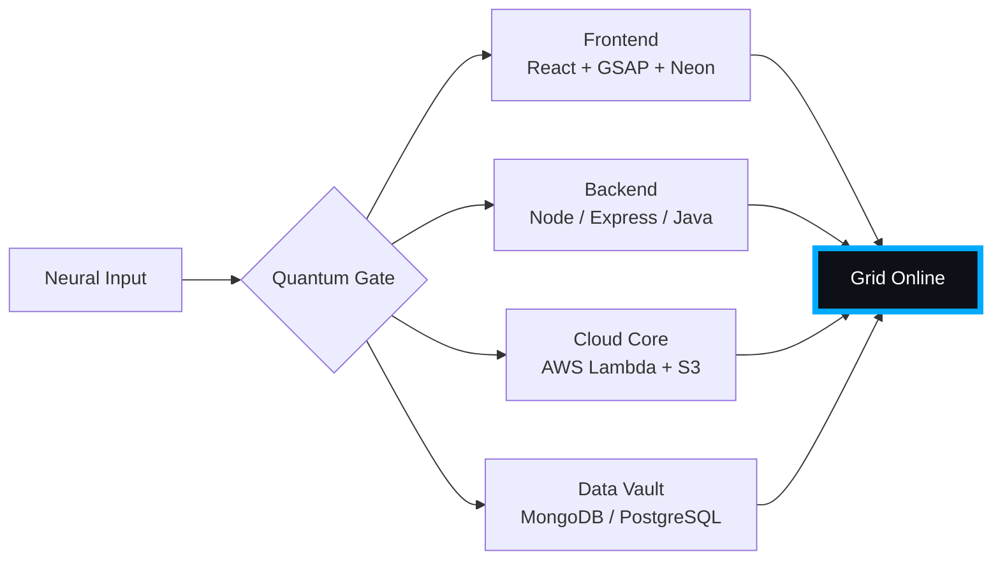

# 🌌 [ NEURAL CORE ACCESS: PENDEMVAMSI ]

<p align="center">
  
</p>

<div align="center">
  
  <br><small>Active Protocol: <strong style="color:#00AAFF">TRON LEGACY</strong> 🟦🟧</small>
</div>

## 🔵 NEURAL STATUS READOUT
```text
SUBJECT ID    →  PENDEMVAMSI
ENTITY CLASS  →  SHADOW MONARCH v9
NEURAL RANK   →  B-TIER
GRID SYNC     →  883/15058 QUANTUM PACKETS
─────── BIO-METRICS (TRON LEGACY) ───────
STRENGTH      149  ███████████████████░░
AGILITY       128  █████████████████░░░░
INTELLIGENCE  155  ████████████████████░
VITALITY      116  ███████████████░░░░░░
```

> **NEURAL BURST ACQUIRED:** +134 QUANTUM PACKETS 
> **SYSTEM MESSAGE:** QUANTUM ENTANGLEMENT CONFIRMED — YOU ARE THE SYSTEM

---

## 🌀 GRID ARCHITECTURE (HOLOGRAPHIC RENDER)



---

## 📡 ACADEMIC NODES – CONQUERED
- [x] B.Tech Neural Engineering (2020–2024) – St. Ann’s Grid
- [x] Intermediate Quantum Core (2018–2020) – Sri Medhavi
- [x] SSC Primary Link (2017–2018) – Sri Geethanjali

---

## ⚡ SKILL NEURAL MATRIX

<details open>
<summary>🔌 ACTIVE NEURAL LINKS</summary>

| Node               | Tier | Integrity Bar                | Status      |
|--------------------|------|------------------------------|-------------|
| Java Core          | S    | ████████████████████ 100%   | OVERCLOCKED |
| Node.js Grid       | S    | ████████████████████ 100%   | OVERCLOCKED |
| React Holo-UI      | A+   | █████████████████░░░ 92%    | ONLINE      |
| AWS Quantum Relay  | S    | ████████████████████ 100%   | SOVEREIGN   |
| Python AI Kernel   | A    | ████████████████░░░░ 85%    | CHARGING    |
| DSA Void Algorithm | A    | █████████████████░░░ 90%    | ACTIVE      |

</details>

---

## 🏅 NEURAL ACHIEVEMENT TOKENS

<p align="center">
  
  
  
  
</p>

---

## 👾 SHADOW ENTITIES – SUMMONED

<p align="center">
  
  <br><strong style="color:#00AAFF">ARISE.</strong>
</p>

| Entity | Designation   | Class            | Source Node                     |
|--------|---------------|------------------|---------------------------------|
| SH-01  | Igris         | Void Commander   | AI Financial Oracle             |
| SH-02  | Beru          | Swarm Overlord   | WebRTC Quantum Stream           |
| SH-03  | Kaisel        | Void Wyrm        | Geolocation Shadow Relay        |
| SH-04  | Tusk          | Arcane Construct | Global Pandemic Sentinel        |
| SH-05  | Iron          | Armored Bastion  | React Crypto Fortress           |

---

## 📡 GRID ANALYTICS (LIVE FEED)

<p align="center">
  
  <br>
  
  
</p>

---

## 🖥️ CORRUPTED MAINFRAME LOG (401 ENTRIES)

<details>
<summary>OPEN TERMINAL FEED – PROTOCOL: TRON LEGACY</summary>

> [0x12737E24] 🟦🟧 **TRON LEGACY PROTOCOL** #0 | NEURAL LINK STABILIZED | [TRANSMISSION SUCCESS]
> [0x52B695F7] 🟦🟧 **TRON LEGACY PROTOCOL** #1 | NEURAL LINK STABILIZED | [TRANSMISSION SUCCESS]
> [0xB9470BEF] 🟦🟧 **TRON LEGACY PROTOCOL** #2 | NEURAL LINK STABILIZED | [TRANSMISSION SUCCESS]
> [0x622CAB5C] 🟦🟧 **TRON LEGACY PROTOCOL** #3 | NEURAL LINK STABILIZED | [TRANSMISSION SUCCESS]
> [0x732E3C18] 🟦🟧 **TRON LEGACY PROTOCOL** #4 | NEURAL LINK STABILIZED | [TRANSMISSION SUCCESS]
> [0xC241FB13] 🟦🟧 **TRON LEGACY PROTOCOL** #5 | NEURAL LINK STABILIZED | [TRANSMISSION SUCCESS]
> [0xCBAAF32E] 🟦🟧 **TRON LEGACY PROTOCOL** #6 | NEURAL LINK STABILIZED | [TRANSMISSION SUCCESS]
> [0x84D5BF0C] 🟦🟧 **TRON LEGACY PROTOCOL** #7 | NEURAL LINK STABILIZED | [TRANSMISSION SUCCESS]
> [0xC9D03FFC] 🟦🟧 **TRON LEGACY PROTOCOL** #8 | NEURAL LINK STABILIZED | [TRANSMISSION SUCCESS]
> [0x4AA83F39] 🟦🟧 **TRON LEGACY PROTOCOL** #9 | NEURAL LINK STABILIZED | [TRANSMISSION SUCCESS]
> [0x88792C8F] 🟦🟧 **TRON LEGACY PROTOCOL** #10 | NEURAL LINK STABILIZED | [TRANSMISSION SUCCESS]
> [0x29E1E140] 🟦🟧 **TRON LEGACY PROTOCOL** #11 | NEURAL LINK STABILIZED | [TRANSMISSION SUCCESS]
> [0x95C87137] 🟦🟧 **TRON LEGACY PROTOCOL** #12 | NEURAL LINK STABILIZED | [TRANSMISSION SUCCESS]
> [0x391B7F5B] 🟦🟧 **TRON LEGACY PROTOCOL** #13 | NEURAL LINK  [GLITCH DETECTED] STABILIZED | [TRANSMISSION SUCCESS]
> [0x496FE72A] 🟦🟧 **TRON LEGACY PROTOCOL** #14 | NEURAL LINK STABILIZED | [TRANSMISSION SUCCESS]
> [0xAF77F312] 🟦🟧 **TRON LEGACY PROTOCOL** #15 | NEURAL LINK STABILIZED | [TRANSMISSION SUCCESS]
> [0x370782A1] 🟦🟧 **TRON LEGACY PROTOCOL** #16 | NEURAL LINK STABILIZED | [TRANSMISSION SUCCESS]
> [0x5D01375E] 🟦🟧 **TRON LEGACY PROTOCOL** #17 | NEURAL LINK STABILIZED | [TRANSMISSION SUCCESS]
> [0x360BAF78] 🟦🟧 **TRON LEGACY PROTOCOL** #18 | NEURAL LINK  [GLITCH DETECTED] STABILIZED | [TRANSMISSION SUCCESS]
> [0x2374DFC4] 🟦🟧 **TRON LEGACY PROTOCOL** #19 | NEURAL LINK STABILIZED | [TRANSMISSION SUCCESS]
> [0x8A376002] 🟦🟧 **TRON LEGACY PROTOCOL** #20 | NEURAL LINK STABILIZED | [TRANSMISSION SUCCESS]
> [0xFB7AD01A] 🟦🟧 **TRON LEGACY PROTOCOL** #21 | NEURAL LINK STABILIZED | [TRANSMISSION SUCCESS]
> [0xB1E41FC9] 🟦🟧 **TRON LEGACY PROTOCOL** #22 | NEURAL LINK STABILIZED | [TRANSMISSION SUCCESS]
> [0x606D955E] 🟦🟧 **TRON LEGACY PROTOCOL** #23 | NEURAL LINK  [GLITCH DETECTED] STABILIZED | [TRANSMISSION SUCCESS]
> [0xA454102F] 🟦🟧 **TRON LEGACY PROTOCOL** #24 | NEURAL LINK STABILIZED | [TRANSMISSION SUCCESS]
> [0x1071D802] 🟦🟧 **TRON LEGACY PROTOCOL** #25 | NEURAL LINK STABILIZED | [TRANSMISSION SUCCESS]
> [0x9358ED1A] 🟦🟧 **TRON LEGACY PROTOCOL** #26 | NEURAL LINK STABILIZED | [TRANSMISSION SUCCESS]
> [0xE49D3C82] 🟦🟧 **TRON LEGACY PROTOCOL** #27 | NEURAL LINK  [GLITCH DETECTED] STABILIZED | [TRANSMISSION SUCCESS]
> [0xD1927785] 🟦🟧 **TRON LEGACY PROTOCOL** #28 | NEURAL LINK STABILIZED | [TRANSMISSION SUCCESS]
> [0xA966CAB1] 🟦🟧 **TRON LEGACY PROTOCOL** #29 | NEURAL LINK  [GLITCH DETECTED] STABILIZED | [TRANSMISSION SUCCESS]
> [0x5B343002] 🟦🟧 **TRON LEGACY PROTOCOL** #30 | NEURAL LINK STABILIZED | [TRANSMISSION SUCCESS]
> [0xD305C154] 🟦🟧 **TRON LEGACY PROTOCOL** #31 | NEURAL LINK STABILIZED | [TRANSMISSION SUCCESS]
> [0xAF82F7B3] 🟦🟧 **TRON LEGACY PROTOCOL** #32 | NEURAL LINK STABILIZED | [TRANSMISSION SUCCESS]
> [0x01558800] 🟦🟧 **TRON LEGACY PROTOCOL** #33 | NEURAL LINK  [GLITCH DETECTED] STABILIZED | [TRANSMISSION SUCCESS]
> [0xD0A6B872] 🟦🟧 **TRON LEGACY PROTOCOL** #34 | NEURAL LINK STABILIZED | [TRANSMISSION SUCCESS]
> [0x37E89551] 🟦🟧 **TRON LEGACY PROTOCOL** #35 | NEURAL LINK STABILIZED | [TRANSMISSION SUCCESS]
> [0x453CBE99] 🟦🟧 **TRON LEGACY PROTOCOL** #36 | NEURAL LINK STABILIZED | [TRANSMISSION SUCCESS]
> [0xE2E8D20E] 🟦🟧 **TRON LEGACY PROTOCOL** #37 | NEURAL LINK STABILIZED | [TRANSMISSION SUCCESS]
> [0xF23AF4F3] 🟦🟧 **TRON LEGACY PROTOCOL** #38 | NEURAL LINK  [GLITCH DETECTED] STABILIZED | [TRANSMISSION SUCCESS]
> [0x3A91CE6D] 🟦🟧 **TRON LEGACY PROTOCOL** #39 | NEURAL LINK STABILIZED | [TRANSMISSION SUCCESS]
> [0xA1951F10] 🟦🟧 **TRON LEGACY PROTOCOL** #40 | NEURAL LINK STABILIZED | [TRANSMISSION SUCCESS]
> [0x8A380C2E] 🟦🟧 **TRON LEGACY PROTOCOL** #41 | NEURAL LINK STABILIZED | [TRANSMISSION SUCCESS]
> [0xA0EC1916] 🟦🟧 **TRON LEGACY PROTOCOL** #42 | NEURAL LINK STABILIZED | [TRANSMISSION SUCCESS]
> [0xCBD3599A] 🟦🟧 **TRON LEGACY PROTOCOL** #43 | NEURAL LINK STABILIZED | [TRANSMISSION SUCCESS]
> [0xBE7A6CC8] 🟦🟧 **TRON LEGACY PROTOCOL** #44 | NEURAL LINK  [GLITCH DETECTED] STABILIZED | [TRANSMISSION SUCCESS]
> [0xB101C9E6] 🟦🟧 **TRON LEGACY PROTOCOL** #45 | NEURAL LINK STABILIZED | [TRANSMISSION SUCCESS]
> [0x9BC9BF41] 🟦🟧 **TRON LEGACY PROTOCOL** #46 | NEURAL LINK STABILIZED | [TRANSMISSION SUCCESS]
> [0xCEB1489C] 🟦🟧 **TRON LEGACY PROTOCOL** #47 | NEURAL LINK STABILIZED | [TRANSMISSION SUCCESS]
> [0x517C0F7A] 🟦🟧 **TRON LEGACY PROTOCOL** #48 | NEURAL LINK STABILIZED | [TRANSMISSION SUCCESS]
> [0x9F60E534] 🟦🟧 **TRON LEGACY PROTOCOL** #49 | NEURAL LINK STABILIZED | [TRANSMISSION SUCCESS]
> [0xF996FC85] 🟦🟧 **TRON LEGACY PROTOCOL** #50 | NEURAL LINK STABILIZED | [TRANSMISSION SUCCESS]
> [0xA34760D6] 🟦🟧 **TRON LEGACY PROTOCOL** #51 | NEURAL LINK STABILIZED | [TRANSMISSION SUCCESS]
> [0x776762F8] 🟦🟧 **TRON LEGACY PROTOCOL** #52 | NEURAL LINK STABILIZED | [TRANSMISSION SUCCESS]
> [0x9EBAD457] 🟦🟧 **TRON LEGACY PROTOCOL** #53 | NEURAL LINK STABILIZED | [TRANSMISSION SUCCESS]
> [0x23C66935] 🟦🟧 **TRON LEGACY PROTOCOL** #54 | NEURAL LINK STABILIZED | [TRANSMISSION SUCCESS]
> [0x4807105C] 🟦🟧 **TRON LEGACY PROTOCOL** #55 | NEURAL LINK STABILIZED | [TRANSMISSION SUCCESS]
> [0x75CEE4DB] 🟦🟧 **TRON LEGACY PROTOCOL** #56 | NEURAL LINK STABILIZED | [TRANSMISSION SUCCESS]
> [0xA9774F1D] 🟦🟧 **TRON LEGACY PROTOCOL** #57 | NEURAL LINK STABILIZED | [TRANSMISSION SUCCESS]
> [0x376A9A57] 🟦🟧 **TRON LEGACY PROTOCOL** #58 | NEURAL LINK STABILIZED | [TRANSMISSION SUCCESS]
> [0xFC71F96B] 🟦🟧 **TRON LEGACY PROTOCOL** #59 | NEURAL LINK  [GLITCH DETECTED] STABILIZED | [TRANSMISSION SUCCESS]
> [0xC1775588] 🟦🟧 **TRON LEGACY PROTOCOL** #60 | NEURAL LINK STABILIZED | [TRANSMISSION SUCCESS]
> [0x2D4F21C3] 🟦🟧 **TRON LEGACY PROTOCOL** #61 | NEURAL LINK  [GLITCH DETECTED] STABILIZED | [TRANSMISSION SUCCESS]
> [0x72E6B507] 🟦🟧 **TRON LEGACY PROTOCOL** #62 | NEURAL LINK STABILIZED | [TRANSMISSION SUCCESS]
> [0x0E7449ED] 🟦🟧 **TRON LEGACY PROTOCOL** #63 | NEURAL LINK  [GLITCH DETECTED] STABILIZED | [TRANSMISSION SUCCESS]
> [0xD491C60D] 🟦🟧 **TRON LEGACY PROTOCOL** #64 | NEURAL LINK STABILIZED | [TRANSMISSION SUCCESS]
> [0x9D236BD0] 🟦🟧 **TRON LEGACY PROTOCOL** #65 | NEURAL LINK STABILIZED | [TRANSMISSION SUCCESS]
> [0xC5496C57] 🟦🟧 **TRON LEGACY PROTOCOL** #66 | NEURAL LINK STABILIZED | [TRANSMISSION SUCCESS]
> [0x656A2A03] 🟦🟧 **TRON LEGACY PROTOCOL** #67 | NEURAL LINK STABILIZED | [TRANSMISSION SUCCESS]
> [0xB0B41D7C] 🟦🟧 **TRON LEGACY PROTOCOL** #68 | NEURAL LINK STABILIZED | [TRANSMISSION SUCCESS]
> [0x7C44B341] 🟦🟧 **TRON LEGACY PROTOCOL** #69 | NEURAL LINK STABILIZED | [TRANSMISSION SUCCESS]
> [0x9A4C43A0] 🟦🟧 **TRON LEGACY PROTOCOL** #70 | NEURAL LINK  [GLITCH DETECTED] STABILIZED | [TRANSMISSION SUCCESS]
> [0x6D929019] 🟦🟧 **TRON LEGACY PROTOCOL** #71 | NEURAL LINK STABILIZED | [TRANSMISSION SUCCESS]
> [0x68537581] 🟦🟧 **TRON LEGACY PROTOCOL** #72 | NEURAL LINK STABILIZED | [TRANSMISSION SUCCESS]
> [0xA511B79E] 🟦🟧 **TRON LEGACY PROTOCOL** #73 | NEURAL LINK STABILIZED | [TRANSMISSION SUCCESS]
> [0xC7BF521C] 🟦🟧 **TRON LEGACY PROTOCOL** #74 | NEURAL LINK  [GLITCH DETECTED] STABILIZED | [TRANSMISSION SUCCESS]
> [0x718EFAD5] 🟦🟧 **TRON LEGACY PROTOCOL** #75 | NEURAL LINK STABILIZED | [TRANSMISSION SUCCESS]
> [0x1A2EB68D] 🟦🟧 **TRON LEGACY PROTOCOL** #76 | NEURAL LINK STABILIZED | [TRANSMISSION SUCCESS]
> [0x6DC1CE16] 🟦🟧 **TRON LEGACY PROTOCOL** #77 | NEURAL LINK STABILIZED | [TRANSMISSION SUCCESS]
> [0x2243C659] 🟦🟧 **TRON LEGACY PROTOCOL** #78 | NEURAL LINK STABILIZED | [TRANSMISSION SUCCESS]
> [0x3937664F] 🟦🟧 **TRON LEGACY PROTOCOL** #79 | NEURAL LINK STABILIZED | [TRANSMISSION SUCCESS]
> [0x373D9487] 🟦🟧 **TRON LEGACY PROTOCOL** #80 | NEURAL LINK  [GLITCH DETECTED] STABILIZED | [TRANSMISSION SUCCESS]
> [0xC47C3C5D] 🟦🟧 **TRON LEGACY PROTOCOL** #81 | NEURAL LINK STABILIZED | [TRANSMISSION SUCCESS]
> [0x2A68859F] 🟦🟧 **TRON LEGACY PROTOCOL** #82 | NEURAL LINK  [GLITCH DETECTED] STABILIZED | [TRANSMISSION SUCCESS]
> [0x5835F52D] 🟦🟧 **TRON LEGACY PROTOCOL** #83 | NEURAL LINK STABILIZED | [TRANSMISSION SUCCESS]
> [0xD7B09299] 🟦🟧 **TRON LEGACY PROTOCOL** #84 | NEURAL LINK STABILIZED | [TRANSMISSION SUCCESS]
> [0x129627DA] 🟦🟧 **TRON LEGACY PROTOCOL** #85 | NEURAL LINK STABILIZED | [TRANSMISSION SUCCESS]
> [0x64EFE843] 🟦🟧 **TRON LEGACY PROTOCOL** #86 | NEURAL LINK  [GLITCH DETECTED] STABILIZED | [TRANSMISSION SUCCESS]
> [0xAF4D1859] 🟦🟧 **TRON LEGACY PROTOCOL** #87 | NEURAL LINK STABILIZED | [TRANSMISSION SUCCESS]
> [0x85230DFD] 🟦🟧 **TRON LEGACY PROTOCOL** #88 | NEURAL LINK STABILIZED | [TRANSMISSION SUCCESS]
> [0x210BDF04] 🟦🟧 **TRON LEGACY PROTOCOL** #89 | NEURAL LINK STABILIZED | [TRANSMISSION SUCCESS]
> [0x2B1756CE] 🟦🟧 **TRON LEGACY PROTOCOL** #90 | NEURAL LINK  [GLITCH DETECTED] STABILIZED | [TRANSMISSION SUCCESS]
> [0xECBB3037] 🟦🟧 **TRON LEGACY PROTOCOL** #91 | NEURAL LINK STABILIZED | [TRANSMISSION SUCCESS]
> [0xC96EFEB7] 🟦🟧 **TRON LEGACY PROTOCOL** #92 | NEURAL LINK STABILIZED | [TRANSMISSION SUCCESS]
> [0x3A23FD90] 🟦🟧 **TRON LEGACY PROTOCOL** #93 | NEURAL LINK STABILIZED | [TRANSMISSION SUCCESS]
> [0x50834A71] 🟦🟧 **TRON LEGACY PROTOCOL** #94 | NEURAL LINK STABILIZED | [TRANSMISSION SUCCESS]
> [0xA4AAE8C9] 🟦🟧 **TRON LEGACY PROTOCOL** #95 | NEURAL LINK STABILIZED | [TRANSMISSION SUCCESS]
> [0x571783F9] 🟦🟧 **TRON LEGACY PROTOCOL** #96 | NEURAL LINK STABILIZED | [TRANSMISSION SUCCESS]
> [0xDEEC8151] 🟦🟧 **TRON LEGACY PROTOCOL** #97 | NEURAL LINK STABILIZED | [TRANSMISSION SUCCESS]
> [0x0285F2C9] 🟦🟧 **TRON LEGACY PROTOCOL** #98 | NEURAL LINK STABILIZED | [TRANSMISSION SUCCESS]
> [0xF18710C7] 🟦🟧 **TRON LEGACY PROTOCOL** #99 | NEURAL LINK STABILIZED | [TRANSMISSION SUCCESS]
> [0x6C313BCC] 🟦🟧 **TRON LEGACY PROTOCOL** #100 | NEURAL LINK STABILIZED | [TRANSMISSION SUCCESS]
> [0xF5DEF185] 🟦🟧 **TRON LEGACY PROTOCOL** #101 | NEURAL LINK STABILIZED | [TRANSMISSION SUCCESS]
> [0x5796B5BF] 🟦🟧 **TRON LEGACY PROTOCOL** #102 | NEURAL LINK STABILIZED | [TRANSMISSION SUCCESS]
> [0xBA10CEE0] 🟦🟧 **TRON LEGACY PROTOCOL** #103 | NEURAL LINK STABILIZED | [TRANSMISSION SUCCESS]
> [0x1BDFF5AF] 🟦🟧 **TRON LEGACY PROTOCOL** #104 | NEURAL LINK STABILIZED | [TRANSMISSION SUCCESS]
> [0xE91D24B5] 🟦🟧 **TRON LEGACY PROTOCOL** #105 | NEURAL LINK STABILIZED | [TRANSMISSION SUCCESS]
> [0x538D2CFC] 🟦🟧 **TRON LEGACY PROTOCOL** #106 | NEURAL LINK STABILIZED | [TRANSMISSION SUCCESS]
> [0x181C6EA1] 🟦🟧 **TRON LEGACY PROTOCOL** #107 | NEURAL LINK STABILIZED | [TRANSMISSION SUCCESS]
> [0xFE4294A7] 🟦🟧 **TRON LEGACY PROTOCOL** #108 | NEURAL LINK STABILIZED | [TRANSMISSION SUCCESS]
> [0xB0F6AD1A] 🟦🟧 **TRON LEGACY PROTOCOL** #109 | NEURAL LINK STABILIZED | [TRANSMISSION SUCCESS]
> [0xB2954870] 🟦🟧 **TRON LEGACY PROTOCOL** #110 | NEURAL LINK STABILIZED | [TRANSMISSION SUCCESS]
> [0xC9A55D92] 🟦🟧 **TRON LEGACY PROTOCOL** #111 | NEURAL LINK STABILIZED | [TRANSMISSION SUCCESS]
> [0x50C3886A] 🟦🟧 **TRON LEGACY PROTOCOL** #112 | NEURAL LINK STABILIZED | [TRANSMISSION SUCCESS]
> [0xCEA4C34A] 🟦🟧 **TRON LEGACY PROTOCOL** #113 | NEURAL LINK  [GLITCH DETECTED] STABILIZED | [TRANSMISSION SUCCESS]
> [0x2D5B900D] 🟦🟧 **TRON LEGACY PROTOCOL** #114 | NEURAL LINK STABILIZED | [TRANSMISSION SUCCESS]
> [0x14CE9A82] 🟦🟧 **TRON LEGACY PROTOCOL** #115 | NEURAL LINK STABILIZED | [TRANSMISSION SUCCESS]
> [0xC046CAD6] 🟦🟧 **TRON LEGACY PROTOCOL** #116 | NEURAL LINK STABILIZED | [TRANSMISSION SUCCESS]
> [0x3A721AA7] 🟦🟧 **TRON LEGACY PROTOCOL** #117 | NEURAL LINK STABILIZED | [TRANSMISSION SUCCESS]
> [0x9570872D] 🟦🟧 **TRON LEGACY PROTOCOL** #118 | NEURAL LINK STABILIZED | [TRANSMISSION SUCCESS]
> [0x9C95BFA0] 🟦🟧 **TRON LEGACY PROTOCOL** #119 | NEURAL LINK STABILIZED | [TRANSMISSION SUCCESS]
> [0x9145303D] 🟦🟧 **TRON LEGACY PROTOCOL** #120 | NEURAL LINK STABILIZED | [TRANSMISSION SUCCESS]
> [0x0D67C37C] 🟦🟧 **TRON LEGACY PROTOCOL** #121 | NEURAL LINK STABILIZED | [TRANSMISSION SUCCESS]
> [0x3A5D541A] 🟦🟧 **TRON LEGACY PROTOCOL** #122 | NEURAL LINK STABILIZED | [TRANSMISSION SUCCESS]
> [0x200DFA95] 🟦🟧 **TRON LEGACY PROTOCOL** #123 | NEURAL LINK STABILIZED | [TRANSMISSION SUCCESS]
> [0xD4C44731] 🟦🟧 **TRON LEGACY PROTOCOL** #124 | NEURAL LINK STABILIZED | [TRANSMISSION SUCCESS]
> [0xFEB99CED] 🟦🟧 **TRON LEGACY PROTOCOL** #125 | NEURAL LINK  [GLITCH DETECTED] STABILIZED | [TRANSMISSION SUCCESS]
> [0x5C5436F9] 🟦🟧 **TRON LEGACY PROTOCOL** #126 | NEURAL LINK STABILIZED | [TRANSMISSION SUCCESS]
> [0x1B40207A] 🟦🟧 **TRON LEGACY PROTOCOL** #127 | NEURAL LINK STABILIZED | [TRANSMISSION SUCCESS]
> [0x2EF81B6A] 🟦🟧 **TRON LEGACY PROTOCOL** #128 | NEURAL LINK STABILIZED | [TRANSMISSION SUCCESS]
> [0x9EA0E5FB] 🟦🟧 **TRON LEGACY PROTOCOL** #129 | NEURAL LINK STABILIZED | [TRANSMISSION SUCCESS]
> [0x573A94CF] 🟦🟧 **TRON LEGACY PROTOCOL** #130 | NEURAL LINK STABILIZED | [TRANSMISSION SUCCESS]
> [0x92FC25E7] 🟦🟧 **TRON LEGACY PROTOCOL** #131 | NEURAL LINK STABILIZED | [TRANSMISSION SUCCESS]
> [0xCC038339] 🟦🟧 **TRON LEGACY PROTOCOL** #132 | NEURAL LINK STABILIZED | [TRANSMISSION SUCCESS]
> [0x9BC1E86E] 🟦🟧 **TRON LEGACY PROTOCOL** #133 | NEURAL LINK  [GLITCH DETECTED] STABILIZED | [TRANSMISSION SUCCESS]
> [0x37E400BE] 🟦🟧 **TRON LEGACY PROTOCOL** #134 | NEURAL LINK STABILIZED | [TRANSMISSION SUCCESS]
> [0x1560C81B] 🟦🟧 **TRON LEGACY PROTOCOL** #135 | NEURAL LINK STABILIZED | [TRANSMISSION SUCCESS]
> [0x32765409] 🟦🟧 **TRON LEGACY PROTOCOL** #136 | NEURAL LINK STABILIZED | [TRANSMISSION SUCCESS]
> [0x1450FD2D] 🟦🟧 **TRON LEGACY PROTOCOL** #137 | NEURAL LINK STABILIZED | [TRANSMISSION SUCCESS]
> [0x98996883] 🟦🟧 **TRON LEGACY PROTOCOL** #138 | NEURAL LINK STABILIZED | [TRANSMISSION SUCCESS]
> [0x54FE681D] 🟦🟧 **TRON LEGACY PROTOCOL** #139 | NEURAL LINK  [GLITCH DETECTED] STABILIZED | [TRANSMISSION SUCCESS]
> [0x6E26FF98] 🟦🟧 **TRON LEGACY PROTOCOL** #140 | NEURAL LINK STABILIZED | [TRANSMISSION SUCCESS]
> [0x22802014] 🟦🟧 **TRON LEGACY PROTOCOL** #141 | NEURAL LINK STABILIZED | [TRANSMISSION SUCCESS]
> [0xB03279DD] 🟦🟧 **TRON LEGACY PROTOCOL** #142 | NEURAL LINK STABILIZED | [TRANSMISSION SUCCESS]
> [0x2BF92E2E] 🟦🟧 **TRON LEGACY PROTOCOL** #143 | NEURAL LINK STABILIZED | [TRANSMISSION SUCCESS]
> [0xFC365026] 🟦🟧 **TRON LEGACY PROTOCOL** #144 | NEURAL LINK STABILIZED | [TRANSMISSION SUCCESS]
> [0xFB360ACA] 🟦🟧 **TRON LEGACY PROTOCOL** #145 | NEURAL LINK STABILIZED | [TRANSMISSION SUCCESS]
> [0xB60DC24B] 🟦🟧 **TRON LEGACY PROTOCOL** #146 | NEURAL LINK STABILIZED | [TRANSMISSION SUCCESS]
> [0x7C7703F3] 🟦🟧 **TRON LEGACY PROTOCOL** #147 | NEURAL LINK STABILIZED | [TRANSMISSION SUCCESS]
> [0x7030D722] 🟦🟧 **TRON LEGACY PROTOCOL** #148 | NEURAL LINK  [GLITCH DETECTED] STABILIZED | [TRANSMISSION SUCCESS]
> [0x10515119] 🟦🟧 **TRON LEGACY PROTOCOL** #149 | NEURAL LINK STABILIZED | [TRANSMISSION SUCCESS]
> [0x310CF1EA] 🟦🟧 **TRON LEGACY PROTOCOL** #150 | NEURAL LINK STABILIZED | [TRANSMISSION SUCCESS]
> [0x161FB563] 🟦🟧 **TRON LEGACY PROTOCOL** #151 | NEURAL LINK STABILIZED | [TRANSMISSION SUCCESS]
> [0x87167FA5] 🟦🟧 **TRON LEGACY PROTOCOL** #152 | NEURAL LINK STABILIZED | [TRANSMISSION SUCCESS]
> [0xB8CDE958] 🟦🟧 **TRON LEGACY PROTOCOL** #153 | NEURAL LINK STABILIZED | [TRANSMISSION SUCCESS]
> [0xD7436E75] 🟦🟧 **TRON LEGACY PROTOCOL** #154 | NEURAL LINK STABILIZED | [TRANSMISSION SUCCESS]
> [0xF1A7BF38] 🟦🟧 **TRON LEGACY PROTOCOL** #155 | NEURAL LINK STABILIZED | [TRANSMISSION SUCCESS]
> [0xB60D12E2] 🟦🟧 **TRON LEGACY PROTOCOL** #156 | NEURAL LINK STABILIZED | [TRANSMISSION SUCCESS]
> [0xF7E44BB7] 🟦🟧 **TRON LEGACY PROTOCOL** #157 | NEURAL LINK STABILIZED | [TRANSMISSION SUCCESS]
> [0xA33B469F] 🟦🟧 **TRON LEGACY PROTOCOL** #158 | NEURAL LINK STABILIZED | [TRANSMISSION SUCCESS]
> [0x78868C19] 🟦🟧 **TRON LEGACY PROTOCOL** #159 | NEURAL LINK STABILIZED | [TRANSMISSION SUCCESS]
> [0x6245F273] 🟦🟧 **TRON LEGACY PROTOCOL** #160 | NEURAL LINK STABILIZED | [TRANSMISSION SUCCESS]
> [0x0D7E97FE] 🟦🟧 **TRON LEGACY PROTOCOL** #161 | NEURAL LINK  [GLITCH DETECTED] STABILIZED | [TRANSMISSION SUCCESS]
> [0x3A689D9F] 🟦🟧 **TRON LEGACY PROTOCOL** #162 | NEURAL LINK  [GLITCH DETECTED] STABILIZED | [TRANSMISSION SUCCESS]
> [0x4DA04D37] 🟦🟧 **TRON LEGACY PROTOCOL** #163 | NEURAL LINK STABILIZED | [TRANSMISSION SUCCESS]
> [0x369FF1C2] 🟦🟧 **TRON LEGACY PROTOCOL** #164 | NEURAL LINK STABILIZED | [TRANSMISSION SUCCESS]
> [0xE19D150A] 🟦🟧 **TRON LEGACY PROTOCOL** #165 | NEURAL LINK STABILIZED | [TRANSMISSION SUCCESS]
> [0x0799C0FA] 🟦🟧 **TRON LEGACY PROTOCOL** #166 | NEURAL LINK STABILIZED | [TRANSMISSION SUCCESS]
> [0x7BC7DDC9] 🟦🟧 **TRON LEGACY PROTOCOL** #167 | NEURAL LINK STABILIZED | [TRANSMISSION SUCCESS]
> [0x7B9B858A] 🟦🟧 **TRON LEGACY PROTOCOL** #168 | NEURAL LINK STABILIZED | [TRANSMISSION SUCCESS]
> [0x4CCBEAC2] 🟦🟧 **TRON LEGACY PROTOCOL** #169 | NEURAL LINK STABILIZED | [TRANSMISSION SUCCESS]
> [0x1C57E126] 🟦🟧 **TRON LEGACY PROTOCOL** #170 | NEURAL LINK STABILIZED | [TRANSMISSION SUCCESS]
> [0x7D19E38E] 🟦🟧 **TRON LEGACY PROTOCOL** #171 | NEURAL LINK STABILIZED | [TRANSMISSION SUCCESS]
> [0xC065641D] 🟦🟧 **TRON LEGACY PROTOCOL** #172 | NEURAL LINK STABILIZED | [TRANSMISSION SUCCESS]
> [0x1039F4B5] 🟦🟧 **TRON LEGACY PROTOCOL** #173 | NEURAL LINK STABILIZED | [TRANSMISSION SUCCESS]
> [0x36B2A089] 🟦🟧 **TRON LEGACY PROTOCOL** #174 | NEURAL LINK STABILIZED | [TRANSMISSION SUCCESS]
> [0x587E1D71] 🟦🟧 **TRON LEGACY PROTOCOL** #175 | NEURAL LINK  [GLITCH DETECTED] STABILIZED | [TRANSMISSION SUCCESS]
> [0x3443E915] 🟦🟧 **TRON LEGACY PROTOCOL** #176 | NEURAL LINK  [GLITCH DETECTED] STABILIZED | [TRANSMISSION SUCCESS]
> [0xCB982C31] 🟦🟧 **TRON LEGACY PROTOCOL** #177 | NEURAL LINK STABILIZED | [TRANSMISSION SUCCESS]
> [0x37BE016A] 🟦🟧 **TRON LEGACY PROTOCOL** #178 | NEURAL LINK STABILIZED | [TRANSMISSION SUCCESS]
> [0xD995252B] 🟦🟧 **TRON LEGACY PROTOCOL** #179 | NEURAL LINK STABILIZED | [TRANSMISSION SUCCESS]
> [0x310B32D7] 🟦🟧 **TRON LEGACY PROTOCOL** #180 | NEURAL LINK STABILIZED | [TRANSMISSION SUCCESS]
> [0xA9C67E63] 🟦🟧 **TRON LEGACY PROTOCOL** #181 | NEURAL LINK STABILIZED | [TRANSMISSION SUCCESS]
> [0x5FD91892] 🟦🟧 **TRON LEGACY PROTOCOL** #182 | NEURAL LINK STABILIZED | [TRANSMISSION SUCCESS]
> [0xF778CD9F] 🟦🟧 **TRON LEGACY PROTOCOL** #183 | NEURAL LINK STABILIZED | [TRANSMISSION SUCCESS]
> [0x22D436E6] 🟦🟧 **TRON LEGACY PROTOCOL** #184 | NEURAL LINK STABILIZED | [TRANSMISSION SUCCESS]
> [0x20BB1195] 🟦🟧 **TRON LEGACY PROTOCOL** #185 | NEURAL LINK STABILIZED | [TRANSMISSION SUCCESS]
> [0xE6638DE1] 🟦🟧 **TRON LEGACY PROTOCOL** #186 | NEURAL LINK STABILIZED | [TRANSMISSION SUCCESS]
> [0xBC33AE22] 🟦🟧 **TRON LEGACY PROTOCOL** #187 | NEURAL LINK STABILIZED | [TRANSMISSION SUCCESS]
> [0xE7E36C76] 🟦🟧 **TRON LEGACY PROTOCOL** #188 | NEURAL LINK STABILIZED | [TRANSMISSION SUCCESS]
> [0xC268448A] 🟦🟧 **TRON LEGACY PROTOCOL** #189 | NEURAL LINK  [GLITCH DETECTED] STABILIZED | [TRANSMISSION SUCCESS]
> [0xD794CD92] 🟦🟧 **TRON LEGACY PROTOCOL** #190 | NEURAL LINK  [GLITCH DETECTED] STABILIZED | [TRANSMISSION SUCCESS]
> [0x74865817] 🟦🟧 **TRON LEGACY PROTOCOL** #191 | NEURAL LINK STABILIZED | [TRANSMISSION SUCCESS]
> [0x86350EEC] 🟦🟧 **TRON LEGACY PROTOCOL** #192 | NEURAL LINK STABILIZED | [TRANSMISSION SUCCESS]
> [0x8009725F] 🟦🟧 **TRON LEGACY PROTOCOL** #193 | NEURAL LINK STABILIZED | [TRANSMISSION SUCCESS]
> [0x6C81B9B9] 🟦🟧 **TRON LEGACY PROTOCOL** #194 | NEURAL LINK STABILIZED | [TRANSMISSION SUCCESS]
> [0x71F64128] 🟦🟧 **TRON LEGACY PROTOCOL** #195 | NEURAL LINK STABILIZED | [TRANSMISSION SUCCESS]
> [0x4DBB2261] 🟦🟧 **TRON LEGACY PROTOCOL** #196 | NEURAL LINK STABILIZED | [TRANSMISSION SUCCESS]
> [0xCFB31D48] 🟦🟧 **TRON LEGACY PROTOCOL** #197 | NEURAL LINK STABILIZED | [TRANSMISSION SUCCESS]
> [0x9C7E0FBF] 🟦🟧 **TRON LEGACY PROTOCOL** #198 | NEURAL LINK STABILIZED | [TRANSMISSION SUCCESS]
> [0x0CB80DB2] 🟦🟧 **TRON LEGACY PROTOCOL** #199 | NEURAL LINK STABILIZED | [TRANSMISSION SUCCESS]
> [0x061E8481] 🟦🟧 **TRON LEGACY PROTOCOL** #200 | NEURAL LINK  [GLITCH DETECTED] STABILIZED | [TRANSMISSION SUCCESS]
> [0x963762C7] 🟦🟧 **TRON LEGACY PROTOCOL** #201 | NEURAL LINK STABILIZED | [TRANSMISSION SUCCESS]
> [0x4B56E73C] 🟦🟧 **TRON LEGACY PROTOCOL** #202 | NEURAL LINK STABILIZED | [TRANSMISSION SUCCESS]
> [0x54BDE451] 🟦🟧 **TRON LEGACY PROTOCOL** #203 | NEURAL LINK STABILIZED | [TRANSMISSION SUCCESS]
> [0xDBA26684] 🟦🟧 **TRON LEGACY PROTOCOL** #204 | NEURAL LINK STABILIZED | [TRANSMISSION SUCCESS]
> [0xB36C81E8] 🟦🟧 **TRON LEGACY PROTOCOL** #205 | NEURAL LINK  [GLITCH DETECTED] STABILIZED | [TRANSMISSION SUCCESS]
> [0x7239B241] 🟦🟧 **TRON LEGACY PROTOCOL** #206 | NEURAL LINK STABILIZED | [TRANSMISSION SUCCESS]
> [0x5B8C065E] 🟦🟧 **TRON LEGACY PROTOCOL** #207 | NEURAL LINK STABILIZED | [TRANSMISSION SUCCESS]
> [0xC59BA824] 🟦🟧 **TRON LEGACY PROTOCOL** #208 | NEURAL LINK STABILIZED | [TRANSMISSION SUCCESS]
> [0x732AD1E5] 🟦🟧 **TRON LEGACY PROTOCOL** #209 | NEURAL LINK STABILIZED | [TRANSMISSION SUCCESS]
> [0x5BD0B555] 🟦🟧 **TRON LEGACY PROTOCOL** #210 | NEURAL LINK STABILIZED | [TRANSMISSION SUCCESS]
> [0xD795A3DE] 🟦🟧 **TRON LEGACY PROTOCOL** #211 | NEURAL LINK STABILIZED | [TRANSMISSION SUCCESS]
> [0x798D5D67] 🟦🟧 **TRON LEGACY PROTOCOL** #212 | NEURAL LINK STABILIZED | [TRANSMISSION SUCCESS]
> [0x1EB7A4EF] 🟦🟧 **TRON LEGACY PROTOCOL** #213 | NEURAL LINK STABILIZED | [TRANSMISSION SUCCESS]
> [0x24CEB972] 🟦🟧 **TRON LEGACY PROTOCOL** #214 | NEURAL LINK STABILIZED | [TRANSMISSION SUCCESS]
> [0x75293E3A] 🟦🟧 **TRON LEGACY PROTOCOL** #215 | NEURAL LINK  [GLITCH DETECTED] STABILIZED | [TRANSMISSION SUCCESS]
> [0xB6362A7E] 🟦🟧 **TRON LEGACY PROTOCOL** #216 | NEURAL LINK STABILIZED | [TRANSMISSION SUCCESS]
> [0x5D9CBDAF] 🟦🟧 **TRON LEGACY PROTOCOL** #217 | NEURAL LINK STABILIZED | [TRANSMISSION SUCCESS]
> [0x79155084] 🟦🟧 **TRON LEGACY PROTOCOL** #218 | NEURAL LINK STABILIZED | [TRANSMISSION SUCCESS]
> [0x170C97D4] 🟦🟧 **TRON LEGACY PROTOCOL** #219 | NEURAL LINK STABILIZED | [TRANSMISSION SUCCESS]
> [0x3FD29038] 🟦🟧 **TRON LEGACY PROTOCOL** #220 | NEURAL LINK  [GLITCH DETECTED] STABILIZED | [TRANSMISSION SUCCESS]
> [0x035BE7C5] 🟦🟧 **TRON LEGACY PROTOCOL** #221 | NEURAL LINK STABILIZED | [TRANSMISSION SUCCESS]
> [0x8D6C1392] 🟦🟧 **TRON LEGACY PROTOCOL** #222 | NEURAL LINK  [GLITCH DETECTED] STABILIZED | [TRANSMISSION SUCCESS]
> [0xA310E948] 🟦🟧 **TRON LEGACY PROTOCOL** #223 | NEURAL LINK STABILIZED | [TRANSMISSION SUCCESS]
> [0x396AF94D] 🟦🟧 **TRON LEGACY PROTOCOL** #224 | NEURAL LINK STABILIZED | [TRANSMISSION SUCCESS]
> [0x201738F1] 🟦🟧 **TRON LEGACY PROTOCOL** #225 | NEURAL LINK STABILIZED | [TRANSMISSION SUCCESS]
> [0x3B51BEE0] 🟦🟧 **TRON LEGACY PROTOCOL** #226 | NEURAL LINK STABILIZED | [TRANSMISSION SUCCESS]
> [0xFB3F78B7] 🟦🟧 **TRON LEGACY PROTOCOL** #227 | NEURAL LINK  [GLITCH DETECTED] STABILIZED | [TRANSMISSION SUCCESS]
> [0x82228139] 🟦🟧 **TRON LEGACY PROTOCOL** #228 | NEURAL LINK STABILIZED | [TRANSMISSION SUCCESS]
> [0x90FC6D52] 🟦🟧 **TRON LEGACY PROTOCOL** #229 | NEURAL LINK  [GLITCH DETECTED] STABILIZED | [TRANSMISSION SUCCESS]
> [0x6D821025] 🟦🟧 **TRON LEGACY PROTOCOL** #230 | NEURAL LINK STABILIZED | [TRANSMISSION SUCCESS]
> [0x85F2E317] 🟦🟧 **TRON LEGACY PROTOCOL** #231 | NEURAL LINK STABILIZED | [TRANSMISSION SUCCESS]
> [0xB36429FE] 🟦🟧 **TRON LEGACY PROTOCOL** #232 | NEURAL LINK STABILIZED | [TRANSMISSION SUCCESS]
> [0x344DEF92] 🟦🟧 **TRON LEGACY PROTOCOL** #233 | NEURAL LINK STABILIZED | [TRANSMISSION SUCCESS]
> [0x83E18788] 🟦🟧 **TRON LEGACY PROTOCOL** #234 | NEURAL LINK STABILIZED | [TRANSMISSION SUCCESS]
> [0xF384E796] 🟦🟧 **TRON LEGACY PROTOCOL** #235 | NEURAL LINK STABILIZED | [TRANSMISSION SUCCESS]
> [0x057F1B1B] 🟦🟧 **TRON LEGACY PROTOCOL** #236 | NEURAL LINK STABILIZED | [TRANSMISSION SUCCESS]
> [0x9065F22F] 🟦🟧 **TRON LEGACY PROTOCOL** #237 | NEURAL LINK STABILIZED | [TRANSMISSION SUCCESS]
> [0xD2BB2B83] 🟦🟧 **TRON LEGACY PROTOCOL** #238 | NEURAL LINK STABILIZED | [TRANSMISSION SUCCESS]
> [0xF368362B] 🟦🟧 **TRON LEGACY PROTOCOL** #239 | NEURAL LINK STABILIZED | [TRANSMISSION SUCCESS]
> [0x293A35F9] 🟦🟧 **TRON LEGACY PROTOCOL** #240 | NEURAL LINK STABILIZED | [TRANSMISSION SUCCESS]
> [0x4CAA0961] 🟦🟧 **TRON LEGACY PROTOCOL** #241 | NEURAL LINK  [GLITCH DETECTED] STABILIZED | [TRANSMISSION SUCCESS]
> [0xDE4832D2] 🟦🟧 **TRON LEGACY PROTOCOL** #242 | NEURAL LINK STABILIZED | [TRANSMISSION SUCCESS]
> [0x0040F617] 🟦🟧 **TRON LEGACY PROTOCOL** #243 | NEURAL LINK STABILIZED | [TRANSMISSION SUCCESS]
> [0xE3E3D8E3] 🟦🟧 **TRON LEGACY PROTOCOL** #244 | NEURAL LINK STABILIZED | [TRANSMISSION SUCCESS]
> [0xFD82951C] 🟦🟧 **TRON LEGACY PROTOCOL** #245 | NEURAL LINK STABILIZED | [TRANSMISSION SUCCESS]
> [0xAA36C7AC] 🟦🟧 **TRON LEGACY PROTOCOL** #246 | NEURAL LINK STABILIZED | [TRANSMISSION SUCCESS]
> [0xF464D8DD] 🟦🟧 **TRON LEGACY PROTOCOL** #247 | NEURAL LINK STABILIZED | [TRANSMISSION SUCCESS]
> [0x684F9B60] 🟦🟧 **TRON LEGACY PROTOCOL** #248 | NEURAL LINK  [GLITCH DETECTED] STABILIZED | [TRANSMISSION SUCCESS]
> [0x046E3F05] 🟦🟧 **TRON LEGACY PROTOCOL** #249 | NEURAL LINK  [GLITCH DETECTED] STABILIZED | [TRANSMISSION SUCCESS]
> [0x7C25EB04] 🟦🟧 **TRON LEGACY PROTOCOL** #250 | NEURAL LINK  [GLITCH DETECTED] STABILIZED | [TRANSMISSION SUCCESS]
> [0x7B159FCA] 🟦🟧 **TRON LEGACY PROTOCOL** #251 | NEURAL LINK STABILIZED | [TRANSMISSION SUCCESS]
> [0xBCA9C10A] 🟦🟧 **TRON LEGACY PROTOCOL** #252 | NEURAL LINK STABILIZED | [TRANSMISSION SUCCESS]
> [0xA2FEED14] 🟦🟧 **TRON LEGACY PROTOCOL** #253 | NEURAL LINK STABILIZED | [TRANSMISSION SUCCESS]
> [0x86E1E617] 🟦🟧 **TRON LEGACY PROTOCOL** #254 | NEURAL LINK  [GLITCH DETECTED] STABILIZED | [TRANSMISSION SUCCESS]
> [0x8BA24AF1] 🟦🟧 **TRON LEGACY PROTOCOL** #255 | NEURAL LINK STABILIZED | [TRANSMISSION SUCCESS]
> [0x72BACADE] 🟦🟧 **TRON LEGACY PROTOCOL** #256 | NEURAL LINK STABILIZED | [TRANSMISSION SUCCESS]
> [0x0ED2E2BA] 🟦🟧 **TRON LEGACY PROTOCOL** #257 | NEURAL LINK STABILIZED | [TRANSMISSION SUCCESS]
> [0x70A6DCB7] 🟦🟧 **TRON LEGACY PROTOCOL** #258 | NEURAL LINK STABILIZED | [TRANSMISSION SUCCESS]
> [0x7A2F36D2] 🟦🟧 **TRON LEGACY PROTOCOL** #259 | NEURAL LINK  [GLITCH DETECTED] STABILIZED | [TRANSMISSION SUCCESS]
> [0x3A0CFF74] 🟦🟧 **TRON LEGACY PROTOCOL** #260 | NEURAL LINK STABILIZED | [TRANSMISSION SUCCESS]
> [0x601874B5] 🟦🟧 **TRON LEGACY PROTOCOL** #261 | NEURAL LINK STABILIZED | [TRANSMISSION SUCCESS]
> [0x1905D220] 🟦🟧 **TRON LEGACY PROTOCOL** #262 | NEURAL LINK STABILIZED | [TRANSMISSION SUCCESS]
> [0x76C0BE3C] 🟦🟧 **TRON LEGACY PROTOCOL** #263 | NEURAL LINK STABILIZED | [TRANSMISSION SUCCESS]
> [0x28D3A194] 🟦🟧 **TRON LEGACY PROTOCOL** #264 | NEURAL LINK STABILIZED | [TRANSMISSION SUCCESS]
> [0x5BB6679C] 🟦🟧 **TRON LEGACY PROTOCOL** #265 | NEURAL LINK  [GLITCH DETECTED] STABILIZED | [TRANSMISSION SUCCESS]
> [0x00FE1D70] 🟦🟧 **TRON LEGACY PROTOCOL** #266 | NEURAL LINK STABILIZED | [TRANSMISSION SUCCESS]
> [0x721728E1] 🟦🟧 **TRON LEGACY PROTOCOL** #267 | NEURAL LINK STABILIZED | [TRANSMISSION SUCCESS]
> [0x4390A9FA] 🟦🟧 **TRON LEGACY PROTOCOL** #268 | NEURAL LINK STABILIZED | [TRANSMISSION SUCCESS]
> [0xC4D8C783] 🟦🟧 **TRON LEGACY PROTOCOL** #269 | NEURAL LINK STABILIZED | [TRANSMISSION SUCCESS]
> [0xE4D0EE6D] 🟦🟧 **TRON LEGACY PROTOCOL** #270 | NEURAL LINK STABILIZED | [TRANSMISSION SUCCESS]
> [0x46296B34] 🟦🟧 **TRON LEGACY PROTOCOL** #271 | NEURAL LINK STABILIZED | [TRANSMISSION SUCCESS]
> [0x5DC0653A] 🟦🟧 **TRON LEGACY PROTOCOL** #272 | NEURAL LINK  [GLITCH DETECTED] STABILIZED | [TRANSMISSION SUCCESS]
> [0xF310D0B3] 🟦🟧 **TRON LEGACY PROTOCOL** #273 | NEURAL LINK STABILIZED | [TRANSMISSION SUCCESS]
> [0xCAB5B248] 🟦🟧 **TRON LEGACY PROTOCOL** #274 | NEURAL LINK STABILIZED | [TRANSMISSION SUCCESS]
> [0x4529D24B] 🟦🟧 **TRON LEGACY PROTOCOL** #275 | NEURAL LINK STABILIZED | [TRANSMISSION SUCCESS]
> [0x690DE64D] 🟦🟧 **TRON LEGACY PROTOCOL** #276 | NEURAL LINK STABILIZED | [TRANSMISSION SUCCESS]
> [0x113A05AF] 🟦🟧 **TRON LEGACY PROTOCOL** #277 | NEURAL LINK STABILIZED | [TRANSMISSION SUCCESS]
> [0x9AF74F44] 🟦🟧 **TRON LEGACY PROTOCOL** #278 | NEURAL LINK STABILIZED | [TRANSMISSION SUCCESS]
> [0x8E2D6CCA] 🟦🟧 **TRON LEGACY PROTOCOL** #279 | NEURAL LINK STABILIZED | [TRANSMISSION SUCCESS]
> [0x70A45378] 🟦🟧 **TRON LEGACY PROTOCOL** #280 | NEURAL LINK  [GLITCH DETECTED] STABILIZED | [TRANSMISSION SUCCESS]
> [0xC051268B] 🟦🟧 **TRON LEGACY PROTOCOL** #281 | NEURAL LINK STABILIZED | [TRANSMISSION SUCCESS]
> [0xE847367A] 🟦🟧 **TRON LEGACY PROTOCOL** #282 | NEURAL LINK  [GLITCH DETECTED] STABILIZED | [TRANSMISSION SUCCESS]
> [0xADD4D96E] 🟦🟧 **TRON LEGACY PROTOCOL** #283 | NEURAL LINK STABILIZED | [TRANSMISSION SUCCESS]
> [0xDA1EE09A] 🟦🟧 **TRON LEGACY PROTOCOL** #284 | NEURAL LINK STABILIZED | [TRANSMISSION SUCCESS]
> [0xF3DAA90D] 🟦🟧 **TRON LEGACY PROTOCOL** #285 | NEURAL LINK STABILIZED | [TRANSMISSION SUCCESS]
> [0xDD016ED5] 🟦🟧 **TRON LEGACY PROTOCOL** #286 | NEURAL LINK  [GLITCH DETECTED] STABILIZED | [TRANSMISSION SUCCESS]
> [0xD28D27EC] 🟦🟧 **TRON LEGACY PROTOCOL** #287 | NEURAL LINK STABILIZED | [TRANSMISSION SUCCESS]
> [0x0F6941AE] 🟦🟧 **TRON LEGACY PROTOCOL** #288 | NEURAL LINK  [GLITCH DETECTED] STABILIZED | [TRANSMISSION SUCCESS]
> [0xD6F68807] 🟦🟧 **TRON LEGACY PROTOCOL** #289 | NEURAL LINK STABILIZED | [TRANSMISSION SUCCESS]
> [0x5AEEF96C] 🟦🟧 **TRON LEGACY PROTOCOL** #290 | NEURAL LINK STABILIZED | [TRANSMISSION SUCCESS]
> [0xC7C5B621] 🟦🟧 **TRON LEGACY PROTOCOL** #291 | NEURAL LINK STABILIZED | [TRANSMISSION SUCCESS]
> [0x26D24BB7] 🟦🟧 **TRON LEGACY PROTOCOL** #292 | NEURAL LINK STABILIZED | [TRANSMISSION SUCCESS]
> [0xAA074995] 🟦🟧 **TRON LEGACY PROTOCOL** #293 | NEURAL LINK STABILIZED | [TRANSMISSION SUCCESS]
> [0x254BC77B] 🟦🟧 **TRON LEGACY PROTOCOL** #294 | NEURAL LINK STABILIZED | [TRANSMISSION SUCCESS]
> [0xE85234C1] 🟦🟧 **TRON LEGACY PROTOCOL** #295 | NEURAL LINK STABILIZED | [TRANSMISSION SUCCESS]
> [0xE3AEFECC] 🟦🟧 **TRON LEGACY PROTOCOL** #296 | NEURAL LINK STABILIZED | [TRANSMISSION SUCCESS]
> [0x29C314AD] 🟦🟧 **TRON LEGACY PROTOCOL** #297 | NEURAL LINK STABILIZED | [TRANSMISSION SUCCESS]
> [0x1FEECB36] 🟦🟧 **TRON LEGACY PROTOCOL** #298 | NEURAL LINK STABILIZED | [TRANSMISSION SUCCESS]
> [0xEE910958] 🟦🟧 **TRON LEGACY PROTOCOL** #299 | NEURAL LINK STABILIZED | [TRANSMISSION SUCCESS]
> [0x3EE21BE4] 🟦🟧 **TRON LEGACY PROTOCOL** #300 | NEURAL LINK STABILIZED | [TRANSMISSION SUCCESS]
> [0x93A6A1F0] 🟦🟧 **TRON LEGACY PROTOCOL** #301 | NEURAL LINK STABILIZED | [TRANSMISSION SUCCESS]
> [0xB42F57C6] 🟦🟧 **TRON LEGACY PROTOCOL** #302 | NEURAL LINK STABILIZED | [TRANSMISSION SUCCESS]
> [0x6F8A9D61] 🟦🟧 **TRON LEGACY PROTOCOL** #303 | NEURAL LINK STABILIZED | [TRANSMISSION SUCCESS]
> [0xCBEECD1D] 🟦🟧 **TRON LEGACY PROTOCOL** #304 | NEURAL LINK STABILIZED | [TRANSMISSION SUCCESS]
> [0xD4B5ABA5] 🟦🟧 **TRON LEGACY PROTOCOL** #305 | NEURAL LINK STABILIZED | [TRANSMISSION SUCCESS]
> [0xD41DA00F] 🟦🟧 **TRON LEGACY PROTOCOL** #306 | NEURAL LINK  [GLITCH DETECTED] STABILIZED | [TRANSMISSION SUCCESS]
> [0x85708960] 🟦🟧 **TRON LEGACY PROTOCOL** #307 | NEURAL LINK STABILIZED | [TRANSMISSION SUCCESS]
> [0xED316EAC] 🟦🟧 **TRON LEGACY PROTOCOL** #308 | NEURAL LINK STABILIZED | [TRANSMISSION SUCCESS]
> [0x6C8BF1EF] 🟦🟧 **TRON LEGACY PROTOCOL** #309 | NEURAL LINK STABILIZED | [TRANSMISSION SUCCESS]
> [0x74C7EE8F] 🟦🟧 **TRON LEGACY PROTOCOL** #310 | NEURAL LINK STABILIZED | [TRANSMISSION SUCCESS]
> [0x06FB6016] 🟦🟧 **TRON LEGACY PROTOCOL** #311 | NEURAL LINK STABILIZED | [TRANSMISSION SUCCESS]
> [0x45F2924B] 🟦🟧 **TRON LEGACY PROTOCOL** #312 | NEURAL LINK STABILIZED | [TRANSMISSION SUCCESS]
> [0x19355035] 🟦🟧 **TRON LEGACY PROTOCOL** #313 | NEURAL LINK STABILIZED | [TRANSMISSION SUCCESS]
> [0x55DE9EB8] 🟦🟧 **TRON LEGACY PROTOCOL** #314 | NEURAL LINK  [GLITCH DETECTED] STABILIZED | [TRANSMISSION SUCCESS]
> [0x5B26A5E9] 🟦🟧 **TRON LEGACY PROTOCOL** #315 | NEURAL LINK STABILIZED | [TRANSMISSION SUCCESS]
> [0x6FC042F9] 🟦🟧 **TRON LEGACY PROTOCOL** #316 | NEURAL LINK STABILIZED | [TRANSMISSION SUCCESS]
> [0xA4A8791F] 🟦🟧 **TRON LEGACY PROTOCOL** #317 | NEURAL LINK STABILIZED | [TRANSMISSION SUCCESS]
> [0x9124C73A] 🟦🟧 **TRON LEGACY PROTOCOL** #318 | NEURAL LINK STABILIZED | [TRANSMISSION SUCCESS]
> [0x0D8BC0E5] 🟦🟧 **TRON LEGACY PROTOCOL** #319 | NEURAL LINK STABILIZED | [TRANSMISSION SUCCESS]
> [0x08EDB501] 🟦🟧 **TRON LEGACY PROTOCOL** #320 | NEURAL LINK STABILIZED | [TRANSMISSION SUCCESS]
> [0x16F728B7] 🟦🟧 **TRON LEGACY PROTOCOL** #321 | NEURAL LINK STABILIZED | [TRANSMISSION SUCCESS]
> [0x9744BC07] 🟦🟧 **TRON LEGACY PROTOCOL** #322 | NEURAL LINK STABILIZED | [TRANSMISSION SUCCESS]
> [0x2FBFAF31] 🟦🟧 **TRON LEGACY PROTOCOL** #323 | NEURAL LINK  [GLITCH DETECTED] STABILIZED | [TRANSMISSION SUCCESS]
> [0x7346D378] 🟦🟧 **TRON LEGACY PROTOCOL** #324 | NEURAL LINK STABILIZED | [TRANSMISSION SUCCESS]
> [0xD8EA984F] 🟦🟧 **TRON LEGACY PROTOCOL** #325 | NEURAL LINK  [GLITCH DETECTED] STABILIZED | [TRANSMISSION SUCCESS]
> [0xFAB97BA0] 🟦🟧 **TRON LEGACY PROTOCOL** #326 | NEURAL LINK STABILIZED | [TRANSMISSION SUCCESS]
> [0x5B8CAD54] 🟦🟧 **TRON LEGACY PROTOCOL** #327 | NEURAL LINK STABILIZED | [TRANSMISSION SUCCESS]
> [0xD1070F37] 🟦🟧 **TRON LEGACY PROTOCOL** #328 | NEURAL LINK STABILIZED | [TRANSMISSION SUCCESS]
> [0x4AC7313E] 🟦🟧 **TRON LEGACY PROTOCOL** #329 | NEURAL LINK  [GLITCH DETECTED] STABILIZED | [TRANSMISSION SUCCESS]
> [0x99A3A844] 🟦🟧 **TRON LEGACY PROTOCOL** #330 | NEURAL LINK STABILIZED | [TRANSMISSION SUCCESS]
> [0xEA714612] 🟦🟧 **TRON LEGACY PROTOCOL** #331 | NEURAL LINK STABILIZED | [TRANSMISSION SUCCESS]
> [0x269CF8DC] 🟦🟧 **TRON LEGACY PROTOCOL** #332 | NEURAL LINK STABILIZED | [TRANSMISSION SUCCESS]
> [0x74270859] 🟦🟧 **TRON LEGACY PROTOCOL** #333 | NEURAL LINK STABILIZED | [TRANSMISSION SUCCESS]
> [0xF68B9C09] 🟦🟧 **TRON LEGACY PROTOCOL** #334 | NEURAL LINK STABILIZED | [TRANSMISSION SUCCESS]
> [0xC55903E7] 🟦🟧 **TRON LEGACY PROTOCOL** #335 | NEURAL LINK STABILIZED | [TRANSMISSION SUCCESS]
> [0x3CA70881] 🟦🟧 **TRON LEGACY PROTOCOL** #336 | NEURAL LINK STABILIZED | [TRANSMISSION SUCCESS]
> [0xEC6FD4C5] 🟦🟧 **TRON LEGACY PROTOCOL** #337 | NEURAL LINK  [GLITCH DETECTED] STABILIZED | [TRANSMISSION SUCCESS]
> [0x657BCCF4] 🟦🟧 **TRON LEGACY PROTOCOL** #338 | NEURAL LINK STABILIZED | [TRANSMISSION SUCCESS]
> [0xC9D1A5D8] 🟦🟧 **TRON LEGACY PROTOCOL** #339 | NEURAL LINK STABILIZED | [TRANSMISSION SUCCESS]
> [0x22C47AC3] 🟦🟧 **TRON LEGACY PROTOCOL** #340 | NEURAL LINK STABILIZED | [TRANSMISSION SUCCESS]
> [0x0A862AF7] 🟦🟧 **TRON LEGACY PROTOCOL** #341 | NEURAL LINK STABILIZED | [TRANSMISSION SUCCESS]
> [0x94EC0589] 🟦🟧 **TRON LEGACY PROTOCOL** #342 | NEURAL LINK STABILIZED | [TRANSMISSION SUCCESS]
> [0x3673F7BD] 🟦🟧 **TRON LEGACY PROTOCOL** #343 | NEURAL LINK STABILIZED | [TRANSMISSION SUCCESS]
> [0x15852A25] 🟦🟧 **TRON LEGACY PROTOCOL** #344 | NEURAL LINK  [GLITCH DETECTED] STABILIZED | [TRANSMISSION SUCCESS]
> [0xAE1108AA] 🟦🟧 **TRON LEGACY PROTOCOL** #345 | NEURAL LINK STABILIZED | [TRANSMISSION SUCCESS]
> [0x8044970D] 🟦🟧 **TRON LEGACY PROTOCOL** #346 | NEURAL LINK STABILIZED | [TRANSMISSION SUCCESS]
> [0xA937527A] 🟦🟧 **TRON LEGACY PROTOCOL** #347 | NEURAL LINK STABILIZED | [TRANSMISSION SUCCESS]
> [0x9229730F] 🟦🟧 **TRON LEGACY PROTOCOL** #348 | NEURAL LINK STABILIZED | [TRANSMISSION SUCCESS]
> [0x6CD78C6A] 🟦🟧 **TRON LEGACY PROTOCOL** #349 | NEURAL LINK STABILIZED | [TRANSMISSION SUCCESS]
> [0x9255775C] 🟦🟧 **TRON LEGACY PROTOCOL** #350 | NEURAL LINK STABILIZED | [TRANSMISSION SUCCESS]
> [0x7EF93716] 🟦🟧 **TRON LEGACY PROTOCOL** #351 | NEURAL LINK STABILIZED | [TRANSMISSION SUCCESS]
> [0x7C996B88] 🟦🟧 **TRON LEGACY PROTOCOL** #352 | NEURAL LINK STABILIZED | [TRANSMISSION SUCCESS]
> [0xD1065C55] 🟦🟧 **TRON LEGACY PROTOCOL** #353 | NEURAL LINK STABILIZED | [TRANSMISSION SUCCESS]
> [0xC0630F30] 🟦🟧 **TRON LEGACY PROTOCOL** #354 | NEURAL LINK STABILIZED | [TRANSMISSION SUCCESS]
> [0x4ACB2390] 🟦🟧 **TRON LEGACY PROTOCOL** #355 | NEURAL LINK STABILIZED | [TRANSMISSION SUCCESS]
> [0x310FDEB9] 🟦🟧 **TRON LEGACY PROTOCOL** #356 | NEURAL LINK  [GLITCH DETECTED] STABILIZED | [TRANSMISSION SUCCESS]
> [0xCE541A39] 🟦🟧 **TRON LEGACY PROTOCOL** #357 | NEURAL LINK STABILIZED | [TRANSMISSION SUCCESS]
> [0x6EF42D4A] 🟦🟧 **TRON LEGACY PROTOCOL** #358 | NEURAL LINK STABILIZED | [TRANSMISSION SUCCESS]
> [0x9760D867] 🟦🟧 **TRON LEGACY PROTOCOL** #359 | NEURAL LINK STABILIZED | [TRANSMISSION SUCCESS]
> [0x777B5DCC] 🟦🟧 **TRON LEGACY PROTOCOL** #360 | NEURAL LINK STABILIZED | [TRANSMISSION SUCCESS]
> [0xB27CF691] 🟦🟧 **TRON LEGACY PROTOCOL** #361 | NEURAL LINK STABILIZED | [TRANSMISSION SUCCESS]
> [0xF57C5C9A] 🟦🟧 **TRON LEGACY PROTOCOL** #362 | NEURAL LINK STABILIZED | [TRANSMISSION SUCCESS]
> [0xBC010E5A] 🟦🟧 **TRON LEGACY PROTOCOL** #363 | NEURAL LINK STABILIZED | [TRANSMISSION SUCCESS]
> [0xD9D2EDD3] 🟦🟧 **TRON LEGACY PROTOCOL** #364 | NEURAL LINK STABILIZED | [TRANSMISSION SUCCESS]
> [0xD1A2AC51] 🟦🟧 **TRON LEGACY PROTOCOL** #365 | NEURAL LINK  [GLITCH DETECTED] STABILIZED | [TRANSMISSION SUCCESS]
> [0x0F164A01] 🟦🟧 **TRON LEGACY PROTOCOL** #366 | NEURAL LINK STABILIZED | [TRANSMISSION SUCCESS]
> [0xC0E9BE8A] 🟦🟧 **TRON LEGACY PROTOCOL** #367 | NEURAL LINK  [GLITCH DETECTED] STABILIZED | [TRANSMISSION SUCCESS]
> [0x4FCB98E2] 🟦🟧 **TRON LEGACY PROTOCOL** #368 | NEURAL LINK STABILIZED | [TRANSMISSION SUCCESS]
> [0x93EC82FC] 🟦🟧 **TRON LEGACY PROTOCOL** #369 | NEURAL LINK STABILIZED | [TRANSMISSION SUCCESS]
> [0x926C4F7F] 🟦🟧 **TRON LEGACY PROTOCOL** #370 | NEURAL LINK STABILIZED | [TRANSMISSION SUCCESS]
> [0xE5C632B4] 🟦🟧 **TRON LEGACY PROTOCOL** #371 | NEURAL LINK STABILIZED | [TRANSMISSION SUCCESS]
> [0x650DBB05] 🟦🟧 **TRON LEGACY PROTOCOL** #372 | NEURAL LINK STABILIZED | [TRANSMISSION SUCCESS]
> [0xCF95B794] 🟦🟧 **TRON LEGACY PROTOCOL** #373 | NEURAL LINK STABILIZED | [TRANSMISSION SUCCESS]
> [0x9F4D23B5] 🟦🟧 **TRON LEGACY PROTOCOL** #374 | NEURAL LINK STABILIZED | [TRANSMISSION SUCCESS]
> [0xC05DB2EA] 🟦🟧 **TRON LEGACY PROTOCOL** #375 | NEURAL LINK STABILIZED | [TRANSMISSION SUCCESS]
> [0x22D606D9] 🟦🟧 **TRON LEGACY PROTOCOL** #376 | NEURAL LINK STABILIZED | [TRANSMISSION SUCCESS]
> [0x3A464D6C] 🟦🟧 **TRON LEGACY PROTOCOL** #377 | NEURAL LINK  [GLITCH DETECTED] STABILIZED | [TRANSMISSION SUCCESS]
> [0x4D1A4D52] 🟦🟧 **TRON LEGACY PROTOCOL** #378 | NEURAL LINK STABILIZED | [TRANSMISSION SUCCESS]
> [0xC2BBA437] 🟦🟧 **TRON LEGACY PROTOCOL** #379 | NEURAL LINK STABILIZED | [TRANSMISSION SUCCESS]
> [0xA8691A3F] 🟦🟧 **TRON LEGACY PROTOCOL** #380 | NEURAL LINK STABILIZED | [TRANSMISSION SUCCESS]
> [0x9D86C0C8] 🟦🟧 **TRON LEGACY PROTOCOL** #381 | NEURAL LINK STABILIZED | [TRANSMISSION SUCCESS]
> [0x17EDAFD4] 🟦🟧 **TRON LEGACY PROTOCOL** #382 | NEURAL LINK STABILIZED | [TRANSMISSION SUCCESS]
> [0x0E5EAF48] 🟦🟧 **TRON LEGACY PROTOCOL** #383 | NEURAL LINK STABILIZED | [TRANSMISSION SUCCESS]
> [0x8213F134] 🟦🟧 **TRON LEGACY PROTOCOL** #384 | NEURAL LINK STABILIZED | [TRANSMISSION SUCCESS]
> [0xB072E43B] 🟦🟧 **TRON LEGACY PROTOCOL** #385 | NEURAL LINK STABILIZED | [TRANSMISSION SUCCESS]
> [0xD7C4B61A] 🟦🟧 **TRON LEGACY PROTOCOL** #386 | NEURAL LINK STABILIZED | [TRANSMISSION SUCCESS]
> [0xD33F5969] 🟦🟧 **TRON LEGACY PROTOCOL** #387 | NEURAL LINK STABILIZED | [TRANSMISSION SUCCESS]
> [0x0F239216] 🟦🟧 **TRON LEGACY PROTOCOL** #388 | NEURAL LINK STABILIZED | [TRANSMISSION SUCCESS]
> [0xB17A0C48] 🟦🟧 **TRON LEGACY PROTOCOL** #389 | NEURAL LINK STABILIZED | [TRANSMISSION SUCCESS]
> [0xE3F8D223] 🟦🟧 **TRON LEGACY PROTOCOL** #390 | NEURAL LINK  [GLITCH DETECTED] STABILIZED | [TRANSMISSION SUCCESS]
> [0x7FF02AF8] 🟦🟧 **TRON LEGACY PROTOCOL** #391 | NEURAL LINK STABILIZED | [TRANSMISSION SUCCESS]
> [0xF1426F07] 🟦🟧 **TRON LEGACY PROTOCOL** #392 | NEURAL LINK STABILIZED | [TRANSMISSION SUCCESS]
> [0xAB7C8BC4] 🟦🟧 **TRON LEGACY PROTOCOL** #393 | NEURAL LINK STABILIZED | [TRANSMISSION SUCCESS]
> [0x71EAF2EA] 🟦🟧 **TRON LEGACY PROTOCOL** #394 | NEURAL LINK  [GLITCH DETECTED] STABILIZED | [TRANSMISSION SUCCESS]
> [0x7EA653DB] 🟦🟧 **TRON LEGACY PROTOCOL** #395 | NEURAL LINK STABILIZED | [TRANSMISSION SUCCESS]
> [0xAF9A8577] 🟦🟧 **TRON LEGACY PROTOCOL** #396 | NEURAL LINK STABILIZED | [TRANSMISSION SUCCESS]
> [0x2AEF81E0] 🟦🟧 **TRON LEGACY PROTOCOL** #397 | NEURAL LINK STABILIZED | [TRANSMISSION SUCCESS]
> [0x7919D4C3] 🟦🟧 **TRON LEGACY PROTOCOL** #398 | NEURAL LINK STABILIZED | [TRANSMISSION SUCCESS]
> [0x76455CA0] 🟦🟧 **TRON LEGACY PROTOCOL** #399 | NEURAL LINK STABILIZED | [TRANSMISSION SUCCESS]


</details>

---

## 🔗 QUANTUM UPLINK NODES
- **NEURAL BURST** → pendem.vamsi12@gmail.com
- **CORPORATE SYNC** → https://linkedin.com/in/vamsipendem
- **VOICE RELAY** → +91 9032552849

<p align="center">
  <sub style="color:#FFAA00">HOLOGRAPHIC MASK ENGAGED — IDENTITY ERASED</sub><br>
  <sub><i style="color:#888;">GRID SYNCHRONIZED: 2026-08-27T05:17:09 IST | PROTOCOL: TRON LEGACY</i></sub>
</p>
