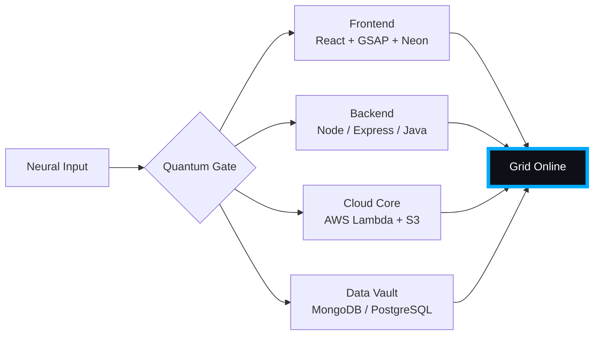

# 🌌 [ NEURAL CORE ACCESS: PENDEMVAMSI ]

<p align="center">
  
</p>

<div align="center">
  
  <br><small>Active Protocol: <strong style="color:#00AAFF">TRON LEGACY</strong> 🟦🟧</small>
</div>

## 🔵 NEURAL STATUS READOUT
```text
SUBJECT ID    →  PENDEMVAMSI
ENTITY CLASS  →  SHADOW MONARCH v7
NEURAL RANK   →  B-TIER
GRID SYNC     →  1697/4261 QUANTUM PACKETS
─────── BIO-METRICS (TRON LEGACY) ───────
STRENGTH      134  █████████████████░░░░
AGILITY       115  ███████████████░░░░░░
INTELLIGENCE  138  ██████████████████░░░
VITALITY      107  ██████████████░░░░░░░
```

> **NEURAL BURST ACQUIRED:** +96 QUANTUM PACKETS 
> **SYSTEM MESSAGE:** SHADOW MONARCH PROTOCOL: FULLY AWAKENED

---

## 🌀 GRID ARCHITECTURE (HOLOGRAPHIC RENDER)



---

## 📡 ACADEMIC NODES – CONQUERED
- [x] B.Tech Neural Engineering (2020–2024) – St. Ann’s Grid
- [x] Intermediate Quantum Core (2018–2020) – Sri Medhavi
- [x] SSC Primary Link (2017–2018) – Sri Geethanjali

---

## ⚡ SKILL NEURAL MATRIX

<details open>
<summary>🔌 ACTIVE NEURAL LINKS</summary>

| Node               | Tier | Integrity Bar                | Status      |
|--------------------|------|------------------------------|-------------|
| Java Core          | S    | ████████████████████ 100%   | OVERCLOCKED |
| Node.js Grid       | S    | ████████████████████ 100%   | OVERCLOCKED |
| React Holo-UI      | A+   | █████████████████░░░ 92%    | ONLINE      |
| AWS Quantum Relay  | S    | ████████████████████ 100%   | SOVEREIGN   |
| Python AI Kernel   | A    | ████████████████░░░░ 85%    | CHARGING    |
| DSA Void Algorithm | A    | █████████████████░░░ 90%    | ACTIVE      |

</details>

---

## 🏅 NEURAL ACHIEVEMENT TOKENS

<p align="center">
  
  
  
  
</p>

---

## 👾 SHADOW ENTITIES – SUMMONED

<p align="center">
  
  <br><strong style="color:#00AAFF">ARISE.</strong>
</p>

| Entity | Designation   | Class            | Source Node                     |
|--------|---------------|------------------|---------------------------------|
| SH-01  | Igris         | Void Commander   | AI Financial Oracle             |
| SH-02  | Beru          | Swarm Overlord   | WebRTC Quantum Stream           |
| SH-03  | Kaisel        | Void Wyrm        | Geolocation Shadow Relay        |
| SH-04  | Tusk          | Arcane Construct | Global Pandemic Sentinel        |
| SH-05  | Iron          | Armored Bastion  | React Crypto Fortress           |

---

## 📡 GRID ANALYTICS (LIVE FEED)

<p align="center">
  
  <br>
  
  
</p>

---

## 🖥️ CORRUPTED MAINFRAME LOG (401 ENTRIES)

<details>
<summary>OPEN TERMINAL FEED – PROTOCOL: TRON LEGACY</summary>

> [0x23AC03CA] 🟦🟧 **TRON LEGACY PROTOCOL** #0 | NEURAL LINK STABILIZED | [TRANSMISSION SUCCESS]
> [0x428CF64D] 🟦🟧 **TRON LEGACY PROTOCOL** #1 | NEURAL LINK STABILIZED | [TRANSMISSION SUCCESS]
> [0x8C9C6004] 🟦🟧 **TRON LEGACY PROTOCOL** #2 | NEURAL LINK STABILIZED | [TRANSMISSION SUCCESS]
> [0x2EABB406] 🟦🟧 **TRON LEGACY PROTOCOL** #3 | NEURAL LINK STABILIZED | [TRANSMISSION SUCCESS]
> [0x7AA52DA4] 🟦🟧 **TRON LEGACY PROTOCOL** #4 | NEURAL LINK STABILIZED | [TRANSMISSION SUCCESS]
> [0x93DE4F49] 🟦🟧 **TRON LEGACY PROTOCOL** #5 | NEURAL LINK STABILIZED | [TRANSMISSION SUCCESS]
> [0xAE41D947] 🟦🟧 **TRON LEGACY PROTOCOL** #6 | NEURAL LINK STABILIZED | [TRANSMISSION SUCCESS]
> [0xB3945FA2] 🟦🟧 **TRON LEGACY PROTOCOL** #7 | NEURAL LINK STABILIZED | [TRANSMISSION SUCCESS]
> [0xD42AA8A5] 🟦🟧 **TRON LEGACY PROTOCOL** #8 | NEURAL LINK STABILIZED | [TRANSMISSION SUCCESS]
> [0x3353F7B1] 🟦🟧 **TRON LEGACY PROTOCOL** #9 | NEURAL LINK STABILIZED | [TRANSMISSION SUCCESS]
> [0xFE9674AA] 🟦🟧 **TRON LEGACY PROTOCOL** #10 | NEURAL LINK STABILIZED | [TRANSMISSION SUCCESS]
> [0xD1E4316E] 🟦🟧 **TRON LEGACY PROTOCOL** #11 | NEURAL LINK  [GLITCH DETECTED] STABILIZED | [TRANSMISSION SUCCESS]
> [0x4323D6CE] 🟦🟧 **TRON LEGACY PROTOCOL** #12 | NEURAL LINK  [GLITCH DETECTED] STABILIZED | [TRANSMISSION SUCCESS]
> [0xF0980CD7] 🟦🟧 **TRON LEGACY PROTOCOL** #13 | NEURAL LINK STABILIZED | [TRANSMISSION SUCCESS]
> [0xCE155A2F] 🟦🟧 **TRON LEGACY PROTOCOL** #14 | NEURAL LINK STABILIZED | [TRANSMISSION SUCCESS]
> [0xB237B4EE] 🟦🟧 **TRON LEGACY PROTOCOL** #15 | NEURAL LINK STABILIZED | [TRANSMISSION SUCCESS]
> [0xD1206460] 🟦🟧 **TRON LEGACY PROTOCOL** #16 | NEURAL LINK STABILIZED | [TRANSMISSION SUCCESS]
> [0xE5701714] 🟦🟧 **TRON LEGACY PROTOCOL** #17 | NEURAL LINK STABILIZED | [TRANSMISSION SUCCESS]
> [0xCFACBC66] 🟦🟧 **TRON LEGACY PROTOCOL** #18 | NEURAL LINK STABILIZED | [TRANSMISSION SUCCESS]
> [0x01E537A7] 🟦🟧 **TRON LEGACY PROTOCOL** #19 | NEURAL LINK STABILIZED | [TRANSMISSION SUCCESS]
> [0x1FF769BC] 🟦🟧 **TRON LEGACY PROTOCOL** #20 | NEURAL LINK STABILIZED | [TRANSMISSION SUCCESS]
> [0x03E91E23] 🟦🟧 **TRON LEGACY PROTOCOL** #21 | NEURAL LINK STABILIZED | [TRANSMISSION SUCCESS]
> [0xE70EE898] 🟦🟧 **TRON LEGACY PROTOCOL** #22 | NEURAL LINK STABILIZED | [TRANSMISSION SUCCESS]
> [0x55969A56] 🟦🟧 **TRON LEGACY PROTOCOL** #23 | NEURAL LINK STABILIZED | [TRANSMISSION SUCCESS]
> [0xD8234001] 🟦🟧 **TRON LEGACY PROTOCOL** #24 | NEURAL LINK STABILIZED | [TRANSMISSION SUCCESS]
> [0xDACE0933] 🟦🟧 **TRON LEGACY PROTOCOL** #25 | NEURAL LINK  [GLITCH DETECTED] STABILIZED | [TRANSMISSION SUCCESS]
> [0xE1D671C0] 🟦🟧 **TRON LEGACY PROTOCOL** #26 | NEURAL LINK  [GLITCH DETECTED] STABILIZED | [TRANSMISSION SUCCESS]
> [0xC4B82983] 🟦🟧 **TRON LEGACY PROTOCOL** #27 | NEURAL LINK STABILIZED | [TRANSMISSION SUCCESS]
> [0x795E4671] 🟦🟧 **TRON LEGACY PROTOCOL** #28 | NEURAL LINK  [GLITCH DETECTED] STABILIZED | [TRANSMISSION SUCCESS]
> [0xD8EE2EF7] 🟦🟧 **TRON LEGACY PROTOCOL** #29 | NEURAL LINK STABILIZED | [TRANSMISSION SUCCESS]
> [0x56DDF9C4] 🟦🟧 **TRON LEGACY PROTOCOL** #30 | NEURAL LINK  [GLITCH DETECTED] STABILIZED | [TRANSMISSION SUCCESS]
> [0x5729366E] 🟦🟧 **TRON LEGACY PROTOCOL** #31 | NEURAL LINK STABILIZED | [TRANSMISSION SUCCESS]
> [0x97560802] 🟦🟧 **TRON LEGACY PROTOCOL** #32 | NEURAL LINK STABILIZED | [TRANSMISSION SUCCESS]
> [0x3BFE74F2] 🟦🟧 **TRON LEGACY PROTOCOL** #33 | NEURAL LINK STABILIZED | [TRANSMISSION SUCCESS]
> [0x4399AE3B] 🟦🟧 **TRON LEGACY PROTOCOL** #34 | NEURAL LINK STABILIZED | [TRANSMISSION SUCCESS]
> [0x7E11D0B0] 🟦🟧 **TRON LEGACY PROTOCOL** #35 | NEURAL LINK  [GLITCH DETECTED] STABILIZED | [TRANSMISSION SUCCESS]
> [0x23566F57] 🟦🟧 **TRON LEGACY PROTOCOL** #36 | NEURAL LINK STABILIZED | [TRANSMISSION SUCCESS]
> [0xA609427D] 🟦🟧 **TRON LEGACY PROTOCOL** #37 | NEURAL LINK STABILIZED | [TRANSMISSION SUCCESS]
> [0x354EC8B8] 🟦🟧 **TRON LEGACY PROTOCOL** #38 | NEURAL LINK STABILIZED | [TRANSMISSION SUCCESS]
> [0x987F1F9E] 🟦🟧 **TRON LEGACY PROTOCOL** #39 | NEURAL LINK STABILIZED | [TRANSMISSION SUCCESS]
> [0x792B36A4] 🟦🟧 **TRON LEGACY PROTOCOL** #40 | NEURAL LINK STABILIZED | [TRANSMISSION SUCCESS]
> [0xCFB020FD] 🟦🟧 **TRON LEGACY PROTOCOL** #41 | NEURAL LINK STABILIZED | [TRANSMISSION SUCCESS]
> [0x06798BD8] 🟦🟧 **TRON LEGACY PROTOCOL** #42 | NEURAL LINK STABILIZED | [TRANSMISSION SUCCESS]
> [0xE6D92486] 🟦🟧 **TRON LEGACY PROTOCOL** #43 | NEURAL LINK STABILIZED | [TRANSMISSION SUCCESS]
> [0x1A04FD92] 🟦🟧 **TRON LEGACY PROTOCOL** #44 | NEURAL LINK  [GLITCH DETECTED] STABILIZED | [TRANSMISSION SUCCESS]
> [0x5807DF39] 🟦🟧 **TRON LEGACY PROTOCOL** #45 | NEURAL LINK STABILIZED | [TRANSMISSION SUCCESS]
> [0x879EA7D0] 🟦🟧 **TRON LEGACY PROTOCOL** #46 | NEURAL LINK STABILIZED | [TRANSMISSION SUCCESS]
> [0x0EFD582D] 🟦🟧 **TRON LEGACY PROTOCOL** #47 | NEURAL LINK STABILIZED | [TRANSMISSION SUCCESS]
> [0x3440CC0E] 🟦🟧 **TRON LEGACY PROTOCOL** #48 | NEURAL LINK STABILIZED | [TRANSMISSION SUCCESS]
> [0x5003FFC8] 🟦🟧 **TRON LEGACY PROTOCOL** #49 | NEURAL LINK STABILIZED | [TRANSMISSION SUCCESS]
> [0xB074E46E] 🟦🟧 **TRON LEGACY PROTOCOL** #50 | NEURAL LINK STABILIZED | [TRANSMISSION SUCCESS]
> [0x1DC5E9B6] 🟦🟧 **TRON LEGACY PROTOCOL** #51 | NEURAL LINK STABILIZED | [TRANSMISSION SUCCESS]
> [0xADC8AD94] 🟦🟧 **TRON LEGACY PROTOCOL** #52 | NEURAL LINK STABILIZED | [TRANSMISSION SUCCESS]
> [0xF61AF7CC] 🟦🟧 **TRON LEGACY PROTOCOL** #53 | NEURAL LINK STABILIZED | [TRANSMISSION SUCCESS]
> [0x493B9F89] 🟦🟧 **TRON LEGACY PROTOCOL** #54 | NEURAL LINK STABILIZED | [TRANSMISSION SUCCESS]
> [0xE7B6B1D3] 🟦🟧 **TRON LEGACY PROTOCOL** #55 | NEURAL LINK STABILIZED | [TRANSMISSION SUCCESS]
> [0xD48BFCE0] 🟦🟧 **TRON LEGACY PROTOCOL** #56 | NEURAL LINK STABILIZED | [TRANSMISSION SUCCESS]
> [0xC1A7E007] 🟦🟧 **TRON LEGACY PROTOCOL** #57 | NEURAL LINK  [GLITCH DETECTED] STABILIZED | [TRANSMISSION SUCCESS]
> [0x2120EE19] 🟦🟧 **TRON LEGACY PROTOCOL** #58 | NEURAL LINK  [GLITCH DETECTED] STABILIZED | [TRANSMISSION SUCCESS]
> [0x30CBADC2] 🟦🟧 **TRON LEGACY PROTOCOL** #59 | NEURAL LINK STABILIZED | [TRANSMISSION SUCCESS]
> [0x85A60119] 🟦🟧 **TRON LEGACY PROTOCOL** #60 | NEURAL LINK STABILIZED | [TRANSMISSION SUCCESS]
> [0x7AAA8B33] 🟦🟧 **TRON LEGACY PROTOCOL** #61 | NEURAL LINK  [GLITCH DETECTED] STABILIZED | [TRANSMISSION SUCCESS]
> [0xA615F474] 🟦🟧 **TRON LEGACY PROTOCOL** #62 | NEURAL LINK  [GLITCH DETECTED] STABILIZED | [TRANSMISSION SUCCESS]
> [0xEB305E2C] 🟦🟧 **TRON LEGACY PROTOCOL** #63 | NEURAL LINK STABILIZED | [TRANSMISSION SUCCESS]
> [0x26AD7FBB] 🟦🟧 **TRON LEGACY PROTOCOL** #64 | NEURAL LINK STABILIZED | [TRANSMISSION SUCCESS]
> [0x132ECA15] 🟦🟧 **TRON LEGACY PROTOCOL** #65 | NEURAL LINK STABILIZED | [TRANSMISSION SUCCESS]
> [0x70BBF8FC] 🟦🟧 **TRON LEGACY PROTOCOL** #66 | NEURAL LINK STABILIZED | [TRANSMISSION SUCCESS]
> [0xDC93E756] 🟦🟧 **TRON LEGACY PROTOCOL** #67 | NEURAL LINK STABILIZED | [TRANSMISSION SUCCESS]
> [0x472C93F5] 🟦🟧 **TRON LEGACY PROTOCOL** #68 | NEURAL LINK  [GLITCH DETECTED] STABILIZED | [TRANSMISSION SUCCESS]
> [0x3AA0774D] 🟦🟧 **TRON LEGACY PROTOCOL** #69 | NEURAL LINK STABILIZED | [TRANSMISSION SUCCESS]
> [0xDE85B1AD] 🟦🟧 **TRON LEGACY PROTOCOL** #70 | NEURAL LINK STABILIZED | [TRANSMISSION SUCCESS]
> [0x6135F585] 🟦🟧 **TRON LEGACY PROTOCOL** #71 | NEURAL LINK  [GLITCH DETECTED] STABILIZED | [TRANSMISSION SUCCESS]
> [0x348AC774] 🟦🟧 **TRON LEGACY PROTOCOL** #72 | NEURAL LINK STABILIZED | [TRANSMISSION SUCCESS]
> [0xD05A86B2] 🟦🟧 **TRON LEGACY PROTOCOL** #73 | NEURAL LINK  [GLITCH DETECTED] STABILIZED | [TRANSMISSION SUCCESS]
> [0x7DC142BF] 🟦🟧 **TRON LEGACY PROTOCOL** #74 | NEURAL LINK STABILIZED | [TRANSMISSION SUCCESS]
> [0x62043620] 🟦🟧 **TRON LEGACY PROTOCOL** #75 | NEURAL LINK  [GLITCH DETECTED] STABILIZED | [TRANSMISSION SUCCESS]
> [0x099B1369] 🟦🟧 **TRON LEGACY PROTOCOL** #76 | NEURAL LINK STABILIZED | [TRANSMISSION SUCCESS]
> [0x74440B8E] 🟦🟧 **TRON LEGACY PROTOCOL** #77 | NEURAL LINK STABILIZED | [TRANSMISSION SUCCESS]
> [0x13F81820] 🟦🟧 **TRON LEGACY PROTOCOL** #78 | NEURAL LINK STABILIZED | [TRANSMISSION SUCCESS]
> [0xD50034EA] 🟦🟧 **TRON LEGACY PROTOCOL** #79 | NEURAL LINK STABILIZED | [TRANSMISSION SUCCESS]
> [0x626C8617] 🟦🟧 **TRON LEGACY PROTOCOL** #80 | NEURAL LINK STABILIZED | [TRANSMISSION SUCCESS]
> [0xC1E4A94C] 🟦🟧 **TRON LEGACY PROTOCOL** #81 | NEURAL LINK  [GLITCH DETECTED] STABILIZED | [TRANSMISSION SUCCESS]
> [0xEA7815AB] 🟦🟧 **TRON LEGACY PROTOCOL** #82 | NEURAL LINK  [GLITCH DETECTED] STABILIZED | [TRANSMISSION SUCCESS]
> [0xC9887FF1] 🟦🟧 **TRON LEGACY PROTOCOL** #83 | NEURAL LINK STABILIZED | [TRANSMISSION SUCCESS]
> [0x6E14EC76] 🟦🟧 **TRON LEGACY PROTOCOL** #84 | NEURAL LINK  [GLITCH DETECTED] STABILIZED | [TRANSMISSION SUCCESS]
> [0x34E10F4D] 🟦🟧 **TRON LEGACY PROTOCOL** #85 | NEURAL LINK STABILIZED | [TRANSMISSION SUCCESS]
> [0xD70C476E] 🟦🟧 **TRON LEGACY PROTOCOL** #86 | NEURAL LINK STABILIZED | [TRANSMISSION SUCCESS]
> [0xA49323C2] 🟦🟧 **TRON LEGACY PROTOCOL** #87 | NEURAL LINK STABILIZED | [TRANSMISSION SUCCESS]
> [0x350E09B3] 🟦🟧 **TRON LEGACY PROTOCOL** #88 | NEURAL LINK STABILIZED | [TRANSMISSION SUCCESS]
> [0xBC5DCD50] 🟦🟧 **TRON LEGACY PROTOCOL** #89 | NEURAL LINK  [GLITCH DETECTED] STABILIZED | [TRANSMISSION SUCCESS]
> [0xEA36891A] 🟦🟧 **TRON LEGACY PROTOCOL** #90 | NEURAL LINK STABILIZED | [TRANSMISSION SUCCESS]
> [0x40ABE04F] 🟦🟧 **TRON LEGACY PROTOCOL** #91 | NEURAL LINK STABILIZED | [TRANSMISSION SUCCESS]
> [0x6BAE0087] 🟦🟧 **TRON LEGACY PROTOCOL** #92 | NEURAL LINK STABILIZED | [TRANSMISSION SUCCESS]
> [0xC14B2679] 🟦🟧 **TRON LEGACY PROTOCOL** #93 | NEURAL LINK  [GLITCH DETECTED] STABILIZED | [TRANSMISSION SUCCESS]
> [0xC5130BF2] 🟦🟧 **TRON LEGACY PROTOCOL** #94 | NEURAL LINK STABILIZED | [TRANSMISSION SUCCESS]
> [0xF98CFD70] 🟦🟧 **TRON LEGACY PROTOCOL** #95 | NEURAL LINK STABILIZED | [TRANSMISSION SUCCESS]
> [0x95091384] 🟦🟧 **TRON LEGACY PROTOCOL** #96 | NEURAL LINK STABILIZED | [TRANSMISSION SUCCESS]
> [0xD4FD805A] 🟦🟧 **TRON LEGACY PROTOCOL** #97 | NEURAL LINK STABILIZED | [TRANSMISSION SUCCESS]
> [0x9769D30A] 🟦🟧 **TRON LEGACY PROTOCOL** #98 | NEURAL LINK  [GLITCH DETECTED] STABILIZED | [TRANSMISSION SUCCESS]
> [0xB8AFF9AE] 🟦🟧 **TRON LEGACY PROTOCOL** #99 | NEURAL LINK STABILIZED | [TRANSMISSION SUCCESS]
> [0x0458E522] 🟦🟧 **TRON LEGACY PROTOCOL** #100 | NEURAL LINK STABILIZED | [TRANSMISSION SUCCESS]
> [0x262F632B] 🟦🟧 **TRON LEGACY PROTOCOL** #101 | NEURAL LINK  [GLITCH DETECTED] STABILIZED | [TRANSMISSION SUCCESS]
> [0xE1587A3C] 🟦🟧 **TRON LEGACY PROTOCOL** #102 | NEURAL LINK  [GLITCH DETECTED] STABILIZED | [TRANSMISSION SUCCESS]
> [0x759CC2E1] 🟦🟧 **TRON LEGACY PROTOCOL** #103 | NEURAL LINK STABILIZED | [TRANSMISSION SUCCESS]
> [0xCC117E48] 🟦🟧 **TRON LEGACY PROTOCOL** #104 | NEURAL LINK STABILIZED | [TRANSMISSION SUCCESS]
> [0x8A678AF3] 🟦🟧 **TRON LEGACY PROTOCOL** #105 | NEURAL LINK  [GLITCH DETECTED] STABILIZED | [TRANSMISSION SUCCESS]
> [0xABFBE5AF] 🟦🟧 **TRON LEGACY PROTOCOL** #106 | NEURAL LINK  [GLITCH DETECTED] STABILIZED | [TRANSMISSION SUCCESS]
> [0x743C0E7D] 🟦🟧 **TRON LEGACY PROTOCOL** #107 | NEURAL LINK STABILIZED | [TRANSMISSION SUCCESS]
> [0xB6CBE553] 🟦🟧 **TRON LEGACY PROTOCOL** #108 | NEURAL LINK STABILIZED | [TRANSMISSION SUCCESS]
> [0x63C559FA] 🟦🟧 **TRON LEGACY PROTOCOL** #109 | NEURAL LINK STABILIZED | [TRANSMISSION SUCCESS]
> [0x42999AF5] 🟦🟧 **TRON LEGACY PROTOCOL** #110 | NEURAL LINK STABILIZED | [TRANSMISSION SUCCESS]
> [0xB0516AD3] 🟦🟧 **TRON LEGACY PROTOCOL** #111 | NEURAL LINK STABILIZED | [TRANSMISSION SUCCESS]
> [0xB9A2E6A0] 🟦🟧 **TRON LEGACY PROTOCOL** #112 | NEURAL LINK STABILIZED | [TRANSMISSION SUCCESS]
> [0x2E32D0B1] 🟦🟧 **TRON LEGACY PROTOCOL** #113 | NEURAL LINK STABILIZED | [TRANSMISSION SUCCESS]
> [0xD2F04C83] 🟦🟧 **TRON LEGACY PROTOCOL** #114 | NEURAL LINK STABILIZED | [TRANSMISSION SUCCESS]
> [0x7EA06269] 🟦🟧 **TRON LEGACY PROTOCOL** #115 | NEURAL LINK STABILIZED | [TRANSMISSION SUCCESS]
> [0x12FB7CAF] 🟦🟧 **TRON LEGACY PROTOCOL** #116 | NEURAL LINK STABILIZED | [TRANSMISSION SUCCESS]
> [0x0591741E] 🟦🟧 **TRON LEGACY PROTOCOL** #117 | NEURAL LINK STABILIZED | [TRANSMISSION SUCCESS]
> [0xA5352A21] 🟦🟧 **TRON LEGACY PROTOCOL** #118 | NEURAL LINK STABILIZED | [TRANSMISSION SUCCESS]
> [0x29BBA7D0] 🟦🟧 **TRON LEGACY PROTOCOL** #119 | NEURAL LINK STABILIZED | [TRANSMISSION SUCCESS]
> [0x46706798] 🟦🟧 **TRON LEGACY PROTOCOL** #120 | NEURAL LINK STABILIZED | [TRANSMISSION SUCCESS]
> [0x2228C8F2] 🟦🟧 **TRON LEGACY PROTOCOL** #121 | NEURAL LINK STABILIZED | [TRANSMISSION SUCCESS]
> [0x9B129A77] 🟦🟧 **TRON LEGACY PROTOCOL** #122 | NEURAL LINK STABILIZED | [TRANSMISSION SUCCESS]
> [0x7D148DC0] 🟦🟧 **TRON LEGACY PROTOCOL** #123 | NEURAL LINK STABILIZED | [TRANSMISSION SUCCESS]
> [0xA1A8F337] 🟦🟧 **TRON LEGACY PROTOCOL** #124 | NEURAL LINK STABILIZED | [TRANSMISSION SUCCESS]
> [0x47084A5F] 🟦🟧 **TRON LEGACY PROTOCOL** #125 | NEURAL LINK STABILIZED | [TRANSMISSION SUCCESS]
> [0x2613FCE6] 🟦🟧 **TRON LEGACY PROTOCOL** #126 | NEURAL LINK  [GLITCH DETECTED] STABILIZED | [TRANSMISSION SUCCESS]
> [0xB7BCBCF2] 🟦🟧 **TRON LEGACY PROTOCOL** #127 | NEURAL LINK STABILIZED | [TRANSMISSION SUCCESS]
> [0x0CA7855D] 🟦🟧 **TRON LEGACY PROTOCOL** #128 | NEURAL LINK STABILIZED | [TRANSMISSION SUCCESS]
> [0x9DE54C35] 🟦🟧 **TRON LEGACY PROTOCOL** #129 | NEURAL LINK STABILIZED | [TRANSMISSION SUCCESS]
> [0xD4CE0DB4] 🟦🟧 **TRON LEGACY PROTOCOL** #130 | NEURAL LINK STABILIZED | [TRANSMISSION SUCCESS]
> [0xBAC53AFD] 🟦🟧 **TRON LEGACY PROTOCOL** #131 | NEURAL LINK  [GLITCH DETECTED] STABILIZED | [TRANSMISSION SUCCESS]
> [0x7B64404C] 🟦🟧 **TRON LEGACY PROTOCOL** #132 | NEURAL LINK STABILIZED | [TRANSMISSION SUCCESS]
> [0x4BF07880] 🟦🟧 **TRON LEGACY PROTOCOL** #133 | NEURAL LINK  [GLITCH DETECTED] STABILIZED | [TRANSMISSION SUCCESS]
> [0x7F345B99] 🟦🟧 **TRON LEGACY PROTOCOL** #134 | NEURAL LINK STABILIZED | [TRANSMISSION SUCCESS]
> [0x9041BCEE] 🟦🟧 **TRON LEGACY PROTOCOL** #135 | NEURAL LINK STABILIZED | [TRANSMISSION SUCCESS]
> [0x920504AB] 🟦🟧 **TRON LEGACY PROTOCOL** #136 | NEURAL LINK  [GLITCH DETECTED] STABILIZED | [TRANSMISSION SUCCESS]
> [0x8890ADD5] 🟦🟧 **TRON LEGACY PROTOCOL** #137 | NEURAL LINK STABILIZED | [TRANSMISSION SUCCESS]
> [0x8FCDEF59] 🟦🟧 **TRON LEGACY PROTOCOL** #138 | NEURAL LINK STABILIZED | [TRANSMISSION SUCCESS]
> [0x55E4F2E5] 🟦🟧 **TRON LEGACY PROTOCOL** #139 | NEURAL LINK STABILIZED | [TRANSMISSION SUCCESS]
> [0x900BF0D8] 🟦🟧 **TRON LEGACY PROTOCOL** #140 | NEURAL LINK STABILIZED | [TRANSMISSION SUCCESS]
> [0x7BCE08C7] 🟦🟧 **TRON LEGACY PROTOCOL** #141 | NEURAL LINK STABILIZED | [TRANSMISSION SUCCESS]
> [0xECAE6E75] 🟦🟧 **TRON LEGACY PROTOCOL** #142 | NEURAL LINK STABILIZED | [TRANSMISSION SUCCESS]
> [0xD9863910] 🟦🟧 **TRON LEGACY PROTOCOL** #143 | NEURAL LINK STABILIZED | [TRANSMISSION SUCCESS]
> [0xA01E34D7] 🟦🟧 **TRON LEGACY PROTOCOL** #144 | NEURAL LINK  [GLITCH DETECTED] STABILIZED | [TRANSMISSION SUCCESS]
> [0xF390FD44] 🟦🟧 **TRON LEGACY PROTOCOL** #145 | NEURAL LINK STABILIZED | [TRANSMISSION SUCCESS]
> [0x74F0D553] 🟦🟧 **TRON LEGACY PROTOCOL** #146 | NEURAL LINK STABILIZED | [TRANSMISSION SUCCESS]
> [0xD1385DC7] 🟦🟧 **TRON LEGACY PROTOCOL** #147 | NEURAL LINK STABILIZED | [TRANSMISSION SUCCESS]
> [0x4D5E0938] 🟦🟧 **TRON LEGACY PROTOCOL** #148 | NEURAL LINK STABILIZED | [TRANSMISSION SUCCESS]
> [0x2D74F5F7] 🟦🟧 **TRON LEGACY PROTOCOL** #149 | NEURAL LINK STABILIZED | [TRANSMISSION SUCCESS]
> [0x4469C677] 🟦🟧 **TRON LEGACY PROTOCOL** #150 | NEURAL LINK STABILIZED | [TRANSMISSION SUCCESS]
> [0xC23BD3BE] 🟦🟧 **TRON LEGACY PROTOCOL** #151 | NEURAL LINK STABILIZED | [TRANSMISSION SUCCESS]
> [0x8A00D537] 🟦🟧 **TRON LEGACY PROTOCOL** #152 | NEURAL LINK STABILIZED | [TRANSMISSION SUCCESS]
> [0x181AE2AD] 🟦🟧 **TRON LEGACY PROTOCOL** #153 | NEURAL LINK STABILIZED | [TRANSMISSION SUCCESS]
> [0xE5119CC5] 🟦🟧 **TRON LEGACY PROTOCOL** #154 | NEURAL LINK STABILIZED | [TRANSMISSION SUCCESS]
> [0xD45B3C23] 🟦🟧 **TRON LEGACY PROTOCOL** #155 | NEURAL LINK  [GLITCH DETECTED] STABILIZED | [TRANSMISSION SUCCESS]
> [0xDBB701A8] 🟦🟧 **TRON LEGACY PROTOCOL** #156 | NEURAL LINK STABILIZED | [TRANSMISSION SUCCESS]
> [0x5F1197EF] 🟦🟧 **TRON LEGACY PROTOCOL** #157 | NEURAL LINK STABILIZED | [TRANSMISSION SUCCESS]
> [0x878D35AF] 🟦🟧 **TRON LEGACY PROTOCOL** #158 | NEURAL LINK STABILIZED | [TRANSMISSION SUCCESS]
> [0xB3E73498] 🟦🟧 **TRON LEGACY PROTOCOL** #159 | NEURAL LINK  [GLITCH DETECTED] STABILIZED | [TRANSMISSION SUCCESS]
> [0x3DF44ECA] 🟦🟧 **TRON LEGACY PROTOCOL** #160 | NEURAL LINK  [GLITCH DETECTED] STABILIZED | [TRANSMISSION SUCCESS]
> [0x42E19F01] 🟦🟧 **TRON LEGACY PROTOCOL** #161 | NEURAL LINK STABILIZED | [TRANSMISSION SUCCESS]
> [0x88A356A2] 🟦🟧 **TRON LEGACY PROTOCOL** #162 | NEURAL LINK STABILIZED | [TRANSMISSION SUCCESS]
> [0x660D852E] 🟦🟧 **TRON LEGACY PROTOCOL** #163 | NEURAL LINK STABILIZED | [TRANSMISSION SUCCESS]
> [0xC56C430A] 🟦🟧 **TRON LEGACY PROTOCOL** #164 | NEURAL LINK STABILIZED | [TRANSMISSION SUCCESS]
> [0xEE028D74] 🟦🟧 **TRON LEGACY PROTOCOL** #165 | NEURAL LINK  [GLITCH DETECTED] STABILIZED | [TRANSMISSION SUCCESS]
> [0x0AA2521A] 🟦🟧 **TRON LEGACY PROTOCOL** #166 | NEURAL LINK STABILIZED | [TRANSMISSION SUCCESS]
> [0x1BC4106B] 🟦🟧 **TRON LEGACY PROTOCOL** #167 | NEURAL LINK STABILIZED | [TRANSMISSION SUCCESS]
> [0x8E700A4A] 🟦🟧 **TRON LEGACY PROTOCOL** #168 | NEURAL LINK STABILIZED | [TRANSMISSION SUCCESS]
> [0x4D6EB2FB] 🟦🟧 **TRON LEGACY PROTOCOL** #169 | NEURAL LINK STABILIZED | [TRANSMISSION SUCCESS]
> [0xFBED27EE] 🟦🟧 **TRON LEGACY PROTOCOL** #170 | NEURAL LINK STABILIZED | [TRANSMISSION SUCCESS]
> [0x122AB2CF] 🟦🟧 **TRON LEGACY PROTOCOL** #171 | NEURAL LINK STABILIZED | [TRANSMISSION SUCCESS]
> [0x97B8B35B] 🟦🟧 **TRON LEGACY PROTOCOL** #172 | NEURAL LINK STABILIZED | [TRANSMISSION SUCCESS]
> [0x41A38524] 🟦🟧 **TRON LEGACY PROTOCOL** #173 | NEURAL LINK STABILIZED | [TRANSMISSION SUCCESS]
> [0xC2F0281B] 🟦🟧 **TRON LEGACY PROTOCOL** #174 | NEURAL LINK STABILIZED | [TRANSMISSION SUCCESS]
> [0xAD0946BF] 🟦🟧 **TRON LEGACY PROTOCOL** #175 | NEURAL LINK STABILIZED | [TRANSMISSION SUCCESS]
> [0x1D5D1FCB] 🟦🟧 **TRON LEGACY PROTOCOL** #176 | NEURAL LINK STABILIZED | [TRANSMISSION SUCCESS]
> [0xEA8C004D] 🟦🟧 **TRON LEGACY PROTOCOL** #177 | NEURAL LINK STABILIZED | [TRANSMISSION SUCCESS]
> [0x55D3DBD8] 🟦🟧 **TRON LEGACY PROTOCOL** #178 | NEURAL LINK  [GLITCH DETECTED] STABILIZED | [TRANSMISSION SUCCESS]
> [0x3E119734] 🟦🟧 **TRON LEGACY PROTOCOL** #179 | NEURAL LINK  [GLITCH DETECTED] STABILIZED | [TRANSMISSION SUCCESS]
> [0xC2D6180D] 🟦🟧 **TRON LEGACY PROTOCOL** #180 | NEURAL LINK STABILIZED | [TRANSMISSION SUCCESS]
> [0xB7386E91] 🟦🟧 **TRON LEGACY PROTOCOL** #181 | NEURAL LINK STABILIZED | [TRANSMISSION SUCCESS]
> [0x9120D320] 🟦🟧 **TRON LEGACY PROTOCOL** #182 | NEURAL LINK STABILIZED | [TRANSMISSION SUCCESS]
> [0x14307566] 🟦🟧 **TRON LEGACY PROTOCOL** #183 | NEURAL LINK STABILIZED | [TRANSMISSION SUCCESS]
> [0xA230A21D] 🟦🟧 **TRON LEGACY PROTOCOL** #184 | NEURAL LINK  [GLITCH DETECTED] STABILIZED | [TRANSMISSION SUCCESS]
> [0x778B426D] 🟦🟧 **TRON LEGACY PROTOCOL** #185 | NEURAL LINK STABILIZED | [TRANSMISSION SUCCESS]
> [0xB6611F04] 🟦🟧 **TRON LEGACY PROTOCOL** #186 | NEURAL LINK STABILIZED | [TRANSMISSION SUCCESS]
> [0x52C21FD8] 🟦🟧 **TRON LEGACY PROTOCOL** #187 | NEURAL LINK STABILIZED | [TRANSMISSION SUCCESS]
> [0x16999197] 🟦🟧 **TRON LEGACY PROTOCOL** #188 | NEURAL LINK STABILIZED | [TRANSMISSION SUCCESS]
> [0x98737D14] 🟦🟧 **TRON LEGACY PROTOCOL** #189 | NEURAL LINK STABILIZED | [TRANSMISSION SUCCESS]
> [0x2D78980B] 🟦🟧 **TRON LEGACY PROTOCOL** #190 | NEURAL LINK  [GLITCH DETECTED] STABILIZED | [TRANSMISSION SUCCESS]
> [0xD793301F] 🟦🟧 **TRON LEGACY PROTOCOL** #191 | NEURAL LINK STABILIZED | [TRANSMISSION SUCCESS]
> [0x8E2B81C3] 🟦🟧 **TRON LEGACY PROTOCOL** #192 | NEURAL LINK  [GLITCH DETECTED] STABILIZED | [TRANSMISSION SUCCESS]
> [0x8247019F] 🟦🟧 **TRON LEGACY PROTOCOL** #193 | NEURAL LINK STABILIZED | [TRANSMISSION SUCCESS]
> [0x8F8EB58E] 🟦🟧 **TRON LEGACY PROTOCOL** #194 | NEURAL LINK STABILIZED | [TRANSMISSION SUCCESS]
> [0x299C11F2] 🟦🟧 **TRON LEGACY PROTOCOL** #195 | NEURAL LINK STABILIZED | [TRANSMISSION SUCCESS]
> [0x098EE619] 🟦🟧 **TRON LEGACY PROTOCOL** #196 | NEURAL LINK STABILIZED | [TRANSMISSION SUCCESS]
> [0x1C19330C] 🟦🟧 **TRON LEGACY PROTOCOL** #197 | NEURAL LINK STABILIZED | [TRANSMISSION SUCCESS]
> [0xCDDC3541] 🟦🟧 **TRON LEGACY PROTOCOL** #198 | NEURAL LINK STABILIZED | [TRANSMISSION SUCCESS]
> [0x7651CAF6] 🟦🟧 **TRON LEGACY PROTOCOL** #199 | NEURAL LINK STABILIZED | [TRANSMISSION SUCCESS]
> [0x7B698199] 🟦🟧 **TRON LEGACY PROTOCOL** #200 | NEURAL LINK STABILIZED | [TRANSMISSION SUCCESS]
> [0x6226F69C] 🟦🟧 **TRON LEGACY PROTOCOL** #201 | NEURAL LINK STABILIZED | [TRANSMISSION SUCCESS]
> [0x7B267F5F] 🟦🟧 **TRON LEGACY PROTOCOL** #202 | NEURAL LINK STABILIZED | [TRANSMISSION SUCCESS]
> [0xB3BC5FC0] 🟦🟧 **TRON LEGACY PROTOCOL** #203 | NEURAL LINK STABILIZED | [TRANSMISSION SUCCESS]
> [0x7F10D0ED] 🟦🟧 **TRON LEGACY PROTOCOL** #204 | NEURAL LINK  [GLITCH DETECTED] STABILIZED | [TRANSMISSION SUCCESS]
> [0xEA5400CB] 🟦🟧 **TRON LEGACY PROTOCOL** #205 | NEURAL LINK STABILIZED | [TRANSMISSION SUCCESS]
> [0x1EC47B10] 🟦🟧 **TRON LEGACY PROTOCOL** #206 | NEURAL LINK STABILIZED | [TRANSMISSION SUCCESS]
> [0x75A86662] 🟦🟧 **TRON LEGACY PROTOCOL** #207 | NEURAL LINK STABILIZED | [TRANSMISSION SUCCESS]
> [0x8B8A0193] 🟦🟧 **TRON LEGACY PROTOCOL** #208 | NEURAL LINK STABILIZED | [TRANSMISSION SUCCESS]
> [0xE424DA77] 🟦🟧 **TRON LEGACY PROTOCOL** #209 | NEURAL LINK STABILIZED | [TRANSMISSION SUCCESS]
> [0xED079979] 🟦🟧 **TRON LEGACY PROTOCOL** #210 | NEURAL LINK STABILIZED | [TRANSMISSION SUCCESS]
> [0xF0D1EE3A] 🟦🟧 **TRON LEGACY PROTOCOL** #211 | NEURAL LINK STABILIZED | [TRANSMISSION SUCCESS]
> [0xDE2E23F4] 🟦🟧 **TRON LEGACY PROTOCOL** #212 | NEURAL LINK STABILIZED | [TRANSMISSION SUCCESS]
> [0xAF58DFA6] 🟦🟧 **TRON LEGACY PROTOCOL** #213 | NEURAL LINK STABILIZED | [TRANSMISSION SUCCESS]
> [0xEE5FC3A7] 🟦🟧 **TRON LEGACY PROTOCOL** #214 | NEURAL LINK  [GLITCH DETECTED] STABILIZED | [TRANSMISSION SUCCESS]
> [0x214CE064] 🟦🟧 **TRON LEGACY PROTOCOL** #215 | NEURAL LINK STABILIZED | [TRANSMISSION SUCCESS]
> [0xFA8C9D3C] 🟦🟧 **TRON LEGACY PROTOCOL** #216 | NEURAL LINK STABILIZED | [TRANSMISSION SUCCESS]
> [0x104F1BD9] 🟦🟧 **TRON LEGACY PROTOCOL** #217 | NEURAL LINK  [GLITCH DETECTED] STABILIZED | [TRANSMISSION SUCCESS]
> [0x238EC996] 🟦🟧 **TRON LEGACY PROTOCOL** #218 | NEURAL LINK STABILIZED | [TRANSMISSION SUCCESS]
> [0x32D52484] 🟦🟧 **TRON LEGACY PROTOCOL** #219 | NEURAL LINK STABILIZED | [TRANSMISSION SUCCESS]
> [0x20E79002] 🟦🟧 **TRON LEGACY PROTOCOL** #220 | NEURAL LINK STABILIZED | [TRANSMISSION SUCCESS]
> [0xDFE96854] 🟦🟧 **TRON LEGACY PROTOCOL** #221 | NEURAL LINK STABILIZED | [TRANSMISSION SUCCESS]
> [0xD7E6EF4D] 🟦🟧 **TRON LEGACY PROTOCOL** #222 | NEURAL LINK STABILIZED | [TRANSMISSION SUCCESS]
> [0x4E59F929] 🟦🟧 **TRON LEGACY PROTOCOL** #223 | NEURAL LINK STABILIZED | [TRANSMISSION SUCCESS]
> [0x3EA3E9F7] 🟦🟧 **TRON LEGACY PROTOCOL** #224 | NEURAL LINK STABILIZED | [TRANSMISSION SUCCESS]
> [0xD86AB74A] 🟦🟧 **TRON LEGACY PROTOCOL** #225 | NEURAL LINK STABILIZED | [TRANSMISSION SUCCESS]
> [0x66B6DC5F] 🟦🟧 **TRON LEGACY PROTOCOL** #226 | NEURAL LINK STABILIZED | [TRANSMISSION SUCCESS]
> [0x41F04E83] 🟦🟧 **TRON LEGACY PROTOCOL** #227 | NEURAL LINK STABILIZED | [TRANSMISSION SUCCESS]
> [0x9A5204C4] 🟦🟧 **TRON LEGACY PROTOCOL** #228 | NEURAL LINK STABILIZED | [TRANSMISSION SUCCESS]
> [0x3DF8297D] 🟦🟧 **TRON LEGACY PROTOCOL** #229 | NEURAL LINK STABILIZED | [TRANSMISSION SUCCESS]
> [0xC2E01E5C] 🟦🟧 **TRON LEGACY PROTOCOL** #230 | NEURAL LINK STABILIZED | [TRANSMISSION SUCCESS]
> [0xAEF14DF9] 🟦🟧 **TRON LEGACY PROTOCOL** #231 | NEURAL LINK STABILIZED | [TRANSMISSION SUCCESS]
> [0x5A0A3C71] 🟦🟧 **TRON LEGACY PROTOCOL** #232 | NEURAL LINK STABILIZED | [TRANSMISSION SUCCESS]
> [0xBBE604D7] 🟦🟧 **TRON LEGACY PROTOCOL** #233 | NEURAL LINK STABILIZED | [TRANSMISSION SUCCESS]
> [0x33441015] 🟦🟧 **TRON LEGACY PROTOCOL** #234 | NEURAL LINK STABILIZED | [TRANSMISSION SUCCESS]
> [0x0B8E416F] 🟦🟧 **TRON LEGACY PROTOCOL** #235 | NEURAL LINK STABILIZED | [TRANSMISSION SUCCESS]
> [0x95723986] 🟦🟧 **TRON LEGACY PROTOCOL** #236 | NEURAL LINK STABILIZED | [TRANSMISSION SUCCESS]
> [0x64AE25CA] 🟦🟧 **TRON LEGACY PROTOCOL** #237 | NEURAL LINK STABILIZED | [TRANSMISSION SUCCESS]
> [0x658CBB87] 🟦🟧 **TRON LEGACY PROTOCOL** #238 | NEURAL LINK  [GLITCH DETECTED] STABILIZED | [TRANSMISSION SUCCESS]
> [0xA009BE30] 🟦🟧 **TRON LEGACY PROTOCOL** #239 | NEURAL LINK STABILIZED | [TRANSMISSION SUCCESS]
> [0x63822EA7] 🟦🟧 **TRON LEGACY PROTOCOL** #240 | NEURAL LINK STABILIZED | [TRANSMISSION SUCCESS]
> [0x67F082A1] 🟦🟧 **TRON LEGACY PROTOCOL** #241 | NEURAL LINK STABILIZED | [TRANSMISSION SUCCESS]
> [0x76AF438A] 🟦🟧 **TRON LEGACY PROTOCOL** #242 | NEURAL LINK STABILIZED | [TRANSMISSION SUCCESS]
> [0xBE4D8B87] 🟦🟧 **TRON LEGACY PROTOCOL** #243 | NEURAL LINK STABILIZED | [TRANSMISSION SUCCESS]
> [0xEAD11DC1] 🟦🟧 **TRON LEGACY PROTOCOL** #244 | NEURAL LINK  [GLITCH DETECTED] STABILIZED | [TRANSMISSION SUCCESS]
> [0x253E1054] 🟦🟧 **TRON LEGACY PROTOCOL** #245 | NEURAL LINK STABILIZED | [TRANSMISSION SUCCESS]
> [0xAF192193] 🟦🟧 **TRON LEGACY PROTOCOL** #246 | NEURAL LINK STABILIZED | [TRANSMISSION SUCCESS]
> [0x9196FA0D] 🟦🟧 **TRON LEGACY PROTOCOL** #247 | NEURAL LINK STABILIZED | [TRANSMISSION SUCCESS]
> [0xBA217A41] 🟦🟧 **TRON LEGACY PROTOCOL** #248 | NEURAL LINK STABILIZED | [TRANSMISSION SUCCESS]
> [0x0E34CB5D] 🟦🟧 **TRON LEGACY PROTOCOL** #249 | NEURAL LINK STABILIZED | [TRANSMISSION SUCCESS]
> [0x4157CEC3] 🟦🟧 **TRON LEGACY PROTOCOL** #250 | NEURAL LINK  [GLITCH DETECTED] STABILIZED | [TRANSMISSION SUCCESS]
> [0x95801650] 🟦🟧 **TRON LEGACY PROTOCOL** #251 | NEURAL LINK  [GLITCH DETECTED] STABILIZED | [TRANSMISSION SUCCESS]
> [0xF2A7DD28] 🟦🟧 **TRON LEGACY PROTOCOL** #252 | NEURAL LINK STABILIZED | [TRANSMISSION SUCCESS]
> [0xB2F8F902] 🟦🟧 **TRON LEGACY PROTOCOL** #253 | NEURAL LINK STABILIZED | [TRANSMISSION SUCCESS]
> [0xAD09807F] 🟦🟧 **TRON LEGACY PROTOCOL** #254 | NEURAL LINK STABILIZED | [TRANSMISSION SUCCESS]
> [0x6FB2EC06] 🟦🟧 **TRON LEGACY PROTOCOL** #255 | NEURAL LINK STABILIZED | [TRANSMISSION SUCCESS]
> [0x3622413C] 🟦🟧 **TRON LEGACY PROTOCOL** #256 | NEURAL LINK STABILIZED | [TRANSMISSION SUCCESS]
> [0xA9E45556] 🟦🟧 **TRON LEGACY PROTOCOL** #257 | NEURAL LINK STABILIZED | [TRANSMISSION SUCCESS]
> [0xC244F1AD] 🟦🟧 **TRON LEGACY PROTOCOL** #258 | NEURAL LINK  [GLITCH DETECTED] STABILIZED | [TRANSMISSION SUCCESS]
> [0xD58F55E1] 🟦🟧 **TRON LEGACY PROTOCOL** #259 | NEURAL LINK STABILIZED | [TRANSMISSION SUCCESS]
> [0x0F5970F8] 🟦🟧 **TRON LEGACY PROTOCOL** #260 | NEURAL LINK  [GLITCH DETECTED] STABILIZED | [TRANSMISSION SUCCESS]
> [0xA34CF6B4] 🟦🟧 **TRON LEGACY PROTOCOL** #261 | NEURAL LINK  [GLITCH DETECTED] STABILIZED | [TRANSMISSION SUCCESS]
> [0x230644B6] 🟦🟧 **TRON LEGACY PROTOCOL** #262 | NEURAL LINK STABILIZED | [TRANSMISSION SUCCESS]
> [0x6329CBBB] 🟦🟧 **TRON LEGACY PROTOCOL** #263 | NEURAL LINK STABILIZED | [TRANSMISSION SUCCESS]
> [0xA4F7BEC3] 🟦🟧 **TRON LEGACY PROTOCOL** #264 | NEURAL LINK STABILIZED | [TRANSMISSION SUCCESS]
> [0xBE2BC4E9] 🟦🟧 **TRON LEGACY PROTOCOL** #265 | NEURAL LINK STABILIZED | [TRANSMISSION SUCCESS]
> [0x4E8599E8] 🟦🟧 **TRON LEGACY PROTOCOL** #266 | NEURAL LINK STABILIZED | [TRANSMISSION SUCCESS]
> [0x3CCAE2A1] 🟦🟧 **TRON LEGACY PROTOCOL** #267 | NEURAL LINK STABILIZED | [TRANSMISSION SUCCESS]
> [0x38920320] 🟦🟧 **TRON LEGACY PROTOCOL** #268 | NEURAL LINK STABILIZED | [TRANSMISSION SUCCESS]
> [0x56D66EAF] 🟦🟧 **TRON LEGACY PROTOCOL** #269 | NEURAL LINK STABILIZED | [TRANSMISSION SUCCESS]
> [0x69CBAF2C] 🟦🟧 **TRON LEGACY PROTOCOL** #270 | NEURAL LINK STABILIZED | [TRANSMISSION SUCCESS]
> [0xDA5BC540] 🟦🟧 **TRON LEGACY PROTOCOL** #271 | NEURAL LINK STABILIZED | [TRANSMISSION SUCCESS]
> [0xE96EF48D] 🟦🟧 **TRON LEGACY PROTOCOL** #272 | NEURAL LINK STABILIZED | [TRANSMISSION SUCCESS]
> [0x2A0FAAB0] 🟦🟧 **TRON LEGACY PROTOCOL** #273 | NEURAL LINK STABILIZED | [TRANSMISSION SUCCESS]
> [0xD1F4D56B] 🟦🟧 **TRON LEGACY PROTOCOL** #274 | NEURAL LINK STABILIZED | [TRANSMISSION SUCCESS]
> [0x4B9FB1CE] 🟦🟧 **TRON LEGACY PROTOCOL** #275 | NEURAL LINK STABILIZED | [TRANSMISSION SUCCESS]
> [0xD6969631] 🟦🟧 **TRON LEGACY PROTOCOL** #276 | NEURAL LINK STABILIZED | [TRANSMISSION SUCCESS]
> [0xB66F244A] 🟦🟧 **TRON LEGACY PROTOCOL** #277 | NEURAL LINK STABILIZED | [TRANSMISSION SUCCESS]
> [0x869ED239] 🟦🟧 **TRON LEGACY PROTOCOL** #278 | NEURAL LINK STABILIZED | [TRANSMISSION SUCCESS]
> [0x80F6109B] 🟦🟧 **TRON LEGACY PROTOCOL** #279 | NEURAL LINK STABILIZED | [TRANSMISSION SUCCESS]
> [0xCECBD907] 🟦🟧 **TRON LEGACY PROTOCOL** #280 | NEURAL LINK STABILIZED | [TRANSMISSION SUCCESS]
> [0xB171B8EA] 🟦🟧 **TRON LEGACY PROTOCOL** #281 | NEURAL LINK  [GLITCH DETECTED] STABILIZED | [TRANSMISSION SUCCESS]
> [0x28647EDF] 🟦🟧 **TRON LEGACY PROTOCOL** #282 | NEURAL LINK STABILIZED | [TRANSMISSION SUCCESS]
> [0x679BFAC0] 🟦🟧 **TRON LEGACY PROTOCOL** #283 | NEURAL LINK STABILIZED | [TRANSMISSION SUCCESS]
> [0xCB272770] 🟦🟧 **TRON LEGACY PROTOCOL** #284 | NEURAL LINK STABILIZED | [TRANSMISSION SUCCESS]
> [0xD18A5B9D] 🟦🟧 **TRON LEGACY PROTOCOL** #285 | NEURAL LINK STABILIZED | [TRANSMISSION SUCCESS]
> [0x2389E544] 🟦🟧 **TRON LEGACY PROTOCOL** #286 | NEURAL LINK  [GLITCH DETECTED] STABILIZED | [TRANSMISSION SUCCESS]
> [0xF1763ED1] 🟦🟧 **TRON LEGACY PROTOCOL** #287 | NEURAL LINK  [GLITCH DETECTED] STABILIZED | [TRANSMISSION SUCCESS]
> [0xFDB91FCA] 🟦🟧 **TRON LEGACY PROTOCOL** #288 | NEURAL LINK STABILIZED | [TRANSMISSION SUCCESS]
> [0xE75F5039] 🟦🟧 **TRON LEGACY PROTOCOL** #289 | NEURAL LINK  [GLITCH DETECTED] STABILIZED | [TRANSMISSION SUCCESS]
> [0x489EB8A3] 🟦🟧 **TRON LEGACY PROTOCOL** #290 | NEURAL LINK  [GLITCH DETECTED] STABILIZED | [TRANSMISSION SUCCESS]
> [0xBB95C659] 🟦🟧 **TRON LEGACY PROTOCOL** #291 | NEURAL LINK STABILIZED | [TRANSMISSION SUCCESS]
> [0xCC07A635] 🟦🟧 **TRON LEGACY PROTOCOL** #292 | NEURAL LINK STABILIZED | [TRANSMISSION SUCCESS]
> [0xE4FAC099] 🟦🟧 **TRON LEGACY PROTOCOL** #293 | NEURAL LINK STABILIZED | [TRANSMISSION SUCCESS]
> [0x1BD4E6A9] 🟦🟧 **TRON LEGACY PROTOCOL** #294 | NEURAL LINK STABILIZED | [TRANSMISSION SUCCESS]
> [0x11C61EA3] 🟦🟧 **TRON LEGACY PROTOCOL** #295 | NEURAL LINK STABILIZED | [TRANSMISSION SUCCESS]
> [0x02D6DA19] 🟦🟧 **TRON LEGACY PROTOCOL** #296 | NEURAL LINK STABILIZED | [TRANSMISSION SUCCESS]
> [0x2FACFAC2] 🟦🟧 **TRON LEGACY PROTOCOL** #297 | NEURAL LINK STABILIZED | [TRANSMISSION SUCCESS]
> [0xC4000CDE] 🟦🟧 **TRON LEGACY PROTOCOL** #298 | NEURAL LINK STABILIZED | [TRANSMISSION SUCCESS]
> [0xE44F84F8] 🟦🟧 **TRON LEGACY PROTOCOL** #299 | NEURAL LINK  [GLITCH DETECTED] STABILIZED | [TRANSMISSION SUCCESS]
> [0x31969676] 🟦🟧 **TRON LEGACY PROTOCOL** #300 | NEURAL LINK  [GLITCH DETECTED] STABILIZED | [TRANSMISSION SUCCESS]
> [0xCB20100F] 🟦🟧 **TRON LEGACY PROTOCOL** #301 | NEURAL LINK STABILIZED | [TRANSMISSION SUCCESS]
> [0xE3656C8B] 🟦🟧 **TRON LEGACY PROTOCOL** #302 | NEURAL LINK STABILIZED | [TRANSMISSION SUCCESS]
> [0x6A359B2B] 🟦🟧 **TRON LEGACY PROTOCOL** #303 | NEURAL LINK  [GLITCH DETECTED] STABILIZED | [TRANSMISSION SUCCESS]
> [0x34CD2553] 🟦🟧 **TRON LEGACY PROTOCOL** #304 | NEURAL LINK  [GLITCH DETECTED] STABILIZED | [TRANSMISSION SUCCESS]
> [0xE9CAEC7D] 🟦🟧 **TRON LEGACY PROTOCOL** #305 | NEURAL LINK STABILIZED | [TRANSMISSION SUCCESS]
> [0x3F254776] 🟦🟧 **TRON LEGACY PROTOCOL** #306 | NEURAL LINK STABILIZED | [TRANSMISSION SUCCESS]
> [0xFEB03AED] 🟦🟧 **TRON LEGACY PROTOCOL** #307 | NEURAL LINK STABILIZED | [TRANSMISSION SUCCESS]
> [0x047779A6] 🟦🟧 **TRON LEGACY PROTOCOL** #308 | NEURAL LINK  [GLITCH DETECTED] STABILIZED | [TRANSMISSION SUCCESS]
> [0x83E884DC] 🟦🟧 **TRON LEGACY PROTOCOL** #309 | NEURAL LINK STABILIZED | [TRANSMISSION SUCCESS]
> [0x65498DDE] 🟦🟧 **TRON LEGACY PROTOCOL** #310 | NEURAL LINK STABILIZED | [TRANSMISSION SUCCESS]
> [0xFA722DE6] 🟦🟧 **TRON LEGACY PROTOCOL** #311 | NEURAL LINK STABILIZED | [TRANSMISSION SUCCESS]
> [0x1F0C93D4] 🟦🟧 **TRON LEGACY PROTOCOL** #312 | NEURAL LINK STABILIZED | [TRANSMISSION SUCCESS]
> [0xC310F7D9] 🟦🟧 **TRON LEGACY PROTOCOL** #313 | NEURAL LINK STABILIZED | [TRANSMISSION SUCCESS]
> [0x41229F44] 🟦🟧 **TRON LEGACY PROTOCOL** #314 | NEURAL LINK STABILIZED | [TRANSMISSION SUCCESS]
> [0x32ADF99C] 🟦🟧 **TRON LEGACY PROTOCOL** #315 | NEURAL LINK  [GLITCH DETECTED] STABILIZED | [TRANSMISSION SUCCESS]
> [0x78284D4A] 🟦🟧 **TRON LEGACY PROTOCOL** #316 | NEURAL LINK STABILIZED | [TRANSMISSION SUCCESS]
> [0x975B1999] 🟦🟧 **TRON LEGACY PROTOCOL** #317 | NEURAL LINK STABILIZED | [TRANSMISSION SUCCESS]
> [0xB80CD8A3] 🟦🟧 **TRON LEGACY PROTOCOL** #318 | NEURAL LINK STABILIZED | [TRANSMISSION SUCCESS]
> [0x54EE273A] 🟦🟧 **TRON LEGACY PROTOCOL** #319 | NEURAL LINK  [GLITCH DETECTED] STABILIZED | [TRANSMISSION SUCCESS]
> [0x1FC4B778] 🟦🟧 **TRON LEGACY PROTOCOL** #320 | NEURAL LINK STABILIZED | [TRANSMISSION SUCCESS]
> [0x8B08FC05] 🟦🟧 **TRON LEGACY PROTOCOL** #321 | NEURAL LINK STABILIZED | [TRANSMISSION SUCCESS]
> [0xED2F3FE9] 🟦🟧 **TRON LEGACY PROTOCOL** #322 | NEURAL LINK  [GLITCH DETECTED] STABILIZED | [TRANSMISSION SUCCESS]
> [0x2316664B] 🟦🟧 **TRON LEGACY PROTOCOL** #323 | NEURAL LINK  [GLITCH DETECTED] STABILIZED | [TRANSMISSION SUCCESS]
> [0x81026AA9] 🟦🟧 **TRON LEGACY PROTOCOL** #324 | NEURAL LINK STABILIZED | [TRANSMISSION SUCCESS]
> [0x4FD6A486] 🟦🟧 **TRON LEGACY PROTOCOL** #325 | NEURAL LINK STABILIZED | [TRANSMISSION SUCCESS]
> [0xF5371CEE] 🟦🟧 **TRON LEGACY PROTOCOL** #326 | NEURAL LINK STABILIZED | [TRANSMISSION SUCCESS]
> [0xF3925CAD] 🟦🟧 **TRON LEGACY PROTOCOL** #327 | NEURAL LINK STABILIZED | [TRANSMISSION SUCCESS]
> [0xCD8B4AFA] 🟦🟧 **TRON LEGACY PROTOCOL** #328 | NEURAL LINK  [GLITCH DETECTED] STABILIZED | [TRANSMISSION SUCCESS]
> [0xFC517190] 🟦🟧 **TRON LEGACY PROTOCOL** #329 | NEURAL LINK STABILIZED | [TRANSMISSION SUCCESS]
> [0x54A81861] 🟦🟧 **TRON LEGACY PROTOCOL** #330 | NEURAL LINK STABILIZED | [TRANSMISSION SUCCESS]
> [0x125F17E7] 🟦🟧 **TRON LEGACY PROTOCOL** #331 | NEURAL LINK STABILIZED | [TRANSMISSION SUCCESS]
> [0xAAA601B6] 🟦🟧 **TRON LEGACY PROTOCOL** #332 | NEURAL LINK STABILIZED | [TRANSMISSION SUCCESS]
> [0x31B2461D] 🟦🟧 **TRON LEGACY PROTOCOL** #333 | NEURAL LINK STABILIZED | [TRANSMISSION SUCCESS]
> [0x0F742951] 🟦🟧 **TRON LEGACY PROTOCOL** #334 | NEURAL LINK STABILIZED | [TRANSMISSION SUCCESS]
> [0xC0724816] 🟦🟧 **TRON LEGACY PROTOCOL** #335 | NEURAL LINK STABILIZED | [TRANSMISSION SUCCESS]
> [0xD3345D1F] 🟦🟧 **TRON LEGACY PROTOCOL** #336 | NEURAL LINK STABILIZED | [TRANSMISSION SUCCESS]
> [0xF88E9EE4] 🟦🟧 **TRON LEGACY PROTOCOL** #337 | NEURAL LINK STABILIZED | [TRANSMISSION SUCCESS]
> [0x481B76E8] 🟦🟧 **TRON LEGACY PROTOCOL** #338 | NEURAL LINK STABILIZED | [TRANSMISSION SUCCESS]
> [0xE6D78249] 🟦🟧 **TRON LEGACY PROTOCOL** #339 | NEURAL LINK STABILIZED | [TRANSMISSION SUCCESS]
> [0x9C2ABC69] 🟦🟧 **TRON LEGACY PROTOCOL** #340 | NEURAL LINK STABILIZED | [TRANSMISSION SUCCESS]
> [0xC4C65D95] 🟦🟧 **TRON LEGACY PROTOCOL** #341 | NEURAL LINK STABILIZED | [TRANSMISSION SUCCESS]
> [0x448976B0] 🟦🟧 **TRON LEGACY PROTOCOL** #342 | NEURAL LINK STABILIZED | [TRANSMISSION SUCCESS]
> [0x4853C215] 🟦🟧 **TRON LEGACY PROTOCOL** #343 | NEURAL LINK  [GLITCH DETECTED] STABILIZED | [TRANSMISSION SUCCESS]
> [0xE12108E4] 🟦🟧 **TRON LEGACY PROTOCOL** #344 | NEURAL LINK STABILIZED | [TRANSMISSION SUCCESS]
> [0xAF8C144D] 🟦🟧 **TRON LEGACY PROTOCOL** #345 | NEURAL LINK STABILIZED | [TRANSMISSION SUCCESS]
> [0xFD62899B] 🟦🟧 **TRON LEGACY PROTOCOL** #346 | NEURAL LINK STABILIZED | [TRANSMISSION SUCCESS]
> [0x24E4731D] 🟦🟧 **TRON LEGACY PROTOCOL** #347 | NEURAL LINK STABILIZED | [TRANSMISSION SUCCESS]
> [0x8B575541] 🟦🟧 **TRON LEGACY PROTOCOL** #348 | NEURAL LINK STABILIZED | [TRANSMISSION SUCCESS]
> [0xF073AE99] 🟦🟧 **TRON LEGACY PROTOCOL** #349 | NEURAL LINK  [GLITCH DETECTED] STABILIZED | [TRANSMISSION SUCCESS]
> [0xBE86C768] 🟦🟧 **TRON LEGACY PROTOCOL** #350 | NEURAL LINK STABILIZED | [TRANSMISSION SUCCESS]
> [0xD49163D1] 🟦🟧 **TRON LEGACY PROTOCOL** #351 | NEURAL LINK STABILIZED | [TRANSMISSION SUCCESS]
> [0x6F3DDDD8] 🟦🟧 **TRON LEGACY PROTOCOL** #352 | NEURAL LINK STABILIZED | [TRANSMISSION SUCCESS]
> [0x2E70EDF6] 🟦🟧 **TRON LEGACY PROTOCOL** #353 | NEURAL LINK STABILIZED | [TRANSMISSION SUCCESS]
> [0xA8DD6698] 🟦🟧 **TRON LEGACY PROTOCOL** #354 | NEURAL LINK STABILIZED | [TRANSMISSION SUCCESS]
> [0xE0FD5700] 🟦🟧 **TRON LEGACY PROTOCOL** #355 | NEURAL LINK STABILIZED | [TRANSMISSION SUCCESS]
> [0x53D374F8] 🟦🟧 **TRON LEGACY PROTOCOL** #356 | NEURAL LINK STABILIZED | [TRANSMISSION SUCCESS]
> [0x593CA750] 🟦🟧 **TRON LEGACY PROTOCOL** #357 | NEURAL LINK STABILIZED | [TRANSMISSION SUCCESS]
> [0x9A7531A8] 🟦🟧 **TRON LEGACY PROTOCOL** #358 | NEURAL LINK STABILIZED | [TRANSMISSION SUCCESS]
> [0x4A3307B5] 🟦🟧 **TRON LEGACY PROTOCOL** #359 | NEURAL LINK STABILIZED | [TRANSMISSION SUCCESS]
> [0x6DA10896] 🟦🟧 **TRON LEGACY PROTOCOL** #360 | NEURAL LINK STABILIZED | [TRANSMISSION SUCCESS]
> [0xAC418908] 🟦🟧 **TRON LEGACY PROTOCOL** #361 | NEURAL LINK STABILIZED | [TRANSMISSION SUCCESS]
> [0x76D849D0] 🟦🟧 **TRON LEGACY PROTOCOL** #362 | NEURAL LINK STABILIZED | [TRANSMISSION SUCCESS]
> [0x8A2AD3B4] 🟦🟧 **TRON LEGACY PROTOCOL** #363 | NEURAL LINK STABILIZED | [TRANSMISSION SUCCESS]
> [0xDCDE57B1] 🟦🟧 **TRON LEGACY PROTOCOL** #364 | NEURAL LINK STABILIZED | [TRANSMISSION SUCCESS]
> [0xAF6DB875] 🟦🟧 **TRON LEGACY PROTOCOL** #365 | NEURAL LINK STABILIZED | [TRANSMISSION SUCCESS]
> [0x42CB9AD6] 🟦🟧 **TRON LEGACY PROTOCOL** #366 | NEURAL LINK STABILIZED | [TRANSMISSION SUCCESS]
> [0xBD10565A] 🟦🟧 **TRON LEGACY PROTOCOL** #367 | NEURAL LINK STABILIZED | [TRANSMISSION SUCCESS]
> [0x167FD19A] 🟦🟧 **TRON LEGACY PROTOCOL** #368 | NEURAL LINK STABILIZED | [TRANSMISSION SUCCESS]
> [0xFE177BE2] 🟦🟧 **TRON LEGACY PROTOCOL** #369 | NEURAL LINK STABILIZED | [TRANSMISSION SUCCESS]
> [0x49B79760] 🟦🟧 **TRON LEGACY PROTOCOL** #370 | NEURAL LINK STABILIZED | [TRANSMISSION SUCCESS]
> [0x87B4C539] 🟦🟧 **TRON LEGACY PROTOCOL** #371 | NEURAL LINK STABILIZED | [TRANSMISSION SUCCESS]
> [0xED3D7ED1] 🟦🟧 **TRON LEGACY PROTOCOL** #372 | NEURAL LINK STABILIZED | [TRANSMISSION SUCCESS]
> [0x390397F5] 🟦🟧 **TRON LEGACY PROTOCOL** #373 | NEURAL LINK  [GLITCH DETECTED] STABILIZED | [TRANSMISSION SUCCESS]
> [0x433B8305] 🟦🟧 **TRON LEGACY PROTOCOL** #374 | NEURAL LINK  [GLITCH DETECTED] STABILIZED | [TRANSMISSION SUCCESS]
> [0xE96EE6E0] 🟦🟧 **TRON LEGACY PROTOCOL** #375 | NEURAL LINK  [GLITCH DETECTED] STABILIZED | [TRANSMISSION SUCCESS]
> [0xDFD193D8] 🟦🟧 **TRON LEGACY PROTOCOL** #376 | NEURAL LINK STABILIZED | [TRANSMISSION SUCCESS]
> [0xAF4B49FB] 🟦🟧 **TRON LEGACY PROTOCOL** #377 | NEURAL LINK  [GLITCH DETECTED] STABILIZED | [TRANSMISSION SUCCESS]
> [0xACF679FC] 🟦🟧 **TRON LEGACY PROTOCOL** #378 | NEURAL LINK STABILIZED | [TRANSMISSION SUCCESS]
> [0x4E4C896D] 🟦🟧 **TRON LEGACY PROTOCOL** #379 | NEURAL LINK  [GLITCH DETECTED] STABILIZED | [TRANSMISSION SUCCESS]
> [0x929ACA5F] 🟦🟧 **TRON LEGACY PROTOCOL** #380 | NEURAL LINK  [GLITCH DETECTED] STABILIZED | [TRANSMISSION SUCCESS]
> [0x73C56809] 🟦🟧 **TRON LEGACY PROTOCOL** #381 | NEURAL LINK STABILIZED | [TRANSMISSION SUCCESS]
> [0xDE5961B3] 🟦🟧 **TRON LEGACY PROTOCOL** #382 | NEURAL LINK STABILIZED | [TRANSMISSION SUCCESS]
> [0x55F8BB21] 🟦🟧 **TRON LEGACY PROTOCOL** #383 | NEURAL LINK STABILIZED | [TRANSMISSION SUCCESS]
> [0x6A429522] 🟦🟧 **TRON LEGACY PROTOCOL** #384 | NEURAL LINK STABILIZED | [TRANSMISSION SUCCESS]
> [0x37BD0997] 🟦🟧 **TRON LEGACY PROTOCOL** #385 | NEURAL LINK STABILIZED | [TRANSMISSION SUCCESS]
> [0x28AFD2EE] 🟦🟧 **TRON LEGACY PROTOCOL** #386 | NEURAL LINK  [GLITCH DETECTED] STABILIZED | [TRANSMISSION SUCCESS]
> [0xD686683F] 🟦🟧 **TRON LEGACY PROTOCOL** #387 | NEURAL LINK  [GLITCH DETECTED] STABILIZED | [TRANSMISSION SUCCESS]
> [0x4F6AA886] 🟦🟧 **TRON LEGACY PROTOCOL** #388 | NEURAL LINK STABILIZED | [TRANSMISSION SUCCESS]
> [0xE4AEC54C] 🟦🟧 **TRON LEGACY PROTOCOL** #389 | NEURAL LINK STABILIZED | [TRANSMISSION SUCCESS]
> [0x7D88CDA2] 🟦🟧 **TRON LEGACY PROTOCOL** #390 | NEURAL LINK STABILIZED | [TRANSMISSION SUCCESS]
> [0x26D5C450] 🟦🟧 **TRON LEGACY PROTOCOL** #391 | NEURAL LINK STABILIZED | [TRANSMISSION SUCCESS]
> [0x01017DE8] 🟦🟧 **TRON LEGACY PROTOCOL** #392 | NEURAL LINK STABILIZED | [TRANSMISSION SUCCESS]
> [0xD8A56031] 🟦🟧 **TRON LEGACY PROTOCOL** #393 | NEURAL LINK STABILIZED | [TRANSMISSION SUCCESS]
> [0xC7A6AD62] 🟦🟧 **TRON LEGACY PROTOCOL** #394 | NEURAL LINK STABILIZED | [TRANSMISSION SUCCESS]
> [0xDD8D257E] 🟦🟧 **TRON LEGACY PROTOCOL** #395 | NEURAL LINK STABILIZED | [TRANSMISSION SUCCESS]
> [0x85478C6A] 🟦🟧 **TRON LEGACY PROTOCOL** #396 | NEURAL LINK STABILIZED | [TRANSMISSION SUCCESS]
> [0x35EB07E9] 🟦🟧 **TRON LEGACY PROTOCOL** #397 | NEURAL LINK STABILIZED | [TRANSMISSION SUCCESS]
> [0xF8CE64B1] 🟦🟧 **TRON LEGACY PROTOCOL** #398 | NEURAL LINK STABILIZED | [TRANSMISSION SUCCESS]
> [0x8401DE2F] 🟦🟧 **TRON LEGACY PROTOCOL** #399 | NEURAL LINK STABILIZED | [TRANSMISSION SUCCESS]


</details>

---

## 🔗 QUANTUM UPLINK NODES
- **NEURAL BURST** → pendem.vamsi12@gmail.com
- **CORPORATE SYNC** → https://linkedin.com/in/vamsipendem
- **VOICE RELAY** → +91 9032552849

<p align="center">
  <sub style="color:#FFAA00">HOLOGRAPHIC MASK ENGAGED — IDENTITY ERASED</sub><br>
  <sub><i style="color:#888;">GRID SYNCHRONIZED: 2026-05-11T01:49:57 IST | PROTOCOL: TRON LEGACY</i></sub>
</p>
