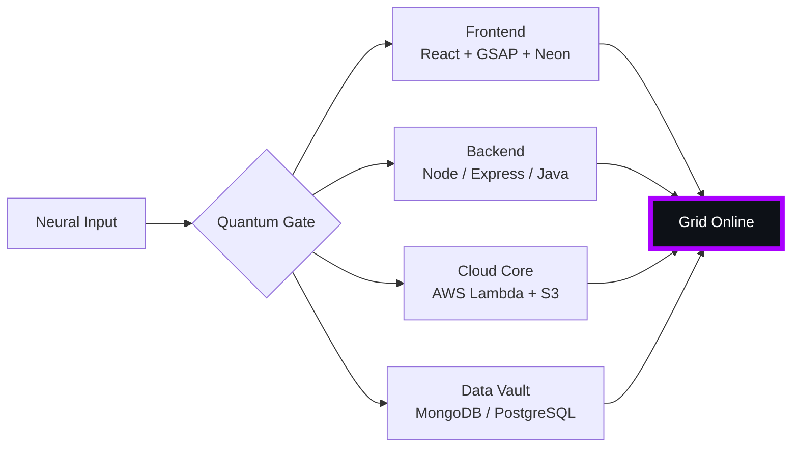

# 🌌 [ NEURAL CORE ACCESS: PENDEMVAMSI ]

<p align="center">
  
</p>

<div align="center">
  
  <br><small>Active Protocol: <strong style="color:#AA00FF">SHADOW EXTRACTION</strong> 🖤👁️</small>
</div>

## 🔵 NEURAL STATUS READOUT
```text
SUBJECT ID    →  PENDEMVAMSI
ENTITY CLASS  →  SHADOW MONARCH v8
NEURAL RANK   →  B-TIER
GRID SYNC     →  677/8010 QUANTUM PACKETS
─────── BIO-METRICS (SHADOW EXTRACTION) ───────
STRENGTH      140  ██████████████████░░░
AGILITY       122  ████████████████░░░░░
INTELLIGENCE  147  ███████████████████░░
VITALITY      112  ███████████████░░░░░░
```

> **NEURAL BURST ACQUIRED:** +134 QUANTUM PACKETS 
> **SYSTEM MESSAGE:** NEURAL UPLINK ESTABLISHED — RESISTANCE IS FUTILE

---

## 🌀 GRID ARCHITECTURE (HOLOGRAPHIC RENDER)



---

## 📡 ACADEMIC NODES – CONQUERED
- [x] B.Tech Neural Engineering (2020–2024) – St. Ann’s Grid
- [x] Intermediate Quantum Core (2018–2020) – Sri Medhavi
- [x] SSC Primary Link (2017–2018) – Sri Geethanjali

---

## ⚡ SKILL NEURAL MATRIX

<details open>
<summary>🔌 ACTIVE NEURAL LINKS</summary>

| Node               | Tier | Integrity Bar                | Status      |
|--------------------|------|------------------------------|-------------|
| Java Core          | S    | ████████████████████ 100%   | OVERCLOCKED |
| Node.js Grid       | S    | ████████████████████ 100%   | OVERCLOCKED |
| React Holo-UI      | A+   | █████████████████░░░ 92%    | ONLINE      |
| AWS Quantum Relay  | S    | ████████████████████ 100%   | SOVEREIGN   |
| Python AI Kernel   | A    | ████████████████░░░░ 85%    | CHARGING    |
| DSA Void Algorithm | A    | █████████████████░░░ 90%    | ACTIVE      |

</details>

---

## 🏅 NEURAL ACHIEVEMENT TOKENS

<p align="center">
  
  
  
  
</p>

---

## 👾 SHADOW ENTITIES – SUMMONED

<p align="center">
  
  <br><strong style="color:#AA00FF">ARISE.</strong>
</p>

| Entity | Designation   | Class            | Source Node                     |
|--------|---------------|------------------|---------------------------------|
| SH-01  | Igris         | Void Commander   | AI Financial Oracle             |
| SH-02  | Beru          | Swarm Overlord   | WebRTC Quantum Stream           |
| SH-03  | Kaisel        | Void Wyrm        | Geolocation Shadow Relay        |
| SH-04  | Tusk          | Arcane Construct | Global Pandemic Sentinel        |
| SH-05  | Iron          | Armored Bastion  | React Crypto Fortress           |

---

## 📡 GRID ANALYTICS (LIVE FEED)

<p align="center">
  
  <br>
  
  
</p>

---

## 🖥️ CORRUPTED MAINFRAME LOG (401 ENTRIES)

<details>
<summary>OPEN TERMINAL FEED – PROTOCOL: SHADOW EXTRACTION</summary>

> [0x9ED41426] 🖤👁️ **SHADOW EXTRACTION PROTOCOL** #0 | NEURAL LINK STABILIZED | [TRANSMISSION SUCCESS]
> [0x0E6BDA05] 🖤👁️ **SHADOW EXTRACTION PROTOCOL** #1 | NEURAL LINK STABILIZED | [TRANSMISSION SUCCESS]
> [0xEB17CC43] 🖤👁️ **SHADOW EXTRACTION PROTOCOL** #2 | NEURAL LINK STABILIZED | [TRANSMISSION SUCCESS]
> [0x4008096D] 🖤👁️ **SHADOW EXTRACTION PROTOCOL** #3 | NEURAL LINK  [GLITCH DETECTED] STABILIZED | [TRANSMISSION SUCCESS]
> [0x3938411F] 🖤👁️ **SHADOW EXTRACTION PROTOCOL** #4 | NEURAL LINK STABILIZED | [TRANSMISSION SUCCESS]
> [0xE2F0689B] 🖤👁️ **SHADOW EXTRACTION PROTOCOL** #5 | NEURAL LINK STABILIZED | [TRANSMISSION SUCCESS]
> [0x9FEEB65A] 🖤👁️ **SHADOW EXTRACTION PROTOCOL** #6 | NEURAL LINK STABILIZED | [TRANSMISSION SUCCESS]
> [0x0EF06471] 🖤👁️ **SHADOW EXTRACTION PROTOCOL** #7 | NEURAL LINK STABILIZED | [TRANSMISSION SUCCESS]
> [0xBB6707B5] 🖤👁️ **SHADOW EXTRACTION PROTOCOL** #8 | NEURAL LINK STABILIZED | [TRANSMISSION SUCCESS]
> [0x06057BB6] 🖤👁️ **SHADOW EXTRACTION PROTOCOL** #9 | NEURAL LINK STABILIZED | [TRANSMISSION SUCCESS]
> [0xFC44F7F1] 🖤👁️ **SHADOW EXTRACTION PROTOCOL** #10 | NEURAL LINK  [GLITCH DETECTED] STABILIZED | [TRANSMISSION SUCCESS]
> [0x9DF99B27] 🖤👁️ **SHADOW EXTRACTION PROTOCOL** #11 | NEURAL LINK STABILIZED | [TRANSMISSION SUCCESS]
> [0xFAA3007D] 🖤👁️ **SHADOW EXTRACTION PROTOCOL** #12 | NEURAL LINK  [GLITCH DETECTED] STABILIZED | [TRANSMISSION SUCCESS]
> [0xA4ADDD58] 🖤👁️ **SHADOW EXTRACTION PROTOCOL** #13 | NEURAL LINK STABILIZED | [TRANSMISSION SUCCESS]
> [0xF16E4636] 🖤👁️ **SHADOW EXTRACTION PROTOCOL** #14 | NEURAL LINK STABILIZED | [TRANSMISSION SUCCESS]
> [0x0916F0CB] 🖤👁️ **SHADOW EXTRACTION PROTOCOL** #15 | NEURAL LINK  [GLITCH DETECTED] STABILIZED | [TRANSMISSION SUCCESS]
> [0x58E7CD4E] 🖤👁️ **SHADOW EXTRACTION PROTOCOL** #16 | NEURAL LINK STABILIZED | [TRANSMISSION SUCCESS]
> [0x4EEA9843] 🖤👁️ **SHADOW EXTRACTION PROTOCOL** #17 | NEURAL LINK STABILIZED | [TRANSMISSION SUCCESS]
> [0x21F63A26] 🖤👁️ **SHADOW EXTRACTION PROTOCOL** #18 | NEURAL LINK STABILIZED | [TRANSMISSION SUCCESS]
> [0xE21582A5] 🖤👁️ **SHADOW EXTRACTION PROTOCOL** #19 | NEURAL LINK STABILIZED | [TRANSMISSION SUCCESS]
> [0xE0C40321] 🖤👁️ **SHADOW EXTRACTION PROTOCOL** #20 | NEURAL LINK STABILIZED | [TRANSMISSION SUCCESS]
> [0x0A2BDB14] 🖤👁️ **SHADOW EXTRACTION PROTOCOL** #21 | NEURAL LINK STABILIZED | [TRANSMISSION SUCCESS]
> [0xC6F0AF66] 🖤👁️ **SHADOW EXTRACTION PROTOCOL** #22 | NEURAL LINK STABILIZED | [TRANSMISSION SUCCESS]
> [0x17934037] 🖤👁️ **SHADOW EXTRACTION PROTOCOL** #23 | NEURAL LINK STABILIZED | [TRANSMISSION SUCCESS]
> [0x988D2909] 🖤👁️ **SHADOW EXTRACTION PROTOCOL** #24 | NEURAL LINK  [GLITCH DETECTED] STABILIZED | [TRANSMISSION SUCCESS]
> [0xF3234B11] 🖤👁️ **SHADOW EXTRACTION PROTOCOL** #25 | NEURAL LINK STABILIZED | [TRANSMISSION SUCCESS]
> [0x58D47F80] 🖤👁️ **SHADOW EXTRACTION PROTOCOL** #26 | NEURAL LINK STABILIZED | [TRANSMISSION SUCCESS]
> [0xA216FFC2] 🖤👁️ **SHADOW EXTRACTION PROTOCOL** #27 | NEURAL LINK STABILIZED | [TRANSMISSION SUCCESS]
> [0xB37F6662] 🖤👁️ **SHADOW EXTRACTION PROTOCOL** #28 | NEURAL LINK STABILIZED | [TRANSMISSION SUCCESS]
> [0xCA5DA1DC] 🖤👁️ **SHADOW EXTRACTION PROTOCOL** #29 | NEURAL LINK  [GLITCH DETECTED] STABILIZED | [TRANSMISSION SUCCESS]
> [0xEF7B55B5] 🖤👁️ **SHADOW EXTRACTION PROTOCOL** #30 | NEURAL LINK STABILIZED | [TRANSMISSION SUCCESS]
> [0x1DEBD06D] 🖤👁️ **SHADOW EXTRACTION PROTOCOL** #31 | NEURAL LINK STABILIZED | [TRANSMISSION SUCCESS]
> [0x8805596F] 🖤👁️ **SHADOW EXTRACTION PROTOCOL** #32 | NEURAL LINK STABILIZED | [TRANSMISSION SUCCESS]
> [0xB9E9C6FF] 🖤👁️ **SHADOW EXTRACTION PROTOCOL** #33 | NEURAL LINK STABILIZED | [TRANSMISSION SUCCESS]
> [0x248F556D] 🖤👁️ **SHADOW EXTRACTION PROTOCOL** #34 | NEURAL LINK STABILIZED | [TRANSMISSION SUCCESS]
> [0xD6155CE6] 🖤👁️ **SHADOW EXTRACTION PROTOCOL** #35 | NEURAL LINK STABILIZED | [TRANSMISSION SUCCESS]
> [0x555187C2] 🖤👁️ **SHADOW EXTRACTION PROTOCOL** #36 | NEURAL LINK STABILIZED | [TRANSMISSION SUCCESS]
> [0xD7D81232] 🖤👁️ **SHADOW EXTRACTION PROTOCOL** #37 | NEURAL LINK  [GLITCH DETECTED] STABILIZED | [TRANSMISSION SUCCESS]
> [0x96787146] 🖤👁️ **SHADOW EXTRACTION PROTOCOL** #38 | NEURAL LINK  [GLITCH DETECTED] STABILIZED | [TRANSMISSION SUCCESS]
> [0xC041277A] 🖤👁️ **SHADOW EXTRACTION PROTOCOL** #39 | NEURAL LINK STABILIZED | [TRANSMISSION SUCCESS]
> [0x3E6F5B13] 🖤👁️ **SHADOW EXTRACTION PROTOCOL** #40 | NEURAL LINK STABILIZED | [TRANSMISSION SUCCESS]
> [0xB6CFE9F1] 🖤👁️ **SHADOW EXTRACTION PROTOCOL** #41 | NEURAL LINK  [GLITCH DETECTED] STABILIZED | [TRANSMISSION SUCCESS]
> [0xE29FE15E] 🖤👁️ **SHADOW EXTRACTION PROTOCOL** #42 | NEURAL LINK STABILIZED | [TRANSMISSION SUCCESS]
> [0x36AD22BE] 🖤👁️ **SHADOW EXTRACTION PROTOCOL** #43 | NEURAL LINK STABILIZED | [TRANSMISSION SUCCESS]
> [0x88C86E41] 🖤👁️ **SHADOW EXTRACTION PROTOCOL** #44 | NEURAL LINK STABILIZED | [TRANSMISSION SUCCESS]
> [0x96D48E95] 🖤👁️ **SHADOW EXTRACTION PROTOCOL** #45 | NEURAL LINK STABILIZED | [TRANSMISSION SUCCESS]
> [0xBFEA469E] 🖤👁️ **SHADOW EXTRACTION PROTOCOL** #46 | NEURAL LINK  [GLITCH DETECTED] STABILIZED | [TRANSMISSION SUCCESS]
> [0x3DE99AB2] 🖤👁️ **SHADOW EXTRACTION PROTOCOL** #47 | NEURAL LINK STABILIZED | [TRANSMISSION SUCCESS]
> [0xECF3EA83] 🖤👁️ **SHADOW EXTRACTION PROTOCOL** #48 | NEURAL LINK STABILIZED | [TRANSMISSION SUCCESS]
> [0xCD1C8346] 🖤👁️ **SHADOW EXTRACTION PROTOCOL** #49 | NEURAL LINK STABILIZED | [TRANSMISSION SUCCESS]
> [0x5E41BF41] 🖤👁️ **SHADOW EXTRACTION PROTOCOL** #50 | NEURAL LINK STABILIZED | [TRANSMISSION SUCCESS]
> [0xE19F378A] 🖤👁️ **SHADOW EXTRACTION PROTOCOL** #51 | NEURAL LINK STABILIZED | [TRANSMISSION SUCCESS]
> [0x93E3F862] 🖤👁️ **SHADOW EXTRACTION PROTOCOL** #52 | NEURAL LINK STABILIZED | [TRANSMISSION SUCCESS]
> [0x71E7624B] 🖤👁️ **SHADOW EXTRACTION PROTOCOL** #53 | NEURAL LINK STABILIZED | [TRANSMISSION SUCCESS]
> [0xE4E061BE] 🖤👁️ **SHADOW EXTRACTION PROTOCOL** #54 | NEURAL LINK STABILIZED | [TRANSMISSION SUCCESS]
> [0xE5326554] 🖤👁️ **SHADOW EXTRACTION PROTOCOL** #55 | NEURAL LINK STABILIZED | [TRANSMISSION SUCCESS]
> [0x613C69DF] 🖤👁️ **SHADOW EXTRACTION PROTOCOL** #56 | NEURAL LINK STABILIZED | [TRANSMISSION SUCCESS]
> [0xC7D7A907] 🖤👁️ **SHADOW EXTRACTION PROTOCOL** #57 | NEURAL LINK STABILIZED | [TRANSMISSION SUCCESS]
> [0xE7E7284E] 🖤👁️ **SHADOW EXTRACTION PROTOCOL** #58 | NEURAL LINK STABILIZED | [TRANSMISSION SUCCESS]
> [0xD6375238] 🖤👁️ **SHADOW EXTRACTION PROTOCOL** #59 | NEURAL LINK STABILIZED | [TRANSMISSION SUCCESS]
> [0x87BBBA4D] 🖤👁️ **SHADOW EXTRACTION PROTOCOL** #60 | NEURAL LINK STABILIZED | [TRANSMISSION SUCCESS]
> [0x9BE1D574] 🖤👁️ **SHADOW EXTRACTION PROTOCOL** #61 | NEURAL LINK STABILIZED | [TRANSMISSION SUCCESS]
> [0xDFCA50D8] 🖤👁️ **SHADOW EXTRACTION PROTOCOL** #62 | NEURAL LINK STABILIZED | [TRANSMISSION SUCCESS]
> [0x99EFBE8B] 🖤👁️ **SHADOW EXTRACTION PROTOCOL** #63 | NEURAL LINK STABILIZED | [TRANSMISSION SUCCESS]
> [0x4FAD54BE] 🖤👁️ **SHADOW EXTRACTION PROTOCOL** #64 | NEURAL LINK STABILIZED | [TRANSMISSION SUCCESS]
> [0xB92E3918] 🖤👁️ **SHADOW EXTRACTION PROTOCOL** #65 | NEURAL LINK STABILIZED | [TRANSMISSION SUCCESS]
> [0x503A5EAB] 🖤👁️ **SHADOW EXTRACTION PROTOCOL** #66 | NEURAL LINK STABILIZED | [TRANSMISSION SUCCESS]
> [0x4361EA39] 🖤👁️ **SHADOW EXTRACTION PROTOCOL** #67 | NEURAL LINK STABILIZED | [TRANSMISSION SUCCESS]
> [0xF6A8003A] 🖤👁️ **SHADOW EXTRACTION PROTOCOL** #68 | NEURAL LINK STABILIZED | [TRANSMISSION SUCCESS]
> [0x5322FECA] 🖤👁️ **SHADOW EXTRACTION PROTOCOL** #69 | NEURAL LINK STABILIZED | [TRANSMISSION SUCCESS]
> [0xF7AC97B6] 🖤👁️ **SHADOW EXTRACTION PROTOCOL** #70 | NEURAL LINK STABILIZED | [TRANSMISSION SUCCESS]
> [0xD150D932] 🖤👁️ **SHADOW EXTRACTION PROTOCOL** #71 | NEURAL LINK STABILIZED | [TRANSMISSION SUCCESS]
> [0x74F8B702] 🖤👁️ **SHADOW EXTRACTION PROTOCOL** #72 | NEURAL LINK STABILIZED | [TRANSMISSION SUCCESS]
> [0x67E7C171] 🖤👁️ **SHADOW EXTRACTION PROTOCOL** #73 | NEURAL LINK STABILIZED | [TRANSMISSION SUCCESS]
> [0x127FAAA3] 🖤👁️ **SHADOW EXTRACTION PROTOCOL** #74 | NEURAL LINK STABILIZED | [TRANSMISSION SUCCESS]
> [0x489F1183] 🖤👁️ **SHADOW EXTRACTION PROTOCOL** #75 | NEURAL LINK STABILIZED | [TRANSMISSION SUCCESS]
> [0x89B5EFEE] 🖤👁️ **SHADOW EXTRACTION PROTOCOL** #76 | NEURAL LINK STABILIZED | [TRANSMISSION SUCCESS]
> [0x69815A87] 🖤👁️ **SHADOW EXTRACTION PROTOCOL** #77 | NEURAL LINK STABILIZED | [TRANSMISSION SUCCESS]
> [0xC849DC41] 🖤👁️ **SHADOW EXTRACTION PROTOCOL** #78 | NEURAL LINK  [GLITCH DETECTED] STABILIZED | [TRANSMISSION SUCCESS]
> [0x6E1B6885] 🖤👁️ **SHADOW EXTRACTION PROTOCOL** #79 | NEURAL LINK STABILIZED | [TRANSMISSION SUCCESS]
> [0x5BEF1B44] 🖤👁️ **SHADOW EXTRACTION PROTOCOL** #80 | NEURAL LINK STABILIZED | [TRANSMISSION SUCCESS]
> [0xFBD84635] 🖤👁️ **SHADOW EXTRACTION PROTOCOL** #81 | NEURAL LINK STABILIZED | [TRANSMISSION SUCCESS]
> [0xEF942CA0] 🖤👁️ **SHADOW EXTRACTION PROTOCOL** #82 | NEURAL LINK STABILIZED | [TRANSMISSION SUCCESS]
> [0x8FEB725B] 🖤👁️ **SHADOW EXTRACTION PROTOCOL** #83 | NEURAL LINK  [GLITCH DETECTED] STABILIZED | [TRANSMISSION SUCCESS]
> [0x09634EF2] 🖤👁️ **SHADOW EXTRACTION PROTOCOL** #84 | NEURAL LINK STABILIZED | [TRANSMISSION SUCCESS]
> [0xCD137A38] 🖤👁️ **SHADOW EXTRACTION PROTOCOL** #85 | NEURAL LINK STABILIZED | [TRANSMISSION SUCCESS]
> [0xFA8F39E3] 🖤👁️ **SHADOW EXTRACTION PROTOCOL** #86 | NEURAL LINK STABILIZED | [TRANSMISSION SUCCESS]
> [0x3E783C19] 🖤👁️ **SHADOW EXTRACTION PROTOCOL** #87 | NEURAL LINK STABILIZED | [TRANSMISSION SUCCESS]
> [0x26EE879D] 🖤👁️ **SHADOW EXTRACTION PROTOCOL** #88 | NEURAL LINK STABILIZED | [TRANSMISSION SUCCESS]
> [0xBDF17085] 🖤👁️ **SHADOW EXTRACTION PROTOCOL** #89 | NEURAL LINK STABILIZED | [TRANSMISSION SUCCESS]
> [0xD9B5B5F9] 🖤👁️ **SHADOW EXTRACTION PROTOCOL** #90 | NEURAL LINK  [GLITCH DETECTED] STABILIZED | [TRANSMISSION SUCCESS]
> [0xD51703C2] 🖤👁️ **SHADOW EXTRACTION PROTOCOL** #91 | NEURAL LINK STABILIZED | [TRANSMISSION SUCCESS]
> [0x5E42F1EF] 🖤👁️ **SHADOW EXTRACTION PROTOCOL** #92 | NEURAL LINK STABILIZED | [TRANSMISSION SUCCESS]
> [0x19888256] 🖤👁️ **SHADOW EXTRACTION PROTOCOL** #93 | NEURAL LINK STABILIZED | [TRANSMISSION SUCCESS]
> [0x87E30C22] 🖤👁️ **SHADOW EXTRACTION PROTOCOL** #94 | NEURAL LINK STABILIZED | [TRANSMISSION SUCCESS]
> [0x611D8D48] 🖤👁️ **SHADOW EXTRACTION PROTOCOL** #95 | NEURAL LINK  [GLITCH DETECTED] STABILIZED | [TRANSMISSION SUCCESS]
> [0x6E9D47F6] 🖤👁️ **SHADOW EXTRACTION PROTOCOL** #96 | NEURAL LINK  [GLITCH DETECTED] STABILIZED | [TRANSMISSION SUCCESS]
> [0x6F4ECBE8] 🖤👁️ **SHADOW EXTRACTION PROTOCOL** #97 | NEURAL LINK STABILIZED | [TRANSMISSION SUCCESS]
> [0x7013D460] 🖤👁️ **SHADOW EXTRACTION PROTOCOL** #98 | NEURAL LINK STABILIZED | [TRANSMISSION SUCCESS]
> [0xD17ECD64] 🖤👁️ **SHADOW EXTRACTION PROTOCOL** #99 | NEURAL LINK STABILIZED | [TRANSMISSION SUCCESS]
> [0x985D8248] 🖤👁️ **SHADOW EXTRACTION PROTOCOL** #100 | NEURAL LINK STABILIZED | [TRANSMISSION SUCCESS]
> [0x780E2292] 🖤👁️ **SHADOW EXTRACTION PROTOCOL** #101 | NEURAL LINK STABILIZED | [TRANSMISSION SUCCESS]
> [0xD867E01E] 🖤👁️ **SHADOW EXTRACTION PROTOCOL** #102 | NEURAL LINK STABILIZED | [TRANSMISSION SUCCESS]
> [0x18FF9AE6] 🖤👁️ **SHADOW EXTRACTION PROTOCOL** #103 | NEURAL LINK STABILIZED | [TRANSMISSION SUCCESS]
> [0xAFE225D0] 🖤👁️ **SHADOW EXTRACTION PROTOCOL** #104 | NEURAL LINK STABILIZED | [TRANSMISSION SUCCESS]
> [0x94523CAB] 🖤👁️ **SHADOW EXTRACTION PROTOCOL** #105 | NEURAL LINK STABILIZED | [TRANSMISSION SUCCESS]
> [0xA9787F66] 🖤👁️ **SHADOW EXTRACTION PROTOCOL** #106 | NEURAL LINK STABILIZED | [TRANSMISSION SUCCESS]
> [0x9EEF635D] 🖤👁️ **SHADOW EXTRACTION PROTOCOL** #107 | NEURAL LINK  [GLITCH DETECTED] STABILIZED | [TRANSMISSION SUCCESS]
> [0x8E90B1EE] 🖤👁️ **SHADOW EXTRACTION PROTOCOL** #108 | NEURAL LINK STABILIZED | [TRANSMISSION SUCCESS]
> [0xDA4C273B] 🖤👁️ **SHADOW EXTRACTION PROTOCOL** #109 | NEURAL LINK STABILIZED | [TRANSMISSION SUCCESS]
> [0x3D36B7F9] 🖤👁️ **SHADOW EXTRACTION PROTOCOL** #110 | NEURAL LINK STABILIZED | [TRANSMISSION SUCCESS]
> [0xF1CEF758] 🖤👁️ **SHADOW EXTRACTION PROTOCOL** #111 | NEURAL LINK STABILIZED | [TRANSMISSION SUCCESS]
> [0x2BB4E30F] 🖤👁️ **SHADOW EXTRACTION PROTOCOL** #112 | NEURAL LINK  [GLITCH DETECTED] STABILIZED | [TRANSMISSION SUCCESS]
> [0x75A1FF01] 🖤👁️ **SHADOW EXTRACTION PROTOCOL** #113 | NEURAL LINK STABILIZED | [TRANSMISSION SUCCESS]
> [0x2274046A] 🖤👁️ **SHADOW EXTRACTION PROTOCOL** #114 | NEURAL LINK STABILIZED | [TRANSMISSION SUCCESS]
> [0x5E5931AF] 🖤👁️ **SHADOW EXTRACTION PROTOCOL** #115 | NEURAL LINK STABILIZED | [TRANSMISSION SUCCESS]
> [0x9BE0D899] 🖤👁️ **SHADOW EXTRACTION PROTOCOL** #116 | NEURAL LINK STABILIZED | [TRANSMISSION SUCCESS]
> [0x9C55425B] 🖤👁️ **SHADOW EXTRACTION PROTOCOL** #117 | NEURAL LINK STABILIZED | [TRANSMISSION SUCCESS]
> [0x38359868] 🖤👁️ **SHADOW EXTRACTION PROTOCOL** #118 | NEURAL LINK STABILIZED | [TRANSMISSION SUCCESS]
> [0x70021E3F] 🖤👁️ **SHADOW EXTRACTION PROTOCOL** #119 | NEURAL LINK  [GLITCH DETECTED] STABILIZED | [TRANSMISSION SUCCESS]
> [0x57F687B6] 🖤👁️ **SHADOW EXTRACTION PROTOCOL** #120 | NEURAL LINK STABILIZED | [TRANSMISSION SUCCESS]
> [0x92DDB7AC] 🖤👁️ **SHADOW EXTRACTION PROTOCOL** #121 | NEURAL LINK  [GLITCH DETECTED] STABILIZED | [TRANSMISSION SUCCESS]
> [0xD3AEE14F] 🖤👁️ **SHADOW EXTRACTION PROTOCOL** #122 | NEURAL LINK STABILIZED | [TRANSMISSION SUCCESS]
> [0x0CCA60E1] 🖤👁️ **SHADOW EXTRACTION PROTOCOL** #123 | NEURAL LINK STABILIZED | [TRANSMISSION SUCCESS]
> [0xD99DEDE0] 🖤👁️ **SHADOW EXTRACTION PROTOCOL** #124 | NEURAL LINK STABILIZED | [TRANSMISSION SUCCESS]
> [0xA99BE391] 🖤👁️ **SHADOW EXTRACTION PROTOCOL** #125 | NEURAL LINK STABILIZED | [TRANSMISSION SUCCESS]
> [0xB13FA0CE] 🖤👁️ **SHADOW EXTRACTION PROTOCOL** #126 | NEURAL LINK STABILIZED | [TRANSMISSION SUCCESS]
> [0x159D4FC7] 🖤👁️ **SHADOW EXTRACTION PROTOCOL** #127 | NEURAL LINK STABILIZED | [TRANSMISSION SUCCESS]
> [0xB0F3A859] 🖤👁️ **SHADOW EXTRACTION PROTOCOL** #128 | NEURAL LINK STABILIZED | [TRANSMISSION SUCCESS]
> [0x4DC8CEF1] 🖤👁️ **SHADOW EXTRACTION PROTOCOL** #129 | NEURAL LINK  [GLITCH DETECTED] STABILIZED | [TRANSMISSION SUCCESS]
> [0xEDBD32AC] 🖤👁️ **SHADOW EXTRACTION PROTOCOL** #130 | NEURAL LINK  [GLITCH DETECTED] STABILIZED | [TRANSMISSION SUCCESS]
> [0xDE4A0592] 🖤👁️ **SHADOW EXTRACTION PROTOCOL** #131 | NEURAL LINK STABILIZED | [TRANSMISSION SUCCESS]
> [0xDD1D4597] 🖤👁️ **SHADOW EXTRACTION PROTOCOL** #132 | NEURAL LINK STABILIZED | [TRANSMISSION SUCCESS]
> [0x90E6C604] 🖤👁️ **SHADOW EXTRACTION PROTOCOL** #133 | NEURAL LINK STABILIZED | [TRANSMISSION SUCCESS]
> [0xF3CEE059] 🖤👁️ **SHADOW EXTRACTION PROTOCOL** #134 | NEURAL LINK  [GLITCH DETECTED] STABILIZED | [TRANSMISSION SUCCESS]
> [0x9334D77C] 🖤👁️ **SHADOW EXTRACTION PROTOCOL** #135 | NEURAL LINK  [GLITCH DETECTED] STABILIZED | [TRANSMISSION SUCCESS]
> [0x60FE9E20] 🖤👁️ **SHADOW EXTRACTION PROTOCOL** #136 | NEURAL LINK STABILIZED | [TRANSMISSION SUCCESS]
> [0x57897D49] 🖤👁️ **SHADOW EXTRACTION PROTOCOL** #137 | NEURAL LINK  [GLITCH DETECTED] STABILIZED | [TRANSMISSION SUCCESS]
> [0xB74CAA02] 🖤👁️ **SHADOW EXTRACTION PROTOCOL** #138 | NEURAL LINK  [GLITCH DETECTED] STABILIZED | [TRANSMISSION SUCCESS]
> [0xEFF2AB08] 🖤👁️ **SHADOW EXTRACTION PROTOCOL** #139 | NEURAL LINK STABILIZED | [TRANSMISSION SUCCESS]
> [0x250CEC93] 🖤👁️ **SHADOW EXTRACTION PROTOCOL** #140 | NEURAL LINK STABILIZED | [TRANSMISSION SUCCESS]
> [0xF3C76168] 🖤👁️ **SHADOW EXTRACTION PROTOCOL** #141 | NEURAL LINK STABILIZED | [TRANSMISSION SUCCESS]
> [0x082002E8] 🖤👁️ **SHADOW EXTRACTION PROTOCOL** #142 | NEURAL LINK  [GLITCH DETECTED] STABILIZED | [TRANSMISSION SUCCESS]
> [0x271475EB] 🖤👁️ **SHADOW EXTRACTION PROTOCOL** #143 | NEURAL LINK STABILIZED | [TRANSMISSION SUCCESS]
> [0xEC05BA13] 🖤👁️ **SHADOW EXTRACTION PROTOCOL** #144 | NEURAL LINK STABILIZED | [TRANSMISSION SUCCESS]
> [0x0BF1E9A7] 🖤👁️ **SHADOW EXTRACTION PROTOCOL** #145 | NEURAL LINK STABILIZED | [TRANSMISSION SUCCESS]
> [0x6006D201] 🖤👁️ **SHADOW EXTRACTION PROTOCOL** #146 | NEURAL LINK STABILIZED | [TRANSMISSION SUCCESS]
> [0x9FF9208C] 🖤👁️ **SHADOW EXTRACTION PROTOCOL** #147 | NEURAL LINK  [GLITCH DETECTED] STABILIZED | [TRANSMISSION SUCCESS]
> [0x0C1B0C9A] 🖤👁️ **SHADOW EXTRACTION PROTOCOL** #148 | NEURAL LINK  [GLITCH DETECTED] STABILIZED | [TRANSMISSION SUCCESS]
> [0xC20A2E5E] 🖤👁️ **SHADOW EXTRACTION PROTOCOL** #149 | NEURAL LINK STABILIZED | [TRANSMISSION SUCCESS]
> [0xE86D2ADC] 🖤👁️ **SHADOW EXTRACTION PROTOCOL** #150 | NEURAL LINK STABILIZED | [TRANSMISSION SUCCESS]
> [0x10BF2AB4] 🖤👁️ **SHADOW EXTRACTION PROTOCOL** #151 | NEURAL LINK STABILIZED | [TRANSMISSION SUCCESS]
> [0x15BBA464] 🖤👁️ **SHADOW EXTRACTION PROTOCOL** #152 | NEURAL LINK STABILIZED | [TRANSMISSION SUCCESS]
> [0x9E0F9AB4] 🖤👁️ **SHADOW EXTRACTION PROTOCOL** #153 | NEURAL LINK  [GLITCH DETECTED] STABILIZED | [TRANSMISSION SUCCESS]
> [0xFA487D1F] 🖤👁️ **SHADOW EXTRACTION PROTOCOL** #154 | NEURAL LINK  [GLITCH DETECTED] STABILIZED | [TRANSMISSION SUCCESS]
> [0xED61C3CA] 🖤👁️ **SHADOW EXTRACTION PROTOCOL** #155 | NEURAL LINK STABILIZED | [TRANSMISSION SUCCESS]
> [0xC354393B] 🖤👁️ **SHADOW EXTRACTION PROTOCOL** #156 | NEURAL LINK  [GLITCH DETECTED] STABILIZED | [TRANSMISSION SUCCESS]
> [0x9B21D368] 🖤👁️ **SHADOW EXTRACTION PROTOCOL** #157 | NEURAL LINK STABILIZED | [TRANSMISSION SUCCESS]
> [0x6F884B3F] 🖤👁️ **SHADOW EXTRACTION PROTOCOL** #158 | NEURAL LINK STABILIZED | [TRANSMISSION SUCCESS]
> [0x20B0DB06] 🖤👁️ **SHADOW EXTRACTION PROTOCOL** #159 | NEURAL LINK STABILIZED | [TRANSMISSION SUCCESS]
> [0x448C015B] 🖤👁️ **SHADOW EXTRACTION PROTOCOL** #160 | NEURAL LINK STABILIZED | [TRANSMISSION SUCCESS]
> [0xECB4810F] 🖤👁️ **SHADOW EXTRACTION PROTOCOL** #161 | NEURAL LINK STABILIZED | [TRANSMISSION SUCCESS]
> [0x02EBC49D] 🖤👁️ **SHADOW EXTRACTION PROTOCOL** #162 | NEURAL LINK STABILIZED | [TRANSMISSION SUCCESS]
> [0x0A2DF200] 🖤👁️ **SHADOW EXTRACTION PROTOCOL** #163 | NEURAL LINK STABILIZED | [TRANSMISSION SUCCESS]
> [0xA177883C] 🖤👁️ **SHADOW EXTRACTION PROTOCOL** #164 | NEURAL LINK STABILIZED | [TRANSMISSION SUCCESS]
> [0x9E4CB081] 🖤👁️ **SHADOW EXTRACTION PROTOCOL** #165 | NEURAL LINK STABILIZED | [TRANSMISSION SUCCESS]
> [0xF4BD8C70] 🖤👁️ **SHADOW EXTRACTION PROTOCOL** #166 | NEURAL LINK STABILIZED | [TRANSMISSION SUCCESS]
> [0xEAE5053F] 🖤👁️ **SHADOW EXTRACTION PROTOCOL** #167 | NEURAL LINK STABILIZED | [TRANSMISSION SUCCESS]
> [0x61CA4C05] 🖤👁️ **SHADOW EXTRACTION PROTOCOL** #168 | NEURAL LINK STABILIZED | [TRANSMISSION SUCCESS]
> [0xABEA6504] 🖤👁️ **SHADOW EXTRACTION PROTOCOL** #169 | NEURAL LINK STABILIZED | [TRANSMISSION SUCCESS]
> [0x02A810D3] 🖤👁️ **SHADOW EXTRACTION PROTOCOL** #170 | NEURAL LINK STABILIZED | [TRANSMISSION SUCCESS]
> [0x00769534] 🖤👁️ **SHADOW EXTRACTION PROTOCOL** #171 | NEURAL LINK STABILIZED | [TRANSMISSION SUCCESS]
> [0xC0A9357A] 🖤👁️ **SHADOW EXTRACTION PROTOCOL** #172 | NEURAL LINK  [GLITCH DETECTED] STABILIZED | [TRANSMISSION SUCCESS]
> [0x67990AF4] 🖤👁️ **SHADOW EXTRACTION PROTOCOL** #173 | NEURAL LINK STABILIZED | [TRANSMISSION SUCCESS]
> [0x5615C507] 🖤👁️ **SHADOW EXTRACTION PROTOCOL** #174 | NEURAL LINK STABILIZED | [TRANSMISSION SUCCESS]
> [0xA6C5ED9C] 🖤👁️ **SHADOW EXTRACTION PROTOCOL** #175 | NEURAL LINK STABILIZED | [TRANSMISSION SUCCESS]
> [0x2E63EBA8] 🖤👁️ **SHADOW EXTRACTION PROTOCOL** #176 | NEURAL LINK STABILIZED | [TRANSMISSION SUCCESS]
> [0x33E016F0] 🖤👁️ **SHADOW EXTRACTION PROTOCOL** #177 | NEURAL LINK STABILIZED | [TRANSMISSION SUCCESS]
> [0xCF8983A9] 🖤👁️ **SHADOW EXTRACTION PROTOCOL** #178 | NEURAL LINK  [GLITCH DETECTED] STABILIZED | [TRANSMISSION SUCCESS]
> [0xE5675BAE] 🖤👁️ **SHADOW EXTRACTION PROTOCOL** #179 | NEURAL LINK  [GLITCH DETECTED] STABILIZED | [TRANSMISSION SUCCESS]
> [0xB90FED68] 🖤👁️ **SHADOW EXTRACTION PROTOCOL** #180 | NEURAL LINK  [GLITCH DETECTED] STABILIZED | [TRANSMISSION SUCCESS]
> [0xF5EF5B4B] 🖤👁️ **SHADOW EXTRACTION PROTOCOL** #181 | NEURAL LINK STABILIZED | [TRANSMISSION SUCCESS]
> [0x9DA696CF] 🖤👁️ **SHADOW EXTRACTION PROTOCOL** #182 | NEURAL LINK STABILIZED | [TRANSMISSION SUCCESS]
> [0xDDD7D326] 🖤👁️ **SHADOW EXTRACTION PROTOCOL** #183 | NEURAL LINK STABILIZED | [TRANSMISSION SUCCESS]
> [0x5ABF01C3] 🖤👁️ **SHADOW EXTRACTION PROTOCOL** #184 | NEURAL LINK STABILIZED | [TRANSMISSION SUCCESS]
> [0x8FEC19F8] 🖤👁️ **SHADOW EXTRACTION PROTOCOL** #185 | NEURAL LINK  [GLITCH DETECTED] STABILIZED | [TRANSMISSION SUCCESS]
> [0xD88ADF48] 🖤👁️ **SHADOW EXTRACTION PROTOCOL** #186 | NEURAL LINK STABILIZED | [TRANSMISSION SUCCESS]
> [0x447B5437] 🖤👁️ **SHADOW EXTRACTION PROTOCOL** #187 | NEURAL LINK STABILIZED | [TRANSMISSION SUCCESS]
> [0x09F3DCE7] 🖤👁️ **SHADOW EXTRACTION PROTOCOL** #188 | NEURAL LINK  [GLITCH DETECTED] STABILIZED | [TRANSMISSION SUCCESS]
> [0x03D99FEF] 🖤👁️ **SHADOW EXTRACTION PROTOCOL** #189 | NEURAL LINK STABILIZED | [TRANSMISSION SUCCESS]
> [0x0FFC3D5B] 🖤👁️ **SHADOW EXTRACTION PROTOCOL** #190 | NEURAL LINK  [GLITCH DETECTED] STABILIZED | [TRANSMISSION SUCCESS]
> [0xACF4C043] 🖤👁️ **SHADOW EXTRACTION PROTOCOL** #191 | NEURAL LINK STABILIZED | [TRANSMISSION SUCCESS]
> [0xA9454275] 🖤👁️ **SHADOW EXTRACTION PROTOCOL** #192 | NEURAL LINK STABILIZED | [TRANSMISSION SUCCESS]
> [0x06B27DB5] 🖤👁️ **SHADOW EXTRACTION PROTOCOL** #193 | NEURAL LINK STABILIZED | [TRANSMISSION SUCCESS]
> [0x2C31D9D1] 🖤👁️ **SHADOW EXTRACTION PROTOCOL** #194 | NEURAL LINK  [GLITCH DETECTED] STABILIZED | [TRANSMISSION SUCCESS]
> [0x35762FCB] 🖤👁️ **SHADOW EXTRACTION PROTOCOL** #195 | NEURAL LINK STABILIZED | [TRANSMISSION SUCCESS]
> [0x2F35066F] 🖤👁️ **SHADOW EXTRACTION PROTOCOL** #196 | NEURAL LINK  [GLITCH DETECTED] STABILIZED | [TRANSMISSION SUCCESS]
> [0xF92F6E7C] 🖤👁️ **SHADOW EXTRACTION PROTOCOL** #197 | NEURAL LINK STABILIZED | [TRANSMISSION SUCCESS]
> [0x9BF674B7] 🖤👁️ **SHADOW EXTRACTION PROTOCOL** #198 | NEURAL LINK  [GLITCH DETECTED] STABILIZED | [TRANSMISSION SUCCESS]
> [0xED9B5932] 🖤👁️ **SHADOW EXTRACTION PROTOCOL** #199 | NEURAL LINK STABILIZED | [TRANSMISSION SUCCESS]
> [0x7EB6BA1F] 🖤👁️ **SHADOW EXTRACTION PROTOCOL** #200 | NEURAL LINK  [GLITCH DETECTED] STABILIZED | [TRANSMISSION SUCCESS]
> [0x49C07184] 🖤👁️ **SHADOW EXTRACTION PROTOCOL** #201 | NEURAL LINK STABILIZED | [TRANSMISSION SUCCESS]
> [0x29873A90] 🖤👁️ **SHADOW EXTRACTION PROTOCOL** #202 | NEURAL LINK  [GLITCH DETECTED] STABILIZED | [TRANSMISSION SUCCESS]
> [0xA3D92CAB] 🖤👁️ **SHADOW EXTRACTION PROTOCOL** #203 | NEURAL LINK STABILIZED | [TRANSMISSION SUCCESS]
> [0x88DDACC8] 🖤👁️ **SHADOW EXTRACTION PROTOCOL** #204 | NEURAL LINK STABILIZED | [TRANSMISSION SUCCESS]
> [0xD14387FD] 🖤👁️ **SHADOW EXTRACTION PROTOCOL** #205 | NEURAL LINK STABILIZED | [TRANSMISSION SUCCESS]
> [0xFD68AA70] 🖤👁️ **SHADOW EXTRACTION PROTOCOL** #206 | NEURAL LINK STABILIZED | [TRANSMISSION SUCCESS]
> [0x08241E85] 🖤👁️ **SHADOW EXTRACTION PROTOCOL** #207 | NEURAL LINK STABILIZED | [TRANSMISSION SUCCESS]
> [0x47DD68B0] 🖤👁️ **SHADOW EXTRACTION PROTOCOL** #208 | NEURAL LINK STABILIZED | [TRANSMISSION SUCCESS]
> [0x525D7480] 🖤👁️ **SHADOW EXTRACTION PROTOCOL** #209 | NEURAL LINK STABILIZED | [TRANSMISSION SUCCESS]
> [0x68B5096E] 🖤👁️ **SHADOW EXTRACTION PROTOCOL** #210 | NEURAL LINK STABILIZED | [TRANSMISSION SUCCESS]
> [0x26F8D6C9] 🖤👁️ **SHADOW EXTRACTION PROTOCOL** #211 | NEURAL LINK  [GLITCH DETECTED] STABILIZED | [TRANSMISSION SUCCESS]
> [0xA1C47CC1] 🖤👁️ **SHADOW EXTRACTION PROTOCOL** #212 | NEURAL LINK STABILIZED | [TRANSMISSION SUCCESS]
> [0x4B9EA649] 🖤👁️ **SHADOW EXTRACTION PROTOCOL** #213 | NEURAL LINK  [GLITCH DETECTED] STABILIZED | [TRANSMISSION SUCCESS]
> [0xEFC86C85] 🖤👁️ **SHADOW EXTRACTION PROTOCOL** #214 | NEURAL LINK STABILIZED | [TRANSMISSION SUCCESS]
> [0xE822085C] 🖤👁️ **SHADOW EXTRACTION PROTOCOL** #215 | NEURAL LINK STABILIZED | [TRANSMISSION SUCCESS]
> [0x00797D11] 🖤👁️ **SHADOW EXTRACTION PROTOCOL** #216 | NEURAL LINK STABILIZED | [TRANSMISSION SUCCESS]
> [0xC42FC32C] 🖤👁️ **SHADOW EXTRACTION PROTOCOL** #217 | NEURAL LINK STABILIZED | [TRANSMISSION SUCCESS]
> [0x91D84874] 🖤👁️ **SHADOW EXTRACTION PROTOCOL** #218 | NEURAL LINK STABILIZED | [TRANSMISSION SUCCESS]
> [0x6B997785] 🖤👁️ **SHADOW EXTRACTION PROTOCOL** #219 | NEURAL LINK STABILIZED | [TRANSMISSION SUCCESS]
> [0xCD117650] 🖤👁️ **SHADOW EXTRACTION PROTOCOL** #220 | NEURAL LINK STABILIZED | [TRANSMISSION SUCCESS]
> [0xEE5EC122] 🖤👁️ **SHADOW EXTRACTION PROTOCOL** #221 | NEURAL LINK STABILIZED | [TRANSMISSION SUCCESS]
> [0xE52650FB] 🖤👁️ **SHADOW EXTRACTION PROTOCOL** #222 | NEURAL LINK STABILIZED | [TRANSMISSION SUCCESS]
> [0x421689DD] 🖤👁️ **SHADOW EXTRACTION PROTOCOL** #223 | NEURAL LINK STABILIZED | [TRANSMISSION SUCCESS]
> [0xE409A7D6] 🖤👁️ **SHADOW EXTRACTION PROTOCOL** #224 | NEURAL LINK STABILIZED | [TRANSMISSION SUCCESS]
> [0x5858AE4D] 🖤👁️ **SHADOW EXTRACTION PROTOCOL** #225 | NEURAL LINK STABILIZED | [TRANSMISSION SUCCESS]
> [0xE947878D] 🖤👁️ **SHADOW EXTRACTION PROTOCOL** #226 | NEURAL LINK STABILIZED | [TRANSMISSION SUCCESS]
> [0x90D41551] 🖤👁️ **SHADOW EXTRACTION PROTOCOL** #227 | NEURAL LINK STABILIZED | [TRANSMISSION SUCCESS]
> [0x1DE25413] 🖤👁️ **SHADOW EXTRACTION PROTOCOL** #228 | NEURAL LINK  [GLITCH DETECTED] STABILIZED | [TRANSMISSION SUCCESS]
> [0x2CDC339C] 🖤👁️ **SHADOW EXTRACTION PROTOCOL** #229 | NEURAL LINK STABILIZED | [TRANSMISSION SUCCESS]
> [0x2355C494] 🖤👁️ **SHADOW EXTRACTION PROTOCOL** #230 | NEURAL LINK STABILIZED | [TRANSMISSION SUCCESS]
> [0x2B021570] 🖤👁️ **SHADOW EXTRACTION PROTOCOL** #231 | NEURAL LINK  [GLITCH DETECTED] STABILIZED | [TRANSMISSION SUCCESS]
> [0x212469D7] 🖤👁️ **SHADOW EXTRACTION PROTOCOL** #232 | NEURAL LINK  [GLITCH DETECTED] STABILIZED | [TRANSMISSION SUCCESS]
> [0xA293C2E9] 🖤👁️ **SHADOW EXTRACTION PROTOCOL** #233 | NEURAL LINK STABILIZED | [TRANSMISSION SUCCESS]
> [0x5CEC2061] 🖤👁️ **SHADOW EXTRACTION PROTOCOL** #234 | NEURAL LINK STABILIZED | [TRANSMISSION SUCCESS]
> [0x25055C40] 🖤👁️ **SHADOW EXTRACTION PROTOCOL** #235 | NEURAL LINK STABILIZED | [TRANSMISSION SUCCESS]
> [0xE9BFAFA7] 🖤👁️ **SHADOW EXTRACTION PROTOCOL** #236 | NEURAL LINK STABILIZED | [TRANSMISSION SUCCESS]
> [0x7F7EEA5D] 🖤👁️ **SHADOW EXTRACTION PROTOCOL** #237 | NEURAL LINK STABILIZED | [TRANSMISSION SUCCESS]
> [0xBBFD12E2] 🖤👁️ **SHADOW EXTRACTION PROTOCOL** #238 | NEURAL LINK STABILIZED | [TRANSMISSION SUCCESS]
> [0xE00605D7] 🖤👁️ **SHADOW EXTRACTION PROTOCOL** #239 | NEURAL LINK STABILIZED | [TRANSMISSION SUCCESS]
> [0x9B122AC0] 🖤👁️ **SHADOW EXTRACTION PROTOCOL** #240 | NEURAL LINK STABILIZED | [TRANSMISSION SUCCESS]
> [0x24E7FE2F] 🖤👁️ **SHADOW EXTRACTION PROTOCOL** #241 | NEURAL LINK STABILIZED | [TRANSMISSION SUCCESS]
> [0x04236A9A] 🖤👁️ **SHADOW EXTRACTION PROTOCOL** #242 | NEURAL LINK STABILIZED | [TRANSMISSION SUCCESS]
> [0xC5587B7C] 🖤👁️ **SHADOW EXTRACTION PROTOCOL** #243 | NEURAL LINK STABILIZED | [TRANSMISSION SUCCESS]
> [0xB3D2567E] 🖤👁️ **SHADOW EXTRACTION PROTOCOL** #244 | NEURAL LINK STABILIZED | [TRANSMISSION SUCCESS]
> [0xD25EF007] 🖤👁️ **SHADOW EXTRACTION PROTOCOL** #245 | NEURAL LINK STABILIZED | [TRANSMISSION SUCCESS]
> [0x8BBA6422] 🖤👁️ **SHADOW EXTRACTION PROTOCOL** #246 | NEURAL LINK STABILIZED | [TRANSMISSION SUCCESS]
> [0xDE03F1CF] 🖤👁️ **SHADOW EXTRACTION PROTOCOL** #247 | NEURAL LINK STABILIZED | [TRANSMISSION SUCCESS]
> [0x4992219B] 🖤👁️ **SHADOW EXTRACTION PROTOCOL** #248 | NEURAL LINK STABILIZED | [TRANSMISSION SUCCESS]
> [0x5E70C29A] 🖤👁️ **SHADOW EXTRACTION PROTOCOL** #249 | NEURAL LINK STABILIZED | [TRANSMISSION SUCCESS]
> [0x2379FE13] 🖤👁️ **SHADOW EXTRACTION PROTOCOL** #250 | NEURAL LINK STABILIZED | [TRANSMISSION SUCCESS]
> [0x58E71266] 🖤👁️ **SHADOW EXTRACTION PROTOCOL** #251 | NEURAL LINK STABILIZED | [TRANSMISSION SUCCESS]
> [0xA60AFD36] 🖤👁️ **SHADOW EXTRACTION PROTOCOL** #252 | NEURAL LINK STABILIZED | [TRANSMISSION SUCCESS]
> [0x6E17CFCA] 🖤👁️ **SHADOW EXTRACTION PROTOCOL** #253 | NEURAL LINK  [GLITCH DETECTED] STABILIZED | [TRANSMISSION SUCCESS]
> [0x07902929] 🖤👁️ **SHADOW EXTRACTION PROTOCOL** #254 | NEURAL LINK STABILIZED | [TRANSMISSION SUCCESS]
> [0x3A8E7C0A] 🖤👁️ **SHADOW EXTRACTION PROTOCOL** #255 | NEURAL LINK STABILIZED | [TRANSMISSION SUCCESS]
> [0x172EF622] 🖤👁️ **SHADOW EXTRACTION PROTOCOL** #256 | NEURAL LINK STABILIZED | [TRANSMISSION SUCCESS]
> [0x0C2A0D19] 🖤👁️ **SHADOW EXTRACTION PROTOCOL** #257 | NEURAL LINK STABILIZED | [TRANSMISSION SUCCESS]
> [0xE335BB19] 🖤👁️ **SHADOW EXTRACTION PROTOCOL** #258 | NEURAL LINK STABILIZED | [TRANSMISSION SUCCESS]
> [0x4656A54A] 🖤👁️ **SHADOW EXTRACTION PROTOCOL** #259 | NEURAL LINK STABILIZED | [TRANSMISSION SUCCESS]
> [0x7E54780B] 🖤👁️ **SHADOW EXTRACTION PROTOCOL** #260 | NEURAL LINK STABILIZED | [TRANSMISSION SUCCESS]
> [0x363F1D99] 🖤👁️ **SHADOW EXTRACTION PROTOCOL** #261 | NEURAL LINK STABILIZED | [TRANSMISSION SUCCESS]
> [0x149E0AC3] 🖤👁️ **SHADOW EXTRACTION PROTOCOL** #262 | NEURAL LINK  [GLITCH DETECTED] STABILIZED | [TRANSMISSION SUCCESS]
> [0x8DC950FE] 🖤👁️ **SHADOW EXTRACTION PROTOCOL** #263 | NEURAL LINK  [GLITCH DETECTED] STABILIZED | [TRANSMISSION SUCCESS]
> [0x2D51B8A2] 🖤👁️ **SHADOW EXTRACTION PROTOCOL** #264 | NEURAL LINK STABILIZED | [TRANSMISSION SUCCESS]
> [0x23DF9E32] 🖤👁️ **SHADOW EXTRACTION PROTOCOL** #265 | NEURAL LINK STABILIZED | [TRANSMISSION SUCCESS]
> [0xFF46A018] 🖤👁️ **SHADOW EXTRACTION PROTOCOL** #266 | NEURAL LINK STABILIZED | [TRANSMISSION SUCCESS]
> [0xD94119D7] 🖤👁️ **SHADOW EXTRACTION PROTOCOL** #267 | NEURAL LINK STABILIZED | [TRANSMISSION SUCCESS]
> [0xB80E8BD6] 🖤👁️ **SHADOW EXTRACTION PROTOCOL** #268 | NEURAL LINK STABILIZED | [TRANSMISSION SUCCESS]
> [0x0C0964F6] 🖤👁️ **SHADOW EXTRACTION PROTOCOL** #269 | NEURAL LINK STABILIZED | [TRANSMISSION SUCCESS]
> [0xD18F07C7] 🖤👁️ **SHADOW EXTRACTION PROTOCOL** #270 | NEURAL LINK  [GLITCH DETECTED] STABILIZED | [TRANSMISSION SUCCESS]
> [0x10F24676] 🖤👁️ **SHADOW EXTRACTION PROTOCOL** #271 | NEURAL LINK STABILIZED | [TRANSMISSION SUCCESS]
> [0xE62551E3] 🖤👁️ **SHADOW EXTRACTION PROTOCOL** #272 | NEURAL LINK STABILIZED | [TRANSMISSION SUCCESS]
> [0x29D5EEFD] 🖤👁️ **SHADOW EXTRACTION PROTOCOL** #273 | NEURAL LINK STABILIZED | [TRANSMISSION SUCCESS]
> [0x6796106D] 🖤👁️ **SHADOW EXTRACTION PROTOCOL** #274 | NEURAL LINK  [GLITCH DETECTED] STABILIZED | [TRANSMISSION SUCCESS]
> [0x5139EF87] 🖤👁️ **SHADOW EXTRACTION PROTOCOL** #275 | NEURAL LINK  [GLITCH DETECTED] STABILIZED | [TRANSMISSION SUCCESS]
> [0xAADFEE35] 🖤👁️ **SHADOW EXTRACTION PROTOCOL** #276 | NEURAL LINK STABILIZED | [TRANSMISSION SUCCESS]
> [0x35F3380D] 🖤👁️ **SHADOW EXTRACTION PROTOCOL** #277 | NEURAL LINK  [GLITCH DETECTED] STABILIZED | [TRANSMISSION SUCCESS]
> [0x66C3A97D] 🖤👁️ **SHADOW EXTRACTION PROTOCOL** #278 | NEURAL LINK STABILIZED | [TRANSMISSION SUCCESS]
> [0xF87E772B] 🖤👁️ **SHADOW EXTRACTION PROTOCOL** #279 | NEURAL LINK STABILIZED | [TRANSMISSION SUCCESS]
> [0xD47EF65A] 🖤👁️ **SHADOW EXTRACTION PROTOCOL** #280 | NEURAL LINK STABILIZED | [TRANSMISSION SUCCESS]
> [0x5A7A0356] 🖤👁️ **SHADOW EXTRACTION PROTOCOL** #281 | NEURAL LINK STABILIZED | [TRANSMISSION SUCCESS]
> [0x315C50AE] 🖤👁️ **SHADOW EXTRACTION PROTOCOL** #282 | NEURAL LINK  [GLITCH DETECTED] STABILIZED | [TRANSMISSION SUCCESS]
> [0xBCB032D7] 🖤👁️ **SHADOW EXTRACTION PROTOCOL** #283 | NEURAL LINK STABILIZED | [TRANSMISSION SUCCESS]
> [0x0A8B5E78] 🖤👁️ **SHADOW EXTRACTION PROTOCOL** #284 | NEURAL LINK  [GLITCH DETECTED] STABILIZED | [TRANSMISSION SUCCESS]
> [0x85A1A2CE] 🖤👁️ **SHADOW EXTRACTION PROTOCOL** #285 | NEURAL LINK STABILIZED | [TRANSMISSION SUCCESS]
> [0xE437058B] 🖤👁️ **SHADOW EXTRACTION PROTOCOL** #286 | NEURAL LINK STABILIZED | [TRANSMISSION SUCCESS]
> [0x58921243] 🖤👁️ **SHADOW EXTRACTION PROTOCOL** #287 | NEURAL LINK STABILIZED | [TRANSMISSION SUCCESS]
> [0x49CCAEEE] 🖤👁️ **SHADOW EXTRACTION PROTOCOL** #288 | NEURAL LINK STABILIZED | [TRANSMISSION SUCCESS]
> [0x4C62D8D1] 🖤👁️ **SHADOW EXTRACTION PROTOCOL** #289 | NEURAL LINK STABILIZED | [TRANSMISSION SUCCESS]
> [0x904D8164] 🖤👁️ **SHADOW EXTRACTION PROTOCOL** #290 | NEURAL LINK  [GLITCH DETECTED] STABILIZED | [TRANSMISSION SUCCESS]
> [0x151EDEFF] 🖤👁️ **SHADOW EXTRACTION PROTOCOL** #291 | NEURAL LINK STABILIZED | [TRANSMISSION SUCCESS]
> [0x220ABFF4] 🖤👁️ **SHADOW EXTRACTION PROTOCOL** #292 | NEURAL LINK STABILIZED | [TRANSMISSION SUCCESS]
> [0x28CAE815] 🖤👁️ **SHADOW EXTRACTION PROTOCOL** #293 | NEURAL LINK  [GLITCH DETECTED] STABILIZED | [TRANSMISSION SUCCESS]
> [0x5C76A539] 🖤👁️ **SHADOW EXTRACTION PROTOCOL** #294 | NEURAL LINK  [GLITCH DETECTED] STABILIZED | [TRANSMISSION SUCCESS]
> [0xE71EB488] 🖤👁️ **SHADOW EXTRACTION PROTOCOL** #295 | NEURAL LINK STABILIZED | [TRANSMISSION SUCCESS]
> [0x9E733DF4] 🖤👁️ **SHADOW EXTRACTION PROTOCOL** #296 | NEURAL LINK STABILIZED | [TRANSMISSION SUCCESS]
> [0xD4F6B1E9] 🖤👁️ **SHADOW EXTRACTION PROTOCOL** #297 | NEURAL LINK STABILIZED | [TRANSMISSION SUCCESS]
> [0x4BBB39CC] 🖤👁️ **SHADOW EXTRACTION PROTOCOL** #298 | NEURAL LINK STABILIZED | [TRANSMISSION SUCCESS]
> [0x34817833] 🖤👁️ **SHADOW EXTRACTION PROTOCOL** #299 | NEURAL LINK STABILIZED | [TRANSMISSION SUCCESS]
> [0xE0BA5E86] 🖤👁️ **SHADOW EXTRACTION PROTOCOL** #300 | NEURAL LINK STABILIZED | [TRANSMISSION SUCCESS]
> [0x3D04E21E] 🖤👁️ **SHADOW EXTRACTION PROTOCOL** #301 | NEURAL LINK STABILIZED | [TRANSMISSION SUCCESS]
> [0xDE2D42D0] 🖤👁️ **SHADOW EXTRACTION PROTOCOL** #302 | NEURAL LINK  [GLITCH DETECTED] STABILIZED | [TRANSMISSION SUCCESS]
> [0x936D9D59] 🖤👁️ **SHADOW EXTRACTION PROTOCOL** #303 | NEURAL LINK STABILIZED | [TRANSMISSION SUCCESS]
> [0xFC4EBFDF] 🖤👁️ **SHADOW EXTRACTION PROTOCOL** #304 | NEURAL LINK STABILIZED | [TRANSMISSION SUCCESS]
> [0x1041F694] 🖤👁️ **SHADOW EXTRACTION PROTOCOL** #305 | NEURAL LINK  [GLITCH DETECTED] STABILIZED | [TRANSMISSION SUCCESS]
> [0x80ECC6F3] 🖤👁️ **SHADOW EXTRACTION PROTOCOL** #306 | NEURAL LINK STABILIZED | [TRANSMISSION SUCCESS]
> [0x32C10FCA] 🖤👁️ **SHADOW EXTRACTION PROTOCOL** #307 | NEURAL LINK STABILIZED | [TRANSMISSION SUCCESS]
> [0xF4526C05] 🖤👁️ **SHADOW EXTRACTION PROTOCOL** #308 | NEURAL LINK STABILIZED | [TRANSMISSION SUCCESS]
> [0x26C3CABC] 🖤👁️ **SHADOW EXTRACTION PROTOCOL** #309 | NEURAL LINK STABILIZED | [TRANSMISSION SUCCESS]
> [0x79D122BA] 🖤👁️ **SHADOW EXTRACTION PROTOCOL** #310 | NEURAL LINK STABILIZED | [TRANSMISSION SUCCESS]
> [0x1BD03A7E] 🖤👁️ **SHADOW EXTRACTION PROTOCOL** #311 | NEURAL LINK STABILIZED | [TRANSMISSION SUCCESS]
> [0x7E5C59AA] 🖤👁️ **SHADOW EXTRACTION PROTOCOL** #312 | NEURAL LINK STABILIZED | [TRANSMISSION SUCCESS]
> [0xC85003DE] 🖤👁️ **SHADOW EXTRACTION PROTOCOL** #313 | NEURAL LINK STABILIZED | [TRANSMISSION SUCCESS]
> [0xA8F432B5] 🖤👁️ **SHADOW EXTRACTION PROTOCOL** #314 | NEURAL LINK STABILIZED | [TRANSMISSION SUCCESS]
> [0x4D4D2F7D] 🖤👁️ **SHADOW EXTRACTION PROTOCOL** #315 | NEURAL LINK  [GLITCH DETECTED] STABILIZED | [TRANSMISSION SUCCESS]
> [0x4C4769F2] 🖤👁️ **SHADOW EXTRACTION PROTOCOL** #316 | NEURAL LINK STABILIZED | [TRANSMISSION SUCCESS]
> [0xDACCB3FD] 🖤👁️ **SHADOW EXTRACTION PROTOCOL** #317 | NEURAL LINK STABILIZED | [TRANSMISSION SUCCESS]
> [0x5715CDA9] 🖤👁️ **SHADOW EXTRACTION PROTOCOL** #318 | NEURAL LINK STABILIZED | [TRANSMISSION SUCCESS]
> [0xE9149ED8] 🖤👁️ **SHADOW EXTRACTION PROTOCOL** #319 | NEURAL LINK STABILIZED | [TRANSMISSION SUCCESS]
> [0xD30324F2] 🖤👁️ **SHADOW EXTRACTION PROTOCOL** #320 | NEURAL LINK STABILIZED | [TRANSMISSION SUCCESS]
> [0x3E156279] 🖤👁️ **SHADOW EXTRACTION PROTOCOL** #321 | NEURAL LINK  [GLITCH DETECTED] STABILIZED | [TRANSMISSION SUCCESS]
> [0x1BA1FF8D] 🖤👁️ **SHADOW EXTRACTION PROTOCOL** #322 | NEURAL LINK STABILIZED | [TRANSMISSION SUCCESS]
> [0xBD27EA38] 🖤👁️ **SHADOW EXTRACTION PROTOCOL** #323 | NEURAL LINK STABILIZED | [TRANSMISSION SUCCESS]
> [0xA695DCDC] 🖤👁️ **SHADOW EXTRACTION PROTOCOL** #324 | NEURAL LINK STABILIZED | [TRANSMISSION SUCCESS]
> [0x4CFBA3C5] 🖤👁️ **SHADOW EXTRACTION PROTOCOL** #325 | NEURAL LINK STABILIZED | [TRANSMISSION SUCCESS]
> [0xDE955C1B] 🖤👁️ **SHADOW EXTRACTION PROTOCOL** #326 | NEURAL LINK STABILIZED | [TRANSMISSION SUCCESS]
> [0xF1D47160] 🖤👁️ **SHADOW EXTRACTION PROTOCOL** #327 | NEURAL LINK STABILIZED | [TRANSMISSION SUCCESS]
> [0xC86CCB58] 🖤👁️ **SHADOW EXTRACTION PROTOCOL** #328 | NEURAL LINK STABILIZED | [TRANSMISSION SUCCESS]
> [0xE5B05A8B] 🖤👁️ **SHADOW EXTRACTION PROTOCOL** #329 | NEURAL LINK STABILIZED | [TRANSMISSION SUCCESS]
> [0xD2963EAC] 🖤👁️ **SHADOW EXTRACTION PROTOCOL** #330 | NEURAL LINK STABILIZED | [TRANSMISSION SUCCESS]
> [0x5628D15F] 🖤👁️ **SHADOW EXTRACTION PROTOCOL** #331 | NEURAL LINK STABILIZED | [TRANSMISSION SUCCESS]
> [0x709A1C1F] 🖤👁️ **SHADOW EXTRACTION PROTOCOL** #332 | NEURAL LINK STABILIZED | [TRANSMISSION SUCCESS]
> [0x33441605] 🖤👁️ **SHADOW EXTRACTION PROTOCOL** #333 | NEURAL LINK STABILIZED | [TRANSMISSION SUCCESS]
> [0xF13844DF] 🖤👁️ **SHADOW EXTRACTION PROTOCOL** #334 | NEURAL LINK STABILIZED | [TRANSMISSION SUCCESS]
> [0xA5F8964F] 🖤👁️ **SHADOW EXTRACTION PROTOCOL** #335 | NEURAL LINK  [GLITCH DETECTED] STABILIZED | [TRANSMISSION SUCCESS]
> [0xF7E69112] 🖤👁️ **SHADOW EXTRACTION PROTOCOL** #336 | NEURAL LINK STABILIZED | [TRANSMISSION SUCCESS]
> [0x3797E206] 🖤👁️ **SHADOW EXTRACTION PROTOCOL** #337 | NEURAL LINK STABILIZED | [TRANSMISSION SUCCESS]
> [0x5BD05AC9] 🖤👁️ **SHADOW EXTRACTION PROTOCOL** #338 | NEURAL LINK STABILIZED | [TRANSMISSION SUCCESS]
> [0x8E91C16D] 🖤👁️ **SHADOW EXTRACTION PROTOCOL** #339 | NEURAL LINK STABILIZED | [TRANSMISSION SUCCESS]
> [0x6530FA84] 🖤👁️ **SHADOW EXTRACTION PROTOCOL** #340 | NEURAL LINK  [GLITCH DETECTED] STABILIZED | [TRANSMISSION SUCCESS]
> [0x6B091FAA] 🖤👁️ **SHADOW EXTRACTION PROTOCOL** #341 | NEURAL LINK STABILIZED | [TRANSMISSION SUCCESS]
> [0x2FB638B6] 🖤👁️ **SHADOW EXTRACTION PROTOCOL** #342 | NEURAL LINK STABILIZED | [TRANSMISSION SUCCESS]
> [0x86921B3E] 🖤👁️ **SHADOW EXTRACTION PROTOCOL** #343 | NEURAL LINK STABILIZED | [TRANSMISSION SUCCESS]
> [0xD28522BA] 🖤👁️ **SHADOW EXTRACTION PROTOCOL** #344 | NEURAL LINK STABILIZED | [TRANSMISSION SUCCESS]
> [0x3704ACE3] 🖤👁️ **SHADOW EXTRACTION PROTOCOL** #345 | NEURAL LINK STABILIZED | [TRANSMISSION SUCCESS]
> [0x694622B9] 🖤👁️ **SHADOW EXTRACTION PROTOCOL** #346 | NEURAL LINK STABILIZED | [TRANSMISSION SUCCESS]
> [0x8DE60E4B] 🖤👁️ **SHADOW EXTRACTION PROTOCOL** #347 | NEURAL LINK STABILIZED | [TRANSMISSION SUCCESS]
> [0x01F55105] 🖤👁️ **SHADOW EXTRACTION PROTOCOL** #348 | NEURAL LINK STABILIZED | [TRANSMISSION SUCCESS]
> [0x5CAF0654] 🖤👁️ **SHADOW EXTRACTION PROTOCOL** #349 | NEURAL LINK  [GLITCH DETECTED] STABILIZED | [TRANSMISSION SUCCESS]
> [0x98CAA845] 🖤👁️ **SHADOW EXTRACTION PROTOCOL** #350 | NEURAL LINK  [GLITCH DETECTED] STABILIZED | [TRANSMISSION SUCCESS]
> [0x7ADD93CB] 🖤👁️ **SHADOW EXTRACTION PROTOCOL** #351 | NEURAL LINK STABILIZED | [TRANSMISSION SUCCESS]
> [0x9C4B09E2] 🖤👁️ **SHADOW EXTRACTION PROTOCOL** #352 | NEURAL LINK STABILIZED | [TRANSMISSION SUCCESS]
> [0x52627699] 🖤👁️ **SHADOW EXTRACTION PROTOCOL** #353 | NEURAL LINK STABILIZED | [TRANSMISSION SUCCESS]
> [0x38801071] 🖤👁️ **SHADOW EXTRACTION PROTOCOL** #354 | NEURAL LINK STABILIZED | [TRANSMISSION SUCCESS]
> [0xD8729569] 🖤👁️ **SHADOW EXTRACTION PROTOCOL** #355 | NEURAL LINK STABILIZED | [TRANSMISSION SUCCESS]
> [0x7E7E8968] 🖤👁️ **SHADOW EXTRACTION PROTOCOL** #356 | NEURAL LINK STABILIZED | [TRANSMISSION SUCCESS]
> [0x77B82131] 🖤👁️ **SHADOW EXTRACTION PROTOCOL** #357 | NEURAL LINK STABILIZED | [TRANSMISSION SUCCESS]
> [0x02254171] 🖤👁️ **SHADOW EXTRACTION PROTOCOL** #358 | NEURAL LINK STABILIZED | [TRANSMISSION SUCCESS]
> [0x3A591E32] 🖤👁️ **SHADOW EXTRACTION PROTOCOL** #359 | NEURAL LINK STABILIZED | [TRANSMISSION SUCCESS]
> [0x3268282D] 🖤👁️ **SHADOW EXTRACTION PROTOCOL** #360 | NEURAL LINK  [GLITCH DETECTED] STABILIZED | [TRANSMISSION SUCCESS]
> [0x7E783557] 🖤👁️ **SHADOW EXTRACTION PROTOCOL** #361 | NEURAL LINK STABILIZED | [TRANSMISSION SUCCESS]
> [0x7F6182FB] 🖤👁️ **SHADOW EXTRACTION PROTOCOL** #362 | NEURAL LINK STABILIZED | [TRANSMISSION SUCCESS]
> [0x64D59462] 🖤👁️ **SHADOW EXTRACTION PROTOCOL** #363 | NEURAL LINK STABILIZED | [TRANSMISSION SUCCESS]
> [0x43479E25] 🖤👁️ **SHADOW EXTRACTION PROTOCOL** #364 | NEURAL LINK STABILIZED | [TRANSMISSION SUCCESS]
> [0x063CD882] 🖤👁️ **SHADOW EXTRACTION PROTOCOL** #365 | NEURAL LINK STABILIZED | [TRANSMISSION SUCCESS]
> [0xF5C854FD] 🖤👁️ **SHADOW EXTRACTION PROTOCOL** #366 | NEURAL LINK STABILIZED | [TRANSMISSION SUCCESS]
> [0xC0075D37] 🖤👁️ **SHADOW EXTRACTION PROTOCOL** #367 | NEURAL LINK STABILIZED | [TRANSMISSION SUCCESS]
> [0xFCF8D55C] 🖤👁️ **SHADOW EXTRACTION PROTOCOL** #368 | NEURAL LINK STABILIZED | [TRANSMISSION SUCCESS]
> [0x9A632C09] 🖤👁️ **SHADOW EXTRACTION PROTOCOL** #369 | NEURAL LINK STABILIZED | [TRANSMISSION SUCCESS]
> [0x525EE544] 🖤👁️ **SHADOW EXTRACTION PROTOCOL** #370 | NEURAL LINK  [GLITCH DETECTED] STABILIZED | [TRANSMISSION SUCCESS]
> [0x0FFA2750] 🖤👁️ **SHADOW EXTRACTION PROTOCOL** #371 | NEURAL LINK STABILIZED | [TRANSMISSION SUCCESS]
> [0x21956236] 🖤👁️ **SHADOW EXTRACTION PROTOCOL** #372 | NEURAL LINK STABILIZED | [TRANSMISSION SUCCESS]
> [0x60C0A867] 🖤👁️ **SHADOW EXTRACTION PROTOCOL** #373 | NEURAL LINK STABILIZED | [TRANSMISSION SUCCESS]
> [0xAF213B82] 🖤👁️ **SHADOW EXTRACTION PROTOCOL** #374 | NEURAL LINK STABILIZED | [TRANSMISSION SUCCESS]
> [0xC85D894A] 🖤👁️ **SHADOW EXTRACTION PROTOCOL** #375 | NEURAL LINK  [GLITCH DETECTED] STABILIZED | [TRANSMISSION SUCCESS]
> [0x9978015B] 🖤👁️ **SHADOW EXTRACTION PROTOCOL** #376 | NEURAL LINK STABILIZED | [TRANSMISSION SUCCESS]
> [0x851AE6DE] 🖤👁️ **SHADOW EXTRACTION PROTOCOL** #377 | NEURAL LINK STABILIZED | [TRANSMISSION SUCCESS]
> [0xC0F5D29C] 🖤👁️ **SHADOW EXTRACTION PROTOCOL** #378 | NEURAL LINK STABILIZED | [TRANSMISSION SUCCESS]
> [0x520F3124] 🖤👁️ **SHADOW EXTRACTION PROTOCOL** #379 | NEURAL LINK STABILIZED | [TRANSMISSION SUCCESS]
> [0x735608DD] 🖤👁️ **SHADOW EXTRACTION PROTOCOL** #380 | NEURAL LINK STABILIZED | [TRANSMISSION SUCCESS]
> [0x01F3D363] 🖤👁️ **SHADOW EXTRACTION PROTOCOL** #381 | NEURAL LINK STABILIZED | [TRANSMISSION SUCCESS]
> [0x19491B7E] 🖤👁️ **SHADOW EXTRACTION PROTOCOL** #382 | NEURAL LINK STABILIZED | [TRANSMISSION SUCCESS]
> [0x141CA4F9] 🖤👁️ **SHADOW EXTRACTION PROTOCOL** #383 | NEURAL LINK STABILIZED | [TRANSMISSION SUCCESS]
> [0x02F7918D] 🖤👁️ **SHADOW EXTRACTION PROTOCOL** #384 | NEURAL LINK STABILIZED | [TRANSMISSION SUCCESS]
> [0xCBEC7AF5] 🖤👁️ **SHADOW EXTRACTION PROTOCOL** #385 | NEURAL LINK STABILIZED | [TRANSMISSION SUCCESS]
> [0x23E461F2] 🖤👁️ **SHADOW EXTRACTION PROTOCOL** #386 | NEURAL LINK STABILIZED | [TRANSMISSION SUCCESS]
> [0x46F59F91] 🖤👁️ **SHADOW EXTRACTION PROTOCOL** #387 | NEURAL LINK STABILIZED | [TRANSMISSION SUCCESS]
> [0xD7F91D85] 🖤👁️ **SHADOW EXTRACTION PROTOCOL** #388 | NEURAL LINK STABILIZED | [TRANSMISSION SUCCESS]
> [0x6FC449D0] 🖤👁️ **SHADOW EXTRACTION PROTOCOL** #389 | NEURAL LINK STABILIZED | [TRANSMISSION SUCCESS]
> [0x2F909CF5] 🖤👁️ **SHADOW EXTRACTION PROTOCOL** #390 | NEURAL LINK STABILIZED | [TRANSMISSION SUCCESS]
> [0x7A6681D3] 🖤👁️ **SHADOW EXTRACTION PROTOCOL** #391 | NEURAL LINK  [GLITCH DETECTED] STABILIZED | [TRANSMISSION SUCCESS]
> [0xDF84AC8A] 🖤👁️ **SHADOW EXTRACTION PROTOCOL** #392 | NEURAL LINK STABILIZED | [TRANSMISSION SUCCESS]
> [0x06FED50A] 🖤👁️ **SHADOW EXTRACTION PROTOCOL** #393 | NEURAL LINK STABILIZED | [TRANSMISSION SUCCESS]
> [0xF5DB9925] 🖤👁️ **SHADOW EXTRACTION PROTOCOL** #394 | NEURAL LINK STABILIZED | [TRANSMISSION SUCCESS]
> [0x619926AB] 🖤👁️ **SHADOW EXTRACTION PROTOCOL** #395 | NEURAL LINK  [GLITCH DETECTED] STABILIZED | [TRANSMISSION SUCCESS]
> [0xB28FEC17] 🖤👁️ **SHADOW EXTRACTION PROTOCOL** #396 | NEURAL LINK  [GLITCH DETECTED] STABILIZED | [TRANSMISSION SUCCESS]
> [0x1CC5388F] 🖤👁️ **SHADOW EXTRACTION PROTOCOL** #397 | NEURAL LINK STABILIZED | [TRANSMISSION SUCCESS]
> [0x9D87C7A3] 🖤👁️ **SHADOW EXTRACTION PROTOCOL** #398 | NEURAL LINK STABILIZED | [TRANSMISSION SUCCESS]
> [0x15BB5000] 🖤👁️ **SHADOW EXTRACTION PROTOCOL** #399 | NEURAL LINK STABILIZED | [TRANSMISSION SUCCESS]


</details>

---

## 🔗 QUANTUM UPLINK NODES
- **NEURAL BURST** → pendem.vamsi12@gmail.com
- **CORPORATE SYNC** → https://linkedin.com/in/vamsipendem
- **VOICE RELAY** → +91 9032552849

<p align="center">
  <sub style="color:#FF3366">VOID PROTOCOL ACTIVE — NO ESCAPE FROM THE GRID</sub><br>
  <sub><i style="color:#888;">GRID SYNCHRONIZED: 2026-06-12T02:07:20 IST | PROTOCOL: SHADOW EXTRACTION</i></sub>
</p>
