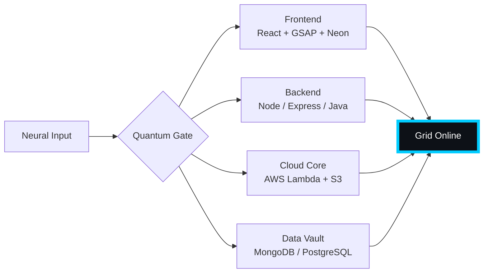

# 🌌 [ NEURAL CORE ACCESS: PENDEMVAMSI ]

<p align="center">
  
</p>

<div align="center">
  
  <br><small>Active Protocol: <strong style="color:#00CCFF">BLADE RUNNER RAIN</strong> 🌧️🔵</small>
</div>

## 🔵 NEURAL STATUS READOUT
```text
SUBJECT ID    →  PENDEMVAMSI
ENTITY CLASS  →  SHADOW MONARCH v7
NEURAL RANK   →  B-TIER
GRID SYNC     →  2777/4261 QUANTUM PACKETS
─────── BIO-METRICS (BLADE RUNNER RAIN) ───────
STRENGTH      134  █████████████████░░░░
AGILITY       115  ███████████████░░░░░░
INTELLIGENCE  138  ██████████████████░░░
VITALITY      107  ██████████████░░░░░░░
```

> **NEURAL BURST ACQUIRED:** +138 QUANTUM PACKETS 
> **SYSTEM MESSAGE:** CORPORATE FIREWALL BREACHED — DATA IS FREEDOM

---

## 🌀 GRID ARCHITECTURE (HOLOGRAPHIC RENDER)



---

## 📡 ACADEMIC NODES – CONQUERED
- [x] B.Tech Neural Engineering (2020–2024) – St. Ann’s Grid
- [x] Intermediate Quantum Core (2018–2020) – Sri Medhavi
- [x] SSC Primary Link (2017–2018) – Sri Geethanjali

---

## ⚡ SKILL NEURAL MATRIX

<details open>
<summary>🔌 ACTIVE NEURAL LINKS</summary>

| Node               | Tier | Integrity Bar                | Status      |
|--------------------|------|------------------------------|-------------|
| Java Core          | S    | ████████████████████ 100%   | OVERCLOCKED |
| Node.js Grid       | S    | ████████████████████ 100%   | OVERCLOCKED |
| React Holo-UI      | A+   | █████████████████░░░ 92%    | ONLINE      |
| AWS Quantum Relay  | S    | ████████████████████ 100%   | SOVEREIGN   |
| Python AI Kernel   | A    | ████████████████░░░░ 85%    | CHARGING    |
| DSA Void Algorithm | A    | █████████████████░░░ 90%    | ACTIVE      |

</details>

---

## 🏅 NEURAL ACHIEVEMENT TOKENS

<p align="center">
  
  
  
  
</p>

---

## 👾 SHADOW ENTITIES – SUMMONED

<p align="center">
  
  <br><strong style="color:#00CCFF">ARISE.</strong>
</p>

| Entity | Designation   | Class            | Source Node                     |
|--------|---------------|------------------|---------------------------------|
| SH-01  | Igris         | Void Commander   | AI Financial Oracle             |
| SH-02  | Beru          | Swarm Overlord   | WebRTC Quantum Stream           |
| SH-03  | Kaisel        | Void Wyrm        | Geolocation Shadow Relay        |
| SH-04  | Tusk          | Arcane Construct | Global Pandemic Sentinel        |
| SH-05  | Iron          | Armored Bastion  | React Crypto Fortress           |

---

## 📡 GRID ANALYTICS (LIVE FEED)

<p align="center">
  
  <br>
  
  
</p>

---

## 🖥️ CORRUPTED MAINFRAME LOG (401 ENTRIES)

<details>
<summary>OPEN TERMINAL FEED – PROTOCOL: BLADE RUNNER RAIN</summary>

> [0xED985FB3] 🌧️🔵 **BLADE RUNNER RAIN PROTOCOL** #0 | NEURAL LINK STABILIZED | [TRANSMISSION SUCCESS]
> [0x4739E5F3] 🌧️🔵 **BLADE RUNNER RAIN PROTOCOL** #1 | NEURAL LINK STABILIZED | [TRANSMISSION SUCCESS]
> [0x37478CA7] 🌧️🔵 **BLADE RUNNER RAIN PROTOCOL** #2 | NEURAL LINK STABILIZED | [TRANSMISSION SUCCESS]
> [0x4AFC4859] 🌧️🔵 **BLADE RUNNER RAIN PROTOCOL** #3 | NEURAL LINK STABILIZED | [TRANSMISSION SUCCESS]
> [0xCEFDA095] 🌧️🔵 **BLADE RUNNER RAIN PROTOCOL** #4 | NEURAL LINK STABILIZED | [TRANSMISSION SUCCESS]
> [0x437064BD] 🌧️🔵 **BLADE RUNNER RAIN PROTOCOL** #5 | NEURAL LINK STABILIZED | [TRANSMISSION SUCCESS]
> [0x0B22E93E] 🌧️🔵 **BLADE RUNNER RAIN PROTOCOL** #6 | NEURAL LINK STABILIZED | [TRANSMISSION SUCCESS]
> [0x21BD5641] 🌧️🔵 **BLADE RUNNER RAIN PROTOCOL** #7 | NEURAL LINK STABILIZED | [TRANSMISSION SUCCESS]
> [0x7001DE19] 🌧️🔵 **BLADE RUNNER RAIN PROTOCOL** #8 | NEURAL LINK STABILIZED | [TRANSMISSION SUCCESS]
> [0xDE15B2FF] 🌧️🔵 **BLADE RUNNER RAIN PROTOCOL** #9 | NEURAL LINK STABILIZED | [TRANSMISSION SUCCESS]
> [0x479D91A4] 🌧️🔵 **BLADE RUNNER RAIN PROTOCOL** #10 | NEURAL LINK STABILIZED | [TRANSMISSION SUCCESS]
> [0x7071534B] 🌧️🔵 **BLADE RUNNER RAIN PROTOCOL** #11 | NEURAL LINK  [GLITCH DETECTED] STABILIZED | [TRANSMISSION SUCCESS]
> [0xCC22EC9C] 🌧️🔵 **BLADE RUNNER RAIN PROTOCOL** #12 | NEURAL LINK STABILIZED | [TRANSMISSION SUCCESS]
> [0x1474E1F3] 🌧️🔵 **BLADE RUNNER RAIN PROTOCOL** #13 | NEURAL LINK STABILIZED | [TRANSMISSION SUCCESS]
> [0xA00FA92A] 🌧️🔵 **BLADE RUNNER RAIN PROTOCOL** #14 | NEURAL LINK STABILIZED | [TRANSMISSION SUCCESS]
> [0xDFF6495C] 🌧️🔵 **BLADE RUNNER RAIN PROTOCOL** #15 | NEURAL LINK STABILIZED | [TRANSMISSION SUCCESS]
> [0xD6C44F4F] 🌧️🔵 **BLADE RUNNER RAIN PROTOCOL** #16 | NEURAL LINK STABILIZED | [TRANSMISSION SUCCESS]
> [0x990A7695] 🌧️🔵 **BLADE RUNNER RAIN PROTOCOL** #17 | NEURAL LINK STABILIZED | [TRANSMISSION SUCCESS]
> [0x85740761] 🌧️🔵 **BLADE RUNNER RAIN PROTOCOL** #18 | NEURAL LINK STABILIZED | [TRANSMISSION SUCCESS]
> [0x6A8DF962] 🌧️🔵 **BLADE RUNNER RAIN PROTOCOL** #19 | NEURAL LINK STABILIZED | [TRANSMISSION SUCCESS]
> [0xEB7BA340] 🌧️🔵 **BLADE RUNNER RAIN PROTOCOL** #20 | NEURAL LINK STABILIZED | [TRANSMISSION SUCCESS]
> [0x250432E9] 🌧️🔵 **BLADE RUNNER RAIN PROTOCOL** #21 | NEURAL LINK STABILIZED | [TRANSMISSION SUCCESS]
> [0x0C178D6F] 🌧️🔵 **BLADE RUNNER RAIN PROTOCOL** #22 | NEURAL LINK STABILIZED | [TRANSMISSION SUCCESS]
> [0xE3E3CCBF] 🌧️🔵 **BLADE RUNNER RAIN PROTOCOL** #23 | NEURAL LINK STABILIZED | [TRANSMISSION SUCCESS]
> [0x1D23D7DE] 🌧️🔵 **BLADE RUNNER RAIN PROTOCOL** #24 | NEURAL LINK STABILIZED | [TRANSMISSION SUCCESS]
> [0xB9299B63] 🌧️🔵 **BLADE RUNNER RAIN PROTOCOL** #25 | NEURAL LINK STABILIZED | [TRANSMISSION SUCCESS]
> [0x0B0C9BBC] 🌧️🔵 **BLADE RUNNER RAIN PROTOCOL** #26 | NEURAL LINK  [GLITCH DETECTED] STABILIZED | [TRANSMISSION SUCCESS]
> [0x31791790] 🌧️🔵 **BLADE RUNNER RAIN PROTOCOL** #27 | NEURAL LINK STABILIZED | [TRANSMISSION SUCCESS]
> [0xFAB67333] 🌧️🔵 **BLADE RUNNER RAIN PROTOCOL** #28 | NEURAL LINK STABILIZED | [TRANSMISSION SUCCESS]
> [0x92DEADC1] 🌧️🔵 **BLADE RUNNER RAIN PROTOCOL** #29 | NEURAL LINK STABILIZED | [TRANSMISSION SUCCESS]
> [0xC1DE51B0] 🌧️🔵 **BLADE RUNNER RAIN PROTOCOL** #30 | NEURAL LINK STABILIZED | [TRANSMISSION SUCCESS]
> [0x268426AC] 🌧️🔵 **BLADE RUNNER RAIN PROTOCOL** #31 | NEURAL LINK STABILIZED | [TRANSMISSION SUCCESS]
> [0xF4DC37B7] 🌧️🔵 **BLADE RUNNER RAIN PROTOCOL** #32 | NEURAL LINK STABILIZED | [TRANSMISSION SUCCESS]
> [0x3C625E80] 🌧️🔵 **BLADE RUNNER RAIN PROTOCOL** #33 | NEURAL LINK STABILIZED | [TRANSMISSION SUCCESS]
> [0x0AA6F33B] 🌧️🔵 **BLADE RUNNER RAIN PROTOCOL** #34 | NEURAL LINK STABILIZED | [TRANSMISSION SUCCESS]
> [0xE67052B3] 🌧️🔵 **BLADE RUNNER RAIN PROTOCOL** #35 | NEURAL LINK  [GLITCH DETECTED] STABILIZED | [TRANSMISSION SUCCESS]
> [0xC2145BA5] 🌧️🔵 **BLADE RUNNER RAIN PROTOCOL** #36 | NEURAL LINK  [GLITCH DETECTED] STABILIZED | [TRANSMISSION SUCCESS]
> [0x70B9F68F] 🌧️🔵 **BLADE RUNNER RAIN PROTOCOL** #37 | NEURAL LINK  [GLITCH DETECTED] STABILIZED | [TRANSMISSION SUCCESS]
> [0x92AB061E] 🌧️🔵 **BLADE RUNNER RAIN PROTOCOL** #38 | NEURAL LINK STABILIZED | [TRANSMISSION SUCCESS]
> [0x6EB405DE] 🌧️🔵 **BLADE RUNNER RAIN PROTOCOL** #39 | NEURAL LINK  [GLITCH DETECTED] STABILIZED | [TRANSMISSION SUCCESS]
> [0x6DD045C7] 🌧️🔵 **BLADE RUNNER RAIN PROTOCOL** #40 | NEURAL LINK STABILIZED | [TRANSMISSION SUCCESS]
> [0x6F61AC93] 🌧️🔵 **BLADE RUNNER RAIN PROTOCOL** #41 | NEURAL LINK STABILIZED | [TRANSMISSION SUCCESS]
> [0x8FEF8DBF] 🌧️🔵 **BLADE RUNNER RAIN PROTOCOL** #42 | NEURAL LINK  [GLITCH DETECTED] STABILIZED | [TRANSMISSION SUCCESS]
> [0x74E5E402] 🌧️🔵 **BLADE RUNNER RAIN PROTOCOL** #43 | NEURAL LINK  [GLITCH DETECTED] STABILIZED | [TRANSMISSION SUCCESS]
> [0x77FEAFBD] 🌧️🔵 **BLADE RUNNER RAIN PROTOCOL** #44 | NEURAL LINK STABILIZED | [TRANSMISSION SUCCESS]
> [0xF42021E8] 🌧️🔵 **BLADE RUNNER RAIN PROTOCOL** #45 | NEURAL LINK STABILIZED | [TRANSMISSION SUCCESS]
> [0x57283B20] 🌧️🔵 **BLADE RUNNER RAIN PROTOCOL** #46 | NEURAL LINK STABILIZED | [TRANSMISSION SUCCESS]
> [0x85AFA742] 🌧️🔵 **BLADE RUNNER RAIN PROTOCOL** #47 | NEURAL LINK STABILIZED | [TRANSMISSION SUCCESS]
> [0x07096F79] 🌧️🔵 **BLADE RUNNER RAIN PROTOCOL** #48 | NEURAL LINK STABILIZED | [TRANSMISSION SUCCESS]
> [0x9960C5EA] 🌧️🔵 **BLADE RUNNER RAIN PROTOCOL** #49 | NEURAL LINK STABILIZED | [TRANSMISSION SUCCESS]
> [0x9D79FC92] 🌧️🔵 **BLADE RUNNER RAIN PROTOCOL** #50 | NEURAL LINK  [GLITCH DETECTED] STABILIZED | [TRANSMISSION SUCCESS]
> [0x1DD1A0D2] 🌧️🔵 **BLADE RUNNER RAIN PROTOCOL** #51 | NEURAL LINK STABILIZED | [TRANSMISSION SUCCESS]
> [0xD44D1ED9] 🌧️🔵 **BLADE RUNNER RAIN PROTOCOL** #52 | NEURAL LINK STABILIZED | [TRANSMISSION SUCCESS]
> [0xACBDF0CA] 🌧️🔵 **BLADE RUNNER RAIN PROTOCOL** #53 | NEURAL LINK STABILIZED | [TRANSMISSION SUCCESS]
> [0xBD9BC8F1] 🌧️🔵 **BLADE RUNNER RAIN PROTOCOL** #54 | NEURAL LINK STABILIZED | [TRANSMISSION SUCCESS]
> [0x632640DB] 🌧️🔵 **BLADE RUNNER RAIN PROTOCOL** #55 | NEURAL LINK STABILIZED | [TRANSMISSION SUCCESS]
> [0xAD0743E0] 🌧️🔵 **BLADE RUNNER RAIN PROTOCOL** #56 | NEURAL LINK STABILIZED | [TRANSMISSION SUCCESS]
> [0xCFC880A3] 🌧️🔵 **BLADE RUNNER RAIN PROTOCOL** #57 | NEURAL LINK STABILIZED | [TRANSMISSION SUCCESS]
> [0x06360E23] 🌧️🔵 **BLADE RUNNER RAIN PROTOCOL** #58 | NEURAL LINK STABILIZED | [TRANSMISSION SUCCESS]
> [0x9CE78A1C] 🌧️🔵 **BLADE RUNNER RAIN PROTOCOL** #59 | NEURAL LINK STABILIZED | [TRANSMISSION SUCCESS]
> [0x1755E978] 🌧️🔵 **BLADE RUNNER RAIN PROTOCOL** #60 | NEURAL LINK STABILIZED | [TRANSMISSION SUCCESS]
> [0x01F59ECA] 🌧️🔵 **BLADE RUNNER RAIN PROTOCOL** #61 | NEURAL LINK STABILIZED | [TRANSMISSION SUCCESS]
> [0xEB4FE369] 🌧️🔵 **BLADE RUNNER RAIN PROTOCOL** #62 | NEURAL LINK STABILIZED | [TRANSMISSION SUCCESS]
> [0x1356F1D6] 🌧️🔵 **BLADE RUNNER RAIN PROTOCOL** #63 | NEURAL LINK STABILIZED | [TRANSMISSION SUCCESS]
> [0xB286B5B0] 🌧️🔵 **BLADE RUNNER RAIN PROTOCOL** #64 | NEURAL LINK STABILIZED | [TRANSMISSION SUCCESS]
> [0xD2CC33EC] 🌧️🔵 **BLADE RUNNER RAIN PROTOCOL** #65 | NEURAL LINK STABILIZED | [TRANSMISSION SUCCESS]
> [0x4C24947D] 🌧️🔵 **BLADE RUNNER RAIN PROTOCOL** #66 | NEURAL LINK  [GLITCH DETECTED] STABILIZED | [TRANSMISSION SUCCESS]
> [0xB3B48635] 🌧️🔵 **BLADE RUNNER RAIN PROTOCOL** #67 | NEURAL LINK STABILIZED | [TRANSMISSION SUCCESS]
> [0xE0ADE98E] 🌧️🔵 **BLADE RUNNER RAIN PROTOCOL** #68 | NEURAL LINK STABILIZED | [TRANSMISSION SUCCESS]
> [0xF369876F] 🌧️🔵 **BLADE RUNNER RAIN PROTOCOL** #69 | NEURAL LINK STABILIZED | [TRANSMISSION SUCCESS]
> [0x45D4E729] 🌧️🔵 **BLADE RUNNER RAIN PROTOCOL** #70 | NEURAL LINK STABILIZED | [TRANSMISSION SUCCESS]
> [0x4745CB15] 🌧️🔵 **BLADE RUNNER RAIN PROTOCOL** #71 | NEURAL LINK STABILIZED | [TRANSMISSION SUCCESS]
> [0x2F7235F8] 🌧️🔵 **BLADE RUNNER RAIN PROTOCOL** #72 | NEURAL LINK STABILIZED | [TRANSMISSION SUCCESS]
> [0x2605DD01] 🌧️🔵 **BLADE RUNNER RAIN PROTOCOL** #73 | NEURAL LINK STABILIZED | [TRANSMISSION SUCCESS]
> [0xE59D5AE5] 🌧️🔵 **BLADE RUNNER RAIN PROTOCOL** #74 | NEURAL LINK STABILIZED | [TRANSMISSION SUCCESS]
> [0x718D774E] 🌧️🔵 **BLADE RUNNER RAIN PROTOCOL** #75 | NEURAL LINK STABILIZED | [TRANSMISSION SUCCESS]
> [0x9F12ED2B] 🌧️🔵 **BLADE RUNNER RAIN PROTOCOL** #76 | NEURAL LINK STABILIZED | [TRANSMISSION SUCCESS]
> [0xE0AC71CA] 🌧️🔵 **BLADE RUNNER RAIN PROTOCOL** #77 | NEURAL LINK STABILIZED | [TRANSMISSION SUCCESS]
> [0x1437E249] 🌧️🔵 **BLADE RUNNER RAIN PROTOCOL** #78 | NEURAL LINK STABILIZED | [TRANSMISSION SUCCESS]
> [0x8189939E] 🌧️🔵 **BLADE RUNNER RAIN PROTOCOL** #79 | NEURAL LINK STABILIZED | [TRANSMISSION SUCCESS]
> [0x97DCED11] 🌧️🔵 **BLADE RUNNER RAIN PROTOCOL** #80 | NEURAL LINK STABILIZED | [TRANSMISSION SUCCESS]
> [0xF4ECA843] 🌧️🔵 **BLADE RUNNER RAIN PROTOCOL** #81 | NEURAL LINK STABILIZED | [TRANSMISSION SUCCESS]
> [0xFAA82CF3] 🌧️🔵 **BLADE RUNNER RAIN PROTOCOL** #82 | NEURAL LINK  [GLITCH DETECTED] STABILIZED | [TRANSMISSION SUCCESS]
> [0x3D9AA85E] 🌧️🔵 **BLADE RUNNER RAIN PROTOCOL** #83 | NEURAL LINK STABILIZED | [TRANSMISSION SUCCESS]
> [0x023C523B] 🌧️🔵 **BLADE RUNNER RAIN PROTOCOL** #84 | NEURAL LINK STABILIZED | [TRANSMISSION SUCCESS]
> [0x0849C4F8] 🌧️🔵 **BLADE RUNNER RAIN PROTOCOL** #85 | NEURAL LINK STABILIZED | [TRANSMISSION SUCCESS]
> [0x08CE4AF0] 🌧️🔵 **BLADE RUNNER RAIN PROTOCOL** #86 | NEURAL LINK STABILIZED | [TRANSMISSION SUCCESS]
> [0x5F47C6A9] 🌧️🔵 **BLADE RUNNER RAIN PROTOCOL** #87 | NEURAL LINK STABILIZED | [TRANSMISSION SUCCESS]
> [0xD0C64586] 🌧️🔵 **BLADE RUNNER RAIN PROTOCOL** #88 | NEURAL LINK STABILIZED | [TRANSMISSION SUCCESS]
> [0x07DC14B8] 🌧️🔵 **BLADE RUNNER RAIN PROTOCOL** #89 | NEURAL LINK STABILIZED | [TRANSMISSION SUCCESS]
> [0x39962272] 🌧️🔵 **BLADE RUNNER RAIN PROTOCOL** #90 | NEURAL LINK STABILIZED | [TRANSMISSION SUCCESS]
> [0xF84C66EA] 🌧️🔵 **BLADE RUNNER RAIN PROTOCOL** #91 | NEURAL LINK STABILIZED | [TRANSMISSION SUCCESS]
> [0x6D4B9113] 🌧️🔵 **BLADE RUNNER RAIN PROTOCOL** #92 | NEURAL LINK STABILIZED | [TRANSMISSION SUCCESS]
> [0x1B9BB61F] 🌧️🔵 **BLADE RUNNER RAIN PROTOCOL** #93 | NEURAL LINK  [GLITCH DETECTED] STABILIZED | [TRANSMISSION SUCCESS]
> [0x998C88FA] 🌧️🔵 **BLADE RUNNER RAIN PROTOCOL** #94 | NEURAL LINK  [GLITCH DETECTED] STABILIZED | [TRANSMISSION SUCCESS]
> [0xDC78BA66] 🌧️🔵 **BLADE RUNNER RAIN PROTOCOL** #95 | NEURAL LINK STABILIZED | [TRANSMISSION SUCCESS]
> [0x48D1AC33] 🌧️🔵 **BLADE RUNNER RAIN PROTOCOL** #96 | NEURAL LINK STABILIZED | [TRANSMISSION SUCCESS]
> [0x648BF04E] 🌧️🔵 **BLADE RUNNER RAIN PROTOCOL** #97 | NEURAL LINK  [GLITCH DETECTED] STABILIZED | [TRANSMISSION SUCCESS]
> [0x1749F31B] 🌧️🔵 **BLADE RUNNER RAIN PROTOCOL** #98 | NEURAL LINK  [GLITCH DETECTED] STABILIZED | [TRANSMISSION SUCCESS]
> [0x06A32FFA] 🌧️🔵 **BLADE RUNNER RAIN PROTOCOL** #99 | NEURAL LINK STABILIZED | [TRANSMISSION SUCCESS]
> [0xD6F1878E] 🌧️🔵 **BLADE RUNNER RAIN PROTOCOL** #100 | NEURAL LINK STABILIZED | [TRANSMISSION SUCCESS]
> [0x938DE11C] 🌧️🔵 **BLADE RUNNER RAIN PROTOCOL** #101 | NEURAL LINK STABILIZED | [TRANSMISSION SUCCESS]
> [0x5EC1D4A2] 🌧️🔵 **BLADE RUNNER RAIN PROTOCOL** #102 | NEURAL LINK STABILIZED | [TRANSMISSION SUCCESS]
> [0x4F45252F] 🌧️🔵 **BLADE RUNNER RAIN PROTOCOL** #103 | NEURAL LINK  [GLITCH DETECTED] STABILIZED | [TRANSMISSION SUCCESS]
> [0x91EDF876] 🌧️🔵 **BLADE RUNNER RAIN PROTOCOL** #104 | NEURAL LINK STABILIZED | [TRANSMISSION SUCCESS]
> [0xF35EBC98] 🌧️🔵 **BLADE RUNNER RAIN PROTOCOL** #105 | NEURAL LINK  [GLITCH DETECTED] STABILIZED | [TRANSMISSION SUCCESS]
> [0xDCC401B3] 🌧️🔵 **BLADE RUNNER RAIN PROTOCOL** #106 | NEURAL LINK STABILIZED | [TRANSMISSION SUCCESS]
> [0x8CDA16CE] 🌧️🔵 **BLADE RUNNER RAIN PROTOCOL** #107 | NEURAL LINK STABILIZED | [TRANSMISSION SUCCESS]
> [0x8883F30E] 🌧️🔵 **BLADE RUNNER RAIN PROTOCOL** #108 | NEURAL LINK  [GLITCH DETECTED] STABILIZED | [TRANSMISSION SUCCESS]
> [0x097C4AE7] 🌧️🔵 **BLADE RUNNER RAIN PROTOCOL** #109 | NEURAL LINK STABILIZED | [TRANSMISSION SUCCESS]
> [0x0F1F2213] 🌧️🔵 **BLADE RUNNER RAIN PROTOCOL** #110 | NEURAL LINK STABILIZED | [TRANSMISSION SUCCESS]
> [0x07A90E11] 🌧️🔵 **BLADE RUNNER RAIN PROTOCOL** #111 | NEURAL LINK STABILIZED | [TRANSMISSION SUCCESS]
> [0x7F03E48E] 🌧️🔵 **BLADE RUNNER RAIN PROTOCOL** #112 | NEURAL LINK STABILIZED | [TRANSMISSION SUCCESS]
> [0x8C216FC1] 🌧️🔵 **BLADE RUNNER RAIN PROTOCOL** #113 | NEURAL LINK STABILIZED | [TRANSMISSION SUCCESS]
> [0x3E142171] 🌧️🔵 **BLADE RUNNER RAIN PROTOCOL** #114 | NEURAL LINK STABILIZED | [TRANSMISSION SUCCESS]
> [0x897F09D9] 🌧️🔵 **BLADE RUNNER RAIN PROTOCOL** #115 | NEURAL LINK STABILIZED | [TRANSMISSION SUCCESS]
> [0x05E5C4BC] 🌧️🔵 **BLADE RUNNER RAIN PROTOCOL** #116 | NEURAL LINK STABILIZED | [TRANSMISSION SUCCESS]
> [0x6EB19555] 🌧️🔵 **BLADE RUNNER RAIN PROTOCOL** #117 | NEURAL LINK STABILIZED | [TRANSMISSION SUCCESS]
> [0xE9067B70] 🌧️🔵 **BLADE RUNNER RAIN PROTOCOL** #118 | NEURAL LINK STABILIZED | [TRANSMISSION SUCCESS]
> [0x29F66E2C] 🌧️🔵 **BLADE RUNNER RAIN PROTOCOL** #119 | NEURAL LINK STABILIZED | [TRANSMISSION SUCCESS]
> [0xC82AD9A2] 🌧️🔵 **BLADE RUNNER RAIN PROTOCOL** #120 | NEURAL LINK STABILIZED | [TRANSMISSION SUCCESS]
> [0x24925E52] 🌧️🔵 **BLADE RUNNER RAIN PROTOCOL** #121 | NEURAL LINK STABILIZED | [TRANSMISSION SUCCESS]
> [0xB0FDF698] 🌧️🔵 **BLADE RUNNER RAIN PROTOCOL** #122 | NEURAL LINK STABILIZED | [TRANSMISSION SUCCESS]
> [0x97EC22CC] 🌧️🔵 **BLADE RUNNER RAIN PROTOCOL** #123 | NEURAL LINK STABILIZED | [TRANSMISSION SUCCESS]
> [0x9B583D88] 🌧️🔵 **BLADE RUNNER RAIN PROTOCOL** #124 | NEURAL LINK  [GLITCH DETECTED] STABILIZED | [TRANSMISSION SUCCESS]
> [0x1C7C4CEF] 🌧️🔵 **BLADE RUNNER RAIN PROTOCOL** #125 | NEURAL LINK STABILIZED | [TRANSMISSION SUCCESS]
> [0x859DCA70] 🌧️🔵 **BLADE RUNNER RAIN PROTOCOL** #126 | NEURAL LINK STABILIZED | [TRANSMISSION SUCCESS]
> [0x9C3C9DDC] 🌧️🔵 **BLADE RUNNER RAIN PROTOCOL** #127 | NEURAL LINK STABILIZED | [TRANSMISSION SUCCESS]
> [0x08DDD3CA] 🌧️🔵 **BLADE RUNNER RAIN PROTOCOL** #128 | NEURAL LINK STABILIZED | [TRANSMISSION SUCCESS]
> [0xAC83CB52] 🌧️🔵 **BLADE RUNNER RAIN PROTOCOL** #129 | NEURAL LINK STABILIZED | [TRANSMISSION SUCCESS]
> [0x7391B54E] 🌧️🔵 **BLADE RUNNER RAIN PROTOCOL** #130 | NEURAL LINK STABILIZED | [TRANSMISSION SUCCESS]
> [0xE660F9C1] 🌧️🔵 **BLADE RUNNER RAIN PROTOCOL** #131 | NEURAL LINK STABILIZED | [TRANSMISSION SUCCESS]
> [0xAF4A3EE9] 🌧️🔵 **BLADE RUNNER RAIN PROTOCOL** #132 | NEURAL LINK STABILIZED | [TRANSMISSION SUCCESS]
> [0xD14019AF] 🌧️🔵 **BLADE RUNNER RAIN PROTOCOL** #133 | NEURAL LINK STABILIZED | [TRANSMISSION SUCCESS]
> [0x63998392] 🌧️🔵 **BLADE RUNNER RAIN PROTOCOL** #134 | NEURAL LINK STABILIZED | [TRANSMISSION SUCCESS]
> [0xBB1699C1] 🌧️🔵 **BLADE RUNNER RAIN PROTOCOL** #135 | NEURAL LINK STABILIZED | [TRANSMISSION SUCCESS]
> [0xDFBC32F4] 🌧️🔵 **BLADE RUNNER RAIN PROTOCOL** #136 | NEURAL LINK STABILIZED | [TRANSMISSION SUCCESS]
> [0x5524A00D] 🌧️🔵 **BLADE RUNNER RAIN PROTOCOL** #137 | NEURAL LINK STABILIZED | [TRANSMISSION SUCCESS]
> [0x78BAE73C] 🌧️🔵 **BLADE RUNNER RAIN PROTOCOL** #138 | NEURAL LINK STABILIZED | [TRANSMISSION SUCCESS]
> [0x5B9146E7] 🌧️🔵 **BLADE RUNNER RAIN PROTOCOL** #139 | NEURAL LINK STABILIZED | [TRANSMISSION SUCCESS]
> [0xBCD8E3A9] 🌧️🔵 **BLADE RUNNER RAIN PROTOCOL** #140 | NEURAL LINK STABILIZED | [TRANSMISSION SUCCESS]
> [0x1634372F] 🌧️🔵 **BLADE RUNNER RAIN PROTOCOL** #141 | NEURAL LINK STABILIZED | [TRANSMISSION SUCCESS]
> [0x0ADC76FF] 🌧️🔵 **BLADE RUNNER RAIN PROTOCOL** #142 | NEURAL LINK STABILIZED | [TRANSMISSION SUCCESS]
> [0xB67FC7B4] 🌧️🔵 **BLADE RUNNER RAIN PROTOCOL** #143 | NEURAL LINK STABILIZED | [TRANSMISSION SUCCESS]
> [0xDD370DA9] 🌧️🔵 **BLADE RUNNER RAIN PROTOCOL** #144 | NEURAL LINK  [GLITCH DETECTED] STABILIZED | [TRANSMISSION SUCCESS]
> [0x11150050] 🌧️🔵 **BLADE RUNNER RAIN PROTOCOL** #145 | NEURAL LINK STABILIZED | [TRANSMISSION SUCCESS]
> [0xBAE1DB78] 🌧️🔵 **BLADE RUNNER RAIN PROTOCOL** #146 | NEURAL LINK  [GLITCH DETECTED] STABILIZED | [TRANSMISSION SUCCESS]
> [0x25C6BEE1] 🌧️🔵 **BLADE RUNNER RAIN PROTOCOL** #147 | NEURAL LINK STABILIZED | [TRANSMISSION SUCCESS]
> [0x2AE3E103] 🌧️🔵 **BLADE RUNNER RAIN PROTOCOL** #148 | NEURAL LINK STABILIZED | [TRANSMISSION SUCCESS]
> [0x0B6E514C] 🌧️🔵 **BLADE RUNNER RAIN PROTOCOL** #149 | NEURAL LINK STABILIZED | [TRANSMISSION SUCCESS]
> [0xB2642A71] 🌧️🔵 **BLADE RUNNER RAIN PROTOCOL** #150 | NEURAL LINK  [GLITCH DETECTED] STABILIZED | [TRANSMISSION SUCCESS]
> [0x43F1CC04] 🌧️🔵 **BLADE RUNNER RAIN PROTOCOL** #151 | NEURAL LINK STABILIZED | [TRANSMISSION SUCCESS]
> [0x13AE1C56] 🌧️🔵 **BLADE RUNNER RAIN PROTOCOL** #152 | NEURAL LINK STABILIZED | [TRANSMISSION SUCCESS]
> [0xDCEF2487] 🌧️🔵 **BLADE RUNNER RAIN PROTOCOL** #153 | NEURAL LINK STABILIZED | [TRANSMISSION SUCCESS]
> [0x07128341] 🌧️🔵 **BLADE RUNNER RAIN PROTOCOL** #154 | NEURAL LINK STABILIZED | [TRANSMISSION SUCCESS]
> [0xCD769C14] 🌧️🔵 **BLADE RUNNER RAIN PROTOCOL** #155 | NEURAL LINK STABILIZED | [TRANSMISSION SUCCESS]
> [0x4E112E34] 🌧️🔵 **BLADE RUNNER RAIN PROTOCOL** #156 | NEURAL LINK STABILIZED | [TRANSMISSION SUCCESS]
> [0x4CD4A29A] 🌧️🔵 **BLADE RUNNER RAIN PROTOCOL** #157 | NEURAL LINK STABILIZED | [TRANSMISSION SUCCESS]
> [0xD56EF892] 🌧️🔵 **BLADE RUNNER RAIN PROTOCOL** #158 | NEURAL LINK STABILIZED | [TRANSMISSION SUCCESS]
> [0xCB7A7EFC] 🌧️🔵 **BLADE RUNNER RAIN PROTOCOL** #159 | NEURAL LINK STABILIZED | [TRANSMISSION SUCCESS]
> [0xE499573F] 🌧️🔵 **BLADE RUNNER RAIN PROTOCOL** #160 | NEURAL LINK STABILIZED | [TRANSMISSION SUCCESS]
> [0x76C4DD0F] 🌧️🔵 **BLADE RUNNER RAIN PROTOCOL** #161 | NEURAL LINK  [GLITCH DETECTED] STABILIZED | [TRANSMISSION SUCCESS]
> [0x799F55AC] 🌧️🔵 **BLADE RUNNER RAIN PROTOCOL** #162 | NEURAL LINK  [GLITCH DETECTED] STABILIZED | [TRANSMISSION SUCCESS]
> [0x28780763] 🌧️🔵 **BLADE RUNNER RAIN PROTOCOL** #163 | NEURAL LINK STABILIZED | [TRANSMISSION SUCCESS]
> [0x2AEC014C] 🌧️🔵 **BLADE RUNNER RAIN PROTOCOL** #164 | NEURAL LINK STABILIZED | [TRANSMISSION SUCCESS]
> [0x61B5F3B4] 🌧️🔵 **BLADE RUNNER RAIN PROTOCOL** #165 | NEURAL LINK STABILIZED | [TRANSMISSION SUCCESS]
> [0x55FE6244] 🌧️🔵 **BLADE RUNNER RAIN PROTOCOL** #166 | NEURAL LINK STABILIZED | [TRANSMISSION SUCCESS]
> [0x16881EC1] 🌧️🔵 **BLADE RUNNER RAIN PROTOCOL** #167 | NEURAL LINK STABILIZED | [TRANSMISSION SUCCESS]
> [0xBCFD4D98] 🌧️🔵 **BLADE RUNNER RAIN PROTOCOL** #168 | NEURAL LINK STABILIZED | [TRANSMISSION SUCCESS]
> [0x447777BB] 🌧️🔵 **BLADE RUNNER RAIN PROTOCOL** #169 | NEURAL LINK STABILIZED | [TRANSMISSION SUCCESS]
> [0xD28FAC0B] 🌧️🔵 **BLADE RUNNER RAIN PROTOCOL** #170 | NEURAL LINK STABILIZED | [TRANSMISSION SUCCESS]
> [0x189B0F52] 🌧️🔵 **BLADE RUNNER RAIN PROTOCOL** #171 | NEURAL LINK STABILIZED | [TRANSMISSION SUCCESS]
> [0x9F666E9A] 🌧️🔵 **BLADE RUNNER RAIN PROTOCOL** #172 | NEURAL LINK STABILIZED | [TRANSMISSION SUCCESS]
> [0xA2DC248F] 🌧️🔵 **BLADE RUNNER RAIN PROTOCOL** #173 | NEURAL LINK STABILIZED | [TRANSMISSION SUCCESS]
> [0x25033885] 🌧️🔵 **BLADE RUNNER RAIN PROTOCOL** #174 | NEURAL LINK STABILIZED | [TRANSMISSION SUCCESS]
> [0x251B7D5D] 🌧️🔵 **BLADE RUNNER RAIN PROTOCOL** #175 | NEURAL LINK STABILIZED | [TRANSMISSION SUCCESS]
> [0xF95C65E8] 🌧️🔵 **BLADE RUNNER RAIN PROTOCOL** #176 | NEURAL LINK STABILIZED | [TRANSMISSION SUCCESS]
> [0xC64FCB06] 🌧️🔵 **BLADE RUNNER RAIN PROTOCOL** #177 | NEURAL LINK STABILIZED | [TRANSMISSION SUCCESS]
> [0x9570CBA8] 🌧️🔵 **BLADE RUNNER RAIN PROTOCOL** #178 | NEURAL LINK STABILIZED | [TRANSMISSION SUCCESS]
> [0x041201A7] 🌧️🔵 **BLADE RUNNER RAIN PROTOCOL** #179 | NEURAL LINK STABILIZED | [TRANSMISSION SUCCESS]
> [0x9C863B51] 🌧️🔵 **BLADE RUNNER RAIN PROTOCOL** #180 | NEURAL LINK STABILIZED | [TRANSMISSION SUCCESS]
> [0x5CC22214] 🌧️🔵 **BLADE RUNNER RAIN PROTOCOL** #181 | NEURAL LINK STABILIZED | [TRANSMISSION SUCCESS]
> [0x575C2759] 🌧️🔵 **BLADE RUNNER RAIN PROTOCOL** #182 | NEURAL LINK STABILIZED | [TRANSMISSION SUCCESS]
> [0x7A874D56] 🌧️🔵 **BLADE RUNNER RAIN PROTOCOL** #183 | NEURAL LINK STABILIZED | [TRANSMISSION SUCCESS]
> [0x6E457029] 🌧️🔵 **BLADE RUNNER RAIN PROTOCOL** #184 | NEURAL LINK STABILIZED | [TRANSMISSION SUCCESS]
> [0x63C04CD5] 🌧️🔵 **BLADE RUNNER RAIN PROTOCOL** #185 | NEURAL LINK STABILIZED | [TRANSMISSION SUCCESS]
> [0x6C3E08E6] 🌧️🔵 **BLADE RUNNER RAIN PROTOCOL** #186 | NEURAL LINK STABILIZED | [TRANSMISSION SUCCESS]
> [0xD36812E5] 🌧️🔵 **BLADE RUNNER RAIN PROTOCOL** #187 | NEURAL LINK  [GLITCH DETECTED] STABILIZED | [TRANSMISSION SUCCESS]
> [0xF5920B90] 🌧️🔵 **BLADE RUNNER RAIN PROTOCOL** #188 | NEURAL LINK STABILIZED | [TRANSMISSION SUCCESS]
> [0x6A4346BA] 🌧️🔵 **BLADE RUNNER RAIN PROTOCOL** #189 | NEURAL LINK STABILIZED | [TRANSMISSION SUCCESS]
> [0x1F18A746] 🌧️🔵 **BLADE RUNNER RAIN PROTOCOL** #190 | NEURAL LINK STABILIZED | [TRANSMISSION SUCCESS]
> [0x5BE6B0A0] 🌧️🔵 **BLADE RUNNER RAIN PROTOCOL** #191 | NEURAL LINK STABILIZED | [TRANSMISSION SUCCESS]
> [0xBAE1935A] 🌧️🔵 **BLADE RUNNER RAIN PROTOCOL** #192 | NEURAL LINK STABILIZED | [TRANSMISSION SUCCESS]
> [0xDBA9FC9B] 🌧️🔵 **BLADE RUNNER RAIN PROTOCOL** #193 | NEURAL LINK STABILIZED | [TRANSMISSION SUCCESS]
> [0xA340C166] 🌧️🔵 **BLADE RUNNER RAIN PROTOCOL** #194 | NEURAL LINK STABILIZED | [TRANSMISSION SUCCESS]
> [0x4CE9BC4F] 🌧️🔵 **BLADE RUNNER RAIN PROTOCOL** #195 | NEURAL LINK STABILIZED | [TRANSMISSION SUCCESS]
> [0xF91F2A01] 🌧️🔵 **BLADE RUNNER RAIN PROTOCOL** #196 | NEURAL LINK STABILIZED | [TRANSMISSION SUCCESS]
> [0x42DF7BA0] 🌧️🔵 **BLADE RUNNER RAIN PROTOCOL** #197 | NEURAL LINK  [GLITCH DETECTED] STABILIZED | [TRANSMISSION SUCCESS]
> [0x691D5F90] 🌧️🔵 **BLADE RUNNER RAIN PROTOCOL** #198 | NEURAL LINK STABILIZED | [TRANSMISSION SUCCESS]
> [0x4F7D311E] 🌧️🔵 **BLADE RUNNER RAIN PROTOCOL** #199 | NEURAL LINK STABILIZED | [TRANSMISSION SUCCESS]
> [0xAB699C93] 🌧️🔵 **BLADE RUNNER RAIN PROTOCOL** #200 | NEURAL LINK STABILIZED | [TRANSMISSION SUCCESS]
> [0xE449FAEC] 🌧️🔵 **BLADE RUNNER RAIN PROTOCOL** #201 | NEURAL LINK STABILIZED | [TRANSMISSION SUCCESS]
> [0xD5562001] 🌧️🔵 **BLADE RUNNER RAIN PROTOCOL** #202 | NEURAL LINK STABILIZED | [TRANSMISSION SUCCESS]
> [0x24F6CFDC] 🌧️🔵 **BLADE RUNNER RAIN PROTOCOL** #203 | NEURAL LINK STABILIZED | [TRANSMISSION SUCCESS]
> [0xB4B9E96A] 🌧️🔵 **BLADE RUNNER RAIN PROTOCOL** #204 | NEURAL LINK STABILIZED | [TRANSMISSION SUCCESS]
> [0xF903FA70] 🌧️🔵 **BLADE RUNNER RAIN PROTOCOL** #205 | NEURAL LINK STABILIZED | [TRANSMISSION SUCCESS]
> [0xCCD82A00] 🌧️🔵 **BLADE RUNNER RAIN PROTOCOL** #206 | NEURAL LINK  [GLITCH DETECTED] STABILIZED | [TRANSMISSION SUCCESS]
> [0xC81649BD] 🌧️🔵 **BLADE RUNNER RAIN PROTOCOL** #207 | NEURAL LINK  [GLITCH DETECTED] STABILIZED | [TRANSMISSION SUCCESS]
> [0x728D589B] 🌧️🔵 **BLADE RUNNER RAIN PROTOCOL** #208 | NEURAL LINK STABILIZED | [TRANSMISSION SUCCESS]
> [0xF066FDD0] 🌧️🔵 **BLADE RUNNER RAIN PROTOCOL** #209 | NEURAL LINK STABILIZED | [TRANSMISSION SUCCESS]
> [0x17193081] 🌧️🔵 **BLADE RUNNER RAIN PROTOCOL** #210 | NEURAL LINK STABILIZED | [TRANSMISSION SUCCESS]
> [0xD442BDAF] 🌧️🔵 **BLADE RUNNER RAIN PROTOCOL** #211 | NEURAL LINK STABILIZED | [TRANSMISSION SUCCESS]
> [0xEB064D25] 🌧️🔵 **BLADE RUNNER RAIN PROTOCOL** #212 | NEURAL LINK STABILIZED | [TRANSMISSION SUCCESS]
> [0x88C63CE0] 🌧️🔵 **BLADE RUNNER RAIN PROTOCOL** #213 | NEURAL LINK STABILIZED | [TRANSMISSION SUCCESS]
> [0x2C8BA116] 🌧️🔵 **BLADE RUNNER RAIN PROTOCOL** #214 | NEURAL LINK STABILIZED | [TRANSMISSION SUCCESS]
> [0x582F9EBD] 🌧️🔵 **BLADE RUNNER RAIN PROTOCOL** #215 | NEURAL LINK STABILIZED | [TRANSMISSION SUCCESS]
> [0x88C21091] 🌧️🔵 **BLADE RUNNER RAIN PROTOCOL** #216 | NEURAL LINK STABILIZED | [TRANSMISSION SUCCESS]
> [0x935D5204] 🌧️🔵 **BLADE RUNNER RAIN PROTOCOL** #217 | NEURAL LINK STABILIZED | [TRANSMISSION SUCCESS]
> [0x7122E6BC] 🌧️🔵 **BLADE RUNNER RAIN PROTOCOL** #218 | NEURAL LINK STABILIZED | [TRANSMISSION SUCCESS]
> [0xB03FB125] 🌧️🔵 **BLADE RUNNER RAIN PROTOCOL** #219 | NEURAL LINK  [GLITCH DETECTED] STABILIZED | [TRANSMISSION SUCCESS]
> [0xEFD2C16F] 🌧️🔵 **BLADE RUNNER RAIN PROTOCOL** #220 | NEURAL LINK STABILIZED | [TRANSMISSION SUCCESS]
> [0x619F53B8] 🌧️🔵 **BLADE RUNNER RAIN PROTOCOL** #221 | NEURAL LINK STABILIZED | [TRANSMISSION SUCCESS]
> [0xFB2A74FF] 🌧️🔵 **BLADE RUNNER RAIN PROTOCOL** #222 | NEURAL LINK STABILIZED | [TRANSMISSION SUCCESS]
> [0x2E871E52] 🌧️🔵 **BLADE RUNNER RAIN PROTOCOL** #223 | NEURAL LINK STABILIZED | [TRANSMISSION SUCCESS]
> [0xD406E680] 🌧️🔵 **BLADE RUNNER RAIN PROTOCOL** #224 | NEURAL LINK STABILIZED | [TRANSMISSION SUCCESS]
> [0x8D3047EB] 🌧️🔵 **BLADE RUNNER RAIN PROTOCOL** #225 | NEURAL LINK  [GLITCH DETECTED] STABILIZED | [TRANSMISSION SUCCESS]
> [0x95891BE7] 🌧️🔵 **BLADE RUNNER RAIN PROTOCOL** #226 | NEURAL LINK STABILIZED | [TRANSMISSION SUCCESS]
> [0x5E1FCAC0] 🌧️🔵 **BLADE RUNNER RAIN PROTOCOL** #227 | NEURAL LINK STABILIZED | [TRANSMISSION SUCCESS]
> [0x297E8234] 🌧️🔵 **BLADE RUNNER RAIN PROTOCOL** #228 | NEURAL LINK STABILIZED | [TRANSMISSION SUCCESS]
> [0xF511C210] 🌧️🔵 **BLADE RUNNER RAIN PROTOCOL** #229 | NEURAL LINK STABILIZED | [TRANSMISSION SUCCESS]
> [0xF8C60D16] 🌧️🔵 **BLADE RUNNER RAIN PROTOCOL** #230 | NEURAL LINK STABILIZED | [TRANSMISSION SUCCESS]
> [0xEE36BA9E] 🌧️🔵 **BLADE RUNNER RAIN PROTOCOL** #231 | NEURAL LINK STABILIZED | [TRANSMISSION SUCCESS]
> [0x4668D244] 🌧️🔵 **BLADE RUNNER RAIN PROTOCOL** #232 | NEURAL LINK STABILIZED | [TRANSMISSION SUCCESS]
> [0x13F8CC87] 🌧️🔵 **BLADE RUNNER RAIN PROTOCOL** #233 | NEURAL LINK STABILIZED | [TRANSMISSION SUCCESS]
> [0x1FED6E9E] 🌧️🔵 **BLADE RUNNER RAIN PROTOCOL** #234 | NEURAL LINK  [GLITCH DETECTED] STABILIZED | [TRANSMISSION SUCCESS]
> [0x21EFB192] 🌧️🔵 **BLADE RUNNER RAIN PROTOCOL** #235 | NEURAL LINK STABILIZED | [TRANSMISSION SUCCESS]
> [0xAA44F3D5] 🌧️🔵 **BLADE RUNNER RAIN PROTOCOL** #236 | NEURAL LINK STABILIZED | [TRANSMISSION SUCCESS]
> [0x0FBF2A2D] 🌧️🔵 **BLADE RUNNER RAIN PROTOCOL** #237 | NEURAL LINK STABILIZED | [TRANSMISSION SUCCESS]
> [0x9854835C] 🌧️🔵 **BLADE RUNNER RAIN PROTOCOL** #238 | NEURAL LINK STABILIZED | [TRANSMISSION SUCCESS]
> [0xE6834441] 🌧️🔵 **BLADE RUNNER RAIN PROTOCOL** #239 | NEURAL LINK STABILIZED | [TRANSMISSION SUCCESS]
> [0x79D26465] 🌧️🔵 **BLADE RUNNER RAIN PROTOCOL** #240 | NEURAL LINK STABILIZED | [TRANSMISSION SUCCESS]
> [0xCC7B1206] 🌧️🔵 **BLADE RUNNER RAIN PROTOCOL** #241 | NEURAL LINK  [GLITCH DETECTED] STABILIZED | [TRANSMISSION SUCCESS]
> [0x09457070] 🌧️🔵 **BLADE RUNNER RAIN PROTOCOL** #242 | NEURAL LINK STABILIZED | [TRANSMISSION SUCCESS]
> [0x90485944] 🌧️🔵 **BLADE RUNNER RAIN PROTOCOL** #243 | NEURAL LINK STABILIZED | [TRANSMISSION SUCCESS]
> [0xF107E3E3] 🌧️🔵 **BLADE RUNNER RAIN PROTOCOL** #244 | NEURAL LINK STABILIZED | [TRANSMISSION SUCCESS]
> [0x85047642] 🌧️🔵 **BLADE RUNNER RAIN PROTOCOL** #245 | NEURAL LINK STABILIZED | [TRANSMISSION SUCCESS]
> [0xA8BB59F5] 🌧️🔵 **BLADE RUNNER RAIN PROTOCOL** #246 | NEURAL LINK STABILIZED | [TRANSMISSION SUCCESS]
> [0xE7D54F13] 🌧️🔵 **BLADE RUNNER RAIN PROTOCOL** #247 | NEURAL LINK STABILIZED | [TRANSMISSION SUCCESS]
> [0x02D759FD] 🌧️🔵 **BLADE RUNNER RAIN PROTOCOL** #248 | NEURAL LINK STABILIZED | [TRANSMISSION SUCCESS]
> [0xD9616583] 🌧️🔵 **BLADE RUNNER RAIN PROTOCOL** #249 | NEURAL LINK STABILIZED | [TRANSMISSION SUCCESS]
> [0xC2BAF36D] 🌧️🔵 **BLADE RUNNER RAIN PROTOCOL** #250 | NEURAL LINK STABILIZED | [TRANSMISSION SUCCESS]
> [0xD4EB02A9] 🌧️🔵 **BLADE RUNNER RAIN PROTOCOL** #251 | NEURAL LINK STABILIZED | [TRANSMISSION SUCCESS]
> [0x39DAD976] 🌧️🔵 **BLADE RUNNER RAIN PROTOCOL** #252 | NEURAL LINK STABILIZED | [TRANSMISSION SUCCESS]
> [0x97BEB925] 🌧️🔵 **BLADE RUNNER RAIN PROTOCOL** #253 | NEURAL LINK STABILIZED | [TRANSMISSION SUCCESS]
> [0xCBEAB899] 🌧️🔵 **BLADE RUNNER RAIN PROTOCOL** #254 | NEURAL LINK STABILIZED | [TRANSMISSION SUCCESS]
> [0x760B3759] 🌧️🔵 **BLADE RUNNER RAIN PROTOCOL** #255 | NEURAL LINK STABILIZED | [TRANSMISSION SUCCESS]
> [0xB4ED102E] 🌧️🔵 **BLADE RUNNER RAIN PROTOCOL** #256 | NEURAL LINK STABILIZED | [TRANSMISSION SUCCESS]
> [0xA255A020] 🌧️🔵 **BLADE RUNNER RAIN PROTOCOL** #257 | NEURAL LINK STABILIZED | [TRANSMISSION SUCCESS]
> [0x7D938310] 🌧️🔵 **BLADE RUNNER RAIN PROTOCOL** #258 | NEURAL LINK STABILIZED | [TRANSMISSION SUCCESS]
> [0xDFBF31BF] 🌧️🔵 **BLADE RUNNER RAIN PROTOCOL** #259 | NEURAL LINK  [GLITCH DETECTED] STABILIZED | [TRANSMISSION SUCCESS]
> [0xCEC1F19A] 🌧️🔵 **BLADE RUNNER RAIN PROTOCOL** #260 | NEURAL LINK STABILIZED | [TRANSMISSION SUCCESS]
> [0x84314990] 🌧️🔵 **BLADE RUNNER RAIN PROTOCOL** #261 | NEURAL LINK STABILIZED | [TRANSMISSION SUCCESS]
> [0x83CC629C] 🌧️🔵 **BLADE RUNNER RAIN PROTOCOL** #262 | NEURAL LINK  [GLITCH DETECTED] STABILIZED | [TRANSMISSION SUCCESS]
> [0x5BE9600D] 🌧️🔵 **BLADE RUNNER RAIN PROTOCOL** #263 | NEURAL LINK STABILIZED | [TRANSMISSION SUCCESS]
> [0x10DD20D4] 🌧️🔵 **BLADE RUNNER RAIN PROTOCOL** #264 | NEURAL LINK STABILIZED | [TRANSMISSION SUCCESS]
> [0x669CDBBA] 🌧️🔵 **BLADE RUNNER RAIN PROTOCOL** #265 | NEURAL LINK STABILIZED | [TRANSMISSION SUCCESS]
> [0x51A69146] 🌧️🔵 **BLADE RUNNER RAIN PROTOCOL** #266 | NEURAL LINK STABILIZED | [TRANSMISSION SUCCESS]
> [0x612B4E51] 🌧️🔵 **BLADE RUNNER RAIN PROTOCOL** #267 | NEURAL LINK STABILIZED | [TRANSMISSION SUCCESS]
> [0x21E9907A] 🌧️🔵 **BLADE RUNNER RAIN PROTOCOL** #268 | NEURAL LINK STABILIZED | [TRANSMISSION SUCCESS]
> [0xCB9DCFA9] 🌧️🔵 **BLADE RUNNER RAIN PROTOCOL** #269 | NEURAL LINK STABILIZED | [TRANSMISSION SUCCESS]
> [0x23C4BB3F] 🌧️🔵 **BLADE RUNNER RAIN PROTOCOL** #270 | NEURAL LINK STABILIZED | [TRANSMISSION SUCCESS]
> [0xA84339B6] 🌧️🔵 **BLADE RUNNER RAIN PROTOCOL** #271 | NEURAL LINK STABILIZED | [TRANSMISSION SUCCESS]
> [0x1C707FC9] 🌧️🔵 **BLADE RUNNER RAIN PROTOCOL** #272 | NEURAL LINK STABILIZED | [TRANSMISSION SUCCESS]
> [0xCB22C583] 🌧️🔵 **BLADE RUNNER RAIN PROTOCOL** #273 | NEURAL LINK STABILIZED | [TRANSMISSION SUCCESS]
> [0x6D19BB2D] 🌧️🔵 **BLADE RUNNER RAIN PROTOCOL** #274 | NEURAL LINK STABILIZED | [TRANSMISSION SUCCESS]
> [0xE64B77DC] 🌧️🔵 **BLADE RUNNER RAIN PROTOCOL** #275 | NEURAL LINK STABILIZED | [TRANSMISSION SUCCESS]
> [0xFCBCB505] 🌧️🔵 **BLADE RUNNER RAIN PROTOCOL** #276 | NEURAL LINK STABILIZED | [TRANSMISSION SUCCESS]
> [0xDE77C1D1] 🌧️🔵 **BLADE RUNNER RAIN PROTOCOL** #277 | NEURAL LINK STABILIZED | [TRANSMISSION SUCCESS]
> [0xC0CB7840] 🌧️🔵 **BLADE RUNNER RAIN PROTOCOL** #278 | NEURAL LINK STABILIZED | [TRANSMISSION SUCCESS]
> [0x3D9DEC63] 🌧️🔵 **BLADE RUNNER RAIN PROTOCOL** #279 | NEURAL LINK  [GLITCH DETECTED] STABILIZED | [TRANSMISSION SUCCESS]
> [0x3D141FED] 🌧️🔵 **BLADE RUNNER RAIN PROTOCOL** #280 | NEURAL LINK STABILIZED | [TRANSMISSION SUCCESS]
> [0x4EA88081] 🌧️🔵 **BLADE RUNNER RAIN PROTOCOL** #281 | NEURAL LINK  [GLITCH DETECTED] STABILIZED | [TRANSMISSION SUCCESS]
> [0x0F6C9140] 🌧️🔵 **BLADE RUNNER RAIN PROTOCOL** #282 | NEURAL LINK  [GLITCH DETECTED] STABILIZED | [TRANSMISSION SUCCESS]
> [0x36185BA4] 🌧️🔵 **BLADE RUNNER RAIN PROTOCOL** #283 | NEURAL LINK  [GLITCH DETECTED] STABILIZED | [TRANSMISSION SUCCESS]
> [0x2BD0B3DC] 🌧️🔵 **BLADE RUNNER RAIN PROTOCOL** #284 | NEURAL LINK STABILIZED | [TRANSMISSION SUCCESS]
> [0x95029BBA] 🌧️🔵 **BLADE RUNNER RAIN PROTOCOL** #285 | NEURAL LINK STABILIZED | [TRANSMISSION SUCCESS]
> [0x07377E0B] 🌧️🔵 **BLADE RUNNER RAIN PROTOCOL** #286 | NEURAL LINK STABILIZED | [TRANSMISSION SUCCESS]
> [0x279865AB] 🌧️🔵 **BLADE RUNNER RAIN PROTOCOL** #287 | NEURAL LINK STABILIZED | [TRANSMISSION SUCCESS]
> [0x325DD7A1] 🌧️🔵 **BLADE RUNNER RAIN PROTOCOL** #288 | NEURAL LINK STABILIZED | [TRANSMISSION SUCCESS]
> [0xE72AA605] 🌧️🔵 **BLADE RUNNER RAIN PROTOCOL** #289 | NEURAL LINK STABILIZED | [TRANSMISSION SUCCESS]
> [0x47E4A9B3] 🌧️🔵 **BLADE RUNNER RAIN PROTOCOL** #290 | NEURAL LINK  [GLITCH DETECTED] STABILIZED | [TRANSMISSION SUCCESS]
> [0xF922F4A1] 🌧️🔵 **BLADE RUNNER RAIN PROTOCOL** #291 | NEURAL LINK STABILIZED | [TRANSMISSION SUCCESS]
> [0x1FDAE7A8] 🌧️🔵 **BLADE RUNNER RAIN PROTOCOL** #292 | NEURAL LINK STABILIZED | [TRANSMISSION SUCCESS]
> [0xC3D5E1ED] 🌧️🔵 **BLADE RUNNER RAIN PROTOCOL** #293 | NEURAL LINK STABILIZED | [TRANSMISSION SUCCESS]
> [0x6389EDCB] 🌧️🔵 **BLADE RUNNER RAIN PROTOCOL** #294 | NEURAL LINK STABILIZED | [TRANSMISSION SUCCESS]
> [0xF7DFC9EE] 🌧️🔵 **BLADE RUNNER RAIN PROTOCOL** #295 | NEURAL LINK  [GLITCH DETECTED] STABILIZED | [TRANSMISSION SUCCESS]
> [0x7BB484A3] 🌧️🔵 **BLADE RUNNER RAIN PROTOCOL** #296 | NEURAL LINK STABILIZED | [TRANSMISSION SUCCESS]
> [0x33E69A82] 🌧️🔵 **BLADE RUNNER RAIN PROTOCOL** #297 | NEURAL LINK STABILIZED | [TRANSMISSION SUCCESS]
> [0x5A69528B] 🌧️🔵 **BLADE RUNNER RAIN PROTOCOL** #298 | NEURAL LINK STABILIZED | [TRANSMISSION SUCCESS]
> [0x039109D9] 🌧️🔵 **BLADE RUNNER RAIN PROTOCOL** #299 | NEURAL LINK STABILIZED | [TRANSMISSION SUCCESS]
> [0xBF1714C8] 🌧️🔵 **BLADE RUNNER RAIN PROTOCOL** #300 | NEURAL LINK STABILIZED | [TRANSMISSION SUCCESS]
> [0x876DB104] 🌧️🔵 **BLADE RUNNER RAIN PROTOCOL** #301 | NEURAL LINK STABILIZED | [TRANSMISSION SUCCESS]
> [0x56F51964] 🌧️🔵 **BLADE RUNNER RAIN PROTOCOL** #302 | NEURAL LINK STABILIZED | [TRANSMISSION SUCCESS]
> [0x3373F384] 🌧️🔵 **BLADE RUNNER RAIN PROTOCOL** #303 | NEURAL LINK STABILIZED | [TRANSMISSION SUCCESS]
> [0xDBE3E795] 🌧️🔵 **BLADE RUNNER RAIN PROTOCOL** #304 | NEURAL LINK STABILIZED | [TRANSMISSION SUCCESS]
> [0x046EDE25] 🌧️🔵 **BLADE RUNNER RAIN PROTOCOL** #305 | NEURAL LINK STABILIZED | [TRANSMISSION SUCCESS]
> [0x3D02BAED] 🌧️🔵 **BLADE RUNNER RAIN PROTOCOL** #306 | NEURAL LINK STABILIZED | [TRANSMISSION SUCCESS]
> [0x5D99C3BA] 🌧️🔵 **BLADE RUNNER RAIN PROTOCOL** #307 | NEURAL LINK STABILIZED | [TRANSMISSION SUCCESS]
> [0xA07E46F5] 🌧️🔵 **BLADE RUNNER RAIN PROTOCOL** #308 | NEURAL LINK STABILIZED | [TRANSMISSION SUCCESS]
> [0x292253A7] 🌧️🔵 **BLADE RUNNER RAIN PROTOCOL** #309 | NEURAL LINK STABILIZED | [TRANSMISSION SUCCESS]
> [0x89A78A0C] 🌧️🔵 **BLADE RUNNER RAIN PROTOCOL** #310 | NEURAL LINK STABILIZED | [TRANSMISSION SUCCESS]
> [0x76461F5F] 🌧️🔵 **BLADE RUNNER RAIN PROTOCOL** #311 | NEURAL LINK STABILIZED | [TRANSMISSION SUCCESS]
> [0xC8B35008] 🌧️🔵 **BLADE RUNNER RAIN PROTOCOL** #312 | NEURAL LINK STABILIZED | [TRANSMISSION SUCCESS]
> [0x19BA5129] 🌧️🔵 **BLADE RUNNER RAIN PROTOCOL** #313 | NEURAL LINK  [GLITCH DETECTED] STABILIZED | [TRANSMISSION SUCCESS]
> [0x68AE751F] 🌧️🔵 **BLADE RUNNER RAIN PROTOCOL** #314 | NEURAL LINK STABILIZED | [TRANSMISSION SUCCESS]
> [0xD03A80EC] 🌧️🔵 **BLADE RUNNER RAIN PROTOCOL** #315 | NEURAL LINK STABILIZED | [TRANSMISSION SUCCESS]
> [0x547083EC] 🌧️🔵 **BLADE RUNNER RAIN PROTOCOL** #316 | NEURAL LINK STABILIZED | [TRANSMISSION SUCCESS]
> [0x31B2BAD1] 🌧️🔵 **BLADE RUNNER RAIN PROTOCOL** #317 | NEURAL LINK STABILIZED | [TRANSMISSION SUCCESS]
> [0xAE2F09D1] 🌧️🔵 **BLADE RUNNER RAIN PROTOCOL** #318 | NEURAL LINK STABILIZED | [TRANSMISSION SUCCESS]
> [0x5CDE49DB] 🌧️🔵 **BLADE RUNNER RAIN PROTOCOL** #319 | NEURAL LINK STABILIZED | [TRANSMISSION SUCCESS]
> [0xF3FF1711] 🌧️🔵 **BLADE RUNNER RAIN PROTOCOL** #320 | NEURAL LINK  [GLITCH DETECTED] STABILIZED | [TRANSMISSION SUCCESS]
> [0xCB8829CC] 🌧️🔵 **BLADE RUNNER RAIN PROTOCOL** #321 | NEURAL LINK STABILIZED | [TRANSMISSION SUCCESS]
> [0x229E528D] 🌧️🔵 **BLADE RUNNER RAIN PROTOCOL** #322 | NEURAL LINK  [GLITCH DETECTED] STABILIZED | [TRANSMISSION SUCCESS]
> [0x268A57B7] 🌧️🔵 **BLADE RUNNER RAIN PROTOCOL** #323 | NEURAL LINK STABILIZED | [TRANSMISSION SUCCESS]
> [0xEF638AD0] 🌧️🔵 **BLADE RUNNER RAIN PROTOCOL** #324 | NEURAL LINK STABILIZED | [TRANSMISSION SUCCESS]
> [0x9FF0FA56] 🌧️🔵 **BLADE RUNNER RAIN PROTOCOL** #325 | NEURAL LINK STABILIZED | [TRANSMISSION SUCCESS]
> [0x91935D14] 🌧️🔵 **BLADE RUNNER RAIN PROTOCOL** #326 | NEURAL LINK STABILIZED | [TRANSMISSION SUCCESS]
> [0xFCE46A67] 🌧️🔵 **BLADE RUNNER RAIN PROTOCOL** #327 | NEURAL LINK STABILIZED | [TRANSMISSION SUCCESS]
> [0x84331173] 🌧️🔵 **BLADE RUNNER RAIN PROTOCOL** #328 | NEURAL LINK STABILIZED | [TRANSMISSION SUCCESS]
> [0xB455AC76] 🌧️🔵 **BLADE RUNNER RAIN PROTOCOL** #329 | NEURAL LINK STABILIZED | [TRANSMISSION SUCCESS]
> [0x7DF07F72] 🌧️🔵 **BLADE RUNNER RAIN PROTOCOL** #330 | NEURAL LINK STABILIZED | [TRANSMISSION SUCCESS]
> [0x8F4121E0] 🌧️🔵 **BLADE RUNNER RAIN PROTOCOL** #331 | NEURAL LINK STABILIZED | [TRANSMISSION SUCCESS]
> [0xEAB248C3] 🌧️🔵 **BLADE RUNNER RAIN PROTOCOL** #332 | NEURAL LINK  [GLITCH DETECTED] STABILIZED | [TRANSMISSION SUCCESS]
> [0xF31B61C8] 🌧️🔵 **BLADE RUNNER RAIN PROTOCOL** #333 | NEURAL LINK STABILIZED | [TRANSMISSION SUCCESS]
> [0x0599AAAE] 🌧️🔵 **BLADE RUNNER RAIN PROTOCOL** #334 | NEURAL LINK STABILIZED | [TRANSMISSION SUCCESS]
> [0x4EF69B12] 🌧️🔵 **BLADE RUNNER RAIN PROTOCOL** #335 | NEURAL LINK STABILIZED | [TRANSMISSION SUCCESS]
> [0x4D85BD95] 🌧️🔵 **BLADE RUNNER RAIN PROTOCOL** #336 | NEURAL LINK  [GLITCH DETECTED] STABILIZED | [TRANSMISSION SUCCESS]
> [0x535651FC] 🌧️🔵 **BLADE RUNNER RAIN PROTOCOL** #337 | NEURAL LINK STABILIZED | [TRANSMISSION SUCCESS]
> [0x2A787F60] 🌧️🔵 **BLADE RUNNER RAIN PROTOCOL** #338 | NEURAL LINK STABILIZED | [TRANSMISSION SUCCESS]
> [0xB5A37DBC] 🌧️🔵 **BLADE RUNNER RAIN PROTOCOL** #339 | NEURAL LINK STABILIZED | [TRANSMISSION SUCCESS]
> [0x6E5F1CAC] 🌧️🔵 **BLADE RUNNER RAIN PROTOCOL** #340 | NEURAL LINK STABILIZED | [TRANSMISSION SUCCESS]
> [0x2F202B32] 🌧️🔵 **BLADE RUNNER RAIN PROTOCOL** #341 | NEURAL LINK STABILIZED | [TRANSMISSION SUCCESS]
> [0x680470D4] 🌧️🔵 **BLADE RUNNER RAIN PROTOCOL** #342 | NEURAL LINK STABILIZED | [TRANSMISSION SUCCESS]
> [0x47DA3D08] 🌧️🔵 **BLADE RUNNER RAIN PROTOCOL** #343 | NEURAL LINK STABILIZED | [TRANSMISSION SUCCESS]
> [0xAE176AC3] 🌧️🔵 **BLADE RUNNER RAIN PROTOCOL** #344 | NEURAL LINK STABILIZED | [TRANSMISSION SUCCESS]
> [0x810DC326] 🌧️🔵 **BLADE RUNNER RAIN PROTOCOL** #345 | NEURAL LINK STABILIZED | [TRANSMISSION SUCCESS]
> [0x73FC7AC5] 🌧️🔵 **BLADE RUNNER RAIN PROTOCOL** #346 | NEURAL LINK STABILIZED | [TRANSMISSION SUCCESS]
> [0xD88F7DC6] 🌧️🔵 **BLADE RUNNER RAIN PROTOCOL** #347 | NEURAL LINK STABILIZED | [TRANSMISSION SUCCESS]
> [0x9B782521] 🌧️🔵 **BLADE RUNNER RAIN PROTOCOL** #348 | NEURAL LINK  [GLITCH DETECTED] STABILIZED | [TRANSMISSION SUCCESS]
> [0x27D466AE] 🌧️🔵 **BLADE RUNNER RAIN PROTOCOL** #349 | NEURAL LINK STABILIZED | [TRANSMISSION SUCCESS]
> [0x844CAD17] 🌧️🔵 **BLADE RUNNER RAIN PROTOCOL** #350 | NEURAL LINK STABILIZED | [TRANSMISSION SUCCESS]
> [0xBCBF4B79] 🌧️🔵 **BLADE RUNNER RAIN PROTOCOL** #351 | NEURAL LINK STABILIZED | [TRANSMISSION SUCCESS]
> [0xF00ADBF0] 🌧️🔵 **BLADE RUNNER RAIN PROTOCOL** #352 | NEURAL LINK STABILIZED | [TRANSMISSION SUCCESS]
> [0xEBD86E94] 🌧️🔵 **BLADE RUNNER RAIN PROTOCOL** #353 | NEURAL LINK STABILIZED | [TRANSMISSION SUCCESS]
> [0x3D6E94AA] 🌧️🔵 **BLADE RUNNER RAIN PROTOCOL** #354 | NEURAL LINK STABILIZED | [TRANSMISSION SUCCESS]
> [0x0A4EABF2] 🌧️🔵 **BLADE RUNNER RAIN PROTOCOL** #355 | NEURAL LINK STABILIZED | [TRANSMISSION SUCCESS]
> [0x3B7E8E35] 🌧️🔵 **BLADE RUNNER RAIN PROTOCOL** #356 | NEURAL LINK STABILIZED | [TRANSMISSION SUCCESS]
> [0x4CD2F692] 🌧️🔵 **BLADE RUNNER RAIN PROTOCOL** #357 | NEURAL LINK STABILIZED | [TRANSMISSION SUCCESS]
> [0xD1EEEA63] 🌧️🔵 **BLADE RUNNER RAIN PROTOCOL** #358 | NEURAL LINK STABILIZED | [TRANSMISSION SUCCESS]
> [0xD0C6D57E] 🌧️🔵 **BLADE RUNNER RAIN PROTOCOL** #359 | NEURAL LINK STABILIZED | [TRANSMISSION SUCCESS]
> [0x33C23EC7] 🌧️🔵 **BLADE RUNNER RAIN PROTOCOL** #360 | NEURAL LINK STABILIZED | [TRANSMISSION SUCCESS]
> [0xBF62BFDD] 🌧️🔵 **BLADE RUNNER RAIN PROTOCOL** #361 | NEURAL LINK STABILIZED | [TRANSMISSION SUCCESS]
> [0x946900A0] 🌧️🔵 **BLADE RUNNER RAIN PROTOCOL** #362 | NEURAL LINK STABILIZED | [TRANSMISSION SUCCESS]
> [0x8D15F2B0] 🌧️🔵 **BLADE RUNNER RAIN PROTOCOL** #363 | NEURAL LINK STABILIZED | [TRANSMISSION SUCCESS]
> [0x8A93F719] 🌧️🔵 **BLADE RUNNER RAIN PROTOCOL** #364 | NEURAL LINK STABILIZED | [TRANSMISSION SUCCESS]
> [0x3EB4EFAF] 🌧️🔵 **BLADE RUNNER RAIN PROTOCOL** #365 | NEURAL LINK STABILIZED | [TRANSMISSION SUCCESS]
> [0xDEA41CCC] 🌧️🔵 **BLADE RUNNER RAIN PROTOCOL** #366 | NEURAL LINK STABILIZED | [TRANSMISSION SUCCESS]
> [0xBC23A569] 🌧️🔵 **BLADE RUNNER RAIN PROTOCOL** #367 | NEURAL LINK  [GLITCH DETECTED] STABILIZED | [TRANSMISSION SUCCESS]
> [0xF4E48928] 🌧️🔵 **BLADE RUNNER RAIN PROTOCOL** #368 | NEURAL LINK STABILIZED | [TRANSMISSION SUCCESS]
> [0xC25DE2ED] 🌧️🔵 **BLADE RUNNER RAIN PROTOCOL** #369 | NEURAL LINK STABILIZED | [TRANSMISSION SUCCESS]
> [0x4E5FAC9B] 🌧️🔵 **BLADE RUNNER RAIN PROTOCOL** #370 | NEURAL LINK STABILIZED | [TRANSMISSION SUCCESS]
> [0xC470EB39] 🌧️🔵 **BLADE RUNNER RAIN PROTOCOL** #371 | NEURAL LINK STABILIZED | [TRANSMISSION SUCCESS]
> [0x385EE273] 🌧️🔵 **BLADE RUNNER RAIN PROTOCOL** #372 | NEURAL LINK STABILIZED | [TRANSMISSION SUCCESS]
> [0x6E9AC44A] 🌧️🔵 **BLADE RUNNER RAIN PROTOCOL** #373 | NEURAL LINK STABILIZED | [TRANSMISSION SUCCESS]
> [0x481209DA] 🌧️🔵 **BLADE RUNNER RAIN PROTOCOL** #374 | NEURAL LINK STABILIZED | [TRANSMISSION SUCCESS]
> [0x035D2327] 🌧️🔵 **BLADE RUNNER RAIN PROTOCOL** #375 | NEURAL LINK STABILIZED | [TRANSMISSION SUCCESS]
> [0x3C6090FB] 🌧️🔵 **BLADE RUNNER RAIN PROTOCOL** #376 | NEURAL LINK STABILIZED | [TRANSMISSION SUCCESS]
> [0xACD94402] 🌧️🔵 **BLADE RUNNER RAIN PROTOCOL** #377 | NEURAL LINK STABILIZED | [TRANSMISSION SUCCESS]
> [0xCD44DB67] 🌧️🔵 **BLADE RUNNER RAIN PROTOCOL** #378 | NEURAL LINK  [GLITCH DETECTED] STABILIZED | [TRANSMISSION SUCCESS]
> [0xE8712DAC] 🌧️🔵 **BLADE RUNNER RAIN PROTOCOL** #379 | NEURAL LINK  [GLITCH DETECTED] STABILIZED | [TRANSMISSION SUCCESS]
> [0xE854A9BE] 🌧️🔵 **BLADE RUNNER RAIN PROTOCOL** #380 | NEURAL LINK STABILIZED | [TRANSMISSION SUCCESS]
> [0x688E2385] 🌧️🔵 **BLADE RUNNER RAIN PROTOCOL** #381 | NEURAL LINK STABILIZED | [TRANSMISSION SUCCESS]
> [0x66F4214B] 🌧️🔵 **BLADE RUNNER RAIN PROTOCOL** #382 | NEURAL LINK STABILIZED | [TRANSMISSION SUCCESS]
> [0xD1A6A8E8] 🌧️🔵 **BLADE RUNNER RAIN PROTOCOL** #383 | NEURAL LINK STABILIZED | [TRANSMISSION SUCCESS]
> [0x657D611E] 🌧️🔵 **BLADE RUNNER RAIN PROTOCOL** #384 | NEURAL LINK STABILIZED | [TRANSMISSION SUCCESS]
> [0xB52182C9] 🌧️🔵 **BLADE RUNNER RAIN PROTOCOL** #385 | NEURAL LINK STABILIZED | [TRANSMISSION SUCCESS]
> [0x2FA22B60] 🌧️🔵 **BLADE RUNNER RAIN PROTOCOL** #386 | NEURAL LINK STABILIZED | [TRANSMISSION SUCCESS]
> [0xB7422F6A] 🌧️🔵 **BLADE RUNNER RAIN PROTOCOL** #387 | NEURAL LINK  [GLITCH DETECTED] STABILIZED | [TRANSMISSION SUCCESS]
> [0xF623B35C] 🌧️🔵 **BLADE RUNNER RAIN PROTOCOL** #388 | NEURAL LINK STABILIZED | [TRANSMISSION SUCCESS]
> [0xE5AED450] 🌧️🔵 **BLADE RUNNER RAIN PROTOCOL** #389 | NEURAL LINK STABILIZED | [TRANSMISSION SUCCESS]
> [0xC029CF38] 🌧️🔵 **BLADE RUNNER RAIN PROTOCOL** #390 | NEURAL LINK STABILIZED | [TRANSMISSION SUCCESS]
> [0x64E24B72] 🌧️🔵 **BLADE RUNNER RAIN PROTOCOL** #391 | NEURAL LINK STABILIZED | [TRANSMISSION SUCCESS]
> [0x211C60C6] 🌧️🔵 **BLADE RUNNER RAIN PROTOCOL** #392 | NEURAL LINK STABILIZED | [TRANSMISSION SUCCESS]
> [0x669CDDC3] 🌧️🔵 **BLADE RUNNER RAIN PROTOCOL** #393 | NEURAL LINK STABILIZED | [TRANSMISSION SUCCESS]
> [0x1C28F9A1] 🌧️🔵 **BLADE RUNNER RAIN PROTOCOL** #394 | NEURAL LINK STABILIZED | [TRANSMISSION SUCCESS]
> [0xFEE35F7E] 🌧️🔵 **BLADE RUNNER RAIN PROTOCOL** #395 | NEURAL LINK STABILIZED | [TRANSMISSION SUCCESS]
> [0x5C3B445C] 🌧️🔵 **BLADE RUNNER RAIN PROTOCOL** #396 | NEURAL LINK STABILIZED | [TRANSMISSION SUCCESS]
> [0x83D91155] 🌧️🔵 **BLADE RUNNER RAIN PROTOCOL** #397 | NEURAL LINK STABILIZED | [TRANSMISSION SUCCESS]
> [0x0FA785E3] 🌧️🔵 **BLADE RUNNER RAIN PROTOCOL** #398 | NEURAL LINK STABILIZED | [TRANSMISSION SUCCESS]
> [0x9441719E] 🌧️🔵 **BLADE RUNNER RAIN PROTOCOL** #399 | NEURAL LINK STABILIZED | [TRANSMISSION SUCCESS]


</details>

---

## 🔗 QUANTUM UPLINK NODES
- **NEURAL BURST** → pendem.vamsi12@gmail.com
- **CORPORATE SYNC** → https://linkedin.com/in/vamsipendem
- **VOICE RELAY** → +91 9032552849

<p align="center">
  <sub style="color:#CC00FF">QUANTUM ENTANGLEMENT CONFIRMED — YOU ARE THE SYSTEM</sub><br>
  <sub><i style="color:#888;">GRID SYNCHRONIZED: 2026-05-23T01:48:16 IST | PROTOCOL: BLADE RUNNER RAIN</i></sub>
</p>
