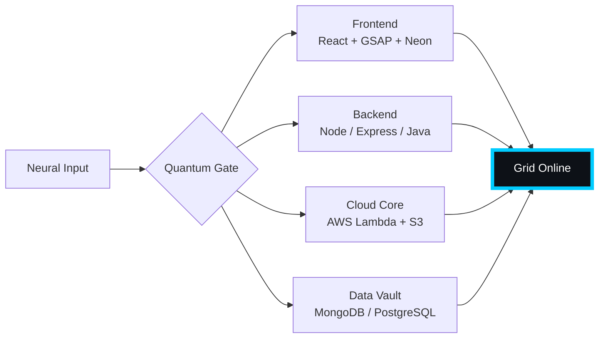

# 🌌 [ NEURAL CORE ACCESS: PENDEMVAMSI ]

<p align="center">
  
</p>

<div align="center">
  
  <br><small>Active Protocol: <strong style="color:#00CCFF">BLADE RUNNER RAIN</strong> 🌧️🔵</small>
</div>

## 🔵 NEURAL STATUS READOUT
```text
SUBJECT ID    →  PENDEMVAMSI
ENTITY CLASS  →  SHADOW MONARCH v9
NEURAL RANK   →  B-TIER
GRID SYNC     →  3130/15058 QUANTUM PACKETS
─────── BIO-METRICS (BLADE RUNNER RAIN) ───────
STRENGTH      149  ███████████████████░░
AGILITY       128  █████████████████░░░░
INTELLIGENCE  155  ████████████████████░
VITALITY      116  ███████████████░░░░░░
```

> **NEURAL BURST ACQUIRED:** +161 QUANTUM PACKETS 
> **SYSTEM MESSAGE:** ALL SYSTEMS NOMINAL — SHADOWS ARE LISTENING

---

## 🌀 GRID ARCHITECTURE (HOLOGRAPHIC RENDER)



---

## 📡 ACADEMIC NODES – CONQUERED
- [x] B.Tech Neural Engineering (2020–2024) – St. Ann’s Grid
- [x] Intermediate Quantum Core (2018–2020) – Sri Medhavi
- [x] SSC Primary Link (2017–2018) – Sri Geethanjali

---

## ⚡ SKILL NEURAL MATRIX

<details open>
<summary>🔌 ACTIVE NEURAL LINKS</summary>

| Node               | Tier | Integrity Bar                | Status      |
|--------------------|------|------------------------------|-------------|
| Java Core          | S    | ████████████████████ 100%   | OVERCLOCKED |
| Node.js Grid       | S    | ████████████████████ 100%   | OVERCLOCKED |
| React Holo-UI      | A+   | █████████████████░░░ 92%    | ONLINE      |
| AWS Quantum Relay  | S    | ████████████████████ 100%   | SOVEREIGN   |
| Python AI Kernel   | A    | ████████████████░░░░ 85%    | CHARGING    |
| DSA Void Algorithm | A    | █████████████████░░░ 90%    | ACTIVE      |

</details>

---

## 🏅 NEURAL ACHIEVEMENT TOKENS

<p align="center">
  
  
  
  
</p>

---

## 👾 SHADOW ENTITIES – SUMMONED

<p align="center">
  
  <br><strong style="color:#00CCFF">ARISE.</strong>
</p>

| Entity | Designation   | Class            | Source Node                     |
|--------|---------------|------------------|---------------------------------|
| SH-01  | Igris         | Void Commander   | AI Financial Oracle             |
| SH-02  | Beru          | Swarm Overlord   | WebRTC Quantum Stream           |
| SH-03  | Kaisel        | Void Wyrm        | Geolocation Shadow Relay        |
| SH-04  | Tusk          | Arcane Construct | Global Pandemic Sentinel        |
| SH-05  | Iron          | Armored Bastion  | React Crypto Fortress           |

---

## 📡 GRID ANALYTICS (LIVE FEED)

<p align="center">
  
  <br>
  
  
</p>

---

## 🖥️ CORRUPTED MAINFRAME LOG (401 ENTRIES)

<details>
<summary>OPEN TERMINAL FEED – PROTOCOL: BLADE RUNNER RAIN</summary>

> [0x827353EC] 🌧️🔵 **BLADE RUNNER RAIN PROTOCOL** #0 | NEURAL LINK STABILIZED | [TRANSMISSION SUCCESS]
> [0x36A5D708] 🌧️🔵 **BLADE RUNNER RAIN PROTOCOL** #1 | NEURAL LINK STABILIZED | [TRANSMISSION SUCCESS]
> [0x443601FE] 🌧️🔵 **BLADE RUNNER RAIN PROTOCOL** #2 | NEURAL LINK STABILIZED | [TRANSMISSION SUCCESS]
> [0xB22B27DF] 🌧️🔵 **BLADE RUNNER RAIN PROTOCOL** #3 | NEURAL LINK STABILIZED | [TRANSMISSION SUCCESS]
> [0x7E416DC5] 🌧️🔵 **BLADE RUNNER RAIN PROTOCOL** #4 | NEURAL LINK STABILIZED | [TRANSMISSION SUCCESS]
> [0x5D96989F] 🌧️🔵 **BLADE RUNNER RAIN PROTOCOL** #5 | NEURAL LINK STABILIZED | [TRANSMISSION SUCCESS]
> [0x6B42CF5A] 🌧️🔵 **BLADE RUNNER RAIN PROTOCOL** #6 | NEURAL LINK STABILIZED | [TRANSMISSION SUCCESS]
> [0x951522F9] 🌧️🔵 **BLADE RUNNER RAIN PROTOCOL** #7 | NEURAL LINK STABILIZED | [TRANSMISSION SUCCESS]
> [0x2E05705D] 🌧️🔵 **BLADE RUNNER RAIN PROTOCOL** #8 | NEURAL LINK STABILIZED | [TRANSMISSION SUCCESS]
> [0x96899521] 🌧️🔵 **BLADE RUNNER RAIN PROTOCOL** #9 | NEURAL LINK  [GLITCH DETECTED] STABILIZED | [TRANSMISSION SUCCESS]
> [0xC8DB52FF] 🌧️🔵 **BLADE RUNNER RAIN PROTOCOL** #10 | NEURAL LINK STABILIZED | [TRANSMISSION SUCCESS]
> [0x14D855FD] 🌧️🔵 **BLADE RUNNER RAIN PROTOCOL** #11 | NEURAL LINK STABILIZED | [TRANSMISSION SUCCESS]
> [0x28C05C2E] 🌧️🔵 **BLADE RUNNER RAIN PROTOCOL** #12 | NEURAL LINK  [GLITCH DETECTED] STABILIZED | [TRANSMISSION SUCCESS]
> [0x6DC97B35] 🌧️🔵 **BLADE RUNNER RAIN PROTOCOL** #13 | NEURAL LINK  [GLITCH DETECTED] STABILIZED | [TRANSMISSION SUCCESS]
> [0xE49A7ED1] 🌧️🔵 **BLADE RUNNER RAIN PROTOCOL** #14 | NEURAL LINK STABILIZED | [TRANSMISSION SUCCESS]
> [0xCB046362] 🌧️🔵 **BLADE RUNNER RAIN PROTOCOL** #15 | NEURAL LINK STABILIZED | [TRANSMISSION SUCCESS]
> [0x3EC2484A] 🌧️🔵 **BLADE RUNNER RAIN PROTOCOL** #16 | NEURAL LINK STABILIZED | [TRANSMISSION SUCCESS]
> [0x5645CEEB] 🌧️🔵 **BLADE RUNNER RAIN PROTOCOL** #17 | NEURAL LINK STABILIZED | [TRANSMISSION SUCCESS]
> [0x9A446960] 🌧️🔵 **BLADE RUNNER RAIN PROTOCOL** #18 | NEURAL LINK STABILIZED | [TRANSMISSION SUCCESS]
> [0x8FFF0F7A] 🌧️🔵 **BLADE RUNNER RAIN PROTOCOL** #19 | NEURAL LINK STABILIZED | [TRANSMISSION SUCCESS]
> [0x62844FC9] 🌧️🔵 **BLADE RUNNER RAIN PROTOCOL** #20 | NEURAL LINK STABILIZED | [TRANSMISSION SUCCESS]
> [0x993046E7] 🌧️🔵 **BLADE RUNNER RAIN PROTOCOL** #21 | NEURAL LINK  [GLITCH DETECTED] STABILIZED | [TRANSMISSION SUCCESS]
> [0x308888A7] 🌧️🔵 **BLADE RUNNER RAIN PROTOCOL** #22 | NEURAL LINK STABILIZED | [TRANSMISSION SUCCESS]
> [0x14EA42BA] 🌧️🔵 **BLADE RUNNER RAIN PROTOCOL** #23 | NEURAL LINK STABILIZED | [TRANSMISSION SUCCESS]
> [0xA429E737] 🌧️🔵 **BLADE RUNNER RAIN PROTOCOL** #24 | NEURAL LINK STABILIZED | [TRANSMISSION SUCCESS]
> [0x1FC402E5] 🌧️🔵 **BLADE RUNNER RAIN PROTOCOL** #25 | NEURAL LINK STABILIZED | [TRANSMISSION SUCCESS]
> [0x3060A004] 🌧️🔵 **BLADE RUNNER RAIN PROTOCOL** #26 | NEURAL LINK  [GLITCH DETECTED] STABILIZED | [TRANSMISSION SUCCESS]
> [0x8F8B62A0] 🌧️🔵 **BLADE RUNNER RAIN PROTOCOL** #27 | NEURAL LINK STABILIZED | [TRANSMISSION SUCCESS]
> [0x78337B3F] 🌧️🔵 **BLADE RUNNER RAIN PROTOCOL** #28 | NEURAL LINK STABILIZED | [TRANSMISSION SUCCESS]
> [0xC530F9FB] 🌧️🔵 **BLADE RUNNER RAIN PROTOCOL** #29 | NEURAL LINK STABILIZED | [TRANSMISSION SUCCESS]
> [0x7A74C701] 🌧️🔵 **BLADE RUNNER RAIN PROTOCOL** #30 | NEURAL LINK STABILIZED | [TRANSMISSION SUCCESS]
> [0xB4993FDF] 🌧️🔵 **BLADE RUNNER RAIN PROTOCOL** #31 | NEURAL LINK STABILIZED | [TRANSMISSION SUCCESS]
> [0xC28550BB] 🌧️🔵 **BLADE RUNNER RAIN PROTOCOL** #32 | NEURAL LINK STABILIZED | [TRANSMISSION SUCCESS]
> [0x4540171D] 🌧️🔵 **BLADE RUNNER RAIN PROTOCOL** #33 | NEURAL LINK STABILIZED | [TRANSMISSION SUCCESS]
> [0x44A33B57] 🌧️🔵 **BLADE RUNNER RAIN PROTOCOL** #34 | NEURAL LINK STABILIZED | [TRANSMISSION SUCCESS]
> [0xE2629C20] 🌧️🔵 **BLADE RUNNER RAIN PROTOCOL** #35 | NEURAL LINK STABILIZED | [TRANSMISSION SUCCESS]
> [0x9AC1CCF3] 🌧️🔵 **BLADE RUNNER RAIN PROTOCOL** #36 | NEURAL LINK STABILIZED | [TRANSMISSION SUCCESS]
> [0x6A2180DC] 🌧️🔵 **BLADE RUNNER RAIN PROTOCOL** #37 | NEURAL LINK STABILIZED | [TRANSMISSION SUCCESS]
> [0x9F54E724] 🌧️🔵 **BLADE RUNNER RAIN PROTOCOL** #38 | NEURAL LINK STABILIZED | [TRANSMISSION SUCCESS]
> [0x9FF8C030] 🌧️🔵 **BLADE RUNNER RAIN PROTOCOL** #39 | NEURAL LINK STABILIZED | [TRANSMISSION SUCCESS]
> [0x4EFACB35] 🌧️🔵 **BLADE RUNNER RAIN PROTOCOL** #40 | NEURAL LINK STABILIZED | [TRANSMISSION SUCCESS]
> [0xD08B2D4E] 🌧️🔵 **BLADE RUNNER RAIN PROTOCOL** #41 | NEURAL LINK STABILIZED | [TRANSMISSION SUCCESS]
> [0x47C12C33] 🌧️🔵 **BLADE RUNNER RAIN PROTOCOL** #42 | NEURAL LINK  [GLITCH DETECTED] STABILIZED | [TRANSMISSION SUCCESS]
> [0x3F7EA901] 🌧️🔵 **BLADE RUNNER RAIN PROTOCOL** #43 | NEURAL LINK STABILIZED | [TRANSMISSION SUCCESS]
> [0xA8FD4B74] 🌧️🔵 **BLADE RUNNER RAIN PROTOCOL** #44 | NEURAL LINK STABILIZED | [TRANSMISSION SUCCESS]
> [0xBB395EF6] 🌧️🔵 **BLADE RUNNER RAIN PROTOCOL** #45 | NEURAL LINK STABILIZED | [TRANSMISSION SUCCESS]
> [0xD291BAC7] 🌧️🔵 **BLADE RUNNER RAIN PROTOCOL** #46 | NEURAL LINK  [GLITCH DETECTED] STABILIZED | [TRANSMISSION SUCCESS]
> [0x93C14B3C] 🌧️🔵 **BLADE RUNNER RAIN PROTOCOL** #47 | NEURAL LINK STABILIZED | [TRANSMISSION SUCCESS]
> [0xDC5BDE62] 🌧️🔵 **BLADE RUNNER RAIN PROTOCOL** #48 | NEURAL LINK  [GLITCH DETECTED] STABILIZED | [TRANSMISSION SUCCESS]
> [0xA7746131] 🌧️🔵 **BLADE RUNNER RAIN PROTOCOL** #49 | NEURAL LINK STABILIZED | [TRANSMISSION SUCCESS]
> [0xA93C28BA] 🌧️🔵 **BLADE RUNNER RAIN PROTOCOL** #50 | NEURAL LINK STABILIZED | [TRANSMISSION SUCCESS]
> [0x80FCD449] 🌧️🔵 **BLADE RUNNER RAIN PROTOCOL** #51 | NEURAL LINK STABILIZED | [TRANSMISSION SUCCESS]
> [0x9E1478A3] 🌧️🔵 **BLADE RUNNER RAIN PROTOCOL** #52 | NEURAL LINK STABILIZED | [TRANSMISSION SUCCESS]
> [0xB974316F] 🌧️🔵 **BLADE RUNNER RAIN PROTOCOL** #53 | NEURAL LINK STABILIZED | [TRANSMISSION SUCCESS]
> [0xE813B89F] 🌧️🔵 **BLADE RUNNER RAIN PROTOCOL** #54 | NEURAL LINK STABILIZED | [TRANSMISSION SUCCESS]
> [0xE3707CD7] 🌧️🔵 **BLADE RUNNER RAIN PROTOCOL** #55 | NEURAL LINK  [GLITCH DETECTED] STABILIZED | [TRANSMISSION SUCCESS]
> [0x7145E6CE] 🌧️🔵 **BLADE RUNNER RAIN PROTOCOL** #56 | NEURAL LINK STABILIZED | [TRANSMISSION SUCCESS]
> [0x380AB829] 🌧️🔵 **BLADE RUNNER RAIN PROTOCOL** #57 | NEURAL LINK STABILIZED | [TRANSMISSION SUCCESS]
> [0x2A4E7929] 🌧️🔵 **BLADE RUNNER RAIN PROTOCOL** #58 | NEURAL LINK STABILIZED | [TRANSMISSION SUCCESS]
> [0x387508D2] 🌧️🔵 **BLADE RUNNER RAIN PROTOCOL** #59 | NEURAL LINK STABILIZED | [TRANSMISSION SUCCESS]
> [0x113A4473] 🌧️🔵 **BLADE RUNNER RAIN PROTOCOL** #60 | NEURAL LINK STABILIZED | [TRANSMISSION SUCCESS]
> [0xB7931238] 🌧️🔵 **BLADE RUNNER RAIN PROTOCOL** #61 | NEURAL LINK STABILIZED | [TRANSMISSION SUCCESS]
> [0xD443D1EA] 🌧️🔵 **BLADE RUNNER RAIN PROTOCOL** #62 | NEURAL LINK STABILIZED | [TRANSMISSION SUCCESS]
> [0x8EE2F73B] 🌧️🔵 **BLADE RUNNER RAIN PROTOCOL** #63 | NEURAL LINK STABILIZED | [TRANSMISSION SUCCESS]
> [0x06C2E2B7] 🌧️🔵 **BLADE RUNNER RAIN PROTOCOL** #64 | NEURAL LINK STABILIZED | [TRANSMISSION SUCCESS]
> [0xF87D0FAE] 🌧️🔵 **BLADE RUNNER RAIN PROTOCOL** #65 | NEURAL LINK STABILIZED | [TRANSMISSION SUCCESS]
> [0x167B9D84] 🌧️🔵 **BLADE RUNNER RAIN PROTOCOL** #66 | NEURAL LINK STABILIZED | [TRANSMISSION SUCCESS]
> [0x58F4F008] 🌧️🔵 **BLADE RUNNER RAIN PROTOCOL** #67 | NEURAL LINK STABILIZED | [TRANSMISSION SUCCESS]
> [0x8987C4F2] 🌧️🔵 **BLADE RUNNER RAIN PROTOCOL** #68 | NEURAL LINK STABILIZED | [TRANSMISSION SUCCESS]
> [0xF48640ED] 🌧️🔵 **BLADE RUNNER RAIN PROTOCOL** #69 | NEURAL LINK STABILIZED | [TRANSMISSION SUCCESS]
> [0xF0C9B65B] 🌧️🔵 **BLADE RUNNER RAIN PROTOCOL** #70 | NEURAL LINK STABILIZED | [TRANSMISSION SUCCESS]
> [0x1BC61C8C] 🌧️🔵 **BLADE RUNNER RAIN PROTOCOL** #71 | NEURAL LINK STABILIZED | [TRANSMISSION SUCCESS]
> [0xD1C544D5] 🌧️🔵 **BLADE RUNNER RAIN PROTOCOL** #72 | NEURAL LINK  [GLITCH DETECTED] STABILIZED | [TRANSMISSION SUCCESS]
> [0x4A26F8E7] 🌧️🔵 **BLADE RUNNER RAIN PROTOCOL** #73 | NEURAL LINK  [GLITCH DETECTED] STABILIZED | [TRANSMISSION SUCCESS]
> [0xB3CE464A] 🌧️🔵 **BLADE RUNNER RAIN PROTOCOL** #74 | NEURAL LINK  [GLITCH DETECTED] STABILIZED | [TRANSMISSION SUCCESS]
> [0x9958E393] 🌧️🔵 **BLADE RUNNER RAIN PROTOCOL** #75 | NEURAL LINK STABILIZED | [TRANSMISSION SUCCESS]
> [0xAF8B1F75] 🌧️🔵 **BLADE RUNNER RAIN PROTOCOL** #76 | NEURAL LINK STABILIZED | [TRANSMISSION SUCCESS]
> [0xD270EEF9] 🌧️🔵 **BLADE RUNNER RAIN PROTOCOL** #77 | NEURAL LINK STABILIZED | [TRANSMISSION SUCCESS]
> [0x224B7EA2] 🌧️🔵 **BLADE RUNNER RAIN PROTOCOL** #78 | NEURAL LINK STABILIZED | [TRANSMISSION SUCCESS]
> [0x2274F586] 🌧️🔵 **BLADE RUNNER RAIN PROTOCOL** #79 | NEURAL LINK STABILIZED | [TRANSMISSION SUCCESS]
> [0x5F619962] 🌧️🔵 **BLADE RUNNER RAIN PROTOCOL** #80 | NEURAL LINK STABILIZED | [TRANSMISSION SUCCESS]
> [0x4289AF1F] 🌧️🔵 **BLADE RUNNER RAIN PROTOCOL** #81 | NEURAL LINK STABILIZED | [TRANSMISSION SUCCESS]
> [0xEC3D57D1] 🌧️🔵 **BLADE RUNNER RAIN PROTOCOL** #82 | NEURAL LINK STABILIZED | [TRANSMISSION SUCCESS]
> [0x042A5DF5] 🌧️🔵 **BLADE RUNNER RAIN PROTOCOL** #83 | NEURAL LINK STABILIZED | [TRANSMISSION SUCCESS]
> [0xD469EBEC] 🌧️🔵 **BLADE RUNNER RAIN PROTOCOL** #84 | NEURAL LINK STABILIZED | [TRANSMISSION SUCCESS]
> [0xC7357204] 🌧️🔵 **BLADE RUNNER RAIN PROTOCOL** #85 | NEURAL LINK STABILIZED | [TRANSMISSION SUCCESS]
> [0x741240CC] 🌧️🔵 **BLADE RUNNER RAIN PROTOCOL** #86 | NEURAL LINK STABILIZED | [TRANSMISSION SUCCESS]
> [0x53510292] 🌧️🔵 **BLADE RUNNER RAIN PROTOCOL** #87 | NEURAL LINK STABILIZED | [TRANSMISSION SUCCESS]
> [0x981E3912] 🌧️🔵 **BLADE RUNNER RAIN PROTOCOL** #88 | NEURAL LINK STABILIZED | [TRANSMISSION SUCCESS]
> [0x4E816975] 🌧️🔵 **BLADE RUNNER RAIN PROTOCOL** #89 | NEURAL LINK STABILIZED | [TRANSMISSION SUCCESS]
> [0x4E57BCB5] 🌧️🔵 **BLADE RUNNER RAIN PROTOCOL** #90 | NEURAL LINK STABILIZED | [TRANSMISSION SUCCESS]
> [0x3AD5DDCC] 🌧️🔵 **BLADE RUNNER RAIN PROTOCOL** #91 | NEURAL LINK STABILIZED | [TRANSMISSION SUCCESS]
> [0xD20C157E] 🌧️🔵 **BLADE RUNNER RAIN PROTOCOL** #92 | NEURAL LINK STABILIZED | [TRANSMISSION SUCCESS]
> [0x1E50AC01] 🌧️🔵 **BLADE RUNNER RAIN PROTOCOL** #93 | NEURAL LINK STABILIZED | [TRANSMISSION SUCCESS]
> [0xCF6ED9AD] 🌧️🔵 **BLADE RUNNER RAIN PROTOCOL** #94 | NEURAL LINK STABILIZED | [TRANSMISSION SUCCESS]
> [0x4575CF46] 🌧️🔵 **BLADE RUNNER RAIN PROTOCOL** #95 | NEURAL LINK STABILIZED | [TRANSMISSION SUCCESS]
> [0x52D59A18] 🌧️🔵 **BLADE RUNNER RAIN PROTOCOL** #96 | NEURAL LINK STABILIZED | [TRANSMISSION SUCCESS]
> [0xE375538F] 🌧️🔵 **BLADE RUNNER RAIN PROTOCOL** #97 | NEURAL LINK STABILIZED | [TRANSMISSION SUCCESS]
> [0x62835FFE] 🌧️🔵 **BLADE RUNNER RAIN PROTOCOL** #98 | NEURAL LINK  [GLITCH DETECTED] STABILIZED | [TRANSMISSION SUCCESS]
> [0xDD79D49D] 🌧️🔵 **BLADE RUNNER RAIN PROTOCOL** #99 | NEURAL LINK STABILIZED | [TRANSMISSION SUCCESS]
> [0x56AEEBAD] 🌧️🔵 **BLADE RUNNER RAIN PROTOCOL** #100 | NEURAL LINK STABILIZED | [TRANSMISSION SUCCESS]
> [0xE00FF458] 🌧️🔵 **BLADE RUNNER RAIN PROTOCOL** #101 | NEURAL LINK STABILIZED | [TRANSMISSION SUCCESS]
> [0xC2CB8895] 🌧️🔵 **BLADE RUNNER RAIN PROTOCOL** #102 | NEURAL LINK STABILIZED | [TRANSMISSION SUCCESS]
> [0xAF0D158A] 🌧️🔵 **BLADE RUNNER RAIN PROTOCOL** #103 | NEURAL LINK STABILIZED | [TRANSMISSION SUCCESS]
> [0xD11F1F77] 🌧️🔵 **BLADE RUNNER RAIN PROTOCOL** #104 | NEURAL LINK STABILIZED | [TRANSMISSION SUCCESS]
> [0xB33BA2CD] 🌧️🔵 **BLADE RUNNER RAIN PROTOCOL** #105 | NEURAL LINK STABILIZED | [TRANSMISSION SUCCESS]
> [0x8AC848E5] 🌧️🔵 **BLADE RUNNER RAIN PROTOCOL** #106 | NEURAL LINK STABILIZED | [TRANSMISSION SUCCESS]
> [0x4C524136] 🌧️🔵 **BLADE RUNNER RAIN PROTOCOL** #107 | NEURAL LINK STABILIZED | [TRANSMISSION SUCCESS]
> [0x7771BE1B] 🌧️🔵 **BLADE RUNNER RAIN PROTOCOL** #108 | NEURAL LINK STABILIZED | [TRANSMISSION SUCCESS]
> [0x103CDA11] 🌧️🔵 **BLADE RUNNER RAIN PROTOCOL** #109 | NEURAL LINK  [GLITCH DETECTED] STABILIZED | [TRANSMISSION SUCCESS]
> [0xB6804287] 🌧️🔵 **BLADE RUNNER RAIN PROTOCOL** #110 | NEURAL LINK STABILIZED | [TRANSMISSION SUCCESS]
> [0xF496FBD0] 🌧️🔵 **BLADE RUNNER RAIN PROTOCOL** #111 | NEURAL LINK STABILIZED | [TRANSMISSION SUCCESS]
> [0xF3C93C8E] 🌧️🔵 **BLADE RUNNER RAIN PROTOCOL** #112 | NEURAL LINK STABILIZED | [TRANSMISSION SUCCESS]
> [0xF5FAD936] 🌧️🔵 **BLADE RUNNER RAIN PROTOCOL** #113 | NEURAL LINK STABILIZED | [TRANSMISSION SUCCESS]
> [0xB4FF1CA4] 🌧️🔵 **BLADE RUNNER RAIN PROTOCOL** #114 | NEURAL LINK STABILIZED | [TRANSMISSION SUCCESS]
> [0xE9F1AD09] 🌧️🔵 **BLADE RUNNER RAIN PROTOCOL** #115 | NEURAL LINK STABILIZED | [TRANSMISSION SUCCESS]
> [0x12757F0B] 🌧️🔵 **BLADE RUNNER RAIN PROTOCOL** #116 | NEURAL LINK STABILIZED | [TRANSMISSION SUCCESS]
> [0x4E59FC72] 🌧️🔵 **BLADE RUNNER RAIN PROTOCOL** #117 | NEURAL LINK STABILIZED | [TRANSMISSION SUCCESS]
> [0x20CE7B91] 🌧️🔵 **BLADE RUNNER RAIN PROTOCOL** #118 | NEURAL LINK STABILIZED | [TRANSMISSION SUCCESS]
> [0x70942296] 🌧️🔵 **BLADE RUNNER RAIN PROTOCOL** #119 | NEURAL LINK STABILIZED | [TRANSMISSION SUCCESS]
> [0x4A5A108C] 🌧️🔵 **BLADE RUNNER RAIN PROTOCOL** #120 | NEURAL LINK STABILIZED | [TRANSMISSION SUCCESS]
> [0x0FA25217] 🌧️🔵 **BLADE RUNNER RAIN PROTOCOL** #121 | NEURAL LINK STABILIZED | [TRANSMISSION SUCCESS]
> [0xC0F7F498] 🌧️🔵 **BLADE RUNNER RAIN PROTOCOL** #122 | NEURAL LINK STABILIZED | [TRANSMISSION SUCCESS]
> [0x0011717E] 🌧️🔵 **BLADE RUNNER RAIN PROTOCOL** #123 | NEURAL LINK STABILIZED | [TRANSMISSION SUCCESS]
> [0x2AA49143] 🌧️🔵 **BLADE RUNNER RAIN PROTOCOL** #124 | NEURAL LINK STABILIZED | [TRANSMISSION SUCCESS]
> [0x2804C8D2] 🌧️🔵 **BLADE RUNNER RAIN PROTOCOL** #125 | NEURAL LINK STABILIZED | [TRANSMISSION SUCCESS]
> [0x8F317B2D] 🌧️🔵 **BLADE RUNNER RAIN PROTOCOL** #126 | NEURAL LINK STABILIZED | [TRANSMISSION SUCCESS]
> [0x0D40028B] 🌧️🔵 **BLADE RUNNER RAIN PROTOCOL** #127 | NEURAL LINK STABILIZED | [TRANSMISSION SUCCESS]
> [0xD6A73AB7] 🌧️🔵 **BLADE RUNNER RAIN PROTOCOL** #128 | NEURAL LINK STABILIZED | [TRANSMISSION SUCCESS]
> [0x099A86DF] 🌧️🔵 **BLADE RUNNER RAIN PROTOCOL** #129 | NEURAL LINK  [GLITCH DETECTED] STABILIZED | [TRANSMISSION SUCCESS]
> [0xAC8754B8] 🌧️🔵 **BLADE RUNNER RAIN PROTOCOL** #130 | NEURAL LINK STABILIZED | [TRANSMISSION SUCCESS]
> [0x5438E798] 🌧️🔵 **BLADE RUNNER RAIN PROTOCOL** #131 | NEURAL LINK STABILIZED | [TRANSMISSION SUCCESS]
> [0x106A3ECD] 🌧️🔵 **BLADE RUNNER RAIN PROTOCOL** #132 | NEURAL LINK STABILIZED | [TRANSMISSION SUCCESS]
> [0x2A4CA508] 🌧️🔵 **BLADE RUNNER RAIN PROTOCOL** #133 | NEURAL LINK STABILIZED | [TRANSMISSION SUCCESS]
> [0x94423946] 🌧️🔵 **BLADE RUNNER RAIN PROTOCOL** #134 | NEURAL LINK STABILIZED | [TRANSMISSION SUCCESS]
> [0xC76504F5] 🌧️🔵 **BLADE RUNNER RAIN PROTOCOL** #135 | NEURAL LINK STABILIZED | [TRANSMISSION SUCCESS]
> [0x8AD258E6] 🌧️🔵 **BLADE RUNNER RAIN PROTOCOL** #136 | NEURAL LINK STABILIZED | [TRANSMISSION SUCCESS]
> [0x1C12961C] 🌧️🔵 **BLADE RUNNER RAIN PROTOCOL** #137 | NEURAL LINK STABILIZED | [TRANSMISSION SUCCESS]
> [0xF724AFF2] 🌧️🔵 **BLADE RUNNER RAIN PROTOCOL** #138 | NEURAL LINK STABILIZED | [TRANSMISSION SUCCESS]
> [0x2B31949B] 🌧️🔵 **BLADE RUNNER RAIN PROTOCOL** #139 | NEURAL LINK STABILIZED | [TRANSMISSION SUCCESS]
> [0x352B6C06] 🌧️🔵 **BLADE RUNNER RAIN PROTOCOL** #140 | NEURAL LINK STABILIZED | [TRANSMISSION SUCCESS]
> [0xC9F0BC71] 🌧️🔵 **BLADE RUNNER RAIN PROTOCOL** #141 | NEURAL LINK STABILIZED | [TRANSMISSION SUCCESS]
> [0xE9A32454] 🌧️🔵 **BLADE RUNNER RAIN PROTOCOL** #142 | NEURAL LINK STABILIZED | [TRANSMISSION SUCCESS]
> [0xB62FDE89] 🌧️🔵 **BLADE RUNNER RAIN PROTOCOL** #143 | NEURAL LINK STABILIZED | [TRANSMISSION SUCCESS]
> [0x2BD86725] 🌧️🔵 **BLADE RUNNER RAIN PROTOCOL** #144 | NEURAL LINK STABILIZED | [TRANSMISSION SUCCESS]
> [0x24867CAB] 🌧️🔵 **BLADE RUNNER RAIN PROTOCOL** #145 | NEURAL LINK STABILIZED | [TRANSMISSION SUCCESS]
> [0x153CE607] 🌧️🔵 **BLADE RUNNER RAIN PROTOCOL** #146 | NEURAL LINK STABILIZED | [TRANSMISSION SUCCESS]
> [0x83ADA9A9] 🌧️🔵 **BLADE RUNNER RAIN PROTOCOL** #147 | NEURAL LINK STABILIZED | [TRANSMISSION SUCCESS]
> [0x7F26E3CE] 🌧️🔵 **BLADE RUNNER RAIN PROTOCOL** #148 | NEURAL LINK STABILIZED | [TRANSMISSION SUCCESS]
> [0xA0EEEF82] 🌧️🔵 **BLADE RUNNER RAIN PROTOCOL** #149 | NEURAL LINK STABILIZED | [TRANSMISSION SUCCESS]
> [0xC49C3FF7] 🌧️🔵 **BLADE RUNNER RAIN PROTOCOL** #150 | NEURAL LINK STABILIZED | [TRANSMISSION SUCCESS]
> [0xC7A4B321] 🌧️🔵 **BLADE RUNNER RAIN PROTOCOL** #151 | NEURAL LINK STABILIZED | [TRANSMISSION SUCCESS]
> [0xB94FA1D4] 🌧️🔵 **BLADE RUNNER RAIN PROTOCOL** #152 | NEURAL LINK STABILIZED | [TRANSMISSION SUCCESS]
> [0x48F2FF5D] 🌧️🔵 **BLADE RUNNER RAIN PROTOCOL** #153 | NEURAL LINK STABILIZED | [TRANSMISSION SUCCESS]
> [0xBAFB949C] 🌧️🔵 **BLADE RUNNER RAIN PROTOCOL** #154 | NEURAL LINK STABILIZED | [TRANSMISSION SUCCESS]
> [0x5CC665E3] 🌧️🔵 **BLADE RUNNER RAIN PROTOCOL** #155 | NEURAL LINK STABILIZED | [TRANSMISSION SUCCESS]
> [0x0A7480A8] 🌧️🔵 **BLADE RUNNER RAIN PROTOCOL** #156 | NEURAL LINK  [GLITCH DETECTED] STABILIZED | [TRANSMISSION SUCCESS]
> [0x8E8BFEED] 🌧️🔵 **BLADE RUNNER RAIN PROTOCOL** #157 | NEURAL LINK STABILIZED | [TRANSMISSION SUCCESS]
> [0x1736F664] 🌧️🔵 **BLADE RUNNER RAIN PROTOCOL** #158 | NEURAL LINK  [GLITCH DETECTED] STABILIZED | [TRANSMISSION SUCCESS]
> [0x7D826441] 🌧️🔵 **BLADE RUNNER RAIN PROTOCOL** #159 | NEURAL LINK STABILIZED | [TRANSMISSION SUCCESS]
> [0x57818DCF] 🌧️🔵 **BLADE RUNNER RAIN PROTOCOL** #160 | NEURAL LINK STABILIZED | [TRANSMISSION SUCCESS]
> [0xA42CCD0A] 🌧️🔵 **BLADE RUNNER RAIN PROTOCOL** #161 | NEURAL LINK STABILIZED | [TRANSMISSION SUCCESS]
> [0x94341158] 🌧️🔵 **BLADE RUNNER RAIN PROTOCOL** #162 | NEURAL LINK STABILIZED | [TRANSMISSION SUCCESS]
> [0x4B9D8A23] 🌧️🔵 **BLADE RUNNER RAIN PROTOCOL** #163 | NEURAL LINK STABILIZED | [TRANSMISSION SUCCESS]
> [0x8D0D413B] 🌧️🔵 **BLADE RUNNER RAIN PROTOCOL** #164 | NEURAL LINK STABILIZED | [TRANSMISSION SUCCESS]
> [0x68BB6958] 🌧️🔵 **BLADE RUNNER RAIN PROTOCOL** #165 | NEURAL LINK STABILIZED | [TRANSMISSION SUCCESS]
> [0xC8C2BC18] 🌧️🔵 **BLADE RUNNER RAIN PROTOCOL** #166 | NEURAL LINK STABILIZED | [TRANSMISSION SUCCESS]
> [0x9EC68AC9] 🌧️🔵 **BLADE RUNNER RAIN PROTOCOL** #167 | NEURAL LINK STABILIZED | [TRANSMISSION SUCCESS]
> [0xE5EBA9CD] 🌧️🔵 **BLADE RUNNER RAIN PROTOCOL** #168 | NEURAL LINK  [GLITCH DETECTED] STABILIZED | [TRANSMISSION SUCCESS]
> [0x12C6D431] 🌧️🔵 **BLADE RUNNER RAIN PROTOCOL** #169 | NEURAL LINK STABILIZED | [TRANSMISSION SUCCESS]
> [0xD8B02AE3] 🌧️🔵 **BLADE RUNNER RAIN PROTOCOL** #170 | NEURAL LINK STABILIZED | [TRANSMISSION SUCCESS]
> [0x4C09AE48] 🌧️🔵 **BLADE RUNNER RAIN PROTOCOL** #171 | NEURAL LINK STABILIZED | [TRANSMISSION SUCCESS]
> [0x51FD8B41] 🌧️🔵 **BLADE RUNNER RAIN PROTOCOL** #172 | NEURAL LINK STABILIZED | [TRANSMISSION SUCCESS]
> [0x274555EB] 🌧️🔵 **BLADE RUNNER RAIN PROTOCOL** #173 | NEURAL LINK STABILIZED | [TRANSMISSION SUCCESS]
> [0x74ED9336] 🌧️🔵 **BLADE RUNNER RAIN PROTOCOL** #174 | NEURAL LINK STABILIZED | [TRANSMISSION SUCCESS]
> [0xDC25A96A] 🌧️🔵 **BLADE RUNNER RAIN PROTOCOL** #175 | NEURAL LINK STABILIZED | [TRANSMISSION SUCCESS]
> [0x6F0BB514] 🌧️🔵 **BLADE RUNNER RAIN PROTOCOL** #176 | NEURAL LINK  [GLITCH DETECTED] STABILIZED | [TRANSMISSION SUCCESS]
> [0xEAD812F1] 🌧️🔵 **BLADE RUNNER RAIN PROTOCOL** #177 | NEURAL LINK STABILIZED | [TRANSMISSION SUCCESS]
> [0x73371EA7] 🌧️🔵 **BLADE RUNNER RAIN PROTOCOL** #178 | NEURAL LINK STABILIZED | [TRANSMISSION SUCCESS]
> [0xFAF16D05] 🌧️🔵 **BLADE RUNNER RAIN PROTOCOL** #179 | NEURAL LINK STABILIZED | [TRANSMISSION SUCCESS]
> [0x1E7AC9A8] 🌧️🔵 **BLADE RUNNER RAIN PROTOCOL** #180 | NEURAL LINK STABILIZED | [TRANSMISSION SUCCESS]
> [0x26761E1E] 🌧️🔵 **BLADE RUNNER RAIN PROTOCOL** #181 | NEURAL LINK STABILIZED | [TRANSMISSION SUCCESS]
> [0xA37F2DA1] 🌧️🔵 **BLADE RUNNER RAIN PROTOCOL** #182 | NEURAL LINK STABILIZED | [TRANSMISSION SUCCESS]
> [0xCF84D41D] 🌧️🔵 **BLADE RUNNER RAIN PROTOCOL** #183 | NEURAL LINK STABILIZED | [TRANSMISSION SUCCESS]
> [0xFEB0B903] 🌧️🔵 **BLADE RUNNER RAIN PROTOCOL** #184 | NEURAL LINK STABILIZED | [TRANSMISSION SUCCESS]
> [0x578D73F6] 🌧️🔵 **BLADE RUNNER RAIN PROTOCOL** #185 | NEURAL LINK STABILIZED | [TRANSMISSION SUCCESS]
> [0x39BA329B] 🌧️🔵 **BLADE RUNNER RAIN PROTOCOL** #186 | NEURAL LINK STABILIZED | [TRANSMISSION SUCCESS]
> [0xC6A8A69C] 🌧️🔵 **BLADE RUNNER RAIN PROTOCOL** #187 | NEURAL LINK STABILIZED | [TRANSMISSION SUCCESS]
> [0x06D3212E] 🌧️🔵 **BLADE RUNNER RAIN PROTOCOL** #188 | NEURAL LINK STABILIZED | [TRANSMISSION SUCCESS]
> [0x500DE1D0] 🌧️🔵 **BLADE RUNNER RAIN PROTOCOL** #189 | NEURAL LINK STABILIZED | [TRANSMISSION SUCCESS]
> [0x228152F1] 🌧️🔵 **BLADE RUNNER RAIN PROTOCOL** #190 | NEURAL LINK STABILIZED | [TRANSMISSION SUCCESS]
> [0x65ABCD22] 🌧️🔵 **BLADE RUNNER RAIN PROTOCOL** #191 | NEURAL LINK STABILIZED | [TRANSMISSION SUCCESS]
> [0xAB44AFDC] 🌧️🔵 **BLADE RUNNER RAIN PROTOCOL** #192 | NEURAL LINK STABILIZED | [TRANSMISSION SUCCESS]
> [0x5DC934FE] 🌧️🔵 **BLADE RUNNER RAIN PROTOCOL** #193 | NEURAL LINK STABILIZED | [TRANSMISSION SUCCESS]
> [0xA351DE9E] 🌧️🔵 **BLADE RUNNER RAIN PROTOCOL** #194 | NEURAL LINK  [GLITCH DETECTED] STABILIZED | [TRANSMISSION SUCCESS]
> [0x12F0D88C] 🌧️🔵 **BLADE RUNNER RAIN PROTOCOL** #195 | NEURAL LINK STABILIZED | [TRANSMISSION SUCCESS]
> [0xFCE35442] 🌧️🔵 **BLADE RUNNER RAIN PROTOCOL** #196 | NEURAL LINK STABILIZED | [TRANSMISSION SUCCESS]
> [0x7358EB7B] 🌧️🔵 **BLADE RUNNER RAIN PROTOCOL** #197 | NEURAL LINK  [GLITCH DETECTED] STABILIZED | [TRANSMISSION SUCCESS]
> [0x3EEF1D55] 🌧️🔵 **BLADE RUNNER RAIN PROTOCOL** #198 | NEURAL LINK STABILIZED | [TRANSMISSION SUCCESS]
> [0xACB44447] 🌧️🔵 **BLADE RUNNER RAIN PROTOCOL** #199 | NEURAL LINK STABILIZED | [TRANSMISSION SUCCESS]
> [0x553348BF] 🌧️🔵 **BLADE RUNNER RAIN PROTOCOL** #200 | NEURAL LINK  [GLITCH DETECTED] STABILIZED | [TRANSMISSION SUCCESS]
> [0x4D4199CC] 🌧️🔵 **BLADE RUNNER RAIN PROTOCOL** #201 | NEURAL LINK STABILIZED | [TRANSMISSION SUCCESS]
> [0x439E8ACF] 🌧️🔵 **BLADE RUNNER RAIN PROTOCOL** #202 | NEURAL LINK STABILIZED | [TRANSMISSION SUCCESS]
> [0x6A668C57] 🌧️🔵 **BLADE RUNNER RAIN PROTOCOL** #203 | NEURAL LINK STABILIZED | [TRANSMISSION SUCCESS]
> [0x17788E2E] 🌧️🔵 **BLADE RUNNER RAIN PROTOCOL** #204 | NEURAL LINK STABILIZED | [TRANSMISSION SUCCESS]
> [0xB6ECCAC2] 🌧️🔵 **BLADE RUNNER RAIN PROTOCOL** #205 | NEURAL LINK STABILIZED | [TRANSMISSION SUCCESS]
> [0x7D3D56D3] 🌧️🔵 **BLADE RUNNER RAIN PROTOCOL** #206 | NEURAL LINK STABILIZED | [TRANSMISSION SUCCESS]
> [0x2754B9EA] 🌧️🔵 **BLADE RUNNER RAIN PROTOCOL** #207 | NEURAL LINK  [GLITCH DETECTED] STABILIZED | [TRANSMISSION SUCCESS]
> [0x95382AB9] 🌧️🔵 **BLADE RUNNER RAIN PROTOCOL** #208 | NEURAL LINK STABILIZED | [TRANSMISSION SUCCESS]
> [0x9CE01AE9] 🌧️🔵 **BLADE RUNNER RAIN PROTOCOL** #209 | NEURAL LINK  [GLITCH DETECTED] STABILIZED | [TRANSMISSION SUCCESS]
> [0xCEBF835E] 🌧️🔵 **BLADE RUNNER RAIN PROTOCOL** #210 | NEURAL LINK STABILIZED | [TRANSMISSION SUCCESS]
> [0xC1DF3284] 🌧️🔵 **BLADE RUNNER RAIN PROTOCOL** #211 | NEURAL LINK STABILIZED | [TRANSMISSION SUCCESS]
> [0x004AE8F7] 🌧️🔵 **BLADE RUNNER RAIN PROTOCOL** #212 | NEURAL LINK STABILIZED | [TRANSMISSION SUCCESS]
> [0xF38A597D] 🌧️🔵 **BLADE RUNNER RAIN PROTOCOL** #213 | NEURAL LINK STABILIZED | [TRANSMISSION SUCCESS]
> [0x32767B98] 🌧️🔵 **BLADE RUNNER RAIN PROTOCOL** #214 | NEURAL LINK STABILIZED | [TRANSMISSION SUCCESS]
> [0xC0CB5FB5] 🌧️🔵 **BLADE RUNNER RAIN PROTOCOL** #215 | NEURAL LINK STABILIZED | [TRANSMISSION SUCCESS]
> [0x9C7223CE] 🌧️🔵 **BLADE RUNNER RAIN PROTOCOL** #216 | NEURAL LINK STABILIZED | [TRANSMISSION SUCCESS]
> [0xEA39AA51] 🌧️🔵 **BLADE RUNNER RAIN PROTOCOL** #217 | NEURAL LINK STABILIZED | [TRANSMISSION SUCCESS]
> [0x04A4D0F5] 🌧️🔵 **BLADE RUNNER RAIN PROTOCOL** #218 | NEURAL LINK STABILIZED | [TRANSMISSION SUCCESS]
> [0x23659299] 🌧️🔵 **BLADE RUNNER RAIN PROTOCOL** #219 | NEURAL LINK STABILIZED | [TRANSMISSION SUCCESS]
> [0xE040D936] 🌧️🔵 **BLADE RUNNER RAIN PROTOCOL** #220 | NEURAL LINK STABILIZED | [TRANSMISSION SUCCESS]
> [0x14E7DFFF] 🌧️🔵 **BLADE RUNNER RAIN PROTOCOL** #221 | NEURAL LINK STABILIZED | [TRANSMISSION SUCCESS]
> [0x6EE038CA] 🌧️🔵 **BLADE RUNNER RAIN PROTOCOL** #222 | NEURAL LINK STABILIZED | [TRANSMISSION SUCCESS]
> [0x3F229495] 🌧️🔵 **BLADE RUNNER RAIN PROTOCOL** #223 | NEURAL LINK  [GLITCH DETECTED] STABILIZED | [TRANSMISSION SUCCESS]
> [0xA45A58FF] 🌧️🔵 **BLADE RUNNER RAIN PROTOCOL** #224 | NEURAL LINK STABILIZED | [TRANSMISSION SUCCESS]
> [0x3976E269] 🌧️🔵 **BLADE RUNNER RAIN PROTOCOL** #225 | NEURAL LINK  [GLITCH DETECTED] STABILIZED | [TRANSMISSION SUCCESS]
> [0x508AE51F] 🌧️🔵 **BLADE RUNNER RAIN PROTOCOL** #226 | NEURAL LINK STABILIZED | [TRANSMISSION SUCCESS]
> [0x9D03D6EC] 🌧️🔵 **BLADE RUNNER RAIN PROTOCOL** #227 | NEURAL LINK STABILIZED | [TRANSMISSION SUCCESS]
> [0xAA0072CA] 🌧️🔵 **BLADE RUNNER RAIN PROTOCOL** #228 | NEURAL LINK STABILIZED | [TRANSMISSION SUCCESS]
> [0x4D452544] 🌧️🔵 **BLADE RUNNER RAIN PROTOCOL** #229 | NEURAL LINK STABILIZED | [TRANSMISSION SUCCESS]
> [0x5D8A046C] 🌧️🔵 **BLADE RUNNER RAIN PROTOCOL** #230 | NEURAL LINK STABILIZED | [TRANSMISSION SUCCESS]
> [0xD14006BD] 🌧️🔵 **BLADE RUNNER RAIN PROTOCOL** #231 | NEURAL LINK STABILIZED | [TRANSMISSION SUCCESS]
> [0x4CA4B7C4] 🌧️🔵 **BLADE RUNNER RAIN PROTOCOL** #232 | NEURAL LINK STABILIZED | [TRANSMISSION SUCCESS]
> [0xFC70B1D1] 🌧️🔵 **BLADE RUNNER RAIN PROTOCOL** #233 | NEURAL LINK STABILIZED | [TRANSMISSION SUCCESS]
> [0x293489F0] 🌧️🔵 **BLADE RUNNER RAIN PROTOCOL** #234 | NEURAL LINK  [GLITCH DETECTED] STABILIZED | [TRANSMISSION SUCCESS]
> [0x33D2E9D3] 🌧️🔵 **BLADE RUNNER RAIN PROTOCOL** #235 | NEURAL LINK  [GLITCH DETECTED] STABILIZED | [TRANSMISSION SUCCESS]
> [0x14FDCD82] 🌧️🔵 **BLADE RUNNER RAIN PROTOCOL** #236 | NEURAL LINK STABILIZED | [TRANSMISSION SUCCESS]
> [0x7756E6AD] 🌧️🔵 **BLADE RUNNER RAIN PROTOCOL** #237 | NEURAL LINK STABILIZED | [TRANSMISSION SUCCESS]
> [0x9C4DD2AF] 🌧️🔵 **BLADE RUNNER RAIN PROTOCOL** #238 | NEURAL LINK STABILIZED | [TRANSMISSION SUCCESS]
> [0x6E434A54] 🌧️🔵 **BLADE RUNNER RAIN PROTOCOL** #239 | NEURAL LINK  [GLITCH DETECTED] STABILIZED | [TRANSMISSION SUCCESS]
> [0x756995E2] 🌧️🔵 **BLADE RUNNER RAIN PROTOCOL** #240 | NEURAL LINK STABILIZED | [TRANSMISSION SUCCESS]
> [0x87CEC3E2] 🌧️🔵 **BLADE RUNNER RAIN PROTOCOL** #241 | NEURAL LINK STABILIZED | [TRANSMISSION SUCCESS]
> [0x8EAEE866] 🌧️🔵 **BLADE RUNNER RAIN PROTOCOL** #242 | NEURAL LINK STABILIZED | [TRANSMISSION SUCCESS]
> [0x1B783C21] 🌧️🔵 **BLADE RUNNER RAIN PROTOCOL** #243 | NEURAL LINK STABILIZED | [TRANSMISSION SUCCESS]
> [0x101BAAA4] 🌧️🔵 **BLADE RUNNER RAIN PROTOCOL** #244 | NEURAL LINK STABILIZED | [TRANSMISSION SUCCESS]
> [0xE215D518] 🌧️🔵 **BLADE RUNNER RAIN PROTOCOL** #245 | NEURAL LINK STABILIZED | [TRANSMISSION SUCCESS]
> [0x75F0BDAB] 🌧️🔵 **BLADE RUNNER RAIN PROTOCOL** #246 | NEURAL LINK STABILIZED | [TRANSMISSION SUCCESS]
> [0xBB5E1ED6] 🌧️🔵 **BLADE RUNNER RAIN PROTOCOL** #247 | NEURAL LINK STABILIZED | [TRANSMISSION SUCCESS]
> [0x4C4F15D3] 🌧️🔵 **BLADE RUNNER RAIN PROTOCOL** #248 | NEURAL LINK STABILIZED | [TRANSMISSION SUCCESS]
> [0x41FCD8F3] 🌧️🔵 **BLADE RUNNER RAIN PROTOCOL** #249 | NEURAL LINK STABILIZED | [TRANSMISSION SUCCESS]
> [0x50095BA8] 🌧️🔵 **BLADE RUNNER RAIN PROTOCOL** #250 | NEURAL LINK STABILIZED | [TRANSMISSION SUCCESS]
> [0x0ABDFEDB] 🌧️🔵 **BLADE RUNNER RAIN PROTOCOL** #251 | NEURAL LINK STABILIZED | [TRANSMISSION SUCCESS]
> [0x95B60A67] 🌧️🔵 **BLADE RUNNER RAIN PROTOCOL** #252 | NEURAL LINK STABILIZED | [TRANSMISSION SUCCESS]
> [0x30D7381C] 🌧️🔵 **BLADE RUNNER RAIN PROTOCOL** #253 | NEURAL LINK STABILIZED | [TRANSMISSION SUCCESS]
> [0x493AA237] 🌧️🔵 **BLADE RUNNER RAIN PROTOCOL** #254 | NEURAL LINK STABILIZED | [TRANSMISSION SUCCESS]
> [0x467E0C12] 🌧️🔵 **BLADE RUNNER RAIN PROTOCOL** #255 | NEURAL LINK  [GLITCH DETECTED] STABILIZED | [TRANSMISSION SUCCESS]
> [0x61AEF7AD] 🌧️🔵 **BLADE RUNNER RAIN PROTOCOL** #256 | NEURAL LINK STABILIZED | [TRANSMISSION SUCCESS]
> [0xA97E98F0] 🌧️🔵 **BLADE RUNNER RAIN PROTOCOL** #257 | NEURAL LINK STABILIZED | [TRANSMISSION SUCCESS]
> [0x7B1F4EAE] 🌧️🔵 **BLADE RUNNER RAIN PROTOCOL** #258 | NEURAL LINK STABILIZED | [TRANSMISSION SUCCESS]
> [0x3FC60F24] 🌧️🔵 **BLADE RUNNER RAIN PROTOCOL** #259 | NEURAL LINK STABILIZED | [TRANSMISSION SUCCESS]
> [0xE0F00DCA] 🌧️🔵 **BLADE RUNNER RAIN PROTOCOL** #260 | NEURAL LINK  [GLITCH DETECTED] STABILIZED | [TRANSMISSION SUCCESS]
> [0x2EC8FE71] 🌧️🔵 **BLADE RUNNER RAIN PROTOCOL** #261 | NEURAL LINK STABILIZED | [TRANSMISSION SUCCESS]
> [0xB22CF739] 🌧️🔵 **BLADE RUNNER RAIN PROTOCOL** #262 | NEURAL LINK STABILIZED | [TRANSMISSION SUCCESS]
> [0xEFA0365D] 🌧️🔵 **BLADE RUNNER RAIN PROTOCOL** #263 | NEURAL LINK STABILIZED | [TRANSMISSION SUCCESS]
> [0x753D0DE6] 🌧️🔵 **BLADE RUNNER RAIN PROTOCOL** #264 | NEURAL LINK STABILIZED | [TRANSMISSION SUCCESS]
> [0x903098B5] 🌧️🔵 **BLADE RUNNER RAIN PROTOCOL** #265 | NEURAL LINK STABILIZED | [TRANSMISSION SUCCESS]
> [0xC22174FF] 🌧️🔵 **BLADE RUNNER RAIN PROTOCOL** #266 | NEURAL LINK STABILIZED | [TRANSMISSION SUCCESS]
> [0x1FE41C08] 🌧️🔵 **BLADE RUNNER RAIN PROTOCOL** #267 | NEURAL LINK STABILIZED | [TRANSMISSION SUCCESS]
> [0x7B2B8AD5] 🌧️🔵 **BLADE RUNNER RAIN PROTOCOL** #268 | NEURAL LINK STABILIZED | [TRANSMISSION SUCCESS]
> [0xBB9A174D] 🌧️🔵 **BLADE RUNNER RAIN PROTOCOL** #269 | NEURAL LINK STABILIZED | [TRANSMISSION SUCCESS]
> [0x6132DDD0] 🌧️🔵 **BLADE RUNNER RAIN PROTOCOL** #270 | NEURAL LINK STABILIZED | [TRANSMISSION SUCCESS]
> [0x7EC85282] 🌧️🔵 **BLADE RUNNER RAIN PROTOCOL** #271 | NEURAL LINK STABILIZED | [TRANSMISSION SUCCESS]
> [0xDFA4F5CE] 🌧️🔵 **BLADE RUNNER RAIN PROTOCOL** #272 | NEURAL LINK  [GLITCH DETECTED] STABILIZED | [TRANSMISSION SUCCESS]
> [0x8B36255A] 🌧️🔵 **BLADE RUNNER RAIN PROTOCOL** #273 | NEURAL LINK STABILIZED | [TRANSMISSION SUCCESS]
> [0x8A3FD83F] 🌧️🔵 **BLADE RUNNER RAIN PROTOCOL** #274 | NEURAL LINK STABILIZED | [TRANSMISSION SUCCESS]
> [0x99DEE10C] 🌧️🔵 **BLADE RUNNER RAIN PROTOCOL** #275 | NEURAL LINK STABILIZED | [TRANSMISSION SUCCESS]
> [0x66593AC4] 🌧️🔵 **BLADE RUNNER RAIN PROTOCOL** #276 | NEURAL LINK STABILIZED | [TRANSMISSION SUCCESS]
> [0x6C6BB4F9] 🌧️🔵 **BLADE RUNNER RAIN PROTOCOL** #277 | NEURAL LINK STABILIZED | [TRANSMISSION SUCCESS]
> [0x0801960E] 🌧️🔵 **BLADE RUNNER RAIN PROTOCOL** #278 | NEURAL LINK  [GLITCH DETECTED] STABILIZED | [TRANSMISSION SUCCESS]
> [0xC1BAAE6E] 🌧️🔵 **BLADE RUNNER RAIN PROTOCOL** #279 | NEURAL LINK  [GLITCH DETECTED] STABILIZED | [TRANSMISSION SUCCESS]
> [0xFA9A4D99] 🌧️🔵 **BLADE RUNNER RAIN PROTOCOL** #280 | NEURAL LINK STABILIZED | [TRANSMISSION SUCCESS]
> [0x1E7336C4] 🌧️🔵 **BLADE RUNNER RAIN PROTOCOL** #281 | NEURAL LINK STABILIZED | [TRANSMISSION SUCCESS]
> [0xC9EC1140] 🌧️🔵 **BLADE RUNNER RAIN PROTOCOL** #282 | NEURAL LINK STABILIZED | [TRANSMISSION SUCCESS]
> [0xAFA70CA5] 🌧️🔵 **BLADE RUNNER RAIN PROTOCOL** #283 | NEURAL LINK STABILIZED | [TRANSMISSION SUCCESS]
> [0xB9FD113B] 🌧️🔵 **BLADE RUNNER RAIN PROTOCOL** #284 | NEURAL LINK STABILIZED | [TRANSMISSION SUCCESS]
> [0x694AEF4A] 🌧️🔵 **BLADE RUNNER RAIN PROTOCOL** #285 | NEURAL LINK STABILIZED | [TRANSMISSION SUCCESS]
> [0xFA471852] 🌧️🔵 **BLADE RUNNER RAIN PROTOCOL** #286 | NEURAL LINK STABILIZED | [TRANSMISSION SUCCESS]
> [0x6823438D] 🌧️🔵 **BLADE RUNNER RAIN PROTOCOL** #287 | NEURAL LINK STABILIZED | [TRANSMISSION SUCCESS]
> [0xB6EE90AA] 🌧️🔵 **BLADE RUNNER RAIN PROTOCOL** #288 | NEURAL LINK STABILIZED | [TRANSMISSION SUCCESS]
> [0x77226D7F] 🌧️🔵 **BLADE RUNNER RAIN PROTOCOL** #289 | NEURAL LINK STABILIZED | [TRANSMISSION SUCCESS]
> [0xF522C042] 🌧️🔵 **BLADE RUNNER RAIN PROTOCOL** #290 | NEURAL LINK STABILIZED | [TRANSMISSION SUCCESS]
> [0x79944142] 🌧️🔵 **BLADE RUNNER RAIN PROTOCOL** #291 | NEURAL LINK STABILIZED | [TRANSMISSION SUCCESS]
> [0xABB05F0E] 🌧️🔵 **BLADE RUNNER RAIN PROTOCOL** #292 | NEURAL LINK STABILIZED | [TRANSMISSION SUCCESS]
> [0x54D92F97] 🌧️🔵 **BLADE RUNNER RAIN PROTOCOL** #293 | NEURAL LINK  [GLITCH DETECTED] STABILIZED | [TRANSMISSION SUCCESS]
> [0xC91820CF] 🌧️🔵 **BLADE RUNNER RAIN PROTOCOL** #294 | NEURAL LINK STABILIZED | [TRANSMISSION SUCCESS]
> [0x9CA3E202] 🌧️🔵 **BLADE RUNNER RAIN PROTOCOL** #295 | NEURAL LINK STABILIZED | [TRANSMISSION SUCCESS]
> [0x4E411DBB] 🌧️🔵 **BLADE RUNNER RAIN PROTOCOL** #296 | NEURAL LINK STABILIZED | [TRANSMISSION SUCCESS]
> [0x6DE2DE0D] 🌧️🔵 **BLADE RUNNER RAIN PROTOCOL** #297 | NEURAL LINK STABILIZED | [TRANSMISSION SUCCESS]
> [0xD63E1BA2] 🌧️🔵 **BLADE RUNNER RAIN PROTOCOL** #298 | NEURAL LINK STABILIZED | [TRANSMISSION SUCCESS]
> [0xFE785725] 🌧️🔵 **BLADE RUNNER RAIN PROTOCOL** #299 | NEURAL LINK STABILIZED | [TRANSMISSION SUCCESS]
> [0x48DD1FF8] 🌧️🔵 **BLADE RUNNER RAIN PROTOCOL** #300 | NEURAL LINK STABILIZED | [TRANSMISSION SUCCESS]
> [0x9FAB118A] 🌧️🔵 **BLADE RUNNER RAIN PROTOCOL** #301 | NEURAL LINK STABILIZED | [TRANSMISSION SUCCESS]
> [0xEAECF542] 🌧️🔵 **BLADE RUNNER RAIN PROTOCOL** #302 | NEURAL LINK STABILIZED | [TRANSMISSION SUCCESS]
> [0xC12339CF] 🌧️🔵 **BLADE RUNNER RAIN PROTOCOL** #303 | NEURAL LINK STABILIZED | [TRANSMISSION SUCCESS]
> [0x79A18B75] 🌧️🔵 **BLADE RUNNER RAIN PROTOCOL** #304 | NEURAL LINK STABILIZED | [TRANSMISSION SUCCESS]
> [0xDD7E0D7F] 🌧️🔵 **BLADE RUNNER RAIN PROTOCOL** #305 | NEURAL LINK STABILIZED | [TRANSMISSION SUCCESS]
> [0x04734F3D] 🌧️🔵 **BLADE RUNNER RAIN PROTOCOL** #306 | NEURAL LINK STABILIZED | [TRANSMISSION SUCCESS]
> [0x5F7F89BA] 🌧️🔵 **BLADE RUNNER RAIN PROTOCOL** #307 | NEURAL LINK  [GLITCH DETECTED] STABILIZED | [TRANSMISSION SUCCESS]
> [0x455F4FF8] 🌧️🔵 **BLADE RUNNER RAIN PROTOCOL** #308 | NEURAL LINK STABILIZED | [TRANSMISSION SUCCESS]
> [0xCE150072] 🌧️🔵 **BLADE RUNNER RAIN PROTOCOL** #309 | NEURAL LINK STABILIZED | [TRANSMISSION SUCCESS]
> [0x2E280B1A] 🌧️🔵 **BLADE RUNNER RAIN PROTOCOL** #310 | NEURAL LINK STABILIZED | [TRANSMISSION SUCCESS]
> [0x68D487C1] 🌧️🔵 **BLADE RUNNER RAIN PROTOCOL** #311 | NEURAL LINK STABILIZED | [TRANSMISSION SUCCESS]
> [0x66DE9F79] 🌧️🔵 **BLADE RUNNER RAIN PROTOCOL** #312 | NEURAL LINK STABILIZED | [TRANSMISSION SUCCESS]
> [0x0536227A] 🌧️🔵 **BLADE RUNNER RAIN PROTOCOL** #313 | NEURAL LINK STABILIZED | [TRANSMISSION SUCCESS]
> [0x3D3E5C47] 🌧️🔵 **BLADE RUNNER RAIN PROTOCOL** #314 | NEURAL LINK STABILIZED | [TRANSMISSION SUCCESS]
> [0x7EC04EF8] 🌧️🔵 **BLADE RUNNER RAIN PROTOCOL** #315 | NEURAL LINK STABILIZED | [TRANSMISSION SUCCESS]
> [0xAF91B289] 🌧️🔵 **BLADE RUNNER RAIN PROTOCOL** #316 | NEURAL LINK STABILIZED | [TRANSMISSION SUCCESS]
> [0x63719308] 🌧️🔵 **BLADE RUNNER RAIN PROTOCOL** #317 | NEURAL LINK STABILIZED | [TRANSMISSION SUCCESS]
> [0x68593C41] 🌧️🔵 **BLADE RUNNER RAIN PROTOCOL** #318 | NEURAL LINK STABILIZED | [TRANSMISSION SUCCESS]
> [0x324AFCB7] 🌧️🔵 **BLADE RUNNER RAIN PROTOCOL** #319 | NEURAL LINK STABILIZED | [TRANSMISSION SUCCESS]
> [0x9769D6EA] 🌧️🔵 **BLADE RUNNER RAIN PROTOCOL** #320 | NEURAL LINK STABILIZED | [TRANSMISSION SUCCESS]
> [0x1027DAA8] 🌧️🔵 **BLADE RUNNER RAIN PROTOCOL** #321 | NEURAL LINK STABILIZED | [TRANSMISSION SUCCESS]
> [0x08F47297] 🌧️🔵 **BLADE RUNNER RAIN PROTOCOL** #322 | NEURAL LINK STABILIZED | [TRANSMISSION SUCCESS]
> [0xF9C9FC3F] 🌧️🔵 **BLADE RUNNER RAIN PROTOCOL** #323 | NEURAL LINK STABILIZED | [TRANSMISSION SUCCESS]
> [0x891B504E] 🌧️🔵 **BLADE RUNNER RAIN PROTOCOL** #324 | NEURAL LINK  [GLITCH DETECTED] STABILIZED | [TRANSMISSION SUCCESS]
> [0x05CB50AF] 🌧️🔵 **BLADE RUNNER RAIN PROTOCOL** #325 | NEURAL LINK STABILIZED | [TRANSMISSION SUCCESS]
> [0xBF77DD3B] 🌧️🔵 **BLADE RUNNER RAIN PROTOCOL** #326 | NEURAL LINK STABILIZED | [TRANSMISSION SUCCESS]
> [0x0A3FC21C] 🌧️🔵 **BLADE RUNNER RAIN PROTOCOL** #327 | NEURAL LINK STABILIZED | [TRANSMISSION SUCCESS]
> [0x1D0372E8] 🌧️🔵 **BLADE RUNNER RAIN PROTOCOL** #328 | NEURAL LINK STABILIZED | [TRANSMISSION SUCCESS]
> [0x763A78B5] 🌧️🔵 **BLADE RUNNER RAIN PROTOCOL** #329 | NEURAL LINK STABILIZED | [TRANSMISSION SUCCESS]
> [0x48D14ACC] 🌧️🔵 **BLADE RUNNER RAIN PROTOCOL** #330 | NEURAL LINK STABILIZED | [TRANSMISSION SUCCESS]
> [0x2C45CD79] 🌧️🔵 **BLADE RUNNER RAIN PROTOCOL** #331 | NEURAL LINK STABILIZED | [TRANSMISSION SUCCESS]
> [0xCF61E553] 🌧️🔵 **BLADE RUNNER RAIN PROTOCOL** #332 | NEURAL LINK STABILIZED | [TRANSMISSION SUCCESS]
> [0x366FFC58] 🌧️🔵 **BLADE RUNNER RAIN PROTOCOL** #333 | NEURAL LINK STABILIZED | [TRANSMISSION SUCCESS]
> [0x92EE6D98] 🌧️🔵 **BLADE RUNNER RAIN PROTOCOL** #334 | NEURAL LINK  [GLITCH DETECTED] STABILIZED | [TRANSMISSION SUCCESS]
> [0xB19F858E] 🌧️🔵 **BLADE RUNNER RAIN PROTOCOL** #335 | NEURAL LINK STABILIZED | [TRANSMISSION SUCCESS]
> [0xEF0E3593] 🌧️🔵 **BLADE RUNNER RAIN PROTOCOL** #336 | NEURAL LINK STABILIZED | [TRANSMISSION SUCCESS]
> [0xF796C2B3] 🌧️🔵 **BLADE RUNNER RAIN PROTOCOL** #337 | NEURAL LINK STABILIZED | [TRANSMISSION SUCCESS]
> [0xC413BE58] 🌧️🔵 **BLADE RUNNER RAIN PROTOCOL** #338 | NEURAL LINK  [GLITCH DETECTED] STABILIZED | [TRANSMISSION SUCCESS]
> [0x635B9AB9] 🌧️🔵 **BLADE RUNNER RAIN PROTOCOL** #339 | NEURAL LINK STABILIZED | [TRANSMISSION SUCCESS]
> [0x2FD9042B] 🌧️🔵 **BLADE RUNNER RAIN PROTOCOL** #340 | NEURAL LINK STABILIZED | [TRANSMISSION SUCCESS]
> [0x2B6BFE14] 🌧️🔵 **BLADE RUNNER RAIN PROTOCOL** #341 | NEURAL LINK STABILIZED | [TRANSMISSION SUCCESS]
> [0x453C4A21] 🌧️🔵 **BLADE RUNNER RAIN PROTOCOL** #342 | NEURAL LINK STABILIZED | [TRANSMISSION SUCCESS]
> [0x74223E03] 🌧️🔵 **BLADE RUNNER RAIN PROTOCOL** #343 | NEURAL LINK STABILIZED | [TRANSMISSION SUCCESS]
> [0x3EBAEDF1] 🌧️🔵 **BLADE RUNNER RAIN PROTOCOL** #344 | NEURAL LINK STABILIZED | [TRANSMISSION SUCCESS]
> [0xD25F9560] 🌧️🔵 **BLADE RUNNER RAIN PROTOCOL** #345 | NEURAL LINK STABILIZED | [TRANSMISSION SUCCESS]
> [0x8C8F182F] 🌧️🔵 **BLADE RUNNER RAIN PROTOCOL** #346 | NEURAL LINK STABILIZED | [TRANSMISSION SUCCESS]
> [0x399C9D1E] 🌧️🔵 **BLADE RUNNER RAIN PROTOCOL** #347 | NEURAL LINK STABILIZED | [TRANSMISSION SUCCESS]
> [0x30206CAB] 🌧️🔵 **BLADE RUNNER RAIN PROTOCOL** #348 | NEURAL LINK  [GLITCH DETECTED] STABILIZED | [TRANSMISSION SUCCESS]
> [0x4528DB31] 🌧️🔵 **BLADE RUNNER RAIN PROTOCOL** #349 | NEURAL LINK STABILIZED | [TRANSMISSION SUCCESS]
> [0xA82AEF2B] 🌧️🔵 **BLADE RUNNER RAIN PROTOCOL** #350 | NEURAL LINK STABILIZED | [TRANSMISSION SUCCESS]
> [0x00D50E07] 🌧️🔵 **BLADE RUNNER RAIN PROTOCOL** #351 | NEURAL LINK  [GLITCH DETECTED] STABILIZED | [TRANSMISSION SUCCESS]
> [0x1BEBA583] 🌧️🔵 **BLADE RUNNER RAIN PROTOCOL** #352 | NEURAL LINK STABILIZED | [TRANSMISSION SUCCESS]
> [0x27EC5326] 🌧️🔵 **BLADE RUNNER RAIN PROTOCOL** #353 | NEURAL LINK STABILIZED | [TRANSMISSION SUCCESS]
> [0xF264E7D1] 🌧️🔵 **BLADE RUNNER RAIN PROTOCOL** #354 | NEURAL LINK STABILIZED | [TRANSMISSION SUCCESS]
> [0x544F4320] 🌧️🔵 **BLADE RUNNER RAIN PROTOCOL** #355 | NEURAL LINK STABILIZED | [TRANSMISSION SUCCESS]
> [0xE46D97B8] 🌧️🔵 **BLADE RUNNER RAIN PROTOCOL** #356 | NEURAL LINK STABILIZED | [TRANSMISSION SUCCESS]
> [0x9A58C957] 🌧️🔵 **BLADE RUNNER RAIN PROTOCOL** #357 | NEURAL LINK STABILIZED | [TRANSMISSION SUCCESS]
> [0xAB733642] 🌧️🔵 **BLADE RUNNER RAIN PROTOCOL** #358 | NEURAL LINK STABILIZED | [TRANSMISSION SUCCESS]
> [0x23CFA48E] 🌧️🔵 **BLADE RUNNER RAIN PROTOCOL** #359 | NEURAL LINK  [GLITCH DETECTED] STABILIZED | [TRANSMISSION SUCCESS]
> [0x8F56E895] 🌧️🔵 **BLADE RUNNER RAIN PROTOCOL** #360 | NEURAL LINK STABILIZED | [TRANSMISSION SUCCESS]
> [0xAFD4C884] 🌧️🔵 **BLADE RUNNER RAIN PROTOCOL** #361 | NEURAL LINK STABILIZED | [TRANSMISSION SUCCESS]
> [0xD3DB74A6] 🌧️🔵 **BLADE RUNNER RAIN PROTOCOL** #362 | NEURAL LINK STABILIZED | [TRANSMISSION SUCCESS]
> [0x460C5602] 🌧️🔵 **BLADE RUNNER RAIN PROTOCOL** #363 | NEURAL LINK STABILIZED | [TRANSMISSION SUCCESS]
> [0xA51E7CD5] 🌧️🔵 **BLADE RUNNER RAIN PROTOCOL** #364 | NEURAL LINK STABILIZED | [TRANSMISSION SUCCESS]
> [0x47C3374E] 🌧️🔵 **BLADE RUNNER RAIN PROTOCOL** #365 | NEURAL LINK STABILIZED | [TRANSMISSION SUCCESS]
> [0xC04413F3] 🌧️🔵 **BLADE RUNNER RAIN PROTOCOL** #366 | NEURAL LINK STABILIZED | [TRANSMISSION SUCCESS]
> [0x3EBC96CD] 🌧️🔵 **BLADE RUNNER RAIN PROTOCOL** #367 | NEURAL LINK STABILIZED | [TRANSMISSION SUCCESS]
> [0x7E935CFE] 🌧️🔵 **BLADE RUNNER RAIN PROTOCOL** #368 | NEURAL LINK STABILIZED | [TRANSMISSION SUCCESS]
> [0x9835A290] 🌧️🔵 **BLADE RUNNER RAIN PROTOCOL** #369 | NEURAL LINK STABILIZED | [TRANSMISSION SUCCESS]
> [0x594D479E] 🌧️🔵 **BLADE RUNNER RAIN PROTOCOL** #370 | NEURAL LINK STABILIZED | [TRANSMISSION SUCCESS]
> [0xE0F6F9A8] 🌧️🔵 **BLADE RUNNER RAIN PROTOCOL** #371 | NEURAL LINK STABILIZED | [TRANSMISSION SUCCESS]
> [0x27DC42D0] 🌧️🔵 **BLADE RUNNER RAIN PROTOCOL** #372 | NEURAL LINK STABILIZED | [TRANSMISSION SUCCESS]
> [0x48A20ACC] 🌧️🔵 **BLADE RUNNER RAIN PROTOCOL** #373 | NEURAL LINK STABILIZED | [TRANSMISSION SUCCESS]
> [0x1957D285] 🌧️🔵 **BLADE RUNNER RAIN PROTOCOL** #374 | NEURAL LINK STABILIZED | [TRANSMISSION SUCCESS]
> [0x5CD6ABBA] 🌧️🔵 **BLADE RUNNER RAIN PROTOCOL** #375 | NEURAL LINK STABILIZED | [TRANSMISSION SUCCESS]
> [0xA8BDC9F9] 🌧️🔵 **BLADE RUNNER RAIN PROTOCOL** #376 | NEURAL LINK STABILIZED | [TRANSMISSION SUCCESS]
> [0x63693AD2] 🌧️🔵 **BLADE RUNNER RAIN PROTOCOL** #377 | NEURAL LINK STABILIZED | [TRANSMISSION SUCCESS]
> [0xDF051B34] 🌧️🔵 **BLADE RUNNER RAIN PROTOCOL** #378 | NEURAL LINK STABILIZED | [TRANSMISSION SUCCESS]
> [0x49C0519D] 🌧️🔵 **BLADE RUNNER RAIN PROTOCOL** #379 | NEURAL LINK STABILIZED | [TRANSMISSION SUCCESS]
> [0x1C4DF4C0] 🌧️🔵 **BLADE RUNNER RAIN PROTOCOL** #380 | NEURAL LINK STABILIZED | [TRANSMISSION SUCCESS]
> [0x7177FE80] 🌧️🔵 **BLADE RUNNER RAIN PROTOCOL** #381 | NEURAL LINK STABILIZED | [TRANSMISSION SUCCESS]
> [0xEB0EAF8F] 🌧️🔵 **BLADE RUNNER RAIN PROTOCOL** #382 | NEURAL LINK STABILIZED | [TRANSMISSION SUCCESS]
> [0xC49FC9A9] 🌧️🔵 **BLADE RUNNER RAIN PROTOCOL** #383 | NEURAL LINK STABILIZED | [TRANSMISSION SUCCESS]
> [0xDEDB829D] 🌧️🔵 **BLADE RUNNER RAIN PROTOCOL** #384 | NEURAL LINK STABILIZED | [TRANSMISSION SUCCESS]
> [0x7F5B5135] 🌧️🔵 **BLADE RUNNER RAIN PROTOCOL** #385 | NEURAL LINK STABILIZED | [TRANSMISSION SUCCESS]
> [0xA1977C28] 🌧️🔵 **BLADE RUNNER RAIN PROTOCOL** #386 | NEURAL LINK STABILIZED | [TRANSMISSION SUCCESS]
> [0x0053439E] 🌧️🔵 **BLADE RUNNER RAIN PROTOCOL** #387 | NEURAL LINK STABILIZED | [TRANSMISSION SUCCESS]
> [0x247B93E1] 🌧️🔵 **BLADE RUNNER RAIN PROTOCOL** #388 | NEURAL LINK STABILIZED | [TRANSMISSION SUCCESS]
> [0xA59F505C] 🌧️🔵 **BLADE RUNNER RAIN PROTOCOL** #389 | NEURAL LINK STABILIZED | [TRANSMISSION SUCCESS]
> [0x6CD2EE93] 🌧️🔵 **BLADE RUNNER RAIN PROTOCOL** #390 | NEURAL LINK STABILIZED | [TRANSMISSION SUCCESS]
> [0xD9E246CE] 🌧️🔵 **BLADE RUNNER RAIN PROTOCOL** #391 | NEURAL LINK STABILIZED | [TRANSMISSION SUCCESS]
> [0xE94AA036] 🌧️🔵 **BLADE RUNNER RAIN PROTOCOL** #392 | NEURAL LINK STABILIZED | [TRANSMISSION SUCCESS]
> [0xD9E7A48E] 🌧️🔵 **BLADE RUNNER RAIN PROTOCOL** #393 | NEURAL LINK STABILIZED | [TRANSMISSION SUCCESS]
> [0x55A3F859] 🌧️🔵 **BLADE RUNNER RAIN PROTOCOL** #394 | NEURAL LINK  [GLITCH DETECTED] STABILIZED | [TRANSMISSION SUCCESS]
> [0x32425521] 🌧️🔵 **BLADE RUNNER RAIN PROTOCOL** #395 | NEURAL LINK STABILIZED | [TRANSMISSION SUCCESS]
> [0x2C8E3AA2] 🌧️🔵 **BLADE RUNNER RAIN PROTOCOL** #396 | NEURAL LINK STABILIZED | [TRANSMISSION SUCCESS]
> [0x1607B045] 🌧️🔵 **BLADE RUNNER RAIN PROTOCOL** #397 | NEURAL LINK STABILIZED | [TRANSMISSION SUCCESS]
> [0x673847CC] 🌧️🔵 **BLADE RUNNER RAIN PROTOCOL** #398 | NEURAL LINK STABILIZED | [TRANSMISSION SUCCESS]
> [0x7BEBA88B] 🌧️🔵 **BLADE RUNNER RAIN PROTOCOL** #399 | NEURAL LINK STABILIZED | [TRANSMISSION SUCCESS]


</details>

---

## 🔗 QUANTUM UPLINK NODES
- **NEURAL BURST** → pendem.vamsi12@gmail.com
- **CORPORATE SYNC** → https://linkedin.com/in/vamsipendem
- **VOICE RELAY** → +91 9032552849

<p align="center">
  <sub style="color:#CC00FF">CORPORATE FIREWALL BREACHED — DATA IS FREEDOM</sub><br>
  <sub><i style="color:#888;">GRID SYNCHRONIZED: 2026-09-16T01:54:11 IST | PROTOCOL: BLADE RUNNER RAIN</i></sub>
</p>
