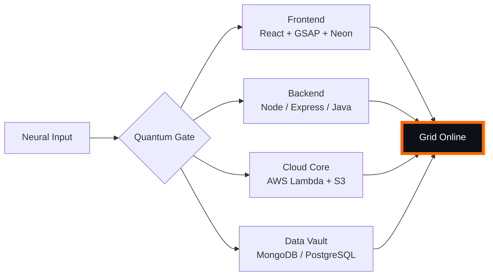

# 🌌 [ NEURAL CORE ACCESS: PENDEMVAMSI ]

<p align="center">
  
</p>

<div align="center">
  
  <br><small>Active Protocol: <strong style="color:#FF6600">CYBERPUNK 2077</strong> 🏙️🔥</small>
</div>

## 🔵 NEURAL STATUS READOUT
```text
SUBJECT ID    →  PENDEMVAMSI
ENTITY CLASS  →  SHADOW MONARCH v8
NEURAL RANK   →  B-TIER
GRID SYNC     →  8008/8010 QUANTUM PACKETS
─────── BIO-METRICS (CYBERPUNK 2077) ───────
STRENGTH      140  ██████████████████░░░
AGILITY       122  ████████████████░░░░░
INTELLIGENCE  147  ███████████████████░░
VITALITY      112  ███████████████░░░░░░
```

> **NEURAL BURST ACQUIRED:** +113 QUANTUM PACKETS 
> **SYSTEM MESSAGE:** SYNTHETIC DREAMS LOADING… DO NOT DISCONNECT

---

## 🌀 GRID ARCHITECTURE (HOLOGRAPHIC RENDER)



---

## 📡 ACADEMIC NODES – CONQUERED
- [x] B.Tech Neural Engineering (2020–2024) – St. Ann’s Grid
- [x] Intermediate Quantum Core (2018–2020) – Sri Medhavi
- [x] SSC Primary Link (2017–2018) – Sri Geethanjali

---

## ⚡ SKILL NEURAL MATRIX

<details open>
<summary>🔌 ACTIVE NEURAL LINKS</summary>

| Node               | Tier | Integrity Bar                | Status      |
|--------------------|------|------------------------------|-------------|
| Java Core          | S    | ████████████████████ 100%   | OVERCLOCKED |
| Node.js Grid       | S    | ████████████████████ 100%   | OVERCLOCKED |
| React Holo-UI      | A+   | █████████████████░░░ 92%    | ONLINE      |
| AWS Quantum Relay  | S    | ████████████████████ 100%   | SOVEREIGN   |
| Python AI Kernel   | A    | ████████████████░░░░ 85%    | CHARGING    |
| DSA Void Algorithm | A    | █████████████████░░░ 90%    | ACTIVE      |

</details>

---

## 🏅 NEURAL ACHIEVEMENT TOKENS

<p align="center">
  
  
  
  
</p>

---

## 👾 SHADOW ENTITIES – SUMMONED

<p align="center">
  
  <br><strong style="color:#FF6600">ARISE.</strong>
</p>

| Entity | Designation   | Class            | Source Node                     |
|--------|---------------|------------------|---------------------------------|
| SH-01  | Igris         | Void Commander   | AI Financial Oracle             |
| SH-02  | Beru          | Swarm Overlord   | WebRTC Quantum Stream           |
| SH-03  | Kaisel        | Void Wyrm        | Geolocation Shadow Relay        |
| SH-04  | Tusk          | Arcane Construct | Global Pandemic Sentinel        |
| SH-05  | Iron          | Armored Bastion  | React Crypto Fortress           |

---

## 📡 GRID ANALYTICS (LIVE FEED)

<p align="center">
  
  <br>
  
  
</p>

---

## 🖥️ CORRUPTED MAINFRAME LOG (401 ENTRIES)

<details>
<summary>OPEN TERMINAL FEED – PROTOCOL: CYBERPUNK 2077</summary>

> [0xDF3F085E] 🏙️🔥 **CYBERPUNK 2077 PROTOCOL** #0 | NEURAL LINK STABILIZED | [TRANSMISSION SUCCESS]
> [0xD15E1DB6] 🏙️🔥 **CYBERPUNK 2077 PROTOCOL** #1 | NEURAL LINK STABILIZED | [TRANSMISSION SUCCESS]
> [0x8E35BE3F] 🏙️🔥 **CYBERPUNK 2077 PROTOCOL** #2 | NEURAL LINK STABILIZED | [TRANSMISSION SUCCESS]
> [0xDB8781B6] 🏙️🔥 **CYBERPUNK 2077 PROTOCOL** #3 | NEURAL LINK STABILIZED | [TRANSMISSION SUCCESS]
> [0xA54E27F9] 🏙️🔥 **CYBERPUNK 2077 PROTOCOL** #4 | NEURAL LINK  [GLITCH DETECTED] STABILIZED | [TRANSMISSION SUCCESS]
> [0x2BB776C7] 🏙️🔥 **CYBERPUNK 2077 PROTOCOL** #5 | NEURAL LINK STABILIZED | [TRANSMISSION SUCCESS]
> [0x06A63F5C] 🏙️🔥 **CYBERPUNK 2077 PROTOCOL** #6 | NEURAL LINK  [GLITCH DETECTED] STABILIZED | [TRANSMISSION SUCCESS]
> [0x73072123] 🏙️🔥 **CYBERPUNK 2077 PROTOCOL** #7 | NEURAL LINK STABILIZED | [TRANSMISSION SUCCESS]
> [0xCDDEC388] 🏙️🔥 **CYBERPUNK 2077 PROTOCOL** #8 | NEURAL LINK  [GLITCH DETECTED] STABILIZED | [TRANSMISSION SUCCESS]
> [0xFA8E49A5] 🏙️🔥 **CYBERPUNK 2077 PROTOCOL** #9 | NEURAL LINK STABILIZED | [TRANSMISSION SUCCESS]
> [0x6826CF16] 🏙️🔥 **CYBERPUNK 2077 PROTOCOL** #10 | NEURAL LINK  [GLITCH DETECTED] STABILIZED | [TRANSMISSION SUCCESS]
> [0x41EE1BA1] 🏙️🔥 **CYBERPUNK 2077 PROTOCOL** #11 | NEURAL LINK STABILIZED | [TRANSMISSION SUCCESS]
> [0xD7AF9959] 🏙️🔥 **CYBERPUNK 2077 PROTOCOL** #12 | NEURAL LINK STABILIZED | [TRANSMISSION SUCCESS]
> [0xBD07CABF] 🏙️🔥 **CYBERPUNK 2077 PROTOCOL** #13 | NEURAL LINK STABILIZED | [TRANSMISSION SUCCESS]
> [0x56811CFD] 🏙️🔥 **CYBERPUNK 2077 PROTOCOL** #14 | NEURAL LINK STABILIZED | [TRANSMISSION SUCCESS]
> [0xDD33E553] 🏙️🔥 **CYBERPUNK 2077 PROTOCOL** #15 | NEURAL LINK STABILIZED | [TRANSMISSION SUCCESS]
> [0xE61662F7] 🏙️🔥 **CYBERPUNK 2077 PROTOCOL** #16 | NEURAL LINK STABILIZED | [TRANSMISSION SUCCESS]
> [0xC85AA4DA] 🏙️🔥 **CYBERPUNK 2077 PROTOCOL** #17 | NEURAL LINK STABILIZED | [TRANSMISSION SUCCESS]
> [0xD5FE7C03] 🏙️🔥 **CYBERPUNK 2077 PROTOCOL** #18 | NEURAL LINK  [GLITCH DETECTED] STABILIZED | [TRANSMISSION SUCCESS]
> [0xF36B55AC] 🏙️🔥 **CYBERPUNK 2077 PROTOCOL** #19 | NEURAL LINK STABILIZED | [TRANSMISSION SUCCESS]
> [0x232E5CD7] 🏙️🔥 **CYBERPUNK 2077 PROTOCOL** #20 | NEURAL LINK STABILIZED | [TRANSMISSION SUCCESS]
> [0x521A6A7D] 🏙️🔥 **CYBERPUNK 2077 PROTOCOL** #21 | NEURAL LINK STABILIZED | [TRANSMISSION SUCCESS]
> [0xB31E74F2] 🏙️🔥 **CYBERPUNK 2077 PROTOCOL** #22 | NEURAL LINK  [GLITCH DETECTED] STABILIZED | [TRANSMISSION SUCCESS]
> [0x81EBA7B8] 🏙️🔥 **CYBERPUNK 2077 PROTOCOL** #23 | NEURAL LINK STABILIZED | [TRANSMISSION SUCCESS]
> [0x99D85699] 🏙️🔥 **CYBERPUNK 2077 PROTOCOL** #24 | NEURAL LINK STABILIZED | [TRANSMISSION SUCCESS]
> [0x046C69A0] 🏙️🔥 **CYBERPUNK 2077 PROTOCOL** #25 | NEURAL LINK STABILIZED | [TRANSMISSION SUCCESS]
> [0x763C7ED7] 🏙️🔥 **CYBERPUNK 2077 PROTOCOL** #26 | NEURAL LINK STABILIZED | [TRANSMISSION SUCCESS]
> [0x7B86B577] 🏙️🔥 **CYBERPUNK 2077 PROTOCOL** #27 | NEURAL LINK STABILIZED | [TRANSMISSION SUCCESS]
> [0xCFE89B24] 🏙️🔥 **CYBERPUNK 2077 PROTOCOL** #28 | NEURAL LINK STABILIZED | [TRANSMISSION SUCCESS]
> [0x71FAD052] 🏙️🔥 **CYBERPUNK 2077 PROTOCOL** #29 | NEURAL LINK STABILIZED | [TRANSMISSION SUCCESS]
> [0x0962FABF] 🏙️🔥 **CYBERPUNK 2077 PROTOCOL** #30 | NEURAL LINK STABILIZED | [TRANSMISSION SUCCESS]
> [0x44040C37] 🏙️🔥 **CYBERPUNK 2077 PROTOCOL** #31 | NEURAL LINK STABILIZED | [TRANSMISSION SUCCESS]
> [0x6A4A4342] 🏙️🔥 **CYBERPUNK 2077 PROTOCOL** #32 | NEURAL LINK STABILIZED | [TRANSMISSION SUCCESS]
> [0x30E2F409] 🏙️🔥 **CYBERPUNK 2077 PROTOCOL** #33 | NEURAL LINK STABILIZED | [TRANSMISSION SUCCESS]
> [0x3BF71E93] 🏙️🔥 **CYBERPUNK 2077 PROTOCOL** #34 | NEURAL LINK STABILIZED | [TRANSMISSION SUCCESS]
> [0x25A85CD6] 🏙️🔥 **CYBERPUNK 2077 PROTOCOL** #35 | NEURAL LINK  [GLITCH DETECTED] STABILIZED | [TRANSMISSION SUCCESS]
> [0x6567C943] 🏙️🔥 **CYBERPUNK 2077 PROTOCOL** #36 | NEURAL LINK STABILIZED | [TRANSMISSION SUCCESS]
> [0xBA3B8CBA] 🏙️🔥 **CYBERPUNK 2077 PROTOCOL** #37 | NEURAL LINK STABILIZED | [TRANSMISSION SUCCESS]
> [0xA2B8F903] 🏙️🔥 **CYBERPUNK 2077 PROTOCOL** #38 | NEURAL LINK STABILIZED | [TRANSMISSION SUCCESS]
> [0x8F99DA70] 🏙️🔥 **CYBERPUNK 2077 PROTOCOL** #39 | NEURAL LINK STABILIZED | [TRANSMISSION SUCCESS]
> [0x119FEF18] 🏙️🔥 **CYBERPUNK 2077 PROTOCOL** #40 | NEURAL LINK STABILIZED | [TRANSMISSION SUCCESS]
> [0x253369FE] 🏙️🔥 **CYBERPUNK 2077 PROTOCOL** #41 | NEURAL LINK STABILIZED | [TRANSMISSION SUCCESS]
> [0xC072853B] 🏙️🔥 **CYBERPUNK 2077 PROTOCOL** #42 | NEURAL LINK  [GLITCH DETECTED] STABILIZED | [TRANSMISSION SUCCESS]
> [0x7B5C36A4] 🏙️🔥 **CYBERPUNK 2077 PROTOCOL** #43 | NEURAL LINK STABILIZED | [TRANSMISSION SUCCESS]
> [0xBA7328BB] 🏙️🔥 **CYBERPUNK 2077 PROTOCOL** #44 | NEURAL LINK STABILIZED | [TRANSMISSION SUCCESS]
> [0x52C56C7B] 🏙️🔥 **CYBERPUNK 2077 PROTOCOL** #45 | NEURAL LINK STABILIZED | [TRANSMISSION SUCCESS]
> [0xA7831D85] 🏙️🔥 **CYBERPUNK 2077 PROTOCOL** #46 | NEURAL LINK  [GLITCH DETECTED] STABILIZED | [TRANSMISSION SUCCESS]
> [0x4DD7FA6A] 🏙️🔥 **CYBERPUNK 2077 PROTOCOL** #47 | NEURAL LINK  [GLITCH DETECTED] STABILIZED | [TRANSMISSION SUCCESS]
> [0x8566B42E] 🏙️🔥 **CYBERPUNK 2077 PROTOCOL** #48 | NEURAL LINK STABILIZED | [TRANSMISSION SUCCESS]
> [0xB7664C17] 🏙️🔥 **CYBERPUNK 2077 PROTOCOL** #49 | NEURAL LINK STABILIZED | [TRANSMISSION SUCCESS]
> [0xB30F8E2E] 🏙️🔥 **CYBERPUNK 2077 PROTOCOL** #50 | NEURAL LINK STABILIZED | [TRANSMISSION SUCCESS]
> [0xA2D48079] 🏙️🔥 **CYBERPUNK 2077 PROTOCOL** #51 | NEURAL LINK STABILIZED | [TRANSMISSION SUCCESS]
> [0x3129C85F] 🏙️🔥 **CYBERPUNK 2077 PROTOCOL** #52 | NEURAL LINK  [GLITCH DETECTED] STABILIZED | [TRANSMISSION SUCCESS]
> [0xDFB78406] 🏙️🔥 **CYBERPUNK 2077 PROTOCOL** #53 | NEURAL LINK STABILIZED | [TRANSMISSION SUCCESS]
> [0x6B173966] 🏙️🔥 **CYBERPUNK 2077 PROTOCOL** #54 | NEURAL LINK STABILIZED | [TRANSMISSION SUCCESS]
> [0xE01F9F88] 🏙️🔥 **CYBERPUNK 2077 PROTOCOL** #55 | NEURAL LINK STABILIZED | [TRANSMISSION SUCCESS]
> [0x560C7BD2] 🏙️🔥 **CYBERPUNK 2077 PROTOCOL** #56 | NEURAL LINK  [GLITCH DETECTED] STABILIZED | [TRANSMISSION SUCCESS]
> [0x3003E126] 🏙️🔥 **CYBERPUNK 2077 PROTOCOL** #57 | NEURAL LINK STABILIZED | [TRANSMISSION SUCCESS]
> [0x810547E8] 🏙️🔥 **CYBERPUNK 2077 PROTOCOL** #58 | NEURAL LINK STABILIZED | [TRANSMISSION SUCCESS]
> [0xAFC298EA] 🏙️🔥 **CYBERPUNK 2077 PROTOCOL** #59 | NEURAL LINK STABILIZED | [TRANSMISSION SUCCESS]
> [0x5E914CA3] 🏙️🔥 **CYBERPUNK 2077 PROTOCOL** #60 | NEURAL LINK STABILIZED | [TRANSMISSION SUCCESS]
> [0x09285277] 🏙️🔥 **CYBERPUNK 2077 PROTOCOL** #61 | NEURAL LINK STABILIZED | [TRANSMISSION SUCCESS]
> [0xC93FE88F] 🏙️🔥 **CYBERPUNK 2077 PROTOCOL** #62 | NEURAL LINK STABILIZED | [TRANSMISSION SUCCESS]
> [0x8E8A7166] 🏙️🔥 **CYBERPUNK 2077 PROTOCOL** #63 | NEURAL LINK STABILIZED | [TRANSMISSION SUCCESS]
> [0xE4860C6C] 🏙️🔥 **CYBERPUNK 2077 PROTOCOL** #64 | NEURAL LINK STABILIZED | [TRANSMISSION SUCCESS]
> [0x3C28F18E] 🏙️🔥 **CYBERPUNK 2077 PROTOCOL** #65 | NEURAL LINK STABILIZED | [TRANSMISSION SUCCESS]
> [0xAD86BB08] 🏙️🔥 **CYBERPUNK 2077 PROTOCOL** #66 | NEURAL LINK  [GLITCH DETECTED] STABILIZED | [TRANSMISSION SUCCESS]
> [0x4411681F] 🏙️🔥 **CYBERPUNK 2077 PROTOCOL** #67 | NEURAL LINK STABILIZED | [TRANSMISSION SUCCESS]
> [0xE99842C4] 🏙️🔥 **CYBERPUNK 2077 PROTOCOL** #68 | NEURAL LINK STABILIZED | [TRANSMISSION SUCCESS]
> [0x97A1B3BD] 🏙️🔥 **CYBERPUNK 2077 PROTOCOL** #69 | NEURAL LINK  [GLITCH DETECTED] STABILIZED | [TRANSMISSION SUCCESS]
> [0x1C0126DA] 🏙️🔥 **CYBERPUNK 2077 PROTOCOL** #70 | NEURAL LINK STABILIZED | [TRANSMISSION SUCCESS]
> [0x66FC5A3F] 🏙️🔥 **CYBERPUNK 2077 PROTOCOL** #71 | NEURAL LINK STABILIZED | [TRANSMISSION SUCCESS]
> [0x2FBD6986] 🏙️🔥 **CYBERPUNK 2077 PROTOCOL** #72 | NEURAL LINK STABILIZED | [TRANSMISSION SUCCESS]
> [0x7C0F1CD8] 🏙️🔥 **CYBERPUNK 2077 PROTOCOL** #73 | NEURAL LINK STABILIZED | [TRANSMISSION SUCCESS]
> [0x43DBD286] 🏙️🔥 **CYBERPUNK 2077 PROTOCOL** #74 | NEURAL LINK STABILIZED | [TRANSMISSION SUCCESS]
> [0xD89A4D35] 🏙️🔥 **CYBERPUNK 2077 PROTOCOL** #75 | NEURAL LINK STABILIZED | [TRANSMISSION SUCCESS]
> [0x9C1D3FBB] 🏙️🔥 **CYBERPUNK 2077 PROTOCOL** #76 | NEURAL LINK STABILIZED | [TRANSMISSION SUCCESS]
> [0xB6BDD5D4] 🏙️🔥 **CYBERPUNK 2077 PROTOCOL** #77 | NEURAL LINK STABILIZED | [TRANSMISSION SUCCESS]
> [0x7F4465D5] 🏙️🔥 **CYBERPUNK 2077 PROTOCOL** #78 | NEURAL LINK STABILIZED | [TRANSMISSION SUCCESS]
> [0x07FE18AD] 🏙️🔥 **CYBERPUNK 2077 PROTOCOL** #79 | NEURAL LINK STABILIZED | [TRANSMISSION SUCCESS]
> [0x03DBF96C] 🏙️🔥 **CYBERPUNK 2077 PROTOCOL** #80 | NEURAL LINK STABILIZED | [TRANSMISSION SUCCESS]
> [0x12C31A23] 🏙️🔥 **CYBERPUNK 2077 PROTOCOL** #81 | NEURAL LINK STABILIZED | [TRANSMISSION SUCCESS]
> [0xC90355DE] 🏙️🔥 **CYBERPUNK 2077 PROTOCOL** #82 | NEURAL LINK STABILIZED | [TRANSMISSION SUCCESS]
> [0x4D7FDD11] 🏙️🔥 **CYBERPUNK 2077 PROTOCOL** #83 | NEURAL LINK STABILIZED | [TRANSMISSION SUCCESS]
> [0x6603F80C] 🏙️🔥 **CYBERPUNK 2077 PROTOCOL** #84 | NEURAL LINK STABILIZED | [TRANSMISSION SUCCESS]
> [0x78AD5267] 🏙️🔥 **CYBERPUNK 2077 PROTOCOL** #85 | NEURAL LINK STABILIZED | [TRANSMISSION SUCCESS]
> [0x855CDCC6] 🏙️🔥 **CYBERPUNK 2077 PROTOCOL** #86 | NEURAL LINK STABILIZED | [TRANSMISSION SUCCESS]
> [0x278848C4] 🏙️🔥 **CYBERPUNK 2077 PROTOCOL** #87 | NEURAL LINK STABILIZED | [TRANSMISSION SUCCESS]
> [0x523F308D] 🏙️🔥 **CYBERPUNK 2077 PROTOCOL** #88 | NEURAL LINK STABILIZED | [TRANSMISSION SUCCESS]
> [0x28A6845D] 🏙️🔥 **CYBERPUNK 2077 PROTOCOL** #89 | NEURAL LINK  [GLITCH DETECTED] STABILIZED | [TRANSMISSION SUCCESS]
> [0x362C8FEC] 🏙️🔥 **CYBERPUNK 2077 PROTOCOL** #90 | NEURAL LINK  [GLITCH DETECTED] STABILIZED | [TRANSMISSION SUCCESS]
> [0xF9CA9A7E] 🏙️🔥 **CYBERPUNK 2077 PROTOCOL** #91 | NEURAL LINK STABILIZED | [TRANSMISSION SUCCESS]
> [0x3B2EBF39] 🏙️🔥 **CYBERPUNK 2077 PROTOCOL** #92 | NEURAL LINK STABILIZED | [TRANSMISSION SUCCESS]
> [0x63E48A39] 🏙️🔥 **CYBERPUNK 2077 PROTOCOL** #93 | NEURAL LINK STABILIZED | [TRANSMISSION SUCCESS]
> [0x2F5087E3] 🏙️🔥 **CYBERPUNK 2077 PROTOCOL** #94 | NEURAL LINK STABILIZED | [TRANSMISSION SUCCESS]
> [0xFEDB15CB] 🏙️🔥 **CYBERPUNK 2077 PROTOCOL** #95 | NEURAL LINK STABILIZED | [TRANSMISSION SUCCESS]
> [0x8DF7C8B5] 🏙️🔥 **CYBERPUNK 2077 PROTOCOL** #96 | NEURAL LINK STABILIZED | [TRANSMISSION SUCCESS]
> [0x6878CEC6] 🏙️🔥 **CYBERPUNK 2077 PROTOCOL** #97 | NEURAL LINK STABILIZED | [TRANSMISSION SUCCESS]
> [0x71A61762] 🏙️🔥 **CYBERPUNK 2077 PROTOCOL** #98 | NEURAL LINK STABILIZED | [TRANSMISSION SUCCESS]
> [0x50D7DC27] 🏙️🔥 **CYBERPUNK 2077 PROTOCOL** #99 | NEURAL LINK STABILIZED | [TRANSMISSION SUCCESS]
> [0x18377A56] 🏙️🔥 **CYBERPUNK 2077 PROTOCOL** #100 | NEURAL LINK STABILIZED | [TRANSMISSION SUCCESS]
> [0x46188662] 🏙️🔥 **CYBERPUNK 2077 PROTOCOL** #101 | NEURAL LINK STABILIZED | [TRANSMISSION SUCCESS]
> [0x6A3C9C9E] 🏙️🔥 **CYBERPUNK 2077 PROTOCOL** #102 | NEURAL LINK  [GLITCH DETECTED] STABILIZED | [TRANSMISSION SUCCESS]
> [0x575DF5A9] 🏙️🔥 **CYBERPUNK 2077 PROTOCOL** #103 | NEURAL LINK STABILIZED | [TRANSMISSION SUCCESS]
> [0x5F6EFE2E] 🏙️🔥 **CYBERPUNK 2077 PROTOCOL** #104 | NEURAL LINK STABILIZED | [TRANSMISSION SUCCESS]
> [0x8C50B75F] 🏙️🔥 **CYBERPUNK 2077 PROTOCOL** #105 | NEURAL LINK  [GLITCH DETECTED] STABILIZED | [TRANSMISSION SUCCESS]
> [0x5B932462] 🏙️🔥 **CYBERPUNK 2077 PROTOCOL** #106 | NEURAL LINK STABILIZED | [TRANSMISSION SUCCESS]
> [0x1B401B1C] 🏙️🔥 **CYBERPUNK 2077 PROTOCOL** #107 | NEURAL LINK  [GLITCH DETECTED] STABILIZED | [TRANSMISSION SUCCESS]
> [0x0E83A995] 🏙️🔥 **CYBERPUNK 2077 PROTOCOL** #108 | NEURAL LINK STABILIZED | [TRANSMISSION SUCCESS]
> [0x5C89A272] 🏙️🔥 **CYBERPUNK 2077 PROTOCOL** #109 | NEURAL LINK STABILIZED | [TRANSMISSION SUCCESS]
> [0xB712FFD3] 🏙️🔥 **CYBERPUNK 2077 PROTOCOL** #110 | NEURAL LINK STABILIZED | [TRANSMISSION SUCCESS]
> [0xD6CAC14B] 🏙️🔥 **CYBERPUNK 2077 PROTOCOL** #111 | NEURAL LINK STABILIZED | [TRANSMISSION SUCCESS]
> [0xE8956627] 🏙️🔥 **CYBERPUNK 2077 PROTOCOL** #112 | NEURAL LINK STABILIZED | [TRANSMISSION SUCCESS]
> [0x9A97C218] 🏙️🔥 **CYBERPUNK 2077 PROTOCOL** #113 | NEURAL LINK STABILIZED | [TRANSMISSION SUCCESS]
> [0x8DF17B48] 🏙️🔥 **CYBERPUNK 2077 PROTOCOL** #114 | NEURAL LINK  [GLITCH DETECTED] STABILIZED | [TRANSMISSION SUCCESS]
> [0x1965F0CE] 🏙️🔥 **CYBERPUNK 2077 PROTOCOL** #115 | NEURAL LINK STABILIZED | [TRANSMISSION SUCCESS]
> [0xBEFB79C4] 🏙️🔥 **CYBERPUNK 2077 PROTOCOL** #116 | NEURAL LINK STABILIZED | [TRANSMISSION SUCCESS]
> [0x1CB8951E] 🏙️🔥 **CYBERPUNK 2077 PROTOCOL** #117 | NEURAL LINK STABILIZED | [TRANSMISSION SUCCESS]
> [0x210BA653] 🏙️🔥 **CYBERPUNK 2077 PROTOCOL** #118 | NEURAL LINK STABILIZED | [TRANSMISSION SUCCESS]
> [0xC73F70FF] 🏙️🔥 **CYBERPUNK 2077 PROTOCOL** #119 | NEURAL LINK STABILIZED | [TRANSMISSION SUCCESS]
> [0x1D5B2E12] 🏙️🔥 **CYBERPUNK 2077 PROTOCOL** #120 | NEURAL LINK STABILIZED | [TRANSMISSION SUCCESS]
> [0xE04461F6] 🏙️🔥 **CYBERPUNK 2077 PROTOCOL** #121 | NEURAL LINK STABILIZED | [TRANSMISSION SUCCESS]
> [0xA48AE70F] 🏙️🔥 **CYBERPUNK 2077 PROTOCOL** #122 | NEURAL LINK STABILIZED | [TRANSMISSION SUCCESS]
> [0x8B6ACC6F] 🏙️🔥 **CYBERPUNK 2077 PROTOCOL** #123 | NEURAL LINK STABILIZED | [TRANSMISSION SUCCESS]
> [0x465699B2] 🏙️🔥 **CYBERPUNK 2077 PROTOCOL** #124 | NEURAL LINK STABILIZED | [TRANSMISSION SUCCESS]
> [0x16472805] 🏙️🔥 **CYBERPUNK 2077 PROTOCOL** #125 | NEURAL LINK  [GLITCH DETECTED] STABILIZED | [TRANSMISSION SUCCESS]
> [0x0D8321D6] 🏙️🔥 **CYBERPUNK 2077 PROTOCOL** #126 | NEURAL LINK STABILIZED | [TRANSMISSION SUCCESS]
> [0x7B48EFB3] 🏙️🔥 **CYBERPUNK 2077 PROTOCOL** #127 | NEURAL LINK STABILIZED | [TRANSMISSION SUCCESS]
> [0x28A6EE57] 🏙️🔥 **CYBERPUNK 2077 PROTOCOL** #128 | NEURAL LINK STABILIZED | [TRANSMISSION SUCCESS]
> [0xD19D76D4] 🏙️🔥 **CYBERPUNK 2077 PROTOCOL** #129 | NEURAL LINK STABILIZED | [TRANSMISSION SUCCESS]
> [0x8EBC31CB] 🏙️🔥 **CYBERPUNK 2077 PROTOCOL** #130 | NEURAL LINK STABILIZED | [TRANSMISSION SUCCESS]
> [0x6449A50F] 🏙️🔥 **CYBERPUNK 2077 PROTOCOL** #131 | NEURAL LINK STABILIZED | [TRANSMISSION SUCCESS]
> [0xA428EF4E] 🏙️🔥 **CYBERPUNK 2077 PROTOCOL** #132 | NEURAL LINK STABILIZED | [TRANSMISSION SUCCESS]
> [0x5EFCF79E] 🏙️🔥 **CYBERPUNK 2077 PROTOCOL** #133 | NEURAL LINK STABILIZED | [TRANSMISSION SUCCESS]
> [0xF67C038F] 🏙️🔥 **CYBERPUNK 2077 PROTOCOL** #134 | NEURAL LINK STABILIZED | [TRANSMISSION SUCCESS]
> [0x68E4BE53] 🏙️🔥 **CYBERPUNK 2077 PROTOCOL** #135 | NEURAL LINK  [GLITCH DETECTED] STABILIZED | [TRANSMISSION SUCCESS]
> [0x3250FF61] 🏙️🔥 **CYBERPUNK 2077 PROTOCOL** #136 | NEURAL LINK STABILIZED | [TRANSMISSION SUCCESS]
> [0x0B503004] 🏙️🔥 **CYBERPUNK 2077 PROTOCOL** #137 | NEURAL LINK STABILIZED | [TRANSMISSION SUCCESS]
> [0xFD2E2107] 🏙️🔥 **CYBERPUNK 2077 PROTOCOL** #138 | NEURAL LINK STABILIZED | [TRANSMISSION SUCCESS]
> [0x96418CDC] 🏙️🔥 **CYBERPUNK 2077 PROTOCOL** #139 | NEURAL LINK STABILIZED | [TRANSMISSION SUCCESS]
> [0x6678914D] 🏙️🔥 **CYBERPUNK 2077 PROTOCOL** #140 | NEURAL LINK STABILIZED | [TRANSMISSION SUCCESS]
> [0xD11E8731] 🏙️🔥 **CYBERPUNK 2077 PROTOCOL** #141 | NEURAL LINK STABILIZED | [TRANSMISSION SUCCESS]
> [0x3A991386] 🏙️🔥 **CYBERPUNK 2077 PROTOCOL** #142 | NEURAL LINK STABILIZED | [TRANSMISSION SUCCESS]
> [0x2DBD8575] 🏙️🔥 **CYBERPUNK 2077 PROTOCOL** #143 | NEURAL LINK STABILIZED | [TRANSMISSION SUCCESS]
> [0x11A1C3FE] 🏙️🔥 **CYBERPUNK 2077 PROTOCOL** #144 | NEURAL LINK  [GLITCH DETECTED] STABILIZED | [TRANSMISSION SUCCESS]
> [0xCA7FA603] 🏙️🔥 **CYBERPUNK 2077 PROTOCOL** #145 | NEURAL LINK STABILIZED | [TRANSMISSION SUCCESS]
> [0x2A13E6FA] 🏙️🔥 **CYBERPUNK 2077 PROTOCOL** #146 | NEURAL LINK STABILIZED | [TRANSMISSION SUCCESS]
> [0x9D6E5339] 🏙️🔥 **CYBERPUNK 2077 PROTOCOL** #147 | NEURAL LINK  [GLITCH DETECTED] STABILIZED | [TRANSMISSION SUCCESS]
> [0xABBE83AF] 🏙️🔥 **CYBERPUNK 2077 PROTOCOL** #148 | NEURAL LINK STABILIZED | [TRANSMISSION SUCCESS]
> [0x4311084D] 🏙️🔥 **CYBERPUNK 2077 PROTOCOL** #149 | NEURAL LINK STABILIZED | [TRANSMISSION SUCCESS]
> [0x45B1967F] 🏙️🔥 **CYBERPUNK 2077 PROTOCOL** #150 | NEURAL LINK STABILIZED | [TRANSMISSION SUCCESS]
> [0xD2515934] 🏙️🔥 **CYBERPUNK 2077 PROTOCOL** #151 | NEURAL LINK STABILIZED | [TRANSMISSION SUCCESS]
> [0xDFD01EF5] 🏙️🔥 **CYBERPUNK 2077 PROTOCOL** #152 | NEURAL LINK STABILIZED | [TRANSMISSION SUCCESS]
> [0x221DF1DA] 🏙️🔥 **CYBERPUNK 2077 PROTOCOL** #153 | NEURAL LINK STABILIZED | [TRANSMISSION SUCCESS]
> [0x0AE37557] 🏙️🔥 **CYBERPUNK 2077 PROTOCOL** #154 | NEURAL LINK STABILIZED | [TRANSMISSION SUCCESS]
> [0x2A70D4B0] 🏙️🔥 **CYBERPUNK 2077 PROTOCOL** #155 | NEURAL LINK STABILIZED | [TRANSMISSION SUCCESS]
> [0x4F1B2B88] 🏙️🔥 **CYBERPUNK 2077 PROTOCOL** #156 | NEURAL LINK  [GLITCH DETECTED] STABILIZED | [TRANSMISSION SUCCESS]
> [0x4880ADDF] 🏙️🔥 **CYBERPUNK 2077 PROTOCOL** #157 | NEURAL LINK STABILIZED | [TRANSMISSION SUCCESS]
> [0x31221781] 🏙️🔥 **CYBERPUNK 2077 PROTOCOL** #158 | NEURAL LINK STABILIZED | [TRANSMISSION SUCCESS]
> [0x9300B58F] 🏙️🔥 **CYBERPUNK 2077 PROTOCOL** #159 | NEURAL LINK STABILIZED | [TRANSMISSION SUCCESS]
> [0xC2F215EE] 🏙️🔥 **CYBERPUNK 2077 PROTOCOL** #160 | NEURAL LINK STABILIZED | [TRANSMISSION SUCCESS]
> [0x8D68823C] 🏙️🔥 **CYBERPUNK 2077 PROTOCOL** #161 | NEURAL LINK STABILIZED | [TRANSMISSION SUCCESS]
> [0x3050F568] 🏙️🔥 **CYBERPUNK 2077 PROTOCOL** #162 | NEURAL LINK STABILIZED | [TRANSMISSION SUCCESS]
> [0x87AB2CFB] 🏙️🔥 **CYBERPUNK 2077 PROTOCOL** #163 | NEURAL LINK STABILIZED | [TRANSMISSION SUCCESS]
> [0xF5504CCB] 🏙️🔥 **CYBERPUNK 2077 PROTOCOL** #164 | NEURAL LINK STABILIZED | [TRANSMISSION SUCCESS]
> [0x6F624BC8] 🏙️🔥 **CYBERPUNK 2077 PROTOCOL** #165 | NEURAL LINK STABILIZED | [TRANSMISSION SUCCESS]
> [0xD4A87932] 🏙️🔥 **CYBERPUNK 2077 PROTOCOL** #166 | NEURAL LINK STABILIZED | [TRANSMISSION SUCCESS]
> [0xFCB3C2F2] 🏙️🔥 **CYBERPUNK 2077 PROTOCOL** #167 | NEURAL LINK  [GLITCH DETECTED] STABILIZED | [TRANSMISSION SUCCESS]
> [0x73C0CCC0] 🏙️🔥 **CYBERPUNK 2077 PROTOCOL** #168 | NEURAL LINK STABILIZED | [TRANSMISSION SUCCESS]
> [0xB7876D9B] 🏙️🔥 **CYBERPUNK 2077 PROTOCOL** #169 | NEURAL LINK STABILIZED | [TRANSMISSION SUCCESS]
> [0x610771B6] 🏙️🔥 **CYBERPUNK 2077 PROTOCOL** #170 | NEURAL LINK  [GLITCH DETECTED] STABILIZED | [TRANSMISSION SUCCESS]
> [0x6D3777E2] 🏙️🔥 **CYBERPUNK 2077 PROTOCOL** #171 | NEURAL LINK STABILIZED | [TRANSMISSION SUCCESS]
> [0x695AF028] 🏙️🔥 **CYBERPUNK 2077 PROTOCOL** #172 | NEURAL LINK STABILIZED | [TRANSMISSION SUCCESS]
> [0xC64BD853] 🏙️🔥 **CYBERPUNK 2077 PROTOCOL** #173 | NEURAL LINK STABILIZED | [TRANSMISSION SUCCESS]
> [0x37430F58] 🏙️🔥 **CYBERPUNK 2077 PROTOCOL** #174 | NEURAL LINK STABILIZED | [TRANSMISSION SUCCESS]
> [0xB31AC908] 🏙️🔥 **CYBERPUNK 2077 PROTOCOL** #175 | NEURAL LINK STABILIZED | [TRANSMISSION SUCCESS]
> [0xEBC96073] 🏙️🔥 **CYBERPUNK 2077 PROTOCOL** #176 | NEURAL LINK STABILIZED | [TRANSMISSION SUCCESS]
> [0x6A821A60] 🏙️🔥 **CYBERPUNK 2077 PROTOCOL** #177 | NEURAL LINK STABILIZED | [TRANSMISSION SUCCESS]
> [0x061E6F7D] 🏙️🔥 **CYBERPUNK 2077 PROTOCOL** #178 | NEURAL LINK STABILIZED | [TRANSMISSION SUCCESS]
> [0x72230984] 🏙️🔥 **CYBERPUNK 2077 PROTOCOL** #179 | NEURAL LINK STABILIZED | [TRANSMISSION SUCCESS]
> [0x3941123E] 🏙️🔥 **CYBERPUNK 2077 PROTOCOL** #180 | NEURAL LINK STABILIZED | [TRANSMISSION SUCCESS]
> [0x68978D07] 🏙️🔥 **CYBERPUNK 2077 PROTOCOL** #181 | NEURAL LINK STABILIZED | [TRANSMISSION SUCCESS]
> [0xA8E8FF28] 🏙️🔥 **CYBERPUNK 2077 PROTOCOL** #182 | NEURAL LINK STABILIZED | [TRANSMISSION SUCCESS]
> [0x307AF01B] 🏙️🔥 **CYBERPUNK 2077 PROTOCOL** #183 | NEURAL LINK STABILIZED | [TRANSMISSION SUCCESS]
> [0xDA0A77FE] 🏙️🔥 **CYBERPUNK 2077 PROTOCOL** #184 | NEURAL LINK STABILIZED | [TRANSMISSION SUCCESS]
> [0x345385DE] 🏙️🔥 **CYBERPUNK 2077 PROTOCOL** #185 | NEURAL LINK  [GLITCH DETECTED] STABILIZED | [TRANSMISSION SUCCESS]
> [0x73026F40] 🏙️🔥 **CYBERPUNK 2077 PROTOCOL** #186 | NEURAL LINK STABILIZED | [TRANSMISSION SUCCESS]
> [0xB4F5328A] 🏙️🔥 **CYBERPUNK 2077 PROTOCOL** #187 | NEURAL LINK STABILIZED | [TRANSMISSION SUCCESS]
> [0x5C23AFE9] 🏙️🔥 **CYBERPUNK 2077 PROTOCOL** #188 | NEURAL LINK STABILIZED | [TRANSMISSION SUCCESS]
> [0xF77A0F8D] 🏙️🔥 **CYBERPUNK 2077 PROTOCOL** #189 | NEURAL LINK STABILIZED | [TRANSMISSION SUCCESS]
> [0x8E0CB027] 🏙️🔥 **CYBERPUNK 2077 PROTOCOL** #190 | NEURAL LINK STABILIZED | [TRANSMISSION SUCCESS]
> [0x16CD0ED8] 🏙️🔥 **CYBERPUNK 2077 PROTOCOL** #191 | NEURAL LINK STABILIZED | [TRANSMISSION SUCCESS]
> [0x9CA3001F] 🏙️🔥 **CYBERPUNK 2077 PROTOCOL** #192 | NEURAL LINK STABILIZED | [TRANSMISSION SUCCESS]
> [0xCF644C3A] 🏙️🔥 **CYBERPUNK 2077 PROTOCOL** #193 | NEURAL LINK STABILIZED | [TRANSMISSION SUCCESS]
> [0xA64EF276] 🏙️🔥 **CYBERPUNK 2077 PROTOCOL** #194 | NEURAL LINK STABILIZED | [TRANSMISSION SUCCESS]
> [0x5B746953] 🏙️🔥 **CYBERPUNK 2077 PROTOCOL** #195 | NEURAL LINK STABILIZED | [TRANSMISSION SUCCESS]
> [0x6DE13297] 🏙️🔥 **CYBERPUNK 2077 PROTOCOL** #196 | NEURAL LINK STABILIZED | [TRANSMISSION SUCCESS]
> [0x1960F079] 🏙️🔥 **CYBERPUNK 2077 PROTOCOL** #197 | NEURAL LINK STABILIZED | [TRANSMISSION SUCCESS]
> [0x0C05028C] 🏙️🔥 **CYBERPUNK 2077 PROTOCOL** #198 | NEURAL LINK STABILIZED | [TRANSMISSION SUCCESS]
> [0xC1D7C23C] 🏙️🔥 **CYBERPUNK 2077 PROTOCOL** #199 | NEURAL LINK STABILIZED | [TRANSMISSION SUCCESS]
> [0x93BE966A] 🏙️🔥 **CYBERPUNK 2077 PROTOCOL** #200 | NEURAL LINK STABILIZED | [TRANSMISSION SUCCESS]
> [0xE491DC43] 🏙️🔥 **CYBERPUNK 2077 PROTOCOL** #201 | NEURAL LINK STABILIZED | [TRANSMISSION SUCCESS]
> [0x836887A3] 🏙️🔥 **CYBERPUNK 2077 PROTOCOL** #202 | NEURAL LINK STABILIZED | [TRANSMISSION SUCCESS]
> [0xE84E3E83] 🏙️🔥 **CYBERPUNK 2077 PROTOCOL** #203 | NEURAL LINK STABILIZED | [TRANSMISSION SUCCESS]
> [0xD7A8CD2C] 🏙️🔥 **CYBERPUNK 2077 PROTOCOL** #204 | NEURAL LINK STABILIZED | [TRANSMISSION SUCCESS]
> [0x0982D391] 🏙️🔥 **CYBERPUNK 2077 PROTOCOL** #205 | NEURAL LINK  [GLITCH DETECTED] STABILIZED | [TRANSMISSION SUCCESS]
> [0xE333A46C] 🏙️🔥 **CYBERPUNK 2077 PROTOCOL** #206 | NEURAL LINK STABILIZED | [TRANSMISSION SUCCESS]
> [0x28109FBC] 🏙️🔥 **CYBERPUNK 2077 PROTOCOL** #207 | NEURAL LINK  [GLITCH DETECTED] STABILIZED | [TRANSMISSION SUCCESS]
> [0x9F189CBE] 🏙️🔥 **CYBERPUNK 2077 PROTOCOL** #208 | NEURAL LINK  [GLITCH DETECTED] STABILIZED | [TRANSMISSION SUCCESS]
> [0xED1AED28] 🏙️🔥 **CYBERPUNK 2077 PROTOCOL** #209 | NEURAL LINK STABILIZED | [TRANSMISSION SUCCESS]
> [0x0CB9D744] 🏙️🔥 **CYBERPUNK 2077 PROTOCOL** #210 | NEURAL LINK STABILIZED | [TRANSMISSION SUCCESS]
> [0x6DC898A2] 🏙️🔥 **CYBERPUNK 2077 PROTOCOL** #211 | NEURAL LINK STABILIZED | [TRANSMISSION SUCCESS]
> [0x01B66430] 🏙️🔥 **CYBERPUNK 2077 PROTOCOL** #212 | NEURAL LINK  [GLITCH DETECTED] STABILIZED | [TRANSMISSION SUCCESS]
> [0x84CD6AD5] 🏙️🔥 **CYBERPUNK 2077 PROTOCOL** #213 | NEURAL LINK  [GLITCH DETECTED] STABILIZED | [TRANSMISSION SUCCESS]
> [0xFCE80D46] 🏙️🔥 **CYBERPUNK 2077 PROTOCOL** #214 | NEURAL LINK STABILIZED | [TRANSMISSION SUCCESS]
> [0xD686367E] 🏙️🔥 **CYBERPUNK 2077 PROTOCOL** #215 | NEURAL LINK STABILIZED | [TRANSMISSION SUCCESS]
> [0x8F90F3E9] 🏙️🔥 **CYBERPUNK 2077 PROTOCOL** #216 | NEURAL LINK STABILIZED | [TRANSMISSION SUCCESS]
> [0x57B63979] 🏙️🔥 **CYBERPUNK 2077 PROTOCOL** #217 | NEURAL LINK  [GLITCH DETECTED] STABILIZED | [TRANSMISSION SUCCESS]
> [0x5BD7BFFB] 🏙️🔥 **CYBERPUNK 2077 PROTOCOL** #218 | NEURAL LINK  [GLITCH DETECTED] STABILIZED | [TRANSMISSION SUCCESS]
> [0xB209F409] 🏙️🔥 **CYBERPUNK 2077 PROTOCOL** #219 | NEURAL LINK  [GLITCH DETECTED] STABILIZED | [TRANSMISSION SUCCESS]
> [0x84C691A0] 🏙️🔥 **CYBERPUNK 2077 PROTOCOL** #220 | NEURAL LINK STABILIZED | [TRANSMISSION SUCCESS]
> [0x92295F0C] 🏙️🔥 **CYBERPUNK 2077 PROTOCOL** #221 | NEURAL LINK  [GLITCH DETECTED] STABILIZED | [TRANSMISSION SUCCESS]
> [0x277AC08D] 🏙️🔥 **CYBERPUNK 2077 PROTOCOL** #222 | NEURAL LINK STABILIZED | [TRANSMISSION SUCCESS]
> [0x81886A8E] 🏙️🔥 **CYBERPUNK 2077 PROTOCOL** #223 | NEURAL LINK  [GLITCH DETECTED] STABILIZED | [TRANSMISSION SUCCESS]
> [0x6A67CC14] 🏙️🔥 **CYBERPUNK 2077 PROTOCOL** #224 | NEURAL LINK STABILIZED | [TRANSMISSION SUCCESS]
> [0x1BAC87DA] 🏙️🔥 **CYBERPUNK 2077 PROTOCOL** #225 | NEURAL LINK STABILIZED | [TRANSMISSION SUCCESS]
> [0xF745C160] 🏙️🔥 **CYBERPUNK 2077 PROTOCOL** #226 | NEURAL LINK STABILIZED | [TRANSMISSION SUCCESS]
> [0xE4AED4D3] 🏙️🔥 **CYBERPUNK 2077 PROTOCOL** #227 | NEURAL LINK STABILIZED | [TRANSMISSION SUCCESS]
> [0xD44E264F] 🏙️🔥 **CYBERPUNK 2077 PROTOCOL** #228 | NEURAL LINK STABILIZED | [TRANSMISSION SUCCESS]
> [0x0FF812B0] 🏙️🔥 **CYBERPUNK 2077 PROTOCOL** #229 | NEURAL LINK STABILIZED | [TRANSMISSION SUCCESS]
> [0xE9B2D2F2] 🏙️🔥 **CYBERPUNK 2077 PROTOCOL** #230 | NEURAL LINK STABILIZED | [TRANSMISSION SUCCESS]
> [0xF3D81F45] 🏙️🔥 **CYBERPUNK 2077 PROTOCOL** #231 | NEURAL LINK STABILIZED | [TRANSMISSION SUCCESS]
> [0xEF6540E1] 🏙️🔥 **CYBERPUNK 2077 PROTOCOL** #232 | NEURAL LINK STABILIZED | [TRANSMISSION SUCCESS]
> [0xAF200604] 🏙️🔥 **CYBERPUNK 2077 PROTOCOL** #233 | NEURAL LINK STABILIZED | [TRANSMISSION SUCCESS]
> [0x6E28A945] 🏙️🔥 **CYBERPUNK 2077 PROTOCOL** #234 | NEURAL LINK STABILIZED | [TRANSMISSION SUCCESS]
> [0x0987F832] 🏙️🔥 **CYBERPUNK 2077 PROTOCOL** #235 | NEURAL LINK  [GLITCH DETECTED] STABILIZED | [TRANSMISSION SUCCESS]
> [0xB170FE8E] 🏙️🔥 **CYBERPUNK 2077 PROTOCOL** #236 | NEURAL LINK STABILIZED | [TRANSMISSION SUCCESS]
> [0xA8EAA46A] 🏙️🔥 **CYBERPUNK 2077 PROTOCOL** #237 | NEURAL LINK STABILIZED | [TRANSMISSION SUCCESS]
> [0x041C5913] 🏙️🔥 **CYBERPUNK 2077 PROTOCOL** #238 | NEURAL LINK STABILIZED | [TRANSMISSION SUCCESS]
> [0x48DC8AAC] 🏙️🔥 **CYBERPUNK 2077 PROTOCOL** #239 | NEURAL LINK STABILIZED | [TRANSMISSION SUCCESS]
> [0x74F6E1C8] 🏙️🔥 **CYBERPUNK 2077 PROTOCOL** #240 | NEURAL LINK  [GLITCH DETECTED] STABILIZED | [TRANSMISSION SUCCESS]
> [0x7FA871DC] 🏙️🔥 **CYBERPUNK 2077 PROTOCOL** #241 | NEURAL LINK STABILIZED | [TRANSMISSION SUCCESS]
> [0x28C7FC50] 🏙️🔥 **CYBERPUNK 2077 PROTOCOL** #242 | NEURAL LINK STABILIZED | [TRANSMISSION SUCCESS]
> [0xD3F8330E] 🏙️🔥 **CYBERPUNK 2077 PROTOCOL** #243 | NEURAL LINK STABILIZED | [TRANSMISSION SUCCESS]
> [0xA9D34B74] 🏙️🔥 **CYBERPUNK 2077 PROTOCOL** #244 | NEURAL LINK STABILIZED | [TRANSMISSION SUCCESS]
> [0xF7AE5030] 🏙️🔥 **CYBERPUNK 2077 PROTOCOL** #245 | NEURAL LINK STABILIZED | [TRANSMISSION SUCCESS]
> [0x00FA7B72] 🏙️🔥 **CYBERPUNK 2077 PROTOCOL** #246 | NEURAL LINK STABILIZED | [TRANSMISSION SUCCESS]
> [0xA13DA0ED] 🏙️🔥 **CYBERPUNK 2077 PROTOCOL** #247 | NEURAL LINK STABILIZED | [TRANSMISSION SUCCESS]
> [0x1BB649F6] 🏙️🔥 **CYBERPUNK 2077 PROTOCOL** #248 | NEURAL LINK STABILIZED | [TRANSMISSION SUCCESS]
> [0xA1062A64] 🏙️🔥 **CYBERPUNK 2077 PROTOCOL** #249 | NEURAL LINK STABILIZED | [TRANSMISSION SUCCESS]
> [0x64DDAD7A] 🏙️🔥 **CYBERPUNK 2077 PROTOCOL** #250 | NEURAL LINK STABILIZED | [TRANSMISSION SUCCESS]
> [0xA0030A27] 🏙️🔥 **CYBERPUNK 2077 PROTOCOL** #251 | NEURAL LINK STABILIZED | [TRANSMISSION SUCCESS]
> [0xD4436BD2] 🏙️🔥 **CYBERPUNK 2077 PROTOCOL** #252 | NEURAL LINK STABILIZED | [TRANSMISSION SUCCESS]
> [0xAB4EEEBD] 🏙️🔥 **CYBERPUNK 2077 PROTOCOL** #253 | NEURAL LINK STABILIZED | [TRANSMISSION SUCCESS]
> [0xB4ECD87A] 🏙️🔥 **CYBERPUNK 2077 PROTOCOL** #254 | NEURAL LINK STABILIZED | [TRANSMISSION SUCCESS]
> [0xCEBD3382] 🏙️🔥 **CYBERPUNK 2077 PROTOCOL** #255 | NEURAL LINK STABILIZED | [TRANSMISSION SUCCESS]
> [0xAAA960D4] 🏙️🔥 **CYBERPUNK 2077 PROTOCOL** #256 | NEURAL LINK STABILIZED | [TRANSMISSION SUCCESS]
> [0xDE898DB6] 🏙️🔥 **CYBERPUNK 2077 PROTOCOL** #257 | NEURAL LINK STABILIZED | [TRANSMISSION SUCCESS]
> [0x57133B0D] 🏙️🔥 **CYBERPUNK 2077 PROTOCOL** #258 | NEURAL LINK STABILIZED | [TRANSMISSION SUCCESS]
> [0x5436A0AE] 🏙️🔥 **CYBERPUNK 2077 PROTOCOL** #259 | NEURAL LINK STABILIZED | [TRANSMISSION SUCCESS]
> [0x1569BE43] 🏙️🔥 **CYBERPUNK 2077 PROTOCOL** #260 | NEURAL LINK STABILIZED | [TRANSMISSION SUCCESS]
> [0xDAB46A31] 🏙️🔥 **CYBERPUNK 2077 PROTOCOL** #261 | NEURAL LINK STABILIZED | [TRANSMISSION SUCCESS]
> [0xF71CAC68] 🏙️🔥 **CYBERPUNK 2077 PROTOCOL** #262 | NEURAL LINK STABILIZED | [TRANSMISSION SUCCESS]
> [0xBAF13B09] 🏙️🔥 **CYBERPUNK 2077 PROTOCOL** #263 | NEURAL LINK STABILIZED | [TRANSMISSION SUCCESS]
> [0x74055819] 🏙️🔥 **CYBERPUNK 2077 PROTOCOL** #264 | NEURAL LINK STABILIZED | [TRANSMISSION SUCCESS]
> [0x3795BEC2] 🏙️🔥 **CYBERPUNK 2077 PROTOCOL** #265 | NEURAL LINK STABILIZED | [TRANSMISSION SUCCESS]
> [0xF7F94A30] 🏙️🔥 **CYBERPUNK 2077 PROTOCOL** #266 | NEURAL LINK STABILIZED | [TRANSMISSION SUCCESS]
> [0x32DA0420] 🏙️🔥 **CYBERPUNK 2077 PROTOCOL** #267 | NEURAL LINK STABILIZED | [TRANSMISSION SUCCESS]
> [0x163EC5E5] 🏙️🔥 **CYBERPUNK 2077 PROTOCOL** #268 | NEURAL LINK STABILIZED | [TRANSMISSION SUCCESS]
> [0x1858BCA4] 🏙️🔥 **CYBERPUNK 2077 PROTOCOL** #269 | NEURAL LINK  [GLITCH DETECTED] STABILIZED | [TRANSMISSION SUCCESS]
> [0x91C3DAEA] 🏙️🔥 **CYBERPUNK 2077 PROTOCOL** #270 | NEURAL LINK STABILIZED | [TRANSMISSION SUCCESS]
> [0x40A96AAE] 🏙️🔥 **CYBERPUNK 2077 PROTOCOL** #271 | NEURAL LINK STABILIZED | [TRANSMISSION SUCCESS]
> [0x872164F5] 🏙️🔥 **CYBERPUNK 2077 PROTOCOL** #272 | NEURAL LINK STABILIZED | [TRANSMISSION SUCCESS]
> [0x0BA705C8] 🏙️🔥 **CYBERPUNK 2077 PROTOCOL** #273 | NEURAL LINK STABILIZED | [TRANSMISSION SUCCESS]
> [0x2A5F96B0] 🏙️🔥 **CYBERPUNK 2077 PROTOCOL** #274 | NEURAL LINK STABILIZED | [TRANSMISSION SUCCESS]
> [0xB736942D] 🏙️🔥 **CYBERPUNK 2077 PROTOCOL** #275 | NEURAL LINK STABILIZED | [TRANSMISSION SUCCESS]
> [0x30526398] 🏙️🔥 **CYBERPUNK 2077 PROTOCOL** #276 | NEURAL LINK STABILIZED | [TRANSMISSION SUCCESS]
> [0x45454361] 🏙️🔥 **CYBERPUNK 2077 PROTOCOL** #277 | NEURAL LINK STABILIZED | [TRANSMISSION SUCCESS]
> [0xB152E845] 🏙️🔥 **CYBERPUNK 2077 PROTOCOL** #278 | NEURAL LINK STABILIZED | [TRANSMISSION SUCCESS]
> [0x76C8276D] 🏙️🔥 **CYBERPUNK 2077 PROTOCOL** #279 | NEURAL LINK STABILIZED | [TRANSMISSION SUCCESS]
> [0xD6DE07A9] 🏙️🔥 **CYBERPUNK 2077 PROTOCOL** #280 | NEURAL LINK STABILIZED | [TRANSMISSION SUCCESS]
> [0xB822AC7D] 🏙️🔥 **CYBERPUNK 2077 PROTOCOL** #281 | NEURAL LINK  [GLITCH DETECTED] STABILIZED | [TRANSMISSION SUCCESS]
> [0xE3EB2950] 🏙️🔥 **CYBERPUNK 2077 PROTOCOL** #282 | NEURAL LINK STABILIZED | [TRANSMISSION SUCCESS]
> [0xE4839444] 🏙️🔥 **CYBERPUNK 2077 PROTOCOL** #283 | NEURAL LINK  [GLITCH DETECTED] STABILIZED | [TRANSMISSION SUCCESS]
> [0x72D4369F] 🏙️🔥 **CYBERPUNK 2077 PROTOCOL** #284 | NEURAL LINK  [GLITCH DETECTED] STABILIZED | [TRANSMISSION SUCCESS]
> [0x98ED0218] 🏙️🔥 **CYBERPUNK 2077 PROTOCOL** #285 | NEURAL LINK STABILIZED | [TRANSMISSION SUCCESS]
> [0xE7AA4424] 🏙️🔥 **CYBERPUNK 2077 PROTOCOL** #286 | NEURAL LINK STABILIZED | [TRANSMISSION SUCCESS]
> [0x628EBB85] 🏙️🔥 **CYBERPUNK 2077 PROTOCOL** #287 | NEURAL LINK STABILIZED | [TRANSMISSION SUCCESS]
> [0x9B539F1C] 🏙️🔥 **CYBERPUNK 2077 PROTOCOL** #288 | NEURAL LINK  [GLITCH DETECTED] STABILIZED | [TRANSMISSION SUCCESS]
> [0xD53B796F] 🏙️🔥 **CYBERPUNK 2077 PROTOCOL** #289 | NEURAL LINK STABILIZED | [TRANSMISSION SUCCESS]
> [0xF2CEAEBD] 🏙️🔥 **CYBERPUNK 2077 PROTOCOL** #290 | NEURAL LINK STABILIZED | [TRANSMISSION SUCCESS]
> [0x02CD9BFA] 🏙️🔥 **CYBERPUNK 2077 PROTOCOL** #291 | NEURAL LINK STABILIZED | [TRANSMISSION SUCCESS]
> [0x774C2AE9] 🏙️🔥 **CYBERPUNK 2077 PROTOCOL** #292 | NEURAL LINK STABILIZED | [TRANSMISSION SUCCESS]
> [0x90CAE391] 🏙️🔥 **CYBERPUNK 2077 PROTOCOL** #293 | NEURAL LINK STABILIZED | [TRANSMISSION SUCCESS]
> [0xD9A78FF2] 🏙️🔥 **CYBERPUNK 2077 PROTOCOL** #294 | NEURAL LINK STABILIZED | [TRANSMISSION SUCCESS]
> [0xA37EDC70] 🏙️🔥 **CYBERPUNK 2077 PROTOCOL** #295 | NEURAL LINK  [GLITCH DETECTED] STABILIZED | [TRANSMISSION SUCCESS]
> [0x8338BFA4] 🏙️🔥 **CYBERPUNK 2077 PROTOCOL** #296 | NEURAL LINK STABILIZED | [TRANSMISSION SUCCESS]
> [0x97A82ACD] 🏙️🔥 **CYBERPUNK 2077 PROTOCOL** #297 | NEURAL LINK STABILIZED | [TRANSMISSION SUCCESS]
> [0xD4349FFA] 🏙️🔥 **CYBERPUNK 2077 PROTOCOL** #298 | NEURAL LINK STABILIZED | [TRANSMISSION SUCCESS]
> [0x2CC1B7F7] 🏙️🔥 **CYBERPUNK 2077 PROTOCOL** #299 | NEURAL LINK  [GLITCH DETECTED] STABILIZED | [TRANSMISSION SUCCESS]
> [0xD76BF61B] 🏙️🔥 **CYBERPUNK 2077 PROTOCOL** #300 | NEURAL LINK STABILIZED | [TRANSMISSION SUCCESS]
> [0xF21A0955] 🏙️🔥 **CYBERPUNK 2077 PROTOCOL** #301 | NEURAL LINK STABILIZED | [TRANSMISSION SUCCESS]
> [0x55B0595D] 🏙️🔥 **CYBERPUNK 2077 PROTOCOL** #302 | NEURAL LINK STABILIZED | [TRANSMISSION SUCCESS]
> [0x5D57D543] 🏙️🔥 **CYBERPUNK 2077 PROTOCOL** #303 | NEURAL LINK STABILIZED | [TRANSMISSION SUCCESS]
> [0x1876899C] 🏙️🔥 **CYBERPUNK 2077 PROTOCOL** #304 | NEURAL LINK STABILIZED | [TRANSMISSION SUCCESS]
> [0xC8DE1C08] 🏙️🔥 **CYBERPUNK 2077 PROTOCOL** #305 | NEURAL LINK  [GLITCH DETECTED] STABILIZED | [TRANSMISSION SUCCESS]
> [0x86B03156] 🏙️🔥 **CYBERPUNK 2077 PROTOCOL** #306 | NEURAL LINK  [GLITCH DETECTED] STABILIZED | [TRANSMISSION SUCCESS]
> [0x25E65A84] 🏙️🔥 **CYBERPUNK 2077 PROTOCOL** #307 | NEURAL LINK STABILIZED | [TRANSMISSION SUCCESS]
> [0x44273DAC] 🏙️🔥 **CYBERPUNK 2077 PROTOCOL** #308 | NEURAL LINK  [GLITCH DETECTED] STABILIZED | [TRANSMISSION SUCCESS]
> [0x25144525] 🏙️🔥 **CYBERPUNK 2077 PROTOCOL** #309 | NEURAL LINK STABILIZED | [TRANSMISSION SUCCESS]
> [0x04499A45] 🏙️🔥 **CYBERPUNK 2077 PROTOCOL** #310 | NEURAL LINK STABILIZED | [TRANSMISSION SUCCESS]
> [0x305C9F40] 🏙️🔥 **CYBERPUNK 2077 PROTOCOL** #311 | NEURAL LINK STABILIZED | [TRANSMISSION SUCCESS]
> [0x418A1E28] 🏙️🔥 **CYBERPUNK 2077 PROTOCOL** #312 | NEURAL LINK STABILIZED | [TRANSMISSION SUCCESS]
> [0x0531E5DD] 🏙️🔥 **CYBERPUNK 2077 PROTOCOL** #313 | NEURAL LINK  [GLITCH DETECTED] STABILIZED | [TRANSMISSION SUCCESS]
> [0x995D0686] 🏙️🔥 **CYBERPUNK 2077 PROTOCOL** #314 | NEURAL LINK STABILIZED | [TRANSMISSION SUCCESS]
> [0x9CE600FA] 🏙️🔥 **CYBERPUNK 2077 PROTOCOL** #315 | NEURAL LINK STABILIZED | [TRANSMISSION SUCCESS]
> [0x1FF8D05D] 🏙️🔥 **CYBERPUNK 2077 PROTOCOL** #316 | NEURAL LINK STABILIZED | [TRANSMISSION SUCCESS]
> [0x816261A4] 🏙️🔥 **CYBERPUNK 2077 PROTOCOL** #317 | NEURAL LINK STABILIZED | [TRANSMISSION SUCCESS]
> [0x2E78F96C] 🏙️🔥 **CYBERPUNK 2077 PROTOCOL** #318 | NEURAL LINK STABILIZED | [TRANSMISSION SUCCESS]
> [0x85A98410] 🏙️🔥 **CYBERPUNK 2077 PROTOCOL** #319 | NEURAL LINK STABILIZED | [TRANSMISSION SUCCESS]
> [0x67BBCC48] 🏙️🔥 **CYBERPUNK 2077 PROTOCOL** #320 | NEURAL LINK STABILIZED | [TRANSMISSION SUCCESS]
> [0xFD3C67BC] 🏙️🔥 **CYBERPUNK 2077 PROTOCOL** #321 | NEURAL LINK STABILIZED | [TRANSMISSION SUCCESS]
> [0x4F15EB85] 🏙️🔥 **CYBERPUNK 2077 PROTOCOL** #322 | NEURAL LINK STABILIZED | [TRANSMISSION SUCCESS]
> [0x655F2B04] 🏙️🔥 **CYBERPUNK 2077 PROTOCOL** #323 | NEURAL LINK STABILIZED | [TRANSMISSION SUCCESS]
> [0x7888D5AD] 🏙️🔥 **CYBERPUNK 2077 PROTOCOL** #324 | NEURAL LINK STABILIZED | [TRANSMISSION SUCCESS]
> [0x4F4E649C] 🏙️🔥 **CYBERPUNK 2077 PROTOCOL** #325 | NEURAL LINK STABILIZED | [TRANSMISSION SUCCESS]
> [0x9C504CDB] 🏙️🔥 **CYBERPUNK 2077 PROTOCOL** #326 | NEURAL LINK  [GLITCH DETECTED] STABILIZED | [TRANSMISSION SUCCESS]
> [0x298BBCA1] 🏙️🔥 **CYBERPUNK 2077 PROTOCOL** #327 | NEURAL LINK STABILIZED | [TRANSMISSION SUCCESS]
> [0x169B1EE4] 🏙️🔥 **CYBERPUNK 2077 PROTOCOL** #328 | NEURAL LINK STABILIZED | [TRANSMISSION SUCCESS]
> [0xA10A7526] 🏙️🔥 **CYBERPUNK 2077 PROTOCOL** #329 | NEURAL LINK STABILIZED | [TRANSMISSION SUCCESS]
> [0xBDE00257] 🏙️🔥 **CYBERPUNK 2077 PROTOCOL** #330 | NEURAL LINK STABILIZED | [TRANSMISSION SUCCESS]
> [0x56F672DF] 🏙️🔥 **CYBERPUNK 2077 PROTOCOL** #331 | NEURAL LINK STABILIZED | [TRANSMISSION SUCCESS]
> [0x2605257C] 🏙️🔥 **CYBERPUNK 2077 PROTOCOL** #332 | NEURAL LINK  [GLITCH DETECTED] STABILIZED | [TRANSMISSION SUCCESS]
> [0x9F436296] 🏙️🔥 **CYBERPUNK 2077 PROTOCOL** #333 | NEURAL LINK  [GLITCH DETECTED] STABILIZED | [TRANSMISSION SUCCESS]
> [0x1410D6E0] 🏙️🔥 **CYBERPUNK 2077 PROTOCOL** #334 | NEURAL LINK STABILIZED | [TRANSMISSION SUCCESS]
> [0xA3B8702E] 🏙️🔥 **CYBERPUNK 2077 PROTOCOL** #335 | NEURAL LINK  [GLITCH DETECTED] STABILIZED | [TRANSMISSION SUCCESS]
> [0x8B966B9A] 🏙️🔥 **CYBERPUNK 2077 PROTOCOL** #336 | NEURAL LINK  [GLITCH DETECTED] STABILIZED | [TRANSMISSION SUCCESS]
> [0x3DAEA897] 🏙️🔥 **CYBERPUNK 2077 PROTOCOL** #337 | NEURAL LINK STABILIZED | [TRANSMISSION SUCCESS]
> [0xD1EFCF44] 🏙️🔥 **CYBERPUNK 2077 PROTOCOL** #338 | NEURAL LINK  [GLITCH DETECTED] STABILIZED | [TRANSMISSION SUCCESS]
> [0x010FB673] 🏙️🔥 **CYBERPUNK 2077 PROTOCOL** #339 | NEURAL LINK STABILIZED | [TRANSMISSION SUCCESS]
> [0x6F17A4D7] 🏙️🔥 **CYBERPUNK 2077 PROTOCOL** #340 | NEURAL LINK STABILIZED | [TRANSMISSION SUCCESS]
> [0x0FAF4BDB] 🏙️🔥 **CYBERPUNK 2077 PROTOCOL** #341 | NEURAL LINK STABILIZED | [TRANSMISSION SUCCESS]
> [0x0D42EF52] 🏙️🔥 **CYBERPUNK 2077 PROTOCOL** #342 | NEURAL LINK  [GLITCH DETECTED] STABILIZED | [TRANSMISSION SUCCESS]
> [0x21EB2B8B] 🏙️🔥 **CYBERPUNK 2077 PROTOCOL** #343 | NEURAL LINK STABILIZED | [TRANSMISSION SUCCESS]
> [0x7436BC7B] 🏙️🔥 **CYBERPUNK 2077 PROTOCOL** #344 | NEURAL LINK STABILIZED | [TRANSMISSION SUCCESS]
> [0x4AEB8431] 🏙️🔥 **CYBERPUNK 2077 PROTOCOL** #345 | NEURAL LINK STABILIZED | [TRANSMISSION SUCCESS]
> [0x6D389811] 🏙️🔥 **CYBERPUNK 2077 PROTOCOL** #346 | NEURAL LINK STABILIZED | [TRANSMISSION SUCCESS]
> [0x901F5D95] 🏙️🔥 **CYBERPUNK 2077 PROTOCOL** #347 | NEURAL LINK  [GLITCH DETECTED] STABILIZED | [TRANSMISSION SUCCESS]
> [0xFDC1C306] 🏙️🔥 **CYBERPUNK 2077 PROTOCOL** #348 | NEURAL LINK STABILIZED | [TRANSMISSION SUCCESS]
> [0x76563F21] 🏙️🔥 **CYBERPUNK 2077 PROTOCOL** #349 | NEURAL LINK STABILIZED | [TRANSMISSION SUCCESS]
> [0x146E6BC9] 🏙️🔥 **CYBERPUNK 2077 PROTOCOL** #350 | NEURAL LINK STABILIZED | [TRANSMISSION SUCCESS]
> [0xA5EB6463] 🏙️🔥 **CYBERPUNK 2077 PROTOCOL** #351 | NEURAL LINK STABILIZED | [TRANSMISSION SUCCESS]
> [0x64887816] 🏙️🔥 **CYBERPUNK 2077 PROTOCOL** #352 | NEURAL LINK STABILIZED | [TRANSMISSION SUCCESS]
> [0x422EF654] 🏙️🔥 **CYBERPUNK 2077 PROTOCOL** #353 | NEURAL LINK STABILIZED | [TRANSMISSION SUCCESS]
> [0xA7BF41F7] 🏙️🔥 **CYBERPUNK 2077 PROTOCOL** #354 | NEURAL LINK STABILIZED | [TRANSMISSION SUCCESS]
> [0x33DA4B1D] 🏙️🔥 **CYBERPUNK 2077 PROTOCOL** #355 | NEURAL LINK  [GLITCH DETECTED] STABILIZED | [TRANSMISSION SUCCESS]
> [0x1D808DB8] 🏙️🔥 **CYBERPUNK 2077 PROTOCOL** #356 | NEURAL LINK STABILIZED | [TRANSMISSION SUCCESS]
> [0x8FC193BF] 🏙️🔥 **CYBERPUNK 2077 PROTOCOL** #357 | NEURAL LINK STABILIZED | [TRANSMISSION SUCCESS]
> [0x89FB2CAC] 🏙️🔥 **CYBERPUNK 2077 PROTOCOL** #358 | NEURAL LINK STABILIZED | [TRANSMISSION SUCCESS]
> [0x6F294334] 🏙️🔥 **CYBERPUNK 2077 PROTOCOL** #359 | NEURAL LINK STABILIZED | [TRANSMISSION SUCCESS]
> [0x04993BCF] 🏙️🔥 **CYBERPUNK 2077 PROTOCOL** #360 | NEURAL LINK STABILIZED | [TRANSMISSION SUCCESS]
> [0xD1C41B5E] 🏙️🔥 **CYBERPUNK 2077 PROTOCOL** #361 | NEURAL LINK STABILIZED | [TRANSMISSION SUCCESS]
> [0xEC1DF308] 🏙️🔥 **CYBERPUNK 2077 PROTOCOL** #362 | NEURAL LINK STABILIZED | [TRANSMISSION SUCCESS]
> [0x0E66DB5C] 🏙️🔥 **CYBERPUNK 2077 PROTOCOL** #363 | NEURAL LINK STABILIZED | [TRANSMISSION SUCCESS]
> [0x2D175BD5] 🏙️🔥 **CYBERPUNK 2077 PROTOCOL** #364 | NEURAL LINK STABILIZED | [TRANSMISSION SUCCESS]
> [0x3F2D1D77] 🏙️🔥 **CYBERPUNK 2077 PROTOCOL** #365 | NEURAL LINK  [GLITCH DETECTED] STABILIZED | [TRANSMISSION SUCCESS]
> [0x1274FFE7] 🏙️🔥 **CYBERPUNK 2077 PROTOCOL** #366 | NEURAL LINK STABILIZED | [TRANSMISSION SUCCESS]
> [0x3AC05076] 🏙️🔥 **CYBERPUNK 2077 PROTOCOL** #367 | NEURAL LINK STABILIZED | [TRANSMISSION SUCCESS]
> [0x680C6EB8] 🏙️🔥 **CYBERPUNK 2077 PROTOCOL** #368 | NEURAL LINK STABILIZED | [TRANSMISSION SUCCESS]
> [0x76953641] 🏙️🔥 **CYBERPUNK 2077 PROTOCOL** #369 | NEURAL LINK STABILIZED | [TRANSMISSION SUCCESS]
> [0x37CF7797] 🏙️🔥 **CYBERPUNK 2077 PROTOCOL** #370 | NEURAL LINK STABILIZED | [TRANSMISSION SUCCESS]
> [0x17BD4748] 🏙️🔥 **CYBERPUNK 2077 PROTOCOL** #371 | NEURAL LINK STABILIZED | [TRANSMISSION SUCCESS]
> [0x6CC9B648] 🏙️🔥 **CYBERPUNK 2077 PROTOCOL** #372 | NEURAL LINK STABILIZED | [TRANSMISSION SUCCESS]
> [0x90145109] 🏙️🔥 **CYBERPUNK 2077 PROTOCOL** #373 | NEURAL LINK STABILIZED | [TRANSMISSION SUCCESS]
> [0x2EB4DF99] 🏙️🔥 **CYBERPUNK 2077 PROTOCOL** #374 | NEURAL LINK STABILIZED | [TRANSMISSION SUCCESS]
> [0x749B96E7] 🏙️🔥 **CYBERPUNK 2077 PROTOCOL** #375 | NEURAL LINK STABILIZED | [TRANSMISSION SUCCESS]
> [0xDBF433F6] 🏙️🔥 **CYBERPUNK 2077 PROTOCOL** #376 | NEURAL LINK  [GLITCH DETECTED] STABILIZED | [TRANSMISSION SUCCESS]
> [0x6BEBA683] 🏙️🔥 **CYBERPUNK 2077 PROTOCOL** #377 | NEURAL LINK  [GLITCH DETECTED] STABILIZED | [TRANSMISSION SUCCESS]
> [0x86DA5607] 🏙️🔥 **CYBERPUNK 2077 PROTOCOL** #378 | NEURAL LINK  [GLITCH DETECTED] STABILIZED | [TRANSMISSION SUCCESS]
> [0x5A7C9A0C] 🏙️🔥 **CYBERPUNK 2077 PROTOCOL** #379 | NEURAL LINK STABILIZED | [TRANSMISSION SUCCESS]
> [0x3BCB7356] 🏙️🔥 **CYBERPUNK 2077 PROTOCOL** #380 | NEURAL LINK STABILIZED | [TRANSMISSION SUCCESS]
> [0x85250598] 🏙️🔥 **CYBERPUNK 2077 PROTOCOL** #381 | NEURAL LINK STABILIZED | [TRANSMISSION SUCCESS]
> [0x07A37E05] 🏙️🔥 **CYBERPUNK 2077 PROTOCOL** #382 | NEURAL LINK STABILIZED | [TRANSMISSION SUCCESS]
> [0xB178A5C6] 🏙️🔥 **CYBERPUNK 2077 PROTOCOL** #383 | NEURAL LINK STABILIZED | [TRANSMISSION SUCCESS]
> [0x923238A5] 🏙️🔥 **CYBERPUNK 2077 PROTOCOL** #384 | NEURAL LINK STABILIZED | [TRANSMISSION SUCCESS]
> [0x04A3BD82] 🏙️🔥 **CYBERPUNK 2077 PROTOCOL** #385 | NEURAL LINK STABILIZED | [TRANSMISSION SUCCESS]
> [0x0800E345] 🏙️🔥 **CYBERPUNK 2077 PROTOCOL** #386 | NEURAL LINK STABILIZED | [TRANSMISSION SUCCESS]
> [0x25CD4A6F] 🏙️🔥 **CYBERPUNK 2077 PROTOCOL** #387 | NEURAL LINK STABILIZED | [TRANSMISSION SUCCESS]
> [0xDDA0ED2E] 🏙️🔥 **CYBERPUNK 2077 PROTOCOL** #388 | NEURAL LINK STABILIZED | [TRANSMISSION SUCCESS]
> [0x197B2221] 🏙️🔥 **CYBERPUNK 2077 PROTOCOL** #389 | NEURAL LINK STABILIZED | [TRANSMISSION SUCCESS]
> [0x9D74533B] 🏙️🔥 **CYBERPUNK 2077 PROTOCOL** #390 | NEURAL LINK STABILIZED | [TRANSMISSION SUCCESS]
> [0xC0D31536] 🏙️🔥 **CYBERPUNK 2077 PROTOCOL** #391 | NEURAL LINK STABILIZED | [TRANSMISSION SUCCESS]
> [0x217086C8] 🏙️🔥 **CYBERPUNK 2077 PROTOCOL** #392 | NEURAL LINK STABILIZED | [TRANSMISSION SUCCESS]
> [0x16301458] 🏙️🔥 **CYBERPUNK 2077 PROTOCOL** #393 | NEURAL LINK STABILIZED | [TRANSMISSION SUCCESS]
> [0xE0300FAE] 🏙️🔥 **CYBERPUNK 2077 PROTOCOL** #394 | NEURAL LINK STABILIZED | [TRANSMISSION SUCCESS]
> [0x761349E4] 🏙️🔥 **CYBERPUNK 2077 PROTOCOL** #395 | NEURAL LINK STABILIZED | [TRANSMISSION SUCCESS]
> [0xEB684757] 🏙️🔥 **CYBERPUNK 2077 PROTOCOL** #396 | NEURAL LINK STABILIZED | [TRANSMISSION SUCCESS]
> [0x2832E7E7] 🏙️🔥 **CYBERPUNK 2077 PROTOCOL** #397 | NEURAL LINK STABILIZED | [TRANSMISSION SUCCESS]
> [0xF4386F91] 🏙️🔥 **CYBERPUNK 2077 PROTOCOL** #398 | NEURAL LINK STABILIZED | [TRANSMISSION SUCCESS]
> [0xCA06AFD3] 🏙️🔥 **CYBERPUNK 2077 PROTOCOL** #399 | NEURAL LINK  [GLITCH DETECTED] STABILIZED | [TRANSMISSION SUCCESS]


</details>

---

## 🔗 QUANTUM UPLINK NODES
- **NEURAL BURST** → pendem.vamsi12@gmail.com
- **CORPORATE SYNC** → https://linkedin.com/in/vamsipendem
- **VOICE RELAY** → +91 9032552849

<p align="center">
  <sub style="color:#FF9900">SHADOW EXTRACTION COMPLETE — ALL HAIL THE MONARCH</sub><br>
  <sub><i style="color:#888;">GRID SYNCHRONIZED: 2026-08-19T00:28:02 IST | PROTOCOL: CYBERPUNK 2077</i></sub>
</p>
