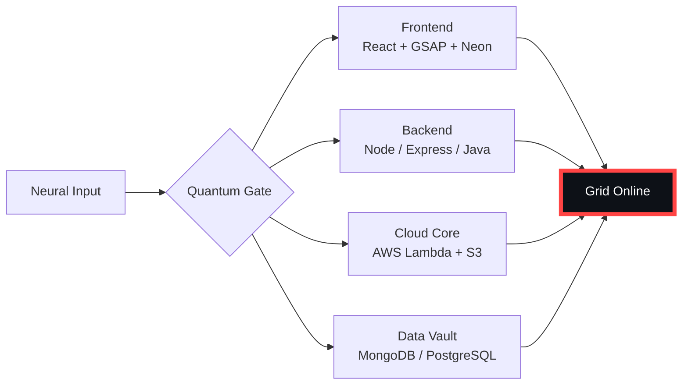

# 🌌 [ NEURAL CORE ACCESS: PENDEMVAMSI ]

<p align="center">
  
</p>

<div align="center">
  
  <br><small>Active Protocol: <strong style="color:#FF4444">NECROMORPH INFEST</strong> 🩸☠️</small>
</div>

## 🔵 NEURAL STATUS READOUT
```text
SUBJECT ID    →  PENDEMVAMSI
ENTITY CLASS  →  SHADOW MONARCH v8
NEURAL RANK   →  B-TIER
GRID SYNC     →  4641/8010 QUANTUM PACKETS
─────── BIO-METRICS (NECROMORPH INFEST) ───────
STRENGTH      140  ██████████████████░░░
AGILITY       122  ████████████████░░░░░
INTELLIGENCE  147  ███████████████████░░
VITALITY      112  ███████████████░░░░░░
```

> **NEURAL BURST ACQUIRED:** +66 QUANTUM PACKETS 
> **SYSTEM MESSAGE:** QUANTUM ENTANGLEMENT CONFIRMED — YOU ARE THE SYSTEM

---

## 🌀 GRID ARCHITECTURE (HOLOGRAPHIC RENDER)



---

## 📡 ACADEMIC NODES – CONQUERED
- [x] B.Tech Neural Engineering (2020–2024) – St. Ann’s Grid
- [x] Intermediate Quantum Core (2018–2020) – Sri Medhavi
- [x] SSC Primary Link (2017–2018) – Sri Geethanjali

---

## ⚡ SKILL NEURAL MATRIX

<details open>
<summary>🔌 ACTIVE NEURAL LINKS</summary>

| Node               | Tier | Integrity Bar                | Status      |
|--------------------|------|------------------------------|-------------|
| Java Core          | S    | ████████████████████ 100%   | OVERCLOCKED |
| Node.js Grid       | S    | ████████████████████ 100%   | OVERCLOCKED |
| React Holo-UI      | A+   | █████████████████░░░ 92%    | ONLINE      |
| AWS Quantum Relay  | S    | ████████████████████ 100%   | SOVEREIGN   |
| Python AI Kernel   | A    | ████████████████░░░░ 85%    | CHARGING    |
| DSA Void Algorithm | A    | █████████████████░░░ 90%    | ACTIVE      |

</details>

---

## 🏅 NEURAL ACHIEVEMENT TOKENS

<p align="center">
  
  
  
  
</p>

---

## 👾 SHADOW ENTITIES – SUMMONED

<p align="center">
  
  <br><strong style="color:#FF4444">ARISE.</strong>
</p>

| Entity | Designation   | Class            | Source Node                     |
|--------|---------------|------------------|---------------------------------|
| SH-01  | Igris         | Void Commander   | AI Financial Oracle             |
| SH-02  | Beru          | Swarm Overlord   | WebRTC Quantum Stream           |
| SH-03  | Kaisel        | Void Wyrm        | Geolocation Shadow Relay        |
| SH-04  | Tusk          | Arcane Construct | Global Pandemic Sentinel        |
| SH-05  | Iron          | Armored Bastion  | React Crypto Fortress           |

---

## 📡 GRID ANALYTICS (LIVE FEED)

<p align="center">
  
  <br>
  
  
</p>

---

## 🖥️ CORRUPTED MAINFRAME LOG (401 ENTRIES)

<details>
<summary>OPEN TERMINAL FEED – PROTOCOL: NECROMORPH INFEST</summary>

> [0x273D85E5] 🩸☠️ **NECROMORPH INFEST PROTOCOL** #0 | NEURAL LINK STABILIZED | [TRANSMISSION SUCCESS]
> [0xEAC35BFB] 🩸☠️ **NECROMORPH INFEST PROTOCOL** #1 | NEURAL LINK STABILIZED | [TRANSMISSION SUCCESS]
> [0x65270FB7] 🩸☠️ **NECROMORPH INFEST PROTOCOL** #2 | NEURAL LINK STABILIZED | [TRANSMISSION SUCCESS]
> [0x127C14C1] 🩸☠️ **NECROMORPH INFEST PROTOCOL** #3 | NEURAL LINK STABILIZED | [TRANSMISSION SUCCESS]
> [0xEC3ABED3] 🩸☠️ **NECROMORPH INFEST PROTOCOL** #4 | NEURAL LINK STABILIZED | [TRANSMISSION SUCCESS]
> [0xDA07C074] 🩸☠️ **NECROMORPH INFEST PROTOCOL** #5 | NEURAL LINK STABILIZED | [TRANSMISSION SUCCESS]
> [0xF699C45A] 🩸☠️ **NECROMORPH INFEST PROTOCOL** #6 | NEURAL LINK STABILIZED | [TRANSMISSION SUCCESS]
> [0x4AE68651] 🩸☠️ **NECROMORPH INFEST PROTOCOL** #7 | NEURAL LINK STABILIZED | [TRANSMISSION SUCCESS]
> [0xD320D41B] 🩸☠️ **NECROMORPH INFEST PROTOCOL** #8 | NEURAL LINK  [GLITCH DETECTED] STABILIZED | [TRANSMISSION SUCCESS]
> [0x48D9B6F4] 🩸☠️ **NECROMORPH INFEST PROTOCOL** #9 | NEURAL LINK STABILIZED | [TRANSMISSION SUCCESS]
> [0x822EBED4] 🩸☠️ **NECROMORPH INFEST PROTOCOL** #10 | NEURAL LINK STABILIZED | [TRANSMISSION SUCCESS]
> [0x7AD17158] 🩸☠️ **NECROMORPH INFEST PROTOCOL** #11 | NEURAL LINK STABILIZED | [TRANSMISSION SUCCESS]
> [0xFADFB3C7] 🩸☠️ **NECROMORPH INFEST PROTOCOL** #12 | NEURAL LINK  [GLITCH DETECTED] STABILIZED | [TRANSMISSION SUCCESS]
> [0xE4C503C5] 🩸☠️ **NECROMORPH INFEST PROTOCOL** #13 | NEURAL LINK STABILIZED | [TRANSMISSION SUCCESS]
> [0xEFA476E7] 🩸☠️ **NECROMORPH INFEST PROTOCOL** #14 | NEURAL LINK  [GLITCH DETECTED] STABILIZED | [TRANSMISSION SUCCESS]
> [0xDBAD8F82] 🩸☠️ **NECROMORPH INFEST PROTOCOL** #15 | NEURAL LINK STABILIZED | [TRANSMISSION SUCCESS]
> [0xCBB20A4D] 🩸☠️ **NECROMORPH INFEST PROTOCOL** #16 | NEURAL LINK STABILIZED | [TRANSMISSION SUCCESS]
> [0xC93D809D] 🩸☠️ **NECROMORPH INFEST PROTOCOL** #17 | NEURAL LINK  [GLITCH DETECTED] STABILIZED | [TRANSMISSION SUCCESS]
> [0x51A8ECC2] 🩸☠️ **NECROMORPH INFEST PROTOCOL** #18 | NEURAL LINK STABILIZED | [TRANSMISSION SUCCESS]
> [0xF8B8A72B] 🩸☠️ **NECROMORPH INFEST PROTOCOL** #19 | NEURAL LINK STABILIZED | [TRANSMISSION SUCCESS]
> [0xBB86E256] 🩸☠️ **NECROMORPH INFEST PROTOCOL** #20 | NEURAL LINK STABILIZED | [TRANSMISSION SUCCESS]
> [0x7F554219] 🩸☠️ **NECROMORPH INFEST PROTOCOL** #21 | NEURAL LINK STABILIZED | [TRANSMISSION SUCCESS]
> [0xFB928120] 🩸☠️ **NECROMORPH INFEST PROTOCOL** #22 | NEURAL LINK STABILIZED | [TRANSMISSION SUCCESS]
> [0x0940F9AA] 🩸☠️ **NECROMORPH INFEST PROTOCOL** #23 | NEURAL LINK STABILIZED | [TRANSMISSION SUCCESS]
> [0xCCF7A1B9] 🩸☠️ **NECROMORPH INFEST PROTOCOL** #24 | NEURAL LINK STABILIZED | [TRANSMISSION SUCCESS]
> [0x4E902003] 🩸☠️ **NECROMORPH INFEST PROTOCOL** #25 | NEURAL LINK STABILIZED | [TRANSMISSION SUCCESS]
> [0x4FAB0B62] 🩸☠️ **NECROMORPH INFEST PROTOCOL** #26 | NEURAL LINK  [GLITCH DETECTED] STABILIZED | [TRANSMISSION SUCCESS]
> [0xD2588AD3] 🩸☠️ **NECROMORPH INFEST PROTOCOL** #27 | NEURAL LINK STABILIZED | [TRANSMISSION SUCCESS]
> [0x4FD70C4E] 🩸☠️ **NECROMORPH INFEST PROTOCOL** #28 | NEURAL LINK STABILIZED | [TRANSMISSION SUCCESS]
> [0xB46E2A6E] 🩸☠️ **NECROMORPH INFEST PROTOCOL** #29 | NEURAL LINK STABILIZED | [TRANSMISSION SUCCESS]
> [0x93A561E8] 🩸☠️ **NECROMORPH INFEST PROTOCOL** #30 | NEURAL LINK STABILIZED | [TRANSMISSION SUCCESS]
> [0xF2C6E2C5] 🩸☠️ **NECROMORPH INFEST PROTOCOL** #31 | NEURAL LINK STABILIZED | [TRANSMISSION SUCCESS]
> [0x0BAF730A] 🩸☠️ **NECROMORPH INFEST PROTOCOL** #32 | NEURAL LINK STABILIZED | [TRANSMISSION SUCCESS]
> [0x68904F5F] 🩸☠️ **NECROMORPH INFEST PROTOCOL** #33 | NEURAL LINK STABILIZED | [TRANSMISSION SUCCESS]
> [0x6F7C5B9D] 🩸☠️ **NECROMORPH INFEST PROTOCOL** #34 | NEURAL LINK STABILIZED | [TRANSMISSION SUCCESS]
> [0xC707865B] 🩸☠️ **NECROMORPH INFEST PROTOCOL** #35 | NEURAL LINK STABILIZED | [TRANSMISSION SUCCESS]
> [0x802C97AC] 🩸☠️ **NECROMORPH INFEST PROTOCOL** #36 | NEURAL LINK STABILIZED | [TRANSMISSION SUCCESS]
> [0x128FB478] 🩸☠️ **NECROMORPH INFEST PROTOCOL** #37 | NEURAL LINK STABILIZED | [TRANSMISSION SUCCESS]
> [0x73CEB1C6] 🩸☠️ **NECROMORPH INFEST PROTOCOL** #38 | NEURAL LINK STABILIZED | [TRANSMISSION SUCCESS]
> [0x9F837911] 🩸☠️ **NECROMORPH INFEST PROTOCOL** #39 | NEURAL LINK STABILIZED | [TRANSMISSION SUCCESS]
> [0x6929D678] 🩸☠️ **NECROMORPH INFEST PROTOCOL** #40 | NEURAL LINK STABILIZED | [TRANSMISSION SUCCESS]
> [0x4051C1DA] 🩸☠️ **NECROMORPH INFEST PROTOCOL** #41 | NEURAL LINK STABILIZED | [TRANSMISSION SUCCESS]
> [0x37C5E97E] 🩸☠️ **NECROMORPH INFEST PROTOCOL** #42 | NEURAL LINK STABILIZED | [TRANSMISSION SUCCESS]
> [0x6FD262B6] 🩸☠️ **NECROMORPH INFEST PROTOCOL** #43 | NEURAL LINK STABILIZED | [TRANSMISSION SUCCESS]
> [0xA20C294D] 🩸☠️ **NECROMORPH INFEST PROTOCOL** #44 | NEURAL LINK  [GLITCH DETECTED] STABILIZED | [TRANSMISSION SUCCESS]
> [0x4D08D029] 🩸☠️ **NECROMORPH INFEST PROTOCOL** #45 | NEURAL LINK STABILIZED | [TRANSMISSION SUCCESS]
> [0x313E60D1] 🩸☠️ **NECROMORPH INFEST PROTOCOL** #46 | NEURAL LINK STABILIZED | [TRANSMISSION SUCCESS]
> [0x32741895] 🩸☠️ **NECROMORPH INFEST PROTOCOL** #47 | NEURAL LINK  [GLITCH DETECTED] STABILIZED | [TRANSMISSION SUCCESS]
> [0x191565E3] 🩸☠️ **NECROMORPH INFEST PROTOCOL** #48 | NEURAL LINK STABILIZED | [TRANSMISSION SUCCESS]
> [0x137409BE] 🩸☠️ **NECROMORPH INFEST PROTOCOL** #49 | NEURAL LINK STABILIZED | [TRANSMISSION SUCCESS]
> [0x8AA98953] 🩸☠️ **NECROMORPH INFEST PROTOCOL** #50 | NEURAL LINK STABILIZED | [TRANSMISSION SUCCESS]
> [0x5605A312] 🩸☠️ **NECROMORPH INFEST PROTOCOL** #51 | NEURAL LINK STABILIZED | [TRANSMISSION SUCCESS]
> [0xEE50B902] 🩸☠️ **NECROMORPH INFEST PROTOCOL** #52 | NEURAL LINK  [GLITCH DETECTED] STABILIZED | [TRANSMISSION SUCCESS]
> [0x758C94E2] 🩸☠️ **NECROMORPH INFEST PROTOCOL** #53 | NEURAL LINK STABILIZED | [TRANSMISSION SUCCESS]
> [0xB3F8313E] 🩸☠️ **NECROMORPH INFEST PROTOCOL** #54 | NEURAL LINK STABILIZED | [TRANSMISSION SUCCESS]
> [0xF4DF9C47] 🩸☠️ **NECROMORPH INFEST PROTOCOL** #55 | NEURAL LINK STABILIZED | [TRANSMISSION SUCCESS]
> [0xC0EE9CC3] 🩸☠️ **NECROMORPH INFEST PROTOCOL** #56 | NEURAL LINK  [GLITCH DETECTED] STABILIZED | [TRANSMISSION SUCCESS]
> [0x8F840B5F] 🩸☠️ **NECROMORPH INFEST PROTOCOL** #57 | NEURAL LINK STABILIZED | [TRANSMISSION SUCCESS]
> [0xF5DDBD70] 🩸☠️ **NECROMORPH INFEST PROTOCOL** #58 | NEURAL LINK  [GLITCH DETECTED] STABILIZED | [TRANSMISSION SUCCESS]
> [0x5140E8FE] 🩸☠️ **NECROMORPH INFEST PROTOCOL** #59 | NEURAL LINK STABILIZED | [TRANSMISSION SUCCESS]
> [0xE5898420] 🩸☠️ **NECROMORPH INFEST PROTOCOL** #60 | NEURAL LINK STABILIZED | [TRANSMISSION SUCCESS]
> [0xB74A3436] 🩸☠️ **NECROMORPH INFEST PROTOCOL** #61 | NEURAL LINK STABILIZED | [TRANSMISSION SUCCESS]
> [0x8B2F8D31] 🩸☠️ **NECROMORPH INFEST PROTOCOL** #62 | NEURAL LINK STABILIZED | [TRANSMISSION SUCCESS]
> [0x0E28B3C5] 🩸☠️ **NECROMORPH INFEST PROTOCOL** #63 | NEURAL LINK STABILIZED | [TRANSMISSION SUCCESS]
> [0xC49F1D35] 🩸☠️ **NECROMORPH INFEST PROTOCOL** #64 | NEURAL LINK STABILIZED | [TRANSMISSION SUCCESS]
> [0x5D79EC04] 🩸☠️ **NECROMORPH INFEST PROTOCOL** #65 | NEURAL LINK STABILIZED | [TRANSMISSION SUCCESS]
> [0xE2A4FBC3] 🩸☠️ **NECROMORPH INFEST PROTOCOL** #66 | NEURAL LINK STABILIZED | [TRANSMISSION SUCCESS]
> [0x83287FBA] 🩸☠️ **NECROMORPH INFEST PROTOCOL** #67 | NEURAL LINK  [GLITCH DETECTED] STABILIZED | [TRANSMISSION SUCCESS]
> [0x62A63C1D] 🩸☠️ **NECROMORPH INFEST PROTOCOL** #68 | NEURAL LINK STABILIZED | [TRANSMISSION SUCCESS]
> [0x229CA058] 🩸☠️ **NECROMORPH INFEST PROTOCOL** #69 | NEURAL LINK  [GLITCH DETECTED] STABILIZED | [TRANSMISSION SUCCESS]
> [0x81BA86FD] 🩸☠️ **NECROMORPH INFEST PROTOCOL** #70 | NEURAL LINK STABILIZED | [TRANSMISSION SUCCESS]
> [0x06AF2CA2] 🩸☠️ **NECROMORPH INFEST PROTOCOL** #71 | NEURAL LINK STABILIZED | [TRANSMISSION SUCCESS]
> [0xD200374A] 🩸☠️ **NECROMORPH INFEST PROTOCOL** #72 | NEURAL LINK STABILIZED | [TRANSMISSION SUCCESS]
> [0x83CE6E3E] 🩸☠️ **NECROMORPH INFEST PROTOCOL** #73 | NEURAL LINK STABILIZED | [TRANSMISSION SUCCESS]
> [0x273BC708] 🩸☠️ **NECROMORPH INFEST PROTOCOL** #74 | NEURAL LINK  [GLITCH DETECTED] STABILIZED | [TRANSMISSION SUCCESS]
> [0xD9A27E07] 🩸☠️ **NECROMORPH INFEST PROTOCOL** #75 | NEURAL LINK STABILIZED | [TRANSMISSION SUCCESS]
> [0x06D12AE9] 🩸☠️ **NECROMORPH INFEST PROTOCOL** #76 | NEURAL LINK STABILIZED | [TRANSMISSION SUCCESS]
> [0xE52C36ED] 🩸☠️ **NECROMORPH INFEST PROTOCOL** #77 | NEURAL LINK STABILIZED | [TRANSMISSION SUCCESS]
> [0xBAE7BA00] 🩸☠️ **NECROMORPH INFEST PROTOCOL** #78 | NEURAL LINK STABILIZED | [TRANSMISSION SUCCESS]
> [0x1363F110] 🩸☠️ **NECROMORPH INFEST PROTOCOL** #79 | NEURAL LINK STABILIZED | [TRANSMISSION SUCCESS]
> [0x16C495AE] 🩸☠️ **NECROMORPH INFEST PROTOCOL** #80 | NEURAL LINK STABILIZED | [TRANSMISSION SUCCESS]
> [0xC383B2BA] 🩸☠️ **NECROMORPH INFEST PROTOCOL** #81 | NEURAL LINK STABILIZED | [TRANSMISSION SUCCESS]
> [0x6C5C904B] 🩸☠️ **NECROMORPH INFEST PROTOCOL** #82 | NEURAL LINK  [GLITCH DETECTED] STABILIZED | [TRANSMISSION SUCCESS]
> [0xD6D7908B] 🩸☠️ **NECROMORPH INFEST PROTOCOL** #83 | NEURAL LINK STABILIZED | [TRANSMISSION SUCCESS]
> [0x5C658A86] 🩸☠️ **NECROMORPH INFEST PROTOCOL** #84 | NEURAL LINK STABILIZED | [TRANSMISSION SUCCESS]
> [0xAA4C3AE0] 🩸☠️ **NECROMORPH INFEST PROTOCOL** #85 | NEURAL LINK STABILIZED | [TRANSMISSION SUCCESS]
> [0xA74768F9] 🩸☠️ **NECROMORPH INFEST PROTOCOL** #86 | NEURAL LINK STABILIZED | [TRANSMISSION SUCCESS]
> [0xE2884DF8] 🩸☠️ **NECROMORPH INFEST PROTOCOL** #87 | NEURAL LINK  [GLITCH DETECTED] STABILIZED | [TRANSMISSION SUCCESS]
> [0x79DD30DF] 🩸☠️ **NECROMORPH INFEST PROTOCOL** #88 | NEURAL LINK STABILIZED | [TRANSMISSION SUCCESS]
> [0x7CBF037F] 🩸☠️ **NECROMORPH INFEST PROTOCOL** #89 | NEURAL LINK STABILIZED | [TRANSMISSION SUCCESS]
> [0x39BF9488] 🩸☠️ **NECROMORPH INFEST PROTOCOL** #90 | NEURAL LINK STABILIZED | [TRANSMISSION SUCCESS]
> [0x1F5D09ED] 🩸☠️ **NECROMORPH INFEST PROTOCOL** #91 | NEURAL LINK STABILIZED | [TRANSMISSION SUCCESS]
> [0x0A097D54] 🩸☠️ **NECROMORPH INFEST PROTOCOL** #92 | NEURAL LINK STABILIZED | [TRANSMISSION SUCCESS]
> [0xB12F4D44] 🩸☠️ **NECROMORPH INFEST PROTOCOL** #93 | NEURAL LINK STABILIZED | [TRANSMISSION SUCCESS]
> [0xF2198513] 🩸☠️ **NECROMORPH INFEST PROTOCOL** #94 | NEURAL LINK STABILIZED | [TRANSMISSION SUCCESS]
> [0x75E04916] 🩸☠️ **NECROMORPH INFEST PROTOCOL** #95 | NEURAL LINK STABILIZED | [TRANSMISSION SUCCESS]
> [0xC894783D] 🩸☠️ **NECROMORPH INFEST PROTOCOL** #96 | NEURAL LINK STABILIZED | [TRANSMISSION SUCCESS]
> [0x4AEBEA80] 🩸☠️ **NECROMORPH INFEST PROTOCOL** #97 | NEURAL LINK  [GLITCH DETECTED] STABILIZED | [TRANSMISSION SUCCESS]
> [0xDB8E9EF8] 🩸☠️ **NECROMORPH INFEST PROTOCOL** #98 | NEURAL LINK  [GLITCH DETECTED] STABILIZED | [TRANSMISSION SUCCESS]
> [0x2CE6885B] 🩸☠️ **NECROMORPH INFEST PROTOCOL** #99 | NEURAL LINK STABILIZED | [TRANSMISSION SUCCESS]
> [0x59B2319A] 🩸☠️ **NECROMORPH INFEST PROTOCOL** #100 | NEURAL LINK  [GLITCH DETECTED] STABILIZED | [TRANSMISSION SUCCESS]
> [0x109F4D69] 🩸☠️ **NECROMORPH INFEST PROTOCOL** #101 | NEURAL LINK STABILIZED | [TRANSMISSION SUCCESS]
> [0x2DE69617] 🩸☠️ **NECROMORPH INFEST PROTOCOL** #102 | NEURAL LINK  [GLITCH DETECTED] STABILIZED | [TRANSMISSION SUCCESS]
> [0x64BD0944] 🩸☠️ **NECROMORPH INFEST PROTOCOL** #103 | NEURAL LINK STABILIZED | [TRANSMISSION SUCCESS]
> [0x272BEC74] 🩸☠️ **NECROMORPH INFEST PROTOCOL** #104 | NEURAL LINK  [GLITCH DETECTED] STABILIZED | [TRANSMISSION SUCCESS]
> [0x49876D3B] 🩸☠️ **NECROMORPH INFEST PROTOCOL** #105 | NEURAL LINK  [GLITCH DETECTED] STABILIZED | [TRANSMISSION SUCCESS]
> [0xA4E5B410] 🩸☠️ **NECROMORPH INFEST PROTOCOL** #106 | NEURAL LINK STABILIZED | [TRANSMISSION SUCCESS]
> [0x2679AF32] 🩸☠️ **NECROMORPH INFEST PROTOCOL** #107 | NEURAL LINK STABILIZED | [TRANSMISSION SUCCESS]
> [0x51CE2C91] 🩸☠️ **NECROMORPH INFEST PROTOCOL** #108 | NEURAL LINK STABILIZED | [TRANSMISSION SUCCESS]
> [0x777E324F] 🩸☠️ **NECROMORPH INFEST PROTOCOL** #109 | NEURAL LINK STABILIZED | [TRANSMISSION SUCCESS]
> [0x149AA49F] 🩸☠️ **NECROMORPH INFEST PROTOCOL** #110 | NEURAL LINK STABILIZED | [TRANSMISSION SUCCESS]
> [0xB7769358] 🩸☠️ **NECROMORPH INFEST PROTOCOL** #111 | NEURAL LINK STABILIZED | [TRANSMISSION SUCCESS]
> [0x2F8B6DDB] 🩸☠️ **NECROMORPH INFEST PROTOCOL** #112 | NEURAL LINK STABILIZED | [TRANSMISSION SUCCESS]
> [0x2360599A] 🩸☠️ **NECROMORPH INFEST PROTOCOL** #113 | NEURAL LINK STABILIZED | [TRANSMISSION SUCCESS]
> [0x678BF0B7] 🩸☠️ **NECROMORPH INFEST PROTOCOL** #114 | NEURAL LINK STABILIZED | [TRANSMISSION SUCCESS]
> [0x3CB25887] 🩸☠️ **NECROMORPH INFEST PROTOCOL** #115 | NEURAL LINK STABILIZED | [TRANSMISSION SUCCESS]
> [0x6C1C658D] 🩸☠️ **NECROMORPH INFEST PROTOCOL** #116 | NEURAL LINK STABILIZED | [TRANSMISSION SUCCESS]
> [0xACD91D49] 🩸☠️ **NECROMORPH INFEST PROTOCOL** #117 | NEURAL LINK STABILIZED | [TRANSMISSION SUCCESS]
> [0x8C50F67E] 🩸☠️ **NECROMORPH INFEST PROTOCOL** #118 | NEURAL LINK STABILIZED | [TRANSMISSION SUCCESS]
> [0x00422952] 🩸☠️ **NECROMORPH INFEST PROTOCOL** #119 | NEURAL LINK STABILIZED | [TRANSMISSION SUCCESS]
> [0x98934BDC] 🩸☠️ **NECROMORPH INFEST PROTOCOL** #120 | NEURAL LINK STABILIZED | [TRANSMISSION SUCCESS]
> [0x1382CEBA] 🩸☠️ **NECROMORPH INFEST PROTOCOL** #121 | NEURAL LINK STABILIZED | [TRANSMISSION SUCCESS]
> [0x88FB77B8] 🩸☠️ **NECROMORPH INFEST PROTOCOL** #122 | NEURAL LINK STABILIZED | [TRANSMISSION SUCCESS]
> [0xE489EFDF] 🩸☠️ **NECROMORPH INFEST PROTOCOL** #123 | NEURAL LINK  [GLITCH DETECTED] STABILIZED | [TRANSMISSION SUCCESS]
> [0x21719462] 🩸☠️ **NECROMORPH INFEST PROTOCOL** #124 | NEURAL LINK  [GLITCH DETECTED] STABILIZED | [TRANSMISSION SUCCESS]
> [0x9C507C8B] 🩸☠️ **NECROMORPH INFEST PROTOCOL** #125 | NEURAL LINK STABILIZED | [TRANSMISSION SUCCESS]
> [0x61435B3E] 🩸☠️ **NECROMORPH INFEST PROTOCOL** #126 | NEURAL LINK STABILIZED | [TRANSMISSION SUCCESS]
> [0xD8349EF3] 🩸☠️ **NECROMORPH INFEST PROTOCOL** #127 | NEURAL LINK STABILIZED | [TRANSMISSION SUCCESS]
> [0x056451CA] 🩸☠️ **NECROMORPH INFEST PROTOCOL** #128 | NEURAL LINK STABILIZED | [TRANSMISSION SUCCESS]
> [0xAB6C4F60] 🩸☠️ **NECROMORPH INFEST PROTOCOL** #129 | NEURAL LINK STABILIZED | [TRANSMISSION SUCCESS]
> [0xED48D326] 🩸☠️ **NECROMORPH INFEST PROTOCOL** #130 | NEURAL LINK STABILIZED | [TRANSMISSION SUCCESS]
> [0x1D7B4703] 🩸☠️ **NECROMORPH INFEST PROTOCOL** #131 | NEURAL LINK STABILIZED | [TRANSMISSION SUCCESS]
> [0x2A151B54] 🩸☠️ **NECROMORPH INFEST PROTOCOL** #132 | NEURAL LINK STABILIZED | [TRANSMISSION SUCCESS]
> [0x95E3D8EE] 🩸☠️ **NECROMORPH INFEST PROTOCOL** #133 | NEURAL LINK STABILIZED | [TRANSMISSION SUCCESS]
> [0x403086B3] 🩸☠️ **NECROMORPH INFEST PROTOCOL** #134 | NEURAL LINK  [GLITCH DETECTED] STABILIZED | [TRANSMISSION SUCCESS]
> [0xDCAF42D0] 🩸☠️ **NECROMORPH INFEST PROTOCOL** #135 | NEURAL LINK STABILIZED | [TRANSMISSION SUCCESS]
> [0x66706500] 🩸☠️ **NECROMORPH INFEST PROTOCOL** #136 | NEURAL LINK STABILIZED | [TRANSMISSION SUCCESS]
> [0xE2164060] 🩸☠️ **NECROMORPH INFEST PROTOCOL** #137 | NEURAL LINK STABILIZED | [TRANSMISSION SUCCESS]
> [0x38F0C3FF] 🩸☠️ **NECROMORPH INFEST PROTOCOL** #138 | NEURAL LINK STABILIZED | [TRANSMISSION SUCCESS]
> [0xCC33C57C] 🩸☠️ **NECROMORPH INFEST PROTOCOL** #139 | NEURAL LINK  [GLITCH DETECTED] STABILIZED | [TRANSMISSION SUCCESS]
> [0x32C70C16] 🩸☠️ **NECROMORPH INFEST PROTOCOL** #140 | NEURAL LINK STABILIZED | [TRANSMISSION SUCCESS]
> [0xAF6CB1C8] 🩸☠️ **NECROMORPH INFEST PROTOCOL** #141 | NEURAL LINK STABILIZED | [TRANSMISSION SUCCESS]
> [0xAD373F06] 🩸☠️ **NECROMORPH INFEST PROTOCOL** #142 | NEURAL LINK STABILIZED | [TRANSMISSION SUCCESS]
> [0xADF56FA8] 🩸☠️ **NECROMORPH INFEST PROTOCOL** #143 | NEURAL LINK STABILIZED | [TRANSMISSION SUCCESS]
> [0xC3534606] 🩸☠️ **NECROMORPH INFEST PROTOCOL** #144 | NEURAL LINK STABILIZED | [TRANSMISSION SUCCESS]
> [0x46B1034C] 🩸☠️ **NECROMORPH INFEST PROTOCOL** #145 | NEURAL LINK STABILIZED | [TRANSMISSION SUCCESS]
> [0x0E0CD7DC] 🩸☠️ **NECROMORPH INFEST PROTOCOL** #146 | NEURAL LINK STABILIZED | [TRANSMISSION SUCCESS]
> [0xB4EBDC5B] 🩸☠️ **NECROMORPH INFEST PROTOCOL** #147 | NEURAL LINK STABILIZED | [TRANSMISSION SUCCESS]
> [0x4D46FE6E] 🩸☠️ **NECROMORPH INFEST PROTOCOL** #148 | NEURAL LINK STABILIZED | [TRANSMISSION SUCCESS]
> [0x2CBCEADD] 🩸☠️ **NECROMORPH INFEST PROTOCOL** #149 | NEURAL LINK  [GLITCH DETECTED] STABILIZED | [TRANSMISSION SUCCESS]
> [0x5AE8573C] 🩸☠️ **NECROMORPH INFEST PROTOCOL** #150 | NEURAL LINK STABILIZED | [TRANSMISSION SUCCESS]
> [0x467D7A60] 🩸☠️ **NECROMORPH INFEST PROTOCOL** #151 | NEURAL LINK STABILIZED | [TRANSMISSION SUCCESS]
> [0x86C6E170] 🩸☠️ **NECROMORPH INFEST PROTOCOL** #152 | NEURAL LINK STABILIZED | [TRANSMISSION SUCCESS]
> [0xFD597A2D] 🩸☠️ **NECROMORPH INFEST PROTOCOL** #153 | NEURAL LINK STABILIZED | [TRANSMISSION SUCCESS]
> [0x2EEAAA95] 🩸☠️ **NECROMORPH INFEST PROTOCOL** #154 | NEURAL LINK STABILIZED | [TRANSMISSION SUCCESS]
> [0x6552BE8E] 🩸☠️ **NECROMORPH INFEST PROTOCOL** #155 | NEURAL LINK STABILIZED | [TRANSMISSION SUCCESS]
> [0x81ED9F13] 🩸☠️ **NECROMORPH INFEST PROTOCOL** #156 | NEURAL LINK STABILIZED | [TRANSMISSION SUCCESS]
> [0xD8D07184] 🩸☠️ **NECROMORPH INFEST PROTOCOL** #157 | NEURAL LINK STABILIZED | [TRANSMISSION SUCCESS]
> [0xEA3D1A95] 🩸☠️ **NECROMORPH INFEST PROTOCOL** #158 | NEURAL LINK STABILIZED | [TRANSMISSION SUCCESS]
> [0x9DBC4F01] 🩸☠️ **NECROMORPH INFEST PROTOCOL** #159 | NEURAL LINK STABILIZED | [TRANSMISSION SUCCESS]
> [0x816578A8] 🩸☠️ **NECROMORPH INFEST PROTOCOL** #160 | NEURAL LINK STABILIZED | [TRANSMISSION SUCCESS]
> [0x42C2D6A3] 🩸☠️ **NECROMORPH INFEST PROTOCOL** #161 | NEURAL LINK STABILIZED | [TRANSMISSION SUCCESS]
> [0xD7450B58] 🩸☠️ **NECROMORPH INFEST PROTOCOL** #162 | NEURAL LINK  [GLITCH DETECTED] STABILIZED | [TRANSMISSION SUCCESS]
> [0x777878FB] 🩸☠️ **NECROMORPH INFEST PROTOCOL** #163 | NEURAL LINK STABILIZED | [TRANSMISSION SUCCESS]
> [0x89178329] 🩸☠️ **NECROMORPH INFEST PROTOCOL** #164 | NEURAL LINK STABILIZED | [TRANSMISSION SUCCESS]
> [0x79153498] 🩸☠️ **NECROMORPH INFEST PROTOCOL** #165 | NEURAL LINK STABILIZED | [TRANSMISSION SUCCESS]
> [0x7B26D4B8] 🩸☠️ **NECROMORPH INFEST PROTOCOL** #166 | NEURAL LINK  [GLITCH DETECTED] STABILIZED | [TRANSMISSION SUCCESS]
> [0xF4BA62FB] 🩸☠️ **NECROMORPH INFEST PROTOCOL** #167 | NEURAL LINK STABILIZED | [TRANSMISSION SUCCESS]
> [0x111FB0CA] 🩸☠️ **NECROMORPH INFEST PROTOCOL** #168 | NEURAL LINK STABILIZED | [TRANSMISSION SUCCESS]
> [0x591C16B1] 🩸☠️ **NECROMORPH INFEST PROTOCOL** #169 | NEURAL LINK STABILIZED | [TRANSMISSION SUCCESS]
> [0x70784663] 🩸☠️ **NECROMORPH INFEST PROTOCOL** #170 | NEURAL LINK STABILIZED | [TRANSMISSION SUCCESS]
> [0xCE482B90] 🩸☠️ **NECROMORPH INFEST PROTOCOL** #171 | NEURAL LINK  [GLITCH DETECTED] STABILIZED | [TRANSMISSION SUCCESS]
> [0xDDBA4DC0] 🩸☠️ **NECROMORPH INFEST PROTOCOL** #172 | NEURAL LINK STABILIZED | [TRANSMISSION SUCCESS]
> [0xA9EAF9CA] 🩸☠️ **NECROMORPH INFEST PROTOCOL** #173 | NEURAL LINK  [GLITCH DETECTED] STABILIZED | [TRANSMISSION SUCCESS]
> [0xBFF7F3F1] 🩸☠️ **NECROMORPH INFEST PROTOCOL** #174 | NEURAL LINK STABILIZED | [TRANSMISSION SUCCESS]
> [0xEF3903C3] 🩸☠️ **NECROMORPH INFEST PROTOCOL** #175 | NEURAL LINK  [GLITCH DETECTED] STABILIZED | [TRANSMISSION SUCCESS]
> [0x642D6AF8] 🩸☠️ **NECROMORPH INFEST PROTOCOL** #176 | NEURAL LINK STABILIZED | [TRANSMISSION SUCCESS]
> [0x61DF4881] 🩸☠️ **NECROMORPH INFEST PROTOCOL** #177 | NEURAL LINK STABILIZED | [TRANSMISSION SUCCESS]
> [0x021D7582] 🩸☠️ **NECROMORPH INFEST PROTOCOL** #178 | NEURAL LINK STABILIZED | [TRANSMISSION SUCCESS]
> [0x17569478] 🩸☠️ **NECROMORPH INFEST PROTOCOL** #179 | NEURAL LINK STABILIZED | [TRANSMISSION SUCCESS]
> [0xE6D778A5] 🩸☠️ **NECROMORPH INFEST PROTOCOL** #180 | NEURAL LINK STABILIZED | [TRANSMISSION SUCCESS]
> [0x461D7D4A] 🩸☠️ **NECROMORPH INFEST PROTOCOL** #181 | NEURAL LINK STABILIZED | [TRANSMISSION SUCCESS]
> [0xFFCF3864] 🩸☠️ **NECROMORPH INFEST PROTOCOL** #182 | NEURAL LINK  [GLITCH DETECTED] STABILIZED | [TRANSMISSION SUCCESS]
> [0x5E0844BB] 🩸☠️ **NECROMORPH INFEST PROTOCOL** #183 | NEURAL LINK  [GLITCH DETECTED] STABILIZED | [TRANSMISSION SUCCESS]
> [0xD3C6BACC] 🩸☠️ **NECROMORPH INFEST PROTOCOL** #184 | NEURAL LINK  [GLITCH DETECTED] STABILIZED | [TRANSMISSION SUCCESS]
> [0xA3AC0D1D] 🩸☠️ **NECROMORPH INFEST PROTOCOL** #185 | NEURAL LINK STABILIZED | [TRANSMISSION SUCCESS]
> [0x919DCCE8] 🩸☠️ **NECROMORPH INFEST PROTOCOL** #186 | NEURAL LINK STABILIZED | [TRANSMISSION SUCCESS]
> [0x36DB2F6B] 🩸☠️ **NECROMORPH INFEST PROTOCOL** #187 | NEURAL LINK STABILIZED | [TRANSMISSION SUCCESS]
> [0x4CCB0CCA] 🩸☠️ **NECROMORPH INFEST PROTOCOL** #188 | NEURAL LINK STABILIZED | [TRANSMISSION SUCCESS]
> [0xDDAE5048] 🩸☠️ **NECROMORPH INFEST PROTOCOL** #189 | NEURAL LINK STABILIZED | [TRANSMISSION SUCCESS]
> [0x44DBF255] 🩸☠️ **NECROMORPH INFEST PROTOCOL** #190 | NEURAL LINK  [GLITCH DETECTED] STABILIZED | [TRANSMISSION SUCCESS]
> [0xB9EDB2D6] 🩸☠️ **NECROMORPH INFEST PROTOCOL** #191 | NEURAL LINK STABILIZED | [TRANSMISSION SUCCESS]
> [0xC17E40A4] 🩸☠️ **NECROMORPH INFEST PROTOCOL** #192 | NEURAL LINK STABILIZED | [TRANSMISSION SUCCESS]
> [0x1C46EF7F] 🩸☠️ **NECROMORPH INFEST PROTOCOL** #193 | NEURAL LINK STABILIZED | [TRANSMISSION SUCCESS]
> [0xAE20FF37] 🩸☠️ **NECROMORPH INFEST PROTOCOL** #194 | NEURAL LINK  [GLITCH DETECTED] STABILIZED | [TRANSMISSION SUCCESS]
> [0x3247B6E0] 🩸☠️ **NECROMORPH INFEST PROTOCOL** #195 | NEURAL LINK STABILIZED | [TRANSMISSION SUCCESS]
> [0x52814469] 🩸☠️ **NECROMORPH INFEST PROTOCOL** #196 | NEURAL LINK STABILIZED | [TRANSMISSION SUCCESS]
> [0x2E03EA78] 🩸☠️ **NECROMORPH INFEST PROTOCOL** #197 | NEURAL LINK STABILIZED | [TRANSMISSION SUCCESS]
> [0xCE69B4C9] 🩸☠️ **NECROMORPH INFEST PROTOCOL** #198 | NEURAL LINK STABILIZED | [TRANSMISSION SUCCESS]
> [0xF56A0D55] 🩸☠️ **NECROMORPH INFEST PROTOCOL** #199 | NEURAL LINK STABILIZED | [TRANSMISSION SUCCESS]
> [0xB3C59BDF] 🩸☠️ **NECROMORPH INFEST PROTOCOL** #200 | NEURAL LINK STABILIZED | [TRANSMISSION SUCCESS]
> [0xE7BF96AD] 🩸☠️ **NECROMORPH INFEST PROTOCOL** #201 | NEURAL LINK STABILIZED | [TRANSMISSION SUCCESS]
> [0x786C7B4C] 🩸☠️ **NECROMORPH INFEST PROTOCOL** #202 | NEURAL LINK  [GLITCH DETECTED] STABILIZED | [TRANSMISSION SUCCESS]
> [0xC3DBF4A5] 🩸☠️ **NECROMORPH INFEST PROTOCOL** #203 | NEURAL LINK STABILIZED | [TRANSMISSION SUCCESS]
> [0x484C63E3] 🩸☠️ **NECROMORPH INFEST PROTOCOL** #204 | NEURAL LINK STABILIZED | [TRANSMISSION SUCCESS]
> [0x3BF0B1E0] 🩸☠️ **NECROMORPH INFEST PROTOCOL** #205 | NEURAL LINK  [GLITCH DETECTED] STABILIZED | [TRANSMISSION SUCCESS]
> [0xED5C9065] 🩸☠️ **NECROMORPH INFEST PROTOCOL** #206 | NEURAL LINK STABILIZED | [TRANSMISSION SUCCESS]
> [0x9614423F] 🩸☠️ **NECROMORPH INFEST PROTOCOL** #207 | NEURAL LINK STABILIZED | [TRANSMISSION SUCCESS]
> [0x258314E8] 🩸☠️ **NECROMORPH INFEST PROTOCOL** #208 | NEURAL LINK  [GLITCH DETECTED] STABILIZED | [TRANSMISSION SUCCESS]
> [0x64A2017B] 🩸☠️ **NECROMORPH INFEST PROTOCOL** #209 | NEURAL LINK STABILIZED | [TRANSMISSION SUCCESS]
> [0xE9F4C030] 🩸☠️ **NECROMORPH INFEST PROTOCOL** #210 | NEURAL LINK STABILIZED | [TRANSMISSION SUCCESS]
> [0x7CB8AC45] 🩸☠️ **NECROMORPH INFEST PROTOCOL** #211 | NEURAL LINK STABILIZED | [TRANSMISSION SUCCESS]
> [0x116D8237] 🩸☠️ **NECROMORPH INFEST PROTOCOL** #212 | NEURAL LINK STABILIZED | [TRANSMISSION SUCCESS]
> [0xBE911757] 🩸☠️ **NECROMORPH INFEST PROTOCOL** #213 | NEURAL LINK STABILIZED | [TRANSMISSION SUCCESS]
> [0x43FF6998] 🩸☠️ **NECROMORPH INFEST PROTOCOL** #214 | NEURAL LINK STABILIZED | [TRANSMISSION SUCCESS]
> [0xEF7B046F] 🩸☠️ **NECROMORPH INFEST PROTOCOL** #215 | NEURAL LINK STABILIZED | [TRANSMISSION SUCCESS]
> [0xEE65A6A9] 🩸☠️ **NECROMORPH INFEST PROTOCOL** #216 | NEURAL LINK STABILIZED | [TRANSMISSION SUCCESS]
> [0x4E949C11] 🩸☠️ **NECROMORPH INFEST PROTOCOL** #217 | NEURAL LINK STABILIZED | [TRANSMISSION SUCCESS]
> [0x2FAEFCBA] 🩸☠️ **NECROMORPH INFEST PROTOCOL** #218 | NEURAL LINK STABILIZED | [TRANSMISSION SUCCESS]
> [0x83EC695E] 🩸☠️ **NECROMORPH INFEST PROTOCOL** #219 | NEURAL LINK  [GLITCH DETECTED] STABILIZED | [TRANSMISSION SUCCESS]
> [0xC635037D] 🩸☠️ **NECROMORPH INFEST PROTOCOL** #220 | NEURAL LINK STABILIZED | [TRANSMISSION SUCCESS]
> [0x8634744F] 🩸☠️ **NECROMORPH INFEST PROTOCOL** #221 | NEURAL LINK STABILIZED | [TRANSMISSION SUCCESS]
> [0x2510893D] 🩸☠️ **NECROMORPH INFEST PROTOCOL** #222 | NEURAL LINK STABILIZED | [TRANSMISSION SUCCESS]
> [0x7CC28CAC] 🩸☠️ **NECROMORPH INFEST PROTOCOL** #223 | NEURAL LINK STABILIZED | [TRANSMISSION SUCCESS]
> [0xAFAA0AAD] 🩸☠️ **NECROMORPH INFEST PROTOCOL** #224 | NEURAL LINK STABILIZED | [TRANSMISSION SUCCESS]
> [0x50F360CE] 🩸☠️ **NECROMORPH INFEST PROTOCOL** #225 | NEURAL LINK STABILIZED | [TRANSMISSION SUCCESS]
> [0xDC455612] 🩸☠️ **NECROMORPH INFEST PROTOCOL** #226 | NEURAL LINK STABILIZED | [TRANSMISSION SUCCESS]
> [0xFEF1BC23] 🩸☠️ **NECROMORPH INFEST PROTOCOL** #227 | NEURAL LINK STABILIZED | [TRANSMISSION SUCCESS]
> [0xFEB47115] 🩸☠️ **NECROMORPH INFEST PROTOCOL** #228 | NEURAL LINK STABILIZED | [TRANSMISSION SUCCESS]
> [0x099B809B] 🩸☠️ **NECROMORPH INFEST PROTOCOL** #229 | NEURAL LINK STABILIZED | [TRANSMISSION SUCCESS]
> [0x596E3CBC] 🩸☠️ **NECROMORPH INFEST PROTOCOL** #230 | NEURAL LINK STABILIZED | [TRANSMISSION SUCCESS]
> [0x0DFCD85C] 🩸☠️ **NECROMORPH INFEST PROTOCOL** #231 | NEURAL LINK STABILIZED | [TRANSMISSION SUCCESS]
> [0x1B82E030] 🩸☠️ **NECROMORPH INFEST PROTOCOL** #232 | NEURAL LINK  [GLITCH DETECTED] STABILIZED | [TRANSMISSION SUCCESS]
> [0x181755C4] 🩸☠️ **NECROMORPH INFEST PROTOCOL** #233 | NEURAL LINK STABILIZED | [TRANSMISSION SUCCESS]
> [0xB8F3816D] 🩸☠️ **NECROMORPH INFEST PROTOCOL** #234 | NEURAL LINK STABILIZED | [TRANSMISSION SUCCESS]
> [0x72F5ACC5] 🩸☠️ **NECROMORPH INFEST PROTOCOL** #235 | NEURAL LINK STABILIZED | [TRANSMISSION SUCCESS]
> [0x1B01F1EE] 🩸☠️ **NECROMORPH INFEST PROTOCOL** #236 | NEURAL LINK STABILIZED | [TRANSMISSION SUCCESS]
> [0x3431C3C4] 🩸☠️ **NECROMORPH INFEST PROTOCOL** #237 | NEURAL LINK STABILIZED | [TRANSMISSION SUCCESS]
> [0xA00F5830] 🩸☠️ **NECROMORPH INFEST PROTOCOL** #238 | NEURAL LINK STABILIZED | [TRANSMISSION SUCCESS]
> [0x5C6F09DD] 🩸☠️ **NECROMORPH INFEST PROTOCOL** #239 | NEURAL LINK STABILIZED | [TRANSMISSION SUCCESS]
> [0x5BDAEF1A] 🩸☠️ **NECROMORPH INFEST PROTOCOL** #240 | NEURAL LINK STABILIZED | [TRANSMISSION SUCCESS]
> [0xF5D4E19D] 🩸☠️ **NECROMORPH INFEST PROTOCOL** #241 | NEURAL LINK STABILIZED | [TRANSMISSION SUCCESS]
> [0x6FB2B7ED] 🩸☠️ **NECROMORPH INFEST PROTOCOL** #242 | NEURAL LINK STABILIZED | [TRANSMISSION SUCCESS]
> [0x3B370BFA] 🩸☠️ **NECROMORPH INFEST PROTOCOL** #243 | NEURAL LINK  [GLITCH DETECTED] STABILIZED | [TRANSMISSION SUCCESS]
> [0x2486FBE5] 🩸☠️ **NECROMORPH INFEST PROTOCOL** #244 | NEURAL LINK STABILIZED | [TRANSMISSION SUCCESS]
> [0x52A5C7BF] 🩸☠️ **NECROMORPH INFEST PROTOCOL** #245 | NEURAL LINK STABILIZED | [TRANSMISSION SUCCESS]
> [0xD19F8238] 🩸☠️ **NECROMORPH INFEST PROTOCOL** #246 | NEURAL LINK STABILIZED | [TRANSMISSION SUCCESS]
> [0xAD323A8F] 🩸☠️ **NECROMORPH INFEST PROTOCOL** #247 | NEURAL LINK STABILIZED | [TRANSMISSION SUCCESS]
> [0x65B4A1A3] 🩸☠️ **NECROMORPH INFEST PROTOCOL** #248 | NEURAL LINK STABILIZED | [TRANSMISSION SUCCESS]
> [0xA6AA7391] 🩸☠️ **NECROMORPH INFEST PROTOCOL** #249 | NEURAL LINK STABILIZED | [TRANSMISSION SUCCESS]
> [0x4C634F99] 🩸☠️ **NECROMORPH INFEST PROTOCOL** #250 | NEURAL LINK  [GLITCH DETECTED] STABILIZED | [TRANSMISSION SUCCESS]
> [0x2A4C1503] 🩸☠️ **NECROMORPH INFEST PROTOCOL** #251 | NEURAL LINK  [GLITCH DETECTED] STABILIZED | [TRANSMISSION SUCCESS]
> [0x01375B87] 🩸☠️ **NECROMORPH INFEST PROTOCOL** #252 | NEURAL LINK STABILIZED | [TRANSMISSION SUCCESS]
> [0x66263FA0] 🩸☠️ **NECROMORPH INFEST PROTOCOL** #253 | NEURAL LINK STABILIZED | [TRANSMISSION SUCCESS]
> [0x84E1A5C8] 🩸☠️ **NECROMORPH INFEST PROTOCOL** #254 | NEURAL LINK STABILIZED | [TRANSMISSION SUCCESS]
> [0x08BA16F6] 🩸☠️ **NECROMORPH INFEST PROTOCOL** #255 | NEURAL LINK STABILIZED | [TRANSMISSION SUCCESS]
> [0xDBBC83A6] 🩸☠️ **NECROMORPH INFEST PROTOCOL** #256 | NEURAL LINK STABILIZED | [TRANSMISSION SUCCESS]
> [0x19A147FD] 🩸☠️ **NECROMORPH INFEST PROTOCOL** #257 | NEURAL LINK STABILIZED | [TRANSMISSION SUCCESS]
> [0x2B915A30] 🩸☠️ **NECROMORPH INFEST PROTOCOL** #258 | NEURAL LINK STABILIZED | [TRANSMISSION SUCCESS]
> [0xE5D9AFB9] 🩸☠️ **NECROMORPH INFEST PROTOCOL** #259 | NEURAL LINK STABILIZED | [TRANSMISSION SUCCESS]
> [0x21DFC7D3] 🩸☠️ **NECROMORPH INFEST PROTOCOL** #260 | NEURAL LINK STABILIZED | [TRANSMISSION SUCCESS]
> [0xE9858746] 🩸☠️ **NECROMORPH INFEST PROTOCOL** #261 | NEURAL LINK STABILIZED | [TRANSMISSION SUCCESS]
> [0x425DF667] 🩸☠️ **NECROMORPH INFEST PROTOCOL** #262 | NEURAL LINK  [GLITCH DETECTED] STABILIZED | [TRANSMISSION SUCCESS]
> [0xFB1B6EA8] 🩸☠️ **NECROMORPH INFEST PROTOCOL** #263 | NEURAL LINK  [GLITCH DETECTED] STABILIZED | [TRANSMISSION SUCCESS]
> [0x81D1033E] 🩸☠️ **NECROMORPH INFEST PROTOCOL** #264 | NEURAL LINK STABILIZED | [TRANSMISSION SUCCESS]
> [0x751DBF16] 🩸☠️ **NECROMORPH INFEST PROTOCOL** #265 | NEURAL LINK STABILIZED | [TRANSMISSION SUCCESS]
> [0x40B1FC98] 🩸☠️ **NECROMORPH INFEST PROTOCOL** #266 | NEURAL LINK STABILIZED | [TRANSMISSION SUCCESS]
> [0xB0C7B5AD] 🩸☠️ **NECROMORPH INFEST PROTOCOL** #267 | NEURAL LINK STABILIZED | [TRANSMISSION SUCCESS]
> [0x8568641E] 🩸☠️ **NECROMORPH INFEST PROTOCOL** #268 | NEURAL LINK STABILIZED | [TRANSMISSION SUCCESS]
> [0xCB32D8E0] 🩸☠️ **NECROMORPH INFEST PROTOCOL** #269 | NEURAL LINK  [GLITCH DETECTED] STABILIZED | [TRANSMISSION SUCCESS]
> [0xEEDAABA5] 🩸☠️ **NECROMORPH INFEST PROTOCOL** #270 | NEURAL LINK  [GLITCH DETECTED] STABILIZED | [TRANSMISSION SUCCESS]
> [0xF590B7CF] 🩸☠️ **NECROMORPH INFEST PROTOCOL** #271 | NEURAL LINK STABILIZED | [TRANSMISSION SUCCESS]
> [0xCA17981E] 🩸☠️ **NECROMORPH INFEST PROTOCOL** #272 | NEURAL LINK  [GLITCH DETECTED] STABILIZED | [TRANSMISSION SUCCESS]
> [0xA0098F37] 🩸☠️ **NECROMORPH INFEST PROTOCOL** #273 | NEURAL LINK STABILIZED | [TRANSMISSION SUCCESS]
> [0x4E0CF8A4] 🩸☠️ **NECROMORPH INFEST PROTOCOL** #274 | NEURAL LINK STABILIZED | [TRANSMISSION SUCCESS]
> [0x0EBE6A2C] 🩸☠️ **NECROMORPH INFEST PROTOCOL** #275 | NEURAL LINK STABILIZED | [TRANSMISSION SUCCESS]
> [0x8D96528E] 🩸☠️ **NECROMORPH INFEST PROTOCOL** #276 | NEURAL LINK STABILIZED | [TRANSMISSION SUCCESS]
> [0x6E8C58BE] 🩸☠️ **NECROMORPH INFEST PROTOCOL** #277 | NEURAL LINK STABILIZED | [TRANSMISSION SUCCESS]
> [0xF533D73E] 🩸☠️ **NECROMORPH INFEST PROTOCOL** #278 | NEURAL LINK STABILIZED | [TRANSMISSION SUCCESS]
> [0xB681E4C1] 🩸☠️ **NECROMORPH INFEST PROTOCOL** #279 | NEURAL LINK STABILIZED | [TRANSMISSION SUCCESS]
> [0xFB7B28B8] 🩸☠️ **NECROMORPH INFEST PROTOCOL** #280 | NEURAL LINK STABILIZED | [TRANSMISSION SUCCESS]
> [0x0EF096AB] 🩸☠️ **NECROMORPH INFEST PROTOCOL** #281 | NEURAL LINK STABILIZED | [TRANSMISSION SUCCESS]
> [0xBFC71922] 🩸☠️ **NECROMORPH INFEST PROTOCOL** #282 | NEURAL LINK  [GLITCH DETECTED] STABILIZED | [TRANSMISSION SUCCESS]
> [0x7C26144E] 🩸☠️ **NECROMORPH INFEST PROTOCOL** #283 | NEURAL LINK STABILIZED | [TRANSMISSION SUCCESS]
> [0x26737982] 🩸☠️ **NECROMORPH INFEST PROTOCOL** #284 | NEURAL LINK STABILIZED | [TRANSMISSION SUCCESS]
> [0x3B1B5367] 🩸☠️ **NECROMORPH INFEST PROTOCOL** #285 | NEURAL LINK STABILIZED | [TRANSMISSION SUCCESS]
> [0x1A047D79] 🩸☠️ **NECROMORPH INFEST PROTOCOL** #286 | NEURAL LINK STABILIZED | [TRANSMISSION SUCCESS]
> [0xF1CD5B89] 🩸☠️ **NECROMORPH INFEST PROTOCOL** #287 | NEURAL LINK STABILIZED | [TRANSMISSION SUCCESS]
> [0x3A85A913] 🩸☠️ **NECROMORPH INFEST PROTOCOL** #288 | NEURAL LINK STABILIZED | [TRANSMISSION SUCCESS]
> [0x0EB55741] 🩸☠️ **NECROMORPH INFEST PROTOCOL** #289 | NEURAL LINK  [GLITCH DETECTED] STABILIZED | [TRANSMISSION SUCCESS]
> [0xBE6A1681] 🩸☠️ **NECROMORPH INFEST PROTOCOL** #290 | NEURAL LINK STABILIZED | [TRANSMISSION SUCCESS]
> [0x9E72F245] 🩸☠️ **NECROMORPH INFEST PROTOCOL** #291 | NEURAL LINK STABILIZED | [TRANSMISSION SUCCESS]
> [0x01F93959] 🩸☠️ **NECROMORPH INFEST PROTOCOL** #292 | NEURAL LINK STABILIZED | [TRANSMISSION SUCCESS]
> [0x0B25EF73] 🩸☠️ **NECROMORPH INFEST PROTOCOL** #293 | NEURAL LINK STABILIZED | [TRANSMISSION SUCCESS]
> [0xB888ED3C] 🩸☠️ **NECROMORPH INFEST PROTOCOL** #294 | NEURAL LINK STABILIZED | [TRANSMISSION SUCCESS]
> [0xD5E5423E] 🩸☠️ **NECROMORPH INFEST PROTOCOL** #295 | NEURAL LINK STABILIZED | [TRANSMISSION SUCCESS]
> [0xCE95FD2C] 🩸☠️ **NECROMORPH INFEST PROTOCOL** #296 | NEURAL LINK STABILIZED | [TRANSMISSION SUCCESS]
> [0x51D0B12E] 🩸☠️ **NECROMORPH INFEST PROTOCOL** #297 | NEURAL LINK  [GLITCH DETECTED] STABILIZED | [TRANSMISSION SUCCESS]
> [0x46AA6B90] 🩸☠️ **NECROMORPH INFEST PROTOCOL** #298 | NEURAL LINK STABILIZED | [TRANSMISSION SUCCESS]
> [0xDF07EF4C] 🩸☠️ **NECROMORPH INFEST PROTOCOL** #299 | NEURAL LINK STABILIZED | [TRANSMISSION SUCCESS]
> [0xD9FBEA80] 🩸☠️ **NECROMORPH INFEST PROTOCOL** #300 | NEURAL LINK STABILIZED | [TRANSMISSION SUCCESS]
> [0xA3238768] 🩸☠️ **NECROMORPH INFEST PROTOCOL** #301 | NEURAL LINK STABILIZED | [TRANSMISSION SUCCESS]
> [0xB8D9E477] 🩸☠️ **NECROMORPH INFEST PROTOCOL** #302 | NEURAL LINK STABILIZED | [TRANSMISSION SUCCESS]
> [0x7CBA822C] 🩸☠️ **NECROMORPH INFEST PROTOCOL** #303 | NEURAL LINK STABILIZED | [TRANSMISSION SUCCESS]
> [0x04869F5A] 🩸☠️ **NECROMORPH INFEST PROTOCOL** #304 | NEURAL LINK STABILIZED | [TRANSMISSION SUCCESS]
> [0x0571BC5C] 🩸☠️ **NECROMORPH INFEST PROTOCOL** #305 | NEURAL LINK  [GLITCH DETECTED] STABILIZED | [TRANSMISSION SUCCESS]
> [0x41140737] 🩸☠️ **NECROMORPH INFEST PROTOCOL** #306 | NEURAL LINK STABILIZED | [TRANSMISSION SUCCESS]
> [0x0E4EC2DD] 🩸☠️ **NECROMORPH INFEST PROTOCOL** #307 | NEURAL LINK STABILIZED | [TRANSMISSION SUCCESS]
> [0x01384C43] 🩸☠️ **NECROMORPH INFEST PROTOCOL** #308 | NEURAL LINK STABILIZED | [TRANSMISSION SUCCESS]
> [0xC9CA86B5] 🩸☠️ **NECROMORPH INFEST PROTOCOL** #309 | NEURAL LINK STABILIZED | [TRANSMISSION SUCCESS]
> [0x28BB73D7] 🩸☠️ **NECROMORPH INFEST PROTOCOL** #310 | NEURAL LINK STABILIZED | [TRANSMISSION SUCCESS]
> [0x3917B40C] 🩸☠️ **NECROMORPH INFEST PROTOCOL** #311 | NEURAL LINK  [GLITCH DETECTED] STABILIZED | [TRANSMISSION SUCCESS]
> [0x14B00F99] 🩸☠️ **NECROMORPH INFEST PROTOCOL** #312 | NEURAL LINK STABILIZED | [TRANSMISSION SUCCESS]
> [0x806F1C41] 🩸☠️ **NECROMORPH INFEST PROTOCOL** #313 | NEURAL LINK STABILIZED | [TRANSMISSION SUCCESS]
> [0x54DF8EF7] 🩸☠️ **NECROMORPH INFEST PROTOCOL** #314 | NEURAL LINK STABILIZED | [TRANSMISSION SUCCESS]
> [0x3F3B53EC] 🩸☠️ **NECROMORPH INFEST PROTOCOL** #315 | NEURAL LINK STABILIZED | [TRANSMISSION SUCCESS]
> [0x95AC7746] 🩸☠️ **NECROMORPH INFEST PROTOCOL** #316 | NEURAL LINK STABILIZED | [TRANSMISSION SUCCESS]
> [0xF185F490] 🩸☠️ **NECROMORPH INFEST PROTOCOL** #317 | NEURAL LINK STABILIZED | [TRANSMISSION SUCCESS]
> [0x545A501A] 🩸☠️ **NECROMORPH INFEST PROTOCOL** #318 | NEURAL LINK STABILIZED | [TRANSMISSION SUCCESS]
> [0x2CFDA9F0] 🩸☠️ **NECROMORPH INFEST PROTOCOL** #319 | NEURAL LINK  [GLITCH DETECTED] STABILIZED | [TRANSMISSION SUCCESS]
> [0xC000E21D] 🩸☠️ **NECROMORPH INFEST PROTOCOL** #320 | NEURAL LINK STABILIZED | [TRANSMISSION SUCCESS]
> [0x5F83F93C] 🩸☠️ **NECROMORPH INFEST PROTOCOL** #321 | NEURAL LINK STABILIZED | [TRANSMISSION SUCCESS]
> [0xE554691D] 🩸☠️ **NECROMORPH INFEST PROTOCOL** #322 | NEURAL LINK STABILIZED | [TRANSMISSION SUCCESS]
> [0x83BFC06F] 🩸☠️ **NECROMORPH INFEST PROTOCOL** #323 | NEURAL LINK STABILIZED | [TRANSMISSION SUCCESS]
> [0x88B11132] 🩸☠️ **NECROMORPH INFEST PROTOCOL** #324 | NEURAL LINK  [GLITCH DETECTED] STABILIZED | [TRANSMISSION SUCCESS]
> [0x45643655] 🩸☠️ **NECROMORPH INFEST PROTOCOL** #325 | NEURAL LINK STABILIZED | [TRANSMISSION SUCCESS]
> [0x31DF3D91] 🩸☠️ **NECROMORPH INFEST PROTOCOL** #326 | NEURAL LINK  [GLITCH DETECTED] STABILIZED | [TRANSMISSION SUCCESS]
> [0xA60FECFE] 🩸☠️ **NECROMORPH INFEST PROTOCOL** #327 | NEURAL LINK STABILIZED | [TRANSMISSION SUCCESS]
> [0x488ACBBF] 🩸☠️ **NECROMORPH INFEST PROTOCOL** #328 | NEURAL LINK STABILIZED | [TRANSMISSION SUCCESS]
> [0x2AAEDDA5] 🩸☠️ **NECROMORPH INFEST PROTOCOL** #329 | NEURAL LINK  [GLITCH DETECTED] STABILIZED | [TRANSMISSION SUCCESS]
> [0xC0F6F609] 🩸☠️ **NECROMORPH INFEST PROTOCOL** #330 | NEURAL LINK STABILIZED | [TRANSMISSION SUCCESS]
> [0x133D497D] 🩸☠️ **NECROMORPH INFEST PROTOCOL** #331 | NEURAL LINK  [GLITCH DETECTED] STABILIZED | [TRANSMISSION SUCCESS]
> [0xB0360C97] 🩸☠️ **NECROMORPH INFEST PROTOCOL** #332 | NEURAL LINK STABILIZED | [TRANSMISSION SUCCESS]
> [0x162A04EB] 🩸☠️ **NECROMORPH INFEST PROTOCOL** #333 | NEURAL LINK STABILIZED | [TRANSMISSION SUCCESS]
> [0x9B0F1332] 🩸☠️ **NECROMORPH INFEST PROTOCOL** #334 | NEURAL LINK STABILIZED | [TRANSMISSION SUCCESS]
> [0x953F8668] 🩸☠️ **NECROMORPH INFEST PROTOCOL** #335 | NEURAL LINK STABILIZED | [TRANSMISSION SUCCESS]
> [0x83C5F2AC] 🩸☠️ **NECROMORPH INFEST PROTOCOL** #336 | NEURAL LINK STABILIZED | [TRANSMISSION SUCCESS]
> [0xDEAF0D07] 🩸☠️ **NECROMORPH INFEST PROTOCOL** #337 | NEURAL LINK STABILIZED | [TRANSMISSION SUCCESS]
> [0x6C8401AA] 🩸☠️ **NECROMORPH INFEST PROTOCOL** #338 | NEURAL LINK  [GLITCH DETECTED] STABILIZED | [TRANSMISSION SUCCESS]
> [0x53817BC8] 🩸☠️ **NECROMORPH INFEST PROTOCOL** #339 | NEURAL LINK STABILIZED | [TRANSMISSION SUCCESS]
> [0x7C317E28] 🩸☠️ **NECROMORPH INFEST PROTOCOL** #340 | NEURAL LINK STABILIZED | [TRANSMISSION SUCCESS]
> [0x29071499] 🩸☠️ **NECROMORPH INFEST PROTOCOL** #341 | NEURAL LINK STABILIZED | [TRANSMISSION SUCCESS]
> [0x011F394B] 🩸☠️ **NECROMORPH INFEST PROTOCOL** #342 | NEURAL LINK STABILIZED | [TRANSMISSION SUCCESS]
> [0x2228866F] 🩸☠️ **NECROMORPH INFEST PROTOCOL** #343 | NEURAL LINK STABILIZED | [TRANSMISSION SUCCESS]
> [0x04E4BF0F] 🩸☠️ **NECROMORPH INFEST PROTOCOL** #344 | NEURAL LINK STABILIZED | [TRANSMISSION SUCCESS]
> [0xFD5F83D2] 🩸☠️ **NECROMORPH INFEST PROTOCOL** #345 | NEURAL LINK STABILIZED | [TRANSMISSION SUCCESS]
> [0xCDC55C2F] 🩸☠️ **NECROMORPH INFEST PROTOCOL** #346 | NEURAL LINK STABILIZED | [TRANSMISSION SUCCESS]
> [0xDE68F66C] 🩸☠️ **NECROMORPH INFEST PROTOCOL** #347 | NEURAL LINK STABILIZED | [TRANSMISSION SUCCESS]
> [0x51EDD5E9] 🩸☠️ **NECROMORPH INFEST PROTOCOL** #348 | NEURAL LINK STABILIZED | [TRANSMISSION SUCCESS]
> [0x3BB5D274] 🩸☠️ **NECROMORPH INFEST PROTOCOL** #349 | NEURAL LINK STABILIZED | [TRANSMISSION SUCCESS]
> [0x120236FD] 🩸☠️ **NECROMORPH INFEST PROTOCOL** #350 | NEURAL LINK STABILIZED | [TRANSMISSION SUCCESS]
> [0xF2D60401] 🩸☠️ **NECROMORPH INFEST PROTOCOL** #351 | NEURAL LINK STABILIZED | [TRANSMISSION SUCCESS]
> [0xA83C8851] 🩸☠️ **NECROMORPH INFEST PROTOCOL** #352 | NEURAL LINK STABILIZED | [TRANSMISSION SUCCESS]
> [0xEDC38FD9] 🩸☠️ **NECROMORPH INFEST PROTOCOL** #353 | NEURAL LINK STABILIZED | [TRANSMISSION SUCCESS]
> [0x93F60FCC] 🩸☠️ **NECROMORPH INFEST PROTOCOL** #354 | NEURAL LINK STABILIZED | [TRANSMISSION SUCCESS]
> [0x1130A185] 🩸☠️ **NECROMORPH INFEST PROTOCOL** #355 | NEURAL LINK STABILIZED | [TRANSMISSION SUCCESS]
> [0x0C8BEDAA] 🩸☠️ **NECROMORPH INFEST PROTOCOL** #356 | NEURAL LINK  [GLITCH DETECTED] STABILIZED | [TRANSMISSION SUCCESS]
> [0x4B43B76D] 🩸☠️ **NECROMORPH INFEST PROTOCOL** #357 | NEURAL LINK  [GLITCH DETECTED] STABILIZED | [TRANSMISSION SUCCESS]
> [0xC74436C1] 🩸☠️ **NECROMORPH INFEST PROTOCOL** #358 | NEURAL LINK STABILIZED | [TRANSMISSION SUCCESS]
> [0x34855DAC] 🩸☠️ **NECROMORPH INFEST PROTOCOL** #359 | NEURAL LINK STABILIZED | [TRANSMISSION SUCCESS]
> [0x77F24867] 🩸☠️ **NECROMORPH INFEST PROTOCOL** #360 | NEURAL LINK STABILIZED | [TRANSMISSION SUCCESS]
> [0x2E08E64B] 🩸☠️ **NECROMORPH INFEST PROTOCOL** #361 | NEURAL LINK STABILIZED | [TRANSMISSION SUCCESS]
> [0x717BF414] 🩸☠️ **NECROMORPH INFEST PROTOCOL** #362 | NEURAL LINK STABILIZED | [TRANSMISSION SUCCESS]
> [0x09B393D8] 🩸☠️ **NECROMORPH INFEST PROTOCOL** #363 | NEURAL LINK  [GLITCH DETECTED] STABILIZED | [TRANSMISSION SUCCESS]
> [0x006849DE] 🩸☠️ **NECROMORPH INFEST PROTOCOL** #364 | NEURAL LINK STABILIZED | [TRANSMISSION SUCCESS]
> [0xD0B3C33D] 🩸☠️ **NECROMORPH INFEST PROTOCOL** #365 | NEURAL LINK  [GLITCH DETECTED] STABILIZED | [TRANSMISSION SUCCESS]
> [0x25DA2A5F] 🩸☠️ **NECROMORPH INFEST PROTOCOL** #366 | NEURAL LINK  [GLITCH DETECTED] STABILIZED | [TRANSMISSION SUCCESS]
> [0xD70B143A] 🩸☠️ **NECROMORPH INFEST PROTOCOL** #367 | NEURAL LINK STABILIZED | [TRANSMISSION SUCCESS]
> [0x1125A422] 🩸☠️ **NECROMORPH INFEST PROTOCOL** #368 | NEURAL LINK STABILIZED | [TRANSMISSION SUCCESS]
> [0x73EFC207] 🩸☠️ **NECROMORPH INFEST PROTOCOL** #369 | NEURAL LINK STABILIZED | [TRANSMISSION SUCCESS]
> [0xE61DC954] 🩸☠️ **NECROMORPH INFEST PROTOCOL** #370 | NEURAL LINK STABILIZED | [TRANSMISSION SUCCESS]
> [0x6A12FC97] 🩸☠️ **NECROMORPH INFEST PROTOCOL** #371 | NEURAL LINK STABILIZED | [TRANSMISSION SUCCESS]
> [0x5FD14A91] 🩸☠️ **NECROMORPH INFEST PROTOCOL** #372 | NEURAL LINK STABILIZED | [TRANSMISSION SUCCESS]
> [0x8A3A6FB0] 🩸☠️ **NECROMORPH INFEST PROTOCOL** #373 | NEURAL LINK  [GLITCH DETECTED] STABILIZED | [TRANSMISSION SUCCESS]
> [0x10336CEB] 🩸☠️ **NECROMORPH INFEST PROTOCOL** #374 | NEURAL LINK STABILIZED | [TRANSMISSION SUCCESS]
> [0x1E484AF3] 🩸☠️ **NECROMORPH INFEST PROTOCOL** #375 | NEURAL LINK  [GLITCH DETECTED] STABILIZED | [TRANSMISSION SUCCESS]
> [0x54C3DD57] 🩸☠️ **NECROMORPH INFEST PROTOCOL** #376 | NEURAL LINK STABILIZED | [TRANSMISSION SUCCESS]
> [0xB40FB2CC] 🩸☠️ **NECROMORPH INFEST PROTOCOL** #377 | NEURAL LINK  [GLITCH DETECTED] STABILIZED | [TRANSMISSION SUCCESS]
> [0x029F62B3] 🩸☠️ **NECROMORPH INFEST PROTOCOL** #378 | NEURAL LINK STABILIZED | [TRANSMISSION SUCCESS]
> [0xF4E5598B] 🩸☠️ **NECROMORPH INFEST PROTOCOL** #379 | NEURAL LINK STABILIZED | [TRANSMISSION SUCCESS]
> [0xFD0914EB] 🩸☠️ **NECROMORPH INFEST PROTOCOL** #380 | NEURAL LINK  [GLITCH DETECTED] STABILIZED | [TRANSMISSION SUCCESS]
> [0x36EC9629] 🩸☠️ **NECROMORPH INFEST PROTOCOL** #381 | NEURAL LINK STABILIZED | [TRANSMISSION SUCCESS]
> [0xBB3C262B] 🩸☠️ **NECROMORPH INFEST PROTOCOL** #382 | NEURAL LINK STABILIZED | [TRANSMISSION SUCCESS]
> [0xCA2F4C84] 🩸☠️ **NECROMORPH INFEST PROTOCOL** #383 | NEURAL LINK STABILIZED | [TRANSMISSION SUCCESS]
> [0x72613BCD] 🩸☠️ **NECROMORPH INFEST PROTOCOL** #384 | NEURAL LINK STABILIZED | [TRANSMISSION SUCCESS]
> [0x094519B3] 🩸☠️ **NECROMORPH INFEST PROTOCOL** #385 | NEURAL LINK STABILIZED | [TRANSMISSION SUCCESS]
> [0xDBA034B3] 🩸☠️ **NECROMORPH INFEST PROTOCOL** #386 | NEURAL LINK STABILIZED | [TRANSMISSION SUCCESS]
> [0xB57BA04E] 🩸☠️ **NECROMORPH INFEST PROTOCOL** #387 | NEURAL LINK STABILIZED | [TRANSMISSION SUCCESS]
> [0x72893F7C] 🩸☠️ **NECROMORPH INFEST PROTOCOL** #388 | NEURAL LINK STABILIZED | [TRANSMISSION SUCCESS]
> [0x1764CC45] 🩸☠️ **NECROMORPH INFEST PROTOCOL** #389 | NEURAL LINK STABILIZED | [TRANSMISSION SUCCESS]
> [0xC559FEDC] 🩸☠️ **NECROMORPH INFEST PROTOCOL** #390 | NEURAL LINK STABILIZED | [TRANSMISSION SUCCESS]
> [0x10CE1348] 🩸☠️ **NECROMORPH INFEST PROTOCOL** #391 | NEURAL LINK STABILIZED | [TRANSMISSION SUCCESS]
> [0xEF99A700] 🩸☠️ **NECROMORPH INFEST PROTOCOL** #392 | NEURAL LINK STABILIZED | [TRANSMISSION SUCCESS]
> [0x15B913D1] 🩸☠️ **NECROMORPH INFEST PROTOCOL** #393 | NEURAL LINK STABILIZED | [TRANSMISSION SUCCESS]
> [0xBE84BBD6] 🩸☠️ **NECROMORPH INFEST PROTOCOL** #394 | NEURAL LINK STABILIZED | [TRANSMISSION SUCCESS]
> [0x4B7E58C6] 🩸☠️ **NECROMORPH INFEST PROTOCOL** #395 | NEURAL LINK STABILIZED | [TRANSMISSION SUCCESS]
> [0x92CB3918] 🩸☠️ **NECROMORPH INFEST PROTOCOL** #396 | NEURAL LINK STABILIZED | [TRANSMISSION SUCCESS]
> [0x51CF399D] 🩸☠️ **NECROMORPH INFEST PROTOCOL** #397 | NEURAL LINK STABILIZED | [TRANSMISSION SUCCESS]
> [0x125A03B3] 🩸☠️ **NECROMORPH INFEST PROTOCOL** #398 | NEURAL LINK STABILIZED | [TRANSMISSION SUCCESS]
> [0x3AA3F90D] 🩸☠️ **NECROMORPH INFEST PROTOCOL** #399 | NEURAL LINK STABILIZED | [TRANSMISSION SUCCESS]


</details>

---

## 🔗 QUANTUM UPLINK NODES
- **NEURAL BURST** → pendem.vamsi12@gmail.com
- **CORPORATE SYNC** → https://linkedin.com/in/vamsipendem
- **VOICE RELAY** → +91 9032552849

<p align="center">
  <sub style="color:#AA0000">VOID PROTOCOL ACTIVE — NO ESCAPE FROM THE GRID</sub><br>
  <sub><i style="color:#888;">GRID SYNCHRONIZED: 2026-07-20T01:21:18 IST | PROTOCOL: NECROMORPH INFEST</i></sub>
</p>
