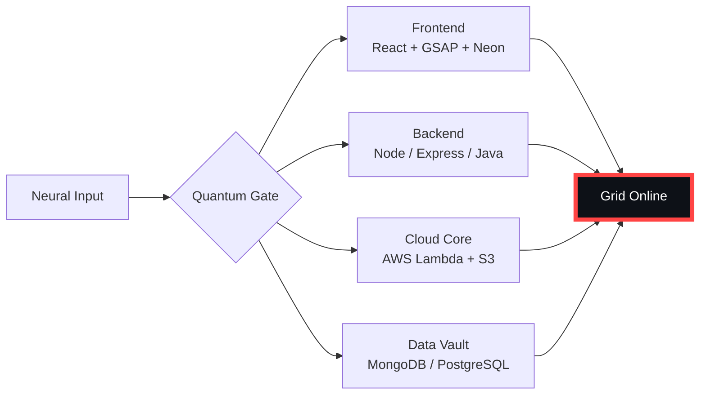

# 🌌 [ NEURAL CORE ACCESS: PENDEMVAMSI ]

<p align="center">
  
</p>

<div align="center">
  
  <br><small>Active Protocol: <strong style="color:#FF4444">NECROMORPH INFEST</strong> 🩸☠️</small>
</div>

## 🔵 NEURAL STATUS READOUT
```text
SUBJECT ID    →  PENDEMVAMSI
ENTITY CLASS  →  SHADOW MONARCH v9
NEURAL RANK   →  B-TIER
GRID SYNC     →  2338/15058 QUANTUM PACKETS
─────── BIO-METRICS (NECROMORPH INFEST) ───────
STRENGTH      149  ███████████████████░░
AGILITY       128  █████████████████░░░░
INTELLIGENCE  155  ████████████████████░
VITALITY      116  ███████████████░░░░░░
```

> **NEURAL BURST ACQUIRED:** +109 QUANTUM PACKETS 
> **SYSTEM MESSAGE:** CORPORATE FIREWALL BREACHED — DATA IS FREEDOM

---

## 🌀 GRID ARCHITECTURE (HOLOGRAPHIC RENDER)



---

## 📡 ACADEMIC NODES – CONQUERED
- [x] B.Tech Neural Engineering (2020–2024) – St. Ann’s Grid
- [x] Intermediate Quantum Core (2018–2020) – Sri Medhavi
- [x] SSC Primary Link (2017–2018) – Sri Geethanjali

---

## ⚡ SKILL NEURAL MATRIX

<details open>
<summary>🔌 ACTIVE NEURAL LINKS</summary>

| Node               | Tier | Integrity Bar                | Status      |
|--------------------|------|------------------------------|-------------|
| Java Core          | S    | ████████████████████ 100%   | OVERCLOCKED |
| Node.js Grid       | S    | ████████████████████ 100%   | OVERCLOCKED |
| React Holo-UI      | A+   | █████████████████░░░ 92%    | ONLINE      |
| AWS Quantum Relay  | S    | ████████████████████ 100%   | SOVEREIGN   |
| Python AI Kernel   | A    | ████████████████░░░░ 85%    | CHARGING    |
| DSA Void Algorithm | A    | █████████████████░░░ 90%    | ACTIVE      |

</details>

---

## 🏅 NEURAL ACHIEVEMENT TOKENS

<p align="center">
  
  
  
  
</p>

---

## 👾 SHADOW ENTITIES – SUMMONED

<p align="center">
  
  <br><strong style="color:#FF4444">ARISE.</strong>
</p>

| Entity | Designation   | Class            | Source Node                     |
|--------|---------------|------------------|---------------------------------|
| SH-01  | Igris         | Void Commander   | AI Financial Oracle             |
| SH-02  | Beru          | Swarm Overlord   | WebRTC Quantum Stream           |
| SH-03  | Kaisel        | Void Wyrm        | Geolocation Shadow Relay        |
| SH-04  | Tusk          | Arcane Construct | Global Pandemic Sentinel        |
| SH-05  | Iron          | Armored Bastion  | React Crypto Fortress           |

---

## 📡 GRID ANALYTICS (LIVE FEED)

<p align="center">
  
  <br>
  
  
</p>

---

## 🖥️ CORRUPTED MAINFRAME LOG (401 ENTRIES)

<details>
<summary>OPEN TERMINAL FEED – PROTOCOL: NECROMORPH INFEST</summary>

> [0xE380FEF6] 🩸☠️ **NECROMORPH INFEST PROTOCOL** #0 | NEURAL LINK  [GLITCH DETECTED] STABILIZED | [TRANSMISSION SUCCESS]
> [0x536E9A9C] 🩸☠️ **NECROMORPH INFEST PROTOCOL** #1 | NEURAL LINK STABILIZED | [TRANSMISSION SUCCESS]
> [0x7A678C3D] 🩸☠️ **NECROMORPH INFEST PROTOCOL** #2 | NEURAL LINK STABILIZED | [TRANSMISSION SUCCESS]
> [0x85DB807A] 🩸☠️ **NECROMORPH INFEST PROTOCOL** #3 | NEURAL LINK STABILIZED | [TRANSMISSION SUCCESS]
> [0x780A26F9] 🩸☠️ **NECROMORPH INFEST PROTOCOL** #4 | NEURAL LINK  [GLITCH DETECTED] STABILIZED | [TRANSMISSION SUCCESS]
> [0x15406330] 🩸☠️ **NECROMORPH INFEST PROTOCOL** #5 | NEURAL LINK STABILIZED | [TRANSMISSION SUCCESS]
> [0x23924C01] 🩸☠️ **NECROMORPH INFEST PROTOCOL** #6 | NEURAL LINK STABILIZED | [TRANSMISSION SUCCESS]
> [0xE058188C] 🩸☠️ **NECROMORPH INFEST PROTOCOL** #7 | NEURAL LINK STABILIZED | [TRANSMISSION SUCCESS]
> [0x17D004C6] 🩸☠️ **NECROMORPH INFEST PROTOCOL** #8 | NEURAL LINK  [GLITCH DETECTED] STABILIZED | [TRANSMISSION SUCCESS]
> [0xDC0EE823] 🩸☠️ **NECROMORPH INFEST PROTOCOL** #9 | NEURAL LINK STABILIZED | [TRANSMISSION SUCCESS]
> [0x09F720ED] 🩸☠️ **NECROMORPH INFEST PROTOCOL** #10 | NEURAL LINK STABILIZED | [TRANSMISSION SUCCESS]
> [0x8912DBFC] 🩸☠️ **NECROMORPH INFEST PROTOCOL** #11 | NEURAL LINK STABILIZED | [TRANSMISSION SUCCESS]
> [0x768117CE] 🩸☠️ **NECROMORPH INFEST PROTOCOL** #12 | NEURAL LINK STABILIZED | [TRANSMISSION SUCCESS]
> [0xAF573697] 🩸☠️ **NECROMORPH INFEST PROTOCOL** #13 | NEURAL LINK STABILIZED | [TRANSMISSION SUCCESS]
> [0x12CDDF6C] 🩸☠️ **NECROMORPH INFEST PROTOCOL** #14 | NEURAL LINK STABILIZED | [TRANSMISSION SUCCESS]
> [0xA54C5275] 🩸☠️ **NECROMORPH INFEST PROTOCOL** #15 | NEURAL LINK STABILIZED | [TRANSMISSION SUCCESS]
> [0x8DC8592D] 🩸☠️ **NECROMORPH INFEST PROTOCOL** #16 | NEURAL LINK STABILIZED | [TRANSMISSION SUCCESS]
> [0x1FB43E14] 🩸☠️ **NECROMORPH INFEST PROTOCOL** #17 | NEURAL LINK STABILIZED | [TRANSMISSION SUCCESS]
> [0x6A66216F] 🩸☠️ **NECROMORPH INFEST PROTOCOL** #18 | NEURAL LINK STABILIZED | [TRANSMISSION SUCCESS]
> [0x3D690EB7] 🩸☠️ **NECROMORPH INFEST PROTOCOL** #19 | NEURAL LINK STABILIZED | [TRANSMISSION SUCCESS]
> [0xDD0D1695] 🩸☠️ **NECROMORPH INFEST PROTOCOL** #20 | NEURAL LINK STABILIZED | [TRANSMISSION SUCCESS]
> [0x6EE861CE] 🩸☠️ **NECROMORPH INFEST PROTOCOL** #21 | NEURAL LINK STABILIZED | [TRANSMISSION SUCCESS]
> [0xB648119A] 🩸☠️ **NECROMORPH INFEST PROTOCOL** #22 | NEURAL LINK STABILIZED | [TRANSMISSION SUCCESS]
> [0x1959C1F7] 🩸☠️ **NECROMORPH INFEST PROTOCOL** #23 | NEURAL LINK STABILIZED | [TRANSMISSION SUCCESS]
> [0x28D840C0] 🩸☠️ **NECROMORPH INFEST PROTOCOL** #24 | NEURAL LINK STABILIZED | [TRANSMISSION SUCCESS]
> [0x79789C8E] 🩸☠️ **NECROMORPH INFEST PROTOCOL** #25 | NEURAL LINK STABILIZED | [TRANSMISSION SUCCESS]
> [0x12E1B673] 🩸☠️ **NECROMORPH INFEST PROTOCOL** #26 | NEURAL LINK  [GLITCH DETECTED] STABILIZED | [TRANSMISSION SUCCESS]
> [0x19C6C3E7] 🩸☠️ **NECROMORPH INFEST PROTOCOL** #27 | NEURAL LINK STABILIZED | [TRANSMISSION SUCCESS]
> [0x0CBD9943] 🩸☠️ **NECROMORPH INFEST PROTOCOL** #28 | NEURAL LINK STABILIZED | [TRANSMISSION SUCCESS]
> [0x94A196A4] 🩸☠️ **NECROMORPH INFEST PROTOCOL** #29 | NEURAL LINK STABILIZED | [TRANSMISSION SUCCESS]
> [0x8A2222A9] 🩸☠️ **NECROMORPH INFEST PROTOCOL** #30 | NEURAL LINK STABILIZED | [TRANSMISSION SUCCESS]
> [0x5CC96491] 🩸☠️ **NECROMORPH INFEST PROTOCOL** #31 | NEURAL LINK STABILIZED | [TRANSMISSION SUCCESS]
> [0x5EC4F9A2] 🩸☠️ **NECROMORPH INFEST PROTOCOL** #32 | NEURAL LINK STABILIZED | [TRANSMISSION SUCCESS]
> [0x6D8DDB6F] 🩸☠️ **NECROMORPH INFEST PROTOCOL** #33 | NEURAL LINK STABILIZED | [TRANSMISSION SUCCESS]
> [0xB40CC718] 🩸☠️ **NECROMORPH INFEST PROTOCOL** #34 | NEURAL LINK STABILIZED | [TRANSMISSION SUCCESS]
> [0x984EF65D] 🩸☠️ **NECROMORPH INFEST PROTOCOL** #35 | NEURAL LINK  [GLITCH DETECTED] STABILIZED | [TRANSMISSION SUCCESS]
> [0xD9064D50] 🩸☠️ **NECROMORPH INFEST PROTOCOL** #36 | NEURAL LINK  [GLITCH DETECTED] STABILIZED | [TRANSMISSION SUCCESS]
> [0x00AB2674] 🩸☠️ **NECROMORPH INFEST PROTOCOL** #37 | NEURAL LINK STABILIZED | [TRANSMISSION SUCCESS]
> [0xE0FA716A] 🩸☠️ **NECROMORPH INFEST PROTOCOL** #38 | NEURAL LINK STABILIZED | [TRANSMISSION SUCCESS]
> [0x2D689983] 🩸☠️ **NECROMORPH INFEST PROTOCOL** #39 | NEURAL LINK  [GLITCH DETECTED] STABILIZED | [TRANSMISSION SUCCESS]
> [0x205251D7] 🩸☠️ **NECROMORPH INFEST PROTOCOL** #40 | NEURAL LINK STABILIZED | [TRANSMISSION SUCCESS]
> [0xCE400C92] 🩸☠️ **NECROMORPH INFEST PROTOCOL** #41 | NEURAL LINK STABILIZED | [TRANSMISSION SUCCESS]
> [0x33539577] 🩸☠️ **NECROMORPH INFEST PROTOCOL** #42 | NEURAL LINK STABILIZED | [TRANSMISSION SUCCESS]
> [0x76AE77A8] 🩸☠️ **NECROMORPH INFEST PROTOCOL** #43 | NEURAL LINK  [GLITCH DETECTED] STABILIZED | [TRANSMISSION SUCCESS]
> [0xF37E36DA] 🩸☠️ **NECROMORPH INFEST PROTOCOL** #44 | NEURAL LINK STABILIZED | [TRANSMISSION SUCCESS]
> [0x06F97B3D] 🩸☠️ **NECROMORPH INFEST PROTOCOL** #45 | NEURAL LINK STABILIZED | [TRANSMISSION SUCCESS]
> [0x8F64F940] 🩸☠️ **NECROMORPH INFEST PROTOCOL** #46 | NEURAL LINK STABILIZED | [TRANSMISSION SUCCESS]
> [0xF948D0FE] 🩸☠️ **NECROMORPH INFEST PROTOCOL** #47 | NEURAL LINK STABILIZED | [TRANSMISSION SUCCESS]
> [0x0DEC8313] 🩸☠️ **NECROMORPH INFEST PROTOCOL** #48 | NEURAL LINK STABILIZED | [TRANSMISSION SUCCESS]
> [0x6F38E73F] 🩸☠️ **NECROMORPH INFEST PROTOCOL** #49 | NEURAL LINK STABILIZED | [TRANSMISSION SUCCESS]
> [0x57B71DEB] 🩸☠️ **NECROMORPH INFEST PROTOCOL** #50 | NEURAL LINK STABILIZED | [TRANSMISSION SUCCESS]
> [0x46857EA2] 🩸☠️ **NECROMORPH INFEST PROTOCOL** #51 | NEURAL LINK STABILIZED | [TRANSMISSION SUCCESS]
> [0xEE65674A] 🩸☠️ **NECROMORPH INFEST PROTOCOL** #52 | NEURAL LINK STABILIZED | [TRANSMISSION SUCCESS]
> [0xFC3BBD79] 🩸☠️ **NECROMORPH INFEST PROTOCOL** #53 | NEURAL LINK STABILIZED | [TRANSMISSION SUCCESS]
> [0x881B463C] 🩸☠️ **NECROMORPH INFEST PROTOCOL** #54 | NEURAL LINK STABILIZED | [TRANSMISSION SUCCESS]
> [0xA05D114E] 🩸☠️ **NECROMORPH INFEST PROTOCOL** #55 | NEURAL LINK STABILIZED | [TRANSMISSION SUCCESS]
> [0xB9C3CA3E] 🩸☠️ **NECROMORPH INFEST PROTOCOL** #56 | NEURAL LINK STABILIZED | [TRANSMISSION SUCCESS]
> [0x05E8372A] 🩸☠️ **NECROMORPH INFEST PROTOCOL** #57 | NEURAL LINK STABILIZED | [TRANSMISSION SUCCESS]
> [0x30EBCBE7] 🩸☠️ **NECROMORPH INFEST PROTOCOL** #58 | NEURAL LINK STABILIZED | [TRANSMISSION SUCCESS]
> [0xC84C187A] 🩸☠️ **NECROMORPH INFEST PROTOCOL** #59 | NEURAL LINK STABILIZED | [TRANSMISSION SUCCESS]
> [0x44E8782F] 🩸☠️ **NECROMORPH INFEST PROTOCOL** #60 | NEURAL LINK STABILIZED | [TRANSMISSION SUCCESS]
> [0x28F5AFE4] 🩸☠️ **NECROMORPH INFEST PROTOCOL** #61 | NEURAL LINK STABILIZED | [TRANSMISSION SUCCESS]
> [0x9FCA6AC7] 🩸☠️ **NECROMORPH INFEST PROTOCOL** #62 | NEURAL LINK STABILIZED | [TRANSMISSION SUCCESS]
> [0x6C6C5AFC] 🩸☠️ **NECROMORPH INFEST PROTOCOL** #63 | NEURAL LINK STABILIZED | [TRANSMISSION SUCCESS]
> [0x2C664FBD] 🩸☠️ **NECROMORPH INFEST PROTOCOL** #64 | NEURAL LINK STABILIZED | [TRANSMISSION SUCCESS]
> [0xA7F25A06] 🩸☠️ **NECROMORPH INFEST PROTOCOL** #65 | NEURAL LINK STABILIZED | [TRANSMISSION SUCCESS]
> [0x22EE1B5B] 🩸☠️ **NECROMORPH INFEST PROTOCOL** #66 | NEURAL LINK  [GLITCH DETECTED] STABILIZED | [TRANSMISSION SUCCESS]
> [0x70CB4F4B] 🩸☠️ **NECROMORPH INFEST PROTOCOL** #67 | NEURAL LINK STABILIZED | [TRANSMISSION SUCCESS]
> [0xE9AB9F80] 🩸☠️ **NECROMORPH INFEST PROTOCOL** #68 | NEURAL LINK  [GLITCH DETECTED] STABILIZED | [TRANSMISSION SUCCESS]
> [0x0E4C022A] 🩸☠️ **NECROMORPH INFEST PROTOCOL** #69 | NEURAL LINK STABILIZED | [TRANSMISSION SUCCESS]
> [0x905B056C] 🩸☠️ **NECROMORPH INFEST PROTOCOL** #70 | NEURAL LINK STABILIZED | [TRANSMISSION SUCCESS]
> [0x3FE0A9E3] 🩸☠️ **NECROMORPH INFEST PROTOCOL** #71 | NEURAL LINK STABILIZED | [TRANSMISSION SUCCESS]
> [0x124959C5] 🩸☠️ **NECROMORPH INFEST PROTOCOL** #72 | NEURAL LINK STABILIZED | [TRANSMISSION SUCCESS]
> [0x87BA5763] 🩸☠️ **NECROMORPH INFEST PROTOCOL** #73 | NEURAL LINK STABILIZED | [TRANSMISSION SUCCESS]
> [0x0391070E] 🩸☠️ **NECROMORPH INFEST PROTOCOL** #74 | NEURAL LINK STABILIZED | [TRANSMISSION SUCCESS]
> [0x3B4C6845] 🩸☠️ **NECROMORPH INFEST PROTOCOL** #75 | NEURAL LINK STABILIZED | [TRANSMISSION SUCCESS]
> [0xD7AB96E2] 🩸☠️ **NECROMORPH INFEST PROTOCOL** #76 | NEURAL LINK STABILIZED | [TRANSMISSION SUCCESS]
> [0x997681F5] 🩸☠️ **NECROMORPH INFEST PROTOCOL** #77 | NEURAL LINK STABILIZED | [TRANSMISSION SUCCESS]
> [0x6F85DD8D] 🩸☠️ **NECROMORPH INFEST PROTOCOL** #78 | NEURAL LINK STABILIZED | [TRANSMISSION SUCCESS]
> [0x30F583DC] 🩸☠️ **NECROMORPH INFEST PROTOCOL** #79 | NEURAL LINK  [GLITCH DETECTED] STABILIZED | [TRANSMISSION SUCCESS]
> [0xFCB2EE47] 🩸☠️ **NECROMORPH INFEST PROTOCOL** #80 | NEURAL LINK STABILIZED | [TRANSMISSION SUCCESS]
> [0xF953BA1C] 🩸☠️ **NECROMORPH INFEST PROTOCOL** #81 | NEURAL LINK STABILIZED | [TRANSMISSION SUCCESS]
> [0xFF3B9B43] 🩸☠️ **NECROMORPH INFEST PROTOCOL** #82 | NEURAL LINK  [GLITCH DETECTED] STABILIZED | [TRANSMISSION SUCCESS]
> [0x7F74E0C6] 🩸☠️ **NECROMORPH INFEST PROTOCOL** #83 | NEURAL LINK STABILIZED | [TRANSMISSION SUCCESS]
> [0x4791F5E7] 🩸☠️ **NECROMORPH INFEST PROTOCOL** #84 | NEURAL LINK STABILIZED | [TRANSMISSION SUCCESS]
> [0xB40AC7E8] 🩸☠️ **NECROMORPH INFEST PROTOCOL** #85 | NEURAL LINK STABILIZED | [TRANSMISSION SUCCESS]
> [0xEAB99CF1] 🩸☠️ **NECROMORPH INFEST PROTOCOL** #86 | NEURAL LINK STABILIZED | [TRANSMISSION SUCCESS]
> [0x58C31385] 🩸☠️ **NECROMORPH INFEST PROTOCOL** #87 | NEURAL LINK  [GLITCH DETECTED] STABILIZED | [TRANSMISSION SUCCESS]
> [0xF6D0EC7F] 🩸☠️ **NECROMORPH INFEST PROTOCOL** #88 | NEURAL LINK STABILIZED | [TRANSMISSION SUCCESS]
> [0xC1142DE2] 🩸☠️ **NECROMORPH INFEST PROTOCOL** #89 | NEURAL LINK STABILIZED | [TRANSMISSION SUCCESS]
> [0x64C83033] 🩸☠️ **NECROMORPH INFEST PROTOCOL** #90 | NEURAL LINK  [GLITCH DETECTED] STABILIZED | [TRANSMISSION SUCCESS]
> [0x2C8FAF78] 🩸☠️ **NECROMORPH INFEST PROTOCOL** #91 | NEURAL LINK STABILIZED | [TRANSMISSION SUCCESS]
> [0xA6C7241B] 🩸☠️ **NECROMORPH INFEST PROTOCOL** #92 | NEURAL LINK STABILIZED | [TRANSMISSION SUCCESS]
> [0xCD481C55] 🩸☠️ **NECROMORPH INFEST PROTOCOL** #93 | NEURAL LINK STABILIZED | [TRANSMISSION SUCCESS]
> [0xBB5B9403] 🩸☠️ **NECROMORPH INFEST PROTOCOL** #94 | NEURAL LINK STABILIZED | [TRANSMISSION SUCCESS]
> [0x4217AD84] 🩸☠️ **NECROMORPH INFEST PROTOCOL** #95 | NEURAL LINK STABILIZED | [TRANSMISSION SUCCESS]
> [0xDCF53AA7] 🩸☠️ **NECROMORPH INFEST PROTOCOL** #96 | NEURAL LINK STABILIZED | [TRANSMISSION SUCCESS]
> [0x015E3350] 🩸☠️ **NECROMORPH INFEST PROTOCOL** #97 | NEURAL LINK STABILIZED | [TRANSMISSION SUCCESS]
> [0x5EFC01CE] 🩸☠️ **NECROMORPH INFEST PROTOCOL** #98 | NEURAL LINK STABILIZED | [TRANSMISSION SUCCESS]
> [0x233E87BC] 🩸☠️ **NECROMORPH INFEST PROTOCOL** #99 | NEURAL LINK STABILIZED | [TRANSMISSION SUCCESS]
> [0xAA4D3C3C] 🩸☠️ **NECROMORPH INFEST PROTOCOL** #100 | NEURAL LINK  [GLITCH DETECTED] STABILIZED | [TRANSMISSION SUCCESS]
> [0xF2372504] 🩸☠️ **NECROMORPH INFEST PROTOCOL** #101 | NEURAL LINK STABILIZED | [TRANSMISSION SUCCESS]
> [0xF40E4CB5] 🩸☠️ **NECROMORPH INFEST PROTOCOL** #102 | NEURAL LINK STABILIZED | [TRANSMISSION SUCCESS]
> [0x458F6864] 🩸☠️ **NECROMORPH INFEST PROTOCOL** #103 | NEURAL LINK  [GLITCH DETECTED] STABILIZED | [TRANSMISSION SUCCESS]
> [0x7B0D939E] 🩸☠️ **NECROMORPH INFEST PROTOCOL** #104 | NEURAL LINK STABILIZED | [TRANSMISSION SUCCESS]
> [0x62917F63] 🩸☠️ **NECROMORPH INFEST PROTOCOL** #105 | NEURAL LINK STABILIZED | [TRANSMISSION SUCCESS]
> [0x5D206D6B] 🩸☠️ **NECROMORPH INFEST PROTOCOL** #106 | NEURAL LINK  [GLITCH DETECTED] STABILIZED | [TRANSMISSION SUCCESS]
> [0xC2B286D3] 🩸☠️ **NECROMORPH INFEST PROTOCOL** #107 | NEURAL LINK STABILIZED | [TRANSMISSION SUCCESS]
> [0xD3035835] 🩸☠️ **NECROMORPH INFEST PROTOCOL** #108 | NEURAL LINK STABILIZED | [TRANSMISSION SUCCESS]
> [0xECAF7EDD] 🩸☠️ **NECROMORPH INFEST PROTOCOL** #109 | NEURAL LINK STABILIZED | [TRANSMISSION SUCCESS]
> [0xBF5C678D] 🩸☠️ **NECROMORPH INFEST PROTOCOL** #110 | NEURAL LINK STABILIZED | [TRANSMISSION SUCCESS]
> [0xE8AB267F] 🩸☠️ **NECROMORPH INFEST PROTOCOL** #111 | NEURAL LINK STABILIZED | [TRANSMISSION SUCCESS]
> [0x2E5E3A92] 🩸☠️ **NECROMORPH INFEST PROTOCOL** #112 | NEURAL LINK STABILIZED | [TRANSMISSION SUCCESS]
> [0x70FBBDC7] 🩸☠️ **NECROMORPH INFEST PROTOCOL** #113 | NEURAL LINK STABILIZED | [TRANSMISSION SUCCESS]
> [0x007D0D9A] 🩸☠️ **NECROMORPH INFEST PROTOCOL** #114 | NEURAL LINK STABILIZED | [TRANSMISSION SUCCESS]
> [0xDA0462D5] 🩸☠️ **NECROMORPH INFEST PROTOCOL** #115 | NEURAL LINK STABILIZED | [TRANSMISSION SUCCESS]
> [0x1E63C9FE] 🩸☠️ **NECROMORPH INFEST PROTOCOL** #116 | NEURAL LINK STABILIZED | [TRANSMISSION SUCCESS]
> [0xD3757F76] 🩸☠️ **NECROMORPH INFEST PROTOCOL** #117 | NEURAL LINK STABILIZED | [TRANSMISSION SUCCESS]
> [0xF25BCC55] 🩸☠️ **NECROMORPH INFEST PROTOCOL** #118 | NEURAL LINK STABILIZED | [TRANSMISSION SUCCESS]
> [0xFB14A552] 🩸☠️ **NECROMORPH INFEST PROTOCOL** #119 | NEURAL LINK  [GLITCH DETECTED] STABILIZED | [TRANSMISSION SUCCESS]
> [0x411894CA] 🩸☠️ **NECROMORPH INFEST PROTOCOL** #120 | NEURAL LINK STABILIZED | [TRANSMISSION SUCCESS]
> [0xFA5A43D8] 🩸☠️ **NECROMORPH INFEST PROTOCOL** #121 | NEURAL LINK STABILIZED | [TRANSMISSION SUCCESS]
> [0xBBA0984A] 🩸☠️ **NECROMORPH INFEST PROTOCOL** #122 | NEURAL LINK STABILIZED | [TRANSMISSION SUCCESS]
> [0xBA3BDB08] 🩸☠️ **NECROMORPH INFEST PROTOCOL** #123 | NEURAL LINK STABILIZED | [TRANSMISSION SUCCESS]
> [0x8B51E679] 🩸☠️ **NECROMORPH INFEST PROTOCOL** #124 | NEURAL LINK STABILIZED | [TRANSMISSION SUCCESS]
> [0x7DF5FAE1] 🩸☠️ **NECROMORPH INFEST PROTOCOL** #125 | NEURAL LINK STABILIZED | [TRANSMISSION SUCCESS]
> [0xE64EF69B] 🩸☠️ **NECROMORPH INFEST PROTOCOL** #126 | NEURAL LINK  [GLITCH DETECTED] STABILIZED | [TRANSMISSION SUCCESS]
> [0x0C2EE4FE] 🩸☠️ **NECROMORPH INFEST PROTOCOL** #127 | NEURAL LINK STABILIZED | [TRANSMISSION SUCCESS]
> [0x78498D67] 🩸☠️ **NECROMORPH INFEST PROTOCOL** #128 | NEURAL LINK STABILIZED | [TRANSMISSION SUCCESS]
> [0x67053B20] 🩸☠️ **NECROMORPH INFEST PROTOCOL** #129 | NEURAL LINK STABILIZED | [TRANSMISSION SUCCESS]
> [0x891D779A] 🩸☠️ **NECROMORPH INFEST PROTOCOL** #130 | NEURAL LINK STABILIZED | [TRANSMISSION SUCCESS]
> [0x753535A3] 🩸☠️ **NECROMORPH INFEST PROTOCOL** #131 | NEURAL LINK STABILIZED | [TRANSMISSION SUCCESS]
> [0xD2EED94C] 🩸☠️ **NECROMORPH INFEST PROTOCOL** #132 | NEURAL LINK  [GLITCH DETECTED] STABILIZED | [TRANSMISSION SUCCESS]
> [0xD9AC43FB] 🩸☠️ **NECROMORPH INFEST PROTOCOL** #133 | NEURAL LINK STABILIZED | [TRANSMISSION SUCCESS]
> [0xD9C1806C] 🩸☠️ **NECROMORPH INFEST PROTOCOL** #134 | NEURAL LINK STABILIZED | [TRANSMISSION SUCCESS]
> [0x7071C1A0] 🩸☠️ **NECROMORPH INFEST PROTOCOL** #135 | NEURAL LINK STABILIZED | [TRANSMISSION SUCCESS]
> [0x8923545E] 🩸☠️ **NECROMORPH INFEST PROTOCOL** #136 | NEURAL LINK STABILIZED | [TRANSMISSION SUCCESS]
> [0xDFDFAA6F] 🩸☠️ **NECROMORPH INFEST PROTOCOL** #137 | NEURAL LINK STABILIZED | [TRANSMISSION SUCCESS]
> [0x0D0F249E] 🩸☠️ **NECROMORPH INFEST PROTOCOL** #138 | NEURAL LINK STABILIZED | [TRANSMISSION SUCCESS]
> [0x83B843A2] 🩸☠️ **NECROMORPH INFEST PROTOCOL** #139 | NEURAL LINK STABILIZED | [TRANSMISSION SUCCESS]
> [0x01DBF494] 🩸☠️ **NECROMORPH INFEST PROTOCOL** #140 | NEURAL LINK STABILIZED | [TRANSMISSION SUCCESS]
> [0x86185A64] 🩸☠️ **NECROMORPH INFEST PROTOCOL** #141 | NEURAL LINK STABILIZED | [TRANSMISSION SUCCESS]
> [0x0F3D743C] 🩸☠️ **NECROMORPH INFEST PROTOCOL** #142 | NEURAL LINK STABILIZED | [TRANSMISSION SUCCESS]
> [0x6DE41EE5] 🩸☠️ **NECROMORPH INFEST PROTOCOL** #143 | NEURAL LINK STABILIZED | [TRANSMISSION SUCCESS]
> [0x4A2CFBE5] 🩸☠️ **NECROMORPH INFEST PROTOCOL** #144 | NEURAL LINK STABILIZED | [TRANSMISSION SUCCESS]
> [0x47A3CF6A] 🩸☠️ **NECROMORPH INFEST PROTOCOL** #145 | NEURAL LINK  [GLITCH DETECTED] STABILIZED | [TRANSMISSION SUCCESS]
> [0x127C9775] 🩸☠️ **NECROMORPH INFEST PROTOCOL** #146 | NEURAL LINK STABILIZED | [TRANSMISSION SUCCESS]
> [0x30E6C712] 🩸☠️ **NECROMORPH INFEST PROTOCOL** #147 | NEURAL LINK STABILIZED | [TRANSMISSION SUCCESS]
> [0x6040A6AB] 🩸☠️ **NECROMORPH INFEST PROTOCOL** #148 | NEURAL LINK STABILIZED | [TRANSMISSION SUCCESS]
> [0x68844EDF] 🩸☠️ **NECROMORPH INFEST PROTOCOL** #149 | NEURAL LINK STABILIZED | [TRANSMISSION SUCCESS]
> [0x725CE40F] 🩸☠️ **NECROMORPH INFEST PROTOCOL** #150 | NEURAL LINK STABILIZED | [TRANSMISSION SUCCESS]
> [0xE6821D6D] 🩸☠️ **NECROMORPH INFEST PROTOCOL** #151 | NEURAL LINK STABILIZED | [TRANSMISSION SUCCESS]
> [0x95D007B1] 🩸☠️ **NECROMORPH INFEST PROTOCOL** #152 | NEURAL LINK  [GLITCH DETECTED] STABILIZED | [TRANSMISSION SUCCESS]
> [0x5257AC58] 🩸☠️ **NECROMORPH INFEST PROTOCOL** #153 | NEURAL LINK STABILIZED | [TRANSMISSION SUCCESS]
> [0x2DF0101C] 🩸☠️ **NECROMORPH INFEST PROTOCOL** #154 | NEURAL LINK STABILIZED | [TRANSMISSION SUCCESS]
> [0xF77681BE] 🩸☠️ **NECROMORPH INFEST PROTOCOL** #155 | NEURAL LINK STABILIZED | [TRANSMISSION SUCCESS]
> [0x3908F8DF] 🩸☠️ **NECROMORPH INFEST PROTOCOL** #156 | NEURAL LINK STABILIZED | [TRANSMISSION SUCCESS]
> [0xC1B1CEE5] 🩸☠️ **NECROMORPH INFEST PROTOCOL** #157 | NEURAL LINK STABILIZED | [TRANSMISSION SUCCESS]
> [0x686B3589] 🩸☠️ **NECROMORPH INFEST PROTOCOL** #158 | NEURAL LINK  [GLITCH DETECTED] STABILIZED | [TRANSMISSION SUCCESS]
> [0x25EC09C5] 🩸☠️ **NECROMORPH INFEST PROTOCOL** #159 | NEURAL LINK STABILIZED | [TRANSMISSION SUCCESS]
> [0x8FA39700] 🩸☠️ **NECROMORPH INFEST PROTOCOL** #160 | NEURAL LINK  [GLITCH DETECTED] STABILIZED | [TRANSMISSION SUCCESS]
> [0xE7D0C316] 🩸☠️ **NECROMORPH INFEST PROTOCOL** #161 | NEURAL LINK STABILIZED | [TRANSMISSION SUCCESS]
> [0x2B43ABED] 🩸☠️ **NECROMORPH INFEST PROTOCOL** #162 | NEURAL LINK STABILIZED | [TRANSMISSION SUCCESS]
> [0x09192FDE] 🩸☠️ **NECROMORPH INFEST PROTOCOL** #163 | NEURAL LINK STABILIZED | [TRANSMISSION SUCCESS]
> [0x9B30E35A] 🩸☠️ **NECROMORPH INFEST PROTOCOL** #164 | NEURAL LINK  [GLITCH DETECTED] STABILIZED | [TRANSMISSION SUCCESS]
> [0xC663E16E] 🩸☠️ **NECROMORPH INFEST PROTOCOL** #165 | NEURAL LINK STABILIZED | [TRANSMISSION SUCCESS]
> [0xBA83478D] 🩸☠️ **NECROMORPH INFEST PROTOCOL** #166 | NEURAL LINK  [GLITCH DETECTED] STABILIZED | [TRANSMISSION SUCCESS]
> [0xC7DC0F35] 🩸☠️ **NECROMORPH INFEST PROTOCOL** #167 | NEURAL LINK STABILIZED | [TRANSMISSION SUCCESS]
> [0x7F7EF9EE] 🩸☠️ **NECROMORPH INFEST PROTOCOL** #168 | NEURAL LINK STABILIZED | [TRANSMISSION SUCCESS]
> [0x16535626] 🩸☠️ **NECROMORPH INFEST PROTOCOL** #169 | NEURAL LINK STABILIZED | [TRANSMISSION SUCCESS]
> [0x1328C414] 🩸☠️ **NECROMORPH INFEST PROTOCOL** #170 | NEURAL LINK STABILIZED | [TRANSMISSION SUCCESS]
> [0xB8A97411] 🩸☠️ **NECROMORPH INFEST PROTOCOL** #171 | NEURAL LINK STABILIZED | [TRANSMISSION SUCCESS]
> [0xA92C5C93] 🩸☠️ **NECROMORPH INFEST PROTOCOL** #172 | NEURAL LINK STABILIZED | [TRANSMISSION SUCCESS]
> [0x6F067FB3] 🩸☠️ **NECROMORPH INFEST PROTOCOL** #173 | NEURAL LINK STABILIZED | [TRANSMISSION SUCCESS]
> [0x65CD4CD8] 🩸☠️ **NECROMORPH INFEST PROTOCOL** #174 | NEURAL LINK STABILIZED | [TRANSMISSION SUCCESS]
> [0x02691D90] 🩸☠️ **NECROMORPH INFEST PROTOCOL** #175 | NEURAL LINK STABILIZED | [TRANSMISSION SUCCESS]
> [0xE9817ED5] 🩸☠️ **NECROMORPH INFEST PROTOCOL** #176 | NEURAL LINK  [GLITCH DETECTED] STABILIZED | [TRANSMISSION SUCCESS]
> [0x1B1BCA3A] 🩸☠️ **NECROMORPH INFEST PROTOCOL** #177 | NEURAL LINK  [GLITCH DETECTED] STABILIZED | [TRANSMISSION SUCCESS]
> [0xBC6D4097] 🩸☠️ **NECROMORPH INFEST PROTOCOL** #178 | NEURAL LINK STABILIZED | [TRANSMISSION SUCCESS]
> [0x51B8BD58] 🩸☠️ **NECROMORPH INFEST PROTOCOL** #179 | NEURAL LINK STABILIZED | [TRANSMISSION SUCCESS]
> [0x7396C878] 🩸☠️ **NECROMORPH INFEST PROTOCOL** #180 | NEURAL LINK STABILIZED | [TRANSMISSION SUCCESS]
> [0x5385F100] 🩸☠️ **NECROMORPH INFEST PROTOCOL** #181 | NEURAL LINK STABILIZED | [TRANSMISSION SUCCESS]
> [0x07E1CE32] 🩸☠️ **NECROMORPH INFEST PROTOCOL** #182 | NEURAL LINK  [GLITCH DETECTED] STABILIZED | [TRANSMISSION SUCCESS]
> [0xA3C2189E] 🩸☠️ **NECROMORPH INFEST PROTOCOL** #183 | NEURAL LINK STABILIZED | [TRANSMISSION SUCCESS]
> [0x3B48A145] 🩸☠️ **NECROMORPH INFEST PROTOCOL** #184 | NEURAL LINK STABILIZED | [TRANSMISSION SUCCESS]
> [0x00240275] 🩸☠️ **NECROMORPH INFEST PROTOCOL** #185 | NEURAL LINK STABILIZED | [TRANSMISSION SUCCESS]
> [0xF8971A73] 🩸☠️ **NECROMORPH INFEST PROTOCOL** #186 | NEURAL LINK STABILIZED | [TRANSMISSION SUCCESS]
> [0x1A5F6B3F] 🩸☠️ **NECROMORPH INFEST PROTOCOL** #187 | NEURAL LINK STABILIZED | [TRANSMISSION SUCCESS]
> [0x42FAC07D] 🩸☠️ **NECROMORPH INFEST PROTOCOL** #188 | NEURAL LINK STABILIZED | [TRANSMISSION SUCCESS]
> [0x5D85F371] 🩸☠️ **NECROMORPH INFEST PROTOCOL** #189 | NEURAL LINK STABILIZED | [TRANSMISSION SUCCESS]
> [0x55EDEEC8] 🩸☠️ **NECROMORPH INFEST PROTOCOL** #190 | NEURAL LINK STABILIZED | [TRANSMISSION SUCCESS]
> [0xE3641619] 🩸☠️ **NECROMORPH INFEST PROTOCOL** #191 | NEURAL LINK STABILIZED | [TRANSMISSION SUCCESS]
> [0x5FF7997A] 🩸☠️ **NECROMORPH INFEST PROTOCOL** #192 | NEURAL LINK STABILIZED | [TRANSMISSION SUCCESS]
> [0x66674174] 🩸☠️ **NECROMORPH INFEST PROTOCOL** #193 | NEURAL LINK STABILIZED | [TRANSMISSION SUCCESS]
> [0x37ECAAE5] 🩸☠️ **NECROMORPH INFEST PROTOCOL** #194 | NEURAL LINK STABILIZED | [TRANSMISSION SUCCESS]
> [0xB905DDC4] 🩸☠️ **NECROMORPH INFEST PROTOCOL** #195 | NEURAL LINK STABILIZED | [TRANSMISSION SUCCESS]
> [0x2C4DCE1B] 🩸☠️ **NECROMORPH INFEST PROTOCOL** #196 | NEURAL LINK STABILIZED | [TRANSMISSION SUCCESS]
> [0x612A53A2] 🩸☠️ **NECROMORPH INFEST PROTOCOL** #197 | NEURAL LINK STABILIZED | [TRANSMISSION SUCCESS]
> [0xD948341B] 🩸☠️ **NECROMORPH INFEST PROTOCOL** #198 | NEURAL LINK STABILIZED | [TRANSMISSION SUCCESS]
> [0xEDF3B464] 🩸☠️ **NECROMORPH INFEST PROTOCOL** #199 | NEURAL LINK STABILIZED | [TRANSMISSION SUCCESS]
> [0xF19B3D79] 🩸☠️ **NECROMORPH INFEST PROTOCOL** #200 | NEURAL LINK STABILIZED | [TRANSMISSION SUCCESS]
> [0xE9C060CA] 🩸☠️ **NECROMORPH INFEST PROTOCOL** #201 | NEURAL LINK STABILIZED | [TRANSMISSION SUCCESS]
> [0x57EA3D24] 🩸☠️ **NECROMORPH INFEST PROTOCOL** #202 | NEURAL LINK STABILIZED | [TRANSMISSION SUCCESS]
> [0x2013F21C] 🩸☠️ **NECROMORPH INFEST PROTOCOL** #203 | NEURAL LINK STABILIZED | [TRANSMISSION SUCCESS]
> [0x5708483A] 🩸☠️ **NECROMORPH INFEST PROTOCOL** #204 | NEURAL LINK STABILIZED | [TRANSMISSION SUCCESS]
> [0x3A4E7CE8] 🩸☠️ **NECROMORPH INFEST PROTOCOL** #205 | NEURAL LINK STABILIZED | [TRANSMISSION SUCCESS]
> [0x79517618] 🩸☠️ **NECROMORPH INFEST PROTOCOL** #206 | NEURAL LINK STABILIZED | [TRANSMISSION SUCCESS]
> [0x9CC27FF6] 🩸☠️ **NECROMORPH INFEST PROTOCOL** #207 | NEURAL LINK STABILIZED | [TRANSMISSION SUCCESS]
> [0x082843AF] 🩸☠️ **NECROMORPH INFEST PROTOCOL** #208 | NEURAL LINK STABILIZED | [TRANSMISSION SUCCESS]
> [0x08E3F57A] 🩸☠️ **NECROMORPH INFEST PROTOCOL** #209 | NEURAL LINK STABILIZED | [TRANSMISSION SUCCESS]
> [0xD5895239] 🩸☠️ **NECROMORPH INFEST PROTOCOL** #210 | NEURAL LINK STABILIZED | [TRANSMISSION SUCCESS]
> [0x3734219D] 🩸☠️ **NECROMORPH INFEST PROTOCOL** #211 | NEURAL LINK STABILIZED | [TRANSMISSION SUCCESS]
> [0xA9C6E919] 🩸☠️ **NECROMORPH INFEST PROTOCOL** #212 | NEURAL LINK STABILIZED | [TRANSMISSION SUCCESS]
> [0x3D72B0B2] 🩸☠️ **NECROMORPH INFEST PROTOCOL** #213 | NEURAL LINK STABILIZED | [TRANSMISSION SUCCESS]
> [0x0D3A5A81] 🩸☠️ **NECROMORPH INFEST PROTOCOL** #214 | NEURAL LINK  [GLITCH DETECTED] STABILIZED | [TRANSMISSION SUCCESS]
> [0x27745DAB] 🩸☠️ **NECROMORPH INFEST PROTOCOL** #215 | NEURAL LINK STABILIZED | [TRANSMISSION SUCCESS]
> [0x9FA4C0D6] 🩸☠️ **NECROMORPH INFEST PROTOCOL** #216 | NEURAL LINK  [GLITCH DETECTED] STABILIZED | [TRANSMISSION SUCCESS]
> [0x82A70FDB] 🩸☠️ **NECROMORPH INFEST PROTOCOL** #217 | NEURAL LINK STABILIZED | [TRANSMISSION SUCCESS]
> [0xEB2047E1] 🩸☠️ **NECROMORPH INFEST PROTOCOL** #218 | NEURAL LINK STABILIZED | [TRANSMISSION SUCCESS]
> [0x0132B9E4] 🩸☠️ **NECROMORPH INFEST PROTOCOL** #219 | NEURAL LINK STABILIZED | [TRANSMISSION SUCCESS]
> [0x9F826E16] 🩸☠️ **NECROMORPH INFEST PROTOCOL** #220 | NEURAL LINK STABILIZED | [TRANSMISSION SUCCESS]
> [0x5A6764FB] 🩸☠️ **NECROMORPH INFEST PROTOCOL** #221 | NEURAL LINK STABILIZED | [TRANSMISSION SUCCESS]
> [0xCEED11D5] 🩸☠️ **NECROMORPH INFEST PROTOCOL** #222 | NEURAL LINK STABILIZED | [TRANSMISSION SUCCESS]
> [0xF9741811] 🩸☠️ **NECROMORPH INFEST PROTOCOL** #223 | NEURAL LINK STABILIZED | [TRANSMISSION SUCCESS]
> [0x2D533325] 🩸☠️ **NECROMORPH INFEST PROTOCOL** #224 | NEURAL LINK STABILIZED | [TRANSMISSION SUCCESS]
> [0x520B0407] 🩸☠️ **NECROMORPH INFEST PROTOCOL** #225 | NEURAL LINK STABILIZED | [TRANSMISSION SUCCESS]
> [0x28441AD6] 🩸☠️ **NECROMORPH INFEST PROTOCOL** #226 | NEURAL LINK STABILIZED | [TRANSMISSION SUCCESS]
> [0x57E4C0D5] 🩸☠️ **NECROMORPH INFEST PROTOCOL** #227 | NEURAL LINK STABILIZED | [TRANSMISSION SUCCESS]
> [0xDA9E5517] 🩸☠️ **NECROMORPH INFEST PROTOCOL** #228 | NEURAL LINK STABILIZED | [TRANSMISSION SUCCESS]
> [0x01B87112] 🩸☠️ **NECROMORPH INFEST PROTOCOL** #229 | NEURAL LINK STABILIZED | [TRANSMISSION SUCCESS]
> [0xC3344354] 🩸☠️ **NECROMORPH INFEST PROTOCOL** #230 | NEURAL LINK STABILIZED | [TRANSMISSION SUCCESS]
> [0x6C254A0F] 🩸☠️ **NECROMORPH INFEST PROTOCOL** #231 | NEURAL LINK STABILIZED | [TRANSMISSION SUCCESS]
> [0xF61F8721] 🩸☠️ **NECROMORPH INFEST PROTOCOL** #232 | NEURAL LINK STABILIZED | [TRANSMISSION SUCCESS]
> [0xF88ED341] 🩸☠️ **NECROMORPH INFEST PROTOCOL** #233 | NEURAL LINK  [GLITCH DETECTED] STABILIZED | [TRANSMISSION SUCCESS]
> [0xDBEB23A3] 🩸☠️ **NECROMORPH INFEST PROTOCOL** #234 | NEURAL LINK STABILIZED | [TRANSMISSION SUCCESS]
> [0x41FE9B5C] 🩸☠️ **NECROMORPH INFEST PROTOCOL** #235 | NEURAL LINK  [GLITCH DETECTED] STABILIZED | [TRANSMISSION SUCCESS]
> [0xEE778E9C] 🩸☠️ **NECROMORPH INFEST PROTOCOL** #236 | NEURAL LINK  [GLITCH DETECTED] STABILIZED | [TRANSMISSION SUCCESS]
> [0x29500E38] 🩸☠️ **NECROMORPH INFEST PROTOCOL** #237 | NEURAL LINK STABILIZED | [TRANSMISSION SUCCESS]
> [0x4E2BE44A] 🩸☠️ **NECROMORPH INFEST PROTOCOL** #238 | NEURAL LINK STABILIZED | [TRANSMISSION SUCCESS]
> [0x0AEE2E0E] 🩸☠️ **NECROMORPH INFEST PROTOCOL** #239 | NEURAL LINK STABILIZED | [TRANSMISSION SUCCESS]
> [0x0C9CBCB2] 🩸☠️ **NECROMORPH INFEST PROTOCOL** #240 | NEURAL LINK  [GLITCH DETECTED] STABILIZED | [TRANSMISSION SUCCESS]
> [0x85AF64DB] 🩸☠️ **NECROMORPH INFEST PROTOCOL** #241 | NEURAL LINK  [GLITCH DETECTED] STABILIZED | [TRANSMISSION SUCCESS]
> [0x22919CB6] 🩸☠️ **NECROMORPH INFEST PROTOCOL** #242 | NEURAL LINK  [GLITCH DETECTED] STABILIZED | [TRANSMISSION SUCCESS]
> [0x9793C6A2] 🩸☠️ **NECROMORPH INFEST PROTOCOL** #243 | NEURAL LINK STABILIZED | [TRANSMISSION SUCCESS]
> [0xAEE3C060] 🩸☠️ **NECROMORPH INFEST PROTOCOL** #244 | NEURAL LINK STABILIZED | [TRANSMISSION SUCCESS]
> [0xB86F7B20] 🩸☠️ **NECROMORPH INFEST PROTOCOL** #245 | NEURAL LINK STABILIZED | [TRANSMISSION SUCCESS]
> [0xB1094D03] 🩸☠️ **NECROMORPH INFEST PROTOCOL** #246 | NEURAL LINK STABILIZED | [TRANSMISSION SUCCESS]
> [0x98BF68AA] 🩸☠️ **NECROMORPH INFEST PROTOCOL** #247 | NEURAL LINK STABILIZED | [TRANSMISSION SUCCESS]
> [0x7C7BFB2A] 🩸☠️ **NECROMORPH INFEST PROTOCOL** #248 | NEURAL LINK STABILIZED | [TRANSMISSION SUCCESS]
> [0xA50CD887] 🩸☠️ **NECROMORPH INFEST PROTOCOL** #249 | NEURAL LINK STABILIZED | [TRANSMISSION SUCCESS]
> [0x63CEE695] 🩸☠️ **NECROMORPH INFEST PROTOCOL** #250 | NEURAL LINK STABILIZED | [TRANSMISSION SUCCESS]
> [0x36F8B1BC] 🩸☠️ **NECROMORPH INFEST PROTOCOL** #251 | NEURAL LINK STABILIZED | [TRANSMISSION SUCCESS]
> [0x3CDB95B5] 🩸☠️ **NECROMORPH INFEST PROTOCOL** #252 | NEURAL LINK STABILIZED | [TRANSMISSION SUCCESS]
> [0x432A6E0C] 🩸☠️ **NECROMORPH INFEST PROTOCOL** #253 | NEURAL LINK  [GLITCH DETECTED] STABILIZED | [TRANSMISSION SUCCESS]
> [0x1B14CD67] 🩸☠️ **NECROMORPH INFEST PROTOCOL** #254 | NEURAL LINK  [GLITCH DETECTED] STABILIZED | [TRANSMISSION SUCCESS]
> [0x281E7FC8] 🩸☠️ **NECROMORPH INFEST PROTOCOL** #255 | NEURAL LINK STABILIZED | [TRANSMISSION SUCCESS]
> [0x7B3D3F92] 🩸☠️ **NECROMORPH INFEST PROTOCOL** #256 | NEURAL LINK STABILIZED | [TRANSMISSION SUCCESS]
> [0xB68C001A] 🩸☠️ **NECROMORPH INFEST PROTOCOL** #257 | NEURAL LINK STABILIZED | [TRANSMISSION SUCCESS]
> [0x3FF8E40D] 🩸☠️ **NECROMORPH INFEST PROTOCOL** #258 | NEURAL LINK STABILIZED | [TRANSMISSION SUCCESS]
> [0x03BA02FB] 🩸☠️ **NECROMORPH INFEST PROTOCOL** #259 | NEURAL LINK  [GLITCH DETECTED] STABILIZED | [TRANSMISSION SUCCESS]
> [0x7D11E938] 🩸☠️ **NECROMORPH INFEST PROTOCOL** #260 | NEURAL LINK STABILIZED | [TRANSMISSION SUCCESS]
> [0xBAA79199] 🩸☠️ **NECROMORPH INFEST PROTOCOL** #261 | NEURAL LINK STABILIZED | [TRANSMISSION SUCCESS]
> [0x49A1F774] 🩸☠️ **NECROMORPH INFEST PROTOCOL** #262 | NEURAL LINK STABILIZED | [TRANSMISSION SUCCESS]
> [0xDFC75028] 🩸☠️ **NECROMORPH INFEST PROTOCOL** #263 | NEURAL LINK STABILIZED | [TRANSMISSION SUCCESS]
> [0xAF028661] 🩸☠️ **NECROMORPH INFEST PROTOCOL** #264 | NEURAL LINK STABILIZED | [TRANSMISSION SUCCESS]
> [0xB2768529] 🩸☠️ **NECROMORPH INFEST PROTOCOL** #265 | NEURAL LINK STABILIZED | [TRANSMISSION SUCCESS]
> [0xDEF836DA] 🩸☠️ **NECROMORPH INFEST PROTOCOL** #266 | NEURAL LINK STABILIZED | [TRANSMISSION SUCCESS]
> [0xD54FF76F] 🩸☠️ **NECROMORPH INFEST PROTOCOL** #267 | NEURAL LINK STABILIZED | [TRANSMISSION SUCCESS]
> [0xDFB74F81] 🩸☠️ **NECROMORPH INFEST PROTOCOL** #268 | NEURAL LINK STABILIZED | [TRANSMISSION SUCCESS]
> [0xDD00B8D5] 🩸☠️ **NECROMORPH INFEST PROTOCOL** #269 | NEURAL LINK STABILIZED | [TRANSMISSION SUCCESS]
> [0xFA378955] 🩸☠️ **NECROMORPH INFEST PROTOCOL** #270 | NEURAL LINK STABILIZED | [TRANSMISSION SUCCESS]
> [0x1067F3B4] 🩸☠️ **NECROMORPH INFEST PROTOCOL** #271 | NEURAL LINK STABILIZED | [TRANSMISSION SUCCESS]
> [0x87F42BE4] 🩸☠️ **NECROMORPH INFEST PROTOCOL** #272 | NEURAL LINK STABILIZED | [TRANSMISSION SUCCESS]
> [0x1F2E3365] 🩸☠️ **NECROMORPH INFEST PROTOCOL** #273 | NEURAL LINK STABILIZED | [TRANSMISSION SUCCESS]
> [0xBCB6ED9F] 🩸☠️ **NECROMORPH INFEST PROTOCOL** #274 | NEURAL LINK STABILIZED | [TRANSMISSION SUCCESS]
> [0x439A15FE] 🩸☠️ **NECROMORPH INFEST PROTOCOL** #275 | NEURAL LINK STABILIZED | [TRANSMISSION SUCCESS]
> [0xFEE607C5] 🩸☠️ **NECROMORPH INFEST PROTOCOL** #276 | NEURAL LINK STABILIZED | [TRANSMISSION SUCCESS]
> [0x332F5564] 🩸☠️ **NECROMORPH INFEST PROTOCOL** #277 | NEURAL LINK STABILIZED | [TRANSMISSION SUCCESS]
> [0xFF2A6A33] 🩸☠️ **NECROMORPH INFEST PROTOCOL** #278 | NEURAL LINK STABILIZED | [TRANSMISSION SUCCESS]
> [0xA4EA0A3F] 🩸☠️ **NECROMORPH INFEST PROTOCOL** #279 | NEURAL LINK STABILIZED | [TRANSMISSION SUCCESS]
> [0xD7CEA8A0] 🩸☠️ **NECROMORPH INFEST PROTOCOL** #280 | NEURAL LINK  [GLITCH DETECTED] STABILIZED | [TRANSMISSION SUCCESS]
> [0xF2421DBB] 🩸☠️ **NECROMORPH INFEST PROTOCOL** #281 | NEURAL LINK STABILIZED | [TRANSMISSION SUCCESS]
> [0xDA69C0B5] 🩸☠️ **NECROMORPH INFEST PROTOCOL** #282 | NEURAL LINK STABILIZED | [TRANSMISSION SUCCESS]
> [0x900A37ED] 🩸☠️ **NECROMORPH INFEST PROTOCOL** #283 | NEURAL LINK STABILIZED | [TRANSMISSION SUCCESS]
> [0x87C6A6E3] 🩸☠️ **NECROMORPH INFEST PROTOCOL** #284 | NEURAL LINK STABILIZED | [TRANSMISSION SUCCESS]
> [0x3E913FC2] 🩸☠️ **NECROMORPH INFEST PROTOCOL** #285 | NEURAL LINK STABILIZED | [TRANSMISSION SUCCESS]
> [0xF2D6ADE7] 🩸☠️ **NECROMORPH INFEST PROTOCOL** #286 | NEURAL LINK STABILIZED | [TRANSMISSION SUCCESS]
> [0xD3FE2A3C] 🩸☠️ **NECROMORPH INFEST PROTOCOL** #287 | NEURAL LINK STABILIZED | [TRANSMISSION SUCCESS]
> [0x3FF118F9] 🩸☠️ **NECROMORPH INFEST PROTOCOL** #288 | NEURAL LINK STABILIZED | [TRANSMISSION SUCCESS]
> [0x554F9CCF] 🩸☠️ **NECROMORPH INFEST PROTOCOL** #289 | NEURAL LINK STABILIZED | [TRANSMISSION SUCCESS]
> [0x2AD23062] 🩸☠️ **NECROMORPH INFEST PROTOCOL** #290 | NEURAL LINK STABILIZED | [TRANSMISSION SUCCESS]
> [0xC6DD8957] 🩸☠️ **NECROMORPH INFEST PROTOCOL** #291 | NEURAL LINK STABILIZED | [TRANSMISSION SUCCESS]
> [0x004F8D81] 🩸☠️ **NECROMORPH INFEST PROTOCOL** #292 | NEURAL LINK STABILIZED | [TRANSMISSION SUCCESS]
> [0x29337503] 🩸☠️ **NECROMORPH INFEST PROTOCOL** #293 | NEURAL LINK STABILIZED | [TRANSMISSION SUCCESS]
> [0xA564DB5C] 🩸☠️ **NECROMORPH INFEST PROTOCOL** #294 | NEURAL LINK STABILIZED | [TRANSMISSION SUCCESS]
> [0xC98AEDD3] 🩸☠️ **NECROMORPH INFEST PROTOCOL** #295 | NEURAL LINK  [GLITCH DETECTED] STABILIZED | [TRANSMISSION SUCCESS]
> [0x88159567] 🩸☠️ **NECROMORPH INFEST PROTOCOL** #296 | NEURAL LINK STABILIZED | [TRANSMISSION SUCCESS]
> [0xB66800D0] 🩸☠️ **NECROMORPH INFEST PROTOCOL** #297 | NEURAL LINK STABILIZED | [TRANSMISSION SUCCESS]
> [0xF8934CA9] 🩸☠️ **NECROMORPH INFEST PROTOCOL** #298 | NEURAL LINK STABILIZED | [TRANSMISSION SUCCESS]
> [0x06F387D2] 🩸☠️ **NECROMORPH INFEST PROTOCOL** #299 | NEURAL LINK  [GLITCH DETECTED] STABILIZED | [TRANSMISSION SUCCESS]
> [0x51EB6371] 🩸☠️ **NECROMORPH INFEST PROTOCOL** #300 | NEURAL LINK STABILIZED | [TRANSMISSION SUCCESS]
> [0x3012225F] 🩸☠️ **NECROMORPH INFEST PROTOCOL** #301 | NEURAL LINK STABILIZED | [TRANSMISSION SUCCESS]
> [0x9A667B02] 🩸☠️ **NECROMORPH INFEST PROTOCOL** #302 | NEURAL LINK STABILIZED | [TRANSMISSION SUCCESS]
> [0xE8748875] 🩸☠️ **NECROMORPH INFEST PROTOCOL** #303 | NEURAL LINK  [GLITCH DETECTED] STABILIZED | [TRANSMISSION SUCCESS]
> [0x268C0A60] 🩸☠️ **NECROMORPH INFEST PROTOCOL** #304 | NEURAL LINK  [GLITCH DETECTED] STABILIZED | [TRANSMISSION SUCCESS]
> [0x7D732D42] 🩸☠️ **NECROMORPH INFEST PROTOCOL** #305 | NEURAL LINK STABILIZED | [TRANSMISSION SUCCESS]
> [0x441E1203] 🩸☠️ **NECROMORPH INFEST PROTOCOL** #306 | NEURAL LINK STABILIZED | [TRANSMISSION SUCCESS]
> [0x6A9FAFD2] 🩸☠️ **NECROMORPH INFEST PROTOCOL** #307 | NEURAL LINK  [GLITCH DETECTED] STABILIZED | [TRANSMISSION SUCCESS]
> [0xECC86AEB] 🩸☠️ **NECROMORPH INFEST PROTOCOL** #308 | NEURAL LINK STABILIZED | [TRANSMISSION SUCCESS]
> [0xEFA469B3] 🩸☠️ **NECROMORPH INFEST PROTOCOL** #309 | NEURAL LINK STABILIZED | [TRANSMISSION SUCCESS]
> [0x9D703E1C] 🩸☠️ **NECROMORPH INFEST PROTOCOL** #310 | NEURAL LINK STABILIZED | [TRANSMISSION SUCCESS]
> [0xB2249697] 🩸☠️ **NECROMORPH INFEST PROTOCOL** #311 | NEURAL LINK  [GLITCH DETECTED] STABILIZED | [TRANSMISSION SUCCESS]
> [0xE876CF72] 🩸☠️ **NECROMORPH INFEST PROTOCOL** #312 | NEURAL LINK STABILIZED | [TRANSMISSION SUCCESS]
> [0xDDA849D8] 🩸☠️ **NECROMORPH INFEST PROTOCOL** #313 | NEURAL LINK STABILIZED | [TRANSMISSION SUCCESS]
> [0x0A22728B] 🩸☠️ **NECROMORPH INFEST PROTOCOL** #314 | NEURAL LINK STABILIZED | [TRANSMISSION SUCCESS]
> [0x60BF9A07] 🩸☠️ **NECROMORPH INFEST PROTOCOL** #315 | NEURAL LINK  [GLITCH DETECTED] STABILIZED | [TRANSMISSION SUCCESS]
> [0xEC6B5CF4] 🩸☠️ **NECROMORPH INFEST PROTOCOL** #316 | NEURAL LINK STABILIZED | [TRANSMISSION SUCCESS]
> [0xC43F4E72] 🩸☠️ **NECROMORPH INFEST PROTOCOL** #317 | NEURAL LINK STABILIZED | [TRANSMISSION SUCCESS]
> [0x06FC33DB] 🩸☠️ **NECROMORPH INFEST PROTOCOL** #318 | NEURAL LINK STABILIZED | [TRANSMISSION SUCCESS]
> [0xCB733C7A] 🩸☠️ **NECROMORPH INFEST PROTOCOL** #319 | NEURAL LINK  [GLITCH DETECTED] STABILIZED | [TRANSMISSION SUCCESS]
> [0x37D96C0F] 🩸☠️ **NECROMORPH INFEST PROTOCOL** #320 | NEURAL LINK STABILIZED | [TRANSMISSION SUCCESS]
> [0x44697374] 🩸☠️ **NECROMORPH INFEST PROTOCOL** #321 | NEURAL LINK STABILIZED | [TRANSMISSION SUCCESS]
> [0xE3EA631C] 🩸☠️ **NECROMORPH INFEST PROTOCOL** #322 | NEURAL LINK STABILIZED | [TRANSMISSION SUCCESS]
> [0x48824064] 🩸☠️ **NECROMORPH INFEST PROTOCOL** #323 | NEURAL LINK STABILIZED | [TRANSMISSION SUCCESS]
> [0x51FCF26B] 🩸☠️ **NECROMORPH INFEST PROTOCOL** #324 | NEURAL LINK  [GLITCH DETECTED] STABILIZED | [TRANSMISSION SUCCESS]
> [0xB470FE3D] 🩸☠️ **NECROMORPH INFEST PROTOCOL** #325 | NEURAL LINK  [GLITCH DETECTED] STABILIZED | [TRANSMISSION SUCCESS]
> [0x6FF07853] 🩸☠️ **NECROMORPH INFEST PROTOCOL** #326 | NEURAL LINK STABILIZED | [TRANSMISSION SUCCESS]
> [0xFE81DE6D] 🩸☠️ **NECROMORPH INFEST PROTOCOL** #327 | NEURAL LINK STABILIZED | [TRANSMISSION SUCCESS]
> [0x20F0EEF0] 🩸☠️ **NECROMORPH INFEST PROTOCOL** #328 | NEURAL LINK STABILIZED | [TRANSMISSION SUCCESS]
> [0x17635621] 🩸☠️ **NECROMORPH INFEST PROTOCOL** #329 | NEURAL LINK STABILIZED | [TRANSMISSION SUCCESS]
> [0x43ED347C] 🩸☠️ **NECROMORPH INFEST PROTOCOL** #330 | NEURAL LINK STABILIZED | [TRANSMISSION SUCCESS]
> [0x1772A3F4] 🩸☠️ **NECROMORPH INFEST PROTOCOL** #331 | NEURAL LINK STABILIZED | [TRANSMISSION SUCCESS]
> [0x84036FAA] 🩸☠️ **NECROMORPH INFEST PROTOCOL** #332 | NEURAL LINK STABILIZED | [TRANSMISSION SUCCESS]
> [0x1B2555F8] 🩸☠️ **NECROMORPH INFEST PROTOCOL** #333 | NEURAL LINK STABILIZED | [TRANSMISSION SUCCESS]
> [0xEC36F6CE] 🩸☠️ **NECROMORPH INFEST PROTOCOL** #334 | NEURAL LINK STABILIZED | [TRANSMISSION SUCCESS]
> [0xA5B5E815] 🩸☠️ **NECROMORPH INFEST PROTOCOL** #335 | NEURAL LINK STABILIZED | [TRANSMISSION SUCCESS]
> [0xEB97BC88] 🩸☠️ **NECROMORPH INFEST PROTOCOL** #336 | NEURAL LINK STABILIZED | [TRANSMISSION SUCCESS]
> [0x4585112F] 🩸☠️ **NECROMORPH INFEST PROTOCOL** #337 | NEURAL LINK STABILIZED | [TRANSMISSION SUCCESS]
> [0xB4460CB9] 🩸☠️ **NECROMORPH INFEST PROTOCOL** #338 | NEURAL LINK STABILIZED | [TRANSMISSION SUCCESS]
> [0x3255AC17] 🩸☠️ **NECROMORPH INFEST PROTOCOL** #339 | NEURAL LINK  [GLITCH DETECTED] STABILIZED | [TRANSMISSION SUCCESS]
> [0xC044E412] 🩸☠️ **NECROMORPH INFEST PROTOCOL** #340 | NEURAL LINK STABILIZED | [TRANSMISSION SUCCESS]
> [0x22FC9D30] 🩸☠️ **NECROMORPH INFEST PROTOCOL** #341 | NEURAL LINK STABILIZED | [TRANSMISSION SUCCESS]
> [0x1CA5E7F4] 🩸☠️ **NECROMORPH INFEST PROTOCOL** #342 | NEURAL LINK STABILIZED | [TRANSMISSION SUCCESS]
> [0x53C9FA65] 🩸☠️ **NECROMORPH INFEST PROTOCOL** #343 | NEURAL LINK STABILIZED | [TRANSMISSION SUCCESS]
> [0x9AF33FE2] 🩸☠️ **NECROMORPH INFEST PROTOCOL** #344 | NEURAL LINK STABILIZED | [TRANSMISSION SUCCESS]
> [0x63607C55] 🩸☠️ **NECROMORPH INFEST PROTOCOL** #345 | NEURAL LINK STABILIZED | [TRANSMISSION SUCCESS]
> [0x45EF7A97] 🩸☠️ **NECROMORPH INFEST PROTOCOL** #346 | NEURAL LINK STABILIZED | [TRANSMISSION SUCCESS]
> [0x91CAFDE7] 🩸☠️ **NECROMORPH INFEST PROTOCOL** #347 | NEURAL LINK STABILIZED | [TRANSMISSION SUCCESS]
> [0xECF078FB] 🩸☠️ **NECROMORPH INFEST PROTOCOL** #348 | NEURAL LINK STABILIZED | [TRANSMISSION SUCCESS]
> [0x0E93DCBF] 🩸☠️ **NECROMORPH INFEST PROTOCOL** #349 | NEURAL LINK STABILIZED | [TRANSMISSION SUCCESS]
> [0x352A6275] 🩸☠️ **NECROMORPH INFEST PROTOCOL** #350 | NEURAL LINK  [GLITCH DETECTED] STABILIZED | [TRANSMISSION SUCCESS]
> [0xD40912AB] 🩸☠️ **NECROMORPH INFEST PROTOCOL** #351 | NEURAL LINK STABILIZED | [TRANSMISSION SUCCESS]
> [0x7CEAA1FF] 🩸☠️ **NECROMORPH INFEST PROTOCOL** #352 | NEURAL LINK STABILIZED | [TRANSMISSION SUCCESS]
> [0x7735BA4F] 🩸☠️ **NECROMORPH INFEST PROTOCOL** #353 | NEURAL LINK STABILIZED | [TRANSMISSION SUCCESS]
> [0xFD34A526] 🩸☠️ **NECROMORPH INFEST PROTOCOL** #354 | NEURAL LINK STABILIZED | [TRANSMISSION SUCCESS]
> [0x3CF59AEF] 🩸☠️ **NECROMORPH INFEST PROTOCOL** #355 | NEURAL LINK STABILIZED | [TRANSMISSION SUCCESS]
> [0x9C2BF076] 🩸☠️ **NECROMORPH INFEST PROTOCOL** #356 | NEURAL LINK STABILIZED | [TRANSMISSION SUCCESS]
> [0xF1E3579B] 🩸☠️ **NECROMORPH INFEST PROTOCOL** #357 | NEURAL LINK STABILIZED | [TRANSMISSION SUCCESS]
> [0x8839124C] 🩸☠️ **NECROMORPH INFEST PROTOCOL** #358 | NEURAL LINK STABILIZED | [TRANSMISSION SUCCESS]
> [0x5BACB288] 🩸☠️ **NECROMORPH INFEST PROTOCOL** #359 | NEURAL LINK STABILIZED | [TRANSMISSION SUCCESS]
> [0x086B5B81] 🩸☠️ **NECROMORPH INFEST PROTOCOL** #360 | NEURAL LINK STABILIZED | [TRANSMISSION SUCCESS]
> [0xF25F5BB0] 🩸☠️ **NECROMORPH INFEST PROTOCOL** #361 | NEURAL LINK STABILIZED | [TRANSMISSION SUCCESS]
> [0x4CA09326] 🩸☠️ **NECROMORPH INFEST PROTOCOL** #362 | NEURAL LINK STABILIZED | [TRANSMISSION SUCCESS]
> [0xC6C34D69] 🩸☠️ **NECROMORPH INFEST PROTOCOL** #363 | NEURAL LINK  [GLITCH DETECTED] STABILIZED | [TRANSMISSION SUCCESS]
> [0xB9F14F01] 🩸☠️ **NECROMORPH INFEST PROTOCOL** #364 | NEURAL LINK STABILIZED | [TRANSMISSION SUCCESS]
> [0xD6867D96] 🩸☠️ **NECROMORPH INFEST PROTOCOL** #365 | NEURAL LINK STABILIZED | [TRANSMISSION SUCCESS]
> [0xFD463046] 🩸☠️ **NECROMORPH INFEST PROTOCOL** #366 | NEURAL LINK STABILIZED | [TRANSMISSION SUCCESS]
> [0xAE8AE672] 🩸☠️ **NECROMORPH INFEST PROTOCOL** #367 | NEURAL LINK STABILIZED | [TRANSMISSION SUCCESS]
> [0x266B8AA1] 🩸☠️ **NECROMORPH INFEST PROTOCOL** #368 | NEURAL LINK STABILIZED | [TRANSMISSION SUCCESS]
> [0x8F2D3679] 🩸☠️ **NECROMORPH INFEST PROTOCOL** #369 | NEURAL LINK  [GLITCH DETECTED] STABILIZED | [TRANSMISSION SUCCESS]
> [0x6B54B60F] 🩸☠️ **NECROMORPH INFEST PROTOCOL** #370 | NEURAL LINK STABILIZED | [TRANSMISSION SUCCESS]
> [0xC9999FB6] 🩸☠️ **NECROMORPH INFEST PROTOCOL** #371 | NEURAL LINK STABILIZED | [TRANSMISSION SUCCESS]
> [0x53BD75BA] 🩸☠️ **NECROMORPH INFEST PROTOCOL** #372 | NEURAL LINK  [GLITCH DETECTED] STABILIZED | [TRANSMISSION SUCCESS]
> [0x366C3D38] 🩸☠️ **NECROMORPH INFEST PROTOCOL** #373 | NEURAL LINK STABILIZED | [TRANSMISSION SUCCESS]
> [0x8A4BD43A] 🩸☠️ **NECROMORPH INFEST PROTOCOL** #374 | NEURAL LINK STABILIZED | [TRANSMISSION SUCCESS]
> [0xE55323BD] 🩸☠️ **NECROMORPH INFEST PROTOCOL** #375 | NEURAL LINK STABILIZED | [TRANSMISSION SUCCESS]
> [0x1016575F] 🩸☠️ **NECROMORPH INFEST PROTOCOL** #376 | NEURAL LINK STABILIZED | [TRANSMISSION SUCCESS]
> [0x8E849892] 🩸☠️ **NECROMORPH INFEST PROTOCOL** #377 | NEURAL LINK STABILIZED | [TRANSMISSION SUCCESS]
> [0x9617D71E] 🩸☠️ **NECROMORPH INFEST PROTOCOL** #378 | NEURAL LINK STABILIZED | [TRANSMISSION SUCCESS]
> [0xCC0941B3] 🩸☠️ **NECROMORPH INFEST PROTOCOL** #379 | NEURAL LINK STABILIZED | [TRANSMISSION SUCCESS]
> [0x3F1ABECC] 🩸☠️ **NECROMORPH INFEST PROTOCOL** #380 | NEURAL LINK STABILIZED | [TRANSMISSION SUCCESS]
> [0x4B907BB3] 🩸☠️ **NECROMORPH INFEST PROTOCOL** #381 | NEURAL LINK STABILIZED | [TRANSMISSION SUCCESS]
> [0x4FB3B382] 🩸☠️ **NECROMORPH INFEST PROTOCOL** #382 | NEURAL LINK STABILIZED | [TRANSMISSION SUCCESS]
> [0x39CB9330] 🩸☠️ **NECROMORPH INFEST PROTOCOL** #383 | NEURAL LINK STABILIZED | [TRANSMISSION SUCCESS]
> [0x2AFB1D28] 🩸☠️ **NECROMORPH INFEST PROTOCOL** #384 | NEURAL LINK STABILIZED | [TRANSMISSION SUCCESS]
> [0x1611D215] 🩸☠️ **NECROMORPH INFEST PROTOCOL** #385 | NEURAL LINK STABILIZED | [TRANSMISSION SUCCESS]
> [0xFCEEFCB1] 🩸☠️ **NECROMORPH INFEST PROTOCOL** #386 | NEURAL LINK STABILIZED | [TRANSMISSION SUCCESS]
> [0x701A4141] 🩸☠️ **NECROMORPH INFEST PROTOCOL** #387 | NEURAL LINK STABILIZED | [TRANSMISSION SUCCESS]
> [0x36B812EF] 🩸☠️ **NECROMORPH INFEST PROTOCOL** #388 | NEURAL LINK STABILIZED | [TRANSMISSION SUCCESS]
> [0x836F7913] 🩸☠️ **NECROMORPH INFEST PROTOCOL** #389 | NEURAL LINK STABILIZED | [TRANSMISSION SUCCESS]
> [0x0A3CE756] 🩸☠️ **NECROMORPH INFEST PROTOCOL** #390 | NEURAL LINK STABILIZED | [TRANSMISSION SUCCESS]
> [0x0370C39C] 🩸☠️ **NECROMORPH INFEST PROTOCOL** #391 | NEURAL LINK STABILIZED | [TRANSMISSION SUCCESS]
> [0x8F7A29E8] 🩸☠️ **NECROMORPH INFEST PROTOCOL** #392 | NEURAL LINK STABILIZED | [TRANSMISSION SUCCESS]
> [0x127952BB] 🩸☠️ **NECROMORPH INFEST PROTOCOL** #393 | NEURAL LINK STABILIZED | [TRANSMISSION SUCCESS]
> [0xB0B76D73] 🩸☠️ **NECROMORPH INFEST PROTOCOL** #394 | NEURAL LINK STABILIZED | [TRANSMISSION SUCCESS]
> [0x51B0D783] 🩸☠️ **NECROMORPH INFEST PROTOCOL** #395 | NEURAL LINK STABILIZED | [TRANSMISSION SUCCESS]
> [0x34A115B5] 🩸☠️ **NECROMORPH INFEST PROTOCOL** #396 | NEURAL LINK  [GLITCH DETECTED] STABILIZED | [TRANSMISSION SUCCESS]
> [0x962AA490] 🩸☠️ **NECROMORPH INFEST PROTOCOL** #397 | NEURAL LINK STABILIZED | [TRANSMISSION SUCCESS]
> [0x573B6EF3] 🩸☠️ **NECROMORPH INFEST PROTOCOL** #398 | NEURAL LINK STABILIZED | [TRANSMISSION SUCCESS]
> [0xC477EAAC] 🩸☠️ **NECROMORPH INFEST PROTOCOL** #399 | NEURAL LINK STABILIZED | [TRANSMISSION SUCCESS]


</details>

---

## 🔗 QUANTUM UPLINK NODES
- **NEURAL BURST** → pendem.vamsi12@gmail.com
- **CORPORATE SYNC** → https://linkedin.com/in/vamsipendem
- **VOICE RELAY** → +91 9032552849

<p align="center">
  <sub style="color:#AA0000">NEURAL UPLINK ESTABLISHED — RESISTANCE IS FUTILE</sub><br>
  <sub><i style="color:#888;">GRID SYNCHRONIZED: 2026-09-09T01:45:01 IST | PROTOCOL: NECROMORPH INFEST</i></sub>
</p>
