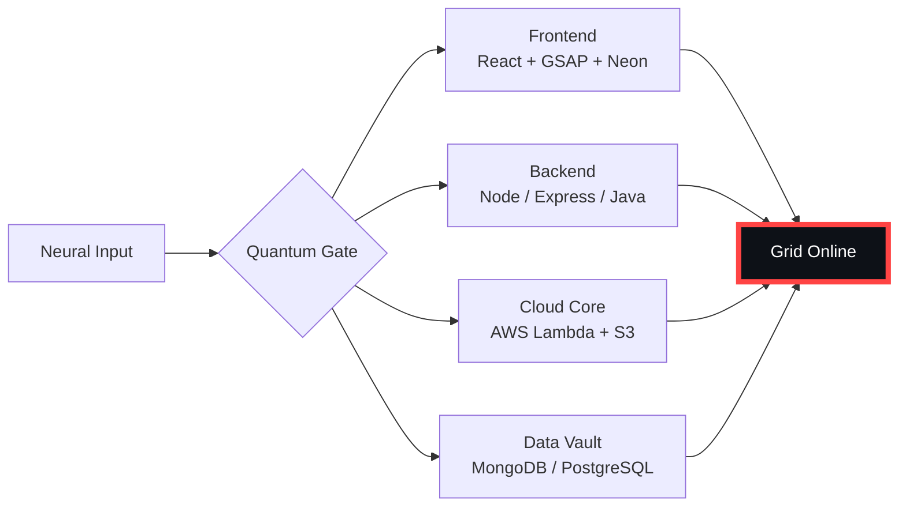

# 🌌 [ NEURAL CORE ACCESS: PENDEMVAMSI ]

<p align="center">
  
</p>

<div align="center">
  
  <br><small>Active Protocol: <strong style="color:#FF4444">NECROMORPH INFEST</strong> 🩸☠️</small>
</div>

## 🔵 NEURAL STATUS READOUT
```text
SUBJECT ID    →  PENDEMVAMSI
ENTITY CLASS  →  SHADOW MONARCH v8
NEURAL RANK   →  B-TIER
GRID SYNC     →  487/8010 QUANTUM PACKETS
─────── BIO-METRICS (NECROMORPH INFEST) ───────
STRENGTH      140  ██████████████████░░░
AGILITY       122  ████████████████░░░░░
INTELLIGENCE  147  ███████████████████░░
VITALITY      112  ███████████████░░░░░░
```

> **NEURAL BURST ACQUIRED:** +104 QUANTUM PACKETS 
> **SYSTEM MESSAGE:** SYNTHETIC DREAMS LOADING… DO NOT DISCONNECT

---

## 🌀 GRID ARCHITECTURE (HOLOGRAPHIC RENDER)



---

## 📡 ACADEMIC NODES – CONQUERED
- [x] B.Tech Neural Engineering (2020–2024) – St. Ann’s Grid
- [x] Intermediate Quantum Core (2018–2020) – Sri Medhavi
- [x] SSC Primary Link (2017–2018) – Sri Geethanjali

---

## ⚡ SKILL NEURAL MATRIX

<details open>
<summary>🔌 ACTIVE NEURAL LINKS</summary>

| Node               | Tier | Integrity Bar                | Status      |
|--------------------|------|------------------------------|-------------|
| Java Core          | S    | ████████████████████ 100%   | OVERCLOCKED |
| Node.js Grid       | S    | ████████████████████ 100%   | OVERCLOCKED |
| React Holo-UI      | A+   | █████████████████░░░ 92%    | ONLINE      |
| AWS Quantum Relay  | S    | ████████████████████ 100%   | SOVEREIGN   |
| Python AI Kernel   | A    | ████████████████░░░░ 85%    | CHARGING    |
| DSA Void Algorithm | A    | █████████████████░░░ 90%    | ACTIVE      |

</details>

---

## 🏅 NEURAL ACHIEVEMENT TOKENS

<p align="center">
  
  
  
  
</p>

---

## 👾 SHADOW ENTITIES – SUMMONED

<p align="center">
  
  <br><strong style="color:#FF4444">ARISE.</strong>
</p>

| Entity | Designation   | Class            | Source Node                     |
|--------|---------------|------------------|---------------------------------|
| SH-01  | Igris         | Void Commander   | AI Financial Oracle             |
| SH-02  | Beru          | Swarm Overlord   | WebRTC Quantum Stream           |
| SH-03  | Kaisel        | Void Wyrm        | Geolocation Shadow Relay        |
| SH-04  | Tusk          | Arcane Construct | Global Pandemic Sentinel        |
| SH-05  | Iron          | Armored Bastion  | React Crypto Fortress           |

---

## 📡 GRID ANALYTICS (LIVE FEED)

<p align="center">
  
  <br>
  
  
</p>

---

## 🖥️ CORRUPTED MAINFRAME LOG (401 ENTRIES)

<details>
<summary>OPEN TERMINAL FEED – PROTOCOL: NECROMORPH INFEST</summary>

> [0xEA4DBAE9] 🩸☠️ **NECROMORPH INFEST PROTOCOL** #0 | NEURAL LINK STABILIZED | [TRANSMISSION SUCCESS]
> [0x2C09812B] 🩸☠️ **NECROMORPH INFEST PROTOCOL** #1 | NEURAL LINK STABILIZED | [TRANSMISSION SUCCESS]
> [0xDE2FE663] 🩸☠️ **NECROMORPH INFEST PROTOCOL** #2 | NEURAL LINK STABILIZED | [TRANSMISSION SUCCESS]
> [0x6C2FBD75] 🩸☠️ **NECROMORPH INFEST PROTOCOL** #3 | NEURAL LINK STABILIZED | [TRANSMISSION SUCCESS]
> [0xF26F5950] 🩸☠️ **NECROMORPH INFEST PROTOCOL** #4 | NEURAL LINK STABILIZED | [TRANSMISSION SUCCESS]
> [0x0F175864] 🩸☠️ **NECROMORPH INFEST PROTOCOL** #5 | NEURAL LINK STABILIZED | [TRANSMISSION SUCCESS]
> [0x12AF2085] 🩸☠️ **NECROMORPH INFEST PROTOCOL** #6 | NEURAL LINK STABILIZED | [TRANSMISSION SUCCESS]
> [0xBFBAB70A] 🩸☠️ **NECROMORPH INFEST PROTOCOL** #7 | NEURAL LINK  [GLITCH DETECTED] STABILIZED | [TRANSMISSION SUCCESS]
> [0x93A715E7] 🩸☠️ **NECROMORPH INFEST PROTOCOL** #8 | NEURAL LINK STABILIZED | [TRANSMISSION SUCCESS]
> [0x4E4B20A1] 🩸☠️ **NECROMORPH INFEST PROTOCOL** #9 | NEURAL LINK STABILIZED | [TRANSMISSION SUCCESS]
> [0xF755E5C7] 🩸☠️ **NECROMORPH INFEST PROTOCOL** #10 | NEURAL LINK STABILIZED | [TRANSMISSION SUCCESS]
> [0x987D814B] 🩸☠️ **NECROMORPH INFEST PROTOCOL** #11 | NEURAL LINK STABILIZED | [TRANSMISSION SUCCESS]
> [0xAC44000D] 🩸☠️ **NECROMORPH INFEST PROTOCOL** #12 | NEURAL LINK STABILIZED | [TRANSMISSION SUCCESS]
> [0x70A61B8F] 🩸☠️ **NECROMORPH INFEST PROTOCOL** #13 | NEURAL LINK STABILIZED | [TRANSMISSION SUCCESS]
> [0x508B7DE1] 🩸☠️ **NECROMORPH INFEST PROTOCOL** #14 | NEURAL LINK STABILIZED | [TRANSMISSION SUCCESS]
> [0x5ADEAF61] 🩸☠️ **NECROMORPH INFEST PROTOCOL** #15 | NEURAL LINK STABILIZED | [TRANSMISSION SUCCESS]
> [0x0BC48991] 🩸☠️ **NECROMORPH INFEST PROTOCOL** #16 | NEURAL LINK STABILIZED | [TRANSMISSION SUCCESS]
> [0x85528291] 🩸☠️ **NECROMORPH INFEST PROTOCOL** #17 | NEURAL LINK STABILIZED | [TRANSMISSION SUCCESS]
> [0x66906941] 🩸☠️ **NECROMORPH INFEST PROTOCOL** #18 | NEURAL LINK STABILIZED | [TRANSMISSION SUCCESS]
> [0x1D47E89E] 🩸☠️ **NECROMORPH INFEST PROTOCOL** #19 | NEURAL LINK STABILIZED | [TRANSMISSION SUCCESS]
> [0x46E06AE6] 🩸☠️ **NECROMORPH INFEST PROTOCOL** #20 | NEURAL LINK STABILIZED | [TRANSMISSION SUCCESS]
> [0xB795273E] 🩸☠️ **NECROMORPH INFEST PROTOCOL** #21 | NEURAL LINK STABILIZED | [TRANSMISSION SUCCESS]
> [0x6103D6E8] 🩸☠️ **NECROMORPH INFEST PROTOCOL** #22 | NEURAL LINK STABILIZED | [TRANSMISSION SUCCESS]
> [0x157CE046] 🩸☠️ **NECROMORPH INFEST PROTOCOL** #23 | NEURAL LINK STABILIZED | [TRANSMISSION SUCCESS]
> [0x397CAB11] 🩸☠️ **NECROMORPH INFEST PROTOCOL** #24 | NEURAL LINK STABILIZED | [TRANSMISSION SUCCESS]
> [0x534A2BE7] 🩸☠️ **NECROMORPH INFEST PROTOCOL** #25 | NEURAL LINK STABILIZED | [TRANSMISSION SUCCESS]
> [0xBEF5EF40] 🩸☠️ **NECROMORPH INFEST PROTOCOL** #26 | NEURAL LINK  [GLITCH DETECTED] STABILIZED | [TRANSMISSION SUCCESS]
> [0xA9EFEFEF] 🩸☠️ **NECROMORPH INFEST PROTOCOL** #27 | NEURAL LINK  [GLITCH DETECTED] STABILIZED | [TRANSMISSION SUCCESS]
> [0x04BDF89B] 🩸☠️ **NECROMORPH INFEST PROTOCOL** #28 | NEURAL LINK STABILIZED | [TRANSMISSION SUCCESS]
> [0xE12E6396] 🩸☠️ **NECROMORPH INFEST PROTOCOL** #29 | NEURAL LINK STABILIZED | [TRANSMISSION SUCCESS]
> [0xC1A7B434] 🩸☠️ **NECROMORPH INFEST PROTOCOL** #30 | NEURAL LINK STABILIZED | [TRANSMISSION SUCCESS]
> [0xCEEF0520] 🩸☠️ **NECROMORPH INFEST PROTOCOL** #31 | NEURAL LINK STABILIZED | [TRANSMISSION SUCCESS]
> [0x049BA0A5] 🩸☠️ **NECROMORPH INFEST PROTOCOL** #32 | NEURAL LINK  [GLITCH DETECTED] STABILIZED | [TRANSMISSION SUCCESS]
> [0x45CACD7E] 🩸☠️ **NECROMORPH INFEST PROTOCOL** #33 | NEURAL LINK  [GLITCH DETECTED] STABILIZED | [TRANSMISSION SUCCESS]
> [0xD64446ED] 🩸☠️ **NECROMORPH INFEST PROTOCOL** #34 | NEURAL LINK STABILIZED | [TRANSMISSION SUCCESS]
> [0x0A8ECBF9] 🩸☠️ **NECROMORPH INFEST PROTOCOL** #35 | NEURAL LINK  [GLITCH DETECTED] STABILIZED | [TRANSMISSION SUCCESS]
> [0xEBD5520C] 🩸☠️ **NECROMORPH INFEST PROTOCOL** #36 | NEURAL LINK  [GLITCH DETECTED] STABILIZED | [TRANSMISSION SUCCESS]
> [0xF90967DF] 🩸☠️ **NECROMORPH INFEST PROTOCOL** #37 | NEURAL LINK STABILIZED | [TRANSMISSION SUCCESS]
> [0xB6FA8640] 🩸☠️ **NECROMORPH INFEST PROTOCOL** #38 | NEURAL LINK  [GLITCH DETECTED] STABILIZED | [TRANSMISSION SUCCESS]
> [0xD0428304] 🩸☠️ **NECROMORPH INFEST PROTOCOL** #39 | NEURAL LINK STABILIZED | [TRANSMISSION SUCCESS]
> [0xB3F8FC99] 🩸☠️ **NECROMORPH INFEST PROTOCOL** #40 | NEURAL LINK STABILIZED | [TRANSMISSION SUCCESS]
> [0x1EC89BE8] 🩸☠️ **NECROMORPH INFEST PROTOCOL** #41 | NEURAL LINK  [GLITCH DETECTED] STABILIZED | [TRANSMISSION SUCCESS]
> [0xBBC422F1] 🩸☠️ **NECROMORPH INFEST PROTOCOL** #42 | NEURAL LINK STABILIZED | [TRANSMISSION SUCCESS]
> [0xA5BC5E28] 🩸☠️ **NECROMORPH INFEST PROTOCOL** #43 | NEURAL LINK  [GLITCH DETECTED] STABILIZED | [TRANSMISSION SUCCESS]
> [0x892A03EB] 🩸☠️ **NECROMORPH INFEST PROTOCOL** #44 | NEURAL LINK STABILIZED | [TRANSMISSION SUCCESS]
> [0xEDD3F617] 🩸☠️ **NECROMORPH INFEST PROTOCOL** #45 | NEURAL LINK STABILIZED | [TRANSMISSION SUCCESS]
> [0x7382C919] 🩸☠️ **NECROMORPH INFEST PROTOCOL** #46 | NEURAL LINK STABILIZED | [TRANSMISSION SUCCESS]
> [0xE9689F60] 🩸☠️ **NECROMORPH INFEST PROTOCOL** #47 | NEURAL LINK STABILIZED | [TRANSMISSION SUCCESS]
> [0xFD86A903] 🩸☠️ **NECROMORPH INFEST PROTOCOL** #48 | NEURAL LINK STABILIZED | [TRANSMISSION SUCCESS]
> [0xD9D5DF6E] 🩸☠️ **NECROMORPH INFEST PROTOCOL** #49 | NEURAL LINK STABILIZED | [TRANSMISSION SUCCESS]
> [0x2CB809A7] 🩸☠️ **NECROMORPH INFEST PROTOCOL** #50 | NEURAL LINK STABILIZED | [TRANSMISSION SUCCESS]
> [0xD184BDDD] 🩸☠️ **NECROMORPH INFEST PROTOCOL** #51 | NEURAL LINK STABILIZED | [TRANSMISSION SUCCESS]
> [0x08701EAD] 🩸☠️ **NECROMORPH INFEST PROTOCOL** #52 | NEURAL LINK STABILIZED | [TRANSMISSION SUCCESS]
> [0x52C6E1EA] 🩸☠️ **NECROMORPH INFEST PROTOCOL** #53 | NEURAL LINK STABILIZED | [TRANSMISSION SUCCESS]
> [0x7D0CDBF1] 🩸☠️ **NECROMORPH INFEST PROTOCOL** #54 | NEURAL LINK  [GLITCH DETECTED] STABILIZED | [TRANSMISSION SUCCESS]
> [0x8786D437] 🩸☠️ **NECROMORPH INFEST PROTOCOL** #55 | NEURAL LINK  [GLITCH DETECTED] STABILIZED | [TRANSMISSION SUCCESS]
> [0x3E1CD8B2] 🩸☠️ **NECROMORPH INFEST PROTOCOL** #56 | NEURAL LINK STABILIZED | [TRANSMISSION SUCCESS]
> [0x67AA098A] 🩸☠️ **NECROMORPH INFEST PROTOCOL** #57 | NEURAL LINK  [GLITCH DETECTED] STABILIZED | [TRANSMISSION SUCCESS]
> [0x20B23F54] 🩸☠️ **NECROMORPH INFEST PROTOCOL** #58 | NEURAL LINK  [GLITCH DETECTED] STABILIZED | [TRANSMISSION SUCCESS]
> [0xC6E02E09] 🩸☠️ **NECROMORPH INFEST PROTOCOL** #59 | NEURAL LINK STABILIZED | [TRANSMISSION SUCCESS]
> [0x1BE5CC83] 🩸☠️ **NECROMORPH INFEST PROTOCOL** #60 | NEURAL LINK  [GLITCH DETECTED] STABILIZED | [TRANSMISSION SUCCESS]
> [0x2956719A] 🩸☠️ **NECROMORPH INFEST PROTOCOL** #61 | NEURAL LINK STABILIZED | [TRANSMISSION SUCCESS]
> [0xC205FF35] 🩸☠️ **NECROMORPH INFEST PROTOCOL** #62 | NEURAL LINK STABILIZED | [TRANSMISSION SUCCESS]
> [0x115EFFAE] 🩸☠️ **NECROMORPH INFEST PROTOCOL** #63 | NEURAL LINK STABILIZED | [TRANSMISSION SUCCESS]
> [0xE691D785] 🩸☠️ **NECROMORPH INFEST PROTOCOL** #64 | NEURAL LINK STABILIZED | [TRANSMISSION SUCCESS]
> [0x91FFEB73] 🩸☠️ **NECROMORPH INFEST PROTOCOL** #65 | NEURAL LINK STABILIZED | [TRANSMISSION SUCCESS]
> [0xD8EDB47C] 🩸☠️ **NECROMORPH INFEST PROTOCOL** #66 | NEURAL LINK STABILIZED | [TRANSMISSION SUCCESS]
> [0xA13964EF] 🩸☠️ **NECROMORPH INFEST PROTOCOL** #67 | NEURAL LINK  [GLITCH DETECTED] STABILIZED | [TRANSMISSION SUCCESS]
> [0xE718616C] 🩸☠️ **NECROMORPH INFEST PROTOCOL** #68 | NEURAL LINK STABILIZED | [TRANSMISSION SUCCESS]
> [0x6A1D02B2] 🩸☠️ **NECROMORPH INFEST PROTOCOL** #69 | NEURAL LINK STABILIZED | [TRANSMISSION SUCCESS]
> [0x581F9152] 🩸☠️ **NECROMORPH INFEST PROTOCOL** #70 | NEURAL LINK STABILIZED | [TRANSMISSION SUCCESS]
> [0x710BBE32] 🩸☠️ **NECROMORPH INFEST PROTOCOL** #71 | NEURAL LINK STABILIZED | [TRANSMISSION SUCCESS]
> [0x1860DBFF] 🩸☠️ **NECROMORPH INFEST PROTOCOL** #72 | NEURAL LINK STABILIZED | [TRANSMISSION SUCCESS]
> [0x71F2B61C] 🩸☠️ **NECROMORPH INFEST PROTOCOL** #73 | NEURAL LINK STABILIZED | [TRANSMISSION SUCCESS]
> [0xEB572E92] 🩸☠️ **NECROMORPH INFEST PROTOCOL** #74 | NEURAL LINK STABILIZED | [TRANSMISSION SUCCESS]
> [0xDD14E6CD] 🩸☠️ **NECROMORPH INFEST PROTOCOL** #75 | NEURAL LINK  [GLITCH DETECTED] STABILIZED | [TRANSMISSION SUCCESS]
> [0x30088465] 🩸☠️ **NECROMORPH INFEST PROTOCOL** #76 | NEURAL LINK STABILIZED | [TRANSMISSION SUCCESS]
> [0x8FF170D2] 🩸☠️ **NECROMORPH INFEST PROTOCOL** #77 | NEURAL LINK  [GLITCH DETECTED] STABILIZED | [TRANSMISSION SUCCESS]
> [0xD7A0BF0B] 🩸☠️ **NECROMORPH INFEST PROTOCOL** #78 | NEURAL LINK STABILIZED | [TRANSMISSION SUCCESS]
> [0xF2FC343E] 🩸☠️ **NECROMORPH INFEST PROTOCOL** #79 | NEURAL LINK STABILIZED | [TRANSMISSION SUCCESS]
> [0x62B21B69] 🩸☠️ **NECROMORPH INFEST PROTOCOL** #80 | NEURAL LINK STABILIZED | [TRANSMISSION SUCCESS]
> [0x00501B80] 🩸☠️ **NECROMORPH INFEST PROTOCOL** #81 | NEURAL LINK STABILIZED | [TRANSMISSION SUCCESS]
> [0x64A60AE6] 🩸☠️ **NECROMORPH INFEST PROTOCOL** #82 | NEURAL LINK STABILIZED | [TRANSMISSION SUCCESS]
> [0x256016FC] 🩸☠️ **NECROMORPH INFEST PROTOCOL** #83 | NEURAL LINK STABILIZED | [TRANSMISSION SUCCESS]
> [0x86611030] 🩸☠️ **NECROMORPH INFEST PROTOCOL** #84 | NEURAL LINK STABILIZED | [TRANSMISSION SUCCESS]
> [0xE7C98BBC] 🩸☠️ **NECROMORPH INFEST PROTOCOL** #85 | NEURAL LINK STABILIZED | [TRANSMISSION SUCCESS]
> [0xEC124B4D] 🩸☠️ **NECROMORPH INFEST PROTOCOL** #86 | NEURAL LINK  [GLITCH DETECTED] STABILIZED | [TRANSMISSION SUCCESS]
> [0x62E29CC6] 🩸☠️ **NECROMORPH INFEST PROTOCOL** #87 | NEURAL LINK STABILIZED | [TRANSMISSION SUCCESS]
> [0x76A25316] 🩸☠️ **NECROMORPH INFEST PROTOCOL** #88 | NEURAL LINK  [GLITCH DETECTED] STABILIZED | [TRANSMISSION SUCCESS]
> [0x4B5325CF] 🩸☠️ **NECROMORPH INFEST PROTOCOL** #89 | NEURAL LINK STABILIZED | [TRANSMISSION SUCCESS]
> [0xE043A64F] 🩸☠️ **NECROMORPH INFEST PROTOCOL** #90 | NEURAL LINK STABILIZED | [TRANSMISSION SUCCESS]
> [0xEA553636] 🩸☠️ **NECROMORPH INFEST PROTOCOL** #91 | NEURAL LINK STABILIZED | [TRANSMISSION SUCCESS]
> [0xE50F102C] 🩸☠️ **NECROMORPH INFEST PROTOCOL** #92 | NEURAL LINK STABILIZED | [TRANSMISSION SUCCESS]
> [0x5B510062] 🩸☠️ **NECROMORPH INFEST PROTOCOL** #93 | NEURAL LINK  [GLITCH DETECTED] STABILIZED | [TRANSMISSION SUCCESS]
> [0x25CD8D03] 🩸☠️ **NECROMORPH INFEST PROTOCOL** #94 | NEURAL LINK STABILIZED | [TRANSMISSION SUCCESS]
> [0xB586EB45] 🩸☠️ **NECROMORPH INFEST PROTOCOL** #95 | NEURAL LINK STABILIZED | [TRANSMISSION SUCCESS]
> [0x4A36E085] 🩸☠️ **NECROMORPH INFEST PROTOCOL** #96 | NEURAL LINK STABILIZED | [TRANSMISSION SUCCESS]
> [0x1A6C4286] 🩸☠️ **NECROMORPH INFEST PROTOCOL** #97 | NEURAL LINK STABILIZED | [TRANSMISSION SUCCESS]
> [0x0101A16A] 🩸☠️ **NECROMORPH INFEST PROTOCOL** #98 | NEURAL LINK STABILIZED | [TRANSMISSION SUCCESS]
> [0xCC5363A2] 🩸☠️ **NECROMORPH INFEST PROTOCOL** #99 | NEURAL LINK STABILIZED | [TRANSMISSION SUCCESS]
> [0x1507CAED] 🩸☠️ **NECROMORPH INFEST PROTOCOL** #100 | NEURAL LINK  [GLITCH DETECTED] STABILIZED | [TRANSMISSION SUCCESS]
> [0xDAB02C61] 🩸☠️ **NECROMORPH INFEST PROTOCOL** #101 | NEURAL LINK STABILIZED | [TRANSMISSION SUCCESS]
> [0x41A87990] 🩸☠️ **NECROMORPH INFEST PROTOCOL** #102 | NEURAL LINK STABILIZED | [TRANSMISSION SUCCESS]
> [0xC877B0A2] 🩸☠️ **NECROMORPH INFEST PROTOCOL** #103 | NEURAL LINK STABILIZED | [TRANSMISSION SUCCESS]
> [0x8F4885B4] 🩸☠️ **NECROMORPH INFEST PROTOCOL** #104 | NEURAL LINK STABILIZED | [TRANSMISSION SUCCESS]
> [0x25B5AE3A] 🩸☠️ **NECROMORPH INFEST PROTOCOL** #105 | NEURAL LINK STABILIZED | [TRANSMISSION SUCCESS]
> [0x4AF47A4F] 🩸☠️ **NECROMORPH INFEST PROTOCOL** #106 | NEURAL LINK STABILIZED | [TRANSMISSION SUCCESS]
> [0xEEB356EE] 🩸☠️ **NECROMORPH INFEST PROTOCOL** #107 | NEURAL LINK STABILIZED | [TRANSMISSION SUCCESS]
> [0xE4637C1C] 🩸☠️ **NECROMORPH INFEST PROTOCOL** #108 | NEURAL LINK STABILIZED | [TRANSMISSION SUCCESS]
> [0xBE0901CF] 🩸☠️ **NECROMORPH INFEST PROTOCOL** #109 | NEURAL LINK STABILIZED | [TRANSMISSION SUCCESS]
> [0xD65486F3] 🩸☠️ **NECROMORPH INFEST PROTOCOL** #110 | NEURAL LINK STABILIZED | [TRANSMISSION SUCCESS]
> [0xF11758D2] 🩸☠️ **NECROMORPH INFEST PROTOCOL** #111 | NEURAL LINK  [GLITCH DETECTED] STABILIZED | [TRANSMISSION SUCCESS]
> [0x25A5924A] 🩸☠️ **NECROMORPH INFEST PROTOCOL** #112 | NEURAL LINK STABILIZED | [TRANSMISSION SUCCESS]
> [0xFFB533AA] 🩸☠️ **NECROMORPH INFEST PROTOCOL** #113 | NEURAL LINK STABILIZED | [TRANSMISSION SUCCESS]
> [0x23751B18] 🩸☠️ **NECROMORPH INFEST PROTOCOL** #114 | NEURAL LINK STABILIZED | [TRANSMISSION SUCCESS]
> [0x5DAED421] 🩸☠️ **NECROMORPH INFEST PROTOCOL** #115 | NEURAL LINK STABILIZED | [TRANSMISSION SUCCESS]
> [0xA2260DF3] 🩸☠️ **NECROMORPH INFEST PROTOCOL** #116 | NEURAL LINK STABILIZED | [TRANSMISSION SUCCESS]
> [0xD0E8179A] 🩸☠️ **NECROMORPH INFEST PROTOCOL** #117 | NEURAL LINK STABILIZED | [TRANSMISSION SUCCESS]
> [0x64A88794] 🩸☠️ **NECROMORPH INFEST PROTOCOL** #118 | NEURAL LINK  [GLITCH DETECTED] STABILIZED | [TRANSMISSION SUCCESS]
> [0x759C7FC1] 🩸☠️ **NECROMORPH INFEST PROTOCOL** #119 | NEURAL LINK  [GLITCH DETECTED] STABILIZED | [TRANSMISSION SUCCESS]
> [0x77EA17EF] 🩸☠️ **NECROMORPH INFEST PROTOCOL** #120 | NEURAL LINK  [GLITCH DETECTED] STABILIZED | [TRANSMISSION SUCCESS]
> [0x4355C78A] 🩸☠️ **NECROMORPH INFEST PROTOCOL** #121 | NEURAL LINK STABILIZED | [TRANSMISSION SUCCESS]
> [0xA33E2119] 🩸☠️ **NECROMORPH INFEST PROTOCOL** #122 | NEURAL LINK STABILIZED | [TRANSMISSION SUCCESS]
> [0x2B116BE1] 🩸☠️ **NECROMORPH INFEST PROTOCOL** #123 | NEURAL LINK STABILIZED | [TRANSMISSION SUCCESS]
> [0x40DFC1CD] 🩸☠️ **NECROMORPH INFEST PROTOCOL** #124 | NEURAL LINK STABILIZED | [TRANSMISSION SUCCESS]
> [0x4952F6E1] 🩸☠️ **NECROMORPH INFEST PROTOCOL** #125 | NEURAL LINK STABILIZED | [TRANSMISSION SUCCESS]
> [0x3DD8D071] 🩸☠️ **NECROMORPH INFEST PROTOCOL** #126 | NEURAL LINK  [GLITCH DETECTED] STABILIZED | [TRANSMISSION SUCCESS]
> [0xA3C5D954] 🩸☠️ **NECROMORPH INFEST PROTOCOL** #127 | NEURAL LINK STABILIZED | [TRANSMISSION SUCCESS]
> [0xE08D45E7] 🩸☠️ **NECROMORPH INFEST PROTOCOL** #128 | NEURAL LINK  [GLITCH DETECTED] STABILIZED | [TRANSMISSION SUCCESS]
> [0x9F3D1B07] 🩸☠️ **NECROMORPH INFEST PROTOCOL** #129 | NEURAL LINK  [GLITCH DETECTED] STABILIZED | [TRANSMISSION SUCCESS]
> [0x2059F2C1] 🩸☠️ **NECROMORPH INFEST PROTOCOL** #130 | NEURAL LINK STABILIZED | [TRANSMISSION SUCCESS]
> [0x6503191B] 🩸☠️ **NECROMORPH INFEST PROTOCOL** #131 | NEURAL LINK STABILIZED | [TRANSMISSION SUCCESS]
> [0xCF0EE93E] 🩸☠️ **NECROMORPH INFEST PROTOCOL** #132 | NEURAL LINK  [GLITCH DETECTED] STABILIZED | [TRANSMISSION SUCCESS]
> [0x7A1280BA] 🩸☠️ **NECROMORPH INFEST PROTOCOL** #133 | NEURAL LINK  [GLITCH DETECTED] STABILIZED | [TRANSMISSION SUCCESS]
> [0x42ADD7AF] 🩸☠️ **NECROMORPH INFEST PROTOCOL** #134 | NEURAL LINK STABILIZED | [TRANSMISSION SUCCESS]
> [0xFEFF6E00] 🩸☠️ **NECROMORPH INFEST PROTOCOL** #135 | NEURAL LINK STABILIZED | [TRANSMISSION SUCCESS]
> [0x3E6CFEAD] 🩸☠️ **NECROMORPH INFEST PROTOCOL** #136 | NEURAL LINK STABILIZED | [TRANSMISSION SUCCESS]
> [0xCAE48C89] 🩸☠️ **NECROMORPH INFEST PROTOCOL** #137 | NEURAL LINK STABILIZED | [TRANSMISSION SUCCESS]
> [0x134D250D] 🩸☠️ **NECROMORPH INFEST PROTOCOL** #138 | NEURAL LINK STABILIZED | [TRANSMISSION SUCCESS]
> [0xE288CA4F] 🩸☠️ **NECROMORPH INFEST PROTOCOL** #139 | NEURAL LINK STABILIZED | [TRANSMISSION SUCCESS]
> [0xD13EA0BF] 🩸☠️ **NECROMORPH INFEST PROTOCOL** #140 | NEURAL LINK STABILIZED | [TRANSMISSION SUCCESS]
> [0x78295D0A] 🩸☠️ **NECROMORPH INFEST PROTOCOL** #141 | NEURAL LINK STABILIZED | [TRANSMISSION SUCCESS]
> [0xF53B3B56] 🩸☠️ **NECROMORPH INFEST PROTOCOL** #142 | NEURAL LINK  [GLITCH DETECTED] STABILIZED | [TRANSMISSION SUCCESS]
> [0x3834F021] 🩸☠️ **NECROMORPH INFEST PROTOCOL** #143 | NEURAL LINK STABILIZED | [TRANSMISSION SUCCESS]
> [0xB1803476] 🩸☠️ **NECROMORPH INFEST PROTOCOL** #144 | NEURAL LINK STABILIZED | [TRANSMISSION SUCCESS]
> [0xEFEC13E1] 🩸☠️ **NECROMORPH INFEST PROTOCOL** #145 | NEURAL LINK STABILIZED | [TRANSMISSION SUCCESS]
> [0xFD86F92C] 🩸☠️ **NECROMORPH INFEST PROTOCOL** #146 | NEURAL LINK STABILIZED | [TRANSMISSION SUCCESS]
> [0x9B3FA01F] 🩸☠️ **NECROMORPH INFEST PROTOCOL** #147 | NEURAL LINK STABILIZED | [TRANSMISSION SUCCESS]
> [0xB4FA980A] 🩸☠️ **NECROMORPH INFEST PROTOCOL** #148 | NEURAL LINK STABILIZED | [TRANSMISSION SUCCESS]
> [0x7052BDD6] 🩸☠️ **NECROMORPH INFEST PROTOCOL** #149 | NEURAL LINK STABILIZED | [TRANSMISSION SUCCESS]
> [0xE7CBEC31] 🩸☠️ **NECROMORPH INFEST PROTOCOL** #150 | NEURAL LINK STABILIZED | [TRANSMISSION SUCCESS]
> [0xB612C3A9] 🩸☠️ **NECROMORPH INFEST PROTOCOL** #151 | NEURAL LINK STABILIZED | [TRANSMISSION SUCCESS]
> [0xB0ECA693] 🩸☠️ **NECROMORPH INFEST PROTOCOL** #152 | NEURAL LINK STABILIZED | [TRANSMISSION SUCCESS]
> [0x2B13CD10] 🩸☠️ **NECROMORPH INFEST PROTOCOL** #153 | NEURAL LINK STABILIZED | [TRANSMISSION SUCCESS]
> [0x1041DD66] 🩸☠️ **NECROMORPH INFEST PROTOCOL** #154 | NEURAL LINK STABILIZED | [TRANSMISSION SUCCESS]
> [0x4BB00198] 🩸☠️ **NECROMORPH INFEST PROTOCOL** #155 | NEURAL LINK STABILIZED | [TRANSMISSION SUCCESS]
> [0xCEA4D19B] 🩸☠️ **NECROMORPH INFEST PROTOCOL** #156 | NEURAL LINK STABILIZED | [TRANSMISSION SUCCESS]
> [0xD00AD369] 🩸☠️ **NECROMORPH INFEST PROTOCOL** #157 | NEURAL LINK STABILIZED | [TRANSMISSION SUCCESS]
> [0xFC2C8554] 🩸☠️ **NECROMORPH INFEST PROTOCOL** #158 | NEURAL LINK  [GLITCH DETECTED] STABILIZED | [TRANSMISSION SUCCESS]
> [0x20B4972E] 🩸☠️ **NECROMORPH INFEST PROTOCOL** #159 | NEURAL LINK STABILIZED | [TRANSMISSION SUCCESS]
> [0x8A553878] 🩸☠️ **NECROMORPH INFEST PROTOCOL** #160 | NEURAL LINK STABILIZED | [TRANSMISSION SUCCESS]
> [0x56D405C7] 🩸☠️ **NECROMORPH INFEST PROTOCOL** #161 | NEURAL LINK STABILIZED | [TRANSMISSION SUCCESS]
> [0x0578F6BE] 🩸☠️ **NECROMORPH INFEST PROTOCOL** #162 | NEURAL LINK STABILIZED | [TRANSMISSION SUCCESS]
> [0x0DCF310E] 🩸☠️ **NECROMORPH INFEST PROTOCOL** #163 | NEURAL LINK STABILIZED | [TRANSMISSION SUCCESS]
> [0xE7C5AE78] 🩸☠️ **NECROMORPH INFEST PROTOCOL** #164 | NEURAL LINK  [GLITCH DETECTED] STABILIZED | [TRANSMISSION SUCCESS]
> [0x9D5F6D2F] 🩸☠️ **NECROMORPH INFEST PROTOCOL** #165 | NEURAL LINK  [GLITCH DETECTED] STABILIZED | [TRANSMISSION SUCCESS]
> [0xED49E530] 🩸☠️ **NECROMORPH INFEST PROTOCOL** #166 | NEURAL LINK STABILIZED | [TRANSMISSION SUCCESS]
> [0x837633AA] 🩸☠️ **NECROMORPH INFEST PROTOCOL** #167 | NEURAL LINK  [GLITCH DETECTED] STABILIZED | [TRANSMISSION SUCCESS]
> [0x53FED25A] 🩸☠️ **NECROMORPH INFEST PROTOCOL** #168 | NEURAL LINK STABILIZED | [TRANSMISSION SUCCESS]
> [0x5935F34C] 🩸☠️ **NECROMORPH INFEST PROTOCOL** #169 | NEURAL LINK STABILIZED | [TRANSMISSION SUCCESS]
> [0x4D4B9241] 🩸☠️ **NECROMORPH INFEST PROTOCOL** #170 | NEURAL LINK STABILIZED | [TRANSMISSION SUCCESS]
> [0x45FD19BE] 🩸☠️ **NECROMORPH INFEST PROTOCOL** #171 | NEURAL LINK STABILIZED | [TRANSMISSION SUCCESS]
> [0xDEE1A380] 🩸☠️ **NECROMORPH INFEST PROTOCOL** #172 | NEURAL LINK STABILIZED | [TRANSMISSION SUCCESS]
> [0x1B0A04BA] 🩸☠️ **NECROMORPH INFEST PROTOCOL** #173 | NEURAL LINK STABILIZED | [TRANSMISSION SUCCESS]
> [0x56510F32] 🩸☠️ **NECROMORPH INFEST PROTOCOL** #174 | NEURAL LINK STABILIZED | [TRANSMISSION SUCCESS]
> [0x90542354] 🩸☠️ **NECROMORPH INFEST PROTOCOL** #175 | NEURAL LINK STABILIZED | [TRANSMISSION SUCCESS]
> [0x5B20C8A4] 🩸☠️ **NECROMORPH INFEST PROTOCOL** #176 | NEURAL LINK STABILIZED | [TRANSMISSION SUCCESS]
> [0xE2059B9D] 🩸☠️ **NECROMORPH INFEST PROTOCOL** #177 | NEURAL LINK  [GLITCH DETECTED] STABILIZED | [TRANSMISSION SUCCESS]
> [0x0D631E18] 🩸☠️ **NECROMORPH INFEST PROTOCOL** #178 | NEURAL LINK STABILIZED | [TRANSMISSION SUCCESS]
> [0x2DE75F40] 🩸☠️ **NECROMORPH INFEST PROTOCOL** #179 | NEURAL LINK  [GLITCH DETECTED] STABILIZED | [TRANSMISSION SUCCESS]
> [0xCA228079] 🩸☠️ **NECROMORPH INFEST PROTOCOL** #180 | NEURAL LINK STABILIZED | [TRANSMISSION SUCCESS]
> [0x339CAA77] 🩸☠️ **NECROMORPH INFEST PROTOCOL** #181 | NEURAL LINK STABILIZED | [TRANSMISSION SUCCESS]
> [0x0A408AB1] 🩸☠️ **NECROMORPH INFEST PROTOCOL** #182 | NEURAL LINK STABILIZED | [TRANSMISSION SUCCESS]
> [0x2D02291E] 🩸☠️ **NECROMORPH INFEST PROTOCOL** #183 | NEURAL LINK  [GLITCH DETECTED] STABILIZED | [TRANSMISSION SUCCESS]
> [0x5F33E514] 🩸☠️ **NECROMORPH INFEST PROTOCOL** #184 | NEURAL LINK STABILIZED | [TRANSMISSION SUCCESS]
> [0x0EBB53EF] 🩸☠️ **NECROMORPH INFEST PROTOCOL** #185 | NEURAL LINK STABILIZED | [TRANSMISSION SUCCESS]
> [0x6F15B755] 🩸☠️ **NECROMORPH INFEST PROTOCOL** #186 | NEURAL LINK STABILIZED | [TRANSMISSION SUCCESS]
> [0xC57AF46C] 🩸☠️ **NECROMORPH INFEST PROTOCOL** #187 | NEURAL LINK STABILIZED | [TRANSMISSION SUCCESS]
> [0xAFAC92BD] 🩸☠️ **NECROMORPH INFEST PROTOCOL** #188 | NEURAL LINK STABILIZED | [TRANSMISSION SUCCESS]
> [0x96CC6BC0] 🩸☠️ **NECROMORPH INFEST PROTOCOL** #189 | NEURAL LINK STABILIZED | [TRANSMISSION SUCCESS]
> [0xCB40F3C8] 🩸☠️ **NECROMORPH INFEST PROTOCOL** #190 | NEURAL LINK STABILIZED | [TRANSMISSION SUCCESS]
> [0x7F064F78] 🩸☠️ **NECROMORPH INFEST PROTOCOL** #191 | NEURAL LINK STABILIZED | [TRANSMISSION SUCCESS]
> [0x33C93584] 🩸☠️ **NECROMORPH INFEST PROTOCOL** #192 | NEURAL LINK STABILIZED | [TRANSMISSION SUCCESS]
> [0xA2EBE622] 🩸☠️ **NECROMORPH INFEST PROTOCOL** #193 | NEURAL LINK STABILIZED | [TRANSMISSION SUCCESS]
> [0xBB0F2496] 🩸☠️ **NECROMORPH INFEST PROTOCOL** #194 | NEURAL LINK STABILIZED | [TRANSMISSION SUCCESS]
> [0x98E0EAB3] 🩸☠️ **NECROMORPH INFEST PROTOCOL** #195 | NEURAL LINK STABILIZED | [TRANSMISSION SUCCESS]
> [0x42BA56E5] 🩸☠️ **NECROMORPH INFEST PROTOCOL** #196 | NEURAL LINK STABILIZED | [TRANSMISSION SUCCESS]
> [0xB4B15EB4] 🩸☠️ **NECROMORPH INFEST PROTOCOL** #197 | NEURAL LINK STABILIZED | [TRANSMISSION SUCCESS]
> [0x0B6D3958] 🩸☠️ **NECROMORPH INFEST PROTOCOL** #198 | NEURAL LINK STABILIZED | [TRANSMISSION SUCCESS]
> [0x7001D39D] 🩸☠️ **NECROMORPH INFEST PROTOCOL** #199 | NEURAL LINK STABILIZED | [TRANSMISSION SUCCESS]
> [0x81BC7707] 🩸☠️ **NECROMORPH INFEST PROTOCOL** #200 | NEURAL LINK STABILIZED | [TRANSMISSION SUCCESS]
> [0x56B01B07] 🩸☠️ **NECROMORPH INFEST PROTOCOL** #201 | NEURAL LINK STABILIZED | [TRANSMISSION SUCCESS]
> [0xF056BDAD] 🩸☠️ **NECROMORPH INFEST PROTOCOL** #202 | NEURAL LINK STABILIZED | [TRANSMISSION SUCCESS]
> [0x255E84A0] 🩸☠️ **NECROMORPH INFEST PROTOCOL** #203 | NEURAL LINK STABILIZED | [TRANSMISSION SUCCESS]
> [0xFF22A5DD] 🩸☠️ **NECROMORPH INFEST PROTOCOL** #204 | NEURAL LINK STABILIZED | [TRANSMISSION SUCCESS]
> [0x43441037] 🩸☠️ **NECROMORPH INFEST PROTOCOL** #205 | NEURAL LINK STABILIZED | [TRANSMISSION SUCCESS]
> [0x0367E4A5] 🩸☠️ **NECROMORPH INFEST PROTOCOL** #206 | NEURAL LINK STABILIZED | [TRANSMISSION SUCCESS]
> [0x01C6BC7F] 🩸☠️ **NECROMORPH INFEST PROTOCOL** #207 | NEURAL LINK STABILIZED | [TRANSMISSION SUCCESS]
> [0xAB3D0F8F] 🩸☠️ **NECROMORPH INFEST PROTOCOL** #208 | NEURAL LINK STABILIZED | [TRANSMISSION SUCCESS]
> [0x9945D339] 🩸☠️ **NECROMORPH INFEST PROTOCOL** #209 | NEURAL LINK STABILIZED | [TRANSMISSION SUCCESS]
> [0x00D6AF1D] 🩸☠️ **NECROMORPH INFEST PROTOCOL** #210 | NEURAL LINK STABILIZED | [TRANSMISSION SUCCESS]
> [0xC335BACB] 🩸☠️ **NECROMORPH INFEST PROTOCOL** #211 | NEURAL LINK STABILIZED | [TRANSMISSION SUCCESS]
> [0x15B8896F] 🩸☠️ **NECROMORPH INFEST PROTOCOL** #212 | NEURAL LINK STABILIZED | [TRANSMISSION SUCCESS]
> [0xBB7B67C3] 🩸☠️ **NECROMORPH INFEST PROTOCOL** #213 | NEURAL LINK STABILIZED | [TRANSMISSION SUCCESS]
> [0x85C76505] 🩸☠️ **NECROMORPH INFEST PROTOCOL** #214 | NEURAL LINK STABILIZED | [TRANSMISSION SUCCESS]
> [0xBD04F8CC] 🩸☠️ **NECROMORPH INFEST PROTOCOL** #215 | NEURAL LINK STABILIZED | [TRANSMISSION SUCCESS]
> [0xDA8CE359] 🩸☠️ **NECROMORPH INFEST PROTOCOL** #216 | NEURAL LINK STABILIZED | [TRANSMISSION SUCCESS]
> [0x132DA6E4] 🩸☠️ **NECROMORPH INFEST PROTOCOL** #217 | NEURAL LINK STABILIZED | [TRANSMISSION SUCCESS]
> [0x76FEA402] 🩸☠️ **NECROMORPH INFEST PROTOCOL** #218 | NEURAL LINK STABILIZED | [TRANSMISSION SUCCESS]
> [0xEB817DDF] 🩸☠️ **NECROMORPH INFEST PROTOCOL** #219 | NEURAL LINK STABILIZED | [TRANSMISSION SUCCESS]
> [0xA285B6E6] 🩸☠️ **NECROMORPH INFEST PROTOCOL** #220 | NEURAL LINK  [GLITCH DETECTED] STABILIZED | [TRANSMISSION SUCCESS]
> [0x60A8486B] 🩸☠️ **NECROMORPH INFEST PROTOCOL** #221 | NEURAL LINK STABILIZED | [TRANSMISSION SUCCESS]
> [0xD613580F] 🩸☠️ **NECROMORPH INFEST PROTOCOL** #222 | NEURAL LINK STABILIZED | [TRANSMISSION SUCCESS]
> [0x9B72E816] 🩸☠️ **NECROMORPH INFEST PROTOCOL** #223 | NEURAL LINK STABILIZED | [TRANSMISSION SUCCESS]
> [0x8F8BEF1C] 🩸☠️ **NECROMORPH INFEST PROTOCOL** #224 | NEURAL LINK STABILIZED | [TRANSMISSION SUCCESS]
> [0x2F7CB0C2] 🩸☠️ **NECROMORPH INFEST PROTOCOL** #225 | NEURAL LINK STABILIZED | [TRANSMISSION SUCCESS]
> [0x4218A8B6] 🩸☠️ **NECROMORPH INFEST PROTOCOL** #226 | NEURAL LINK STABILIZED | [TRANSMISSION SUCCESS]
> [0xA7693AD4] 🩸☠️ **NECROMORPH INFEST PROTOCOL** #227 | NEURAL LINK STABILIZED | [TRANSMISSION SUCCESS]
> [0xA5828F47] 🩸☠️ **NECROMORPH INFEST PROTOCOL** #228 | NEURAL LINK STABILIZED | [TRANSMISSION SUCCESS]
> [0xBB1CDB38] 🩸☠️ **NECROMORPH INFEST PROTOCOL** #229 | NEURAL LINK STABILIZED | [TRANSMISSION SUCCESS]
> [0xBA51798F] 🩸☠️ **NECROMORPH INFEST PROTOCOL** #230 | NEURAL LINK STABILIZED | [TRANSMISSION SUCCESS]
> [0x4ED133C7] 🩸☠️ **NECROMORPH INFEST PROTOCOL** #231 | NEURAL LINK  [GLITCH DETECTED] STABILIZED | [TRANSMISSION SUCCESS]
> [0xD4306EEE] 🩸☠️ **NECROMORPH INFEST PROTOCOL** #232 | NEURAL LINK STABILIZED | [TRANSMISSION SUCCESS]
> [0xC6A1F478] 🩸☠️ **NECROMORPH INFEST PROTOCOL** #233 | NEURAL LINK STABILIZED | [TRANSMISSION SUCCESS]
> [0x835D5E3A] 🩸☠️ **NECROMORPH INFEST PROTOCOL** #234 | NEURAL LINK STABILIZED | [TRANSMISSION SUCCESS]
> [0x51EB9111] 🩸☠️ **NECROMORPH INFEST PROTOCOL** #235 | NEURAL LINK STABILIZED | [TRANSMISSION SUCCESS]
> [0xEA89E63A] 🩸☠️ **NECROMORPH INFEST PROTOCOL** #236 | NEURAL LINK  [GLITCH DETECTED] STABILIZED | [TRANSMISSION SUCCESS]
> [0x7CFC32FE] 🩸☠️ **NECROMORPH INFEST PROTOCOL** #237 | NEURAL LINK STABILIZED | [TRANSMISSION SUCCESS]
> [0xB7482F54] 🩸☠️ **NECROMORPH INFEST PROTOCOL** #238 | NEURAL LINK STABILIZED | [TRANSMISSION SUCCESS]
> [0x48D29908] 🩸☠️ **NECROMORPH INFEST PROTOCOL** #239 | NEURAL LINK STABILIZED | [TRANSMISSION SUCCESS]
> [0xDBDBFFF9] 🩸☠️ **NECROMORPH INFEST PROTOCOL** #240 | NEURAL LINK STABILIZED | [TRANSMISSION SUCCESS]
> [0x7565B409] 🩸☠️ **NECROMORPH INFEST PROTOCOL** #241 | NEURAL LINK STABILIZED | [TRANSMISSION SUCCESS]
> [0x403C065F] 🩸☠️ **NECROMORPH INFEST PROTOCOL** #242 | NEURAL LINK  [GLITCH DETECTED] STABILIZED | [TRANSMISSION SUCCESS]
> [0x8B4B4E65] 🩸☠️ **NECROMORPH INFEST PROTOCOL** #243 | NEURAL LINK STABILIZED | [TRANSMISSION SUCCESS]
> [0x64F80713] 🩸☠️ **NECROMORPH INFEST PROTOCOL** #244 | NEURAL LINK STABILIZED | [TRANSMISSION SUCCESS]
> [0x3E10B3F9] 🩸☠️ **NECROMORPH INFEST PROTOCOL** #245 | NEURAL LINK STABILIZED | [TRANSMISSION SUCCESS]
> [0xD2799E8F] 🩸☠️ **NECROMORPH INFEST PROTOCOL** #246 | NEURAL LINK STABILIZED | [TRANSMISSION SUCCESS]
> [0xB9E7D9BE] 🩸☠️ **NECROMORPH INFEST PROTOCOL** #247 | NEURAL LINK STABILIZED | [TRANSMISSION SUCCESS]
> [0x05E02ED6] 🩸☠️ **NECROMORPH INFEST PROTOCOL** #248 | NEURAL LINK  [GLITCH DETECTED] STABILIZED | [TRANSMISSION SUCCESS]
> [0xD5C61013] 🩸☠️ **NECROMORPH INFEST PROTOCOL** #249 | NEURAL LINK STABILIZED | [TRANSMISSION SUCCESS]
> [0xB619A74B] 🩸☠️ **NECROMORPH INFEST PROTOCOL** #250 | NEURAL LINK STABILIZED | [TRANSMISSION SUCCESS]
> [0xA83D0D9A] 🩸☠️ **NECROMORPH INFEST PROTOCOL** #251 | NEURAL LINK STABILIZED | [TRANSMISSION SUCCESS]
> [0x27E21B96] 🩸☠️ **NECROMORPH INFEST PROTOCOL** #252 | NEURAL LINK STABILIZED | [TRANSMISSION SUCCESS]
> [0x8B5842FF] 🩸☠️ **NECROMORPH INFEST PROTOCOL** #253 | NEURAL LINK  [GLITCH DETECTED] STABILIZED | [TRANSMISSION SUCCESS]
> [0xCBA91B5E] 🩸☠️ **NECROMORPH INFEST PROTOCOL** #254 | NEURAL LINK STABILIZED | [TRANSMISSION SUCCESS]
> [0x6A9DE798] 🩸☠️ **NECROMORPH INFEST PROTOCOL** #255 | NEURAL LINK STABILIZED | [TRANSMISSION SUCCESS]
> [0x13FAFABC] 🩸☠️ **NECROMORPH INFEST PROTOCOL** #256 | NEURAL LINK  [GLITCH DETECTED] STABILIZED | [TRANSMISSION SUCCESS]
> [0xF616A432] 🩸☠️ **NECROMORPH INFEST PROTOCOL** #257 | NEURAL LINK STABILIZED | [TRANSMISSION SUCCESS]
> [0x7E13FBCA] 🩸☠️ **NECROMORPH INFEST PROTOCOL** #258 | NEURAL LINK STABILIZED | [TRANSMISSION SUCCESS]
> [0x9BF5AAE1] 🩸☠️ **NECROMORPH INFEST PROTOCOL** #259 | NEURAL LINK  [GLITCH DETECTED] STABILIZED | [TRANSMISSION SUCCESS]
> [0xF5F8316E] 🩸☠️ **NECROMORPH INFEST PROTOCOL** #260 | NEURAL LINK STABILIZED | [TRANSMISSION SUCCESS]
> [0x9DB2539A] 🩸☠️ **NECROMORPH INFEST PROTOCOL** #261 | NEURAL LINK STABILIZED | [TRANSMISSION SUCCESS]
> [0xAC3CCF71] 🩸☠️ **NECROMORPH INFEST PROTOCOL** #262 | NEURAL LINK STABILIZED | [TRANSMISSION SUCCESS]
> [0x151193D6] 🩸☠️ **NECROMORPH INFEST PROTOCOL** #263 | NEURAL LINK STABILIZED | [TRANSMISSION SUCCESS]
> [0xE8D23653] 🩸☠️ **NECROMORPH INFEST PROTOCOL** #264 | NEURAL LINK STABILIZED | [TRANSMISSION SUCCESS]
> [0x45E69AD7] 🩸☠️ **NECROMORPH INFEST PROTOCOL** #265 | NEURAL LINK STABILIZED | [TRANSMISSION SUCCESS]
> [0x4665E4EF] 🩸☠️ **NECROMORPH INFEST PROTOCOL** #266 | NEURAL LINK STABILIZED | [TRANSMISSION SUCCESS]
> [0x3B548863] 🩸☠️ **NECROMORPH INFEST PROTOCOL** #267 | NEURAL LINK STABILIZED | [TRANSMISSION SUCCESS]
> [0xFC296B7D] 🩸☠️ **NECROMORPH INFEST PROTOCOL** #268 | NEURAL LINK  [GLITCH DETECTED] STABILIZED | [TRANSMISSION SUCCESS]
> [0x62A61CD2] 🩸☠️ **NECROMORPH INFEST PROTOCOL** #269 | NEURAL LINK STABILIZED | [TRANSMISSION SUCCESS]
> [0xC97F59F3] 🩸☠️ **NECROMORPH INFEST PROTOCOL** #270 | NEURAL LINK  [GLITCH DETECTED] STABILIZED | [TRANSMISSION SUCCESS]
> [0x75ECA896] 🩸☠️ **NECROMORPH INFEST PROTOCOL** #271 | NEURAL LINK STABILIZED | [TRANSMISSION SUCCESS]
> [0x2650159C] 🩸☠️ **NECROMORPH INFEST PROTOCOL** #272 | NEURAL LINK STABILIZED | [TRANSMISSION SUCCESS]
> [0xCE65CADB] 🩸☠️ **NECROMORPH INFEST PROTOCOL** #273 | NEURAL LINK STABILIZED | [TRANSMISSION SUCCESS]
> [0xD3B1B68C] 🩸☠️ **NECROMORPH INFEST PROTOCOL** #274 | NEURAL LINK STABILIZED | [TRANSMISSION SUCCESS]
> [0xB588600C] 🩸☠️ **NECROMORPH INFEST PROTOCOL** #275 | NEURAL LINK STABILIZED | [TRANSMISSION SUCCESS]
> [0x90C116EB] 🩸☠️ **NECROMORPH INFEST PROTOCOL** #276 | NEURAL LINK STABILIZED | [TRANSMISSION SUCCESS]
> [0x8B983D6C] 🩸☠️ **NECROMORPH INFEST PROTOCOL** #277 | NEURAL LINK STABILIZED | [TRANSMISSION SUCCESS]
> [0x29AB305E] 🩸☠️ **NECROMORPH INFEST PROTOCOL** #278 | NEURAL LINK STABILIZED | [TRANSMISSION SUCCESS]
> [0x40FD146B] 🩸☠️ **NECROMORPH INFEST PROTOCOL** #279 | NEURAL LINK STABILIZED | [TRANSMISSION SUCCESS]
> [0x9A01F8F1] 🩸☠️ **NECROMORPH INFEST PROTOCOL** #280 | NEURAL LINK STABILIZED | [TRANSMISSION SUCCESS]
> [0x82C95158] 🩸☠️ **NECROMORPH INFEST PROTOCOL** #281 | NEURAL LINK STABILIZED | [TRANSMISSION SUCCESS]
> [0x75FC51DB] 🩸☠️ **NECROMORPH INFEST PROTOCOL** #282 | NEURAL LINK STABILIZED | [TRANSMISSION SUCCESS]
> [0xC1DF1999] 🩸☠️ **NECROMORPH INFEST PROTOCOL** #283 | NEURAL LINK STABILIZED | [TRANSMISSION SUCCESS]
> [0x408104B1] 🩸☠️ **NECROMORPH INFEST PROTOCOL** #284 | NEURAL LINK STABILIZED | [TRANSMISSION SUCCESS]
> [0xAD99A0EC] 🩸☠️ **NECROMORPH INFEST PROTOCOL** #285 | NEURAL LINK STABILIZED | [TRANSMISSION SUCCESS]
> [0x198B6F7C] 🩸☠️ **NECROMORPH INFEST PROTOCOL** #286 | NEURAL LINK STABILIZED | [TRANSMISSION SUCCESS]
> [0x59AEE232] 🩸☠️ **NECROMORPH INFEST PROTOCOL** #287 | NEURAL LINK STABILIZED | [TRANSMISSION SUCCESS]
> [0x2A9DF8C8] 🩸☠️ **NECROMORPH INFEST PROTOCOL** #288 | NEURAL LINK  [GLITCH DETECTED] STABILIZED | [TRANSMISSION SUCCESS]
> [0x8E8990A2] 🩸☠️ **NECROMORPH INFEST PROTOCOL** #289 | NEURAL LINK  [GLITCH DETECTED] STABILIZED | [TRANSMISSION SUCCESS]
> [0xB70C87AC] 🩸☠️ **NECROMORPH INFEST PROTOCOL** #290 | NEURAL LINK STABILIZED | [TRANSMISSION SUCCESS]
> [0x26753503] 🩸☠️ **NECROMORPH INFEST PROTOCOL** #291 | NEURAL LINK STABILIZED | [TRANSMISSION SUCCESS]
> [0x1AF82C35] 🩸☠️ **NECROMORPH INFEST PROTOCOL** #292 | NEURAL LINK STABILIZED | [TRANSMISSION SUCCESS]
> [0xAD52E3D6] 🩸☠️ **NECROMORPH INFEST PROTOCOL** #293 | NEURAL LINK STABILIZED | [TRANSMISSION SUCCESS]
> [0x408B4E7F] 🩸☠️ **NECROMORPH INFEST PROTOCOL** #294 | NEURAL LINK STABILIZED | [TRANSMISSION SUCCESS]
> [0xD939001E] 🩸☠️ **NECROMORPH INFEST PROTOCOL** #295 | NEURAL LINK STABILIZED | [TRANSMISSION SUCCESS]
> [0xC2EEC2DF] 🩸☠️ **NECROMORPH INFEST PROTOCOL** #296 | NEURAL LINK  [GLITCH DETECTED] STABILIZED | [TRANSMISSION SUCCESS]
> [0x27A90872] 🩸☠️ **NECROMORPH INFEST PROTOCOL** #297 | NEURAL LINK STABILIZED | [TRANSMISSION SUCCESS]
> [0x1D153AA4] 🩸☠️ **NECROMORPH INFEST PROTOCOL** #298 | NEURAL LINK STABILIZED | [TRANSMISSION SUCCESS]
> [0xE8C4BFA0] 🩸☠️ **NECROMORPH INFEST PROTOCOL** #299 | NEURAL LINK STABILIZED | [TRANSMISSION SUCCESS]
> [0xA6EBE210] 🩸☠️ **NECROMORPH INFEST PROTOCOL** #300 | NEURAL LINK STABILIZED | [TRANSMISSION SUCCESS]
> [0x86BFA9CC] 🩸☠️ **NECROMORPH INFEST PROTOCOL** #301 | NEURAL LINK STABILIZED | [TRANSMISSION SUCCESS]
> [0x369C6A06] 🩸☠️ **NECROMORPH INFEST PROTOCOL** #302 | NEURAL LINK STABILIZED | [TRANSMISSION SUCCESS]
> [0xF0F75C9C] 🩸☠️ **NECROMORPH INFEST PROTOCOL** #303 | NEURAL LINK STABILIZED | [TRANSMISSION SUCCESS]
> [0x9FE8902C] 🩸☠️ **NECROMORPH INFEST PROTOCOL** #304 | NEURAL LINK STABILIZED | [TRANSMISSION SUCCESS]
> [0xFADD44B0] 🩸☠️ **NECROMORPH INFEST PROTOCOL** #305 | NEURAL LINK STABILIZED | [TRANSMISSION SUCCESS]
> [0x116E9A67] 🩸☠️ **NECROMORPH INFEST PROTOCOL** #306 | NEURAL LINK STABILIZED | [TRANSMISSION SUCCESS]
> [0xDFBE4498] 🩸☠️ **NECROMORPH INFEST PROTOCOL** #307 | NEURAL LINK STABILIZED | [TRANSMISSION SUCCESS]
> [0x478F21A5] 🩸☠️ **NECROMORPH INFEST PROTOCOL** #308 | NEURAL LINK STABILIZED | [TRANSMISSION SUCCESS]
> [0xA8B226C9] 🩸☠️ **NECROMORPH INFEST PROTOCOL** #309 | NEURAL LINK STABILIZED | [TRANSMISSION SUCCESS]
> [0x96F414EB] 🩸☠️ **NECROMORPH INFEST PROTOCOL** #310 | NEURAL LINK STABILIZED | [TRANSMISSION SUCCESS]
> [0x3E0D8DE2] 🩸☠️ **NECROMORPH INFEST PROTOCOL** #311 | NEURAL LINK  [GLITCH DETECTED] STABILIZED | [TRANSMISSION SUCCESS]
> [0x1AF92F9F] 🩸☠️ **NECROMORPH INFEST PROTOCOL** #312 | NEURAL LINK STABILIZED | [TRANSMISSION SUCCESS]
> [0x26E8CE15] 🩸☠️ **NECROMORPH INFEST PROTOCOL** #313 | NEURAL LINK STABILIZED | [TRANSMISSION SUCCESS]
> [0xD7824045] 🩸☠️ **NECROMORPH INFEST PROTOCOL** #314 | NEURAL LINK STABILIZED | [TRANSMISSION SUCCESS]
> [0xB770568B] 🩸☠️ **NECROMORPH INFEST PROTOCOL** #315 | NEURAL LINK STABILIZED | [TRANSMISSION SUCCESS]
> [0xB5B4B1A5] 🩸☠️ **NECROMORPH INFEST PROTOCOL** #316 | NEURAL LINK STABILIZED | [TRANSMISSION SUCCESS]
> [0x01C6E011] 🩸☠️ **NECROMORPH INFEST PROTOCOL** #317 | NEURAL LINK STABILIZED | [TRANSMISSION SUCCESS]
> [0xBFF2171B] 🩸☠️ **NECROMORPH INFEST PROTOCOL** #318 | NEURAL LINK STABILIZED | [TRANSMISSION SUCCESS]
> [0x9EEA2E56] 🩸☠️ **NECROMORPH INFEST PROTOCOL** #319 | NEURAL LINK STABILIZED | [TRANSMISSION SUCCESS]
> [0x50C9B1F5] 🩸☠️ **NECROMORPH INFEST PROTOCOL** #320 | NEURAL LINK STABILIZED | [TRANSMISSION SUCCESS]
> [0x485564AF] 🩸☠️ **NECROMORPH INFEST PROTOCOL** #321 | NEURAL LINK STABILIZED | [TRANSMISSION SUCCESS]
> [0x42D86F1B] 🩸☠️ **NECROMORPH INFEST PROTOCOL** #322 | NEURAL LINK STABILIZED | [TRANSMISSION SUCCESS]
> [0xE1D3139F] 🩸☠️ **NECROMORPH INFEST PROTOCOL** #323 | NEURAL LINK STABILIZED | [TRANSMISSION SUCCESS]
> [0x3C172D2A] 🩸☠️ **NECROMORPH INFEST PROTOCOL** #324 | NEURAL LINK  [GLITCH DETECTED] STABILIZED | [TRANSMISSION SUCCESS]
> [0x45480B15] 🩸☠️ **NECROMORPH INFEST PROTOCOL** #325 | NEURAL LINK STABILIZED | [TRANSMISSION SUCCESS]
> [0xA9BA925C] 🩸☠️ **NECROMORPH INFEST PROTOCOL** #326 | NEURAL LINK STABILIZED | [TRANSMISSION SUCCESS]
> [0x1C490B97] 🩸☠️ **NECROMORPH INFEST PROTOCOL** #327 | NEURAL LINK STABILIZED | [TRANSMISSION SUCCESS]
> [0xF4FDD293] 🩸☠️ **NECROMORPH INFEST PROTOCOL** #328 | NEURAL LINK STABILIZED | [TRANSMISSION SUCCESS]
> [0xF79B852F] 🩸☠️ **NECROMORPH INFEST PROTOCOL** #329 | NEURAL LINK STABILIZED | [TRANSMISSION SUCCESS]
> [0x9E3BC987] 🩸☠️ **NECROMORPH INFEST PROTOCOL** #330 | NEURAL LINK STABILIZED | [TRANSMISSION SUCCESS]
> [0x66D7D13A] 🩸☠️ **NECROMORPH INFEST PROTOCOL** #331 | NEURAL LINK STABILIZED | [TRANSMISSION SUCCESS]
> [0x2AC03B09] 🩸☠️ **NECROMORPH INFEST PROTOCOL** #332 | NEURAL LINK STABILIZED | [TRANSMISSION SUCCESS]
> [0x092C3BC5] 🩸☠️ **NECROMORPH INFEST PROTOCOL** #333 | NEURAL LINK  [GLITCH DETECTED] STABILIZED | [TRANSMISSION SUCCESS]
> [0x7F75D71E] 🩸☠️ **NECROMORPH INFEST PROTOCOL** #334 | NEURAL LINK STABILIZED | [TRANSMISSION SUCCESS]
> [0xFE1DFEA7] 🩸☠️ **NECROMORPH INFEST PROTOCOL** #335 | NEURAL LINK STABILIZED | [TRANSMISSION SUCCESS]
> [0x08DCE2F0] 🩸☠️ **NECROMORPH INFEST PROTOCOL** #336 | NEURAL LINK STABILIZED | [TRANSMISSION SUCCESS]
> [0x5C7D6044] 🩸☠️ **NECROMORPH INFEST PROTOCOL** #337 | NEURAL LINK STABILIZED | [TRANSMISSION SUCCESS]
> [0x1064C66A] 🩸☠️ **NECROMORPH INFEST PROTOCOL** #338 | NEURAL LINK STABILIZED | [TRANSMISSION SUCCESS]
> [0x6B129D5F] 🩸☠️ **NECROMORPH INFEST PROTOCOL** #339 | NEURAL LINK  [GLITCH DETECTED] STABILIZED | [TRANSMISSION SUCCESS]
> [0x4B494BA4] 🩸☠️ **NECROMORPH INFEST PROTOCOL** #340 | NEURAL LINK STABILIZED | [TRANSMISSION SUCCESS]
> [0x282D6C24] 🩸☠️ **NECROMORPH INFEST PROTOCOL** #341 | NEURAL LINK  [GLITCH DETECTED] STABILIZED | [TRANSMISSION SUCCESS]
> [0xEA0C6E7C] 🩸☠️ **NECROMORPH INFEST PROTOCOL** #342 | NEURAL LINK STABILIZED | [TRANSMISSION SUCCESS]
> [0x00B72999] 🩸☠️ **NECROMORPH INFEST PROTOCOL** #343 | NEURAL LINK STABILIZED | [TRANSMISSION SUCCESS]
> [0x14266584] 🩸☠️ **NECROMORPH INFEST PROTOCOL** #344 | NEURAL LINK STABILIZED | [TRANSMISSION SUCCESS]
> [0x2C635BD1] 🩸☠️ **NECROMORPH INFEST PROTOCOL** #345 | NEURAL LINK STABILIZED | [TRANSMISSION SUCCESS]
> [0xD44D58AC] 🩸☠️ **NECROMORPH INFEST PROTOCOL** #346 | NEURAL LINK STABILIZED | [TRANSMISSION SUCCESS]
> [0xA8F789D5] 🩸☠️ **NECROMORPH INFEST PROTOCOL** #347 | NEURAL LINK  [GLITCH DETECTED] STABILIZED | [TRANSMISSION SUCCESS]
> [0xE9F13D3F] 🩸☠️ **NECROMORPH INFEST PROTOCOL** #348 | NEURAL LINK STABILIZED | [TRANSMISSION SUCCESS]
> [0x45AA73C7] 🩸☠️ **NECROMORPH INFEST PROTOCOL** #349 | NEURAL LINK  [GLITCH DETECTED] STABILIZED | [TRANSMISSION SUCCESS]
> [0x233E1709] 🩸☠️ **NECROMORPH INFEST PROTOCOL** #350 | NEURAL LINK STABILIZED | [TRANSMISSION SUCCESS]
> [0x8FB2C666] 🩸☠️ **NECROMORPH INFEST PROTOCOL** #351 | NEURAL LINK STABILIZED | [TRANSMISSION SUCCESS]
> [0x5CF7E7F9] 🩸☠️ **NECROMORPH INFEST PROTOCOL** #352 | NEURAL LINK STABILIZED | [TRANSMISSION SUCCESS]
> [0x621A4E5A] 🩸☠️ **NECROMORPH INFEST PROTOCOL** #353 | NEURAL LINK STABILIZED | [TRANSMISSION SUCCESS]
> [0x5C903687] 🩸☠️ **NECROMORPH INFEST PROTOCOL** #354 | NEURAL LINK STABILIZED | [TRANSMISSION SUCCESS]
> [0x286071B4] 🩸☠️ **NECROMORPH INFEST PROTOCOL** #355 | NEURAL LINK STABILIZED | [TRANSMISSION SUCCESS]
> [0xF6620372] 🩸☠️ **NECROMORPH INFEST PROTOCOL** #356 | NEURAL LINK STABILIZED | [TRANSMISSION SUCCESS]
> [0x9B7EE438] 🩸☠️ **NECROMORPH INFEST PROTOCOL** #357 | NEURAL LINK STABILIZED | [TRANSMISSION SUCCESS]
> [0xA8EF9D7A] 🩸☠️ **NECROMORPH INFEST PROTOCOL** #358 | NEURAL LINK STABILIZED | [TRANSMISSION SUCCESS]
> [0x35750741] 🩸☠️ **NECROMORPH INFEST PROTOCOL** #359 | NEURAL LINK  [GLITCH DETECTED] STABILIZED | [TRANSMISSION SUCCESS]
> [0xE8279C50] 🩸☠️ **NECROMORPH INFEST PROTOCOL** #360 | NEURAL LINK STABILIZED | [TRANSMISSION SUCCESS]
> [0x51266BEF] 🩸☠️ **NECROMORPH INFEST PROTOCOL** #361 | NEURAL LINK STABILIZED | [TRANSMISSION SUCCESS]
> [0x0F9B102B] 🩸☠️ **NECROMORPH INFEST PROTOCOL** #362 | NEURAL LINK STABILIZED | [TRANSMISSION SUCCESS]
> [0x90F19DCB] 🩸☠️ **NECROMORPH INFEST PROTOCOL** #363 | NEURAL LINK STABILIZED | [TRANSMISSION SUCCESS]
> [0x88531980] 🩸☠️ **NECROMORPH INFEST PROTOCOL** #364 | NEURAL LINK STABILIZED | [TRANSMISSION SUCCESS]
> [0x822FDCD6] 🩸☠️ **NECROMORPH INFEST PROTOCOL** #365 | NEURAL LINK STABILIZED | [TRANSMISSION SUCCESS]
> [0xDF4C1680] 🩸☠️ **NECROMORPH INFEST PROTOCOL** #366 | NEURAL LINK STABILIZED | [TRANSMISSION SUCCESS]
> [0x06E42026] 🩸☠️ **NECROMORPH INFEST PROTOCOL** #367 | NEURAL LINK STABILIZED | [TRANSMISSION SUCCESS]
> [0x678B6A09] 🩸☠️ **NECROMORPH INFEST PROTOCOL** #368 | NEURAL LINK STABILIZED | [TRANSMISSION SUCCESS]
> [0xBD8CA8D2] 🩸☠️ **NECROMORPH INFEST PROTOCOL** #369 | NEURAL LINK  [GLITCH DETECTED] STABILIZED | [TRANSMISSION SUCCESS]
> [0x798D6849] 🩸☠️ **NECROMORPH INFEST PROTOCOL** #370 | NEURAL LINK STABILIZED | [TRANSMISSION SUCCESS]
> [0xF2963667] 🩸☠️ **NECROMORPH INFEST PROTOCOL** #371 | NEURAL LINK STABILIZED | [TRANSMISSION SUCCESS]
> [0xEB541873] 🩸☠️ **NECROMORPH INFEST PROTOCOL** #372 | NEURAL LINK STABILIZED | [TRANSMISSION SUCCESS]
> [0xED297690] 🩸☠️ **NECROMORPH INFEST PROTOCOL** #373 | NEURAL LINK STABILIZED | [TRANSMISSION SUCCESS]
> [0x38CD06E0] 🩸☠️ **NECROMORPH INFEST PROTOCOL** #374 | NEURAL LINK STABILIZED | [TRANSMISSION SUCCESS]
> [0xAB12B98E] 🩸☠️ **NECROMORPH INFEST PROTOCOL** #375 | NEURAL LINK STABILIZED | [TRANSMISSION SUCCESS]
> [0xEB6C0E54] 🩸☠️ **NECROMORPH INFEST PROTOCOL** #376 | NEURAL LINK STABILIZED | [TRANSMISSION SUCCESS]
> [0xB127FBBB] 🩸☠️ **NECROMORPH INFEST PROTOCOL** #377 | NEURAL LINK STABILIZED | [TRANSMISSION SUCCESS]
> [0xAE5448FB] 🩸☠️ **NECROMORPH INFEST PROTOCOL** #378 | NEURAL LINK STABILIZED | [TRANSMISSION SUCCESS]
> [0x8656F73D] 🩸☠️ **NECROMORPH INFEST PROTOCOL** #379 | NEURAL LINK STABILIZED | [TRANSMISSION SUCCESS]
> [0xA777F71A] 🩸☠️ **NECROMORPH INFEST PROTOCOL** #380 | NEURAL LINK STABILIZED | [TRANSMISSION SUCCESS]
> [0xC16EAF9A] 🩸☠️ **NECROMORPH INFEST PROTOCOL** #381 | NEURAL LINK  [GLITCH DETECTED] STABILIZED | [TRANSMISSION SUCCESS]
> [0xA6A6451D] 🩸☠️ **NECROMORPH INFEST PROTOCOL** #382 | NEURAL LINK STABILIZED | [TRANSMISSION SUCCESS]
> [0xA7F6C120] 🩸☠️ **NECROMORPH INFEST PROTOCOL** #383 | NEURAL LINK STABILIZED | [TRANSMISSION SUCCESS]
> [0xC34CE6B6] 🩸☠️ **NECROMORPH INFEST PROTOCOL** #384 | NEURAL LINK STABILIZED | [TRANSMISSION SUCCESS]
> [0x7579B86C] 🩸☠️ **NECROMORPH INFEST PROTOCOL** #385 | NEURAL LINK STABILIZED | [TRANSMISSION SUCCESS]
> [0xD759F52B] 🩸☠️ **NECROMORPH INFEST PROTOCOL** #386 | NEURAL LINK  [GLITCH DETECTED] STABILIZED | [TRANSMISSION SUCCESS]
> [0xEE2223B4] 🩸☠️ **NECROMORPH INFEST PROTOCOL** #387 | NEURAL LINK STABILIZED | [TRANSMISSION SUCCESS]
> [0x920D48B4] 🩸☠️ **NECROMORPH INFEST PROTOCOL** #388 | NEURAL LINK STABILIZED | [TRANSMISSION SUCCESS]
> [0xEC0F544C] 🩸☠️ **NECROMORPH INFEST PROTOCOL** #389 | NEURAL LINK STABILIZED | [TRANSMISSION SUCCESS]
> [0xF4C89491] 🩸☠️ **NECROMORPH INFEST PROTOCOL** #390 | NEURAL LINK STABILIZED | [TRANSMISSION SUCCESS]
> [0x5EE3C7D2] 🩸☠️ **NECROMORPH INFEST PROTOCOL** #391 | NEURAL LINK STABILIZED | [TRANSMISSION SUCCESS]
> [0x130A2C9C] 🩸☠️ **NECROMORPH INFEST PROTOCOL** #392 | NEURAL LINK  [GLITCH DETECTED] STABILIZED | [TRANSMISSION SUCCESS]
> [0x580CDD2B] 🩸☠️ **NECROMORPH INFEST PROTOCOL** #393 | NEURAL LINK  [GLITCH DETECTED] STABILIZED | [TRANSMISSION SUCCESS]
> [0xFC7E668C] 🩸☠️ **NECROMORPH INFEST PROTOCOL** #394 | NEURAL LINK STABILIZED | [TRANSMISSION SUCCESS]
> [0xFF4BC2E3] 🩸☠️ **NECROMORPH INFEST PROTOCOL** #395 | NEURAL LINK STABILIZED | [TRANSMISSION SUCCESS]
> [0x0B44FAF1] 🩸☠️ **NECROMORPH INFEST PROTOCOL** #396 | NEURAL LINK STABILIZED | [TRANSMISSION SUCCESS]
> [0xF54EA324] 🩸☠️ **NECROMORPH INFEST PROTOCOL** #397 | NEURAL LINK STABILIZED | [TRANSMISSION SUCCESS]
> [0xBCFC4917] 🩸☠️ **NECROMORPH INFEST PROTOCOL** #398 | NEURAL LINK STABILIZED | [TRANSMISSION SUCCESS]
> [0x9E3DBED8] 🩸☠️ **NECROMORPH INFEST PROTOCOL** #399 | NEURAL LINK STABILIZED | [TRANSMISSION SUCCESS]


</details>

---

## 🔗 QUANTUM UPLINK NODES
- **NEURAL BURST** → pendem.vamsi12@gmail.com
- **CORPORATE SYNC** → https://linkedin.com/in/vamsipendem
- **VOICE RELAY** → +91 9032552849

<p align="center">
  <sub style="color:#AA0000">HOLOGRAPHIC MASK ENGAGED — IDENTITY ERASED</sub><br>
  <sub><i style="color:#888;">GRID SYNCHRONIZED: 2026-06-10T02:00:36 IST | PROTOCOL: NECROMORPH INFEST</i></sub>
</p>
