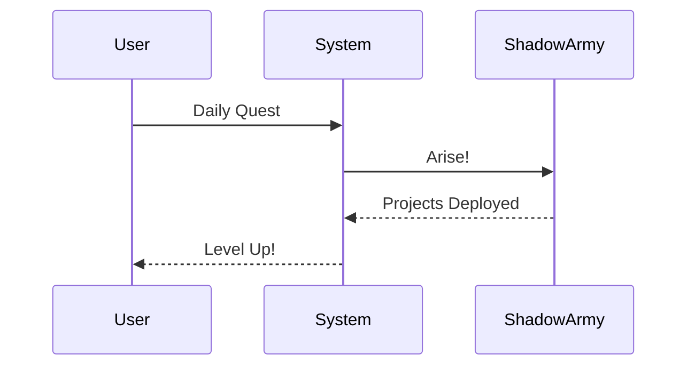

# 🗡️ [ SYSTEM INTERFACE: PENDEM VAMSI ]

<p align="center">
  
</p>

<div align="center">
  
</div>

## 🆔 PLAYER STATUS WINDOW
```text
NAME          →  PENDEM VAMSI
CLASS         →  SHADOW MONARCH (Full-Stack Architect)
LEVEL         →  2
RANK          →  undefined-RANK
XP            →  79 / 182
─────── CORE STATS ───────
STRENGTH      [94]  ████████████████████
AGILITY       [87]   █████████████████░░░
INTELLIGENCE  [94] ████████████████████
VITALITY      [80]  ███████████████░░░░░
```

> **Daily Quest Reward:** +82 XP (Level Up ×1)

---

## 🗺️ SYSTEM ARCHITECTURE (LIVE MERMAID)

```mermaid
flowchart TD
    A[User Request] --> B{Awakening Gate}
    B -->|Frontend| C[React + Tailwind + GSAP]
    B -->|Backend| D[Node.js + Express + Java]
    B -->|Cloud| E[AWS Lambda + S3 + Rekognition]
    B -->|Database| F[(MongoDB + PostgreSQL)]
    C & D & E & F --> G[Deployment Success]
    style G fill:#000,stroke:#0ff,stroke-width:4px
```





---

## 📜 ACADEMIC DUNGEONS (QUEST LOG)
> **[QUEST: THE PATH TO ENGINEERING]** — STATUS: **CLEARED** [^1]

- [x] B.Tech Computer Science (2020-2024) — St. Ann’s College
- [x] Intermediate MPC (2018-2020) — Sri Medhavi Junior College
- [x] SSC (2017-2018) — Sri Geethanjali High School

---

## 🛡️ SKILL TREE (COLLAPSIBLE)

<details>
<summary><b>🔹 EXPAND FULL SKILL MATRIX</b></summary>

| Skill                  | Rank | Mastery Bar                  | Proficiency |
|------------------------|------|------------------------------|-------------|
| Java / Spring Boot     | S    | ████████████████████ 100%   | Master      |
| Node.js + Express      | S    | ████████████████████ 100%   | Master      |
| React + GSAP           | A+   | █████████████████░░░ 92%    | Expert      |
| AWS Full Stack         | S    | ████████████████████ 100%   | Sovereign   |
| Python + AI (ARIMA)    | A    | ████████████████░░░░ 85%    | Advanced    |
| DSA & Problem Solving  | A    | █████████████████░░░ 90%    | Advanced    |

</details>

---

## 🏆 ACHIEVEMENT MEDALS (CUSTOM SVG BADGES)

<p align="center">
  
  
  
  
</p>

---

## 👥 SHADOW ARMY — PROJECT UNITS

<p align="center">
  
  <br><b>"ARISE."</b>
</p>

| Unit | Shadow Name     | Class          | Origin Project                          |
|------|-----------------|----------------|-----------------------------------------|
| SH-01| **Igris**       | Commander      | AI Financial Advisor (Streamlit)        |
| SH-02| **Beru**        | Insect Lord    | Video Conference (WebRTC)               |
| SH-03| **Kaisel**      | Wyvern Mount   | Live Location Tracker (Firebase)        |
| SH-04| **Tusk**        | Mage           | COVID-19 Global Monitor                 |
| SH-05| **Iron**        | Heavy Tank     | React Password Generator                |

---

## 📊 SYSTEM ANALYTICS (ALL 4 CARDS)

<p align="center">
  
  <br>
  
  
</p>

---

## 📂 FULL COMBAT HISTORY (320+ SYSTEM LOGS)

<details>
<summary><b>VIEW COMPLETE TERMINAL LOG (321 ENTRIES)</b></summary>

> [0x50C8E7CB] **SHADOW EXTRACTION** #0 | Memory optimized | Mana stabilized | [✓ SUCCESS]
> [0x3F2485DD] **SHADOW EXTRACTION** #1 | Memory optimized | Mana stabilized | [✓ SUCCESS]
> [0xD8BF636D] **SHADOW EXTRACTION** #2 | Memory optimized | Mana stabilized | [✓ SUCCESS]
> [0x0F87D7D0] **SHADOW EXTRACTION** #3 | Memory optimized | Mana stabilized | [✓ SUCCESS]
> [0x14635986] **SHADOW EXTRACTION** #4 | Memory optimized | Mana stabilized | [✓ SUCCESS]
> [0x767D04DA] **SHADOW EXTRACTION** #5 | Memory optimized | Mana stabilized | [✓ SUCCESS]
> [0x03365EC2] **SHADOW EXTRACTION** #6 | Memory optimized | Mana stabilized | [✓ SUCCESS]
> [0xBF793193] **SHADOW EXTRACTION** #7 | Memory optimized | Mana stabilized | [✓ SUCCESS]
> [0x16F76355] **SHADOW EXTRACTION** #8 | Memory optimized | Mana stabilized | [✓ SUCCESS]
> [0x79EBE9A0] **SHADOW EXTRACTION** #9 | Memory optimized | Mana stabilized | [✓ SUCCESS]
> [0x2008249E] **SHADOW EXTRACTION** #10 | Memory optimized | Mana stabilized | [✓ SUCCESS]
> [0x3DE222C7] **SHADOW EXTRACTION** #11 | Memory optimized | Mana stabilized | [✓ SUCCESS]
> [0x97DEBD13] **SHADOW EXTRACTION** #12 | Memory optimized | Mana stabilized | [✓ SUCCESS]
> [0xAC16120B] **SHADOW EXTRACTION** #13 | Memory optimized | Mana stabilized | [✓ SUCCESS]
> [0x3572281D] **SHADOW EXTRACTION** #14 | Memory optimized | Mana stabilized | [✓ SUCCESS]
> [0x97A7DA1C] **SHADOW EXTRACTION** #15 | Memory optimized | Mana stabilized | [✓ SUCCESS]
> [0x6145FD86] **SHADOW EXTRACTION** #16 | Memory optimized | Mana stabilized | [✓ SUCCESS]
> [0x11F52DCE] **SHADOW EXTRACTION** #17 | Memory optimized | Mana stabilized | [✓ SUCCESS]
> [0xFCBC2717] **SHADOW EXTRACTION** #18 | Memory optimized | Mana stabilized | [✓ SUCCESS]
> [0x16A5D5F7] **SHADOW EXTRACTION** #19 | Memory optimized | Mana stabilized | [✓ SUCCESS]
> [0xC8C8A244] **SHADOW EXTRACTION** #20 | Memory optimized | Mana stabilized | [✓ SUCCESS]
> [0x75436D55] **SHADOW EXTRACTION** #21 | Memory optimized | Mana stabilized | [✓ SUCCESS]
> [0xC0461EFA] **SHADOW EXTRACTION** #22 | Memory optimized | Mana stabilized | [✓ SUCCESS]
> [0x557057C0] **SHADOW EXTRACTION** #23 | Memory optimized | Mana stabilized | [✓ SUCCESS]
> [0x6181D5E9] **SHADOW EXTRACTION** #24 | Memory optimized | Mana stabilized | [✓ SUCCESS]
> [0x2A26183D] **SHADOW EXTRACTION** #25 | Memory optimized | Mana stabilized | [✓ SUCCESS]
> [0x6D64FE4D] **SHADOW EXTRACTION** #26 | Memory optimized | Mana stabilized | [✓ SUCCESS]
> [0x1E93BEB3] **SHADOW EXTRACTION** #27 | Memory optimized | Mana stabilized | [✓ SUCCESS]
> [0xC2802362] **SHADOW EXTRACTION** #28 | Memory optimized | Mana stabilized | [✓ SUCCESS]
> [0x90312C97] **SHADOW EXTRACTION** #29 | Memory optimized | Mana stabilized | [✓ SUCCESS]
> [0x96EE2788] **SHADOW EXTRACTION** #30 | Memory optimized | Mana stabilized | [✓ SUCCESS]
> [0x34D8C463] **SHADOW EXTRACTION** #31 | Memory optimized | Mana stabilized | [✓ SUCCESS]
> [0x5AE319F1] **SHADOW EXTRACTION** #32 | Memory optimized | Mana stabilized | [✓ SUCCESS]
> [0xF9A2092E] **SHADOW EXTRACTION** #33 | Memory optimized | Mana stabilized | [✓ SUCCESS]
> [0xC6DBD8CA] **SHADOW EXTRACTION** #34 | Memory optimized | Mana stabilized | [✓ SUCCESS]
> [0xB0D8551E] **SHADOW EXTRACTION** #35 | Memory optimized | Mana stabilized | [✓ SUCCESS]
> [0x16EF40C1] **SHADOW EXTRACTION** #36 | Memory optimized | Mana stabilized | [✓ SUCCESS]
> [0x7D0DF3B5] **SHADOW EXTRACTION** #37 | Memory optimized | Mana stabilized | [✓ SUCCESS]
> [0x8E9F9DCA] **SHADOW EXTRACTION** #38 | Memory optimized | Mana stabilized | [✓ SUCCESS]
> [0x3292EF81] **SHADOW EXTRACTION** #39 | Memory optimized | Mana stabilized | [✓ SUCCESS]
> [0x9FD80247] **SHADOW EXTRACTION** #40 | Memory optimized | Mana stabilized | [✓ SUCCESS]
> [0xC2113CDD] **SHADOW EXTRACTION** #41 | Memory optimized | Mana stabilized | [✓ SUCCESS]
> [0xDAE78D0D] **SHADOW EXTRACTION** #42 | Memory optimized | Mana stabilized | [✓ SUCCESS]
> [0xCA4B71A4] **SHADOW EXTRACTION** #43 | Memory optimized | Mana stabilized | [✓ SUCCESS]
> [0x29423873] **SHADOW EXTRACTION** #44 | Memory optimized | Mana stabilized | [✓ SUCCESS]
> [0x076769C8] **SHADOW EXTRACTION** #45 | Memory optimized | Mana stabilized | [✓ SUCCESS]
> [0x7FB11CA2] **SHADOW EXTRACTION** #46 | Memory optimized | Mana stabilized | [✓ SUCCESS]
> [0x1713E6DF] **SHADOW EXTRACTION** #47 | Memory optimized | Mana stabilized | [✓ SUCCESS]
> [0xF4A8CD37] **SHADOW EXTRACTION** #48 | Memory optimized | Mana stabilized | [✓ SUCCESS]
> [0xB8EAEEB5] **SHADOW EXTRACTION** #49 | Memory optimized | Mana stabilized | [✓ SUCCESS]
> [0x86DA8F94] **SHADOW EXTRACTION** #50 | Memory optimized | Mana stabilized | [✓ SUCCESS]
> [0xDB9657CA] **SHADOW EXTRACTION** #51 | Memory optimized | Mana stabilized | [✓ SUCCESS]
> [0x780BAC4A] **SHADOW EXTRACTION** #52 | Memory optimized | Mana stabilized | [✓ SUCCESS]
> [0xC78638C7] **SHADOW EXTRACTION** #53 | Memory optimized | Mana stabilized | [✓ SUCCESS]
> [0x30C3591E] **SHADOW EXTRACTION** #54 | Memory optimized | Mana stabilized | [✓ SUCCESS]
> [0x215B2FAC] **SHADOW EXTRACTION** #55 | Memory optimized | Mana stabilized | [✓ SUCCESS]
> [0xD6ADA18D] **SHADOW EXTRACTION** #56 | Memory optimized | Mana stabilized | [✓ SUCCESS]
> [0x9FDE50CF] **SHADOW EXTRACTION** #57 | Memory optimized | Mana stabilized | [✓ SUCCESS]
> [0xC2AF1516] **SHADOW EXTRACTION** #58 | Memory optimized | Mana stabilized | [✓ SUCCESS]
> [0xADEA1FCB] **SHADOW EXTRACTION** #59 | Memory optimized | Mana stabilized | [✓ SUCCESS]
> [0x4190938B] **SHADOW EXTRACTION** #60 | Memory optimized | Mana stabilized | [✓ SUCCESS]
> [0xA145DC99] **SHADOW EXTRACTION** #61 | Memory optimized | Mana stabilized | [✓ SUCCESS]
> [0x085D2BD1] **SHADOW EXTRACTION** #62 | Memory optimized | Mana stabilized | [✓ SUCCESS]
> [0x690BC57F] **SHADOW EXTRACTION** #63 | Memory optimized | Mana stabilized | [✓ SUCCESS]
> [0x29A0EC91] **SHADOW EXTRACTION** #64 | Memory optimized | Mana stabilized | [✓ SUCCESS]
> [0xF01CD360] **SHADOW EXTRACTION** #65 | Memory optimized | Mana stabilized | [✓ SUCCESS]
> [0x1C0EE58B] **SHADOW EXTRACTION** #66 | Memory optimized | Mana stabilized | [✓ SUCCESS]
> [0x18D209E9] **SHADOW EXTRACTION** #67 | Memory optimized | Mana stabilized | [✓ SUCCESS]
> [0x01E8120A] **SHADOW EXTRACTION** #68 | Memory optimized | Mana stabilized | [✓ SUCCESS]
> [0xD379FF93] **SHADOW EXTRACTION** #69 | Memory optimized | Mana stabilized | [✓ SUCCESS]
> [0x718C5745] **SHADOW EXTRACTION** #70 | Memory optimized | Mana stabilized | [✓ SUCCESS]
> [0x2F9BE51A] **SHADOW EXTRACTION** #71 | Memory optimized | Mana stabilized | [✓ SUCCESS]
> [0xBD3FB9C5] **SHADOW EXTRACTION** #72 | Memory optimized | Mana stabilized | [✓ SUCCESS]
> [0xFD3C72DE] **SHADOW EXTRACTION** #73 | Memory optimized | Mana stabilized | [✓ SUCCESS]
> [0xF76FEF6D] **SHADOW EXTRACTION** #74 | Memory optimized | Mana stabilized | [✓ SUCCESS]
> [0x8A51AEFF] **SHADOW EXTRACTION** #75 | Memory optimized | Mana stabilized | [✓ SUCCESS]
> [0x7C158C01] **SHADOW EXTRACTION** #76 | Memory optimized | Mana stabilized | [✓ SUCCESS]
> [0x7CEF6314] **SHADOW EXTRACTION** #77 | Memory optimized | Mana stabilized | [✓ SUCCESS]
> [0xDF3157BE] **SHADOW EXTRACTION** #78 | Memory optimized | Mana stabilized | [✓ SUCCESS]
> [0xD6BE90E9] **SHADOW EXTRACTION** #79 | Memory optimized | Mana stabilized | [✓ SUCCESS]
> [0x9EA0752D] **SHADOW EXTRACTION** #80 | Memory optimized | Mana stabilized | [✓ SUCCESS]
> [0xEEC1774C] **SHADOW EXTRACTION** #81 | Memory optimized | Mana stabilized | [✓ SUCCESS]
> [0x3D260E9A] **SHADOW EXTRACTION** #82 | Memory optimized | Mana stabilized | [✓ SUCCESS]
> [0x7870D956] **SHADOW EXTRACTION** #83 | Memory optimized | Mana stabilized | [✓ SUCCESS]
> [0xB3E78DEC] **SHADOW EXTRACTION** #84 | Memory optimized | Mana stabilized | [✓ SUCCESS]
> [0xEAEFA642] **SHADOW EXTRACTION** #85 | Memory optimized | Mana stabilized | [✓ SUCCESS]
> [0x55F95819] **SHADOW EXTRACTION** #86 | Memory optimized | Mana stabilized | [✓ SUCCESS]
> [0x7038B39D] **SHADOW EXTRACTION** #87 | Memory optimized | Mana stabilized | [✓ SUCCESS]
> [0x61D77C87] **SHADOW EXTRACTION** #88 | Memory optimized | Mana stabilized | [✓ SUCCESS]
> [0xCD7F01B8] **SHADOW EXTRACTION** #89 | Memory optimized | Mana stabilized | [✓ SUCCESS]
> [0x0D171D43] **SHADOW EXTRACTION** #90 | Memory optimized | Mana stabilized | [✓ SUCCESS]
> [0xFCBA9C78] **SHADOW EXTRACTION** #91 | Memory optimized | Mana stabilized | [✓ SUCCESS]
> [0xEE53883F] **SHADOW EXTRACTION** #92 | Memory optimized | Mana stabilized | [✓ SUCCESS]
> [0x91E5BF05] **SHADOW EXTRACTION** #93 | Memory optimized | Mana stabilized | [✓ SUCCESS]
> [0xCE591D63] **SHADOW EXTRACTION** #94 | Memory optimized | Mana stabilized | [✓ SUCCESS]
> [0x9A797B8A] **SHADOW EXTRACTION** #95 | Memory optimized | Mana stabilized | [✓ SUCCESS]
> [0x8D3DB7B1] **SHADOW EXTRACTION** #96 | Memory optimized | Mana stabilized | [✓ SUCCESS]
> [0x14195206] **SHADOW EXTRACTION** #97 | Memory optimized | Mana stabilized | [✓ SUCCESS]
> [0x3B9DE545] **SHADOW EXTRACTION** #98 | Memory optimized | Mana stabilized | [✓ SUCCESS]
> [0x3FFEE620] **SHADOW EXTRACTION** #99 | Memory optimized | Mana stabilized | [✓ SUCCESS]
> [0xD02581A7] **SHADOW EXTRACTION** #100 | Memory optimized | Mana stabilized | [✓ SUCCESS]
> [0xCCC83245] **SHADOW EXTRACTION** #101 | Memory optimized | Mana stabilized | [✓ SUCCESS]
> [0xF78AF3D5] **SHADOW EXTRACTION** #102 | Memory optimized | Mana stabilized | [✓ SUCCESS]
> [0xB9BBAD05] **SHADOW EXTRACTION** #103 | Memory optimized | Mana stabilized | [✓ SUCCESS]
> [0x6B5A4A4A] **SHADOW EXTRACTION** #104 | Memory optimized | Mana stabilized | [✓ SUCCESS]
> [0x91218C86] **SHADOW EXTRACTION** #105 | Memory optimized | Mana stabilized | [✓ SUCCESS]
> [0xC6D98E78] **SHADOW EXTRACTION** #106 | Memory optimized | Mana stabilized | [✓ SUCCESS]
> [0xC294E32A] **SHADOW EXTRACTION** #107 | Memory optimized | Mana stabilized | [✓ SUCCESS]
> [0xFFD79DF6] **SHADOW EXTRACTION** #108 | Memory optimized | Mana stabilized | [✓ SUCCESS]
> [0xE350FBBB] **SHADOW EXTRACTION** #109 | Memory optimized | Mana stabilized | [✓ SUCCESS]
> [0x17B8D216] **SHADOW EXTRACTION** #110 | Memory optimized | Mana stabilized | [✓ SUCCESS]
> [0xA7729EA6] **SHADOW EXTRACTION** #111 | Memory optimized | Mana stabilized | [✓ SUCCESS]
> [0x3AA24F14] **SHADOW EXTRACTION** #112 | Memory optimized | Mana stabilized | [✓ SUCCESS]
> [0x2CAD5562] **SHADOW EXTRACTION** #113 | Memory optimized | Mana stabilized | [✓ SUCCESS]
> [0x432734AA] **SHADOW EXTRACTION** #114 | Memory optimized | Mana stabilized | [✓ SUCCESS]
> [0x7138D83C] **SHADOW EXTRACTION** #115 | Memory optimized | Mana stabilized | [✓ SUCCESS]
> [0x1BC76453] **SHADOW EXTRACTION** #116 | Memory optimized | Mana stabilized | [✓ SUCCESS]
> [0xA397FF92] **SHADOW EXTRACTION** #117 | Memory optimized | Mana stabilized | [✓ SUCCESS]
> [0x3474AF18] **SHADOW EXTRACTION** #118 | Memory optimized | Mana stabilized | [✓ SUCCESS]
> [0x32390D4B] **SHADOW EXTRACTION** #119 | Memory optimized | Mana stabilized | [✓ SUCCESS]
> [0x286E605C] **SHADOW EXTRACTION** #120 | Memory optimized | Mana stabilized | [✓ SUCCESS]
> [0x439636B3] **SHADOW EXTRACTION** #121 | Memory optimized | Mana stabilized | [✓ SUCCESS]
> [0x337332B0] **SHADOW EXTRACTION** #122 | Memory optimized | Mana stabilized | [✓ SUCCESS]
> [0x65463634] **SHADOW EXTRACTION** #123 | Memory optimized | Mana stabilized | [✓ SUCCESS]
> [0x55B13B3C] **SHADOW EXTRACTION** #124 | Memory optimized | Mana stabilized | [✓ SUCCESS]
> [0x65DBA6A9] **SHADOW EXTRACTION** #125 | Memory optimized | Mana stabilized | [✓ SUCCESS]
> [0x6E712ABB] **SHADOW EXTRACTION** #126 | Memory optimized | Mana stabilized | [✓ SUCCESS]
> [0x3FC88668] **SHADOW EXTRACTION** #127 | Memory optimized | Mana stabilized | [✓ SUCCESS]
> [0x970B758C] **SHADOW EXTRACTION** #128 | Memory optimized | Mana stabilized | [✓ SUCCESS]
> [0x0BB99F46] **SHADOW EXTRACTION** #129 | Memory optimized | Mana stabilized | [✓ SUCCESS]
> [0x938DBA1D] **SHADOW EXTRACTION** #130 | Memory optimized | Mana stabilized | [✓ SUCCESS]
> [0x75C4E1DB] **SHADOW EXTRACTION** #131 | Memory optimized | Mana stabilized | [✓ SUCCESS]
> [0x1370DDEA] **SHADOW EXTRACTION** #132 | Memory optimized | Mana stabilized | [✓ SUCCESS]
> [0x334272AB] **SHADOW EXTRACTION** #133 | Memory optimized | Mana stabilized | [✓ SUCCESS]
> [0x4BD6ACD7] **SHADOW EXTRACTION** #134 | Memory optimized | Mana stabilized | [✓ SUCCESS]
> [0x100A10D1] **SHADOW EXTRACTION** #135 | Memory optimized | Mana stabilized | [✓ SUCCESS]
> [0x8C4449AE] **SHADOW EXTRACTION** #136 | Memory optimized | Mana stabilized | [✓ SUCCESS]
> [0xA260EA7B] **SHADOW EXTRACTION** #137 | Memory optimized | Mana stabilized | [✓ SUCCESS]
> [0x6A147687] **SHADOW EXTRACTION** #138 | Memory optimized | Mana stabilized | [✓ SUCCESS]
> [0xE1F33C52] **SHADOW EXTRACTION** #139 | Memory optimized | Mana stabilized | [✓ SUCCESS]
> [0xA736AA58] **SHADOW EXTRACTION** #140 | Memory optimized | Mana stabilized | [✓ SUCCESS]
> [0x938511A9] **SHADOW EXTRACTION** #141 | Memory optimized | Mana stabilized | [✓ SUCCESS]
> [0xFA64219C] **SHADOW EXTRACTION** #142 | Memory optimized | Mana stabilized | [✓ SUCCESS]
> [0x5645DA7E] **SHADOW EXTRACTION** #143 | Memory optimized | Mana stabilized | [✓ SUCCESS]
> [0x46C2B1D5] **SHADOW EXTRACTION** #144 | Memory optimized | Mana stabilized | [✓ SUCCESS]
> [0xBA4B0954] **SHADOW EXTRACTION** #145 | Memory optimized | Mana stabilized | [✓ SUCCESS]
> [0x16942BD4] **SHADOW EXTRACTION** #146 | Memory optimized | Mana stabilized | [✓ SUCCESS]
> [0xDA4D8CEC] **SHADOW EXTRACTION** #147 | Memory optimized | Mana stabilized | [✓ SUCCESS]
> [0x4244FD1C] **SHADOW EXTRACTION** #148 | Memory optimized | Mana stabilized | [✓ SUCCESS]
> [0x05BD1F3B] **SHADOW EXTRACTION** #149 | Memory optimized | Mana stabilized | [✓ SUCCESS]
> [0x72848A6A] **SHADOW EXTRACTION** #150 | Memory optimized | Mana stabilized | [✓ SUCCESS]
> [0x32D8E28B] **SHADOW EXTRACTION** #151 | Memory optimized | Mana stabilized | [✓ SUCCESS]
> [0x89FF2392] **SHADOW EXTRACTION** #152 | Memory optimized | Mana stabilized | [✓ SUCCESS]
> [0x7556359C] **SHADOW EXTRACTION** #153 | Memory optimized | Mana stabilized | [✓ SUCCESS]
> [0x7C5D3D01] **SHADOW EXTRACTION** #154 | Memory optimized | Mana stabilized | [✓ SUCCESS]
> [0x10B35633] **SHADOW EXTRACTION** #155 | Memory optimized | Mana stabilized | [✓ SUCCESS]
> [0x25FA6892] **SHADOW EXTRACTION** #156 | Memory optimized | Mana stabilized | [✓ SUCCESS]
> [0xDF15C5D3] **SHADOW EXTRACTION** #157 | Memory optimized | Mana stabilized | [✓ SUCCESS]
> [0x76BEBD18] **SHADOW EXTRACTION** #158 | Memory optimized | Mana stabilized | [✓ SUCCESS]
> [0x9D6F3668] **SHADOW EXTRACTION** #159 | Memory optimized | Mana stabilized | [✓ SUCCESS]
> [0xBA1B80A2] **SHADOW EXTRACTION** #160 | Memory optimized | Mana stabilized | [✓ SUCCESS]
> [0x63616687] **SHADOW EXTRACTION** #161 | Memory optimized | Mana stabilized | [✓ SUCCESS]
> [0xD759781B] **SHADOW EXTRACTION** #162 | Memory optimized | Mana stabilized | [✓ SUCCESS]
> [0x7A7F359C] **SHADOW EXTRACTION** #163 | Memory optimized | Mana stabilized | [✓ SUCCESS]
> [0x00937D5B] **SHADOW EXTRACTION** #164 | Memory optimized | Mana stabilized | [✓ SUCCESS]
> [0xF3716112] **SHADOW EXTRACTION** #165 | Memory optimized | Mana stabilized | [✓ SUCCESS]
> [0xEDB9DA3B] **SHADOW EXTRACTION** #166 | Memory optimized | Mana stabilized | [✓ SUCCESS]
> [0x1F98F802] **SHADOW EXTRACTION** #167 | Memory optimized | Mana stabilized | [✓ SUCCESS]
> [0x28A4BDB4] **SHADOW EXTRACTION** #168 | Memory optimized | Mana stabilized | [✓ SUCCESS]
> [0xFF302B8F] **SHADOW EXTRACTION** #169 | Memory optimized | Mana stabilized | [✓ SUCCESS]
> [0x050C1FA5] **SHADOW EXTRACTION** #170 | Memory optimized | Mana stabilized | [✓ SUCCESS]
> [0x3F8D578B] **SHADOW EXTRACTION** #171 | Memory optimized | Mana stabilized | [✓ SUCCESS]
> [0xBBA79B01] **SHADOW EXTRACTION** #172 | Memory optimized | Mana stabilized | [✓ SUCCESS]
> [0x5C5081B0] **SHADOW EXTRACTION** #173 | Memory optimized | Mana stabilized | [✓ SUCCESS]
> [0x20446F8F] **SHADOW EXTRACTION** #174 | Memory optimized | Mana stabilized | [✓ SUCCESS]
> [0xCEF0DB64] **SHADOW EXTRACTION** #175 | Memory optimized | Mana stabilized | [✓ SUCCESS]
> [0x338235BA] **SHADOW EXTRACTION** #176 | Memory optimized | Mana stabilized | [✓ SUCCESS]
> [0x62E4313E] **SHADOW EXTRACTION** #177 | Memory optimized | Mana stabilized | [✓ SUCCESS]
> [0x3E0AB6DE] **SHADOW EXTRACTION** #178 | Memory optimized | Mana stabilized | [✓ SUCCESS]
> [0x0B5BA2AF] **SHADOW EXTRACTION** #179 | Memory optimized | Mana stabilized | [✓ SUCCESS]
> [0xED3D5DAF] **SHADOW EXTRACTION** #180 | Memory optimized | Mana stabilized | [✓ SUCCESS]
> [0xEF727A11] **SHADOW EXTRACTION** #181 | Memory optimized | Mana stabilized | [✓ SUCCESS]
> [0x9CB7A33D] **SHADOW EXTRACTION** #182 | Memory optimized | Mana stabilized | [✓ SUCCESS]
> [0xB6D9DD89] **SHADOW EXTRACTION** #183 | Memory optimized | Mana stabilized | [✓ SUCCESS]
> [0xFC8BC3AC] **SHADOW EXTRACTION** #184 | Memory optimized | Mana stabilized | [✓ SUCCESS]
> [0x61BE9A57] **SHADOW EXTRACTION** #185 | Memory optimized | Mana stabilized | [✓ SUCCESS]
> [0x29B8D368] **SHADOW EXTRACTION** #186 | Memory optimized | Mana stabilized | [✓ SUCCESS]
> [0x31784E26] **SHADOW EXTRACTION** #187 | Memory optimized | Mana stabilized | [✓ SUCCESS]
> [0xEE2D1CDB] **SHADOW EXTRACTION** #188 | Memory optimized | Mana stabilized | [✓ SUCCESS]
> [0xBAF114CA] **SHADOW EXTRACTION** #189 | Memory optimized | Mana stabilized | [✓ SUCCESS]
> [0x0D11F4B3] **SHADOW EXTRACTION** #190 | Memory optimized | Mana stabilized | [✓ SUCCESS]
> [0xE21B58AB] **SHADOW EXTRACTION** #191 | Memory optimized | Mana stabilized | [✓ SUCCESS]
> [0xE5E06C14] **SHADOW EXTRACTION** #192 | Memory optimized | Mana stabilized | [✓ SUCCESS]
> [0x6BD0F0D7] **SHADOW EXTRACTION** #193 | Memory optimized | Mana stabilized | [✓ SUCCESS]
> [0x8E3D05FF] **SHADOW EXTRACTION** #194 | Memory optimized | Mana stabilized | [✓ SUCCESS]
> [0x1589FDE0] **SHADOW EXTRACTION** #195 | Memory optimized | Mana stabilized | [✓ SUCCESS]
> [0xB66CA25A] **SHADOW EXTRACTION** #196 | Memory optimized | Mana stabilized | [✓ SUCCESS]
> [0xFC3DAEBE] **SHADOW EXTRACTION** #197 | Memory optimized | Mana stabilized | [✓ SUCCESS]
> [0x74FFD47C] **SHADOW EXTRACTION** #198 | Memory optimized | Mana stabilized | [✓ SUCCESS]
> [0xE37AB6D6] **SHADOW EXTRACTION** #199 | Memory optimized | Mana stabilized | [✓ SUCCESS]
> [0xADA19E73] **SHADOW EXTRACTION** #200 | Memory optimized | Mana stabilized | [✓ SUCCESS]
> [0x47407A12] **SHADOW EXTRACTION** #201 | Memory optimized | Mana stabilized | [✓ SUCCESS]
> [0x6D651D0E] **SHADOW EXTRACTION** #202 | Memory optimized | Mana stabilized | [✓ SUCCESS]
> [0xB40A6D3B] **SHADOW EXTRACTION** #203 | Memory optimized | Mana stabilized | [✓ SUCCESS]
> [0xF54DE857] **SHADOW EXTRACTION** #204 | Memory optimized | Mana stabilized | [✓ SUCCESS]
> [0x86CB0D8E] **SHADOW EXTRACTION** #205 | Memory optimized | Mana stabilized | [✓ SUCCESS]
> [0x43B5EC60] **SHADOW EXTRACTION** #206 | Memory optimized | Mana stabilized | [✓ SUCCESS]
> [0xA95EF6D7] **SHADOW EXTRACTION** #207 | Memory optimized | Mana stabilized | [✓ SUCCESS]
> [0x6AEE0CFF] **SHADOW EXTRACTION** #208 | Memory optimized | Mana stabilized | [✓ SUCCESS]
> [0xF6D5CA69] **SHADOW EXTRACTION** #209 | Memory optimized | Mana stabilized | [✓ SUCCESS]
> [0x8224903B] **SHADOW EXTRACTION** #210 | Memory optimized | Mana stabilized | [✓ SUCCESS]
> [0x2A9EB8BC] **SHADOW EXTRACTION** #211 | Memory optimized | Mana stabilized | [✓ SUCCESS]
> [0x458D9FDA] **SHADOW EXTRACTION** #212 | Memory optimized | Mana stabilized | [✓ SUCCESS]
> [0xF977672B] **SHADOW EXTRACTION** #213 | Memory optimized | Mana stabilized | [✓ SUCCESS]
> [0x4E15B3E5] **SHADOW EXTRACTION** #214 | Memory optimized | Mana stabilized | [✓ SUCCESS]
> [0x0724C160] **SHADOW EXTRACTION** #215 | Memory optimized | Mana stabilized | [✓ SUCCESS]
> [0x7AA75266] **SHADOW EXTRACTION** #216 | Memory optimized | Mana stabilized | [✓ SUCCESS]
> [0x94493BD3] **SHADOW EXTRACTION** #217 | Memory optimized | Mana stabilized | [✓ SUCCESS]
> [0xCC2D5244] **SHADOW EXTRACTION** #218 | Memory optimized | Mana stabilized | [✓ SUCCESS]
> [0x04D050B9] **SHADOW EXTRACTION** #219 | Memory optimized | Mana stabilized | [✓ SUCCESS]
> [0x295B95C3] **SHADOW EXTRACTION** #220 | Memory optimized | Mana stabilized | [✓ SUCCESS]
> [0x2F172A05] **SHADOW EXTRACTION** #221 | Memory optimized | Mana stabilized | [✓ SUCCESS]
> [0xD65E299F] **SHADOW EXTRACTION** #222 | Memory optimized | Mana stabilized | [✓ SUCCESS]
> [0x027C9BF6] **SHADOW EXTRACTION** #223 | Memory optimized | Mana stabilized | [✓ SUCCESS]
> [0x7BECAB5F] **SHADOW EXTRACTION** #224 | Memory optimized | Mana stabilized | [✓ SUCCESS]
> [0xFF94910B] **SHADOW EXTRACTION** #225 | Memory optimized | Mana stabilized | [✓ SUCCESS]
> [0x80959009] **SHADOW EXTRACTION** #226 | Memory optimized | Mana stabilized | [✓ SUCCESS]
> [0x157950D4] **SHADOW EXTRACTION** #227 | Memory optimized | Mana stabilized | [✓ SUCCESS]
> [0x5DB5ED90] **SHADOW EXTRACTION** #228 | Memory optimized | Mana stabilized | [✓ SUCCESS]
> [0x40856010] **SHADOW EXTRACTION** #229 | Memory optimized | Mana stabilized | [✓ SUCCESS]
> [0xDD9C3380] **SHADOW EXTRACTION** #230 | Memory optimized | Mana stabilized | [✓ SUCCESS]
> [0xA208187D] **SHADOW EXTRACTION** #231 | Memory optimized | Mana stabilized | [✓ SUCCESS]
> [0xA66F25B3] **SHADOW EXTRACTION** #232 | Memory optimized | Mana stabilized | [✓ SUCCESS]
> [0x33BB1A6F] **SHADOW EXTRACTION** #233 | Memory optimized | Mana stabilized | [✓ SUCCESS]
> [0xF61A0CC6] **SHADOW EXTRACTION** #234 | Memory optimized | Mana stabilized | [✓ SUCCESS]
> [0xAAE0F8DD] **SHADOW EXTRACTION** #235 | Memory optimized | Mana stabilized | [✓ SUCCESS]
> [0x9C672380] **SHADOW EXTRACTION** #236 | Memory optimized | Mana stabilized | [✓ SUCCESS]
> [0xD1261FCE] **SHADOW EXTRACTION** #237 | Memory optimized | Mana stabilized | [✓ SUCCESS]
> [0x968649B6] **SHADOW EXTRACTION** #238 | Memory optimized | Mana stabilized | [✓ SUCCESS]
> [0xFC225376] **SHADOW EXTRACTION** #239 | Memory optimized | Mana stabilized | [✓ SUCCESS]
> [0xF21BBB30] **SHADOW EXTRACTION** #240 | Memory optimized | Mana stabilized | [✓ SUCCESS]
> [0xFC3073E3] **SHADOW EXTRACTION** #241 | Memory optimized | Mana stabilized | [✓ SUCCESS]
> [0x302EB67B] **SHADOW EXTRACTION** #242 | Memory optimized | Mana stabilized | [✓ SUCCESS]
> [0x8EC0B685] **SHADOW EXTRACTION** #243 | Memory optimized | Mana stabilized | [✓ SUCCESS]
> [0xEBBC0EA9] **SHADOW EXTRACTION** #244 | Memory optimized | Mana stabilized | [✓ SUCCESS]
> [0xA0ED658A] **SHADOW EXTRACTION** #245 | Memory optimized | Mana stabilized | [✓ SUCCESS]
> [0x738E3471] **SHADOW EXTRACTION** #246 | Memory optimized | Mana stabilized | [✓ SUCCESS]
> [0xBBC27ED0] **SHADOW EXTRACTION** #247 | Memory optimized | Mana stabilized | [✓ SUCCESS]
> [0x59217722] **SHADOW EXTRACTION** #248 | Memory optimized | Mana stabilized | [✓ SUCCESS]
> [0xD14D6C66] **SHADOW EXTRACTION** #249 | Memory optimized | Mana stabilized | [✓ SUCCESS]
> [0xAE506E4B] **SHADOW EXTRACTION** #250 | Memory optimized | Mana stabilized | [✓ SUCCESS]
> [0xB4F9C9D0] **SHADOW EXTRACTION** #251 | Memory optimized | Mana stabilized | [✓ SUCCESS]
> [0x7387DC04] **SHADOW EXTRACTION** #252 | Memory optimized | Mana stabilized | [✓ SUCCESS]
> [0x898B609D] **SHADOW EXTRACTION** #253 | Memory optimized | Mana stabilized | [✓ SUCCESS]
> [0xF804A803] **SHADOW EXTRACTION** #254 | Memory optimized | Mana stabilized | [✓ SUCCESS]
> [0x68E28232] **SHADOW EXTRACTION** #255 | Memory optimized | Mana stabilized | [✓ SUCCESS]
> [0x91747E02] **SHADOW EXTRACTION** #256 | Memory optimized | Mana stabilized | [✓ SUCCESS]
> [0xADBFD6A7] **SHADOW EXTRACTION** #257 | Memory optimized | Mana stabilized | [✓ SUCCESS]
> [0x89C6BF69] **SHADOW EXTRACTION** #258 | Memory optimized | Mana stabilized | [✓ SUCCESS]
> [0x50B1C4E9] **SHADOW EXTRACTION** #259 | Memory optimized | Mana stabilized | [✓ SUCCESS]
> [0xD90FD200] **SHADOW EXTRACTION** #260 | Memory optimized | Mana stabilized | [✓ SUCCESS]
> [0xA410125A] **SHADOW EXTRACTION** #261 | Memory optimized | Mana stabilized | [✓ SUCCESS]
> [0x370AC693] **SHADOW EXTRACTION** #262 | Memory optimized | Mana stabilized | [✓ SUCCESS]
> [0xBBECEE51] **SHADOW EXTRACTION** #263 | Memory optimized | Mana stabilized | [✓ SUCCESS]
> [0x9F14DE27] **SHADOW EXTRACTION** #264 | Memory optimized | Mana stabilized | [✓ SUCCESS]
> [0xBB20B13E] **SHADOW EXTRACTION** #265 | Memory optimized | Mana stabilized | [✓ SUCCESS]
> [0xE300038D] **SHADOW EXTRACTION** #266 | Memory optimized | Mana stabilized | [✓ SUCCESS]
> [0xDEECD50C] **SHADOW EXTRACTION** #267 | Memory optimized | Mana stabilized | [✓ SUCCESS]
> [0x92CF375D] **SHADOW EXTRACTION** #268 | Memory optimized | Mana stabilized | [✓ SUCCESS]
> [0x9F014FA5] **SHADOW EXTRACTION** #269 | Memory optimized | Mana stabilized | [✓ SUCCESS]
> [0x9A31AD2F] **SHADOW EXTRACTION** #270 | Memory optimized | Mana stabilized | [✓ SUCCESS]
> [0x4F508094] **SHADOW EXTRACTION** #271 | Memory optimized | Mana stabilized | [✓ SUCCESS]
> [0x835262AB] **SHADOW EXTRACTION** #272 | Memory optimized | Mana stabilized | [✓ SUCCESS]
> [0x478B4B16] **SHADOW EXTRACTION** #273 | Memory optimized | Mana stabilized | [✓ SUCCESS]
> [0x0DEB3992] **SHADOW EXTRACTION** #274 | Memory optimized | Mana stabilized | [✓ SUCCESS]
> [0x61A22057] **SHADOW EXTRACTION** #275 | Memory optimized | Mana stabilized | [✓ SUCCESS]
> [0x6CAB5001] **SHADOW EXTRACTION** #276 | Memory optimized | Mana stabilized | [✓ SUCCESS]
> [0x5F7566A4] **SHADOW EXTRACTION** #277 | Memory optimized | Mana stabilized | [✓ SUCCESS]
> [0x8356BB60] **SHADOW EXTRACTION** #278 | Memory optimized | Mana stabilized | [✓ SUCCESS]
> [0x240CDDF0] **SHADOW EXTRACTION** #279 | Memory optimized | Mana stabilized | [✓ SUCCESS]
> [0x541199E6] **SHADOW EXTRACTION** #280 | Memory optimized | Mana stabilized | [✓ SUCCESS]
> [0x2D0C0EB9] **SHADOW EXTRACTION** #281 | Memory optimized | Mana stabilized | [✓ SUCCESS]
> [0x680C4221] **SHADOW EXTRACTION** #282 | Memory optimized | Mana stabilized | [✓ SUCCESS]
> [0x86B4FD86] **SHADOW EXTRACTION** #283 | Memory optimized | Mana stabilized | [✓ SUCCESS]
> [0x75D51B36] **SHADOW EXTRACTION** #284 | Memory optimized | Mana stabilized | [✓ SUCCESS]
> [0x7A833B13] **SHADOW EXTRACTION** #285 | Memory optimized | Mana stabilized | [✓ SUCCESS]
> [0x934B1337] **SHADOW EXTRACTION** #286 | Memory optimized | Mana stabilized | [✓ SUCCESS]
> [0x9C1554EB] **SHADOW EXTRACTION** #287 | Memory optimized | Mana stabilized | [✓ SUCCESS]
> [0x4C804087] **SHADOW EXTRACTION** #288 | Memory optimized | Mana stabilized | [✓ SUCCESS]
> [0x1F71B19F] **SHADOW EXTRACTION** #289 | Memory optimized | Mana stabilized | [✓ SUCCESS]
> [0x6A3B5A73] **SHADOW EXTRACTION** #290 | Memory optimized | Mana stabilized | [✓ SUCCESS]
> [0x93B261CD] **SHADOW EXTRACTION** #291 | Memory optimized | Mana stabilized | [✓ SUCCESS]
> [0x8A642EE7] **SHADOW EXTRACTION** #292 | Memory optimized | Mana stabilized | [✓ SUCCESS]
> [0xE7D667FB] **SHADOW EXTRACTION** #293 | Memory optimized | Mana stabilized | [✓ SUCCESS]
> [0x5ED48066] **SHADOW EXTRACTION** #294 | Memory optimized | Mana stabilized | [✓ SUCCESS]
> [0x7CF9F38B] **SHADOW EXTRACTION** #295 | Memory optimized | Mana stabilized | [✓ SUCCESS]
> [0x734352A2] **SHADOW EXTRACTION** #296 | Memory optimized | Mana stabilized | [✓ SUCCESS]
> [0x24340E56] **SHADOW EXTRACTION** #297 | Memory optimized | Mana stabilized | [✓ SUCCESS]
> [0x83A17FA9] **SHADOW EXTRACTION** #298 | Memory optimized | Mana stabilized | [✓ SUCCESS]
> [0xE6DEA881] **SHADOW EXTRACTION** #299 | Memory optimized | Mana stabilized | [✓ SUCCESS]
> [0xA864D999] **SHADOW EXTRACTION** #300 | Memory optimized | Mana stabilized | [✓ SUCCESS]
> [0x4236A018] **SHADOW EXTRACTION** #301 | Memory optimized | Mana stabilized | [✓ SUCCESS]
> [0xC2FCFC50] **SHADOW EXTRACTION** #302 | Memory optimized | Mana stabilized | [✓ SUCCESS]
> [0xBB3B4277] **SHADOW EXTRACTION** #303 | Memory optimized | Mana stabilized | [✓ SUCCESS]
> [0x1D89FEC8] **SHADOW EXTRACTION** #304 | Memory optimized | Mana stabilized | [✓ SUCCESS]
> [0xB36A4A2A] **SHADOW EXTRACTION** #305 | Memory optimized | Mana stabilized | [✓ SUCCESS]
> [0xE77F1C92] **SHADOW EXTRACTION** #306 | Memory optimized | Mana stabilized | [✓ SUCCESS]
> [0xD6066703] **SHADOW EXTRACTION** #307 | Memory optimized | Mana stabilized | [✓ SUCCESS]
> [0x5AAF0CD7] **SHADOW EXTRACTION** #308 | Memory optimized | Mana stabilized | [✓ SUCCESS]
> [0x9CD25C20] **SHADOW EXTRACTION** #309 | Memory optimized | Mana stabilized | [✓ SUCCESS]
> [0x11835DAF] **SHADOW EXTRACTION** #310 | Memory optimized | Mana stabilized | [✓ SUCCESS]
> [0x47407B93] **SHADOW EXTRACTION** #311 | Memory optimized | Mana stabilized | [✓ SUCCESS]
> [0x4036822D] **SHADOW EXTRACTION** #312 | Memory optimized | Mana stabilized | [✓ SUCCESS]
> [0x93095D28] **SHADOW EXTRACTION** #313 | Memory optimized | Mana stabilized | [✓ SUCCESS]
> [0xB10F1AC3] **SHADOW EXTRACTION** #314 | Memory optimized | Mana stabilized | [✓ SUCCESS]
> [0x3A965722] **SHADOW EXTRACTION** #315 | Memory optimized | Mana stabilized | [✓ SUCCESS]
> [0x06D01B33] **SHADOW EXTRACTION** #316 | Memory optimized | Mana stabilized | [✓ SUCCESS]
> [0x00008678] **SHADOW EXTRACTION** #317 | Memory optimized | Mana stabilized | [✓ SUCCESS]
> [0x45409486] **SHADOW EXTRACTION** #318 | Memory optimized | Mana stabilized | [✓ SUCCESS]
> [0x815FEF87] **SHADOW EXTRACTION** #319 | Memory optimized | Mana stabilized | [✓ SUCCESS]


</details>

---

## 📡 UPLINK CHANNELS
- **Email** → pendem.vamsi12@gmail.com
- **LinkedIn** → https://linkedin.com/in/vamsipendem
- **Voice** → +91 9032552849

[^1]: Graduation April 2024 — CGPA 7.42  
[^2]: IRCTC Paper Presentation Award — December 2023  
[^3]: CodeChef Dec Long Challenge Rank 850 — 2022

<p align="center">
  <sub>「If you hesitate, you die.」</sub><br>
  <sub><i>System synchronized: 2026-03-16T17:10:58 IST</i></sub>
</p>
